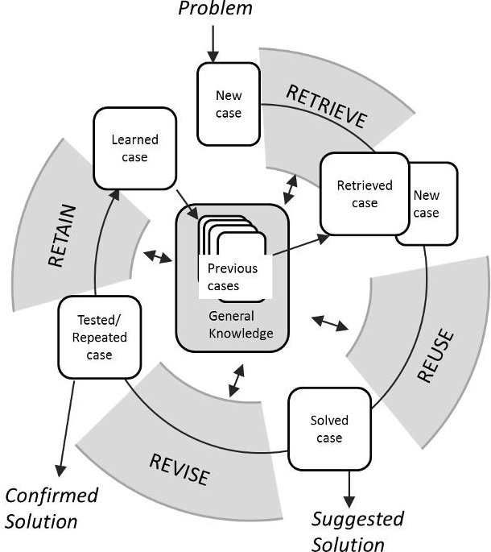
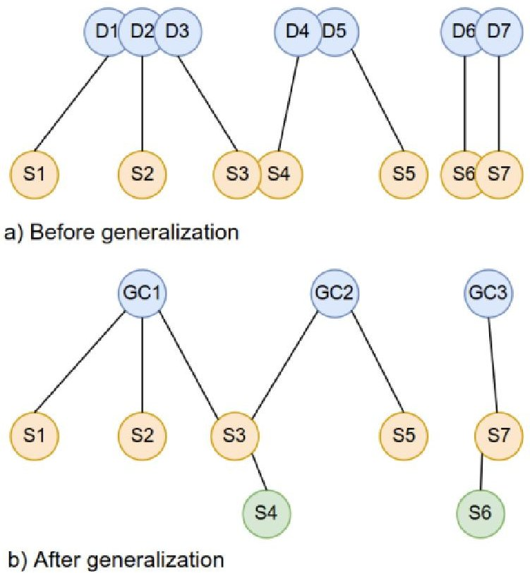
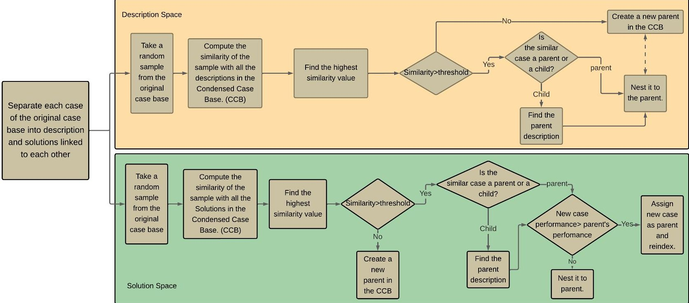
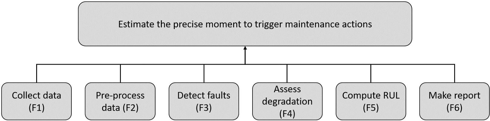
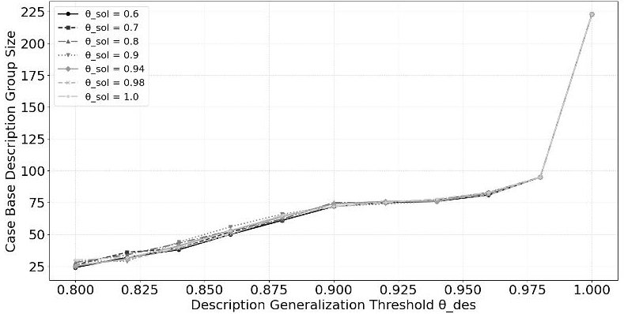
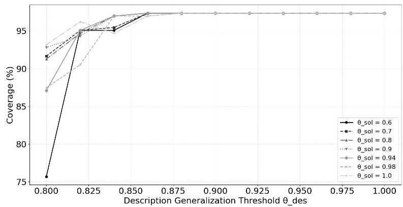
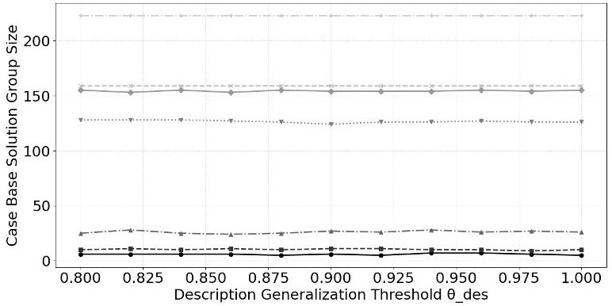
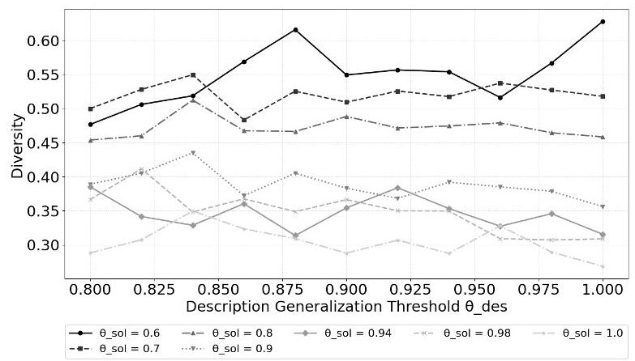

# Enhancing Case Retrieval in Case-Based Reasoning through improved solution space diversity and coverage

Emmanuel Muñoz-Peña

Escuela Ingeniería Mecatrónica

Tecnológico de Costa Rica

Cartago, Costa Rica

Wendi Ding

https://orcid.org/0009-0007-7429-8312

Juan José Montero-Jiménez

Federation ONERA - ISAE-SUPAERO - ENAC, Escuela Ingeniería Electromecánica

Université de Toulouse

Toulouse, Francia

Tecnológico de Costa Rica

https://orcid.org/0009-0009-6758-9431

Cartago, Costa Rica

Rob Vingerheods

Federation ONERA - ISAE-SUPAERO - ENAC,

https://orcid.org/0000-0002-3215-3736

Université de Toulouse

Toulouse, France

https://orcid.org/0000-0002-2339-4853

Abstract—Case-Based Reasoning (CBR) is a well-established methodology used in Systems Engineering as a decision support tool. However, in large case bases containing numerous similar cases, the retrieval process often yields solutions with low diversity, limiting the usefulness of the system in complex decisionmaking scenarios. This work introduces a novel approach to case base maintenance that enhances diversity while preserving retrieval effectiveness. The proposed method separates the description and solution spaces and applies a modified Condensed Nearest Neighbor (CNN) algorithm to generalize and reindex similar cases. Rather than deleting redundant cases, the approach integrates them into parent-child structures, maintaining a wide range of solutions while reducing redundancy in descriptions. A case study in predictive maintenance system design demonstrates the method's effectiveness. Results show that the case base size can be reduced by 82.14%, while improving the diversity of retrieved solutions by 132.96% and maintaining over 95% of the original coverage. This approach supports more robust and diverse retrieval outcomes, ultimately enhancing decision support capabilities. The method offers a scalable and efficient solution to the challenge of diversity in CBR, making it a valuable contribution to Systems Engineering and other domains where knowledge reuse is critical.

Index Terms—CBR, case retrieval, diversity, Condensed Nearest Neighbors

## I. INTRODUCTION

Case-Based Reasoning (CBR) has emerged as a prominent problem-solving methodology in domains where historical experiences can be leveraged to address new, yet similar, situations. Beyond its traditional applications, CBR has gained increasing relevance in the field of Systems Engineering, where it serves as a valuable decision support tool for assisting system architects in selecting suitable components for the

system architecture [1]. By facilitating the reuse of knowledge from previously developed systems, CBR contributes to improving efficiency, consistency, and the quality of design decisions in system development processes.

The CBR cycle consists of four main stages: retrieval, reuse, revision, and retention. As mentioned in [2], the outcomes of the reasoning process are largely influenced by the retrieval and reuse phases. Consequently, significant research efforts have been directed toward optimizing these two components to enhance overall system performance. Despite substantial advancements in case retrieval techniques, the predominant focus has been on improving retrieval accuracy and computational efficiency, often through the development of enhanced similarity measures, clustering strategies, and case base maintenance methods [3], [4].

Nevertheless, a fundamental limitation remains within conventional retrieval approaches: the overemphasis on similarity frequently leads to the selection of highly homogeneous cases, restricting the diversity of the retrieved solutions. This narrow solution space can hinder the effectiveness of CBR, particularly in complex problem domains where exploring a broader range of alternative solutions is desirable. Although recent studies have acknowledged the importance of diversityconscious retrieval, the development of systematic methodologies to promote diversity without compromising retrieval accuracy or efficiency remains an open challenge.

In response to this research gap, the present work proposes a novel approach that integrates Condensed Nearest Neighbor (CNN) techniques into the case retrieval process with the objective of enhancing diversity while simultaneously reducing case base redundancy. By decoupling the description and solution spaces and applying independent generalization processes to each, the proposed method aims to preserve both

the representativeness and richness of the solution space.

To evaluate the effectiveness of the proposed approach, a case study is conducted within the context of predictive maintenance system design, a domain where CBR has demonstrated significant potential as a decision support tool. This case study illustrates how the integration of CNN techniques can improve case retrieval diversity, contributing to more robust and adaptable decision-making processes.

The remainder of this paper is structured as follows: section II introduces the CBR reasoning paradigm and its theoretical foundations. In this section, a literature review of the techniques that have been applied to CBR to improve the diversity in retrieved cases is also included. Section III introduces Condensed Nearest Neighbors as a proposed technique for improving diversity in case retrieval. Section IV describes the case study, the implementation of the CNN approach, and the corresponding results and analysis. Finally, the Conclusions and future work perspectives section summarizes the main findings and outlines potential directions for future research.

## II. CASE-BASED REASONING BACKGROUND AND RELATED WORK

Case-Based Reasoning (CBR) is a reasoning paradigm that utilizes previous problem-solving experiences, represented as specific cases, to address new problems [5], [6]. The process of solving a new problem follows a structured, iterative procedure known as the CBR cycle [5], which consists of four main phases: retrieve, reuse, revise, and retain. These steps are illustrated in Figure 1.

The CBR cycle begins when a new problem arises. In the first phase, the system retrieves the most similar cases from a knowledge base that contains all previously encountered cases. To identify relevant matches, the new (target) case is compared

Fig. 1. Case-based reasoning cycle. Inspired on [7]

with existing ones using various similarity measures. In the reuse phase, the most similar case is proposed as a potential solution. If necessary, the solution is adapted to better fit the specifics of the target case. Once the solution is applied, the revision phase evaluates its effectiveness. If the problem is successfully resolved, the validated solution is stored during the retain phase, enriching the knowledge base for future problem-solving.

It is important to note that this study is part of a larger research initiative in which CBR is used in the concept phase of complex systems. In a preliminary research [1], an Ontology model for Predictive Maintenance Architecture and Design (OPMAD) was used to build the case base of a CBR decision support system. Although the results were promising, a diversity problem was encountered when retrieving suitable models to fulfill the diagnosis and prognosis function in the predictive maintenance system. This motivated the redirection of research efforts towards the improvement of case retrieval in CBR.

Traditionally, case retrieval involves comparing the attributes of the target case with those stored in the case base. When cases contain heterogeneous attributes, the similarity is often calculated separately for each attribute. These individual similarities are then combined using an amalgamation function that assigns weights to each to compute a global similarity score. As noted by [8], similarity can be classified into surface similarity and structural similarity. In surface similarity, each attribute is normalized to a value within the range [0,1], and the general similarity is calculated using predefined measures. Structural similarity, on the other hand, involves a more indepth comparison, relying heavily on domain knowledge. Although this approach is computationally more demanding, it often leads to the retrieval of more relevant cases.

Recent developments in case retrieval have expanded beyond the use of similarity measures to identify the most appropriate case. In some instances, the case considered most similar may prove unsuitable for adaptation to the new problem. One alternative approach is adaptation-guided retrieval, which evaluates cases not only based on their similarity but also on their potential usefulness in solving the current problem [9]. Another approach is diversity-conscious retrieval, which addresses the limitation that highly similar cases tend to be alike, offering a narrow range of potential solutions. By retrieving a diverse set of relevant cases, this method enables a broader exploration of possible solutions, thereby enhancing the effectiveness of traditional similarity-based retrieval.

Multiple research initiatives in Case-Based Reasoning (CBR) have been focused on improving case retrieval through enhanced similarity measures, clustering, and case base maintenance. However, the aspect of diversity in retrieval, which is critical for offering a broader set of possible solutions, remains relatively underexplored. [4] emphasizes the importance of case base organization and similarity assessment in improving retrieval effectiveness. While such strategies contribute to retrieval accuracy, they often fall short in promoting solution diversity, as they tend to favor cases most similar to the target.

Clustering has emerged as a common strategy to improve retrieval efficiency and structure. For instance, [10] applies K-means to cluster medical cases and then perform K-nearest neighbor (K-NN) search within the most relevant cluster. Their results show that clustering before retrieval improves both accuracy and computational efficiency compared to using only K-NN. Similarly, [11] uses K-means and Density-Based Spatial Clustering of Applications with Noise (DBSCAN) to discover latent behavioral patterns in physical activity data. These clusters are then used to guide CBR by storing and retrieving representative cases from each segment. [3] also explores the application of K-means for managing large-scale case bases.

The integration of learning models with clustering has also been explored. [12] proposes a method that distills adaptation knowledge from individual clusters to train Multiple Support Vector Regression (MSVR) engines. Hybrid weights, emphasizing high-density and high-similarity samples, are used to reduce outlier influence. Final solutions are generated by integrating the outputs of these engines, enabling more robust adaptation. A similar hybrid approach is presented by [13], who apply information gain for attribute reduction, followed by K-means clustering and a random forest model to determine the final solution.

In terms of case base maintenance and reduction, various strategies have been developed to ensure efficiency without sacrificing performance. The Weighting, Clustering, Outliers and Internal cases Detection (WCOID) method by [14] combines feature weighting, DBSCAN clustering, and outlier detection to reduce case base size while maintaining system competence. [15] introduces a rule-based method that replaces redundant cases with compact confidence rules, preserving generalization capacity. [16] present the Generalized Condensed Nearest Neighbor (GCNN) algorithm, which offers high accuracy with significantly reduced computational costs and performs well when combined with support vector machines. Additionally, [17] proposes an attribute reduction technique based on fuzzy rough sets and a heuristic value reduction algorithm for efficient case base maintenance.

Despite these contributions, diversity in CBR retrieval remains an open challenge. Most existing methods prioritize similarity, efficiency, or adaptation accuracy, often retrieving a narrow set of highly similar cases. To address this gap, this work proposes a novel approach to enhance diversity in case retrieval based on the implementation of Condensed Nearest Neighbors to reduce the size of the case base but attempting to keep the coverage of the solution space.

## III. A GENERALIZATION METHOD TO IMPROVE CASE RETRIEVAL

This section aims at explaining the proposed approach of this study to improve the case retrieval in CBR. It is done by the implementation of Condensed Nearest Neighbor (CNN) to reduce the case base size while preserving solution space coverage. This section is divided in two parts, a brief

introduction to CNN and the implementation process of CNN in CBR.

## A. Condensed Nearest Neighbors

In common CBR systems, the retrieval process aims to recover the most effective solutions for a given user query, and the overall system performance heavily depends on the quality of these retrieved cases. For this purpose, the K-NN algorithm has been widely used as the primary retrieval tool due to its ability to measure similarity by calculating the distance between the query and stored cases [18]. However, the efficiency of K-NN can be hindered by large case bases.

The Condensed Nearest Neighbor (CNN) algorithm is a data reduction technique designed to improve the efficiency of k-Nearest Neighbors (K-NN) classification by minimizing the size of the training set without significantly compromising accuracy. It iteratively builds a condensed subset of the original dataset by retaining only the instances necessary to correctly classify all training examples using a 1-NN classifier. Typically, the retained instances lie near decision boundaries, while redundant instances located within homogeneous regions are discarded [16].

In the context of case base diversification, the Condensed Nearest Neighbor (CNN) algorithm offers a promising approach due to its ability to reduce the size of the case base while preserving diversity [16]. By generalizing descriptions and re-indexing similar cases under a parent description, the algorithm effectively minimizes redundancy in the retrieval process. Simultaneously, diverse solutions are maintained through the generalization of the solution space, allowing for a richer set of alternatives linked to each parent case. This dual-level generalization enhances both the efficiency and representativeness of the case base.

The overall process is further illustrated in Figure 2 where it's observed a general case base where cases 1,2 and 3 share similar descriptions D1, D2 and D3, but with diverse solutions S1, S2 and S3. In this case, applying deletion based case base maintenance methods, Case 1 and Case 2 would be removed because they have similar descriptions but as a result, some degree of diversity of retrieved solutions would be lost.

During the retrieval process, if Case 3 and Case 4 are the most similar two cases to the query, the retrieval result would have S3 and S4 as solutions, which are very similar to each other and not desired.

Therefore, the separation of description and solution spaces is required for the maintenance of the case base to preserve the diversity while reducing redundant solutions. The method proposed makes a modification on the classical CNN method where:

- Rather than removing redundant cases, similar cases are integrated to a generalized case, with each individual cases stored as a subcase.

- Solutions are decoupled from the case descriptions but remain linked to their respective descriptions and are unaffected by the generalization of descriptions.

Fig. 2. Generalization process of the case base. Descriptions denoted by $ D_{i} $ Solutions by $ S_{j} $ and Generalized Cases as $ GC_{K} $

- A separate generalization process is applied to organize and manage the solutions independently.

## B. Implementation of CNN algorithm to improve case retrieval in CBR

To enable independent processing, a case-based memory structure is suggested, where the description and solution spaces are divided. Every space goes through a generalization and reindexing procedure after this separation. Similar descriptions or solutions are grouped and reindexed under a General Case (GC), also known as a parent object, during this process. By eliminating duplication and identifying commonalities between cases, this hierarchical structure makes retrieval and storage more effective.

The overall re-indexing and generalization process is illustrated in Figure 3. Each case is initially divided into description and solution groups. The algorithm then proceeds with a sampling phase, followed by similarity computation and comparison against the existing condensed case base. Finally, a generalization and re-indexing stage is performed, in which similar descriptions and solutions are assigned to parent or child objects. Solutions are subsequently re-indexed under their corresponding parent categories, as exemplified in Figure 2.

To implement the proposed algorithm, the case base attributes were organized into three categories: description, solution, and performance. Table I details the structure and composition of these attribute groups. Based on this separation, two new case bases were constructed: one containing the specification and description data for each case, and the

TABLE I

ATTRIBUTES IN EACH CASE WITH THE DESIGNED GROUP AND RANGES.

<table border="1"><tr><td colspan="2">Description Group</td></tr><tr><td>Attribute</td><td>Range</td></tr><tr><td>Task</td><td>{Health modelling, Fault feature extraction, Fault detection, Fault identification, Health assessment, One step future state forecast, Multiple steps future state forecast, Remaining useful life estimation.}</td></tr><tr><td>Case study type</td><td>{Rotary machines, Structures, Production lines, Reciprocating machines, Electrical components, Lubricants, Electromechanical systems, Optical devices, Energy cells and batteries, Unknown Item Type, Pipelines and ducts, Power transmission device}</td></tr><tr><td>Case study</td><td>String</td></tr><tr><td>Online/Offline</td><td>{Off-line, Online}</td></tr><tr><td>Input for the model</td><td>{Signals, Structure text-based, Text-based maintenance/operation logs, Time series}</td></tr><tr><td colspan="2">Solution Group</td></tr><tr><td>Model approach</td><td>{Multi model, Single model}</td></tr><tr><td>Model type</td><td>{Knowledge-based, Data-driven, Physics-based, Multiple-Data-driven}</td></tr><tr><td>Models</td><td>{LSTM (Long-Short Term Memory Neural Network), FFNN (feed-forward neural network), Kalman Filter, Fuzzy Inference System, ...}</td></tr><tr><td>Data preprocessing</td><td>{Yes, No}</td></tr><tr><td>Complementary notes</td><td>String</td></tr><tr><td>Publication identifier</td><td>String</td></tr><tr><td colspan="2">Performance Group</td></tr><tr><td>Performance indicator</td><td>{Error range, Mean accuracy, N/A, Score function, Probability, Reliability, Precision, Convergence, Correlation coefficient, Steady indicator, Standard deviation, Reaction time, Visual indicator, ...}</td></tr><tr><td>Performance</td><td>Double</td></tr><tr><td>Publication year</td><td>Integer</td></tr></table>

other containing the corresponding solution and performance information.

To enable consistent comparison across cases, all performance indicators were normalized. An aggregated performance score was then calculated by averaging the normalized indicators along with the publication year. This metric facilitated the comparison of cases using a single representative performance value.

Each case is represented as an object comprising a structured set of attributes that facilitate the management of linked description-solution pairs. The description object includes the original descriptive data, a list of nested subcases generated during the generalization process, a unique identifier, a state identifier for establishing hierarchical relationships, and a reference to its parent case. In addition to these elements, the solution object incorporates a performance indicator and a reference to the corresponding description, which may be updated during the reindexing phase.

Similarity within the description group is computed using predefined similarity tables for both the task type and the case study type attributes, capturing domain-specific relationships among categorical values. For the remaining attributes in both the description and the solution groups, the similarity is computed using the Levenshtein distance, which corresponds to

Fig. 3. Process for the generation of the Condensed Case Base

the minimal number of elementary edit operations (insertions, deletions, or substitutions) required to transform one substring into the other [19]. To derive an overall similarity score for each case, a weighted sum of individual attribute similarities is computed within each group. The algorithm then uses this aggregate score to compare the cases.

During generalization, new descriptions or solutions are compared against the existing condensed case base, producing a similarity score. The most similar case is then selected and compared with a predefined similarity threshold $ \left( \theta_{desc} \right) $ or $ \theta_{sol} $ If the score exceeds the threshold, the new case is linked as a subcase to the corresponding parent. Otherwise, it is treated as significantly different and added as a new parent case. For solution generalization, a performance-based evaluation is introduced, in which solutions with higher performance scores are promoted as parent cases. This ensures that the most effective solutions are prioritized during retrieval. A key advantage of this approach is that similarity assessments are not limited to parent cases; relationships with child cases are also considered. This enables a more comprehensive and organized reduction of the original case base while preserving diversity.

## IV. EXPERIMENTATION

This section aims at demonstrating the benefits of the implementation of condensed nearest neighbors in the CBR casa base reduction on a CBR case study. Predictive maintenance systems design has been selected due to the affinity and experience of the authors on the topic and its relevance in academia and industry.

## A. Case study: Predictive Maintenance Systems Design

Predictive maintenance is a strategy designed to monitor the health status of a system, detect early-stage faults, and anticipate future failures in order to trigger maintenance actions precisely when needed. This strategy is implemented through specialized systems whose fundamental objective is to determine the optimal timing for maintenance interventions. The core functionality of such systems is commonly divided into six sub-functions (Figure 4): data acquisition, data preprocessing, fault detection, degradation evaluation, remaining useful life (RUL) prediction, and recommendation generation. This functional decomposition serves as a widely adopted framework for the architectural design of predictive maintenance systems.

Depending on the intended scope, the development of a new predictive maintenance system may require the implementation of components addressing all six sub-functions or only a selected subset [20]. For example, a system focused solely on fault detection would typically include modules for data acquisition (F1), data pre-processing (F2), fault detection (F3), and result reporting (F6).

For the diagnosis and prognosis sub-functions in particular, a variety of models can be employed. These can follow either a single-model approach, applying one model per subfunction, or a multi-model approach that combines several models [21]. These models are generally classified into three main categories:

- Knowledge-based models: These rely on expert knowledge, using explicitly defined rules, cases, and constraints to support reasoning. However, their development is

Fig. 4. Functional decomposition of a predictive maintenance system. [20]

highly dependent on the availability of qualified experts which can be a significant limitation.

- Physics-based models: These models are grounded in the fundamental laws of physics to describe degradation processes. Their implementation requires a deep understanding of the physical system and strong mathematical modeling capabilities.

- Data-driven models: Leveraging historical data, often in the form of time series, these models have gained increasing popularity due to advances in computational resources and the growing availability of operational data from technical systems.

The design of predictive maintenance systems presents significant challenges for system architects, who must carefully select appropriate components that align with the system's functional architecture. Currently, there is a lack of standardized guidelines to support this selection process during system development. Although various models are available to address diagnosis and prognosis tasks, these models are often used in combination, as a single model rarely satisfies all requirements for a predictive maintenance application [21]. In this context, decision support tools such as CBR can play a key role by assisting system architects in identifying effective models or model combinations previously applied in similar cases. This highlights the need for improved decision support mechanisms to aid in component selection for predictive maintenance system development.

## B. Results and analysis

The Condensed Nearest Neigbor algorithm was applied to the case base developed for the ontology-enabled CBR decision support system for predictive maintenance design, as described in [22]. This case base comprises 264 documented instances of successful predictive maintenance model applications, covering a wide range of diagnostic and prognostic use cases. From the total number of cases, 224 cases were used for the generalization process of descriptions and solutions and the 40 remaining were used as queries for validation using a

K-NN based retrieval process against the condensed case base and comparing the diversity of the retrieved solutions against the retrieved solutions from the original case base.

To evaluate the impact of the algorithm on the structure of the case base, similarity thresholds for both descriptions and solutions were varied. For description generalization, thresholds ranged from 0.8 to 1.0, while for solution clustering, they ranged from 0.6 to 1.0. Where a 1.0 threshold shows the original state of the case base group, this way, having 224 descriptions and solutions for the initial state, as well as a 0.270 diversity. Figure 5 shows how the number of description cases decreases as the threshold is lowered, reflecting the generalization effect introduced by the algorithm.

Although the relationship between threshold values and case base size is not linear, the degree of reduction depends on the similarity distribution within the case base. In this particular dataset, many descriptions exhibited similarities above 0.98. As a result, reducing the threshold from 1.0 to 0.98 caused the case base size to drop to 98 descriptions. A more drastic reduction is observed at the lowest threshold of 0.8, where the description space contracts to just 25 parent cases. This indicates that all descriptions sharing at least 80% similarity are consolidated under these 25 generalized cases, demonstrating the algorithm's ability to merge highly similar entries while preserving representativeness.

On the other hand, as seen in Figure 6 the total amount of solutions in the case base was mainly affected by the solution generalization threshold showing a clear separation between descriptions and solutions. It can be seen that when lowering the solution threshold $ \theta_{sol} $ the algorithm generates smaller clusters of similar solutions getting to a minimum of 14 clusters for $ \theta_{sol}=0.6 $ which comprises the complete solution space.

The figures 7,8 display the coverage and diversity varying with $ \theta_{sol} $ and $ \theta_{des} $ . The coverage metric serves as a measure of representation of the entire problem space, quantifying the ability of the case base to retrieve useful solutions to the possible queries even after the generalization process, meaning that a high coverage would indicate that most potential queries

Fig. 5. Case Base Size in the description group in relation with the generalization thresholds.

Fig. 7. Coverage of the condensed case base in relation with the generalization thresholds

Fig. 6. Case Base Size in the solution group in relation with the generalization thresholds.

have at least one sufficiently similar case. The coverage results show that this method is feasible to reduce the case base size while preserving the general competence of the case base and without affecting the diversity of the solution space because of the separation of descriptions and solutions.

According to the results, by applying the proposed algorithm the size of the description group can be decreased by 82.14% from 224 to 40 cases while maintaining over 95% coverage. In the same line, it was possible to reduce the solution group size by 95.53% from 224 solutions to 10 while improving the retrieval diversity by 132.96% from 0.270 to 0.629. This results given by $ \theta_{desc}\geq 0.82 $ and $ \theta_{sol}=0.6 $ respectively. Furthermore, it was observed that the solution similarity threshold $ \left(\theta_{sol}\right) $ exerts the greatest influence on diversity enhancement.

Additionally, as seen in Figure 8 there's a clear improvement of the diversity with the reduction of the case base, demonstrating that the modified CNN method is useful for diversifying the retrievals through separation, generalization and reindexing of the solution space and also a control of the diversity of the retrieval by the modification of $ \theta_{sol} $

Fig. 8. Diversity of the retrieved solutions for the validation process with the condensed case base for each generalization threshold.

As previously mentioned, the retrieval process utilized a standard k-Nearest Neighbors approach, selecting the top five most similar cases for each query. The similarity function applied during retrieval was consistent with that used in the condensed case base generation. Specifically, the Task and Case Study Type attributes were compared using predefined

similarity tables capturing domain-specific relationships, while the remaining attributes were assessed using Levenshtein distance functions. This unified similarity framework ensured consistency and reliability across both the case base condensation and retrieval stages.

## V. CONCLUSIONS AND FUTURE WORK PERSPECTIVES

This work presented a case base generalization method that separates the description and solution spaces, applying a modified Condensed Nearest Neighbors (CNN) approach to enhance retrieval diversity in the context of predictive maintenance. The results demonstrate that the proposed method can significantly reduce the case base size by over 82.14% while maintaining more than 95% coverage. Additionally, retrieval diversity was improved by more than 100%, particularly when lower thresholds were applied to solution similarity. The separation of description and solution spaces allows for independent control of generalization, enabling a balance between compactness and retrieval performance.

These findings are particularly relevant in the field of systems engineering, where decision-support tools must process complex data and deliver varied, effective solutions. By enhancing both the efficiency and effectiveness of casebased reasoning through structured case base maintenance, the proposed method contributes to the development of more robust CBR systems for systems engineering applications.

Future work will focus on improving similarity assessment, further optimizing diversity and the validation of the algorithm on a broader range of more complex case studies. In this study, similarity was primarily evaluated using semantic criteria to demonstrate the algorithm feasibility. However, incorporating similarity measures based on the functional behavior of solutions could provide more representative generalization. Furthermore, integrating optimization techniques such as genetic algorithms is recommended to balance diversity and coverage, potentially producing a more robust and representative condensed case base.

## REFERENCES

[1] J. J. Montero Jiménez, R. Vingerhoeds, B. Grabot, Enhancing predictive maintenance architecture process by using ontology-enabled Case-Based Reasoning, in: 7th IEEE International Symposium on System Engineering, 2021. doi:10.1109/ISSE51541.2021.9582535.

[2] M. Lin, D. He, S. Sun, Multivariable case adaptation method of casebased reasoning based on multi-case clusters and multi-output support vector machine for equipment maintenance cost prediction, IEEE Access 9 (2021) 151960-151971. doi:10.1109/ACCESS.2021.3117585.

[3] R. Ali, M. Ather, R. Ijaz, H. Razzaq, F. Saleem, M. J. Khan, Clustering based deletion policy for case-base maintenance, in: 2010 6th International Conference on Emerging Technologies (ICET), 2010, pp. 45-48. doi:10.1109/ICET.2010.5638384.

[4] P. Perner, Case-based reasoning - methods, techniques, and applications, in: I. Nyström, Y. Hernández Heredia, V. Milián Núñez (Eds.), Progress in Pattern Recognition, Image Analysis, Computer Vision, and Applications, Springer International Publishing, Cham, 2019, pp. 16-30.

[5] C. K. Riesbeck, R. C. Schank, Inside case-based reasoning., Psychology Press, ISBN=0-89859-767-6, 1989.

[6] J. Kolodner, Case based reasoning, Morgan Kaufmann, ISBN-10: 1558602372, ISBN-13: 978-1558602373, 1993.

[7] A. Agnar, E. Plaza, Case-Based reasoning: Foundational issues, methodological variations, and system approaches, AI Communications Vol. 7 (1) (1994) pp. 39-59. doi:10.3233/AIC-1994-7104.

[8] R. L. De Mantaras, D. Mcsherry, D. Bridge, D. Leake, B. Smyth, S. Craw, B. Faltings, M. L. Maher, M. T. Cox, K. Forbus, M. Keane, A. Aamodt, I. Watsoni, Retrieval, reuse, revision and retention in casebased reasoning, The Knowledge Engineering Review 20 (3) (2005) 215-240. doi:10.1017/S0269888906000646.

[9] R. Bergmann, J. Kolodner, E. Plaza, Representation in case-based reasoning, Knowledge Engineering Review 20 (3) (2005) 209-213. doi:10.1017/S0269888906000555.

[10] I. Chourib, G. Guillard, I. R. Farah, B. Solaiman, Structured case base knowledge using unsupervised learning, in: 2022 6th International Conference on Advanced Technologies for Signal and Image Processing (ATSIP), 2022, pp. 1-6. doi:10.1109/ATSIP55956.2022.9805879.

[11] K. Bach, A. Logacjov, A Data-Driven CBR and Clustering Method for Identifying Physical Activity Phenotypes, Master's thesis, Norwegian University of Science and Technology (2023).

[12] M. Lin, D. He, S. Sun, Multivariable case adaptation method of casebased reasoning based on multi-case clusters and multi-output support vector machine for equipment maintenance cost prediction, IEEE Access 9 (2021) 151960-151971. doi:10.1109/ACCESS.2021.3117585.

[13] S. Zhang, Research on case knowledge matching based on k-means cluster and random forest, in: 2023 4th International Conference on Big Data & Artificial Intelligence & Software Engineering (ICBASE), 2023, pp. 434-438. doi:10.1109/ICBASE59196.2023.10303210.

[14] A. Smiti, Z. Elouedi, Wcoid: Maintaining case-based reasoning systems using weighting, clustering, outliers and internal cases detection, in: 2011 11th International Conference on Intelligent Systems Design and Applications, 2011, pp. 356-361. doi:10.1109/ISDA.2011.6121681.

[15] C.-H. Liu, L.-S. Chen, C.-C. Hsu, An association-based case reduction technique for case-based reasoning, Information Sciences 178 (17) (2008) 3347-3355. doi:https://doi.org/10.1016/j.ins.2008.05.006.

[16] C.-H. Chou, B.-H. Kuo, F. Chang, The generalized condensed nearest neighbor rule as a data reduction method, in: 18th International Conference on Pattern Recognition (ICPR'06), Vol. 2, 2006, pp. 556-559. doi:10.1109/ICPR.2006.1119.

[17] Y. Zhou, Y. Xu, Research and application of knowledge reduction method for case base, in: 2025 IEEE International Conference on Electronics, Energy Systems and Power Engineering (EESPE), 2025, pp. 1415-1423. doi:10.1109/EESPE63401.2025.10986851.

[18] H. Zhao, H. Chen, W. Dong, X. Sun, Y. Ji, Fault diagnosis of rail turnout system based on case-based reasoning with compound distance methods, in: 2017 29th Chinese Control And Decision Conference (CCDC), 2017, pp. 4205-4210. doi:10.1109/CCDC.2017.7979237.

[19] V. Levenshtein, Binary codes for correcting deletion insertion and substitution errors, in: Soviet Physics Doklady, Vol. 10, 1966, p. 707.

[20] J. J. Montero Jiménez, R. Vingerhoeds, A System Engineering Approach to Predictive Maintenance Systems: from needs and desires to logical architecture., in: 5th IEEE Int. Symposium on Systems Engineering 2019,, Edinburgh, 2019. doi:10.1109/ISSE46696.2019.8984559.

[21] J. J. Montero Jimenez, S. Schwartz, R. Vingerhoeds, B. Grabot, M. Salaun, Towards multi-model approaches to predictive maintenance: A systematic literature survey on diagnostics and prognostics, Journal of Manufacturing Systems Vol. 56 (2020) pp. 539-557. doi:10.1016/j.jmsy.2020.07.008.

[22] H. Muñoz-Hernández, R. Vingerhoeds, J. Montero-Jiménez, Integrating ontologies and case-based reasoning for the development of knowledge-intensive intelligent systems, in: S. Armenia, P. Geril (Eds.), 35th Annual European Simulation and Modelling Conference 2021, ESM 2021, 35th Annual European Simulation and Modelling Conference 2021, ESM 2021, EUROSIS, 2021, pp. 29-36, publisher Copyright: © ESM 2021. All rights reserved.; 35th Annual European Simulation and Modelling Conference, ESM 2021 ; Conference date: 27-10-2021 Through 29-10-2021.