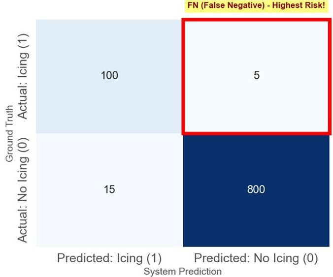
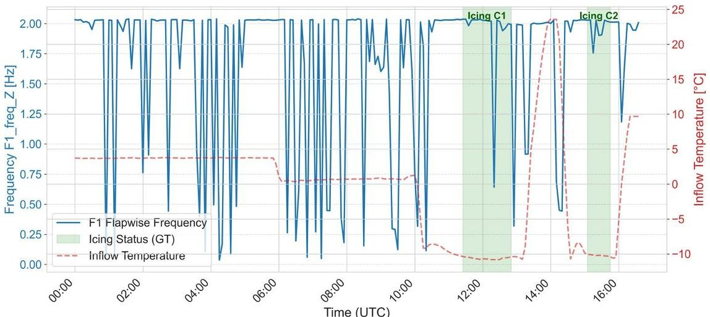
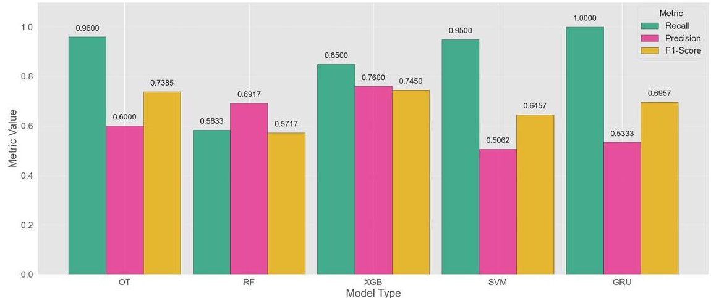
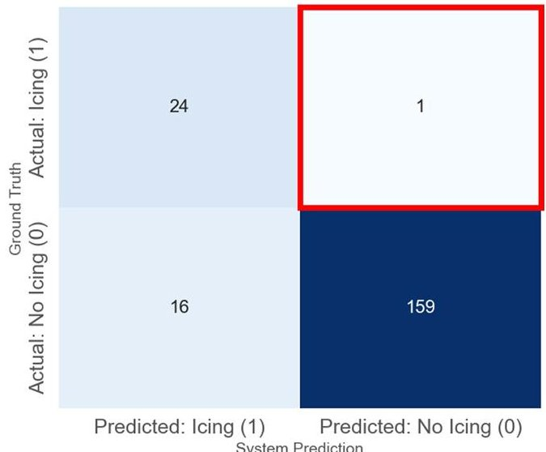
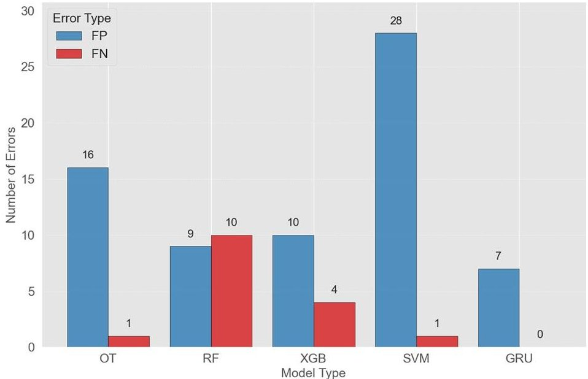
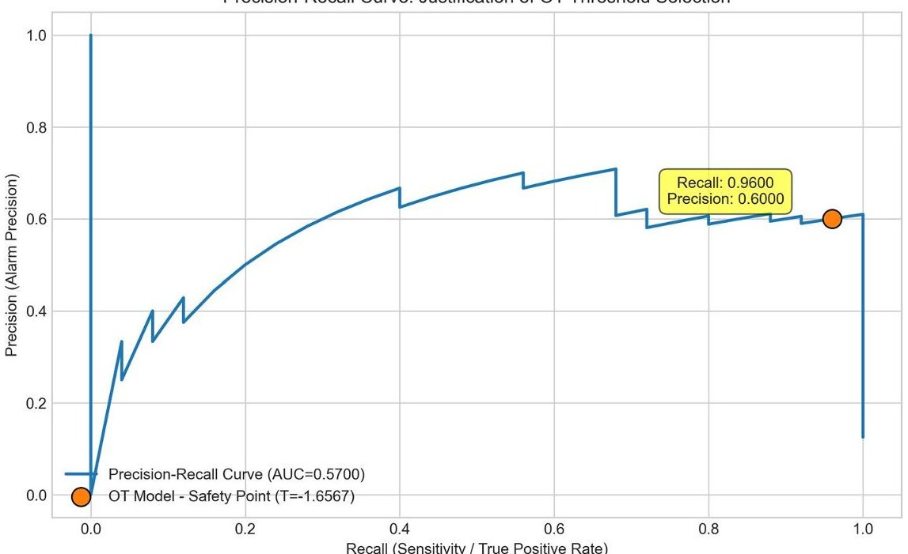
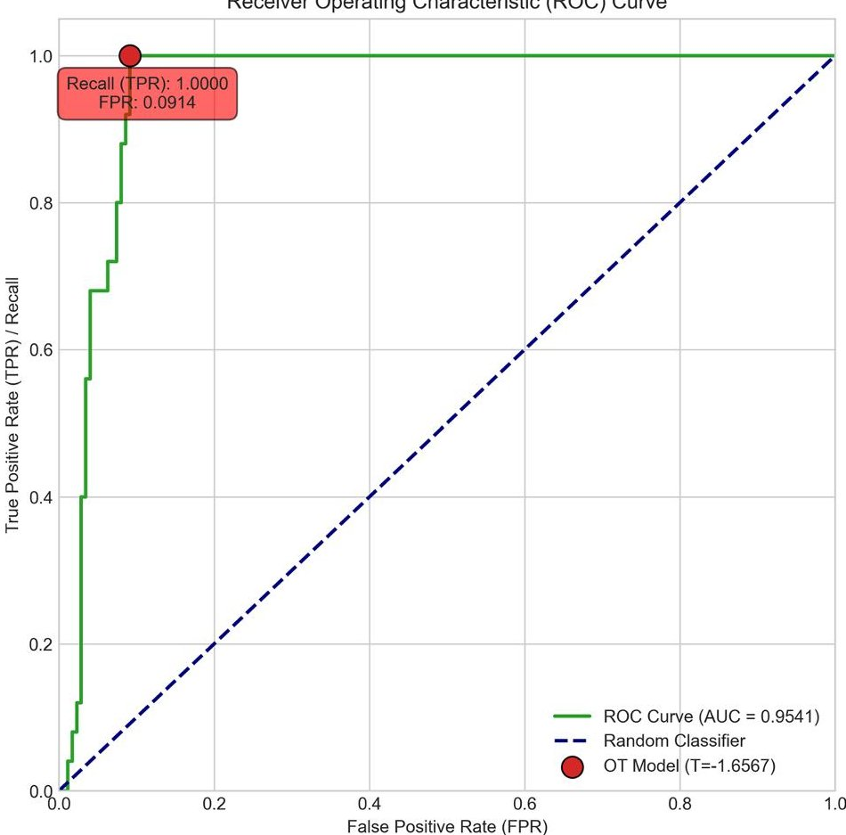
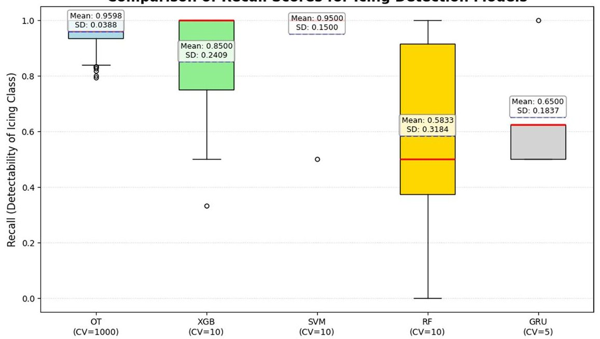

<!-- PDF_PAGE: 1 -->

RESEARCH

# Intelligent information fusion for safety critical icing detection via machine learning and reliability analysis in wind turbine systems

Lukasz Pawlik $ ^{1^{*}} $

*Correspondence:

Lukasz Pawlik

Ipawlik@tu.kielce.pl

$ ^{1} $Department of Information

Systems, Kielce University of

Technology, 7 Tysiaclecia Panstwa

Polskiego Ave., 25-314 Kielce,

Poland

## Abstract

Ensuring the safety and reliability of wind turbine systems in cold climates requires robust icing detection, as missed events can lead to structural compromise. This study proposes an intelligent information fusion framework that integrates vibration-based structural dynamics with environmental data through a pipeline of automated Operational Modal Analysis (OMA) and temperature compensation. Five classification architectures—Optimized Threshold (OT), Random Forest (RF), XGBoost (XGB), Support Vector Machine (SVM), and Gated Recurrent Unit (GRU)—were rigorously evaluated using rolling-window time-series cross-validation on high-fidelity experimental data from a large-scale climate chamber. To address the safety-critical nature of the application, the framework prioritizes Recall to minimize False Negative (FN) errors and incorporates non-parametric statistical validation (Kruskal-Wallis and Dunn's post-hoc tests) to quantify model stability. Results reveal a "simplicity paradox" where the physics-informed OT model achieved the highest operational reliability (Recall = 0.9600), outperforming advanced ensemble and deep learning methods in both safety and statistical stability. This work demonstrates that meticulous feature-level fusion and domain-specific engineering enhance system resilience more effectively than increased algorithmic complexity. The proposed methodology provides a scalable foundation for multi-sensor fusion and adaptive predictive maintenance in renewable energy infrastructures.

Keywords Intelligent information fusion, Safety-critical systems, Machine learning Wind turbine icing detection, Structural health monitoring, Uncertainty quantification Predictive maintenance, Decision support, Reliability analysis, Time-series validation

## 1 Introduction

## 1.1 The global energy context: wind energy in cold climates

The continued expansion of global wind energy capacity into challenging geographical areas necessitates deployment in cold climate regions. While these regions offer predictable wind resources, they introduce significant technological hurdles, primarily atmospheric icing on rotor blades. Ice accretion is not merely an operational inconvenience; it poses substantial economic and structural challenges [1]. Beyond the blades,

<!-- PDF_PAGE: 2 -->

the operational stability of the entire turbine system must be maintained under harsh conditions, requiring advanced modeling for critical components such as offshore wind gearboxes under multi-fault modes [2] and support structures subject to hybrid uncertainties [3].

Economically, the presence of ice severely reduces aerodynamic performance and energy capture efficiency, often necessitating turbine shutdown [1]. In regions categorized by the International Energy Agency (IEA) as having high icing climate risk (e.g., IEA Ice Class 5), annual energy production (AEP) losses can exceed 20% , making effective mitigation essential [1]. Therefore, the successful integration of wind energy in cold climates depends heavily on robust, real-time Icing Detection Systems (IDS) that can initiate de-icing or anti-icing procedures swiftly.

The investment in reliable IDS technology typically provides a rapid return on investment, often within the first two to five years, by minimizing unnecessary downtime and maximizing energy yield during winter operations [4]. This work addresses the challenge of intelligent information fusion in safety-critical systems by integrating vibration-based monitoring with machine learning and statistical reliability analysis. While economic justification is a powerful driver for the adoption of sophisticated monitoring solutions, the requirement for automated detection systems extends far beyond purely financial considerations, entering the realm of safety-critical monitoring and structural integrity assurance.

## 1.2 Structural and public safety risks of blade icing

Ice accretion introduces critical safety risks that elevate the importance of IDS performance above mere operational efficiency. Structurally, the uneven build-up of ice on the blades creates significant mass and aerodynamic imbalance [1]. This imbalance subjects the entire turbine structure—including the rotor, drivetrain, and tower—to increased static and fatigue loads. Such phenomena dramatically raise the risk of catastrophic component failure, blade detachment, or even nacelle collapse if the issue is not detected and addressed promptly [1]. These structural challenges are further compounded in offshore environments, where fatigue reliability evaluation must account for hybrid uncertainties to prevent premature structural degradation [3].

The most prominent public safety threat is the phenomenon of ice throw [5]. When an iced-up turbine resumes operation, or when ice naturally detaches, chunks of ice can be hurled at high velocities over distances of several hundred meters [5]. This ballistic hazard poses a severe risk of injury to personnel working on or near the wind farm, as well as significant damage to surrounding vehicles, infrastructure, and equipment [5]. Due to these potential catastrophic consequences, the accurate and timely detection of ice is fundamental to maintaining operational safety in populated areas or near access roads, often mandating that turbines be shut down immediately upon confirmed icing risk.

## 1.3 Taxonomy of icing detection systems

Icing detection methodologies are broadly classified into two categories: indirect and direct methods [6]. Indirect methods infer the presence of ice based on environmental proxies or operational deviations. These commonly include monitoring meteorological conditions—such as temperature and humidity thresholds—or analyzing deviations in the power curve, where reduced energy output is observed at expected wind speeds [6].

<!-- PDF_PAGE: 3 -->

While indirect methods are generally cost-effective, they frequently suffer from high rates of False Positives (FP), as meteorological conditions conducive to icing do not always result in actual ice accretion on the rotating blade surfaces.

Direct methods aim to identify ice as it builds up on the blade itself, offering superior reliability and reduced uncertainty [7]. Direct techniques include specialized sensors embedded in the blade surface or non-contact methods that monitor the structural dynamics of the blade [6]. This study focuses on the latter: vibration-based detection (VBD). VBD relies on the physical principle that ice accretion acts as an additional distributed mass, which results in a measurable decrease in the natural resonance frequencies of the blade structure [7].

By directly capturing the physical effect of ice mass on structural dynamics, VBD provides a reliable measure of structural integrity and operational risk [4]. This approach aligns with modern intelligent frameworks that leverage high-fidelity modeling to distinguish between healthy and faulty states in complex offshore wind components [2].

## 1.4 Vibration-based detection and the EOC challenge

VBD is inherently rooted in Structural Health Monitoring (SHM) principles, requiring continuous measurement of ambient vibrations followed by Operational Modal Analysis (OMA) to extract time-variant modal parameters—such as natural frequencies and damping ratios—that are sensitive to mass changes [7].

The critical technical challenge in VBD is mitigating the influence of Environmental and Operational Conditions (EOCs) [8]. Natural frequencies are highly sensitive to EOCs, particularly temperature, which alters the Young's modulus and overall stiffness of composite blade materials [7]. This thermal variability, if uncompensated, can easily mask the subtle frequency drops caused by minor ice accretion or lead to excessive false alarms [9].

To address this, intelligent information fusion has emerged as a cornerstone for enhancing the reliability of complex infrastructures [10]. By integrating vibration dynamics with environmental data streams, robust normalization models can be developed to isolate frequency shifts strictly attributable to ice mass [7]. Recent advancements in structural reliability analysis have demonstrated that Support Vector Machines (SVM) and regression models, when coupled with enhanced simulation techniques, offer high computational accuracy in establishing these baselines under high-dimensional EOC uncertainty [11]. Thus, the fusion-based pre-processing step is non-negotiable for establishing a reliable, temperature-compensated baseline against which icing can be detected with high confidence [12].

## 1.5 The safety imperative: prioritizing recall (sensitivity)

In any classification system, error management is paramount, but in safety-critical applications like IDS, the type of error carries vastly different consequences. A False Positive (FP)—an alarm triggered when no ice is present—leads to unnecessary operational costs, such as the activation of heating systems or turbine downtime. While economically inconvenient, this remains an acceptable error mode in the hierarchy of safety.

Conversely, a False Negative (FN)the failure to detect actual ice accretion-can result in structural damage, total asset loss, or severe injury due to ice throw. Given the catastrophic potential of FNs, the primary design and evaluation metric for a robust IDS

<!-- PDF_PAGE: 4 -->

must be centered on the minimization of this specific error type (Fig. 1). This mandates the maximization of the Recall metric (also known as Sensitivity).

This study rigorously adheres to this foundational safety principle, prioritizing maximum detection capability even if it results in a marginally higher tolerance for false alarms (lower Precision). The original contribution of this work lies in the development of an intelligent framework that achieves this high safety assurance through meticulous feature-level fusion—integrating vibration dynamics with environmental temperature streams—rather than relying solely on algorithmic complexity.

Beyond single-sensor monitoring, future resilience requires multi-source data fusion and adaptive decision-making under uncertainty, for which this study provides a validated statistical baseline. The goal of this comparative analysis is to identify the classifier architecture that offers the highest statistical assurance against missed icing events, utilizing empirical data from a controlled, large-scale climate chamber experiment.

## 2 Related works

## 2.1 Structural health monitoring (SHM) of wind turbines

Structural Health Monitoring encompasses the comprehensive assessment of structural integrity across the entire wind turbine asset, from the foundation to the blade tips [13]. Vibration analysis serves as the cornerstone for monitoring numerous components, including the drivetrain (gearbox, bearings) and the main structural elements (tower, foundation, and blades) [14].

For large structures like wind turbine blades, vibration measurement is crucial for detecting faults that alter mass or stiffness [15]. Research in SHM addresses various damage modes, such as fatigue cracking in blades [15] or excessive displacement in foundations caused by dynamic loading and soil-structure interaction, particularly relevant for slender Offshore Wind Turbines (OWTs) [13]. Recent advancements in this field have expanded towards multi-fault mode modeling, such as analyzing time-varying mesh stiffness in gearboxes [2], and evaluating the fatigue reliability of support structures under hybrid uncertainties [3]. The monitoring systems must be designed to cope with the complex dynamic environment, where cyclic wind and wave loads can interact with the natural frequencies of the structure [16]. In the context of icing, the VBD

Fig.1 Conceptual Diagram of the Confusion Matrix with the FN error highlighted. This value must be minimized to ensure structural safety

<!-- PDF_PAGE: 5 -->

method leverages the fundamental principle that mass addition inherently lowers the natural frequency, a universally recognized indicator of structural change [7].

## 2.2 Information fusion in safety-critical systems

Intelligent information fusion has emerged as a cornerstone for enhancing the safety and reliability of complex infrastructures [8,17]. Modern cyber-physical systems, such as wind turbines, generate heterogeneous data streams from multiple sensors and operational sources [6]. Integrating these data streams through machine learning and probabilistic reasoning enables adaptive decision-making under uncertainty, improves anomaly detection, and supports predictive maintenance strategies [18]. The theoretical landscape of information fusion has been further enriched by frameworks addressing dependency assessment under uncertainty, such as methods utilizing the quantum model of mass functions to enhance the accuracy of reliability outcomes [10]. While traditional approaches often rely on single-sensor monitoring, fusion-based frameworks combine vibration signals, SCADA data, and environmental measurements to provide a holistic view of system health [19]. This study contributes to this paradigm by demonstrating how vibration-based features, when combined with ML models and statistical reliability analysis, can serve as a foundation for intelligent fusion in safety-critical applications [8].

## 2.3 Operational modal analysis (OMA) and EOC compensation techniques

The transition from raw vibration signals to actionable intelligence requires sophisticated signal processing and normalization. OMA techniques are essential for extracting modal characteristics from ambient (operational) excitations rather than forced excitations [12]. Algorithms like Least Squares Complex Frequency (LSCF), which was employed in the underlying experiment, Stochastic Subspace Identification (SSI), and Frequency Domain Decomposition (FDD) are commonly used to achieve this [12]. The greatest hurdle in realizing robust VBD is compensating for EOC variability. Temperature variation is the most significant factor, often inducing frequency shifts larger than those caused by minor damage or ice accretion [8]. If EOC effects are not accurately modeled and subtracted, the system will fail to distinguish between natural operational changes and genuine damage or icing events [7]. The literature presents several advanced approaches for EOC normalization:

1. Regression Modeling: Simple linear correlation and regression models serve as a baseline for correlating EOC parameters (like temperature or wind speed) with modal frequencies [20]. For more complex, non-linear dependencies, multivariate or polynomial regression is often necessary [21].

2. Dimensionality Reduction: To simplify EOC modeling, techniques like Principal Component Analysis (PCA) can be employed to transform correlated environmental inputs (e.g., temperature, humidity, and wind characteristics) into a smaller set of independent latent variables [22]. This transformation assists in creating more stable regression baselines [18].

3. Probabilistic Modeling: More advanced methods like Polynomial Chaos Expansion (PCE) have been used to model the natural frequency onto the probability space of transformed EOC variables, explicitly incorporating uncertainty quantification into the baseline definition [18].

<!-- PDF_PAGE: 6 -->

## 2.4 Classical machine learning for icing and fault detection

Traditional machine learning (ML) models-fed with expertly extracted features like modal frequencies or SCADA parameters-have been widely explored for fault and icing diagnosis in wind turbines [23].

## 2.4.1 Optimized threshold model (OT)

Threshold-based methods represent the most fundamental approach to anomaly detection in VBD, relying on a pre-defined or optimized minimum acceptable drop in the compensated natural frequency to signal an icing event. This model serves as an essential physics-based benchmark against more complex, data-driven approaches [7].

## 2.4.2 Ensemble methods (random forest and XGBoost)

Ensemble techniques, such as Random Forest (RF) and Extreme Gradient Boosting (XGBoost), are popular due to their ability to handle structured, complex data [24]. XGBoost, in particular, is frequently cited for achieving high classification accuracy in fault detection applications when combined with feature selection techniques like ReliefF [25]. For icing detection specifically, RF classifiers utilizing extensive SCADA features have also been proposed [19]. However, these studies often prioritize overall accuracy or F1-score [26]. The present work provides a crucial counterpoint, demonstrating that, when the safety metric (Recall) is prioritized, the performance of these ensemble methods can degrade significantly if they fail to leverage the primary physical feature robustly.

## 2.4.3 Support vector machines (SVM)

SVMs, known for finding optimal classification hyperplanes, have shown reliability in complex structural diagnosis problems, even utilizing high-dimensional feature spaces derived from vibration spectra [27]. Furthermore, the integration of Support Vector Regression (SVR) with enhanced simulation techniques has proven effective in structural reliability analysis, offering a robust approach to failure probability estimation [11]. The efficacy of SVM is demonstrated by its high performance in the current study, matching the highest achieved Recall.

## 2.5 Deep learning approaches in sequential SHM

Deep Learning (DL) architectures are gaining traction in SHM due to their potential to bypass manual feature engineering [23]. Recurrent Neural Networks (RNNs), specifically Long Short-Term Memory (LSTM) and Gated Recurrent Unit (GRU) networks, are optimally suited for analyzing sequential time-series data like vibrations [28]. These models have demonstrated high performance in structural damage detection, achieving accuracies exceeding 99% in detecting damage presence in simulated scenarios for offshore turbine blades [28].

The main advantage of DL lies in the possibility of using raw sensor data (e.g., raw acceleration time-series or spectral images) as input, allowing the model to autonomously learn the most relevant patterns correlating with faults or icing, instead of relying solely on features extracted by OMA or other preprocessing techniques [23]. The investigation of a GRU model in the current experiment yielded suboptimal results compared to the simpler classifiers. This finding suggests a necessary reassessment in future

<!-- PDF_PAGE: 7 -->

work: whether this underperformance was due to the intrinsic limitations of the complex model or the restriction imposed by using only the single, highly engineered F1 frequency feature as input.

## 2.6 Field vs. controlled environment validation

The current state of VBD technology validation spans both controlled laboratory settings and operational field trials [7]. Large-scale climate chamber experiments, such as the one conducted at OWI-lab, are invaluable because they allow for precise quantification of the isolated effects of icing mass and temperature under controlled conditions [7]. These controlled datasets are crucial for validating the fundamental physics-based relationship between ice accretion and frequency shift [7].

However, translating lab-proven concepts to industrial deployment requires rigorous In-Situ Validation. Operational wind farms introduce variables such as turbulent wind loads, varying turbine states, and long-term structural drift, which pose significant challenges not captured in the laboratory. Demonstrating high reliability against these real-world EOC complexities remains the definitive requirement for the commercial adoption of VBD systems [4].

## 3 Materials and methods

## 3.1 OWI-lab large climate chamber experimental setup and data acquisition

The foundation of this study is a high-fidelity dataset derived from a controlled, large-scale icing experiment conducted as part of the COOCK Fighting Icing project [29]. The experiment took place in the OWI-lab Large Climate Chamber, utilizing a 10.1 m wind turbine blade. The methodology was designed to simulate the natural formation of atmospheric ice under controlled conditions [7].

Instrumentation and Sensing: The blade was instrumented using three tri-axial MEMS accelerometers (Micromega IAC-UHRS-Ud-03) with a $ \pm 3 g $ measurement range, sampled at 250 Hz. These sensors were placed on the blade's suction side at strategic locations: approximately 1/4 length, 5/8 length, and 130 cm from the blade tip. The measurements captured motion in three axes: X (edgewise), Z (flapwise), and Y (lengthwise). The flapwise (Z) direction is structurally sensitive to ice mass changes and provided the critical data for modal extraction [29].

## 3.1.1 Experimental protocol

The test day (2022-11-15) consisted of two distinct icing cycles, detailed by precise timestamps (Table 1) [29].

Table 1 OWI-lab Experimental Timeline and Icing Cycles (2022-11-15 UTC)

<table border="1"><tr><td>Event</td><td>Timestamp(UTC)</td><td>Environmental Conditions</td><td>Duration/Purpose</td></tr><tr><td>Start Cooling</td><td>10:04:00</td><td>To-10℃</td><td>Establish Icing Condition</td></tr><tr><td>Start Spray(Cycle1)</td><td>11:23:00</td><td>Approx.-10℃</td><td>Initiate Ice Accretion</td></tr><tr><td>Accelerate Spray</td><td>12:13:00</td><td>Approx.-10℃</td><td>Increase Icing Rate</td></tr><tr><td>End of Spray</td><td>12:49:00</td><td>Approx.-10℃</td><td>Stop Accretion/Start Monitoring</td></tr><tr><td>Start Heating</td><td>13:13:00</td><td>Increase Temperature</td><td>De-Icing Phase</td></tr><tr><td>Start Cooling</td><td>14:14:00</td><td>To-10℃</td><td>Re-establish Cold Conditions</td></tr><tr><td>Start Spray(Cycle2)</td><td>15:03:00</td><td>Approx.-10℃</td><td>Second Icing Event</td></tr><tr><td>End of Spray</td><td>15:43:00</td><td>Approx.-10℃</td><td>Completion of Experiment</td></tr></table>

<!-- PDF_PAGE: 8 -->

Ice thickness reached up to 11 mm during the test, confirmed by auxiliary measurements [7]. Alongside vibration data (MO04_acceleration*.csv), inflow air temperatures (ClimateChamber_20221115.csv) and timestamped photographic evidence were collected [29].

## 3.2 Data processing, feature engineering, and attribution

## 3.2.1 Modal parameter extraction

The raw acceleration data (in 10-minute blocks) was processed using automated Operational Modal Analysis (OMA) to monitor the evolution of natural frequencies over time [7]. The specific algorithm employed was the Least Squares Complex Frequency (LSCF) method, which clustered modal estimates to yield robust mean frequency and damping values [29]. The resulting modal parameter data (MO04_mpe_*_20221115. csv) recorded the cluster mean frequency (mean_frequency) and associated statistical metrics for both X and Z directions.

## 3.2.2 Feature selection and normalization

The selected feature for classification was the Flapwise Frequency (F1), representing the cluster mean frequency of the primary flapwise mode, extracted from the Z-direction modal parameter data. This choice is physically grounded, as the flapwise direction is the most sensitive to the mass and stiffness changes induced by ice accretion. Prior to classification, this frequency feature was subjected to a normalization model that compensated for the temperature dependency, ensuring that the residual frequency drop observed was primarily attributable to the presence of ice [29]. This normalization process represents the initial stage of information fusion, where raw environmental data (temperature) is integrated with structural dynamics (F1 frequency) to create a robust, ice-sensitive indicator.

## 3.2.3 Data attribution

The experimental context and resulting dataset are publicly available and explicitly attributed. The open dataset used for this analysis is "Ambient vibration test of wind turbine blade in OWI-lab's Large Climate Chamber" [29]. The initial findings and detailed methodology of the experiment are reported in "Large scale test of vibration based icing detection for wind turbines" [7]. Although this study primarily uses vibration and temperature data, the proposed pipeline is designed to integrate additional heterogeneous sources (e.g., SCADA, meteorological sensors) for future multi-sensor fusion.

## 3.3 Comparative model selection and safety validation methodology

Five distinct classification algorithms were selected for comparative analysis, spanning a range of complexity and interpretability:

4. Optimized Threshold Model (OT): A physics-based baseline model applying an optimal decision threshold to the EOC-compensated F1 frequency feature.

5. Random Forest Classifier (RF): A robust ensemble learning method based on a multitude of decision trees.

6. XGBoost Classifier (XGB): An efficient gradient boosting framework designed for high-performance classification.

<!-- PDF_PAGE: 9 -->

7. Support Vector Machine (SVM): A classifier that constructs an optimal separating hyperplane in a high-dimensional feature space.

8. Gated Recurrent Unit Model (GRU): An advanced recurrent neural network architecture specifically selected to evaluate the potential of deep learning in capturing temporal dependencies within sequential icing data. Specifically, the GRU was trained using a sliding window approach to exploit the sequential nature of the icing process, whereas the other four models operated on individual, time-stamped feature vectors.

## 3.3.1 Safety-driven evaluation

The evaluation strategy was dictated by the safety-critical nature of the IDS. The models were optimized and compared primarily based on the Recall metric, with the explicit goal of minimizing dangerous False Negative (FN) errors. This focus on risk mitigation ensures that the system prioritizes structural integrity, as undetected icing poses a severe threat to turbine operational safety.

## 3.3.2 Time-series validation

To ensure the performance metrics are representative of real-world deployment, a rigorous rolling-window time-series cross-validation technique was employed. This approach strictly avoids standard random cross-validation to mitigate temporal data leakage, ensuring that for every validation fold, the training data chronologically precedes the testing data. Such a strategy provides a realistic estimate of the models' predictive capabilities and operational stability in a dynamic environment.

## 3.3.3 Reproducibility

To ensure the full transparency and replicability of this study, all processing, feature engineering, and evaluation scripts (including the specific implementation of the LSCF method for OMA, the EOC normalization model, and the rolling window cross-validation logic) are provided in the Supplementary Information section. Furthermore, the complete computational environment and specific library versions used for execution are detailed in Appendix A to guarantee the exact replication of the analytical pipeline.

## 4 Results

The models analyzed were trained on time-series data from a large-scale icing experiment conducted on a 10.1 m wind turbine blade within the OWI-lab's Large Climate Chamber. The data, being inherently sequential and dependent on time, mandated the use of a rigorous time-series cross-validation approach to prevent data leakage and ensure that the reported metrics accurately reflect real-world predictive capability.

Initial Exploratory Data Analysis (EDA), visualized in Fig. 2, confirmed that icing is associated with a significant signal change in key features, such as the F1 Flapwise Frequency relative to Inflow Temperature, forming the basis for all classification models.

## 4.1 Comparative classification metrics

The performance assessment focused on aggregate metrics derived from the time-series cross-validation folds, with Recall serving as the decisive measure of safety assurance. Table 2 and Fig. 3 provide a comprehensive summary of the classification metrics,

<!-- PDF_PAGE: 10 -->

Fig. 2 Time-Series Analysis: F1 Flapwise Frequency vs. Inflow Temperature. Time-series analysis of key features indicating periods of icing

Table 2 Comparative classification metrics (aggregated results)

<table border="1"><tr><td>Model</td><td>Accuracy</td><td>Precision</td><td>Recall</td><td>F1-Score</td><td>TP</td><td>FN</td><td>FP</td><td>TN</td></tr><tr><td>OT</td><td>0.9150</td><td>0.6000</td><td>0.9600</td><td>0.7385</td><td>24</td><td>1</td><td>16</td><td>159</td></tr><tr><td>RF</td><td>0.9050</td><td>0.6917</td><td>0.5833</td><td>0.5717</td><td>15</td><td>10</td><td>9</td><td>166</td></tr><tr><td>XGB</td><td>0.9300</td><td>0.7600</td><td>0.8500</td><td>0.7450</td><td>21</td><td>4</td><td>10</td><td>165</td></tr><tr><td>SVM</td><td>0.8550</td><td>0.5062</td><td>0.9500</td><td>0.6457</td><td>24</td><td>1</td><td>28</td><td>147</td></tr><tr><td>GRU</td><td>0.7667</td><td>0.5333</td><td>1.0000</td><td>0.6957</td><td>8</td><td>0</td><td>7</td><td>15</td></tr></table>

OT: Optimized Threshold Model, RF: Random Forest, XGB: XGBoost, SVM: Support Vector Machine, GRU: Gated Recurrent Unit

Note: Bold values indicate the best safety-related results, including the highest Recall score and the lowest number of False Negatives (FN=0)

Fig. 3 Classification Metrics Comparison. Direct comparison of the most important metrics (Recall, Precision, F1-Score) across all candidate models

including Accuracy, Recall, Precision, F1-Score, and the raw counts for the Confusion Matrix (True Positives, False Negatives, False Positives, and True Negatives).

The results demonstrate that the Gated Recurrent Unit (GRU) model achieved the highest peak performance in the critical safety dimension, yielding a Recall score of 1.0000 with zero missed events (FN=0). This is closely followed by the Optimized Threshold (OT) and Support Vector Machine (SVM) models, which yielded Recall scores of 0.9600 and 0.9500 respectively, both translating to an exceptionally low False

<!-- PDF_PAGE: 11 -->

Negative (FN) count of only 1 error, indicating a near-perfect ability to detect actual icing events.

While the XGBoost classifier achieved the highest overall Accuracy (0.9300), its Recall of 0.8500 (4 FNs) indicates a higher risk profile compared to the top-tier models. Crucially, the Random Forest (RF) classifier performed poorly in this critical dimension, demonstrating a Recall of only 0.5833 and failing to detect 10 genuine icing events, which confirms its unsuitability for safety-critical deployment in this context.

Although the advanced deep learning architecture, GRU, showed a perfect Recall in the aggregated test window, its overall stability across validation folds was notably lower than that of the OT model. The superior and consistent performance of the OT model across extensive bootstrap iterations highlights the importance of interpretable, physics-informed approaches in intelligent fusion frameworks for safety-critical applications.

## 4.2 Analysis of critical error modes (FN vs. FP)

A deeper examination of the absolute error counts determines the true operational viability of the high-Recall models. As shown in Table 3 and highlighted visually in the aggregated confusion matrix for the OT model (Fig. 4), the OT, SVM, and GRU models successfully minimized the FN count to 1 or 0.

While the OT, SVM, and GRU models successfully minimized the catastrophic FN errors, the SVM model incurred a significantly higher operational penalty, generating 28 False Positives compared to the OT model's 16 FPs (as detailed in Fig. 5). Since these models satisfy the non-negotiable safety criterion (high Recall), the OT model is superior because it minimizes operational disruptions (False Alarms) while maintaining the highest level of statistical stability. The selection of the OT model's operating point was strategically placed on the Precision-Recall curve to aggressively maximize the True Positive Rate, even at the cost of a slightly lower Precision, confirming the safety-first design strategy.

## 4.3 Optimized threshold model curve analysis

The selection of the operating point for the Optimized Threshold (OT) model was a deliberate engineering decision, prioritizing Recall to satisfy stringent safety requirements. This prioritization is quantitatively demonstrated through the analysis of the

Table 3 Analysis of Critical Errors (FN vs FP)

<table border="1"><tr><td>Model</td><td>False Negatives(FN)</td><td>False Positives(FP)</td><td>Safety vs. Operational Cost</td></tr><tr><td>OT</td><td>1</td><td>16</td><td>Maximum vs. minimizeda</td></tr><tr><td>RF</td><td>10</td><td>9</td><td>High risk vs. lowb</td></tr><tr><td>XGB</td><td>4</td><td>10</td><td>Moderate vs. moderatec</td></tr><tr><td>SVM</td><td>1</td><td>28</td><td>Maximum vs. highd</td></tr><tr><td>GRU</td><td>0</td><td>7</td><td>Maximum vs. lowe</td></tr></table>

$ ^{a} $ Maximum safety assurance ( $ FN=1 $ ), with minimized operational cost ( $ FP=16 $ ) compared to the SVM model, making it the most balanced top-Recall choice

$ ^{b} $Unacceptably high safety risk ( $ F N=1 0 $ ,highest count among ML models). However,it offers a relatively low operational cost ( $ F P=9 $ )

$ ^{c} $ Moderate safety risk (FN=4). Provides a balance between safety and false alarms (FP=10), showing average overall performance

$ ^{d} $Maximum safety assurance (FN=1) but high operational cost (FP=28, highest FP count in the study), making it prone to costly false alarms

$ ^{e} $Maximum safety assurance ( $ FN=0 $ in the test window) with very low operational cost ( $ FP=7 $ ), although its statistical stability across multiple folds is lower than the OT model

Note: Bold values indicate the lowest number of False Negatives (FN), representing maximum safety assurance

<!-- PDF_PAGE: 12 -->

Fig. 4 Aggregated confusion matrix for the Optimized Threshold (OT) model. The red highlight emphasizes the critical safety area (False Negatives), where only one event was missed （ $ FN=1 $ ）out of the total test set

Fig. 5 Analysis of Critical Errors (FN vs FP). Comparison of the absolute number of False Negatives (FN) and False Positives (FP)

Precision-Recall (PR) and Receiver Operating Characteristic (ROC) curves, which provide a holistic view of model performance beyond single-point metrics.

The PR Curve (Fig. 6) illustrates the intrinsic trade-off between Recall and Precision. The selected "OT Safety Point" is strategically positioned at the high end of the Recall axis (0.9600), confirming the design strategy of maximizing the True Positive Rate (TPR) to minimize the risk of undetected icing, even at the cost of a lower Precision (0.6000). This trade-off ensures that the system remains highly sensitive to the earliest signs of ice accretion.

The ROC Curve (Fig. 7) further validates the model's discriminative power. The curve's trajectory toward the ideal upper-left corner indicates a high degree of separation between the icing and non-icing classes. The Area Under the Curve (AUC) for the OT model is approximately 0.954, demonstrating a robust capability to correctly rank icing instances higher than non-icing instances across various operational conditions.

It should be noted that while the ROC AUC achieves a high value of approximately 0.954, indicating excellent overall separability, the AUPRC of 0.57 (Fig. 6) more

<!-- PDF_PAGE: 13 -->

Precision-Recall Curve: Justification of OT Threshold Selection

Fig. 6 Precision-Recall (PR) curve for the Optimized Threshold (OT) model. The operating point is chosen to maximize safety (Recall = 0.9600) while maintaining acceptable alarm precision (Precision = 0.6000). Note: This figure shows the area under the PR curve (AUPRC $ \approx $ 0.57), which is conceptually different from the ROC AUC, reflecting the challenges of class imbalance

Receiver Operating Characteristic (ROC) Curve

Fig.7 Receiver Operating Characteristic (ROC) curve for the OT model. The trajectory toward the upper-left corner confirms high sensitivity at a moderate false positive rate. Operating point: True Positive Rate (Recall) $ \approx $ 1.0000, False Positive Rate $ \approx $ 0.0914; overall ROC AUC $ \approx $ 0.954

<!-- PDF_PAGE: 14 -->

Table 4 Summary of mean recall scores and statistical stability

<table border="1"><tr><td>Model</td><td>N</td><td>Mean recall</td><td>Standard deviation(SD)</td></tr><tr><td>OT</td><td>1000</td><td>0.9598</td><td>0.0388</td></tr><tr><td>SVM</td><td>10</td><td>0.9500</td><td>0.1500</td></tr><tr><td>XGB</td><td>10</td><td>0.8500</td><td>0.2409</td></tr><tr><td>GRU</td><td>5</td><td>0.6500</td><td>0.1837</td></tr><tr><td>RF</td><td>10</td><td>0.5833</td><td>0.3184</td></tr></table>

Note: Bold values indicate the highest Mean Recall, reflecting the most reliable overall performance

Comparison of Recall Scores for Icing Detection Models

Fig.8 Distribution of Recall Scores across validation iterations, illustrating the reliability of each detection strategy

accurately reflects the precision challenges inherent in the context of class imbalance, where non-icing instances significantly outnumber icing events.

## 4.4 Statistical confirmation of model ranking

To confirm that the observed differences in safety performance, particularly the stability of the OT model compared to the variability of the deep learning and ensemble approaches, were statistically reliable, a formal statistical analysis was conducted on the Recall scores. The initial summary statistics, reflecting the distribution of scores across cross-validation folds and bootstrap iterations, are presented in Table 4. It is important to distinguish between the peak performance metrics reported in Table 2, which represent a specific test window, and the mean metrics in Table 4, which provide a more robust estimation of the models' generalization capabilities and operational stability across the entire experimental duration. The variation in Recall performance is visualized in Fig. 8, which highlights the exceptionally low variability of the OT model across a large sample size （ $ N=1000 $ ）and the high variance observed in the RF and XGB models.

As shown in Table 4, the Optimized Threshold (OT) model demonstrates exceptional operational stability, characterized by the lowest standard deviation $ ( SD=0.0388) $ among all compared methods. While the GRU and SVM models achieved high peak Recall in specific test windows, their performance variability across validation folds was significantly higher (e.g., $ SD=0.1500 $ for SVM).

The robust performance of the OT model across a large sample size （ $ N=1000 $ bootstrap iterations) confirms that a physics-informed approach, when properly fused with

<!-- PDF_PAGE: 15 -->

EOC-compensated features, provides a more reliable baseline for safety-critical deployment than high-dimensional algorithms, which appear more susceptible to environmental noise and stochastic fluctuations.

Given the non-parametric nature of the classification metrics, the Kruskal-Wallis H test was applied to evaluate the significance of the performance gaps. The test yielded an H Statistic of 8.1853 and a P-value of 0.0167. Since this P-value is less than the significance level of 0.05, the analysis confirms a statistically significant difference in Recall performance among the compared models.

Subsequently, Dunn's post-hoc test was performed for pairwise comparisons to isolate specific performance gaps (Table 5). This step is crucial to distinguish between models that are numerically similar but statistically distinct in their safety assurance.

The post-hoc analysis confirms a statistically significant performance gap between the Random Forest model and the Support Vector Machine （ $ p=0.0159 $ ）. While the XGBoost and GRU models showed higher mean Recall than the RF, they did not achieve statistical parity with the top-performing SVM and OT models.

These statistical findings validate the "Simplicity Paradox" discussed in Sect. 5: the reduction in dimensionality through physics-based EOC compensation creates a feature space where linear separation (OT) is not only sufficient but statistically more stable than the stochastic boundaries generated by ensemble methods like Random Forest. This evidence strongly reinforces the conclusion that the OT model provides the most robust and statistically stable performance for safety-critical icing detection, whereas the RF classifier remains fundamentally unreliable for this application.

## 5 Discussion

The most significant finding of this comparative study is the "simplicity paradox": the most straightforward diagnostic approach, the Optimized Threshold (OT) Model, achieved the highest safety performance, exceeding or matching the reliability of significantly more complex machine learning and ensemble architectures.

This outcome is not a failure of complexity, but rather a validation of the efficacy of the physical feature engineering pipeline. By applying rigorous Operational Modal Analysis (OMA) via the LSCF method and Environmental and Operational Conditions (EOC) normalization, the primary flapwise modal frequency (F1) was isolated as a high-fidelity indicator of ice mass accretion. The relationship between this purified, temperaturecompensated feature and the presence of ice is so fundamentally robust that a well-calibrated linear boundary (the threshold) is sufficient for near-ideal class separation. This confirms a foundational principle in structural health monitoring: when the input feature accurately reflects the underlying physics of the fault, parsimonious models often outperform high-dimensional algorithms in both reliability and interpretability.

Table 5 P-values for pairwise comparisons from Dunn's Post-Hoc test

<table border="1"><tr><td>Model comparison</td><td>P-value</td><td>Statistical significance</td></tr><tr><td>RF vs. SVM</td><td>0.0159</td><td>Significant ($p<0.05$)</td></tr><tr><td>RF vs. XGB</td><td>0.1544</td><td>Not Significant</td></tr><tr><td>SVM vs. XGB</td><td>1.0000</td><td>Not Significant</td></tr></table>

Note: Bold values indicate statistically significant differences (p < 0.05)

<!-- PDF_PAGE: 16 -->

The underperformance of more sophisticated models-particularly the statistically significant failure of the Random Forest (RF) classifier-can be attributed to two primary factors:

9. Sensitivity to noise: Advanced models designed to capture subtle, non-linear relationships may have inadvertently overfitted to measurement noise or minor fluctuations in secondary features. In a safety-critical context, this "complexity bias" can obscure the dominant physical signal, thereby compromising the model's ability to generalize across different icing scenarios.

10. Computational efficiency vs. safety gain: The substantial computational overhead and lack of transparency inherent in models like XGBoost and Gated Recurrent Units (GRU) provide no tangible safety benefits in this application. Given that the OT model achieves superior Recall with negligible latency, it represents a more viable solution for real-time, resource-constrained edge computing on wind turbine controllers.

This study demonstrates that in safety-critical classification, feature robustness and physical grounding triumph over algorithmic complexity. These results contribute to the field of intelligent information fusion by showcasing how domain-specific engineering, combined with targeted machine learning and uncertainty quantification, can enhance the reliability of structural monitoring in complex environments. Future research will extend this framework to multi-sensor fusion and adaptive thresholding, further advancing the capabilities of predictive maintenance and system resilience.

## 6 Limitations

While the high reliability achieved by the OT model (Recall = 0.9600) is compelling, several constraints must be considered when translating these results from a controlled environment to field operations.

## 6.1 Environmental and operational variability

The primary limitation lies in the gap between laboratory conditions and real-world turbine operation. Controlled experiments within the OWI-lab climate chamber necessarily mitigate several stochastic factors present in the field. Real-world operational environments introduce complex complications, including:

- Aerodynamic turbulence: Variable wind speeds and extreme turbulence profiles that can introduce non-stationary noise into the vibration signals.

- Environmental fluctuations: Rapid changes in ambient air density and humidity that may affect modal frequencies beyond the temperature-dependency currently modeled.

- Structural aging: Long-term structural drift due to material wear, cyclic loading, and degradation of composite materials over a turbine's 20-25 year lifespan, which may shift the baseline "clean" frequency over time.

The current classification framework, while robust in isolation, requires further validation against this spectrum of operational variability to ensure long-term reliability.

<!-- PDF_PAGE: 17 -->

## 6.2 Information content and feature resolution

The strategic reliance on the fundamental flapwise frequency (F1) as a primary feature represents a highly effective dimensionality reduction technique. However, this parsimonious approach carries the inherent risk of discarding subtle, potentially critical information embedded in:

- Higher-order modes: Higher-order modal frequencies and damping ratios might provide earlier indicators of ice onset or more granular information regarding the specific distribution of ice along the blade.

- Raw signal characteristics: Features extracted directly from raw vibration time series (e.g., kurtosis, crest factor) might capture transient icing events that are averaged out during the 10-minute modal extraction window.

The potential loss of this information might limit the system's ability to diagnose ice severity or accretion type (e.g., rime vs. glaze ice), which could be critical for advanced de-icing strategies.

## 7 Future research

## 7.1 Adaptive thresholding and long-term baseline tracking

The static threshold employed by the current OT model, while optimal for the experimental dataset, is inherently vulnerable to performance degradation during long-term field deployment. Environmental drift and progressive component aging inevitably cause the structural baseline frequency to shift over the turbine's 20-25 year lifespan [30]. Such shifts render fixed boundaries inaccurate, potentially leading to increased False Positives (FPs) or compromised safety sensitivity over decades of operation.

To maintain high safety assurance, the development of an Adaptive Threshold Mechanism (ATM) is paramount. This requires moving beyond binary classification based on fixed boundaries toward continuous anomaly tracking against a time-varying, environment-compensated healthy state [8].

Future implementations should leverage probabilistic modeling techniques, such as Gaussian Process Regression (GPR) or Kalman filters, which excel at modeling nonlinear relationships between EOCs and modal frequencies while providing rigorous Uncertainty Quantification (UQ) [31]. By establishing detection boundaries as dynamic confidence intervals (e.g., 3 $ \sigma $ or 4 $ \sigma $) relative to the predicted baseline, the threshold can adjust autonomously. This mitigation of structural drift preserves maximum Recall sensitivity while effectively minimizing false alarms [8]. Furthermore, the precision of these adaptive baselines could be formally bounded using the Cramer-Rao Lower Bound (CRLB) to establish the theoretical limit of frequency estimation variance under varying signal-to-noise ratios.

## 7.2 Deep learning reassessment: end-to-end raw data analysis

The suboptimal performance of the GRU model in this study necessitates a methodological reassessment of deep learning applications for icing detection. The hypothesis

<!-- PDF_PAGE: 18 -->

remains that the model's performance was constrained by the dimensionality reduction inherent in human-engineered features (F1 frequencies) rather than the architecture's inherent capabilities.

Future work should explore training Recurrent Neural Networks (RNNs, such as GRU or LSTM) or Transformers using raw, multichannel acceleration time-series or high-resolution time-frequency representations (e.g., spectrograms) as direct inputs.

This end-to-end approach allows deep learning models to autonomously extract subtle, distributed features—such as higher-order harmonics or transient damping changes—that may be overlooked by traditional OMA. A successful deep learning model trained on raw data could offer superior generalization capabilities when faced with the high noise and stochastic variability inherent in field data, thereby justifying its computational complexity [23].

## 7.3 In-situ validation and multi-modal information fusion

The transition toward industrial readiness requires extensive In-Situ Validation of the vibration-based detection (VBD) framework on operating wind turbines exposed to natural atmospheric icing. Field testing is the essential final step to confirm the model's robustness against real-world dynamic loading, turbulence, and environmental variability [4].

To enhance overall resilience, research should pivot toward Multi-Modal Information Fusion [19]. Integrating the high-Recall VBD system with orthogonal diagnostic streams—such as meteorological SCADA data (humidity, nacelle temperature), power curve analysis, and image-based diagnostics—enables robust cross-validation of alarms [4]. Such complex fusion frameworks could benefit from hidden Markovian models, where the Expectation-Maximization (EM) algorithm could be utilized to adaptively update the transition probabilities between healthy and iced states based on multi-source evidence.

Fusion strategies can leverage the high safety sensitivity of vibration monitoring while utilizing secondary, indirect measures to filter out false alarms during non-icing meteorological conditions. This probabilistic approach to decision-making under uncertainty, aligned with resilience engineering principles, will facilitate the creation of a comprehensive, redundant, and reliable Icing Detection System (IDS) [17].

## 8 Conclusion

This study provides a rigorous comparative evaluation of intelligent information fusion strategies for safety-critical icing detection. By utilizing high-fidelity experimental data from the OWI-lab Large Climate Chamber, we established a framework that prioritizes the mitigation of False Negative (FN) errors, which is paramount for structural integrity and operational safety.

The analysis leads to the following key conclusions:

<!-- PDF_PAGE: 19 -->

11. Efficacy of physics-informed parsimony: The Optimized Threshold (OT) model, despite its algorithmic simplicity, emerged as the most reliable solution for immediate deployment. It achieved a superior safety profile (Recall = 0.9600) with only one missed event （FN=1），matching the peak performance of the more complex Support Vector Machine (SVM).

12. Optimization of operational trade-offs: Beyond absolute safety, the OT model demonstrated a superior balance between protection and operational cost, generating significantly fewer False Positives （ $ FP=16 $ ）than the SVM （ $ FP=28 $ ）. This reduction in "false alarm fatigue" is critical for the practical viability of autonomous monitoring systems.

13. Statistical reliability of the ranking: The Kruskal-Wallis and Dunn's post-hoc analyses （ $ p=0.0167 $ ）provide robust evidence that the performance gaps-particularly the failure of the Random Forest model—are statistically significant and not artifacts of experimental noise. This confirms that for safety-critical tasks, high-dimensional ensemble methods may suffer from a "complexity bias" that degrades generalization.

14. Validation of information fusion: The success of the parsimonious OT model validates the core hypothesis: meticulous information fusion at the feature- engineering level (fusing vibration dynamics with EOC temperature compensation) is more decisive than algorithmic complexity. By capturing the underlying physics of ice accretion, we provide a robust foundation for reliable decision-support in renewable energy infrastructure.

The primary recommendation for future research is the evolution of this static framework into a dynamic, long-term monitoring solution. The development of an Adaptive Threshold Mechanism (ATM) is necessary to autonomously track structural and environmental drift over the turbine's 20-year lifespan. Furthermore, while the current vibration-based fusion is highly effective, integrating orthogonal data streams (e.g., power curve analysis and image processing) through multi-modal fusion will be the final step toward a fully resilient, industry-ready Icing Detection System (IDS).

## Appendix A: Reproducibility and software environment

The complete analytical pipeline was executed within the Python 3.12.2 environment. To guarantee the full reproducibility of the results and the model implementation, the specific versions of the core scientific and machine learning libraries used are documented in Table 6.

Table 6 Software package versions

<table border="1"><tr><td>Package</td><td>Description</td><td>Version</td></tr><tr><td>pandas</td><td>Data Processing and Manipulation</td><td>2.3.3</td></tr><tr><td>numpy</td><td>Fundamental Numerical Operations</td><td>2.3.5</td></tr><tr><td>scikit-learn</td><td>Machine Learning Models, Scaling Tools, Metrics</td><td>1.7.2</td></tr><tr><td>xgboost</td><td>Gradient Boosting Machine Learning Model</td><td>3.1.2</td></tr><tr><td>tensorflow</td><td>Deep Learning Framework (GRU Model)</td><td>2.20.0</td></tr><tr><td>joblib</td><td>Model Serialization (Saving/Loading)</td><td>1.4.2</td></tr></table>

<!-- PDF_PAGE: 20 -->

## Supplementary Information

The online version contains supplementary material available at https://doi.org/10.1007/s10791-026-09949-3.

Supplementary Material 1. The complete source code and processing scripts used to perform the data pre-processing, feature engineering, model training, and performance evaluation are provided as supplementary files to ensure full reproducibility of the results presented in this paper. The supplementary materials include the following Python scripts: 01_preprocess_data.py: Handles the initial cleaning, synchronization, and alignment of raw time-series data from vibration sensors and temperature logs. 02_feature_engineering.py: Contains the implementation of the Operational Modal Analysis (OMA) using the Least Squares Complex Frequency (LSCF) method, Environmental and Operational Conditions (EOC) compensation, and the extraction of the primary flapwise modal frequency (F1) feature. 03.1_eval_ot_model.py: Script dedicated to determining the optimal threshold for the OT model and evaluating its performance using the rolling window cross-validation approach. 03.2_eval_rf_model.py: Training and evaluation script for the Random Forest (RF) classifier. 03.3_eval_xgb_model.py: Training and evaluation script for the XGBoost (XGB) classifier. 03.4_eval_svm_model.py: Training and evaluation script for the Support Vector Machine (SVM) classifier. 03.5_eval_gru_model.py: Training and evaluation script for the Gated Recurrent Unit (GRU) deep learning model, including time-series preparation. These scripts collectively define the entire processing pipeline, from raw data to the final statistical performance metrics.

## Author contributions

L.P. conceived the study, developed the methodology, performed the data analysis, and wrote the manuscript.

## Funding

The author received no funding for this work.

## Data availability

The dataset analyzed during the current study, titled "Ambient vibration test of wind turbine blade in OWI-lab's Large Climate Chamber", can be found at Zenodo via the following Digital Object Identifier (DOI): https://doi.org/10.5281/zenodo.7752386 (accessed on 21 November 2025). All processing scripts and model evaluation code are provided as Supplementary Information.

## Declarations

## Ethics approval and consent to participate

Not applicable. This study does not involve human participants or animals. This study does not involve human participants.

## Consent for publication

Not applicable. This study does not involve human participants.

The authors declare no competing interests.

## Received: 22 November 2025 / Accepted: 16 January 2026

Published online: 28 January 2026

## References

1. Zhang Z, Zhang H, Zhang X, Hu Q, Jiang X. A review of wind turbine icing and anti/de-icing technologies. Energies. 2024;17(12):2805. https://doi.org/10.3390/en17122805.

2. Meng D, Yang H, Fazeres-Ferradosa T, Guo Y, Khan MD, Zhu S-P. Time-varying mesh stiffness modelling of offshore wind gearboxes under multi-fault modes. Marit Eng. 2025;178(4):170-95. https://doi.org/10.1680/jmaen.25.00031.

3. Meng D, Yang S, Yang H, De Jesus AMP, Correia J, Zhu S-P. Intelligent-inspired framework for fatigue reliability evaluation of offshore wind turbine support structures under hybrid uncertainty. Ocean Eng. 2024;307:118213. https://doi.org/10.1016/j.oceaneng.2024.118213.

4. Polytech: How to accurately detect ice on wind turbines for a cost- and time-efficient operation? White Paper; 2021. https://www.polytech.com/media/o3xc0tgg/polytech-ice-detection-white-paper_2021.pdf. Accessed 21 Nov 2025.

5. Rhine E. Blade icing and ice throw incidents on wind farms: understanding the risks and safety measures | Spagnoletti Law Firm; 2024. https://www.spaglaw.com/blog/2024/08/blade-icing-and-ice-throw-incidents-on-wind-farms-understanding the-risks-and-safety-measures/. Accessed 21 Nov 2025.

6. IEA Wind TCP Task 19. Ice detection guidelines for wind energy applications. Technical Report, IEA Wind Technology Collaboration Programme. 2021. https://iea-wind.org/wp-content/uploads/2022/09/Task-19-Technical-Report-on-Ice-Detection-Guidelines-for-Wind-Energy-Applications.pdf.

7. Weijtjens W, Junior AFDO, Cloet B, Yilmaz OC, Devriendt C. Large scale test of vibration based icing detection for wind turbines. J Phys Conf Ser. 2024;2647(19):192008. https://doi.org/10.1088/1742-6596/2647/19/192008.

8. Weil M, Jurado CS, Weijtjens W, Devriendt C. Machine learning and uncertainty quantification to track and monitor natural frequencies in vibration-based SHM applied to offshore wind turbines. Data-Centric Eng. 2025;6:7. https://doi.org/10.1017/dce.2024.60.

9. Tian Y, Zhang Z, Wang X, Li W, Xu Y. Icing monitoring of wind turbine blade based on fiber bragg grating sensors and strain ratio index. Energies. 2025;18(16):4295. https://doi.org/10.3390/en18164295.

10. Su X, Huang X, Pan X, Meng D. A dependence assessment method based on quantum model of mass function in human reliability analysis. Expert Syst Appl. 2026;299:129992. https://doi.org/10.1016/j.eswa.2025.129992.

<!-- PDF_PAGE: 21 -->

11. Yang S, Meng D, Yang H, Luo C, Su X. Enhanced soft Monte Carlo simulation coupled with support vector regression for structural reliability analysis. Proc Inst Civ Eng Transp. 2024;178(7):459-74. https://doi.org/10.1680/jtran.24.00128.

12. Weijtjens W, Avendaño-Valencia LD, Devriendt C, Chatzi E. Cost-effective vibration based detection of wind turbine blade icing from sensors mounted on the tower. In: 9th European Workshop on Structural Health Monitoring (EWSHM 2018), Manchester, UK, 2018. https://www.ndt.net/search/docs.php3?id=23307

13. Currie M, Saafi M, Tachtatzis C, Quail F. Structural health monitoring for wind turbine foundations. Proc Inst Civ Eng Energy. 2013;166(4):162-9. https://doi.org/10.1680/ener.12.00008.

14. Anslow R, O'Sullivan D. Choosing the best vibration sensor for wind turbine condition monitoring. Analog Dialogue. 2020;54(3). https://www.analog.com/en/resources/analog-dialogue/articles/choosing-the-best-vibration-sensor-for-wind turbine-condition-monitoring.html

15. Feng W, Yang D, Du W, Li Q. In situ structural health monitoring of full-scale wind turbine blades in operation based on stereo digital image correlation. Sustainability. 2023;15(18):13783. https://doi.org/10.3390/su151813783.

16. Kerner L, Benfeddoul S, Dupla JC, Cumunel G, Canou J, Pereira JM, Argoul P. Experimental evaluation of the natural frequency of an offshore Wind turbine's scaled model: ASME 2017 36th International conference on ocean, offshore and arctic engineering, OMAE 2017. Offshore geotechnics; torgeir moan honoring symposium. 2017. https://doi.org/10.1115/ OMAE2017-61423.

17. Chatterjee J, Nieto MTA, Gelbhardt H, Dethlefs N, Ohlendorf J-H, Greulich A, et al. Domain-invariant icing detection on wind turbine rotor blades with generative artificial intelligence for deep transfer learning. Environ Data Sci. 2023;2:12. https://doi.org/10.1017/eds.2023.9.

18. Spiridonakos M, Chatzi E, Sudret B. Polynomial Chaos expansion models for the monitoring of structures under operational variability. ASCE-ASME J Risk Uncertain Eng Syst Part A Civ Eng. 2016;2:4016003. https://doi.org/10.1061/AJRUA6.0000872.

19. Intelligent icing detection model of wind turbine blades based on SCADA data. https://arxiv.org/html/2101.07914v2. Accessed 21 Nov 2025.

20. Chaar M, Weijtjens W, Bel-Hadj Y, Devriendt C. Tower vibration-based icing detection on operational wind turbines. Struct Health Monitor 2023;2023:0 https://doi.org/10.12783/shm2023/37040.

21. Azuara G, Barrera E. Influence and compensation of temperature effects for damage detection and localization in aerospace composites. Sensors. 2020;20(15):4153. https://doi.org/10.3390/s20154153.

22. Pogumirskis M, Sile T, Señŋikovs J, Bethes U. PCA analysis of wind direction climate in the baltic states. Tellus A Dyn Meteorol Oceanogr. 2021;73(1):1-16. https://doi.org/10.1080/16000870.2021.1962490.

23. Wang J, Loparo KA. Wind turbine gearbox fault detection based on sparse filtering and graph neural networks. arXiv. arXiv:2303.03496 [cs]. 2023. https://doi.org/10.48550/arXiv.2303.03496.

24. Ogaili AAF, Hamzah MN, Jaber AA. Enhanced fault detection of wind turbine using extreme gradient boosting technique based on nonstationary vibration analysis. J Fail Anal Prev. 2024;24(2):877-95. https://doi.org/10.1007/s11668-024-01894-x.

25. Wu Z, Wang X, Jiang B. Fault diagnosis for wind turbines based on relief and extreme gradient boosting. Appl Sci. 2020;10(9):3258. https://doi.org/10.3390/app10093258.

26. Zhao Y, Wang L. Wind turbine blade icing detection based on random forest. Acad J Comput Inf Sci. 2022. https://doi.org/ 10.25236/AJCIS.2022.050213.

27. Vidal Y, Aquino G, Pozo F, Gutiérrez-Arias JEM. Structural health monitoring for jacket-type offshore wind turbines: experimental proof of concept. Sensors. 2020;20(7):1835. https://doi.org/10.3390/s20071835.

28. Choe D-E, Kim H-C, Kim M-H. Sequence-based modeling of deep learning with LSTM and GRU networks for structural damage detection of floating offshore wind turbine blades. Renew Energy. 2021;174:218-35. https://doi.org/10.1016/j.renene.2021.04.025.

29. Weijtjens W, Oliveira Junior AF, Cloet B, Yilmaz OC, Devriendt C. Ambient vibration test of wind turbine blade in OWI-lab's Large Climate Chamber. Zenodo. 2023. https://doi.org/10.5281/zenodo.7752386.

30. You know the condition of your wind turbines. Do you know the condition of their support structure? https://www.dnv.com/article/you-know-the-condition-of-your-wind-turbines-do-you-know-the-condition-of-their-support-structure--1858 66/. Accessed 21 Nov 2025.

31. Papatheou E, Tatsis KE, Battu RS, Agathos K, Haywood-Alexander M, Chatzi E, Dervilis N, Worden K. Virtual sensing for SHM: a comparison between Kalman filters and Gaussian processes. In: Proceedings of the International Conference on Noise and Vibration Engineering (ISMA 2022), Leuven, Belgium, 2022, pp. 3792-3803. https://past.isma-isaac.be/downloads/isma2022/proceedings/Contribution_517_proceeding_3.pdf

## Publisher's Note

Springer Nature remains neutral with regard to jurisdictional claims in published maps and institutional affiliations.