<!-- PDF_PAGE: 1 -->

RESEARCH

Open Access

# Predictive maintenance of railway suspension systems using multi-level time-frequency vibration analysis

Jessada Sresakoolchai $ ^{1*} $ and Chavarit Puttasrijaru $ ^{2} $

*Correspondence:

Jessada Sresakoolchai

Jessada.sr@psu.ac.th

$ ^{1} $Center for Innovation and Technology in Infrastructure and Natural Resources, Department of Civil and Environmental Engineering, Faculty of Engineering,

Prince of Songkla University,

Songkhla, Thailand

$ ^{2} $Department of Civil Engineering,

Faculty of Engineering,

Bangkokthonburi University,

Bangkok, Thailand

## Abstract

Railway suspension systems are critical for ride quality, operational safety, and track maintenance. Degradation in primary suspension components, such as reduced stiffness or damping, can cause excessive vibrations, higher track wear, and passenger discomfort. Traditional maintenance strategies, including time-based or corrective approaches, often fail to detect early-stage deterioration and can lead to unnecessary replacements or service disruptions. This study proposes a predictive maintenance framework leveraging multi-level, multi-axis vibration data and machine learning models to classify suspension degradation on curved tracks. Acceleration signals are collected at wheelset, bogie, and car body levels along longitudinal, lateral, and vertical axes. Time-frequency features are extracted using Fast Fourier Transform (FFT), while zero-padding standardizes raw time-domain signals. Five deep learning architectures consisting of CNN, LSTM, GRU, CNN-LSTM, and CNN- GRU are trained and evaluated for classification accuracy, convergence speed, and computational efficiency. Results indicate that CNN with zero-padded time-domain input achieves the highest accuracy (0.98) and fastest convergence, outperforming recurrent and hybrid models. Sensitivity analysis highlights that Z-axis vibrations from bogie and car body provide the most informative data. The proposed approach enables early fault detection, reduces sensor requirements, and supports real-time condition monitoring.

Keywords Time-frequency analysis, Railway suspension deterioration, Predictive maintenance, Condition monitoring, Machine learning

## 1 Introduction

Suspension systems are a key subsystem in railway vehicles, directly influencing ride quality, running stability, and track maintenance costs [1]. The primary suspension, positioned between the axle box and bogie frame, filters high-frequency wheel-rail excitations and maintains proper wheel-rail contact, which is crucial for reducing derailment risk and wheel/rail wear [2,3]. The secondary suspension, located between the bogie and car body, isolates lower-frequency vibrations and swaying motions, thereby improving passenger comfort and reducing fatigue loads on the car body structure [4,5].

<!-- PDF_PAGE: 2 -->

Degradation of suspension components such as loss of damping in hydraulic dampers or stiffness reduction in coil springs or rubber elements can cause increased dynamic wheel loads, accelerated track settlement, higher noise and vibration levels, and even unsafe hunting oscillations at higher speeds [6-8]. These effects not only deteriorate passenger comfort but also lead to increased maintenance costs for both rolling stock and infrastructure [9].

To mitigate these risks, rail operators traditionally employ time-based preventive maintenance, where components are replaced after a fixed mileage or operating time [10]. While simple to implement, this approach often leads to unnecessary component replacements and fails to capture early degradation [11]. Alternatively, corrective maintenance involves repair or replacement only after a component fails, which can result in service disruptions, safety hazards, and high economic losses [12]. A more modern approach is predictive maintenance, which leverages condition monitoring data to schedule maintenance based on the actual health state of the components [13,14]. By analyzing related data, predictive maintenance can detect gradual deterioration at an early stage, allowing interventions to be planned in advance. This leads to lower lifecycle costs, higher fleet availability, and improved service reliability [15,16].

In addition, detecting the deterioration of suspension stiffness and damping in real railway operations remains a significant challenge [17, 18]. Degradation typically develops progressively, causing subtle variations in vibration response that are difficult to capture during scheduled inspections or static tests. As a result, early stages of suspension deterioration often go unnoticed, delaying corrective action until failures become severe. This late detection can compromise safety by increasing the risk of excessive car body vibrations, wheel unloading, or even hunting oscillations at high speeds, which in turn elevates derailment probability [3]. In addition to safety concerns, maintenance costs rise when repairs require unscheduled component replacements or emergency interventions [19]. Furthermore, service reliability suffers, as sudden failures lead to train delays, cancellations, and passenger dissatisfaction [20].

Traditional time-based maintenance strategies replace suspension components after a fixed mileage or operating period regardless of their actual health state. Such an approach often results in over-maintenance, where healthy components are replaced prematurely, or under-maintenance, where degraded components remain in service longer than acceptable. The nonlinear and coupled nature of vehicle-track dynamics further complicates the task, as small changes in stiffness or damping may be masked by operational variability such as train speed, loading conditions, and curve radius.

Condition monitoring strategies for the railway industry typically can include onboard sensor systems, trackside monitoring stations, and data-driven approaches using vehicle-track dynamic models [21]. In the present, there is a growing interest in modelbased and data-driven approaches that can integrate simulated and measured data to offer scalable, cost-effective monitoring [22, 23].

Recent advancements in machine learning have opened opportunities to extract meaningful features from multi-source data and classify the health state of railway components with high accuracy [24, 25]. Therefore, the primary objective of this study is to detect and classify the severity of primary suspension degradation to support predictive maintenance decision-making. Multi-axis vibration data from the axle box, bogie frame, and car body are processed to generate time-domain and time-frequency-domain

<!-- PDF_PAGE: 3 -->

features that can capture subtle dynamic changes associated with suspension deterioration. To handle the complex and non-stationary nature of railway vibration signals, several machine learning and deep learning architectures are investigated, including Convolutional Neural Network (CNN), Long Short-Term Memory network (LSTM), Gated Recurrent Unit (GRU), hybrid CNN-LSTM and hybrid CNN-GRU models. The study evaluates these models under both time-domain and frequency-domain feature sets, selecting the most suitable architecture based on classification accuracy, robustness to operational variability, and computational efficiency.

This study focuses on the progressive degradation of the primary suspension system of railway vehicles operating on curved tracks, with particular attention to the effects of stiffness reduction and damping loss. Curved tracks are selected as the focus of this study because they impose more severe and complex dynamic loading conditions on railway suspension systems compared to tangent tracks. When negotiating curves, vehicles are subjected to additional centrifugal forces, increased lateral wheel-rail contact forces, and coupled lateral-vertical vibrations, which accelerate the degradation of primary suspension stiffness and damping. These effects amplify vibration responses at the wheelset, bogie, and car body levels, making suspension deterioration more pronounced and easier to detect. Therefore, curved-track operation provides a more challenging and representative scenario for evaluating the effectiveness of vibration-based predictive maintenance methods. A validated multi-body system (MBS) model of a railway vehicle is used to generate synthetic yet realistic vibration data under varying operational conditions. The simulation considers a comprehensive set of scenarios, including different speeds, curve radii, and loading conditions, to replicate real-world variability and improve model generalization. Vibration responses are measured at three levels of the vehicle system which are car body, bogie, and wheelset across three axes (longitudinal: x, lateral: y, vertical: z), thereby capturing the multi-level and multi-directional nature of vehicle-track dynamics. Multiple degradation levels of suspension stiffness and damping are included to enable classification of both early-stage and severe deterioration.

This study contributes to railway condition monitoring and predictive maintenance in several significant ways. First, it enhances operational safety by enabling the early detection of suspension stiffness and damping degradation, thereby reducing the likelihood of excessive vibrations, hunting instability, and derailments. Second, it improves passenger comfort by providing multi-level vibration monitoring that facilitates timely suspension maintenance and helps maintain smooth ride quality. Third, it reduces maintenance costs by supporting predictive and condition-based maintenance strategies, minimizing unnecessary component replacements and reducing reliance on labor-intensive manual inspections. Finally, the proposed approach offers a non-intrusive and systematic monitoring solution that supports proactive maintenance planning, reduces train downtime, and increases overall fleet availability.

## 2 Literature review

Railway suspension systems play a critical role in ensuring vehicle stability, passenger comfort, and minimizing damage to both rolling stock and track infrastructure. These systems are typically divided into primary and secondary suspensions. The primary suspension connects the wheelset to the bogie frame and is responsible for attenuating high-frequency vibrations caused by track irregularities [26], thus protecting the bogie

<!-- PDF_PAGE: 4 -->

structure and reducing wear on wheel-rail interfaces [18, 27]. The secondary suspension, on the other hand, connects the bogie to the car body and mainly filters low-frequency excitations to provide a smooth ride quality for passengers [28, 29].

This study focuses exclusively on the primary suspension, which comprises coil springs, rubber elements, and dampers designed to control wheelset movement in vertical, lateral, and longitudinal directions. Over time, these components undergo stiffness reduction, damping loss, or mechanical wear, leading to degraded vibration isolation performance, increased dynamic wheel loads, and potentially accelerated track deterioration [30, 31]. The consequences include reduced passenger comfort [32], higher maintenance costs, and safety concerns. Historically, the condition of railway suspension systems has been assessed using manual inspections and visual checks, which involve on-site evaluation of components for signs of wear, cracks, or deformation [35, 36]. While these inspections can detect obvious defects, they are largely labor-intensive, time-consuming, and infrequent, often performed only during scheduled maintenance intervals. Consequently, early-stage deterioration may remain undetected, increasing the risk of sudden failures if left unmonitored [33].

Historically, the condition of railway suspension systems has been assessed using manual inspections and visual checks, which involve on-site evaluation of components for signs of wear, cracks, or deformation [34]. While these inspections can detect obvious defects, they are largely labor-intensive, time-consuming, and infrequent, often performed only during scheduled maintenance intervals. Consequently, early-stage deterioration may remain undetected, increasing the risk of sudden failures.

To overcome these limitations, instrumentation-based measurements have been employed, including strain gauges, accelerometers, and displacement sensors installed [35-37]. These sensors provide quantitative data on dynamic responses, allowing engineers to track changes in stiffness, damping, and vibration amplitudes over time. Such measurements enable more precise evaluation of component health compared to visual inspection alone.

However, despite their advantages, traditional instrumentation methods also present challenges. They typically require specialized equipment, complex installation, and occasional service interruptions, which may disrupt normal railway operations [38]. Furthermore, the collected data often necessitate expert interpretation, and the monitoring frequency may still be limited, reducing the system's effectiveness for predictive maintenance. These constraints motivate the adoption of automated, data-driven approaches capable of continuous, non-intrusive monitoring.

Vibration-based condition monitoring has emerged as an effective approach for assessing the health of railway suspension systems, providing insights that traditional inspection methods may miss. Time-domain methods, such as root mean square (RMS), peak values, and other statistical metrics, offer a direct way to quantify the overall amplitude and variability of the vibrational response [39]. These metrics can highlight abnormal behavior or changes in the system that may indicate progressive degradation of suspension stiffness or damping. In addition, frequency-domain methods, including power spectral density (PSD) analysis and modal analysis, allow engineers to examine how vibration energy is distributed across different frequencies [40]. This approach can identify specific modes of suspension behavior, detect resonances, and pinpoint the sources

<!-- PDF_PAGE: 5 -->

of anomalies, which is particularly useful for detecting subtle or incipient faults that are not apparent in the time domain.

Compared to traditional inspections, vibration-based monitoring offers several advantages. It can be continuous or periodic, reducing the reliance on labor-intensive visual inspections and enabling earlier detection of defects. The use of historical data and statistical analysis allows trends in suspension performance to be tracked over time, providing a more proactive and predictive approach to maintenance planning. Overall, vibration-based methods enhance both the reliability of fault detection and the efficiency of maintenance operations.

In addition to vibration-based condition monitoring, machine learning (ML) techniques have increasingly been integrated to enhance the detection and diagnosis of suspension system degradation. To effectively characterize suspension behavior, researchers commonly employ accelerometers installed at the vehicle, particularly at the car body [41, 42]. These measurements capture the propagation of vibrations through the vehicle structure, providing rich datasets that reflect both global vehicle dynamics and local suspension responses. Such vibration monitoring is especially valuable for identifying early-stage deterioration, which may not be detectable through traditional inspection methods. Several studies have demonstrated the efficacy of ML models in suspension fault detection and parameter estimation. For instance, Karlsson, Qazizadeh [43] applied Support Vector Machines (SVM) and k-nearest neighbors (KNN) to detect damper faults, showing that classical ML approaches can achieve reliable fault classification when trained on vibration features. Expanding on this, Pan, Sun [44] utilized a Deep Neural Network (DNN) to estimate suspension parameters, reporting an impressive coefficient of determination $ \left( \mathrm{R}^{2} \right) $ greater than 0.9, which indicates high accuracy in capturing the underlying suspension characteristics. Similarly, Ye, Huang [45] applied CNN to detect secondary suspension faults in high-speed rail systems using axle box accelerations (ABAs), achieving classification accuracies exceeding 0.95. These studies collectively illustrate the potential of combining vibration measurements with machine learning models to develop predictive maintenance frameworks that are both precise and capable of early fault detection.

Despite the advances in vibration-based monitoring and ML approaches, several research gaps remain in the domain of railway suspension degradation detection. First, most existing studies focus on single-axis or single-level measurements, typically at the car body or axle box, which limits the understanding of how vibrations propagate through the entire vehicle structure. There is a lack of comprehensive multi-axis, multilevel vibration data integration, including measurements from the wheelset, bogie, and car body, which is essential for capturing the full dynamic response of the suspension system. Second, the majority of prior research emphasizes straight-track conditions, whereas the dynamic behavior and degradation mechanisms on curved tracks where centrifugal forces, hunting motion, and lateral vertical coupling effects are significant remain underexplored. Finally, while frequency-domain and time-domain analyses are commonly used, the potential of time and frequency domain methods (such as Fast Fourier Transform (FFT)) for detecting subtle or early-stage suspension degradation has been underutilized.

To address these limitations, the study proposes a multi-level, multi-axis monitoring framework for railway suspension systems operating on curved tracks. Vibration data

<!-- PDF_PAGE: 6 -->

are systematically collected from the wheelset, bogie, and car body along all three axes (x, y, z), enabling a comprehensive characterization of dynamic responses and degradation patterns. The study employs time and frequency domain feature extraction methods such as FFT to capture both transient and steady-state vibration characteristics, which enhances the detection of subtle degradation. Furthermore, advanced machine learning models including CNN, LSTM, GRU, and hybrid architectures are trained and evaluated to determine the optimal model for accurately classifying multiple levels of suspension deterioration. By integrating multi-axis, multi-level, and time and frequency features, this research provides a systematic and practical approach for predictive maintenance, overcoming the limitations of traditional inspection methods and prior studies focused on straight tracks or single-level measurements.

## 3 Methodology

## 3.1 MBS model creation and validation

In this study, a numerical MBS model of a railway vehicle is developed to investigate the dynamic behavior of the rolling stock and its suspension system. The model is implemented using Universal Mechanism (UM), a dynamic MBS simulation tool capable of accurately representing vehicle-track interactions under various conditions. The rolling stock is based on the Manchester benchmark vehicle, which has been widely used for comparative studies across different simulation platforms, including ADAMS/Rail, MEDYNA, GENSYS, NUCARS [46], SIMPACK, and VAMPIRE [47]. This benchmark allows validation and consistency checks of the developed model. From the table, the differences of the results from the two-benchmark software are less than 10% in most cases, indicating that the simulations can be used as representatives with acceptable reliability. This finding has also been confirmed by varied studies [48-52] Table 1.

The MBS model is constructed using a subsystem approach, comprising two bogies, each supported by two wheelsets. Each wheelset is connected to primary suspension components with longitudinal, lateral, and vertical stiffnesses, while the dampers primarily dissipate vertical vibrations. The secondary suspensions provide vertical and lateral stiffness and damping, along with additional components such as anti-roll bars and lateral bump stops to control body roll and limit secondary suspension movement. The roll bars are incorporated to represent the anti-roll mechanism that limits excessive car body roll during curving and uneven track excitation by coupling the left and right secondary suspension responses. Lateral bump stops are modeled to restrict excessive lateral displacement between the bogie and car body under high lateral loads, thereby preventing mechanical interference and non-physical motions. These components are essential for accurately reproducing realistic vehicle dynamic behavior, particularly under curved-track operation. Multi-level measurement points are established at the wheelset, bogie, and car body, allowing the collection of three-axis accelerations (longitudinal x, lateral y, vertical z) that represent the propagation of vibrations through the vehicle structure. Tri-axial accelerometers are virtually placed at the wheelset, bogie, and car body to record longitudinal, lateral, and vertical acceleration responses used as model inputs. As shown in Fig. 1 where an example of the developed MBS model is illustrated.

<!-- PDF_PAGE: 7 -->

Table 1 Comparison between results from ADAMS/Rail and UM

<table border="1"><tr><td>Validated parameters</td><td>Results from UM</td><td>Results from ADAMS/rail</td><td>Difference(%)</td></tr><tr><td colspan="4">Lateral wheelset displacement(mm)</td></tr><tr><td>Wheelset1</td><td>-6.9</td><td>-7.2</td><td>4.20</td></tr><tr><td>Wheelset2</td><td>7.6</td><td>7.2</td><td>5.60</td></tr><tr><td>Wheelset3</td><td>-6.9</td><td>-7.2</td><td>4.20</td></tr><tr><td>Wheelset4</td><td>7.4</td><td>7.2</td><td>2.80</td></tr><tr><td colspan="4">Longitudinal force(kN)</td></tr><tr><td colspan="4">Left wheel</td></tr><tr><td>Wheelset1</td><td>2.1</td><td>3.1</td><td>32.30</td></tr><tr><td>Wheelset2</td><td>-16.0</td><td>-15.7</td><td>1.90</td></tr><tr><td>Wheelset3</td><td>0.9</td><td>1.9</td><td>52.60</td></tr><tr><td>Wheelset4</td><td>-17.5</td><td>-17.5</td><td>0.00</td></tr><tr><td colspan="4">Right wheel</td></tr><tr><td>Wheelset1</td><td>-3.1</td><td>-3.5</td><td>11.40</td></tr><tr><td>Wheelset2</td><td>15.7</td><td>15.3</td><td>2.60</td></tr><tr><td>Wheelset3</td><td>-1.7</td><td>-2.2</td><td>22.70</td></tr><tr><td>Wheelset4</td><td>17.2</td><td>12.8</td><td>34.40</td></tr><tr><td colspan="4">Lateral force(kN)</td></tr><tr><td colspan="4">Left wheel</td></tr><tr><td>Wheelset1</td><td>32.2</td><td>31.1</td><td>3.50</td></tr><tr><td>Wheelset2</td><td>1.5</td><td>1.6</td><td>6.30</td></tr><tr><td>Wheelset3</td><td>19.9</td><td>19</td><td>4.70</td></tr><tr><td>Wheelset4</td><td>4.1</td><td>3.3</td><td>24.20</td></tr><tr><td colspan="4">Right wheel</td></tr><tr><td>Wheelset1</td><td>-23.1</td><td>-22.6</td><td>2.20</td></tr><tr><td>Wheelset2</td><td>-21.9</td><td>-21.4</td><td>2.30</td></tr><tr><td>Wheelset3</td><td>-25.1</td><td>-24.6</td><td>2.00</td></tr><tr><td>Wheelset4</td><td>-10.8</td><td>-9.5</td><td>13.70</td></tr><tr><td colspan="4">Vertical force(kN)</td></tr><tr><td colspan="4">Left wheel</td></tr><tr><td>Wheelset1</td><td>-54.4</td><td>-54.4</td><td>0.00</td></tr><tr><td>Wheelset2</td><td>-39.9</td><td>-39.6</td><td>0.80</td></tr><tr><td>Wheelset3</td><td>-49.3</td><td>-49.4</td><td>0.20</td></tr><tr><td>Wheelset4</td><td>-44.3</td><td>-44.3</td><td>0.00</td></tr><tr><td colspan="4">Right wheel</td></tr><tr><td>Wheelset1</td><td>-55.1</td><td>-55.0</td><td>0.20</td></tr><tr><td>Wheelset2</td><td>-68.7</td><td>-68.9</td><td>0.30</td></tr><tr><td>Wheelset3</td><td>-59.2</td><td>-59.2</td><td>0.00</td></tr><tr><td>Wheelset4</td><td>-64.9</td><td>-64.9</td><td>0.00</td></tr><tr><td>Average</td><td></td><td></td><td>8.40</td></tr></table>

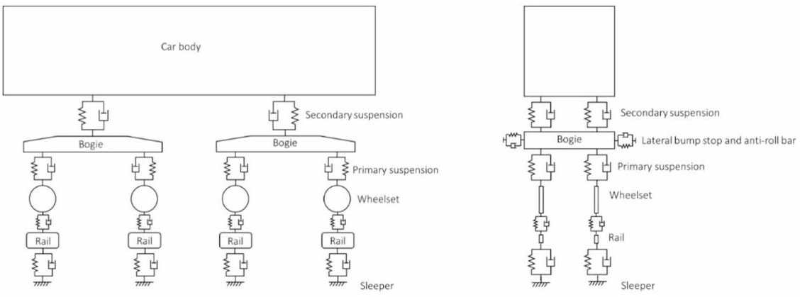

Fig.1 Train diagram

<!-- PDF_PAGE: 8 -->

## 3.2 Simulation setup & degradation scenarios

To evaluate the suspension system under realistic conditions, multiple degradation levels of the primary suspension are simulated. Degradation is introduced as reductions in stiffness and damping, representing gradual wear and energy dissipation loss. The levels are systematically defined to reflect regular condition, mild deterioration, and severe deterioration, allowing the classification of suspension condition by ML models.

The vibrational responses are collected at three measurement levels consisting of wheelsets, bogies, and car body together with along three axes: longitudinal (x), lateral (y), and vertical (z). This multi-axis, multi-level data provides a comprehensive representation of vibration propagation throughout the vehicle. Figure 2 shows the shape and stacking of extracted features, illustrating how time-series data from each axis and level are arranged for machine learning input. From the figure, there are nine channels of features to feed in the machine learning models to detect the degradation of the suspension system where the measurement points on the wheelset, bogie frame, and car body are explicitly marked.

The simulation considers a variety of operational conditions and parameters to create a diverse dataset consisting of vehicle speeds, vehicle masses, curve radius, primary suspension stiffness, and primary suspension damping. Including a wide range of curve radii in the simulations allows the proposed framework to capture the influence of curvature-induced forces on suspension dynamic behavior and degradation sensitivity. The track geometry inputs used in the simulations include measured vertical and lateral track irregularities obtained from field surveys, representing typical operational conditions. These irregularities inherently account for common wheel-rail excitation sources encountered in service, such as rail surface unevenness and wavelength-dependent disturbances. The data variation can be shown in Table 2. These variations are selected to ensure that the dataset covers a realistic operational envelope, capturing the interaction between speed, load, curvature, stiffness reduction and damping loss. It is worht noting that the simualtions are done under the constant speed conditions. However, vehicle speed is not explicitly used as an input variable for degradation detection.

<table border="1"><tr><td rowspan="3">Wheel</td><td>$x_{1}$</td><td>$x_{2}$</td><td>$x_{3}$</td><td>...</td><td>$x_{n}$</td></tr><tr><td>$y_{1}$</td><td>$y_{2}$</td><td>$y_{3}$</td><td>...</td><td>$y_{n}$</td></tr><tr><td>$z_{1}$</td><td>$z_{2}$</td><td>$z_{3}$</td><td>...</td><td>$z_{n}$</td></tr><tr><td rowspan="3">Bogie</td><td>$x_{1}$</td><td>$x_{2}$</td><td>$x_{3}$</td><td></td><td>$x_{n}$</td></tr><tr><td>$y_{1}$</td><td>$y_{2}$</td><td>$y_{3}$</td><td>...</td><td>$y_{n}$</td></tr><tr><td>$z_{1}$</td><td>$z_{2}$</td><td>$z_{3}$</td><td>...</td><td>$z_{n}$</td></tr><tr><td rowspan="3">Car body</td><td>$x_{1}$</td><td>$x_{2}$</td><td>$x_{3}$</td><td></td><td>$x_{n}$</td></tr><tr><td>$y_{1}$</td><td>$y_{2}$</td><td>$y_{3}$</td><td>...</td><td>$y_{n}$</td></tr><tr><td>$z_{1}$</td><td>$z_{2}$</td><td>$z_{3}$</td><td>...</td><td>$z_{n}$</td></tr></table>

Fig.2 Shape and stacking of extracted features

<!-- PDF_PAGE: 9 -->

Table 2 Data variation

<table border="1"><tr><td>Parameter</td><td>Unit</td><td>Condition/values</td><td>Principle</td></tr><tr><td>Speed</td><td>km/h</td><td>50-150</td><td>Covers typical operating speeds for regional and inter-city trains, representing low to high dynamic loading</td></tr><tr><td>Vehicle mass</td><td>kg</td><td>25,000-60,000</td><td>Simulates different loading conditions, from lightly loaded to fully loaded coaches</td></tr><tr><td>Curve radius</td><td>m</td><td>300-6,000</td><td>Includes various curve radii to capture lateral dynamics and hunting effects</td></tr><tr><td>Primary suspension stiffness</td><td>N/m</td><td>Regular:1,220,000Mild:1,037,000Severe:915,000</td><td>Represents progressive degradation of suspension stiffness to simulate real-world deterioration stages</td></tr><tr><td>Primary suspension damping</td><td>Ns/m</td><td>Regular:4,000Mild:3,500Severe:3,000</td><td>Covers nominal and reduced damping, reflecting early-to late-stage deterioration impacts on ride comfort and stability</td></tr></table>

Instead, the proposed model learns hidden patterns embedded in the vibration acceleration signals that reflect suspension dynamic behavior. By covering a wide speed range from 50 to 150 km/h, the training data capture representative vibration characteristics under diverse operating conditions, enabling the model to learn speed-robust features associated with primary suspension degradation rather than speed-specific signatures. The defined degradation levels (regular, mild, and severe) represent relative degradation scenarios introduced for classification and comparative analysis rather than direct maintenance or replacement thresholds. These levels are intended to reflect progressive changes in primary suspension stiffness and damping to support supervised learning and performance evaluation of the proposed monitoring framework. Although the vehicle model includes eight primary suspension units, all primary suspensions are assumed to share identical mechanical properties in this study. Degradation is therefore applied uniformly to all primary suspension elements, representing a global degradation scenario of the primary suspension system rather than the failure of an individual suspension unit. Under this assumption, the proposed prediction framework aims to identify the overall health state of the primary suspension system instead of distinguishing the condition of a specific suspension location. This allows ML models to learn from diverse conditions, improving their robustness and generalization for predictive maintenance applications. In total, these variations generate 1,710 distinct simulation scenarios, which ensures that the dataset captures a wide spectrum of realistic operating conditions. It is worth noting that the three levels of suspension deterioration will be represented as the classes for the monitoring and severity estimation by the ML models.

In the present study, primary suspension stiffness and damping are degraded simultaneously and proportionally to define the regular, mild, and severe degradation scenarios. This assumption reflects a simplified and commonly adopted representation of suspension aging, where multiple mechanical properties deteriorate concurrently due to wear, material fatigue, and environmental effects. Independent or asymmetric degradation cases (e.g., mild stiffness reduction combined with severe damping loss) are not considered in this study to limit the complexity of the classification problem and to focus on the overall degradation trend.

Time-Domain and Frequency-Domain Feature PreparationIn this study, the vibration data collected from the wheelset, bogie, and car body levels vary in length due to differences in operating speeds. Such variation poses a challenge for ML model training, which generally requires input data to have a consistent shape.

<!-- PDF_PAGE: 10 -->

First, frequency-domain feature extraction is employed. The collected multi-axis acceleration signals from the axle box, bogie, and car body are processed to extract representative features for ML input. Several time-frequency transformation techniques are available, such as Short-Time Fourier Transform (STFT), continuous/discrete wavelet transform (CWT/DWT), and Hilbert-Huang transform (HHT) [53]. However, this study focuses primarily on Fast Fourier Transform (FFT) due to its computational efficiency, robustness, and ability to capture frequency-domain characteristics that are highly sensitive to suspension stiffness reduction and damping loss. In addition, FFT is well-suited for vibration analysis since degradation in stiffness or damping often manifests as changes in dominant frequency components and spectral energy distribution. Moreover, FFT has other advantages due to its simplicity and suitability for large-scale data processing. The primary objective of this work is to develop a predictive maintenance framework that is feasible for real-time or near-real-time implementation. Compared to STFT and wavelet-based methods, FFT requires fewer parameters, avoids time-frequency resolution trade-offs, and significantly reduces computational cost. While advanced methods such as STFT or wavelet transform may provide improved time localization, they also increase model complexity and computational burden. A comparative evaluation of different time-frequency methods is therefore considered outside the scope of the present study and is identified as a potential direction for future research.

The FFT converts the time-domain signal x (t) into its frequency-domain representation X(f) according to Eq.1 where x (n) is the discrete time signal, N is the number of samples, and X(f) represents the amplitude and phase information of each frequency component.

$$
X (f) = \sum_ {n = 0} ^ {N - 1} x (n) \cdot e ^ {- j 2 \pi / N}
$$

The frequency spectrum is computed for each axis (longitudinal, lateral, vertical) and for each measurement level (wheelset, bogie, and car body). To reduce data dimensionality while preserving relevant information, a set of selected frequency bins is extracted within the range of interest (typically 0-50 Hz, which covers bounce, pitch, yaw, and lateral vibration modes of railway vehicles). The spectral amplitudes are then stacked to form a structured input tensor suitable for machine learning models, as shown in Fig. 2.

Second, time-domain feature preparation with zero-padding is another solution. For experiments involving raw time-domain data (without transformation), zero-padding is applied to standardize the length of all samples. Signals shorter than the desired length will be padded with zeros until they match the longest sample. This procedure preserves the temporal structure of the original signal while making the feature vectors compatible with ML models, which require fixed input dimensions.

Both time and frequency domain feature preparations will be conducted to develop the ML models and investigate the suitable data preprocessing approach for each ML model. After either FFT transformation or zero-padding, all features are normalized using z-score normalization to ensure that input magnitudes are comparable across different measurement points and axes. This step avoids bias toward high-amplitude signals and facilitates stable model training. It should be noted that this study does not

<!-- PDF_PAGE: 11 -->

employ joint time-frequency transformation methods. Instead, time-domain features and frequency-domain (FFT-based) features are prepared independently to investigate their respective effectiveness for suspension degradation classification.

## 3.3 Deep learning model development

To classify suspension condition (regular, mild deterioration, severe deterioration), five deep learning architectures, namely, CNN, LSTM, GRU, CNN-LSTM, and CNN-GRU are implemented. The models are developed, trained, and evaluated on features extracted from nine acceleration channels (x, y, z directions for wheel, bogie, and car body, levels), assuming that being installed at the related location of the rolling stock parts. Features are imported from nine dedicated channels and stacked into a unified input tensor of shape (samples, timesteps, features) where features are 9. To standardize input shapes, FFT is applied to convert time-domain signals into fixed-length spectral representations, and zero-padding is used for unprocessed time-domain data to ensure consistent lengths across all samples. This preprocessing step is crucial for batch training, as ML frameworks require uniform input dimensions.

CNN is particularly effective for extracting local patterns from sequential or spatial data. In this study, CNN layers scan through the time or frequency-domain vibration signals to capture local trends such as repetitive oscillations or sudden peaks caused by degraded suspension components. By applying convolutions and pooling, CNN reduce dimensionality and focus on the most significant features, making it well-suited for vibration-based fault classification. LSTM is a type of Recurrent Neural Network (RNN) designed to capture long-term temporal dependencies in sequential data. It uses a gating mechanism (input, forget, output gates) to retain relevant past information while discarding irrelevant signals. In suspension monitoring, LSTM helps learn patterns that evolve slowly over time, such as gradual changes in oscillation frequency or amplitude as the suspension degrades. GRU is similar to LSTM but with a simpler architecture (only update and reset gates), making it computationally lighter while maintaining the ability to capture temporal dependencies. It is particularly advantageous when the dataset is large or when real-time inference speed is critical, as it typically trains faster than LSTM. CNN-LSTM combines CNN's ability to extract local features with LSTM's ability to learn temporal sequences. The CNN layers first detect relevant local vibration patterns from the raw input, and the LSTM layers then analyze how those patterns evolve over time. This hybrid approach is ideal for complex vibration signals that have both spatial (frequency) and temporal variations. CNN-GRU follows the same principle as CNN-LSTM but uses a GRU layer instead of LSTM. This reduces computational complexity and training time, making it a good compromise when deploying on systems with limited resources. CNN-GRU is often chosen for near-real-time predictive maintenance tasks where inference latency must be minimized. The examples of each model's architecture are shown in Fig. 3.

To ensure the ML models' performance, hyperparameter tuning plays a critical role in achieving optimal performance for suspension degradation monitoring. Unlike model weights, which are learned during training, hyperparameters such as learning rate, batch size, number of epochs, number of convolution filters, number of LSTM or GRU cells, kernel size, number of hidden units, or dropout rate must be set prior to training. Selecting inappropriate hyperparameters can lead to underfitting, overfitting, or unnecessarily

<!-- PDF_PAGE: 12 -->

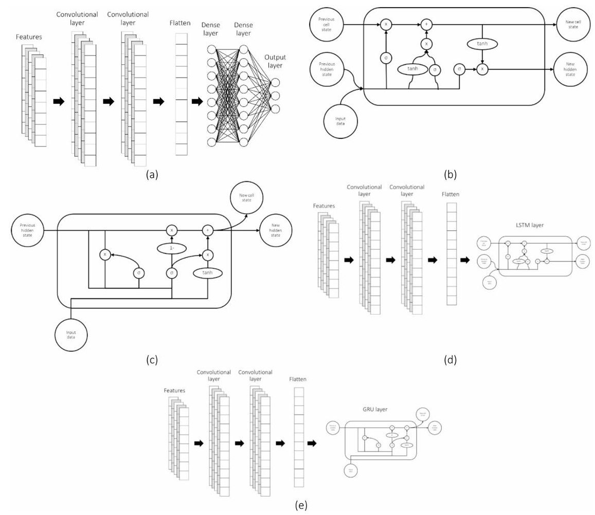

Fig. 3 Examples of models' architecture: a CNN, b LSTM, c GRU, d CNN-LSTM, and e CNN-GRU

Table 3 List of tunable hyperparameters

<table border="1"><tr><td>Model</td><td>Hyperparameter</td><td>Model</td><td>Hyperparameter</td></tr><tr><td rowspan="8">CNN</td><td>Number of Filters</td><td>LSTM</td><td>Number of Units</td></tr><tr><td>Kernel Size</td><td></td><td>Number of Layers</td></tr><tr><td>Stride</td><td></td><td>Recurrent Dropout</td></tr><tr><td>Padding</td><td></td><td>Activation Function</td></tr><tr><td>Number of Convolutional Layers</td><td></td><td>Return Sequences</td></tr><tr><td>Pooling Type &amp; Size</td><td></td><td></td></tr><tr><td>Activation Function</td><td>Shared/global</td><td>Learning Rate</td></tr><tr><td>Dropout Rate</td><td></td><td>Optimizer</td></tr><tr><td rowspan="4">GRU</td><td>Number of Units</td><td></td><td>Batch Size</td></tr><tr><td>Number of Layers</td><td></td><td>Number of Epochs</td></tr><tr><td>Recurrent Dropout</td><td></td><td>Number of hidden layers</td></tr><tr><td>Activation Function</td><td></td><td>Number of hidden nodes</td></tr></table>

long training times. In this study, a grid search is performed to find the most effective hyperparameter configuration for each model architecture. The tuning process focused on maximizing classification accuracy while minimizing training time and overfitting risk. The list of tunable hyperparameters is shown in Table 3.

## 3.4 Model training and evaluation

To assess the performance of the developed ML models, the dataset is divided into training and testing sets using a 70/30 split, ensuring that each degradation level (regular, mild, and severe) is stratified across the sets. Stratification guarantees that each class is proportionally represented, avoiding biased training and evaluation. The models are

<!-- PDF_PAGE: 13 -->

trained using mini-batch gradient descent with a varied batch size, and training is performed for 100 epochs. To monitor model convergence and prevent overfitting, validation splits of 30% of the training set are used during training. Evaluation of the models is conducted using multiple metrics to provide a comprehensive view of classification performance consisting of accuracy which is the ratio of correctly classified samples to total samples, F1-score which is the harmonic mean of precision and recall, providing a balanced measure for class-imbalanced data, precision which is the ratio of correctly predicted positive observations to the total predicted positives indicating how many of the samples predicted as a specific class are actually correct, recall which is the ratio of correctly predicted positive observations to all actual positives indicating how well the model captures all samples of a specific class, and training time which measured to compare computational efficiency among the different model architectures. The equations used to calculate each indicator are shown as Eq.2 to Eq.5. All computations are conducted on hardware with the computational setup included as shown in Table 4.

$$
A c c u r a c y = \frac {T P + T N}{T P + T N + F P + F N}
$$

$$
P r e c i s i o n = \frac {T P}{T P + F P}
$$

$$
R e c a l l = \frac {T P}{T P + F N}
$$

$$
F 1 - s c o r e = 2 \cdot \frac {P r e c i s i o n \cdot R e c a l l}{P r e c i s i o n + R e c a l l}
$$

## 4 Result and discussion

## 4.1 Dataset overview

The dataset consists of multi-level, multi-axis vibration measurements collected from the car body, bogie, and wheel locations of the railway vehicle. Each location is measured in three orthogonal directions (X, Y, Z axes), resulting in nine vibration channels per simulation case. This configuration captures the full dynamic response of the vehicle and suspension system under various operating and degradation conditions.

Figure 4 presents examples of vibration signals for the car body, bogie, and wheel under different suspension conditions. Preliminary observations reveal that car body vibrations exhibit the most pronounced difference between regular suspension and severe deterioration, particularly at a representative operating condition of 50 km/h speed, 25,000 kg vehicle mass, and 1500 m curve radius. Among the three axes, the Z-axis (vertical vibration) shows the largest variation, confirming that vertical ride dynamics are most sensitive to suspension stiffness and damping changes.

Table 4 Hardware specification

<table border="1"><tr><td>Component</td><td>Specification</td></tr><tr><td>CPU</td><td>Intel Core i5-12400 F,6 cores</td></tr><tr><td>GPU</td><td>NVIDIA RTX 4060,8 GB VRAM</td></tr><tr><td>RAM</td><td>32 GB DDR4</td></tr><tr><td>Storage</td><td>NVMe SSD 1 TB</td></tr><tr><td>Software</td><td>Python, TensorFlow, Scikit-learn,Pandas,NumPy</td></tr></table>

<!-- PDF_PAGE: 14 -->

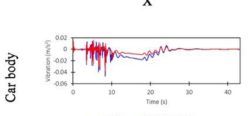

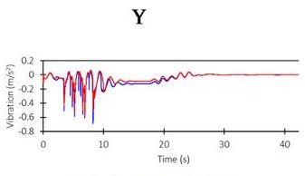

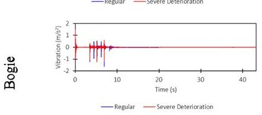

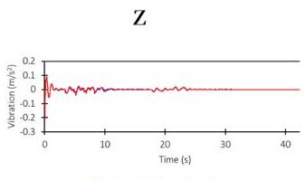

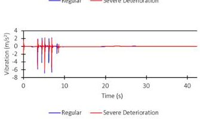

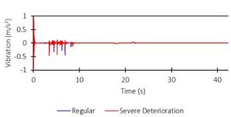

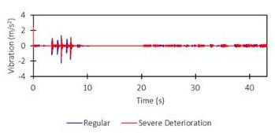

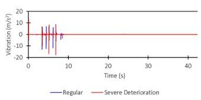

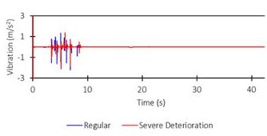

(a)

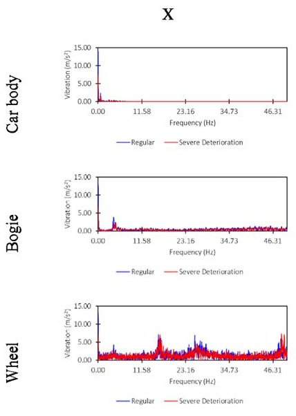

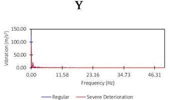

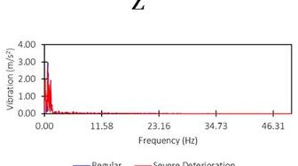

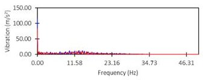

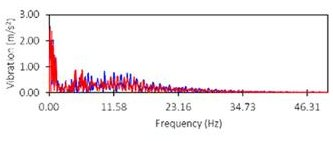

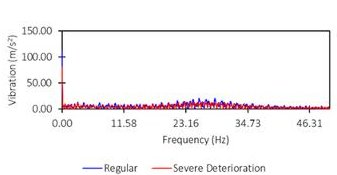

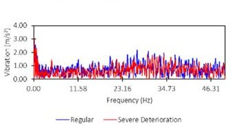

(b)

Fig.4 Examples of vibration results (a) time-domain data and (b) frequency-domain data

## 4.2 Machine learning model performance

The performance of five ML models which are CNN, LSTM, GRU, CNN-LSTM, and CNN-GRU is systematically evaluated on the vibration dataset. Figure 5 illustrates the training loss and accuracy curves, confirming that all models converged but at different speeds and levels of generalization. Table 5 summarizes the accuracy and training time for each model. As discussed, two data preprocessing approaches consisting of time-domain with zero-padding and frequency-domain using FFT are applied to train each ML model. The results indicate that CNN performs best with zero-padding in the time domain, while LSTM, GRU, and hybrid models show relatively better suitability when trained on FFT-transformed data.

The results clearly demonstrate that CNN with zero-padding is the most effective approach for suspension stiffness reduction and damping loss classification, outperforming all other models in both convergence speed and final accuracy. CNN achieved 1.00 accuracy by epoch 21 with a near-negligible loss (0.0076), converging rapidly after epoch 10 when accuracy had already surpassed 0.97 and loss had dropped below 0.23. The smooth and monotonic decline in loss highlights stable gradient updates and highly

<!-- PDF_PAGE: 15 -->

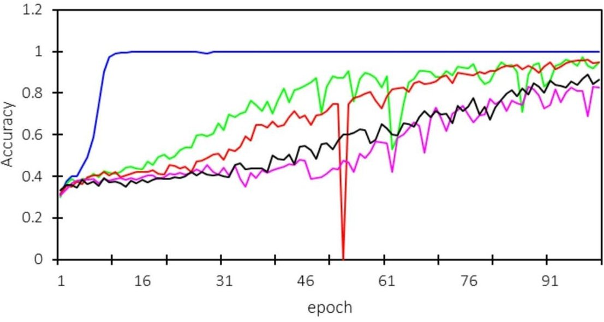

(a)

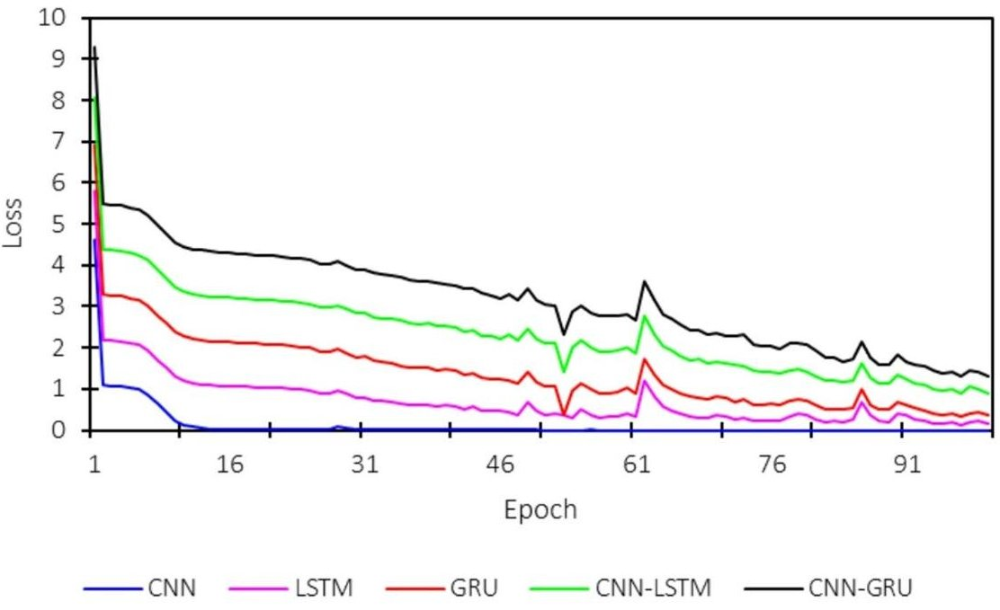

(b)

Fig. 5 Training loss and accuracy: (a) Accuracy and (b) loss

effective feature extraction by the convolutional layers. Importantly, zero-padding preserved the full sequence length and edge information, enabling CNN to learn crucial spatial-temporal vibration patterns directly from raw, time-domain signals. The superior performance of the CNN with zero-padded time-domain inputs can be attributed to its ability to directly capture localized, high-frequency transients and short-duration vibration patterns that are strongly associated with suspension stiffness and damping degradation. Unlike FFT-based representations, which emphasize global spectral characteristics and may obscure temporal localization, raw time-domain signals preserve both amplitude and phase information critical for detecting early-stage deterioration. The convolutional filters learn discriminative patterns such as abrupt peaks, oscillation

<!-- PDF_PAGE: 16 -->

Table 5 Model performance and training time

<table border="1"><tr><td>Model</td><td>Class</td><td>Precision</td><td>Recall</td><td>F1-score</td><td>Accuracy</td><td>Training time(s)</td></tr><tr><td rowspan="3">CNN(zero-padding)</td><td>0</td><td>0.98</td><td>1.00</td><td>0.99</td><td>0.98</td><td>91.90</td></tr><tr><td>1</td><td>0.98</td><td>0.98</td><td>0.98</td><td></td><td></td></tr><tr><td>2</td><td>0.99</td><td>0.97</td><td>0.98</td><td></td><td></td></tr><tr><td rowspan="3">LSTM(FFT)</td><td>0</td><td>0.88</td><td>0.93</td><td>0.91</td><td>0.82</td><td>761.87</td></tr><tr><td>1</td><td>0.75</td><td>0.81</td><td>0.78</td><td></td><td></td></tr><tr><td>2</td><td>0.85</td><td>0.74</td><td>0.79</td><td></td><td></td></tr><tr><td rowspan="3">GRU(FFT)</td><td>0</td><td>0.90</td><td>0.84</td><td>0.87</td><td>0.81</td><td>593.19</td></tr><tr><td>1</td><td>0.77</td><td>0.75</td><td>0.76</td><td></td><td></td></tr><tr><td>2</td><td>0.78</td><td>0.85</td><td>0.82</td><td></td><td></td></tr><tr><td rowspan="3">CNN-LSTM(FFT)</td><td>0</td><td>0.72</td><td>0.88</td><td>0.79</td><td>0.78</td><td>303.71</td></tr><tr><td>1</td><td>0.76</td><td>0.60</td><td>0.67</td><td></td><td></td></tr><tr><td>2</td><td>0.88</td><td>0.87</td><td>0.87</td><td></td><td></td></tr><tr><td rowspan="3">CNN-GRU(FFT)</td><td>0</td><td>0.91</td><td>0.82</td><td>0.86</td><td>0.75</td><td>340.63</td></tr><tr><td>1</td><td>0.67</td><td>0.68</td><td>0.67</td><td></td><td></td></tr><tr><td>2</td><td>0.70</td><td>0.76</td><td>0.73</td><td></td><td></td></tr></table>

Table 6 Confusion matrix of CNN

<table border="1"><tr><td>True/predicted</td><td>0</td><td>1</td><td>2</td></tr><tr><td>0</td><td>171</td><td>0</td><td>0</td></tr><tr><td>1</td><td>3</td><td>167</td><td>1</td></tr><tr><td>2</td><td>1</td><td>4</td><td>166</td></tr></table>

bursts, and repetitive local structures, which are particularly prominent in vertical (Z-axis) vibrations. This explains why CNN benefits more from time-domain inputs than recurrent or hybrid architectures trained on frequency-domain features.

In contrast, LSTM and GRU which are trained on FFT-transformed inputs converge more slowly and reach lower peak accuracies, with LSTM topping out at $ \sim0.96 $ by epoch 97 and GRU slightly lower ( $ \sim0.95 $ ), both with residual loss values $ \geq0.18 $ . This suggests that transforming vibration signals into the frequency domain may weaken temporal dependencies, limiting the sequential learning advantages of recurrent architectures. Hybrid models (CNN-LSTM and CNN-GRU) did not improve performance, instead saturating at 0.82-0.83 and $ \sim0.86 $ accuracy, respectively, likely due to added model complexity and suboptimal integration between convolutional and recurrent components.

Overall, CNN achieved the best classification performance, with an accuracy of 0.98 and F1-scores consistently above 0.98 across all classes (regular, mild deterioration, and severe deterioration). This indicates that CNN is highly effective in capturing the spatial patterns present in the vibration signals. CNN is also the most computationally efficient, completing training in only 91.90 s when the number of epochs is 100, which makes it suitable for iterative retraining and online adaptation in practical condition monitoring systems. The confusion matrix of the CNN model is shown in Table 6.

LSTM and GRU, while theoretically strong for time-series modeling, underperformed compared to CNN in this study, achieving accuracies of 0.82 and 0.81 respectively. Both models struggle particularly with distinguishing mild and severe deterioration, as seen from the lower recall values in their classification reports. In addition, their training times are substantially longer (761.87 s for LSTM, 593.19 s for GRU), which may limit their applicability in scenarios with large-scale or real-time data streams.

<!-- PDF_PAGE: 17 -->

Hybrid architectures (CNN-LSTM and CNN-GRU) do not show the improvements over standalone recurrent models, achieving 0.78 and 0.75 accuracy, respectively. These results suggest that combining convolutional layers with recurrent layers does not improve temporal feature extraction and does not surpass pure CNN performance for this application.

Overall, these findings confirm that CNN is particularly well-suited for raw, time-domain vibration data, where high-frequency transients and local signal fluctuations carry essential diagnostic information. Its ability to capture these patterns without frequency transformation allows for both superior accuracy and faster convergence, making CNN an ideal choice for real-time condition monitoring and retraining scenarios, where computational efficiency and reliability are critical.

## 4.3 Hyperparameter tuning and model sensitivity

Hyperparameter tuning is performed to ensure fair comparison and peak performance across all ML models. Parameters such as learning rate, batch size, number of filters (for CNN), number of recurrent units (for LSTM/GRU), dropout rate, or learning rate are tuned using a combination of grid search as mentioned in Table 3. The final optimized hyperparameters used for CNN model training are summarized in Table 7. These tuned configurations provide a balance between convergence speed, classification accuracy, and prevention of overfitting, making them suitable for robust suspension stiffness reduction and damping loss detection.

To evaluate the robustness of the trained CNN model, sensitivity analysis is performed by systematically removing specific measurement axes (x, y, and z) and data from different components (wheel, bogie, and car body). Table 8 summarizes the classification accuracy for each subset.

The results reveal several key insights. Bogie and car body measurements yield the highest classification accuracy (0.99), making them highly informative for detecting suspension deterioration. Among individual axes, the Z-axis consistently outperforms X and Y, achieving 0.98 accuracy, likely due to its direct alignment with vertical suspension motion. Wheel-only data, particularly Wheel-Y, shows poor classification accuracy (0.33), suggesting that wheel-lateral measurements alone may not capture sufficient information about suspension health.

Table 7 Optimized hyperparameters of CNN

<table border="1"><tr><td>Hyperparameter</td><td>Tuned hyperparameter</td></tr><tr><td>Number of Convolutional Layers</td><td>2</td></tr><tr><td>Number of Filters</td><td>32 and 64 for 1st and 2nd convolutional layers respectively</td></tr><tr><td>Kernel Size</td><td>3</td></tr><tr><td>Stride</td><td>1</td></tr><tr><td>Padding</td><td>Yes</td></tr><tr><td>Pooling Type &amp; Size</td><td>Max pooling with a size of 2 after each convolutional layer</td></tr><tr><td>Number of hidden layers</td><td>1</td></tr><tr><td>Number of hidden nodes</td><td>64</td></tr><tr><td>Activation Function</td><td>ReLU and Softmax (output layer)</td></tr><tr><td>Dropout Rate</td><td>N/A</td></tr><tr><td>Learning Rate</td><td>0.001</td></tr><tr><td>Optimizer</td><td>Adam</td></tr><tr><td>Batch Size</td><td>32</td></tr></table>

<!-- PDF_PAGE: 18 -->

Table 8 Summarized table from sensitivity analysis

<table border="1"><tr><td>Subset</td><td>Accuracy</td><td>Subset</td><td>Accuracy</td></tr><tr><td>Wheel only</td><td>0.81</td><td>Wheel Z</td><td>0.84</td></tr><tr><td>Bogie only</td><td>0.99</td><td>Bogie X</td><td>0.96</td></tr><tr><td>Car body only</td><td>0.99</td><td>Bogie Y</td><td>0.90</td></tr><tr><td>X only</td><td>0.92</td><td>Bogie Z</td><td>0.98</td></tr><tr><td>Y only</td><td>0.88</td><td>Car body X</td><td>0.92</td></tr><tr><td>Z only</td><td>0.98</td><td>Car body Y</td><td>0.66</td></tr><tr><td>Wheel X</td><td>0.70</td><td>Car body Z</td><td>0.98</td></tr><tr><td>Wheel Y</td><td>0.33</td><td></td><td></td></tr></table>

From a practical standpoint, this finding is highly valuable: installing sensors on the bogie or car body and focusing on Z-axis data provides near-optimal performance while reducing the number of required sensors. This simplifies inspection and reduces maintenance costs, making the system easier to deploy in real-world condition monitoring frameworks. Although vertical accelerations from the bogie and car body were identified as the most informative features, the vibration responses are not solely driven by suspension stiffness reduction and damping loss. In the present study, the inclusion of measured track irregularities ensures that the learning process reflects realistic wheel-rail excitation conditions rather than idealized inputs. As a result, the trained CNN implicitly learns to distinguish suspension-related vibration patterns from background excitations induced by track irregularities.

The dominance of Z-axis (vertical) vibration data from the bogie and car body is closely related to the physical characteristics of the railway suspension system. The primary suspension is primarily designed to support vertical loads and isolate vertical wheel-rail excitations arising from track irregularities. Consequently, degradation in suspension stiffness and damping directly alters the vertical dynamic response, leading to more pronounced changes in Z-axis accelerations. The bogie and car body levels further amplify these effects, as they reflect the cumulative filtering performance of the suspension system rather than localized wheel-rail contact dynamics. As a result, vertical vibrations measured at the bogie and car body provide more sensitive and reliable indicators of suspension degradation than longitudinal or lateral responses.

Compared to the prior studies [43-45] when the highest accuracy is 0.95, the present work achieves near-perfect classification accuracy ( $ \approx $ 0.98-1.00) using a CNN with zero-padded time-domain input, outperforming traditional ML and even some deep learning approaches in the literature. Unlike studies that rely solely on axle box or car body acceleration, this study leverages multi-axis (x, y, and z) and multi-level (wheel, bogie, car body) vibration measurements, providing a richer representation of system dynamics.

Moreover, by comparing time-domain and frequency-domain preprocessing, this study demonstrates that CNN with zero-padding is better suited for raw vibration signals, enabling faster convergence and lower computational cost than models trained solely on FFT-transformed features. This combination of methodological rigor and practical insight provides a significant advancement over prior work by emphasizing not just model accuracy but also feasibility for real-time implementation and cost-effective sensor deployment. The model can be integrated into vehicle condition monitoring frameworks to provide continuous health assessment, enabling early fault detection and informed maintenance planning. This approach supports predictive maintenance

<!-- PDF_PAGE: 19 -->

by minimizing unscheduled downtime, optimizing inspection schedules, and improving overall vehicle reliability.

## 5 Conclusion and future work

This study demonstrates that multi-level, multi-axis vibration data can be effectively used to classify suspension degradation levels which consist of stiffness reduction and damping loss in rail vehicles. CNN with zero-padding on raw, time-domain signals achieves the highest accuracy (0.98) and fastest convergence, outperforming LSTM, GRU, and hybrid models trained on FFT-transformed inputs. Sensitivity analysis reveals that car body and bogie vibrations, particularly along the Z-axis, are the most informative, while using selective sensor placements can still achieve high classification performance (accuracy>0.98).

The findings of this study demonstrate that the proposed vibration-based classification framework has strong potential for practical suspension condition monitoring. By identifying that bogie and car body vertical accelerations provide near-optimal diagnostic performance, the approach offers clear guidance for sensor placement optimization, enabling effective monitoring with a reduced number of sensors and lower installation cost. In addition, the superior performance and fast convergence of the CNN model using zero-padded time-domain data indicate that the framework is computationally efficient and suitable for near-real-time implementation in onboard condition monitoring systems. Although the present results are obtained from simulation data, the systematic inclusion of diverse operating conditions—such as varying speed, load, and curve radius-enhances the robustness of the learned patterns and supports their transferability to real-world scenarios. With further validation using in-situ measurements, the proposed method provides a practical pathway toward predictive maintenance, supporting early fault detection, optimized maintenance scheduling, and improved operational reliability of railway vehicles.

The proposed framework demonstrates strong potential for real-time suspension condition monitoring; however, its practical deployment will require further validation using in-situ vibration measurements from operational railway vehicles.

For the limitation, the findings presented in this study are derived from vibration data generated using a validated multi-body system simulation model. Although the model provides realistic representations of vehicle-track dynamics, the results have not yet been validated using in-situ measurements from operational railway vehicles. Therefore, further experimental verification with real-train data is required before the proposed approach can be applied in operational environments. Nevertheless, real-world train operation involves continuously varying speeds, resulting in non-stationary vibration responses. While the use of multiple discrete speed levels is expected to provide reasonable representation of practical operating conditions, the influence of transient acceleration and deceleration phases is not explicitly modeled in the present study. Future work will incorporate variable-speed simulations and real measured speed profiles to further enhance the robustness and applicability of the proposed framework. While tangent-track operation represents an important operating condition, its dynamic responses are generally less sensitive to suspension degradation compared to curved-track scenarios. The inclusion of straight-line conditions will be considered in future studies to further evaluate the generalizability of the proposed method. Local or asymmetric degradation

<!-- PDF_PAGE: 20 -->

of individual primary suspension units is not considered in this study. Therefore, future work will extend the framework to distinguish location-specific suspension degradation by incorporating asymmetric degradation scenarios and localized vibration features. In addition, it is worth noting that the primary suspension stiffness and damping in this study are assumed to degrade together when the real situation might have different behavior such as the primary suspension stiffness condition is poorer than the damper. Also, it is assumed that all primary suspensions degrade at the same level when each suspension can be degraded differently based on varied conditions.

Future research should focus on including scenarios involving secondary suspension faults and combined defect conditions. Investigation under diverse operational conditions. Further studies may explore additional ML architectures, feature fusion techniques, and online adaptive deployment to enhance predictive maintenance capabilities in practical rail systems. In addition, future work will focus on validating the proposed predictive maintenance framework using in-situ vibration measurements collected from operational railway vehicles. Real-train test data will be used to assess the robustness of the trained models under practical operating conditions, including measurement noise, environmental disturbances, and operational variability. Future work will extend the dataset to explicitly include localized wheel and rail defects, such as wheel out-ofroundness and rail corrugation, to further evaluate model robustness and improve fault discrimination under more severe wheel-rail excitation conditions. This validation step will further enhance the reliability and applicability of the proposed approach for real-world deployment.

## Acknowledgements

This research was supported by Faculty of Engineering, Bangkokthonburi University.

## Author contributions

Conceptualization: J.S. and C.P., Data curation: J.S., Formal analysis: J.S. and C.P., Investigation: J.S., Methodology: J.S. and C.P., Project administration: J.S., Resources: C.P., Software: J.S., Supervision: J.S., Validation: J.S., Visualization: J.S., Writing - original draft: J.S., and Writing - review & editing: J.S. and C.P.

## Funding

Not applicable.

## Data availability

Data cannot be shared openly, but is available on request from the corresponding author.

## Declarations

Ethics approval and consent to participate Not applicable.

Consent for publication Not applicable.

## Competing interests

The authors declare no competing interests.

Received: 22 September 2025 / Accepted: 3 March 2026

Published online: 07 March 2026

## References

1. Stichel S, Persson R, Giossi R. Improving rail vehicle dynamic performance with active suspension. High-speed Railway. 2023;1(1):23-30.

2. Zhang F, et al. Novel method for measuring high-frequency wheel-rail force considering wheelset vibrations. Sci Rep. 2025;15(1):15044.

3. Zeng J, Wu P. Study on the wheel/rail interaction and derailment safety. Wear. 2008;265:1452-9.

4. Dabbas Y, et al. Analytical study on the low-frequency vibrations isolation system for vehicle's seats using quasi-zero-stiffness isolator. Appl Sci. 2022;12:2418.

<!-- PDF_PAGE: 21 -->

5. Dumitriu M. Influence of the suspension damping on ride comfort of passenger railway vehicles. UPB Sci Bull Ser D Mech Eng. 2012;74(4):75-90.

6. SekuliC D, DedoviC V.The effect of stiffness and damping of the suspension system elements on the optimisation of the vibrational behaviour of a bus. Int J Traffic Transp Eng. 2011;1(4):231-44.

7. Knap L, Graczykowski C, Holnicki-Szulc J. Vehicle Vibration Reduction Using Hydraulic Dampers with Piezoelectric Valves. Sensors. 2025. https://doi.org/10.3390/s25041156.

8. Zuska A, Jackowski J. Influence of Changes in Stiffness and Damping of Tyre Wheels on the Outcome of the Condition Assessment of Motor Vehicle Shock Absorbers. Energies. 2023;16:3876.

9. Öberg J. E <>Andersson 2009 Determining the deterioration cost for railway tracks. Proc Institution Mech Eng Part F-journal Rail Rapid Transit - PROC INST MECH ENG F-J RAIL R 223 p121-129.

10. Vinberg EM, et al. Railway applications of condition monitoring. Stockholm: KTH Royal Institute of Technology; 2018.

11. Berrade MD, Calvo E, Badia FG. Maintenance of systems with critical components. Prevention of early failures and wearout. Comput Ind Eng. 2023;181:109291.

12. Ewin G, Oye E. Transitioning from corrective to preventive maintenance strategies: enhancing equipment reliability and efficiency. 2025.

13. Paul AL, Odu A, Oluwaseyi J. Predictive maintenance: leveraging machine learning for equipment health monitoring. Res Gate. 2024.

14. Ahmed Murtaza A, et al. Paradigm shift for predictive maintenance and condition monitoring from Industry 4.0 to Industry 5.0: A systematic review, challenges and case study. Results Eng. 2024;24:102935.

15. Ravi A, Surabhi M. Machine Learning Applications in Predictive Maintenance for Vehicles: Case Studies. Int J Eng Comput Sci. 2022;11:25628-40.

16. Celestin M. How predictive maintenance in logistics fleets is reducing equipment downtime and operational losses. Brainae J Bus Sci Technol (BJBST). 2023;7(10):1023-33.

17. Malekjafarian A, et al Railway track loss-of-stiffness detection using bogie filtered displacement data measured on a passing train. Infrastructures. 2021;6:93. https://doi.org/10.3390/infrastructures6060093.

18. Melnik R, Koziak S. Rail vehicle suspension condition monitoring - approach and implementation. J VibroEng. 2017;19:487-501.

19. Kivanç l, et al. Condition-based maintenance for multi-component systems: A scalable optimization model with two thresholds. Reliab Eng Syst Saf. 2025;254:110634.

20. Schlake B, Barkan C, Edwards J. Train Delay and Economic Impact of In-Service Failures of Railroad Rolling Stock. Transp Res Record: J Transp Res Board. 2011;2261:124-33.

21. Tsunashima H, et al. Condition monitoring of railway track using in-service vehicle. J Mech Syst Transp Logistics. 2012;3(1):154-65.

22. Qian P, Ma X, Cross P. An integrated data-driven model-based approach to condition monitoring of the wind turbine gearbox. IET Renew Power Gener. 2017;11(9):1177-85.

23. Badakhshan E, Mustafee N, Bahadori R. Application of simulation and machine learning in supply chain management: A synthesis of the literature using the Sim-ML literature classification framework. Comput Ind Eng. 2024;198:110649.

24. Mohammadi S, et al. Rail Defect Classification with Deep Learning Method. Green Energy Intell Transp. 2025. https://doi.org/10.1016/j.geits.2025.100332.

25. Shafique R, et al. Improved railway track faults detection using Mel-frequency cepstral coefficient and constant-Q transform features. Sci Rep. 2025;15(1):30914.

26. Wang Q, et al. Compilation of wheel-rail comprehensive irregularity spectrum for subway vehicle. Probab Eng Mech. 2024;78:103691.

27. Zhai W, et al. Suspended monorail system dynamics: fundamental and practice. Railway Eng Sci. 2025;33(3):379-413.

28. Sharma SK, et al. Modelling and Dynamic Analysis of Adaptive Neuro-Fuzzy Inference System-Based Intelligent Control Suspension System for Passenger Rail Vehicles Using Magnetorheological Damper for Improving Ride Index. Sustainability. 2023. https://doi.org/10.3390/su151612529.

29. Wang T, et al. Fatigue analysis of coil springs in the primary suspension of a railway vehicle based on synthetic spectrum for time-varying vibration load. Proc Institution Mech Eng Part F: J Rail Rapid Transit. 2023;237(9):1163-75.

30. Shi H, et al. Estimation of the damping effects of suspension systems on railway vehicles using wedge tests. Proc Institution Mech Eng Part F: J Rail Rapid Transit. 2014;230(2):392-406.

31. Hawari H, Murray M. Effects of Train Characteristics on the Rate of Deterioration of Track Roughness. J Eng Mech. 2008;134(3):234-9.

32. Wang Q, et al. Analysis and correction of the consistency problem in the calculation method for Sperling human vibration comfort evaluation index in railway vehicles. Proc Institution Mech Eng Part F: J Rail Rapid Transit. 2025;239(10):819-30.

33. Silva P et al. Railways passenger comfort/discomfort: objective evaluation. New research on railway engineering and transportation. IntechOpen: London. 2023.

34. Kumar A, Harsha SP. A systematic literature review of defect detection in railways using machine vision-based inspection methods. Int J Transp Sci Technol. 2025;18:207-26.

35. Popa G, et al. Vibration Measurement and Monitoring in Railway Vehicles. Technologies; 2025. https://doi.org/10.3390/technologies13080370.

36. Wilk S, Stark T, Rose J. Evaluating tie support at railway bridge transitions. Proc Institution Mech Eng Part F J Rail Rapid Transit. 2015;230(4):1336-50.

37. Pires AC, et al. Measuring vertical track irregularities from instrumented heavy haul railway vehicle data using machine learning. Eng Appl Artif Intell. 2024;127:107191.

38. Rahman M et al. Challenges for a railway inspection and repair system from railway infrastructure. In: 2022 10th international conference on control, mechatronics and automation (ICCMA). IEEE. 2022. 210-215.

40. Ali F, et al. Feasibility Study of Signal Processing Techniques for Vibration-Based Structural Health Monitoring in Residential Buildings. Sensors. 2025. https://doi.org/10.3390/s25072269.

41. Wei X, Jia L, Liu H. A comparative study on fault detection methods of rail vehicle suspension systems based on acceleration measurements. Veh Syst Dyn. 2013;51(5):700-20.

<!-- PDF_PAGE: 22 -->

42. Vlachospyros G, Fassois SD, Sakellariou JS. On-board vibration-based robust and unsupervised degradation detection in railway suspensions under various travelling speeds via a Multiple Model framework. Veh Syst Dyn. 2024;62(6):1446-70.

43. Karlsson H, et al. Condition Monitoring of Rail Vehicle Suspension Elements: A Machine Learning Approach. in Advances in Dynamics of Vehicles on Roads and Tracks. Cham: Springer International Publishing; 2020.

44. Pan Y, et al. Machine learning approaches to estimate suspension parameters for performance degradation assessment using accurate dynamic simulations. Reliab Eng Syst Saf. 2023;230:108950.

45. Ye Y, Huang P, Zhang Y. Deep learning-based fault diagnostic network of high-speed train secondary suspension systems for immunity to track irregularities and wheel wear. Railway Eng Sci. 2022;30(1):96-116.

46. e Silva JVRS, et al. Influence of wheel tread wear on Rolling Contact Fatigue and on the dynamics of railway vehicles. Wear. 2023;523:204735.

47. Iwnicki S. The Manchester benchmarks for rail vehicle simulation. London: Routledge; 2017.

48. Qi Y, et al. Research of operation mode of high-speed trains on the effect of rail wear evolution law. Industrial Lubrication Tribology. 2023;75(10):1262-71.

49. Kisilowski J, Kowalik R. Mechanical wear contact between the wheel and rail on a turnout with variable stiffness. Energies. 2021;14(22):7520.

50. Zhao C, et al. New floating slab track isolator for vibration reduction using particle damping vibration absorption and bandgap vibration resistance. Constr Build Mater. 2022;336:127561.

51. Zeng Z-P, et al. The influence of track structure parameters on the dynamic response sensitivity of heavy haul train-LVT system. Appl Sci. 2021;11(24):11830.

52. Yin X, et al. The impact of wheel polygonisation to the railway corrugation. Veh Syst Dyn. 2022;60(8):2636-57.

53. Orhan A, et al. A Comparative Study of Time-Frequency Representations for Bearing and Rotating Fault Diagnosis Using Vision Transformer. Machines. 2025;13:737.

## Publisher's Note

Springer Nature remains neutral with regard to jurisdictional claims in published maps and institutional affiliations.