<!-- PDF_PAGE: 1 -->

Check for updates

OPEN

# Intelligent tool wear monitoring using XGBoost, SVR, and DNN models in NMQL environment

Omar Almomani $ ^{1} $ B. Venkatesh $ ^{2} $ Shivam P. Chaudhary $ ^{3} $ Akanksha Mishra $ ^{4} $ S. Sujai $ ^{5} $ Shahbaz Juneja $ ^{6} $ Premananda Pradhan $ ^{7} $ S. P. Venkatesan $ ^{8} $ Abhijit Bhowmik $ ^{9,10} $ & Yalew Tamene $ ^{11} $

This study explores the implementation of artificial intelligence (AI)-based predictive frameworks for the precise evaluation of tool wear in the sustainable machining of Hastelloy X using PVD TiAlN-coated carbide inserts. To improve lubrication effectiveness and restrain excessive tool degradation under severe thermo-mechanical cutting conditions, a minimum quantity lubrication (MQL) strategy aided with a carbon nanotube (CNT)-based nanofluid was adopted. Tool wear evolution was modelled using advanced machine learning approaches, including Extreme Gradient Boosting (XGBoost), Deep Neural Networks (DNN), and Support Vector Regression (SVR), with key machining parameters serving as the primary input variables. Experimental investigations demonstrated that CNT-based MQL substantially reduced tool wear, with an optimal nanoparticle concentration of 0.6%, attributed to improved heat dissipation and superior tribological behaviour at the machining zone. Among the implemented models, XGBoost exhibited the highest predictive accuracy, attaining an $ R^{2} $ of 0.9924 along with minimal error indices, including MAE of 0.0017, RMSE of 0.002, and MAPE of 0.6%. In contrast, DNN and SVR showed comparatively poor predictive capability for the evaluated dataset split, reflected by low or negative $ R^{2} $ values, highlighting the importance of model selection and data sensitivity in tool wear prediction tasks. Sensitivity analysis based on Spearman correlation revealed that cutting speed exerted the most dominant impact on tool wear (correlation coefficient = 0.94), followed by feed rate and depth of cut. Overall, the outcomes indicate that CNT-based nano-MQL combined with appropriately selected AI models-particularly XGBoost-provides a robust pathway for extending tool life, enhancing machinability, and enabling intelligent tool condition monitoring aligned with Industry 4.0 and sustainable manufacturing paradigms.

Keywords Hastelloy X, Tool Wear, TiAlN coated Insert, Minimum Quantity Lubrication, Machine learning Models

Metal cutting remains one of the most indispensable operations in modern manufacturing industries; however, it is also associated with substantial energy consumption, particularly when machining advanced engineering materials. Nickel-based superalloys represent a class of materials that pose significant machinability challenges owing to their exceptional mechanical strength, pronounced work-hardening behaviour, and inherently low thermal conductivity. These characteristics collectively bring about severe heat build-up in the machining zone, accelerated tool degradation, unstable cutting conditions, and premature tool failure—issues that have been

$ ^{1} $Department of Networks and Cybersecurity, Hourani Center for Applied Scientific Research, Al-Ahliyya Amman University, Amman, Jordan. $ ^{2} $Department of Mechanical Engineering, Vardhaman College of Engineering, Hyderabad, India. $ ^{3} $Department of Mechanical Engineering, Faculty of Engineering, Gokul Global University, Siddhpur, Gujarat, India. $ ^{4} $Department of Mechanical Engineering, Sharda School of Engineering & Sciences, Sharda University, Greater, Noida, India. $ ^{5} $Department of Mechanical Engineering, School of Engineering and Technology, JAIN (Deemed to be University), Bangalore, Karnataka, India. $ ^{6} $Department of Mechanical Engineering, Chandigarh University, Mohali, Punjab, India. $ ^{7} $Department of Mechanical Engineering, Siksha 'O' Anusandhan (Deemed to be University), Bhubaneswar 751030, Odisha, India. $ ^{8} $Department of Mechanical Engineering, Sathyabama Institute of Science and Technology, Chennai, Tamil Nadu, India. $ ^{9} $Department of Additive Manufacturing, Mechanical Engineering, Institute of Medical and Technical Sciences, SIMATS, Thandalam, Saveetha, Chennai, India. $ ^{10} $Division of Research and Development , Lovely Professional University, Phagwara 144411, Punjab, India. $ ^{11} $Faculty of Mechanical Engineering, Jimma Institute of Technology, Jimma University, Jimma 378, Ethiopia. email: yalew.tamene@ju.edu.et

<!-- PDF_PAGE: 2 -->

extensively documented in earlier investigations focused on conventional machining practices $ ^{1-4} $ . Traditionally, oil-based cutting fluids have been employed to alleviate these challenges by reducing friction and facilitating heat dissipation at the tool-workpiece interface. In traditional cooling environments, these fluids play a vital role in prolonging tool service life while simultaneously improving dimensional precision and maintaining superior surface quality $ ^{5-7} $ . In contrast, dry machining—where lubrication as well as cooling are entirely absent-often results in excessive thermal loading, adhesion, rapid tool wear, and deterioration of surface quality, ultimately culminating in premature tool failure $ ^{8} $ .

To address these limitations, the research community has increasingly shifted its focus toward sustainable machining strategies, particularly for difficult-to-machine superalloys. Among the available strategies, Minimum Quantity Lubrication (MQL) has gained considerable attention as an effective alternative, as it supplies a finely regulated, minimal volume of lubricant directly to the tool-workpiece interface, substantially reducing cutting fluid usage and associated environmental burden. Although MQL has proven effective in reducing frictional resistance, its cooling capacity is often insufficient under high-severity cutting conditions encountered during superalloy machining $ ^{9-12} $ . To overcome this drawback, nanofluid-assisted cutting fluids—formulated by dispersing nanoparticles within conventional base lubricants—have attracted considerable attention. Nanoparticles exhibit superior thermal conductivity and enhanced tribological properties, enabling improved heat transfer, reinforcement of the lubricating film, and reduction of tool wear through the development of a stable protective tribo-layer at the machining region $ ^{13} $ . Supporting this approach, Sarikaya et al. demonstrated that employing hBN-reinforced nanofluids in the machining of Haynes 25 significantly decreased tool wear. Their findings substantiate the effectiveness of nanoparticle-enriched lubricants in prolonging tool life while simultaneously improving overall machining efficiency and performance $ ^{14} $ .

In parallel with advances in lubrication strategies, machine learning-based tool wear prediction has emerged as a critical enabler for intelligent machining systems, offering improved process optimization, enhanced productivity, and consistent part quality $ ^{15} $ . Accurate prediction of tool wear progression facilitates conditionbased and predictive maintenance, reduces unexpected machine downtime, mitigates the hazard of catastrophic tool failure, and ultimately extends tool service life. As a result, numerous machine learning techniques have been investigated to effectively model the intricate and highly nonlinear relationships governing the impact of machining inputs on tool wear progression. The methodologies employed span a diverse set of data-driven and intelligent modeling practices, including Random Forest (RF) regression, Artificial Neural Networks (ANN), Hidden Markov Models (HMM), Support Vector Machines (SVM), Gradient Boosting (GB) trees, Adaptive Neuro-Fuzzy Inference Systems (ANFIS), Convolutional Neural Networks (CNN), Polynomial Regression (PR), and Adaptive Boosting (AB) $ ^{16-20} $ . To further enhance predictive performance, advanced feature extraction and selection techniques have been integrated into many frameworks, enabling more reliable tracking of wear progression during milling operations $ ^{21} $

Several studies have introduced hybrid and data-driven approaches to effectively capture the complex nature of tool wear prediction. For instance, Yang et al. $ ^{22} $ developed a unified prediction framework that integrates Support Vector Regression (SVR) with trajectory similarity analysis, wherein wavelet al.tering techniques were utilized to derive informative features from time-domain sensor signals. Despite such advancements, the stochastic nature of machining environments remains a major challenge for achieving robust and generalized prediction performance. To overcome this limitation, Wang et al. $ ^{23} $ suggested a learning-driven outline for assessing tool wear under varying operating conditions, whereas Nouri et al. $ ^{24} $ showed that coefficients derived from machining force models can act as robust wear indicators that remain insensitive to changes in cutting parameters. Alternative approaches include the use of morphological component analysis for tool wear prediction by Zhu and Yu $ ^{25} $ , as well as multi-sensor data integration using vibration and spindle current signals, as reported by Stavropoulos et al. $ ^{26} $

The incorporation of multisensory data fusion techniques has further strengthened predictive capabilities in tool condition monitoring. Shankar et al. $ ^{27} $ developed a diagnostic methodology that combines acoustic emission and cutting force signals with machine learning techniques to effectively recognize and classify tool wear conditions, whereas Alhadeff et al. $ ^{28} $ focused on monitoring flank and rake face wear in micro-milling operations. Optimization-assisted hybrid models have also gained prominence. Kong et al. $ ^{29} $ improved the predictive capability of SVM models by integrating a whale optimization algorithm for machining of titanium alloys. In a related effort, improved tool wear prediction accuracy was reported by Lei et al. $ ^{30} $ through the integration of Genetic Algorithms and Particle Swarm Optimization with vibration-derived features. Additionally, Kong et al. $ ^{31} $ proposed the use of Hidden Semi-Markov Models (HSMM) and Gaussian mixture-based HMMs, which reduced the complexity of parameter estimation while delivering better predictive performance than traditional HMM approaches $ ^{32} $ . Recent studies increasingly emphasize the role of advanced learning architectures in machining applications. Liu et al. $ ^{33} $ integrated Transformer networks with ANN models to indirectly estimate tool wear, thereby improving machining productivity and surface quality. Zhang and Zhang $ ^{34} $ demonstrated the effectiveness of least squares SVM in handling nonlinear and noise-contaminated machining data. Tool wear during high-speed milling was effectively modeled and predicted by Yang et al. $ ^{35} $ using a learning machine optimized through differential evolution. For micro-milling applications, Li and Liu $ ^{36} $ developed an adaptive hidden Markov model to evaluate tool wear evolution and predict the remaining useful life, highlighting its relevance for industrial implementation. Besides, high prediction accuracy and robustness in milling tool wear estimation were demonstrated by Zhang et al. $ ^{37} $ through a probabilistic approach based on particle learning.

In machining operations, numerous studies have demonstrated that machine learning techniques are highly effective in reliably predicting tool wear. Kılıçap et al. $ ^{38} $ reported that ANN models are capable of estimating tool wear with high precision, showing strong consistency with experimentally obtained results. Building upon earlier studies, Zhang et al. $ ^{39} $ adopted sophisticated deep learning frameworks to improve the precision of tool wear assessment under milling conditions. In a related advancement, Hesser and Merkert $ ^{40} $ employed

<!-- PDF_PAGE: 3 -->

acceleration-signal-driven big data analytics integrated with ANN models to forecast tool wear in CNC milling processes. In a related approach, Bhattacharyya et al. $ ^{41} $ proposed a fusion-based ANN methodology that integrates multiple signals from the machining zone to enable robust monitoring of tool degradation. ANN-based approaches have also been successfully applied to a variety of materials, including aluminum matrix composites $ ^{42} $ and steel alloys $ ^{43} $ , with predictions validated through experimental measurements. Alongside ANN, SVM-based methodologies have received considerable attention. Garcia-Nieto et al. $ ^{44} $ demonstrated that SVM models can predict tool wear with high fidelity, while Guo et al. $ ^{45} $ enhanced tool condition monitoring by integrating SVM with multifractal detrended fluctuation analysis. To account for the inherent variability present in machining environments, Kothuru et al. $ ^{46} $ integrated acoustic signal-based inputs with SVM and Convolutional Neural Networks (CNN). In a related effort, Gomes et al. $ ^{47} $ proposed an SVM-driven approach for estimating micro-tool wear by leveraging vibration and acoustic emission signals. Moreover, the adoption of feature fusion strategies has been shown to further enhance prediction accuracy and robustness. Kong et al. $ ^{48} $ demonstrated that coupling Gaussian Process Regression (GPR) with Principal Component Analysis (PCA) significantly outperforms conventional ANN and SVM models in predictive accuracy. Using an alternative approach, Zhang et al. $ ^{49} $ improved predictive performance by developing an enhanced Gaussian process regression framework based on symmetric dot pattern analysis. By contrast, Wang et al. $ ^{50} $ utilized Gaussian Mixture Regression (GMR) to enable tool wear monitoring based on machining force signals. Additionally, Ying et al. $ ^{51} $ highlighted the effectiveness of optimization-driven learning models in delivering robust predictive performance. A comprehensive examination of prior studies-particularly the review conducted by Chou et al. $ ^{52} $ -underscores the widespread adoption of ML techniques in machining, encompassing performance modeling, tool wear assessment, and optimization of machining processes. More recently, Zhao et al. $ ^{53} $ and Liao et al. $ ^{54} $ demonstrated the superiority of CNN-based models over traditional regression techniques for tool condition monitoring and spindle thermal deformation prediction, respectively.

Despite notable progress in this domain, a clear research gap remains in establishing comprehensive, integrated predictive frameworks that are explicitly designed for machining-challenging alloys such as Hastelloy X. Most existing studies focus primarily on conventional machining environments and often overlook the influence of advanced sustainable lubrication strategies, particularly nanofluid-assisted MQL. Moreover, the systematic deployment of advanced AI-driven meta-modeling techniques capable of delivering accurate and reliable tool wear predictions under eco-benign machining conditions remains limited. To address these shortcomings, the present study proposes a comprehensive methodology that synergistically integrates carbon nanotube (CNT)-based MQL and an advanced AI-based predictive outline for tool wear monitoring during the machining of Hastelloy X. Unlike earlier investigations that treat lubrication enhancement and AI-based prediction as separate challenges, this work unifies both aspects into a cohesive monitoring strategy. By employing an ensemble of state-of-the-art machine learning algorithms—namely Extreme Gradient Boosting (XGBoost), Deep Neural Networks (DNN), and SVR—the proposed framework enables high-fidelity tool wear estimation through virtual sensing, eliminating the need for intrusive measurement techniques. The results demonstrate that the integrated use of XGBoost with deep and kernel-based learning models provides superior prediction accuracy and robustness. In addition to strengthening predictive accuracy, the proposed framework facilitates adaptive process optimization, improves overall machining performance, and promotes Industry 4.0-driven sustainable manufacturing by enabling intelligent monitoring and data-centric decision-making.

## Materials and methods Preparation of CNT-based nanofluid

In this study, carbon nanotube (CNT) nanoparticles procured from LOBA Chemie Pvt. Ltd., India, were employed as nano-additives for the formulation of environmentally sustainable cutting fluids. A chemically modified palm oil was adopted as the base lubricant due to its superior thermo-rheological performance when compared with conventional palm oil. Pristine palm oil is widely reported to exhibit poor low-temperature flow characteristics, primarily arising from its fatty acid composition, which is rich in saturated fatty acids. At lower temperatures, these saturated fractions tend to crystallize, leading to elevated cloud and pour points and, consequently, diminished fluidity. To mitigate these inherent drawbacks, a chemically modified palm oil supplied by Rajesh Chemicals Pvt. Ltd., India, was utilized in the present study. The chemical modification facilitates the formation of estolides—oligomeric fatty acid structures generated through esterification reactions either between fatty acid molecules or at unsaturated sites along the hydrocarbon chain. The presence of estolides substantially enhances low-temperature behaviour by suppressing crystallization and improving fluidity, as evidenced in earlier investigations $ ^{55} $ . The key physical properties of the chemically modified palm oil, as specified by the supplier, are listed in Table 1.

CNT-reinforced nano-green cutting fluids were formulated by uniformly dispersing carbon nanotube nanoparticles at eight different concentration levels, varying from 0% to 1% in consistent increments of 0.2% The nanofluids were synthesized using a conventional two-step method, which is widely adopted for stable nanofluid preparation $ ^{56} $ . At the preliminary stage, a predetermined amount of CNT nanoparticles was blended

<table border="1"><tr><td>Property</td><td>Kinematic viscosity@40℃</td><td>Density@25℃</td><td>Flash point</td><td>Pour point</td><td>Cloud point</td><td>Acid value</td></tr><tr><td>Value</td><td>32-35</td><td>0.89-0.91</td><td>280-300</td><td>-9 to-12</td><td>-4 to-6</td><td>&lt;1.0</td></tr><tr><td>Unit</td><td>cSt</td><td>g/cm3</td><td>℃</td><td>℃</td><td>℃</td><td>mg KOH/g</td></tr></table>

Table 1. Characterization of the physical properties of chemically modified palm oil.

<!-- PDF_PAGE: 4 -->

with the base oil using an Abdos MS-H280-Pro magnetic stirrer operated at 600 rpm for 45 min to promote the initial dispersion of the particles. The stirring procedure was repeated whenever required until a visually uniform and homogeneous suspension was achieved. However, ensuring the long-term stability of nanofluids remains a major challenge, as nanoparticles are prone to agglomeration due to strong van der Waals interactions and gravitational settling, which may result in particle clustering and eventual phase separation.

To counteract these issues and improve dispersion stability, the suspension was subsequently subjected to ultrasonication using a Johnson Plastosonic, ITB-32D4A76D probe-type ultrasonicator. Ultrasonication effectively breaks down nanoparticle agglomerates and promotes uniform distribution within the base fluid. In addition, polysorbate-80 was incorporated as a surfactant at a concentration of 0.3% by volume to further improve dispersion stability by reducing interparticle attraction. Tocopherol was incorporated to improve the oxidative stability of the palm oil, thereby increasing its performance and reliability in machining operations conducted under high-temperature conditions. Maintaining stable nanofluid formulations is critical for ensuring consistent thermo-physical behaviour during machining operations, as emphasized in prior investigations. Figure 1 provides a flowchart of the process followed for preparing the CNT-based nanofluid.

## Experimental details and output measurement

All milling experiments were conducted on an MTAB CNC milling machine, with a PVD TiAlN-coated carbide insert uniformly utilized throughout the entire set of machining trials. The cutting inserts, supplied by Sandvik Coromant and designated as ISO 490R-08T308E ML ST30, were manufactured through a physical vapor deposition (PVD) process, resulting in a uniform TiAlN coating with a thickness of approximately 4 $ \mu\mathrm{m} $ The inserts exhibited a Vickers hardness of around 1600 HV, a cutting-edge angle of $ 90^{\circ} $ , and a nose radius of 0.8 mm, ensuring excellent wear resistance and stable cutting behaviour during the machining of high-strength

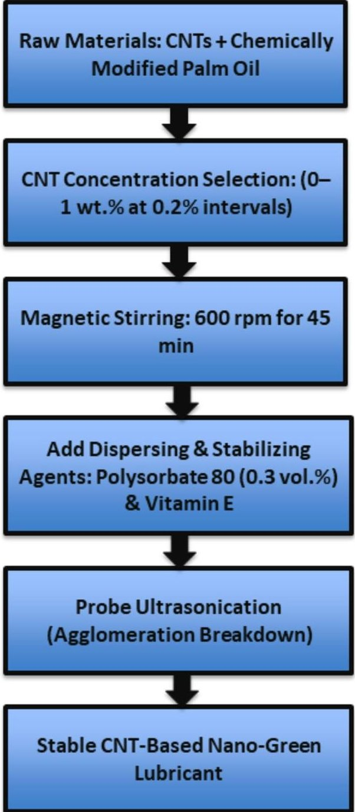

Fig.1. Flowchart of CNT nanofluid synthesis process.

<!-- PDF_PAGE: 5 -->

<table border="1"><tr><td>Element</td><td>Ni</td><td>Cr</td><td>Fe</td><td>Mo</td><td>W</td><td>Co</td><td>Si</td><td>Mn</td><td>C</td><td>S</td><td>P</td><td>B</td></tr><tr><td>Composition(wt%)</td><td>Balance</td><td>20.5</td><td>17.0</td><td>8.0</td><td>0.6</td><td>1.0</td><td>1.5</td><td>1.2</td><td>0.15</td><td>0.03</td><td>0.04</td><td>0.01</td></tr></table>

Table 2. Nominal Chemical Composition of Hastelloy X (wt%)

<table border="1"><tr><td>Parameter</td><td>Specification</td></tr><tr><td>Air pressure</td><td>8 bars</td></tr><tr><td>Lubricant flow rate</td><td>40 ml/h</td></tr><tr><td>Nozzle angle</td><td>30°</td></tr><tr><td>Nozzle-to-workpiece distance</td><td>15 mm</td></tr><tr><td>Number of nozzles</td><td>1(adjustable)</td></tr><tr><td>Atomization type</td><td>Pneumatic, high-pressure spray</td></tr><tr><td>Lubricant type</td><td>CNT-based modified palm oil</td></tr><tr><td>Air consumption</td><td>120-160 L/min</td></tr><tr><td>Maximum operating temperature</td><td>Up to 60℃</td></tr><tr><td>Mounting</td><td>Flexible, adjustable clamp</td></tr></table>

Table 3. Technical specifications of MQL system.

nickel-based superalloys. Commercially sourced Hastelloy X plates with dimensions of $ 1 5 0 \times 8 0 \times 1 0 $ mm were used as the workpiece material. The nominal chemical composition of the alloy, as provided by the supplier, is listed in Table 2.

All machining experiments were conducted under MQL conditions employing a KRS-MQL-2/PS/FS/T system. The corresponding specifications of the MQL arrangement are comprehensively presented in Table 3. To ensure experimental consistency and repeatability, critical MQL parameters were maintained constant during the experimental campaign. Drawing on a comprehensive survey of earlier studies on nickel-based superalloy machining, the MQL setup was configured with an air pressure of 8 bar, a lubricant supply rate of 40 ml/h, a nozzle inclination of $ 3 0^{\circ} $ , and a fixed nozzle-workpiece separation of 15 mm. These operating conditions have been widely reported as optimal for achieving effective atomization and targeted lubricant delivery to the cutting zone.

The experimental program was executed in two distinct phases, with machining parameters selected based on insights from earlier studies and validated through preliminary trial experiments. During the initial stage, four preliminary machining experiments were carried out using constant cutting parameters, including a cutting speed of 60 m/min, a feed rate of 0.1 mm/tooth, and a depth of cut of 1 mm, with the objective of evaluating the influence of various lubrication environments. The results of the comparative assessment demonstrated that modified palm oil containing 0.6% CNT nanoparticles delivered markedly enhanced machining performance relative to dry conditions, compressed air, and unmodified palm oil lubrication. Based on these findings, this optimized CNT-based nanofluid was chosen for all subsequent experimental studies.

In the second phase, the effect of machining parameters on tool wear was systematically examined using the optimized CNT-based nanofluid. A total of twenty-seven experiments were conducted following a Taguchi $ \mathrm{L}_{2 7} $ orthogonal array design $ ^{5 7, 5 8} $ , which enables efficient evaluation of multiple process variables at three levels while significantly reducing experimental effort and cost. During this phase, cutting speed (60, 80, and 100 m/min), feed rate (0.10, 0.15, and 0.20 mm/tooth), and depth of cut (1.0, 1.5, and 2.0 mm) were varied systematically. To enhance the reliability of the results, each experimental run was repeated three times, and all measurement instruments were calibrated prior to experimentation. The selected parameter ranges were consistent with those reported in the literature, ensuring conformity with established machining practices.

Tool wear denotes the progressive deterioration or failure of a cutting tool caused by sustained mechanical interaction and severe thermal stresses in the cutting region. It is a key factor influencing machining performance, surface quality, and the overall service life of the tool. ISO 3685 establishes maximum flank wear $ \left( \mathrm{V B}_{\mathrm{m a x}} \right) $ as the primary indicator for defining tool life failure. Following the standard recommendations, the maximum allowable flank wear is capped at 0.3 mm for precision-critical machining, whereas a more relaxed limit of 0.6 mm is considered permissible in conventional machining operations $ ^{59} $ . Accordingly, the present study employed a $ \mathrm{V B}_{\mathrm{m a x}} $ threshold of 0.6 mm as the tool replacement criterion, consistent with ISO 3685 guidelines for general machining scenarios in which higher wear tolerance is acceptable. Due to the pronounced nonuniformity and irregular distribution of wear features observed in optical micrographs, $ \mathrm{V B}_{\mathrm{m a x}} $ was adopted in place of average flank wear, as it offers a more dependable, consistent, and reproducible measure of tool degradation. To more effectively identify the prevailing wear mechanisms, the used cutting tools were analysed using ZEISS Sigma 300 scanning electron microscopy, enabling high-resolution visualization of microscale damage and wear characteristics. This comprehensive morphological investigation supports a more nuanced interpretation of tool degradation behaviour. Additionally, energy-dispersive X-ray (EDX) spectroscopy was employed to examine the elemental composition of the worn zones and to evaluate adhesion-induced phenomena. The EDX findings offer essential insight into material transfer and interfacial chemical interactions at the tool-workpiece contact,

<!-- PDF_PAGE: 6 -->

which play a crucial role in understanding adhesive wear processes. An overview of the complete experimental procedure and machine learning framework implemented in this study is presented in Fig. 2.

## Machine learning models

To develop a dependable and accurate framework for predicting tool wear, this study employed three state-of-the-art machine learning approaches, namely DNN, XGBoost, and SVR. These models were selected due to their proven effectiveness in capturing nonlinear relationships and handling complex interactions among machining parameters. The input features for all models comprised cutting speed, feed rate, and depth of cut, while tool wear served as the output response variable. Each model was carefully designed and optimized to ensure accurate prediction capability and fair comparative evaluation.

## DNN

DNNs represent an advanced extension of conventional artificial neural networks, specifically developed to model intricate and highly nonlinear relationships by employing multiple hidden layers between the input and output nodes. The term "deep" reflects the presence of several stacked layers that enable hierarchical learning of features, allowing the network to gradually extract higher-level abstractions from the raw input data. Compared with shallow neural networks that rely on a single hidden layer, DNNs possess significantly greater representational capacity, making them particularly suitable for complex applications such as image recognition, speech processing, natural language understanding, and advanced manufacturing analytics, including tool wear prediction in machining processes $ ^{60} $

Inspired by the biological functioning of the human brain, each artificial neuron within a DNN receives input signals, applies a weighted summation followed by a nonlinear activation function, and transmits the processed information to subsequent layers. This layered information processing enables the network to uncover subtle patterns and dependencies that are often inaccessible to traditional statistical or physics-based models. When trained using sufficiently large and representative datasets, DNNs have demonstrated exceptional performance in both regression and classification tasks $ ^{61} $ . In the context of machining, their ability to capture complex interactions between process parameters and response variables makes them well suited for predictive modeling of tool wear behaviour.

In the present work, a customized DNN architecture was developed to estimate tool wear, a critical indicator influencing machining performance, productivity, and operational cost. The developed network architecture begins with an input layer composed of three neurons representing the cutting parameters. Subsequently, the network incorporates two fully connected hidden layers, each comprising 75 neurons, specifically designed

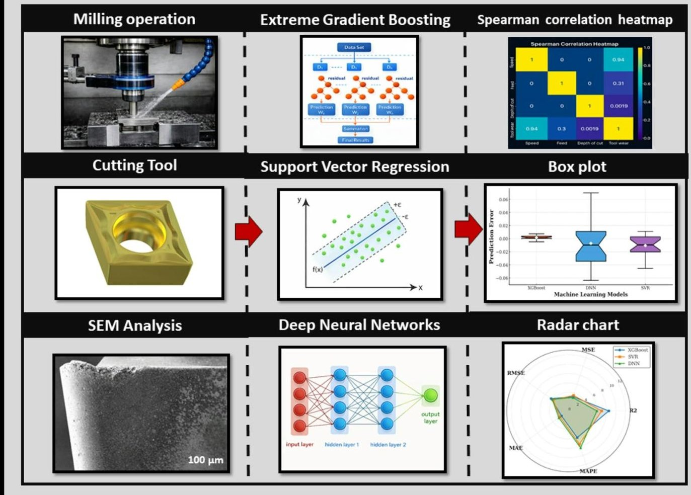

Fig. 2. Overall workflow of the experimental and machine learning methodology.

<!-- PDF_PAGE: 7 -->

to capture and represent the intricate nonlinear interactions among the machining parameters. The network terminates with a single-neuron output layer responsible for estimating tool wear magnitude. ReLU activation functions are utilized in the hidden layers to enhance nonlinearity and accelerate training convergence, while the Adam optimization algorithm is employed to optimize the loss function during the learning process. This architectural configuration enables the model to learn complex parameter-wear relationships with improved accuracy and stability. By providing reliable tool wear predictions, the developed DNN supports proactive process planning, reduces the likelihood of unexpected tool failure, and enhances overall machining efficiency, thereby demonstrating the strong potential of deep learning techniques in advanced manufacturing applications.

## XGBoost

XGBoost is a powerful and scalable machine learning algorithm introduced by Chen and Guestrin in 2016 $ ^{62} $ which has since gained widespread adoption across diverse domains due to its high predictive accuracy and computational efficiency. XGBoost is a gradient boosting-based learning algorithm that constructs a robust predictive model by iteratively integrating a series of weak learners, most commonly decision trees, in a sequential manner. The central principle underlying XGBoost lies in its iterative error-correction mechanism, wherein each newly added tree focuses on reducing the residual errors produced by the existing ensemble, thereby progressively enhancing overall model performance $ ^{63} $

At its core, XGBoost operates within the boosting paradigm, where a collection of weak predictive models each possessing limited individual accuracy—is aggregated to form a highly robust ensemble. During the training process, the algorithm optimizes a predefined objective function that comprises both a loss term and a regularization component. The loss function quantifies the discrepancy between predicted and actual output values, while the regularization term penalizes model complexity to prevent overfitting. For regression problems, squared error loss is commonly employed, whereas logarithmic loss is used for classification tasks. Through iterative optimization, XGBoost minimizes the overall objective function, resulting in superior generalization performance $ ^{64,65} $

The effectiveness of XGBoost is strongly influenced by the selection of hyperparameters, which govern model complexity and learning behaviour. Key parameters include the learning rate, which controls the contribution of each individual tree to the final prediction; the number of estimators, which determines the size of the ensemble; the maximum depth of each tree, which affects model expressiveness; and subsampling ratios, which enhance robustness by introducing randomness during training. A lower learning rate generally promotes stable learning and improved generalization, albeit at the expense of increased training time due to the requirement for a larger number of trees. In addition to hyperparameter tuning, the quality, diversity, and volume of the training dataset play a crucial role in ensuring reliable prediction performance when the model is applied to unseen data $ ^{66,67} $ Owing to its ability to handle nonlinear relationships, manage feature interactions, and resist overfitting, XGBoost is particularly well suited for tool wear prediction in complex machining environments.

## SVR

SVR represents the regression counterpart of the SVM methodology and is tailored for predicting continuous-valued outputs instead of performing classification. Unlike conventional SVM, which seeks an optimal separating hyperplane between distinct classes, SVR aims to formulate a regression function that effectively describes the underlying dependency between the input variables and a continuous target response. The core principle of SVR is to determine a function in which most prediction deviations are confined within a specified tolerance range, referred to as the $ \varepsilon $ - insensitive loss margin, thereby ensuring robust and reliable regression performance $ ^{68} $

One of the key advantages of SVR lies in its ability to ignore minor prediction errors that fall within the $ \varepsilon $ margin, thereby reducing sensitivity to noise and experimental variability. Errors exceeding this margin are penalized through a loss function, ensuring that the model prioritizes significant deviations while maintaining robustness. This characteristic makes SVR particularly suitable for machining data, which often exhibit inherent noise and nonlinearity due to fluctuations in cutting conditions and material behaviour $ ^{69,70}。 $

The balance between model complexity and prediction accuracy in SVR is governed by the regularization parameter C, which determines the penalty imposed on errors that exceed the $ \varepsilon $ -insensitive region. Larger values of C place greater emphasis on minimizing prediction errors, potentially leading to more complex models that closely fit the training data, whereas smaller values of C allow greater tolerance for deviations, enhancing generalization capability. In addition, the choice of kernel function plays a crucial role in SVR performance. Kernel functions enable the transformation of input data into higher-dimensional feature spaces, allowing the model to capture nonlinear relationships. Commonly used kernels include linear, polynomial, and radial basis function (RBF) kernels. In this study, the RBF kernel was employed due to its proven effectiveness in modeling nonlinear interactions in machining applications $ ^{71} $ . Through careful selection of hyperparameters and kernel functions, SVR provides a parsimonious yet powerful framework for accurate and reliable tool wear prediction.

## Results & discussion

## Characterization of nanofluids

The dispersion stability of the CNT-based nanofluid was systematically evaluated using a UV-Vis-NIR spectrophotometer (Shimadzu UV-3600i Plus) to ensure reliable and repeatable absorbance measurements. Because highly concentrated nanofluids can exhibit elevated optical density-leading to inaccuracies arising from strong light absorption and scattering-all samples were appropriately diluted prior to testing. In this procedure, 1 mL of the prepared CNT nanofluid was mixed with 10 mL of the base oil to obtain a uniform and well-dispersed solution with sufficient optical transparency. This standardized dilution approach enabled consistent comparison of absorbance values across varying nanoparticle loadings while effectively reducing scattering-related measurement errors.

<!-- PDF_PAGE: 8 -->

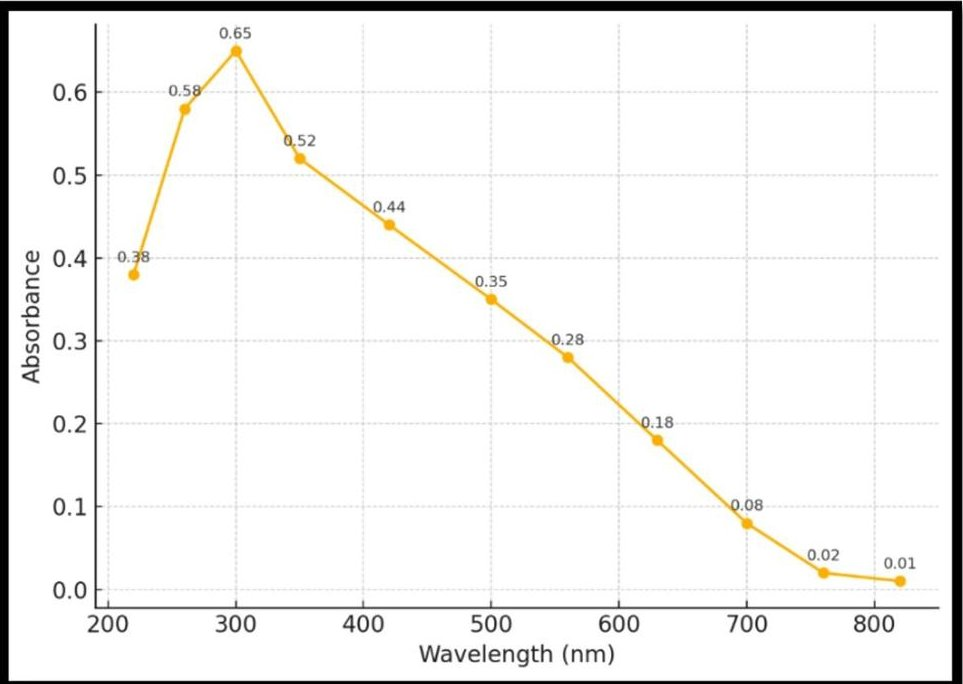

Fig. 3. UV-Vis absorbance spectrum of CNT nanofluid showing peak at 280 nm.

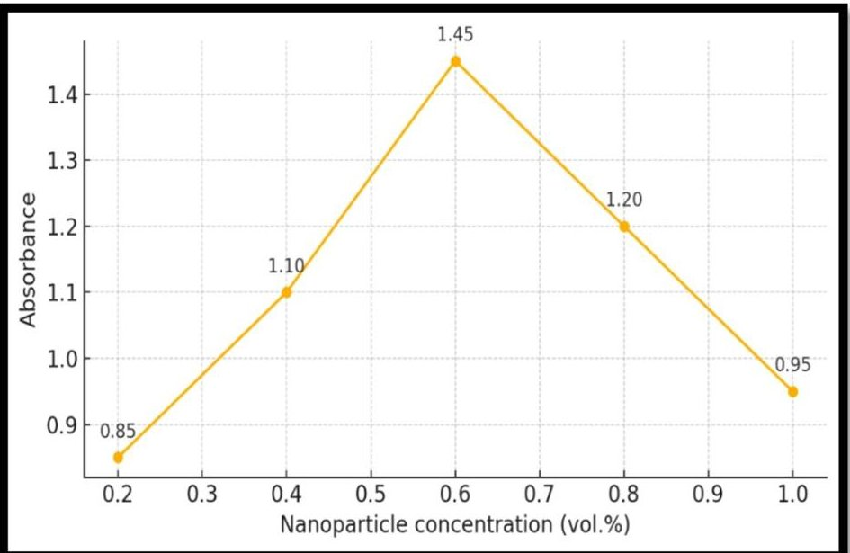

Fig. 4. Absorbance characteristics of CNT nanofluids at varying concentrations.

The absorbance spectra of the diluted CNT nanofluids are presented in Fig. 3, illustrating their optical response over a wide wavelength range. A distinct absorbance peak was consistently observed at approximately 280 nm, indicating the wavelength corresponding to maximum dispersion stability. Consequently, 280 nm was selected as the reference wavelength for evaluating nanofluid stability in subsequent analyses. Figure 4 compares the absorbance characteristics of CNT nanofluids prepared at concentrations of 0.2, 0.4, 0.6, 0.8, and 1.0 vol %. The results reveal a clear trend: the nanofluid containing 0.6 vol % CNTs exhibited the highest absorbance value, surpassing even the higher-concentration samples of 0.8 and 1.0 vol %. Elevated absorbance at this concentration indicates enhanced dispersion stability, reflecting a uniform suspension with minimal nanoparticle agglomeration.

In contrast, the decline in absorbance observed at higher CNT concentrations suggests the onset of particle aggregation and sedimentation, which adversely affect dispersion stability. Excessive nanoparticle loading intensifies interparticle interactions, promoting clustering that reduces the effective surface area available for light absorption. This trend aligns well with the observations reported by Maheshwary et al. $ ^{72} $ , who demonstrated that exceeding the optimal concentration of $ \mathrm{T i O_{2}} $ nanofluids promotes nanoparticle agglomeration, thereby compromising colloidal stability and adversely affecting performance. Accordingly, the CNT nanofluid at a concentration of 0.6 vol % was determined to exhibit the highest stability, providing an effective trade-off between sufficient nanoparticle content and uniform dispersion within the suspension. Accordingly, this concentration was selected for all subsequent machining experiments.

<!-- PDF_PAGE: 9 -->

## Tool wear and its mechanism

Machining efficiency and tool service life are strongly governed by the effectiveness of lubrication and cooling, as these factors directly influence thermal regulation, friction reduction, and surface protection at the tool-workpiece interface. Previous investigations have demonstrated that the incorporation of nanoparticles into vegetable-based lubricants substantially enhances their tribological performance, thereby improving overall machining behaviour. Nanoparticles contribute to stabilizing the lubricant film within the cutting zone by reducing evaporation losses and preventing lubricant displacement, which enables sustained lubrication even under severe cutting conditions. Furthermore, the thermophysical properties of the lubricant-particularly thermal conductivity and viscosity-play a decisive role in determining its ability to dissipate heat and preserve tool integrity. Lubricants exhibiting higher thermal conductivity are more effective in reducing cutting-zone temperatures, which directly contributes to minimizing tool wear and prolonging tool life. Consequently, identifying an optimal nanoparticle concentration is critical for achieving a balance between enhanced lubrication performance and machining efficiency.

To evaluate tool wear characteristics, milling experiments were conducted using TiAlN-coated carbide inserts over a continuous cutting duration of 25 min. Optical and microscopic observations revealed that wear development along the cutting edge was non-uniform; therefore, $ \mathrm{V B}_{\mathrm{m a x}} $ was adopted as the primary wear metric. As illustrated in Fig. 5, the palm oil-based lubricant enriched with 0.6 vol% CNT nanoparticles resulted in the lowest flank wear after 25 min of machining when compared with all other lubrication conditions. This improvement can be attributed to the formation of a stable tribo-film under MQL, which effectively reduces frictional heat generation and delays wear progression. Additionally, MQL promotes the formation of nearly dry chips, which simplifies post-machining handling and enhances material recyclability $ ^{73,74}。 $

The dominant wear mechanisms observed under different lubrication environments are presented in Fig. 6. Across all machining conditions, adhesive and abrasive wear were identified as the primary modes of tool degradation. These findings align with previous studies, which emphasize that tool wear during machining is governed by the combined effects of localized temperature elevation, stress concentration at the cutting edge, and the work-hardening tendency of nickel-based superalloys $ ^{75} $

SEM analysis provided deeper insight into the wear mechanisms operating on the rake face of the cutting inserts. High-resolution micrographs clearly revealed regions of adhesive wear, indicating intense interaction between the cutting tool and the workpiece material. This observation was further corroborated by EDX analysis, which confirmed the presence of workpiece-derived elements adhered to the tool surface, leading to the formation of adhesive layers. Elemental mapping demonstrated that these layers comprised constituents originating from both the TiAlN coating and the Hastelloy X workpiece, indicating partial coating delamination and exposure of the underlying carbide substrate. This exposure facilitates direct contact between the tool and workpiece, thereby intensifying adhesion-related wear processes.

The cyclic sequence of coating degradation, material adhesion, and redeposition was observed to persist throughout the machining process, highlighting the dynamic nature of adhesive wear. Similar behaviour has been reported by Bhatt et al. $ ^{76} $ , who attributed such phenomena to elevated temperatures and high contact pressures that promote localized welding at the tool-workpiece interface. As machining progresses, adhered material layers are repeatedly formed and removed, with successive layers accumulating over residual deposits. This progressive accumulation generates additional compressive stresses on the tool surface. When subjected to elevated shear forces, thicker adhered layers are more prone to cracking and separating as larger fragments, whereas thinner deposits are progressively sheared off as fine lamellae along the cutting edge. Earlier investigations have also

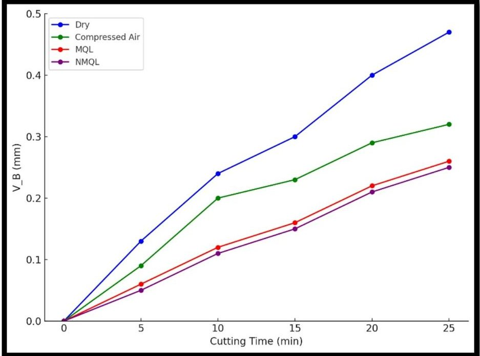

Fig. 5. Maximum flank wear under different lubrication environments after 25 min of machining.

<!-- PDF_PAGE: 10 -->

<table border="1"><tr><td></td><td>Flank Face</td><td>Rake Face</td><td>EDX</td></tr><tr><td>Dry</td><td>BUE
Abrasive marks
100μm</td><td>Adhered material
EDX Spot
100μm</td><td>Cl
Fe
Fe
Ni
O
Mo
Al
W
Co
K
Ni
Cr
Fe
W
0
2
4
6
8
10
12</td></tr><tr><td>Compressed Air</td><td>Abrasive marks
100μm</td><td>Abrasive marks
EDX Spot
100μm</td><td>Cr
Ni
Al
Na
Fe
Al
K
O
Ti
Mo
W
Mo
Fe
Ti
Fe
Ni
W
0
2
4
6
8
10
12</td></tr><tr><td>MQL</td><td>Abrasive marks
100μm</td><td>Adhered material
EDX Spot
100μm</td><td>W
Cr
Na
Ni
Al
Ti
Ni
Cl
C
Co
Ni
Co
Mo
Ti
W
K
Fe
0
2
4
6
8
10
12</td></tr><tr><td>NMQL</td><td>Abrasive marks
100μm</td><td>Adhered material
EDX Spot
100μm</td><td>As
Ti
Co
Na
Ni
Cl
K
Cl
Mo
Ti
W
K
Fe
0
2
4
6
8
10
12</td></tr></table>

Fig. 6. SEM micrographs showing tool wear mechanisms under various lubrication conditions.

reported that cutting forces facilitate the transport of adhered material to the tool tip, thereby promoting the development of built-up layers even at comparatively low cutting speed $ ^{76} $ . Due to the high toughness and pronounced adhesive characteristics of Ni-based alloy, these built-up structures are mainly localized near the depth of cut zone, where the stress concentration is maximum. Boothroyd and Knight additionally highlighted that, beyond purely mechanical effects, a chemical empathy among the tool and workpiece can markedly intensify adhesion during machining $ ^{77} $ .

In addition to adhesive wear, SEM micrographs revealed pronounced abrasive wear features on the tool surfaces. Distinct grooves, scratches, and microcracks were observed, indicating severe interaction between hard particles and the cutting tool. It is well established that carbide precipitates present in nickel-based superalloys act as strong abrasives, leading to substantial tool surface damage $ ^{78,79} $ . In the present study, abrasive wear primarily resulted from strong friction amid the flowing chips and the tool face. Hard carbide inclusions ploughed across the tool surface, generating elongated wear tracks and initiating microcracks. Because of their high hardness, elevated melting temperature, and chemical inertness, these particles do not undergo plastic deformation;

<!-- PDF_PAGE: 11 -->

instead, they progressively erode the tool material through repeated contact. The present findings corroborate the work of Sen et al. $ ^{80} $ , who showed that the presence of hard carbide phases accelerates surface smearing, induces microcracking, and generates drag marks on cutting tools, thereby diminishing their fatigue resistance. Although the incorporation of CNTs in palm oil did not change the dominant wear modes, it substantially alleviated wear progression by providing superior lubrication and minimizing interfacial friction at the toolchip contact, underscoring its viability as a sustainable replacement for conventional metalworking fluids.

## Relation between machining parameters and flank wear

Figure 7 presents a comprehensive depiction of how machining parameters govern tool wear characteristics. It is evident that both cutting speed and feed rate play a critical role in the progression of flank wear, with increases in either parameter causing a substantial escalation in tool deterioration. This behaviour arises from the coupled action of mechanical loading and thermal effects concentrated at the tool-workpiece interface. Higher cutting speeds intensify the relative motion between the cutting edge and the work material, thereby amplifying friction and heat generation. The consequent rise in cutting-zone temperature weakens the tool material and diminishes its wear resistance. As a result, temperature-driven wear processes—including adhesive, diffusive, and oxidative mechanisms—become more pronounced, leading to accelerated wear evolution. In addition, repeated thermal cycling at elevated speeds induces severe thermal stresses, which foster microcrack formation, edge fragmentation, and surface damage, ultimately reducing the effective service life of the cutting tool.

Similarly, increasing feed rate imposes higher mechanical loads on the cutting tool by increasing the volume of material removed per tooth engagement. This leads to elevated cutting forces and intensified dynamic effects, including vibration and chatter. The resulting mechanical stresses accelerate abrasive wear and promote localized

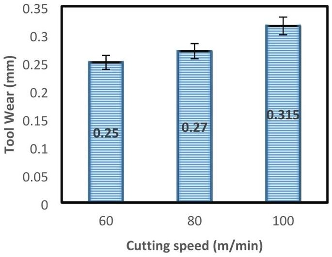

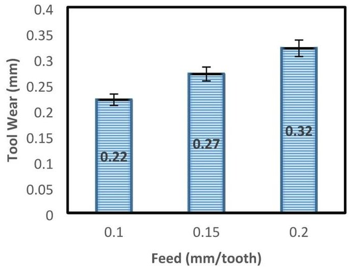

(a)

(b)

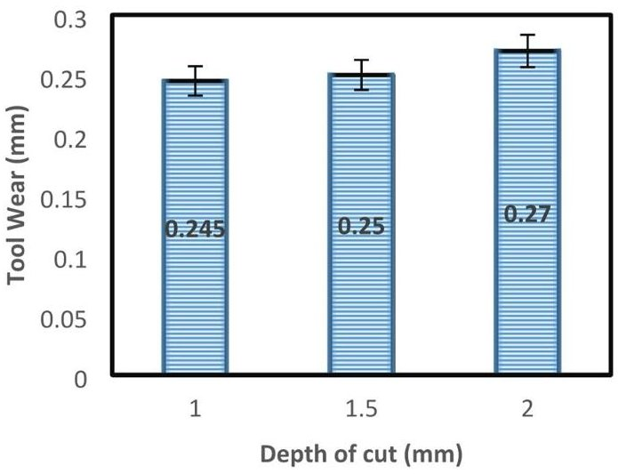

(c)

Fig. 7. Effect of machining parameters on maximum flank wear under CNT-based MQL conditions: (a) influence of cutting speed, (b) influence of feed rate, and (c) influence of depth of cut.

<!-- PDF_PAGE: 12 -->

damage along the cutting edge, often manifested as micro-chipping and surface fatigue. The combined action of thermal and mechanical stresses at high cutting speeds and feed rates significantly reduces tool longevity and adversely affects the surface integrity of machined components.

In contrast, the effect of depth of cut on tool wear is relatively insignificant, as illustrated in Fig. 7(c). Across the examined range, variations in cutting depth did not induce appreciable changes in contact stress levels, interfacial temperature, or chip formation and deformation characteristics. While a larger depth of cut increases the material removal rate, it does not substantially exacerbate the localized thermal or mechanical loading at the tool-workpiece interface. Hence, depth of cut can be considered a secondary factor in governing tool wear when compared to cutting speed and feed rate. These results emphasize the need for careful optimization of machining parameters to achieve a balance between productivity and tool life. Higher cutting speeds and feed rates were observed to hasten wear evolution, elevate energy demand, and deteriorate surface integrity. The overall trends are consistent with the findings of Sen et al. $ ^{80} $ , who attributed increased flank wear at elevated machining parameters to intensified heat generation, higher cutting forces, and augmented mechanical stresses.

## Spearman correlation coefficient

To quantitatively evaluate the relative impact of machining parameters on tool wear, a Spearman correlation coefficient heatmap was developed and examined. This non-parametric method measures the magnitude and direction of monotonic associations between variables using ranked observations, rendering it well suited for capturing the nonlinear dependencies frequently observed in machining operations. The Spearman rank correlation coefficient $ (\rho) $ is mathematically expressed as:

$$
\rho = 1 - \frac {6 \sum d _ {i} ^ {2}}{n \left(n ^ {2} - 1\right)}
$$

In this expression, n represents the total number of data points, and di denotes the difference between the ranks of each corresponding variable pair. A value of $ \rho=+1 $ signifies a perfectly positive relationship, $ \rho=-1 $ indicates a perfectly negative relationship, while $ \rho=0 $ implies no correlation between the variables.

Figure 8 depicts the Spearman rank correlation matrix highlighting the interdependence between machining parameters and tool wear. A pronounced positive association is observed between cutting speed and tool wear $ (\rho=+0.94) $ , underscoring cutting speed as the primary driver of accelerated wear mechanisms. Feed rate shows a positive but comparatively moderate relationship with tool wear $ (\rho=+0.31) $ , suggesting a secondary yet nonnegligible contribution to wear evolution. In contrast, depth of cut shows a near-zero correlation $ (\rho=0.0019) $ , suggesting that its effect on tool wear is negligible within the investigated range of operating conditions. Overall, the correlation outcomes clearly rank cutting speed as the most critical factor affecting tool wear, followed by feed rate, while depth of cut has a marginal impact. These findings are instrumental in guiding the optimization of machining conditions to improve tool longevity and process performance.

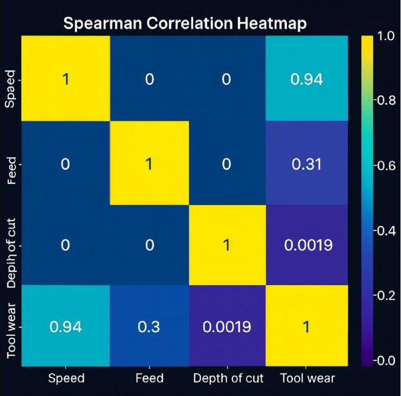

Fig. 8. Spearman rank correlation heatmap illustrating the strength and direction of monotonic relationships between machining parameters and tool wear.

<!-- PDF_PAGE: 13 -->

<table border="1"><tr><td>Hyperparameter Category</td><td>DNN Settings</td><td>XGBoost Settings</td><td>SVR Settings</td></tr><tr><td>Core Structure</td><td>3-75-75-1(architecture)</td><td>100 estimators</td><td>RBF kernel</td></tr><tr><td>Control Parameters</td><td>Momentum rate:0.8</td><td>Max depth:3</td><td>C=1</td></tr><tr><td>Learning Behaviour</td><td>Learning rate:0.25</td><td>Learning rate:0.1</td><td>Epsilon=0.1</td></tr><tr><td>Training Strategy</td><td>Epochs:100</td><td>Subsample:0.8</td><td>—</td></tr><tr><td>Algorithmic Choices</td><td>Activation:ReLU;Optimizer:Adam</td><td>Optimizer:RandomizedSearchCV</td><td>Optimizer:GridSearchCV</td></tr></table>

Table 4. Overview of tuned parameters for the implemented ML models.

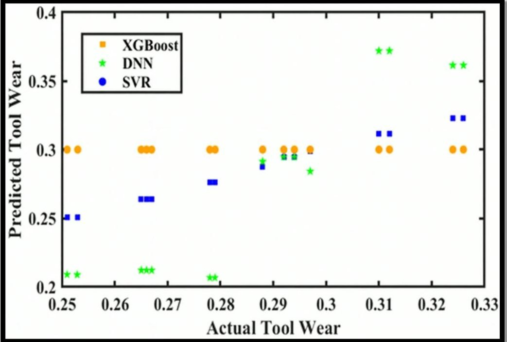

Fig. 9. Predicted vs. experimental tool wear values for DNN, XGBoost, and SVR models.

## Wear predictive models

In this study, three advanced machine learning algorithms—XGBoost, DNN and SVR—were implemented to predict tool wear using key machining parameters. All models were developed and executed within the Google Colab environment, which provides a cloud-based computational platform supporting Python programming via Jupyter Notebooks and facilitates efficient implementation, reproducibility, and performance evaluation. The primary objective of this analysis was to comparatively assess the predictive accuracy, robustness, and generalization capability of the selected algorithms in order to recognize the most reliable model for tool wear estimation in variable machining conditions.

The experimental dataset comprised a total of 81 observations, which were partitioned into 64 samples for model training and 17 samples for validation to ensure unbiased evaluation and reliable assessment of model generalization. Prior to training, all input features were normalized using the StandardScaler() function available in the scikit-learn library. This preprocessing step ensured standardized feature distributions, improved numerical stability, and facilitated faster convergence during model training. To further enhance predictive performance, hyperparameter optimization was conducted for each algorithm. The DNN model was optimized using the Adam optimizer, while XGBoost hyperparameters were refined through the RandomizedSearchCV approach. For SVR, optimal parameter selection was achieved using GridSearchCV. The finalized hyperparameter configurations adopted for each model are summarized in Table 4.

The predictive performance of the developed models was evaluated through both graphical visualization and quantitative statistical analysis. Figure 9 presents a scatter plot comparing predicted tool wear values against experimentally measured values. A strong clustering of XGBoost predictions along the positively inclined diagonal reference line is clearly evident, indicating excellent agreement between predicted and actual wear values. In contrast, predictions generated by the DNN and SVR models exhibit greater dispersion from the ideal trend line, reflecting comparatively reduced prediction accuracy. This observation is further supported by the error distribution illustrated in the box plot shown in Fig. 10. The XGBoost model demonstrates a narrow error range with values tightly clustered around zero, indicating minimal deviation between predicted and experimental results. Conversely, the DNN and SVR models display wider error distributions, suggesting higher variability and less consistent prediction performance. To provide a comprehensive quantitative comparison, multiple statistical performance indicators were computed for all models. These metrics are collectively visualized using the radar chart presented in Fig. 11.

<!-- PDF_PAGE: 14 -->

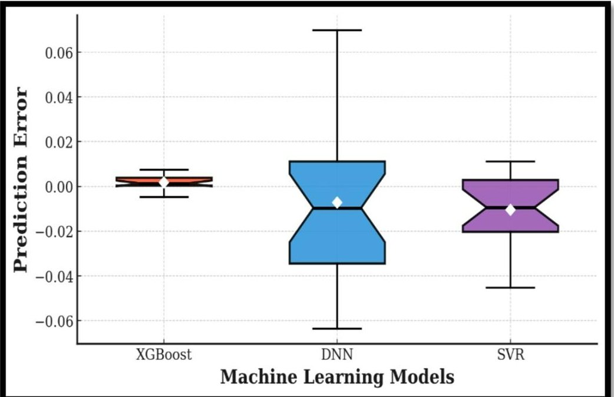

Fig. 10. Error distribution (box plot) of prediction models.

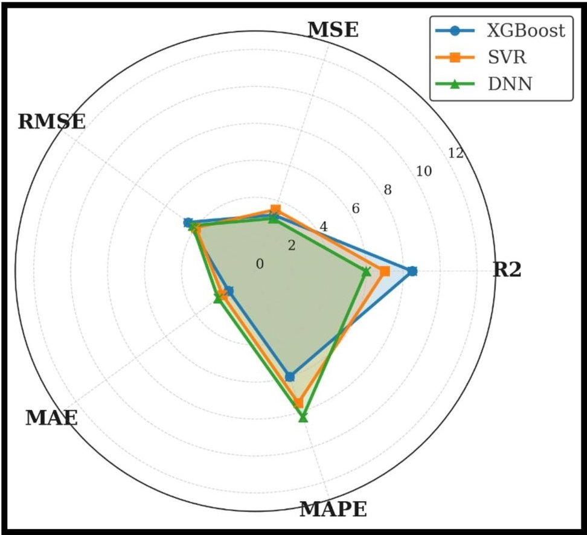

Fig.11. Radar chart comparing performance metrics of DNN, XGBoost, and SVR models.

The comparative analysis clearly indicates that the XGBoost model outperforms both DNN and SVR across all evaluated performance metrics. XGBoost achieved an $ R^{2} $ value close to unity together with the lowest error magnitudes for MAE, MSE, RMSE, and MAPE, demonstrating superior predictive accuracy and robustness. In contrast, the DNN and SVR models produced negative $ R^{2} $ values and higher error indices, meaning their predictions were less accurate than a simple mean-based baseline and reflecting weak generalization for the present dataset size and train-test split. Collectively, these findings establish XGBoost as the most accurate, stable, and reliable tool wear prediction model among the three algorithms examined in this study.

<!-- PDF_PAGE: 15 -->

## Conclusions

This work systematically explores an AI-based tool condition monitoring framework to characterize and predict the wear evolution of PVD TiAlN-coated carbide inserts during the machining of Hastelloy X under environmentally benign lubrication strategies. The experimental findings reveal that employing a CNT-based nanofluid at an optimized concentration of 0.6% leads to a pronounced mitigation of tool degradation, achieving a reduction in maximum flank wear of 23.5% in comparison with dry cutting and 17.8% when benchmarked against conventional MQL with pure palm oil. Such performance enhancement is mainly driven by the exceptional heat dissipation capability and improved tribological behaviour imparted by carbon nanotubes, which effectively minimize interfacial friction and thermal build-up at the cutting zone. Consequently, the proposed approach contributes to prolonged tool service life, fewer tool changeovers, and a tangible decrease in overall machining expenditure.

From a predictive modeling perspective, a comparative evaluation of multiple machine learning algorithms revealed that the XGBoost model delivered the most reliable performance in tool wear prediction, achieving a high coefficient of determination $ \mathrm{R}^{2}=0.9924 $ along with minimal error metrics $ \mathrm{RMSE}=0.002 $ $ \mathrm{MAE}=0.0017 $ and $ \mathrm{MAPE}=0.6\% $ ). In contrast, while the remaining models showed acceptable to moderate predictive capability, the DNN and SVR models exhibited comparatively poor performance for the specific dataset split used in this study, including negative $ \mathrm{R}^{2} $ values, indicating limited generalization under those conditions. The high prediction accuracy and stability of XGBoost support its suitability for real-time monitoring of tool wear across a wide range of cutting conditions. By accurately capturing wear progression as a function of cutting speed and feed rate, the proposed framework facilitates timely parameter adjustment, enhances machining efficiency, and minimizes the risk of unplanned production interruptions.

The integrated strategy adopted in this work effectively addresses the severe thermal and mechanical challenges associated with machining nickel-based superalloys by combining CNT-based nanofluid lubrication with advanced AI-based predictive modeling. The findings confirm that this synergistic approach offers a viable pathway toward intelligent, sustainable, and high-precision manufacturing. Future research may focus on evaluating the long-term stability, recyclability, and reuse potential of CNT nanofluids, as well as their compatibility with different cutting tool materials and coating systems. In addition, the development of hybrid or adaptive artificial intelligence models could further enhance prediction accuracy and robustness. Extending the proposed framework to multi-pass machining operations, complex component geometries, and full-scale industrial environments would further strengthen its applicability and contribution to Industry 4.0-oriented manufacturing systems.

## Data availability

Data supporting this study's findings are available from the corresponding author upon reasonable request.

Received: 30 December 2025; Accepted: 17 February 2026

Published online: 20 February 2026

## References

1. Murali, T., Devendiran, S. & Venkatesan, K. A hybrid algorithm-based comparative analysis of a newly designed tool holder during the machining of Hastelloy-B3 with MQL. Arab. J. Sci. Eng., 1-24. (2024).

2. Li, X. et al. Active thermography non-destructive testing going beyond camera's resolution limitation: A heterogenous Dual-band single-pixel approach. IEEE Trans. Instrum. Meas. https://doi.org/10.1109/tim.2025.3545520 (2025).

3. Ambhore, N., Naranje, V. & Shelke, S. Machining performance evaluation in turning of hardened steel using machine learning. Mater. Manuf. Process. 40(14), 1935-1942 (2025).

4. Yan, X., Hu, J., Zhang, X. & Xu, W. Obtaining superior low-temperature wear resistance in Q&p-processed medium Mn steel with a low initial hardness. Tribol. Int. 175, 107803 (2022).

5. Kumar, G., Sen, B., Ghosh, S. & Rao, P. V. Strategic enhancement of machinability in nickel-based superalloy using eco-benign hybrid nano-MQL approach. J. Manuf. Process. 127, 457-476 (2024).

6. Wan, A. et al. A novel GA-PSO-SVM model for compound fault diagnosis in gearboxes with limited data. IEEE Sens. J. https://doi.org/10.1109/jsen.2025.3576761 (2025).

7. Ambhore, N., Kamble, D. & Chinchanikar, S. Evaluation of cutting tool vibration and surface roughness in hard turning of AISI 52100 steel: An experimental and ANN approach. J. Vib. Eng. Technol. 8(3), 455-462 (2020).

8. Wang, Z. et al. A mutual cross-attention fusion network for surface roughness prediction in robotic machining process using internal and external signals. J. Manuf. Syst. 82, 284-300 (2025).

9. Sen, B., Yadav, S. K., Kumar, G., Mukhopadhyay, P. & Ghosh, S. Performance of eco-benign lubricating/cooling mediums in machining of superalloys: A comprehensive review from the perspective of Triple Bottom Line theory. Sustain. Mater. Technol. 35, e00578 (2023).

10. Liu, H., Zhang, D. & Geng, D. Design of a self-excited vibration tool bar for cutting difficult-to-machine alloys. Int. J. Mech. Sci., 110456. (2025).

11. Hao, W. Q. et al. Multi-mode fatigue life prediction using machine learning inspired by damage physics. Int. J. Mech. Sci., 110723. (2025).

12. Sen, B. et al. Exploring cryo-MQL medium for hard machining of hastelloy C276: a multi-objective optimization approach 1-14 (International Journal on Interactive Design and Manufacturing (IJIDeM), 2024).

13. Zeng, L. et al. Study on dynamic wear evolution of modified gear rack considering the real-time variation of contact characteristics. Wear https://doi.org/10.1016/j.wear.2025.205845 (2025).

14. Ambhore, N. & Kamble, D. Experimental investigation of tool wear and induced vibration in turning high hardness AISI52100 steel using cutting parameters and tool acceleration. Facta Univ. Ser. Mech. Eng. 18(4), 623-637 (2020).

15. Zhu, J., Wang, X. & Mu, Y. Uncertain constitutive model for metals in the presence of inherent defects. Comput. Methods Appl. Mech. Eng. 447, 118355 (2025).

16. Cai, W., Zhang, W., Hu, X. & Liu, Y. A hybrid information model based on long short-term memory network for tool condition monitoring. J. Intell. Manuf. 31, 1497-1510 (2020).

17. Zhu, J., Wang, X., Cao, G., Xu, L. & Cao, Y. Quantum interval neural network for uncertain structural static analysis. Int. J. Mech. Sci. https://doi.org/10.1016/j.ijmecsci.2025.110646 (2025).

<!-- PDF_PAGE: 16 -->

18. Ambhore, N., Kamble, D. & Chinchanikar, S. Behaviour of cutting tool vibrations with the progress of tool wear in turning hardened AISI 52100 steel: An approach to tool condition monitoring system. In IOP Conference Series. Materials Science and Engineering 455 (1), 012062 (2018).

19. Xie, W. T., Song, D. N., Tang, W. C., Ma, J. W. & Li, J. H. Auxiliary support path planning for robot-assisted machining of thin-walled parts with non-uniform thickness and closed cross-section based on a neutral surface. J. Manuf. Process. 147, 16-28 (2025).

20. Xu, H. et al. ESMNet: An enhanced YOLOv7-based approach to detect surface defects in precision metal workpieces. Measurement 235, 114970 (2024).

21. Ambhore, N., Kamble, D. & Chinchanikar, S. Analysis of tool vibration and surface roughness with tool wear progression in hard turning: An experimental and statistical approach. J. Mech. Eng. Sci. 14 (1), 6461-6472 (2020).

22. Wang, M., Zhou, J., Gao, J., Li, Z. & Li, E. Milling tool wear prediction method based on deep learning under variable working conditions. IEEE Access 8, 140726-140735 (2020).

23. Nouri, M., Fussell, B. K., Ziniti, B. L. & Linder, E. Real-time tool wear monitoring in milling using a cutting condition independent method. Int. J. Mach. Tools Manuf. 89, 1-13 (2015).

24. Zhu, K. & Yu, X. The monitoring of micro milling tool wear conditions by wear area estimation. Mech. Syst. Signal Process. 93, 80-91 (2017).

25. Stavropoulos, P., Papacharalampopoulos, A., Vasiliadis, E. & Chryssolouris, G. Tool wear predictability estimation in milling based on multi-sensorial data. Int. J. Adv. Manuf. Technol. 82, 509-521 (2016).

26. Shankar, S., Mohanraj, T. & Rajasekar, R. Prediction of cutting tool wear during milling process using artificial intelligence techniques. Int. J. Comput. Integr. Manuf. 32 (2), 174-182 (2019).

27. Alhadeff, L. L., Marshall, M. B., Curtis, D. T. & Slatter, T. Protocol for tool wear measurement in micro-milling. Wear 420, 54-67 (2019).

28. Kong, D. et al. Tool wear estimation in end milling of titanium alloy using NPE and a novel WOA-SVM model. IEEE Trans. Instrum. Meas. 69(7), 5219-5232 (2019).

29. Lei, Z. et al. A GAPSO-enhanced extreme learning machine method for tool wear estimation in milling processes based on vibration signals. Int. J. Precis. Eng. Manuf. Green Technol. 8, 745-759 (2021).

30. Kong, D., Chen, Y. & Li, N. Hidden semi-Markov model-based method for tool wear estimation in milling process. Int. J. Adv. Manuf. Technol. 92, 3647-3657 (2017).

31. Kong, D., Chen, Y. & Li, N. Force-based tool wear estimation for milling process using Gaussian mixture hidden Markov models. Int. J. Adv. Manuf. Technol. 92, 2853-2865 (2017).

32. Liu, H., Liu, Z., Jia, W., Lin, X. & Zhang, S. A novel transformer-based neural network model for tool wear estimation. Meas. Sci. Technol. 31 (6), 065106 (2020).

33. Zhang, C. & Zhang, H. Modelling and prediction of tool wear using LS-SVM in milling operation. Int. J. Comput. Integr. Manuf. 29 (1), 76-91 (2016).

34. Yang, W. A., Zhou, Q. & Tsui, K. L. Differential evolution-based feature selection and parameter optimisation for extreme learning machine in tool wear estimation. Int. J. Prod. Res. 54(15), 4703-4721 (2016).

35. Li, W. & Liu, T. Time varying and condition adaptive hidden Markov model for tool wear state estimation and remaining useful life prediction in micro-milling. Mech. Syst. Signal Process. 131, 689-702 (2019).

36. Zhang, J., Starly, B., Cai, Y., Cohen, P. H. & Lee, Y. S. Particle learning in online tool wear diagnosis and prognosis. J. Manuf. Process. 28, 457-463 (2017).

37. Kilickap, E., Yardimeden, A. & Hışman Çelik, Y. Mathematical modelling and optimization of cutting force, tool wear and surface roughness by using artificial neural network and response surface methodology in milling of Ti-6242S. Appl. Sci. 7 (10), 1064 (2017).

38. Zhang, X., Han, C., Luo, M. & Zhang, D. Tool wear monitoring for complex part milling based on deep learning. Appl. Sci. 10(19), 6916 (2020).

39. Hesser, D. F. & Markert, B. Tool wear monitoring of a retrofitted CNC milling machine using artificial neural networks. Manuf. Lett. 19, 1-4 (2019).

40. Bhattacharyya, P., Sengupta, D. & Mukhopadhyay, S. Cutting force-based real-time estimation of tool wear in face milling using a combination of signal processing techniques. Mech. Syst. Signal Process. 21 (6), 2665-2683 (2007).

41. Sen, B., Mia, M., Mandal, U. K. & Mondal, S. P. GEP-and ANN-based tool wear monitoring: A virtually sensing predictive platform for MQL-assisted milling of Inconel 690. Int. J. Adv. Manuf. Technol. 105(1), 395-410 (2019).

42. Khajavi, M. N., Nasernia, E. & Rostaghi, M. Milling tool wear diagnosis by feed motor current signal using an artificial neural network. J. Mech. Sci. Technol. 30, 4869-4875 (2016).

43. García-Nieto, P. J., García-Gonzalo, E., Vilán Vilán, J. A. & Segade Robleda, A. A new predictive model based on the PSO-optimized support vector machine approach for predicting the milling tool wear from milling runs experimental data. Int. J. Adv. Manuf. Technol. 86, 769-780 (2016).

44. Guo, J., Li, A. & Zhang, R. Tool condition monitoring in milling process using multifractal detrended fluctuation analysis and support vector machine. Int. J. Adv. Manuf. Technol. 110, 1445-1456 (2020).

45. Kothuru, A., Nooka, S. P. & Liu, R. Audio-based tool condition monitoring in milling of the workpiece material with the hardness variation using support vector machines and convolutional neural networks. J. Manuf. Sci. Eng. 140(11), 111006 (2018).

46. Gomes, M. C., Brito, L. C., da Silva, M. B. & Duarte, M. A. V. Tool wear monitoring in micromilling using support vector machine with vibration and sound sensors. Precis. Eng. 67, 137-151 (2021).

47. Kong, D., Chen, Y. & Li, N. Gaussian process regression for tool wear prediction. Mech. Syst. Signal Process. 104, 556-574 (2018).

48. Zhang, C., Wang, W. & Li, H. Tool wear prediction method based on symmetrized dot pattern and multi-covariance Gaussian process regression. Measurement 189, 110466 (2022).

49. Wang, G., Qian, L. & Guo, Z. Continuous tool wear prediction based on Gaussian mixture regression model. Int. J. Adv. Manuf. Technol. 66, 1921-1929 (2013).

50. Ying, S., Sun, Y., Fu, C., Lin, L. & Zhang, S. Grey wolf optimization based support vector machine model for tool wear recognition in fir-tree slot broaching of aircraft turbine discs. J. Mech. Sci. Technol. 36(12), 6261-6273 (2022).

51. Chuo, Y. S. et al. Artificial intelligence enabled smart machining and machine tools. J. Mech. Sci. Technol. 36(1), 1-23 (2022).

52. Zhao, J. W., Guo, S. J., Ma, L., Kong, H. Q. & Zhang, N. Tool wear monitoring based on an improved convolutional neural network. J. Mech. Sci. Technol. 37(4), 1949-1958 (2023).

53. Liao, C. W., Lee, M. T. & Liu, Y. C. A thermal deformation estimation method for high precision machine tool spindles based on the convolutional neural network. J. Mech. Sci. Technol. 37(6), 3151-3162 (2023).

54. Sanjeevi, B. & Loganathan, K. Synthesis of multi wall carbon nanotubes nanofluid by using two step method. Therm. Sci. 24 (1 Part B), 519-524 (2020).

55. Srivastava, A. & Sahai, P. Vegetable oils as lube basestocks: A review. Afr. J. Biotechnol., 12(9). (2013).

56. Patel, N. S., Parihar, P. L. & Makwana, J. S. Parametric optimization to improve the machining process by using Taguchi method: A review. Mater. Today Proc. 47, 2709-2714 (2021).

57. Karna, S. K. & Sahai, R. An overview on Taguchi method. Int. J. Eng. Math. Sci. 1(1), 1-7 (2012).

58. https://www.iso.org/obp/pui/#iso:std:iso:3685:ed-2:v1:en

59. Sun, S., Jiang, Z., Li, L., Wang, J. & Song, S. DEM analysis on rock-breaking impact effect of shield disc cutter in typical soft and hard composite strata. Int. J. Numer. Anal. Methods Geomech. https://doi.org/10.1002/nag.3991 (2025).

<!-- PDF_PAGE: 17 -->

60. Yeo, C., Kim, B. C., Cheon, S., Lee, J. & Mun, D. Machining feature recognition based on deep neural networks to support tight integration with 3D CAD systems. Sci. Rep. 11 (1), 22147 (2021).

61. Dhumal, A., Kulkarni, A., Ambhore, N. & Karvinkoppa, M. Investigating Thermal Performance of Substrate Board through Forced Convection and Machine Learning.

62. Sun, S. Q. et al. Prediction model for rock-breaking force and wear of large-diameter shield disc cutters in hard rock stratum. Int. J. Numer. Anal. Methods Geomech. 49(17), 4076-4090 (2025).

63. Wang, M., Zhou, D. & Chen, M. Hybrid variable monitoring: An unsupervised process monitoring framework with binary and continuous variables. Automatica 147, 110670 (2023).

64. Manikanta, J. E., Abdullah, M., Ambhore, N. & Kotteda, T. K. Analysis of machining performance in turning with trihybrid nanofluids and minimum quantity lubrication. Sci. Rep. 15(1), 12194 (2025).

65. Cheng, M. et al. Prediction and evaluation of surface roughness with hybrid kernel extreme learning machine and monitored tool wear. J. Manuf. Process. 84, 1541-1556 (2022).

66. Song, D. N., Tang, W. C., Zhao, Y. N., Zhong, Y. G. & Ma, J. W. Convolution-based velocity-smoothing principle and its application to real-time parametric curve interpolation. IEEE Trans. Autom. Sci. Eng. https://doi.org/10.1109/tase.2025.3625244 (2025).

67. Liu, G., Su, Z., Luo, B. & Zhu, Y. GSLI-RTMdet: An automatic nondestructive detection method for internal defects in gas-insulated switchgear X-DR images. High Voltage https://doi.org/10.1049/hve2.70044 (2025).

68. Cao, C. et al. Prediction and optimization of surface roughness for laser-assisted machining SiC ceramics based on improved support vector regression. Micromachines 13 (9), 1448 (2022).

69. Arun, M. & Gopan, G. Effects of natural light on improving the lighting and energy efficiency of buildings: Toward low energy consumption and CO2 emission. Int. J. Low-Carbon Technol. 20, 1047-1056 (2025).

70. Asilturk, I., Kahramanli, H. & Mounayri, H. E. Prediction of cutting forces and surface roughness using artificial neural network (ANN) and support vector regression (SVR) in turning 4140 steel. Mater. Sci. Technol. 28(8), 980-986 (2012).

71. Maheshwary, P. B., Handa, C. C. & Nemade, K. R. A comprehensive study of effect of concentration, particle size and particle shape on thermal conductivity of titania/water based nanofluid. Appl. Therm. Eng. 119, 79-88 (2017).

72. Sarikaya, M. & Güllu, A. Multi-response optimization of minimum quantity lubrication parameters using Taguchi-based grey relational analysis in turning of difficult-to-cut alloy Haynes 25. J. Clean. Prod. 91, 347-357 (2015).

73. Mia, M., Gupta, M. K., Singh, G., Królczyk, G. & Pimenov, D. Y. An approach to cleaner production for machining hardened steel using different cooling-lubrication conditions. J. Clean. Prod. 187, 1069-1081 (2018).

74. Marquardt, E. D., Le, J. P. & Radebaugh, R. Cryogenic material properties database. Cryocoolers 11, 681-687 (2002).

75. Bhatt, A., Attia, H., Vargas, R. & Thomson, V. Wear mechanisms of WC coated and uncoated tools in finish turning of Inconel 718. Tribol. Int. 43 (5-6), 1113-1121 (2010).

76. Boothroyd, G. Fundamentals of metal machining and machine tools Vol. 28 (Crc, 1988).

77. Gopan, G., Arun, M. & Vembu, S. Comparison of dimple tube with flat plate collector for solar water heater by using carbon nanofluid. Int. J. Low-Carbon Technol. 20, 820-833 (2025).

78. Das, S. R., Kumar, A. & Dhupal, D. Surface roughness analysis of hardened steel using TiN coated ceramic inserts. Int. J. Mach. Mach. Mater. 17(1), 22-38 (2015).

79. Arun, M., Barik, D. & Chandran, S. S. Exploration of material recovery framework from waste-A revolutionary move towards clean environment. Chem. Eng. J. Adv. 18, 100589 (2024).

80. Sen, B., Mia, M., Mandal, U. K., Dutta, B. & Mondal, S. P. Multi-objective optimization for MQL-assisted end milling operation: An intelligent hybrid strategy combining GEP and NTOPSIS. Neural Comput. Appl. 31, 8693-8717 (2019).

## Author contributions

Author Contributions: Omar Almomani and B. Venkatesh conceived the study, formulated the research objectives, and supervised the overall research work. Shivam P. Chaudhary and Akanksha Mishra were responsible for data curation, statistical analysis, and interpretation of results. Sujai S and Shahbaz Juneja carried out the experimental investigations and contributed to data acquisition. Premananda Pradhan and S. P. Venkatesan prepared the initial draft of the manuscript and assisted in result validation. Abhijit Bhowmik contributed to methodological development, technical guidance, and critical evaluation of the study. Yalew Tamene was involved in the review of related literature, manuscript editing, and refinement. All authors critically reviewed the manuscript, contributed intellectually to the discussion, and approved the final version for submission.

## Declarations

## Competing interests

The authors declare no competing interests.

## Consent for publication

All authors have given their consent for the publication of this manuscript.

## Additional information

Correspondence and requests for materials should be addressed to Y.T.

Reprints and permissions information is available at www.nature.com/reprints.

Publisher's note Springer Nature remains neutral with regard to jurisdictional claims in published maps and institutional affiliations.

<!-- PDF_PAGE: 18 -->

Open Access This article is licensed under a Creative Commons Attribution-NonCommercial-NoDerivatives 4.0 International License, which permits any non-commercial use, sharing, distribution and reproduction in any medium or format, as long as you give appropriate credit to the original author(s) and the source, provide a link to the Creative Commons licence, and indicate if you modified the licensed material. You do not have permission under this licence to share adapted material derived from this article or parts of it. The images or other third party material in this article are included in the article's Creative Commons licence, unless indicated otherwise in a credit line to the material. If material is not included in the article's Creative Commons licence and your intended use is not permitted by statutory regulation or exceeds the permitted use, you will need to obtain permission directly from the copyright holder. To view a copy of this licence, visit http://creativecommons.org/licenses/by-nc-nd/4.0/.

$ \textcircled{c} $ The Author(s) 2026