<!-- PDF_PAGE: 1 -->

OPEN

# Subway door fault prediction employing stacking ensemble learning

Hongkang Song $ ^{1} $ , Shaohu Tang $ ^{1 \times} $ , Jinghui Xia $ ^{2} $ , Liang Zhang $ ^{3} $ , Hailin Kang $ ^{1} $ & Pengyu Li $ ^{1} $

This study investigates the prediction of metro door failures, which are low-frequency events characterized by severe class imbalance, limited fault samples, and feature redundancy. Traditional machine learning and deep learning approaches face limitations in such scenarios, including strong reliance on feature engineering and limited generalization ability, which hinder the practical application of predictive maintenance. To address these challenges, a stacking-ensemble-based fault prediction method is proposed. The approach first employs a physically constrained data augmentation strategy to expand the sample set while strictly adhering to kinematic consistency. Subsequently, Spearman's rank correlation coefficient and the variance inflation factor are combined for feature screening, and key variables are selected based on the eXtreme Gradient Boosting (XGBoost) gain. An improved random forest and XGBoost serve as first-level classifiers to output fault probabilities, which are then fused and probabilistically calibrated using logistic regression. Finally, a dynamic threshold optimization strategy based on F1-score maximization is introduced to balance precision and recall. On the test set, the proposed method demonstrates superior overall performance, achieving a receiver operating characteristic area under the curve of 0.977 and a precision-recall area under the curve of 0.913. Under the optimized threshold, the method achieves an accuracy, precision, recall, and F1 score of 0.937, 0.815, 0.810, and 0.812, respectively, outperforming traditional machine learning and deep learning models. SHapley Additive exPlanations analysis confirms that the model decision logic is consistent with physical failure mechanisms. These results validate the effectiveness and practicality of the proposed method for low-frequency, imbalanced scenarios. This study provides a high-precision fault prediction tool for subway door systems and offers a reference technical pathway for intelligent operation and predictive maintenance of key rail transit equipment under sample imbalance conditions, with practical engineering significance for improving train operation reliability and efficiency.

Keywords Predictive maintenance, Subway door faults, Ensemble learning, Fault prediction, Intelligent transportation systems, Data-driven models

With the acceleration of urbanization, the development of efficient and reliable public transportation systems has become central to sustainable urban development. As the backbone of urban rail transit, the metro system plays a crucial role in alleviating traffic congestion and optimizing the urban spatial structure, owing to its high capacity, efficiency, and environmental benefits. Ensuring the safety and reliability of this complex system is fundamental for guaranteeing public travel efficiency and experience, thereby supporting broader social and economic benefits.

Metro train doors form the critical interface between rolling stock and platforms, and their performance directly influences the operational efficiency, passenger safety, and overall line reliability. Traditional maintenance strategies primarily rely on periodic inspections and manual expertise, which are often inadequate for the timely detection of potential failure risks. This can result in operational disruptions, service delays, and reduced appeal of public transportation. Therefore, current predictive maintenance paradigms are evolving from purely data-driven black boxes toward Physics-Informed Machine Learning (PIML) and Digital Twin frameworks. While high-fidelity digital twins offer precise diagnostics, their computational complexity often hinders real-time deployment on edge devices. Therefore, implementing a physics-constrained data-driven framework for metro

$ ^{1} $College of Urban Rail Transit and Logistics,Beijing Union University,Beijing, China. $ ^{2} $China Railway Electrification Engineering Group Co., Ltd.,Beijing, China. $ ^{3} $Department of Engineering Leadership and Society,Drexel University, Philadelphia, USA. email: tshaohu@163.com

<!-- PDF_PAGE: 2 -->

door systems represents a critical advancement in transportation engineering, enhancing the resilience and intelligence of smart metro systems.

Fault prediction research has advanced from traditional machine learning to deep learning frameworks. Ensemble tree models, such as eXtreme Gradient Boosting (XGBoost) $ ^{1} $ , LightGBM $ ^{2} $ , and Random Forest (RF) $ ^{3} $ , offer high accuracy for large-scale samples but depend heavily on feature engineering and exhibit limited cross-scenario generalization. Classical algorithms, including support vector machines $ ^{4} $ and Bayesian networks $ ^{5} $ , remain competitive in high-dimensional feature processing but are parameter-sensitive. Deep learning architectures, particularly time-series networks such as Long Short-Term Memory (LSTM) $ ^{6} $ and Seasonal Autoregressive Integrated Moving Average (SARIMA) $ ^{7} $ , as well as hybrid models $ ^{8,9} $ , capture long-term dependencies effectively but require substantial training data. To address data scarcity, adversarial networks, such as Generative Adversarial Networks (GANs) $ ^{10,11} $ , provide data augmentation, though their training costs remain high. Recently, research on complex electromechanical systems has increasingly adopted advanced signal processing and hybrid optimization to address varying working conditions. For example, multi-order feature extraction and swarm-intelligence-optimized deep learning have been proposed to detect incipient faults under noisy conditions $ ^{12,13} $ . To address the challenge of limited data in compound fault scenarios, hybrid frameworks integrating heuristic algorithms with classical models, alongside dynamic graph meta-learning, have significantly enhanced cross-category generalization $ ^{14,15} $ . Furthermore, to process multi-sensor industrial data while preserving interpretability, architectures such as physically interpretable wavelet-guided networks and graph-driven selection methods have been deployed across various engineering domains $ ^{16,17} $ .

Compared to physical models, data-driven methodologies $ ^{18-20} $ excel at managing time-varying operational conditions and multi-fault coupling by directly mining massive multi-source data, bypassing the need for rigid mechanistic assumptions. Furthermore, these approaches demonstrate significant advantages in capturing longterm memory of system behaviors. However, widespread industrial application is still constrained by critical bottlenecks such as label quality, cross-scenario generalization, real-time deployment, and model interpretability. Specifically within transportation systems, addressing data imbalance and early warning requirements remains a primary focus. Techniques combining resampling, such as the Synthetic Minority Over-sampling Technique (SMOTE), with ensemble feature selection effectively isolate minority class signals $ ^{21} $ Hybrid architectures based on stacked autoencoders $ ^{22} $ or principal component analysis $ ^{23} $ extend prediction horizons, while adaptive strategies, such as Adaptive Particle Swarm Optimization (APSO)-tuned Support Vector Regression (SVR), ensure robustness under dynamic conditions $ ^{24} $ . Despite these domain-specific advancements, a fundamental limitation persists: purely data-driven methods fundamentally operate as 'black boxes', often divorcing the generated data and extracted features from the underlying kinematic laws of the mechanical systems.

Consequently, existing diagnostic methodologies operating in complex metro environments face three specific limitations. First, conventional data augmentation techniques, such as SMOTE and GANs, generate samples based solely on statistical distributions, frequently producing physically implausible "pseudo-samples" that violate the kinematic constraints of door mechanisms (e.g., motor current continuity). Second, standard ensemble strategies typically employ homogeneous base learners with simple voting mechanisms, lacking targeted optimization for severe class imbalance. Third, most diagnostic models rely on fixed probabilistic thresholds (defaulting to 0.5), neglecting the asymmetric costs of false negatives and false positives in practical operation and maintenance.

To address these gaps, this study proposes a physics-constrained fault prediction framework for subway doors. The main contributions of this work are threefold:

(1) At the data level, a mechanism-driven Physically Constrained Data Augmentation (PCDA) strategy is proposed. Unlike traditional statistical resampling, PCDA explicitly embeds physical constraints—such as current limits and timing logic—into the generation process, ensuring the physical fidelity of augmented samples and mitigating small-sample overfitting.

(2) At the model level, a targeted heterogeneous Stacking architecture is constructed. It synergistically fuses an improved parallel RF (optimized for variance reduction) with XGBoost (for bias reduction) via a logistic regression meta-learner, significantly enhancing weak signal detection under severe class imbalance.

(3) At the decision level, a dynamic threshold optimization mechanism based on F1-score maximization is designed. This approach replaces static decision paradigms, adaptively balancing precision and recall to align with the asymmetric risk preferences of practical metro maintenance.

## Problem description

The research objective of this study is to solve a binary classification prediction problem regarding whether subway doors malfunction during a single opening and closing cycle. The core challenge of this task stems from the inherent complexity of the data.

## Severe class imbalance and scarcity of fault samples

The faults were low-frequency sporadic events with a normal-to-fault sample ratio of approximately 7.3:1 in the dataset used in this study. This extreme imbalance can easily lead to biased model learning, increasing the risk of missed detections in the minority class.

## Complexity and physical constraints of feature interactions

The door status is determined by the coupling of multiple systems, where the original 39-dimensional features exhibit strong nonlinear correlations and their evolution is strictly governed by physical laws. This requires the model to capture complex interactions and ensure that data augmentation and feature engineering comply with the physical feasibility.

<!-- PDF_PAGE: 3 -->

## Diversity and weakness of fault signals

Failures encompass both sudden anomalies (e.g., jamming) and progressive degradation (e.g., wear). Progressive degradation often manifests as weak signals typically hidden within temporal trends, which impose higher demands on the sensitivity and residual-fitting capability of the model.

## Probability calibration and cost-sensitive requirements

Models trained using imbalanced data often exhibit systematic biases in their output probabilities. In operational scenarios, the cost of missing alarms is significantly higher than that of false alarms, necessitating cost-sensitive classification through decision threshold optimization rather than relying on a fixed 0.5 threshold. To address these challenges, this study constructed an integrated learning framework spanning the data layer to the decision-making layer. The following sections elaborate on the design of each module.

## Design of fault prediction submodel Improving random forests

RF is a widely used ensemble algorithm for classification and regression. However, when applied to subway door fault prediction, the standard RF model has limitations, such as low detection rate of minority faults, sensitivity to noise, and insufficient recognition of complex fault patterns. Therefore, this study developed an improved RF model to enhance its performance in this scenario through four core mechanisms: category-weighted bootstrap sampling to strengthen minority category learning, dynamic feature subspace selection to enhance inter-tree diversity and interaction recognition ability, weighted Gini splitting criterion to optimize the sensitivity of fault category discrimination, and tree depth penalty aggregation mechanism to suppress overfitting and improve generalization, as shown in Fig. 1.

## Category-weighted bootstrap sampling

To alleviate class imbalance, minority class samples are assigned a higher sampling frequency when training each tree, thereby enhancing the training participation of the minority class fault samples. The equation defining the sampling frequency assigned to each sample is as follows:

$$
P \left(x _ {i}\right) = w _ {y _ {i}} \cdot \frac {1}{N}
$$

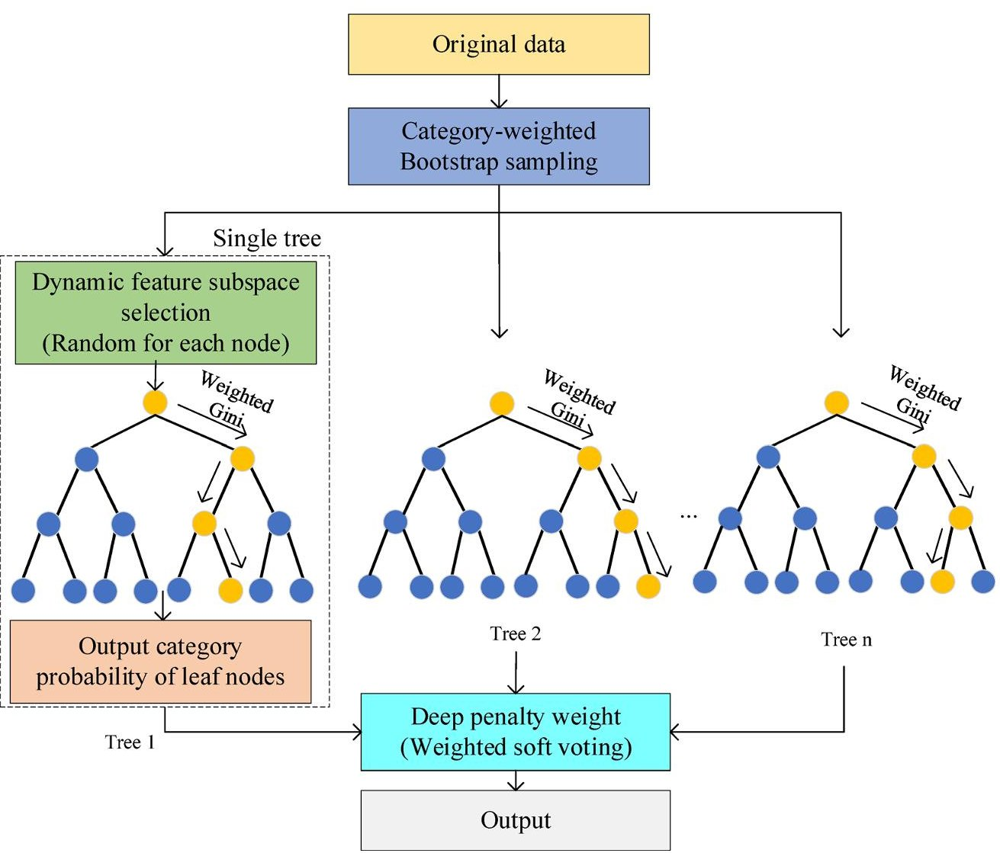

Fig. 1. Internal structure of the proposed Random Forest (RF) model.

<!-- PDF_PAGE: 4 -->

where $ P ( x_{i} ) $ is the sampling frequency for the ith sample, and $ w_{y_{i}} $ is category specific weight. In this study, the weight ratio was empirically set to $ w_{fault}: w_{normal}=4:1 $ . This ensures that the probability of fault samples being selected is four times that of normal samples, thereby constructing a relatively balanced local training set for each tree without losing the majority class information.

## Dynamic selection of feature subspace

Due to mechanical coupling, subway door operation data (e.g., current, angle, and time) typically exhibit strong collinearity. In standard RF algorithms, selecting a fixed number of features at each node may repeatedly favor redundant features, thereby limiting the diversity of the ensemble model. To address this limitation, this study proposes a dynamic subspace strategy based on the Spearman rank correlation coefficient. At each split node, the number of candidate features $ m_{try} $ is determined by the internal correlation of the current feature subset:

$$
m _ {t r y} = \underline {{\left| \sqrt {d} \right|}} + \mathrm {I I} \left(\max \left( \begin{array}{c} \rho_ {j k} \\ j \neq k \end{array} \right) > \tau\right) \cdot \delta
$$

where $ m_{try} $ is the number of selected features, $ \sqrt{d} $ is the floor of the square root of the total number of features d, $ \rho_{jk} $ is the Spearman correlation coefficient between features j and k, $ \tau $ is the redundancy threshold (set to 0.8), $ \delta $ is the subspace expansion step size (set to 1), and $ \Pi(\cdot) $ is the indicator function. When the condition is met, it takes 1, otherwise it takes 0.

## Weighted Gini splitting

To further improve the discriminative ability of minority fault samples, class weights are introduced based on the original Gini coefficient to enhance the influence of fault classes on node purity. The weighted Gini criterion is defined as follows:

$$
\begin{array}{l} G _ {w} (t) = 1 - \left[ \tilde {p} _ {0} (t) ^ {2} + \tilde {p} _ {1} (t) ^ {2} \right] \\ \tilde {p} _ {k} (t) = \frac {w _ {k} N _ {k} (t)}{w _ {0} N _ {0} (t) + w _ {1} N _ {1} (t)}, w _ {k} = \left\{ \begin{array}{l l} 0. 8 \mathrm {f a u l t} (k = 1) \\ 0. 2 \mathrm {n o r m a l} (k = 0) \end{array} \right. \\ \end{array}
$$

where t is the current node. $ N_{k} ( t ) $ represents the number of samples of category k in the current node t. k represents normal or faulty samples, and $ w_{k} $ represents the weight of the sample category.

## Deep penalty aggregation

Restricting tree depth can be regarded as a natural form of regularization achieved by limiting model complexity, which can significantly improve performance $ ^{25} $ . To ensure strict consistency with probability theory and eliminate the inconsistency arising from mixing hard voting signs, the final ensemble prediction is defined using a weighted soft-voting rule:

$$
P _ {R F} (y = 1 | x) = \frac {\sum_ {t = 1} ^ {T} \alpha_ {t} (x) \cdot P _ {t} (y = 1 | x)}{\sum_ {t = 1} ^ {T} \alpha_ {t} (x)}
$$

where $ P_{RF} ( y=1 | x ) $ is the final predicted probability that sample x belongs to the fault class, T is the total number of decision trees, $ P_{t} ( y=1 | x ) $ is the probability estimate produced by the tth tree, and $ \alpha_{t} $ is the regularization weight for the tth tree. To mitigate the risk of overfitting in deep leaf nodes, weight $ \alpha_{t} $ is dynamically determined by a depth-penalty function:

$$
\alpha_ {t} = e x p \left[ - \gamma \cdot m a x \left(0, h _ {t} (x) - h _ {0}\right) \right]
$$

where $ h_{t} ( x ) $ is the depth of the leaf node where sample x falls in the tth tree. The hyperparameters $ h_{0} $ (threshold depth) and $ \gamma $ (decay coefficient) control the strength of regularization.

## eXtreme Gradient Boosting

XGBoost is a gradient-boosting tree that iteratively superimposes shallow trees employing additive models. Each round learns from the residuals of the previous round, thereby approximating complex nonlinear mappings with multiple simple trees. The objective function adopts binary logarithmic loss with L1 and L2 regularization, and performs second-order Taylor expansion on the loss. This enables efficient approximation of the gain of each split by first- and second-order statistics, which not only accelerates tree construction and reduces computational costs, but also controls complexity and smooths boundaries via the primary learning rate, row and column subsampling, and leaf node constraints. With column sampling and "shallow tree stepwise residual fitting," weak but stable gains are screened out from relevant features, which can focus on providing high-precision and stable probability fine-grained gains, as shown in Fig. 2.

## Stacking

Stacking $ ^{26,27} $ is an ensemble strategy that uses the output of a base classifier as input to a secondary meta-classifier and then predicts again in the secondary model. This ensemble learning method ensures diversity between the base models and improves the prediction accuracy $ ^{28} $ . The stacking architecture is shown in Fig. 3.

<!-- PDF_PAGE: 5 -->

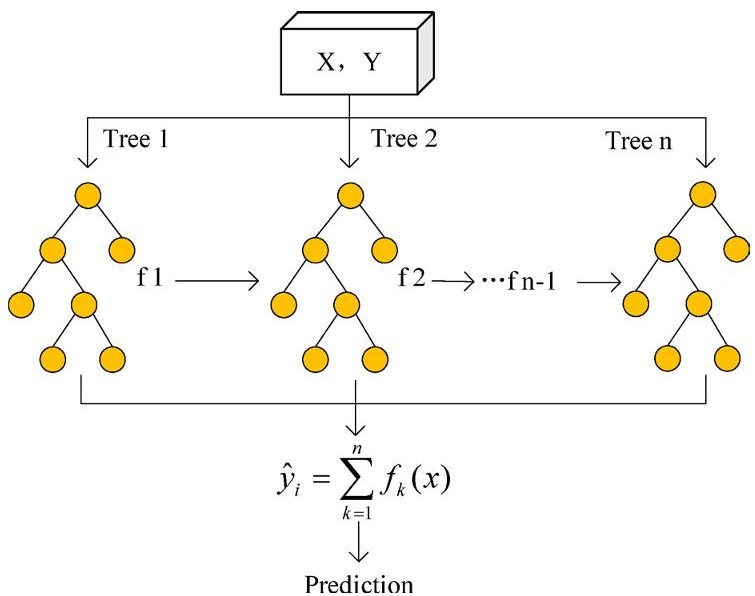

Fig. 2. eXtreme Gradient Boosting (XGBoost) flowchart.

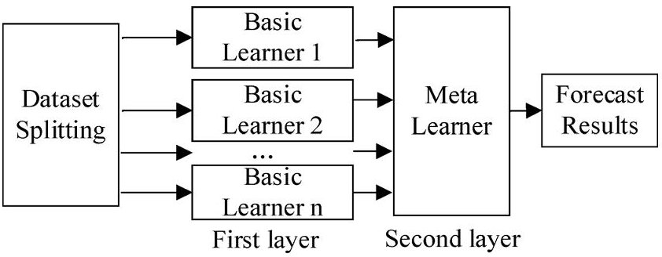

Fig. 3. Stacking framework.

The Stacking model employed in this study uses two parallel models in the first layer, namely improved RF and XGBoost, and is trained using a five-fold cross-validation method to output prediction probabilities. The second layer of the meta-classifier is logistic regression (LR), and the input to the meta-classifier is the concatenated prediction probabilities of the primary classifier on the training set and the average prediction probability on the testing set. Improving the RF can achieve adaptive feature extraction with tree nodes, enhance diversity, provide higher weights to minority classes during splitting, suppress overfitting, and enhance the robustness to outlier points. Nonlinear interactions such as "motor stalling times x in place reversal angle x acceleration time" often indicate potential fault hazards, but the block partitioning of the tree is not sensitive enough to fine boundaries and can easily increase the inference overhead; XGBoost uses an additive model to gradually approximate residuals, which can effectively mine weak but consistent gain signals, such as the joint change of "slightly increasing number of points in the super+3 $ \sigma $ curve and accompanied by longer acceleration time." However, careful regularization and early stopping are required to prevent overfitting. The error patterns of RF and XGBoost do not completely overlap, and using them as base models can achieve complementarity. At the second level, LR is used as a meta-classifier to relearn the probability output of the first-level model. Consistent signals are superimposed and amplified, and inconsistent errors cancel each other. LR combines probability interpretation and threshold adjustability to prevent overfitting, while ensuring model accuracy.

## Prediction model based on improved RF-XGBoost LR

The structural framework of the proposed method is shown in Fig. 4, which defines the sequential process from raw data processing to final prediction decision.

## Data preparation

First, snapshots of subway door operation were captured. Subsequently, missing values were imputed, timestamps were integrated, and categorical variables were encoded. Because fault samples in the original dataset accounted for only 12.1% of the total samples, severe class imbalance could cause the model to be insensitive to minority classes during training. In addition, traditional oversampling methods, such as the SMOTE, were prone to generating noisy samples that violated physical mechanisms in sparsely populated regions of the feature space. To address these issues, this study proposed a PCDA method that expanded the fault sample space within physically interpretable boundaries by introducing controlled random perturbations to enhance feature diversity while preserving the physical authenticity of the data.

<!-- PDF_PAGE: 6 -->

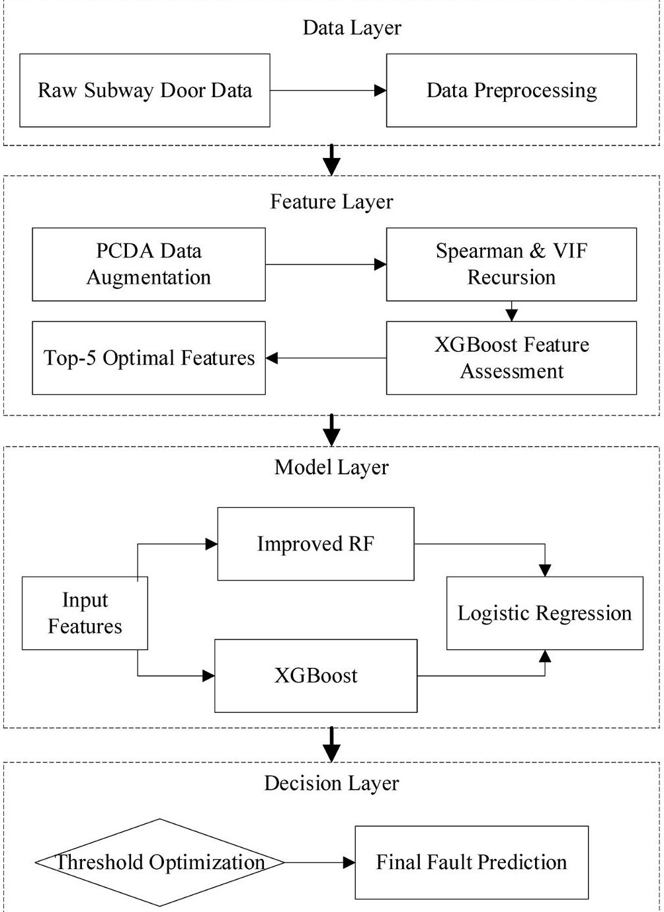

Fig. 4. Holistic framework of the subway door fault prediction system.

## Definition of physical constraints and parameterized perturbations

Based on the statistical distribution characteristics of measured data and combined with the mechanical design limit of the subway door system, we established physical constraint boundaries for the original data features. This paper presents two differentiated parameterized perturbation strategies for different data types (discrete and continuous) of feature data, and defines a rigorous set of physical constraints R for each feature.

## 1. Additive Perturbation for Discrete Features

For the discrete counting feature of "Number of points on the super+3 $ \sigma $ curve" that characterizes the severity of waveform anomalies, an additive noise injection strategy is adopted. The enhanced eigenvalue $ x_{new} $ is defined as:

$$
x _ {n e w} = \max \left(0, r o u n d \left(\beta_ {\mathrm {i n t}}\right)\right)
$$

where $ \mathrm{round} \left( \cdot \right) $ represents the rounding function; $ \max \left( \cdot \right) $ is used to enforce non-negative constraints, ensuring that the outlier count is not negative. $ \beta_{\mathrm{int}} $ is a discrete perturbation factor that follows a Gaussian distribution with a mean of 0 and a standard deviation of $ \sigma_{\mathrm{int}} $ , denoted as $ \beta_{\mathrm{int}} \sim \left( 0, \sigma^{2}_{\mathrm{int}} \right). $

## 2. Diversified Scaling for Continuous Features

<!-- PDF_PAGE: 7 -->

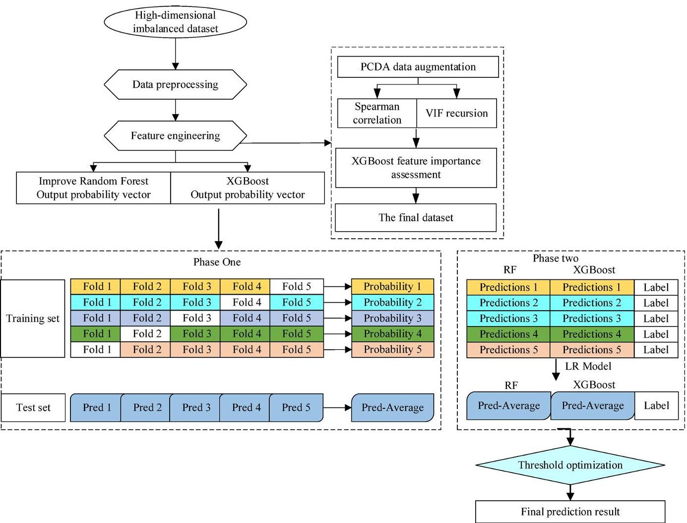

Fig. 5. Subway door fault prediction process.

For continuous kinematic features with clear physical dimensions such as "maximum turning angle," "acceleration/deceleration section turning angle," and "deceleration time," a scaling strategy is adopted to maintain the physical consistency of the features. The enhancement formula is defined as:

$$
x _ {n e w} = x \cdot \left(1 + \beta_ {c o n t}\right)
$$

where $ \beta_{cont} $ is the continuous disturbance ratio used to simulate the motion parameter drift caused by mechanical transmission clearance and motor output torque fluctuations. $ \beta_{cont} $ is set as a uniformly distributed random variable within the interval $ [-\alpha, \alpha] $ , ensuring that the generated motion trajectory is within a reasonable physical tolerance range.

## Implementation protocol and physical validity verification

1. To ensure the objectivity of the evaluation, the dataset is divided into a training set and an independent testing set. The PCDA strategy is only dynamically executed within the training folds of 5-fold cross validation, and the test and validation sets always maintain their original distributions. This ensures that the improvement in model performance is entirely due to the topological extension of the training set on the fault feature manifold.

## 2. Kinematic Logic Verification Mechanism.

To ensure the physical authenticity of synthesized samples, we introduced kinematic constraints to filter the generated data. All samples must satisfy the following two mechanical transmission logics:

Stroke conservation constraint

According to the geometric relationship of the cam mechanism, the sum of the angles of acceleration and deceleration is limited by the mechanical limit and needs to satisfy the following relationship:

$$
\theta_ {a c c} + \theta_ {d e c} \leqslant \theta \max _ {- r o t}
$$

where $ \theta_{acc} $ is rotation angle during acceleration, $ \theta_{dec} $ is rotation angle during deceleration, $ \theta_{\mathrm{max}-rot} $ is maximum rotation angle.

Boundary validity constraint

<!-- PDF_PAGE: 8 -->

The feature variables need to strictly converge within the physically feasible domain.

## Statistical fidelity measurement

We further introduced the maximum mean discrepancy (MMD) metric to quantify the alignment between the distribution of PCDA enhanced data and the original fault data from a statistical dimension. MMD maps data to a reproducing kernel Hilbert space (RKHS) and calculates the distance between the mean embeddings of two distributions in that space. The empirical estimation formula is defined as follows:

$$
M M D ^ {2} \left(D _ {o r i g}, D _ {a u g}\right) = \left\| \frac {1}{N} \sum_ {i = 1} ^ {N} \phi \left(x _ {i}\right) - \frac {1}{M} \sum_ {j = 1} ^ {M} \phi \left(x ^ {\prime} _ {j}\right) \right\| _ {\mathrm {H}} ^ {2}
$$

where $ D_{orig}=\{x_{i}\}_{i=1}^{N} $ is the original fault dataset containing N samples, $ D_{aug}=\left\{x_{j}^{\prime}\right\}_{j=1}^{M} $ is an enhanced dataset containing M samples, $ \phi(\cdot) $ is the feature mapping function, $ \|\cdot\|_{\mathrm{H}} $ is the norm in RKHS space $ \left\{x_{j}^{\prime}\right\}_{j=1}^{M}. $

## First-level model training

The subway door fault prediction process employed by the stacking-integrated model is shown in Fig. 5.

In the first stage, improved RF and XGBoost are employed as the base learners. To fully utilize the limited training data and ensure reliable performance estimation, five-fold cross-validation is conducted within the training set. In each fold, the base learner is trained on four folds of training data and generates prediction probabilities for the remaining folds. By aggregating the prediction results of all folds, out-of-fold probability estimates for each training sample can be obtained. The two columns of probabilities of each validation sample are horizontally concatenated to obtain the final probability matrix, which is used as the input feature for secondlevel fusion $ Z_{\mathrm{train}} $

$$
Z _ {\mathrm {t r a i n}} = \left[ \begin{array}{l l} P _ {R F} ^ {(1)} P _ {X G B} ^ {(1)} \\ P _ {R F} ^ {(2)} P _ {X G B} ^ {(2)} \\ \vdots \\ P _ {R F} ^ {(5)} P _ {X G B} ^ {(5)} \end{array} \right]
$$

The $ \mathrm{i}^{\mathrm{th}} $ row of $ Z_{\mathrm{train}} $ corresponds to the RF- and XGBoost-derived probabilities of the $ \mathrm{i}^{\mathrm{th}} $ training sample.

## Second-level model training

LR is adopted as the second-level meta-learner to fuse the probability outputs generated by the first-level models. Beyond simple ensemble aggregation, the LR meta-learner serves as a probabilistic recalibration layer, transforming potentially miscalibrated predictions from heterogeneous base learners into a unified and interpretable posterior probability.

Specifically, LR operates on the out-of-fold probability predictions produced by the improved RF and XGBoost models, learning an optimal linear combination under a regularized maximum likelihood framework. By optimizing the log-likelihood objective, the meta-learner inherently aligns the fused output with calibrated posterior probabilities. The resulting probability estimates provide a reliable basis for subsequent threshold optimization:

$$
P _ {s t a c k} (x) = \sigma \left(\omega_ {0} + \omega_ {1} P _ {R F \_ \mathrm {m o d}} (x) + \omega_ {2} P _ {X G B} (x)\right)
$$

where $ P_{RF}\mathrm{-mod} (x) $ and $ P_{XGB}(x) $ are the prediction probabilities of RF and XGBoost, respectively, and $ \omega $ represents the linear weights to be learned.

## Threshold optimization

A fixed classification threshold of 0.5 is optimal only under restrictive conditions, including balanced class priors and symmetric misclassification costs. In subway door fault diagnosis, fault samples constitute a minority class. Although missing a fault (false negative) poses significant safety risks, optimizing solely for recall often results in prohibitive operational noise. In high-frequency transit systems, excessive false alarms (false positives) can lead to 'alarm fatigue,' diminishing the system's practical credibility.

Although probability outputs produced by individual tree-based models may exhibit calibration bias, the final decision in this study is based on the calibrated posterior probabilities generated by the LR-based stacking framework. Given these conflicting operational constraints, a fixed threshold remains suboptimal. Therefore, to balance the imperative of fault capture with maintenance efficiency, an adaptive threshold optimization strategy based on F1-score maximization is employed. By functioning as the harmonic mean of precision and recall, the F1-score inherently penalizes both missed detections and excessive false alarms, enabling the decision boundary to better align with the pragmatic requirements of daily operations.

Furthermore, while F1-score maximization establishes a statistically optimal baseline, this dynamic thresholding mechanism inherently supports cost-sensitive adjustments in real-world Prognostics and Health Management (PHM) systems. Because the asymmetric penalty for a missed fault (e.g., in-service failures causing network delays) often far outweighs that of a false alarm (e.g., minor labor costs for unnecessary inspections),

<!-- PDF_PAGE: 9 -->

metro operators can utilize this decision threshold as a tunable 'risk knob'. For instance, under a safety-first policy during peak operational hours, the threshold can be lowered below the F1-optimal point to strictly prioritize recall. Conversely, under a cost-sensitive policy during off-peak periods, it can be elevated to prioritize precision, thereby providing flexible decision support tailored to varying operational risk tolerances.

## Search interval setting and traversal

To avoid overfitting and ensure generalization, the optimal threshold is determined using the out-of-fold (OOF) predicted probabilities obtained during the training stage. The threshold search interval is set to [0.1, 0.9] with a step size of 0.01. For each candidate threshold, the predicted label for sample is generated as follows:

$$
y _ {f i n a l} \left(x _ {i}\right) = \left\{ \begin{array}{l l} 1, P _ {s t a c k i n g} \left(x _ {i}\right) \geqslant T \\ 0, e l s e \end{array} \right.
$$

where $ y_{final}(x_{i}) $ is the predicted label of sample $ x_{i}, $ $ P_{stacking} $ is the probability value predicted by the stacking fusion model, and T is the probability threshold for the current search.

## Determine the optimal threshold

The threshold yielding the maximum F1-score on the training data is selected as the final decision threshold. This threshold is subsequently fixed and applied to the independent test set for performance evaluation.

$$
T _ {f i n a l} = \arg \max _ {T \in [ 0. 1, 0. 9 ]} F 1 - s c o r e (T)
$$

Through this procedure, the stacking model performs classification based on fused probability outputs while achieving a balanced trade-off between recall and precision in fault recognition.

## Performance evaluation

To comprehensively assess the Stacking model from multiple dimensions—including discriminative power, robustness to class imbalance, and probabilistic reliability—this study employs a hierarchical evaluation system consisting of three categories: threshold-dependent metrics, global metrics, and probabilistic calibration metrics.

## Threshold-dependent classification metrics

The predictive performance of the stacking model is evaluated using accuracy, precision, recall, and F1 score as evaluation metrics. Accuracy is used to measure the overall discriminative correctness of the model. Precision is a measure of the number of samples characterized as "positive" are correctly classified. Recall is used to measure the proportion of the faults identified. F1 score is used to measure the balance between accuracy and recall.

$$
A c c u r a c y = \frac {T P + T N}{T P + T N + F P + F N}
$$

$$
P r e c i s i o n = \frac {T P}{T P + F P}
$$

$$
R e c a l l = \frac {T P}{T P + F N}
$$

$$
F 1 S c o r e = 2 \times \frac {P r e c i s i o n \times R e c a l l}{P r e c i s i o n + R e c a l l}
$$

where TP (true positive) is a fault that is correctly predicted as fault, FP (false positive) is a normal (i.e., not a fault) case that is incorrectly predicted as fault, FN (false negative) is a fault that is incorrectly predicted as normal, and TN (true negative) is a normal case that is correctly predicted as normal.

## Global metrics

Given the extreme class imbalance in subway door fault datasets, single-threshold metrics often fail to capture the model's overall discriminative power. To address this, ROC-AUC and PR-AUC are introduced as global performance indicators.

$$
R O C - A U C = \int_ {0} ^ {1} T P R (F P R) d (F P R)
$$

where TPR (True Positive Rate) and FPR (False Positive Rate) denote the sensitivity and false alarm rate at a specific decision threshold, respectively. the integral in Eq. (18) quantifies the probability that a randomly selected positive sample is ranked higher than a negative one.

$$
P R - A U C = \int_ {0} ^ {1} P r e c i s i o n (R e c a l l) d (R e c a l l)
$$

Integrating over the precision-recall space provides a robust metric specifically for imbalanced data, emphasizing the model's ability to identify minority fault cases without being compromised by excessive false positives.

<!-- PDF_PAGE: 10 -->

## Probabilistic calibration metrics

To quantitatively evaluate the reliability of the posterior probabilities output by the Stacking model, Brier score (BS) and expected calibration error (ECE) are employed. these indicators measure the alignment between the predicted confidence levels and the actual empirical accuracy.

$$
B S = \frac {1}{n} \sum_ {i = 1} ^ {n} \left(\hat {p} _ {i} - y _ {i}\right) ^ {2}
$$

where n is the total number of samples in the validation set. $ \hat{p}_{i} $ and $ y_{i} $ are the predicted probability and the ground truth label for the $ \mathrm{i}^{th} $ sample, respectively.

$$
E C E = \sum_ {m = 1} ^ {M} \frac {\left| B _ {m} \right|}{n} \left| a c c \left(B _ {m}\right) - c o n f \left(B _ {m}\right) \right|
$$

the probability interval [0,1] is discretized into M equal-width bins. $ |B_{m} | $ is the number of samples in the $ m^{\mathrm{th}} $ bin, while $ acc(B_{m}) $ and $ conf(B_{m}) $ are the observed accuracy (actual fraction of positives) and the average predicted confidence within that bin, respectively.

## Results

## Dataset construction

In this study, 595 sets of operating data were collected from the subway door control system of Line 10 in a certain city, comprising 523 normal samples and 72 door-switch fault samples. Each sample initially contained 44 sensor features. To ensure physical rationality and mitigate class imbalance, a PCDA method was employed. Specifically, minority fault samples in the training set were augmented to strictly match the quantity of normal samples (a 1:1 ratio), preventing inductive bias during learning.

For feature selection, the Spearman correlation test and variance inflation factor (VIF) were first applied for preliminary dimensionality reduction. Following this statistical screening, the feature subset was further refined based on XGBoost information gain. As illustrated in the cumulative contribution curve (Fig. 8), the top five features capture approximately 98% of the total information gain. Because the marginal contribution of the remaining features is negligible (less than 2%) , only these five key physical parameters were retained as the final input feature set to maximize information retention while eliminating redundancy. Finally, the t-SNE distributions before and after data augmentation are shown in Fig. 6, the feature importance rankings are detailed in Figs. 7 and 8, the descriptive statistics are listed in Table 1, and the data partitioning scheme is depicted in Fig. 9.

## Effectiveness and ablation analysis of feature subset scale

To verify the adequacy and effectiveness of the proposed 'final dataset' in characterizing fault states, and quantify the contributions of each stage of feature engineering, we conducted feature dimension ablation experiments based on the stacking (Improved RF+XGB) framework. To control for variables, all experiments were divided using the same 5-fold cross validation method, and the model classification threshold was fixed at the default value （ $ T=0.5 $ ). The comparison group settings are as follows:

Full original features: including all time-domain statistical features after data preprocessing and PCDA enhancement, totaling 40 dimensions. This set contains a large amount of raw information, but may also introduce noise and redundancy.

Statistical screening features: a subset of features retained after Spearman correlation analysis and VIF test, with a total of 17 dimensions.

XGBoost Cumulative Gain Curve

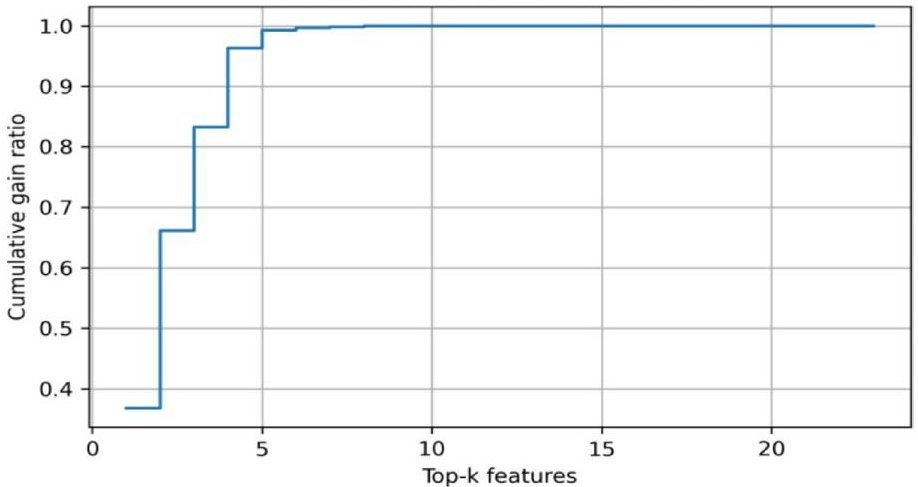

Fig. 8. Cumulative contribution curve of XGBoost feature importance (gain).

<!-- PDF_PAGE: 11 -->

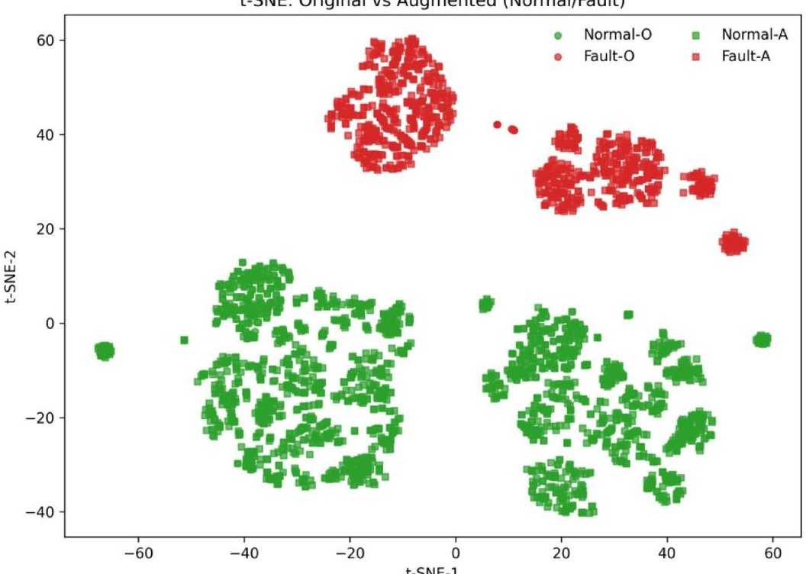

Fig. 6. Data augmentation comparison.

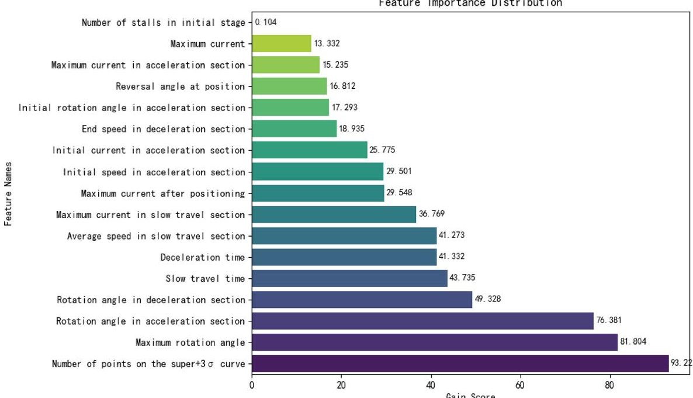

Fig. 7. Feature importance bar chart.

<table border="1"><tr><td>Feature name</td><td>Description</td><td>Observed range</td><td>Physical constraints</td><td>Perturbation strategy</td></tr><tr><td>Number of points on the super+3σ curve</td><td>Count of outliers exceeding mean+3σ</td><td>[0,60]</td><td>x≥0</td><td>xnew=max(0,round(βint))</td></tr><tr><td>Maximum rotation angle</td><td>Max angular displacement per operating cycle</td><td>[2093,4070]</td><td>x∈[2000,4200]</td><td>xnew=x·(1+βcont)</td></tr><tr><td>Rotation angle in acceleration section</td><td>Accumulated angle from start-up to stable speed</td><td>[62,332]</td><td>0＜x＜θmax-rot</td><td>xnew=x·(1+βcont)</td></tr><tr><td>Rotation angle in deceleration section</td><td>Accumulated angle from stable speed to alignment stage</td><td>[566,1112]</td><td>0＜x＜θmax-rot</td><td>xnew=x·(1+βcont)</td></tr><tr><td>Deceleration time</td><td>Duration from low-speed alignment to final positioning</td><td>[460,900]</td><td>x∈[400,1000]</td><td>xnew=x·(1+βcont)</td></tr></table>

Table 1. Description of the input features. $ \beta_{cont} $ is the external environmental scaling factor, following a uniform distribution $ [-0.05, 0.05] $ $ \beta_{\mathrm{int}} $ is the internal perturbation noise following an adaptive Gaussian distribution $ \beta_{\mathrm{int}}\sim\left(0,\sigma^{2}_{\mathrm{int}}\right) $ , where $ \sigma_{j\mathrm{int}}^{j}=0.02\cdot\mathrm{std}(xj) $ denotes 2% of the jth feature's standard deviation.

<!-- PDF_PAGE: 12 -->

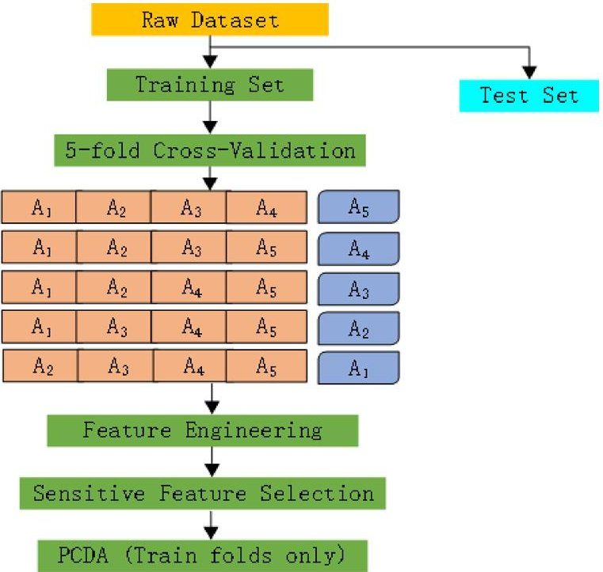

Fig. 9. Data processing flow.

<table border="1"><tr><td>Feature set</td><td>Dim</td><td>Accuracy</td><td>Precision</td><td>Recall</td><td>F1-score</td><td>Reasoning time</td></tr><tr><td>Full feature set</td><td>40</td><td>0.913±0.005</td><td>0.711±0.015</td><td>0.870±0.020</td><td>0.778±0.012</td><td>0.048±0.002</td></tr><tr><td>Statistically filtered</td><td>17</td><td>0.918±0.004</td><td>0.722±0.012</td><td>0.886±0.018</td><td>0.793±0.010</td><td>0.039±0.001</td></tr><tr><td>The final dataset</td><td>5</td><td>0.920±0.003</td><td>0.730±0.014</td><td>0.895±0.014</td><td>0.804±0.009</td><td>0.031±0.001</td></tr></table>

Table 2. The impact of different feature scales on stacking.

Final dataset: Based on statistical screening, combined with XGBoost Gain sorting and subway door mechanism analysis to select key physical parameters, a total of 5 dimensions were retained.

The experimental results are shown in Table 2.

As shown in Table 2, dimensionality reduction achieved a "dual gain" in both model performance and computational efficiency. Despite compressing the feature space from 40 to 5 dimensions, the stacking model demonstrated a steady improvement in F1-score and recall. This confirms that the physical core subset effectively filters out noise inherent in high-dimensional statistical features, enhancing robustness without losing critical fault information. Notably, the minimal 5-dimensional input significantly reduced inference latency by approximately 35%, validating the feasibility of deploying the proposed method on resource-constrained edge devices for real-time monitoring.

## Effectiveness analysis of PCDA strategy

## Distribution fidelity and physical consistency

To verify the reliability of the generated samples, we evaluated the conformity of their statistical features with physical constraints. Experimental calculations showed that the MMD distance between the original fault set and the enhanced set was only 0.019. This indicates that the PCDA strategy significantly enriches sample diversity while strictly maintaining the class conditional distribution characteristics of the original data, effectively preventing harmful distribution shifts caused by data augmentation. The physical consistency pass rate of the enhanced dataset reached 98.8% , confirming that this strategy successfully embeds kinematic constraints into the generation process, ensuring the interpretability of the synthesized samples.

## Ablation on diagnostic performance

To evaluate the actual contribution of PCDA in resolving severe class imbalance, a stacking-based ablation study was conducted, with results detailed in Table 3.

As shown, models trained on the original unbalanced data exhibit a deceptive performance profile: an artificially high precision is accompanied by an unacceptably low recall, posing a severe risk of missing critical faults in real-world operation and maintenance. While introducing traditional SMOTE improves the recall, its unconstrained spatial interpolation generates physically implausible pseudo-samples. This inevitably degrades the precision and introduces significant statistical instability (large variance) across cross-validation folds.

In contrast, the proposed PCDA achieves the optimal precision-recall trade-off, delivering the highest overall F1-score (an approximate 31.8% improvement over the baseline). Crucially, PCDA exhibits exceptional statistical stability with the lowest variance across all evaluation metrics. This firmly confirms that explicitly

<!-- PDF_PAGE: 13 -->

<table border="1"><tr><td>Training data</td><td>Accuracy</td><td>Precision</td><td>Recall</td><td>F1-score</td></tr><tr><td>Original</td><td>0.935±0.025</td><td>0.950±0.042</td><td>0.450±0.032</td><td>0.610±0.033</td></tr><tr><td>SMOTE</td><td>0.955±0.043</td><td>0.680±0.019</td><td>0.820±0.024</td><td>0.743±0.019</td></tr><tr><td>PCDA</td><td>0.920±0.003</td><td>0.730±0.014</td><td>0.895±0.014</td><td>0.804±0.009</td></tr></table>

Table 3. Performance improvement of PCDA strategy on imbalanced learning.

Hyperparameter Sensitivity Analysis

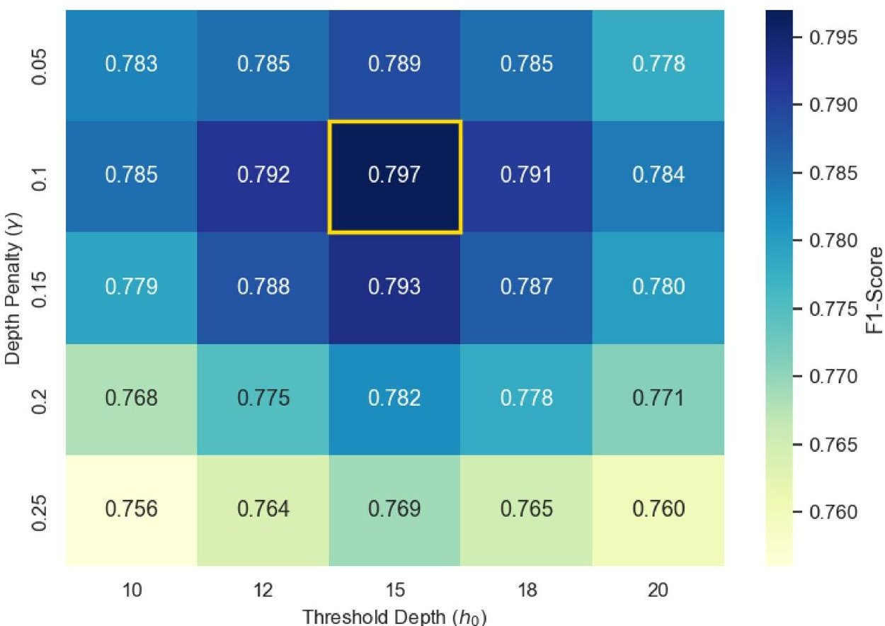

Fig. 10. Hyperparameter sensitivity analysis.

embedding physical constraints ensures data fidelity, which not only maximizes weak signal detection but also significantly enhances the model's robustness against random perturbations.

## Optimization of random forest submodule

Hyperparameter sensitivity analysis of improved random forest

To determine the optimal hyperparameter configuration, we conducted grid search sensitivity analysis on the depth penalty coefficient $ \gamma $ and threshold depth $ \mathrm{h}_{0} $ . As shown in Fig. 10, the model performance (F1 score) exhibits a clear convex optimization surface and reaches its peak at $ \gamma=0.1 $ and $ \mathrm{h}_{0}=15 $ （ $ \mathrm{F1}=0.797 $ ）.

## RF ablation experiment

To quantify the contribution of each module to the initial RF, we considered a "three on, one off" strategy. The category-weighted bootstrap is denoted as module A, dynamic feature subspace as module B, weighted Gini splitting criterion as module C, and deep penalty aggregation as module D. Starting with the baseline "all off" model wherein all four modules were disabled, three of the four modules were enabled. This design is more interpretable and statistically efficient. The performance metrics for each model are presented in Table 4.

Model 1: Original Random Forest.

Model 2: Module A remains closed, whereas modules B, C, and D remain open.

Model 3: Module B remains closed, whereas modules A, C, and D remain open.

Model 4: Module C remains closed, whereas modules A, B, and D remain open.

Model 5: Module D remains closed, whereas modules A, B, and C remain open.

Model 6: Improving Random Forest.

The ablation experiment results indicate that each sub-module focuses on different aspects to enhance the model performance. Specifically, the category weighted sampling and weighted splitting criteria primarily improve the model's ability to recognize fault samples, and the dynamic feature subspace and tree depth control mechanisms help alleviate overfitting issues under small sample conditions. This result verifies the rationality of the structural design of the proposed improved RF.

<!-- PDF_PAGE: 14 -->

<table border="1"><tr><td>Model</td><td>Accuracy</td><td>Precision</td><td>Recall</td><td>F1 score</td></tr><tr><td>Model1</td><td>0.923±0.006</td><td>0.895±0.011</td><td>0.697±0.023</td><td>0.783±0.008</td></tr><tr><td>Model2</td><td>0.929±0.004</td><td>0.726±0.018</td><td>0.867±0.029</td><td>0.790±0.018</td></tr><tr><td>Model3</td><td>0.923±0.010</td><td>0.754±0.024</td><td>0.845±0.014</td><td>0.796±0.015</td></tr><tr><td>Model4</td><td>0.922±0.008</td><td>0.726±0.019</td><td>0.867±0.009</td><td>0.790±0.014</td></tr><tr><td>Model5</td><td>0.923±0.008</td><td>0.756±0.010</td><td>0.840±0.017</td><td>0.795±0.012</td></tr><tr><td>Model6</td><td>0.926±0.009</td><td>0.794±0.008</td><td>0.802±0.022</td><td>0.797±0.010</td></tr></table>

Table 4. Random Forest (RF) ablation experiment results.

<table border="1"><tr><td>Model name</td><td>Brier score</td><td>ECE</td></tr><tr><td>Improving RF</td><td>0.00020</td><td>0.00081</td></tr><tr><td>XGBoost</td><td>0.00015</td><td>0.00058</td></tr><tr><td>Stacking</td><td>0.00014</td><td>0.00551</td></tr></table>

Table 5. Probabilistic calibration metrics comparison.

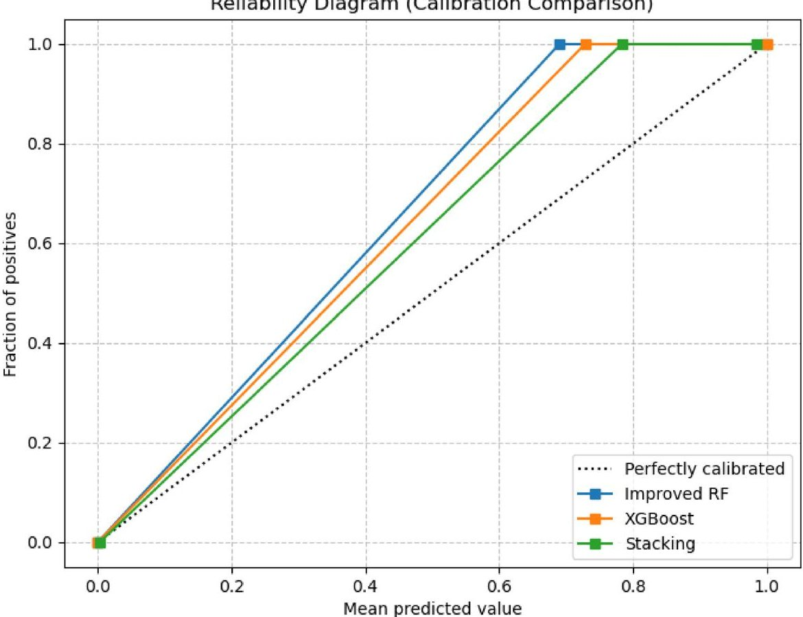

Fig.11. Reliability diagram.

## Probability calibration analysis of the meta-learner

To verify the probability output quality of the logistic regression meta-learner in the stacking framework, this section introduces Brier score and reliability diagram for evaluation. The results are shown in Table 5; Fig. 11.

It can be seen that in comparison, the stacking model achieved the lowest Brier score (0.00014). This indicates that the LR meta-learner effectively smooths the prediction variance of the base learner, making the output probability distribution closer to the true fault distribution.

Corroborated by the Reliability diagram in Fig. 11, although the stacking model exhibits a negligible fluctuation in ECE (0.00551), its calibration curve remains tightly aligned with the diagonal. The superior Brier score confirms the model's robustness in probabilistic accuracy. This demonstrates that the stacking framework produces highly trustworthy probabilities, enabling direct, risk-aware decision-making without the need for post-hoc calibration.

<!-- PDF_PAGE: 15 -->

<table border="1"><tr><td>Model architecture</td><td>Accuracy</td><td>Precision</td><td>Recall</td><td>F1 score</td><td>ROC-AUC</td><td>PR-AUC</td></tr><tr><td>Original RF</td><td>0.923±0.006</td><td>0.895±0.011</td><td>0.697±0.023</td><td>0.783±0.008</td><td>0.974±0.001</td><td>0.905±0.007</td></tr><tr><td>Improving RF</td><td>0.926±0.009</td><td>0.794±0.008</td><td>0.802±0.022</td><td>0.797±0.010</td><td>0.977±0.002</td><td>0.909±0.007</td></tr><tr><td>XGBoost</td><td>0.926±0.003</td><td>0.749±0.013</td><td>0.842±0.018</td><td>0.792±0.008</td><td>0.972±0.004</td><td>0.899±0.012</td></tr><tr><td>Stack_Original RF</td><td>0.915±0.008</td><td>0.717±0.010</td><td>0.865±0.024</td><td>0.784±0.016</td><td>0.974±0.001</td><td>0.905±0.007</td></tr><tr><td>Stack_Improving RF</td><td>0.919±0.004</td><td>0.725±0.013</td><td>0.887±0.024</td><td>0.798±0.015</td><td>0.977±0.002</td><td>0.909±0.007</td></tr><tr><td>Stack_XGB</td><td>0.907±0.002</td><td>0.735±0.015</td><td>0.880±0.016</td><td>0.801±0.013</td><td>0.972±0.004</td><td>0.899±0.012</td></tr><tr><td>Stacking(Original RF+XGB)</td><td>0.918±0.002</td><td>0.720±0.012</td><td>0.877±0.018</td><td>0.791±0.008</td><td>0.974±0.002</td><td>0.906±0.003</td></tr><tr><td>Stacking(Improving RF+XGB)</td><td>0.920±0.003</td><td>0.730±0.014</td><td>0.895±0.014</td><td>0.804±0.009</td><td>0.977±0.002</td><td>0.913±0.011</td></tr></table>

Table 6. Stacking ablation comparison before threshold optimization (i.e., with classification threshold = 0.5).

<table border="1"><tr><td>Model architecture</td><td>Accuracy</td><td>Precision</td><td>Recall</td><td>F1 score</td><td>ROC-AUC</td><td>PR-AUC</td></tr><tr><td>Original RF</td><td>0.929±0.008</td><td>0.798±0.016</td><td>0.777±0.014</td><td>0.787±0.009</td><td>0.974±0.001</td><td>0.905±0.007</td></tr><tr><td>Improving RF</td><td>0.929±0.015</td><td>0.780±0.012</td><td>0.817±0.009</td><td>0.798±0.008</td><td>0.977±0.002</td><td>0.909±0.007</td></tr><tr><td>XGBoost</td><td>0.933±0.003</td><td>0.792±0.011</td><td>0.814±0.011</td><td>0.803±0.008</td><td>0.972±0.004</td><td>0.899±0.012</td></tr><tr><td>Stack_Original RF</td><td>0.928±0.006</td><td>0.790±0.017</td><td>0.782±0.018</td><td>0.786±0.015</td><td>0.974±0.001</td><td>0.905±0.007</td></tr><tr><td>Stack_Improving RF</td><td>0.927±0.003</td><td>0.766±0.012</td><td>0.834±0.013</td><td>0.798±0.012</td><td>0.977±0.002</td><td>0.909±0.007</td></tr><tr><td>Stack_XGB</td><td>0.931±0.003</td><td>0.782±0.011</td><td>0.812±0.010</td><td>0.797±0.012</td><td>0.972±0.004</td><td>0.899±0.012</td></tr><tr><td>Stacking(Original RF+XGB)</td><td>0.935±0.005</td><td>0.813±0.010</td><td>0.807±0.012</td><td>0.809±0.010</td><td>0.974±0.002</td><td>0.906±0.003</td></tr><tr><td>Stacking(Improving RF+XGB)</td><td>0.937±0.004</td><td>0.815±0.009</td><td>0.810±0.010</td><td>0.812±0.002</td><td>0.977±0.002</td><td>0.913±0.011</td></tr></table>

Table 7. Stacking ablation comparison after threshold optimization (i.e., with dynamic threshold activated).

## Stacking threshold optimization ablation experiment

To further investigate the effect of decision threshold optimization on model performance, ablation experiments were conducted by comparing single models and single-/double-level stacking models under fixed and optimized classification thresholds. The results of the experiments are listed in Tables 6 and 7. The comparison diagram of the model radar is shown in Fig. 12, and a comparison of the threshold optimizations is shown in Fig. 13.

1. In Fig. 12, the proposed stacking (Improving RF+XGB) framework encompasses the largest enclosed area among all candidates, indicating a comprehensive advantage across multi-dimensional evaluations. Crucially, regarding global metrics, this architecture achieves the highest ROC-AUC (0.977) and PR-AUC (0.913) which confirms that the model maintains the most effective discriminative power for minority fault samples.

2. Under the fixed threshold, single models (e.g., Original RF) exhibited suboptimal trade-offs with limited recall. By contrast, the stacking framework, particularly after dynamic threshold activation, successfully aligned the decision boundary with task-specific risks. The stacking (Improving RF+XGB) model achieved a refined equilibrium, attaining the highest F1-score (0.812) while balancing precision (0.815) and recall (0.810), demonstrating its capability to minimize both false alarms and missed detections in complex scenarios.

In practical metro operations, this F1-optimized threshold (yielding an F1-score of 0.812) serves as a highly reliable baseline anchor. From this equilibrium point, maintenance engineers can further calibrate the threshold to accommodate specific operational risk tolerances—for example, intentionally sacrificing a marginal degree of precision to achieve near-perfect recall when strict safety constraints mandate zero missed faults.

3. Statistical Reliability Verification: Despite the constraints of a limited fault sample size, the reported performance metrics demonstrate high statistical reliability. The variance for key metrics such as accuracy and F1-score remains remarkably narrow. This stability confirms that the performance gains are derived from the robust feature representation and probabilistic recalibration of the stacking architecture, rather than stochastic fluctuations in specific data splits.

With dynamic threshold search, most models exhibited an increase in the F1 score, with the main benefit being the rebalancing of the fused probability distribution. The dual-branch stacking model improved the most from dynamic threshold search.

## Model comparison and robustness analysis

## Precision-recall curve analysis

The precision-recall curves were evaluated via five-fold cross-validation to assess model stability. The PR-AUC values consistently exceeded 0.90 across all folds (ranging from 0.901 to 0.932), yielding an overall average of $ 0.913\pm0.011 $ . This narrow variance and high lower bound confirms the robust generalization capabilities of the

<!-- PDF_PAGE: 16 -->

Performance Comparison of Representative Models (after Threshold Optimization)

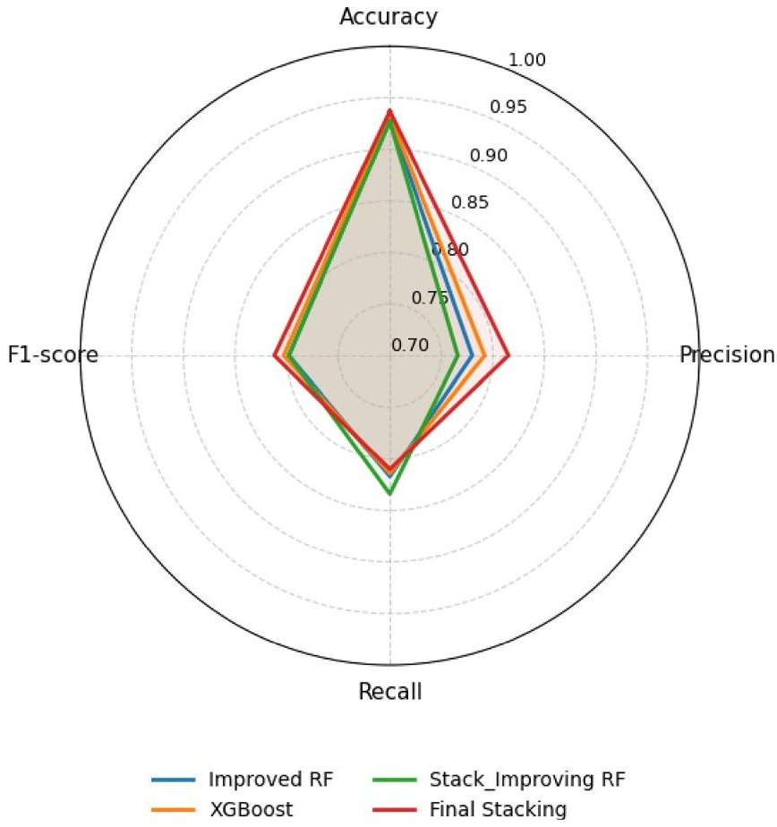

Fig. 12. Performance comparison of representative models.

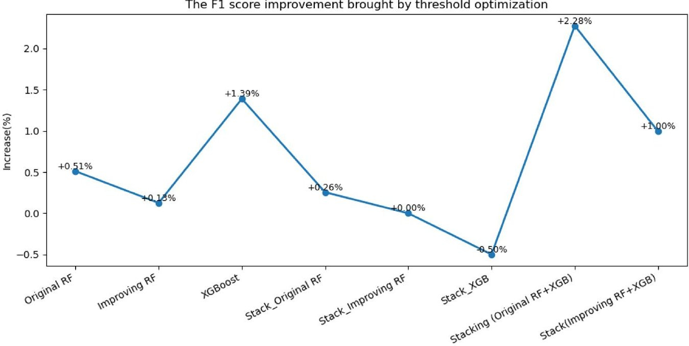

Fig.13. Improvement in F1 score through threshold optimization.

stacking model, effectively suppressing false alarms across varying data partitions while maintaining high recall (Fig. 14).

## Comparative experiment

To rigorously evaluate the efficacy of the proposed stacking framework, comparative experiments were conducted against three categories of baseline methods: Traditional Machine Learning (LR, SVM)、Imbalance-Aware Ensembles (EasyEnsemble, XGBoost with scale_pos_weight, CatBoost with class weighting); and Deep Neural Networks (LSTM, GRU, CNN, Transformer).

<!-- PDF_PAGE: 17 -->

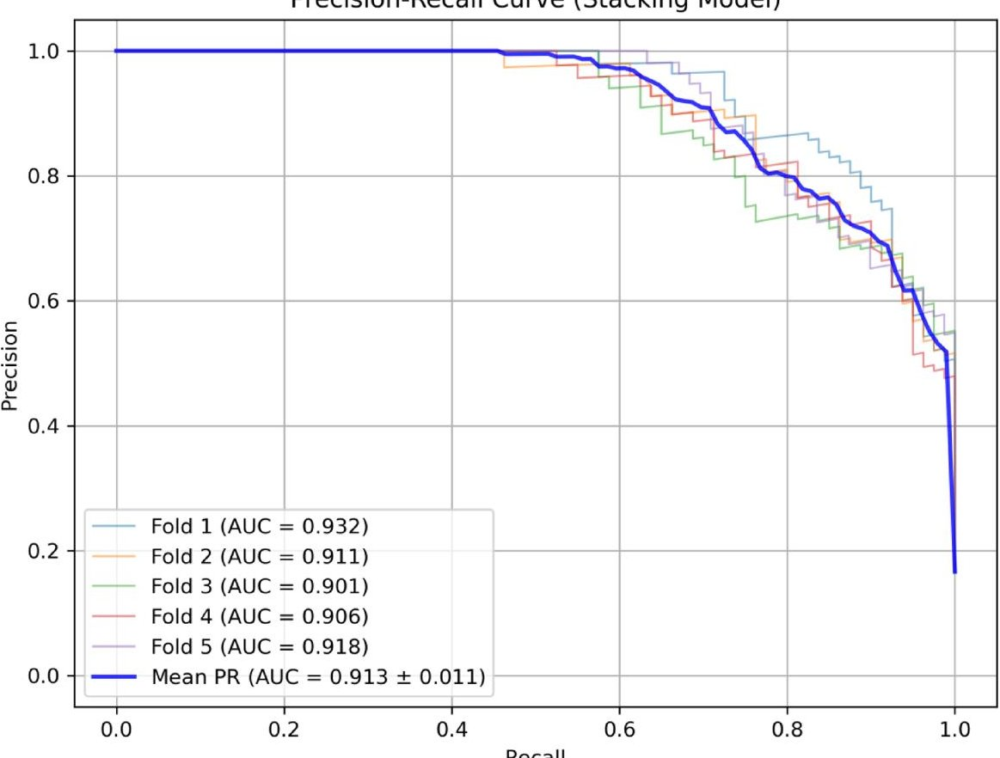

Fig. 14. Precision-recall curves of the stacking model.

## 1. Experimental Protocol and Configuration

To ensure a fair and objective comparison, a unified experimental protocol was adopted. All models were trained and evaluated using the identical Top-5 physical feature vectors. The evaluation employed a stratified 5-fold cross-validation strategy to eliminate data partition bias and ensure that the class distribution in each fold mirrored the original dataset. To guarantee strict reproducibility, a fixed random seed (42) was applied to both data splitting and model initialization.

## 2. Hyperparameter Implementation Details

Hyperparameters for traditional and ensemble models were determined via grid search to ensure optimal convergence. For deep learning baselines, given the limited sample size (N=595), deploying large-scale networks poses significant overfitting risks. To ensure robust feature learning, all deep baselines utilized a lightweight dual-hidden-layer architecture, with the number of hidden units optimized within the set {32, 64} based on validation performance to fit the low-dimensional feature space. Dropout (rate 0.3), L2 weight decay $ (1\times10^{-4}) $ and early stopping (patience of 20 epochs) were implemented to guarantee training stability and generalization. The detailed hyperparameter specifications for all comparative models are enumerated in Table 8.

## 3. Results and Discussion

The performance results are summarized in Table 9.

As presented in Table 9, the proposed Stacking model achieved superior overall performance among all comparative methods. It maintained a commendable balance between precision and recall while sustaining high accuracy, yielding a high F1-score of $ 0.812\pm0.002 $ . Notably, the model exhibited consistently low standard deviations across all metrics—particularly a standard deviation of the F1-score of merely 0.002—demonstrating its exceptional robustness and stability across different data partitions.

By contrast, traditional machine learning models displayed distinct performance biases. Models such as LR and SVM exhibited evident trade-offs between metrics; for instance, LR achieved high recall at the expense of overall accuracy. Among the deep learning baselines, LSTM and GRU demonstrated competitive performance, attaining F1-scores of 0.810 and 0.802, respectively, which closely approached that of the Stacking model. However, in terms of standard deviation, the fluctuations observed in LSTM and GRU were significantly higher than those of the Stacking model. This suggests that, given the limited number of fault samples, deep learning architectures are more susceptible to variations in data distribution, resulting in inferior generalization stability compared to the ensemble learning strategy.

The inclusion of class-imbalance-aware baseline models further strengthened the comparison. EasyEnsemble and XGBoost with tuned scale_pos_weight effectively enhanced fault recall, whereas CatBoost with class weighting increased the precision. However, none of these methods could deliver consistently superior

<!-- PDF_PAGE: 18 -->

<table border="1"><tr><td>Category</td><td>Model</td><td>Final optimized configuration</td></tr><tr><td rowspan="2">Traditional machine learning</td><td>Logistic Regression (LR)</td><td>Solver: lbfgs; Penalty: L2; C: 1.0; Max Iterations: 1000</td></tr><tr><td>Support Vector Machine (SVM)</td><td>Kernel: RBF; C: 1.0; Gamma: Scaled; Probability: True</td></tr><tr><td rowspan="3">Imbalance-aware ensembles</td><td>EasyEnsemble</td><td>Estimators: 10; Base Estimator: AdaBoost; Sampling Strategy: Auto</td></tr><tr><td>XGBoost</td><td>Learning Rate: 0.1; Max Depth: 6; Estimators: 100; Scale_pos_weight: Adjusted by inverse class frequency</td></tr><tr><td>CatBoost</td><td>Learning Rate: 0.05; Depth: 6; Iterations: 500; Auto_Class_Weights: Balanced</td></tr><tr><td rowspan="3">Deep learning</td><td>LSTM/GRU</td><td>Hidden Units: 64; Layers: 2; Dropout: 0.3; Batch Size: 32; Optimizer: Adam</td></tr><tr><td>CNN</td><td>Filters: 32; Kernel Size: 3; Pool Size: 2; Activation: ReLU; Optimizer: Adam</td></tr><tr><td>Transformer</td><td>Attention Heads: 4; Feed-Forward Dim: 64; Layers: 2; Dropout: 0.1</td></tr><tr><td>Proposed framework</td><td>Stacking</td><td>Base: Improved RF+XGBoost; Meta: Logistic Regression;</td></tr><tr><td>Common protocols</td><td>All models</td><td>Input: Identical Top-5 Feature Vectors; Validation: Stratified 5-Fold CV; Random Seed: 42; Early Stopping Patience: 20</td></tr></table>

Table 8. Hyperparameter configurations for baseline and proposed models.

<table border="1"><tr><td>Baseline model</td><td>Accuracy</td><td>Precision</td><td>Recall</td><td>F1 score</td></tr><tr><td>LR</td><td>0.692±0.004</td><td>0.720±0.008</td><td>0.936±0.024</td><td>0.813±0.022</td></tr><tr><td>EasyEnsemble</td><td>0.860±0.007</td><td>0.710±0.013</td><td>0.882±0.016</td><td>0.787±0.006</td></tr><tr><td>XGBoost(scale_pos_weight)</td><td>0.880±0.010</td><td>0.730±0.0004</td><td>0.875±0.013</td><td>0.796±0.010</td></tr><tr><td>CatBoost</td><td>0.929±0.007</td><td>0.936±0.012</td><td>0.639±0.025</td><td>0.759±0.023</td></tr><tr><td>SVM</td><td>0.855±0.008</td><td>0.736±0.013</td><td>0.880±0.009</td><td>0.802±0.012</td></tr><tr><td>LSTM</td><td>0.877±0.004</td><td>0.815±0.012</td><td>0.807±0.018</td><td>0.810±0.021</td></tr><tr><td>GRU</td><td>0.868±0.007</td><td>0.751±0.016</td><td>0.861±0.021</td><td>0.802±0.025</td></tr><tr><td>CNN</td><td>0.820±0.007</td><td>0.690±0.012</td><td>0.835±0.019</td><td>0.756±0.015</td></tr><tr><td>Transformer</td><td>0.773±0.001</td><td>0.774±0.018</td><td>0.735±0.013</td><td>0.754±0.020</td></tr><tr><td>Stacking</td><td>0.937±0.004</td><td>0.815±0.009</td><td>0.810±0.010</td><td>0.812±0.002</td></tr></table>

Table 9. Performance metrics for various machine learning and deep learning models.

performance across all metrics. By contrast, the stacking model preserved high accuracy while maintaining a balanced precision-recall profile.

Overall, these results indicate that the performance advantage of the proposed approach arises not merely from class-imbalance handling but from the complementary integration of heterogeneous base learners.

## Model interpretability analysis based on SHAP

To demystify the ensemble architecture and verify its physical consistency, SHAP values were employed to quantify feature contributions, as shown in Fig. 15.

The analysis reveals that "Maximum rotation angle" and "Rotation angle in deceleration section" were the dominant predictors, exhibiting a strong inverse correlation (high risk associated with low values). Physically, this corresponds to "insufficient travel" or mechanical obstruction being the primary fault triggers. Notably, the minor positive contribution observed at the high extreme of the deceleration angle indicates the model's capability to capture nonlinear anomalies such as over-travel. "Deceleration time" demonstrated a positive correlation, where prolonged deceleration significantly increased fault probability, aligning with the mechanics of increased transmission resistance and sluggish response. In summary, the decision logic of the stacking model corroborates well with established kinematic laws, validating its engineering reliability beyond mere statistical accuracy.

## Conclusion

This study developed a physics-constrained stacking ensemble framework to address the critical challenges of data scarcity and extreme class imbalance in subway door fault prediction. The primary contributions and conclusions of the study are summarized as follows:

- Physics-constrained data augmentation (PCDA): To overcome the limitations of small sample sizes, a PCDA strategy integrating kinematic laws with dynamic noise injection was designed. This approach effectively expanded the fault feature manifold while preserving physical consistency, as validated by a low MMD between synthetic and real distributions, fundamentally mitigating overfitting risks.

- Probabilistic Calibration via Stacking Framework: A multilayer ensemble architecture was constructed using LR to fuse the Improved RF and XGBoost models. This framework serves as a probabilistic recalibration layer, correcting the prediction bias of heterogeneous base learners. Experimental results confirmed its superior global discriminative power, achieving an ROC-AUC of 0.977 and a PR-AUC of 0.913.

<!-- PDF_PAGE: 19 -->

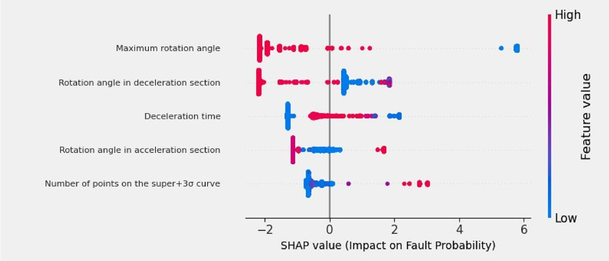

Fig. 15. Model interpretability analysis based on SHAP.

- Cost-Sensitive Decision Optimization: Instead of a fixed decision boundary, an adaptive threshold optimization mechanism based on OOF probabilities was implemented. By maximizing the F1-score (reaching 0.812), the proposed method achieves a cost-sensitive trade-off between precision and recall, satisfying the stringent safety and efficiency requirements of real-world subway maintenance.

While the proposed framework demonstrates robust performance, certain limitations remain to be addressed in future research. First, the current study relies on a relatively limited dataset (595 samples from a single metro line), which inherently presents a risk of model overfitting. Although this study structurally mitigates this risk through extreme dimensionality reduction (restricting inputs to a 5-dimensional physical core) and the use of a linear meta-learner, the model's generalization across highly diverse operating environments and door models requires further extensive validation. Nevertheless, because the extracted feature set is derived from universal kinematic laws (e.g., the correlation between motor stalling and door resistance), the model is endowed with strong baseline transferability. Future work will leverage this physical consistency by incorporating transfer learning and domain adaptation techniques to mitigate specific domain shifts. Furthermore, integrating broader system-level data, such as train operational status and environmental conditions (e.g., temperature and humidity), will facilitate a more comprehensive investigation into systemic fault triggers.

Second, to fully bridge the gap between algorithmic predictions and practical maintenance operations, future research will focus on deploying this model within real-time Prognostics and Health Management (PHM) systems. Instead of relying on static empirical settings, we plan to develop dynamic, cost-sensitive decision policies and employ online learning mechanisms. This will allow the framework to adaptively recalibrate feature-selection thresholds and decision boundaries in response to evolving fault patterns, thereby providing continuous, intelligent decision support for entire metro networks.

## Data availability

The data supporting the findings of this study are available from the Zhengzhou Metro Group Co., Ltd. Restrictions apply to the availability of these data, which were used under the license for the current study and are not publicly available. Data are available from the authors upon reasonable request and with permission from the Zhengzhou Metro Group Co., Ltd.

Received: 15 December 2025; Accepted: 4 March 2026

Published online: 23 March 2026

## References

1. Liu, K., Liu, M., Tang, M., Zhang, C. & Zhu, J. XGBoost-based power grid fault prediction with feature enhancement: Application to meteorology. Comput. Mater. Continua. 82, 2893-2908 (2025).

2. Wu, Y., Yang, A., Liu, F. & Cui, Q. An integrated method for risk assessment and diagnosis of bus drivers driven by unbalanced data. J. Transp. Saf. Secur. 17, 1503-1533 (2025).

3. Viana, D. P. et al. Diesel engine fault prediction using artificial intelligence regression methods. Machines 11, 530 (2023).

4. Apeagyei, A., Ademolake, T. E. & Anochie-Boateng, J. Hybrid transfer learning and support vector machine models for asphalt pavement distress classification. Transp. Res. Rec. 2678, 106-121 (2024).

5. Mahamdi, Y., Boubakeur, A., Mekhaldi, A. & Benmahamed, Y. Power transformer fault prediction using naive Bayes and decision tree based on dissolved gas analysis. ENPESJ 2, 1-5 (2022).

6. Tang, Y., Liu, T., Chang, Y., Liu, Z. & Peng, G. Transient parameter prediction and fault diagnosis for nuclear power plants based on machine learning. J. Nucl. Sci. Technol. 62, 1006-1022 (2025).

7. Zuo, T. et al. An enhanced TimesNet-SARIMA model for predicting outbound subway passenger flow with decomposition techniques. Appl. Sci. 15, 2874 (2025).

8. Ren, Q. & Li, Z. Demand forecasting of bike-sharing based on isolation forest and Bayesian optimization bidirectional long shortterm memory model. Transp. Res. Rec. 2679, 308-320 (2025).

<!-- PDF_PAGE: 20 -->

9. Rama, V. S. B., Hur, S. H. & Yang, J. M. Short-term fault prediction of wind turbines based on integrated RNN-LSTM. IEEE Access. 12, 22465-22478 (2024).

10. Xiong, J., Sun, Y., Sun, J., Wan, Y. & Yu, G. Sparse temporal data-driven SSA-CNN-LSTM-based fault prediction of electromechanical equipment in rail transit stations. Appl. Sci. 14, 8156 (2024).

11. Liu, J., Xu, K., Cai, B. & Guo, Z. Fault prediction of on-board train control equipment using a CGAN-enhanced XGBoost method with unbalanced samples. Machines 11, 114 (2023).

12. Wang, M., Cheng, F., Xie, M., Qiu, G. & Zhang J.Intensive multiorde feature extraction for incipient fault detection of inverter system. IEEE Trans. Power Electron. 40 (2), 3543-3552 (2024).

13. Chen, L. et al. IWOA-Optimized deep learning for bearing fault diagnosis under noisy and variable conditions. IEEE Trans. Instrum. Meas. 74, 1-18 (2025).

14. Wan, A. et al. A novel ga-pso-svm model for compound fault diagnosis in gearboxes with limited data. Sens.J.IEEE.25 (16), 30431-30443 (2025).

15. Huang, Y. et al. Dynamic graph meta-learning with multi-sensor spatial dependencies for cross-category small-sample fault diagnosis in ZDJ9-RTAs. Adv. Eng. Inform. 70, 104132 (2026).

16. Wang, H., Li, Y. F., Men, T. & Li, L. Physically interpretable wavelet-guided networks with dynamic frequency decomposition for machine intelligence fault prediction. IEEE Trans. Syst. Man. Cybernetics: Syst. 54 (8), 4863-4875 (2024).

17. Wang, Z. et al. Towards high-speed elevator fault diagnosis: a parallelographnet driven multi-sensor optimization selection method. Mech. Syst. Signal Process. 228, 112450 (2025).

18. Nentwich, C., Junker, S. & Reinhart, G. Data-driven models for fault classification and prediction of industrial robots. Procedia CIRP. 93, 1055-1060 (2020).

19. Renga, D. et al. Data-driven exploratory models of an electric distribution network for fault prediction and diagnosis. Computing 102, 1199-1211 (2020).

20. Jiang, Y. Data-driven fault location of electric power distribution systems with distributed generation. IEEE Trans. Smart Grid. 11, 129-137 (2020).

21. Tian, S., Li, J., Zhang, J. & Li, C. STLRF-Stack: A fault prediction model for pure electric vehicles based on a high dimensional imbalanced dataset. IET Intell. Transp. Syst. 17, 400-417 (2023).

22. Yan, G., Bai, Y., Yu, C. & Yu, C. A multi-factor driven model for locomotive axle temperature prediction based on multi-stage feature engineering and deep learning framework. Machines 10, 759 (2022).

23. Wang, Y. & Hu, S. State monitoring and fault prediction of centrifugal compressors based on long short-term memory and principal component analysis (LSTM-PCA). PeerJ Comput. Sci. 10, e2433 (2024).

24. Wang, H., Li, C., Liu, Y. & Li, M. A high-speed train traction motor state prediction method based on MIC and improved SVR. Electronics 13, 5036 (2024).

25. Zhou, S. & Mentch, L. Trees, forests, chickens, and eggs: When and why to prune trees in a random forest. Stat. Anal. Data Min. : ASA Data Sci. J. 16, 45-64 (2023).

26. Wang, H. et al. A double-layer ensemble framework for rubber plantation map $ ^{**} $ using multi-source data in the google earth engine: a case study of the southwestern border region of China. Int. J. Digit. Earth. 18 (1), 2520472 (2025).

27. Zhang, Y., Ma, J., Liang, S., Li, X. & Liu, J. A stacking ensemble algorithm for improving the biases of forest aboveground biomass estimations from multiple remotely sensed datasets. GIScience Remote Sens. 59, 234-249 (2022).

28. Emmanuel, T., Mpoeleng, D. & Maupong, T. Power plant induced-draft fan fault prediction using machine learning stacking ensemble. J. Eng. Res. 12, 82-90 (2024).

## Author Contributions

Hongkang Song: Research ideas and scheme design, data processing, model construction and validation, paper writing; Shaohu Tang (Corresponding Author): Funding Acquisition, Resources, Supervision, Paper review and revision; Jinghui Xia: Resources, Data Curation, Paper review and revision; Liang Zhang: Paperreview and revision; Hailin Kang: Supervision; Pengyu Li: Supervision.

## Funding

This work was supported by the National Key R&D Program Project (2021YFB1715700) and Ministry of Education Thematic Case Project (ZT-231141703).

## Competing interests

The authors declare no competing interests.

## Additional information

Correspondence and requests for materials should be addressed to S.T.

Reprints and permissions information is available at www.nature.com/reprints.

Publisher's note Springer Nature remains neutral with regard to jurisdictional claims in published maps and institutional affiliations.

Open Access This article is licensed under a Creative Commons Attribution-NonCommercial-NoDerivatives 4.0 International License, which permits any non-commercial use, sharing, distribution and reproduction in any medium or format, as long as you give appropriate credit to the original author(s) and the source, provide a link to the Creative Commons licence, and indicate if you modified the licensed material. You do not have permission under this licence to share adapted material derived from this article or parts of it. The images or other third party material in this article are included in the article's Creative Commons licence, unless indicated otherwise in a credit line to the material. If material is not included in the article's Creative Commons licence and your intended use is not permitted by statutory regulation or exceeds the permitted use, you will need to obtain permission directly from the copyright holder. To view a copy of this licence, visit http://creativecommons.org/licenses/by-nc-nd/4.0/.

$ \textcircled{c} $ The Author(s) 2026