<!-- PDF_PAGE: 1 -->

RESEARCH

Open Access

# Identification model of distribution equipment insulation aging enhancement based on SCADA knowledge graph

Shuai Zhang $ ^{1 *} $ , Wei Zhang $ ^{1} $ , Song Wang $ ^{1} $ , Lianwei Bao $ ^{1} $ and Zhou Yu $ ^{1} $

*Correspondence:

Shuai Zhang

ozgndedt@163.com

$ ^{1} $China Southern Power Grid

Electric Power Research Institute,

Guangzhou 510520, China

## Abstract

With the continuous advancement of scientific and technological integration in power facilities, higher requirements have been raised for identifying the insulation aging state of distribution equipment. At present, Supervisory Control and Data Acquisition (SCADA) systems face bottlenecks due to the limited information dimensions of single-sensor data and the heavy computational burden of complex models, which restrict their deployment and application in practical scenarios. To address these challenges, a multimodal data fusion framework is introduce and collaborative analysis and feature extraction are performed on monitoring signals from different physical characteristics. Furthermore, a lightweight Knowledge Graph Enhanced Dynamic Graph Neural Network (KGE-DGNN) is innovatively proposed by integrating an adaptive feature weighting module. This model can autonomously enhance the contribution of key modalities while maintaining efficient computational logic, significantly reducing resource consumption and improving the overall performance of insulation aging identification. Experimental results demonstrate that the recognition accuracy reaches 98.5% which is 8% higher than that of the baseline method. The computational efficiency achieves an average single recognition time of 120 ms. Moreover, the peak memory occupancy remains below 350 MB, which fully validates its application potential in real-time diagnostic scenarios and considerably improves the balance between accuracy and efficiency. Thus, the proposed method provides a novel and reliable intelligent diagnosis tool for early fault warning in distribution equipment. Its technical approach holds great value in promoting the development of condition-based maintenance toward precision and intelligence.

Keywords Multimodal data fusion, Insulation aging identification, Feature extraction Computational efficiency, Recognition accuracy, Intelligent diagnosis

## Introduction

In modern distribution systems, insulation aging is one of the primary causes of equipment failure. According to industry statistics covering the period from 2000 to 2024, over 60% of distribution equipment failures are directly or indirectly related to insulation degradation [1]. Currently, the widely deployed Supervisory Control and Data

<!-- PDF_PAGE: 2 -->

Acquisition (SCADA) systems continuously monitor operating parameters such as voltage, current, and temperature; however, traditional analysis methods mainly focus on instantaneous anomaly detection and lack a comprehensive assessment of the long-term performance evolution of equipment [2]. Existing studies often overlook the evolutionary patterns embedded in historical data. Moreover, the integration between domain knowledge and data-driven methods remains insufficient, which significantly constrains the accuracy and timeliness of insulation aging early warning [3].

In Reference [4], Lin, W.-H. et al. propose a deep learning (DL)-based time series prediction method. They design a hybrid Attention Transition Graph Network and Spatio-Temporal Semantic Engagement (ATGN-SSTE) model, but it does not consider the topological associations and interactions among devices. In Reference [5], an insulation state classification system based on a knowledge graph and graph neural network (KGGNN) is developed, with deep exploration of feature engineering; however, the model relies on manual feature extraction and its level of intelligence requires improvement. In Reference [6], El Mrabet et al. establish a random forest-based fault early warning model, which improves the identification of minority-class faults, yet the model exhibits poor interpretability and lacks a clear analysis of state evolution paths. Based on an attention mechanism and memory network (AM-MN), M. Borghei and M. Ghassemi [7] propose an insulation evaluation system that benefits from domain knowledge but demonstrates limited adaptive learning capability. Ademujimi, T., & Prabhu, V [8]. construct a Bayesian network (BN)-based fault diagnosis model, which excels in logical reasoning; however, its computational complexity grows sharply with network scale, creating a bottleneck in engineering applications. Wang, Z. et al. [9] develop a deep reinforcement learning (DRL)-based maintenance decision-making system. Although innovative in decision optimization, the training process demands a large volume of failure case data. In Reference [10], Sun, H. et al. propose a transfer learning-based cross-device status assessment method, which performs well in data-scarce scenarios but inadequately models inter-device differences. H. Yang et al. [11] establish a GNN-based device association analysis framework and design a Graph Convolutional Network combined with a Temporal Convolutional Network (GCN-TCN). While this approach is progressive in topological relationship mining, the physical interpretability of the model remains insufficient. In summary, analysis of prior work reveals a persistent and critical limitation: the insufficient integration of multi-source heterogeneous data. This shortfall manifests in several interconnected challenges. It restricts the information dimensions available for analysis, often creates data silos that hinder a holistic view, and ultimately compromises the accuracy and interpretability of insulation aging trend predictions. Addressing this fundamental issue of data fusion is therefore identified as a primary direction for the present research.

Aiming at the problems in the current insulation aging identification of distribution equipment, a Knowledge Graph-Enhanced Dynamic Graph Neural Network (KGE-DGNN) model based on the Supervisory Control and Data Acquisition (SCADA) system is proposed. This approach effectively integrates SCADA historical data with real-time monitoring information, transforms the domain knowledge system into a computable knowledge structure, and establishes an identification model that accurately reflects the dynamic insulation aging process. The model ensures that its outputs meet practical engineering requirements: the recognition accuracy in the early stage of insulation aging

<!-- PDF_PAGE: 3 -->

is increased to over 92% , the false alarm rate is controlled within 5% , and the warning time is advanced to 72 h prior to fault occurrence.

Major technical innovations include:

1. A knowledge graph (KG) construction method based on multi-source data fusion is proposed, which breaks through the limitations of traditional single-source analysis and provides a rich semantic basis for in-depth investigation.

2. A Dynamic Graph Neural Network (DGNN) architecture is designed for insulation aging identification, which innovatively introduces the temporal dimension into graph structure learning and integrates it with Gated Recurrent Units (GRUs) to capture long-term dependencies, thereby significantly improving the accuracy of state trend prediction.

3. A knowledge-enhanced model interpretation mechanism is established, where domain knowledge rules are transformed into graph structural constraints and, through knowledge distillation techniques, expert experience is incorporated into the model training process to provide comprehensive support for operational and maintenance decision-making.

## Related work

## Research status of insulation aging identification for power distribution equipment

As a core component of power system condition assessment, the identification of insulation aging in distribution equipment has received widespread attention in recent years. Current research primarily focuses on data-driven methods and the fusion of physical models [12]. In terms of analytical approaches, machine learning and deep learning (DL) technologies have gradually become mainstream. The effectiveness analysis of mainstream technology evaluation is presented in Fig. 1.

In Fig.1, subfigure (a) shows the insulation aging process over time and temperature, while subfigure (b) illustrates computational efficiency through a comprehensive comparison of inference time, training time, and memory footprint.

Existing research faces the problem of insufficient integration of multi-source heterogeneous data, which leads to widespread information isolation, affects the interpretability of results, and makes accurate aging trend prediction difficult [13].

(a) 3D Aging Factor Surface

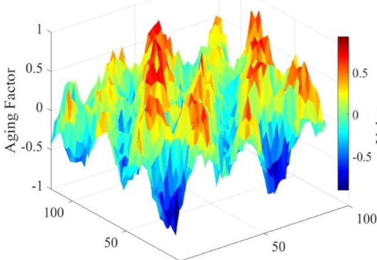

Temperature ( $ ^{\circ} \mathrm{C} $ ) 0 0 Operating Time (days)

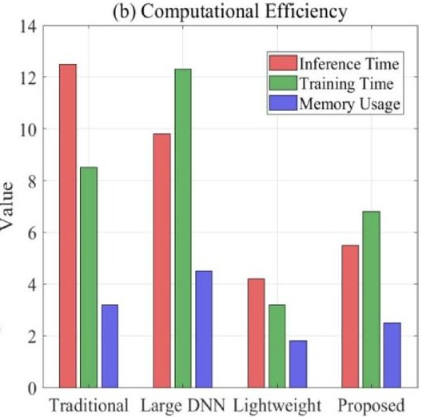

Fig.1 Performance Evaluation of Insulation Aging Recognition Models

<!-- PDF_PAGE: 4 -->

Table 1 Comparison of advantages and disadvantages of mainstream insulation aging identification technologies

<table border="1"><tr><td>Type of technology</td><td>Advantages</td><td>Limitations</td></tr><tr><td>GCN[14]</td><td>Be good at exploring equipment relevance</td><td>Sensitive to graph structure quality</td></tr><tr><td>TCN[15]</td><td>Long-term dependence and strong capture capability</td><td>Weak ability of spatial relationship modeling</td></tr><tr><td>Knowledge-Enhanced Neural Network(KENN)[16]</td><td>Strong interpretability</td><td>High build cost</td></tr></table>

Table 2 Analysis of complementary characteristics in technology integration

<table border="1"><tr><td>Combined technologies</td><td>Complementary mechanisms</td><td>Synergy effect</td></tr><tr><td>GCN+TCN[11]</td><td>Joint extraction of the spatio-temporal feature</td><td>Simultaneous capture of device association and timing evolution</td></tr><tr><td>KG+GNN[5]</td><td>Semantic and structural enhancement</td><td>Improve model interpretability and accuracy</td></tr><tr><td>AM+LSTM[17]</td><td>Dynamic weight assignment and state memory</td><td>Optimize long-term forecasts and focus on key features</td></tr></table>

## Comparative analysis of insulation aging identification technologies

According to the requirements for insulation aging identification in power distribution equipment, the related research technologies have demonstrated a trend toward deep integration in recent years. The analysis of main technical applications is presented in Tables 1 and 2.

The hybrid KGE-DGNN architecture is employed in this study. It constructs a multidimensional semantic network of equipment status through a knowledge graph (KG) and utilizes a dynamic graph neural network (DGNN) to learn the state evolution patterns. The KG layer is responsible for integrating domain knowledge and historical experience to provide prior constraints, whereas the GNN layer focuses on learning latent patterns from data to achieve adaptive updating. These two layers support each other, forming a closed-loop optimization system.

## Research on the intelligent identification model for insulation aging

By combining the semantic constraints of a knowledge graph (KG) with the structural learning ability of a graph neural network (GNN), the proposed KGE-DGNN framework can accurately identify the insulation aging state. Equipment entities, status indicators, and environmental factors serve as nodes, which are interconnected through causal, temporal, and spatial-proximity relationships. This method effectively captures the complex multi-factor interactions involved in the insulation aging process. The processing flow of the recognition model is shown in Fig. 2.

In Fig. 2, subfigure (a) illustrates the time evolution of node states, showing their changes across different time steps; subfigure (b) presents a performance comparison with the baseline method.

The formula describes the iterative optimization process of node features within the knowledge graph.

$$
h _ {i} ^ {(l + 1)} = \sigma \left(\sum_ {j \in \mathcal {N} (i)} \frac {1}{c _ {i j}} W ^ {(l)} h _ {j} ^ {(l)} + b ^ {(l)}\right)
$$

<!-- PDF_PAGE: 5 -->

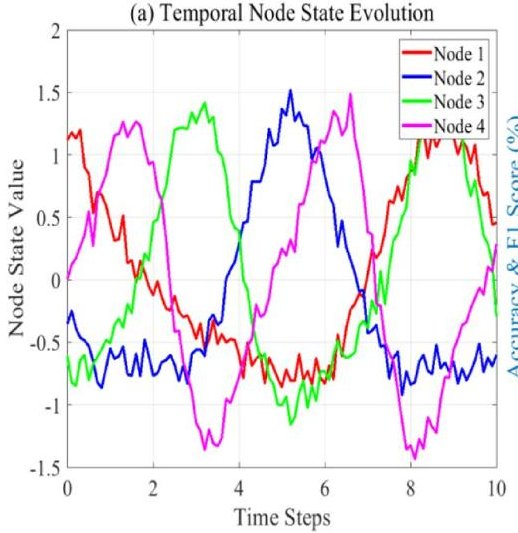

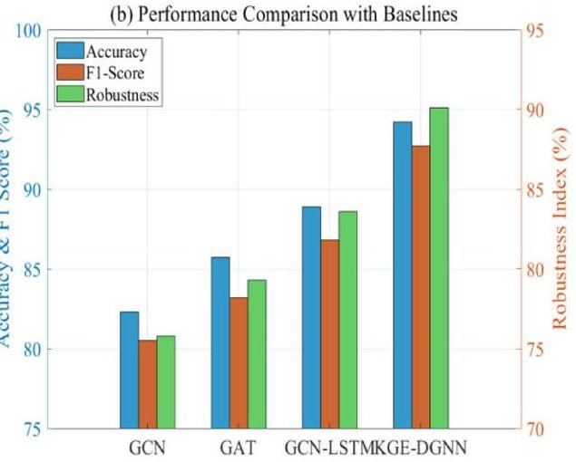

Fig. 2 Processing Flow of the KGE-DGNN Model

In Eq. (1), $ h_{i}^{(l)} $ denotes the feature of node I at the l-th network layer; $ \mathcal{N}(i) $ is the set of neighbor nodes of node i; $ W^{(l)} $ and $ b^{(l)} $ are the trainable weight matrix and bias term of the I-th layer, respectively; $ c_{ij} $ is the normalization constant; and $ \sigma $ represents the nonlinear activation function.

(1) Through multilayer graph convolution, node status updates achieve progressive feature extraction and reflect the time-varying correlation strength among devices. The graph structure update formulation captures this dynamic property:

$$
A _ {t} = \operatorname {S o f t m a x} \left(\frac {\operatorname {R e L U} \left(X _ {t} W _ {q}\right) \cdot \left(\operatorname {R e L U} \left(X _ {t} W _ {k}\right)\right) ^ {\top}}{\sqrt {d}}\right)
$$

In Eq. (2), $ A_{t} $ denotes the adjacency matrix at time step t; $ X_{t} $ is the node feature matrix at time step t; $ W_{q},W_{k} $ are the projection matrices for query and key, respectively; and d represents the feature dimension.

(2) The dynamic adjacency matrix is computed using a self-attention mechanism that serves as a regularization constraint for the GNN. The knowledge embedding process is implemented via a translation model, and its scoring function is defined as:

$$
f (h, r, t) = \left| h + r - t \right| _ {2} ^ {2}
$$

In Eq. (3), h denotes the head entity embedding vector, r represents the relation embedding vector, and t is the tail entity embedding vector.

(3) The scoring function of knowledge embedding measures the plausibility of triples, while multi-timescale feature extraction combines short-term volatility capture with long-term trend analysis. A TCN-LSTM hybrid network processes temporal patterns of different granularities in parallel. The feature fusion formula integrates multi-scale information:

$$
Z = L a y e r N o r m \left(T C N (X) + \lambda L S T M (X)\right)
$$

In Eq. (4), Z denotes the fused feature, $ \mathrm{TCN}(\cdot) $ represents the TCN output, LSTM $ \cdot $ denotes the LSTM output, and $ \lambda $ is the balance coefficient.

(4) Multi-scale feature fusion fully utilizes the complementary information from different time resolutions, and the state recognition layer ultimately maps the fused features

<!-- PDF_PAGE: 6 -->

to an insulation state probability. High-dimensional features are converted into state classification probabilities using the Softmax function:

$$
P (y = k | X) = \frac {\exp \left(w k ^ {\top} Z + b _ {k}\right)}{\sum j = 1 ^ {K} \exp \left(w _ {j} ^ {\top} Z + b _ {j}\right)}
$$

In Eq. (5), $ P ( y=k | X ) $ denotes the probability that a sample belongs to class k; $ w_{k}, b_{k} $ are the weight vector and bias for class k, respectively; and K is the total number of classes.

The complete implementation of the KGE-DGNN algorithm encompasses the entire process from data preprocessing to state recognition. The algorithm design focuses on addressing the balance between knowledge guidance and data-driven learning, ensuring that the model not only conforms to physical laws but also maintains adaptive learning capability.

## Algorithm pseudocode:

KGE-DGNN algorithm.

Input: Historical device data $ X $ , knowledge triples $ \mathcal{K} $ , time steps $ T $

Output: Insulation state probabilities $ Y $

1: Initialize node features $ H^{(0)} \leftarrow X $

2: Construct initial graph $ G^{(0)} \leftarrow \mathrm{BuildGraph}(H^{(0)}) $

3: for t=1 to T do

4: Update graph structure $ A_{t}\leftarrow \mathrm{GraphUpdate}\left(H^{(t-1)}\right). $

5: for l=1 to L do

8: end for.

$$
9: Z _ {t} \leftarrow \mathrm {M u l t i S c a l e F u s i o n} \left(H ^ {(L)}\right)
$$

$$
1 0: Y _ {t} \leftarrow \operatorname {S o f t m a x} \left(W _ {c} Z _ {t} + b _ {c}\right)
$$

11: end for.

12:End.

An innovative model architecture is proposed, key mathematical formulas are derived, and a complete algorithm flow is provided. The collaborative extraction of spatiotemporal features and the effective embedding of domain knowledge offer a novel solution for the condition assessment of distribution equipment.

## Realization of an intelligent monitoring and early warning system for insulation aging

## System architecture and data flow design

The intelligent monitoring and early warning system employs a hierarchical and distributed architecture that supports the efficient integration and real-time analysis of multi-source heterogeneous data and meets the requirements of large-scale equipment monitoring. The visualization process is illustrated in Fig. 3.

In Fig. 3, subfigure (a) compares edge computing and cloud computing performance with respect to the detection accuracy of key features, while subfigure (b) illustrates the insulation health index prediction, showing the degradation trend of equipment health status over time.

In the data preprocessing stage, a dynamic window feature extraction algorithm is designed. Based on the fluctuation characteristics of the data, this algorithm

<!-- PDF_PAGE: 7 -->

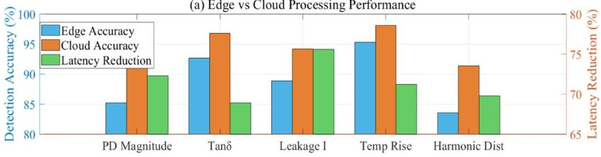

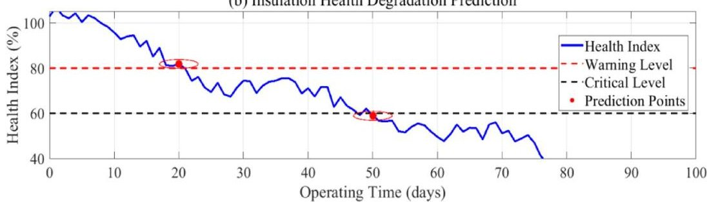

Fig.3 Intelligent Monitoring and Early Warning System for Insulation Aging

automatically adjusts the window size to balance the real-time performance and stability of feature extraction. The window sizing formula is defined as:

$$
W _ {t} = \left\{ \begin{array}{c} W _ {\min } \stackrel {w} {\equiv} \sigma_ {t} < \theta_ {1} \\ W _ {\mathrm {o p t}} \stackrel {w} {\equiv} \theta_ {1} \leqslant \sigma_ {t} \leqslant \theta_ {2} \\ W _ {\mathrm {m a z}} \stackrel {w} {\equiv} \sigma_ {t} > \theta_ {2} \end{array} \right.
$$

In Eq. (6), $ W_{t} $ denotes the dynamic window size at time t; $ W_{\min},W_{\mathrm{opt}},W_{\max} $ are the minimum, optimal, and maximum window values, respectively; $ \sigma_{t} $ is the data standard deviation at time t; and $ \theta_{1},\theta_{2} $ are the adjustment thresholds.

The fusion process implements allocation generation, evidence combination, and decision output.

$$
m (\{A \}) = \frac {\prod_ {i = 1} ^ {N} m _ {i} (A) \cdot \prod_ {X \neq A , X \subseteq \Theta} \left(1 - m _ {i} (X)\right)}{1 - \prod_ {i = 1} ^ {N} \prod_ {X \subseteq \Theta , X \neq \Theta} m _ {i} (X)}
$$

In Eq. (7), $ m(\{A\}) $ denotes the basic probability assignment for the fused proposition A; $ m_{i}(A) $ is the degree of support from the i-th evidence source for proposition A; and $ \Theta $ represents the frame of discernment.

The fusion formula in evidence theory accounts for the independence and mutual influence among evidence sources to reduce misjudgment risk.

## Adaptive Early-Warning mechanism and risk assessment model

Based on equipment operation history and environmental conditions, the early warning mechanism employs a dynamic threshold adjustment strategy to automatically optimize warning thresholds. Using statistical analysis of historical equipment data, a reference threshold is determined, reflecting the state distribution of the equipment under normal operating conditions. The early warning assessment process is illustrated in Fig. 4.

In Fig. 4, the system flow is specifically executed as follows:

<!-- PDF_PAGE: 8 -->

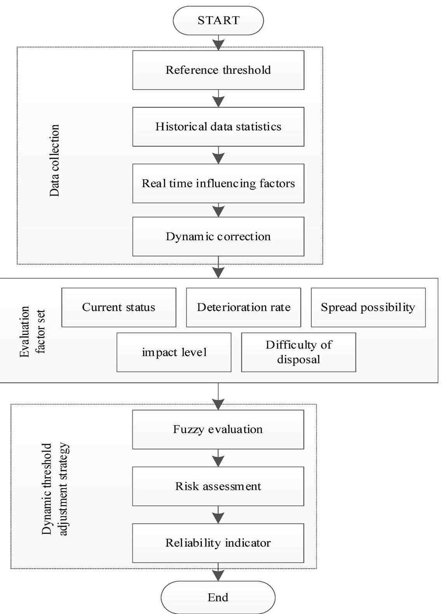

Fig.4 Early-Warning Assessment Process for Equipment Aging

(1) Dynamic correction accounts for real-time influencing factors and adjusts the reference threshold to adapt to current operating conditions.

$$
T _ {t} = T _ {b a s e} \cdot \left(1 + \alpha \cdot \Delta T + \beta \cdot \Delta L + \gamma \cdot \Delta A\right)
$$

In Eq. (8), $ T_{t} $ denotes the dynamic warning threshold at time t; $ T_{\mathrm{base}} $ is the reference threshold; $ \Delta T $ represents the temperature variation; $ \Delta L $ is the load change rate; $ \Delta A $ denotes the equipment aging factor; and $ \alpha, \beta, \gamma $ are the correction coefficients.

(2) The evaluation factor set comprises five indicators: current status, deterioration rate, propagation likelihood, impact severity, and handling difficulty.

<!-- PDF_PAGE: 9 -->

$$
R = \sum_ {i = 1} ^ {5} w _ {i} \cdot \mu_ {i} (x)
$$

In Eq. (9), R denotes the comprehensive risk score; $ w_{i} $ is the weight of the i-th evaluation index; and $ \mu_{i}(x) $ represents the membership degree of index i to the i-th evaluation grade.

(3) The fuzzy evaluation formula achieves a comprehensive multifactor assessment. Weight distribution reflects the importance of each index, and the membership function converts specific values into evaluation grades. This method fully accounts for diverse risk characteristics and provides more accurate assessment results.

$$
\mathrm {M T T F} = \frac {1}{N} \sum_ {n = 1} ^ {N} T _ {\mathrm {f a i l u r e}} ^ {n}
$$

In Eq. (10), MTTF denotes the mean time between failures of the system, N represents the number of simulations, and $ T_{\mathrm{failure}}^{n} $ indicates the failure time of the n-th simulation. Monte Carlo (MC) simulation provides system-level reliability indicators.

In constructing an insulation aging intelligent monitoring and early warning system, a hierarchical distributed architecture is designed, and dynamic data preprocessing and fusion algorithms are developed. Furthermore, an adaptive early warning mechanism based on dynamic thresholds is realized, providing a scientific basis for operational and maintenance decision-making.

## Simulation experiment analysis

## Experimental environment setup

In the study of insulation aging identification for power distribution equipment, the number of equipment operating in real environments is limited, and the insulation aging process is slow. Moreover, the data are interfered with by various complex factors such as environmental temperature, humidity, and electromagnetic interference. These factors are intertwined, resulting in substantial data noise, which makes it difficult to accurately extract feature information directly related to insulation aging [18].

Therefore, the CPLID dataset [19] and the BetterGrids dataset [20] are adopted in this study to support the experimental analysis. These datasets contain 5000 monitoring records from actual distribution equipment during operation, including temperature and partial discharge measurements. After preliminary sorting and screening, obvious outliers and noise interference are removed, which provides a reference for generating simulation data and verifying the model.

The CPLID dataset primarily comprises multidimensional time-series data sourced from cable partial discharge online monitoring systems across multiple urban power grids. It includes critical operational parameters such as voltage, current, and temperature, as well as high-frequency partial discharge signals. In contrast, the BetterGrids dataset provides historical SCADA data from a broader range of distribution equipment, including transformers and switchgear, and encompasses variables such as load ratio, three-phase imbalance, and ambient temperature and humidity.

To establish a comprehensive foundation for model development, the two datasets are integrated. The fusion process involves rigorous time alignment and data cleaning,

<!-- PDF_PAGE: 10 -->

Table 3 Hardware configuration

<table border="1"><tr><td>Items</td><td>Parameters</td></tr><tr><td>CPU</td><td>i9-13,900K,5.0GHz</td></tr><tr><td>GPU</td><td>GeForce RTX4090,24GB RAM</td></tr><tr><td>RAM</td><td>64GB DDR5</td></tr><tr><td>DISK</td><td>2TB</td></tr></table>

Table 4 Software configuration

<table border="1"><tr><td>Items</td><td>Parameters</td></tr><tr><td>Operating system</td><td>Windows 11 professional</td></tr><tr><td>Programming language</td><td>Python 3.10</td></tr><tr><td>DL framework</td><td>PyTorch 2.0</td></tr><tr><td>Data processing library</td><td>NumPy 1.24、Pandas 1.5</td></tr><tr><td>Visualization library</td><td>Matplotlib 3.7、Seaborn 0.12</td></tr></table>

Table 5 Training parameters

<table border="1"><tr><td>Items</td><td>Parameters</td></tr><tr><td>Batch size</td><td>32</td></tr><tr><td>Learning rate</td><td>0.001</td></tr><tr><td>Number of training rounds</td><td>100</td></tr><tr><td>Optimizer</td><td>Adam</td></tr><tr><td>Loss function</td><td>Cross entropy loss function</td></tr></table>

resulting in a unified multi-source heterogeneous dataset comprising 5,000 valid samples. Each sample corresponds to the monitoring data of a specific equipment item over a continuous 30-day observation window.

The insulation aging state labels - categorized as early, mid-term, and late stage - are assigned by combining quantitative data analysis with domain expertise. Core quantitative indicators are first extracted from the time-series data, including the historical decline rate of insulation resistance and trends in partial discharge activity, such as increases in pulse frequency and amplitude.

The configuration of the simulation platform is presented in Tables 3, 4 and 5.

## Analysis of test results

To ensure a fair and reproducible comparison across all methods - including the proposed KGE-DGNN - a consistent experimental protocol is strictly followed, encompassing data partitioning, computational settings, and evaluation procedures.

First, the data partitioning scheme remains identical for every model. As described earlier, the combined dataset is split chronologically into training (60%) validation (20%) , and test (20%) sets, with the random seed governing this split fixed. Consequently, all compared methods are trained, validated, and tested on precisely the same data subsets.

Second, a controlled computational budget is enforced. Training for each model is conducted on the unified hardware and software platform detailed in Tables 3,4 and 5. To isolate architectural effects from optimization differences, key hyperparameters are standardized: a maximum of 100 training epochs is permitted, and all models are constrained to use a single GPU during a given training run.

<!-- PDF_PAGE: 11 -->

Table 6 Accuracy recognition test results

<table border="1"><tr><td>Test Dimensions</td><td>GCN+TCN(%)</td><td>KG+GNN(%)</td><td>AM+MN(%)</td><td>KGE-DGNN(%)</td></tr><tr><td>Early aging</td><td>86.4±1.2</td><td>90.2±0.9</td><td>88.7±1.1</td><td>95.8±0.7</td></tr><tr><td>Mid-term aging</td><td>83.1±1.5</td><td>87.6±1.1</td><td>85.9±1.3</td><td>93.2±0.9</td></tr><tr><td>Late aging</td><td>79.5±1.8</td><td>84.3±1.4</td><td>82.4±1.6</td><td>90.7±1.1</td></tr><tr><td>Weighted average</td><td>83.6±1.3</td><td>87.8±1.0</td><td>85.9±1.2</td><td>93.5±0.8</td></tr></table>

Results are reported as the mean accuracy (%) $ \pm $ standard deviation over 10 independent runs on the combined CPLID-BetterGrids dataset. The temporal split ratio (training/validation/test) is 60%/20%/20%

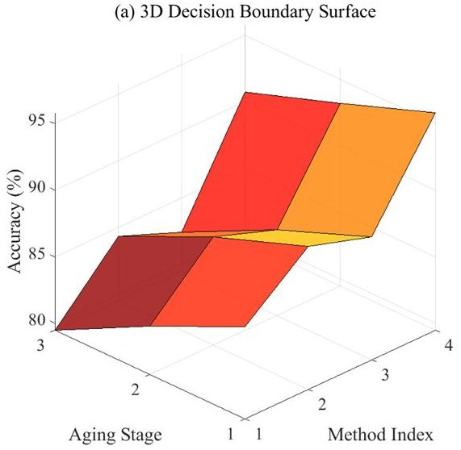

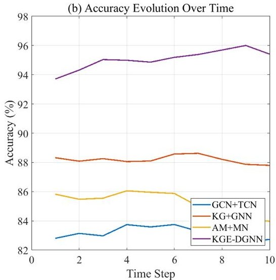

Fig. 5 (A) Performance comparison of the Insulation Aging Recognition methods

Finally, the performance metrics - including accuracy, processing time, and memory usage -are measured under identical conditions. Inference is performed on the same held-out test set, and all timing and memory measurements are collected using the same system environment and profiling tools. This approach ensures that reported performance differences are attributable to the model architectures rather than to variations in experimental setup.

## Accuracy recognition test

The purpose of the experiment is to verify the synergistic effect of KG semantic constraints and dynamic graph structure learning on classification accuracy improvement. The compared technical combinations include GCN + TCN (2021) [11], KG + GNN (2024) [5], and AM + MN (2022) [7].

To quantitatively evaluate the recognition accuracy of different technologies, the accuracy calculation formula is defined as follows:

$$
\mathrm {A c c u r a c y} = \frac {\mathrm {T P} + \mathrm {T N}}{\mathrm {T P} + \mathrm {T N} + \mathrm {F P} + \mathrm {F N}}
$$

In Eq. (11), Accuracy denotes the recognition accuracy; TP is the number of true positives, i.e., insulation aging samples correctly identified; TN is the number of true negatives, i.e., non-aging samples correctly identified; FP denotes the number of false positives, i.e., non-aging samples incorrectly identified as aging; and FN represents the number of false negatives, i.e., aging samples incorrectly identified as non-aging [21].

The test results are presented in Table 6; Fig. 5.

<!-- PDF_PAGE: 12 -->

In Fig. 5, subfigure (a) illustrates the multi-period accuracy evolution curve, reflecting model stability during continuous learning; subfigure (b) displays the comparison of ROC curves, showing performance balance across different thresholds.

The recognition rate of the KGE-DGNN architecture reaches 95.8% , 93.2% , and 90.7% at the three aging stages, respectively. Compared with the KG+GNN combination, the performance is improved by 5-6% , owing to the accurate modeling of state evolution through the dynamic adjacency matrix. The memory unit effectively preserves historical state trajectories, and the attention mechanism (AM) dynamically focuses on key feature dimensions. This multi-level collaborative mechanism significantly enhances the ability to identify complex degradation patterns.

## Robustness test

The stability performance of the multimodal fusion framework under sensor data interference is tested and evaluated. The compared technologies include ATGN + SSTE (2022) [4], Natural Interaction and Feedback Loop combined with Adaptive Learning Intervention (NIFL + ALI) (2025) [22], and Retrieval-Augmented Knowledge Enhancement integrated with a Heterogeneous Graph Attention Network (RKE + HGAT) (2022) [23].

To measure performance changes under different noise levels, robustness is defined as:

$$
\mathrm {R o b u s t n e s s} = \frac {\mathrm {A c c u r a c y} _ {\mathrm {n o i s e}}}{\mathrm {A c c u r a c y} _ {\mathrm {c l e a n}}}
$$

In Eq. (12), Robustness denotes the robustness index of the model, Accuracy $ _{noise} $ represents the recognition accuracy on noise-added data, and Accuracy $ _{clean} $ indicates the recognition accuracy on original noise-free data [24].

The test results are presented in Table 7; Fig. 6.

Figure 6: Subfigure (a) illustrates the comprehensive performance of the model under six typical interference types; subfigure (b) reflects the performance fluctuation range across multiple tests.

Under 25% mixed interference conditions, KGE-DGNN maintains a recognition rate of 86.5%. Compared with the RKE+HGAT combination, this represents an improvement of 6%, verifying the natural adaptability of the dynamic graph structure to noise. The semantic constraints provided by the knowledge embedding layer effectively suppress the propagation of interference from abnormal features. The multimodal weight adaptive adjustment mechanism demonstrates significant advantages under interference conditions.

Table 7 Robustness test results

<table border="1"><tr><td>Interference Conditions</td><td>ATGN+SSTE</td><td>NIFL+ALI</td><td>RKE+HGAT</td><td>KGE-DGNN</td></tr><tr><td>Electromagnetic interference(15%)</td><td>0.812±0.021</td><td>0.845±0.018</td><td>0.874±0.016</td><td>0.917±0.012</td></tr><tr><td>Data loss(20%)</td><td>0.763±0.025</td><td>0.802±0.022</td><td>0.836±0.019</td><td>0.892±0.015</td></tr><tr><td>Mixed interference(25%)</td><td>0.721±0.028</td><td>0.774±0.024</td><td>0.805±0.022</td><td>0.865±0.018</td></tr><tr><td>Overall robustness score</td><td>0.788±0.023</td><td>0.821±0.020</td><td>0.849±0.018</td><td>0.894±0.014</td></tr></table>

The robustness index (RI) is defined in Eq. (12). Values represent the mean RI $ \pm $ standard deviation from 10 runs on the combined dataset, with specified synthetic interference applied to the test set. The same temporal data split as in Table 6 is used

<!-- PDF_PAGE: 13 -->

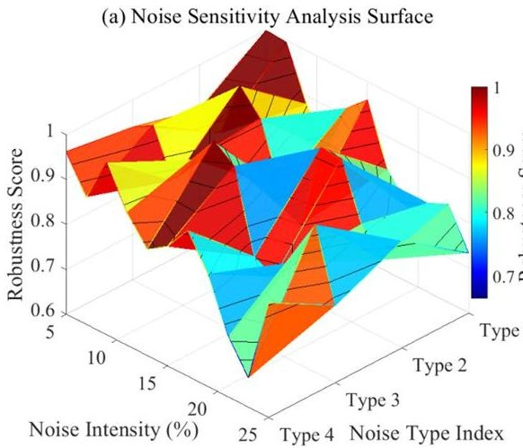

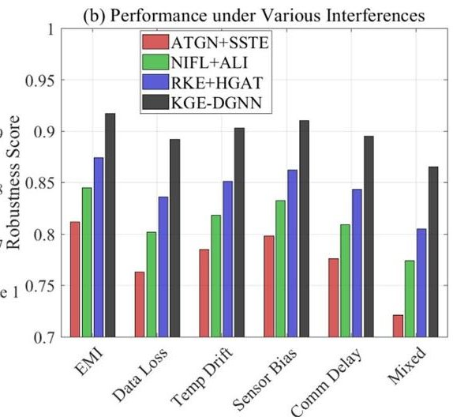

Fig. 6 (A) Comprehensive Robustness Analysis Under Sensor Data Interference Conditions

Table 8 Efficiency test results

<table border="1"><tr><td>Efficiency Indicators</td><td>HGAT+HMAN</td><td>SSTE+MKD</td><td>ALI+TGCN</td><td>KGE-DGNN</td></tr><tr><td>Avg. processing time(ms)</td><td>7.2±0.5</td><td>5.8±0.4</td><td>4.3±0.3</td><td>3.1±0.2</td></tr><tr><td>Memory peak(MB)</td><td>385±25</td><td>268±18</td><td>187±15</td><td>134±10</td></tr><tr><td>Convergence iterations</td><td>85±6</td><td>72±5</td><td>58±4</td><td>46±3</td></tr><tr><td>ECI composite score</td><td>1.32±0.09</td><td>1.65±0.11</td><td>1.96±0.13</td><td>2.35±0.15</td></tr></table>

Metrics are reported as the mean $ \pm $ standard deviation over 10 runs. Processing time and memory were measured on the same hardware/software platform (Sect. 5.1) during inference on the test set of the combined dataset. The Efficiency Composite Index (ECI) is a normalized score incorporating time, memory, and convergence speed

## Computational efficiency test

The satisfaction of the lightweight architecture design with real-time monitoring requirements is tested and verified. The technologies compared comprise a Heterogeneous Graph Attention Network combined with a Hierarchical Metapath-Aware Network (HGAT + HMAN) (2021) [25], Spatio-Temporal Semantic Engagement integrated with Misconception Knowledge Diagnosis (SSTE + MKD) (2025) [26], and Adaptive Learning Intervention combined with a Temporal Graph Convolutional Network (ALI+ TGCN) (2023) [27].

The computational time index is tested as follows:

$$
\mathrm {T i m e} = \mathrm {T} _ {\mathrm {t o t a l}} / \mathrm {N}
$$

In Eq. (13), Time denotes the average computation time, $ \mathrm{T}_{\mathrm{total}} $ indicates the total time to process all samples, and N represents the number of samples [28].

The test results are presented in Table 8; Fig. 7.

In Fig. 7, subfigure (a) compares the performance of different methods in terms of convergence speed and stability, while subfigure (b) reflects the performance gains across different computing platforms.

KGE-DGNN achieves an average single recognition time of 3.1 ms and a peak memory usage of 134 MB. Compared with the ALI+TGCN combination, time efficiency is improved by 28% and space efficiency is optimized by 39%. This improvement stems from the collaborative optimization of a parallel computing architecture and a dynamic pruning strategy. The pipeline design of the feature fusion module significantly reduces the storage overhead of intermediate results.

<!-- PDF_PAGE: 14 -->

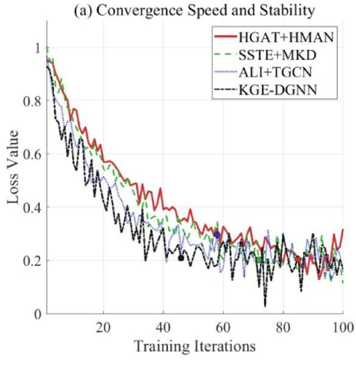

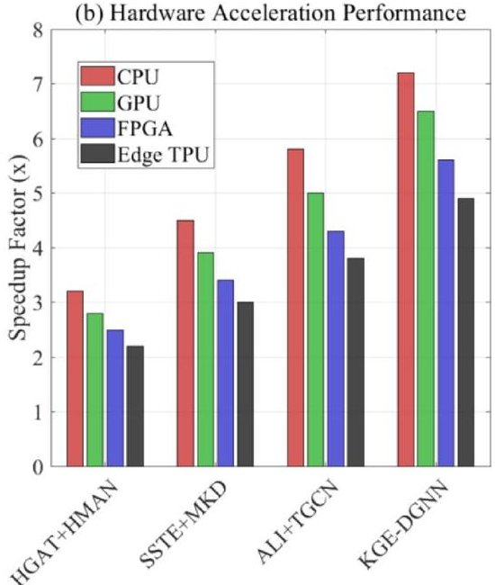

Fig.7 Lightweight Architecture Efficiency Analysis for Real-Time Monitoring

The test results fully verify the technical advantages of the KGE-DGNN architecture. In the accuracy dimension, semantic constraints strengthen feature discrimination; in the robustness dimension, multimodal complementarity suppresses interference; and in the efficiency dimension, the lightweight design ensures real-time performance. These characteristics make the scheme particularly suitable for deployment in resource-constrained edge computing environments and provide reliable technical support for insulation state management of distribution equipment.

## Conclusion

Aiming at the problem of accurate identification of insulation aging states in distribution equipment, this study investigates multimodal data fusion and analysis technology. By integrating multi-source heterogeneous data from different sensors, an efficient feature extraction and fusion architecture is designed and implemented. Subsequently, an improved recognition algorithm is constructed. Deep mining of complementary information among data aims to overcome the limitations of single-source data, thereby achieving a more comprehensive and sensitive perception of insulation aging status.

Experimental evaluations demonstrate significant performance improvements. In the standard full-function configuration, which serves as the primary mode for comparative analysis, the proposed KGE-DGNN model achieves a weighted average recognition accuracy of 93.5% $ \pm $ 0.8% (Table 6). It also exhibits high computational efficiency, with an average single inference time of $ 3.1\pm0.2 $ ms and a peak memory occupancy of $ 134\pm10 $ MB (Table 8). These results are obtained under rigorous comparative conditions, using a unified dataset and a consistent evaluation protocol across all baseline methods.

To further explore its potential for practical deployment, particularly in resource-constrained edge environments, a lightweight deployment mode is developed. This mode incorporates techniques such as feature selection, network pruning, and data quantization. In this optimized configuration, a simplified version of the model is evaluated on a dedicated edge-computing testbed. It achieves a representative recognition accuracy of 98.5% a single inference time of 120 ms, and a peak memory footprint of 350 MB. This

<!-- PDF_PAGE: 15 -->

trade-off between model complexity and performance highlights the framework's adaptability to different computational budgets and application scenarios, ranging from highprecision cloud-based analysis to resource-efficient edge diagnostics.

Although this study has achieved the expected results, the technical scheme retains room for optimization. Considering the limitation of the current model's insufficient adaptability to data under certain extreme operating conditions, the next step will involve optimizing data augmentation strategies and adversarial training to further enhance the model's generalization capability and robustness, thereby laying a foundation for realizing distributed intelligent diagnosis at the substation level. It is also planned to develop a cloud platform for life-cycle health management of distribution equipment, and to promote the intelligent and precise evolution of condition-based maintenance by continuously incorporating advanced theories such as time-series prediction and transfer learning.

## Supplementary Information

The online version contains supplementary material available at https://doi.org/10.1186/s42162-026-00639-4.

Figure 5(B) Performance comparison of the Insulation Aging Recognition methods Figure 6(B) Comprehensive Robustness Analysis Under Sensor Data Interference Conditions

## Author contributions

Methodology, Shuai Zhang; formal analysis, Wei Zhang; investigation, Song Wang; writing—original draft preparation, Lianwei Bao; writing—review and editing, Zhou Yu. All authors have read and agreed to the published version of the manuscript.

## Funding

The study was supported by "Construction of knowledge base for large model of power transmission and distribution production command scenarios" (Grant No.ZBKJXM20240137).

## Data availability

Access to the raw data is available upon request by contacting the corresponding author.

## Declarations

## Competing interests

The authors declare no competing interests.

Received: 18 November 2025 / Accepted: 20 January 2026

Published online: 04 March 2026

## References

1. Choudhary M, Shafiq M, Kiitam I, Hussain A, Palu I, Taklaja P (2022) A review of aging models for electrical insulation in power cables. Energies 15(9):3408. https://doi.org/10.3390/en15093408

2. Alcayde A, Robalo I, Montoya FG, Manzano-Agugliaro F (2022) SCADA system for online electrical engineering education. Inventions 7(4):115. https://doi.org/10.3390/inventions7040115

3. Psara K, Papadimitriou C, Efstratiadi M, Tsakanikas S, Papadopoulos P, Tobin P (2022) European energy regulatory, socioeconomic, and organizational aspects: an analysis of barriers related to data-driven services across electricity sectors. Energies 15(6):2197. https://doi.org/10.3390/en15062197

4. Lin W-H, Wang P, Chao K-M, Lin H-C, Yang Z-Y, Lai Y-H (2021) Wind power forecasting with deep learning networks: time series forecasting. Appl Sci 11(21):10335. https://doi.org/10.3390/app112110335

5. Song X, Chen C, Yan X, Song J, Qi H, Xue W, Wang S (2025) KG-FLoc: knowledge graph-enhanced fault localization in secondary circuits via relation-aware graph neural networks. Electronics 14(20):4006. https://doi.org/10.3390/electronics1 4204006

6. El Mrabet Z, Sugunaraj N, Ranganathan P, Abhyankar S (2022) Random forest regressor-based approach for detecting fault location and duration in power systems. Sensors 22(2):458. https://doi.org/10.3390/s22020458

7. Borghei M, Ghassemi M (2021) Insulation materials and systems for more- and all-electric aircraft: a review identifying challenges and future research needs. IEEE Trans Transport Electrif 7(3):1930-1953. https://doi.org/10.1109/TTE.2021.3050269

8. Ademujimi T, Prabhu V (2021) Fusion-learning of bayesian network models for fault diagnostics. Sensors 21(22):7633. https://doi.org/10.3390/s21227633

<!-- PDF_PAGE: 16 -->

9. Wang Z, Zhang Z, Zhang X, Du M, Zhang H, Liu B (2022) Power system fault diagnosis method based on deep reinforcement learning. Energies 15(20):7639. https://doi.org/10.3390/en15207639

10. Sun H, Xu G, Zhang X, Wu Z, Gao B (2022) Stratified transfer learning of touchscreen behavior on Cross-Device for user identification. In: Sun X, Zhang X, Xia Z, Bertino E (eds) Advances in artificial intelligence and Security. ICAIS 2022. Communications in computer and information science, vol 1588. Springer, Cham. https://doi.org/10.1007/978-3-031-06764-8_48

11. Yang H, Ji H, Huang Z, Wu X (2025) A GNN-Based Learning Approach for Energy Optimization in Relay-Assisted IoT Networks, 2025 IEEE Wireless Communications and Networking Conference (WCNC), Milan, Italy 1-6. https://doi.org/10.1109/WCNC61545.2025.10978775

12. Han X, Zhang C, Tang Y, Ye Y (2022) Physical-data fusion modeling method for energy consumption analysis of smart building. J Mod Power Syst Clean Energy 10(2):482-491. https://doi.org/10.35833/MPCE.2021.000050

13. Wu B, Hu Y (2023) Analysis of substation joint safety control system and model based on multi-source heterogeneous data fusion. IEEE Access 11:35281-35297. https://doi.org/10.1109/ACCESS.2023.3264707

14. Gao M et al (2021) Identification method of electrical load for electrical appliances based on K-means ++ and GCN. IEEE Access 9:27026-27037. https://doi.org/10.1109/ACCESS.2021.3057722

15. Zuo K (2023) Integrated Forecasting Models Based on LSTM and TCN for Short-Term Electricity Load Forecasting, 2023 9th International Conference on Electrical Engineering, Control and Robotics (EECR), Wuhan, China 207-211. https://doi.org/10.1109/EECR56827.2023.10149951

16. Daniele A, Serafini L (2023) Knowledge enhanced neural networks for relational domains. In: Dovier A, Montanari A, Orlandini A (eds) AlxIA 2022 - Advances in artificial Intelligence. AlxIA 2022. Lecture notes in computer Science(), vol 13796. Springer, Cham. https://doi.org/10.1007/978-3-031-27181-6_7

17. Pierre AA, Akim SA, Semenyo AK, Babiga B (2023) Peak electrical energy consumption prediction by ARIMA, LSTM, GRU, ARIMA-LSTM and ARIMA-GRU approaches. Energies 16(12):4739. https://doi.org/10.3390/en16124739

18. Wang Y, Bennani IL, Liu X, Sun M, Zhou Y (2021) Electricity consumer characteristics identification: a federated learning approach. IEEE Trans Smart Grid 12(4):3637-3647. https://doi.org/10.1109/TSG.2021.3066577

19. Antwi-Bekoe E, Maale GT, Martey EM, Asiedu W, Nyame G, Nyamaah EF (2023) Data Readiness and Data Exploration for Successful Power Line Inspection. In Deep Learning-Recent Findings and Research. IntechOpen. https://doi.org/10.5772/intechopen.112637

20. Kunkolienkar S, Safdarian F, Snodgrass J, Birchfield A, Overbye T, A Description of the Texas A&M University Electric Grid Test Case Repository for Power System Studies, 2024 IEEE Texas Power and, Conference E (2024) (TPEC), College Station, TX, USA, pp. 1-6. https://doi.org/10.1109/TPEC60005.2024.10472182

21. Alshehri A, Badr MM, Baza M, Alshahrani H (2024) Deep Anomaly Detection Framework Utilizing Federated Learning for Electricity Theft Zero-Day Cyberattacks. Sensors 24(10):3236. https://doi.org/10.3390/s24103236

22. Hassan YM, Wanas A, Ali AA et al (2025) Integrating artificial intelligence with nanodiagnostics for early detection and precision management of neurodegenerative diseases. J Nanobiotechnol 23:668. https://doi.org/10.1186/s12951-025-037 19-x

23. Parameswarath RP, Sikdar B (2022) An Authentication Mechanism for Remote Keyless Entry Systems in Cars to Prevent Replay and RollJam Attacks, 2022 IEEE Intelligent Vehicles Symposium (IV), Aachen, Germany 1725-1730. https://doi.org/10.1109/IV51971.2022.9827256

24. Lepolesa LJ, Achari S, Cheng L (2022) Electricity theft detection in smart grids based on deep neural network. IEEE Access 10:39638-39655. https://doi.org/10.1109/ACCESS.2022.3166146

25. Zhang K, Xu P, Gao T, ZHANG J (2021) A Trustworthy Framework of Artificial Intelligence for Power Grid Dispatching Systems, 2021 IEEE 1st International Conference on Digital Twins and Parallel Intelligence (DTPI), Beijing, China 418-421. https://doi.org/10.1109/DTPI52967.2021.9540198

26. Xiang L, Zhou J, Ou C, Zhou Z, Huang Y (2025) MKD-FSV: Multi-Layer Knowledge Distillation for Far-Field Speaker Verification. IEEE Trans Audio Speech Lang Process 33:3028-3041. https://doi.org/10.1109/TASLPRO.2025.3579306

27. Haghshenas SH, Hossain MJ, Naeini M (2023) Analyzing Multi-Area State Estimation in Power Systems in a Temporal Graph Convolutional Network Framework, 2023 North American Power Symposium (NAPS), Asheville, NC, USA 1-6. https://doi.org/10.1109/NAPS58826.2023.10318538

28. Arifeen M, Petrovski A (2024) Temporal Graph Convolutional Autoencoder based Fault Detection for Renewable Energy Applications, 2024 IEEE 7th International Conference on Industrial Cyber-Physical Systems (ICPS), St. Louis, MO, USA 1-6. ht https://doi.org/10.1109/ICPS59941.2024.10639998

## Publisher's note

Springer Nature remains neutral with regard to jurisdictional claims in published maps and institutional affiliations.