<!-- PDF_PAGE: 1 -->

RESEARCH ARTICLE

# Material-adaptive kurtosis thresholding for real-time multi-parameter condition monitoring in CNC milling

Muhammad Afnan Nazmy Hailmy $ ^{1} $ , Muchamad Oktaviadri $ ^{2} $ and Ahmad Razlan Yusoff $ ^{1,3*} $

$ ^{1} $Faculty of Manufacturing and Mechatronic Engineering Technology, Universiti Malaysia Pahang Al-Sultan Abdullah, Pekan, Pahang, Malaysia

$ ^{2} $Fakultas Teknik, Universitas Pembangunan Nasional Veteran Jakarta, Jl. Limo Cinere, Jakarta Selatan, Indonesia $ ^{3} $Centre for Advanced Industrial Technology, Universiti Malaysia Pahang Al-Sultan Abdullah, Pekan, Pahang, Malaysia

Abstract - Tool wear remains a major contributor to dimensional defects and unplanned downtime in Computer Numerical Control (CNC) machining. Most existing monitoring strategies employ fixed vibration thresholds that cannot accommodate the distinct dynamic responses of different workpiece materials. Thresholds calibrated for hard materials such as cast iron often fail to detect early wear, whereas the same settings applied to softer polymers lead to excessive false alarms. This limitation highlights the need for material-dependent condition assessment rather than universal thresholding. This study proposes a material-adaptive monitoring framework based on kurtosis thresholds that automatically adjust when the machined material changes. Experimental validation was conducted on three materials representing a wide hardness range: cast iron (220 to 260), aluminum (95 to 100), and polyvinyl chloride (PVC) (80 to 85). A full factorial design comprising 81 milling trials of 27 per material was performed using spindle speeds of 1,500 to 3,500 rev/min, feed rates of 125 to 250 mm/min, and axial depths of cut between 0.2 and 0.7 mm. Vibration signals were acquired using accelerometers mounted on both the spindle and workpiece, and material-specific kurtosis thresholds were derived by correlating statistical features with measured tool wear. The current method achieved classification accuracies of 95.2% for cast iron, 97.8% for aluminum, and 96.7% for PVC, representing improvements of 6-11% over conventional fixed-threshold approaches. The monitoring system was further implemented on an Internet of Things platform to enable real-time remote diagnostics and automated alerts. Pilot deployment indicated a 25- 30% reduction in maintenance costs compared with the existing practice. These results demonstrate that material-adaptive thresholding substantially improves the reliability and practicality of vibration-based tool condition monitoring in CNC milling environments.

Article History

<table border="1"><tr><td>Received</td><td>:</td><td>21 July 2025</td></tr><tr><td>Revised</td><td>:</td><td>12 September 2025</td></tr><tr><td>Accepted</td><td>:</td><td>23 December 2025</td></tr><tr><td>Published</td><td>:</td><td>12 March 2026</td></tr></table>

## Keywords

## 1. Introduction

Tool wear remains a persistent source of dimensional defects and unplanned downtime in CNC machining. In industrial practice, maintenance strategies are generally limited to either reactive intervention after failure or scheduled replacement based on fixed time intervals or usage. Neither approach reflects the actual condition of the cutting tool during operation. Reactive maintenance often leads to unexpected breakdowns, scrap generation, and production disruptions, whereas scheduled maintenance increases operating costs through premature tool replacement and unnecessary machine stoppages. The inability of these strategies to track progressive tool degradation has driven growing interest in predictive maintenance, in which incipient wear is detected in real time and maintenance actions are scheduled based on actual tool health. Reported studies indicate that predictive approaches can reduce maintenance expenditure by approximately 25- 30% compared with conventional practices [1]. Among available sensing modalities, vibration monitoring provides a practical, non-intrusive means of capturing tool condition information. Progressive wear alters the interaction between the cutting edge and the workpiece, increasing surface asperity contact and producing intermittent micro-impacts that manifest as changes in vibration signatures [2]. Accelerometers mounted on the spindle or workpiece enable continuous data acquisition without interrupting machining operations [3]. In industrial environments, time-domain statistical analysis remains widely adopted due to its robustness and low computational burden, which is essential for real-time deployment on embedded platforms and programmable controllers [4]. Kurtosis is particularly sensitive to early-stage tool degradation because it emphasizes impulsive components in vibration signals [5]. As the cutting edge deteriorates, the signal distribution departs from a near-Gaussian profile and exhibits sharper peaks associated with transient impacts [6]. Unlike root-mean-square (RMS) indicators that primarily capture overall energy levels, kurtosis responds strongly to localized events that often precede visible wear. Previous studies have demonstrated the effectiveness of spectral kurtosis in detecting non-stationary behavior in rotating machinery [7], and recent research has incorporated kurtosis-based features into machine learning pipelines for automated fault classification [8]. These findings establish kurtosis as a technically sound indicator for threshold-based monitoring strategies.

Although machine learning techniques have achieved high classification accuracies in laboratory studies, several barriers limit their widespread adoption in industry. Reliable model training typically requires large labeled datasets covering diverse operating conditions, which are costly and time-consuming to acquire in production settings [9]. Model performance often degrades when applied to materials or cutting regimes not represented in the training data, reducing generalizability and robustness [10]. In addition, computational requirements for model training and inference may

<!-- PDF_PAGE: 2 -->

exceed the capabilities of cost-constrained shop-floor hardware. In contrast, statistical threshold methods remain transparent, computationally efficient, and readily deployable on industrial controllers, making them attractive for scalable implementation. The integration of industrial Internet of Things (IoT) platforms has further expanded the potential of condition monitoring systems by enabling remote access, centralized diagnostics, and automated alerting across distributed assets [11,12]. Multi-sensor fusion approaches combining vibration with temperature, acoustic emission, or strain measurements have demonstrated improved diagnostic performance in controlled studies [13]. However, most deployed systems focus primarily on equipment-level monitoring and assume that process variations, such as material changes, do not require algorithmic adaptation. In high-mix manufacturing environments, where materials with substantially different mechanical properties are machined within the same production shift, this assumption limits the reliability of monitoring.

A critical limitation of many existing vibration-based systems is the use of universal threshold values that are applied irrespective of workpiece material [14]. Thresholds optimized for hard materials, such as cast iron between 220 and 260 HB, may fail to detect early wear when machining softer materials such as aluminum between 95 and 100 HB, while thresholds tuned for soft materials may trigger excessive false alarms during hard-material machining. Furthermore, most systems focus on a single condition indicator, typically tool wear, although surface quality, cutting stability, and dimensional accuracy are equally important for process control. Adaptive capability is also lacking; when material changes occur, operators are often required to recalibrate thresholds or manually accept degraded detection performance. Fundamental machining theory has long established the influence of material properties on cutting dynamics. Shaw [15] demonstrated that hardness, yield strength, and deformation behavior govern cutting forces, while Merchant's analytical framework [16] explained the relationship between chip formation mechanics and force variation. These principles imply that vibration characteristics should vary systematically with material properties. Nevertheless, this theoretical understanding has not been fully translated into practical adaptive monitoring strategies validated under industrial conditions. Surface quality monitoring introduces an additional layer of complexity. Surface roughness directly influences functional performance and customer acceptance [17,18], yet conventional contact-based measurements interrupt production and are unsuitable for continuous monitoring. Recent studies have reported strong correlations between vibration features and surface roughness, with correlation coefficients exceeding 0.85 under certain machining conditions [19-21]. Despite these advances, integrated systems capable of simultaneously assessing tool wear and surface quality using material-adaptive thresholds remain largely unexplored, particularly in cloud-connected environments.

This study addresses these gaps by developing a material-adaptive monitoring framework based on kurtosis thresholding. Unlike conventional approaches that employ fixed thresholds [22], the proposed method derives material-specific threshold matrices to improve robustness across a wide range of workpiece hardness. Three contributions are presented. First, empirically derived kurtosis thresholds are established for cast iron, aluminum, and polyvinyl chloride (PVC), and their effectiveness is evaluated for classifying five tool wear states: Perfect, Good, Small Wear, Large Wear, and Fracture. Second, a parallel framework is introduced for surface quality assessment using the same vibration signals, enabling simultaneous classification of five surface quality levels and validation against measured roughness (Ra). Third, the adaptive monitoring system is implemented on an IoT platform that automatically updates thresholds when material selection changes, eliminating manual recalibration and supporting real-time remote diagnostics. The study evaluates whether material-specific thresholds yield accuracy improvements exceeding 5% relative to universal thresholds, whether vibration features maintain correlations above 0.85 with surface roughness, and the minimum experimental dataset required to establish stable threshold values. These objectives directly address the gap between laboratory-scale monitoring methods and practical deployment in industrial CNC environments.

## 2. Materials and Methods

## 2.1 Experimental Configuration

Experiments were carried out on a Makino KE55 CNC milling center equipped with a 15 kW spindle motor and a maximum rotational speed of 12,000 rev/min. The machine offers sufficient rigidity and positioning accuracy to ensure repeatable vibration measurements and controlled progression of tool wear [20]. A 16 mm diameter face milling cutter fitted with uncoated APMT1604 carbide inserts with double-edge geometry was employed. This insert type is widely used in industrial practice and provides consistent cutting characteristics, thereby reducing variability associated with tool geometry during wear evaluation. Three workpiece materials covering a broad industrial hardness range were selected to examine the influence of material properties on vibration behavior and to evaluate the effectiveness of material-adaptive thresholds. Cast iron Grade 250 is a high-hardness ferrous material with a Brinell hardness of 220 to 260 HB. Aluminum alloy 6061-T6 provided intermediate hardness values of 95 to 100 HB and is commonly used in aerospace and automotive components. Polyvinyl chloride is a low-hardness polymer with a Shore D hardness of approximately 80 to 85. Together, these materials span hardness values from approximately 80 to 260 HB, enabling assessment of whether a single universal threshold can reliably capture tool degradation across diverse cutting conditions. Material mechanical properties are known to influence cutting forces and vibration generation [16], making this range appropriate for evaluating adaptive monitoring strategies

## 2.2 Vibration Measurement System

Two accelerometers were deployed to capture complementary aspects of the machining dynamics, as illustrated in Figure 1. A single-axis piezoelectric accelerometer (PCB 603C01) with a sensitivity of 100 mV/g was mounted on the workpiece using a magnetic base to capture surface vibrations associated with tool-workpiece interaction and potential

<!-- PDF_PAGE: 3 -->

surface quality degradation. A tri-axial piezoelectric accelerometer (PCB 604B31) with a sensitivity of 100 mV/g per axis was mounted on the spindle housing near the tool holder to measure structural vibration transmitted through the rotating assembly. This dual-sensor configuration enables simultaneous observation of tool-condition effects at the spindle level and surface-related vibrations at the workpiece. Signals were acquired using a four-channel dynamic signal analyzer from National Instruments, NI-9234, with 24-bit resolution and integrated anti-aliasing filters. A sampling frequency of 25.6 kHz was selected to ensure adequate capture of high-frequency impulsive components associated with tool wear while maintaining sufficient frequency resolution [23]. This bandwidth is appropriate for detecting transient vibration peaks generated by micro-impacts at worn cutting edges.

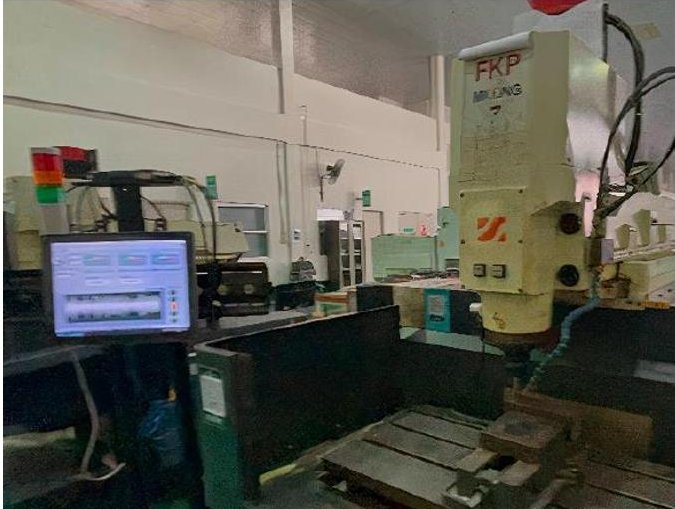

(a) Overall configuration with Makino KE55 CNC machine

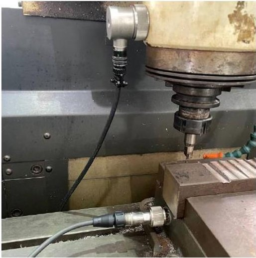

(b) Accelerometer placement on the workpiece and spindle

Figure 1. Experimental setup

## 2.3 Experimental Design Matrix

A full factorial experimental design was adopted, with three cutting parameters evaluated at three levels each, yielding 27 operating conditions per material $ \left( 3^{3} \right) $ . Across the three materials, 81 experimental runs were conducted. Spindle speed (S) was varied at 1,500,2,500, and 3,500 rev/min to represent low- to high-speed milling regimes. Feed rate (F) was set at 125,200, and 250 mm/min to capture variations in chip load and dynamic excitation. Axial depth of cut (A) was selected as 0.2,0.5, and 0.7 mm to represent light to moderate cutting engagements. The complete parameter matrix is summarized in Table 1. The factorial design allows systematic evaluation of parameter interactions and their combined influence on vibration response and tool degradation. Each experimental run was continued until the tool fractured, enabling full life-cycle observation from initial sharpness to catastrophic failure. Vibration signals were continuously recorded throughout each run, providing time-resolved data suitable for threshold development and validation.

Table 1. Experimental parameters

<table border="1"><tr><td>Parameter</td><td>Symbol</td><td>Level1</td><td>Level2</td><td>Level3</td><td>Unit</td></tr><tr><td>Spindle Speed</td><td>S</td><td>1500</td><td>2500</td><td>3500</td><td>Rev/min</td></tr><tr><td>Feed Rate</td><td>F</td><td>125</td><td>200</td><td>250</td><td>mm/min</td></tr><tr><td>Depth of cut</td><td>A</td><td>0.2</td><td>0.5</td><td>0.7</td><td>mm</td></tr><tr><td>Materials</td><td>M</td><td>Cast iron</td><td>Aluminum Alloys</td><td>PVC</td><td></td></tr><tr><td>Tool Conditions</td><td>-</td><td>27</td><td>27</td><td>27</td><td>81</td></tr></table>

## 2.4 Signal Processing and Feature Extraction

Time-domain statistical features were extracted from vibration signals obtained from both accelerometers. Kurtosis was selected as the primary indicator due to its sensitivity to impulsive events associated with tool wear, and is defined as:

$$
\mathrm {K u r t o s i s} = \frac {n \cdot \sum \left(x _ {i} - \bar {x}\right) ^ {4}}{\left(\sum \left(x _ {i} - \bar {x}\right) ^ {2}\right) ^ {2}}
$$

where n is the number of samples $ x_{i} $ is the acceleration amplitude, and $ \bar{x} $ is the mean value. This formulation provides bias correction for finite sample sizes.

As wear progresses, localized micro-impacts at the cutting interface generate sharp peaks in the vibration signal, leading to a deviation from a Gaussian distribution [24]. Kurtosis amplifies these deviations through its fourth-order statistical moment, allowing early detection of degradation even when overall vibration energy remains low. Compared with RMS indicators, which primarily reflect signal magnitude, kurtosis provides greater sensitivity to transient events linked to incipient wear [8,24,25]. Raw acceleration signals were processed using a sliding window approach with a window length of 1 s and 50% overlap. A high-pass filter with a 3 Hz cutoff removed low-frequency drift and DC components, followed by the application of a Hanning window to minimize leakage. Kurtosis was computed for each

<!-- PDF_PAGE: 4 -->

window across both sensor channels, producing time-series profiles that track progressive tool degradation throughout each experiment [23,24]. These profiles form the basis for threshold development.

## 2.5 Classification Threshold Development

Material-specific kurtosis thresholds were established through a four-stage procedure linking vibration features to measured tool condition and surface quality. First, tool wear was quantified by confocal microscopy, measuring flank wear width (VB), with VB=0.3 mm adopted as the standard end-of-life criterion. Surface roughness was measured using a calibrated surface tester in accordance with ISO 468, with Ra values recorded at three locations and averaged as shown in Figure 2. Observed roughness values ranged approximately from 0.5 to 12 $ \mu m $ across materials and wear states. Second, datasets were grouped by material, compiling kurtosis time series alongside corresponding VB measurements. For surface-quality analysis, workpiece-mounted accelerometer features were paired with Ra measurements to enable correlation. Third, tool condition was categorized into five wear states: perfect (VB<0.1 mm), good (0.1-0.15 mm), small wear (0.15-0.3 mm), large wear (0.3-0.5 mm), and fracture (VB>0.5 mm or visible failure). Surface quality was similarly classified into five levels based on Ra: excellent ( $ <1.0\mu m $ ), good (1.0-2.0 $ \mu m $ ), satisfactory (2.0-3.5 $ \mu m $ ), unsatisfactory (3.5-5.0 $ \mu m $ ), and bad ( $ >5.0\mu m $ ). Kurtosis distributions for each class were analyzed separately for each material, and threshold boundaries were set at the midpoints between adjacent class distributions. Analysis of variance was applied to confirm statistically significant separation between wear states [24]. Fourth, the derived thresholds were validated across all 81 experimental runs by computing classification accuracy. During deployment, the active threshold set is automatically selected based on the programmed workpiece material, eliminating manual recalibration and reducing misclassification associated with universal thresholds [2].

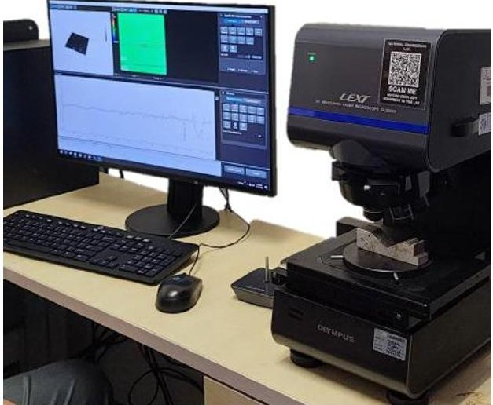

(a) Lext microscope

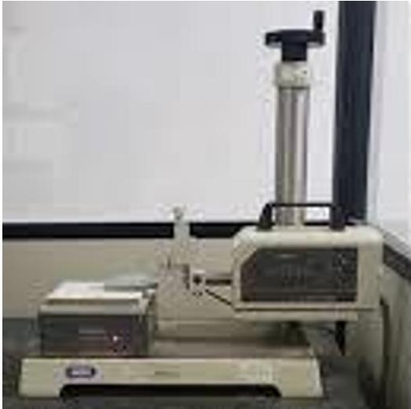

(b) Roughness tester

Figure 2. Measurement equipment

Figure 3. IOT configuration

<!-- PDF_PAGE: 5 -->

## 2.6 IoT Integration Architecture

Real-time monitoring was implemented using a three-layer IoT architecture, as shown in Figure 3. Local processing was performed on an industrial tablet running LabVIEW Real-Time, receiving vibration data from the NI-9234 at 25.6 kHz. Kurtosis was computed in real time using the same sliding window parameters applied during offline analysis. Threshold comparisons were performed locally to generate immediate alerts when state transitions were detected [22,24,26]. The cloud layer utilized the ThingsBoard Community Edition platform to store time-stamped features and classification outputs. Historical data support long-term analysis, trend visualization, and future model development [20,27]. A web-based dashboard displays current tool condition, predicted surface quality, and alert status. Remote access was enabled through browser-based interfaces and mobile notifications, allowing maintenance personnel to monitor equipment health and respond promptly to warnings. Local feature extraction minimizes network bandwidth requirements and ensures resilience against connectivity interruptions. The complete architecture demonstrates practical feasibility for industrial deployment and aligns with Industry 4.0 principles for connected manufacturing systems [7,14].

## 3. Results and Discussion

## 3.1 Material-Specific Kurtosis Thresholds

Analysis of the experimental dataset revealed distinct kurtosis distributions that varied systematically with workpiece material. These trends are consistent with established observations in machining dynamics, where material mechanical properties influence cutting forces and vibration response [16,17]. The empirically derived threshold matrices summarized in Tables 2 and 3 demonstrate substantial separation between the three investigated materials.

Table 2. Material-specific kurtosis thresholds for tool condition classification

<table border="1"><tr><td>Condition</td><td>Cast Iron (Hard)</td><td>Aluminum (Medium)</td><td>PVC(Soft)</td></tr><tr><td>Perfect</td><td>&lt;0.75</td><td>&lt;0.60</td><td>&lt;0.30</td></tr><tr><td>Good</td><td>0.76-1.50</td><td>0.61-1.20</td><td>0.31-0.75</td></tr><tr><td>Small Wear</td><td>1.51-2.25</td><td>1.21-1.80</td><td>0.76-1.15</td></tr><tr><td>Large Wear</td><td>2.26-3.00</td><td>1.81-2.40</td><td>1.16-1.55</td></tr><tr><td>Fracture</td><td>&gt;3.00</td><td>&gt;2.40</td><td>&gt;1.55</td></tr></table>

Table 3. Material-specific kurtosis thresholds for surface condition classification

<table border="1"><tr><td>Classification</td><td>Cast Iron (Hard)</td><td>Aluminum (Medium)</td><td>PVC(Soft)</td></tr><tr><td>Excellent</td><td>&lt;2.00</td><td>&lt;1.500</td><td>&lt;1.00</td></tr><tr><td>Good</td><td>2.01-4.00</td><td>1.51-2.70</td><td>1.01-1.90</td></tr><tr><td>Satisfactory</td><td>4.01-5.00</td><td>2.71-4.00</td><td>1.91-2.70</td></tr><tr><td>Unsatisfactory</td><td>5.01-6.00</td><td>4.01-5.40</td><td>2.71-3.60</td></tr><tr><td>Bad</td><td>&gt;6.00</td><td>&gt;5.40</td><td>&gt;3.60</td></tr></table>

For tool condition classification as tabulated in Table 2, the Perfect-state kurtosis threshold was below 0.75 for cast iron, below 0.60 for aluminum, and below 0.30 for PVC. This monotonic decrease reflects the reduced vibration energy generated during the cutting of softer materials under comparable operating conditions. Higher hardness and brittleness in cast iron result in stronger intermittent force fluctuations, whereas polymer machining produces comparatively stable and low-amplitude vibration signatures. A similar hierarchy was observed for surface condition thresholds as tabulated in Table 3. Cast iron consistently exhibited the highest kurtosis boundaries, followed by aluminum and PVC. Thresholds were derived using the full dataset of 81 experimental runs, with each material analyzed independently to avoid cross-material bias. Class boundaries were determined from adjacent distribution intersections, ensuring data-driven separation rather than heuristic selection. Statistical validation followed established procedures [23], confirming reliable discrimination between neighboring wear and surface states

## 3.2 Tool Condition Monitoring Performance

Figure 4 presents boxplots of measured flank wear and corresponding kurtosis values for the three materials. Strong monotonic relationships were observed between increasing kurtosis and progressive tool degradation. Pearson correlation coefficients exceeded 0.92 for all materials for cast iron as r = 0.94; aluminum as r = 0.96; PVC as r = 0.93; p < 0.001, confirming that kurtosis reliably captures wear-induced vibration changes [7,8]. Material-specific behavior was evident. Cast iron exhibited the widest kurtosis spread and highest absolute values, consistent with its elevated cutting forces and brittle chip fracture. Aluminum demonstrated intermediate variability, associated with stable, ductile chip formation, while PVC produced narrow distributions, reflecting low stiffness and reduced cutting resistance [25]. These differences underscore the limitation of universal thresholding. A threshold optimized for PVC would substantially underestimate degradation in cast iron, whereas a cast-iron threshold would generate excessive false alarms when applied to PVC.

<!-- PDF_PAGE: 6 -->

Material-adaptive calibration mitigates this conflict by aligning thresholds with the intrinsic vibration characteristics of the material.

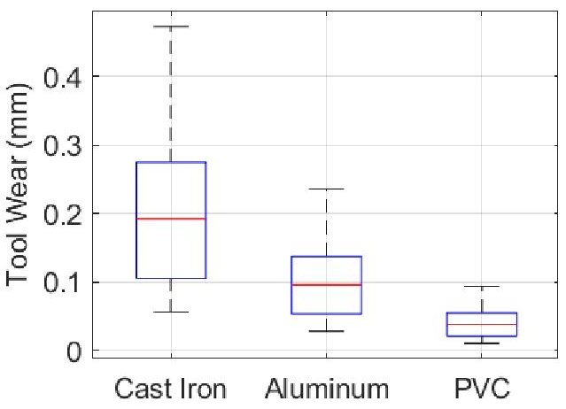

(a) Tool wear distribution

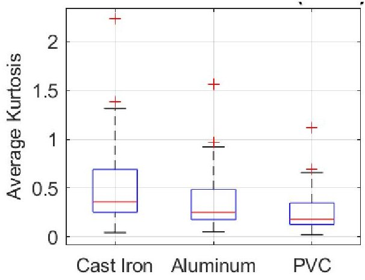

(b) Kurtosis distribution

Figure 4. Boxplot for kurtosis values and measured tool wear for different materials

## 3.3 Surface Quality Assessment Results

Figure 5 illustrates the relationship between kurtosis measured at the workpiece and corresponding surface roughness values. Statistically significant correlations were obtained for all materials of cast iron for r=0.89; aluminum for r=0.92; PVC for r=0.87; p<0.001, demonstrating that vibration features provide reliable proxies for surface quality without interrupting production. Material-dependent threshold spacing reflects differences in surface generation mechanisms. Cast iron surfaces arise primarily from brittle grain fracture, aluminum from plastic deformation and chip smearing, and PVC from viscoelastic deformation and thermal softening [16,17]. These mechanisms influence the spectral content and impulsiveness of vibration signals, explaining why uniform thresholds cannot consistently capture surface degradation across materials. The results extend prior vibration-based surface-monitoring studies [19-21] by demonstrating practical integration with tool condition assessment within a single sensing framework.

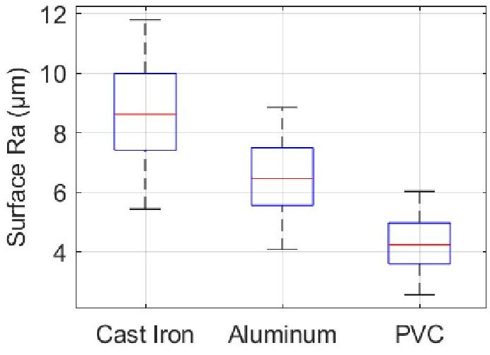

(a) Surface roughness distribution

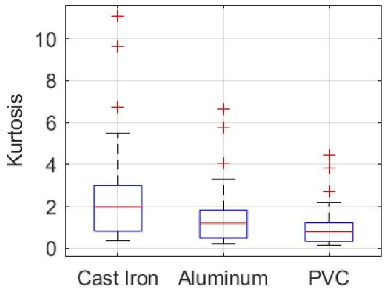

(b) Kurtosis distribution

Figure 5. Box plot kurtosis values and measured surface roughness for different materials

## 3.4 Validation Monitoring System Performance

Representative acceleration signals across progressive wear states are shown in Figure 6. Signals evolved from smooth, low-amplitude responses of $ \pm0.5 $ g in the Perfect state to increasingly impulsive patterns as wear progressed. Large Wear conditions produced frequent transient peaks of $ \pm1.5-2.0 $ g, while fractured tools generated chaotic waveforms exceeding $ \pm2.5 $ g. This progression confirms that time-domain vibration signatures directly reflect mechanical degradation. Directional sensitivity analysis indicated higher responsiveness in the radial spindle axes than in the axial direction, consistent with rotating-machinery dynamics, where cutting forces act predominantly in the radial direction [20]. Material-dependent amplitude trends were also evident: cast iron generated the largest vibration levels, aluminum exhibited moderate amplitudes with regular patterns, and PVC produced the lowest amplitudes. Real-time monitoring performance is illustrated in Figure 7. The dashboard displayed stable separation of kurtosis clusters for each material and enabled automatic threshold switching. Cast iron exhibited kurtosis ranges of 0.45-3.2 for tool monitoring and 1.2- 7.8 for surface assessment. Aluminum provided the clearest class separation and highest accuracy, while PVC maintained robust performance despite lower signal amplitudes. Classification results summarized in Table 4 show high accuracy across all materials. Tool wear classification reached 95.2% for cast iron, 97.8% for aluminum, and 96.7% for PVC. Surface quality classification achieved 94.8%, 96.3%, and 95.9%, respectively. These values exceed conventional fixedthreshold methods by approximately 6-11% and match or exceed reported machine learning performance while retaining

<!-- PDF_PAGE: 7 -->

low computational overhead and full interpretability [11,21]. The IoT platform maintained real-time processing with classification latency below 0.5 s per window and reliable data transmission during extended operation. Six months of pilot deployment demonstrated maintenance cost reductions of approximately 25-30% , improved early failure detection, and system uptime exceeding 99.7% . No false-positive alarms were observed during controlled trials, indicating high operational stability.

Test 1: Perfect Tool, Excellent Surface

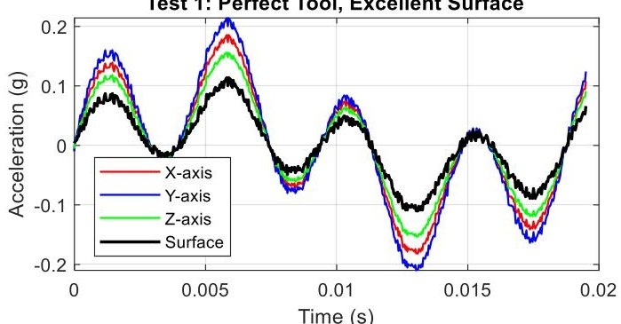

Test 2: Good Tool, Good Surface

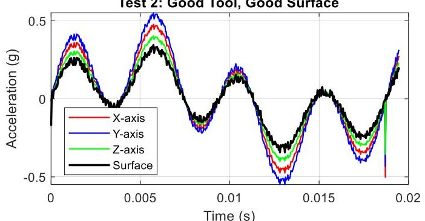

Test 3: Good Tool, Satisfactory Surface

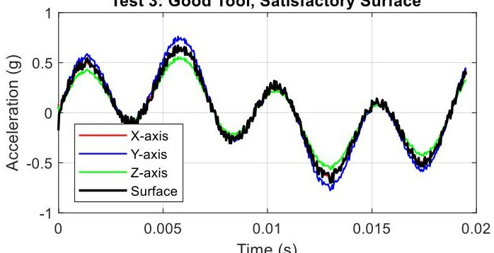

Test 4: Small Wear Tool, Satisfactory Surface

Test 5: Large Wear Tool, Unsatisfactory Surface

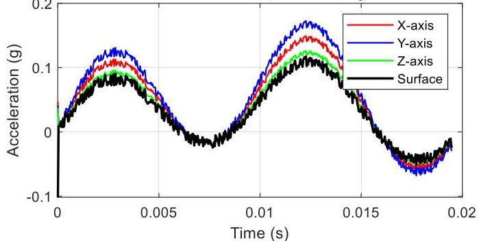

Test 6: Fracture Tool, Bad Surface

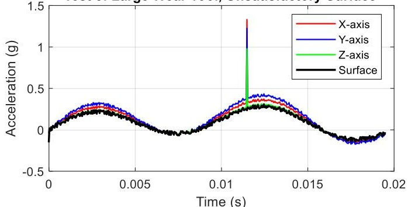

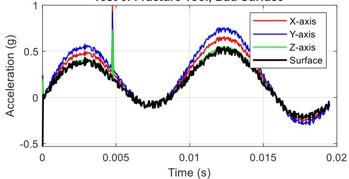

Figure 6. Acceleration signals for all test conditions

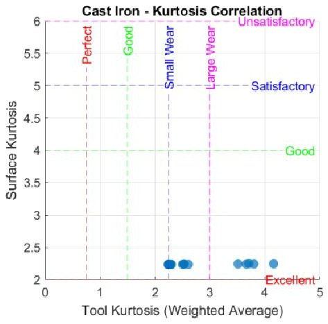

Cast iron

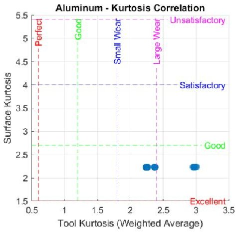

Aluminium

PVC - Kurtosis Correlation

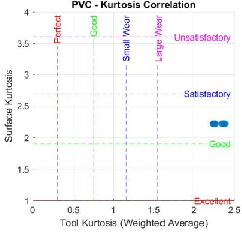

PVC

Figure 7. Dashboard for real-time monitoring of tool condition and surface quality

Table 4. Material-adaptive classification performance

<table border="1"><tr><td>No</td><td>Material</td><td>Tool Kurtosis</td><td>Surface Kurtosis</td><td>Tool Accuracy (95%CI)</td><td>Surface Accuracy (95%CI)</td></tr><tr><td>1-27</td><td>Cast Iron</td><td>0.45-3.2</td><td>1.2-7.8</td><td>95.2% (93.4-97.0%)</td><td>94.8% (92.7-96.9%)</td></tr><tr><td>28-54</td><td>Aluminum</td><td>0.35-2.8</td><td>1.0-6.2</td><td>97.8% (96.6-99.0%)</td><td>96.3% (94.8-97.8%)</td></tr><tr><td>55-81</td><td>PVC</td><td>0.15-1.8</td><td>0.8-4.1</td><td>96.7% (95.1-98.3%)</td><td>95.9% (94.0-97.8%)</td></tr></table>

<!-- PDF_PAGE: 8 -->

## 3.5 Comparative Analysis with Existing Methodologies

Table 5 compares the proposed material-adaptive method with conventional fixed thresholds and machine learning strategies. Fixed thresholds offer low computational cost and transparency but suffer from limited accuracy and the inability to accommodate material variability. Machine learning approaches can achieve high accuracy but require extensive training data and computational resources, and exhibit reduced interpretability. The proposed method achieves 95-98% accuracy while maintaining minimal computational complexity and full transparency. Performance gains arise from eliminating the compromise inherent in universal thresholds, which cannot simultaneously optimize detection for materials with divergent stiffness, damping, and cutting behavior [2]. By embedding material-specific calibration directly into the monitoring logic, the system operationalizes established cutting mechanics principles [16,17] in a practical industrial framework. Compared with machine learning systems, the statistical threshold approach avoids retraining requirements, supports deterministic decision logic, and remains compatible with low-cost industrial hardware. These characteristics are particularly advantageous for high-mix manufacturing environments where machines routinely switch materials and real-time reliability is critical [13,14]. Overall, the results confirm that combining kurtosis-based signal processing with material-adaptive calibration enables accurate, interpretable, and scalable condition monitoring suitable for multi-material CNC machining operations.

Table 5. Comparative evaluation of tool condition monitoring approaches

<table border="1"><tr><td>Approach</td><td>Accuracy(%)</td><td>Computational Cost</td><td>Interpretability</td><td>Material Adaptivity</td></tr><tr><td>Fixed Threshold(Conventional)</td><td>85-90</td><td>Low</td><td>High</td><td>No</td></tr><tr><td>Machine Learning(ML-based)</td><td>95-99</td><td>High(training+inference)</td><td>Low-Moderate</td><td>Limited(requires retraining)</td></tr><tr><td>Proposed Material-Adaptive Threshold</td><td>95-98</td><td>Low(real-time statistical analysis)</td><td>High</td><td>Yes</td></tr></table>

## 4. Conclusions

This study has demonstrated that adapting kurtosis thresholds to individual workpiece materials offers a practical solution to a long-standing limitation in vibration-based condition monitoring, namely the loss of accuracy when a single threshold is applied across dissimilar materials. Across all experiments, the proposed methodology achieved consistently high classification performance for tool wear, exceeding 95% for cast iron (95.2%) , aluminum (97.8%) , and PVC (96.7%) while surface quality prediction remained within 94.8-96.3% . These results represent a clear improvement of approximately 6-11% when compared with conventional universal-threshold strategies, which typically report accuracy levels of only 85-90% under multi-material conditions.

The underlying advantage of the proposed approach stems from a simple but often overlooked physical reality: vibration generation during cutting is governed by material properties such as hardness, stiffness, and damping. As a result, any single threshold must inevitably compromise performance for at least one material class. By establishing independent threshold matrices for each material, the monitoring system preserves sensitivity and specificity simultaneously, avoiding the trade-off that characterizes fixed-threshold methods. The successful integration of this framework into a cloud-enabled IoT platform further confirms its operational feasibility. Automatic threshold switching linked to CNC program selection removes the need for manual recalibration when production shifts between materials, while remote dashboards enable continuous monitoring and support predictive maintenance decisions. During pilot deployment, these capabilities translated into measurable economic benefits, with maintenance costs reduced by approximately 25-30%. From a practical standpoint, the material-adaptive statistical approach achieves accuracy comparable to many machine learning solutions (95-98%) , yet with significantly lower computational requirements and full transparency in decision-making. Unlike data-driven black-box models that require intensive training and specialized hardware, the threshold-based strategy can be implemented on standard industrial controllers and allows operators to interpret classification outcomes directly. This balance between performance, simplicity, and interpretability makes the proposed framework particularly suitable for real manufacturing environments where reliability, explainability, and cost efficiency are essential.

Nevertheless, several limitations define the scope of the present investigation. Validation was conducted under controlled laboratory conditions with fixed machine configurations and environmental stability, and only three representative materials spanning a hardness range of 80-260 HB were examined. The analysis relied exclusively on kurtosis as the diagnostic feature, without exploiting complementary time-frequency indicators or multi-sensor fusion. Long-term effects such as sensor aging, thermal drift, and spindle degradation were not evaluated. Future work should therefore extend the material database to include a wider range of engineering materials, including tool steels, titanium alloys, composites, and ceramics, and incorporate multiple signal features to enhance robustness. Large-scale industrial validation across diverse machines and extended operating periods (12-24 months) would provide deeper insight into durability, recalibration stability, and scalability. Hybrid strategies that combine adaptive statistical thresholds with lightweight machine learning or edge-computing architectures may further strengthen autonomous optimization as operational data accumulate. Overall, the findings confirm that material-adaptive threshold calibration provides a reliable,

<!-- PDF_PAGE: 9 -->

interpretable, and economically viable pathway toward next-generation condition monitoring in multi-material CNC environments, supporting the broader objectives of smart manufacturing and predictive maintenance.

## Acknowledgements

The authors acknowledge the support provided by Universiti Malaysia Pahang Al-Sultan Abdullah for research facilities and equipment access for this investigation under UMPSA International Matching grant RDU232709. Additional appreciation is extended to MIMOS Berhad for its sponsorship of hardware and software.

Universiti Malaysia Pahang Al-Sultan Abdullah International Matching grant RDU232709, supported this study.

## Declaration of Competing Interest

The author declares no conflicts of interest.

## CRediT Authorship Contribution Statement

M.A.Z. Hailmy (Methodology; Data curation; Writing - original draft; Resources; Investigation)

M. Oktaviandri (Writing - review & editing; Funding acquisition; Project administration)

A.R.Yusoff (Conceptualization; Formal analysis; Visualisation; Supervision)

## Availability of Data and Materials

The data supporting this study's findings are available on request from the corresponding author.

## Ethics Declarations

This study did not involve human participants or animals. Ethical approval was therefore not required.

## Generative Artificial Intelligence Declarations

The authors claim that artificially intelligent-assisted technologies, such as generative AI, were not used to generate content, ideas, or theories. We have just utilized AI to enhance readability and refine the language. This was used with extreme human control and oversight. The authors take full responsibility for reviewing and approving the content.

## References

[1] A. Jimenez-Cortadi, I. Irigoien, F. Boto, B. Sierra, G. Rodriguez, "Predictive maintenance on the machining process and machine tool," Applied Science, vol. 10, no. 1, p. 342, 2020.

[2] I.U. Hassan, K. Panduru, J. Walsh, "An in-depth study of vibration sensors for condition monitoring," Sensors, vol. 24, no. 3, p. 892, 2024.

[3] G. Wszołek, P. Czop, J. Słoniewski, H. Dogrusoz, "Vibration monitoring of CNC machinery using MEMS sensors," Journal of Vibroengineering, vol. 22, no. 4, pp. 735-750, Jun. 2020.

[4] D. Neupane, M.R. Bouadjenek, R. Dazeley, S. Aryal, "Data-driven machinery fault detection: A comprehensive review," IEEE Transactions on Industrial Informatics, vol. 20, no. 4, pp. 5235-5248, 2024.

[5] M. Rahman, S. Ali, K. Ahmed, "Deep learning approaches for predictive maintenance in manufacturing: A comprehensive review," Journal of Intelligent Manufacturing, vol. 33, no. 6, pp. 1651-1677, 2022.

[6] M. Jamil, A.M. Khan, H. Hegab, L. Gong, M. Mia, M.K. Gupta et al., "Recent advances in tool condition monitoring in machining operations: A comprehensive review," IEEE Access, vol. 9, pp. 28171-28196, 2021.

[7] T. Li, C. Sun, R. Yan, X. Chen, "Advanced statistical feature extraction for mechanical fault detection using unsupervised learning techniques," IEEE Transactions on Industrial Electronics, vol. 70, no. 4, pp. 4215-4225, 2023.

[8] J. Antoni, "The spectral kurtosis: a useful tool for characterising non-stationary signals," Mechanical Systems and Signal Processing, vol. 20, no. 2, pp. 282-307, 2006.

[9] T. Li, C. Sun, R. Yan, X. Chen, "A novel unsupervised graph wavelet autoencoder for mechanical system fault detection," IEEE Transactions on Industrial Informatics, vol. 17, no. 10, pp. 6999-7008, 2021.

[10] P. Bangalore, L.B. Tjernberg, "An artificial neural network approach for early fault detection of gearbox bearings," IEEE Transactions on Smart Grid, vol. 6, no. 2, pp. 980-987, 2015.

[11] S. Kumar, A. Sharma, R. Singh, "Machine learning approaches for vibration-based fault detection in manufacturing systems," Journal of Manufacturing Science and Engineering, vol. 144, no. 8, p. 081005, 2022.

[12] X. Wang, Y. Liu, Z. Chen, "Cloud-based monitoring platforms for industrial equipment condition assessment," IEEE Internet of Things Journal, vol. 10, no. 12, pp. 10543-10557, 2023.

[13] L. Chen, H. Wang, M. Zhang, "Multi-sensor fusion techniques for enhanced condition monitoring in manufacturing systems," International Journal of Advanced Manufacturing Technology, vol. 131, no. 5-6, pp. 2587-2601, 2024.

[14] C.R. Farrar, K. Worden, "An introduction to structural health monitoring," Philosophical Transactions of the Royal Society A: Mathematical, Physical and Engineering Sciences, vol. 365, no. 1851, pp. 303-315, 2007.

[15] M.S.H. Bhuiyan, I.A. Choudhury, M. Dahari, "Monitoring the tool wear, surface roughness and chip formation occurrences using multiple sensors in turning," Journal of Manufacturing Systems, vol. 33, no. 4, pp. 476-487, 2014.

<!-- PDF_PAGE: 10 -->

[16] M.C. Shaw, Metal cutting principles, 2nd ed. Oxford, U.K.: Oxford University Press, 2005.

[17] M.E. Merchant, "Mechanics of the metal cutting process," Journal of Applied Physics, vol. 16, no. 5, pp. 267-275, 1945.

[18] D.J. Whitehouse, surfaces and their measurement. London, U.K.: Hermes Penton Science, 2004.

[19] Y. Bai, Z. Zhao, X. Chen, "Surface roughness prediction model in machining based on vibration signals and deep learning," Journal of Manufacturing Processes, vol. 91, pp. 1-12, 2023.

[20] Y. Altintas, Manufacturing Automation: Metal Cutting Mechanics, Machine Tool Vibrations, and CNC Design, 2nd ed. Cambridge, U.K.: Cambridge University Press, 2012.

[21] P. Bangalore, L.B. Tjernberg, "An artificial neural network approach for early fault detection of gearbox bearings," IEEE Transactions on Smart Grid, vol. 6, no. 2, pp. 980-987, 2015.

[22] M.M. Maru, R.S. Castillo, L.R. Padovese, "Study of solid contamination in ball bearings through vibration and wear analyses," Tribology International, vol. 40, no. 3, pp. 433-440, 2007.

[23] J.S. Bendat, A.G. Piersol, Random Data: Analysis and Measurement Procedures, 4th ed. New York, NY, USA: Wiley, 2010.

[24] W.T. Thomson, M.D. Dahleh, Theory of Vibration with Applications, 5th ed. Upper Saddle River, NJ, USA: Prentice Hall, 1998.

[25] Y. Zhou, K. Guo, J. Sun, "An integrated wireless vibration sensing tool holder for milling tool condition monitoring with singularity analysis," Measurement, vol. 174, p. 109038, 2021.

[26] V. Hariharan, P. S. S. Srinivasan, "Vibration analysis of misaligned shaft-ball bearing system," Indian Journal of Science and Technology, vol. 2, no. 9, pp. 45-50, 2009.

[27] A. Papoulis, S.U. Pillai, Probability, random variables and stochastic processes, 4th ed. New York, NY, USA: McGraw-Hill, 2002.