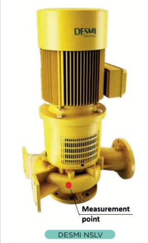
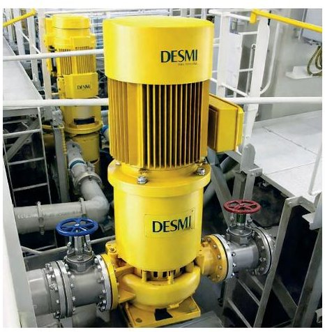
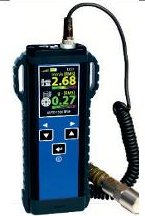
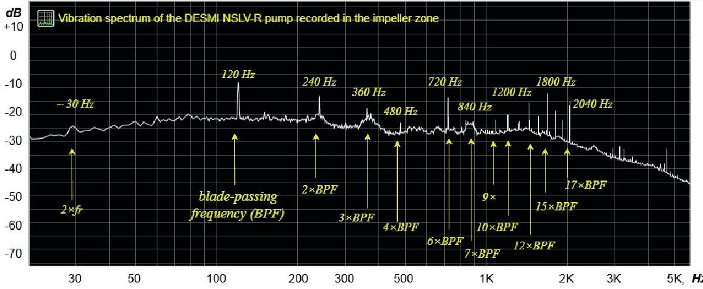
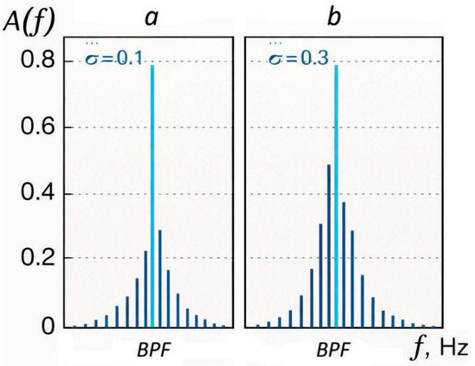
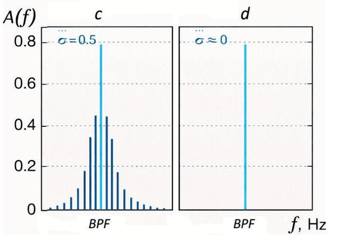
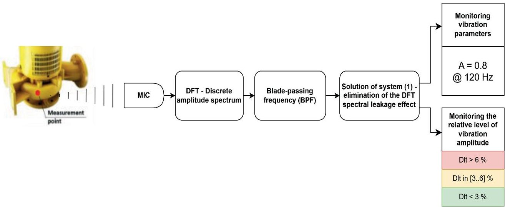
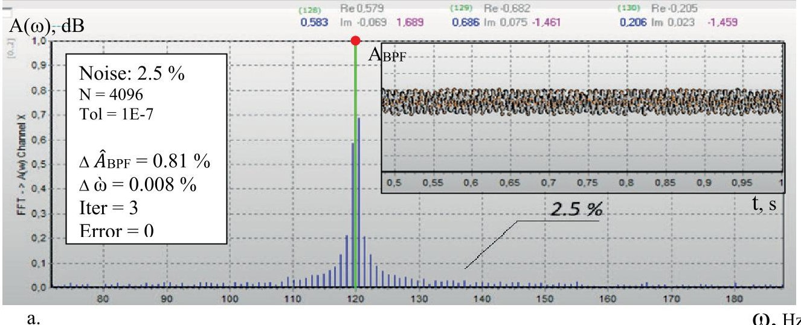
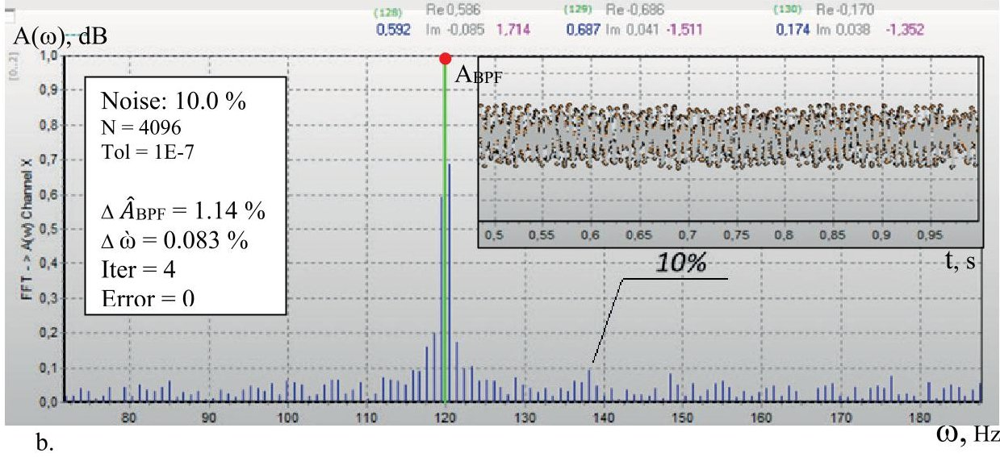
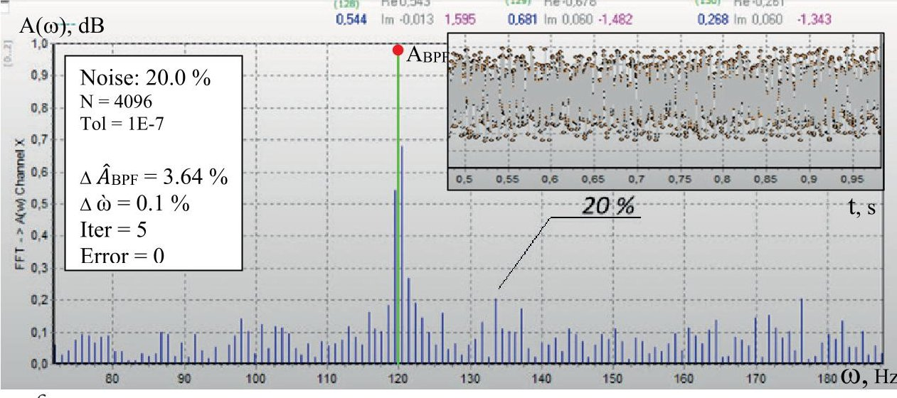

<!-- PDF_PAGE: 1 -->

# Condition Diagnostics of Marine Centrifugal Pumps Based on Blade-Passing Frequency Harmonics with Analytical DFT Leakage Compensation

Roman Varbanets $ ^{1} \star $

Vladyslav Kyrnats $ ^{1} $

Volodymyr Kholdenko $ ^{2} $

Dmytro Minchev $ ^{1} $

Ievgen Bilousov $ ^{1} $

Vladyslav Maulevych $ ^{1} $

Kucherenko Volodymyr $ ^{3} $

Aleksandrovska Nadija $ ^{4} $

Aleksandrovska Nadiia $ ^{4} $

$ ^{1} $ Odesa National Maritime University, Odesa, Ukraine

$ ^{2} $ Department ,Ship Power Systems and Complexes" of Odesa National Maritime University, Odesa, Ukraine

$ ^{3} $ Department of Navigation and Maritime Safety, Odessa National Maritime University, Odesa, Ukraine

$ ^{4} $ Department of Shipbuilding and Ship Repair named after Prof. Yu.L. Vorobyov Odesa National Maritime University, Odesa, Ukraine

## ABSTRACT

The reliable operation of high-power marine centrifugal pumps is critical for the safety and efficiency of ballast and fire-fighting systems, as well as for the functioning of a wide range of power and auxiliary installations on large ocean-going vessels. This paper presents a vibrodiagnostic method for the condition monitoring of a vertical in-line marine centrifugal pump manufactured by DESMI, based on the frequency-domain analysis of vibration signals measured in the impeller zone. The paper focuses on the study of discrete amplitude spectra obtained under steady-state operating conditions at a rotational speed close to 900 rpm. Particular attention is paid to the distortion of diagnostic features caused by spectral leakage of the fundamental rotational harmonic, which significantly affects the identification of key diagnostic parameters. An analytical procedure for compensating the power leakage of the central harmonic is proposed, enabling accurate reconstruction of the true spectral energy distribution without increasing the measurement record length or applying complex windowing techniques. The proposed approach improves the resolution and interpretability of vibration spectra within the operating frequency range of the pump. The method enhances the reliability of vibration-based condition monitoring for marine centrifugal pumps operating under real shipboard conditions and can be implemented in existing condition-based maintenance systems without additional hardware modification. Moreover, a procedure for a continuous vibration monitoring system for a high-power centrifugal pump, suitable for integration into modern controllers with FFT functionality, is developed. The results demonstrate that the proposed analytical compensation of spectral leakage is an effective tool for improving the vibrodiagnostic reliability of high-power shipboard pumps and supports the early detection of hydraulic and mechanical degradation in critical auxiliary marine machinery.

Keywords: marine centrifugal pump, vibrodiagnostics, spectral analysis, spectral leakage, impeller vibration, condition monitoring

## INTRODUCTION

High-power marine centrifugal pumps play a critical role in the ballast, fire-fighting, and general service systems of large ocean-going vessels, including Capesize bulk carriers. These pumps operate continuously under harsh marine

conditions, are exposed to variable hydraulic loading and frequently handle seawater with high corrosive and erosive potential. As a result, their technical condition has a direct impact on ship safety, operational reliability, and maintenance costs (Bilousov et al., 2020; Sagin et al., 2023, 2024). Typical degradation mechanisms include impeller

<!-- PDF_PAGE: 2 -->

erosion and imbalance, cavitation damage, bearing wear, shaft misalignment, and flow-induced instabilities, many of which develop gradually and are difficult to detect using conventional inspection methods.

Vibration-based condition monitoring is widely recognised as one of the most effective non-intrusive approaches for diagnosing centrifugal pumps in operation (Tiboni, 2022; Chen, et al., 2022). The most basic diagnostic practice relies on integral time-domain vibration indicators, such as RMS velocity or acceleration, peak values, and statistical parameters. These indicators are commonly implemented in shipboard monitoring systems and are recommended by the international standards for the condition assessments of rotating machinery (ISO 20816-3, 2022). While time-domain metrics are effective for detecting overall deterioration and severe faults, they provide limited insight into the physical origin of vibration growth. For centrifugal pumps, similar increases in vibration levels may result from fundamentally different causes, including hydraulic imbalance, cavitation inception, and mechanical defects, which significantly limit diagnostic specificity at early fault stages.

In order to improve fault identification, frequency-domain vibration analysis, based on the Fourier transform, is extensively applied to centrifugal pump diagnostics. Numerous studies have demonstrated that spectral components related to shaft rotation frequency, blade-passing frequency, and their harmonics, provide valuable information on pump hydraulics and mechanical conditions (Al-Tubiashat & Sharma, 2011; Randall, 2011). In marine centrifugal pumps, vibration signals measured in the impeller region are of particular diagnostic importance, as they are strongly influenced by flow-induced forces and impeller-volute interaction. However, practical shipboard measurements are often constrained by limited record length, slight speed fluctuations, and asynchronous sampling with respect to shaft rotation. Under such conditions, discrete amplitude spectra are affected by spectral leakage, especially from the dominant rotational harmonic, which can mask low-amplitude diagnostic components associated with blade-passing phenomena or early-stage hydraulic defects. An energy-based approach to vibration assessment was proposed by Korczewski (2017). The underlying concept of this work, linking vibration energy with mechanical and hydrodynamic excitation sources, is universal and applicable to marine rotating machines, including centrifugal pumps.

Envelope analysis and demodulation techniques are widely used for detecting impulsive vibration components generated by rolling-element bearing defects and cavitation-related impacts. Several authors have reported the successful application of envelope spectra to centrifugal pump diagnostics, particularly for identifying cavitation onset and localised mechanical damage (Antoni & Randall, 2006; Tiboni, 2022). Nevertheless, in high-power marine centrifugal pumps operating under stable hydraulic regimes, vibration excitation is often predominantly tonal rather than impulsive. In such cases, envelope methods may offer limited additional diagnostic value, while their sensitivity to filter selection and background noise can complicate practical implementation in engine room environments.

Order-based vibration analysis and synchronous averaging techniques have been introduced to address the influence of rotational speed variations on spectral interpretation (Varbanets et al., 2021). By representing vibration components in terms of rotational orders, these methods improve the identification of shaft-related and blade-passing components during transient or variable-speed operation (Randall, 2011). However, the reliable application of order tracking requires an accurate rotational reference signal, such as a tachometer or phase marker. In many existing on-board pump installations, particularly for auxiliary machinery, such sensors are not installed and retrofitting additional hardware may not be feasible from an economic or operational perspective.

More recently, advanced signal processing techniques, including wavelet transforms, empirical mode decomposition, and machine-learning-based diagnostic models, have been proposed for centrifugal pump condition monitoring. These approaches offer an enhanced capability for analysing nonstationary signals and complex vibration patterns, and have shown promising results in laboratory and industrial studies (Lei et al., 2013). However, their practical application on board ships is often limited by their computational complexity, the need for extensive training datasets, and reduced transparency in diagnostic decision-making, which is a critical factor for acceptance by ship engineers and classification societies.

The proposed vibrodiagnostic approach is also promising for feed pumps used in advanced shipboard waste-heat-recovery (Organic Rankine Cycle) systems and heat-driven refrigeration machines (Shestopalov et al., 2024; Onishchenko et al., 2023; Melnyk et al., 2024), where cavitation-related instabilities represent one of the major operational problems. This method enables the identification of cavitation inception in feed pumps and the adjustment of their operating modes to avoid these instabilities.

Modern research in the field of marine propulsion system diagnostics demonstrates growing interest in multi-symptom approaches, where diagnostic conclusions are formed based on the combined analysis of several independent indicators. Korczewski et al. (2025b) demonstrated the high level of efficiency of this approach in diagnosing the operating process of a marine diesel engine, based on a combination of vibration and other measurement parameters. Addressing the problem of discrete vibration spectrum power leakage will significantly improve the information yield of this method. This is especially important for marine centrifugal pumps, where practical operating conditions often limit the use of additional measurement systems.

This study addresses the problem of identifying faults in the high-power pumps used in marine ballast, fire, and power systems (Bilousov et al., 2020; Minchev et al., 2023). A method for analysing the amplitudes and frequencies of individual harmonics in the vibration spectrum is proposed, based on the analytical compensation of spectral leakage in discrete amplitude spectra. The DESMI NSLV-R 500-510 high-power vertical marine centrifugal pump was selected as the testbed for the method. The vibration signal was measured in the impeller zone. The practical application of the proposed approach will improve the accuracy and reliability

<!-- PDF_PAGE: 3 -->

of non-invasive diagnostic information obtained during the maintenance of critical pumps in marine power systems.

## OBJECT OF STUDY AND VIBRODIAGNOSTIC FEATURES OF A MARINE CENTRIFUGAL PUMP

The object of the present study is a high-power vertical marine centrifugal pump DESMI NSLV-R 500-510 (DESMI A/S. (n.d.), NSLV), used as part of the ballast and fire-fighting systems on large ocean-going vessels, including Capesize bulk carriers (Fig. 1). Pumps of this class are typically installed in pump rooms or engine spaces and operate under conditions of prolonged continuous duty, variable hydraulic loads, and an aggressive marine environment. During ballast operations, the pumps operate at high flow rates with relatively moderate heads; whereas, in fire-fighting systems they are required to ensure reliable operations under rapid changes in flow rate and pressure.

<table border="1"><tr><td>Impeller blade number</td><td>z</td><td>8</td></tr><tr><td colspan="3">Power and drive characteristics</td></tr><tr><td>Hydraulic power</td><td>$P_{h}$</td><td>70-110kW</td></tr><tr><td>Shaft power</td><td>$P_{shaft}$</td><td>95-145kW</td></tr><tr><td>Rated motor power</td><td>$P_{el}$</td><td>160kW</td></tr><tr><td>Motor speed</td><td>$n_{m}$</td><td>$\approx900\text{ min}^{-1}$</td></tr><tr><td>Supply frequency</td><td>f</td><td>45-50Hz</td></tr><tr><td>Motor efficiency</td><td>$\eta_{m}$</td><td>0.95-0.96</td></tr></table>

- Pump type: Vertical in-line centrifugal pump with inducer

The operating conditions of such pumps are characterised by significant hydrodynamic disturbances associated with the interaction of seawater flow with the impeller and the elements of the flow passage. Typical degradation factors include cavitation erosion of the blades, hydraulic imbalance, bearing wear, and an increase in vibration loads resulting from changes in operating regimes. Failures or reduced efficiency of the pumps of this type directly affect ship safety, the duration of ballast operations, and compliance with the operational requirements of classification societies. In this

- Application: Ballast water / fire-fighting / general service

The DESMI NSLV-R 500-510 is a high-power vertical in-line centrifugal ballast pump operating at a rotational speed of 900 rpm pump efficiency (at the Best Efficiency Point) with an eight-bladed impeller. Under typical operating conditions, the pump delivers 850-1400 $ m^{3}/h $ at a head of 22-36 m and is driven by a 160-kW electric motor. The corresponding vibration spectrum is characterised by a dominant rotational component at 15 Hz and a blade-passing frequency at 120 Hz, which form the basis for spectral vibrodiagnostic analysis in the impeller zone.

- Installation: Engine room / pump room (Capesize class vessels)

- Medium: Seawater

Fig. 1. Ballast Pump DESMI NSLV-R 500-510 (DESMI A/S. (n.d.), NSLV)

- Maximum allowable pressure: 25 bar

Table 1. DESMI NSLV-R 500-510 Ballast Pump Characteristics (50 Hz, n = 900 $ min^{-1} $ , DESMI A/S., n.d.)

<table border="1"><tr><td>Parameter</td><td>Symbol</td><td>Typical value</td></tr><tr><td colspan="3">Hydraulic characteristics</td></tr><tr><td>Volumetric flow rate</td><td>Q</td><td>850-400m3/h</td></tr><tr><td>Total dynamic head</td><td>H</td><td>22-36m</td></tr><tr><td>Rotational speed</td><td>n</td><td>900min-1</td></tr><tr><td>Pump efficiency(at Best Efficiency Point)</td><td>$\eta_{p}$</td><td>0.78-0.82</td></tr></table>

context, the early detection of defects and deviations in the operation of high-power marine centrifugal pumps represents one of the key tasks in the technical maintenance of ship propulsion and auxiliary systems.

From the standpoint of vibration diagnostics, the DESMI NSLV-R 500-510 pump represents a typical example of equipment in which the dominant role in the formation of the vibration response is played by the hydrodynamic forces of the

impeller. The vertical pump arrangement and the high energy intensity of the working process lead to the fact that vibration signals in the impeller zone contain pronounced harmonic components associated with the shaft's rotational frequency, the blade-passing frequency and their multiples, as well as components caused by hydraulic instabilities.

Let us calculate the frequency features for the operating mode n=900 rpm and Z=8 impeller blades.

Basic frequencies:

Rotational frequency:

$$
f _ {r} = \frac {n}{6 0} = \frac {9 0 0}{6 0} = 1 5. 0 \mathrm {H z}
$$

Accordingly, the blade-passing frequency (BPF) for an impeller with Z=8 blades is:

$$
f _ {B P F} = Z \cdot f _ {r} = 8 \cdot 1 5 = 1 2 0. 0 \mathrm {H z}
$$

If present, Half-BPF (HBPF) is:

$$
0. 5 f _ {B P F} = 6 0. 0 0 0 \mathrm {H z}
$$

In this study, tonal spectral features are defined as discrete lines at the rotational frequency and its harmonics, as well as

<!-- PDF_PAGE: 4 -->

at the BPF and its harmonics. These components represent deterministic excitation mechanisms and are analysed in the discrete amplitude spectrum of the impeller-zone's vibration signal.

Table 2. Components of the discrete spectrum of vibration of the impeller zone （n=900 rpm, Z=8)

<table border="1"><tr><td>Shaft-related tonal components(mechanical excitation)</td><td>BPF-related tonal components(impeller/hydrodynamic excitation)</td></tr><tr><td>1×=15Hz2×=30Hz3×=45Hz4×=60Hz5×=75Hz6×=90Hz7×=105Hz8× shaft rotational frequency=120Hz(coincides with1×BPF)</td><td>1×BPF=120Hz!*2×BPF=240Hz!3×BPF=360Hz!4×BPF=480Hz!5×BPF=600Hz missing6×BPF=720Hz!7×BPF=840Hz!8×BPF=960Hz missing9×BPF=1080Hz!10×BPF=1200Hz!11×BPF=1320Hz!12×BPF=1440Hz!13×BPF=1560Hz!14×BPF=1680Hz!15×BPF=1800Hz!16×BPF=1920Hz!17×BPF=2040Hz!</td></tr><tr><td>Higher harmonics may also be monitored when relevant to mechanical condition assessment(e.g. looseness or non-linearity)but the listed set provides the essential shaft-related tonal structure within the low-frequency region.</td><td></td></tr></table>

$ ^{*} $ Harmonics present in the spectrum are indicated by the ! symbol; see Fig. 2.

During the experiments, vibration measurements were performed in the impeller zone of the pump, which is the most informative area from the standpoint of detecting hydraulic and mechanical defects (see Fig.1). The selection of this measurement location made it possible to minimise the influence of external vibration sources associated with the foundation, piping system, and ship hull structures, and to focus on vibration manifestations directly generated by the pump's working process.

The reliability of vibrodiagnostic conclusions is largely determined by the quality of the measurement data and the correctness of the selection of the vibration measurement

location. In this context, attention should be paid to the measurementoriented diagnostic approach presented by Korczewski et al. (2025a), which demonstrated that the effectiveness of diagnostics of marine power plants is, to a large extent, already established by the measurement stage, prior to the application of advanced analytical procedures. The authors emphasised the necessity of acquiring physically representative signals under conditions of a complex combination of

mechanical and hydrodynamic disturbances. This concept is fully consistent with the present study, in which vibration measurements were performed in the impeller zone, in order to maximise signal sensitivity to the processes occurring during pumping operations.

Vibration signal acquisition was carried out using the portable Vibration Meter measurement system developed by CM Technologies, GmbH. The CMT vibration meter is a handheld diagnostic tool for machinery condition monitoring, offering functionalities such as overall velocity, acceleration, and displacement measurements, FFT spectra, time waveforms, and integrated IR temperature measurements and a stroboscope, including expert systems (FASIT), as shown in Table 3. This system was designed for use in industrial and marine environments and is widely applied in the diagnostics of rotating machinery. The measurement equipment allows the acquisition of vibration signal time histories with a high accuracy and stable sampling parameters, which are of fundamental importance for correct spectral analysis.

Table 3. CMT Vibration Meter specifications (CM Technologies, GmbH. (n.d.). Vibration Meter)

- Velocity Range: 10-1000 Hz

- Acceleration Range: 500-16,000 Hz

- Temperature: 0-380 $ ^{\circ} C $

- Input: 1 x ICP powered accelerometer (100 mV/g)

- Power: 2 x AA batteries (8 hrs) or rechargeable

The measurement system makes it possible to record vibration in the form of time-domain signals which are suitable for subsequent digital processing, including the construction of discrete amplitude spectra. The acquired signals contain both dominant deterministic components, associated with shaft rotation and impeller blade passing, and low-amplitude components, reflecting the early stages of defect development. The presence of a pronounced bladepassing harmonic (BPF), combined with the limited duration of the measurement records, creates conditions under which the effect of spectral leakage becomes significant and requires special analytical consideration.

The vibration data were recorded during the operation of the DESMI NSLV pump under steady-state conditions, at the measurement point indicated in Fig.1. A typical form of the vibration spectrum in logarithmic coordinates is shown in Fig.2.

Fig. 2. Discrete amplitude spectrum of vibration measured in the impeller zone of the vertical in-line centrifugal pump DESMI NSLV-R 500-510 at a rotational speed of approximately 900 rpm (eight-bladed impeller, BPF=120 Hz)

<!-- PDF_PAGE: 5 -->

The sampling frequency of the vibration signal in this case was 44.1 kHz and the signal recording duration was from 1 to 5 seconds, which makes it possible to analyse harmonic parameters in the spectrum over the entire frequency range mentioned above. The experimental data were acquired during steady-state operation of the pump at a rotational speed of 900 rpm, which corresponds to the normal operating mode of this pump on board a ship. The signal acquisition parameters were selected so as to ensure sufficient frequency resolution in the range of diagnostically significant frequencies, while preserving realistic on-board measurement conditions. The obtained time-domain signals were subsequently used for the construction of discrete amplitude spectra and further analysis.

In the vibration spectrum (Fig. 2), first of all, a strong harmonic at the blade-passing frequency of the impeller （BPF=120Hz）is present, exhibiting the highest amplitude in the low-frequency range. Variations in the amplitude of this blade-passing harmonic during operations represent the main diagnostic indicator characterising the technical condition of the pump impeller. The spectrum also reveals the presence of virtually all of the harmonics that are multiples of the BPF, as listed in Table 2. Analysis of the amplitudes and frequencies of these harmonics makes it possible to directly diagnose the technical condition of the pump and the electric drive components during operations. In this way, the degree of impeller wear, the level of cavitation, the shaft alignment of the pump, and possible bearing damage can be determined. However, such analysis is only possible after eliminating DFT spectral leakage, which distorts harmonic amplitudes by up to 40% (Li, 2024; Huang et al., 2025) and, within the discretisation step, distorts the frequencies of individual harmonics (Li, 2024; Huang et al., 2025).

The central frequency (BPF) of the vibration signal analysed during the diagnostics of most centrifugal pumps lies in the range 100 Hz to 1 kHz (i.e. within the audible frequency range), which makes it possible to use an industrial microphone for its investigation (Varbanets et al., 2025).

## DIAGNOSTIC INTERPRETATION OF BLADE-PASSING FREQUENCY HARMONICS

The vibration condition of a high-power marine centrifugal pump is largely determined by periodic hydrodynamic loads arising from the interaction of the rotating impeller with the elements of the stationary flow passage (Dai et al., 2021; Zhang, 2022). The main spectral manifestation of this interaction is the blade-passing frequency (BPF) and its multiple harmonics, which form a stable tonal structure of the vibration spectrum in the impeller zone (Zhou et al., 2023; Zhang et al., 2022).

For the investigated pump, operating at a rotational speed of n = 900 rpm and with an impeller blade number of Z = 8, the fundamental BPF is 120 Hz, while its multiple harmonics are distributed up to $ 1 7 \times \mathrm {B P F}=2 0 4 0 \mathrm {H z} $ . The experimentally obtained vibration spectrum confirms the presence of virtually all calculated BPF-family harmonics, which allows

their amplitude analysis to be used as an informative tool for assessing the technical condition of the pump (see Fig. 2).

The amplitude of the fundamental BPF harmonic (120 Hz) reflects the level of hydrodynamic interaction between the impeller and the flow passage of the casing (the impellervolute interaction) and serves as an indicator of the overall hydrodynamic operating regime of the pump (Gao et al., 2016; Zhang et al., 2019). Under normal operating conditions, the $ 1 \times $ BPF component is characterised by a stable level and dominates adjacent spectral components. A significant increase in the amplitude of the fundamental BPF harmonic usually indicates an increase in pressure non-uniformity in the flow passage and may be associated with changes in the operating regime, loss of flow symmetry, or the development of incipient cavitation processes. At the same time, isolated evaluation of the $ 1 \times $ BPF component alone does not allow an unambiguous diagnosis of the nature of the degradation, which necessitates analysis of the energy distribution among the multiple harmonics.

The $ 2 \times $BPF (240 Hz), $ 3 \times $BPF (360 Hz), and $ 4 \times $BPF (480 Hz) harmonics are formed as a result of the nonlinearity of the hydrodynamic excitation and reflect the characteristics of the impeller-volute interaction pattern. In a properly operating pump, their amplitudes are generally significantly lower than that of the fundamental BPF harmonic and decrease with increasing harmonic order.

An increase in the amplitudes of the $ 2 \times \mathrm{B P F}-4 \times \mathrm{B P F} $ harmonics, at a relatively stable level of the $ 1 \times \mathrm{B P F} $ component, indicates the emergence of secondary hydrodynamic effects, such as local flow separation zones, non-uniform clearances, or changes in the velocity distribution within the inter-blade channels. Thus, this group of harmonics plays an important role in identifying early deviations from the nominal operating regime and the initial degradation of the technical condition of the pump.

Mid-order harmonics (5 $ \times $ BPF-9 $ \times $ BPF) exhibit increased diagnostic sensitivity to the development of unsteady hydrodynamic phenomena (Zhang et al., 2022). In the experimental vibration spectrum of the pump, these components form a group of clearly distinguishable peaks, whose amplitudes do not follow a monotonic decay. An increase in the amplitudes of harmonics within this range, as well as the appearance of pronounced local maxima, indicates intensified modulated excitation associated with oscillations of cavitation structures, pressure pulsations, and the interaction of the flow with the blade edges. It is precisely in this frequency range that signs of cavitation activity begin to manifest, which are not yet accompanied by a sharp increase in broadband high-frequency vibration.

High-order harmonics $ ( 1 0 \times\mathrm{B P F}-1 7 \times\mathrm{B P F}) $ reflect the most complex and nonlinear processes occurring in the pump flow passage. Their presence and relative amplitudes are closely related to the intensity of local hydrodynamic disturbances, such as cavitation micro-jets, unsteady vortex structures, and the interaction of cavitation zones with the blade surfaces (Al-Obaidi, 2019; Al-Obaidi & Towsyfyan, 2019). In the experimentally recorded spectrum (Fig. 2), stable identification of the $ 1 0 \times\mathrm{B P F}, $ $ 1 2 \times\mathrm{B P F}, $ $ 1 5 \times\mathrm{B P F}, $ and $ 1 7 \times\mathrm{B P F} $

<!-- PDF_PAGE: 6 -->

harmonics is observed, indicating a developed tonal structure in the frequency range up to 2 kHz. Elevated levels of these harmonics are regarded as a diagnostically unfavourable indicator and may serve as an indirect indicator of progressive cavitation erosion of the impeller blade edges.

Of particular importance for the assessment of the technical condition is the comparative analysis of the amplitudes of harmonics of different orders, rather than their absolute values.

Ratios of the form

$$
\frac {A _ {k B P F}}{A _ {B P F}}, k = 2 \dots 1 7,
$$

may be considered as sensitive indicators of changes in the hydrodynamic condition of the pump. The ratios of the amplitudes of higher-order harmonics to the amplitude of the fundamental BPF harmonic make it possible to form sensitive diagnostic indices reflecting the redistribution of energy in the spectrum, as a result of degradation of the technical condition and, consequently, the hydrodynamic operating regime (Zhang, 2022; Dai et al., 2021).

An increase in the relative amplitudes of higher-order BPF harmonics, at a relatively stable level of the $ 1 \times $BPF components, indicates degradation of the flow passage without a pronounced change in the overall rotational regime, which is particularly important for the early detection of cavitation erosion of the blade edges.

Therefore, analysis of the amplitudes of the BPF harmonic and its multiple harmonics, up to $ 1 7 \times \mathrm {B P F} $ , provides a multilevel assessment of the technical condition of a marine centrifugal pump—from monitoring the basic impellervolute interaction to identifying early signs of cavitation and erosion processes. In combination with the procedure for compensating the power leakage of the central harmonic and its multiple harmonics (implemented in the present work), this approach significantly enhances the informativeness of vibration spectral analysis and expands the capabilities of the practical vibrodiagnostics of pump equipment under marine operating conditions.

## ANALYTICAL COMPENSATION OF DFT SPECTRAL LEAKAGE IN VIBRATION HARMONIC ANALYSIS

The Discrete Fourier Transform (DFT) is one of the most widely used tools for analysing vibration signals in the frequency domain in the diagnostics of rotating machinery. Its popularity is due to its ability to decompose complex time-domain signals into discrete harmonics that can be associated with physical excitation mechanisms, such as shaft rotational frequency and blade-passing frequency. In practical condition monitoring applications, the DFT is usually implemented in the form of the Fast Fourier Transform (FFT) and serves as the basis for extracting characteristic narrowband and broadband features from measured vibration signals.

The fundamental assumption underlying the DFT is that the analysed signal segment is periodic within the finite

observation window and that its frequency components coincide with the discrete sampling intervals of the signal. In other words, an integer number of samples fits within one period of the measured signal. Under real measurement conditions, particularly when the signal frequency varies, this assumption is never satisfied. Vibration signals acquired using analogue-to-digital converters are generally nonperiodic within the analysed window and the number of samples per period of the original signal is not an integer. This leads to a redistribution of spectral energy between neighbouring harmonics. This phenomenon, known as 'spectral leakage', results in an artificial spreading of energy around the dominant harmonics and causes distortion of the amplitude, as well as frequency and phase information in discrete spectra (Li, 2024).

The problem of spectral analysis in the presence of power leakage of the analysed harmonics was identified already during the initial experimental stage. Traditional DFT leakage mitigation techniques proved insufficient for realtime implementation. The use of windowing techniques did not fully eliminate the problem: the amplitude of the analysed harmonics remained phase-dependent, and the computational time increased.

If the signal frequency is represented as $ \gamma=M / T $ (where T is the signal period, $ M=n+\sigma $ ,where n is an integer, and $ 0<\sigma<1 $ ), then the maximum distortions of the amplitude frequency, and phase of the central harmonic (as well as power leakage into neighbouring harmonics), will be observed at $ \sigma=0.5. $

In the context of vibration analysis, spectral leakage can significantly reduce the amplitudes of the main harmonics and increase the errors in the quantitative determination of diagnostic characteristics.

Spectral leakage constitutes a particular challenge in the vibration analysis of high-power centrifugal pumps, where one or several dominant harmonics, such as the blade-passing frequency (BPF) and its low-order and high-order multiples, carry the major portion of the signal energy. The leakage of energy from these harmonics can mask neighbouring spectral components of diagnostic significance, such as higher-order harmonics, that serve as indicators of hydrodynamic instability and cavitation (Zhang et al., 2019).

Traditional strategies for mitigating spectral leakage include the application of window functions, as well as zero-padding and extension of the record length. These approaches reduce the leakage effect to some extent; however, they still leave distortions in the amplitudes of the main harmonics, lead to reduced spectral sharpness, and increase computational costs (Li, 2024).

In the literature on discrete signal processing, advanced methods have recently been investigated that analytically compensate for spectral leakage—without relying exclusively on windowing techniques or extended data segments. For example, improved phase-difference estimators have been proposed to correct systematic DFT leakage errors (Li, 2024). In another case, discrete signal acquisition methods have been developed to ensure data periodicity prior to performing the FFT procedure (Huang et al., 2025). These approaches

<!-- PDF_PAGE: 7 -->

improve the accuracy of discrete spectral estimates and are particularly valuable in applications where measurement duration and hardware constraints limit the possibility of longer signal records or synchronous sampling.

Let us consider a method for the analytical elimination of spectral leakage, based on processing the complex coefficients of the Discrete Fourier Transform and aimed at restoring the true parameters of the dominant harmonic component of the signal. Unlike traditional approaches that use window functions or increase the record length, the method exploits information contained in the two maximum spectral lines surrounding the analysed central harmonic. By numerically solving a system of complex equations, the fractional frequency position on the discrete frequency grid, and the phase and amplitude of the original signal are refined. The frequency m, phase $ \varphi $ , and amplitude A of the original signal should be refined using the values of the two maximum harmonics in the spectrum $ X_{k}, $ $ X_{k+1} $ , surrounding the analysed central harmonic (e.g. BPF). For this purpose, the following system of complex equations needs to be solved numerically:

$$
\left\{ \begin{array}{l} \left| E (m, \varphi) _ {k} / E (m, \varphi) _ {k + 1} \right| = \left| \frac {X _ {k}}{X _ {k + 1}} \right|; \\ \operatorname {A r g} \left(E (m, \varphi) _ {k}\right) = \operatorname {A r g} \left(X _ {k}\right); \\ E (m, \varphi) _ {k} = e ^ {j \varphi} \frac {e ^ {2 \pi j (m - k)} - 1}{e ^ {\frac {2 \pi j (m - k)}{N}} - 1} + e ^ {- j \varphi} \frac {e ^ {- 2 \pi j (m + k)} - 1}{e ^ {\frac {- 2 \pi j (m + k)}{N}} - 1} \end{array} \right.
$$

The input data in Eq. (1) are:

- complex DFT coefficients of two adjacent spectral lines: $ X_{k}, $ $ X_{k+1}; $

- their integer indices: k, k + 1;

- DFT length: N;

- a small positive threshold $ \delta $ to verify leakage presence.

The following quantities are computed from the measured spectrum:

$$
R _ {X} = \left| \frac {X _ {k}}{X _ {k + 1}} \right|;, \theta_ {X} = \operatorname {A r g} \left(X _ {k}\right).
$$

The analytical leakage function is:

$$
E (m, \varphi) _ {k} = e ^ {j \varphi} \frac {e ^ {2 \pi j (m - k)} - 1}{e ^ {\frac {2 \pi j (m - k)}{N}} - 1} + e ^ {- j \varphi} \frac {e ^ {- 2 \pi j (m + k)} - 1}{e ^ {- \frac {2 \pi j (m + k)}{N}} - 1}.
$$

System (1) is written as:

$$
\left| \frac {E (m , \varphi) _ {k}}{E (m , \varphi) _ {k + 1}} \right| = R _ {X}, \operatorname {A r g} \left(E (m, \varphi) _ {k}\right) = \theta_ {X}.
$$

The DFT coefficient k is:

$$
X _ {k} = \left(\frac {A}{2}\right) E (m, \varphi) _ {k}.
$$

Proceed only if the leakage presence check shows that:

$$
\mid X _ {k} \mid > \delta \mathrm {a n d} \mid X _ {k + 1} \mid > \delta .
$$

If this is not satisfied, then leakage is assumed to be negligible and standard DFT estimates are used.

Define the search interval for m. Since the true frequency lies between the two adjacent bins, use

$$
m \in [ k, k + 1 ].
$$

Define the amplitude-ratio residual as a scalar objective. For each candidate m, the inner loop provides $ \varphi^{\backslash^{*}}(m). $ Then define:

$$
F (m) = \ln \left| \frac {E \left(m , \varphi^ {\backslash^ {*}} (m)\right) _ {k}}{E \left(m , \varphi^ {\backslash^ {*}} (m)\right) _ {k + 1}} \right| - \ln \left(R _ {X}\right)
$$

The solution $ \hat{m} $ is obtained by finding the root $ F(m)=0 $ (or the minimiser of $ | F(m)| $ ). We use a one-dimensional rootfinding or minimisation method over $ [k,k+1] $ .

Define the phase residual with phase wrapping.

$$
G (\varphi ; m) = \operatorname {w r a p} \left(\operatorname {A r g} \left(E (m, \varphi) _ {k}\right) - \theta_ {X}\right),
$$

where $ \cdot $ maps a phase difference to $ [-\pi, \pi] $ to avoid discontinuities at $ \pm \pi. $

Determine $ \varphi^{\backslash^{*}}(m) $ , such that $ G \left( \varphi^{\backslash^{*}}(m); m \right)=0 $ , and use a 1D root solver on $ \varphi\in[-\pi,\pi] $ .

For the frequency estimate, the outer loop returns the solution $ \widehat{m} $ and the corresponding

$$
\hat {\varphi} = \varphi^ {| ^ {*}} (\hat {m}).
$$

For the amplitude estimate, use the coefficient model

$$
\hat {A} = 2 \frac {\left| X _ {k} \right|}{\left| E (\hat {m}, \hat {\varphi}) _ {k} \right|}
$$

or compute a two-line average for improved noise robustness:

$$
\hat {A} = \left(\frac {\left| X _ {k} \right|}{\left| E (\hat {m}, \hat {\varphi}) _ {k} \right|} + \frac {\left| X _ {k + 1} \right|}{\left| E (\hat {m}, \hat {\varphi}) _ {k + 1} \right|}\right).
$$

The output data of (1) are $ \widehat{m}, $ $ \widehat{\varphi}, $ and $ \hat{A}. $ If required, the physical frequency can be obtained from $ \hat{f}=\widehat{m}\Delta f $ , where $ \Delta f=\frac{f_{S}}{N} $ is the DFT frequency resolution.

The nested formulation avoids the need to directly solve a coupled 2D nonlinear system and provides stable convergence under strong leakage conditions. Phase wrapping is mandatory, to prevent false convergence caused by $ 2 \pi $ discontinuities. The method is applicable when the analysed harmonic dominates locally and its leakage is mainly captured by the two adjacent maxima.

<!-- PDF_PAGE: 8 -->

Fig. 3. Restoration of the amplitude A=0.8 of the central harmonic BPF=120 Hz for different $ \sigma=0. 1 (a), $ $ \sigma=0. 3 (b), $ $ \sigma=0. 5 (c) $ and $ \sigma=0 (d) $

In the context of the vibration diagnostics of marine centrifugal pumps, the analytical compensation of spectral leakage makes it possible to analyse BPF harmonics and higher-order harmonics, which is crucial for early fault detection and the identification of hydrodynamic instability. In the present study, an analytical method for compensating power leakage is proposed. The developed approach restores the true distribution of spectral energy in the vicinity of dominant harmonics, whilst preserving the amplitude of the central analysed harmonic with an accuracy of up to 1%.

Fig. 3 shows the results of spectral leakage elimination for cases with different values of $ \sigma $: $ \sigma=0. 1 $ (a), $ \sigma=0. 3 $ (b), $ \sigma=0. 5 $ (c), and $ \sigma=0 $ (d). The restored relative amplitude of the vibration signal is A=0.8. The frequency of the central BPF harmonic is approximately 120 Hz; however, the frequency varies depending on the pump load, within a range of $ \pm 1 0 $ Hz thereby changing the value of $ \sigma $ from 0 to 1. The maximum leakage of spectral power into harmonics adjacent to the central harmonic occurs at $ \sigma=0. 5 $

As a result of solving system (1), the restored values of the amplitude and frequency of the central harmonic are obtained for any value of $ \sigma $ ; in the present case, A = 0.8 at a frequency of 120 Hz.

By eliminating the effect of spectral leakage, the proposed method improves the quality of diagnostics, based on

vibration spectra measured in the impeller zone, and provides more reliable identification of the phenomena associated with cavitation under real operating conditions.

## FINAL REMARKS AND CONCLUSIONS

Restoration of the amplitude, frequency, and phase of the central harmonic in the vibration spectrum makes it possible to monitor the technical condition of high-power marine centrifugal pumps. Among these parameters, restoration of the amplitude provides the greatest effect, since its distortion in the vibration spectrum is maximal. As a result of solving the system of equations (1), the amplitude of the central harmonic in the oscillation spectrum is restored with a minimum relative error. The obtained amplitude values can be analysed in a time trend under continuous vibration monitoring of the impeller of marine centrifugal pumps, measured in the impeller zone.

Fig. 4 presents a block diagram of a continuous vibration level monitoring system for a high-power centrifugal pump. Modern controllers with an embedded FFT function can be used to determine the central harmonic and its multiple harmonics in the spectrum of the vibroacoustic signal, as well as to solve system (1), in order to eliminate the effect of spectral leakage. Subsequent monitoring of the amplitudes of the restored harmonics and analysis of their time trends make it possible to assess the technical condition of marine centrifugal pumps, as measured in the impeller zone.

Based on the spectral vibration analysis of the DESMI NSLV-R 500-510 centrifugal pump, it was determined that its normal operating parameters correspond to variations of the restored harmonic amplitudes of $ \Delta<3\% $ , relative to the initial new condition of the pump. An abnormal vibration level corresponds to an increase in the amplitude variation $ \Delta $ exceeding 6% , as shown in Fig. 4.

To determine the thresholds for normal and abnormal vibration levels, a list of references was analyzed, as a result of which the authors determined the boundaries of the pump impeller vibration levels. Thus, for the Normal (green) state: Dlt < 3%; for the Warning (Yellow) state: 3% < Dlt < 6%; for

Fig. 4. Block diagram of a continuous vibration monitoring system for a high-power centrifugal pump

the Alarm (Red) state: Dlt > 6%. The software of the proposed monitoring system allows for flexible adjustment of these ranges depending on the specific type of highpower pump.

Therefore, the authors propose a system for continuous monitoring of the technical condition of a high-power marine centrifugal pump based on an acoustic analysis of vibration in the impeller zone. The main

<!-- PDF_PAGE: 9 -->

monitoring result should be displayed in the form of a condition semaphore: Normal (green) - Warning (Yellow) Alarm (Red), as shown in Fig. 4. In addition, the parameters of the central harmonic—its restored amplitude and frequency are analysed in order to monitor the rotational speed and load of the pump.

The described approach is promising for analysing the technical condition of marine pumps of various types. However, additional studies are required to refine the limits of normal and abnormal levels of amplitude deviations in vibration signals for critical components of pumps of other designs. It is also advisable to conduct further investigations into the influence of noise in the acoustic method of vibration acquisition in the impeller zone of marine centrifugal pumps of different constructions.

The method is demonstrated using experimental data obtained from a high-power vertical marine centrifugal pump operating under stationary conditions. Eliminating the DFT leakage effect, which distorts the amplitudes and frequencies of the amplitude spectrum in the vibration signal, enables diagnostics of the technical condition of operating components. Changes in the amplitudes of individual harmonics reveal defects in operating components caused by cavitation and friction during operation. The proposed approach is aimed at improving the accuracy and reliability of non-invasive diagnostic information obtained during the maintenance of critical marine power systems.

## APPENDIX A. INFLUENCE OF ACOUSTIC NOISE ON THE SOLUTION OF EQUATION SYSTEM (1) FOR DFT LEAKAGE SUPPRESSION

Based on the solution of the system of equations (1), a study was carried out to evaluate the influence of noise on the error in estimating the amplitude and frequency of the blade-passing harmonic (BPF) during acoustic recording of pump impeller vibration. In the present case, the bladepassing frequency of the impeller was BPF = 120 Hz. The amplitude of the original vibration signal was normalised

to A = 1.0. White noise with varying amplitudes was added to the vibration signal and the robustness of the above-described DFT leakage compensation algorithm, based on solving system (1), was analysed.

Using an initial sample size of 4096 measurements, cases with noise levels of 2.5% , 10.0% , and 20.0% of the normalised amplitude of the recorded vibration signal were examined. For the specified computational accuracy $ \mathrm{T o l}=1 \mathrm{E}-7 $ , the following parameters were analysed: the number of iterations, the amplitudes of the harmonics to the left $ \mathrm{A_{k}} $ and to the right $ \mathrm{A_{k+1}} $ of the blade-passing harmonic BPF, the amplitude and frequency of the restored analysed harmonic $ \hat{\mathrm{A}}_{\mathrm{B P F}} $ and the restoration error $ \Delta $ (see Table 4).

Figs. 5a-c present the recorded vibration signals and their spectra in the vicinity of the BPF harmonic. The parameters of the k-th harmonic are:

$$
X _ {k} = \mathrm {R e} _ {k} + j \mathrm {I m} _ {k};
$$

$$
A _ {k} = \frac {1}{N} \sqrt {\mathrm {R e} ^ {2} _ {k} + \mathrm {I m} ^ {2} _ {k}};
$$

$$
\varphi_ {k} = \operatorname {a r c t g} \left(\frac {I m _ {k}}{R e _ {k}}\right) = \operatorname {A r g} \left(X _ {k}\right).
$$

The harmonic coefficients can be represented as

$$
X _ {k} = \frac {A _ {k}}{2} E (m, \varphi) _ {k},
$$

where $ E(m,\varphi)_{k} $ is a complex function that does not depend on amplitude but depends on frequency and phase (2). The system of equations (1) should be solved when the harmonics to the left and to the right of the analysed harmonic exceed a specified small threshold value $ \delta $ : $ X_{k-1}>\delta,X_{k+1}>\delta $ . If $ X_{k-1}\leq\delta $ and $ X_{k+1}\leq\delta $ , the leakage effect is considered to be absent and the frequency, amplitude, and phase of the analysed harmonic correspond to the parameters of the original measured signal (see Fig. 3d).

When solving system (1) under conditions of pronounced spectral leakage $ (\sigma\approx0.5) $ and a significant noise level (Noise: 20%) , no more than five full iterations were required to achieve the specified accuracy in the amplitude, frequency, and phase of the analysed harmonic.

The central harmonic shown in each of Figs. 5a-d corresponds to the $ A_{BPF} $ harmonic with restored amplitude, frequency, and phase.

Fig. 5. Influence of noise on the estimation of the amplitude and frequency of the BPF harmonic when solving the system of equations (1): noise = 2.5% (a), noise = 10.0% (b), noise = 20.0% (c)

<!-- PDF_PAGE: 10 -->

Fig. 5. Influence of noise on the estimation of the amplitude and frequency of the BPF harmonic when solving the system of equations (1): noise = 2.5% (a), noise = 10.0% (b), noise = 20.0% (c)

Table 4. Parameters for noise evaluation during vibration recording when solving the system of Eq. (1)

<table border="1"><tr><td>a)
Noise: 2.5%
N=4096
Tol=1E-7
Iter=3
Error=0</td><td>b)
Noise: 10.0%
N=4096
Tol=1E-7
Iter=4
Error=0</td><td>c)
Noise: 20.0%
N=4096
Tol=1E-7
Iter=5
Error=0</td></tr><tr><td>ReXk,k+1=0,579,-0,682
Ak=0.583
ImXk,k+1=-0,069,0,075
Ak+1=0.686
=1,0082(Δ=0.810%)
ω=120,001(Δ=0.008%)</td><td>ReXk,k+1=0,586,-0,686
Ak=0.592
ImXk,k+1=-0,085,0,041
Ak+1=0.687
=1,01157(Δ=1.140%)
ω=119,990(Δ=-0.083%)</td><td>ReXk,k+1=0,543,-0,678
Ak=0.544
ImXk,k+1=-0,013,0,060
Ak+1=0.681
=0,96481(Δ=-3.64%)
ω=120,020(Δ=0.10%)</td></tr></table>

The DFT leakage effect most significantly affects the amplitude of the analysed harmonic in the spectrum. However, the error in estimating the frequency of the original signal, based on the frequency of the central harmonic, may also be considerable. This error depends on both the ADC sampling frequency and the frequency of the original signal. As the ADC sampling frequency increases, the frequency estimation error decreases.

Solving system (1) does not require the allocation of additional memory for storing large data arrays or

computational coefficients, as would be necessary for implementing the Fast Fourier Transform (FFT). Therefore, the algorithm can be programmed as an additional task on a modern DSP controller that already performs FFT calculations. Despite the iterative numerical solution of system (1), the restoration procedure for the amplitude and frequency of the analysed harmonic only results in a negligible increase in total computation time.

Since a directional industrial microphone was mounted on a magnetic platform and installed directly on the pump casing above the impeller, the noise level did not exceed 5% The previously presented analyses, with noise levels of 10% and 20%, were performed to evaluate the robustness of the proposed algorithm under elevated noise conditions. The analysis shows that, in the case of 5% noise, the computational error in restoring the amplitude of the BPF harmonic remains within 1.0%.

Thus, the proposed methodology enables effective vibration diagnostics of high-power marine pumps (ballast, firefighting, circulation, etc.) in real-time or near real-time operations with minor time delays, which are acceptable under practical operating conditions.

<!-- PDF_PAGE: 11 -->

## ABBREVIATIONS

ADC — Analogue-to-Digital Converter

BPF — Blade-Passing Frequency

CBM — Condition-Based Maintenance

DFT — Discrete Fourier Transform

FFT — Fast Fourier Transform

HBPF — Half Blade-Passing Frequency

ICP — Integrated Circuit Piezoelectric (sensor)

IR — Infrared

ISO — International Organization for Standardization

RMS — Root Mean Square

RSI — Rotor-Stator Interaction

DSP— Digital Signal Processor

## REFERENCES

1. Bilousov I, Bulgakov M, Savchuk V. Modern Marine Internal Combustion Engines: A Technical and Historical Overview. Springer Series on Naval Architecture, Marine Engineering, Shipbuilding and Shipping; 2020. DOI:10.1007/978-3-030-49749-1.

2. Sagin SV, Karianskyi S, et al. Ensuring the safety of maritime transportation of drilling fluids by platform supply-class vessel. Appl. Ocean Res. 2023, 140, 103745. https://doi.org/10.1016/j.apor.2023.103745

3. Sagin S, Kuroyatnyk O, Matieiko O, Razinkin R, Stoliaryk T, Volkov O. Ensuring Operational Performance and Environmental Sustainability of Marine Diesel Engines through the Use of Biodiesel Fuel. J. Mar. Sci. Eng. 2024, 12(8), 1440. https://doi.org/10.3390/jmse12081440

4. Tiboni M, Remino C, Bussola R, Amici C. A Review on Vibration-Based Condition Monitoring of Rotating Machinery. Applied Sciences 2022, 12(3), 972. https://doi. org/10.3390/app12030972

5. Chen L, Wei L, Wang Y, Wang J, Li W. Monitoring and Predictive Maintenance of Centrifugal Pumps Based on Smart Sensors. Sensors 2022, 22(6), 2106. https://doi. org/10.3390/s22062106

6. ISO 20816-3. Mechanical vibration Measurement and evaluation of machine vibration Part 3: Industrial machines with nominal power above 15 kW. International Organization for Standardization; 2022.

7. Al-Tubiashat A, Sharma R. Monitoring and diagnosis of centrifugal pumps using vibration analysis. Journal of Quality in Maintenance Engineering 2011, 17(3), 318-334. https://doi.org/10.1108/13552511111157330

8. Antoni J, Randall RB. The spectral kurtosis: Application to the vibratory surveillance and diagnostics of rotating

machines. Mechanical Systems and Signal Processing 2006, 20(2), 308-331. https://doi.org/10.1016/j.ymssp.2004.09.002

9. Korczewski Z. A Method to Assess Transverse Vibration Energy of Ship Propeller Shaft for Diagnostic Purposes. Polish Maritime Research 2017, 24(4), 102- 107. https://doi.org/10.1515/pomr-2017-0141

10. Lei Y, Lin J, He Z, Zuo MJ. A review on empirical mode decomposition in fault diagnosis of rotating machinery Mechanical Systems and Signal Processing 2013, 35(1-2), 108-126. https://doi.org/10.1016/j.ymssp.2012.09.015

11. Varbanets R, Fomin O, Pištek V, Klymenko V, Minchev D, Khrulev A, Zalozh V, Kučera P. Acoustic method for estimation of marine low-speed engine turbocharger parameters. Journal of Marine Science and Engineering 2021, 9(3), 321, 1-13. DOI: https://doi.org/10.3390/jmse9030321

12. Randall RB. Vibration-based condition monitoring: Industrial, aerospace and automotive applications. John Wiley & Sons; 2011.

13. Shestopalov K, Khliyeva O, Ierin V, Konstantinov O, Khliiev N, Neng G, Kozminykh M. Novel marine ejectorcompression waste heat-driven refrigeration system: Technical possibilities and environmental advantages. International Journal of Refrigeration 2024, 158, 202-215. DOI: https://doi.org/10.1016/j.ijrefrig.2023.11.015

14. Onishchenko O, Bukaros A, Melnyk O, Yarovenko V, Voloshyn A, Lohinov O. Ship refrigeration system operating cycle efficiency assessment and identification of ways to reduce energy consumption of maritime transport. In Studies in Systems, Decision and Control 2023, Vol. 481, 641- 652. Springer. https://doi.org/10.1007/978-3-031-35088-736

15. Melnyk O, Onishchenko O, Onyshchenko S, Yaremenko N, Maliuha E, Honcharuk I, Shamov O. Innovative technologies for the maritime industry: Hydrogen fuel as a promising direction. In Studies in Systems, Decision and Control 2024, Vol. 510, 23-34. Springer. https://doi. org/10.1007/978-3-031-44351-03

16. Korczewski Z, Rudnicki J, Varbanets R, Minchev D. MultiSymptom Diagnostic Investigation of the Working Process of a Marine Diesel Engine: Case Study Part 1 Measurement Diagnostics. Polish Maritime Research 2025, 32(2), 50-61. https://doi.org/10.2478/pomr-2025-0020

17. Minchev D, Gogorenko OA, Varbanets RA, Moshentsev YL, Pištěk V, Kučera P, Shumylo OM, Kyrnats VI. Prediction of centrifugal compressor instabilities for internal combustion engines operating cycle simulation. Proceedings of the Institution of Mechanical Engineers, Part D: Journal of Automobile Engineering 2023, Vol. 237(2-3), 572-584. DOI: https://doi.org/10.1177/09544070221075419.

<!-- PDF_PAGE: 12 -->

18. DESMI A/S. NSLV vertical in-line centrifugal pump for marine applications. (n.d.) https://www.desmi.com/ products-solutions-library/nslv-centrifugal-pump/

19. Korczewski Z, Varbanets R, Minchev D, Rudnicki J. MultiSymptom Diagnostic Investigation of the Working Process of a Marine Diesel Engine: Case Study. Polish Maritime Research 2025, 32(4), 87-96. https://doi.org/10.2478/pomr-2025-0052

20. CM Technologies GmbH. Vibration Meter. CM Technologies GmbH (n.d.). https://www.cmtechnologies.de/de/produkte/vibrationsmessung/vibration-meter/vibrationmeter.html

21. Li C. Improved windowed phase difference method for systematic error compensation in spectral leakage Measurement and Control 2024, SAGE Publications.

22. Huang S, Hong M, Lin G, Tang B, Shen S. A discrete Fourier transform-based signal processing method for an eddy current detection sensor. Sensors 2025, 25(9), 2686. https:// doi.org/10.3390/s25092686

23. Zhang H, Chen X, Zhang J, Luo Y. Cavitation detection in centrifugal pumps based on vibration signal analysis Mechanical Systems and Signal Processing 2019, 116, 83-98. https://doi.org/10.1016/j.ymssp.2018.06.041

24. Neumann S, Varbanets R, Minchev D, Malchevsky V, Vitalii Zalozh V. Vibrodiagnostics of marine diesel engines in IMES GmbH systems. Ships and Offshore Structures 2023, 18; 11, 1535-1546. https://doi.org/10.1080/1744530 2.2022.2128558

25. Varbanets R, Shumylo O, Marchenko A, Minchev D, Kyrnats V, Zalozh V, Aleksandrovska N, Brusnyk R, Volovyk K. Concept of vibroacoustic diagnostics of the fuel injection and electronic cylinder lubrication systems of marine diesel engines. Polish Maritime Research 2022, Vol. 29, No. 4, 88-96. https://doi.org/10.2478/pomr-2022-0046

26. Dai C, Zhang Y, Pan Q, Dong L, Liu H. Study on vibration characteristics of marine centrifugal pump unit excited by different excitation sources. Journal of Marine Science and Engineering 2021, 9(3), 274. https://doi.org/10.3390/jmse9030274

27. Zhou J, Jin G, Ye T, Wang, X. Fluid-induced vibration analysis of centrifugal pump including rotor system based on Computational Fluid Dynamics and Computational Structural Dynamics coupling approach. Ocean Engineering 2023. https://doi.org/10.1016/j.oceaneng.2023.115993

28. Zhang Y, Liu J, Yang X, Li H, Chen S, Lv W, Xu W, Zheng J, Wang D. Vibration analysis of a high-pressure multistage centrifugal pump. Scientific Reports 2022, 12, 22605. https://doi.org/10.1038/s41598-022-22605-2

29. Zhang N, Liu X, Gao B, Wang X, Xia B. Effects of modifying the blade trailing edge profile on unsteady pressure pulsations and flow structures in a centrifugal pump. International Journal of Heat and Fluid Flow 2019, 75, 227- 238. https://doi.org/10.1016/j.ijheatfluidflow.2019.01.009

30. Gao B, Zhang N, Li Z, Ni D, Yang M. Influence of the blade trailing edge profile on the performance and unsteady pressure pulsations in a low specific speed centrifugal pump. Journal of Fluids Engineering 2016, 138(5), 051106. https://doi.org/10.1115/1.4031911

31. Zhang N. Unsteady pressure pulsations in pumps—A review. Energies 2022, 16(1), 150. https://doi.org/10.3390/en16010150

32. Al-Obaidi AR. Investigation of effect of pump rotational speed on performance and detection of cavitation within a centrifugal pump using vibration analysis. Heliyon 2019, 5(6), e01910. https://doi.org/10.1016/j.heliyon.2019.e01910

33. Al-Obaidi AR, Towsyfyan H. An experimental study on vibration signatures for detecting incipient cavitation in centrifugal pumps based on envelope spectrum analysis. Journal of Applied Fluid Mechanics 2019, 12(6), 2057-2067. https://doi.org/10.29252/jafm.12.06.29901

34. Varbanets R., Minchev D., Kucherenko Y., Zalozh V., Kyrylash O. Tarasenko T. Methods of Real-Time Parametric Diagnostics for Marine Diesel Engines. Polish Maritime Research 2024, 31(3), 71-84. https://doi.org/10.2478/pomr-2024-0037.