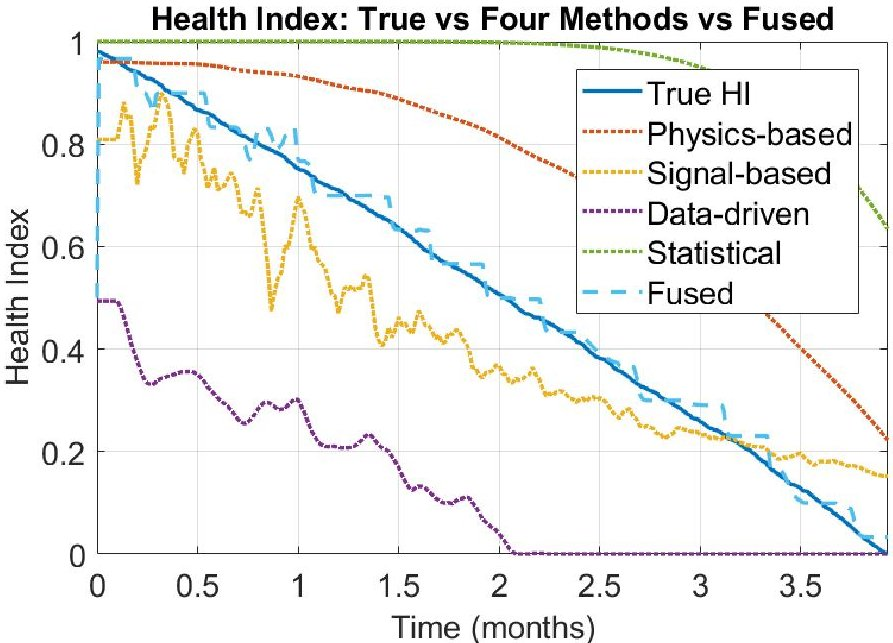
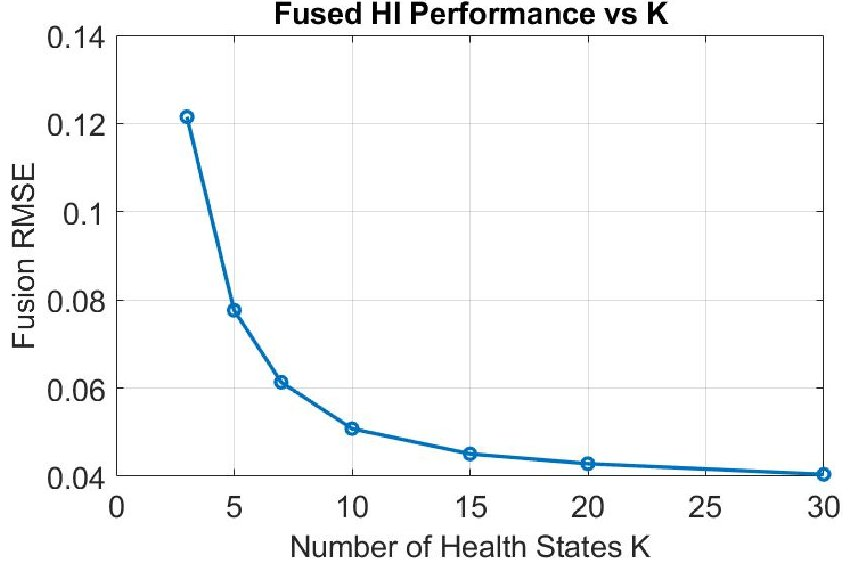

<!-- PDF_PAGE: 1 -->

Article

# Hybrid Fault Prognosis Using Health Index Fusion

S. Mohsen Azizi $ ^{1,*} $ and Faeze Ghofrani $ ^{2} $

$ ^{1} $ Newark College of Engineering, New Jersey Institute of Technology, Newark, NJ 07029, USA

$ ^{2} $ HNTB Corporation, New York, NY 10118, USA; fghofrani@hntb.com

* Correspondence: azizi@njit.edu

## Abstract

Fault prognosis is a key enabler of predictive maintenance in modern industrial systems, where heterogeneous sensing, modeling, and data analytics coexist under varying operating conditions. This paper proposes a reliability-aware health index fusion framework for hybrid fault prognosis that systematically integrates physics-based, signal-based, data-driven, and statistical prognostic methods within a unified probabilistic formulation. Each prognostic output is mapped to a bounded health index, while method-specific, stage-dependent reliability is learned offline from run-to-failure data using confusion matrices over discretized health states. During online operation, health state estimates are fused using a Bayesian time-recursive framework that accounts for degradation dynamics and reliability variation. Simulation-based case studies on rotating machinery demonstrate that the proposed approach significantly improves health index estimation accuracy and reduces variance compared to individual prognostic methods, particularly near failure.

Keywords: fault prognosis; hybrid systems; data-driven methods; physics-based modeling; artificial intelligence; Bayesian fusion; health index; reliability-aware fusion; predictive maintenance; remaining useful life

Check for updates

## 1. Introduction

Predictive maintenance and condition-based maintenance increasingly rely on accurate fault prognosis to reduce unplanned downtime, improve safety, and optimize life-cycle cost. In contrast to fault diagnosis, which detects and isolates faults after their occurrence, prognosis aims to infer the evolving health state of an asset and to predict future degradation and remaining useful life (RUL). The rapid deployment of Industrial Internet of Things (IIoT) sensing and connectivity has enabled rich streams of multivariate signals (e.g., vibration, current, temperature), but has also amplified challenges of heterogeneity, non-stationarity across operating regimes, and uncertainty in decision-making. For example, in railway transportation, large-scale sensing and operational logs have enabled big-data analytics for monitoring and predictive maintenance, while raising issues of heterogeneity, scalability, and uncertainty [1,2]. In power and transmission systems, both model-based and data-driven approaches have been used for fault detection and diagnosis, including geometric fault detection in power inverters, machine learning-based fault classification in transmission lines, real-time sensing and diagnosis, and transfer learning-based methods for fault identification, which highlight the growing importance of integrating heterogeneous information sources for reliable system health assessment [3-7].

A large body of recent work addresses RUL and health prognostics from complementary perspectives. Broad overviews and scientometric analyses highlight the continuing

<!-- PDF_PAGE: 2 -->

shift from feature-engineered models toward deep learning and hybrid approaches, while also emphasizing robustness, interpretability, and uncertainty as key requirements for industrial deployment [8-11]. Recent reviews focusing on uncertainty analysis and trustworthy deployment further note that point predictions alone are insufficient for maintenance decisions, motivating probabilistic outputs and calibrated confidence measures [12-14].

Physics-based prognosis leverages mechanistic models of degradation (e.g., wear, fatigue, thermal aging) and is valued for interpretability and extrapolation beyond the training distribution. In practice, purely physics-based models can be limited by parameter uncertainty and incomplete knowledge of complex operating environments. To bridge the gap between physical consistency and data adaptability, recent research increasingly employs physics-informed learning and physics-guided augmentation. In railway infrastructure monitoring, physics-informed data-driven formulations have been used to predict rail-break arrival rates by embedding defect mechanics into data models, improving robustness relative to purely data-driven approaches [15]. Physics-informed neural networks (PINNs) and related hybrid formulations have demonstrated improved generalization in RUL prediction tasks by regularizing learning with physical constraints or priors [16-18]. Hybrid physics-informed data augmentation has also been proposed to reduce dependence on fully labeled RUL data while retaining consistency with known system behavior [19].

Signal-based approaches remain widely used in industry because they can be implemented with minimal modeling assumptions and low computational overhead. These methods typically construct health indicators or a scalar health index (HI) from degradation-sensitive features in time, frequency, or time-frequency domains. Recent work emphasizes multi-sensor HI construction and adaptive feature fusion to improve robustness under variable operating conditions. For example, genetic-programming-based multi-source HI construction has been proposed to improve HI monotonicity and correlation with degradation, thereby enhancing downstream RUL prediction [20].

Deep learning has become a dominant paradigm for multivariate time-series prognostics, driven by its ability to learn representations directly from raw or minimally processed signals. Comprehensive surveys describe model families such as Convolutional Neural Networks (CNNs), Recurrent Neural Networks (RNNs), and transformer-based architectures, and compare training strategies and evaluation practices [8,9]. Recent works continue to extend transformer-based methods for RUL prediction in different domains and settings, including combinations with autoencoders and graph representation learning [21-23]. However, data-driven methods are sensitive to domain shift and label scarcity, motivating transfer learning, domain adaptation, and self-supervised learning strategies.

Industrial assets often operate under varying loads, speeds, and environments, producing distribution shifts between training and deployment conditions. Recent domain adaptation approaches address cross-domain RUL prediction using attention-based contrastive learning, hybrid adaptation, and self-supervised domain adaptation frameworks [24,25]. Parallel to domain adaptation, self-supervised learning has been explored to exploit abundant unlabeled operational data, improving representation quality when labeled run-tofailure trajectories are limited [26,27].

Statistical reliability models (e.g., Weibull survival) remain important for populationlevel lifetime modeling and risk assessment. Bayesian survival modeling has been applied to recurrent rail defects to quantify risk and covariate effects under censoring and repeated-event structure, illustrating the practical value of probabilistic reliability analysis in transportation assets [28]. More recent work increasingly integrates stochastic processes, Bayesian learning, and probabilistic deep models to produce both predictions and calibrated uncertainty. Benchmarks and tutorials highlight practical Uncertainty Quantification (UQ) methods such as Bayesian neural networks, deep ensembles, Monte Carlo

<!-- PDF_PAGE: 3 -->

dropout, and heteroscedastic networks, and discuss their calibration behavior in Prognostics and Health Management (PHM) settings [13,14,29]. Probabilistic fusion frameworks that combine Bayesian deep learning with stochastic process modeling have been proposed to enable uncertainty-aware RUL prediction, including cases without explicit lifetime labels [30]. Bayesian network-based approaches have also been studied for combining heterogeneous sources (measurements, features, priors, and models) in a probabilistically coherent manner [31].

Because physics-based, signal-based, data-driven, and statistical methods offer complementary strengths and failure modes, hybrid and ensemble approaches have gained substantial momentum. Recent studies propose feature-fusion ensembles and multi-branch fusion networks to exploit multi-sensor complementarity for RUL prediction [32,33]. Related hybridization has been demonstrated in rail integrity assessment, where fatigue crack-growth modeling has been integrated with data analytics to predict defect frequency and support maintenance planning [34]. Digital-twin-driven PHM has also emerged as a prominent direction, aiming to couple virtual asset replicas with data-driven analytics to support prognosis and decision-making across time scales [35,36]. Moreover, systematic reviews document growing interest in federated learning for PHM and RUL prediction [37].

Despite these advances, three gaps remain prominent for IIoT-scale deployment: (i) prognostic outputs are heterogeneous (degradation parameters, signal features, RUL, survival probabilities) and are not directly comparable, (ii) reliability is often stage-dependent and operating-condition-dependent, yet fusion methods frequently rely on static heuristics or assume equal trust across methods, and (iii) uncertainty is seldom integrated with reliability modeling at the HI level in an interpretable way.

To address these gaps, this paper proposes a reliability-aware HI fusion framework that (1) maps heterogeneous prognostic outputs into a common HI representation, (2) learns method-specific reliability using confusion-matrix likelihoods over discretized health states, and (3) performs Bayesian time-recursive fusion under a physically consistent (monotone) degradation transition model. Simulation-based case studies demonstrate improved HI tracking accuracy and reduced variance compared to individual prognostic methods.

## 2. Prognostic Methods and Health Index Construction

In this paper, fault prognosis is concerned with the prediction of incipient faults whose severity evolves gradually over time rather than abrupt fault events. An incipient fault is modeled as a degradation process that progressively drives the system toward failure. Failure is assumed to occur when the degradation reaches a critical threshold or when system performance violates prescribed specifications. The objective of fault prognosis is to assess the current health condition of the system and to estimate its proximity to failure based on available measurements, models, and historical data.

Consider a set of N heterogeneous prognostic methods operating in parallel, including physics-based (model-based), signal-based, data-driven, and statistical approaches. Each method processes measurements and/or historical information and produces an estimate related to the system's degradation state. However, the native outputs of these methods are heterogeneous and may take different forms, such as the following:

- Estimated physical degradation parameters;

- Degradation-sensitive signal features;

- Predicted RUL; and

- Probability distributions of failure time.

<!-- PDF_PAGE: 4 -->

Direct fusion of such heterogeneous outputs is generally not feasible without a common representation. To enable unified fusion, a scalar HI is introduced as a common prognostic representation. The HI is defined as a bounded scalar quantity

$$
\mathrm {H I} \in [ 0, 1 ]
$$

where HI = 1 corresponds to a fully healthy system and HI = 0 corresponds to system failure.

At each observation instant $ t_{\mathrm{now}} $ , the health index represents a snapshot of the current system health and is treated as a scalar quantity rather than a time trajectory. Time is used only to indicate when the health assessment is performed. By mapping heterogeneous prognostic outputs to a common HI representation, all prognostic methods provide comparable scalar health estimates at the current observation instant. The fusion problem can therefore be formulated as the integration of multiple HI estimates rather than raw signals or RUL predictions.

## 2.1. Health Index from Remaining Useful Life

Let $ T_{f} $ denote the (possibly unknown) failure time of the system. At a given observation instant $ t_{\mathrm{now}} $ , the RUL is defined as:

$$
\mathrm {R U L} \left(t _ {\mathrm {n o w}}\right) = T _ {f} - t _ {\mathrm {n o w}}
$$

To enable unified fusion of prognostic methods, the RUL estimate is converted into a scalar HI evaluated at the current observation instant. Let $ \widehat{\mathrm{RUL}} \left( t_{\mathrm{now}} \right) $ denote a predicted or estimated RUL provided by a prognostic method. A normalized HI is defined as:

$$
\mathrm {H I} \left(t _ {\mathrm {n o w}}\right) = \min \left(1, \frac {\widehat {\mathrm {R U L}} \left(t _ {\mathrm {n o w}}\right)}{\mathrm {R U L} _ {\mathrm {r e f}}}\right)
$$

where $ \mathrm{RUL}_{\mathrm{ref}} $ is a reference remaining useful life corresponding to a healthy or nominal operating condition. The reference value may be obtained from manufacturer specifications, historical fleet data, or early-life observations. This normalization ensures that the HI is bounded within the interval [0,1], with values close to unity indicating a healthy system and values approaching zero indicating proximity to failure. The resulting HI provides a snapshot measure of system health at $ t_{\mathrm{now}} $ and is directly comparable to HIs derived from physics-based, signal-based, and statistical prognostic methods.

## 2.2. Health Index from Degradation Variables

Let s(t) denote a degradation variable characterizing system deterioration. If s(t) increases monotonically with degradation, the HI is defined as:

$$
\mathrm {H I} \left(t _ {\mathrm {n o w}}\right) = \frac {s \left(t _ {\mathrm {n o w}}\right) - s _ {\mathrm {c r i t}}}{s _ {0} - s _ {\mathrm {c r i t}}}
$$

where $ s_{0} $ is the degradation value at the healthy reference condition and $ s_{\mathrm{crit}} $ is the critical degradation threshold corresponding to failure. The HI is saturated to the interval [0,1] if necessary. This definition applies to both physics-based degradation states and signal-based degradation indicators.

<!-- PDF_PAGE: 5 -->

## 2.3. Health Index from Statistical Prognosis

For statistical prognostic methods, failure time is modeled as a random variable $ T_{f} $ The associated survival function $ S(t) $ is defined as:

$$
S (t) = \mathbb {P} \left(T _ {f} > t\right)
$$

In this framework, the HI provided by a statistical prognostic method at the current observation instant is defined as

$$
\mathrm {H I} \left(t _ {\mathrm {n o w}}\right) = S \left(t _ {\mathrm {n o w}}\right)
$$

which represents the probability that the system has not failed by time $ t_{\mathrm{now}} $ . This definition yields a bounded scalar HI that is probabilistically grounded and directly comparable to HIs derived from other prognostic methods.

In the following sections, the HI is discretized into a finite number of health states to enable reliability modeling of individual prognostic methods and to support reliabilityaware fusion.

## 3. Reliability Modeling of Prognostic Methods

To enable reliability-aware fusion of heterogeneous prognostic methods, it is necessary to quantify the reliability of each method in providing accurate health assessments across different stages of degradation. In this work, prognostic reliability is modeled at the HI level using empirical performance statistics obtained from run-to-failure or simulated degradation data.

Although the HI defined in Section 2 is a continuous scalar in the interval [0,1], reliability modeling is facilitated by discretizing the HI into a finite set of health states. Let the continuous HI be partitioned into K discrete health states:

$$
\mathcal {H} = \left\{H _ {1}, H _ {2}, \dots , H _ {K} \right\}
$$

where each state corresponds to a specific interval of the HI. For example,

$$
H _ {k} = \left\{\mathrm {H I} \mid \alpha_ {k - 1} < \mathrm {H I} \leq \alpha_ {k} \right\}
$$

with $ 0=\alpha_{0}<\alpha_{1}<\cdots <\alpha_{K}=1 $ . The discretization thresholds $ \left\{\alpha_{k}\right\} $ may be chosen uniformly or selected to reflect meaningful degradation stages, such as healthy, mild degradation, moderate degradation, severe degradation, and near-failure conditions.

Reliability modeling requires ground-truth health state labels for performance evaluation. These labels are obtained using run-to-failure experiments, accelerated aging tests, or high-fidelity degradation simulations. Let $ T_{f} $ denote the true failure time associated with a particular run. At an observation instant $ t_{\mathrm{now}} $ , the ground-truth remaining useful life is given by

$$
\mathrm {R U L} _ {\mathrm {t r u e}} \left(t _ {\mathrm {n o w}}\right) = T _ {f} - t _ {\mathrm {n o w}}
$$

The corresponding ground-truth HI is computed using the HI definition provided in Section 2. The continuous ground-truth HI is then mapped to a discrete health state $ H_{k}\in \mathcal{H} $ according to the discretization rule defined above. This discrete health state serves as the reference label for evaluating prognostic method performance at $ t_{\mathrm{now}}. $

## Method-Specific Confusion Matrix Construction

Consider a prognostic method indexed by $ i $ $ (i \in \{1, \dots, N\}) $ , which produces a HI estimate $ \widehat{\mathrm{HI}}_{i} \left(t_{\mathrm{now}}\right) $ at the current observation instant. The estimated HI is discretized into

<!-- PDF_PAGE: 6 -->

a predicted health state $ \widehat{H}_{i}\in\mathcal{H} $ using the same discretization thresholds applied to the ground-truth HI. The reliability of prognostic method i is characterized using a confusion matrix $ \mathbf{C}^{(i)}\in\mathbb{R}^{K\times K} $ , where each entry is defined as

$$
C _ {a, b} ^ {(i)} = \mathbb {P} \left(\widehat {H} _ {i} = H _ {b} \mid H = H _ {a}\right)
$$

with $ H $ denoting the true health state and $ \widehat{H}_{i} $ denoting the health state predicted by method i. In practice, the confusion matrix $ C^{(i)} $ is estimated empirically from labeled data as

$$
C _ {a, b} ^ {(i)} = \frac {N _ {a , b} ^ {(i)}}{\sum_ {j = 1} ^ {K} N _ {a , j} ^ {(i)}}
$$

where $ N_{a,b}^{(i)} $ denotes the number of samples for which the true health state is $ H_{a} $ and method i predicts $ H_{b} $ . Each row of the confusion matrix $ C^{(i)} $ therefore represents a conditional probability distribution over predicted health states given the true health state.

The confusion matrix provides a compact and interpretable representation of prognostic reliability. Diagonal elements $ C_{a,a}^{(i)} $ quantify the probability that method i correctly identifies the health state, while off-diagonal elements characterize systematic biases and misclassification tendencies. Importantly, the confusion matrix captures how prognostic reliability varies across different degradation stages. For example, a method may exhibit high reliability during early degradation but reduced accuracy near failure, or vice versa. This stage-dependent reliability information is essential for reliability-aware fusion, as it allows the fusion process to appropriately weight prognostic methods based on their demonstrated performance in different health regimes.

The confusion matrices constructed in this section form the basis for the reliability-aware fusion framework presented in the following section.

## 4. Fusion-Based Hybrid Prognosis Framework

This section presents the proposed fusion-based hybrid fault prognosis framework. The objective is to combine heterogeneous prognostic HI estimates provided by multiple methods into a single, reliable health assessment by explicitly accounting for method-specific reliability learned from historical data.

Consider a set of N prognostic methods operating in parallel. At the current observation instant $ t_{\mathrm{now}} $ , each method $ i \in \{1, \dots, N\} $ produces a scalar HI estimate $ \widehat{\mathrm{HI}}_{i}(t_{\mathrm{now}}) $ which is discretized into a predicted health state as follows:

$$
\widehat {H} _ {i} \in \mathcal {H} = \left\{H _ {1}, H _ {2}, \dots , H _ {K} \right\}
$$

The fusion problem consists of estimating the true health state $ H\in\mathcal{H} $ of the system given the set of predicted health states as follows:

$$
\widehat {\mathbf {H}} = \left\{\widehat {H} _ {1}, \widehat {H} _ {2}, \dots , \widehat {H} _ {N} \right\}
$$

while accounting for the reliability of each prognostic method.

The fusion is formulated within a Bayesian inference framework. The posterior probability of the true health state $ H_{k} $ given the predicted health states is expressed as

$$
\mathbb {P} \left(H = H _ {k} \mid \widehat {\mathbf {H}}\right) = \frac {\mathbb {P} \left(\widehat {\mathbf {H}} \mid H = H _ {k}\right) \mathbb {P} \left(H = H _ {k}\right)}{\sum_ {j = 1} ^ {K} \mathbb {P} \left(\widehat {\mathbf {H}} \mid H = H _ {j}\right) \mathbb {P} \left(H = H _ {j}\right)}
$$

<!-- PDF_PAGE: 7 -->

where $ \mathbb{P} ( H=H_{k} ) $ denotes the prior probability of health state $ H_{k} $ . Assuming conditional independence of prognostic methods given the true health state, the likelihood term is factorized as

$$
\mathbb {P} \left(\widehat {\mathbf {H}} \mid H = H _ {k}\right) = \prod_ {i = 1} ^ {N} \mathbb {P} \left(\widehat {H} _ {i} \mid H = H _ {k}\right)
$$

The conditional probabilities $ \mathbb{P}(\widehat{H}_{i}\mid H=H_{k}) $ are obtained directly from the confusion matrix of prognostic method i, as defined in Section 3. This formulation ensures that prognostic methods with higher reliability in a given health state exert greater influence on the fused estimate.

The fused health state can be obtained using a maximum a posteriori (MAP) criterion:

$$
\widehat {H} _ {\mathrm {f u s e d}} = \arg \max _ {H _ {k} \in \mathcal {H}} \mathbb {P} \left(H = H _ {k} \mid \widehat {\mathbf {H}}\right)
$$

Alternatively, a continuous fused health index can be computed by taking the expectation of the HI over the posterior distribution:

$$
\mathrm {H I} _ {\mathrm {f u s e d}} \left(t _ {\mathrm {n o w}}\right) = \sum_ {k = 1} ^ {K} \bar {\mathrm {H I}} _ {k} \mathbb {P} \left(H = H _ {k} \mid \widehat {\mathbf {H}}\right)
$$

where $ \bar{\mathrm{H I}}_{k} $ denotes the representative HI value associated with health state $ H_{k} $ . In the present work, $ \bar{\mathrm{H I}}_{k} $ is chosen as the midpoint of the HI interval associated with state $ H_{k} $ alternatively, it may be estimated as the empirical conditional mean $ \mathbb{E}[\mathrm{H I} \mid H=H_{k}] $ from the training data, which may better represent skewed within-state HI distributions. This fused HI provides a scalar snapshot measure of system health that integrates information from all prognostic methods in a reliability-aware manner. Thus, the fused HI can be interpreted as the conditional expectation $ \mathbb{E}[\mathrm{H I} \mid \widehat{\mathbf{H}}]. $

The proposed fusion-based hybrid prognosis framework is summarized as follows:

(i) Compute individual HI estimates $ \widehat{\mathrm{HI}}_{i}(t_{\mathrm{now}}) $ from each prognostic method i $ (i\in\{1,...,N\}) $ .

(ii) Discretize each HI estimate into a predicted health state $ \widehat{H}_{i} $ (where $ \widehat{H}_{i}\in \mathcal{H}=\{H_{1},H_{2},\ldots,H_{K}\} $).

(iii) Retrieve method-specific confusion matrices learned offline (Equation (11)).

(iv) Compute posterior health state probabilities using Bayesian fusion (Equation (14)).

(v) Estimate the fused HI (Equations (16) and (17)).

An additional advantage of the proposed fusion formulation is its robustness to the temporary unavailability of one or more prognostic methods, which may occur in practical IIoT environments due to sensor failures, communication interruptions, or maintenance events. Since the likelihood term in the Bayesian fusion formulation is expressed as a product of method-specific likelihoods, the framework can operate with any subset of available prognostic methods by excluding the unavailable terms from the likelihood computation. In such cases, the fused health estimate is computed using the remaining available methods, whose contributions are weighted according to their learned reliability. This property makes the proposed framework naturally resilient to missing information and well suited for distributed sensing environments where data availability may vary over time.

The proposed framework enables systematic and interpretable integration of heterogeneous prognostic information while explicitly accounting for method reliability. Unlike heuristic averaging or voting strategies, the proposed fusion framework leverages empirically learned reliability information to weight prognostic methods according to their demonstrated performance across different degradation stages. As a result, the fusion-

<!-- PDF_PAGE: 8 -->

based prognosis is robust to individual method biases and performance degradation under challenging operating conditions. The framework is modular and can readily accommodate additional prognostic methods as well as adaptive reliability updates when new labeled data become available.

It is worth noting that the proposed reliability-aware fusion framework differs from conventional Bayesian network-based approaches commonly used for prognostic information fusion. In many Bayesian network formulations, conditional probability tables are defined to represent probabilistic dependencies among variables, measurements, or model outputs, and these probabilities are often specified based on expert knowledge or limited training data. In contrast, the proposed method learns method-specific reliability empirically from run-to-failure data using confusion matrices defined over discretized health states. This formulation explicitly captures stage-dependent reliability of prognostic methods, allowing the fusion process to adaptively weight different methods according to their demonstrated accuracy in different degradation regimes. As a result, the proposed approach provides a data-driven and interpretable mechanism for reliability-aware prognostic fusion.

The computational overhead of the proposed fusion step is relatively small compared to that of the individual prognostic methods. The fusion procedure primarily involves evaluating likelihood terms using precomputed confusion matrices and computing posterior probabilities over a finite set of health states. The computational complexity per update step is approximately $ \mathcal{O}(N K) $ , where N denotes the number of prognostic methods and K denotes the number of discretized health states. In practical implementations, both N and K are typically small (e.g., N=4 and K=15 in the present study), resulting in negligible computational cost relative to signal processing, feature extraction, or machine-learning inference required by the individual prognostic methods. Consequently, the proposed fusion framework is well suited for real-time deployment in IIoT environments.

## 5. Simulation Results for a Rotating Machinery

This section presents a simulation-based case study used to evaluate the proposed reliability-aware HI fusion framework in the context of rotating machinery. Rolling-element bearings are among the most common failure-prone components in rotating systems and are therefore selected as the primary degradation-driven element. Although a specific machine configuration is used, the proposed framework is not system-specific and is applicable to any rotating asset whose degradation can be characterized by a scalar HI. It should be emphasized that the objective of this simulation study is not to replicate a complete industrial predictive maintenance system, but rather to provide a controlled environment for evaluating the proposed reliability-aware fusion framework. The simulated electromechanical-thermal system is used as a proof-of-concept testbed in which heterogeneous prognostic methods can be generated with known degradation dynamics and measurement relationships. This controlled setting enables systematic comparison of individual prognostic methods and the proposed fusion approach. The fusion framework itself is not restricted to the specific simulation model presented here and can be applied to real industrial systems where heterogeneous prognostic models are available. Validation on real-world datasets and experimental platforms represents an important direction for future work.

To establish a causal and physically consistent link between bearing degradation and measurable system responses, a low-order electromechanical-thermal dynamic model of the rotating system is employed. Bearing degradation is represented by a latent fault severity variable $ x ( t ) \in[ 0, 1 ] $ , where $ x ( t )=0 $ corresponds to a healthy bearing and

<!-- PDF_PAGE: 9 -->

x ( t ) = 1 denotes functional failure. The degradation evolves as the following stochastic stress-dependent process:

$$
x (t + \Delta t) = x (t) + \left(k _ {0} + k _ {1} \sigma (t)\right) \Delta t + \sigma_ {x} \sqrt {\Delta t} \varepsilon (t)
$$

where $ k_{0} $ is the nominal degradation drift, $ k_{1} $ scales stress-induced acceleration, $ \sigma_{x} $ represents process variability, and $ \varepsilon(t) $ is a standard Gaussian random variable. The coefficients $ k_{0}, k_{1}, $ and $ \sigma_{x} $ are introduced as simulation parameters used to generate representative degradation trajectories for the rotating machinery case study. The degradation model in (18) is introduced as a controlled stochastic process for simulation purposes, rather than as a calibrated physics-based model of a specific industrial asset. Its role is to generate diverse and physically plausible degradation trajectories under varying stress conditions, enabling systematic evaluation of the proposed fusion framework. The parameters in (18) are selected within ranges that ensure monotonic degradation behavior, variability across trajectories, and consistency with typical degradation trends reported in the rotating machinery literature. In real applications, the true degradation process exists but is unknown and not explicitly modeled. The proposed fusion framework does not require knowledge of the true degradation dynamics; instead, it operates on HI estimates produced by available prognostic methods.

The coupled electromechanical and thermal dynamics of the motor-gearbox-bearing assembly are described by

$$
\begin{array}{l} J \dot {\omega} (t) = K _ {t} i (t) - T _ {\mathrm {l o a d}} (t) - T _ {\mathrm {f r i c}} (t) \\ L \dot {i} (t) = v (t) - R i (t) - K _ {e} \omega (t) \\ C _ {\mathrm {t h}} \dot {\theta} (t) = \left| T _ {\mathrm {f r i c}} (t) \omega (t) \right| - \frac {\theta (t) - \theta_ {\mathrm {a m b}}}{R _ {\mathrm {t h}}} \\ T _ {\mathrm {f r i c}} (t) = \left(T _ {c, 0} + T _ {c, 1} x (t)\right) \operatorname {s g n} \left(\omega (t)\right) + \left(B _ {0} + B _ {1} x (t)\right) \omega (t) \\ \end{array}
$$

where J denotes the equivalent rotational inertia, $ \omega(t) $ is the shaft angular speed, $ i(t) $ is the motor stator current, and $ v(t) $ is the applied motor voltage. The constants $ K_{t} $ and $ K_{e} $ denote the motor torque and back-electromotive force (EMF) constants, respectively, while R and L are the stator resistance and inductance. The term $ T_{\mathrm{load}}(t) $ denotes the external load torque. The variable $ \theta(t) $ denotes the lumped bearing temperature measured at the bearing housing, while $ C_{\mathrm{th}} $ and $ R_{\mathrm{th}} $ represent the effective thermal capacitance and resistance, respectively, and $ \theta_{\mathrm{amb}} $ is the ambient temperature. Bearing degradation enters the system dynamics through the friction torque $ T_{\mathrm{fric}}(t) $ , which is modeled using degradation-dependent Coulomb and viscous friction components. Specifically, $ T_{c,0} $ and $ B_{0} $ denote the nominal (healthy) Coulomb and viscous friction coefficients, respectively, while $ T_{c,1} $ and $ B_{1} $ capture the incremental increase in Coulomb and viscous friction induced by bearing wear. As the degradation severity $ x(t) $ increases, the resulting rise in friction torque leads to higher current demand, increased thermal losses, and altered speed response.

In addition to the dynamic states, bearing defects generate characteristic vibration signatures whose amplitudes increase monotonically with degradation severity. Rather than modeling detailed bearing contact mechanics, this effect is represented using a low-order degradation-sensitive signature model as follows:

$$
A (t) = A _ {0} + A _ {1} x (t)
$$

where $ A ( t ) $ denotes a representative vibration amplitude feature (e.g., RMS or envelope amplitude), $ A_{0} $ corresponds to the nominal vibration level under healthy operating conditions,

<!-- PDF_PAGE: 10 -->

and $ A_{1} $ determines the sensitivity of the vibration amplitude to bearing degradation. As the degradation severity $ x(t) $ increases, the resulting rise in vibration amplitude provides an additional measurement channel for signal-based and data-driven prognostic methods.

Together, the degradation dynamics in (18), the coupled system dynamics in (19), and the vibration model in (20) define a physically informed model in which the latent degradation state $ x(t) $ influences shaft speed, motor current, bearing temperature, and vibration signatures through explicit causal pathways. Only low-order dynamic equations are introduced to establish this causal consistency, without aiming to develop a high-fidelity electromechanical or thermo-mechanical model.

The ground-truth HI is defined as

$$
\mathrm {H I} _ {\mathrm {t r u e}} (t) = 1 - x (t)
$$

which decreases monotonically from one to zero as bearing degradation progresses. Note that the degradation variable $ x(t) $ increases monotonically with degradation severity, whereas the health index defined as $ \mathrm{H I}_{\mathrm{t r u e}}(t)=1-x(t) $ decreases from 1 (healthy) to 0 (failure). In the simulation implementation, the degradation variable $ x(t) $ is constrained to the interval [0,1] using saturation to ensure physical consistency. Consequently, the resulting health index $ \mathrm{H I}_{\mathrm{t r u e}}(t) $ remains within the assumed range [0,1]. The motor-gearbox system dynamics are simulated in continuous time, while bearing degradation directly affects mechanical friction, power losses, vibration response, and thermal behavior.

## 5.1. Four Heterogeneous Prognostic Methods

Four measurements are generated with additive noise: motor rotational speed, motor current, bearing temperature, and vibration acceleration. These sensing modalities are representative of industrial condition monitoring systems used in predictive maintenance. In the following, four heterogeneous prognostic methods are considered, each exploiting different measured signals and modeling assumptions to provide complementary degradation-related information.

- Physics-Based Prognosis: The physics-based method infers bearing degradation indirectly through degradation-induced mechanical losses and thermal effects. This method relies on measured motor current i(t), shaft speed $ \omega(t) $ , and bearing temperature $ \theta(t) $ . A degradation-sensitive residual is constructed as

$$
r _ {\mathrm {P B}} (t) = \alpha_ {1} | i (t) | + \alpha_ {2} \theta (t) - \alpha_ {3} | \omega (t) |
$$

where $ \alpha_{1},\alpha_{2} $ , and $ \alpha_{3} $ are weighting coefficients. A baseline residual $ r_{0} $ is estimated from an initial healthy operating period, and only positive deviations from this baseline are interpreted as evidence of degradation. The degradation severity estimate is updated recursively according to

$$
\widehat {x} _ {\mathrm {P B}} (t) = \widehat {x} _ {\mathrm {P B}} (t - \Delta t) + \beta \max \left(r _ {\mathrm {P B}} (t) - r _ {0}, 0\right)
$$

where $ \beta $ is a small adaptation gain controlling the update rate. The physics-based health index is then defined as

$$
\mathrm {H I} _ {\mathrm {P B}} (t) = 1 - \widehat {x} _ {\mathrm {P B}} (t)
$$

which decreases monotonically as degradation progresses.

- Signal-Based Prognosis: The signal-based method exploits the sensitivity of bearing vibration characteristics to fault progression and relies exclusively on vibration

<!-- PDF_PAGE: 11 -->

measurements A(t) obtained from an accelerometer mounted on the bearing housing. Sliding-window vibration features are extracted, including the root-mean-square (RMS) amplitude and kurtosis, as follows:

$$
\mathrm {R M S} (t) = \sqrt {\frac {1}{N _ {A}} \sum_ {k = 1} ^ {N _ {A}} A _ {k} ^ {2} (t)}
$$

$$
\operatorname {K u r t} (t) = \frac {\mathbb {E} \left[ \left(A _ {k} (t) - \mu\right) ^ {4} \right]}{\sigma^ {4}} (k = 1, \dots , N _ {A})
$$

where $ A_{k}(t) $ (with $ k=1,...,N_{A} $ ) denotes the vibration samples within the sliding time window, $ \mathbb{E}[\cdot] $ denotes averaging over the $ N_{A} $ vibration samples, and $ \mu $ and $ \sigma $ are the corresponding sample mean and standard deviation. Feature growth relative to healthy reference values $ \mathrm{RMS}_{0} $ and $ \mathrm{Kurt}_{0} $ is combined into a degradation score:

$$
s _ {\mathrm {S B}} (t) = \beta_ {1} \max \left(0, \frac {\mathrm {R M S} (t) - \mathrm {R M S} _ {0}}{\mathrm {R M S} _ {0}}\right) + \beta_ {2} \max \left(0, \frac {\mathrm {K u r t} (t) - \mathrm {K u r t} _ {0}}{\mathrm {K u r t} _ {0}}\right)
$$

which is mapped to a bounded signal-based HI as follows:

$$
\mathrm {H I} _ {\mathrm {S B}} (t) = \frac {1}{1 + \gamma s _ {\mathrm {S B}} (t)}
$$

where $ \beta_{1},\beta_{2} $ and $ \gamma $ are tuning parameters. The resulting $ \mathrm{H I}_{\mathrm{S B}}(t)\in[0,1] $ decreases monotonically as vibration severity increases.

- Data-Driven Prognosis: The data-driven method learns a direct mapping from measured features to HI using supervised regression trained on run-to-failure trajectories. The feature vector combines heterogeneous sensing information as follows:

$$
\mathbf {f} (t) = \left[ \mathrm {R M S} (t), \mathrm {K u r t} (t), \theta (t), \omega (t), i (t) \right]
$$

which includes vibration features, bearing temperature, shaft speed, and motor current. A regularized linear regression model is trained to estimate the HI directly, yielding the data-driven estimate $ \mathrm{H I}_{\mathrm{D D}}(t). $

- Statistical Prognosis: The statistical prognostic method models bearing lifetime at the population level using a Weibull distribution fitted to observed failure times from training trajectories. The corresponding survival function is given by

$$
S (t) = \exp \left[ - \left(\frac {t}{\lambda}\right) ^ {k} \right]
$$

where k and $ \lambda $ denote the shape and scale parameters, respectively. The survival probability is evaluated online as a function of elapsed operating time to produce the following statistical health index:

$$
\mathrm {H I} _ {\mathrm {S T}} (t) = S (t)
$$

The structures of the four considered heterogeneous prognostic methods are consistent with commonly used analytical and residual-based techniques in the prognostics and condition monitoring literature, where degradation-sensitive residuals are constructed from measurable quantities. In line with standard practice, the coefficients (e.g., $ \alpha_{1},\alpha_{2}, $ $ \alpha_{3},\beta,\beta_{1},\beta_{2}, $ and $ \gamma $ ) are initially guided by analytical insight into system behavior and subsequently fine-tuned empirically to ensure sensitivity to degradation trends and stable evolution of the estimated health state. The detailed design and calibration of these

<!-- PDF_PAGE: 12 -->

parameters are beyond the scope of this paper. The primary objective of this work is to evaluate the proposed reliability-aware fusion framework under heterogeneous prognostic inputs, rather than to optimize or validate any individual prognostic model.

## 5.2. Fused Health Index Results

A total of $ N_{\mathrm{train}}=8 0 $ run-to-failure trajectories are generated to learn method-specific reliability models in the form of confusion matrices. Each trajectory simulates the coupled electromechanical-thermal dynamics of a motor-gearbox-bearing system with stochastic bearing degradation. The continuous HI is discretized into K=15 ordered health states spanning the interval [0,1], corresponding to progressive degradation from healthy to nearfailure conditions. Reliability learning is performed offline and assumed fixed during online operation. During testing, $ N_{\mathrm{test}}=5 0 $ independent trajectories are simulated. At each time instant, discrete health-state predictions from all prognostic methods are fused using the Bayesian reliability-aware framework described in Section 4. A monotone state-transition model is employed to reflect the irreversible nature of bearing degradation.

Table 1 summarizes the average HI estimation performance across all test trajectories in terms of mean absolute error (MAE), root-mean-square error (RMSE), and estimation variance. Results are reported for each individual prognostic method as well as for the proposed fusion approach. The proposed fusion framework achieves an RMSE reduction of approximately 66% relative to the best individual method. In addition to improved accuracy, the fused HI exhibits substantially reduced variance, indicating enhanced robustness against noise and model uncertainty. The relatively lower performance of the data-driven approach in this study can be attributed to limited training data coverage across varying operating conditions, the inherently nonlinear and coupled relationship between measured signals and degradation dynamics, and the use of a feature set that may not fully capture all degradation-sensitive information under transient regimes. These factors can lead to reduced generalization accuracy of the data-driven approach. In contrast, the physics-based approach benefits from structural knowledge of the system dynamics, which improves robustness under the simulated conditions. It is worth noting that the objective of this study is to demonstrate that the proposed reliability-aware fusion framework can effectively integrate heterogeneous prognostic methods with varying reliability characteristics; therefore, the relatively lower standalone performance of the data-driven approach helps highlight the advantage and robustness of the proposed fusion method.

Table 1. HI estimation performance comparison.

<table border="1"><tr><td>Method</td><td>MAE</td><td>RMSE</td><td>Variance</td></tr><tr><td>Physics-based(PB)</td><td>0.2142</td><td>0.2366</td><td>0.0104</td></tr><tr><td>Signal-based(SB)</td><td>0.1117</td><td>0.1331</td><td>0.0117</td></tr><tr><td>Data-driven(DD)</td><td>0.3802</td><td>0.4132</td><td>0.0262</td></tr><tr><td>Statistical(ST)</td><td>0.4159</td><td>0.4715</td><td>0.0493</td></tr><tr><td>FusedHI</td><td>0.0315</td><td>0.0451</td><td>0.0020</td></tr></table>

To further analyze where fusion provides the greatest benefit, estimation performance is evaluated separately across degradation stages corresponding to five discretized health states. Table 2 reports the RMSE of each method within healthy, mild, moderate, severe, and near-failure regimes. The results indicate that fusion framework consistently outperforms individual methods across all degradation stages, with particularly pronounced improvements in late-stage degradation, where individual methods diverge significantly and fusion framework maintains robust low-error performance.

<!-- PDF_PAGE: 13 -->

Table 2. Stage-wise RMSE of HI estimation across five degradation stages.

<table border="1"><tr><td>Stage</td><td>PB</td><td>SB</td><td>DD</td><td>ST</td><td>Fused HI</td></tr><tr><td>Healthy</td><td>0.0772</td><td>0.1763</td><td>0.5347</td><td>0.1203</td><td>0.0568</td></tr><tr><td>Mild</td><td>0.2069</td><td>0.1582</td><td>0.4887</td><td>0.3055</td><td>0.0339</td></tr><tr><td>Moderate</td><td>0.2872</td><td>0.1355</td><td>0.4521</td><td>0.4956</td><td>0.0317</td></tr><tr><td>Severe</td><td>0.2996</td><td>0.0585</td><td>0.3065</td><td>0.6317</td><td>0.0450</td></tr><tr><td>Near-failure</td><td>0.2465</td><td>0.0957</td><td>0.1158</td><td>0.6183</td><td>0.0537</td></tr></table>

While the proposed fusion framework substantially reduces the impact of poorly performing methods in late-stage degradation, the near-failure regime remains more challenging than earlier stages. In particular, the Weibull-based statistical method exhibits a pronounced late-stage error because it represents population-level survival behavior and does not fully capture trajectory-specific degradation acceleration near failure. The confusion-matrix-based Bayesian fusion mitigates this effect by assigning lower effective influence to methods with poorer stage-dependent reliability; however, it does not necessarily eliminate systematic bias completely, especially when a method exhibits persistent bias in a given regime or when multiple methods simultaneously lose accuracy near failure. Therefore, the proposed fusion framework should be interpreted as a reliability-aware bias-mitigation mechanism rather than a guaranteed bias-elimination mechanism. Additional improvements, such as adaptive reliability updating, explicit bias correction, or richer state-dependent transition and observation models, may further improve performance in the near-failure regime and will be investigated in future work.

Figure 1 shows a representative test trajectory comparing the true HI with estimates produced by each individual prognostic method and the proposed fusion-based method. Individual methods exhibit varying degrees of bias and variability, particularly during transient operating conditions. In contrast, the fused HI closely tracks the true degradation trend while suppressing spurious fluctuations. This observation is quantitatively supported by the error metrics reported in Tables 1 and 2, where the fused estimate consistently achieves lower MAE, RMSE, and variance relative to the individual prognostic methods when compared with the simulated ground-truth HI.

Figure 1. Time-domain comparison of true and estimated HIs for a representative test trajectory.

An ablation study is conducted to assess the contribution of each prognostic method to overall fusion framework performance. Table 3 reports the RMSE of fusion variants in which one method is removed at a time. The results indicate that most prognostic methods contribute complementary information, with the largest performance degradation observed

<!-- PDF_PAGE: 14 -->

when removing the data-driven and signal-based components. Notably, removing the statistical method slightly improves performance, suggesting it may introduce redundant or less reliable information in this configuration.

Table 3. Fusion framework ablation study.

<table border="1"><tr><td>Fusion-Based Configuration</td><td>RMSE</td></tr><tr><td>Full fusion</td><td>0.0451</td></tr><tr><td>Fusion without physics-based(PB)</td><td>0.0487</td></tr><tr><td>Fusion without signal-based(SB)</td><td>0.0520</td></tr><tr><td>Fusion without data-driven(DD)</td><td>0.0532</td></tr><tr><td>Fusion without statistical(ST)</td><td>0.0423</td></tr></table>

Across all evaluation metrics, the proposed reliability-aware fusion framework consistently outperforms individual prognostic methods. The results demonstrate that explicit modeling of method reliability enables robust integration of heterogeneous prognostic information, leading to improved accuracy, reduced uncertainty, and enhanced interpretability. These characteristics are particularly valuable for IIoT-enabled industrial environments, where sensing quality and prognostic reliability may vary over time.

Figure 2 illustrates the sensitivity of the proposed fusion framework to the number of health states K, evaluated in terms of the RMSE of the fused HI. As K increases from 3 to 30, the fusion framework performance improves consistently, indicating that a finer discretization of the degradation process enables more effective aggregation of complementary information from the individual prognostic methods. Based on this sensitivity analysis, K=15 is selected as the baseline configuration, and all results reported in Tables 1-3 are obtained using this setting.

Figure 2. Fusion framework performance as a function of the number of health states K, evaluated using RMSE of the fused HI.

Table 4 reports all fixed simulation parameters and the ranges of parameters randomized across runs. The degradation-model parameters $ k_{0}, k_{1} $ , and $ \sigma_{x} $ were independently randomized for each training and test trajectory in order to emulate operating variability.

<!-- PDF_PAGE: 15 -->

Table 4. Simulation parameters used in the rotating-machinery case study.

<table border="1"><tr><td>Parameter</td><td>Description</td><td>Value</td></tr><tr><td>$\Delta t$</td><td>Simulation time step</td><td>0.01s</td></tr><tr><td>$N_{\mathrm{train}}$</td><td>Number of training trajectories</td><td>80</td></tr><tr><td>$N_{\mathrm{test}}$</td><td>Number of test trajectories</td><td>50</td></tr><tr><td>K</td><td>Number of health states (baseline case)</td><td>15</td></tr><tr><td>J</td><td>Equivalent rotational inertia</td><td>0.02kgm2</td></tr><tr><td>$K_{t}$</td><td>Motor torque constant</td><td>0.20Nm/A</td></tr><tr><td>$K_{e}$</td><td>Back-EMF constant</td><td>0.20Vs/rad</td></tr><tr><td>R</td><td>Stator resistance</td><td>0.6Ω</td></tr><tr><td>L</td><td>Stator inductance</td><td>$3\times10^{-3}\mathrm{H}$</td></tr><tr><td>$k_{0}$</td><td>Nominal degradation drift coefficient</td><td>$[1.5,4.0]\times10^{-5}$</td></tr><tr><td>$k_{1}$</td><td>Stress acceleration coefficient</td><td>$[2.0,7.0]\times10^{-5}$</td></tr><tr><td>$\sigma_{x}$</td><td>Degradation diffusion coefficient</td><td>$[2.0,4.0]\times10^{-4}$</td></tr><tr><td>$T_{c,0}$</td><td>Healthy Coulomb friction coefficient</td><td>0.10</td></tr><tr><td>$T_{c,1}$</td><td>Degradation-dependent Coulomb friction increment</td><td>0.65</td></tr><tr><td>$B_{0}$</td><td>Healthy viscous friction coefficient</td><td>0.0015</td></tr><tr><td>$B_{1}$</td><td>Degradation-dependent viscous friction increment</td><td>0.006</td></tr><tr><td>$\theta_{\mathrm{amb}}$</td><td>Ambient temperature</td><td>$25^{\circ}\mathrm{C}$</td></tr><tr><td>$C_{\mathrm{th}}$</td><td>Thermal capacitance</td><td>120</td></tr><tr><td>$R_{\mathrm{th}}$</td><td>Thermal resistance</td><td>0.9</td></tr><tr><td>$\alpha_{1}$</td><td>Physics-based residual weight on $|i(t)|$</td><td>0.020</td></tr><tr><td>$\alpha_{2}$</td><td>Physics-based residual weight on $\theta(t)$</td><td>0.010</td></tr><tr><td>$\alpha_{3}$</td><td>Physics-based residual weight on $|\omega(t)|$</td><td>0.004</td></tr><tr><td>$\beta$</td><td>Physics-based adaptation gain</td><td>0.002</td></tr><tr><td>$\beta_{1}$</td><td>Signal-based RMS feature weight</td><td>0.70</td></tr><tr><td>$\beta_{2}$</td><td>Signal-based kurtosis feature weight</td><td>0.30</td></tr><tr><td>$\gamma$</td><td>Signal-to-HI mapping gain</td><td>2.5</td></tr><tr><td>k</td><td>Weibull shape parameter</td><td>estimated from training data</td></tr><tr><td>$\lambda$</td><td>Weibull scale parameter</td><td>estimated from training data</td></tr></table>

## 6. Conclusions and Future Work

This paper presented a reliability-aware HI fusion framework for hybrid fault prognosis in industrial systems. By mapping heterogeneous prognostic outputs from physicsbased, signal-based, data-driven, and statistical methods into a unified HI representation, the proposed approach enables principled integration of diverse sources of prognostic information. Method-specific reliability is learned offline using confusion matrices defined over discretized health states, and a Bayesian time-recursive fusion strategy is employed to account for degradation dynamics and stage-dependent reliability during online operation. Simulation results of a rotating machinery subject to bearing and gearbox degradation demonstrate that the proposed framework consistently outperforms individual prognostic methods. Quantitative results show improved HI estimation accuracy and reduced variance across all degradation stages, with particularly robust performance near failure where individual method reliability varies significantly. The modular and interpretable structure of the framework makes it well suited for deployment in IIoT environments, where heterogeneous data sources and prognostic models commonly coexist.

Future work will focus on extending the proposed framework in several directions. First, adaptive and online reliability learning will be investigated to account for evolving operating conditions and non-stationary system behavior. Second, the integration of

<!-- PDF_PAGE: 16 -->

physics-informed and deep learning-based prognostic models will be explored to further improve generalization and interpretability. Third, extensions to multi-component systems and fleet-level prognosis will be considered, including dependency modeling and maintenance decision optimization. Finally, performance validation using experimental test rigs or real industrial datasets will be conducted to investigate the effectiveness of the proposed fusion framework in the presence of additional disturbances, noise sources, and unmodeled dynamics.

Author Contributions: Conceptualization, S.M.A. and F.G.; methodology, S.M.A. and F.G.; software, S.M.A. and F.G.; formal analysis, S.M.A. and F.G.; writing—original draft preparation, S.M.A. and F.G.; writing—review and editing, S.M.A. and F.G. All authors have read and agreed to the published version of the manuscript.

Funding: This research received no external funding.

Data Availability Statement: The original contributions presented in this study are included in the article. Further inquiries can be directed to the corresponding author.

Conflicts of Interest: Author Faeze Ghofrani was employed by the company HNTB Corporation. The remaining authors declare that the research was conducted in the absence of any commercial or financial relationships that could be construed as a potential conflict of interest.

## References

1. Ghofrani, F.; He, Q.; Goverde, R.M.P.; Liu, X. Recent applications of big data analytics in railway transportation systems: A survey. Transp. Res. Part C Emerg. Technol. 2018, 90, 226-246. [CrossRef]

2. Ghofrani, F. Data-Driven Railway Track Deterioration Modeling for Predictive Maintenance. Ph.D. Thesis, State University of New York at Buffalo, Buffalo, NY, USA, 2020.

3. Azizi, S.M. Geometric fault detection and identification in power inverters with high-order filters. In Proceedings of the IEEE American Control Conference (ACC), Milwaukee, WI, USA, 27-29 June 2018; pp. 6761-6765.

4. Shakiba, F.M.; Azizi, S.M.; Zhou, M.; Abusorrah, A. Application of machine learning methods in fault detection and classification of power transmission lines: A survey. Artif. Intell. Rev. 2023, 56, 5799-5836. [CrossRef]

5. Shakiba, F.M.; Shojaee, M.; Azizi, S.M.; Zhou, M. Real-time sensing and fault diagnosis for transmission lines. Int. J. Netw. Dyn. Intell. 2022, 1, 36-47. [CrossRef]

6. Shakiba, F.M.; Shojaee, M.; Azizi, S.M.; Zhou, M.C. Generalized fault diagnosis method of transmission lines using transfer learning technique. Neurocomputing 2022, 500, 556-566. [CrossRef]

7. Shakiba, F.M.; Azizi, S.M.; Zhou, M. A transfer learning-based method to detect insulator faults of high-voltage transmission lines via aerial images: Distinguishing intact and broken insulator images. IEEE Syst. Man Cybern. Mag. 2022, 8, 15-25.

8. Liu, Y.; Wen, J.; Wang, G. A Comprehensive Overview of Remaining Useful Life Prediction: From Traditional Literature Review to Scientometric Analysis. Mach. Learn. Appl. 2025, 21, 100704. [CrossRef]

9. Wu, F.; Wu, Q.; Tan, Y.; Xu, X. Remaining Useful Life Prediction Based on Deep Learning: A Survey. Sensors 2024, 24, 3454. [CrossRef]

10. Salinas-Camus, M.; Fink, O.; Zio, E. A Comprehensive Review and Evaluation Framework for Data-Driven Prognostic Models Emphasizing Uncertainty, Robustness, Interpretability, and Feasibility. Reliab. Eng. Syst. Saf. 2025, 252, 110455.

11. Polverino, L.; Abbate, R.; Manco, P.; Perfetto, D.; Caputo, F.; Macchiaroli, R.; Caterino, M. Machine Learning for Prognostics and Health Management of Industrial Mechanical Systems and Equipment: A Systematic Literature Review. Int. J. Eng. Bus. Manag. 2023, 15, 1-20. [CrossRef]

12. Lin, Y.H.; Yan, P.C.; Zio, E. Recent Advances in Uncertainty Analysis for Prognostics and Remaining Useful Life Prediction: A Review. Reliab. Eng. Syst. Saf. 2026, 269, 112110. [CrossRef]

13. Nemani, V.; Biggio, L.; Huan, X.; Hu, Z.; Fink, O.; Tran, A.; Wang, Y.; Zhang, X.; Hu, C. Uncertainty Quantification in Machine Learning for Engineering Design and Health Prognostics: A Tutorial. Mech. Syst. Signal Process. 2023, 205, 110796. [CrossRef]

14. Basora, L.; Viens, A.; Arias Chao, M.; Olive, X. A Benchmark on Uncertainty Quantification for Deep Learning Prognostics. Reliab. Eng. Syst. Saf. 2025, 253, 110513. [CrossRef]

15. Ghofrani, F.; Yousefianmoghadam, S.; He, Q.; Stavridis, A. Rail breaks arrival rate prediction: A physics-informed data-driven analysis for railway tracks. Measurement 2021, 172, 108858. [CrossRef]

16. Liao, X.; Zhang, W.; Hu, C. Remaining Useful Life Prediction with Self-Attention Assisted Physics-Informed Neural Networks. Adv. Eng. Inform. 2023, 56, 101961.

<!-- PDF_PAGE: 17 -->

17. Han, F.; Zhao, Y.; Wang, P. Prediction of Remaining Useful Life for Electronic Equipment Using Physics-Informed Neural Networks. Sci. Rep. 2025, 15, 3821.

18. Wang, F.; Li, X.; Ouyang, M. Physics-Informed Neural Networks for Lithium-Ion Battery Prognostics and Remaining Useful Life Prediction. Nat. Commun. 2024, 15, 1842. [CrossRef]

19. de Beaulieu, M.H.; Saxena, A.; Goebel, K. Remaining Useful Life Prediction Based on Physics-Informed Data Augmentation. Reliab. Eng. Syst. Saf. 2024, 244, 109956. [CrossRef]

20. Bai, R.; Zhang, L.; Zio, E. Towards Trustworthy Remaining Useful Life Prediction: Adaptive Multi-Source Fusion for Health Index Construction. Reliab. Eng. Syst. Saf. 2024, 246, 110102.

21. Chen, D.; Liu, Z.; Wang, J.; Sun, Q.; Wang, Y.; Zhang, W. Transformer Network for Remaining Useful Life Prediction. Reliab. Eng. Syst. Saf. 2021, 212, 107617.

22. Ma, Y.; Li, J.; Gao, J. Remaining Useful Life Prediction Based on Multi-Decoder Graph Autoencoder and Transformer Network. IFAC-PapersOnLine 2024, 58, 350-355. [CrossRef]

23. Jean-Pierre, N.; Fink, O.; Zio, E. LSTM and Transformer-Based Methods for Remaining Useful Life Prediction with Censored Data. Int. J. Progn. Health Manag. 2024, 15, 1-14.

24. Lu, X.; Chen, H.; Li, N. Remaining Useful Life Prediction of Rolling Bearings Based on Dynamic Hybrid Domain Adaptation and Attention Contrastive Learning. Comput. Ind. 2025, 154, 104090.

25. Le Xuan, Q.; Nguyen, T.; Fink, O. Self-Supervised Domain Adaptation for Machinery Remaining Useful Life Prediction. Reliab. Eng. Syst. Saf. 2024, 241, 109573.

26. Liu, C.L.; Zhang, W.; Hu, C. Self-Supervised Learning for Remaining Useful Life Prediction Using Simple Triplet Networks. Adv. Eng. Inform. 2025, 59, 102164. [CrossRef]

27. Vermelin, W.S.; Saxena, A.; Goebel, K. Self-Supervised Learning for Efficient Remaining Useful Life Prediction. In Proceedings of the PHM Society Conference, Nashville, TN, USA, 31 October-4 November, 2022.

28. Ghofrani, F.; He, Q.; Mohammadi, R.; Pathak, A.; Aref, A. Bayesian Survival Approach to Analyzing the Risk of Recurrent Rail Defects. Transp. Res. Rec. J. Transp. Res. Board 2019, 2673, 281-293. [CrossRef]

29. Basora, L.; Viens, A.; Arias Chao, M.; Olive, X. A Benchmark on Uncertainty Quantification for Deep Learning in Remaining Useful Life Prediction. arXiv 2023, arXiv:2302.04730.

30. Pan, J.; Zio, E.; Fink, O. Probabilistic Remaining Useful Life Prediction without Lifetime Labels via Bayesian Deep Learning and Stochastic Process Fusion. Reliab. Eng. Syst. Saf. 2024, 245, 110001.

31. Hostens, E.; Fink, O.; Zio, E. Bayesian Networks for Remaining Useful Life Prediction. Proc. Phm Soc. Conf. 2024, 16, 11. [CrossRef]

32. Wang, G.; Li, N.; Lei, Y. Feature Fusion-Based Ensemble Method for Remaining Useful Life Prediction. Appl. Soft Comput. 2022, 118, 108446. [CrossRef]

33. Wang, Y.; Chen, H.; Zio, E. Deep Multisource Parallel Bilinear-Fusion Network for Remaining Useful Life Prediction. Reliab. Eng. Syst. Saf. 2023, 231, 109023. [CrossRef]

34. Ghofrani, F.; Pathak, A.; Mohammadi, R.; Aref, A.; He, Q. Predicting rail defect frequency: An integrated approach using fatigue modeling and data analytics. Comput.-Aided Civ. Infrastruct. Eng. 2020, 35, 101-115. [CrossRef]

35. Xiao, B.; Sun, Y.; Zhang, L. Digital Twin-Driven Prognostics and Health Management for Industrial Assets: A Systematic Review. Sci. Rep. 2024, 14, 11842.

36. Sun, Y.; Xiao, B.; Zhang, L. Prognostics and Health Management via Long Short-Term Memory in Digital Twin-Based Settings. Comput. Ind. Eng. 2023, 176, 108946.

37. Abdouni, I.; Fink, O.; Zio, E. Federated Learning for Remaining Useful Life Prediction: A Systematic Review for Prognostics and Health Management. IFAC-PapersOnLine 2025, 58, 372-377.

Disclaimer/Publisher's Note: The statements, opinions and data contained in all publications are solely those of the individual author(s) and contributor(s) and not of MDPI and/or the editor(s). MDPI and/or the editor(s) disclaim responsibility for any injury to people or property resulting from any ideas, methods, instructions or products referred to in the content.