<!-- PDF_PAGE: 1 -->

Article

# A Simulation Study on Wear Monitoring and Prognosis in Electro-Mechanical Brakes for a Small Passenger Aircraft $ ^{\dagger} $

Riccardo Achille $ ^{ \textcircled{I D}} $ , Andrea De Martin $ ^{ \textcircled{I D}} $ , Antonio Carlo Bertolino $ ^{ \textcircled{I D}} $ , Giovanni Jacazio and Massimo Sorli $ ^{ \textcircled{I D}} $

Department of Mechanical and Aerospace Engineering, Politecnico di Torino, 10129 Torino, Italy; andrea.demartin@polito.it (A.D.M.); antonio.bertolino@polito.it (A.C.B.);

giovanni.jacazio@formerfaculty.polito.it (G.J.); massimo.sorli@polito.it (M.S.)

* Correspondence: riccardo.achille@polito.it

$ ^{\dagger} $ This article is a revised and expanded version of a paper entitled "Development of a PHM system for electrically actuated brakes of a smallpassenger aircraft", which was presented at 8th European Conference of the Prognostics and Health Management Society 2024, Prague, Czech Republic, 3-5 July 2024.

## Abstract

The evolution towards "more-electric" aircraft has accelerated in the last decade, motivated by environmental concerns and the development of new market frontiers such as urban air mobility. This transition is affecting both propulsion and aircraft systems, with electromechanical brakes (E-Brakes) representing a promising alternative to traditional hydraulic solutions. While E-Brakes offer advantages such as reduced system complexity and elimination of hydraulic leakage issues, they remain a relatively unproven technology in civil aviation. In this context, the development of Prognostics and Health Management (PHM) solutions aligns with the need for continuous monitoring of novel components while also providing the benefits typically associated with prognostic techniques. This paper presents the preliminary stages of the development of a PHM framework for an E-Brake intended for future executive-class aircraft. Since experimental activities are not yet available, the analysis was carried out on simulated data generated through a high-fidelity model of the system. The study focuses on brake pad wear as the primary degradation mechanism and proposes a particle-filtering approach to estimate the health state and predict the Remaining Useful Life (RUL). Early results obtained from simulated fault-to-failure trajectories prove the ability of the algorithm to track degradation and to provide reliable prognostic forecasts, paving the way for future validation with real-world data.

Keywords: PHM; EMAs; brakes; particle filter

Received: 19 January 2026 Revised: 6 March 2026 Accepted: 8 March 2026 Published: 11 March 2026 Copyright: $ \textcircled{c} $ 2026 by the authors. Licensee MDPI, Basel, Switzerland. This article is an open access article distributed under the terms and conditions of the Creative Commons Attribution (CC BY) license.

## 1. Introduction

The aviation industry is currently shifting towards more-electric aircraft, aiming to replace conventional hydraulic and pneumatic systems with electrically driven counterparts to optimize efficiency and maintainability [1]. Recent systematic reviews have highlighted how artificial intelligence technologies are reshaping aircraft maintenance strategies, identifying key opportunities in predictive health monitoring [2]. Electro-Mechanical Actuators (EMAs) are central to this transition, particularly in critical subsystems such as landing gear and braking systems, where they offer significant advantages in terms of weight reduction and signal manageability [3]. However, the deployment of EMAs in flight-critical applications faces stringent reliability challenges, primarily related to the risks of mechanical jamming and thermal degradation under high-load conditions [4]. To mitigate these risks, Prognostics and Health Management (PHM) and Structural Health Monitoring (SHM) have

<!-- PDF_PAGE: 2 -->

become fundamental [5,6]. Established data-driven methods have yielded encouraging results, utilizing neural networks to identify faults in brushed actuators [7] and to estimate the Remaining Useful Life (RUL) of aircraft brakes [8]. However, a significant impediment to these approaches is the shortage of real-world "run-to-failure" data, as aircraft components are typically replaced well before catastrophic failure occurs. To overcome this data limitation and the reliability issues of black-box models, the research landscape has evolved towards high-fidelity simulation and hybrid modelling. Digital-twin-based approaches are increasingly adopted for IVHM verification and predictive maintenance in aerospace, addressing the complexities of system integration [9]. Methodologies based on deep transfer learning are now employed to bridge the gap between simulation and reality, allowing models trained on synthetic data to be applied to real-world scenarios [10]. Furthermore, recent advancements have introduced digital twins to mirror physical degradation in real-time [11] and physics-informed neural networks, which integrate physical laws into the learning process to enhance fault detection accuracy [12]. Similarly, novel hybrid prognostic frameworks combining physics-based models with data-driven methods have demonstrated improved accuracy and reduced uncertainty in RUL prediction for critical aircraft systems [13]. Within this framework, this paper addresses the development of a PHM scheme dedicated to E-Brakes, focusing on brake pad wear as the primary degradation mechanism. Building on previous work by De Martin et al. [14], the study employs high-fidelity simulations to reproduce different landing conditions and to support the design of a prognostic algorithm based on particle filtering. Preliminary results are presented, showing the ability of the proposed methodology to estimate wear progression and predict the Remaining Useful Life (RUL), laying the groundwork for future validation. In this context, the significance and novelty of this study lie in the feasibility assessment of adapting mature prognostic tools to a novel domain. Specifically, the paper proposes a specialized PHM framework designed to operate in the absence of historical run-to-failure data. While recent works focus on general hybrid architectures, this paper specifically targets the application of an E-Brake, introducing a novel 'landing repository' strategy. This architecture allows the algorithm to progressively build a statistical representation of the aircraft's operational usage (e.g., braking energy, thermal states, runway conditions) and to predict the RUL based on realistic, stochastically generated future scenarios rather than static assumptions. Finally, it is essential to note that the electro-mechanical brake investigated in this study is a prototype system currently under development for integration into an Iron Bird ground-test rig. Consequently, a historical database of field "run-to-failure" data is not available. This specific industrial constraint drives the methodological choices of this work: the use of high-fidelity multi-physical simulation to generate degradation trajectories (as a substitute for fleet data) and the selection of physics-based prognostic architecture (particle filtering) capable of managing uncertainty without relying on the massive training datasets required by purely data-driven approaches. This manuscript represents a significantly revised and expanded version of the preliminary study presented at the 8th European Conference of the Prognostics and Health Management Society 2024 [15].

## 2. Case Study

The case study considered in this work is an electro-mechanical brake (E-Brake) system designed for an executive-class aircraft with an expected take-off weight ranging between 5.5 and 6.1 tons, depending on passenger load and residual fuel. Two E-Brake systems are integrated into the main landing gear, one for each side. As shown in Figure 1, each brake is a multi-disk assembly actuated by four Electro-Mechanical Actuators (EMAs), each controlled in force. When the pilot applies the brake pedals, a force command is transmitted to the system and processed by the Brake Control Unit (BCU). This unit can suppress the

<!-- PDF_PAGE: 3 -->

command through touchdown protection routines, preventing brake activation before the completion of aircraft rotation during landing. The braking request may also be modulated by the electronic anti-skid system, which adapts the force depending on runway conditions to avoid wheel lock and excessive slip by combining pilot input with automatic recognition of surface characteristics. As shown in Figure 2, each EMA is driven by a brushless DC motor and transmits force to the brake pads via a one-stage reducer and a ball-screw mechanism. Every actuator is equipped with a force sensor to measure the exerted action, while a resolver on the motor shaft provides position feedback for field-oriented control of the phase currents. These signals, intrinsically available in the system, represent the basis for the subsequent Prognostics and Health Management activities described in the following sections.

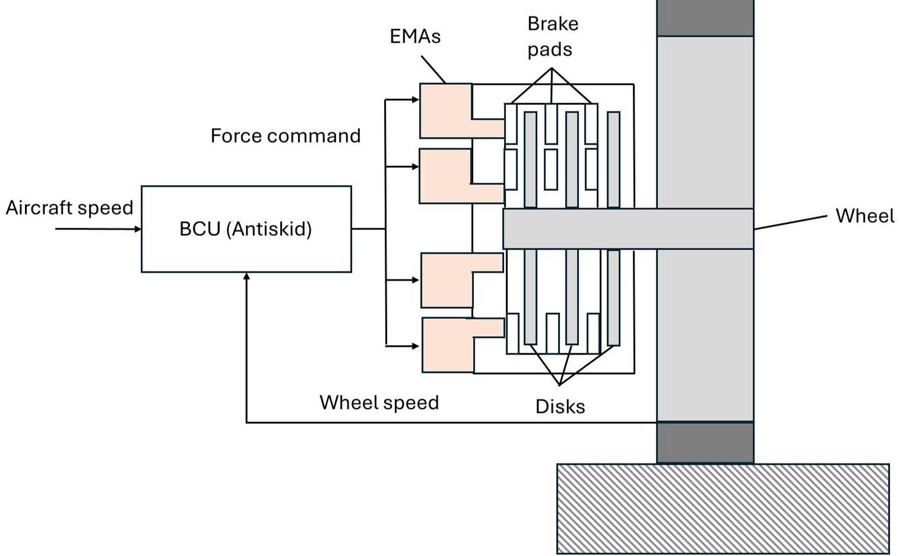

Figure 1. Case study architecture.

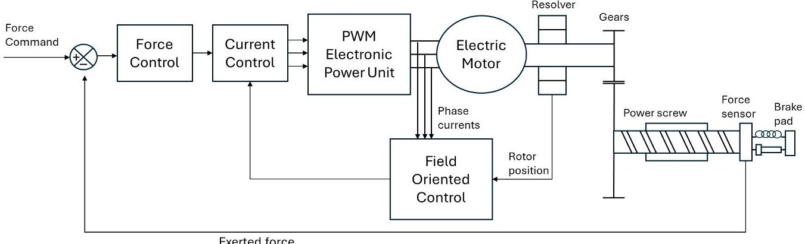

Figure 2. EMA scheme.

## 3. Methodology

The methodology developed in this study followed a simulation-driven approach aimed at supporting the design of a Prognostics and Health Management (PHM) framework

<!-- PDF_PAGE: 4 -->

for electro-mechanical brakes. The process began with the identification of brake pad wear as the target degradation mechanism and continues with the definition of suitable health indicators from available system signals. A high-fidelity model was then used to generate a synthetic dataset under variable operating conditions, providing a statistically representative basis for the design and assessment of the prognostic routines. On this foundation, a particle-filtering algorithm was implemented to estimate the degradation state after each landing and to predict the Remaining Useful Life by propagating possible future usage scenarios. The overall procedure is summarized in Figure 3, which outlines the sequential flow from degradation identification, through data simulation and generation, to tracking of degradation and RUL estimation.

Design of a PHM algorithm for an electro-mechanical brake

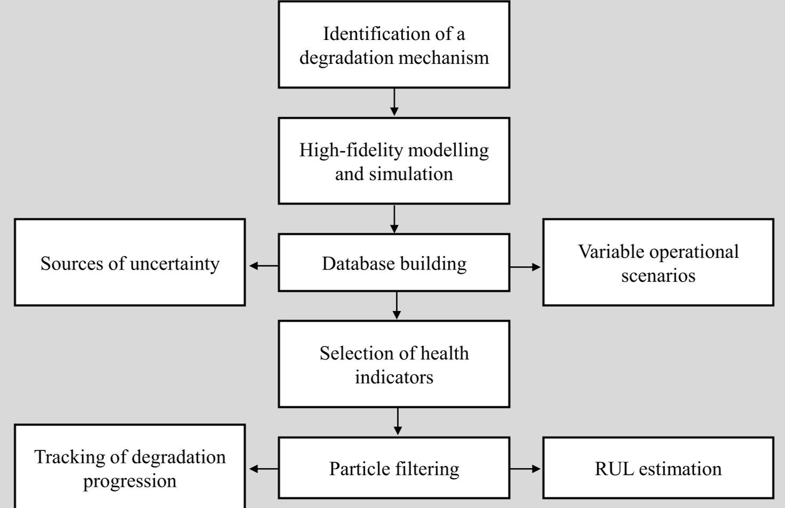

Figure 3. Flowchart of the proposed PHM design methodology.

## 4. System Modelling

A high-fidelity model of the electro-mechanical brake system is required to reproduce both nominal behavior and degradation mechanisms. In this study, the term 'high-fidelity' denotes a multi-domain modelling approach that integrates non-linear mechanical, electrical, and thermal dynamics to achieve a significantly more detailed representation than standard transfer-function models. While secondary structural dynamics (e.g., high-frequency vibrations of the landing gear strut) are approximate to maintain computational efficiency, the primary dynamics driving the wear degradation, specifically the motor electrical response, the mechanical transmission compliance, and the friction interface, are modelled with high granularity. This ensures that the prognostic features extracted from the simulation remain representative of the physical system's behavior. Furthermore, critical sub-systems such as the tire-runway interaction are quantitatively validated against

<!-- PDF_PAGE: 5 -->

experimental benchmarks (as detailed in Table 1) to ensure realistic behavior. The model integrates aircraft longitudinal dynamics, wheel rotation, tire-runway interaction, and actuator and brake assembly behavior, as well as thermal and wear phenomena. This comprehensive framework enables realistic simulations of landing and braking operations, providing the basis for PHM algorithm development and validation.

Table 1. Performance of the quadratic surface fitting.

<table border="1"><tr><td>Scenarios</td><td>SSE</td><td>R2</td><td>AdjR2</td><td>RMSE</td></tr><tr><td>Smooth tires on dry asphalt</td><td>0.0010</td><td>0.9976</td><td>0.9973</td><td>0.0050</td></tr><tr><td>Threaded tires on wet asphalt</td><td>0.0084</td><td>0.9941</td><td>0.9933</td><td>0.0147</td></tr><tr><td>Smooth tires on wet asphalt</td><td>0.0228</td><td>0.9892</td><td>0.9879</td><td>0.0242</td></tr></table>

Starting with the vertical dynamics of the main landing gear [16], the wheel mass m is subject to the vertical force exchanged between the wheel and the runway $ F_{n} $ and the force from the shock absorber $ F_{leg} $ , approximated in the model as half the aircraft's total weight.

$$
\left\{ \begin{array}{c} F _ {n} = k _ {t} \left(x _ {w} - x _ {r w}\right) + c _ {t} \left(\dot {x _ {w}} - \dot {x _ {r w}}\right) \\ m \ddot {x _ {w}} + m g + F _ {l e g} + F _ {w h e e l} = 0 \end{array} \right.
$$

Referring to Figure 4, which shows the rotational dynamics of the wheel, it is possible to express the wheel angular acceleration $ \dot{\vartheta}_{w} $ as a function of the rolling friction coefficient u, expressed as a function of the wheel angular frequency and of the tire pressure [17] of the moment of inertia of the wheel assembly Iw, the wheel diameter Dw and the viscous friction coefficient that is roughly representative of the dissipation in the wheel supports cw.

$$
F _ {n} \mu \left[ \frac {D _ {w}}{2} - \left(\left(x _ {l e g} - x _ {r w}\right)\right)\right] \operatorname {s i g n} (\lambda) - F _ {n} u \tanh \left(\dot {\vartheta} _ {w}\right) - c _ {w} \dot {\vartheta} _ {w} - T _ {b r k} = I _ {w} \ddot {\vartheta} _ {w}
$$

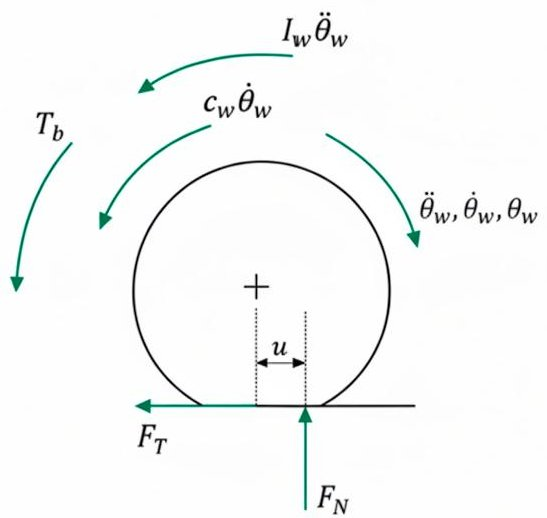

Figure 4. Free-body diagram of the wheel rotational dynamics.

In Equation (2), $ \mu $ represents the instantaneous tire-runway friction coefficient. Its value is not constant but is evaluated dynamically according to a modified version of the Burckhardt model [18] as a non-linear function of the slip ratio $ \lambda $ , defined as:

$$
\lambda = \frac {V - \omega_ {w} R}{V}
$$

where R is the wheel effective rolling radius. The Burckhardt formulation is expressed as:

$$
\mu = \mu_ {0} (\lambda) \mu_ {m a x} \left(p _ {t i r e}, v _ {a i r}\right)
$$

<!-- PDF_PAGE: 6 -->

The first term is defined as:

$$
\mu_ {0} (\lambda) = \left[ \beta_ {1} \left(1 - e ^ {- \beta_ {2} \lambda}\right) - \beta_ {3} \lambda \right]
$$

where the parameters $ \beta_{1},\beta_{2} $ , and $ \beta_{3} $ depend on tire temperature, tread type, and runway conditions. Figure 5 shows the relation between $ \mu_{0} $ and $ \lambda $ for different runway conditions.

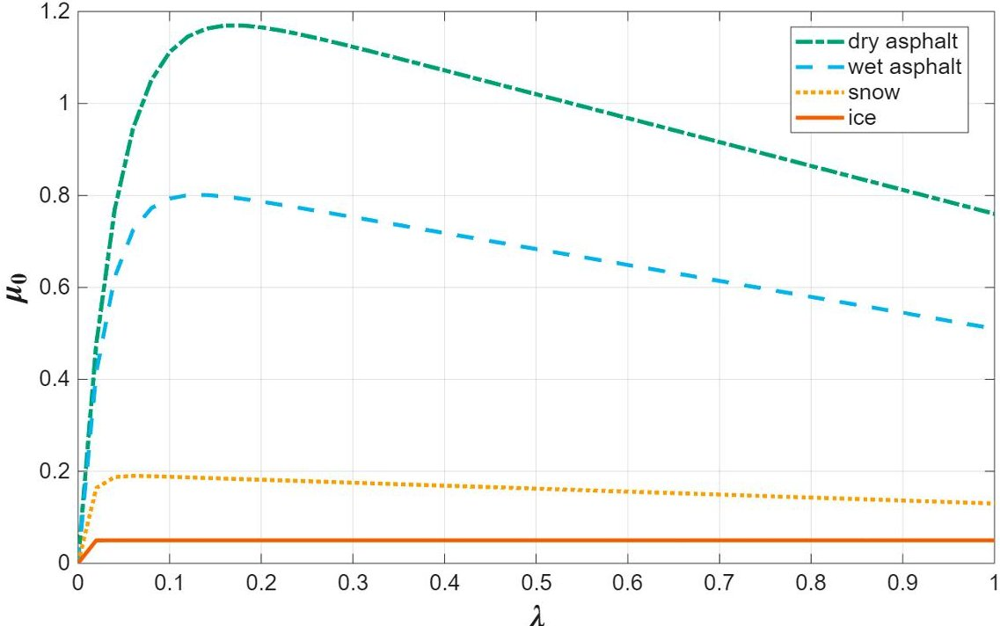

Figure 5. $ \mu_{0} (\lambda) $ for different runway conditions.

The second term is a function of the tire pressure and of the aircraft speed, expressed as:

$$
\mu_ {m a x} \left(p _ {t i r e}, v _ {a i r}\right) = a _ {0 0} + a _ {1 0} v _ {a i r} + a _ {0 1} p _ {t i r e} + a _ {2 0} v _ {a i r} ^ {2} + a _ {1 1} v _ {a i r} p _ {t i r e} + a _ {0 2} p _ {t i r e} ^ {2}
$$

It consists of a second-order (quadratic) polynomial surface used for fitting the experimental dataset provided for different combinations of thread type and runway conditions for an aircraft of similar size to the target platform. Figure 6 shows the fitting surfaces, while Table 1 summarizes the performance of the quadratic surface fitting. The conditions analyzed are smooth tires on dry asphalt, threaded tires on wet asphalt and smooth tires on wet asphalt.

All models exhibited excellent agreement with experimental data, with R-square $ ( R^{2} ) $ values ranging from 0.9892 to 0.9976. Specifically, the fitting related to the dry-asphalt scenario provides the highest accuracy, characterized by the lowest Root Mean Square Error (RMSE) and a negligible difference between the R-square and the adjusted R-square values, indicating a robust estimation without overfitting. Although a slight increase in the Sum of Squares Due to Error (SSE) is observed for the other scenarios, the adjusted R-square remains consistently above 0.987, validating the suitability of the second-order polynomial model across all tested conditions.

The four Electro-Mechanical Actuators (EMAs) responsible for the braking action are controlled in force and act in parallel on the multi-disk brake. The dynamic modelling of the EMAs is derived from established methodologies employed for analogous systems operating as flight control actuators [19,20]. The control system is described as two-nested control loops, where a sequence of proportional-integrative controllers operate on the force control loop and on the current control loop of each brushless motor. The sensors are modelled through second-order transfer functions replicating the expected dynamics of

<!-- PDF_PAGE: 7 -->

the load cell and of the Hall-effect sensors employed to monitor the angular position of the brushless DC rotor. The simulation of the measure chain is complete with the model of the employed A/D converters. The dynamic model of each EMA features a functional description of the electronic power converter derived from [21] for a three-phase inverter controlled through Pulse Width Modulation (PWM). The electrical dynamics of the motor are described according to a streamlined three-phase model of the system, where $ V_{a,b,c} $ and $ i_{a,b,c} $ are the phase voltages and currents.

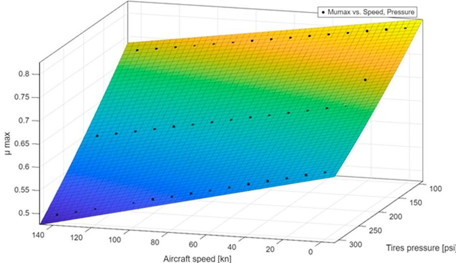

(a)

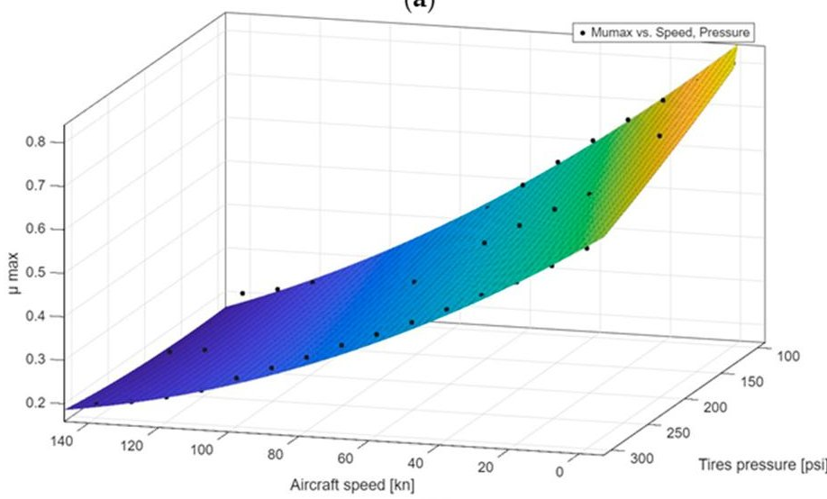

(b)

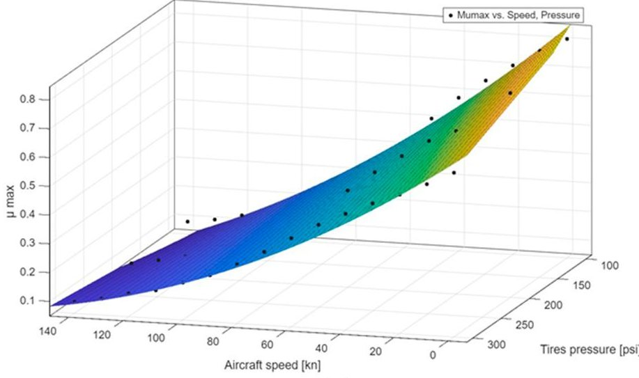

(c)

Figure 6. $ \mu_{max} $ as a function of the tire pressure and of the aircraft speed: (a) fitting surface for smooth tires on a dry runway; (b) fitting surface for threaded tires on a wet runway; (c) fitting surface for smooth tires on a wet runway.

<!-- PDF_PAGE: 8 -->

$$
[ V _ {a, b, c} ] = [ \boldsymbol {R} _ {a, b, c} \left(T _ {w}\right) ] \left[ i _ {a, b, c} \right] + [ \boldsymbol {L} \left(T _ {w}\right) ] \frac {d}{d t} \left[ i _ {a, b, c} \right] + \frac {d}{d t} \left[ \phi_ {a, b, c} \left(\vartheta_ {e l}\right) \right]
$$

where $ [ R_{a,b,c} ] $ is the electric resistance matrix, the elements of which depend on the windings' temperature $ ( T_{w} ) $ . The diagonal elements of the matrix represent the single-phase resistance, while the non-diagonal terms represent the phase-to-phase resistance. Such values can be degraded to simulate the effects of a turn-to-turn or phase-to-phase short respectively. $ [ L ] $ is the inductance matrix, accounting for self-induction and mutual induction phenomena along with the effect of magnetic flux dispersion. For each phase, the windings' temperature $ T_{w} $ is estimated by

$$
\left\{ \begin{array}{l} R i ^ {2} - \frac {\left(T _ {w} - T _ {h}\right)}{R _ {t h , w}} = C _ {t h, w} \frac {d T _ {w}}{d t} \\ \frac {\left(T _ {w} - T _ {h}\right)}{R _ {t h , w}} - \frac {\left(T _ {h} - T _ {e x t}\right)}{R _ {t h , h}} = C _ {t h, h} \frac {d T _ {h}}{d t} \end{array} \right.
$$

where $ T_{h} $ refers to the housing temperature, while the thermal resistances and capacitances have been tuned considering the maximum admissible temperature inside the electric motor equal to $ 1 0 0 \, ^ {\circ} \mathrm{C} $ [22].

Finally, $ [\phi_{a,b,c} ] $ is the concatenated magnetic flux provided by the permanent magnets and is a function of the electrical angle $ \vartheta_{el} $ . The torque at the motor shaft can then be computed, leading to the dynamic equilibrium of the rotor

$$
\sum_ {a, b, c} \frac {d \phi}{d t} i _ {a, b, c} - c \dot {\vartheta} _ {m} - k _ {m} \left(\vartheta_ {m} - \vartheta_ {g b}\right) - c _ {m} \left(\dot {\vartheta} _ {m} - \dot {\vartheta} _ {g b}\right) = I _ {m} \ddot {\vartheta} _ {m}
$$

where $ \vartheta_{m} $ and $ \vartheta_{gb} $ are the angular position of the motor shaft and of the gears. Im is the moment of inertia of the rotor, while $ k_{m} $ and $ c_{m} $ address the torsional stiffness of the motor shaft and its associated damping. The gear pair is described as a rotational mass-spring damper system, thus leading to the following equation

$$
k _ {m} \left(\vartheta_ {m} - \vartheta_ {g b}\right) + c _ {m} \left(\dot {\vartheta} _ {m} - \dot {\vartheta} _ {g b}\right) - \frac {1}{\tau} \left[ k _ {g b} \left(\vartheta_ {g b} - \vartheta_ {r s}\right) + c _ {g b} \left(\dot {\vartheta} _ {g b} - \dot {\vartheta} _ {r s}\right) \right] - T _ {f r, g b} = I _ {g b} \ddot {\vartheta} _ {g b}
$$

where $ \tau $ is the transmission ratio, $ T_{fr,gb} $ the friction torque, while $ \vartheta_{rs} $ is the angular position of the rotating part of the screw. The friction torque is computed as the sum of three components, one dependent on the acting load, one related to the viscous friction and a drag torque component. The power screw is modelled as a two-degrees-of-freedom element, where the rotating part is connected to the translating element through a viscoelastic element. Defining with $ x_{rs,i} $ the position of the translating portion of the screw pertaining to the i-th actuator, it becomes possible to describe the brake dynamics and thus that of the pads. Addressing with $ k_{eb} $ the stiffness and the damping $ c_{eb} $ , it is possible to evaluate the braking torque acting on the landing gear wheel as a function of the translating mass of the brake pads $ m_{eb} $ , its translation $ x_{eb} $ and the angular speed of the wheel $ \dot{\vartheta}_{w} $ as

$$
\left\{ \begin{array}{l l} T _ {b r k} = 0 & \text {i f} x _ {e b} < x _ {t h r} \\ T _ {b r k} = R _ {e b} f _ {e b} \left[ k _ {e b} \left(x _ {e b} - x _ {t h r}\right) - c _ {e b} \left(\dot {x} _ {e b}\right) \right] n _ {fric, s u f} & \text {i f} x _ {e b} \geq x _ {t h r} \end{array} \right.
$$

where $ f_{eb}=f_{eb}(\vartheta_{w}) $ is the friction coefficient between the brake pads and disk, which is a function of the wheel angular frequency and the number of friction surfaces in contact $ n_{fric,suf} $ . Knowing the braking torque and the wheel angular frequency, it is possible to compute the mechanical power transformed into heat by the braking process. Such power

<!-- PDF_PAGE: 9 -->

is used within a simplified thermal model of the E-Brake assembly to estimate at each time step the temperature of the pads $ T_{brake} $ and of the brake case $ T_{case}. $

$$
\left\{ \begin{array}{l} P _ {f r} - \frac {\left(T _ {b r a k e} - T _ {c a s e}\right)}{R _ {b r , c}} = C _ {b r a k e} \frac {d T _ {b r a k e}}{d t} \\ \frac {\left(T _ {b r a k e} - T _ {c a s e}\right)}{R _ {b r , c}} - \frac {\left(T _ {c a s e} - T _ {a m b}\right)}{R _ {a m b , c}} = C _ {c a s e} \frac {d T _ {c a s e}}{d t} \end{array} \right.
$$

where the total braking power $ P_{fr} $ is assumed to be entirely converted into heat (neglecting secondary dissipative phenomena such as noise and vibrations for simplification purposes), $ C_{brake} $ and $ C_{case} $ are the thermal capacities of the pads and the case, $ R_{br,c} $ and $ R_{amb,c} $ are the thermal resistances of the pads and the housing, and $ T_{amb} $ is the ambient temperature. Since the pads contact the brake disks only when their translation $ x_{eb} $ overcomes a predefined stroke equal to $ x_{thr} $ , it is possible to model the effects of the pads' wear by properly increasing the threshold value under the assumption that the brake pads return to the original position once the braking procedure is finished. According to [23,24], wear progression in brake pads can be described as dependent on an experimental coefficient $ f_{wear} $ and $ K_{wear} $ , a function of the local absolute temperature T, the sliding velocity between disks and pads v, and the contact pressure p. While this formulation provides a physics-based description of the degradation process accounting for thermal and load severities, it is acknowledged as a macroscopic approximation. Since experimental tribological data for the specific prototype material is not yet available, the wear coefficients in this study are derived from the literature on similar friction pairs [23,24] and are treated as stochastic variables within the simulation. This approach allows for the assessment of the algorithm's robustness against parameter uncertainty, pending the calibration of the coefficients via an upcoming experimental campaign.

$$
\Delta x _ {t h r} = \int_ {t} f _ {w e a r} (T) K _ {w e a r} (T) v (t) p (t) d t
$$

Expressing the sliding velocity as a function of the wheel angular frequency $ \dot{\vartheta}_{w} $ and the radial coordinate of the pads with respect to the wheel axis $ R_{pad} $ , we have

$$
v = \dot {\vartheta} _ {w} R _ {p a d}
$$

The average pressure within the pads/disks contact area can be computed as a function of the braking force exerted by the four actuators and the pad contact area as follows:

$$
p = \frac {k _ {e b} \left(x _ {e b} - x _ {t h r}\right) - c _ {e b} \left(\dot {x} _ {e b}\right)}{A _ {p a d}}
$$

## 5. Simulation Activities

The simulation model is developed with two main objectives: to generate a database for training and validating the PHM routines and to support the characterization of the system by providing additional information that may be useful to the PHM framework itself. The entire high-fidelity dynamic model, including the mechanical, electrical, and thermal sub-systems, along with the particle-filtering framework, was developed and simulated within the MATLAB R2022a/Simulink computational environment. The first step in defining a reliable operational scenario is the characterization of all potential sources of uncertainty affecting the system's behavior. The following sources of uncertainty were identified and modelled for the case study under analysis: aircraft mass at landing, runway temperature and conditions, tire type (smooth or treaded) and pressure, aircraft horizontal approach speed, type of braking procedure (emergency or normal), production tolerances

<!-- PDF_PAGE: 10 -->

within the E-Brake system, pilot reaction time, sensor noise, and deviations. In particular, the first ones are expected to have the most significant impact on E-Brake performance. The aircraft speed and mass at landing directly influence the total kinetic energy that must be dissipated by the braking system, whereas the operating conditions, tire type and inflation pressure determine the efficiency with which the braking torque generated by the electro-mechanical device is transferred to the runway surface.

## 5.1. Variables and Case Scenarios

The aircraft mass at landing is randomly sampled for each simulation from a uniform distribution ranging between approximately 5.5 and 6.1 tons. This range accounts for variations due to the number of passengers, payload presence and type, and residual fuel quantity. Runway temperature and surface conditions are considered by analyzing temperature and rainfall distributions from three representative geographical areas, corresponding respectively to predominantly cold (Vancouver), hot (Dubai), and temperate (Rome) climates. Data were obtained from publicly available databases and randomly selected at each simulation run. The tire type is chosen randomly between treaded and smooth configurations, while tire pressure is sampled from a normal distribution with a mean value of 200 psi and a standard deviation of 30 psi. The aircraft horizontal approach speed is randomly drawn from a normal distribution with a mean of 110 knots and a standard deviation of 5 knots. The braking procedure type, either emergency or normal, is defined before each simulation. During emergency braking, the pilot commands the E-Brake to deliver its maximum force, while the anti-skid routine modulates the braking torque to maintain the slip ratio corresponding to the maximum friction coefficient achievable between the wheel and the runway. Conversely, under normal braking conditions, the pilot modulates the force command to replicate the deceleration profile derived from a set of experimental data provided by the project's industrial partners for an aircraft of comparable size. An example of the difference between the two braking procedures is provided in Figure 7. The figure illustrates two aircraft decelerated down to 16 knots, which is the taxiing speed limit on most civil runways. Also, the pilot request can be seen together with the actuator displacement, the force signal modulated by the anti-skid system compared with the force from one actuator (both expressed as a percentage of the maximum E-Brake force) and the phase currents from one electric motor.

Figure 8 illustrates the initial phase of the braking maneuver, highlighting the relationship between the pilot command, the extension of the actuators (only one actuator in figure), and the onset of pad-disc contact. The forces are expressed as a percentage of the maximum brake force. At the beginning, the pilot applies a braking request that is transmitted to the E-Brake system as a force command by the antiskid system. In response, the four Electro-Mechanical Actuators begin to extend, moving through the free-stroke region until reaching the mechanical end stop. During this interval, no braking torque is generated, as the brake pads have not yet engaged the disc. Once the actuators complete the free stroke and the pads touch the rotating surfaces, the braking force rapidly increases, marking the transition from the approach phase to the effective torque-generation phase.

Another uncertainty source related to brake performance is the pilot reaction time, which is modelled as a simple transport delay with a time-constant variable between 0.1 and 0.5 s. Additional sources of uncertainty affecting the E-Brake signals potentially exploitable for PHM include production tolerances, which are superimposed on the main electrical and mechanical parameters of the EMAs, and sensor noise, which is modelled according to the specifications provided in the manufacturers' catalogues.

<!-- PDF_PAGE: 11 -->

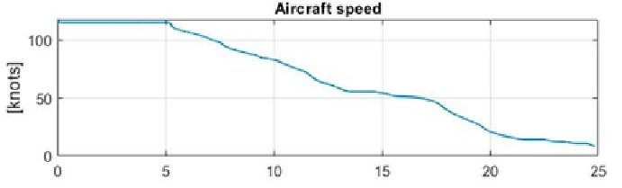

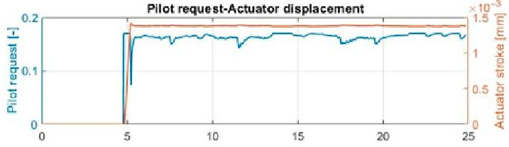

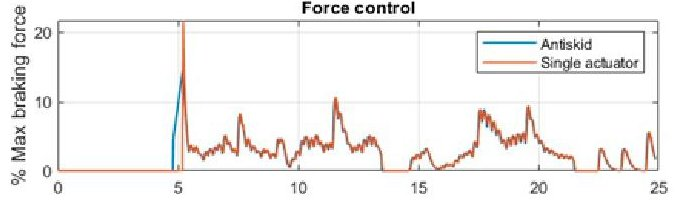

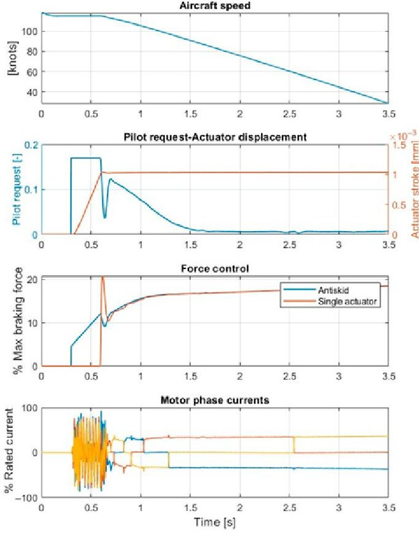

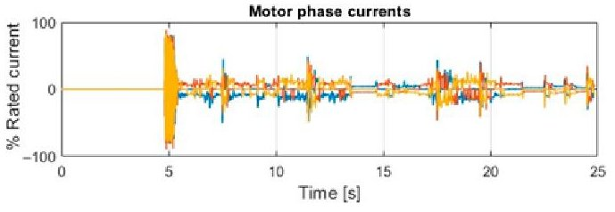

(a)

(b)

Figure 7. Simulation results for different braking conditions. (a) Normal braking; (b) emergency braking.

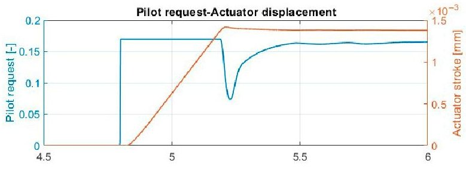

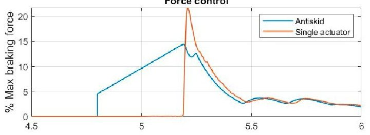

Figure 8. Start of braking procedure.

## 5.2. Database Building

To properly characterize the behavior of the system, the analysis focuses on emergency braking maneuvers, which are not influenced by pilot actions and therefore allow for isolation of the intrinsic dynamics of the E-Brake system. Since the available experimental data is limited, the baseline database is primarily constructed from high-fidelity simulations. The analysis of the simulation results highlighted that certain factors, such as runway condition and tire type, can be used to define statistical distributions for key parameters, which in turn serve as the foundation for constructing the baseline database. For instance, considering the braking distance, defined as the distance required for the aircraft to decelerate up to taxiing speed during an emergency braking event, three representative distributions were identified, as shown in Figure 9. Under dry-asphalt conditions, the braking distance ranges

<!-- PDF_PAGE: 12 -->

from 140 to 170 m. In the case of wet asphalt combined with smooth-tread tires, the range increases significantly, falling between 300 and 360 m. The longest distances are observed for wet-asphalt conditions with ribbed-tread tires, where the braking distance ranges from 410 to 480 m.

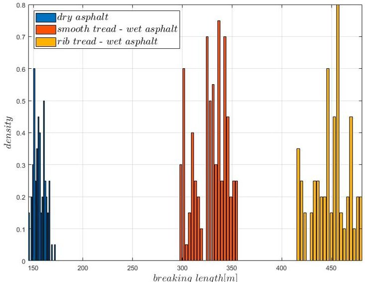

Figure 9. Braking distance distribution.

Table 2 reports the statistical parameters of the braking length distributions for each simulated scenario, including the mean, median, standard deviation, interquartile range, coefficient of variation, and minimum and maximum values.

Table 2. Braking distance.

<table border="1"><tr><td>Scenario</td><td>Mean</td><td>Median</td><td>Std Dev</td><td>IQR Val</td><td>CV</td><td>Min</td><td>Max</td></tr><tr><td>Dry</td><td>156.29</td><td>155.43</td><td>5.89</td><td>9.44</td><td>0.0377</td><td>144.83</td><td>172.24</td></tr><tr><td>Wet+Smooth</td><td>328.39</td><td>330.23</td><td>16.388</td><td>26.63</td><td>0.0499</td><td>297.03</td><td>356.1</td></tr><tr><td>Wet+Ribbed</td><td>449.09</td><td>452.34</td><td>17.80</td><td>21.17</td><td>0.0396</td><td>415</td><td>481.39</td></tr></table>

A similar trend is observed for the maximum temperature reached by the brake pads, as shown in Figure 10. When braking on dry asphalt, the temperature varies between $ 2 9 0 \, ^ {\circ} \mathrm{C} $ and $ 3 2 0 \, ^ {\circ} \mathrm{C} $ . For wet-asphalt conditions with ribbed-tread tires, the temperature ranges from $ 2 6 0 \, ^ {\circ} \mathrm{C} $ to $ 2 8 0 \, ^ {\circ} \mathrm{C} $ , while with smooth-tread tires it decreases further, falling between $ 2 4 0 \, ^ {\circ} \mathrm{C} $ and $ 2 6 0 \, ^ {\circ} \mathrm{C} $ .

Table 3 reports the statistical parameters of the distributions of the maximum temperature of the brake for each simulated scenario.

Table 3. Brake temperature.

<table border="1"><tr><td>Scenario</td><td>Mean</td><td>Median</td><td>Std Dev</td><td>IQR Val</td><td>CV</td><td>Min</td><td>Max</td></tr><tr><td>Dry</td><td>303.35</td><td>302.48</td><td>6.67</td><td>7.93</td><td>0.022</td><td>290.71</td><td>321.42</td></tr><tr><td>Wet+Smooth</td><td>252.37</td><td>251.78</td><td>4.94</td><td>6.28</td><td>0.0196</td><td>243.43</td><td>261.69</td></tr><tr><td>Wet+Ribbed</td><td>268.5</td><td>267.41</td><td>5.69</td><td>9.09</td><td>0.0212</td><td>259.27</td><td>279.71</td></tr></table>

As for the angular displacement of the motor, the values tend to decrease with worsening runway conditions, as shown in Figure 11 On dry asphalt, the displacement varies between 65.8 and 66.4 radians. This range shifts to between 65.6 and 65.7 radians under wet conditions with ribbed-tread tires and further reduces to between 65.5 and 65.6 radians with smooth-tread tires on wet asphalt. Overall, the runway conditions do not have a significant impact.

<!-- PDF_PAGE: 13 -->

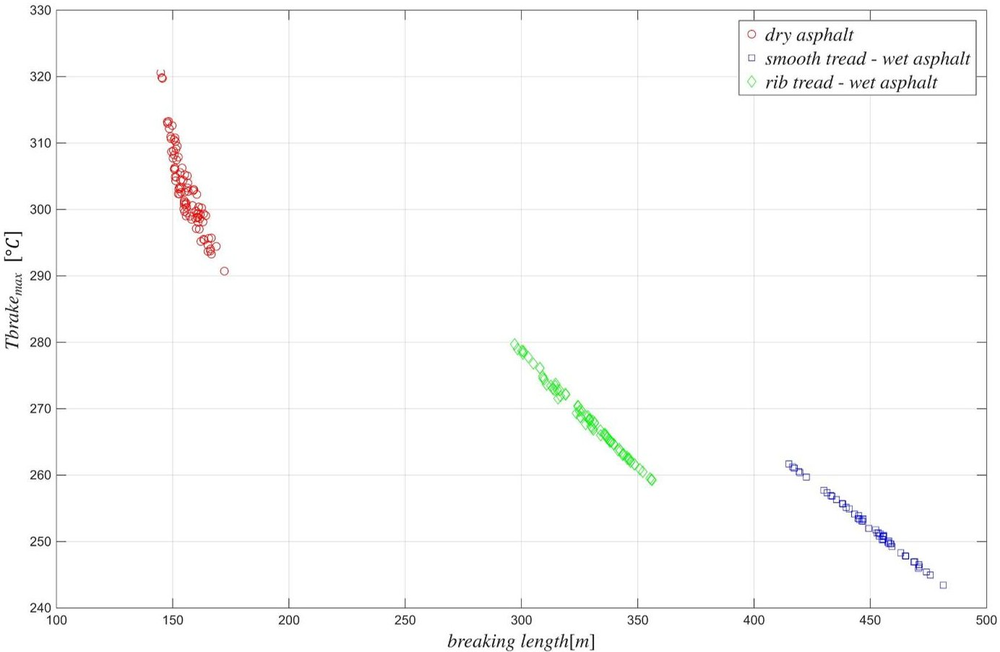

Figure 10. Brake temperature distribution.

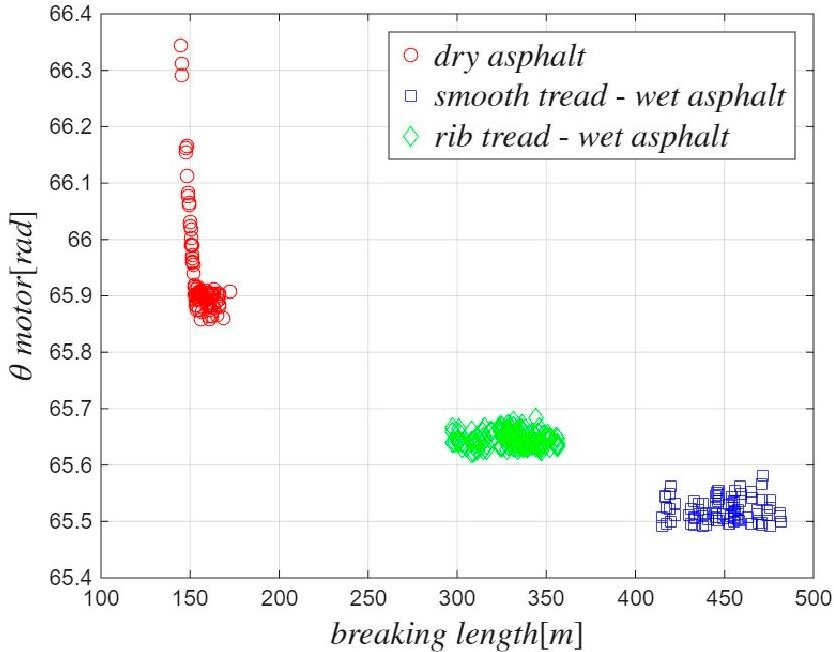

Figure 11. Motor angular displacement distribution.

Lastly, the friction coefficient $ \mu_{max} $ is primarily influenced by the runway conditions, as shown in Figure 12. On dry asphalt, it ranges from 0.92 to 0.70, whereas on wet asphalt, it decreases significantly, ranging from 0.60 to 0.45.

Table 4 reports the statistical parameters of the friction coefficient $ \mu_{max} $ distributions for each simulated scenario.

The definition of the baseline database represents a fundamental step for the subsequent PHM development. It provides a consistent and statistically meaningful reference that captures the variability in the operational and environmental parameters affecting the E-Brake's performance. This dataset serves both as a benchmark for the evaluation of the diagnostic and prognostic algorithms and as a foundation for generating synthetic degradation scenarios in future stages of the analysis.

<!-- PDF_PAGE: 14 -->

Building upon this baseline, the next stage of the work focuses on the design and implementation of the PHM algorithms, aimed at detecting and predicting degradation phenomena within the E-Brake system through the analysis of the simulated data.

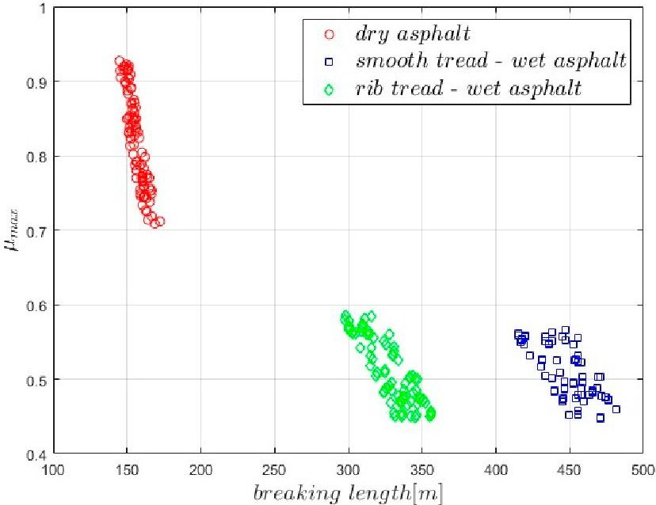

Figure 12. Friction coefficient distribution.

Table 4. Friction coefficient.

<table border="1"><tr><td>Scenario</td><td>Mean</td><td>Median</td><td>Std Dev</td><td>IQR Val</td><td>CV</td><td>Min</td><td>Max</td></tr><tr><td>Dry</td><td>0.822</td><td>0.829</td><td>0.0641</td><td>0.108</td><td>0.0780</td><td>0.709</td><td>0.923</td></tr><tr><td>Wet+Smooth</td><td>0.506</td><td>0.502</td><td>0.0355</td><td>0.072</td><td>0.0702</td><td>0.448</td><td>0.566</td></tr><tr><td>Wet+Ribbed</td><td>0.509</td><td>0.4941</td><td>0.0435</td><td>0.073</td><td>0.0855</td><td>0.449</td><td>0.586</td></tr></table>

## 5.3. Feature Selection

The first step in the feature selection process consists of comparing the data obtained from simulations under degraded conditions with those obtained under healthy (baseline) conditions. This comparison allows for identifying how degradation affects the measured signals. Once the signals potentially correlated with the progression of the fault investigated have been identified, the correlated quantities that can act as features are selected. To achieve this, a sufficiently large dataset must be collected. The required data are obtained by performing several simulations such that a cumulative wear level of approximately 50% is reached, as defined by the implemented wear model. Based on the simulation campaign, the features are then analyzed by deriving their probability distributions as a function of the fault severity. The correlation between each feature and the wear progression is evaluated by means of the Pearson correlation [25], which quantifies the strength and direction of the linear relationship between two variables. It is defined as the ratio between their covariance and the product of their standard deviations. A value close to +1 indicates a strong positive linear correlation, meaning that the feature increases with the fault progression; a value close to -1 indicates a strong negative linear correlation, while a value close to zero denotes the absence of a linear relationship. Finally, for a feature to be considered effective, it must exhibit low sensitivity, or only limited response, to factors unrelated to fault progression. Such factors may include ambient temperature, tire pressure, aircraft mass or small variations and dispersions in the parameters defining the model. To evaluate the sensitivity of each feature to these external factors, the Signal-to-Noise Ratio (SNR) is calculated. A higher SNR value indicates a lower dependency of the signal on external influences, since the contribution of variance (high when the signal is affected by

<!-- PDF_PAGE: 15 -->

fluctuations of external parameters) is reduced. Consequently, features with a high SNR are considered more robust and reliable indicators of degradation [26].

Among the analyzed quantities shown in Table 5, the maximum angular displacement of the electric motor has been identified as one of the most representative features, showing a clear and consistent correlation with the wear progression. From a kinematic perspective, this strong correlation is physically sound: as the brake pads wear down, the clearance between the pads and the disk increases. Consequently, the EMA ball-screw mechanism must travel a longer linear stroke to engage the disk and apply the required force, which strictly dictates a proportionally larger angular rotation from the electric motor. As shown in Figure 13, this feature is also not affected by variations in the operating conditions nor by the braking procedure (emergency or normal).

Table 5. Analyzed features.

<table border="1"><tr><td>Features</td><td>Pearson&#x27;s Correlation Coefficient</td><td>SNR Wear 20%</td><td>SNR Wear 40%</td></tr><tr><td>Max angular position of electric motor</td><td>1</td><td>53.71</td><td>54.99</td></tr><tr><td>Mean speed of electric motor</td><td>0.97</td><td>6.27</td><td>6.51</td></tr><tr><td>Overshoot % of actuator force</td><td>0.96</td><td>6.88</td><td>6.96</td></tr><tr><td>Overshoot of actuator force</td><td>0.99</td><td>21.99</td><td>22.76</td></tr><tr><td>Max current</td><td>0.99</td><td>24.5</td><td>22.44</td></tr></table>

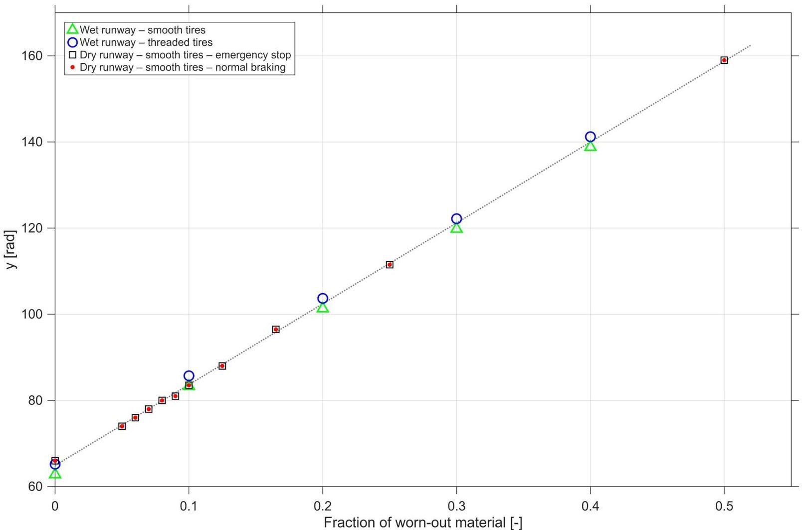

Figure 13. Dependency of the proposed feature on external factors and on degradation progression.

## 6. PHM Algorithm

The PHM algorithm developed for brake pad wear follows the scheme shown in Figure 14. The whole architecture is designed to exploit the physical knowledge of the system while incorporating historical data from past E-Brake operations, enabling a more

<!-- PDF_PAGE: 16 -->

accurate characterization of the uncertainty distributions. Since the algorithm relies exclusively on signals that are intrinsically available from the standard EMA control sensors (i.e., in situ measurements such as motor angular position and phase currents), the entire framework is suitable for online implementation. In this context, "online" refers to an iterative, landing-by-landing execution, where the RUL estimation is automatically updated at the end of each flight cycle.

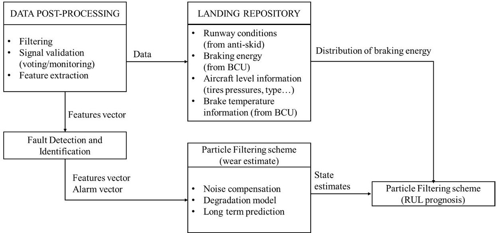

Figure 14. PHM scheme.

Prognosis is performed through a Bayesian estimation framework based on a particle filtering approach. After each landing, the algorithm updates the estimate of the current brake pad wear level using the indirect information contained in the quantities used in the wear model defined in Equation 13. This step, functionally part of the fault identification process, is necessary to achieve long-term prognosis through physics-driven equations by supplying the particle filter with state probability density functions (PDFs) of future usage of the brake based on previous information retrieved and stored after each landing. Particle filters, firstly introduced in PHM by [27], take advantage of a nonlinear process (fault/degradation) model to describe the expected dynamics of the fault progression and a measure model derived from the feature/wear progression dependence observed during the feature selection phase. Regarding the selection of the PHM method, the particle filtering (PF) approach was prioritized over purely data-driven strategies (e.g., LSTM-based models previously investigated in different contexts [28]) for several methodological reasons. Since the reference electro-mechanical brake is currently in a prototype phase, no statistically representative physical population was available to train data-driven architectures. In such conditions, models trained exclusively on synthetic data risk learning the underlying simulation assumptions rather than the actual system behavior. A physics-driven Bayesian estimator therefore provides greater robustness and reduces the potential for model bias. Moreover, brake pad wear exhibits inherently non-linear and potentially non-Gaussian dynamics, making particle filtering more suitable than linear Gaussian estimators (e.g., Kalman-based approaches) for accurately tracking degradation trajectories. Finally, this choice ensures architectural scalability: brake pad wear represents only one among multiple interacting failure modes (e.g., rotor degradation, sensor drift). The PF framework naturally accommodates state augmentation and probabilistic data fusion, maintaining engineering interpretability consistent with digital twin implementations [29].

<!-- PDF_PAGE: 17 -->

Prognosis through particle filtering is achieved by performing two sequential steps, prediction and filtering. Prediction uses both the knowledge of the previous state estimate and the process model to generate the a priori estimate of the PDFs for the next time instant

$$
p \left(x _ {0: t} \mid y _ {1: t - 1}\right) = \int p \left(x _ {t} \mid y _ {t - 1}\right) p \left(x _ {0: t - 1} \mid y _ {1: t - 1}\right) d x _ {0: t - 1}
$$

This expression usually does not have an analytical solution, requiring sequential Monte Carlo algorithms to be solved in real-time with efficient sampling strategies [30]. Particle filtering approximates the state PDF using samples or "particles" that have discrete probability masses (often called "weights") associated with them as follows:

$$
p \left(x _ {t} \mid y _ {1: t}\right) \approx \tilde {w} _ {t} \left(x _ {0: t} ^ {i}\right) \delta \left(x _ {0: t} - x _ {0: t} ^ {i}\right) d x _ {0: t - 1}
$$

where $ x_{0:t}^{i} $ is the state trajectory and $ y_{1:t} $ are the measurements up to time t. The simplest implementation of this algorithm, the Sequential Importance Re-sampling (SIR) particle filter [31], updates the weights using the likelihood of $ y_{t} $ as follows:

$$
w _ {t} = w _ {t - 1} p \left(y _ {t} \mid x _ {t}\right)
$$

Although this traditional particle-filtering technique has limitations, with regards to the description of the distribution's tails, and more advanced resampling schemes have been proposed [32], this technique was still considered valid for a purely preliminary analysis. Long-term fault evolution can be predicted by iterating the prediction step, allowing for the estimation of the probability of failure with respect to a hazard zone defined as an interval $ [ H_{lb}, H_{up} ] $ in the state domain. The probability of failure is computed by integrating the predicted state probability density function over this interval. From this, the RUL distribution and the associated risk function can be derived [33]. The declination of the particle filter employed in this paper is based on a physics-based degradation model and a process model describing the dependency between the worn-out thickness x of the brake pads and the selected features

$$
\left\{ \begin{array}{c} x _ {N + 1} = K _ {w e a r} \left(E _ {b r a k e N}\right) + x _ {N} + \omega (N) \\ y _ {N + 1} = f \left(x _ {N + 1}, \nu (N)\right) \end{array} \right.
$$

where $ K_{wear} $ is the wear constant, y is the feature and $ E_{brakeN} $ is the gross energy produced during the Nth landing. $ \omega(N) $ and $ \nu(N) $ are noises, estimated at each time step considering the probability distributions of the parameter and the accuracy of the process model through a certain number of previous steps.

The gross energy $ E_{brakeN} $ is estimated as follows and provides an indication of an energy proportional to the terms of the modified Archard equation provided in Equation (13), following the expression:

$$
E _ {b r a k e N} = r _ {e b r a k e} \int_ {t _ {0}} ^ {t _ {e n d}} \sum_ {i = 1} ^ {4} F _ {i} \omega_ {w} d t
$$

where $ F_{i} $ is the force exerted by each actuator and $ \omega_{w} $ is the wheel angular frequency. The feature y is defined as the maximum angular position of the EMA's motor identified in Section 5.3. To evaluate robustness, a structural model mismatch was intentionally introduced by adopting a simplified wear law within the particle filter, while the synthetic data were generated using a high-fidelity degradation model. In the latter, the wear coefficient depends on instantaneous temperature and pressure, whereas in the prognostic

<!-- PDF_PAGE: 18 -->

routine, it is treated as a stochastic parameter included in the state vector and estimated online. This modelling choice ensures that the estimator operates under realistic structural uncertainty rather than reproducing the deterministic data generation model. For each landing, the quantity $ E_{brake} $ is computed and memorized in a "landing repository", where it is stored along with related aircraft-level information, such as the aircraft weight at landing, for future usage. During the long-term prognosis, the "landing repository" database is used to build an array of possible future landings through random sampling. If an indication or provision of the area in which the aircraft is going to typically operate is available, a planned feature is to further refine the sampling procedure to account for the most probable weather conditions. It is worth noting that mechanical aging effects (e.g., increased backlash or stiffness reduction) operate on a significantly slower timescale compared to brake pad wear. Furthermore, the prognostic algorithm is designed to recalibrate the initial zero-wear reference $ (\Delta x_{thr}=0) $ at each maintenance interval (pad replacement). This procedure effectively compensates for the slow drift caused by actuator aging, allowing the PHM routine to focus exclusively on the faster dynamics of the friction material consumption. The prognostic algorithm is tested against 40 simulated fault-to-failure processes, where the wear of the brake pads evolves dynamically as a function of the system behavior and operating conditions (temperature, dynamic load, fluid pressure), with increasing number of particles $ N_{p} $ (from 50 to 5000), and it is evaluated according to the traditional metrics provided by [34], namely the prognostic horizon, evaluated as the first real RUL value for which the prognosis falls within a $ \pm 20\% $ threshold of the real RUL, and the Relative Accuracy, RA, defined as a function of the ground-truth value of the RUL $ \left( \mathrm{RUL}_{r} \right) $ and its expected RUL value.

$$
\mathrm {R A} = 1 - \frac {\left| \mathrm {R U L} _ {\mathrm {r}} - \mathrm {R U L} \right|}{\mathrm {R U L} _ {\mathrm {r}}}
$$

An example of the prognostic output is provided in Figure 15, where the system behavior is plotted against the number of simulated landing procedures $ N_{L} $

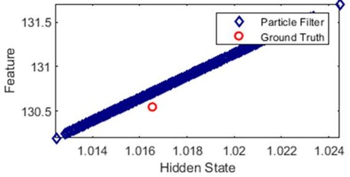

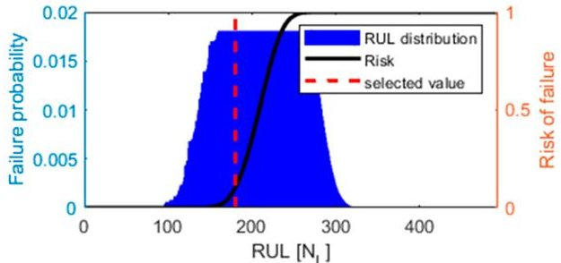

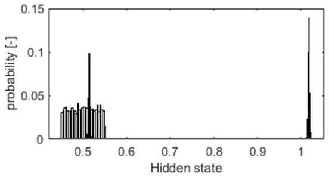

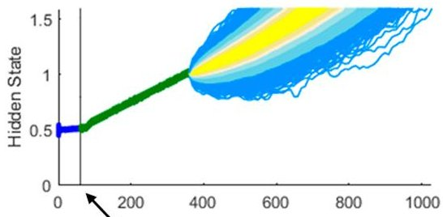

Fault detection

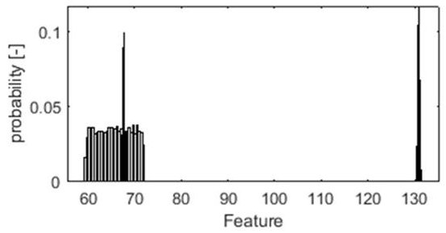

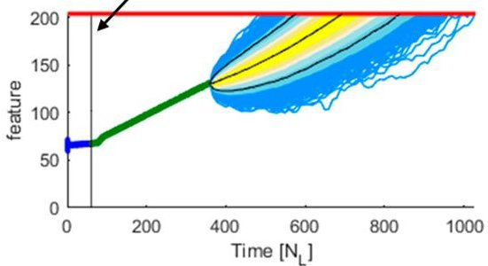

Figure 15. Prognostic performance against simulated dataset $ ( N_{p}=5 0 0 0) $ . The feature values are expressed in radians.

<!-- PDF_PAGE: 19 -->

The behavior of the particle-filtering algorithm is investigated in two steps: first, considering the "filtering" performances, thus evaluating whether the system can correctly assess the severity of the on-going degradation, and second, considering the long-term prognostic capabilities. Figure 16 depicts the behavior of the particle-filtering algorithm with respect to the simulated ground truth for the landing sequence already used for Figure 15, evidencing that the particle distribution considers the estimated values assumed by the hidden state (the linear measure of the brake pad wear progression) and the selected feature. This information is given considering four equidistant prediction instances, with indication of the considered simulated landing. It can be observed that the results of the particle-filtering routine are compatible with the simulated ground truth in all the shown cases, highlighting that the algorithm is able to coherently track the fault growth from the fault detection until imminent failure conditions.

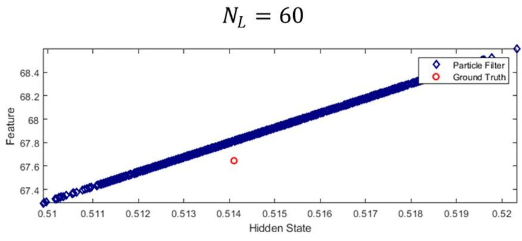

$ N_{L}=192 $

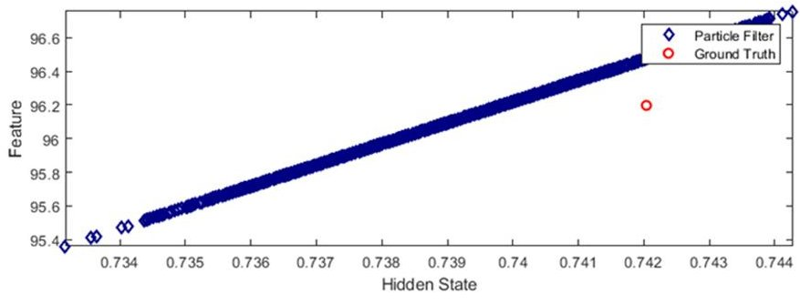

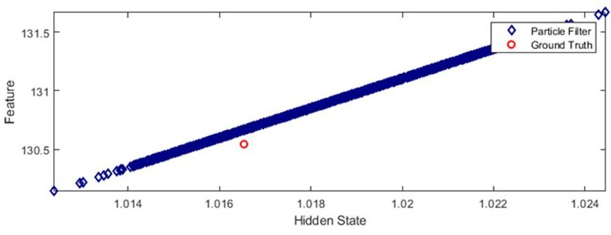

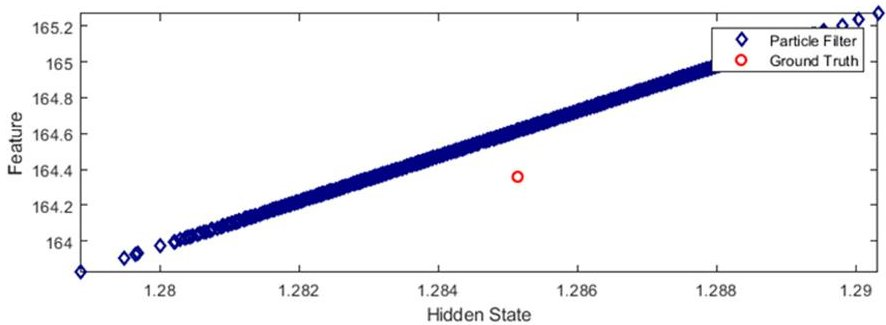

Figure 16. Comparison between PF and simulated ground truth during the filtering stage $ ( N_{p}=5 0 0 0) $ The feature values are expressed in radians.

<!-- PDF_PAGE: 20 -->

Figures 17 and 18 describe the algorithm behavior against the simulated ground truth from a prognostic perspective. The estimated RUL distribution is coherent with the ground-truth and achieves convergence towards the simulated end of life.

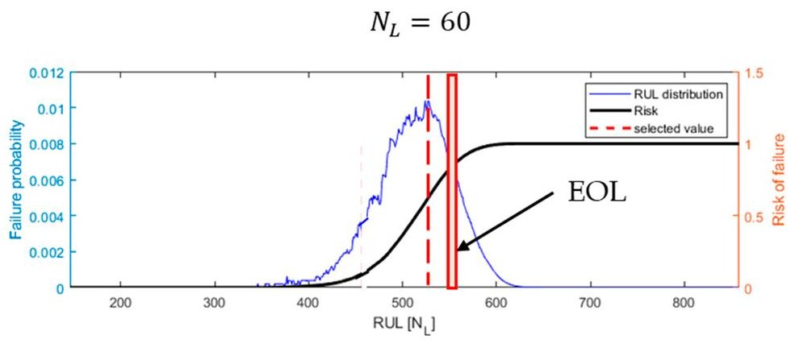

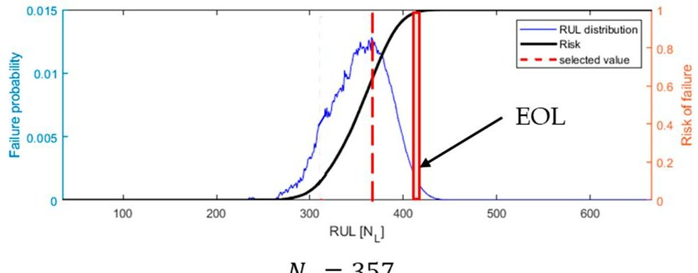

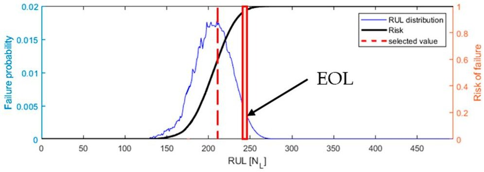

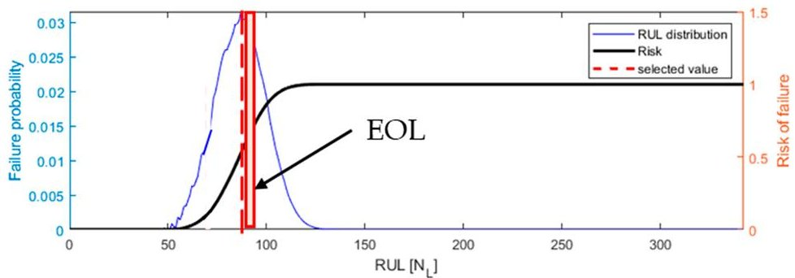

Figure 17. Comparison between estimated RULs at different prediction steps $ ( N_{p}=5 0 0 0, $ EOL=600 landings).

In Figure 17, the RUL distribution at each considered prediction step is depicted along with the selected value, corresponding to the RUL estimate with the highest probability of occurrence according to the algorithm. The ground-truth EOL, coming from the simulation dataset, is also provided. The results show that the real EOL always falls within the prediction distribution, in the near proximity of values of risk of failure equal to 1. While offering preliminary insights, a more rigorous approach would be to compare the predicted

<!-- PDF_PAGE: 21 -->

RUL distribution against a real RUL distribution; this figure attests that the algorithm converges to the EOL in the analyzed case, providing promising results.

This observation is confirmed by the $ \alpha $ - $ \lambda $ diagram in Figure 18. The small deviation of the expected RUL from the simulated ground truth close to EOL is attributed to the prediction uncertainty increasing relative to the RUL estimate.

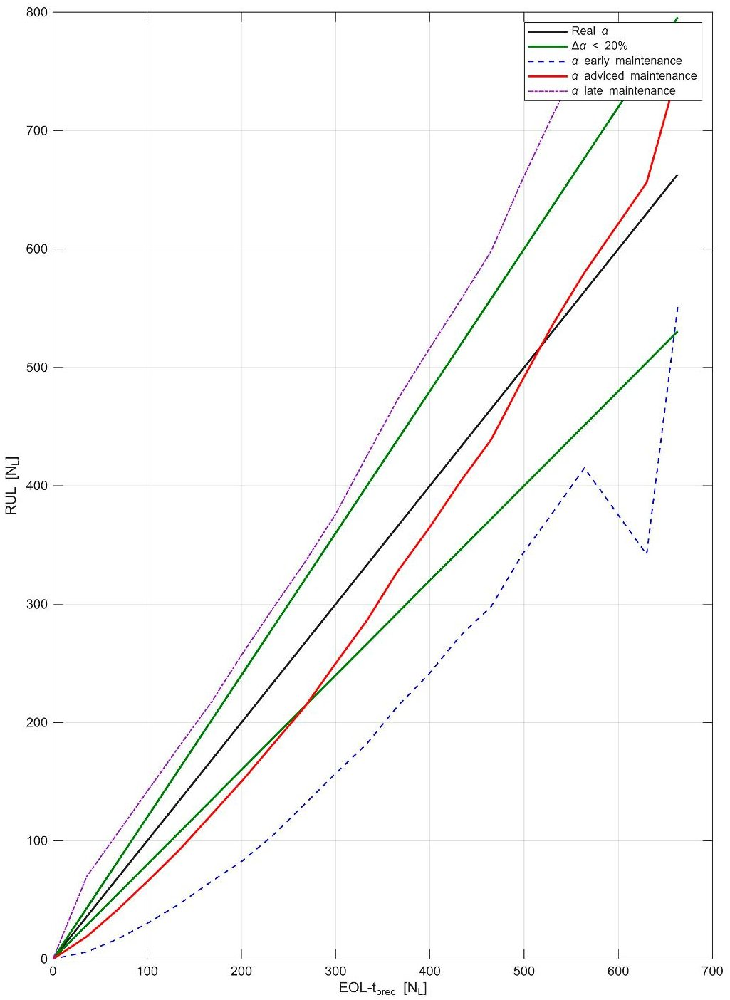

Figure 18. Dimensional $ \alpha $ - $ \lambda $ diagram.

The prognostic performances of the algorithm are presented in terms of Relative Accuracy and Cumulative Relative Accuracy in Figure 19, where the results are averaged over the 40 simulated landing sequences. It can be observed that the average Relative Accuracy remains well above the 80% threshold while scoring high marks in CRA as well.

<!-- PDF_PAGE: 22 -->

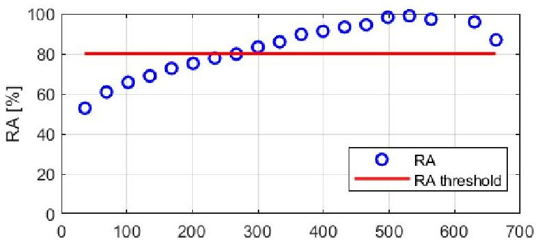

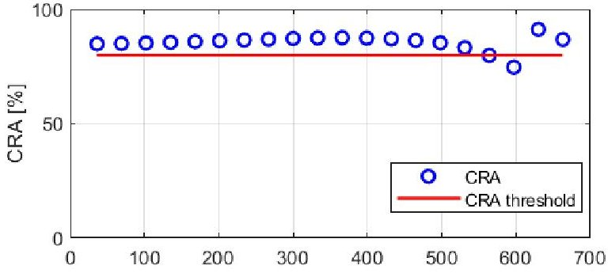

Figure 19. Prognostic performances (RA, CRA).

## 7. Conclusions

This paper presents the preliminary development of a prognostic framework for electro-mechanical brakes (E-Brakes) in executive-class aircraft, specifically addressing the challenge of developing PHM solutions when historical "run-to-failure" data is unavailable. The study successfully established a high-fidelity multi-physical model, integrating mechanical, electrical, and thermal dynamics to generate a statistically significant database of degradation trajectories. On this basis, a particle-filtering algorithm was designed to estimate brake pad wear and predict the Remaining Useful Life (RUL) by exploiting the correlation between wear progression and the electric motor's maximum angular displacement. In terms of benefits for the research community, the proposed methodology demonstrates that a "landing repository" architecture, which progressively builds a statistical representation of usage profiles, allows for reliable stochastic RUL predictions even without prior field data. Furthermore, the framework proves that effective prognosis can be achieved using only in situ signals (such as motor position and currents), eliminating the need for additional weight-critical sensors. While simulation results are promising, the primary limitation remains the lack of experimental validation, which is inherent to the prototype nature of the system investigated. Experimental activities are identified as the mandatory next step once the physical test rig becomes operational. From an operational perspective, the proposed PHM framework serves as a key enabler for transitioning from scheduled maintenance to Condition-Based Maintenance (CBM). Currently, brake wear monitoring in this class of aircraft relies on periodic visual inspections of wear pins, a procedure that requires ground personnel and increases turnaround time. By providing a continuous, digital estimation of the Remaining Useful Life, the proposed system eliminates the need for manual checks. It is important to clarify the scope and limitations of the present study. The proposed PHM framework has been developed and evaluated using a high-fidelity simulation environment because the electro-mechanical brake system considered in this work is currently in the prototype development phase, and experimental run-to-failure datasets are not yet available. In this context, simulation represents a necessary tool to investigate degradation behavior and to support the preliminary development of prognostic algorithms prior to experimental validation becoming available. The objective of this work is therefore not to define a universally applicable health indicator but rather to demonstrate a methodological framework for PHM development applied to electro-mechanical

<!-- PDF_PAGE: 23 -->

braking systems. The selected feature, based on the maximum angular displacement of the electric motor, is directly related to the kinematic architecture of the actuator-brake assembly and to the increase in pad-disk clearance caused by wear. While the specific indicator is linked to the considered actuator configuration, the proposed methodology can be extended to other electro-mechanical braking systems employing similar sensing architectures and actuation principles. In this sense, the main contribution of the study lies in the development of a simulation-driven PHM design methodology, capable of supporting the early-stage development of prognostic solutions even when operational degradation data are not yet available. Future research will also expand the framework to include disk wear effects and to manage multiple simultaneous failure modes within a unified Bayesian data-fusion scheme.

Author Contributions: Conceptualization, A.C.B., A.D.M. and R.A.; methodology, R.A.; software, R.A.; validation, R.A.; formal analysis, R.A.; investigation, R.A.; data curation, R.A.; visualization, R.A.; writing—original draft, R.A.; writing—review and editing, A.C.B. and A.D.M.; resources, A.C.B. and A.D.M.; supervision, G.J. and M.S.; project administration, A.D.M., G.J. and M.S. All authors have read and agreed to the published version of the manuscript.

Funding: This research was funded by the European Commission under the Horizon 2020 Framework Programme, within the project "Electromechanical Landing Gear System Integration for Small Aircraft" (E-LISA), grant agreement number 887222.

Institutional Review Board Statement: Not applicable.

Informed Consent Statement: Not applicable.

Data Availability Statement: Restrictions apply to the availability of these data. Data was obtained from the E-LISA Consortium and is available from the authors with the permission of the E-LISA Consortium.

Conflicts of Interest: The authors declare no conflicts of interest. The funders had no role in the design of the study; in the collection, analysis, or interpretation of data; in the writing of the manuscript or in the decision to publish the results.

## Abbreviations

The following abbreviations are used in this manuscript:

BCU Brake Control Unit

CRA Cumulative Relative Accuracy

EMA Electro-Mechanical Actuator

EOL End Of Life

IVHM Integrated Vehicle Health Management

LSTM Long Short-Term Memory networks

PDF Probability Density Function

PF Particle Filtering

PHM Prognostics and Health Management

RA Relative Accuracy

RUL Remaining Useful Life

SHM Structural Health Monitoring

SIR Sequential Importance Re-sampling

SNR Signal-to-Noise Ratio

<!-- PDF_PAGE: 24 -->

## References

1. Mazzoleni, M.; Di Rito, G.; Previdi, F. Electro-Mechanical Actuators for the More Electric Aircraft; Springer International Publishing: Cham, Switzerland, 2021. [CrossRef]

2. Pavlyuk, D.; Alomar, I. Artificial Intelligence Technologies for Aircraft Maintenance: A Systematic Literature Review. Int. J. Progn. Health Manag. 2026, 17, 1-19. [CrossRef]

3. Umbragroup, F.M.; Guidi, G.; Amokrane, M.; Borgarelli, N.; Malleret, F. Benefits and Challenges of Electro-Mechanical Actuation on Aircraft Landing and Braking Systems-ATA32 EMAs. 2021. Available online: https://www.researchgate.net/publication/ 355808915 (accessed on 5 December 2025).

4. de la Hoz, C.C.; Fioriti, M.; Boggero, L. Performance and Reliability Evaluation of Innovative High-Lift Devices for Aircraft Using Electromechanical Actuators. Aerospace 2024, 11, 468. [CrossRef]

6. Memmolo, V.; Vaselli, C.; Salvato, P.; Monaco, E.; Ricci, F. Structural Health Monitoring of Electro-Mechanical Actuators in Aviation: Recent Breakthroughs and Further Challenges. In Proceedings of the 2021 48th Annual Review of Progress in Quantitative Nondestructive Evaluation, Virtual, 28-30 July 2021. [CrossRef]

7. Ramesh, G.; Garza, P.; Perinpanayagam, S. Digital simulation and identification of faults with neural network reasoners in brushed actuators employed in an e-brake system. Appl. Sci. 2021, 11, 9171. [CrossRef]

8. Oikonomou, A.; Eleftheroglou, N.; Freeman, F.; Loutas, T.; Zarouchas, D. Remaining Useful Life Prognosis of Aircraft Brakes. Int. J. Progn. Health Manag. 2022, 13, 1-11. [CrossRef]

9. Norcaro, S.; Cumbo, R.; Petrella, V.; Mangeruca, L.; Di Guglielmo, L.; Ulisse, A. Digital Twin-based IVHM for Predictive Maintenance. In Proceedings of the Annual Conference of the PHM Society, Seattle, WA, USA, 27-30 October 2025.

10. Zhao, Z.; Zhang, Q.; Yu, X.; Sun, C.; Wang, S.; Yan, R.; Chen, X. Applications of Unsupervised Deep Transfer Learning to Intelligent Fault Diagnosis: A Survey and Comparative Study. IEEE Trans. Instrum. Meas. 2021, 70, 3525828. [CrossRef]

11. Sabag, D.Y.; Yakimenko, O.; Alian, H. Digital Twin of an Aircraft Landing Gear to Enhance Failure Analysis and Manage Predictive Maintenance. In Proceedings of the 34th ICAS Congress 2024, Florence, Italy, 9-13 September 2024.

12. Lai, C.; Baraldi, P.; Quattrocchi, G.; Vedova, M.D.L.D.; Baldo, L.; Bertone, M.; Zio, E. Detection of Abnormal Conditions in Electro-Mechanical Actuators by Physics-Informed Long Short-term Memory Networks. PHM Soc. Eur. Conf. 2024, 8, 8. [CrossRef]

13. Fu, S.; Avdelidis, N.P.; Plastropoulos, A. Novel Hybrid Prognostics of Aircraft Systems. Electronics 2025, 14, 2193. [CrossRef]

14. De Martin, A.; Jacazio, G.; Parisi, V.; Sorli, M. Prognosis of Wear Progression in Electrical Brakes for Aeronautical Applications. PHM Soc. Eur. Conf. 2022, 7, 329-337. [CrossRef]

15. Achille, R.; De Martin, A.; Bertolino, A.C.; Jacazio, G.; Sorli, M. Development of a PHM system for electrically actuated brakes of a small passenger aircraft. In Proceedings of the 8th European Conference of the Prognostics and Health Management Society, Prague, Czech Republic, 3-5 July 2024. [CrossRef]

16. De Martin, A.; Jacazio, G.; Sorli, M. Simulation of Runway Irregularities in a Novel Test Rig for Fully Electrical Landing Gear Systems. Aerospace 2022, 9, 114. [CrossRef]

17. Carbone, G.; Putignano, C. A novel methodology to predict sliding and rolling friction of viscoelastic materials: Theory and experiments. J. Mech. Phys. Solids 2013, 61, 1822-1834. [CrossRef]

18. Burckhardt, M.; Reimpell, J. Radschlupf-Regelsysteme: Reifenverhalten, Zeitablaufe, Messung des Drehzustands der Rader, Anti-Blockier System (ABS), Theorie, Hydraulikkreislaufe, Antriebs-Schlupf-Regelung (ASR), Theorie Hydraulikkreislaufe, elektronische Regeleinheiten, Leistungsgrenzen, ausgeführte Anti-Blockier-Systeme und Antriebs-Schlupf-Regelungen; Vogel Buchverlag: Leipzig, Germany, 1993.

19. De Martin, A.; Jacazio, G.; Vachtsevanos, G. Windings fault detection and prognosis in electro-mechanical flight control actuators operating in active-active configuration. Int. J. Progn. Health Manag. 2017, 8, 17. [CrossRef]

20. Bertolino, A.C.; De Martin, A.; Jacazio, G.; Sorli, M. A technological demonstrator for the application of PHM techniques to electro-mechanical flight control actuators. In 2022 IEEE International Conference on Prognostics and Health Management, ICPHM; Institute of Electrical and Electronics Engineers Inc.: New York, NY, USA, 2022; pp. 70-76. [CrossRef]

21. Mohan, N.; Undeland, T.M.; Robbins, W.P. Power Electronics: Converters, Applications, and Design; John Wiley & Sons: Hoboken, NJ, USA, 2003.

22. Boglietti, A.; Mandrile, F.; Carpaneto, E.; Popescu, M.; Rubino, S.; Staton, D. Stator winding second-order thermal model including end-winding thermal effects. Energies 2021, 14, 6578. [CrossRef]

23. Olesiak, Z.; Pyryev, Y.; Yevtushenko, A. Determination of temperature and wear during braking. Wear 1997, 210, 120-126. [CrossRef]

24. Yevtushenko, A.; Kuciej, M.; Topczewska, K. Analytical model for investigation of the effect of friction power on temperature in the disk brake. Adv. Mech. Eng. 2017, 9, 1687814017744095. [CrossRef]

<!-- PDF_PAGE: 25 -->

25. Dalla Vedova, M.D.L.D.; Maggiore, P.; Pace, L.; Desando, A. Evaluation of the Correlation Coefficient as a Prognostic Indicator for Electromechanical Servomechanism Failures. Int. J. Progn. Health Manag. 2012, 6, 1-13. [CrossRef]

26. Rojas, A.J.; Garcés, H.O. Signal-to-Noise Ratio Based Fault Detection and Identification. Front. Control. Eng. 2022, 3, 806558. [CrossRef]

27. Orchard, M.E.; Vachtsevanos, G.J. A particle-filtering approach for on-line fault diagnosis and failure prognosis. Trans. Inst. Meas. Control 2009, 31, 221-246. [CrossRef]

28. Grosso, L.A.; De Martin, A.; Jacazio, G.; Sorli, M. Development of data-driven PHM solutions for robot hemming in automotive production lines. Int. J. Progn. Health Manag. 2020, 11, 1-13. [CrossRef]

29. Vachtsevanos, G.; Lewis, F.; Roemer, M.; Hess, A.; Wu, B. Intelligent Fault Diagnosis and Prognosis for Engineering Systems; Wiley: Hoboken, NJ, USA, 2006. [CrossRef]

30. Roemer, M.J.; Byington, C.S.; Kacprzynski, G.J.; Vachtsevanos, G.; Goebel, K. Prognostics. In System Health Management; Wiley: Hoboken, NJ, USA, 2011; pp. 281-295. [CrossRef]

31. Bell, K.L.; Trees, H.L.V. A Tutorial on Particle Filters for Online Nonlinear/NonGaussian Bayesian Tracking. In Bayesian Bounds for Parameter Estimation and Nonlinear Filtering/Tracking; IEEE: New York, NY, USA, 2009. [CrossRef]

32. Acuña, D.E.; Orchard, M.E. Particle-filtering-based failure prognosis via sigma-points: Application to Lithium-Ion battery State-of-Charge monitoring. Mech. Syst. Signal Process. 2017, 85, 827-848. [CrossRef]

33. Acuña, D.E.; Orchard, M.E. A Theoretically Rigorous Approach to Failure Prognosis. In Proceedings of the Annual Conference of the Prognostics and Health Management Society, Philadelphia, PA, USA, 24-27 September 2018.

34. Saxena, A.; Celaya, J.; Balaban, E.; Goebel, K.; Saha, B.; Saha, S.; Schwabacher, M. Metrics for evaluating performance of prognostic techniques. In 2008 International Conference on Prognostics and Health Management; IEEE: New York, NY, USA, 2008; pp. 1-17. [CrossRef]

Disclaimer/Publisher's Note: The statements, opinions and data contained in all publications are solely those of the individual author(s) and contributor(s) and not of MDPI and/or the editor(s). MDPI and/or the editor(s) disclaim responsibility for any injury to people or property resulting from any ideas, methods, instructions or products referred to in the content.