<!-- PDF_PAGE: 1 -->

Article

# Maintenance-Aware Risk Curves: Correcting Degradation Models with Intervention Effectiveness

F. Javier Bellido-Lopez $ ^{1,*} $ , Miguel A. Sanz-Bobi $ ^{1} $ , Antonio Muñoz $ ^{1} $ , Daniel Gonzalez-Calvo $ ^{2} $ and Tomas Alvarez-Tejedor $ ^{2} $

$ ^{1} $ Institute for Research in Technology, ICAI School of Engineering, Pontifical Comillas University, Rey Francisco 4, 28015 Madrid, Spain; masanz@comillas.edu (M.A.S.-B.); antonio.munoz@iit.comillas.edu (A.M.)

$ ^{2} $ Endesa-Gas Maintenance Iberia, Enel Green Power and Thermal Generation, Ribera del Loira 60, 28042 Madrid, Spain; daniel.gonzalezc@enel.com (D.G.-C.); tomas.alvarez@enel.com (T.A.-T.)

* Correspondence: jbellido@comillas.edu

check for updates

Citation: Bellido-Lopez, F.J.; Sanz-Bobi, M.A.; Muñoz, A.; Gonzalez-Calvo, D.; Alvarez-Tejedor, T. Maintenance-Aware Risk Curves: Correcting Degradation Models with Intervention Effectiveness. Appl. Sci. 2025, 15, 10998. https://doi.org/ 10.3390/app152010998

Academic Editor: Benoit Iung

Received: 17 September 2025

Revised: 9 October 2025

Accepted: 10 October 2025

Published: 13 October 2025

## Featured Application

The proposed methodology can be applied in industrial environments where equipment, such as pumps, is monitored through online sensors. By correcting risk curves with maintenance effectiveness, asset managers can not only evaluate the true impact of preventive and corrective actions, but also benchmark performance across redundant or comparable units. This enables more accurate decision-making, early identification of ineffective practices, and improved planning of predictive and risk-informed maintenance strategies.

Copyright: 2025 by the authors. Licensee MDPI, Basel, Switzerland. This article is an open access article distributed under the terms and conditions of the Creative Commons Attribution (CC BY) license (https://creativecommons.org/licenses/by/4.0/).

## Abstract

In predictive maintenance frameworks, risk curves are used as interpretable, real-time indicators of equipment degradation. However, existing approaches generally assume a monotonically increasing trend and neglect the corrective effect of maintenance, resulting in unrealistic or overly conservative risk estimations. This paper addresses this limitation by introducing a novel method that dynamically corrects risk curves through a quantitative measure of maintenance effectiveness. The method adjusts the evolution of risk to reflect the actual impact of preventive and corrective interventions, providing a more realistic and traceable representation of asset condition. The approach is validated with case studies on critical feedwater pumps in a combined-cycle power plant. First, individual maintenance actions are analyzed for a single failure mode to assess their direct effectiveness. Second, the cross-mode impact of a corrective intervention is evaluated, revealing both direct and indirect effects. Third, corrected risk curves are compared across two redundant pumps to benchmark maintenance performance, showing similar behavior until 2023, after which one unit accumulated uncontrolled risk while the other remained stable near zero, reflected in their overall performance indicators (0.67 vs. 0.88). These findings demonstrate that maintenance-corrected risk curves enhance diagnostic accuracy, enable benchmarking between comparable assets, and provide a missing piece for the development of realistic, risk-informed predictive maintenance strategies.

Keywords: risk curves; predictive maintenance (PdM); maintenance effectiveness; Condition-Based Monitoring (CBM); Prognosis and Health Management (PHM); power plant pumps; reliability engineering

<!-- PDF_PAGE: 2 -->

## 1. Introduction

In industrial environments, effective maintenance management is essential to ensure equipment availability, minimize unplanned downtime, and extend asset lifespan [1,2]. Over the past two decades, the rise of online monitoring [3], the Internet of Things (IoT) [4-6], and machine learning (ML) [7] has enabled a paradigm shift from time-based preventive maintenance towards condition-based (CBM) [8] and predictive maintenance (PdM) approaches [9,10]. These data-driven strategies aim to detect anomalies at early stages [8,11] and dynamically schedule interventions based on equipment condition [12-14].

Despite these advances, several limitations persist in current PdM implementations that restrict their real-world applicability and long-term decision-making capabilities [2,15,16]. A major shortcoming is the lack of integration between historical maintenance actions and the evolution of equipment risk. This limitation results in overly conservative or unrealistic risk estimations and hinders the ability of PdM frameworks to support informed, long-term maintenance strategies.

This paper is motivated both by theoretical and practical needs. From a theoretical standpoint, it addresses a major gap in predictive maintenance frameworks: the absence of mechanisms to integrate the historical outcome of maintenance actions into the ongoing assessment of risk. From a practical perspective, the proposed correction mechanism enables benchmarking of maintenance performance across redundant or comparable assets, supporting more accurate decision-making and predictive, risk-informed maintenance planning.

To address this gap, we propose a novel method to dynamically correct the evolution of risk curves based on the measured effectiveness of past maintenance actions. Specifically, we define a correction mechanism whereby, after each intervention, the risk curve is retroactively scaled in proportion to the quantified efficacy of that action. This approach yields a more realistic and condition-aware representation of system degradation over time, capturing both anomaly accumulation and risk mitigation. In doing so, the method enhances the interpretability and prescriptive value of risk curves, making them more suitable not only for anomaly detection but also for long-term maintenance strategy refinement. By bridging the gap between condition monitoring and maintenance traceability, it contributes a missing piece to current PdM frameworks [17-19].

The rest of the paper is organized as follows: Section 2 reviews related work and positions the proposed method within the state of the art. Section 3 describes the methodology for correcting risk curves by incorporating maintenance effectiveness. Section 4 presents the case studies and discusses the results, including individual interventions, cross-mode effects, and the comparative analysis between two pumps. Section 5 discusses the broader implications and limitations of the method. Finally, Section 6 provides the conclusions of the study and outlines directions for future research.

## 2. Literature Review

Nunes et al. [2] identify several persistent limitations in predictive maintenance (PdM) implementations, including data quality issues, the scarcity of complete datasets, and the limited integration of maintenance history. These constraints restrict the applicability of PdM strategies in real-world contexts. Hamasha et al. [1] further analyze the selection of maintenance policies, emphasizing how different operational environments require tailored approaches. Achouch et al. [9] and Zonta et al. [10] provide systematic reviews of PdM frameworks, highlighting both the rapid progress of the field and the challenges that still prevent widespread industrial adoption.

To address these challenges, recent studies have focused on the enabling role of digitalization and data-driven techniques. Karki et al. [3] describe digital maintenance

<!-- PDF_PAGE: 3 -->

architectures for online monitoring, while Naiya [4] and Moccardi et al. [5] emphasize IoT frameworks as essential for predictive analytics. Prasad [6] reviews IoT-ML integration in industrial systems, showing its potential to support predictive strategies. Carvalho et al. [7] and Sharma et al. [8] survey the application of machine learning (ML) in anomaly detection, underlining that interpretability and transparency remain key barriers to effective adoption in practice.

Abbassi et al. [20] review quantitative risk-based maintenance (RBM) techniques in engineering infrastructures, showing how risk prioritization can guide interventions. Leoni et al. [21] analyze consequence modelling and its integration into maintenance decision processes. Liao et al. [22] propose mission reliability-driven PdM, explicitly combining reliability and risk modelling in multi-state systems. Silva et al. [23] introduce Reliability and Risk-Centered Maintenance, which integrates criticality analysis into planning strategies. These studies confirm the potential of RBM, but they generally treat maintenance actions as resets or ignore their impact altogether, which limits traceability and underestimates variability in effectiveness [21,24,25].

Montgomery et al. [24] demonstrate how minor maintenance actions affect CBM models, while De Carlo and Arleo [26] survey imperfect maintenance models and their practical applications. These works highlight the importance of representing partial or variable effectiveness, but their use in real-time monitoring remains limited. Digital twin approaches have also been proposed as a way to incorporate such concepts into predictive frameworks [27-29]. However, despite their potential to integrate imperfect maintenance into advanced simulations, these solutions remain limited in practice due to high implementation costs, integration challenges, and restricted applicability in real industrial environments.

In parallel, probabilistic and AI-based paradigms have been explored as alternative solutions. Morato et al. [30] apply Partially Observable Markov Decision Processes (POMDPs) and Bayesian networks to represent maintenance as a stochastic influence. Hurtado et al. [16] review the application of deep learning for maintenance, Mahale et al. [31] survey AI-driven PdM in the automotive sector, and Wu et al. [32] introduce continual learning strategies for remaining useful life (RUL) prediction. Although these methods are powerful, they typically require extensive datasets, are difficult to interpret, and do not explicitly incorporate the feedback from maintenance interventions into risk modelling.

In contrast to these approaches, which often rely on complex probabilistic formalisms or data-hungry black-box models, our method provides a transparent, easily computable mechanism directly traceable to operational records.

In previous work [33], we proposed the construction of risk curves as real-time failure indicators, based on the cumulative deviations of monitored variables from their expected values under normal operating conditions (NOC). These curves enabled the quantification of maintenance effectiveness by analyzing slope changes before and after interventions. However, the risk curve itself remained unaffected by the intervention outcome, which limited its realism and diagnostic value. While that work demonstrated how maintenance effectiveness could be measured, the present study advances the methodology by dynamically correcting the curves themselves, adjusting their evolution based on the measured effectiveness of maintenance actions. This evolution directly addresses the limitation of our prior work and enhances the prescriptive value of the curves.

In summary, while CBM, PdM, and RBM approaches have made significant advances, none provide a transparent mechanism to dynamically integrate the actual effectiveness of maintenance actions into risk evolution. Most frameworks either neglect maintenance feedback, assume perfect interventions, or reset risk arbitrarily [21,24,25]. Recent contributions have explicitly recognized this as a critical gap in PdM frameworks [17-19],

<!-- PDF_PAGE: 4 -->

underscoring the need for approaches that combine anomaly detections and accumulation with maintenance traceability. The present study addresses that gap by introducing a novel correction mechanism in which risk curves are dynamically corrected using the measured effectiveness of interventions. This represents, to the best of our knowledge, the first practical and interpretable method to explicitly integrate maintenance feedback into risk evolution.

## 3. Materials and Methods

## 3.1. Failure Indicator: Risk Curves

The proposed methodology builds upon our previous work [33], where we introduced the concept of risk curves as failure indicators derived from monitored deviations. These curves are constructed by continuously comparing real-time sensor values with those predicted by pre-trained models representing the system's Normal Operating Conditions (NOC).

Given a confidence interval $ \mathrm{CI}_{\mathrm{NOC}}^{(k)}=\left[L_{inf}^{(k)},L_{sup}^{(k)}\right] $ defined for each model k, the deviation at each time instant is determined by the difference between the observed output $ Y^{(k)} $ and the predicted output $ Y_{\mathrm{NOC}}^{(k)} $:

$$
E ^ {(k)} = Y ^ {(k)} - Y _ {\mathrm {N O C}} ^ {(k)}
$$

If $ E^{(k)} $ falls within the confidence interval, the behavior is considered normal. If it lies outside, the deviation is quantified as:

$$
\left\{ \begin{array}{l l} \mathrm {D E V} ^ {(k)} = 1 + \frac {\left| E ^ {(k)} - L _ {i n f} ^ {(k)} \right|}{\left| L _ {i n f} ^ {(k)} \right|} & \text {i f} E ^ {(k)} < L _ {i n f} ^ {(k)} \\ \mathrm {D E V} ^ {(k)} = 0 & \text {i f} E ^ {(k)} \in \left[ L _ {i n f} ^ {(k)}, L _ {s u p} ^ {(k)} \right] \\ \mathrm {D E V} ^ {(k)} = 1 + \frac {\left| E ^ {(k)} - L _ {s u p} ^ {(k)} \right|}{\left| L _ {s u p} ^ {(k)} \right|} & \text {i f} E ^ {(k)} > L _ {s u p} ^ {(k)} \end{array} \right.
$$

The risk curve for model k is then defined as the cumulative sum of deviations from a reference time $ t_{0} $:

$$
f ^ {(k)} (t) = \sum_ {n = t _ {0}} ^ {t} \mathrm {D E V} ^ {(k)} (n)
$$

This risk curve increases over time in the presence of anomalies and remains constant when the system returns to normal. A zero slope indicates stable behavior, while a growing slope reflects an increasing risk associated with the monitored failure mode. Hence, the real-time slope of the curve serves as an early failure indicator.

## 3.2. Maintenance Effectiveness Evaluation

Beyond anomaly detection, risk curves can also be used to evaluate the effectiveness of maintenance actions. Given the timestamp $ t_{a} $ of an intervention, its effectiveness ef $ _{a} $ is defined as the relative change in the slope of the risk curve before and after the action, over a symmetric time window $ \Delta t $ :

$$
\mathrm {e f} _ {a} = 1 - \frac {\Delta f ^ {(k)} / \Delta t \big | _ {t _ {a}} ^ {t _ {\mathrm {a f f}}}}{\Delta f ^ {(k)} / \Delta t \big | _ {t _ {\mathrm {b e f}}} ^ {t _ {a}}}
$$

where $ t_{\mathrm{bef}}<t_{a}<t_{\mathrm{aft}} $ and $ t_{\mathrm{aft}}-t_{a}=t_{a}-t_{\mathrm{bef}}=\Delta t $ . This formulation quantifies how much the curve's slope has decreased after the intervention, thus indicating how effective the action was in mitigating risk.

<!-- PDF_PAGE: 5 -->

Equation (4) is based on an empirical but theoretically intuitive rationale: it quantifies the relative change in the slope of the risk curve before and after an intervention. Since the slope reflects the rate of degradation, this measure provides a natural and interpretable indicator of maintenance effectiveness. While simple in formulation, it captures the essential relationship between intervention outcome and the trajectory of degradation, aligning with the conceptual foundations of reliability growth analysis and imperfect maintenance models.

This metric can be computed for all maintenance actions and across all monitored failure modes, enabling the construction of a historical record of intervention effectiveness per failure mode.

From a numerical perspective, the proposed calculations are stable. The main potential issue arises from divisions by zero or very small denominators when comparing slopes before and after interventions. To prevent instability, the implementation includes filtering mechanisms that exclude such cases or apply smoothing windows. Furthermore, extreme scenarios, such as interventions performed during flat risk periods or negligible slopes, are accounted for in the algorithm, ensuring that the results remain robust and reliable.

## 3.3. Risk Curve Correction Based on Effectiveness

One limitation of the original risk curve definition is its unidirectional growth, risk is assumed to only increase or remain constant, even after successful interventions. However, in practice, effective maintenance can reverse the degradation process and reduce actual failure risk.

To address this, we introduce a correction mechanism that adjusts the risk curve dynamically based on the computed effectiveness. For each intervention at time $ t_{a} $ , the risk curve is scaled proportionally from that point onwards:

$$
f ^ {\prime (k)} (t) = \left\{ \begin{array}{l l} f ^ {(k)} (t) & \mathrm {i f} t < t _ {a} \\ \left(1 - \mathrm {e f} _ {a}\right) \cdot f ^ {(k)} (t) & \mathrm {i f} t \geq t _ {a} \end{array} \right.
$$

Equation (5) defines a heuristic scaling mechanism that applies the measured effectiveness to adjust the risk curve. Although not derived from a formal probabilistic model, the formulation ensures interpretability and traceability by directly linking the quantified effectiveness of an action to the subsequent evolution of risk. This heuristic approach is inspired by broader principles in maintenance modelling, where imperfect maintenance is understood as partial restoration of system condition [20,26]. The advantage of this definition lies in its industrial applicability: it provides a transparent and easily computable correction that can be directly validated against operational records.

This corrected curve, $ f^{\prime(k)}(t) $ , provides a more realistic view of system condition, capturing both the accumulation of anomalies and the mitigating effects of successful maintenance. By integrating effectiveness into the curve, the model acknowledges improvements in health state and supports more reliable decision-making over time.

## 4. Results

To demonstrate the applicability and advantages of the proposed risk curve correction method, we apply it to a real industrial system: a feedwater pump located within the water-steam circuit of a combined-cycle power plant. The case study is based on real operational data retrieved from the plant's monitoring and control system.

The pump operates downstream of the condenser and upstream of the heat recovery steam generator (HRSG). Its function is to supply pressurized water to the HRSG, where it is converted into high-pressure steam that powers the steam turbine. Due to this position, the pump plays a critical role in sustaining the thermal cycle. Malfunctions can lead to

<!-- PDF_PAGE: 6 -->

partial or total shutdowns of the steam section, with direct impact on the plant's efficiency and availability.

This component was selected for the case study because of its operational importance, the variety of failure modes it presents, and the availability of historical maintenance and sensor data. These characteristics make it a suitable candidate for testing the ability of the proposed method to identify, quantify, and trace the effects of maintenance interventions across different degradation indicators.

## 4.1. Failure Modes and Risk Curves

To assess the degradation of the feedwater pump and evaluate the impact of maintenance interventions, a set of failure modes (FMs) was defined based on historical records and expert knowledge. Each failure mode corresponds to a specific degradation mechanism and is monitored through one or more relevant physical variables. These variables are modelled under normal operating conditions (NOC), and their deviations over time are used to construct risk curves $ f^{(k)}(t) $ , as introduced in Section 2.

The failure modes considered in this study are:

- $ \mathrm{F M}_{1} $ : Motor overload, identified through abnormal current and temperature behaviour.

- $ \mathrm{F M}_{2} $ : Worn opposite motor coupling side (OMCS) bearing, detected via vibration and thermal signatures on the non-drive side of the motor.

- $ \mathrm{F M}_{3} $ : Worn motor coupling side (MCS) bearing, located on the drive end of the motor.

- $ \mathrm{F M}_{4} $ : Worn opposite pump coupling side (OPCS) bearing, positioned on the non-drive end of the pump.

- $ \mathrm{F M}_{5} $ : Worn pump coupling side (PCS) bearing, on the drive end of the pump shaft.

- $ \mathrm{F M}_{6} $ : Worn thrust bearing, related to axial loads within the pump system.

- $ \mathrm{F M}_{7} $ : Leak, typically inferred from mass imbalance or sealing pressure deviations.

- $ \mathrm{F M}_{8} $ : Shaft misalignment, diagnosed via vibration patterns and coupling torque anomalies.

- $ \mathrm{F M}_{9} $ : Motor electrical failure, signalled by current imbalance, harmonic distortion, or insulation issues.

For each failure mode, a dedicated risk curve is generated by aggregating deviations in the relevant monitored variables (Equations (1)-(3)). These curves serve as real-time indicators of degradation progression and provide a structured framework for evaluating the effectiveness of maintenance actions, both at the individual and system level.

Figures 1 and 2 show the evolution of all nine risk curves over a four-year operational period (January 2020-August 2024). Figure 1 displays the full range of values, highlighting the dominance of certain failure modes in terms of accumulated risk. Figure 2, with an expanded scale, enables a more detailed view of the lower-magnitude curves, facilitating the comparative analysis of degradation behavior across all modes.

Building on this baseline representation, the analysis begins with an illustrative example on a single failure mode, which demonstrates step by step how the proposed correction method is applied to risk curves. This example serves as a didactic bridge between the theoretical framework and its practical implementation.

After this illustration, three complementary case studies are presented to showcase the broader capabilities of the methodology. The first case evaluates multiple maintenance actions on a single failure mode, highlighting how corrected risk curves capture their varying effectiveness over time.

The second case examines the cross-mode impact of one corrective intervention, revealing direct, indirect, and null effects across different degradation mechanisms. The third case compares two redundant pumps, showing how corrected risk curves can be used to benchmark maintenance performance at the system level. Together, the illustrative example and the three case studies provide a progression from methodological understand-

<!-- PDF_PAGE: 7 -->

ing to practical insights, demonstrating the added value of incorporating maintenance effectiveness into risk-based assessment.

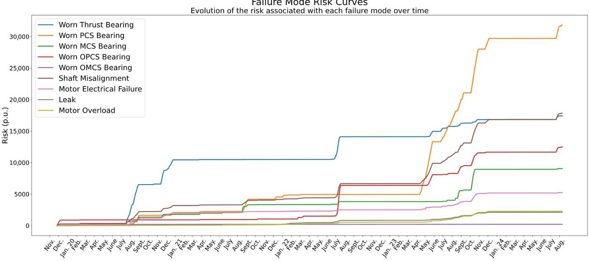

Figure 1. Evolution of uncorrected risk curves for all failure modes over the full-time horizon (January 2020-August 2024).

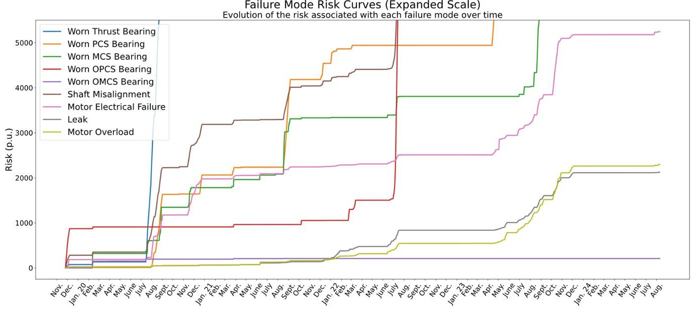

Figure 2. Expanded view of uncorrected risk curves highlighting lower-magnitude failure modes.

## 4.2. Illustrative Example: Risk Curve Correction for Worn PCS Bearing

In this subsection, the theoretical procedure described in Section 2 is illustrated using one specific failure mode: Wear of the Pump Coupling Side (PCS) Bearing.

This failure mode was selected as an illustrative case because it combines high operational relevance with a diverse history of maintenance interventions, including both preventive and corrective actions. Its risk curve presents clear episodes of degradation and recovery, which makes it suitable for testing the correction methodology under different conditions.

The analysis is structured into four incremental examples: first, the uncorrected curve is shown as a baseline; second, the impact of a single maintenance action is assessed; third, two actions are considered to evaluate their combined effect; and finally, the full sequence of interventions is applied to reconstruct the corrected risk curve. This stepwise approach provides both an intuitive understanding of the method and a comprehensive view of how maintenance effectiveness shapes the evolution of risk over time.

<!-- PDF_PAGE: 8 -->

## 4.2.1. Risk Curve Without Maintenance Correction

Figure 3 shows the evolution of the risk associated with the PCS bearing without applying any correction for the effect of maintenance. As observed, the risk accumulates continuously over time, even after maintenance actions have taken place.

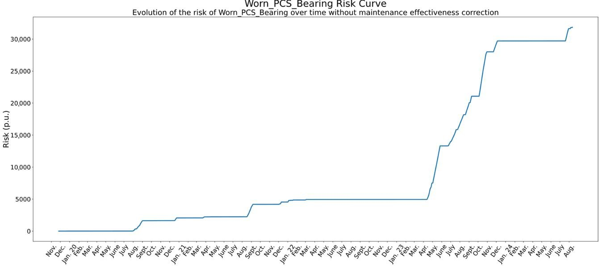

Figure 3. Risk curve of the PCS bearing without maintenance-effectiveness correction (continuous accumulation of risk).

This representation does not reflect whether a corrective or preventive action has been effective or not, nor does it allow for assessing its real impact. Therefore, it may lead to an overestimation of the risk, particularly after effective interventions, masking the benefits of maintenance activities and hindering any analysis of maintenance strategies.

## 4.2.2. Risk Correction with a Single Effective Action

Figure 4 introduces the first correction using the proposed methodology. The vertical dashed line marks the moment of a maintenance action, the replacement of the bearing lubricating oil, that has been identified as highly effective $ \mathrm{(e f_{a}=100\%)} $ by Equation (4). As detailed in Section 2, the correction is applied by decreasing the risk from the time of the intervention onwards by a percentage equal to the estimated effectiveness (Equation (5)). In this case, the curve undergoes a complete risk reset (100% reduction), yielding a more realistic representation of the component's health status.

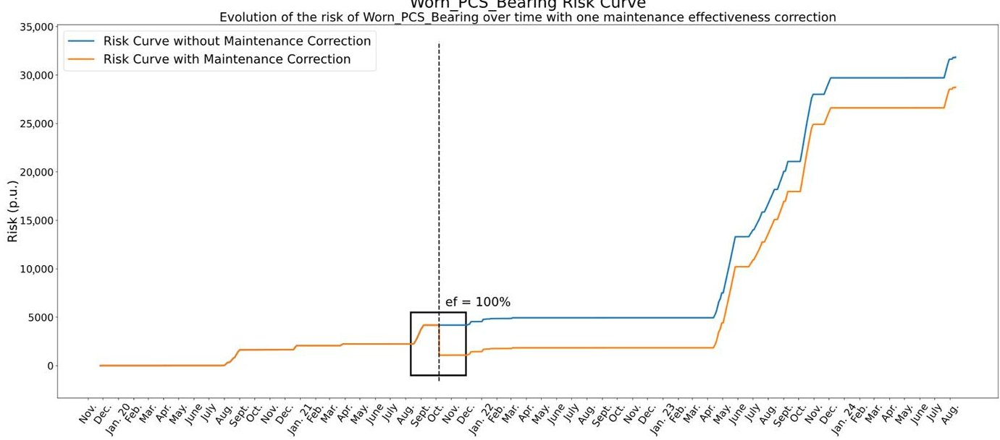

Figure 4. Corrected risk curve of the PCS bearing after a single highly effective maintenance action (oil replacement).

<!-- PDF_PAGE: 9 -->

This correction not only prevents risk overestimation but also emphasizes the impact of individual maintenance actions, thereby enabling a clearer identification of which interventions contribute most to asset reliability.

## 4.2.3. Extension to Multiple Maintenance Actions

In practice, assets are subject to multiple maintenance activities over time. Figure 5 extends the correction to include a second intervention later in the timeline. The first action remains consistent with the preceding case, exhibiting 100% effectiveness.

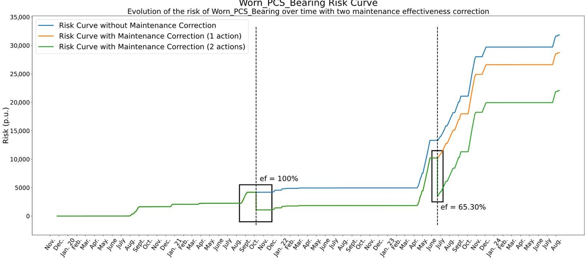

Figure 5. Corrected risk curve of the PCS bearing after two maintenance actions with different effectiveness levels.

The subsequent action, a bi-monthly preventive routine encompassing temperature, vibration, and leak inspections, oil changes, and corrosion inspections, attains approximately 65.30% effectiveness. The green curve illustrates the corrected risk trajectory after the implementation of both actions.

It is important to note that the second correction is applied on top of the curve already corrected by the first action (orange curve), meaning that corrections are cumulative over time. This aggregation allows for a more coherent and realistic modelling of the asset's degradation and recovery dynamics.

Finally, Figure 6 shows the fully corrected risk curve for this failure mode, after applying all maintenance actions recorded in the historical data. This final curve reflects the real evolution of the component's risk, incorporating both degradation periods and the varying success of maintenance interventions. These corrected curves serve as the foundation for the advanced analyses presented in the following sections, including the evaluation of cross-mode impacts and asset-level comparisons.

Additionally, this correction not only prevents risk overestimation but also emphasizes the impact of individual maintenance actions. In this case, the complete reset achieved through a simple lubricant replacement illustrates how routine interventions can produce disproportionately high benefits. The corrected curves therefore provide a clearer basis for distinguishing between high-value actions and those with minimal return, which is essential for effective resource prioritization.

<!-- PDF_PAGE: 10 -->

Worn PCS Bearing Risk Curve Evolution of the risk of Worn PCS Bearing over time with all maintenance effectiveness correction

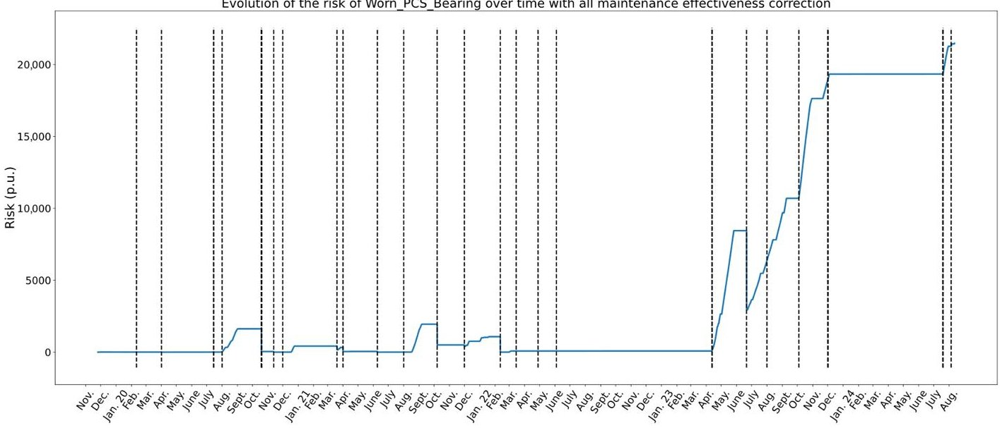

Figure 6. Final corrected risk curve of the PCS bearing incorporating the entire historical record of maintenance actions. The thicker dotted lines simply indicate that several maintenance actions were performed on the same date instead of just one.

## 4.3. Cross-Mode Impact of a Maintenance Action

The first case study investigates the cross-mode impact of a maintenance intervention. Although maintenance actions are typically directed at a specific failure mode, their influence may extend beyond the targeted mechanism, producing beneficial, neutral, or even adverse effects on other degradation pathways.

To illustrate this phenomenon, Figure 7 presents the impact of a single corrective action, a general overhaul of the pump focused on repairing a water leak, on the risk curves of four different failure modes. The analysis demonstrates how the proposed correction methodology captures both direct and collateral effects of the intervention, thereby enabling a system-level perspective on maintenance performance:

- Leak (98%)—Direct effect: This mode was the explicit target of the intervention, and the very high effectiveness confirms the success of the repair. Beyond that, the fact that the model quantifies the effect as 98% (rather than 100%) demonstrates its ability to reflect non-binary outcomes, capturing nuances in how completely a failure mode is mitigated.

- Shaft Misalignment (77%)—Indirect effect: Although not directly targeted, this mode shows a substantial improvement. A likely explanation is that during the overhaul, components such as bearings or couplings were realigned, which naturally reduces shaft misalignment. This reveals how a single action can have collateral mechanical benefits, and the model successfully attributes part of the risk reduction to the same intervention.

- Motor Electrical Failure (43%)—Indirect and marginal effect: In this case, the impact is moderate. Since a hydraulic leak is not expected to directly influence electrical behaviour, the observed improvement might result from reduced mechanical stress or more stable load conditions after the repair, slightly improving current symmetry or motor performance. The model appropriately captures this partial mitigation while indicating that most of the residual risk is likely due to independent causes.

- Worn PCS Bearing (0%)—No effect: This failure mode exhibits no measurable impact from the intervention, which aligns with expectations. Wear in the PCS bearing is not expected to be influenced by hydraulic sealing issues. Although some improvement might have been anticipated due to the comprehensive nature of the overhaul, the

<!-- PDF_PAGE: 11 -->

absence of any effect confirms that the methodology is capable of identifying when a failure mode remains unaffected, thereby avoiding false attribution of improvements.

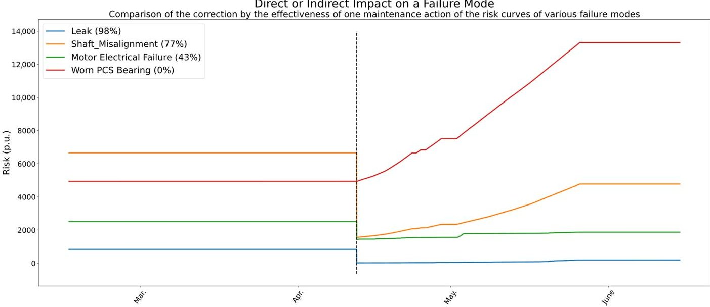

Figure 7. Cross-mode impact of a corrective overhaul focused on leak repair across four different failure modes.

Together, these findings demonstrate the ability of the method to disentangle both direct and collateral impacts of a single action. In practical terms, this means that crossmode effects, often overlooked in traditional analyses, can be quantified and incorporated into decision-making. Recognizing these indirect benefits is critical for planning overhauls more holistically, ensuring that maintenance programs account for interactions across multiple failure modes rather than treating each in isolation.

## 4.4. Risk Evolution of a Specific Failure Mode: Worn OPCS Bearing

While the previous case study examined the cross-mode impact of a single intervention, the present analysis adopts a longitudinal perspective by focusing on the complete risk trajectory of a specific degradation mechanism: the wear of the opposite pump coupling side (OPCS) bearing. This case illustrates how successive preventive and corrective actions accumulate over time, sometimes with substantial effectiveness and other times with negligible impact, thereby providing a representative example of the dynamic interplay between degradation and maintenance.

Figure 8 presents the corrected risk curve for this failure mode after applying the proposed effectiveness-based adjustment, with vertical dashed lines indicating the timing of maintenance actions, green for preventive interventions and red for corrective ones. The resulting curve reveals a complex interaction between maintenance and degradation processes, whose main patterns and implications can be summarized as follows:

1. The first four maintenance actions were preventive. The two earliest interventions proved highly effective, reducing the risk to zero. Since the risk remained at zero, the subsequent two preventive actions cannot be meaningfully evaluated; in fact, they might not even have been necessary.

2. The next intervention, a corrective action, involved several repair tasks. However, its effect was null, as the risk associated with this failure mode was already non-existent at the time.

3. A series of six preventive interventions followed. Given that the risk was already at or near zero, their observable impact was limited. Nevertheless, when the risk began to rise slightly, one of these preventive actions successfully brought it back to zero (April 2021), confirming its relevance.

<!-- PDF_PAGE: 12 -->

4. Two interventions, one preventive and one corrective, were carried out simultaneously in October 2021. Unexpectedly, instead of stabilizing the system, they appear to have worsened the condition, since the risk curve shows an upward trend immediately afterwards.

5. The subsequent sequence consisted of two preventive actions, one corrective action, and two more preventive actions. The first preventive intervention corrected the earlier growth in risk. Then, the corrective action (repair of a leak) fully eliminated the risk that had started to grow consistently, suggesting that the leak was likely inducing vibrations in the bearing. Finally, after two additional preventive actions performed when risk was zero, the system entered a phase of sudden and severe risk escalation. This sharp increase ultimately led to a deliberate pump shutdown, as the risk became unacceptable.

6. While the pump was out of service, preventive tasks continued, but also a general overhaul was carried out, focused on repairing leaks and improving shaft alignment. When the pump was restarted in April 2023, the accumulated effectiveness of all these interventions resulted in the risk dropping abruptly to zero.

7. Following this major intervention, three preventive actions were performed. In the first two cases, where risk had begun to rise beforehand, the actions were highly effective, restoring risk to low values. However, the third preventive action failed to reduce the risk, indicating that the new issue had a different root cause, beyond the scope of routine preventive measures.

8. A significant overhaul was undertaken in December 2023 in response to a sharp increase in risk. However, it was unsuccessful: after the pump was restarted in July 2024, the risk continued to grow unabated.

9. The last two preventive interventions also proved ineffective, showing no measurable impact on the failure mode. This confirms that, in its current state, the bearing risk can no longer be managed with standard preventive measures.

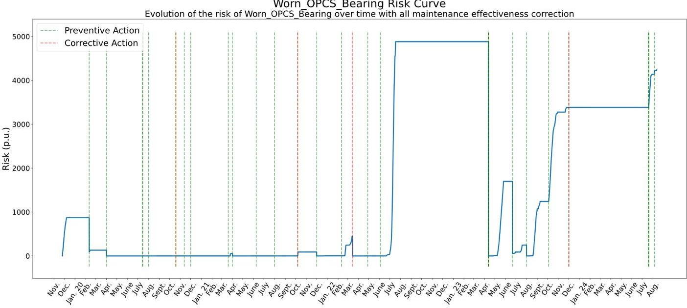

Figure 8. Corrected risk curve for the Worn OPCS Bearing failure mode with preventive and corrective interventions. The thicker dotted lines simply indicate that several maintenance actions were performed on the same date instead of just one.

In conclusion, the corrected risk curve highlights the limitations of routine preventive actions, which were only effective during specific phases of risk growth. Corrective actions proved decisive in restoring system stability, though their success was not consistent over time. The final stages of the curve reveal that once the failure mechanism became dominant, neither preventive tasks nor general overhauls were able to mitigate the rising risk.

<!-- PDF_PAGE: 13 -->

This emphasizes the importance of timely identification of root causes and suggests that a shift toward predictive, risk-informed maintenance strategies, supported by historical performance analysis, is essential. Such strategies would allow resources to be redirected toward moments of genuine need, avoiding unnecessary costs and minimizing the risk of false-positive maintenance actions, while reducing the likelihood of recurring high-risk scenarios and unplanned shutdowns.

## 4.5. Comparison of Maintenance Performance Between Two Pumps

Finally, to evaluate the relative performance of maintenance strategies across similar assets, the corrected risk curves are compared for two redundant feedwater pumps (BAA1 and BAA2). This case study adopts a benchmarking perspective, assessing how differences in intervention timing, type, and effectiveness translate into distinct degradation profiles and overall maintenance outcomes.

The correction of risk curves, carried out using the method proposed in this work, adjusts the original trajectories based on the measured effectiveness of each maintenance action. By contrasting the two pumps, the analysis demonstrates the potential of the methodology to support fleet-level decision making and to identify best practices in maintenance execution.

The analysis is structured in two stages. First, the overall maintenance effectiveness is compared across all failure modes, providing a high-level view of performance differences between the two pumps. Second, three representative cases are examined in detail: one failure mode where maintenance performance diverges significantly between pumps (Shaft Misalignment), another where both pumps exhibit comparable outcomes (Motor Overload), and finally the aggregated case, which reflects the overall effectiveness of maintenance strategies at the system level.

## 4.5.1. Overall Maintenance Effectiveness by Failure Mode

The bar chart below (Figure 9) presents the average maintenance effectiveness for each failure mode, as well as the overall value across all modes for each pump. The effectiveness metric used is defined as:

$$
\mathrm {P e r f o r m a n c e} = \frac {A _ {\mathrm {b e f}} - A _ {\mathrm {a f t}}}{A _ {\mathrm {b e f}}}
$$

where $ A_{\mathrm{bef}} $ and $ A_{\mathrm{aft}} $ represent the area under the risk curve before and after applying the correction by the effectiveness of each maintenance action, respectively.

The comparison of overall maintenance effectiveness by failure mode reveals several important insights:

- Bearings (PCS, MCS, OPCS, OMCS, Thrust): Bearings represent the most significant source of difference. While both pumps reach very high effectiveness in some modes (e.g., OMCS and Thrust bearings), BAA2 systematically outperforms BAA1 in PCS, MCS, and especially OPCS bearings. This indicates that bearing-related maintenance in BAA2 has been more effective, likely due to better preventive practices and higher-quality corrective interventions.

- Shaft Misalignment and Leak: These two modes are also critical differentiators. BAA2 shows much higher effectiveness in addressing misalignment and sealing issues, suggesting greater precision in overhaul tasks such as shaft realignment, tightening, and leak repairs. These improvements not only reduce direct risks but also mitigate indirect effects on other components, such as bearing wear.

- Motor-related failures (Electrical and Overload): In contrast, motor-related modes show comparable effectiveness between pumps, with only marginal differences. Both BAA1

<!-- PDF_PAGE: 14 -->

and BAA2 achieve high effectiveness, suggesting that electrical and overload-related maintenance is performed at a similar level of consistency across the two systems.

- Total performance: When results are consolidated across all modes, BAA2 reaches an overall effectiveness of 0.88 compared to 0.67 for BAA1. This substantial difference confirms that BAA2 consistently benefits from more effective maintenance, especially in mechanical subsystems where risk accumulation is typically harder to control.

Overall Maintenance Effectiveness by Failure Mode

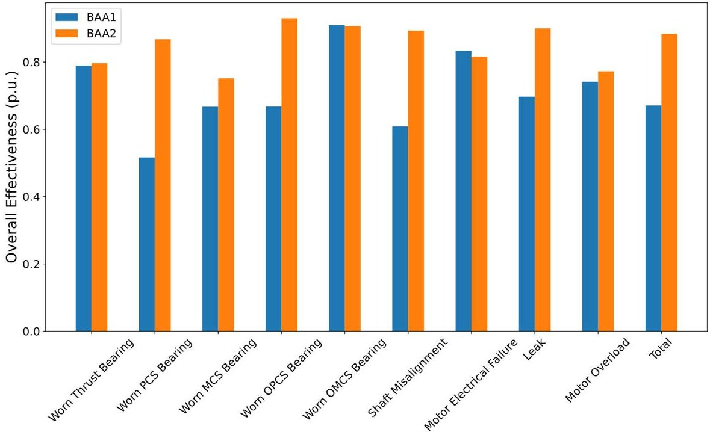

Figure 9. Average maintenance effectiveness by failure mode and overall value for pumps BAA1 and BAA2.

The comparative analysis highlights two key insights. First, the main drivers of performance differences are mechanical in nature, particularly bearings, shaft alignment, and leak management, where BAA2 clearly outperforms BAA1. Second, in domains such as motorrelated failures, both pumps perform at a similarly high level, suggesting that some types of maintenance practices are more standardized and less dependent on contextual factors.

## 4.5.2. Shaft Misalignment

The evolution of the Shaft Misalignment risk curves highlights a significant difference in maintenance performance between BAA1 and BAA2 (Figure 10).

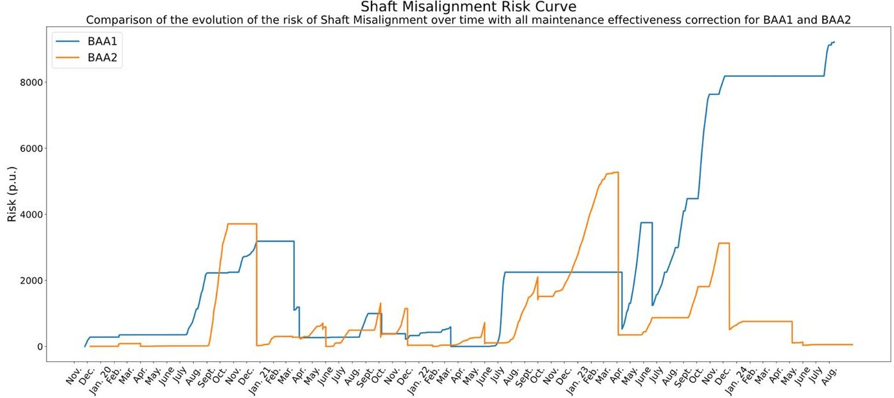

Figure 10. Comparison of corrected risk curves for Shaft Misalignment between pumps BAA1 and BAA2.

<!-- PDF_PAGE: 15 -->

For BAA1, the interventions carried out in 2020, both preventive and corrective, such as bearing oil replenishment, showed little to no immediate impact on risk. A delayed effect is observed only at the beginning of 2021, when the pump was restarted after a shutdown.

Throughout 2021, only preventive actions were implemented, with mixed results: some contributed to risk reduction, while others had no observable effect. Overall, this year remained relatively stable.

In March 2022, a corrective action to repair a leak produced a positive indirect effect on misalignment, temporarily reducing the risk. However, the subsequent preventive actions of that year were largely ineffective. A general overhaul was carried out in April 2023, producing a significant drop in risk, but this was followed by a sustained upward trend.

After July 2023, when one preventive action was relatively successful, both preventive and corrective interventions ceased to show any effect, and the pump entered a phase of chronic risk accumulation that persisted into 2024.

In contrast, BAA2 shows a much more effective trajectory. Similarly to BAA1, the preventive actions of 2020 had little impact, but corrective actions on the bearings at the end of that year, specifically a bearing replacement and oil changes, proved highly effective, resetting the risk to zero.

During 2021, preventive interventions were generally effective, and a corrective shaft alignment performed in June had a 100% effectiveness, completely eliminating accumulated risk. In 2022, only preventive actions were performed, with mixed but generally moderate results.

In 2023, an initial preventive intervention in April again achieved 100% effectiveness followed later in the year by a general overhaul that produced a major reset of the risk curve. Finally, in 2024, unlike BAA1, preventive interventions on BAA2 remained effective, sustaining low levels of misalignment risk.

Overall, the comparison underscores a marked superiority of BAA2 over BAA1 in the management of shaft misalignment. While BAA1 interventions were often delayed inconsistent, or ineffective in producing lasting corrections, BAA2 repeatedly achieved full resets of risk through a combination of timely corrective actions (notably shaft alignment and general overhauls) and more effective preventive practices. This is consistent with the aggregate performance indicators (0.89 for BAA2 versus 0.61 for BAA1) and demonstrates the value of combining high-quality corrective alignments with preventive routines capable of sustaining their effect.

## 4.5.3. Motor Overload

The Motor Overload risk curves for BAA1 and BAA2 show a more balanced picture, with both pumps achieving comparable levels of maintenance effectiveness despite following slightly different trajectories (Figure 11).

For BAA1, the interventions carried out in 2020, both preventive and corrective (oil replenishment in the bearings), had no measurable effect, although the risk remained almost flat during that period. In 2021, only preventive actions were performed. Those carried out when the risk was already rising proved highly effective: three distinct episodes of risk growth were fully corrected by preventive interventions, each time reducing the risk back to zero.

This suggests that preventive actions were able to control the risk provided they were properly timed, although their impact was negligible when the system was already stable. In 2022, a corrective action in March aimed at repairing a leak had no observable effect, and the remaining preventive actions also failed to produce results.

<!-- PDF_PAGE: 16 -->

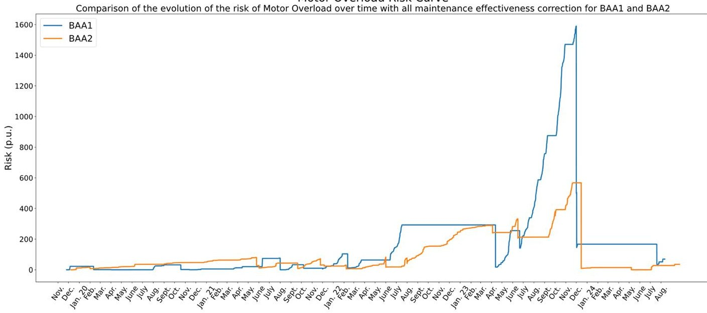

Figure 11. Comparison of corrected risk curves for Motor Overload between pumps BAA1 and BAA2.

In April 2023, a general overhaul achieved a 94% effectiveness, but the improvement was short-lived, as risk began to grow again shortly afterwards. A preventive action in July 2023 achieved 45% effectiveness, but subsequent actions became ineffective.

Finally, a major overhaul in December 2023 delivered a 70% effectiveness, bringing the risk under control. From this point onward, although risk showed a slight upward trend, it remained at manageable levels thanks to subsequent preventive interventions.

For BAA2, the early evolution was very similar: preventive actions in 2020 did not affect the risk, but unlike BAA1, a small steady growth was already observable. Preventive actions in early 2021 also had no effect, but from June onward, they became more effective, periodically reducing the risk.

However, these reductions acted more as temporary corrections than permanent solutions, since the overall trend remained upward. The turning point appears to have been a corrective alignment performed in June 2021, which achieved 66% effectiveness, but did not fully eliminate the underlying problem.

In February 2022, a corrective leak repair had a strong indirect effect (81%) followed by preventive actions with uneven performance: some ineffective, others moderately effective (up to 80% and 46%). From August 2022, however, risk escalated sharply and maintained a constant upward trend.

In April 2023, a preventive action achieved only 17% effectiveness, while the remaining actions that year were ineffective. The final intervention of 2023, a general overhaul proved highly effective (98%) ,resetting the risk after a prolonged escalation. In 2024, only preventive actions were performed, but unlike in BAA1, these showed little to no effect leading once again to an incipient and sustained risk growth.

Overall, the comparison shows that both pumps exhibit similar performance in this failure mode, with preventive interventions occasionally effective but not consistently capable of suppressing long-term trends. Corrective overhauls stand out as the only interventions with consistently high effectiveness, but their impact tends to be temporary unless complemented by effective preventive routines.

Importantly, the risk levels of both pumps remain broadly similar for most of the operating period. The main divergence occurs from late 2022 through 2023, when BAA1 experiences a much sharper increase in risk than BAA2. However, since both pumps underwent major corrective interventions at the end of 2023, BAA2 with a slightly higher effectiveness, their risk levels were reset almost simultaneously. As a result, the overall

<!-- PDF_PAGE: 17 -->

effectiveness converges, yielding comparable aggregate metrics (0.74 for BAA1 and 0.77 for BAA2).

## 4.5.4. Total

The evolution of the total corrected risk curves for BAA1 and BAA2 illustrates the cumulative effect of maintenance actions across all failure modes (Figure 12).

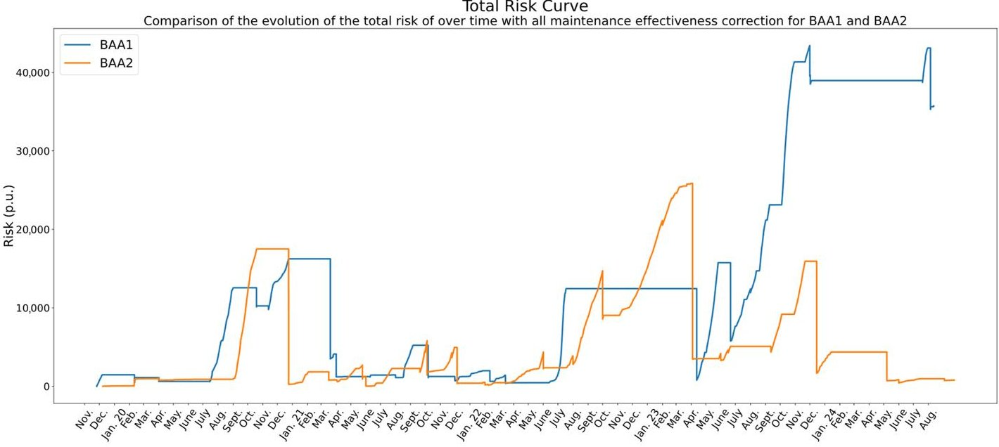

Figure 12. Comparison of total corrected risk curves for pumps BAA1 and BAA2 (aggregate across all failure modes).

For BAA1, the curve remains stable during the first half of 2020, but in July, a sharp increase is observed, which persists until April 2021. At this point, the pump was stopped to perform corrective maintenance (oil replenishment, shaft alignment, among others). These actions proved highly effective, and with the support of subsequent preventive interventions, the total risk remained at low levels until mid-2022.

In July 2022, however, risk rose sharply again, leading to another shutdown and a general overhaul. When the pump was restarted in April 2023, the overhaul initially appeared highly effective, bringing the risk back to zero. Nevertheless, the underlying causes were not resolved: from that moment onward, risk increased abruptly and continuously, with only sporadic reductions linked to occasional preventive actions. At the end of 2023, another overhaul was performed, which managed to slightly reduce the risk, but failed to solve the root cause of degradation. Throughout 2024, the risk remained elevated and stable, reflecting a chronic issue that preventive maintenance alone could not mitigate.

For BAA2, the trajectory is similar during the initial years. After a sudden increase in risk in September 2020, the pump was stopped in October and a bearing repair was carried out, effectively eliminating the accumulated risk. From that point, risk remained low through 2021 and early 2022, supported by preventive tasks and minor corrective interventions (e.g., shaft alignment, oil changes).

Like in BAA1, a steep increase was observed around July 2022, but since BAA1 was undergoing maintenance at that time and BAA2 remained in operation, the risk grew more persistently. The situation was corrected in April 2023 by a highly effective preventive intervention, almost resetting the risk. Subsequently, while BAA1 showed uncontrolled growth, BAA2 maintained risk at relatively stable levels. In August 2023, the risk climbed again but was quickly reduced at the end of the year thanks to a general overhaul that coincided with that of BAA1. During 2024, although a slight upward trend was detected, the risk was kept under control through preventive actions, avoiding the chronic escalation observed in BAA1.

<!-- PDF_PAGE: 18 -->

The comparison reveals that both pumps exhibited similar maintenance performance up to April 2023, with effective corrections and extended periods of stability. However, from that point onward their trajectories diverged significantly. In BAA1, the total risk escalated sharply after the 2023 overhaul and could not be brought back under control, stabilizing instead at consistently high levels throughout 2024. In contrast, BAA2 managed to keep the risk low and under control, even when facing temporary escalations.

Therefore, the overall difference in maintenance performance between the two pumps is largely explained by the period 2023-2024, during which BAA1 failed to contain the accumulation of risk, while BAA2 maintained an effective level of control, approaching near-zero conditions. This divergence is consistent with the aggregate performance indicators, which show an overall effectiveness of 0.67 for BAA1 compared to 0.88 for BAA2, confirming the superior reliability of BAA2. At the same time, it illustrates how two nominally identical assets can follow radically different risk trajectories depending on the quality and timing of interventions. Beyond the aggregate indicators, the corrected curves provide a transparent way to audit these differences, making it possible to identify best practices and benchmark maintenance performance across a fleet. Such insights are particularly valuable for organizations seeking to harmonize strategies, certify practices, or prioritize resources where they yield the greatest reliability gains.

## 5. Discussion

This study presented a methodology to correct risk curves by explicitly incorporating the measured effectiveness of maintenance actions. By scaling the curves according to the historical outcome of each intervention, the proposed approach bridges the gap between anomaly detection and maintenance traceability, offering a more realistic and interpretable representation of asset condition.

The application to feedwater pumps in a combined-cycle power plant demonstrated that corrected curves can accurately reflect the true impact of preventive and corrective actions, distinguishing between interventions that effectively reset degradation and those with no observable effect. Illustrative examples showed that the methodology is capable of capturing both direct effects on targeted failure modes and indirect or collateral effects on related ones, while also identifying situations in which maintenance has no influence.

The comparative analysis of two redundant pumps revealed how the method enables benchmarking of maintenance performance across similar assets. At the failure-mode level, clear differences emerged: one pump systematically achieved higher effectiveness in bearings, shaft alignment, and sealing-related modes, whereas the other exhibited recurrent difficulties in sustaining improvements. In other modes, such as motor overload and electrical failures, both pumps displayed comparable effectiveness, indicating that some maintenance practices are more standardized and less dependent on execution context.

At the aggregate level, the corrected total risk curves highlighted that both pumps behaved similarly until early 2023, after which their trajectories diverged: while one accumulated chronic, uncontrolled risk, the other maintained stable and near-zero levels. This divergence was reflected in the overall maintenance performance indicators, confirming the superior reliability of one of the units.

From a theoretical standpoint, the methodology contributes to the broader field of imperfect maintenance modelling. Although the correction mechanism is heuristic, its slopebased rationale aligns with established concepts of partial restoration in reliability growth and imperfect maintenance models. This combination of simplicity and interpretability strengthens its industrial applicability.

Several practical aspects and limitations must be acknowledged:

<!-- PDF_PAGE: 19 -->

1. First, the methodology relies on the availability and quality of data: precise annotation of maintenance actions and reliable sensor records are essential to correctly evaluate intervention effectiveness. In contexts with poor data quality, results may be compromised, although expert validation and preprocessing techniques can mitigate this.

2. Second, although the methodology has been developed with continuous monitoring in mind, it is not restricted to such settings. The approach can also be applied to inspection-based or periodically sampled systems, provided historical records are sufficient and sampling aligns with degradation dynamics.

3. Third, another limitation arises from the definition of effectiveness itself. The current definition assumes that slope variations fully capture intervention outcomes. While intuitive, this may overlook delayed or cumulative effects. Extending the metric to incorporate temporal dynamics remains a key avenue for future work.

4. Finally, the validation presented in this study has been carried out on a specific type of equipment, feedwater pumps in a combined-cycle power plant. Although the methodology is general and can be applied to other assets, the current evidence is limited to this industrial case. Expanding validation to other equipment types and across multiple plants will be an important next step to demonstrate the robustness and generality of the approach.

The method has already been validated through real industrial case studies, confirming its practical feasibility and reliability. These results reinforce the applicability of the proposed approach and provide a solid basis for future comparative studies with other predictive maintenance methodologies.

In summary, the corrected risk curves enhance diagnostic and prescriptive value by integrating maintenance effectiveness into risk assessment. They provide practical insights at both the component and system levels, enabling benchmarking across assets and supporting predictive, risk-informed maintenance strategies.

## 6. Conclusions

This paper proposed a novel methodology to dynamically correct risk curves by incorporating the measured effectiveness of maintenance actions. The method addresses a critical gap in predictive maintenance frameworks, where the corrective effect of interventions is often ignored, and provides a transparent link between maintenance outcomes and the ongoing evolution of risk.

Case studies on feedwater pumps demonstrated that the approach can distinguish effective interventions from ineffective ones, capture both direct and collateral effects across failure modes, and enable benchmarking of maintenance performance across redundant assets. These results confirm the practical value of the methodology for improving maintenance planning, optimizing resource allocation, and identifying ineffective practices.

Limitations include dependence on sensor and record quality, the assumption that risk slope changes fully represent effectiveness, and the current validation scope being restricted to a single equipment type. Future research will extend the metric to account for time-dependent and cumulative effects, integrate corrected risk curves into forecasting models, and validate the approach across diverse assets and plants. Future work will also include benchmarking the proposed method against other predictive maintenance approaches to further assess its comparative performance.

In conclusion, maintenance-corrected risk curves represent a practical and interpretable advancement toward predictive, risk-informed strategies, combining theoretical novelty with clear industrial applicability.

<!-- PDF_PAGE: 20 -->

Author Contributions: F.J.B.-L.: Writing-review and editing, writing-original draft, methodology investigation, formal analysis, conceptualization. M.A.S.-B.: Visualization, validation, supervision conceptualization. A.M.: Visualization, validation, supervision, conceptualization. D.G.-C.: Visualization, resources. T.A.-T.: Visualization, resources. All authors have read and agreed to the published version of the manuscript.

Funding: This research received no external funding.

Data Availability Statement: The data that has been used is confidential.

Acknowledgments: The study has been developed with the scientific and economic support of the ENDESA Chair of Artificial Intelligence Applications to Data-driven Maintenance. During the preparation of this work the author(s) used ChatGPT 5 in order to improve the quality of writing of certain paragraphs. After using this tool/service, the author(s) reviewed and edited the content as needed and take(s) full responsibility for the content of the publication.

Conflicts of Interest: Authors Daniel Gonzalez-Calvo and Tomas Alvarez-Tejedor were employed by the Enel Green Power and Thermal Generation. The remaining author declare that the research was conducted in the absence of any commercial or financial relationships that could be construed as a potential conflict of interest.

## References

1. Hamasha, M.M.; Bani-Irshid, A.H.; Al Mashaqbeh, S.; Shwaheen, G.; Al Qadri, L.; Shbool, M.; Muathen, D.; Ababneh, M.; Harfoush, S.; Albedoor, Q.; et al. Strategical selection of maintenance type under different conditions. Sci. Rep. 2023, 13, 15560. [CrossRef]

2. Nunes, P.; Santos, J.; Rocha, E. Challenges in predictive maintenance-A review. CIRP J. Manuf. Sci. Technol. 2023, 40, 53-67. [CrossRef]

3. Karki, B.R.; Basnet, S.; Xiang, J.; Montoya, J.; Porras, J. Digital maintenance and the functional blocks for sustainable asset maintenance service—A case study. Digit. Bus. 2022, 2, 100025. [CrossRef]

4. Naiya, S. AI-Powered Predictive Maintenance in IoT-Enabled Smart Factories. Res. Ann. Ind. Syst. Eng. 2025, 2, 27-35. [CrossRef]

5. Moccardi, A.; Conte, C.; Chandra Ghosh, R.; Moscato, F. A Robust Conformal Framework for IoT-Based Predictive Maintenance. Future Internet 2025, 17, 244. [CrossRef]

6. Prasad, P.B. IoT and Machine Learning-Driven Predictive Maintenance for Enhanced Supply Chain Performance. Commun. Appl. Nonlinear Anal. 2025, 32, 1577-1588. [CrossRef]

7. Carvalho, T.P.; Soares, F.A.A.M.N.; Vita, R.; Francisco, R.d.P.; Basto, J.P.; Alcalá, S.G.S. A systematic literature review of machine learning methods applied to predictive maintenance. Comput. Ind. Eng. 2019, 137, 106024. [CrossRef]

8. Sharma, J.; Mittal, M.L.; Soni, G. Condition-based maintenance using machine learning and role of interpretability: A review. Int. J. Syst. Assur. Eng. Manag. 2024, 15, 1345-1360. [CrossRef]

9. Achouch, M.; Dimitrova, M.; Ziane, K.; Sattarpanah Karganroudi, S.; Dhouib, R.; Ibrahim, H.; Adda, M. On Predictive Maintenance in Industry 4.0: Overview, Models, and Challenges. Appl. Sci. 2022, 12, 8081. [CrossRef]

10. Zonta, T.; da Costa, C.A.; da Rosa Righi, R.; de Lima, M.J.; da Trindade, E.S.; Li, G.P. Predictive maintenance in the Industry 4.0: A systematic literature review. Comput. Ind. Eng. 2020, 150, 106889. [CrossRef]

11. Ojeda, J.C.O.; de Moraes, J.G.B.; Filho, C.V.d.S.; Pereira, M.d.S.; Pereira, J.V.d.Q.; Dias, I.C.P.; da Silva, E.C.M.; Peixoto, M.G.M.; Gonçalves, M.C. Application of a Predictive Model to Reduce Unplanned Downtime in Automotive Industry Production Processes: A Sustainability Perspective. Sustainability 2025, 17, 3926. [CrossRef]

12. Sang, G.M.; Xu, L.; de Vrieze, P. A Predictive Maintenance Model for Flexible Manufacturing in the Context of Industry 4.0. Front. Big Data 2021, 4, 663466. [CrossRef] [PubMed]

13. Maierhofer, A.; Trojahn, S.; Ryll, F. Dynamic Scheduling and Preventive Maintenance in Small-Batch Production: A Flexible Control Approach for Maximising Machine Reliability and Minimising Delays. Appl. Sci. 2025, 15, 4287. [CrossRef]

14. Fadaeefath Abadi, M.; Bordbari, M.J.; Haghighat, F.; Nasiri, F. Dynamic Maintenance Cost Optimization in Data Centers: An Availability-Based Approach for K-out-of-N Systems. Buildings 2025, 15, 1057. [CrossRef]

15. Hakami, A. Strategies for overcoming data scarcity, imbalance, and feature selection challenges in machine learning models for predictive maintenance. Sci. Rep. 2024, 14, 9645. [CrossRef]

16. Hurtado, J.; Salvati, D.; Semola, R.; Bosio, M.; Lomonaco, V. Continual learning for predictive maintenance: Overview and challenges. Intell. Syst. Appl. 2023, 19, 200251. [CrossRef]

<!-- PDF_PAGE: 21 -->

17. Wen, Y.; Fashiar Rahman, M.; Xu, H.; Tseng, T.-L.B. Recent advances and trends of predictive maintenance from data-driven machine prognostics perspective. Measurement 2022, 187, 110276. [CrossRef]

18. Hector, I.; Panjanathan, R. Predictive maintenance in Industry 4.0: A survey of planning models and machine learning techniques. PeerJ Comput. Sci. 2024, 10, e2016. [CrossRef]

19. Benhanifia, A.; Cheikh, Z.B.; Oliveira, P.M.; Valente, A.; Lima, J. Systematic review of predictive maintenance practices in the manufacturing sector. Intell. Syst. Appl. 2025, 26, 200501. [CrossRef]

20. Abbassi, R.; Arzaghi, E.; Yazdi, M.; Aryai, V.; Garaniya, V.; Rahnamayiezekavat, P. Risk-based and predictive maintenance planning of engineering infrastructure: Existing quantitative techniques and future directions. Process Saf. Environ. Prot. 2022, 165, 776-790. [CrossRef]

21. Leoni, L.; De Carlo, F.; Paltrinieri, N.; Sgarbossa, F.; BahooToroody, A. On risk-based maintenance: A comprehensive review of three approaches to track the impact of consequence modelling for predicting maintenance actions. J. Loss Prev. Process Ind. 2021, 72, 104555. [CrossRef]

22. Liao, R.; He, Y.; Feng, T.; Yang, X.; Dai, W.; Zhang, W. Mission reliability-driven risk-based predictive maintenance approach of multistate manufacturing system. Reliab. Eng. Syst. Saf. 2023, 236, 109273. [CrossRef]

23. da Silva, R.F.; Melani, A.H.d.A.; Michalski, M.A.d.C.; de Souza, G.F.M. Reliability and Risk Centered Maintenance: A Novel Method for Supporting Maintenance Management. Appl. Sci. 2023, 13, 10605. [CrossRef]

24. Montgomery, N.; Banjevic, D.; Jardine, A.K.S. Minor maintenance actions and their impact on diagnostic and prognostic CBM models. J. Intell. Manuf. 2012, 23, 303-311. [CrossRef]

25. Cox, L.A. Improving interventional causal predictions in regulatory risk assessment. Crit. Rev. Toxicol. 2023, 53, 311-325. [CrossRef]

26. Carlo, F.D.; Arleo, M.A.; Carlo, F.D.; Arleo, M.A. Imperfect Maintenance Models, from Theory to Practice. In System Reliability; IntechOpen: London, UK, 2017; ISBN 978-953-51-3706-1.

27. Zhong, D.; Xia, Z.; Zhu, Y.; Duan, J. Overview of predictive maintenance based on digital twin technology. Heliyon 2023, 9, e14534. [CrossRef]

28. You, Y.; Chen, C.; Hu, F.; Liu, Y.; Ji, Z. Advances of Digital Twins for Predictive Maintenance. Procedia Comput. Sci. 2022, 200, 1471-1480. [CrossRef]

29. van Dinter, R.; Tekinerdogan, B.; Catal, C. Predictive maintenance using digital twins: A systematic literature review. Inf. Softw. Technol. 2022, 151, 107008. [CrossRef]

30. Morato, P.G.; Papakonstantinou, K.G.; Andriotis, C.P.; Nielsen, J.S.; Rigo, P. Optimal inspection and maintenance planning for deteriorating structural components through dynamic Bayesian networks and Markov decision processes. Struct. Saf. 2022, 94, 102140. [CrossRef]

31. Mahale, Y.; Kolhar, S.; More, A.S. A comprehensive review on artificial intelligence driven predictive maintenance in vehicles: Technologies, challenges and future research directions. Discov. Appl. Sci. 2025, 7, 243. [CrossRef]

32. Wu, F.; Wu, Q.; Tan, Y.; Xu, X. Remaining Useful Life Prediction Based on Deep Learning: A Survey. Sensors 2024, 24, 3454. [CrossRef]

33. Bellido-Lopez, F.J.; Sanz-Bobi, M.A.; Muñoz, A.; Gonzalez-Calvo, D.; Alvarez-Tejedor, T. A novel method for evaluation of the maintenance impact in the health of industrial components. Results Eng. 2025, 27, 105809. [CrossRef]

Disclaimer/Publisher's Note: The statements, opinions and data contained in all publications are solely those of the individual author(s) and contributor(s) and not of MDPI and/or the editor(s). MDPI and/or the editor(s) disclaim responsibility for any injury to people or property resulting from any ideas, methods, instructions or products referred to in the content.