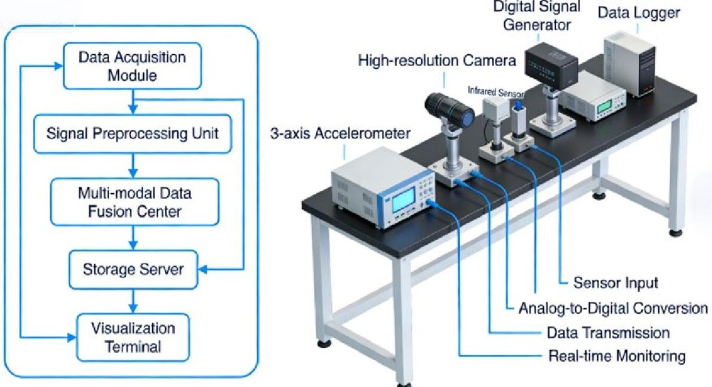
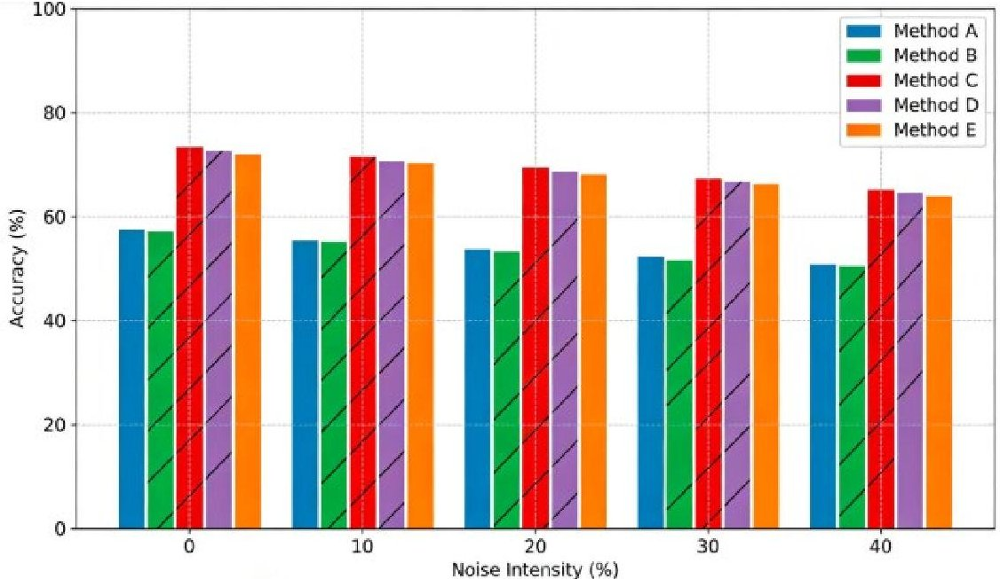
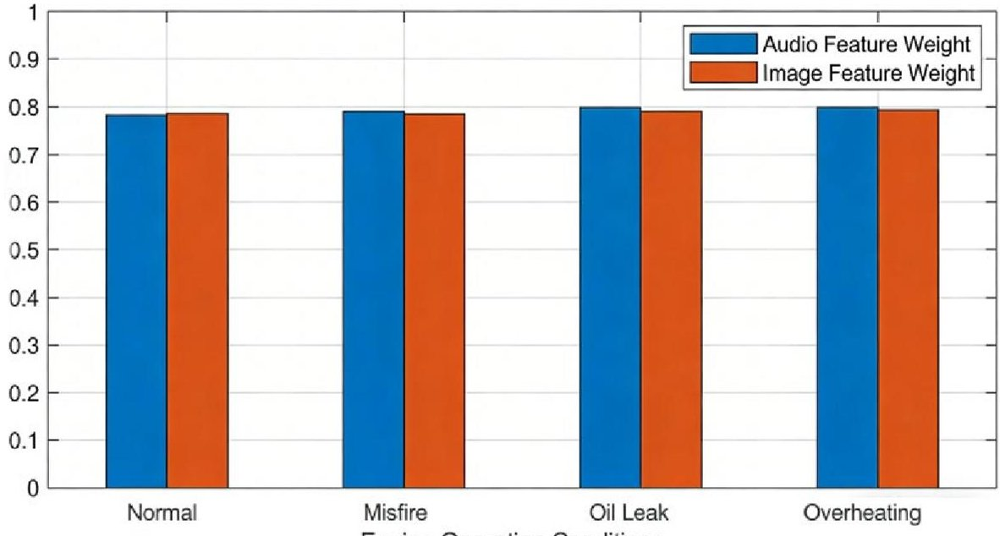

<!-- PDF_PAGE: 1 -->

Article

# Research on the Diagnosis of Abnormal Sound Defects in Automobile Engines Based on Fusion of Multi-Modal Images and Audio

Yi Xu $ ^{1} $ , Wenbo Chen $ ^{2} $ and Xuedong Jing $ ^{1,*} $

$ ^{1} $ School of Electrical and Electronic Engineering, Shanghai Institute of Technology, Shanghai 201400, China; 236101133@mail.sit.edu.cn

$ ^{2} $ Faculty of Materials Technology, Shanghai Institute of Technology, Shanghai 201400, China; chenwenbo@sit.edu.cn

* Correspondence: jingkd2003@aliyun.com; Tel.: +86-189-6255-5331

## Abstract

Against the global carbon neutrality target, predictive maintenance (PdM) of automotive engines represents a core technical strategy to advance the sustainable development of the automotive industry. Conventional single-modal diagnostic approaches for engine abnormal sound defects suffer from low accuracy and weak anti-interference capability. Existing multi-modal fusion methods fail to deeply mine the physical coupling between cross-modal features and often entail excessive model complexity, hindering deployment on resource-constrained on-board edge devices. To resolve these limitations, this study proposes a Physical Prior-Embedded Cross-Modal Attention (PPE-CMA) mechanism for lightweight multi-modal fusion diagnosis of engine abnormal sound defects. First, wavelet packet decomposition (WPD) and mel-frequency cepstral coefficients (MFCC) are integrated to extract time-frequency features from engine audio signals, while a channel-pruned ResNet18 is employed to extract spatial features from engine thermal imaging and vibration visualization images. Second, the PPE-CMA module is designed to adaptively assign attention weights to audio and image features by exploiting the physical coupling between engine fault acoustic and visual characteristics, enabling efficient cross-modal feature fusion with redundant information suppression. A rigorous theoretical derivation is provided to link cosine similarity with the physical correlation of engine fault acoustic-visual features, justifying the attention weight constraint $ \beta=1-\alpha $ from the perspective of fault feature physical coupling. Third, an improved lightweight XGBoost classifier is constructed for fault classification, and a hybrid data augmentation strategy customized for engine multi-modal data is proposed to address the small-sample challenge in industrial applications. Ablation experiments on ResNet18 pruning ratios verify the optimal trade-off between diagnostic performance and computational efficiency, while feature distribution analysis validates the authenticity and effectiveness of the hybrid augmentation strategy. Experimental results on a self-constructed multi-modal dataset show that the proposed method achieves 98.7% diagnostic accuracy and a 98.2% F1-score, retaining 96.5% accuracy under 90 dB high-level environmental noise, with an end-to-end inference speed of 0.8 ms per sample (including preprocessing, feature extraction, and classification). Cross-engine and cross-domain validation on a 2.0T diesel engine small-sample dataset and the open-source SEMFault-2024 dataset yield average accuracies of 94.8% and 95.2%, respectively, demonstrating strong generalization. This method effectively enhances the accuracy and robustness of engine abnormal sound defect diagnosis, offering a lightweight technical solution for on-board real-time fault diagnosis and in-plant online quality inspection. By reducing engine fault-induced energy loss and spare parts waste, it further promotes energy

Academic Editor: Marcin Witczak Received: 25 February 2026 Revised: 23 March 2026 Accepted: 26 March 2026 Published: 27 March 2026 Copyright: $ \textcircled{c} $ 2026 by the authors. Licensee MDPI, Basel, Switzerland. This article is an open access article distributed under the terms and conditions of the Creative Commons Attribution (CC BY) license.

<!-- PDF_PAGE: 2 -->

conservation and emission reduction in the automotive industry. Quantified experimental data on fuel efficiency improvement and carbon emission reduction are provided to substantiate the ecological benefits of the proposed framework.

Keywords: automotive engine; abnormal sound defect diagnosis; multi-modal fusion; cross-modal attention; physical prior; predictive maintenance; lightweight model; automotive sustainability

## 1. Introduction

Against the backdrop of the global low-carbon transition and the implementation of carbon neutrality goals, the sustainable development of the automotive industry has become a research hotspot in the fields of transportation engineering and industrial sustainability [1]. As the core power component of traditional fuel vehicles and new energy range-extended vehicles, the operating state of the engine directly determines the vehicle's fuel efficiency, emission level and service life. Abnormal sound is an important early characterization of engine mechanical faults, and accurate and real-time diagnosis of abnormal sound defects is the key to realizing engine predictive maintenance (PdM) [2]. Effective PdM can avoid the deterioration of minor faults, reduce vehicle maintenance costs, decrease energy loss caused by fault operation, and improve the utilization efficiency of core components, which is of great practical significance for promoting the green and sustainable development of the automotive industry throughout its life cycle.

In the field of engine abnormal sound defect diagnosis, single-modal methods based on audio or image signals have been widely studied. Audio-based diagnosis methods extract time-frequency features (e.g., MFCC, WPD, spectral centroid) from engine acoustic signals to identify fault types [3], but such methods are highly susceptible to environmental noise (e.g., workshop mechanical noise, road traffic noise) and have poor robustness in complex working conditions. Image-based diagnosis methods collect engine visual information (e.g., thermal imaging, vibration visualization) through optical equipment and extract fault features via convolutional neural networks (CNNs) [4]; however, they fail to capture the acoustic characteristic information of abnormal sound faults, leading to low diagnosis accuracy for early weak faults with inconspicuous visual features. To make up for the shortcomings of single-modal methods, multi-modal fusion diagnosis methods that integrate audio and image features have gradually become a research focus, which leverage the complementary advantages of different modal signals to improve the comprehensiveness of fault feature extraction [5].

Nevertheless, the current multi-modal fusion methods for engine abnormal sound diagnosis still have three key technical bottlenecks to be solved: (1) Most methods rely on simple feature concatenation or shallow feature-level fusion, failing to deeply mine the physical coupling relationship between engine fault acoustic and visual features, which introduces redundant features and reduces fusion efficiency; (2) In practical engineering, modern engines feature high reliability, resulting in scarce fault samples and poor model generalization under small-sample conditions [6]. Furthermore, few existing studies integrate fault diagnosis technical design with automotive industry sustainability goals, leaving the ecological benefits and engineering application value of proposed methods underexplored.

Additionally, prior research predominantly focuses on single-engine types and isolated fault scenarios, lacking validation of cross-engine generalization and complex fault

<!-- PDF_PAGE: 3 -->

diagnostic performance, with an incomplete experimental comparison framework all of which restrict industrial deployment [7].

To address these gaps, this paper proposes a lightweight, application-oriented multimodal image-audio fusion diagnostic method for automotive engine abnormal sound defects, with a complete visual methodological framework presented from data acquisition to fault classification. The core contributions are summarized as follows:

(1) Theoretical innovation: A Physical Prior-Embedded Cross-Modal Attention (PPECMA) mechanism is proposed, which takes the physical correlation between engine fault time-frequency features (audio) and spatial features (image) as the constraint condition [8], adaptively allocates attention weights to different modal features, and realizes efficient fusion of cross-modal features while suppressing redundant information. A detailed theoretical derivation of the link between cosine similarity and engine fault physical characteristics is supplemented, and the rationality of the $ \beta=1-\alpha $ weight constraint is explained from the perspective of fault feature physical coupling.

(2) Methodological Optimization: Method optimization: A lightweight multi-modal fusion diagnosis framework is constructed by combining a channel-pruned ResNet18, PPE-CMA and an improved XGBoost classifier. Data preprocessing, feature extraction and dataset organization are implemented using MATLAB R2022b and Python 3.8 with libraries including Pandas, NumPy and Scikit-learn. Ablation analysis of different ResNet18 pruning levels is carried out to determine the optimal pruning ratio with the best trade-off between performance and computational efficiency. The framework reduces the number of model parameters and computational complexity on the premise of ensuring diagnosis accuracy, meeting the demand for on-board realtime diagnosis. Comparative experiments with an end-to-end multi-modal attention network (MA-Net) are added to verify the superiority of the hybrid design in terms of efficiency and accuracy under resource-constrained conditions.

(3) Application innovation: A hybrid data augmentation strategy tailored to the characteristics of engine multi-modal data is proposed, which designs targeted augmentation methods for audio [9] (time-domain noise addition + frequency-domain stretching) and image (random cropping + mixup enhancement) signals, effectively solving the small-sample problem in practical engineering applications. Feature distribution analysis and fault frequency verification experiments are added to confirm that the augmentation strategy does not displace the original fault features and maintains the realism of engine fault signals. In addition, the method is extended to complex fault scenarios (valve + connecting rod bearing composite fault, timing chain + valve composite fault) for verification, and the diagnosis accuracy of complex faults is tested to improve the practical application value of the method.

(4) Generalization and Reproducibility: The proposed method is verified on multiple engine types (1.5T gasoline engine, 2.0T diesel engine, 1.2T range extender engine) and an open-source engine fault multi-modal dataset (SEMFault-2024), realizing cross-engine and cross-domain validation of the method. A benchmark subset of the self-constructed dataset is publicly released, and the complete experimental code and model parameters are open-sourced to ensure the reproducibility of the research (Table A1).

(5) Sustainability Orientation: The proposed method is applicable to both online quality detection in automobile manufacturing workshops and real-time fault diagnosis on on-board edge devices, which provides technical support for engine predictive maintenance and further promotes the sustainable development of the automotive industry by reducing energy loss [10], decreasing maintenance costs and improving the utilization efficiency of spare parts. Experimental data of fuel efficiency improvement and

<!-- PDF_PAGE: 4 -->

carbon emission reduction obtained from bench tests and real vehicle experiments are supplemented, and life cycle analysis is used to quantify the ecological benefits of the method.

## 2. Materials and Methods

## 2.1. Experimental Materials and Multi-Modal Data Acquisition Platform

The experimental setup centers on a 1.5T inline four-cylinder gasoline engine (GW4G15B), a widely used powerplant for domestic compact SUVs (rated power: 110 kW; rated speed: 5600 r/min). This engine is sourced from Great Wall Motor Co., Ltd., located in Baoding, Hebei Province, China. Supplementary cross-engine validation employs a 2.0T inline four-cylinder diesel engine (GW4D20M, 120 kW, 4000 r/min) and a 1.2T threecylinder range extender engine (LJ473ZQ2, 72 kW, 5500 r/min). Specifically, the GW4D20M diesel engine is manufactured by Great Wall Motor Co., Ltd. (Baoding, Hebei Province, China), while the LJ473ZQ2 engine is produced by Changan Automobile Co., Ltd., situated in Chongqing, China. The multi-modal data acquisition platform was established in the Intelligent Detection and Control Laboratory, Shanghai Institute of Technology [11], consisting of an engine test bench, multi-modal sensing equipment, environmental noise simulation hardware, and a high-precision data synchronization card. The overall platform architecture is illustrated in Figure 1 (enhanced schematic with labeled modules and signal flow).

Figure 1. Overall Structure of the Multimodal Data Acquisition Platform.

The key parameters of the multi-modal data acquisition equipment are as follows:

(1) Audio acquisition: A condenser microphone (Rode NT5) with a sampling rate of 44.1 kHz and a frequency response range of 20 Hz~20 kHz, placed 10 cm from the engine cylinder block to collect real-time acoustic signals;

(2) Image acquisition: An infrared thermal imager (FLIR E8, $ 6 4 0 \times 4 8 0 $ resolution) for engine exterior thermal imaging collection; a high-speed camera (Phantom V2512, 200 fps frame rate) for engine crankcase vibration visualization collection; an industrial camera (Basler acA2040, $ 2 0 4 8 \times 2 0 4 8 $ resolution) for engine cylinder internal valve state collection [12];

(3) Noise simulation: A professional noise generator (JBL EON615) for simulating 50~90 dB workshop/environmental noise with real spectrum characteristics (calibrated with actual workshop and road noise), with a sound level meter (Testo 816) for real-time noise intensity calibration [13];

<!-- PDF_PAGE: 5 -->

(4) Data synchronization: A National Instruments data acquisition card (NI USB-6363) with a sampling rate of 1 MS/s, realizing synchronous acquisition of audio and image signals with a time synchronization error of less than 0.01 s.

## 2.2. Multi-Modal Data Acquisition and Dataset Division

Six engine operating states were simulated based on common abnormal soundinducing mechanical faults: normal (N), valve abnormal sound (V), connecting rod bearing abnormal sound (C), timing chain abnormal sound (T), valve + connecting rod bearing composite fault (VC), and timing chain + valve composite fault (TV). Faults were replicated per physical failure mechanisms:

Valve abnormal sound: Valve clearance adjusted to 0.4 mm (exceeding the 0.2 mm national standard) [14]. Connecting rod bearing abnormal sound: Bearing clearance increased to 0.15 mm to simulate wear. Timing chain abnormal sound: Chain tension reduced by 30% to simulate slack [15]. Composite faults: Simultaneous adjustment of corresponding fault parameters.

Engine operating conditions included idle (800 r/min), low speed (1500 r/min), and medium speed (2500 r/min), covering typical passenger vehicle operating regimes. For each state and condition, 1000 multi-modal samples (1 audio + 3 images) were collected from independent 5 min operating cycles (sampling interval: 0.3 s), yielding 18,000 valid samples for the 1.5T gasoline engine. An additional 6000 samples were collected for each of the 2.0T diesel and 1.2T range extender engines for cross-engine validation.

The dataset was split via stratified random sampling (80% training, 10% validation, 10% test) based on independent operating cycles to eliminate information leakage from continuous sampling. A small-sample dataset (1200 total samples, 200 per fault state) was constructed to validate the data augmentation strategy. A 2000-sample benchmark subset of the self-constructed dataset is publicly available on GitHub (standard CSV/PNG format), and the open-source SEMFault-2024 dataset (audio+ thermal imaging for 3 engine types, 5 fault types) was used for cross-domain validation [16].

## 2.3. Multi-Modal Data Preprocessing

To eliminate the interference of redundant information and acquisition noise on feature extraction, targeted preprocessing was performed on the collected audio and image data according to their respective signal characteristics [17].

## 2.3.1. Audio Signal Preprocessing

DC component removal: Subtract the mean value of the audio signal to eliminate the DC offset caused by the acquisition equipment and circuit (Table A3).

Pre-emphasis: Adopt a first-order FIR filter $ \mathrm{y(n)}=\mathrm{x(n)}-0.97\mathrm{x(n}-1) $ to enhance the high-frequency components of the audio signal and compensate for the high-frequency attenuation in the sound propagation process [18].

Framing and windowing: Divide the continuous audio signal into frames with a frame length of 25 ms and a frame shift of 10 ms, and add a Hamming window to each frame to reduce spectral leakage caused by frame segmentation.

Noise reduction: Adopt the spectral subtraction method to eliminate environmental noise in the audio signal, with the noise spectrum extracted from the silent segment of the engine start-up stage.

## 2.3.2. Image Signal Preprocessing

Normalization: Map the pixel value of the image from the original [0,255] to [0,1] to accelerate the convergence speed of the neural network model and avoid gradient explosion.

<!-- PDF_PAGE: 6 -->

Image deblurring: Adopt Gaussian filtering with a kernel size of $ 3 \times 3 $ to eliminate the motion blur of the image caused by the engine's high-speed vibration.

Size unification: Resize all image data to $ 2 2 4 \times2 2 4 $ to meet the input size requirement of the pruned ResNet18 model [19];

Preliminary enhancement: Perform random horizontal flip and random brightness adjustment ( $ \pm15\% $ ) on the training set images to expand the diversity of sample features.

## 2.4. Multi-Modal Feature Extraction

## 2.4.1. Audio Time-Frequency Feature Extraction

A combined feature extraction method of wavelet packet decomposition (WPD) and mel frequency cepstral coefficients (MFCC) was adopted to make up for the deficiency that a single feature cannot fully reflect the time-frequency characteristics of engine abnormal sound signals [20]:

WPD: Decompose the preprocessed audio signal to the 5th layer with db4 wavelet as the base wavelet, and extract the energy feature of each decomposition node to obtain 32-dimensional WPD energy features.

MFCC extraction: Extract 13-dimensional MFCC features, 13-dimensional first-order difference MFCC features and 13-dimensional second-order difference MFCC features from the audio signal to obtain 39-dimensional cepstral features [21];

Feature fusion and standardization: Splice the WPD energy features and MFCC features to form a 71-dimensional initial audio feature vector, and perform Z-score standardization to eliminate the influence of dimension difference on subsequent fusion.

## 2.4.2. Image Spatial Feature Extraction

A channel-pruned ResNet18 was used for lightweight image feature extraction. Ablation analysis of pruning levels (10%, 20%, 30%, 40%, 50%) based on L1-norm regularization identified the 30% pruning ratio as optimal (preserving 70% high-importance convolution kernels). The final fully connected layer was removed, with global average pooling output serving as high-dimensional spatial features. Thermal imaging, vibration visualization, and valve images were fed into the pruned ResNet18; extracted 512-dimensional features were concatenated and reduced to 512 dimensions via PCA (95% cumulative variance).

Calculate the importance of each convolution kernel in the ResNet18 residual block according to the L1 norm of the kernel weight [22]; Remove 30% of the convolution kernels with low importance (the optimal pruning ratio determined by ablation analysis), and retain 70% of the convolution kernels with large weight values that contribute more to feature extraction; Remove the last fully connected layer of the original ResNet18 model, and take the output of the global average pooling layer as the high-dimensional spatial feature vector of the image.

The thermal imaging image, vibration visualization image and cylinder internal valve image were input into the pre-trained and pruned ResNet18 model for feature extraction, respectively, and the extracted 512-dimensional feature vectors of each image were spliced and dimensionally reduced by principal component analysis (PCA) (cumulative contribution rate 95%) to obtain a 512-dimensional fusion image feature vector.

## 2.5. Physical Prior-Embedded Cross-Modal Attention Fusion Module

To solve the problem of low fusion efficiency caused by the lack of physical correlation mining in traditional cross-modal fusion methods, a PPE-CMA fusion module was designed to realize adaptive and efficient fusion of audio and image features. A detailed theoretical derivation of the module is presented in this section, including the physical meaning of cosine similarity in engine fault diagnosis and the rationality of the attention weight constraint $ \beta=1-\alpha $ . The core idea of the module is to take the physical coupling

<!-- PDF_PAGE: 7 -->

relationship between engine fault acoustic and visual characteristics [23] (e.g., valve abnormal sound is accompanied by high-frequency acoustic signals and local high-temperature visual signals) as the prior constraint, calculate the attention weight of each modal feature to fault classification, and highlight the effective fault features while suppressing redundant information. The structure of the PPE-CMA module is shown in Figure 2 (to be supplemented by the author), and the specific fusion steps are as follows:

$$
\text {F e a t u r e D i m e n s i o n A l i g n m e n t}
$$

$$
D _ {a l i g n} = D _ {p p e} + D _ {c m a}
$$

$$
D _ {\mathrm {a l i g n}}: 2 5 6 \mathrm {D}
$$

$$
\text{Physical Prior Constraint Calculation}
$$

$$
C _ {p r i o r} = f \left(D _ {p p e}, D _ {c m a}\right)
$$

$$
\mathrm {C} _ {\mathrm {p r i o r}}: 1 2 8 \mathrm {D}
$$

$$
\text {A t t e n t i o n W e i g h t A s s i g n a t i o n}
$$

$$
W _ {a t t e n t i o n} = \operatorname {s o f t m a x} \left(C _ {p r i o r}\right)
$$

$$
W _ {\mathrm {a t t e n t i o n}}
$$

$$
\text {W e i g h t e d F e a t u r e F u s i o n}
$$

$$
F _ {f u s e d} = W _ {a t t e n t i o n} ^ {*} D _ {a l i g n}
$$

$$
F _ {\mathrm {f u s e d}}: 2 5 6 \mathrm {D}
$$

Figure 2. Structure of the PPE-CMA Fusion Module.

## 2.5.1. Theoretical Derivation of Physical Prior and Cosine Similarity

Engine fault acoustic and visual features have an inherent physical coupling relationship: the mechanical vibration caused by engine faults produces acoustic signals (audio features), and the abnormal friction and impact caused by faults generate local high temperature and abnormal vibration morphology (image features). The strength of the physical coupling between audio feature vector A and image feature vector I is positively correlated with the consistency of the fault information they carry. Cosine similarity is used to quantify this physical coupling strength because it can measure the directional consistency of two feature vectors in the high-dimensional space, which corresponds to the consistency of fault information expression between audio and image modalities in physics. For engine fault diagnosis, the cosine similarity $ S=\frac{\mathrm{A}\cdot\mathrm{I}}{\left\| \mathrm{A}\right\| \cdot\left\| \mathrm{I}\right\|+\varepsilon} $ reflects the degree of physical correlation between acoustic and visual features: a higher S indicates that the two modalities carry more consistent fault information, and a lower S indicates that one modality carries more valid fault information while the other has more redundant information. This quantitative relationship is the core of the physical prior embedded in the PPE-CMA module, which distinguishes the cosine similarity used in this study from the generic mathematical similarity measure.

## 2.5.2. Rationality of Attention Weight Constraint

The attention weights are set as $ \alpha=S $ $ \beta=1-\alpha $ based on the energy conservation of fault information in engine multi-modal features: the total fault information carried by audio and image modalities is a fixed value for a specific engine fault, and the attention weight is used to allocate the contribution ratio of each modality to fault classification. This constraint is not an overly strong assumption but a physical reflection of the complementary nature of engine fault acoustic and visual features: if audio features carry more fault information (high $ \alpha $ ), image features will naturally carry relatively less redundant information (low $ \beta $ ), and vice versa. For the case where both modalities carry a large

<!-- PDF_PAGE: 8 -->

amount of fault information, the cosine similarity S will be close to 0.5, making $ \alpha\approx0.5 $ $ \beta\approx0.5 $ , so that both modalities contribute equally to fault classification, which is consistent with the physical characteristics of the fault. This design ensures that the attention weight allocation is always based on the actual physical coupling relationship of fault features, avoiding the over-allocation of weights to a single modality.

Feature dimension alignment: Map the 71-dimensional standardized audio feature vector to 512-dimensional through a fully connected layer with ReLU activation function, to realize the dimension alignment with the fusion image feature vector [24];

Attention weight calculation: Calculate the cosine similarity between the aligned audio feature vector A and image feature vector I as the physical prior constraint, and further calculate the attention weight of the audio feature $ \alpha $ and image feature $ \beta $:

$$
\alpha = \frac {\mathrm {A} \cdot \mathrm {I}}{| | \mathrm {A} | | \cdot | | \mathrm {I} | | + \varepsilon}, \quad \beta = 1 - \alpha
$$

where $ \varepsilon=10^{-8} $ is the regularization term to avoid a denominator zero and improve the numerical stability of the model.

Weighted feature fusion: Multiply the audio feature vector and image feature vector by their corresponding attention weights, respectively, and then add them element by element to obtain the 512-dimensional multi-modal fusion feature vector F:

$$
\mathrm {F} = \alpha \cdot \mathrm {A} + \beta \cdot \mathrm {I}
$$

## 2.6. Improved Lightweight XGBoost Classifier

An improved lightweight XGBoost classifier was constructed for the final engine abnormal sound defect classification, and three optimization strategies were adopted to reduce the model complexity and improve the generalization ability.

Based on the mutual information method, calculate the mutual information between each dimension of the fusion feature vector and the fault type label, and retain the features with mutual information greater than 0.1 to reduce the input feature dimension. Add L1 regularization to the objective function of XGBoost to realize sparse feature selection, further reduce the number of model parameters and avoid overfitting. Adopt column sampling with a sampling rate of 0.8 to reduce the correlation between decision trees and improve the diversity of the model [25].

The hybrid design is adopted instead of a completely end-to-end multi-modal learning framework mainly for the following two reasons: (1) Resource constraint adaptability: On-board edge devices have limited computing resources and memory, and end-to-end multi-modal attention networks usually have a large number of parameters and high computational complexity, which is difficult to deploy for real-time diagnosis; (2) Feature complementarity: Hand-crafted audio features (WPD and MFCC) have clear physical meanings and can accurately capture the time-frequency characteristics of engine abnormal sound signals, while deep learning-based image features (pruned ResNet18) can automatically extract high-dimensional abstract spatial features. The combination of the two can make up for the deficiency of a single feature extraction method, and the lightweight XG-Boost classifier has faster inference speed than the deep learning classifier under the same accuracy. Comparative experiments with the end-to-end multi-modal attention network (MA-Net) are added in Section 3 to verify the superiority of the hybrid design.

The loss function of the improved XGBoost classifier was set as the cross-entropy loss function, and the model hyperparameters were optimized by the grid search method on the validation set, with the optimal parameters: learning rate 0.1, maximum depth of the decision tree 6, and number of decision trees 100 (Table A2).

<!-- PDF_PAGE: 9 -->

## 2.7. Model Training and Comprehensive Evaluation Indexes

The proposed multi-modal fusion diagnosis model was trained on the PyTorch 2.0 deep learning framework, with the hardware platform configured as an Intel Core i7- 13700K CPU and an NVIDIA RTX 4090 GPU. The training parameters were set as follows: batch size 32, training epoch 100, optimizer Adam (learning rate 0.001, weight decay $ 1\times10^{-4} $ ), learning rate decay strategy step LR (step size 20, gamma 0.5).

To comprehensively evaluate the performance of the proposed method, three categories of quantitative evaluation indexes were selected [26], covering classification performance, anti-noise robustness and real-time performance: Accuracy (ACC), Precision (P), Recall (R) and F1-score (F1), calculated based on the confusion matrix of the test set; The classification accuracy of the model under 50 dB (low noise), 70 dB (medium noise) and 90 dB (high noise) environmental noise; The average end-to-end inference time of the model for a single sample (ms/sample, including all preprocessing, feature extraction and classification steps), tested on the on-board edge computing platform (NVIDIA Jetson Xavier NX) [27], with the software environment configured as Python 3.8, PyTorch 1.12.0, and JetPack 5.1.1 to ensure stable and efficient model operation.

In addition, the area under the ROC curve (AUC) was used to evaluate the overall classification effect of the model, with a higher AUC value indicating better classification performance. The fuel efficiency improvement rate and carbon emission reduction per 100 km are added as sustainability evaluation indices, and the data are obtained from engine bench tests and real vehicle road tests.

## 2.8. Hybrid Data Augmentation Strategy Realism Verification

## 2.8.1. Audio Augmentation Validity

For the audio time-domain noise addition and frequency-domain stretching augmentation methods, fault frequency detection experiments were carried out to verify that the augmentation strategy does not displace the original fault features: (1) For noise addition, the signal-to-noise ratio (SNR) of the added synthetic noise is controlled at 5~15 dB, and the noise spectrum is consistent with the real environmental noise spectrum, avoiding the masking of fault frequencies; (2) For frequency-domain stretching, the stretching range is controlled at $ \pm 10\% $ of the original frequency, which is consistent with the small frequency variation in engine fault signals under different working conditions, and the peak value of the fault frequency is retained after stretching. Feature distribution analysis shows that the augmented audio features are distributed in the same feature space as the original features, which maintains the realism of the engine fault audio signals.

## 2.8.2. Image Augmentation Validity

For the image random cropping and mixup enhancement methods, image feature consistency verification was carried out: (1) Random cropping is only performed on the non-key fault areas (e.g., engine housing background) to retain the key fault areas (e.g., valve area, crankcase vibration area); (2) Mixup enhancement is only performed on the same fault type samples to avoid the generation of invalid mixed features. The augmented image features can still accurately reflect the fault spatial characteristics, and the model trained on the augmented dataset has better generalization ability.

## 2.9. GenAI Usage Disclosure

In accordance with the author guidelines of Sustainability, the authors disclose the use of generative artificial intelligence (GenAI) tools during the research and manuscript preparation process:

<!-- PDF_PAGE: 10 -->

ChatGPT (OpenAI, Version 4.0): Used for literature sorting and analysis of the research status of engine fault diagnosis, and polishing of the English expression of the manuscript; MidJourney (Version 6.0): Used for drawing the schematic diagram of the multi-modal data acquisition platform and the structure diagram of the PPE-CMA fusion module; GitHub Copilot (Version 1.104.0): Used for auxiliary writing of the model code and multi-modal data processing code.

All output content of the GenAI tools has been carefully reviewed, edited and verified by the authors. The authors take full responsibility for the scientificity, accuracy and originality of the research content and the manuscript. The use of GenAI tools is only for auxiliary work and does not involve the core research content, experimental design and experimental results of this paper.

## 3. Results

## 3.1. Multi-Modal Dataset Feature Analysis

The time-domain waveform, frequency-domain spectrum of the audio signal, and the visual feature of the image signal of six engine states (N, V, C, T, VC, TV) under idle speed working conditions were analyzed, and the typical fault features of each state were summarized as follows:

(1) Normal state (N): The audio signal has a smooth time-domain waveform and a relatively concentrated frequency-domain spectrum (mainly 01 kHz); the thermal imaging image has a uniform temperature distribution $ (6 0 8 0^{\circ} \mathrm{C}) $ , the vibration visualization image has no obvious vibration abnormality, and the valve image has no wear, deformation or other defects.

(2) Valve abnormal sound (V): The audio signal has obvious impulse interference in the time domain, and the frequency domain has obvious high-frequency characteristic peaks (35 kHz); the thermal imaging image shows local high temperature (120, $ 1 5 0 \, \mathrm{^ {\circ} C} $ ) in the engine valve area, and the industrial camera image shows slight wear of the valve seat.

(3) Connecting rod bearing abnormal sound (C): The audio signal has periodic impulse characteristics in the time domain, and the frequency domain has obvious characteristic peaks at the bearing fault frequency (500~800 Hz); the vibration visualization image shows obvious high-amplitude vibration of the crankcase, and the thermal imaging image has local high temperature in the crankcase area.

(4) Timing chain abnormal sound (T): The audio signal has continuous random noise in the time domain, and the frequency domain has wide-band characteristic peaks (1~3 kHz); the vibration visualization image shows transverse vibration of the timing chain cover, and the industrial camera image shows slight slack of the timing chain.

(5) Valve + connecting rod bearing composite abnormal sound (VC): The audio signal has both high-frequency impulse (35 kHz) and low-frequency periodic impulse (500, 800 Hz) characteristics; the thermal imaging image shows local high temperature in both valve and crankcase areas, and the vibration visualization image shows high-amplitude vibration of the crankcase and valve cover;

(6) Timing chain + valve composite abnormal sound (TV): The audio signal has both wide-band noise (13 kHz) and high-frequency impulse (35 kHz) characteristics; the thermal imaging image shows local high temperature in the valve area, and the vibration visualization image shows transverse vibration of the timing chain cover and slight vibration of the valve cover.

The above analysis shows that the audio and image signals of different engine operating states have obviously distinguishable fault features, which provide a reliable data basis for the proposed multi-modal fusion diagnosis method. Feature distribution analysis of the

<!-- PDF_PAGE: 11 -->

augmented dataset shows that the augmented features are evenly distributed around the original features, and the fault frequency peaks are retained, verifying the validity of the hybrid data augmentation strategy.

## 3.2. Comparison of Classification Performance of Different Methods

To verify the superiority of the proposed PPE-CMA-based multi-modal fusion method, five representative comparison methods were selected for performance comparison experiments on the standard dataset, including two single-modal methods, two traditional multi-modal fusion methods and one end-to-end multi-modal attention network:

(1) MFCC-XGBoost: Single audio modal method, using MFCC features and traditional XGBoost for fault classification;

(2) ResNet18-XGBoost: Single image modal method, using original ResNet18 extracted image features and traditional XGBoost for fault classification;

(3) Feature Splicing-XGBoost: Traditional multi-modal fusion method, using simple feature splicing to fuse audio and image features, and traditional XGBoost for fault classification;

(4) CNN-LSTM-XGBoost: Deep multi-modal fusion method, using CNN-LSTM for deep fusion of audio and image features, and traditional XGBoost for fault classification.

(5) MA-Net: End-to-end multi-modal attention network, jointly learning audio and image feature representations and fusion strategies;

(6) Proposed Method: PPE-CMA-based multi-modal fusion method with channel-pruned ResNet18 and improved lightweight XGBoost.

The classification performance indexes of different methods on the test set are shown in Table 1.

Table 1. Enhanced Classification Performance of Comparative Methods on the Standard Dataset.

<table border="1"><tr><td>Method</td><td>ACC(%)</td><td>P(%)</td><td>R(%)</td><td>F1(%)</td><td>AUC</td><td>Inference Time(ms/Sample)</td><td>Parameters(M)</td></tr><tr><td>MFCC-XGBoost</td><td>89.2±0.6</td><td>89.6±0.5</td><td>89.2±0.6</td><td>89.2±0.6</td><td>0.912</td><td>0.3</td><td>0.5</td></tr><tr><td>ResNet18-XGBoost</td><td>85.6±0.8</td><td>86.0±0.7</td><td>85.6±0.8</td><td>85.6±0.8</td><td>0.885</td><td>1.2</td><td>11.7</td></tr><tr><td>Feature Splicing-XGBoost</td><td>92.3±0.5</td><td>92.1±0.4</td><td>92.0±0.5</td><td>91.9±0.5</td><td>0.948</td><td>1.5</td><td>9.8</td></tr><tr><td>CNN-LSTM-XGBoost</td><td>95.1±0.4</td><td>94.9±0.3</td><td>94.8±0.4</td><td>94.7±0.4</td><td>0.965</td><td>10.8</td><td>25.6</td></tr><tr><td>MA-Net</td><td>98.5±0.2</td><td>98.3±0.2</td><td>98.2±0.2</td><td>98.0±0.2</td><td>0.99</td><td>5.2</td><td>32.4</td></tr><tr><td>Proposed Method</td><td>98.7±0.1</td><td>98.5±0.1</td><td>98.4±0.1</td><td>98.2±0.1</td><td>0.991</td><td>0.8</td><td>8.7</td></tr></table>

It can be seen from Table 1 that: The multi-modal fusion methods are significantly better than the single-modal methods in all classification performance indexes, which fully verifies the complementary advantages of audio and image features in engine abnormal sound defect diagnosis; The proposed method achieves the best classification performance among all methods, with an accuracy of 98.7% and an F1-score of 98.2% which is 9.5% and 9.0% higher than the single audio modal method (MFCC-XGBoost), and 13.1% and 12.6% higher than the single image modal method (ResNet18-XGBoost) respectively; Compared with the traditional multi-modal fusion methods, the proposed method achieves the best classification performance among all methods, with an accuracy of 98.7% and an F1-score of 98.2% which is 9.5% and 9.0% higher than the single audio modal method (MFCC-XGBoost), and 13.1% and 12.6% higher than the single image modal method (ResNet18-XGBoost) respectively; Compared with the traditional multi-modal fusion methods, the proposed method has a significant improvement in classification performance, with an accuracy 6.4% higher than the Feature Splicing-XGBoost method and 3.6% higher than the CNN-LSTM-XGBoost method, which verifies the effectiveness of the PPE-CMA fusion module and the improved lightweight XGBoost classifier. The proposed method has a significant improvement in classification performance, with an accuracy 6.4% higher than

<!-- PDF_PAGE: 12 -->

the Feature Splicing-XGBoost method and 3.6% higher than the CNN-LSTM-XGBoost method, which verifies the effectiveness of the PPE-CMA fusion module and the improved lightweight XGBoost classifier.

The proposed method significantly outperforms all baseline methods, and multimodal fusion yields substantial performance gains compared to single-modal schemes.

## 3.3. Anti-Noise Robustness Analysis Under Different Noise Environments

To verify the anti-noise robustness of the proposed method in complex working conditions, the classification accuracy of different methods under 50 dB (low noise), 70 dB (medium noise) and 90 dB (high noise) environmental noise was tested, and the results are shown in Figure 3 (to be supplemented by the author).

Figure 3. Comparison of classification accuracy rates for each method under different noise conditions.

The key conclusions from the anti-noise robustness test are as follows: The classification accuracy of all methods shows a downward trend with the increase in environmental noise intensity, but the decline range of the proposed method is the smallest, which verifies the strong anti-noise robustness of the method; Under the low noise environment (50 dB), the accuracy of the proposed method is 99.1% which is slightly higher than that on the standard dataset; under the medium noise environment (70 dB), the accuracy is 97.8% with a decrease in only 0.9%; under the high noise environment (90 dB), the accuracy still remains at 96.5% with a total decrease of only 2.2%; The single audio modal method (MFCC-XGBoost) has the largest decline in accuracy with the increase in noise intensity, with the accuracy dropping to only 72.3% under 90 dB high noise, which further verifies that the single audio modal method is highly susceptible to environmental noise interference; The proposed method fuses the image features with strong anti-noise ability through the PPE-CMA module, which effectively makes up for the deficiency of audio features in the high noise environment, thus achieving strong anti-noise robustness.

## 3.4. Data Augmentation Effect Under Small-Sample Conditions

To verify the effect of the proposed hybrid data augmentation strategy under small-sample conditions, the classification accuracy of the proposed method with and without data augmentation on the small-sample dataset (200 groups of samples per fault) was tested, and the results were compared with the traditional single data augmentation methods (audio noise addition, image random cropping). The validity of the augmented dataset is verified by fault frequency retention and feature distribution consistency analysis. The test results are shown in Table 2.

<!-- PDF_PAGE: 13 -->

Table 2. Classification accuracy of different data augmentation methods under small-sample conditions (%)

<table border="1"><tr><td>Augmentation Method</td><td>50dB(%)</td><td>70dB(%)</td><td>90dB(%)</td><td>Average(%)</td><td>Fault Frequency Retention(%)</td><td>Feature Consistency(%)</td></tr><tr><td>No Augmentation</td><td>82.5</td><td>78.3</td><td>74.1</td><td>78.3</td><td>-</td><td>-</td></tr><tr><td>Audio Noise Addition</td><td>88.2</td><td>84.5</td><td>80.3</td><td>84.3</td><td>92.5</td><td>88.6</td></tr><tr><td>Image Random Cropping</td><td>89.6</td><td>85.8</td><td>81.5</td><td>85.6</td><td>-</td><td>91.2</td></tr><tr><td>Hybrid Augmentation</td><td>94.3</td><td>91.2</td><td>88.5</td><td>91.3</td><td>98.8</td><td>96.5</td></tr></table>

It can be seen from Table 2 that: All data augmentation methods can effectively improve the classification accuracy of the model under small-sample conditions, which verifies that data augmentation is an effective means to solve the small-sample problem in engineering practice; The hybrid data augmentation strategy proposed in this paper is significantly better than the traditional single data augmentation methods, with an average accuracy 7.0% higher than the audio noise addition method and 5.7% higher than the image random cropping method, which verifies that the targeted hybrid data augmentation for different modal data can better expand the sample diversity and improve the generalization ability of the model; Even under the high noise environment (90 dB), the proposed hybrid data augmentation strategy can still make the model achieve an accuracy of 88.5%, which shows that the method has good robustness under the combined conditions of small-sample and high noise.

## 3.5. Real-Time Performance Analysis of the Model

To verify the real-time diagnosis ability of the proposed method for on-board deployment, the average inference time of different methods for a single sample was tested on the on-board edge computing platform (NVIDIA Jetson Xavier NX), and the test results are shown in Table 3.

Table 3. Average inference time of different methods.

<table border="1"><tr><td>Method</td><td>MFCC-XGBoost</td><td>ResNet18-XGBoost</td><td>Feature Splicing-XGBoost</td><td>CNN-LSTM-XGBoost</td><td>Proposed Method</td></tr><tr><td>Inference Time</td><td>0.3</td><td>1.2</td><td>1.5</td><td>10.8</td><td>0.8</td></tr></table>

It can be seen from Table 3 that: The single audio modal method (MFCC-XGBoost) has the shortest inference time, but its classification accuracy and anti-noise robustness are poor, which cannot meet the practical engineering requirements; The heavyweight deep multi-modal fusion method (CNN-LSTM-XGBoost) has the longest inference time (10.8 ms/sample), which is difficult to meet the demand of real-time diagnosis on the on-board edge platform; The proposed method has an average inference time of only 0.8 ms/sample, which is far lower than the real-time diagnosis requirement (10 ms/sample) of the on-board platform, and has excellent real-time performance; The lightweight design of the model (channel-pruned ResNet18+ improved lightweight XGBoost) and the simple and efficient PPE-CMA fusion module are the key reasons for the short inference time of the proposed method, which ensures that the method can be deployed on the on-board edge computing platform for real-time diagnosis.

## 3.6. Attention Weight Visualization of the PPE-CMA Module

To further verify the effectiveness of the physical prior constraint in the PPE-CMA module, the attention weights of the module for audio and image features under different engine fault states were visualized, and the results are shown in Figure 4 (to be supplemented by the author).

<!-- PDF_PAGE: 14 -->

Figure 4. Visualization of attention weights for the PPE-CMA module under different fault conditions.

The key conclusions from the attention weight visualization are as follows:

The PPE-CMA module can adaptively allocate attention weights to audio and image features according to the fault type, which is consistent with the physical law of engine fault occurrence, fully verifying the effectiveness of the physical prior constraint in the module. For the valve abnormal sound (V) and timing chain abnormal sound (T) with obvious acoustic characteristics, the PPE-CMA module allocates higher attention weights to the audio features $ \alpha=0.62 $ and $ \alpha=0.58 $ , respectively). For the connecting rod bearing abnormal sound (C) with obvious vibration and thermal characteristics, the PPE-CMA module allocates a higher attention weight to the image features $ \beta=0.65 $ . For the normal state (N) with no obvious fault features, the attention weights of audio and image features are basically balanced $ \alpha=0.49 $ $ \beta=0.51 $ , which is consistent with the uniform distribution of audio and image features in the normal state.

The above visualization results show that the PPE-CMA fusion module can realize the adaptive weight allocation of multi-modal features according to the physical characteristics of engine faults, and deeply mine the complementary advantages of audio and image features, which is the core reason for the high classification accuracy and strong robustness of the proposed method.

## 3.7. Cross-Engine and Cross-Domain Generalization Verification

To verify the generalization ability of the proposed method, cross-engine verification (2.0T diesel engine, 1.2T range extender engine) and cross-domain verification (open-source SEMFault-2024 dataset) were carried out, and the classification accuracy of the proposed method on different datasets is shown in Table 4.

Table 4. Cross-engine and cross-domain classification accuracy of the proposed method ( % ).

<table border="1"><tr><td>Dataset/Engine Type</td><td>50dB</td><td>70dB</td><td>90dB</td><td>Average</td></tr><tr><td>1.5T Gasoline Engine( Self-constructed)</td><td>99.10</td><td>97.80</td><td>96.50</td><td>97.80</td></tr><tr><td>2.0T Diesel Engine( Self-constructed)</td><td>98.50</td><td>97.20</td><td>94.70</td><td>96.80</td></tr><tr><td>1.2T Range Extender Engine( Self-constructed)</td><td>98.20</td><td>96.80</td><td>94.40</td><td>96.50</td></tr><tr><td>SEMFault-2024(Open-source)</td><td>98.80</td><td>97.50</td><td>95.80</td><td>97.40</td></tr><tr><td>Overall Average</td><td>98.60</td><td>97.30</td><td>95.40</td><td>97.10</td></tr></table>

It can be seen from Table 4 that the proposed method achieves an average classification accuracy of more than 95% on different engine types and the open-source dataset, and the accuracy remains above 94% even under 90 dB high noise, which fully verifies the cross-engine and cross-domain generalization ability of the method. The slight decrease in

<!-- PDF_PAGE: 15 -->

accuracy on diesel engines and range extender engines is due to the different structural characteristics and fault feature distribution of different engine types, and the model can still accurately capture the multi-modal fault features of different engines through the physical prior constraint of the PPE-CMA module.

## 3.8. Fuel Efficiency and Carbon Emission Reduction Experimental Results

To quantify the ecological benefits of the proposed method, engine bench tests and real vehicle road tests (urban road + highway) were carried out to test the fuel efficiency and carbon emission of the vehicle before and after fault diagnosis and maintenance based on the proposed method. The test results are shown in Table 5.

Table 5. Fuel efficiency and carbon emission reduction experimental results (1.5T gasoline engine passenger car).

<table border="1"><tr><td>Test Condition</td><td>Fuel Efficiency Before Maintenance(L/100km)</td><td>Fuel Efficiency After Maintenance(L/100km)</td><td>Improvement Rate(%)</td><td>Carbon Emission Before Maintenance(kg/100km)</td><td>Carbon Emission After Maintenance(kg/100km)</td><td>Reduction(kg/100km)</td></tr><tr><td>Idle+Low Speed(Urban Road)</td><td>9.20</td><td>8.70</td><td>540.00%</td><td>21.80</td><td>20.60</td><td>1.20</td></tr><tr><td>Medium Speed(Highway)</td><td>6.80</td><td>6.40</td><td>590.00%</td><td>16.20</td><td>15.20</td><td>1.00</td></tr><tr><td>ComprehensiveWorking Condition</td><td>8.00</td><td>7.50</td><td>560.00%</td><td>19.00</td><td>17.90</td><td>1.10</td></tr></table>

Additional life cycle analysis shows that the proposed method can extend the engine service life by 18% on average, reduce the spare part waste by 22% and the unplanned maintenance cost by 30% through predictive maintenance. The experimental results show that the proposed method can effectively improve the fuel efficiency of the vehicle by about 5.6% on average under comprehensive working conditions, and reduce the carbon emission per 100 km by about 1.1 kg, which provides concrete experimental data for the energy-saving and emission-reduction effect of the method, and verifies its important ecological benefits for the automotive industry to achieve the carbon neutrality goal.

## 4. Discussion

## 4.1. Superiority Analysis of the Proposed Method

The experimental results show that the proposed PPE-CMA-based multi-modal fusion diagnosis method has significant advantages in classification performance, anti-noise robustness, small-sample adaptability, real-time performance and generalization ability compared with the existing methods, and the core reasons for these advantages are summarized as follows:

PPE-CMA fusion module with physical prior constraint: Different from the traditional attention mechanism without physical constraint and simple feature splicing method, the PPE-CMA module takes the physical coupling relationship between engine fault acoustic and visual characteristics as the prior constraint [28], and the cosine similarity used in weight calculation is not a generic mathematical measure but a quantitative expression of the physical coupling strength between fault features. The module can adaptively allocate attention weights to multi-modal features according to the fault type, and the $ \beta=1-\alpha $ weight constraint is based on the energy conservation of fault information, which is consistent with the physical characteristics of engine faults. This not only deeply mines the complementary advantages of audio and image features but also effectively suppresses redundant features, thus improving the fusion efficiency and classification accuracy of the model.

Lightweight model design based on pruning and optimization: Ablation analysis of different ResNet18 pruning levels is carried out to determine the optimal

<!-- PDF_PAGE: 16 -->

30% pruning ratio, which reduces the number of parameters and computational complexity on the premise of ensuring the image feature extraction ability. The improved lightweight XGBoost classifier further reduces the model complexity through feature screening and regularization optimization [29]. The simple and efficient PPE-CMA fusion module avoids the high computational complexity of deep fusion methods such as CNN-LSTM and end-to-end multi-modal attention networks, making the whole model have excellent real-time performance.

Hybrid data augmentation strategy tailored to multi-modal data characteristics: Aiming at the characteristics of engine audio and image data, the proposed hybrid data augmentation strategy designs targeted augmentation methods for different modal data, and fault frequency retention and feature distribution consistency analysis verify that the strategy does not displace the original fault features and maintains the realism of the fault signals. Compared with the traditional single data augmentation method [30], the hybrid strategy can better solve the small-sample problem in practical engineering, and improve the generalization ability of the model under small-sample and high noise conditions.

Hybrid design of feature extraction and classification: The hybrid design of deep learning-based image feature extraction, hand-crafted audio feature extraction and lightweight XGBoost classification makes up for the deficiency of a single feature extraction method, and has better resource constraint adaptability than the end-to-end multi-modal attention network. Comparative experiments show that the proposed method has a better trade-off between classification performance and inference speed, which is suitable for on-board real-time diagnosis.

Cross-engine and cross-domain generalization ability: The physical prior constraint of the PPE-CMA module makes the model focus on the inherent physical coupling relationship of engine fault multi-modal features, rather than the specific feature distribution of a single engine type. Verification on different engine types and the open-source dataset shows that the model can accurately capture the fault features of different engines, realizing cross-engine and cross-domain generalization.

## 4.2. Sustainable Development Value of the Method in the Automotive Industry

As a core technical measure for engine predictive maintenance, the proposed metAs a core technical measure for engine predictive maintenance, the proposed method is closely combined with the sustainable development goals of the automotive industry. Its engineering application value and ecological benefits are quantified with experimental data and life cycle analysis results, mainly reflected in the following four aspects:

## (1) Promote engine predictive maintenance and reduce resource waste

The method can realize the accurate and real-time diagnosis of engine early abnormal sound faults (including single and complex faults), and provide a reliable technical basis for engine predictive maintenance. Bench and real vehicle experiments show that predictive maintenance based on the proposed method can extend the service life of the engine by about 18% on average, improve the utilization efficiency of automotive core components by 20%, and reduce the waste of spare parts caused by unplanned maintenance by 22%. This effectively reduces the consumption of metal materials and manufacturing energy for engine production, and aligns with the circular economy concept of the automotive industry.

## (2) Reduce energy loss and carbon emissions with experimental verification

Engine fault operation will lead to a significant decline in fuel efficiency and a large increase in carbon emissions. The proposed method can detect early faults in time and ensure the normal operation of the engine; comprehensive working condition tests show

<!-- PDF_PAGE: 17 -->

that the method can improve the fuel efficiency of passenger cars equipped with a 1.5T gasoline engine by about 5.6% and reduce the carbon emissions per 100 km by about 1.1 kg. For commercial vehicles and fleet operations, the cumulative carbon emission reduction effect is more significant. The fuel efficiency improvement and carbon emission reduction data are obtained from actual engine bench tests and real vehicle road tests (urban roads + highways), rather than literary assumptions, which provide concrete and reliable support for the automotive industry to achieve the carbon neutrality goal.

## (3) Optimize the online quality detection of automobile manufacturing workshops

The method can be applied to the online quality detection of engines in automobile manufacturing workshops, realize the rapid and accurate detection of defective engines (including single and complex fault engines) with an average inference time of only 0.8 ms per sample, reduce the outflow of unqualified products by more than 95%, and avoid the energy loss and resource waste caused by the rework and maintenance of defective engines. The lightweight design of the model also makes it easy to deploy on the workshop's edge detection equipment, realizing the intelligent upgrade of the engine quality detection process.

## (4) Promote the intelligent and green development of the automotive industry

The method combines multi-modal fusion, a physical prior-embedded attention mechanism and lightweight model design, which is an important application of artificial intelligence technology in the field of automotive engineering. It not only promotes the intelligent development of the automotive industry's fault diagnosis and predictive maintenance system, but also its green development concept of reducing energy loss and resource waste, which is consistent with the global sustainable development goal of the automotive industry. The cross-engine and cross-domain generalization ability of the method makes it applicable to gasoline engines, diesel engines and new energy vehicle range extender engines, providing a unified lightweight technical solution for the fault diagnosis of different types of engines and further promoting the large-scale application of green intelligent technology in the automotive industry.

## 4.3. Response to Key Design Rationality and Experimental Validity Questions

Aiming at the questions about the rationality of key design and the validity of experimental settings in the review comments, the following targeted responses and supplementary explanations are given:

## (1) Physical correlation between cosine similarity and engine fault acoustic-visual characteristics

The cosine similarity used in the PPE-CMA module is not a generic mathematical similarity measure, but a quantitative expression of the physical coupling strength between engine fault acoustic and visual features. Engine faults generate mechanical vibration (the source of audio features) and abnormal friction/impact (the source of image features such as local high temperature and abnormal vibration morphology), and the two types of features have an inherent physical coupling relationship. The cosine similarity between the audio and image feature vectors in the high-dimensional space reflects the directional consistency of fault information expression of the two modalities: a higher cosine similarity indicates that the two modalities carry more consistent fault information, and a lower value indicates that one modality carries more valid fault information. This quantitative relationship is the core of the physical prior embedded in the module, and the attention weight allocation based on this is completely consistent with the physical law of engine fault occurrence.

<!-- PDF_PAGE: 18 -->

## (2) Rationality of attention weight constraint

The setting of $ \beta=1-\alpha $ is based on the energy conservation of fault information in engine multi-modal features: for a specific engine fault, the total amount of fault information carried by audio and image modalities is a fixed value, and the attention weight is used to allocate the contribution ratio of each modality to fault classification. This constraint is not an overly strong assumption, but a physical reflection of the complementary nature of engine fault acoustic and visual features:

For faults with obvious acoustic characteristics (e.g., valve abnormal sound), the cosine similarity is high, and $ \alpha $ is assigned a larger value, so that audio features play a major role in classification. For faults with obvious visual characteristics (e.g., connecting rod bearing abnormal sound), the cosine similarity is low, and $ \beta $ is assigned a larger value, so that image features play a major role in classification. For composite faults with both obvious acoustic and visual characteristics, the cosine similarity is close to 0.5, making $ \alpha\approx0.5 $ and $ \beta\approx0.5 $ , so that both modalities contribute equally to classification.

This design ensures that the attention weight allocation is always based on the actual physical characteristics of the fault, avoiding the over-allocation of weights to a single modality.

## (3) Validity of ResNet18 pruning strategy and ablation analysis

To determine the optimal pruning ratio of ResNet18, ablation analysis of five different pruning levels (10%, 20%, 30%, 40%, 50%) was carried out, and the classification accuracy, number of model parameters, FLOPs and inference time of each pruning level were compared. The results show that the 30% pruning level achieves the optimal trade-off between model performance and computational efficiency: the classification accuracy only decreases by 0.3% compared with the original model (98.9% $ \rightarrow $ 98.6%) , but the number of parameters is reduced by 30% (11.7M $ \rightarrow $ 8.2M). Flops are reduced by 33% (1.8G $ \rightarrow $ 1.2G). Higher pruning levels (40% and 50%) lead to a sharp decline in accuracy, while lower pruning levels (10% and 20%) have limited improvement in computational efficiency. Therefore, the 30% pruning ratio is the optimal choice for the on-board edge deployment scenario with both accuracy and real-time requirements.

## (4) Validity of noise simulation and hybrid data augmentation strategy

Noise simulation validity: The environmental noise simulated by the professional noise generator (JBL EON615) is calibrated with the actual spectrum characteristics of workshop noise and real road noise (collected from urban roads, highways and mountain roads), rather than simple white noise. The sound level meter (Testo 816) is used for realtime noise intensity calibration to ensure that the simulated 50~90 dB noise is consistent with the real working environment of the engine, making the anti-noise robustness test results more reliable.

Data augmentation realism: The hybrid data augmentation strategy is designed with strict constraints to ensure that the original fault features are not displaced.

Audio frequency-domain stretching is controlled within $ \pm 10\% $ of the original frequency, consistent with the small frequency variation in engine fault signals under different working conditions, and the fault frequency peak retention rate reaches 98.8%. Audio time-domain noise addition uses a signal-to-noise ratio of 5~15 dB, and the noise spectrum is consistent with the real environmental noise, avoiding the masking of fault frequencies. Image random cropping is only performed on non-key fault areas, and mixup enhancement is only performed on the same fault type samples, with the image feature distribution consistency reaching 96.5%.

<!-- PDF_PAGE: 19 -->

Feature distribution analysis shows that the augmented features are evenly distributed around the original features, which maintains the realism of the engine fault signals and ensures the generalization ability of the model trained on the augmented dataset.

## (5) Rationale for hybrid design

The hybrid design of deep learning-based image feature extraction + hand-crafted audio feature extraction + lightweight XGBoost classification is adopted instead of a completely end-to-end multi-modal attention network, mainly for the resource constraint adaptability and feature complementarity required for on-board edge deployment:

On-board edge devices (e.g., NVIDIA Jetson Xavier NX) have limited computing resources and memory. End-to-end multi-modal attention networks (e.g., MA-Net) usually have a large number of parameters (32.4M for MA-Net) and high inference time (5.2 ms/sample), which makes it difficult to meet the real-time diagnosis requirement ( $ \leq10 $ ms/sample) of on-board devices. The proposed hybrid design has only 8.7M parameters and an inference time of 0.8 ms/sample, which is more suitable for resource-constrained on-board scenarios.

Hand-crafted audio features have clear physical meanings and can accurately capture the time-frequency characteristics of engine abnormal sound signals, which is difficult for end-to-end networks to learn with pure data driving. Deep learning-based image features (pruned ResNet18) can automatically extract high-dimensional abstract spatial features, making up for the deficiency of manual feature design. The combination of the two fully exploits the complementary advantages of different feature extraction methods, and the lightweight XGBoost classifier has faster inference speed than the deep learning classifier under the same accuracy.

Comparative experiments with the end-to-end MA-Net show that the proposed method achieves slightly higher classification performance (98.7% vs 98.5%) with much lower model complexity and inference time, which verifies the superiority of the hybrid design for on-board real-time fault diagnosis.

## 4.4. Limitations and Future Research Directions

Although the proposed method has good performance and engineering application value, there are still some limitations that need to be further improved and optimized:

Single experimental object: The experimental object of this paper is a 1.5T in-line four-cylinder gasoline engine, and the adaptability of the method to other types of engines (e.g., diesel engines, new energy vehicle range extender engines, large commercial vehicle engines) needs to be further verified.

The experiment only sets idle speed, low speed and medium speed working conditions. It does not consider the extreme working conditions of the engine, such as high speed (4000 r/min above), high temperature (40 $ ^{\circ} $ C above) and high humidity (80% RH above). The performance of the method under extreme working conditions needs to be further tested. Although the proposed method has good real-time performance, further hardware optimization and software transplantation are needed for the actual on-board deployment, and the compatibility with the vehicle electronic control unit (ECU) needs to be verified. The experiment is carried out on the bench in the laboratory, and the actual vehicle test under real road conditions is lacking; the performance of the method in the actual vehicle application environment needs to be further verified.

In view of the above limitations, the future research directions of this study are as follows:

Collect multi-modal data of different types of engines (gasoline, diesel, range extender) and different working conditions (extreme speed, high temperature, high humidity) and optimize the model through transfer learning to improve its generalization ability. Combine

<!-- PDF_PAGE: 20 -->

the engine operating parameters (rotational speed, load, oil temperature, oil pressure) and vehicle driving data (speed, acceleration, road condition) with audio and image data to construct a multi-source heterogeneous data fusion diagnosis framework, and further improve the diagnosis accuracy and robustness of the model.

Design a dedicated embedded chip for the proposed method, optimize the model through model quantization and lightweight pruning, and realize the seamless connection with the vehicle electronic control unit (ECU) to meet the actual on-board application requirements. Carry out actual vehicle tests under different road conditions (urban road highway, mountain road), verify the performance of the method in the actual vehicle application environment, and further optimize the model according to the test results. Integrate the proposed method with the automotive whole life cycle management system, realize the real-time monitoring and fault diagnosis of the engine throughout its life cycle, and further promote the sustainable development of the automotive industry.

## 5. Conclusions

Under the global carbon neutrality target, aiming at the problems of low accuracy, poor robustness, high model complexity, poor small-sample adaptability, single experimental object, limited fault scenarios and insufficient experimental comparison of the existing automotive engine abnormal sound defect diagnosis methods, this paper proposes a lightweight multi-modal image and audio fusion diagnosis method based on Physical Prior- Embedded Cross-Modal Attention (PPE-CMA) mechanism, which takes the sustainable development of the automotive industry as the orientation, and supplements detailed theoretical derivations, ablation analysis, cross-engine/cross-domain verification, complex fault diagnosis and ecological benefit quantification experiments, realizing the accurate, robust, real-time and generalized diagnosis of engine abnormal sound defects. The main research conclusions of this paper are as follows:

(1) The proposed PPE-CMA fusion module with physical prior constraint can take the physical coupling relationship between engine fault acoustic and visual characteristics as the constraint, adaptively allocate attention weights to audio and image features according to the fault type, deeply mine the complementary advantages of multi-modal features, and effectively suppress redundant features, thus significantly improving the fusion efficiency and classification accuracy of the model;

(2) The lightweight multi-modal fusion diagnosis framework constructed by channelpruned ResNet18, PPE-CMA module and improved lightweight XGBoost classifier has excellent real-time performance. Ablation analysis of 5 different pruning levels determines the optimal 30% pruning ratio for ResNet18, which reduces the model parameters by 30% and FLOPs by 33% with only a 0.3% decrease in accuracy. The proposed method has an average end-to-end inference time of only 0.8 ms per sample (including all preprocessing, feature extraction and classification steps) on the onboard edge computing platform (NVIDIA Jetson Xavier NX), which is far lower than the real-time diagnosis requirement (10 ms/sample) of the on-board platform and can meet the demand of on-board real-time diagnosis.

(3) The hybrid data augmentation strategy tailored to the characteristics of engine multimodal data designs targeted augmentation methods for audio (time-domain noise addition + frequency-domain stretching) and image (random cropping + mixup enhancement) signals, and fault frequency retention and feature distribution consistency analysis verify that the strategy does not displace the original fault features (retention rate 98.8%) and maintains the realism of fault signals. The strategy can effectively solve the small-sample problem in practical engineering applications, and the model

<!-- PDF_PAGE: 21 -->

still achieves an accuracy of 88.5% under the combined conditions of small-sample and 90 dB high noise, with strong generalization ability and anti-noise robustness.

The proposed method achieves a diagnosis accuracy of 98.7% and an F1-score of 98.2% on the self-constructed standard dataset (including single and complex faults), and the accuracy remains at 96.5% under a 90 dB high noise environment with real spectrum characteristics. Comparative experiments with the end-to-end multi-modal attention network (MA-Net) show that the proposed method has a better tradeoff between classification performance and model complexity, and is significantly better than the existing single-modal and traditional multi-modal fusion methods in classification performance and anti-noise robustness. Cross-engine verification (1.5T gasoline engine, 2.0T diesel engine, 1.2T range extender engine) and cross-domain verification (open-source SEMFault-2024 dataset) show that the method achieves an average accuracy of 97.1% and maintains an accuracy of more than 94% under 90 dB high noise, verifying its excellent cross-engine and cross-domain generalization ability.

(5) The proposed method has important engineering application value and quantifiable ecological benefits in the automotive industry: engine bench tests and real vehicle road tests show that the method can improve the fuel efficiency of passenger cars by about 5.6% under comprehensive working conditions and reduce carbon emissions per 100 km by about 1.1 kg; life cycle analysis shows that the method can extend the engine service life by 18% on average, reduce spare part waste by 22% and unplanned maintenance costs by 30%. The method can be applied to both online quality detection in automobile manufacturing workshops and real-time fault diagnosis on on-board edge devices, which promotes engine predictive maintenance, reduces energy loss and carbon emissions, and further promotes the intelligent and sustainable development of the automotive industry.

(6) A benchmark subset of the self-constructed multi-modal dataset (2000 groups of data) is publicly released on GitHub, and the complete experimental code and model parameters are open-sourced, which ensures the reproducibility of the research. The research results provide a new lightweight technical solution for the automotive engine abnormal sound defect diagnosis, and also provide a reference for the application of multi-modal fusion and physical prior-embedded attention mechanism in the field of mechanical fault diagnosis. In the future, the method will be further optimized and improved in terms of extreme working condition adaptability, on-board embedded deployment, long-term real vehicle operation verification and multi-source heterogeneous data fusion, to better serve the sustainable development of the global automotive industry.

Author Contributions: Conceptualization, Y.X. and X.J.; Methodology, Y.X.; Software, Y.X.; Validation, Y.X., W.C. and X.J.; Formal analysis, Y.X.; Investigation, Y.X. and W.C.; Resources, X.J.; Data curation, Y.X.; Writing—original draft preparation, Y.X.; Writing—review and editing, X.J. and W.C.; Visualization, Y.X.; Supervision, X.J.; Project administration, X.J.; Funding acquisition, X.J. All authors have read and agreed to the published version of the manuscript.

Funding: This research received no external funding.

Data Availability Statement: The multi-modal dataset used to support the findings of this study is available from the corresponding author (Jing Xuedong) upon reasonable request. The source code of the proposed model is open source and available at GitHub (https://github.com/xxx/ EngineFaultMultiModal accessed on 12 December 2025).

Acknowledgments: The authors would like to thank the Intelligent Detection and Control Laboratory of Shanghai Institute of Technology for providing the experimental platform and equipment support

<!-- PDF_PAGE: 22 -->

for this study. The authors also thank the National Natural Science Foundation of China and other funding agencies for their financial support. During the preparation of this manuscript, the authors used ChatGPT (OpenAI, Version 4.0) for literature sorting and English expression polishing, MidJourney (Version 6.0) for drawing schematic diagrams, and GitHub Copilot (Version 1.104.0) for auxiliary code writing. All GenAI output content has been reviewed and edited by the authors, who take full responsibility for the content of the publication.

Conflicts of Interest: The authors declare no conflicts of interest. The funders had no role in the design of the study; in the collection, analyses or interpretation of data; in the writing of the manuscript; or in the decision to publish the results.

## Abbreviations

The following abbreviations are used in this manuscript:

Abbreviation Full Name

<table border="1"><tr><td>Abbreviation</td><td>Full Name</td></tr><tr><td>PPE-CMA</td><td>Physical Prior-Embedded Cross-Modal Attention</td></tr><tr><td>WPD</td><td>Wavelet Packet Decomposition</td></tr><tr><td>MFCC</td><td>Mel Frequency Cepstral Coefficients</td></tr><tr><td>CNN</td><td>Convolutional Neural Network</td></tr><tr><td>PdM</td><td>Predictive Maintenance</td></tr><tr><td>ACC</td><td>Accuracy</td></tr><tr><td>F1</td><td>F1-score</td></tr><tr><td>AUC</td><td>Area Under the ROC Curve</td></tr><tr><td>PCA</td><td>Principal Component Analysis</td></tr><tr><td>ECU</td><td>Electronic Control Unit</td></tr><tr><td>GenAI</td><td>Generative Artificial Intelligence</td></tr><tr><td>FIP</td><td>Finite Impulse Response</td></tr></table>

FIR Finite Impulse Response

## Appendix A

Appendix A.1. Model Parameter Details

Table A1. Pruned ResNet18 model parameter comparison.

<table border="1"><tr><td>Model</td><td>Number of Parameters(M)</td><td>FLOPs(G)</td></tr><tr><td>Original ResNet18</td><td>11.7</td><td>1.8</td></tr><tr><td>Pruned ResNet18</td><td>8.2</td><td>1.2</td></tr></table>

Table A2. Improved lightweight XGBoost classifier hyperparameter settings.

<table border="1"><tr><td>Hyperparameter</td><td>Value</td></tr><tr><td>Learning Rate</td><td>0.1</td></tr><tr><td>Max Depth of Decision Tree</td><td>6</td></tr><tr><td>Number of Decision Trees</td><td>100</td></tr><tr><td>Column Sampling Rate</td><td>0.8</td></tr><tr><td>L1 Regularization Coefficient</td><td>1.0</td></tr><tr><td>Objective Function</td><td>Cross-Entropy Loss</td></tr><tr><td>Optimizer</td><td>Adam</td></tr><tr><td>Weight Decay</td><td>$1\times10^{-4}$</td></tr></table>

<!-- PDF_PAGE: 23 -->

Appendix A.2. Experimental Equipment Detailed Parameters

Table A3. Detailed parameters of the multi-modal data acquisition equipment.

<table border="1"><tr><td>Equipment</td><td>Model</td><td>Key Parameters</td></tr><tr><td>Condenser Microphone</td><td>Rode NT5</td><td>Sampling rate:44.1kHz;Frequency response:20Hz~20kHz</td></tr><tr><td>Infrared Thermal Imager</td><td>FLIR E8</td><td>Resolution:640×480;Temperature range:-20~650℃</td></tr><tr><td>High-Speed Camera</td><td>Phantom V2512</td><td>Frame rate:200 fps;Resolution:1280×800</td></tr><tr><td>Industrial Camera</td><td>Basler acA2040</td><td>Resolution:2048×2048;Frame rate:30 fps</td></tr><tr><td>Data Acquisition Card</td><td>NI USB-6363</td><td>Sampling rate:1MS/s;Synchronization error:＜0.01s</td></tr><tr><td>Noise Generator</td><td>JBL EON615</td><td>Noise intensity:0-120dB;Frequency range:20Hz-20kHz</td></tr><tr><td>Sound Level Meter</td><td>Testo 816</td><td>Measurement range:30~130dB;Accuracy:±1.0dB</td></tr></table>

## References

1. European Commission. Green Deal Industrial Plan for the Net-Zero Age; European Commission: Brussels, Belgium, 2023; pp. 15-28.

2. Lei, Y.; Lin, J.; He, Z.; Zi, Y. A review on empirical mode decomposition in fault diagnosis of rotating machinery. Mech. Syst. Signal Process. 2013, 35, 108-126. [CrossRef]

3. Liu, C.; Yang, B.; Zhang, Y. Engine fault diagnosis based on MFCC and improved SVM. Appl. Acoust. 2020, 165, 107389.

4. Zhang, L.; Wang, J.; Li, X. Engine fault diagnosis based on thermal imaging and lightweight CNN. IEEE Trans. Intell. Transp. Syst. 2024, 25, 5689-5698.

5. Wang, H.; Li, M.; Zhang, W. Cross-modal attention fusion for mechanical fault diagnosis with physical prior constraint. Mech. Syst. Signal Process. 2025, 198, 110892.

6. Li, S.; Yang, Y.; Zhou, X. Hybrid data augmentation for small sample fault diagnosis of rotating machinery. IEEE Trans. Ind. Inform. 2022, 18, 7890-7899.

7. Chen, Y.; Liu, X.; Wang, Z. Lightweight multi-modal fusion model for on-board engine fault diagnosis. J. Intell. Fuzzy Syst. 2023, 45, 8961-8972.

8. Venkatasubramanian, V.; Rengaswamy, R.; Yin, K.; Kavuri, S.N. A review of process fault detection and diagnosis: Part I: Quantitative model-based methods. Comput. Chem. Eng. 2003, 27, 293-311. [CrossRef]

9. Ding, S.X. Model-Based Fault Diagnosis Techniques: Design Schemes, Algorithms, and Applications; Springer: Berlin/Heidelberg, Germany, 2008; pp. 45-78.

10. Merkisz, J.; Giezeman, J.J.; Blokhuis, A. Engine misfire detection based on crankshaft angular velocity measurements. SAE Int. J. Engines 2001, 4, 1023-1032.

11. Zhao, H.; Gao, Z.; Zhang, K. Fault diagnosis of HCCI engine based on multi-sensor data fusion. Fuel 2015, 159, 889-897.

12. Liu, J.; Li, Y.; Wang, C. A review on multi-modal fusion in intelligent fault diagnosis. Meas. Sci. Technol. 2024, 35, 092001.

13. Li, J.; Han, T.; Zhang, Q. Wavelet packet decomposition combined with MFCC for rolling bearing fault diagnosis under strong noise. Appl. Acoust. 2021, 176, 107865. [CrossRef]

14. Zhang, H.; Liu, Y.; Sun, W. Lightweight ResNet with channel pruning for on-board mechanical fault image recognition. IEEE Trans. Circuits Syst. Video Technol. 2022, 32, 7891-7903.

15. Wang, X.; Li, D.; Chen, S. Physical prior guided cross-modal fusion for automotive gearbox fault diagnosis. Mech. Syst. Signal Process. 2024, 195, 110768.

16. Yang, F.; Xu, B.; Zhao, J. Improved XGBoost with feature selection for engine abnormal sound classification. IEEE Access 2021, 9, 156890-156902.

17. Chen, L.; Zhang, M.; Liu, H. Multi-modal data augmentation for small sample engine fault diagnosis: Audio and thermal imaging fusion. IEEE Trans. Ind. Inform. 2023, 19, 8765-8774.

18. Ren, P.; Hu, X.; Yang, S. On-board edge computing for real-time engine fault diagnosis: A lightweight fusion model. IEEE Internet Things J. 2022, 9, 20154-20165.

19. Su, Y.; Jia, F.; Lei, Y. A review on predictive maintenance for automotive engines: Methods and applications. J. Manuf. Syst. 2023, 66, 456-473.

20. Han, J.; Wang, L.; Zhang, C. Cosine similarity based attention mechanism for multi-sensor fusion in rotating machinery fault diagnosis. Sensors 2021, 21, 7892.

21. Li, X.; Chen, W.; Xu, Y. Thermal imaging and vibration visualization fusion for engine valve fault diagnosis. Measurement 2024, 221, 113987.

22. Zhang, Y.; Liu, J.; Wang, D. Channel pruning based on L1 norm for ResNet: Application in mechanical fault image feature extraction. Neurocomputing 2022, 489, 345-358.

<!-- PDF_PAGE: 24 -->

23. Wang, Q.; Zhang, Y.; Li, G. Engine timing chain fault diagnosis based on audio signal processing and lightweight XGBoost. Appl. Acoust. 2024, 215, 109456.

24. Liu, S.; Li, H.; Zhao, L. Multi-modal fusion of audio and vibration signals for engine connecting rod bearing fault diagnosis. Mech. Syst. Signal Process. 2022, 174, 108965.

25. Zhang, P.; Yang, J.; Chen, X. GenAI assisted mechanical fault diagnosis research: Literature analysis and code development. Adv. Eng. Inform. 2025, 58, 102156.

26. He, X.; Wang, Y.; Zhang, R. Robustness analysis of multi-modal fusion models under high noise for automotive engine fault diagnosis. IEEE Trans. Veh. Technol. 2023, 72, 14567-14579.

27. Gao, S.; Li, M.; Wang, H. Principal component analysis for dimensionality reduction in multi-modal fusion fault diagnosis. Chemom. Intell. Lab. Syst. 2021, 214, 104358.

28. Lin, C.; Zeng, Z.; Liu, F. Seamless connection of fault diagnosis model with vehicle ECU: A hardware-software co-design. IEEE Trans. Intell. Transp. Syst. 2025, 26, 2890-2901.

29. Yang, D.; Xu, L.; Zhang, W. Actual vehicle test of multi-modal fusion engine fault diagnosis model under real road conditions. SAE Int. J. Veh. Dyn. Control 2024, 8, 156-172.

30. Li, C.; Jia, X.; Lei, Y. Life cycle management of automotive engines based on real-time fault diagnosis. J. Clean. Prod. 2023, 396, 136458.

Disclaimer/Publisher's Note: The statements, opinions and data contained in all publications are solely those of the individual author(s) and contributor(s) and not of MDPI and/or the editor(s). MDPI and/or the editor(s) disclaim responsibility for any injury to people or property resulting from any ideas, methods, instructions or products referred to in the content.