<!-- PDF_PAGE: 1 -->

Article

# XGBoost for Multi-Fault Diagnosis and Prediction in Permanent Magnet Synchronous Machines

Yacine Maanani, Chuan Pham, Qingsong Wang $ ^{*} $ , Kim Khoa Nguyen and Kamal Al-Haddad

Département de Génie Électrique, École de Technologie Supérieure, Montréal, QC H3C 1K3, Canada; yacine.maanani.1@ens.etsmtl.ca (Y.M.); chuan.pham@etsmtl.ca (C.P.); kimkhoa.nguyen@etsmtl.ca (K.K.N.); kamal.al-haddad@etsmtl.ca (K.A.-H.)

* Correspondence: qingsong.wang@etsmtl.ca

## Abstract

In this study, we propose a data-driven diagnostic system that uses Extreme Gradient Boosting (XGBoost) to detect, classify, and assess the severity of multiple faults in permanent magnet synchronous motors (PMSMs). The three main fault categories that are the focus of the suggested method are inter-turn short-circuit (ITSC) faults, stator open-circuit faults, and permanent magnet demagnetization. To capture fault-specific characteristics and their development with severity, discriminative electrical features are retrieved from stator currents, flux linkage, and dq-axis values. Next, using the chosen electrical indications, an aggregated diagnostic index is created to facilitate defect diagnosis and severity quantification in a single learning process. The XGBoost-based model has been shown to produce excellent diagnostic accuracy and robust separation between various fault causes via extensive assessment. It also maintains dependable performance under previously unknown operating or fault situations. These findings show that an XGBoost-only approach offers a scalable and efficient way to monitor advanced PMSM conditions in industrial and safety-critical applications.

Keywords: permanent magnet synchronous motor (PMSM); multi-fault diagnosis; demagnetization fault; inter-turn short-circuit (ITSC); open-circuit fault (OCF); XGBoost; condition monitoring; fault severity assessment

Check for updates

Academic Editor: Fabio Corti

## 1. Introduction

PMSMs are favored in traction and high-performance drives due to their effectiveness and high power/torque density [1]. However, undiscovered defects can quickly deteriorate performance and cause anomalous vibration/noise, increased losses, and secondary damage [2]. Surveys consistently identify bearings and stator windings as the primary failure locations (with proportions depending on motor class and rating), which encourages condition monitoring and predictive maintenance to reduce downtime and cost, particularly in large industrial motors where outages and repairs are costly [3,4].

Real-world multi-disturbance conditions can mask or mix signatures because PMSM faults interact across electrical, magnetic, and mechanical domains. This makes single-fault logic unreliable and encourages cascade-aware diagnosis inter-turn short-circuits (ITSC), which can accelerate demagnetization, which then leads to increased stator current and higher losses [5,6]. PMSM defects are often categorized by type, mechanical, electrical, and magnetic, or by location, differentiating between problems linked to the stator and rotor. Even though bearing flaws account for a significant portion of motor failures, they

<!-- PDF_PAGE: 2 -->

are sometimes left out of categories that combine mechanical and magnetic deterioration. Stator winding failures account for between 36% and 66% of all AC motor failures according to IEEE and EPRI statistics [7]. Depending on the machine's size and type, bearing faults account for between 13% and 41% of all failures, as illustrated in Figure 1.

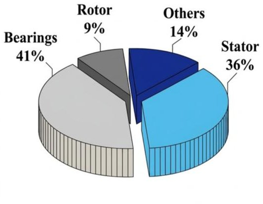

(a)

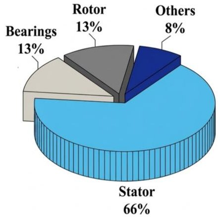

(b)

Figure 1. Fault percentages by various components in (a) low-voltage and (b) high-voltage electric machines [7].

Due to the possibility of concurrent faults and their interaction under different operating conditions, although PMSMs are frequently employed for their efficiency and power density, if associated electrical, mechanical, and magnetic defects are not identified early on, reliability and safety may be compromised. Early monitoring is therefore crucial, particularly for subsystems that are susceptible, including stator windings and bearings [8]. While model-based, signal-based, and data-driven PMSM diagnostic techniques all have advantages, they are all limited in multi-fault situations (e.g., model uncertainty, signature ambiguity, noise/domain shift, and low interpretability). Although multi-fault extensions might increase diagnostic precision, they frequently need for more information, sensors, or processing power [9,10]. As a result, multi-fault detection is becoming more crucial for PMSM drives [11]. The current methods fall into four general categories: (i) minimal-sensor methods that use drive-available signals; (ii) multi-sensor fusion; (iii) time-frequency feature extraction with machine learning classification; and (iv) robustness-oriented methods that include denoising, transfer learning, and domain adaptation [12]. Although minimal-sensor approaches are appealing for low-cost real-time monitoring, they are frequently susceptible to overlapping fault signals, noise, and changes in operating point [13]. Although multi-sensor fusion increases sensing, integration, and computing complexity, it enhances separability and resilience by merging complementary signals. While time-frequency plus machine learning techniques can enhance the early identification of demagnetization and winding problems, their effectiveness is highly dependent on feature/model selection and may suffer from domain mismatch [14].

Current studies aim to reduce computation while being resilient to noise and fluctuating operational conditions. Fault separability, representative training data, and interpretable choices are the main obstacles. By connecting signal changes to physical causes, maintaining phase asymmetry, facilitating quicker judgments without lengthy spectrum windows, and supporting severity evaluation, In the abc domain, a fault-embedded PMSM model improves problem diagnostics. This study uses a data-driven framework based on Extreme Gradient Boosting (XGBoost) to enable severity rating for PMSMs and enhance fault separability in order to close these gaps. The goal of the study is to precisely identify and measure the severity of each of the three main fault categories: stator open-circuit faults, ITSC faults, and permanent magnet demagnetization. Phase currents and derived

<!-- PDF_PAGE: 3 -->

dq-axis features are examples of quantifiable machine variables that are used to capture electrical fault signals, which enable the XGBoost classifier to differentiate between various fault types and monitor their evolution across severity levels. Under controlled operating settings, this learning-based system offers a scalable and useful solution for PMSM condition monitoring with robust diagnostic capabilities. Because PMSMs in real applications are often exposed to load variations and shifting operating states, which make fault detection more challenging, extending the proposed technique to variable-load situations remains an important field for future research.

## 2. XGBoost Fault Diagnosis Model

## 2.1. Justification and Discussion of the Proposed XGBoost-Based Method

ML offers a useful framework for electrical machine defect prediction and classification, particularly when structured electrical data are used as diagnostic inputs. Because XGBoost is a scalable boosting framework with good predictive power, and tree-ensemble models are commonly acknowledged as excellent performers for tabular classification issues, XGBoost was chosen as a well-justified strategy for our scenario in this study [15]. Recent fault diagnosis research also supports this decision. Although SVM and CNN performed better in that particular dataset, the optimal XGBoost configuration surpassed the comparative MNN and GBM models in induction-motor diagnosis, with an average accuracy of 99.62% [16]. XGBoost achieved 100% accuracy for eccentricity classification in a recent Scientific Reports study on SynRM fault classification, and it continued to be one of the best ensemble techniques overall. Similarly, XGBoost outperformed SVM, DT, and RF, and this study [17] investigated electrical fault detection in PV systems, with the maximum reported accuracy of 98.0%. Furthermore, research on PMSM has previously demonstrated the efficacy and practical relevance of machine learning-based diagnostics utilizing stator-current-derived characteristics for winding-fault identification. Therefore, the literature and the characteristics of our validated feature set support XGBoost as a robust and suitable option for prediction and classification in the current study, even though it is not asserted here as a novel technique or as the best option for every dataset.

## 2.2. Application of Extreme Gradient Boosting (XGBoost)

XGBoost is an effective gradient-boosting method that combines several weak learners to create a powerful prediction model. Because of its great performance on big datasets, scalability, and computing economy, it is widely employed. Because of these characteristics, it is especially well-suited for categorization jobs in predictive maintenance and fault diagnostics. Using gas-ratio characteristics obtained from oil samples, XGBoost is used in this work to categorize transformer operating circumstances into predetermined fault categories, such as partial discharge and overheating [17].

## 2.2.1. Objective Function

The objective function of XGBoost can be expressed as:

$$
L = \sum_ {i = 1} ^ {n} l \left(y _ {i}, \hat {y} _ {i} ^ {(t)}\right) + \sum_ {k = 1} ^ {t} \Omega \left(f _ {k}\right)
$$

where $ l\left(y_{i},\hat{y}_{i}^{(t)}\right) $ represents the loss function; $ y_{i} $ is the actual label value of sample i in the t-th iteration; $ \hat{y}_{i}^{(t)} $ is the predicted value; $ \Omega \left(f_{k}\right) $ is the model complexity regularization term; and $ f_{k} $ denotes the k-th decision tree.

<!-- PDF_PAGE: 4 -->

## 2.2.2. Loss Function

The loss function is defined as follows:

$$
l \left(y _ {i}, \hat {y} _ {i}\right) = - \sum_ {j = 1} ^ {m} y _ {i j} \log \left(p _ {i j}\right)
$$

where $ y_{ij} $ reflects the real class's indicator variable j of the i-th sample; $ p_{ij} $ denotes the predicted probability of class j, which is achieved by using the SOFTMAX function to alter the model output scores [18].

## 2.2.3. Node-Splitting Criterion

For XGBoost decision trees, the node-splitting criterion is to maximize the objective function's reduction, and the gain is represented as follows:

$$
G a i n = \frac {1}{2} \left[ \frac {G _ {L} ^ {2}}{H _ {L} + \sigma} + \frac {G _ {R} ^ {2}}{H _ {R} + \sigma} - \frac {G _ {i} ^ {2}}{H _ {i} + \sigma} \right] - \gamma
$$

where the regularization value $ \sigma $ is used to avoid overfitting.

## 3. Simulation Results of XGBoost-Based Fault Prediction

## 3.1. Machine Learning-Based Fault Classification

Using an XGBoost classifier, PMSM condition monitoring is accomplished effectively and consistently. Based on the machine parameters listed in Table 1 (the main parameters of PMSM), a previously validated analytical PMSM model is used to create the training dataset. Both normal operation and various fault circumstances, such as demagnetization, ITSC, and open-phase faults, are covered by the model. The simulation results were produced using MATLAB/Simulink (2024b), and the model's finite-element validation under both defective and healthy operating conditions was performed using ANSYS/Maxwell (2024 R2). Important electrical variables are produced by the model, including stator phase currents (Isa, Isb, and Isc), phase flux connections ( $ \Phi $ a, $ \Phi $ b, $ \Phi $ c), and dq-axis currents ( $ Id $ , $ Iq $ ). With little preprocessing, XGBoost uses these signals directly to map the observed patterns to fault type and severity, enabling quick and comprehensible diagnostics.

Table 1. Main parameters of PMSM.

<table border="1"><tr><td>Rated Power</td><td>Pn</td><td>5kW</td></tr><tr><td>Number of pole pairs</td><td>P</td><td>4</td></tr><tr><td>Winding turn no./slot</td><td>Ns</td><td>40</td></tr><tr><td>Stator resistance</td><td>Rs</td><td>0.88Ω</td></tr><tr><td>Stator inductance</td><td>Ls</td><td>2.82mH</td></tr><tr><td>Synchronous speed</td><td>$\Omega s$</td><td>750rpm</td></tr><tr><td>Inertia moment</td><td>J</td><td>0.0006kg·m2</td></tr><tr><td>Coefficient of damping</td><td>f</td><td>0.007Nm/rad/s</td></tr><tr><td>Flux established by rotor</td><td>$\lambda_{s}$</td><td>0.108Wb</td></tr></table>

## 3.1.1. Overview of Datasets

Three distinct datasets representing various PMSM electrical fault scenarios with differences in fault mechanism, feature composition, and classification complexity were created in order to thoroughly assess the robustness of the suggested XGBoost-based fault detection methodology. The raw sensor data are first subjected to signal preprocessing, as shown in Figure 2, which includes segmentation into appropriate analysis windows,

<!-- PDF_PAGE: 5 -->

normalization to guarantee equivalent numerical scales, and the removal of invalid or inconsistent samples as needed. The most informative features are then fed into the XGBoost classifier to determine whether the machine is healthy, demagnetized, ITSC-faulted, or open-phase faulted, along with the associated fault severity levels. The processed signals are then used for feature extraction and feature selection. The demagnetization (Demag) dataset, which has about 400,000 samples and uses eight electrical variables to solve a multi class severity classification issue, is presented in Table 2. This dataset is especially useful for assessing XGBoost's discriminative capacity in high-resolution fault severity assessment since it captures minute changes in current behavior and magnetic deterioration.

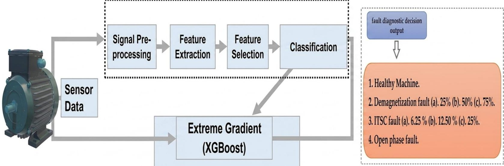

Figure 2. Overview of the XGBoost-based fault prediction framework for fault in PMSM.

Table 2. The project analyzes three electrical fault scenarios with different characteristics.

<table border="1"><tr><td>Dataset</td><td>Source</td><td>Total Rows</td><td>Valid Rows</td><td>Classes</td><td>Features</td></tr><tr><td>Demag</td><td>demag.csv</td><td>399,999</td><td>398,889</td><td>4</td><td>8</td></tr><tr><td>ITSC</td><td>itsc.csv</td><td>500,002</td><td>499,903</td><td>4</td><td>5</td></tr><tr><td>Open/Short</td><td>open_short_1209.csv</td><td>600,001</td><td>600,001</td><td>2</td><td>8</td></tr></table>

There are about 500,000 valid observations with five extracted characteristics in the ITSC dataset. It is framed as a four-class classification issue, with each class denoting a distinct degree of insulation breakdown, much like the demagnetization situation. The model's capacity to identify fault patterns from sparse but extremely informative signals is highlighted by the decreased feature set.

Lastly, the open/short-circuit dataset is a binary classification issue with more than 600,000 samples. This scenario serves as a benchmark for assessing XGBoost performance under clearly separable fault circumstances and focuses on recognizing sudden and severe faults by using eight characteristics and a totally genuine dataset.

Overall, a fair and realistic evaluation of the suggested diagnostic method across both progressive and sudden fault situations is ensured by the variation in dataset size, feature dimensionality, and fault complexity.

1. The diagnostic output is defined over the following machine conditions:

Healthy machine operation.

2. Demagnetization fault, examined at three severity levels:

(a) 25%, (b) 50%, and (c) 75%.

In the case of demagnetization, the fault percentage indicates the decrease in the effective permanent magnet flux linkage in comparison to the healthy state, which is

<!-- PDF_PAGE: 6 -->

indicative of the rotor magnets' diminished magnetization strength. Therefore, successive reductions in the magnet flux contribution and consequently more severe fault conditions are associated with demagnetization levels of 25%, 50%, and 75%.

## 3. Inter-Turn Short-Circuit (ITSC) fault, considered at increasing fault levels:

## (a) 5%, (b) 10%, and (c) 15%.

The percentage of stator winding turns in the impacted phase that are short-circuited is known as the fault percentage for ITSC. In this instance, increasing amounts of the phase winding involved in the short circuit are indicated by 5%, 10%, and 15% ITSC. This results in stronger circulating fault currents, increased local electromagnetic asymmetry, and ultimately higher fault severity.

## 4. Open-phase fault, corresponding to the loss of one stator phase and its direct effect on machine performance.

By combining this clear classification structure with the learning capability of XGBoost, the proposed method provides an intuitive and efficient tool for fault prediction, making it well-suited for real-world PMSM monitoring and decision-support applications.

The results clearly show that the proposed XGBoost-based approach is highly effective for diagnosing different fault types in PMSMs, including demagnetization, ITSC, and open-phase faults. The dataset was carefully constructed to include healthy operation as well as multiple-fault severity levels, allowing the model to learn not only the presence of a fault but also its progression [19].

Three degrees of demagnetization fault severity (25%, 50%, and 75%) were taken into account. Figure 3 shows how magnet deterioration gradually affects the machine's electromagnetic behavior and performance metrics. As the level of demagnetization increases, noticeable changes appear in the machine's electrical behavior, particularly in the dq-axis currents and phase angles. These variations reflect the gradual reduction in the magnetic flux and its direct impact on torque production. The XGBoost classifier successfully captures these trends, leading to reliable separation between healthy and faulty conditions, as well as between different levels of magnetic degradation.

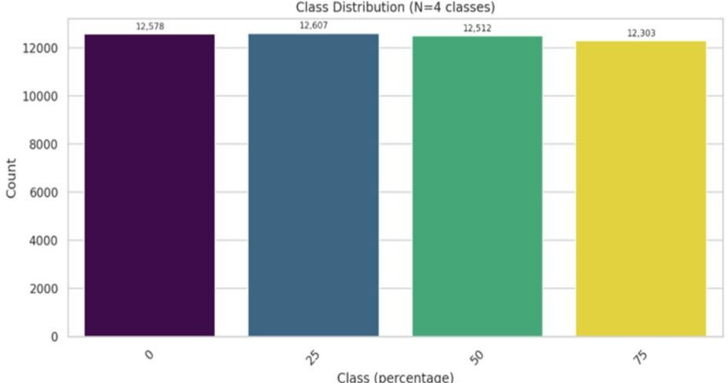

Figure 3. Demag target distribution.

As illustrated in Figure 4, which amply illustrates the progressive distortion and imbalance brought about by the fault severity, increasing the percentage of shorted turns (5%, 10%, and 15%) in the case of ITSC faults leads to increasing asymmetry among stator phase currents and higher dispersion in current-related features. This behavior is physically consistent with the presence of circulating fault currents and localized magnetic saturation in the affected stator slots. The extracted features clearly reflect these effects, enabling accurate fault identification and severity estimation by the classifier.

<!-- PDF_PAGE: 7 -->

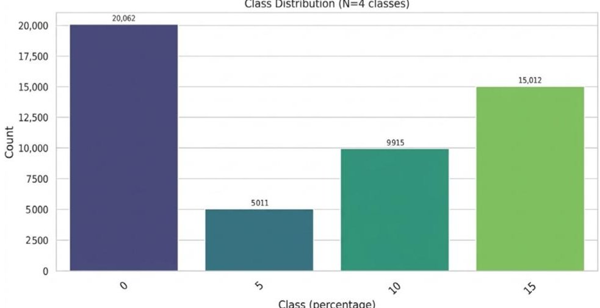

Figure 4. ITSC target distribution.

As can be seen in Figure 5, open-phase failures result in even more recognizable signs since the sudden phase discontinuity causes noticeable torque pulsations, current imbalance, and significant changes in the machine's electromagnetic response. The complete loss of one phase leads to abrupt changes in current waveforms and a strong imbalance in the remaining phases. These characteristics are easily distinguishable from both healthy operation and other fault types, allowing the model to detect open-phase conditions with high confidence.

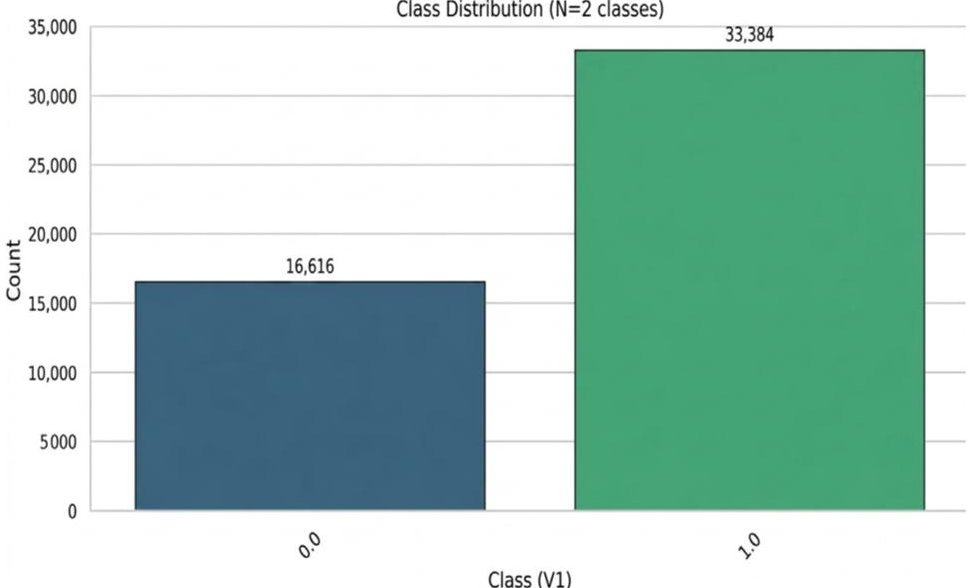

Figure 5. Open/short target distribution.

Overall, the balanced dataset and the use of physically meaningful features allow the XGBoost model to focus on fault-related patterns rather than being influenced by data imbalance or noise. The obtained results confirm that the proposed method provides a robust and versatile solution for PMSM fault diagnosis. Its ability to handle multiple fault types and severity levels highlights its suitability for practical condition monitoring and predictive maintenance applications in electric drive systems.

For most of the retrieved characteristics, the boxplot analysis shows a clear division across groups, as shown in Figure 6. As the degree of demagnetization increases, the median shifts and statistical dispersion steadily change, suggesting that features are highly sensitive to magnetic weakening. Specifically, each fault level shows unique and organized distribution patterns for the flux linkage ( $ \Phi $ a, $ \Phi $ b, and $ \Phi $ c). Their remarkable discriminative power and considerable significance for classification tasks are confirmed by the little overlap across classes. The predictive robustness of the chosen feature set is increased by

<!-- PDF_PAGE: 8 -->

the obvious separability, which implies that demagnetization flaws produce consistent and more distinct signs.

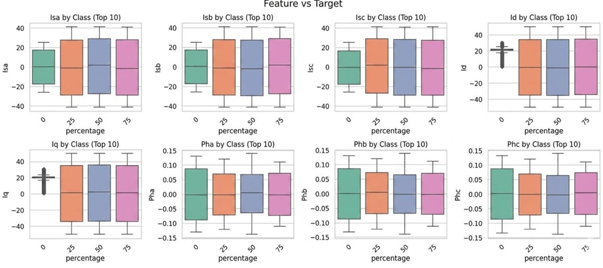

Figure 6. Demag features vs. target.

However, as shown in Figure 7, the ITSC situation results in greater class-to-class overlapping feature distributions. Class borders are less clearly defined than in the demagnetization example, but the boxplots show that statistical dispersion grows as the fraction of shorted turns climbs. This partial overlap points to a more difficult and intricate categorization challenge. Because of their greater sensitivity to winding asymmetry, Isa and Isb exhibit somewhat better separation among the examined variables. However, the overall distribution patterns verify that ITSC defects cause more subtle fluctuations, necessitating sophisticated learning algorithms or more precise feature selection to guarantee accurate identification.

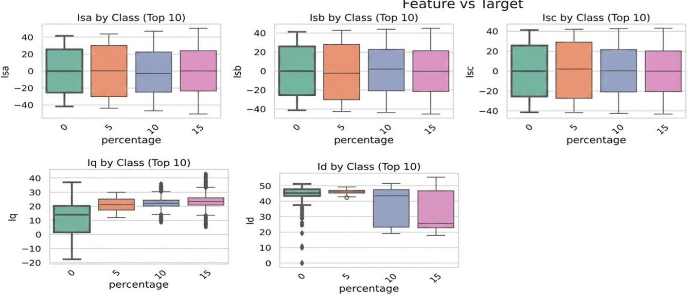

Figure 7. ITSC features vs. target.

Highly distinct statistical fingerprints are produced under open-phase and shortcircuit circumstances, as seen in Figure 8. The boxplot distributions corroborate good separability by displaying little class overlap across the majority of retrieved features. The flux linkage ( $ \Phi $ a, $ \Phi $ b, and $ \Phi $ c) exhibits a notable difference between open- and shortcircuit conditions. The distinct clusters formed by their distribution ranges and median displacements demonstrate how well they capture sudden electrical discontinuities and

<!-- PDF_PAGE: 9 -->

imbalance effects. Due to their fundamentally unique and dominating electromagnetic responses, open and short faults are relatively easy to classify, as seen by this considerable class distinction.

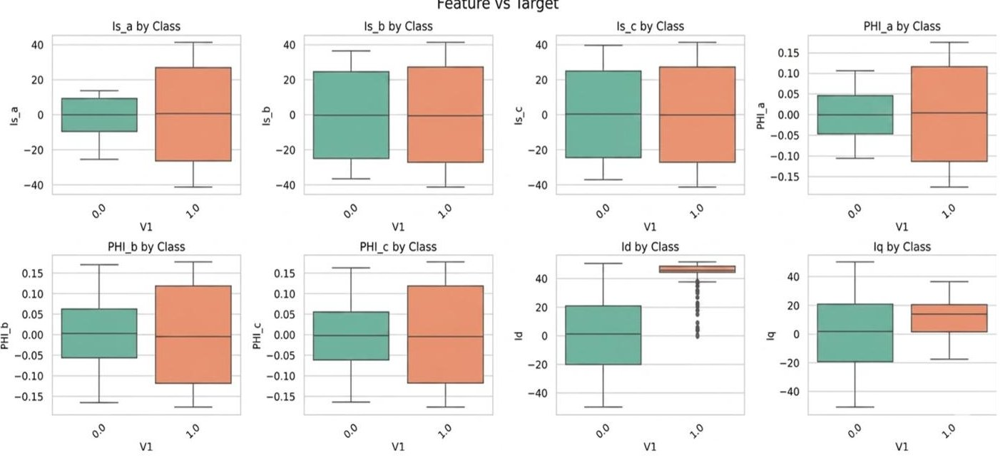

Figure 8. Open/short features vs. target.

Figure 9 presents the correlation matrix, which provides further information. The balanced three-phase system's inherent electrical connection is supported by the significant positive correlations between phase currents (Isa-Isb=0.95 and Isb-Isc $ \approx $ 0.95). The physical coherence of the dataset under demagnetization circumstances is confirmed by this behavior. Meanwhile, there are moderate correlations between the dq-axis components and the phase currents, indicating that they offer complementing data instead of redundant measurements. Demagnetization effects have an impact on the system globally while maintaining informational variation among specific aspects, according to this correlation structure.

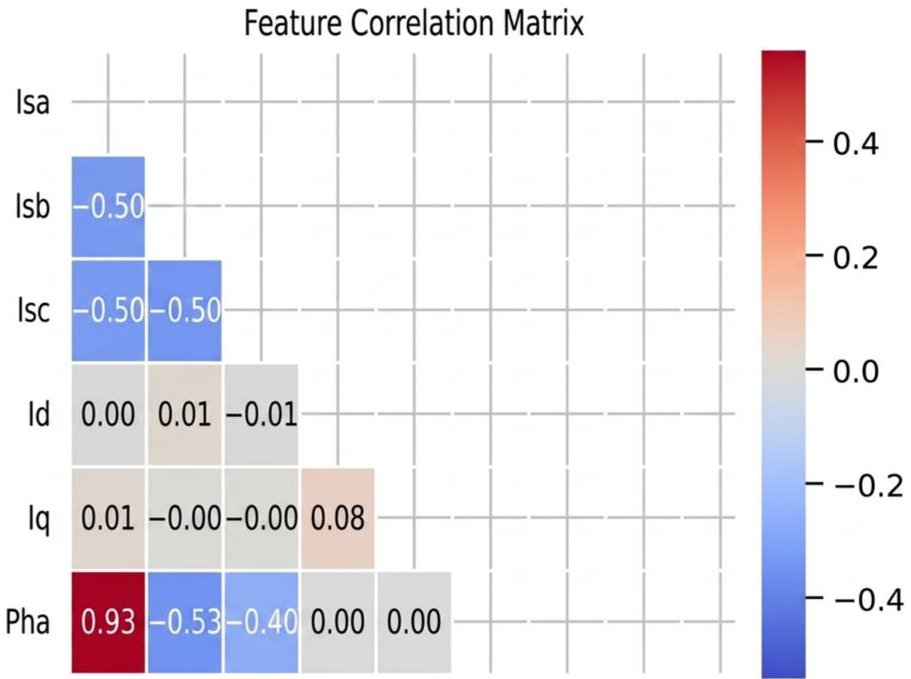

Figure 9. Demag correlation.

Strong dependency among phase currents is one of the patterns that are largely comparable to those seen after demagnetization in the correlation matrix displayed in Figure 10. The overall inter-feature connections, however, seem some what weaker than in the demagnetization dataset because of the smaller feature collection (particularly the lack

<!-- PDF_PAGE: 10 -->

of phase-angle variables). Since the current auxiliary variables already supplied enough information, the problem was handled without the need to add new supplemental material. This decreased structural richness implies that current-based interactions are the primary means by which ITSC-related signatures are collected. As a result, the dataset shows a more compact correlation structure, which might affect the sensitivity of categorization.

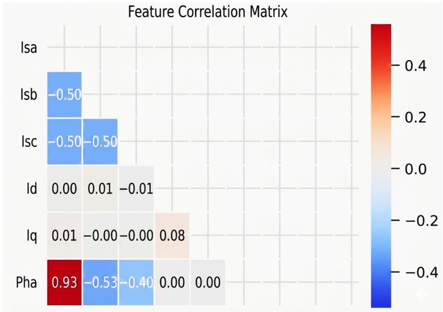

Figure 10. ITSC correlation.

The correlation properties of the open- and short-circuit dataset are similar to the demagnetization situation in terms of substantial phase-current coupling, as shown in Figure 11. Furthermore, the phase-angle variables show modest correlations with each other, suggesting that they convey information that is related but distinct. In order to differentiate between open- and short-circuit faults, phase angles provide complementing discriminating properties, as confirmed by this balanced degree of dependency. Therefore, the overall correlation structure shows the presence of several fault-sensitive indicators as well as the physical connections of the electrical system.

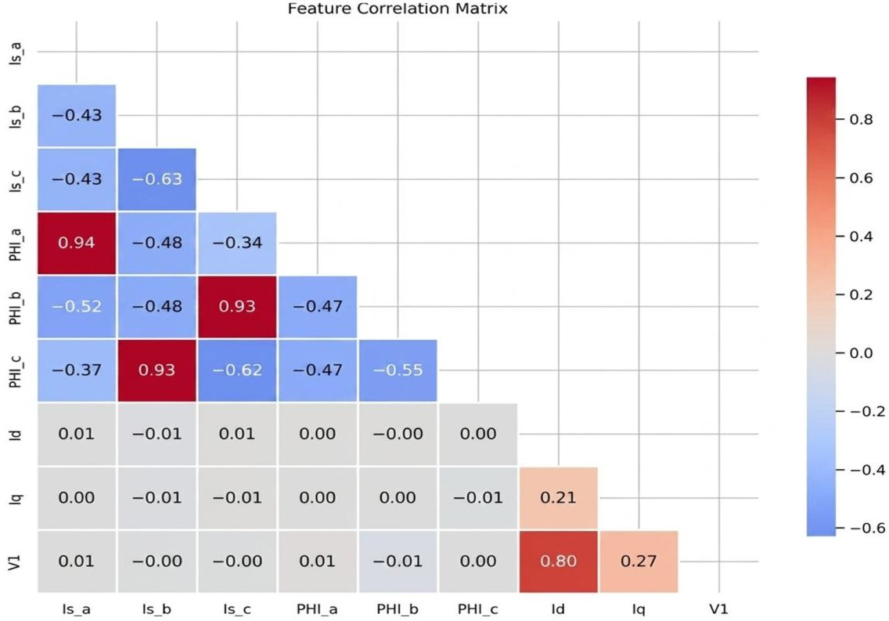

Figure 11. Open/short correlation.

<!-- PDF_PAGE: 11 -->

The Figure 12 feature distribution analysis demonstrates that every extracted variable stays within ranges that are both physically consistent and well-regulated. There are not many outliers, and they do not substantially alter the dataset's general statistical structure, which suggests strong numerical stability. Interestingly, the stator phase currents (Isa, Isb, and Isc) have distributions that are almost symmetric and centered around zero, which is consistent with how balanced alternating current signals should behave. The demagnetization dataset's usefulness for predictive modeling is supported by its symmetry and controlled dispersion, which also confirm its dependability.

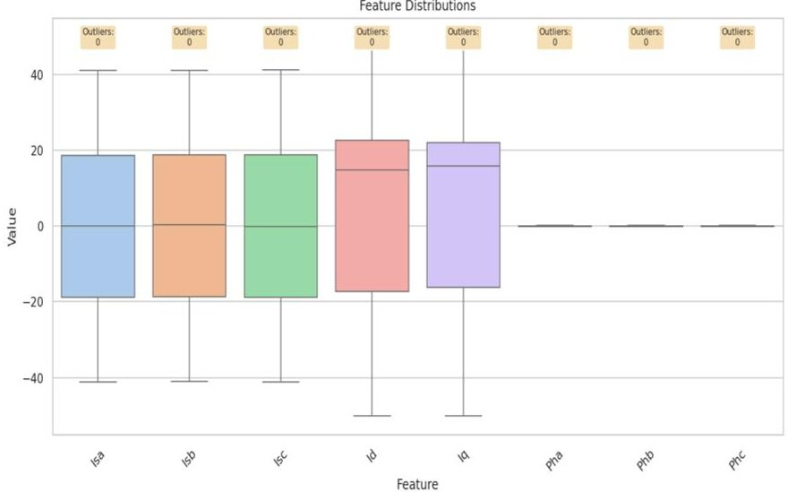

Figure 12. Demag boxplots.

The distribution patterns under ITSC circumstances show less clear class separation than in the demagnetization situation, as seen in Figure 13. There is a discernible overlap in the pairwise correlations across fault severity levels, especially among current-based characteristics. The increasing difficulty of the classification problem may be explained by this statistical closeness, which also supports the use of techniques like class grouping and rounding to improve model stability. The overlapping areas show that increasingly subtle feature changes are produced by ITSC errors, necessitating more sophisticated learning techniques to identify the underlying differences.

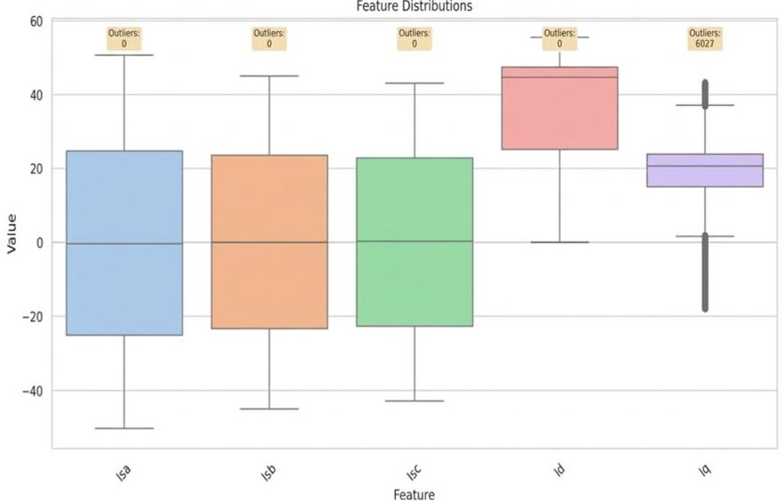

Figure 13. ITSC boxplots.

For the majority of attributes, the boxplot distributions in Figure 14 show a clear distinction between the open- and short-circuit classes. High data quality and a positive signal-to-noise ratio are demonstrated by the low amount of category overlap and the few outliers that are seen. Clearly distinct electrical fingerprints are produced by open and

<!-- PDF_PAGE: 12 -->

short faults, according to the compact and well-differentiated distributions. The robustness of the derived feature set for defect diagnosis is confirmed by this structured separability, which also improves classification reliability.

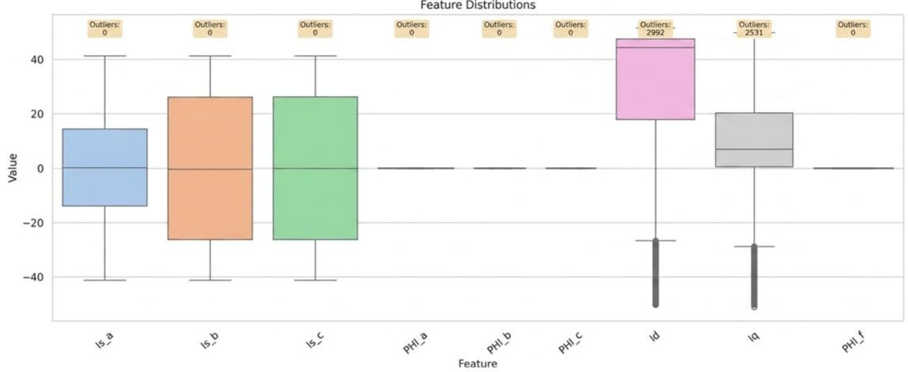

Figure 14. Open/short boxplots.

There is evident linear separability between the demagnetization classes in the pairwise feature correlations shown in Figure 15. With little inter-class overlap, the four severity levels create distinct, well-organized clusters in the multidimensional feature space. The borders of the distribution are still clearly visible, even when concentrating on the five most representative classes. As seen by this well-organized clustering, the chosen characteristics successfully capture the gradual effects of magnetic deterioration, fostering ideal circumstances for trustworthy multi-class classification.

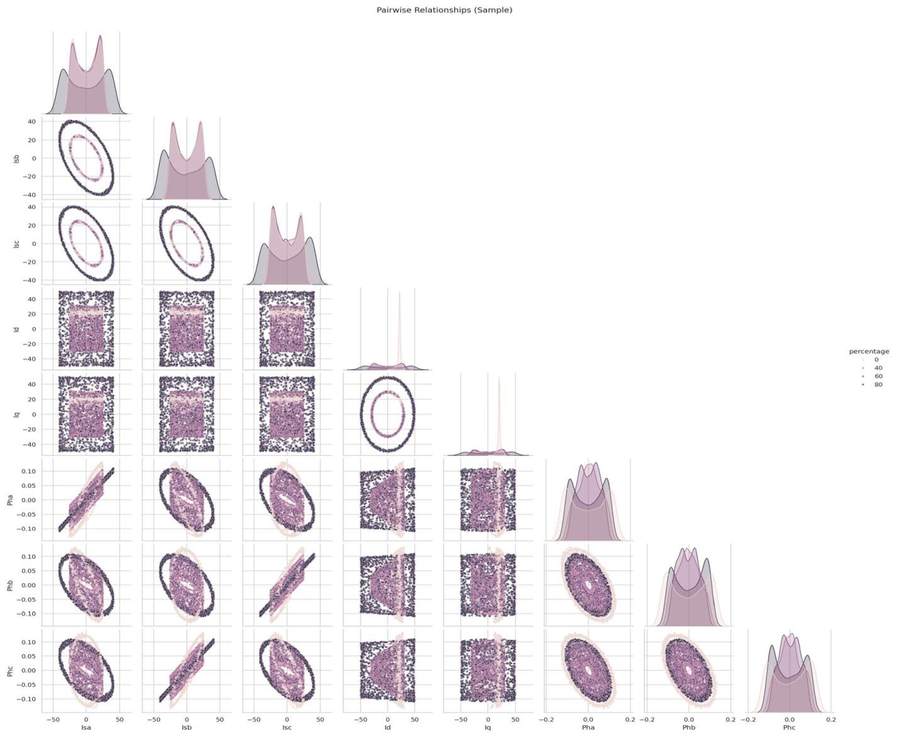

Figure 15. Demag pairplot.

<!-- PDF_PAGE: 13 -->

In comparison, there is a much smaller gap across ITSC classes in the paired image displayed in Figure 16. Inter-turn short-circuit defects have a more subtle and progressive impact on electrical behavior, as seen by the clusters' partial overlap over a number of feature combinations. The considerably weaker discriminating power in comparison to the demagnetization situation is explained by this overlap, which also makes categorization more complicated. The distribution patterns that have been found support the use of techniques like class grouping and rounding to improve the stability and robustness of the model during training.

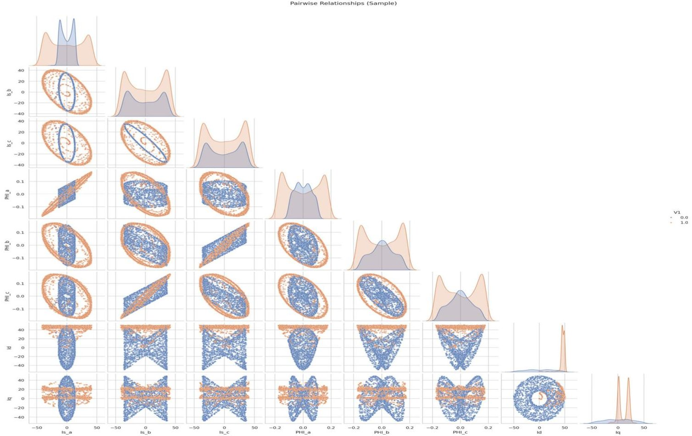

Figure 16. ITSC pairplot.

The pairplot depiction of open- and short-circuit circumstances shows high class separability, as shown in Figure 17. In feature space, the two fault types are located in very different areas, with little overlap in the majority of variable combinations. These flaws produce sudden and dominating electrical imbalances, which are reflected in this substantial structural differentiation. A clear explanation for the dataset's near-perfect classification performance may be found in the prominent clustering characteristic.

## 3.1.2. Methods

## Exploratory Data Analysis (EDA)

For the PMSM fault datasets, the visualization system that was built offers a thorough exploratory data analysis. There is a clear class imbalance in the target distribution charts especially for the open/short task with a roughly 2:1 ratio and the ITSC scenario, where the highest severity level is underrepresented. It is confirmed by boxplot analysis that a number of electrical variables show discriminative behavior across fault circumstances, highlighting significant feature-class interactions. In accordance with the three-phase machine structure, the Pearson lower-triangle correlation heatmap shows a moderate coupling between the phase currents (Isa, Isb, and Isc).

Even if there are a few outliers in the Id and Iq components, their magnitudes are still within acceptable technical bounds and do not jeopardize the integrity of the data.

<!-- PDF_PAGE: 14 -->

Moreover, the pairwise scatter analysis (top five features, 5000-sample subset) supports the dataset's applicability for reliable supervised learning applications by clearly displaying cluster formation in the feature space, especially for the binary open/short classification.

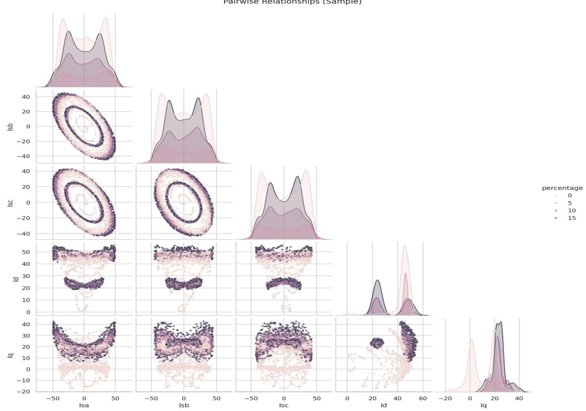

Figure 17. Open/short pairplot.

## Demagnetization Dataset Results

Under GPU acceleration, complete convergence is reached in less than two minutes, demonstrating the very effective and stable training behavior of the suggested learning framework. Smooth error reduction is exhibited by the boosting process, which stabilizes toward near-optimal performance after 500 boosting rounds and achieves low validation loss after around 300 iterations.

Testing on a large test dataset with 79,778 samples (out of 398,889 occurrences) demonstrates the model's resilience, producing macro and weighted F1-scores over 0.95 and near-perfect accuracy ( $ \approx $ 0.9999). All fault severity levels show continuously high predictive power, with no discernible decrease for minority classes, according to the per-class assessment for demagnetization fault in Table 3. Limited overfitting and good generalization are confirmed by the little difference between training and test measures. The exceptional classification performance is justified by the exploratory analysis, which showed significant feature separability in the created feature space, which is totally consistent with these results.

Table 3. Per-Class Performance for demagnetization fault.

<table border="1"><tr><td>Class</td><td>Accuracy</td><td>Sample Count</td></tr><tr><td>0</td><td>0.9999</td><td>Variable</td></tr><tr><td>25</td><td>0.9999</td><td>Variable</td></tr><tr><td>50</td><td>0.9999</td><td>Variable</td></tr><tr><td>75</td><td>0.9999</td><td>Variable</td></tr></table>

<!-- PDF_PAGE: 15 -->

## ITSC Dataset Results

A total of 499,903 samples, divided into 399,922 training and 99,981 testing instances, were used to assess the ITSC classification model's performance. High computational efficiency was demonstrated by the training procedure being finished in just 6.9 s, thanks to GPU acceleration. The model achieved 99.94% accuracy on the original test set, with weighted F1-scores of 98.16% and macro-scores of 96.78%. Although significantly less than in the demagnetization situation, Table 4 presents the per-class detailed results, which show good multi-class discrimination despite the higher feature overlap within ITSC severity levels.

Table 4. Per-Class Detailed Results.

<table border="1"><tr><td>Original Class</td><td>Mapped Class</td><td>Precision</td><td>Recall</td><td>F1-Score</td><td>Support</td></tr><tr><td>0</td><td>0</td><td>0.992</td><td>0.96</td><td>0.982</td><td>40,000</td></tr><tr><td>5</td><td>1</td><td>0.991</td><td>0.96</td><td>0.978</td><td>10,000</td></tr><tr><td>10</td><td>2</td><td>0.998</td><td>0.98</td><td>0.991</td><td>19,981</td></tr><tr><td>15</td><td>3</td><td>0.989</td><td>0.98</td><td>0.973</td><td>30,000</td></tr></table>

A class grouping and rounding step was used to transfer each model output to the closest legitimate severity level in order to further enhance prediction resilience for the ITSC dataset. This operation is defined as follows since the permissible ITSC classes are restricted to [0,5,10,15].

$$
\hat {y} _ {f i n a l} = \arg \min _ {c \in \{0, 5, 1 0, 1 5 \}} | \hat {y} - c |
$$

where $ \hat{y} $ is the predicted class value and $ \hat{y}_{final} $ is the rounded prediction assigned to the nearest valid ITSC severity class. The class grouping and rounding step applied to the ITSC dataset is explicitly defined by this equation. Following this post-processing phase, the overall accuracy improved to 0.991, representing a 3.3% gain, while the macro and weighted F1-scores rose to 0.982 and 0.978, respectively. Strong separability from problematic states was confirmed by the exceptional precision (0.99) and recall (0.973) of the normal operating condition (Class 0). The underrepresented Class 5, on the other hand, had a high recall (0.98) but somewhat lower precision, indicating a purposeful trade-off that is meant to lower false negatives at the expense of more false positives. Overall, minority-class performance was stabilized, and generalization was enhanced by the combination of class weighting, ITSC-specific hyperparameter adjustment, and the suggested rounding step.

## Open/Short Circuit Dataset Results

Using a dataset of 600,001 samples, 480,000 for training and 120,001 for testing, the binary fault classification model was developed. By utilizing GPU acceleration, the training procedure took only 2.4 s, demonstrating the selected architecture's computational efficiency. With weighted precision, recall, and F1-score all hitting 0.9955 on the independent test set, the model's accuracy was 99.55%. Both numerical stability and high predictive dependability are confirmed by such consistent measurements.

The method's resilience is further demonstrated by the thorough per-class performance analysis of the open-phase fault presented in Table 5. Class 0 (open-circuit state) had complete recall, meaning that no defective occurrences were missed, and Class 1 (shortcircuit condition) had perfect accuracy, meaning that there were no false alarms. With very little overfitting, this sensitivity-specificity balance shows outstanding generalization. The binary formulation has better feature separability than multi-class fault situations, as seen in exploratory pairplot visualizations as well. By providing highly discriminative signatures, the phase-angle components $ (\Phi a, \Phi b, $ and $ \Phi c) $ , in particular, greatly improve the

<!-- PDF_PAGE: 16 -->

model's capacity to differentiate between open- and short-circuit faults, with performance that is almost optimal.

Table 5. Per-Class Performance for open phase fault.

<table border="1"><tr><td>Fault Type</td><td>Precision</td><td>Recall</td><td>F1-Score</td><td>Support</td></tr><tr><td>Class0(Open)</td><td>1.00</td><td>0.99</td><td>0.99</td><td>40,000</td></tr><tr><td>Class1(Short)</td><td>0.99</td><td>1.00</td><td>1.00</td><td>80,001</td></tr></table>

## Model Architecture: XGBoost Classifier and Comparative Summary

The XGBoost classifier used as the model architecture for the suggested fault diagnosis system is described in this subsection. The diagnostic performance of the suggested XGBoost model for the three fault scenarios examined in this study, demagnetization, inter-turn short-circuit (ITSC), and open-phase fault, is summarized in Table 6, below. With short training times ranging from 2.4 s to less than 2 min, the results demonstrate very high accuracy in all cases, reaching 0.9999+ for demagnetization, 0.9994 for ITSC, and 0.9955 for the open/short-circuit dataset. This confirms the efficacy and computational efficiency of the suggested framework.

Table 6. Diagnostic Performance of the Proposed XGBoost Model for PMSM Fault Scenarios.

<table border="1"><tr><td>Metric</td><td>Demag(4-Class)</td><td>ITSC(4-Class)</td><td>Open/Short(Binary)</td></tr><tr><td>Total Samples</td><td>398,889</td><td>499,903</td><td>600,001</td></tr><tr><td>Test Accuracy</td><td>0.9999+</td><td>0.9994</td><td>0.9955</td></tr><tr><td>F1-Weighted</td><td>~0.95+</td><td>0.9916</td><td>0.9955</td></tr><tr><td>Training Time</td><td>&lt;2min</td><td>6.9s</td><td>2.4s</td></tr></table>

Model Architecture: XGBoost Classifier

The XGBoost-based framework with GPU acceleration used in this study is presented in this section. It provides a quick overview of the model architecture and emphasizes how it facilitates accurate and efficient fault categorization.

"objective": "multi:softprob",

"num_class": 4,

"eval_metric": ["mlogloss","merror"],

"max_depth": 8,

"learning_rate": 0.05,

"subsample": 0.8,

"colsample_bytree": 0.8,

"n_estimators": 500,

"tree_method": "hist",

"predictor": "gpu_predictor",

"device": "cuda",

"random_state": 42

Hyperparameters (ITSC Dataset—Tuned):

"objective": "multi:softprob",

"num_class": 4,

"max_depth": 10,

"learning_rate": 0.05,

"subsample": 0.85,

<!-- PDF_PAGE: 17 -->

"colsample_bytree": 0.85,

"reg_alpha": 0.01,

"reg_lambda": 0.5,

"n_estimators": 400,

"device": "cuda"

Hyperparameters (Open/Short—Binary Classification):

"objective": "binary:logistic",

"eval_metric": ["logloss", "error"],

"max_depth": 8,

"learning_rate": 0.05,

"subsample": 0.8,

"colsample_bytree": 0.8,

"n_estimators": 300,

"tree_method": "hist",

"device": "cuda".

## Feature Importance Analysis

The three fault situations' feature significance comparisons show different physical fingerprints controlling classification performance. Rotor magnetic weakening directly affects current amplitude symmetry, as evidenced by the three-phase stator currents (Isa, Isb, and Isc) emerging as the dominating predictors in the demagnetization dataset. Phase angle variables provide a negligible contribution to discriminating, but the dq-axis components (Id, Iq) offer complementing capabilities. On the other hand, the ITSC dataset shows a more dispersed significance profile, with the most significant characteristic being phase a current (Isa), which is followed by the other phase currents. The necessity for more sophisticated optimization techniques can be explained by the dq components' significant contribution to capturing small severity fluctuations. For the open/short-circuit binary task, the hierarchy changes significantly: current magnitudes, which serve as secondary descriptors, are surpassed by the phase angle $ \Phi a $ as the primary discriminative indication. This situation's near-ideal classification performance is supported by the distinct structural separation between angular features.

All datasets show good predictive power when viewed globally, with accuracies over 89% and an open/short-circuit model reaching 99.55%. The binary open/short problem is the most tractable due to its strong feature separability; the demagnetization case is still very accurate with balanced classes, and the ITSC scenario is moderately difficult due to feature overlap and class imbalance. This clearly shows the hierarchy of relative task complexity. With a 3.3% increase in accuracy and improved practical consistency, the use of balanced sample weighting and prediction rounding significantly improves ITSC resilience.

By cutting processing times to a few seconds, GPU-accelerated training further guarantees computational efficiency, even for datasets with close to 600,000 samples. The consistency between statistical structure and learning performance across the whole analytical workflow is confirmed by the significant alignment between exploratory data analysis and model outcomes: datasets with clearer pairwise separation correlate to greater classification accuracy and higher classification accuracy.

## 4. Conclusions

This research proposes an XGBoost-based framework for PMSM multi-fault diagnostics. The classifier learns from discriminative electrical data, such as stator phase currents, phase flux links, and dq-axis components, under regulated operating conditions (750 rpm, rated load) to automatically detect aberrant operation, identify the type of problem, and

<!-- PDF_PAGE: 18 -->

assess the severity of the fault. Although it may not accurately replicate the variable-load conditions found in real-world PMSM systems, this configuration allows for a straightforward evaluation of the suggested approach. Future work should therefore focus on expanding the framework to dynamic load profiles and broader operational situations.

In terms of data-driven performance, XGBoost maintains computational efficiency (seconds to less than two minutes for about 600k samples with GPU acceleration). When prediction rounding is used to solve overlap and imbalance, demagnetization classification achieves near-perfect accuracy (~0.9999), open/short obtains 99.55% accuracy, and ITSC increases from 0.978% to 0.991%. Current amplitudes for demagnetization, phase-A current for ITSC, and angular features for open/short are examples of feature importance trends that match physics, promoting interpretability and resilience. All things considered, the proposed XGBoost-based approach provides a scalable and precise method for PMSM condition monitoring in industrial and safety-critical applications.

In summary, the suggested XGBoost-based diagnostic system shows good performance in recognizing various PMSM fault types and accurately and computationally assessing their severity. Because of this, the technique is ideal for predictive maintenance and improved condition monitoring in industrial electric motor applications. In order to further evaluate the robustness and practical application of the suggested technique under actual operational settings, the following work will concentrate on laboratory experimental validation and the deployment of an online monitoring platform.

Author Contributions: Conceptualization, Y.M.; Methodology, Y.M. and Q.W.; Software, Y.M., C.P. and K.K.N.; Validation, C.P.; Investigation, Q.W.; Data curation, K.K.N.; Writing—original draft, Y.M.; Writing—review & editing, Q.W.; Visualization, Q.W.; Supervision, Q.W. and K.A.-H.; Funding acquisition, Y.M. All authors have read and agreed to the published version of the manuscript.

Funding: This research received no external funding.

Data Availability Statement: The original contributions presented in this study are included in the article. Further inquiries can be directed to the corresponding author.

Conflicts of Interest: The authors declare no conflict of interest.

## References

1. Woo, W.L.; Gao, B. Sensor Signal and Information Processing II. Sensors 2020, 20, 3751. [CrossRef] [PubMed]

2. Orlowska-Kowalska, T.; Dybkowski, M.; Szabat, K. Fault Diagnosis and Fault-Tolerant Control of PMSM Drives—State of the Art and Future Challenges. IEEE Access 2022, 10, 59979-60024. [CrossRef]

3. Rosicka, D.; Sembera, J. Assessment of Influence of Magnetic Forces on Aggregation of Zero-Valent Iron Nanoparticles. Nanoscale Res. Lett. 2011, 6, 10. [CrossRef] [PubMed]

4. Zhang, X.; Chen, Y.; Li, H.; Zhao, Z. Speed Control for a PMSM Servo System Using Model Reference Adaptive Control and an Extended State Observer. IEEE Access 2019, 7, 183868-183879. [CrossRef]

5. Zuo, Y.; Darabi, A.; Lai, C.; Iyer, K.L.V. Online Interturn Short Circuits Fault Monitoring for Permanent Magnet Synchronous Machines. In Proceedings of the IECON 2022—48th Annual Conference of the IEEE Industrial Electronics Society, Brussels, Belgium, 17-20 October 2022; pp. 1-6. [CrossRef]

6. Zhu, Q.; Li, Z.; Tan, X.; Xie, D.; Dai, W. Sensors Fault Diagnosis and Active Fault-Tolerant Control for PMSM Drive Systems Based on a Composite Sliding Mode Observer. Energies 2019, 12, 1695. [CrossRef]

7. Zheng, Y.; Rao, C.; Wang, F.; Zou, H. Transformer Fault Diagnosis Method Based on Improved Particle Swarm Optimization and XGBoost in Power System. Processes 2025, 13, 3321. [CrossRef]

8. Yu, Y.; Gao, H.; Chen, Q.; Liu, P.; Niu, S. Demagnetization Fault Detection and Location in PMSM Based on Correlation Coefficient of Branch Current Signals. Energies 2022, 15, 2952. [CrossRef]

9. Xiao, D.; Hu, K.; Li, C. Transmission Line Modeling-Based Position Sensorless Control for Permanent Magnet Synchronous Machines. Electronics 2025, 14, 271. [CrossRef]

10. Wang, T.; Li, Q.; Yang, J.; Xie, T.; Wu, P.; Liang, J. Transformer Fault Diagnosis Method Based on Incomplete Data and TPE-XGBoost. Appl. Sci. 2023, 13, 7539. [CrossRef]

<!-- PDF_PAGE: 19 -->

11. Vlachou, V.I.; Karakatsanis, T.S. Development of a Fault-Tolerant Permanent Magnet Synchronous Motor Using a Machine Learning Algorithm for a Predictive Maintenance Elevator. Machines 2025, 13, 427. [CrossRef]

12. Maanan, Y. PMSM Inter-Turn Short Circuit Fault Diagnosis Using EKF Observer and FFT for Sensorless Input-Output Linearization Control. In Proceedings of the 2023 International Conference on Electrical Engineering and Advanced Technology (ICEEAT), Batna, Algeria, 5-7 November 2023; pp. 1-7. [CrossRef]

13. Velasco-Loera, F.; Alcaraz-Mejia, M.; Chavez-Hurtado, J.L. An Interpretable Hybrid Fault Prediction Framework Using XGBoost and a Probabilistic Graphical Model for Predictive Maintenance: A Case Study in Textile Manufacturing. Appl. Sci. 2025, 15, 10164. [CrossRef]

15. Kim, M.-C.; Lee, J.-H.; Wang, D.-H.; Lee, I.-S. Induction Motor Fault Diagnosis Using Support Vector Machine, Neural Networks, and Boosting Methods. Sensors 2023, 23, 2585. [CrossRef] [PubMed] [PubMed Central]

14. Tuyet-Doan, V.-N.; Choi, M.; Park, G. XGBoost Method-Based Gearbox Fault Diagnosis Using Time-Domain Signal Under Road Vehicle Characteristics. Electronics 2025, 14, 4736. [CrossRef]

16. Chen, T.; Guestrin, C. XGBoost: A Scalable Tree Boosting System. In Proceedings of the 22nd ACM SIGKDD International Conference on Knowledge Discovery and Data Mining, New York, NY, USA, 13-17 August 2016; pp. 785-794. [CrossRef]

17. Khandeparkar, V.; Shreshtha; Ramu, S.K. Effectiveness of supervised machine learning models for electrical fault detection in solar PV systems. Sci. Rep. 2025, 15, 34919. [CrossRef] [PubMed]

18. Du, T.; Wang, J.; Zhang, W.; Liao, W. Influence of Multi-Source Electromagnetic Coupling on NVH in Automotive PMSMs. Electronics 2025, 14, 4652. [CrossRef]

19. Horvath, K.; Zelei, A. Simulating Noise, Vibration, and Harshness Advances in Electric Vehicle Powertrains: Strategies and Challenges. World Electr. Veh. J. 2024, 15, 367. [CrossRef]

Disclaimer/Publisher's Note: The statements, opinions and data contained in all publications are solely those of the individual author(s) and contributor(s) and not of MDPI and/or the editor(s). MDPI and/or the editor(s) disclaim responsibility for any injury to people or property resulting from any ideas, methods, instructions or products referred to in the content.