<!-- PDF_PAGE: 1 -->

Article

# Stress-Based Fatigue Diagnosis of Wind Turbine Blades Using Physics-Informed AI Reduced-Order Modeling

Jun-Yeop Lee $ ^{1} $ $ ^{1} $ , Minh-Chau Dinh $ ^{1} $ $ ^{1} $ and Seok-Ju Lee $ ^{2,*} $

1 Research Institute of DNA+, Changwon National University, Changwon 51140, Republic of Korea; eell7803@naver.com (J.-Y.L.); dinhminchau@changwon.ac.kr (M.-C.D.)

$ ^{2} $ School of Aerospace Engineering, Glocal Advanced Institute of Science & Technology, Changwon National University, Changwon 51140, Republic of Korea

* Correspondence: dltjrwn79@changwon.ac.kr; Tel.: +82-55-213-2866

## Abstract

This paper proposes an integrated, stress-based framework for fatigue diagnosis of wind turbine blades that is tailored to field deployments where detailed structural design information is unavailable. The approach combines a data-driven reduced-order model (ROM) for directional damage equivalent loads (DELs) with a physics-based Soderberg index and a one-class support vector machine (SVM) anomaly detector. The framework is implemented and evaluated using measurements from a 2 MW onshore turbine equipped with blade-root strain gauges and standard SCADA monitoring. Ten-minute operating windows are formed by synchronizing SCADA records with high-frequency strain data, converting strain to stress, and computing DELs via Rainflow counting for flapwise, edgewise, and torsional blade root directions. SCADA inputs are summarized by their 10 min statistics and augmented with yaw misalignment features; these are used to train LightGBM-based ROMs that map operating conditions to directional DELs. On an independent test set, the DEL-ROM achieves coefficients of determination of approximately 0.87, 0.99, and 0.99 for flapwise, edgewise, and torsional directions, respectively, with small absolute errors relative to the measured DELs. The Soderberg index is then used to define conservative Normal/Alert/Alarm classes based on representative material parameters, while a one-class SVM is trained on DEL- and stress-based fatigue features to learn the distribution of normal operation. A simple AND-normal/OR-abnormal rule combines the Soderberg class and SVM label into a hybrid diagnostic decision. Application to the field dataset shows that the proposed framework provides interpretable fatigue-safety margins and reliably highlights operating periods with elevated flapwise fatigue usage, demonstrating its suitability as a scalable building block for digital-twin-enabled condition monitoring and life-extension assessment of wind turbine blades.

Academic Editor: Qingsong Wang

Received: 24 November 2025

Revised: 21 December 2025

Accepted: 29 December 2025

Published: 30 December 2025

Copyright: $ \textcircled{c} $ 2025 by the authors.

Licensee MDPI, Basel, Switzerland.

This article is an open access article distributed under the terms and conditions of the Creative Commons Attribution (CC BY) license.

Keywords: damage equivalent load; Soderberg; one-class SVM; wind turbine blade; condition diagnosis

## 1. Introduction

The global transition toward decarbonized energy systems has accelerated the deployment of renewable energy technologies, with wind energy emerging as one of the most scalable and mature solutions. As wind turbines grow in capacity and rotor size, now exceeding 15 MW for offshore applications, they are increasingly installed in remote and harsh environments. While these advancements enhance power generation efficiency, they

<!-- PDF_PAGE: 2 -->

also pose challenges for maintaining long term structural reliability. Among the various failure modes, fatigue damage in structural components, in particular the blades, has become a critical factor that limits operational lifespan and increases maintenance costs. Continuous exposure to turbulent wind conditions and cyclic loading induces gradual degradation in flapwise, edgewise, and torsional stresses at the blade root, which may ultimately lead to cracking, delamination, or even catastrophic blade failures and prolonged downtime [1-3].

To address these risks, the industry has adopted condition based maintenance (CBM) strategies that rely on continuous monitoring and predictive diagnostics [4,5]. Digital twin (DT) technology, which provides a virtual replica of physical systems for real time analysis and forecasting, is a promising framework for enabling such strategies [6-8]. However, building effective DTs for wind turbine blade fatigue monitoring requires balancing physical fidelity with computational efficiency under realistic data constraints. High fidelity models such as finite element method (FEM) simulations and detailed aeroelastic analyses are accurate but unsuitable for real time applications because of their computational cost and reliance on proprietary design information [9,10]. Conversely, purely data-driven methods may lack physical consistency and be sensitive to noise or operating condition changes, and many existing diagnostic schemes rely on indirect indicators such as vibration or power output rather than directly modeling the structural stresses that govern fatigue behavior [11-13]. These limitations hinder physically interpretable, blade-specific assessments of fatigue risk.

Beyond CBM and digital-twin studies, a closely related line of research is load monitoring and virtual sensing, where reduced-order or data-driven surrogate models estimate fatigue-relevant loads from operational measurements. Recent studies have demonstrated fleet-scale virtual load monitoring using SCADA signals and learning-based surrogates, including probabilistic deep learning formulations that quantify uncertainty in the inferred loads [14]. In contrast, the present study targets stress-based directional DELs computed from field-measured blade-root strain histories and learns a SCADA-to-DEL mapping that is intentionally compatible with standard 10 min SCADA statistics. This design is aligned with practical deployment needs, enabling stress-based fatigue indicators to be estimated on turbines that do not carry blade-root strain gauges and providing physically interpretable inputs to subsequent safety assessment and anomaly-detection modules.

Recent physics-informed or physics-based machine learning approaches in wind energy have incorporated physical structure through constraints, priors, or hybrid formulations to improve generalization and interpretability [15]. While direct numerical benchmarking against such studies is not always meaningful for the present task, because many physics-informed models require different inputs (e.g., high-frequency states or simulation variables) and target different outputs than SCADA-based 10 min DEL regression, we emphasize two complementary aspects. First, the proposed framework is physics-informed at the metric and decision layers by integrating the learned DEL surrogate with fatigue and safety evaluation through the Soderberg criterion and with condition assessment via one-class SVM. Second, within the scope of the available field dataset, we provide benchmark-style ablation comparisons, including a single-feature baseline (mean wind speed only) and a PCA vs. non-PCA comparison reported in the Results section, to justify the final modeling choices used throughout the paper.

In practical field deployments, including the case considered in this work, detailed structural design information for the blades is often proprietary or unavailable. Exact laminate layups, local thickness distributions, and blade-specific S-N curves are typically not accessible to operators, which complicates direct verification of fatigue margins against design documentation. Instead, operational data such as SCADA measurements and a limited number of strain gauge signals at the blade root are available for condition moni-

<!-- PDF_PAGE: 3 -->

toring. This motivates diagnostic frameworks that infer fatigue-relevant stress behavior and safety margins primarily from operating data, relying on generic but conservative material properties and standard fatigue criteria rather than full design specifications. A key motivation for introducing a DEL-based reduced-order model (DEL-ROM) in this context is to decouple the diagnostic logic from the availability of strain sensors: directional DELs and other fatigue metrics are first derived from measured blade-root stresses on an instrumented turbine and used as physically interpretable targets, and the DEL-ROM then learns the mapping from routinely available SCADA variables to these directional fatigue indicators. Once trained, the same diagnostic logic can be driven by ROM-predicted DELs on turbines that do not carry blade-root strain gauges, enabling stress-based assessment across SCADA-only units.

Motivated by these gaps, this study proposes an integrated framework for the stressbased fatigue diagnosis of wind turbine blades that is tailored to such data-constrained environments. The objective is to develop a system that is physically grounded, computationally efficient, and interpretable, capable of assessing blade root fatigue safety under realistic operating conditions using routinely available monitoring data. The framework combines physics-informed processing of strain gauge measurements, machine learning-assisted reduced-order modeling, and classical fatigue evaluation criteria. Here, "physics-informed" refers to incorporating established fatigue analysis concepts and safety criteria (e.g., Rainflow-based DEL and the Soderberg index) to define physically interpretable targets and diagnostic rules. The machine learning components are trained in a data-driven manner, and the approach does not embed governing PDE constraints into a neural-network loss function as in PINN formulations; therefore, it is best described as a hybrid physics-based and data-driven framework. First, 1 Hz blade-root strain gauge signals are converted to stresses, and Rainflow counting is applied to obtain stress-based Damage Equivalent Loads (DELs) in the flapwise, edgewise, and torsional directions for each 10 min operating interval. These DELs are used as learning targets in a DEL-ROM that maps 10 min SCADA statistics and yaw misalignment indicators to directional DELs, with gradient boosting regression (LightGBM) employed to learn the nonlinear relationship between operating conditions and stress-based fatigue indicators [14,16-21]. Fatigue safety is assessed using a Soderberg-type criterion, which considers both alternating and mean stress with respect to assumed material yield strength and endurance limit, based on conservative generic properties rather than blade-specific data [22-24].

To enhance robustness against modeling errors and measurement noise, the physicsbased Soderberg assessment is complemented by a data-driven anomaly detector. Features derived from DEL, mean stress, alternating stress, and the Soderberg index are supplied to a one-class support vector machine (one-class SVM) trained on data representing normal operation. This unsupervised model learns the distribution of healthy behavior in the fatigue metric space and flags deviations that are inconsistent with the learned baseline. The combination of Soderberg-based safety indices and one-class SVM-based anomaly scores yields a hybrid diagnostic strategy that exploits both physical knowledge and data-driven patterns, while remaining applicable even when detailed blade design information is not available.

The results demonstrate that the proposed framework maintains high prediction accuracy for flapwise, edgewise, and torsional blade root DELs while preserving physical interpretability. It supports near real time inference of stress-based fatigue indicators under realistic operating scenarios and allows for fatigue risk assessment using standard mechanical criteria, augmented by data-driven anomaly detection. Furthermore, the modular architecture of the system facilitates its extension to other structural components and integration into digital twin environments for real time structural health monitoring. By

<!-- PDF_PAGE: 4 -->

combining physics-based modeling with data-driven learning and interpretable fatigue evaluation based primarily on operational data, this research contributes to the development of scalable and intelligent condition monitoring systems for wind turbine blades.

## 2. Integrated Framework for Stress-Based Fatigue Diagnosis

## 2.1. Overall Architecture

Figure 1 provides a conceptual overview of the proposed hybrid framework. In this paper, "reduced-order modeling" denotes constructing a low-dimensional, computationally efficient surrogate that replaces high-dimensional structural-response representations with fatigue-relevant quantities of interest. Operational SCADA and blade-root strain measurements were collected from an in-service wind turbine located in the Jeolla region, Republic of Korea. Here, the ROM maps SCADA-derived operating descriptors to directional 10 min DELs, rather than reconstructing full stress time histories. The detailed data-processing workflow from raw SCADA and strain measurements to fatigue metrics (DEL) and the subsequent Soderberg-based indices is described in Sections 3.2-3.5 and summarized schematically in Figure 1. The framework is designed to operate primarily on routinely available SCADA data, while exploiting blade-root strain gauge measurements from a subset of instrumented turbines during the model development stage. It consists of four main building blocks: (i) acquisition and preprocessing of SCADA and blade-root strain data; (ii) a reduced-order model (ROM) that reproduces stress-based fatigue indicators from operating conditions; (iii) fatigue load characterization using Rainflow counting and Damage Equivalent Load (DEL); and (iv) a hybrid fatigue diagnosis module that combines a physics-based Soderberg safety index with a data-driven one-class support vector machine (one-class SVM) anomaly detector. At the core of the framework is the stress-based reduced-order model, which approximates the mapping from operating conditions to directional fatigue loading at the blade root. The ROM is implemented by learning a regression mapping from SCADA feature vectors (or their PCA scores) to the corresponding 10 min DEL targets computed from synchronized strain-gauge measurements.

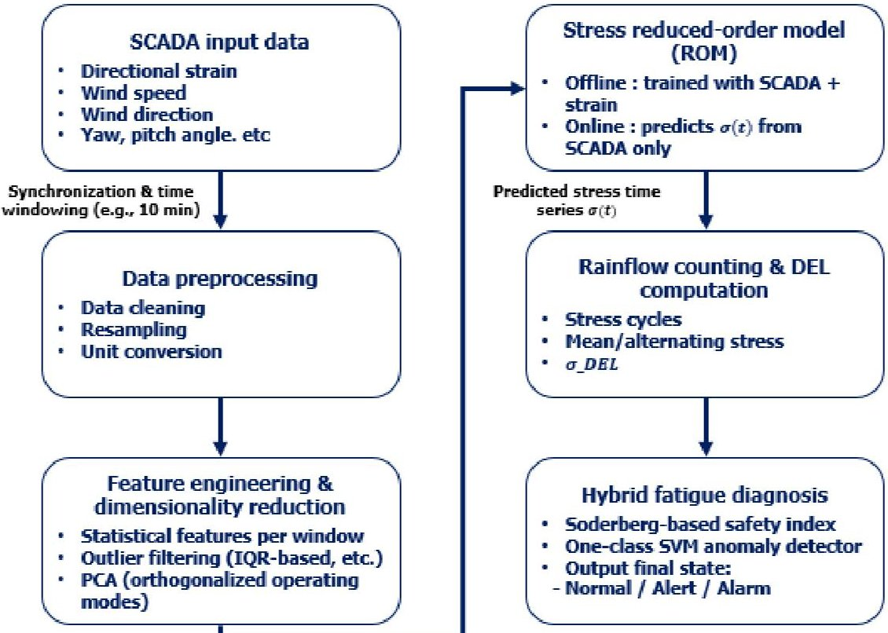

Figure 1. Overall framework for stress-based fatigue diagnosis using a hybrid physics-based and data-driven approach.

<!-- PDF_PAGE: 5 -->

In the offline phase, synchronized SCADA and blade-root strain data are used to construct stress time series at the blade root, from which directional 10 min DELs are computed using Rainflow counting. These DELs serve as directly interpretable fatigue indicators and as learning targets for the ROM. The same dataset is used to derive fatigue-related features such as effective mean and alternating stresses and Soderberg indices under normal operation and to train the one-class SVM in the resulting feature space. In the online monitoring phase, only SCADA data are required. The trained DEL-ROM maps 10 min SCADA statistics and derived operating indicators to flapwise, edgewise, and torsional DELs at the blade root. These ROM-predicted DELs form a common fatiguebased representation that is consumed by both diagnosis stages: directional Soderberg indices are evaluated from the ROM outputs, and the same ROM-based fatigue metrics enter the one-class SVM anomaly detector. This separation between offline training and online inference allows the framework to retain physical interpretability while remaining computationally efficient, and makes it applicable to turbines that are not instrumented with blade-root strain gauges.

## 2.2. Data Flows and Representation of Operating Conditions

The left part of Figure 1 summarizes the input data streams. The SCADA system provides low-frequency measurements of wind speed and direction, rotor speed, generator power, pitch and yaw angles, and selected control and status variables. These signals characterize the operating state of the turbine and are available for all units in the wind farm. In addition, strain gauges are installed on a limited number of turbines at the blade root sections, with gauges oriented to capture flapwise, edgewise, and torsional responses. The strain signals are converted to directional stress time series using calibrated gauge factors, bridge configurations, and representative blade material properties.

Both SCADA and stress signals are synchronized and segmented into fixed length time windows that correspond to the typical resolution of fatigue assessment, for example, 10 min intervals. Within each window, SCADA variables are transformed into feature vectors by computing statistical descriptors such as mean, standard deviation, and selected percentiles. Derived quantities such as yaw misalignment or turbulence-related indicators can also be included when available. The resulting feature vectors provide a compact yet informative representation of the operating conditions that drive blade root loading.

To improve numerical stability and reduce the effects of collinearity among SCADA channels, the input features can be further processed using outlier filtering and principal component analysis (PCA). In this framework, PCA is primarily used not for aggressive dimensionality reduction, but for orthogonalizing and reordering the input space into principal operating modes. This transformation can improve the learning behavior of the ROM and facilitates interpretation of which combinations of operating variables most strongly influence the flapwise, edgewise, and torsional responses. In the case study presented here, both raw feature sets and PCA transformed features are evaluated, and the final ROM configuration is selected based on its test set performance.

## 2.3. Stress Reduced-Order Model

At the core of the framework is the stress-based reduced-order model, which approximates the mapping from operating conditions to directional fatigue loading at the blade root. The ROM is implemented by learning a regression mapping from SCADA feature vectors (or their PCA scores) to the corresponding 10 min DEL targets computed from synchronized strain-gauge measurements. Rather than reconstructing full stress time series, the ROM in this work is trained to predict the DEL aggregated over each 10 min window. For each blade root direction (flapwise, edgewise, and torsional), the ROM takes

<!-- PDF_PAGE: 6 -->

the processed SCADA feature vector (or its principal components) as input and outputs the corresponding DEL. This design yields a compact and directly fatigue-relevant target that can be consumed by subsequent diagnosis modules.

The ROM is trained offline using paired datasets of SCADA features and DELs computed from measured blade-root stresses under normal operation. The dataset is sorted in chronological order and split into training, validation, and test subsets to avoid temporal leakage. Gradient boosting regression implemented via LightGBM is adopted due to its ability to capture nonlinear interactions between operating variables and its low computational cost at inference time. Model performance is evaluated using metrics such as mean absolute error, root mean square error, and coefficient of determination. Hyperparameters and feature configurations, including the use of PCA, are explored to achieve a balance between accuracy and generalization, and overfitting is mitigated through regularization and early stopping. The final configuration is selected based on its test set performance. Once trained, the ROM can be deployed on turbines that are not instrumented with blade-root strain gauges, enabling fleet-wide estimation of flapwise, edgewise, and torsional DELs based solely on SCADA data.

## 2.4. Hybrid Fatigue Diagnosis Using Soderberg Index and One-Class SVM

The right part of Figure 1 summarizes the fatigue diagnosis stage. For the instrumented case-study turbine, blade-root strain gauges provide stress histories in the flapwise, edgewise, and torsional directions. These stress time series are processed with Rainflow counting to obtain directional 10 min DELs, effective mean and alternating stresses, and Soderberg indices, which represent the ground-truth fatigue metrics used to configure and validate the diagnostic logic. The DEL-ROM is trained on the same 10 min windows so that it can reproduce the directional DELs from SCADA inputs alone. In routine online monitoring, the trained ROM therefore serves as the front end of the diagnostic pipeline, translating SCADA data into directional DELs on which both the Soderberg screening and the one-class SVM operate. For turbines without strain gauges, the ROM-predicted DELs and derived fatigue metrics become the only available inputs, but the same two-stage diagnostic logic can be applied once appropriate directional limits are defined.

To complement this physics-based assessment, features derived from DEL, mean stress, stress amplitude, and the Soderberg index are supplied to a one-class SVM model trained on data representing normal operation. The one-class SVM learns the boundary of the normal region in this fatigue feature space and assigns an anomaly score to each new observation. Observations that fall outside the learned region are flagged as abnormal, even if the underlying cause is not explicitly modeled.

The final diagnostic decision is obtained by combining the Soderberg-based safety class and the one-class SVM anomaly score. For example, a time window may be classified as normal when both the Soderberg index is comfortably below the design threshold and the anomaly score indicates high similarity to normal data, whereas windows with high Soderberg index and high anomaly score are flagged as alarm cases. Intermediate combinations can be mapped to warning states. This hybrid strategy leverages both explicit physical criteria and statistical patterns in the data, providing a robust basis for blade root fatigue diagnosis in situations where detailed blade structural design information is not fully available, while also allowing for ROM-based extension to non-instrumented turbines.

## 3. Data and Methods

## 3.1. Turbine, Site, and Measurement System

The proposed framework is evaluated using measurements from a utility scale horizontal axis wind turbine with a rated power of 2 MW and a three-blade upwind rotor. The

<!-- PDF_PAGE: 7 -->

turbine operates in variable speed and variable pitch mode with a conventional doubly fed induction generator and yaw control. It is installed at an onshore site with moderately complex terrain and turbulent inflow conditions, which result in substantial variability in aerodynamic loading and cyclic structural response.

Structural response is monitored using strain gauges mounted at critical locations on the blades and tower. As illustrated in Figure 2, gauges at the blade root are oriented to primarily capture flapwise, edgewise, and torsional responses, and gauges on the tower are oriented along the fore-aft and side-side directions to represent global bending response. In the present study, only the blade root channels are used for reduced-order modeling and fatigue diagnosis; the tower gauges are included for completeness of the measurement system description. The gauges are configured in full bridge circuits and connected to dedicated data acquisition units. Raw strain signals are recorded at high sampling rates, with timestamps synchronized to the turbine SCADA system.

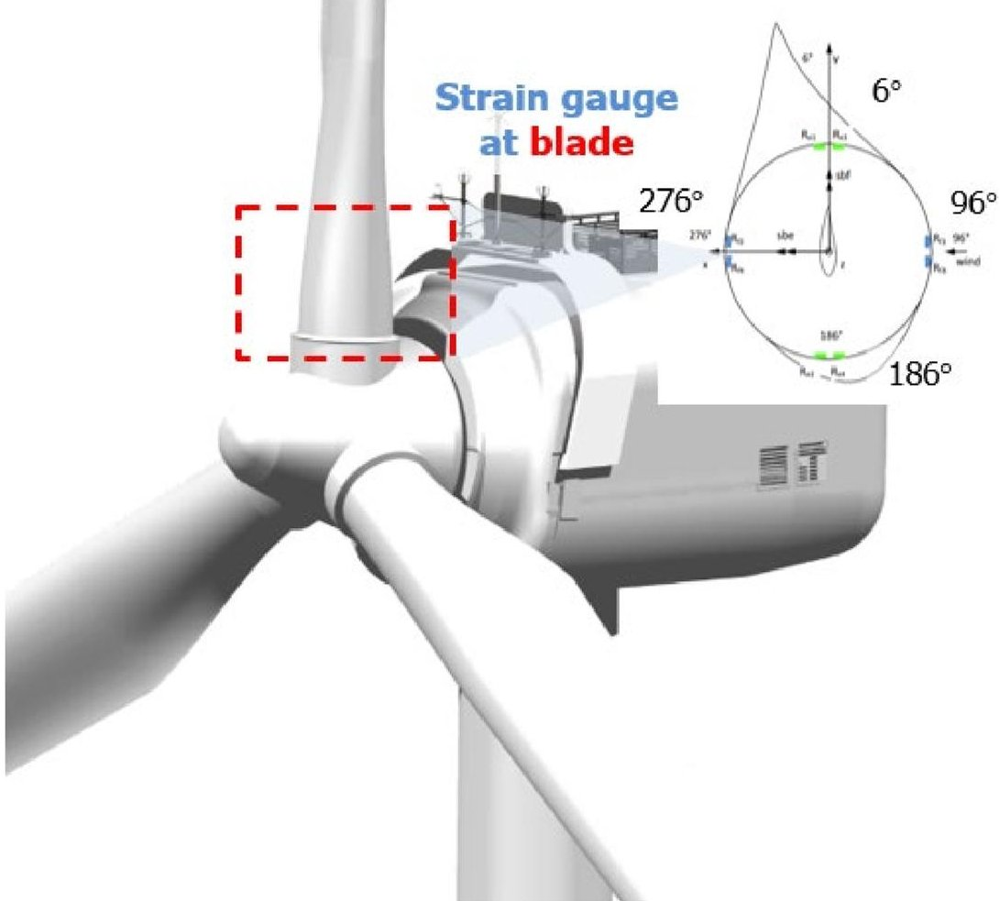

Figure 2. Strain gauge layout on blade.

The SCADA system provides low-frequency measurements at regular intervals, including wind speed and direction, rotor speed, generator power, collective pitch angle, yaw angle, nacelle orientation, and controller status and alarm flags. These variables characterize the operating conditions and control actions of the turbine and serve as inputs to the stress reduced-order model (ROM). A concise overview of the SCADA variables used in this study, including variables, units, sampling intervals, and roles, is provided in Table 1. The strain gauge channels and their associated structural directions are summarized in Table 2.

<!-- PDF_PAGE: 8 -->

Table 1. SCADA variables used as ROM inputs.

<table border="1"><tr><td>Variables</td><td>Unit</td><td>Sampling Interval</td><td>Role</td></tr><tr><td>Wind speed</td><td>m/s</td><td>10 min</td><td>Primary loading indicator</td></tr><tr><td>Wind direction</td><td>Deg</td><td>10 min</td><td>Inflow direction/yaw misalignment</td></tr><tr><td>Generator power</td><td>kW</td><td>10 min</td><td>Power/operating regime indicator</td></tr><tr><td>Pitch angle</td><td>Deg</td><td>10 min</td><td>Blade pitch control state</td></tr><tr><td>Yaw angle</td><td>Deg</td><td>10 min</td><td>Nacelle orientation/Yaw control</td></tr><tr><td>Yaw misalignment</td><td>Deg</td><td>10 min</td><td>Derived: wind-nacelle direction</td></tr><tr><td>Stress in each direction</td><td>MPa</td><td>10 min</td><td>ROM target (directional structural response)</td></tr></table>

Table 2. Strain gauge channels and directions.

<table border="1"><tr><td>Channel</td><td>Location</td><td>Direction</td><td>Sampling Rate</td></tr><tr><td>Blade_flapwise</td><td>Blade root</td><td>Flapwise bending</td><td>1Hz</td></tr><tr><td>Blade_edgewise</td><td>Blade root</td><td>Edgewise bending</td><td>1Hz</td></tr><tr><td>Blade_torsional</td><td>Blade root</td><td>Torsional</td><td>1Hz</td></tr></table>

## 3.2. SCADA and Strain Datasets and Windowing Strategy

The dataset used in this work comprises continuous measurements collected during normal operation over an extended period. SCADA data are available as 10 min summary records, while strain signals are stored as time series sampled at 1 Hz (Table 2). Accordingly, the Nyquist frequency is 0.5 Hz, and the present fatigue-metric analysis focuses on load components below this limit; higher-frequency vibration content is outside the scope of the current dataset and analysis. To construct consistent input-output pairs for model development, the strain time series are segmented according to the SCADA timestamps.

For each 10 min SCADA record, the corresponding strain data within the same time interval are extracted. Intervals with missing or corrupted SCADA records, inconsistent timestamps, or known curtailment, start up, or shut down events are excluded from the training set. In addition, time windows for which the raw strain signals exhibit long periods of constant values or clear saturation levels are flagged as sensor faults and removed from the set used to train and validate the ROM. These windows are retained for later diagnostic evaluation but not for model fitting.

The SCADA variables selected as ROM inputs comprise hub-height wind speed, rotor speed, generator power, collective pitch angle, yaw angle, nacelle direction, and relevant control state indicators (Table 1). Where available, wind and nacelle directions are combined to compute yaw misalignment. To focus on fatigue-relevant operation, intervals with average wind speed below a cut-in threshold are excluded from model training. For validation and testing, the dataset is divided into contiguous time segments corresponding to different periods, so that the training, validation, and test sets are separated in time and information leakage between them is avoided.

The turbine entered commercial operation in 2016; therefore, at the beginning of the measurement period (1 October 2024), the blades had accumulated approximately 8 years of time-in-service. This operating age provides additional context for interpreting the observed fatigue-load characteristics.

A summary of the dataset split and wind-condition characteristics is provided in Table 3, including the number of 10 min windows in the training, validation, and test periods and summary statistics of wind speed and turbulence intensity (TI). The nominal

<!-- PDF_PAGE: 9 -->

numbers of 10 min windows in each period correspond to the predefined time-based split. For model training and evaluation, windows are further screened using the data-quality criteria described above (e.g., missing or inconsistent records and sensor-quality issues), and only the resulting valid windows are used in the learning pipeline as detailed in Section 4.1.

Table 3. Dataset composition and split.

<table border="1"><tr><td>Set</td><td>Period</td><td>Num.of10minWindows</td><td>WindSpeedMean±Std</td><td>WindSpeedP5/P50/P95</td><td>TIMean±Std</td><td>High-Wind(U&gt;15m/s,%)</td><td>Extreme-Wind(U&gt;25m/s,%)</td></tr><tr><td>Training</td><td>1October2024~30April2025</td><td>30,528</td><td>5.52±3.09m/s</td><td>1.83/4.96/10.88m/s</td><td>0.077±0.087</td><td>1.35</td><td>0</td></tr><tr><td>Validation</td><td>1May2025~30June2025</td><td>8784</td><td>5.24±2.91m/s</td><td>1.77/4.65/10.08m/s</td><td>0.094±0.091</td><td>1.06</td><td>0</td></tr><tr><td>Test</td><td>1July2025~31August2025</td><td>8928</td><td>4.26±1.82m/s</td><td>1.48/4.18/7.59m/s</td><td>0.154±0.080</td><td>0.00</td><td>0</td></tr></table>

A wind speed-power scatter plot (power curve) is provided to characterize the SCADA dataset and verify data validity. The distribution confirms that the dataset spans the main operating envelope, while isolated points deviating from the expected power curve indicate potential abnormal operating events or measurement artifacts. The plot also highlights distinct control regimes, including the torque-controlled region below rated wind speed and the pitch-controlled region above rated, which motivates the need for a nonlinear ROM capable of learning regime-dependent mappings from operating conditions to fatigue indicators.

Figure 3 shows the scatter plot of ten-minute SCADA wind speed versus active power to provide an overview of the operating envelope and the nominal power-curve trend. The raw SCADA records inevitably include non-nominal operating periods, such as turbine stops, curtailment, and grid limitations, which appear as low-power points even at moderate to high wind speeds. Because these periods can distort both the statistical characterization of operation and the downstream modeling and fatigue-diagnosis results, we apply a quality-control filtering step before subsequent analyses. Unless otherwise stated, all results reported in the following sections are based on the filtered dataset obtained after excluding non-nominal operation and obvious implausible records according to SCADA status information and basic plausibility checks.

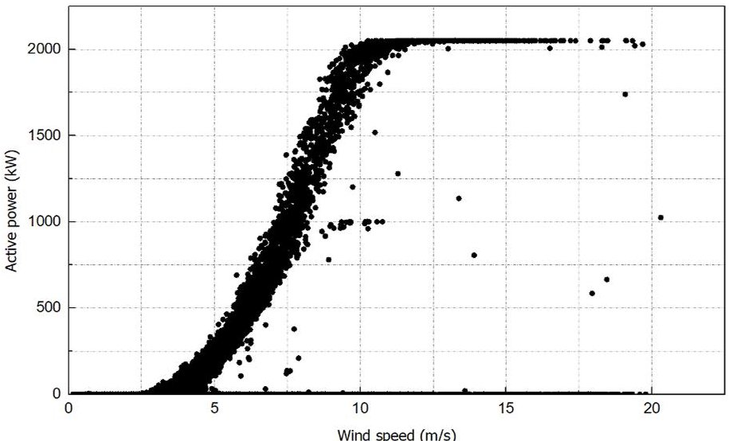

Figure 3. Scatter plot of ten-minute SCADA wind speed versus active power.

## 3.3. Signal Preprocessing and Feature Engineering

The data processing chain from raw measurements to fatigue metrics is schematically depicted in Figure 4. It consists of three main steps: stress signal preprocessing,

<!-- PDF_PAGE: 10 -->

SCADA-based feature construction, and dimensionality reduction using principal component analysis (PCA).

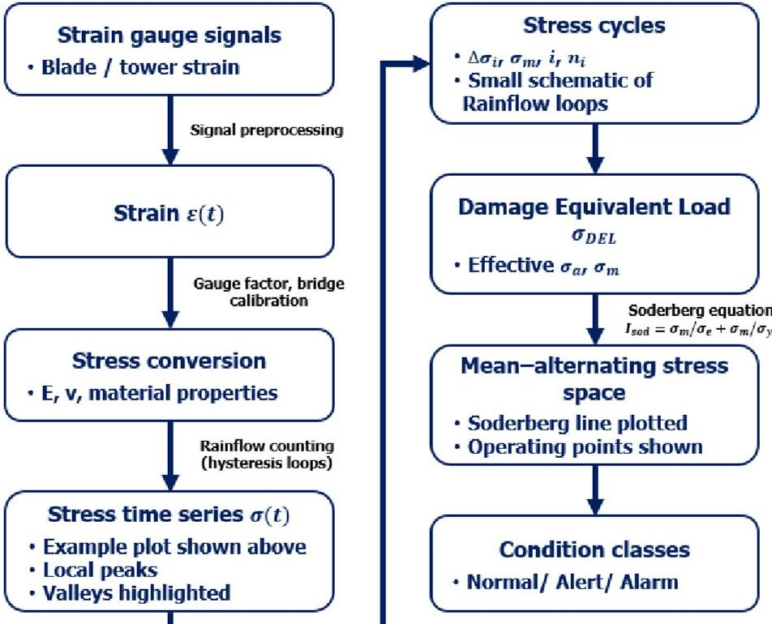

Figure 4. Integrated processing chain from strain measurements to fatigue metrics and stress-based condition classes.

## 3.3.1. Stress Signal Preprocessing

Figure 5 illustrates a representative ten-minute window sampled at 1 Hz to highlight why the raw strain-gauge signal is not used directly for fatigue feature extraction. Impulsive spikes and brief discontinuities in the raw record can introduce artificial cycles and bias Rainflow counting and the resulting DEL. Therefore, a quality-control preprocessing step is applied to remove outliers and restore continuity prior to stress conversion and subsequent fatigue evaluation.

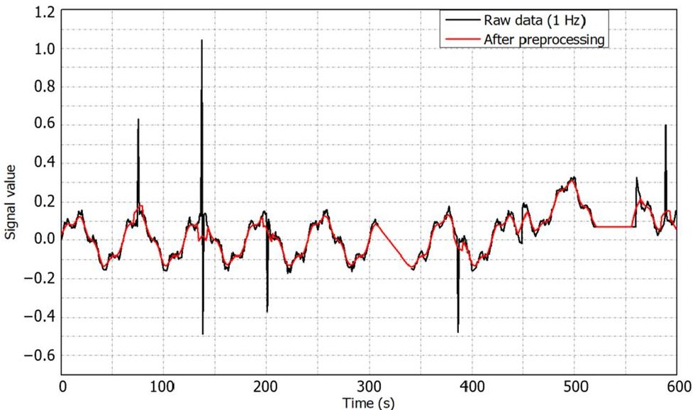

Figure 5. Overlaid example of a ten-minute (1 Hz) flapwise strain window before and after preprocessing.

Representative examples of the original (unprocessed) blade-root strain-gauge signals are shown in Figure 5 for the flapwise, edgewise, and torsional channels over a 10 min window. The raw measurements may contain typical artifacts such as impulsive spikes, short discontinuities, saturation, or near-constant segments, which can adversely affect

<!-- PDF_PAGE: 11 -->

cycle counting and fatigue-metric estimation. These observations motivate the signal-level preprocessing steps described below.

Raw strain-gauge signals are first processed at the signal level. Obvious spikes and discontinuities are removed using simple thresholding and median filtering. The strain signals are then converted to engineering strain using the calibrated gauge factors and bridge configurations. Assuming linear elastic behavior, the strain is converted to stress using Young's modulus and Poisson's ratio for the relevant blade material. Representative elastic moduli are adopted for the composite blade material based on typical values reported in standards and the literature [22-24].

The resulting stress time series are resampled, if necessary, to a uniform sampling interval within each 10 min window. For each window and each monitored blade root direction, the stress history $ \sigma_{d}(t) $ is used as the basis for Rainflow counting and fatiguemetric computation. The resulting directional Damage Equivalent Loads (DELs) for each 10 min window serve as the targets for training the stress reduced-order model. Simple quality checks, such as verifying that the stress range remains within physically plausible bounds and that the signal variance does not collapse to zero, are applied to filter out residual sensor problems.

For each 10 min window, the stress preprocessing and fatigue-metric computation follow these steps:

1. Identify the corresponding strain segment based on SCADA timestamps;

2. Perform signal-quality screening and remove windows with spikes, discontinuities, saturation, or near-zero variance;

3. Convert strain to stress using calibrated gauge factors and assumed elastic constants;

4. Resample the stress history to a uniform sampling interval within the window (if required);

5. Apply Rainflow counting and compute window-level fatigue metrics, including DEL;

6. Store the directional DEL values as targets for ROM training.

## 3.3.2. SCADA Feature Construction

On the input side, SCADA signals within each 10 min interval are transformed into feature vectors that summarize the operating condition. For each SCADA variable $ x_{k}(t) $ , a set of statistics is computed over the window, including mean, standard deviation, minimum, maximum, and selected percentiles (for example, 10th, 50th, and 90th percentiles). These statistics capture both the average operating point and its short-term variability.

In addition, several derived features are constructed to encode physically meaningful aspects of the operating state. Examples include the following:

- Yaw misalignment between wind direction and nacelle direction;

- A simple turbulence indicator based on the ratio of wind speed standard deviation to mean wind speed;

- Normalized power-related features, such as power divided by the cube of wind speed;

- Indicators of time spent below or above rated operation, based on wind speed and control state flags.

In the implementation presented in this study, we retain the 10 min mean and standard deviation of the main SCADA channels listed in Table 1 (wind speed, wind direction, active power, pitch angle, generator speed, and nacelle yaw angle), together with the mean yaw misalignment feature, as summarized in Table 4. An interquartile range-based rule is then used for outlier detection at the feature level: windows for which one or more standardized features lie outside a prescribed multiple of the interquartile range are flagged as outliers. These windows are excluded from ROM training and validation to reduce the influence of obviously inconsistent operating conditions, but they are retained when demonstrating the

<!-- PDF_PAGE: 12 -->

diagnostic performance of the hybrid approach. The complete list of constructed features together with their definitions and units, is listed in Table 4.

Table 4. Constructed SCADA-based operating features used as ROM inputs.

<table border="1"><tr><td>Feature Name</td><td>Definition/Description</td><td>Unit</td></tr><tr><td>Mean wind speed</td><td>10min arithmetic mean of hub-height wind speed</td><td>m/s</td></tr><tr><td>Wind speed standard deviation</td><td>10min standard deviation of hub-height wind speed</td><td>m/s</td></tr><tr><td>Mean wind direction</td><td>10min mean wind direction(converted to a scalar angle)</td><td>Deg</td></tr><tr><td>Wind direction variability</td><td>10min standard deviation of wind direction</td><td>Deg</td></tr><tr><td>Mean active power</td><td>10min mean generator active power</td><td>kW</td></tr><tr><td>Power variability</td><td>10min standard deviation of generator active power</td><td>kW</td></tr><tr><td>Mean pitch angle</td><td>10min mean collective pitch angle of blade</td><td>Deg</td></tr><tr><td>Pitch angle variability</td><td>10min standard deviation of pitch angle</td><td>Deg</td></tr><tr><td>Mean generator speed</td><td>10min mean generator rotational speed</td><td>RPM</td></tr><tr><td>Generator speed variability</td><td>10min standard deviation of generator speed</td><td>RPM</td></tr><tr><td>Mean nacelle yaw angle</td><td>10min mean nacelle yaw position</td><td>Deg</td></tr><tr><td>Nacelle angle variability</td><td>10min standard deviation of nacelle yaw position</td><td>Deg</td></tr><tr><td>Mean yaw misalignment</td><td>10min mean of wind-nacelle difference</td><td>Deg</td></tr></table>

## 3.3.3. Dimensionality Reduction with PCA

To address collinearity among SCADA-derived features and to obtain a compact representation of operating conditions, principal component analysis (PCA) is applied to the standardized feature matrix [25]. Let $ X\in\mathbb{R}^{N\times p} $ denote the SCADA feature matrix constructed from N 10 min windows with p features. After standardization, $ Z=(X-\mu)D^{-1} $ where $ \mu\in\mathbb{R}^{1\times p} $ contains feature-wise means and $ D\in\mathbb{R}^{p\times p} $ is a diagonal matrix of featurewise standard deviations. The sample covariance matrix is computed as $ C=\frac{1}{N-1}Z^{\top}Z. $ PCA is obtained by eigenvalue decomposition $ C=V\Lambda V^{\top} $ , where $ \Lambda=\operatorname{diag}\left(\lambda_{1},\dots,\lambda_{p}\right) $ contains eigenvalues sorted in descending order and $ V=\left[v_{1},\dots,v_{p}\right] $ contains the corresponding eigenvectors (loading vectors). The principal component score matrix is $ T=ZV. $ Using the leading k components, $ T_{k}=ZV_{k} $ provides an orthogonal representation of operating conditions. For a given 10 min window with standardized feature vector $ z\in\mathbb{R}^{p} $ the corresponding PC scores are $ t_{k}=V_{k}^{\top}z $ , as summarized in Figure 6a. Here, X is the SCADA feature matrix, Z is the standardized matrix, C is the covariance matrix, V and $ \Lambda $ are the eigenvectors (loadings) and eigenvalues, and $ T=ZV $ is the PC score matrix (with $ T_{k}=ZV_{k} $ for the retained components).

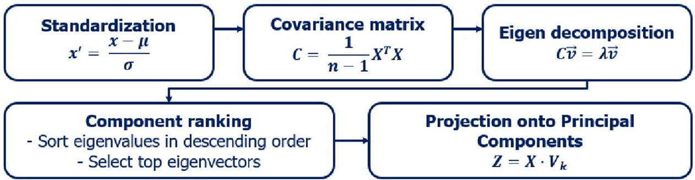

(a)

Figure 6. Cont.

<!-- PDF_PAGE: 13 -->

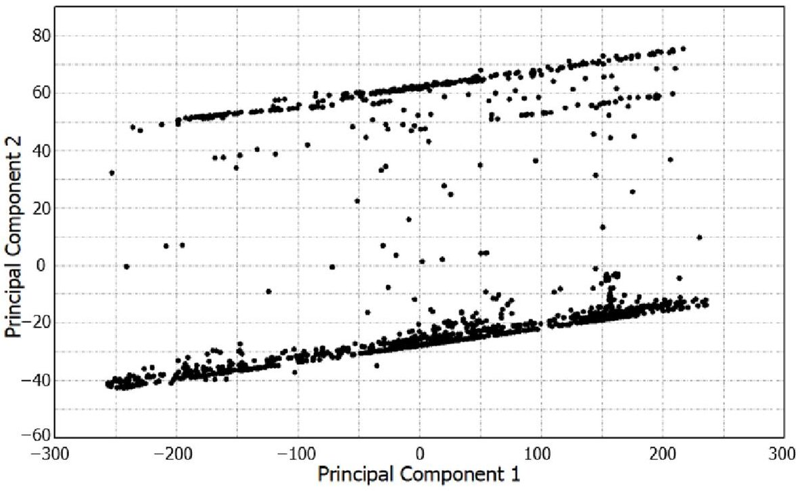

(b)

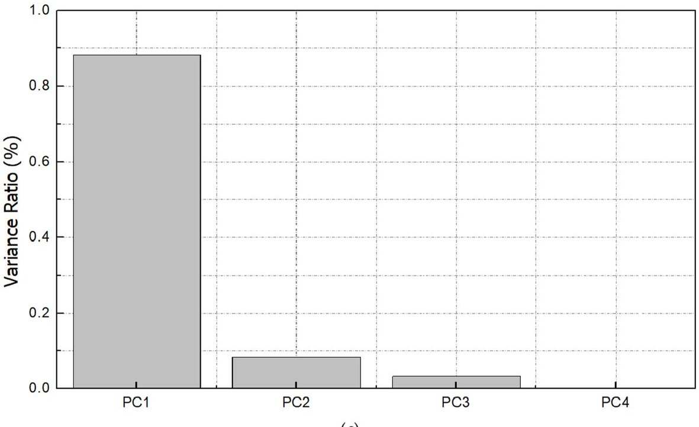

(c)

Figure 6. Principal component analysis of SCADA-based operating features: (a) schematic of the PCA procedure, including standardization, covariance matrix computation, eigen decomposition, and projection onto the selected principal components; (b) projection of all 10 min operating windows onto the first two principal components, illustrating the dominant operating modes; (c) variance ratio explained by the first four principal components, showing that PC1 captures most of the variance while PCs 2-4 add only a small additional share.

Figure 6b shows the projection of all 10 min windows onto the first two principal components. The data points are concentrated along a few elongated structures, which indicates that a small number of latent operating modes govern most of the variability Inspection of the loading vectors reveals that the first principal component has large positive contributions from hub-height wind speed, rotor speed, generator power, and generator torque, together with a negative contribution from pitch angle. PC1 can therefore be interpreted as a global loading mode or operating level index. Low values of PC1 correspond to low wind conditions and near idle operation, intermediate values correspond to below rated power production with increasing aerodynamic torque, and high values correspond to operation close to or above rated, where aerodynamic loads are high and pitch begins to act to limit power.

<!-- PDF_PAGE: 14 -->

The second principal component is dominated by control-related variables, in particular pitch angle, yaw angle, and yaw misalignment, with weaker contributions from power and torque. PC2 can thus be interpreted as a control response mode that describes how the turbine regulates loads for a given wind level. Positive PC2 values are associated with larger pitch angles and more active load shedding, often accompanied by increased yaw misalignment or yaw activity, whereas negative PC2 values correspond to nearly unpitched operation, where aerodynamic loading is primarily determined by wind speed and rotational speed. In combination, PC1 and PC2 separate the data into distinct bands that reflect both the overall loading level and the way the control system redistributes that load.

The contribution of each principal component to the total variance is illustrated in Figure 6c. The first principal component accounts for the majority of the variance in the feature set, and the next three components each contribute only a small additional fraction. Based on this spectrum, the first four principal components were retained as a compact, orthogonal representation of the operating conditions and were used both for exploratory analysis of operating modes and as an alternative input set for the ROM. In the case study presented here, we compare ROM configurations using either the standardized SCADA features directly or the first four principal components as inputs, and select the final configuration based on test set performance.

(a) Schematic of the PCA procedure, including standardization of the feature matrix, computation of the covariance matrix, eigenvalue-eigenvector decomposition, and projection onto the selected principal components;

(b) Projection of all 10 min operating windows onto the first two principal components, showing that the data are organized along a small number of dominant operating modes;

(c) Variance ratio explained by the first four principal components, illustrating that PC1 captures most of the variance while PCs 2-4 contribute only a small additional share.

## 3.4. Stress Reduced-Order Model Training and Validation

The stress reduced-order model approximates the mapping from SCADA-based operating condition descriptors to directional blade root fatigue loading. For each monitored blade root direction (flapwise, edgewise, and torsional), a separate model is trained. The model takes as input either the retained principal component scores or the full standardized SCADA feature vector for a given 10 min window and outputs the corresponding damage equivalent load (DEL) $ \hat{\sigma}_{DEL,d} $ for that direction, rather than reconstructing the full stress time series.

Gradient boosting regression implemented via the LightGBM framework is chosen as the learning algorithm due to its ability to capture nonlinear relationships between inputs and outputs while offering low computational cost during inference. The dataset is divided into training, validation, and test subsets using a chronological split: early data are used for training, intermediate data for validation and hyperparameter tuning, and the most recent data for testing. This reflects realistic deployment, where models are trained on historical data and then applied to future operation.

Hyperparameters of the LightGBM models, such as learning rate, number of leaves, and feature and data subsampling ratios, were selected based on validation loss with early stopping. In addition to a baseline configuration using default hyperparameters, alternative configurations with PCA-based inputs and Bayesian optimization of the LightGBM hyperparameters were evaluated, and the final configuration was chosen based on its DEL-prediction accuracy on the test set. In the implementation reported in this paper, a single set of LightGBM hyperparameters was adopted for all three directional DEL-ROMs,

<!-- PDF_PAGE: 15 -->

as summarized in Table 5. For interpretability, SHAP values were computed for each direction-specific LightGBM model on the held-out test set, and global importance was summarized using the mean absolute SHAP value.

Table 5. LightGBM hyperparameters for each stress direction.

<table border="1"><tr><td>Direction</td><td>Learning Rate</td><td>Objective</td><td>Num.of Leaves</td><td>Feature Fraction</td><td>Metric</td><td>Bagging Fraction</td></tr><tr><td>Flapwise</td><td>0.05</td><td>regression</td><td>31</td><td>0.9</td><td>I2(RMSE)</td><td>0.8</td></tr><tr><td>Edgewise</td><td>0.05</td><td>regression</td><td>31</td><td>0.9</td><td>I2(RMSE)</td><td>0.8</td></tr><tr><td>Torsional</td><td>0.05</td><td>regression</td><td>31</td><td>0.9</td><td>I2(RMSE)</td><td>0.8</td></tr></table>

Model performance is evaluated on an independent test set by comparing the predicted DELs $ \hat{\sigma}_{\mathrm{DEL},d} $ to the DELs computed from measured stress histories for each 10 min window. We use mean absolute error (MAE), root mean square error (RMSE), and the coefficient of determination $ R^{2} $ as performance metrics. As summarized in Table 6, the ROM reproduces the directional DELs with $ R^{2} $ values of about 0.87, 0.99, and 0.99 for the flapwise, edgewise, and torsional directions, respectively, and with errors that are small compared with the natural spread of DEL values in the dataset. The scatter plot in Figure 7 shows that the predicted DELs closely follow the 1:1 reference line over the full operating range, with no evident systematic bias. Table 7 further compares the performance with and without PCA under the same split and training procedure; PCA does not provide a performance gain in this dataset, and the non-PCA configuration is used in the remainder of the study. To clarify which SCADA-derived operating descriptors drive the DEL-ROM predictions, we further provide SHAP-based global feature attribution for each directional model (Figure 7). These results indicate that the DEL-ROM is sufficiently accurate to support the subsequent Soderberg-based safety assessment and one-class SVM-based anomaly detection. For clarity, the one-class SVM validation results in this case study are obtained using measured DEL features, while ROM-predicted DELs are used in online deployment.

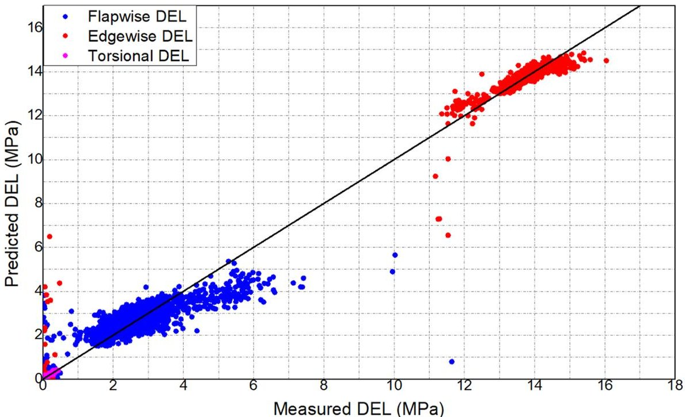

Figure 7. Measured vs. predicted DELs for blade root directions. All three directions follow the same DEL computation (Rainflow-based DEL over 10 min windows) and the same evaluation rule (measured vs. ROM-predicted DEL with a 1:1 reference line); differences in scatter reflect directional load characteristics.

<!-- PDF_PAGE: 16 -->

Table 6. Test performance of the stress ROM (MAE, RMSE, $ R^{2} $ ).

<table border="1"><tr><td>Direction</td><td>MAE</td><td>RMSE</td><td>R2</td></tr><tr><td>Flapwise</td><td>0.33MPa</td><td>0.56MPa</td><td>0.871</td></tr><tr><td>Edgewise</td><td>0.18MPa</td><td>0.37MPa</td><td>0.997</td></tr><tr><td>Torsional</td><td>0.011MPa</td><td>0.016MPa</td><td>0.991</td></tr></table>

Table 7. Performance comparison with vs. without PCA.

<table border="1"><tr><td>Direction</td><td>Setting</td><td>MAE</td><td>RMSE</td><td>R2</td></tr><tr><td>Flapwise</td><td>Without PCA</td><td>0.50MPa</td><td>1.26MPa</td><td>0.691</td></tr><tr><td>Flapwise</td><td>With PCA</td><td>0.71MPa</td><td>1.5MPa</td><td>0.564</td></tr><tr><td>Edgewise</td><td>Without PCA</td><td>1.45MPa</td><td>1.65MPa</td><td>0.936</td></tr><tr><td>Edgewise</td><td>With PCA</td><td>2.06MPa</td><td>3.04MPa</td><td>0.784</td></tr><tr><td>Torsional</td><td>Without PCA</td><td>0.05MPa</td><td>0.05MPa</td><td>0.904</td></tr><tr><td>Torsional</td><td>With PCA</td><td>0.06MPa</td><td>0.07MPa</td><td>0.801</td></tr></table>

Since the one-class SVM detects deviations in the input feature space, using ROMpredicted DELs may affect anomaly detection performance when prediction errors are non-negligible. Increased prediction noise can inflate apparent deviations and lead to false alarms, while systematic biases may reduce sensitivity and increase missed detections, particularly in directions with larger ROM errors. In practice, this can be mitigated by temporal smoothing or decision rules over multiple consecutive windows, and by calibrating thresholds with consideration of expected ROM prediction uncertainty. A more rigorous assessment using labeled fault events will be part of future work.

## 3.5. Fatigue-Metric Computation and Soderberg Parameters

The transformation from stress histories to fatigue metrics is summarized in Figure 4. For each time window and each monitored blade root direction, the measured stress time series $ \hat{\sigma}_{d}(t) $ is processed using Rainflow counting to decompose the history into a set of stress cycles. Each cycle is characterized by its range $ \Delta\sigma_{i} $ ,mean $ \sigma_{m,i} $ ,and count $ n_{i} $ . The Rainflow algorithm employed follows widely used standards for fatigue analysis [22]. Based on the identified cycles, the damage equivalent load (DEL) is computed as

$$
\sigma_ {D E L} = \left(\frac {1}{N _ {r e f}} \sum_ {i} n _ {i} \left(\Delta \sigma_ {i}\right) ^ {m}\right) ^ {1 / m}
$$

where m is the S-N curve slope exponent and $ N_{\mathrm{ref}} $ is the reference number of cycles. Representative values of m and $ N_{\mathrm{ref}} $ for blade materials are selected based on typical design practice and published guidelines, and are documented in Table 7 together with the assumed material properties used in the Soderberg evaluation. In line with common practice for blades, we adopt an S-N slope of m=10 and a conventional reference cycle count of $ N_{\mathrm{ref}}=1.0\times10^{7} $ cycles; because the same $ N_{\mathrm{ref}} $ is used consistently, its exact value does not affect the relative comparison of DELs in this study [23,24].

For each 10 min stress history, Rainflow counting yields a set of closed cycles indexed by i, each characterized by a stress range $ \Delta\sigma_{i} $ a cycle mean $ \mu_{i} $ , and an associated count $ n_{i} $ . The alternating stress amplitude of each cycle is defined as $ \sigma_{a,i}=\Delta\sigma_{i}/2 $ and the cycle mean stress as $ \sigma_{m,i}=\mu_{i} $ . The DEL in a given 10 min window is computed from the Rainflow amplitude distribution using Equation (1), and thus depends on the cycle

<!-- PDF_PAGE: 17 -->

alternating amplitudes (or equivalently ranges). For the Soderberg evaluation, we map the Rainflow cycles within each 10 min window to a single representative stress state in the mean-alternating stress plane by defining the effective alternating stress as $ \sigma_{a}\equiv $ DEL and computing the effective mean stress $ \sigma_{m} $ as a damage-weighted average of cycle means,

$$
\sigma_ {m} = \frac {\sum_ {i} \left(n _ {i} \sigma_ {a , i} ^ {m}\right) \sigma_ {m , i}}{\sum_ {i} n _ {i} \sigma_ {a , i} ^ {m}}
$$

The resulting pair $ \left( \sigma_{m},\sigma_{a}\right) $ is then used in the Soderberg relation to compute a conservative utilization index for each 10 min window.

To obtain a physically interpretable fatigue safety index, the Soderberg criterion is applied. Effective alternating and mean stresses $ \sigma_{a} $ and $ \sigma_{m} $ are computed from the Rainflow cycles within each window, for example, by taking appropriately weighted averages of the cycle ranges and means. These values are combined into a Soderberg index,

$$
I _ {s o d} = \frac {\sigma_ {a}}{\sigma_ {e}} + \frac {\sigma_ {m}}{\sigma_ {y}}
$$

where $ \sigma_{e} $ denotes an assumed endurance limit (fatigue strength) and $ \sigma_{y} $ denotes an assumed yield (or static) strength. Since proprietary design values and blade-specific S-N data are not available, $ \sigma_{e} $ and $ \sigma_{y} $ are chosen as conservative representative parameters for glass-fiber composite blades rather than exact design values. In this study, $ \sigma_{e} $ and $ \sigma_{y} $ are treated as generic, conservative material parameters due to the lack of blade-specific coupon data. The resulting Soderberg index is therefore used as a screening indicator that preserves physical interpretability and monotonicity with respect to stress level, rather than as an absolute risk estimator. Specifically, we vary $ \sigma_{e} $ and $ \sigma_{y} $ by $ \pm10\% $ and $ \pm20\% $ around the baseline values in Table 7 and report the resulting changes in the distribution of $ I_{\mathrm{sod}} $ and in the proportions of windows classified as Normal/Alert/Alarm. To reflect uncertainty in the S-N slope, we also recompute DEL using representative exponents (e.g., m=8,10,12) and discuss the impact on downstream screening outcomes.

The material parameters are differentiated by direction to reflect the different laminate configurations at the blade root. For flapwise bending, which is carried mainly by unidirectional glass, the highest strength and fatigue resistance are expected; we therefore assign $ \sigma_{y}=220 $ MPa and $ \sigma_{e}=70 $ MPa as conservative fractions of typical static and fatigue strengths reported for GFRP blade laminates. Edgewise bending is more strongly influenced by gravity loading and by laminates with a larger proportion of off-axis plies, so slightly lower values of $ \sigma_{y}=200 $ MPa and $ \sigma_{e}=60 $ MPa are used. Torsional response is governed primarily by shear in $ \pm 45^{\circ} $ plies and adhesive joints, which motivates the lowest strength levels with $ \sigma_{y}=90 $ MPa and $ \sigma_{e}=30 $ MPa. These values are intentionally chosen below the upper bounds of published data so that the resulting Soderberg index provides a conservative assessment of fatigue safety [23,24]. The adopted set of fatigue and material parameters $ (m,N_{\mathrm{ref}},\sigma_{e},\sigma_{y}) $ for each direction is summarized in Table 8.

Table 8. Fatigue and material parameters $ ( m,N_{\mathrm{ref}},\sigma_{e},\sigma_{y} ) $

<table border="1"><tr><td>Direction</td><td>m</td><td>Nref</td><td>σe</td><td>σy</td></tr><tr><td>Flapwise</td><td>10</td><td>1.0×1.07</td><td>70MPa</td><td>220MPa</td></tr><tr><td>Edgewise</td><td>10</td><td>1.0×1.07</td><td>60MPa</td><td>200MPa</td></tr><tr><td>Torsional</td><td>10</td><td>1.0×1.07</td><td>30MPa</td><td>90MPa</td></tr></table>

<!-- PDF_PAGE: 18 -->

Figure 8 illustrates the Soderberg-based safety map for the flapwise blade root stress in the mean-alternating stress plane. The solid black line denotes the Soderberg limit defined by $ \sigma_{a} / \sigma_{e}+\sigma_{m} / \sigma_{y}=1 $ , while the blue and red lines indicate the alert and alarm thresholds corresponding to lower and higher values of the Soderberg index （ $ I_{\mathrm{low}} $ and $ I_{\mathrm{high}} $ ）, respectively. Each marker represents a 10 min operating window plotted by its effective mean stress $ \sigma_{m} $ and alternating stress $ \sigma_{a} $ ; black, blue, and red markers correspond to states classified as Normal （ $ I_{\mathrm{Sod}}<I_{\mathrm{low}} $ ）, Alert （ $ I_{\mathrm{low}}\leq I_{\mathrm{Sod}}<I_{\mathrm{high}} $ ）, and Alarm （ $ I_{\mathrm{Sod}}\geq I_{\mathrm{high}} $ ）. The values adopted for $ \sigma_{e} $ $ \sigma_{y} $ $ I_{\mathrm{low}} $ , and $ I_{\mathrm{high}} $ are summarized in Table 9. In this work, the Soderberg index is interpreted using three condition classes defined in Table 8. The lower threshold $ I_{\mathrm{low}}=0.4 $ marks a conservative boundary for normal operation, while the upper threshold $ I_{\mathrm{high}}=0.9 $ is chosen to flag operating points that are close to the Soderberg limit $ I_{\mathrm{sod}}=1. $

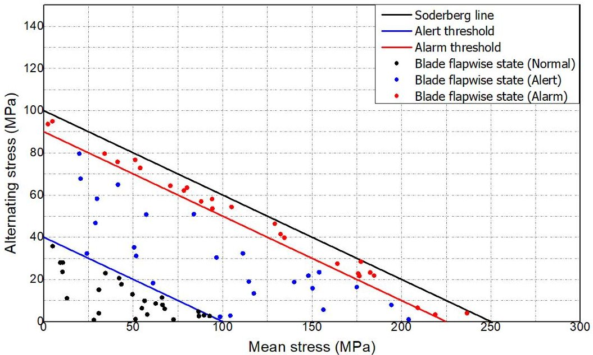

Figure 8. Soderberg-based fatigue safety map for the flapwise blade root stress. The black line denotes the Soderberg limit.

Table 9. Soderberg index thresholds and condition classes.

<table border="1"><tr><td>Condition Class</td><td>Soderberg Index Range $ I_{\mathrm{Sod}} $</td><td>Description</td></tr><tr><td>Normal</td><td>$ I_{\mathrm{Sod}}< I_{\mathrm{low}}=0.4 $</td><td>Stress state well inside the admissible fatigue envelope; significant safety margin to both endurance and yield limits.</td></tr><tr><td>Alert</td><td>$ 0.4\leq I_{\mathrm{Sod}}< I_{\mathrm{high}}=0.9 $</td><td>Increased mean and/or alternating stress compared to normal operation, but still below the Soderberg limit; requires closer monitoring of trends.</td></tr><tr><td>Alarm</td><td>$ I_{\mathrm{Sod}}\geq I_{\mathrm{high}}=0.9 $</td><td>Combined mean and alternating stress approaching or exceeding the Soderberg limit; indicates high fatigue utilization and potential need for corrective action.</td></tr></table>

A sensitivity check was performed by perturbing $ \sigma_{e} $ and $ \sigma_{y} $ by $ \pm10\% $ and $ \pm20\% $ around the baseline values (Table 8), and recomputing the Soderberg index for each 10 min window. All windows were re-classified using the same Normal/Alert/Alarm bands in Table 9. In addition, DEL was re-computed using m=8,10, and 12 to reflect plausible variation in the S-N slope.

<!-- PDF_PAGE: 19 -->

## 3.6. One-Class SVM Configuration and Hybrid Decision Logic

While the Soderberg-based index provides a scalar, physically meaningful measure of fatigue safety, it does not fully exploit the multivariate structure of fatigue-related metrics and depends on assumed material parameters. To complement this physics-based assessment, a one-class support vector machine (one-class SVM) is employed as an unsupervised anomaly detector in the space of fatigue features [26]. Because ground-truth damage or fault labels are not available in the present dataset, the one-class SVM is used as an unsupervised novelty (outlier) detector that identifies deviations from the learned normal feature distribution, rather than as a fault detector or fault-type classifier.

For each 10 min window, a fatigue feature vector is constructed from quantities such as the directional DELs, effective mean and alternating stresses, selected percentiles of the stress-amplitude distribution, and the Soderberg index. In the case-study validation, the one-class SVM is trained and evaluated using fatigue features computed from measured strain-gauge signals (strain $ \rightarrow $ stress $ \rightarrow $ Rainflow $ \rightarrow $ 10 min DEL) to isolate the anomaly-detection behavior from ROM prediction errors. In online SCADA-only deployment, the same feature definitions are evaluated using DEL-ROM outputs so that both the Soderberg screening and the one-class SVM operate on a shared ROM-based representation of directional fatigue loading. These features are standardized using statistics from the training data. The complete feature set supplied to the one-class SVM is summarized in Table 10.

Table 10. One-class SVM fatigue feature set.

<table border="1"><tr><td>Feature Name</td><td>Source Variables</td><td>Definition/Description</td></tr><tr><td>Mean wind speed</td><td>SCADA wind speed</td><td>Arithmetic mean of hub-height wind speed within the 10 min window.</td></tr><tr><td>Flapwise DEL/Mean/Alternating DEL</td><td>Flapwise blade-root fatigue metrics(DEL, $ \sigma_{m},\sigma_{a} $ ) obtained from the fatigue-processing chain(measured blade-root stresses in the case study,DEL-ROM outputs in SCADA-only deployment).</td><td>Set of three flapwise fatigue features: flapwise DEL together with the effective mean stress $ \sigma_{m} $ and alternating stress $ \sigma_{a} $ used in the Soderberg index of Equation(3).</td></tr><tr><td>Edgewise DEL/Mean/Alternating DEL</td><td>Edgewise blade-root fatigue metrics(DEL, $ \sigma_{m},\sigma_{a} $ ) obtained from the fatigue-processing chain(measured blade-root stresses in the case study,DEL-ROM outputs in SCADA-only deployment).</td><td>Set of three edgewise fatigue features: edgewise DEL together with the effective mean stress $ \sigma_{m} $ and alternating stress $ \sigma_{a} $ used in the Soderberg index of Equation(3).</td></tr><tr><td>Torsional DEL/Mean/Alternating DEL</td><td>Torsional blade-root fatigue metrics(DEL, $ \sigma_{m},\sigma_{a} $ ) obtained from the fatigue-processing chain(measured blade-root stresses in the case study,DEL-ROM outputs in SCADA-only deployment).</td><td>Set of three torsional fatigue features: torsional DEL together with the effective mean stress $ \sigma_{m} $ and alternating stress $ \sigma_{a} $ used in the Soderberg index of Equation(3).</td></tr></table>

The one-class SVM is trained exclusively on windows that represent normal operation. These windows are selected by excluding periods with controller alarms, curtailment, obvious sensor faults, or extreme transient events. This choice reflects the practical constraint of limited labeled fault data and focuses the model on detecting departures from the normal operating feature manifold. A radial basis function kernel is used to allow nonlinear decision boundaries in the feature space. The kernel width and the regularization parameter that controls the fraction of allowed outliers are tuned using a validation subset of the normal data. The tuned hyperparameters are listed in Table 11.

After training, the one-class SVM assigns to each new window either an anomaly score or a binary label, indicating whether the corresponding feature vector lies inside or outside the learned normal region. In the proposed hybrid diagnostic scheme, the Soderberg index is used as a first-stage, physics-based screening, and the one-class SVM serves as a secondstage, data-driven anomaly detector. The final diagnostic state is classified as Normal only when both the Soderberg class is Normal and the one-class SVM label is normal. Any case where either the Soderberg class is Alert or Alarm, or the one-class SVM labels the window as abnormal, is treated as Abnormal, as summarized in Table 12. In this study,

<!-- PDF_PAGE: 20 -->

"Abnormal" denotes an inspection-triggering deviation or a risk-relevant increase in fatigue indicators, not confirmed structural damage. Therefore, without labeled fault events and inspection records, the frequency of abnormal flags should not be interpreted as a quantified fault-detection rate, but as a conservative prioritization signal for further investigation.

Table 11. One-class SVM hyperparameters.

<table border="1"><tr><td>Hyperparameter</td><td>Value</td><td>Description</td></tr><tr><td>Kernel type</td><td>Radial basis function(RBF)</td><td>Nonlinear kernel used to model a closed boundary around the normal fatigue feature distribution.</td></tr><tr><td>Kernel width</td><td>Gamma=scale</td><td>Kernel width set automatically as $ 1/n_{features}\cdot Var(X) $ following the scikit-learn default.</td></tr><tr><td>Outlier fraction</td><td>v=0.10</td><td>Upper bound on the fraction of allowed outliers in the training data and lower bound on the fraction of support vectors.</td></tr><tr><td>Feature scaling</td><td>Standardization(z-score)</td><td>Each feature is centered and scaled to unit variance before training the one-class SVM.</td></tr></table>

Table 12. Hybrid decision logic: mapping from Soderberg class and one-class SVM label to the final diagnostic state.

<table border="1"><tr><td>Soderberg Class</td><td>One-Class SVM Label</td><td>Final Diagnostic State</td><td>Interpretation</td></tr><tr><td>Normal</td><td>Normal</td><td>Normal</td><td>Both the physics-based Soderberg index and the data-driven OC-SVM indicate normal fatigue behavior.</td></tr><tr><td>Normal</td><td>Abnormal</td><td>Abnormal</td><td>Stress level is within the Soderberg Normal range, but the multivariate fatigue feature pattern deviates from the learned normal distribution.</td></tr><tr><td>Alert</td><td>Normal</td><td>Abnormal</td><td>Increased fatigue utilization according to the Soderberg index, even though the OC-SVM still labels the feature vector as normal.</td></tr><tr><td>Alert</td><td>Abnormal</td><td>Abnormal</td><td>Soderberg index indicates elevated fatigue utilization and the OC-SVM also flags the feature vector as abnormal.</td></tr><tr><td>Alarm</td><td>Normal</td><td>Abnormal</td><td>Soderberg index is close to or exceeds the design limit; the state is regarded as abnormal regardless of the OC-SVM label.</td></tr><tr><td>Alarm</td><td>Abnormal</td><td>Abnormal</td><td>Both the Soderberg index and the OC-SVM indicate critical deviation from normal fatigue behavior.</td></tr></table>

## 4. Results and Discussion

## 4.1. Operating Conditions and Dataset Coverage

This section presents the performance of the proposed DEL-based stress ROM and the hybrid fatigue diagnosis scheme under the operating conditions described in Section 3. The dataset consists of continuous measurements from a 2 MW onshore turbine collected over the period indicated in Table 3. After applying the windowing strategy and data-quality filters described in Sections 3.2 and 3.3, a total of 14,561 ten-minute windows remain available for model development and evaluation, of which 8736, 2912, and 2913 windows are assigned to the training, validation, and test sets, respectively.

The wind speed distribution in each subset spans the full range from near cut-in to below rated operation, with a smaller number of windows close to or slightly above rated wind speed. This ensures that the ROM is exposed to the dominant operating regimes that contribute to fatigue loading at the blade root. By splitting the data chronologically, with earliest data used for training, intermediate data for validation, and the most recent period reserved for testing, the evaluation setup reflects the intended deployment scenario, where the ROM and diagnostic models are trained on historical data and then applied to future operation.

<!-- PDF_PAGE: 21 -->

The SCADA-based operating features constructed for each ten-minute window (Table 4) show strong correlations in physically expected patterns. For example, mean wind speed, rotor speed, generator power, and generator torque increase together from low to moderate wind speeds, while pitch angle and yaw activity become more pronounced near rated operation. The PCA described in Section 3.3.3 confirms that most of the variance in the feature set can be captured by a small number of principal components that represent global loading level and control response modes. This structure provides a favorable basis for learning compact DEL-ROMs from the available data.

## 4.2. Performance of the DEL-Based Stress ROM

Test set performance of the DEL-based stress ROM is summarized in Table 6. For each blade root direction, an independent LightGBM regressor is trained to predict the ten-minute damage equivalent load from SCADA-based operating features. On the independent test set, the flapwise DEL is reproduced with a mean absolute error (MAE) of approximately 0.33 MPa, a root mean square error (RMSE) of 0.56 MPa, and a coefficient of determination $ \mathrm{R}^{2}=0.871 $ . The edgewise and torsional DELs exhibit even higher levels of agreement, with MAEs on the order of 0.18 MPa and 0.011 MPa,RMSEs of 0.37 MPa and 0.016 MPa, and coefficients of determination of 0.997 and 0.991, respectively.

Figure 8 shows scatter plots of measured versus ROM-predicted DELs for all ten minute windows in the test set, together with a 1:1 reference line. The points are tightly concentrated around the reference line for the edgewise and torsional directions, indicating negligible systematic bias and very small relative scatter over the full DEL range. In the flapwise direction the scatter is somewhat larger, particularly at low to intermediate DEL levels, which is consistent with the stronger influence of turbulent inflow and controller activity on flapwise loading. Nevertheless, the flapwise predictions still track the overall magnitude and variability of the measured DELs with good fidelity.

The combination of high $ R^{2} $ values and the near-unity slope of the measured-versus predicted relations demonstrates that the DEL-ROM provides an accurate and computationally efficient surrogate for directional fatigue loading at the blade root. Since the input features are derived from SCADA variables that are available on all turbines, the ROM enables fleet-wide estimation of flapwise, edgewise, and torsional DELs, even for units that are not instrumented with blade-root strain gauges.

As a simple ablation study, we also trained baseline DEL predictors that used only the mean wind speed as a single input feature. These baselines achieved markedly lower $ R^{2} $ values than the proposed multi-feature ROM, especially for the flapwise direction, confirming that a richer set of SCADA-based operating descriptors is required to capture the directional fatigue loads at the blade root.

We additionally examined PCA as an optional preprocessing step and compared the DEL-ROM performance with and without PCA under the same time-based split and training procedure. Table 7 presents the side-by-side test set results. In our dataset, applying PCA did not improve predictive performance and, for some directions, led to lower test set accuracy. Therefore, we retain the non-PCA configuration as the final DEL-ROM, which also preserves the direct physical meaning of the SCADA-derived operating descriptors.

To improve interpretability of the DEL-ROM beyond aggregate error metrics, we additionally report SHAP-based global feature attribution for each direction-specific LightGBM predictor (Figure 9). Figure 9 summarizes the mean absolute SHAP contribution on the test set (normalized to percentage), where the feature indices (1-10) correspond to the following SCADA-derived operating descriptors: (1) GEN_SPEED_mean, (2) WIND_SPEED_mean, (3) WIND_DIRECTION_std, (4) WIND_SPEED_std, (5) BLADE_1_ANGLE_mean, (6) ACTIVE_POWER_mean, (7) WIND_DIRECTION_mean, (8) GEN_SPEED_std, (9) BLADE_1_

<!-- PDF_PAGE: 22 -->

ANGLE_std, and (10) NACELLE_POSITION_mean. Across all three directional models, the mean generator speed (feature #1) is the dominant driver, accounting for approximately half of the total attribution (49-53%) , indicating that the operating point represented by generator speed is a primary determinant of the ten-minute DEL.

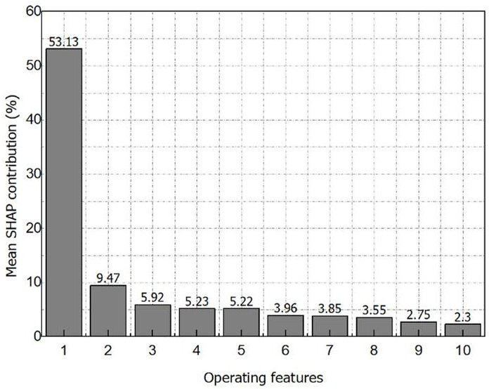

(a)

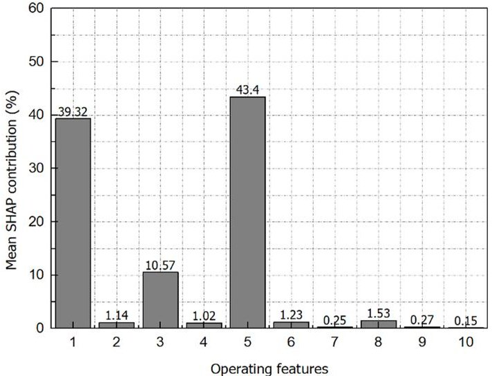

(b)

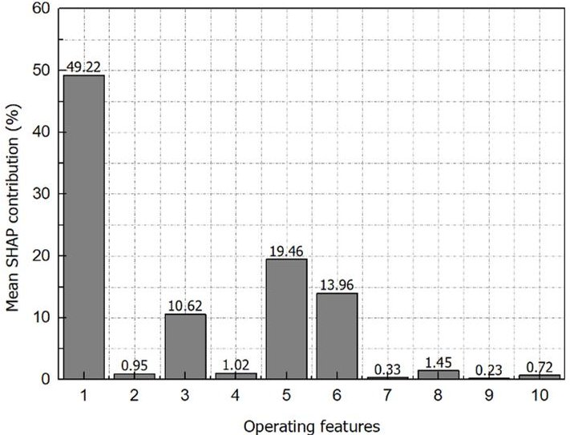

(c)

Figure 9. SHAP-based global feature attribution for the final DEL-based stress ROM (non-PCA). Bar height indicates the mean absolute SHAP contribution on the test set, normalized to percentage across the selected operating descriptors. Results are shown for (a) flapwise, (b) edgewise, and (c) torsional ten-minute DEL predictors. The x-axis denotes the operating-feature index (1-10), as defined in the main text.

<!-- PDF_PAGE: 23 -->

Directional differences are also observed. For the edgewise and torsional predictors, the remaining attribution is concentrated in a small subset of control- and power-related descriptors, particularly the mean blade pitch angle (feature #5) and mean active power (feature #6), suggesting that these directions are strongly modulated by control actions and produced power level. In contrast, the flapwise predictor exhibits a more distributed pattern beyond the dominant operating-point term, with additional contributions from the mean wind speed (feature #2) and variability-related descriptors (features #3----4), reflecting the influence of short-term inflow fluctuations on flapwise fatigue loading. Overall, the SHAP results confirm that the DEL-ROM relies on a compact and physically interpretable set of operating features capturing both the mean operating state and its short-term variability.

## 4.3. Soderberg-Based Fatigue Safety Assessment

This subsection presents the Soderberg-based fatigue evaluation of the directional blade root stress states over the test period. Figure 10 summarizes the Soderberg-based evaluation of the directional DELs over the test period. For each 10 min window and each blade root direction (flapwise, edgewise, torsional), the effective mean stress $ \sigma_{m} $ and alternating stress $ \sigma_{\mathrm{a}} $ obtained from the Rainflow cycles are plotted in the $ \sigma_{m}-\sigma_{\mathrm{a}} $ plane. The solid black lines represent the Soderberg limits defined by Equation (3) with I_sod =1, and the blue and red lines indicate the alert and alarm thresholds I_low and I_high listed in Table 8. Markers are color-coded according to the Soderberg class: Normal $ \mathrm{I}_{\mathrm{sod}}<\mathrm{I}_{\mathrm{low}} $ Alert $ \mathrm{I}_{\mathrm{low}}\leq\mathrm{I}_{\mathrm{sod}}<\mathrm{I}_{\mathrm{high}} $ , and Alarm $ \mathrm{I}_{\mathrm{sod}}\geq\mathrm{I}_{\mathrm{high}} $ . The flapwise direction shows the highest utilization of the fatigue envelope, with several points approaching the alert and alarm bands, whereas the edgewise and torsional directions generally exhibit larger safety margins, with most operating windows remaining well below $ \mathrm{I}_{low} $ . This confirms that the flapwise bending load is the dominant contributor to fatigue usage at the blade root in the considered turbine.

Because the Soderberg index depends on assumed material parameters, we varied $ \sigma_{e} $ and $ \sigma_{y} $ by $ \pm 20\% $ around their baseline values and re-computed the index for each 10 min window. Using the same classification bands (Normal/Alert/Alarm; thresholds 0.4 and 0.9), Table 13 summarizes the resulting changes in class fractions. The flagged-window fraction (Alert + Alarm) remained on the order of 0.03% or less for all directions, indicating that the dominant trends and relative ranking are preserved.

Table 13. Sensitivity summary of flagged-window fraction (Alert + Alarm) under parameter perturbations.

<table border="1"><tr><td>Scenario</td><td>Flap Flagged</td><td>Edge Flagged</td><td>Torsion Flagged</td></tr><tr><td>Baseline</td><td>2(0.0066%)</td><td>8(0.0263%)</td><td>1(0.0033%)</td></tr><tr><td>$\sigma_{e}-20\%$</td><td>3(0.0098%)</td><td>9(0.0295%)</td><td>2(0.0066%)</td></tr><tr><td>$\sigma_{e}+20\%$</td><td>2(0.0066%)</td><td>1(0.0033%)</td><td>1(0.0033%)</td></tr><tr><td>$\sigma_{y}-20\%$</td><td>2(0.0066%)</td><td>8(0.0263%)</td><td>1(0.0033%)</td></tr><tr><td>$\sigma_{y}+20\%$</td><td>2(0.0066%)</td><td>8(0.0263%)</td><td>1(0.0033%)</td></tr><tr><td>m=8</td><td>2(0.0066%)</td><td>6(0.0199%)</td><td>1(0.0033%)</td></tr><tr><td>m=12</td><td>2(0.0066%)</td><td>6(0.0199%)</td><td>1(0.0033%)</td></tr></table>

<!-- PDF_PAGE: 24 -->

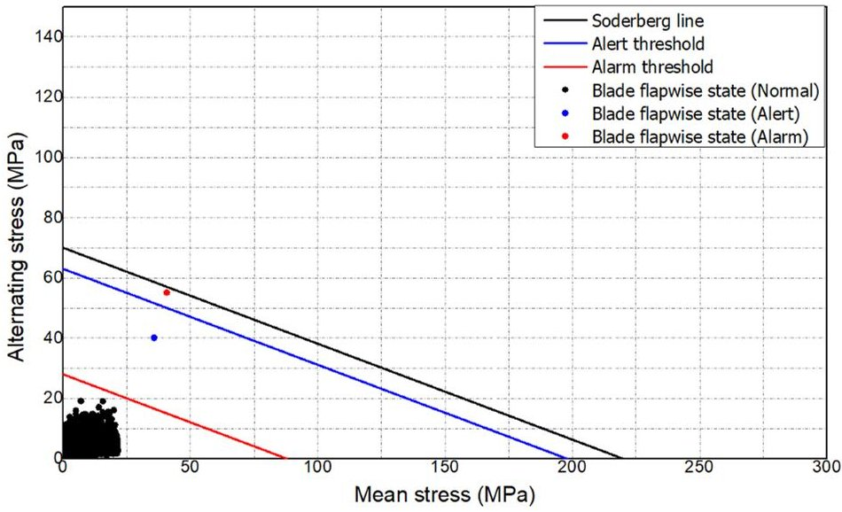

(a)

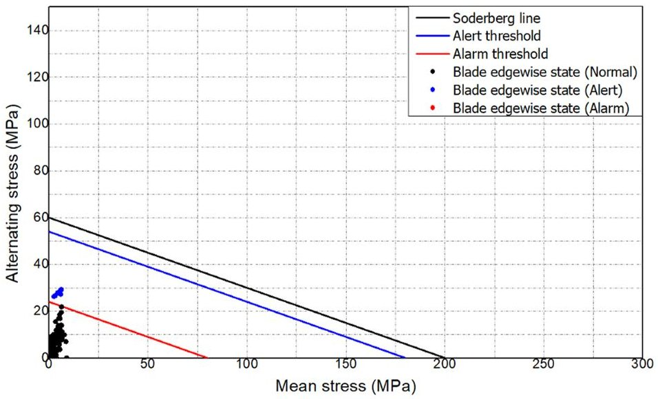

(b)

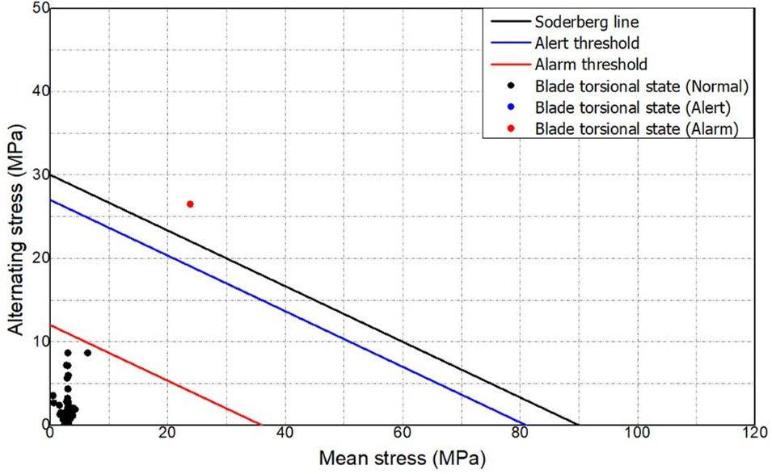

(c)

Figure 10. Soderberg-based evaluation of directional DELs in the mean-alternating stress $ \sigma_{m}-\sigma_{a} $ plane: (a) flapwise blade root stress; (b) edgewise blade root stress; (c) torsional blade root stress.

## 4.4. Application of the Hybrid Soderberg + OC-SVM Diagnostic Scheme

While the Soderberg-based index yields a scalar, physically interpretable measure of fatigue safety, it does not by itself exploit the full multivariate structure of the fatigue related metrics and it depends on assumed material parameters. To complement this physics-based screening, a one-class SVM is trained in the space of fatigue features listed in Table 10, using only windows corresponding to normal operation. The features are standardized using

<!-- PDF_PAGE: 25 -->

statistics from the training set, and an RBF kernel with the hyperparameters in Table 11 is used to learn a closed decision boundary around the normal feature cloud.

In the proposed hybrid diagnostic scheme, the Soderberg index acts as a first-stage mechanical screening and the one-class SVM as a second-stage anomaly detector. As formalized in Table 12, a ten-minute window is classified as Normal only if the Soderberg class is Normal and the one-class SVM label is also normal. If either the Soderberg class is Alert or Alarm, or the one-class SVM labels the window as abnormal, the final diagnostic state is treated as Abnormal. This corresponds to a logical "AND normal/OR abnormal" rule that prioritizes sensitivity to potential fatigue problems.

Figure 11 illustrates the resulting separation obtained by the one-class SVM for each blade root direction. Panel (a) shows the ten-minute windows embedded in the three dimensional space spanned by flapwise DEL, flapwise alternating stress amplitude, and flapwise mean stress; panels (b,c) show the corresponding spaces for the edgewise and torsional directions, respectively. Red markers correspond to windows labeled as normal by the one-class SVM, whereas green markers denote windows labeled as abnormal. In all three directions, the normal windows form compact clusters at low to moderate DEL and stress levels, whereas abnormal windows appear either near the Soderberg alert and alarm bands identified in Figure 10 or as sparse outliers with unusual combinations of DEL, mean stress, and amplitude.

To quantify the contribution of the data-driven stage, Table 14 summarizes the distribution of diagnostic classes over the test set. When using the Soderberg index alone, only a small fraction of windows fall into the Alert and Alarm classes, reflecting the conservative material parameters and the fact that most operating points remain well within the fatigue envelope. The one-class SVM, in contrast, identifies an additional subset of windows as abnormal based on unusual combinations of DEL, mean stress, and amplitude, even when their Soderberg indices remain below the alarm threshold. The hybrid logic marks as Abnormal the union of the Soderberg Alert/Alarm windows and the SVM-based abnormal windows, thereby strictly increasing the coverage of potentially critical operating periods while preserving the physically interpretable Soderberg classification.

Table 14. Comparison of abnormal-window counts flagged by the Soderberg criterion, OC-SVM, and the hybrid scheme.

<table border="1"><tr><td>Direction</td><td>Total Windows</td><td>Soderberg Abnormal</td><td>OC-SVM Abnormal</td><td>Hybrid Abnormal</td></tr><tr><td>Flapwise</td><td>2913</td><td>0</td><td>276</td><td>276</td></tr><tr><td>Edgewise</td><td>2912</td><td>1</td><td>480</td><td>480</td></tr><tr><td>Torsional</td><td>2913</td><td>0</td><td>594</td><td>594</td></tr></table>

Applied to the dataset described in Section 3, this hybrid logic produces a time series of Normal and Abnormal labels that can be directly overlaid on the DEL and Soderberg index histories. Periods with elevated mean and alternating stresses that push the Soderberg index toward the alert or alarm thresholds are consistently marked as Abnormal, even if their fatigue feature vectors remain close to the boundary of the learned normal region. Conversely, windows with physically safe Soderberg indices that nevertheless exhibit unusual combinations of DELs across the three directions are flagged by the one-class SVM, allowing the framework to capture operating regimes that may indicate emerging fatigue damage or atypical loading patterns.

<!-- PDF_PAGE: 26 -->

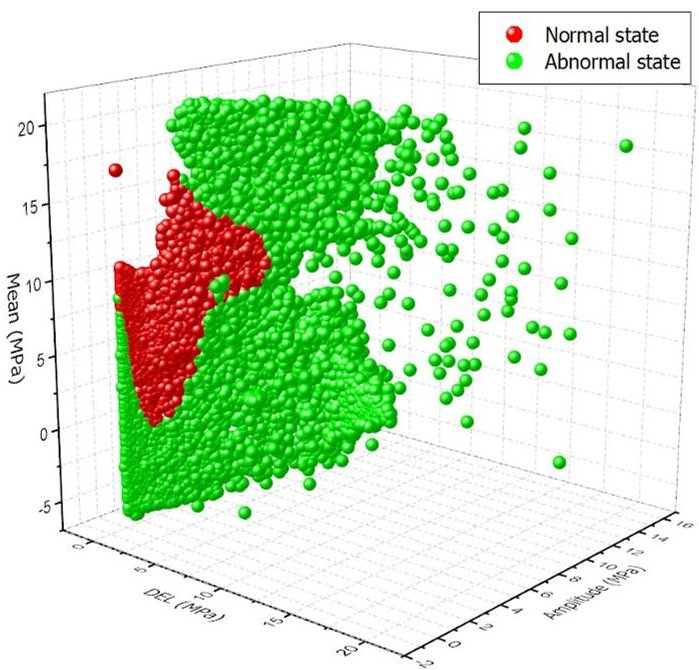

(a)

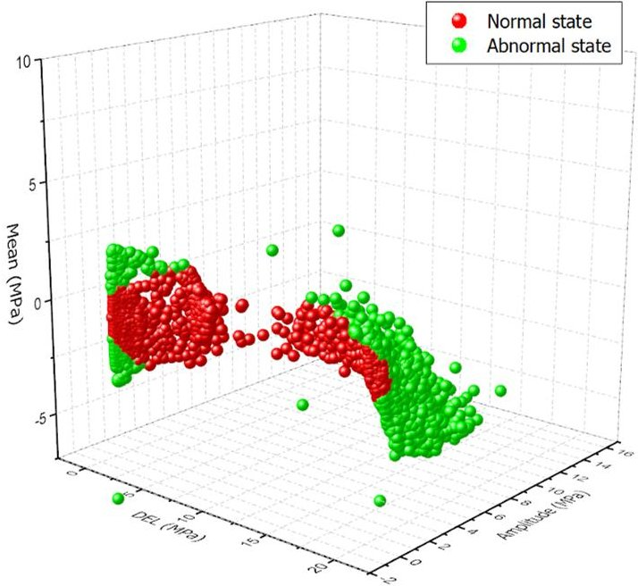

(b)

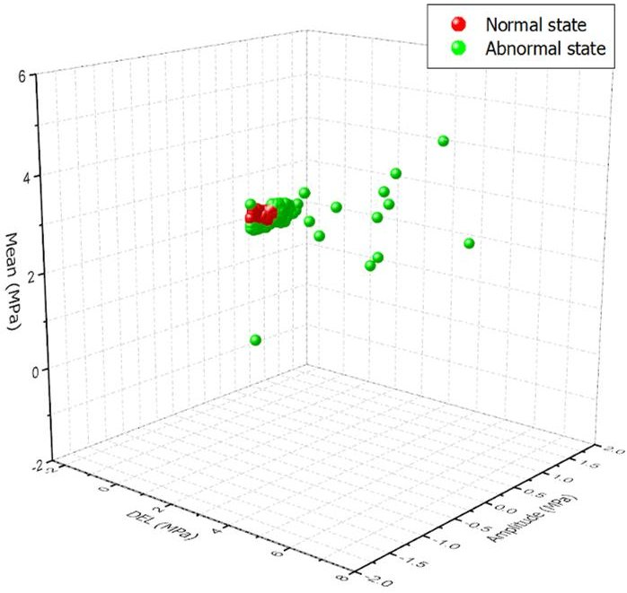

(c)

Figure 11. One-class SVM based classification in the fatigue feature space: (a) flapwise DEL, alternating stress amplitude, and mean stress; (b) edgewise DEL, alternating stress amplitude, and mean stress; (c) torsional DEL, alternating stress amplitude, and mean stress. Red markers indicate windows classified as normal and green markers indicate windows classified as abnormal.

<!-- PDF_PAGE: 27 -->

By construction, the hybrid scheme cannot miss any window that would have been flagged as abnormal by either the Soderberg criterion or the one-class SVM alone, because any such case is also labeled Abnormal in the combined logic. This property reduces the risk of overlooking potentially critical operating periods, at the cost of an increased number of windows being classified as abnormal compared with using either method in isolation. In the context of structural health monitoring for safety critical components such as wind turbine blades, this tradeoff between sensitivity and false alarms is acceptable, especially when the hybrid diagnostic output is used as a trigger for further inspection or targeted analysis rather than immediate shut down.

Despite these encouraging results, several limitations of the present study should be acknowledged. First, the case study is based primarily on data from quasi-normal operation of a single 2 MW onshore turbine. Explicit fault events or documented damage progressions were not available, so the diagnostic performance of the hybrid Soderberg and one-class SVM scheme under truly abnormal or degraded structural states could only be evaluated indirectly, for example, through elevated fatigue metrics and atypical loading patterns. In the absence of explicitly labeled damage events, the reported separation between normal and abnormal windows should therefore be interpreted as a conservative screening tool rather than a fully validated fault classifier. Second, the Soderberg parameters and fatigue thresholds are chosen as generic but conservative values for composite blades, and the OC-SVM models are trained on a finite observation period. As the turbine continues to operate and a richer variety of operating regimes and potential incipient damage conditions are observed, these parameters and models can be periodically updated, which is expected to improve the accuracy and robustness of the diagnosis over time. Finally, the present implementation focuses on blade-root stresses only. Although the framework is conceptually applicable to other structural components, such as the tower, main bearing, gearbox, and generator, these extensions are not yet demonstrated in this work and remain an important direction for future development.

More rigorous validation will require incorporating labeled fault/damage events together with maintenance and inspection records (e.g., inspection reports, repair logs, or event logs) to quantify detection performance (false-alarm rate, missed-detection rate, and detection delay) under confirmed damage scenarios.

## 5. Conclusions

This paper has presented an integrated framework for stress-based fatigue diagnosis of wind turbine blades that combines a data-driven reduced-order model, classical fatigue metrics, and an unsupervised anomaly detector. The framework is designed for practical field deployments where only SCADA measurements and a limited number of blade-root strain gauges are available and detailed structural design information is not accessible. A stress-based reduced-order model was developed using LightGBM to map SCADA-derived operating features to directional blade root DELs, and the resulting fatigue metrics were evaluated using a Soderberg-type index complemented by a one-class SVM in the space of DEL- and stress-based features.

In a case study on a 2 MW onshore turbine, the proposed DEL ROM achieved high predictive accuracy across all monitored directions. On the independent test set, the flapwise, edgewise, and torsional DELs were reproduced with coefficients of determination $ R^{2} $ of approximately 0.87, 0.99, and 0.99, respectively, while maintaining realistic error levels in terms of MAE and RMSE. This confirms that the SCADA-based ROM can capture the dominant dependence of blade root fatigue loads on operating conditions and can be used as a lightweight surrogate for direct strain measurements on turbines that are not instrumented with blade root gauges.

<!-- PDF_PAGE: 28 -->

The Soderberg-based fatigue assessment showed that flapwise bending dominates fatigue usage at the blade root, with several operating windows approaching the alert and alarm bands, while edgewise and torsional directions generally remain well within the safe region. The hybrid diagnostic scheme that combines the Soderberg index with a one-class SVM was able to flag operating periods with elevated mean and alternating stresses as abnormal and also to identify windows with unusual combinations of DEL, mean stress, and amplitude that lie outside the learned normal feature cloud. Because the final diagnostic state is classified as Normal only when both the Soderberg class and the one-class SVM label indicate normal behavior, the scheme is conservative by design and reduces the risk of overlooking potentially critical fatigue events.

The main contribution of this work is to demonstrate that a stress-based fatigue diagnosis framework can be constructed primarily from operational data while retaining a clear physical interpretation through DEL and Soderberg-type criteria. The proposed approach is modular and can be extended to other structural components such as the tower or drivetrain, or integrated into broader digital-twin environments for fleet-wide life management and life-extension studies. The absolute level of the Soderberg index depends on assumed material parameters. However, the index remains monotonic in $ \sigma_{a} $ and $ \sigma_{m} $ and the sensitivity study demonstrates how uncertainty in $ \sigma_{e} $ and $ \sigma_{y} $ shifts the screening thresholds while preserving the relative ranking of operating windows.

A limitation of this study is that the available dataset does not include confirmed blade damage or fault cases with ground-truth labels. Accordingly, the one-class SVM component should be interpreted as an unsupervised detector of deviations from normal operating patterns rather than a fault classifier. Therefore, the present case study provides an indirect evaluation based on fatigue-indicator trends and deviations from learned normal patterns, rather than validation against confirmed fault outcomes. More rigorous validation will require incorporating real fault/damage events together with maintenance and inspection records to enable fault-type attribution and quantitative assessment of detection performance under confirmed damage scenarios.

Future work will focus on validating the framework on additional turbines and sites, accumulating longer-term monitoring data, and refining the ROM using regime-specific or multi-output models. In addition, incorporating probabilistic uncertainty quantification in both the ROM predictions and diagnostic thresholds will better support risk-informed decision-making for operation and maintenance. Finally, integrating component-specific modules into a unified digital-twin environment with remaining-life estimation and maintenance decision support is a natural next step toward a farm-wide, multi-component structural health monitoring system.

Author Contributions: Conceptualization and methodology, J.-Y.L. and M.-C.D.; software, J.-Y.L.; validation, J.-Y.L. and S.-J.L.; investigation, J.-Y.L. and M.-C.D.; writing—original draft preparation, J.-Y.L.; writing—review and editing, J.-Y.L., M.-C.D. and S.-J.L.; supervision and project administration, S.-J.L. and M.-C.D. All authors have read and agreed to the published version of the manuscript.

Funding: This work was supported by the Korea Institute of Energy Technology Evaluation and Planning (KETEP) grant funded by the Korea government (MOTIE) (RS-2022-KP002821, Development of durability evaluation and remaining useful life prediction technology for wind turbine life extension).

Data Availability Statement: The original contributions presented in the study are included in the article; further inquiries can be directed to the corresponding author. The data are not publicly available due to confidentiality agreements with the turbine owner/operator and the commercial sensitivity of the operational measurements.

Conflicts of Interest: The authors declare no conflicts of interest.

<!-- PDF_PAGE: 29 -->

## Abbreviations

<table border="1"><tr><td>AI</td><td>Artificial Intelligence</td></tr><tr><td>CBM</td><td>Condition-Based Maintenance</td></tr><tr><td>DEL</td><td>Damage Equivalent Load</td></tr><tr><td>DEL-ROM</td><td>Damage Equivalent Load Reduced-Order Model</td></tr><tr><td>DT</td><td>Digital Twin</td></tr><tr><td>FEM</td><td>Finite Element Method</td></tr><tr><td>GFRP</td><td>Glass-Fiber-Reinforced Plastic</td></tr><tr><td>MAE</td><td>Mean Absolute Error</td></tr><tr><td>OC-SVM</td><td>One-class Support Vector Machine</td></tr><tr><td>PCA</td><td>Principal Component Analysis</td></tr><tr><td>PC1</td><td>First Principal Component</td></tr><tr><td>PC2</td><td>Second Principal Component</td></tr><tr><td>RBF</td><td>Radial Basis Function</td></tr><tr><td>RMSE</td><td>Root Mean Square Error</td></tr><tr><td>ROM</td><td>Reduced-Order Model</td></tr><tr><td>SCADA</td><td>Supervisory Control and Data Acquisition</td></tr><tr><td>SVM</td><td>Support Vector Machine</td></tr></table>

## References

1. International Energy Agency (IEA). Net Zero by 2050: A Roadmap for the Global Energy Sector; IEA: Paris, France, 2021.

2. Global Wind Energy Council (GWEC). Global Wind Report 2024; Global Wind Energy Council: Brussels, Belgium, 2024.

3. IEC 61400-1:2019; Wind Energy Generation Systems, Part 1: Design Requirements. IEC: Geneva, Switzerland, 2019.

4. Hameed, Z.; Hong, Y.S.; Cho, Y.M.; Ahn, S.H.; Song, C.K. Condition monitoring and fault detection of wind turbines and related systems: A review. Renew. Sustain. Energy Rev. 2009, 13, 1-39. [CrossRef]

5. Yang, W.; Tavner, P.J.; Crabtree, C.J.; Feng, Y.; Qiu, Y. Wind turbine condition monitoring: Technical and commercial challenges. Wind Energy 2014, 17, 673-693. [CrossRef]

6. De Kooning, J.D.M.; Gonzalez-Garcia, A.; Van de Vyver, J.; Vandevelde, L. Digital twins for wind energy conversion systems: A literature review. Processes 2021, 9, 2224. [CrossRef]

7. Kandemir, E.; Wehn, N.; Kocaman, A.S. Predictive digital twin for wind energy systems: A literature review. Energy Inform. 2024, 7, 24. [CrossRef]

8. Leon-Medina, J.X.; Tibaduiza, D.A.; Parés, N.; Pozo, F. Digital twin technology in wind turbine components: A review. Intell. Syst. Appl. 2025, 26, 200535. [CrossRef]

9. Jonkman, J. Definition of a 5 MW Reference Wind Turbine for Offshore System Development; NREL/TP-500-38060; National Renewable Energy Laboratory: Golden, CO, USA, 2009.

10. OpenFAST. Available online: https://www.nrel.gov/wind/nwtc/openfast (accessed on 18 November 2025).

11. Tchakoua, P.; Wamkeue, R.; Ouhrouche, M.; Slaoui-Hasnaoui, F.; Tameghe, T.A.; Ekemb, G. Wind turbine condition monitoring: State-of-the-art review, new trends, and future challenges. Energies 2014, 7, 2595-2630. [CrossRef]

12. Tautz-Weinert, J.; Watson, S.J. Using SCADA data for wind turbine condition monitoring: A review. IET Renew. Power Gener. 2017, 11, 382-394. [CrossRef]

13. Stetco, A.; Dinmohammadi, F.; Zhao, X.; Robu, V.; Flynn, D.; Barnes, M.; Keane, J.; Nenadic, G. Machine learning methods for wind turbine condition monitoring and fault diagnosis: A review. Renew. Energy 2019, 133, 620-635. [CrossRef]

14. Hlaing, N.; Morato, P.G.; Santos, F.N.; Weijtjens, W.; Devriendt, C. Virtual load monitoring of offshore wind farms with probabilistic deep learning. In Proceedings of the 5th International Conference on Uncertainty Quantification in Computational Sciences and Engineering (UNCECOMP 2025), Athens, Greece, 22-24 June 2025.

15. Li, X.; Zhang, W. Physics-informed deep learning model in wind turbine response prediction. Renew. Energy 2022, 185, 932-944. [CrossRef]

16. Haghi, R.; Crawford, C. Data-driven surrogate model for wind turbine damage equivalent load. Wind Energ. Sci. 2024, 9, 2039-2062. [CrossRef]

17. Mylonas, C.; Noppe, N.; Van den Bos, N.; Guillaume, P.; Devriendt, C. Conditional variational autoencoders for probabilistic wind turbine blade fatigue estimation using SCADA data. Wind Energy 2021, 24, 1340-1359. [CrossRef]

18. Wang, Q.; Zhi, Y.; Hübner, K.; Liu, Y.; Rolfes, R. Towards machine learning applications for structural load prediction of wind turbines. Energy 2025, 295, 130532.

<!-- PDF_PAGE: 30 -->

19. Kiyoki, S.; Koukoura, S.; Cheng, P.W.; Robertson, A. Development of a machine learning model for wind turbine fatigue and ultimate loads based on static loads. Eng. Struct. 2024, 302, 116913.

20. Gräfe, M.; Pettas, V.; Dimitrov, N.; Cheng, P.W. Machine-learning-based virtual load sensors for mooring lines using simulated motion and lidar measurements. Wind Energ. Sci. 2024, 9, 2175-2193. [CrossRef]

21. Rinker, J.M.; Soto Sagredo, E.; Bergami, L. The importance of wake meandering on wind turbine fatigue loads. Energies 2021, 14, 7313. [CrossRef]

22. E1049-17; Standard Practices for Cycle Counting in Fatigue Analysis. ASTM International: West Conshohocken, PA, USA, 2017.

23. Dowling, N.E. Mechanical Behavior of Materials: Engineering Methods for Deformation, Fracture, and Fatigue, 4th ed.; Pearson: Boston, MA, USA, 2013.

4. Bannantine, J.A.; Comer, J.J.; Handrock, J.L. Fundamentals of Metal Fatigue Analysis; Prentice Hall: Englewood Cliffs, NJ, USA, 1990.

25. Jolliffe, I.T. Principal Component Analysis, 2nd ed.; Springer: New York, NY, USA, 2002.

26. Schölkopf, B.; Platt, J.C.; Shawe-Taylor, J.; Smola, A.J.; Williamson, R.C. Estimating the support of a high-dimensional distribution. Neural Comput. 2001, 13, 1443-1471. [CrossRef] [PubMed]

Disclaimer/Publisher's Note: The statements, opinions and data contained in all publications are solely those of the individual author(s) and contributor(s) and not of MDPI and/or the editor(s). MDPI and/or the editor(s) disclaim responsibility for any injury to people or property resulting from any ideas, methods, instructions or products referred to in the content.