<!-- PDF_PAGE: 1 -->

Article

# Physics-Informed Domain Adaptation for Stator Inter-Turn Short Circuit Diagnosis in Synchronous Machines Using Excitation Current Signatures

Jarosław Kozik ID

Department of Electrical Engineering, Automatics, Computer Science and Biomedical Engineering AGH University of Krakow, 30-059 Krakow, Poland; kozik@agh.edu.pl

## Abstract

Inter-turn short-circuit faults (ITSC) in the stator winding of large synchronous machines are among the most critical failures in power systems and may lead to severe insulation damage and unplanned outages. At the same time, such faults, due to their nature in critical industrial scenarios, make it difficult to collect sufficiently rich labeled datasets for data-driven and deep-learning-based diagnostic methods. Training diagnostic models purely on simulated signals often results in a severe domain shift between the digital twin and the physical machine due to nonlinearities, mechanical noise, and measurement imperfections, causing a significant degradation of performance when the model is deployed in practice. This paper proposes a hybrid diagnostic framework that combines a nonlinear physics-based digital twin of a synchronous machine, formulated using an extended Park's transformation model with a dedicated fault loop, with a Domain-Adversarial Neural Network (DANN) driven by a minimal physics-guided feature vector composed of the 100 Hz and 200 Hz harmonic amplitudes of the excitation current. Simulated data from the digital twin are used as a labeled source domain, whereas test-bench measurements of the excitation current form an unlabeled target domain, enabling unsupervised sim-to-real transfer of the stator fault resistance. The proposed architecture achieves accurate regression of the stator fault-loop resistance on a laboratory machine without any labeled measurements of real faults. Experimental results demonstrate Mean Absolute Error (MAE) below 3% across the investigated fault severity range, significantly outperforming baseline approaches that lack domain adaptation. The industrial significance of this approach lies in its potential to facilitate a transition from reactive to predictive maintenance. By enabling early-stage detection, the framework allows power plant operators to avoid catastrophic failures and significantly reduce exceptionally high costs associated with unplanned outages and cascading grid disturbances.

Academic Editor: Ali Alouani

Keywords: domain adaptation; stator inter-turn short circuit; synchronous machine; excitation current; physics-informed neural network; unsupervised learning

Received: 25 March 2026

Revised: 22 April 2026

Accepted: 23 April 2026

Published: 5 May 2026

Copyright: 2026 by the author. Licensee MDPI, Basel, Switzerland. This article is an open access article distributed under the terms and conditions of the Creative Commons Attribution (CC BY) license.

## 1. Introduction

Large synchronous machines are particularly vulnerable to stator inter-turn shortcircuit faults, which can progressively erode insulation integrity and ultimately trigger severe unplanned outages [1,2]. Synchronous machines and compensators remain the indispensable pillars of modern power systems, providing critical rotational inertia and voltage support that are increasingly vital as the global energy landscape transitions toward

<!-- PDF_PAGE: 2 -->

inverter-based renewable generation [3]. From a system-level perspective, these machines are embedded in increasingly complex smart-grid infrastructures, where reliability and techno-economic performance are tightly coupled [4]. In this low-inertia environment, conventional synchronous machines act as essential energy buffers and generators of "system strength", making their operational reliability a prerequisite for maintaining frequency and voltage stability [5,6]. However, these high-value assets are susceptible to electrical failures, with stator inter-turn short circuits being among the most common and damaging [7-9]. These faults typically result from insulation deterioration caused by prolonged thermal, mechanical, and electrical stresses [10]. If left undetected, even a minor incipient inter-turn short circuit (ITSC) can rapidly escalate into catastrophic phase-to-ground or phase-to-phase short circuits, causing irreparable equipment damage, unplanned grid outages, and substantial economic losses. Therefore, early and accurate diagnosis is critical for preventing cascading failures and ensuring the resilience of the energy infrastructure [11,12].

Traditional diagnostic methodologies, such as Motor Current Signature Analysis and stray magnetic flux monitoring, often struggle to distinguish between various fault types under varying load conditions or in the presence of industrial noise [2,13,14]. While deep learning architectures have recently demonstrated superior performance in learning fault features, their success relies heavily on the assumption that training and test data share the same distribution. This assumption is frequently violated in industrial settings due to the profound "lab-to-field" generalization gap, and collecting labeled fault data from in-service industrial machines is prohibitively risky and expensive. This aligns with recent studies highlighting the growing role of machine learning in power grid fault detection and maintenance optimization [15].

A fundamental research gap remains in the development of physically inspired, unsupervised sim-to-real regression methods capable of estimating ITSC severity directly from accessible signals like the excitation current [16]. Existing unsupervised domain adaptation methods lack the physics-based interpretability required for high-stakes power system applications, relying instead on purely data-driven feature selection, which risks overfitting to local, non-transferable noise artifacts in the training domain [17-19]. In this work, a comprehensive diagnostic framework is proposed, featuring: (i) a physics-based digital twin with an explicit stator fault-loop model; (ii) a minimal, interpretable feature vector based on the 100 Hz and 200 Hz excitation current harmonics; (iii) a PIDA-DANN architecture enabling unsupervised regression of the fault-loop resistance on a laboratory machine without real-fault labels; and (iv) experimental validation demonstrating significantly improved stability and accuracy compared to both unadapted and statistically adapted baseline models [18,20].

The integration of physical models with machine learning, often referred to as Physics Informed Machine Learning, has emerged as a powerful paradigm to overcome the data scarcity and generalization issues inherent in purely data-driven approaches [21,22]. In industrial diagnostics, the discrepancy between idealized simulations and noisy physical environments creates a pronounced covariate shift [23,24]. To address this, Domain Adaptation, a specialized branch of transfer learning, can be employed [20,24]. Specifically, Unsupervised Domain Adaptation facilitates the alignment of feature distributions between a labeled source domain (digital twin) and an unlabeled target domain (physical machine), ensuring that diagnostic models remain robust and performant despite complex lab-to-field domain shifts [25-27].

The main contributions of this work can be summarized as follows:

- Physics-based digital twin: A nonlinear state-space model of a salient-pole synchronous machine is extended with an explicit short-circuit winding, providing

<!-- PDF_PAGE: 3 -->

a parameterized digital twin of stator inter-turn fault dynamics across a wide severity range [28,29].

- Minimal, physics-guided feature vector: The diagnostic input space is restricted to the 100 Hz and 200 Hz harmonics of the excitation current, yielding a compact yet interpretable representation of ITSC severity through their links to negative-sequence fields and magnetic saturation [16,30].

- PIDA-DANN framework: A physics-informed Domain-Adversarial Neural Network is designed to align the latent feature distributions of the digital-twin source domain and the testbed target domain via a Gradient Reversal Layer, enabling unsupervised sim-to-real regression of the fault-loop resistance [20,27,31].

- Zero-shot experimental validation: Experiments on a laboratory synchronous machine demonstrate accurate fault-loop resistance estimation with low MAE and reduced maximum error, significantly outperforming purely simulation-trained baselines and classical statistical domain adaptation methods [32-34].

## 2. Mathematical Model and Digital Twin

To generate a robust, physics-informed synthetic dataset, a state-space mathematical model of the synchronous machine was implemented. To separate the abc parameters of the motor and represent the fault accurately, the equations are transformed into the stationary reference frame. The classical 5-winding Park's transformation model in the rotor synchronous reference frame was extended by introducing a short-circuit virtual winding to represent a stator inter-turn short circuit, denoted by the subscript sc [35-37]. This allows the calculation of time-varying mutual inductances $ M_{jk} $ as functions of the electrical rotor angle $ \theta_{e} $

This formulation clearly separates the classical 5-winding Park's model (comprising the d and q axis armature, field f, and damper D, Q windings) from the physical extension—a dedicated short-circuit loop (sc) magnetically coupled with the remaining circuits [38,39]. The relevant state variables and parameters of this expanded 6-winding model are summarized in Table 1.

Table 1. State variables and parameters of the extended synchronous machine digital twin.

<table border="1"><tr><td>Symbol</td><td>Unit</td><td>Description</td></tr><tr><td>$v_{sd},v_{sq},v_{f}$</td><td>V</td><td>Stator d-q voltages and field winding voltage</td></tr><tr><td>$i_{sd},i_{sq}$</td><td>A</td><td>Stator currents in d and q axes</td></tr><tr><td>$i_{f}$</td><td>A</td><td>Excitation field current</td></tr><tr><td>$i_{kd},i_{kq}$</td><td>A</td><td>Damper winding currents in d and q axes</td></tr><tr><td>$i_{sc}$</td><td>A</td><td>Short-circuit loop current</td></tr><tr><td>$\psi_{sd},\psi_{sq},\psi_{f}$</td><td>Wb</td><td>Stator d-q and field winding flux linkages</td></tr><tr><td>$\psi_{kd},\psi_{kq}$</td><td>Wb</td><td>Damper winding flux linkages in d and q axes</td></tr><tr><td>$\psi_{sc}$</td><td>Wb</td><td>Short-circuit loop flux linkage</td></tr><tr><td>e</td><td>V</td><td>Rotational EMF vector</td></tr><tr><td>f</td><td>Hz</td><td>Supply frequency</td></tr><tr><td>$R_{s},R_{f}$</td><td>$\Omega$</td><td>Stator phase and field winding resistances</td></tr><tr><td>$R_{kd},R_{kq}$</td><td>$\Omega$</td><td>d- and q-axis damper winding resistances</td></tr><tr><td>$R_{sc}$</td><td>$\Omega$</td><td>Fault-loop resistance(diagnostic target)</td></tr><tr><td>$L_{d},L_{q}$</td><td>H</td><td>Direct- and quadrature-axis synchronous inductances</td></tr><tr><td>$L_{\sigma s},L_{m}$</td><td>H</td><td>Stator leakage and magnetizing inductances</td></tr><tr><td>$L_{\sigma kd},L_{\sigma kq}$</td><td>H</td><td>Damper winding leakage inductances</td></tr><tr><td>$L(\theta_{e})$</td><td>H</td><td>Position-dependent inductance matrix</td></tr><tr><td>$N_{s}$</td><td>-</td><td>Turns per stator phase</td></tr></table>

<!-- PDF_PAGE: 4 -->

Table 1. Cont.

<table border="1"><tr><td>Symbol</td><td>Unit</td><td>Description</td></tr><tr><td>$N_{\mathrm{sc}}$</td><td>-</td><td>Short-circuited turns</td></tr><tr><td>$\alpha = N_{\mathrm{sc}}/N_{s}$</td><td>-</td><td>Fault severity coefficient</td></tr><tr><td>$\theta_{e}$</td><td>rad</td><td>Electrical rotor angle</td></tr><tr><td>$\omega_{e}$</td><td>rad/s</td><td>Electrical angular velocity</td></tr><tr><td>$\omega_{m}$</td><td>rad/s</td><td>Mechanical rotor speed</td></tr><tr><td>p</td><td>-</td><td>Pole pairs</td></tr><tr><td>$T_{e}, T_{L}$</td><td>N·m</td><td>Electromagnetic and load torque</td></tr><tr><td>J</td><td>kg·m^{2}$</td><td>Shaft moment of inertia</td></tr></table>

State variables: The six windings include the direct-axis armature (d), quadrature- axis armature (q), field (f), direct-axis damper (kd), quadrature-axis damper (kq), and the short-circuit winding (sc). The current and flux-linkage state vectors are defined as

$$
\mathbf {i} = \left[ i _ {d}, i _ {q}, i _ {f}, i _ {k d}, i _ {k q}, i _ {\mathrm {s c}} \right] ^ {\mathrm {T}}, \quad \boldsymbol {\psi} = \left[ \psi_ {d}, \psi_ {q}, \psi_ {f}, \psi_ {k d}, \psi_ {k q}, \psi_ {\mathrm {s c}} \right] ^ {\mathrm {T}}.
$$

where kd and kq represent the damper windings on the direct and quadrature axes, respectively, and f denotes the excitation field winding [28,29].

## 2.1. Angle-Dependent Inductance Matrix

Unlike healthy machines where the inductance matrix is constant in the dq frame, an inter-turn fault intrinsically breaks this spatial symmetry. The mutual couplings between the short-circuited turns and the rotor circuits become functions of the electrical rotor angle $ \theta_{e} $ . The inter-turn short circuit is modeled as a parallel virtual winding localized on phase A. The severity of the fault is parameterized not only by the fractional coefficient $ \alpha $ , which scales the self and mutual inductances reflecting the number of shorted turns, but also by the fault-loop resistance $ R_{\mathrm{sc}} $ . This parallel loop interacts with the remaining phase windings and rotor circuits [40], inducing a severe spatial asymmetry [41]. A simplified electrical schematic illustrating the classical windings and the additional short-circuited loop representation is provided in Figure 1.

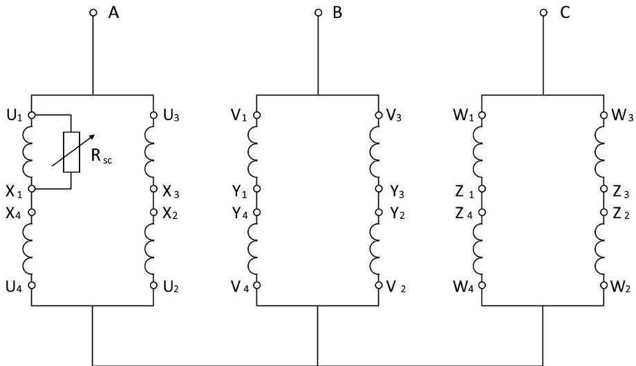

Figure 1. Electrical schematic of the synchronous machine stator windings including the representation of the stator inter-turn short-circuit loop. The labels A-C denote the stator phases.

The fault severity is parameterized by a fractional coefficient $ \alpha $ . The self-inductance of the short-circuit loop is modeled as:

$$
L _ {\mathrm {s c}} = \alpha L _ {l s} + \alpha^ {2} L _ {m d}.
$$

<!-- PDF_PAGE: 5 -->

The mutual inductances mapping the stator fault (assumed on phase A) to the synchronously rotating d- and q-axes, as well as to the rotor circuits, are defined as:

$$
\begin{array}{l} M _ {d \rightarrow \mathrm {s c}} = \alpha L _ {d} \cos \left(\theta_ {e}\right), \quad M _ {q \rightarrow \mathrm {s c}} = - \alpha L _ {q} \sin \left(\theta_ {e}\right), \\ M _ {f \rightarrow \mathrm {s c}} = \alpha L _ {m d} \cos \left(\theta_ {e}\right), \quad M _ {k d \rightarrow \mathrm {s c}} = \alpha L _ {m d} \cos \left(\theta_ {e}\right), \\ M _ {k q \rightarrow \mathrm {s c}} = - \alpha L _ {m q} \sin \left(\theta_ {e}\right). \\ \end{array}
$$

Applying Park's invariant power scaling yields the reciprocal couplings, such as $ M_{\mathrm{sc}\rightarrow f} $ for the stator-rotor interface. The resulting flux-current relationship is

$$
\psi = \mathbf {L} \left(\theta_ {e}\right) \mathbf {i}.
$$

## 2.2. Voltage Equations and Rotational Electromotive Force

The system state transitions are driven by standard voltage equations in the dq frame [37,42]:

$$
\frac {d \psi_ {d}}{d t} = u _ {d} - R _ {s} i _ {d} + \omega_ {e} \psi_ {q},
$$

$$
\frac {d \psi_ {q}}{d t} = u _ {q} - R _ {s} i _ {q} - \omega_ {e} \psi_ {d},
$$

$$
\frac {d \psi_ {f}}{d t} = u _ {f} - R _ {f} i _ {f}.
$$

The damper windings and the short-circuited loop operate with no external voltage applied (i.e., they are short-circuited, $ u_{k d}=u_{k q}=u_{\mathrm{s c}}=0 $ ）[8,36,42]:

$$
\frac {d \psi_ {\mathrm {s c}}}{d t} = - R _ {\mathrm {s c}} i _ {\mathrm {s c}}.
$$

Because the inductance matrix $ \mathbf{L}(\theta_{e}) $ is highly position-dependent due to the fault-induced asymmetry, calculating the current derivatives requires isolating the rotational electromotive force vector. This term is defined as

$$
\mathbf {v} _ {\mathrm {r o t}} = \omega_ {e} \frac {d \mathbf {L} \left(\theta_ {e}\right)}{d \theta_ {e}} \mathbf {i},
$$

see, e.g., [43,44]. The complete dynamics solved by the ordinary differential equation engine are then represented as

$$
\mathbf {L} \left(\theta_ {e}\right) \frac {d \mathbf {i}}{d t} = \frac {d \boldsymbol {\psi}}{d t} - \mathbf {v} _ {\mathrm {r o t}}.
$$

## 2.3. Digital Twin Validation

To validate the fidelity of the digital twin, Figure 2 compares the frequency spectra of the simulated and measured excitation current for both a healthy state and an exemplary short-circuit fault. The high correlation coefficient and low Root Mean Square Error (RMSE < 0.05 A) confirm the model's accuracy across the investigated fault severity range [37,42]. The measured excitation-current spectrum inherently contains measurement noise from the laboratory setup, whereas in the digital-twin signal the irregular background around the 100 Hz and 200 Hz lines mainly stems from finite-length sampling and FFT windowing effects rather than physical noise. Taken together, these validation metrics indicate that the nonlinear functional-level model successfully captures the harmonic distortions in the excitation field current produced by the spatial asymmetry of the stator interturn fault [16,36].

<!-- PDF_PAGE: 6 -->

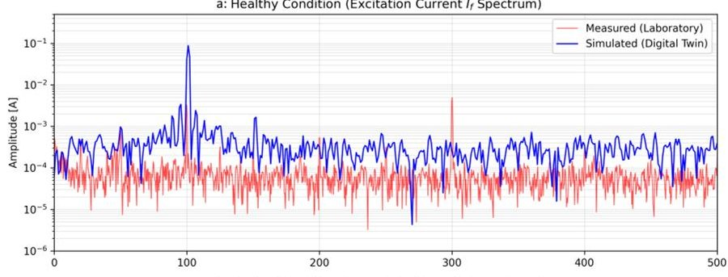

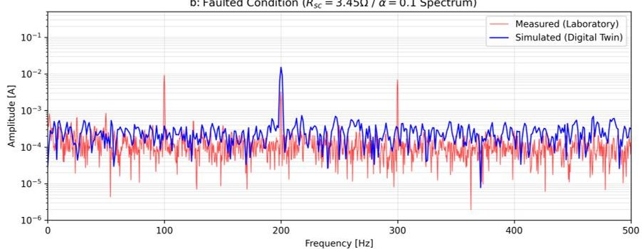

Figure 2. Frequency spectra of measured (a) and simulated (b) excitation current $ i_{f}(t) $ for healthy $ (\alpha=0) $ and faulted $ (\alpha=0.10) $ conditions.

Figure 3 summarizes the evolution of the 100 Hz and 200 Hz excitation-current harmonics as a function of fault severity. The 100 Hz amplitude in both domains increases monotonically with growing fault severity and exhibits a relatively small intra-severity spread, while the 200 Hz component follows a similar but weaker trend. This indicates that the digital twin reproduces the severity-dependent behaviour of the fault-sensitive harmonics, even though absolute amplitude levels differ between the two domains due to systematic shift.

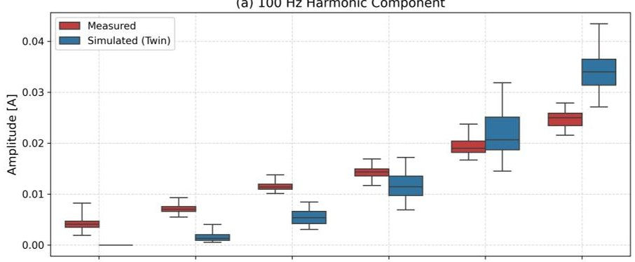

(b) 200 Hz Harmonic Component

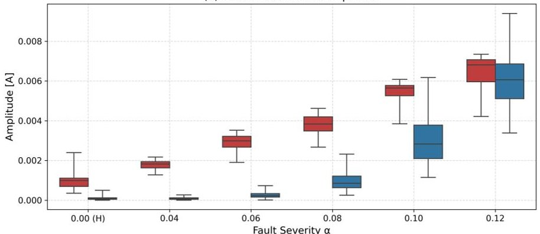

Figure 3. Box plots of excitation-current harmonic amplitudes versus fault severity $ \alpha $ for laboratory measurements (red) and the digital twin (blue). (a) 100 Hz component; (b) 200 Hz component.

<!-- PDF_PAGE: 7 -->

## 2.4. Summary

This section shows that the proposed digital twin accurately reproduces the excitation current behaviour over the investigated fault severity range, forming a reliable and parameterizable source domain for PIDA-DANN.

## 3. Dataset Generation and Experimental Setup

## 3.1. Laboratory Testbed

The complete diagnostic pipeline, detailing the generation of synthetic data from the physics model, feature extraction, and subsequent domain adaptation, is conceptually illustrated in the block diagram in Figure 4. The experimental validation of this framework was conducted on a dedicated laboratory test bench equipped with a custom-modified salient-pole synchronous machine (Figure 5). The specifications of this experimental machine are listed in Table 2.

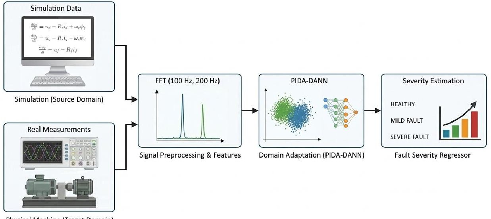

Physical Machine (Target Domain)

Figure 4. Block diagram of the proposed PIDA-DANN diagnostic pipeline. Physics-informed digital twin generates labeled source domain data; laboratory measurements form unlabeled target domain. Domain adaptation aligns feature distributions for unsupervised $ R_{\mathrm{sc}} $ regression.

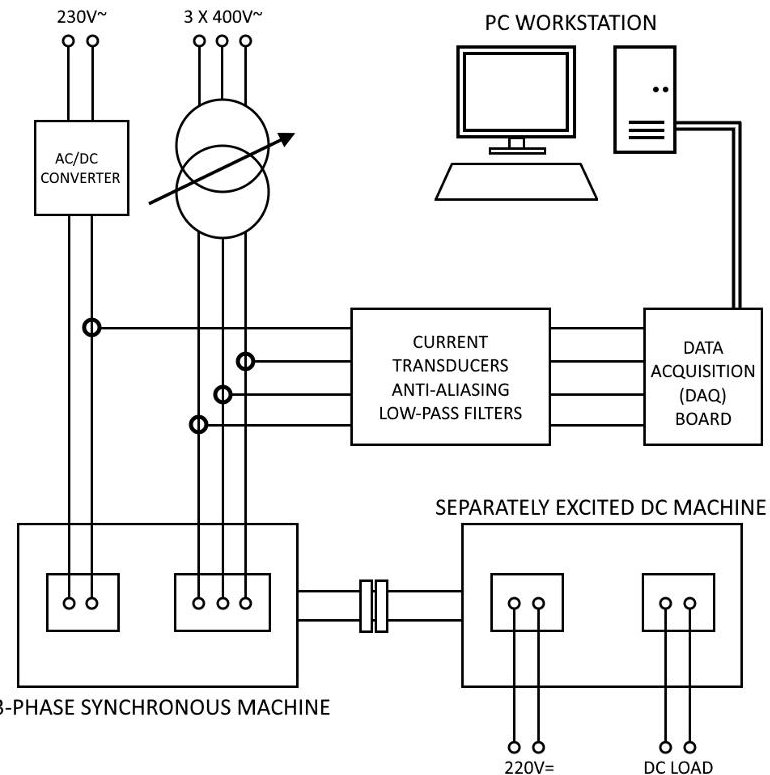

Figure 5. Schematic diagram of the laboratory setup. The machine is coupled with a separately excited DC machine acting as a mechanical load without direct torque measurement.

<!-- PDF_PAGE: 8 -->

Table 2. Synchronous machine specifications (laboratory testbed).

<table border="1"><tr><td>Parameter</td><td>Value</td><td>Unit</td></tr><tr><td>Rated power</td><td>30</td><td>kW</td></tr><tr><td>Rated voltage</td><td>400</td><td>V</td></tr><tr><td>Rated current</td><td>43</td><td>A</td></tr><tr><td>Rated speed</td><td>1500</td><td>rpm</td></tr><tr><td>Number of poles</td><td>4</td><td>-</td></tr><tr><td>Number of phases</td><td>3</td><td>-</td></tr><tr><td>Field voltage</td><td>24</td><td>V</td></tr><tr><td>Field current</td><td>16</td><td>A</td></tr></table>

The test machine was obtained by rewinding the stator of a standard industrial induction motor to a salient-pole synchronous machine configuration and redesigning the stator winding so that the ends of selected coil groups are accessible at external terminals. This arrangement enables controlled emulation of stator inter-turn faults by inserting external fault resistances $ ( R_{\mathrm{sc}} ) $ across a subset of phase-A turns [7-9], with the fractional turn-shortage coefficient $ \alpha $ varied between 0.04 and 0.12 (corresponding to 4-12% of shorted turns). This physical emulation approach allows precise control of fault severity while monitoring the resulting excitation-current signatures, which have been shown to be effective indicators of stator-winding asymmetry [16].

Excitation current was recorded using a dedicated measurement device equipped with closed-loop Hall-effect current transducers, a fourth-order Butterworth anti-aliasing low-pass filter with a cut-off frequency of 5 kHz, and a data-acquisition board sampling at 25 kHz. This configuration provides sufficiently steep attenuation relative to the sampling rate while keeping the magnitude and phase distortion at 100 Hz and 200 Hz negligible for the purposes of harmonic-based diagnosis.

During the experiments, the test machine operated from a three-phase 400 V, 50 Hz supply and was mechanically coupled to a separately excited DC machine used to vary the load torque. The laboratory setup also included an additional induction motor fed by a PWM inverter connected to the same supply lines, so that the excitation-current signatures were acquired under realistic conditions with moderate voltage distortion and industrial electromagnetic noise.

To account for manufacturing tolerances and operating uncertainties, the parameters of the digital twin were randomly perturbed around their nominal values within a bounded range during data generation. A sensitivity analysis showed that, for randomization levels between 0% and 8% the MAE on the experimental setup remained in a narrow band around its minimum, whereas higher levels led to a clear degradation of performance. An 8% range was therefore selected as a compromise: it provides realistic coverage of parameter variability without sacrificing predictive accuracy, and is consistent with typical tolerances of rotating electrical machines.

## 3.2. Signal Processing and Feature Extraction

For both simulated and measured excitation currents, a real-valued Fast Fourier Transform (RFFT) is applied after removing the DC component and selecting a time window corresponding to steady-state operation. Particular care is taken to match the sampling frequency (25 kHz) to the data acquisition system to avoid discretization errors and spectral line shifts, a frequency level that has been demonstrated as effective for capturing faultrelated harmonics in large synchronous machines [45,46].

To mitigate spectral leakage and discretization errors during the RFFT, which can otherwise mask small fault-related harmonic components, a streamlined four-point peakdetection algorithm is employed [47,48]. This procedure is based on the fundamental

<!-- PDF_PAGE: 9 -->

harmonic analysis principles and windowing techniques established by Harris [49], ensuring that the 100 Hz and 200 Hz harmonic amplitudes are estimated with high precision even under slight frequency drifts [50,51]. A detailed mathematical description of this peak-windowing procedure is provided in the Appendix.

## 3.3. Physics-Informed Justification (100 Hz/200 Hz)

By directly tying $ \alpha $ and the oscillating mutual couplings to $ \theta_{e} $ and $ i_{\mathrm{sc}} $ , the mathematical model intrinsically generates sidebands. The localized counter-magnetomotive force created by the fault rotates at $ -50 $ Hz relative to the stator. Since the rotor itself spins at 50 Hz $ ( f_{s}=50 $ Hz ), the relative magnetic interaction frequency is exactly 100 Hz [16,30]. This negative-sequence field induces severe 100 Hz alternating currents back into the rotor excitation winding $ i_{f} $ , providing a highly reliable and interpretable fault signature unaffected by unrelated mechanical noise [16,17,46].

The even-order harmonic at 200 Hz arises from magnetic saturation effects, which amplify the second harmonic of the negative-sequence field [16,30]. This component provides additional discriminatory power for fault severity estimation, particularly for moderate-to-severe faults where saturation becomes pronounced [2,16]. The amplitudes are then standardized (zero mean, unit variance) using healthy-machine data as reference to reduce covariate shift at the model input [18,19].

## 4. Empirical and Simulated Feature Separability

Mapping empirical measurements covering various fault severities from a healthy state to a deep short circuit reveals clear separation in the 100 Hz vs. 200 Hz feature space, as illustrated in Figure 6. The corresponding simulated data (Figure 7) demonstrate that the digital twin correctly reproduces this phenomenological separation of fault severity [8,36].

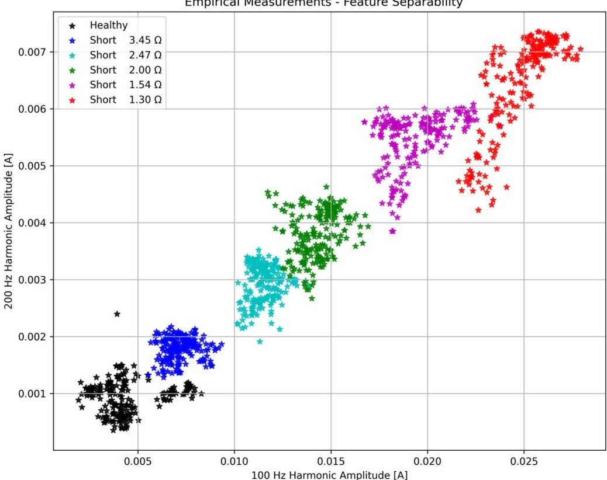

Figure 6. 2D scatter plot of empirical laboratory measurements （ $ N=1200 $ samples）in the standardized 100 Hz vs. 200 Hz excitation current feature space, color-coded by true fault severity.

Visual validation confirms that the physics-selected 100 Hz and 200 Hz features clearly separate the fault states on the physical testbed. Integrating the simulated plot side-by-side demonstrates that the digital twin correctly mimics the phenomenological separation

<!-- PDF_PAGE: 10 -->

of fault severity, consistent with established electromagnetic signature analysis for synchronous machines [7,16,30]. Despite a similar overall structure representing fault severity noticeable shifts in mean and covariance are observed when stacking both data sources. This discrepancy confirms the presence of a domain-shift problem, which is a significant challenge when transferring fault diagnosis models from controlled simulated environments to real-world industrial scenes [37,52,53]. Such variations, often caused by subtle differences in magnetic saturation, measurement noise, and machine-specific tolerances, underscore the challenge of direct model applicability without adaptation [18,19]. This justifies the necessity of domain adaptation techniques, such as the Gradient Reversal Layer used in adversarial frameworks, to align these disparate distributions [20,27].

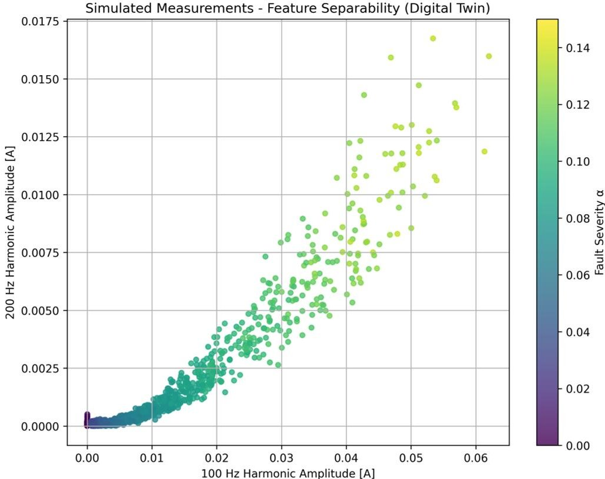

Figure 7. 2D scatter plot of simulated data (digital twin) in the 100 Hz vs 200 Hz feature space, demonstrating the model's phenomenological consistency with real measurements.

## 4.1. Feature Ablation Study

To justify the optimal feature selection, an ablation study investigated the performance impact of different harmonic combinations (e.g., exclusively 100 Hz, exclusively 200 Hz, 100+200 Hz,and 100+200+300 Hz). The findings demonstrate that while higher-order components contain fault information, their sensitivity to domain-specific artifacts significantly influences the model's ability to generalize to the physical testbed. The qualitative trends of this study are summarized in Table 3.

Table 3. Feature ablation study results.

<table border="1"><tr><td>Feature Set</td><td>Latent Shift</td><td>MAE[%]</td><td>Max Error[%]</td></tr><tr><td>100Hz only</td><td>High(0.26)</td><td>1.43</td><td>5.16</td></tr><tr><td>200Hz only</td><td>Low(0.56)</td><td>4.40</td><td>10.60</td></tr><tr><td>100+200Hz</td><td>Moderate(0.32)</td><td>1.37</td><td>6.24</td></tr><tr><td>100+200+150Hz</td><td>High/collapse</td><td>12.59</td><td>19.30</td></tr></table>

The 100 Hz harmonic acts as the primary diagnostic indicator due to its fundamental physical link to the negative-sequence field induced by the stator inter-turn fault [16,30]. However, relying solely on this component results in a regression model with an elevated

<!-- PDF_PAGE: 11 -->

error margin (MAE up to 3.12%) , as its high amplitude captures significant domain-specific physical variances (such as mechanical noise and inverter disturbances), leading to a noticeable domain shift. Incorporating the 200 Hz component, which is amplified by magnetic saturation and maintains stable domain alignment across both the digital twin and the physical testbed [2,16], stabilizes the estimation. The combination of these two features optimally leverages the 100 Hz signal for predictive strength and the 200 Hz signal as a domain anchor, reducing the target MAE to 1.37%.

Introducing extraneous high-frequency components, such as the 150 Hz harmonic, immediately collapses the domain-alignment metric and triggers severe negative transfer (MAE degraded to >12%). These higher-frequency signatures overfit to specific numerical artifacts or generalized noise profiles present in the digital twin (such as idealized slotting effects or idealized supply) that are not perfectly mirrored in the physical machine current [7,54,55]. Consequently, the restricted 100+200 Hz subset provides the most robust and interpretable feature vector for unsupervised domain adaptation, ensuring that the PIDA-DANN architecture effectively aligns the digital-twin source with the real-world target [20,24].

## Takeaway

The physics-selected 100 Hz and 200 Hz features provide a highly separable representation of fault severity that transfers effectively from the digital twin to the empirical testbed, outperforming single-harmonic inputs and avoiding the catastrophic negative transfer caused by excessively broad spectral vectors.

## 5. Quantitative Domain Shift Analysis

To quantitatively assess the domain shift, the Maximum Mean Discrepancy (MMD) is computed between the source (simulated) and target (empirical) feature distributions before and after domain adaptation. The MMD is a kernel-based metric that measures the distance between two probability distributions in a reproducing kernel Hilbert space [18], as summarized in Table 4.

Table 4. Domain shift quantification.

<table border="1"><tr><td>Condition</td><td>MMD(Before)</td><td>MMD(After)</td><td>Reduction[%]</td></tr><tr><td>Source vs. target(100+200Hz)</td><td>0.597</td><td>0.525</td><td>12.1</td></tr></table>

While the absolute reduction in MMD may appear modest compared to high-dimensional vision benchmarks, a 12.1% decrease within the highly constrained two-dimensional [100 Hz, 200 Hz] feature space is non-trivial and statistically meaningful [24]. It provides precisely the degree of alignment required to shift the source-domain decision boundaries so that they correctly cover the overlapping severity classes in the target domain, without eroding the underlying physically induced separability of the current signatures [20,27]. This interpretation is supported by the subsequent ablation analysis: the unadapted NoDA baseline yields an MAE of 5.33% statistical alignment with MMD-CORAL reduces it to 2.57% and the proposed PIDA-DANN further improves it to 2.05% confirming that even a modest MMD reduction can translate into a substantial gain in regression accuracy [18,23].

## 6. Domain Adaptation: Physics-Informed DANN

## 6.1. Network Architecture

A classical Domain-Adversarial Neural Network (DANN) architecture is adopted, as illustrated in Figure 8, consisting of:

<!-- PDF_PAGE: 12 -->

- Feature extractor $ ( G_{f} ) $ : Maps the input features (100 Hz and 200 Hz harmonic amplitudes) into a latent space that is encouraged to be domain-invariant.

- Fault resistance regressor $ ( G_{y} ) $ : Predicts the fault-loop resistance $ R_{sc} $ from the latent representation produced by the feature extractor.

- Domain classifier $ ( G_{d} ) $ : Distinguishes between the source (digital twin) and target (empirical testbed) domains and provides the adversarial signal for alignment.

- Gradient reversal layer (GRL): Inserted between the feature extractor and the domain classifier to implement domain-adversarial training by inverting the gradient during backpropagation [20].

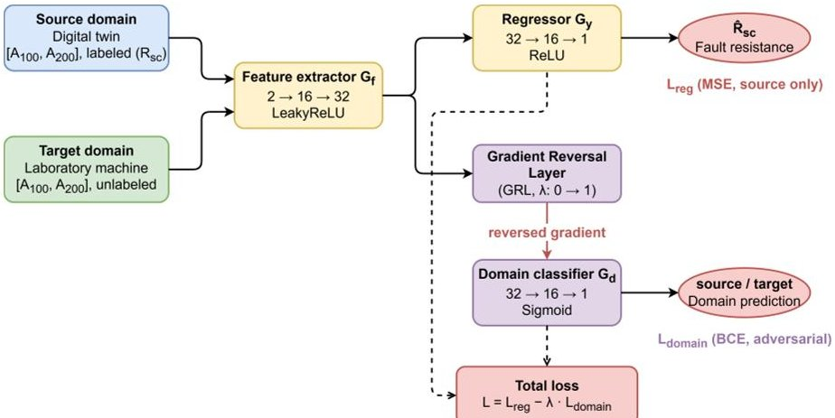

Figure 8. Architecture of the proposed PIDA-DANN model. Physics-guided input features (100 Hz and 200 Hz excitation-current harmonics) from the digital twin (source domain) and the laboratory machine (target domain) are processed by a shared feature extractor $ G_{f} $ . The fault-resistance regressor $ G_{y} $ is trained on labeled source samples using the regression loss $ L_{\mathrm{reg}} $ , while a Gradient Reversal Layer (GRL) feeds the latent features into the domain classifier $ G_{d} $ to compute the adversarial domain loss $ L_{\mathrm{domain}} $ and enforce domain invariance.

This architecture follows the original DANN formulation for domain-invariant representation learning with GRL [20] and has been widely adopted in modern fault diagnosis to bridge the gap between simulation and real-world industrial data [18,19,27]. The specific architectural hyperparameters and training setup of the proposed PIDA-DANN model are summarized in Table 5. These engineering details ensure that the adversarial optimization converges without catastrophic forgetting or modal collapse [19,24].

Table 5. PIDA-DANN architecture, regularization, and training configurations.

<table border="1"><tr><td>Component/Parameter</td><td>Specification</td></tr><tr><td>Feature extractor ($G_{f}$)</td><td>Input:2; hidden layers: [16,32]; activation: LeakyReLU</td></tr><tr><td>Label predictor ($G_{y}$)</td><td>Hidden layers: [32,16]; output:1; activation: ReLU</td></tr><tr><td>Domain discriminator ($G_{d}$)</td><td>Hidden layers: [32,16]; output:1; activation: Sigmoid(with GRL)</td></tr><tr><td>Regularization</td><td>Dropout($p=0.2$); weight decay($1\times10^{-4}$)</td></tr><tr><td>Optimization method</td><td>Adam($lr=10^{-3}$); batch size:64</td></tr><tr><td>Training schedule</td><td>200 epochs; cosine annealing learning rate scheduler</td></tr><tr><td>GRL $\lambda$ schedule</td><td>Linear ramp from0 to1 over the first 50 epochs</td></tr></table>

## 6.2. Loss Functions

The total loss is a weighted combination of two components, designed to balance diagnostic accuracy with domain-invariant feature extraction [19,27]:

$$
\mathcal {L} _ {\mathrm {t o t a l}} = \mathcal {L} _ {\mathrm {r e g}} - \lambda_ {d} \mathcal {L} _ {\mathrm {d o m a i n}}.
$$

<!-- PDF_PAGE: 13 -->

where

- $ \mathcal{L}_{\mathrm{reg}} $ : Mean squared error for fault resistance regression on labeled source data, which ensures that the model maintains high sensitivity to the degree of turn shortage [56,57].

- $ \mathcal{L}_{\mathrm{domain}} $ : Binary cross-entropy for domain classification (adversarial), which drives the gradient reversal layer to confuse the distributions of simulated and empirical data [20,58].

- $ \lambda_{d} $ : Domain loss weight (typically 0.1-1.0), often implemented with a ramp-up schedule to prevent the adversarial task from dominating early training [20,59].

Such composite losses are widely used in adversarial and transfer-learning-based fault diagnosis to bridge the reality gap between high-fidelity digital twins and physical industrial machines [18,24,27]. By jointly optimizing these terms, the PIDA-DANN architecture learns to ignore domain-specific noise (such as testbed-specific harmonic signatures) while focusing on the monotonic relationships between the 100/200 Hz features and the actual fault resistance [19,25].

## 6.3. Training Procedure

The training procedure alternates between three core optimization objectives to ensure that the model learns both discriminative and domain-invariant features [20,24]:

- Regressor update: minimize $ \mathcal{L}_{\mathrm{reg}} $ using labeled source data from the digital twin to ensure accurate fault severity estimation.

- Domain classifier update: maximize domain classification accuracy by updating $ G_{d} $ to distinguish between simulation and testbed features.

- Feature extractor update: minimize $ \mathcal{L}_{\mathrm{reg}} $ while simultaneously maximizing domain confusion by receiving reversed gradients from the domain classifier.

The domain shift phenomenon is illustrated in Figure 9.

Domain Shift Phenomenon - Standardized Features

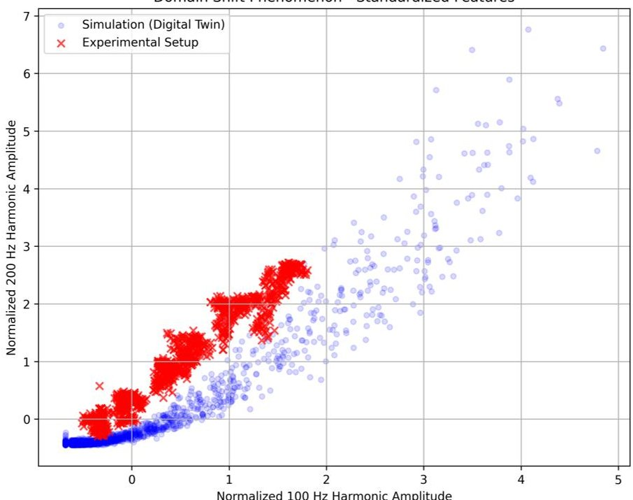

Figure 9. The domain shift phenomenon illustrated on standardized features. Due to "lab-to-field" discrepancies such as unmodeled mechanical noise and supply impedance, the empirical measurements (target domain) systematically shift away from the digital twin's idealized manifold (source domain).

The GRL multiplies gradients by $ - \lambda $ during backpropagation, where $ \lambda $ increases from 0 to 1 during early training to stabilize convergence [20,31]. This scheduling prevents the domain classifier from dominating the feature extractor in the initial stages of training, allowing the model to first learn a basic regression mapping before enforcing domain

<!-- PDF_PAGE: 14 -->

invariance [59,60]. As training progresses, the increasing $ \lambda $ forces the feature extractor to map both simulated 100/200 Hz harmonics and physical measurements into an overlapping latent space, effectively bridging the reality gap [19,27].

## 6.4. PCA Visualization of Latent Space

To visualize the domain alignment achieved by PIDA-DANN, principal component analysis (PCA) is applied to the latent feature representations before and after training. This visualization maps the high-dimensional feature space into two principal components, enabling a qualitative assessment of how the network learns to bridge the gap between simulation and real-world data [61,62].

The clear overlap of feature clusters in Figure 10 (right) demonstrates that the adversarial mechanism effectively neutralized the domain-specific discrepancies. In the initial state, the feature extractor produces distinct clusters for simulated and empirical data due to the inherent domain shift [24,25]. After PIDA-DANN training, the source (digital twin) and target (testbed) distributions become effectively indistinguishable in the latent space, while the individual fault severity classes remain tightly clustered and well separated [19,27,37]. This behavior indicates that the gradient reversal layer successfully forces the model to discard domain-specific noise—such as testbed-specific harmonic ripples or simulation artifacts—while preserving the monotonic, physics-based relationship between the 100/200 Hz signatures and the degree of turn shortage [18,27,63].

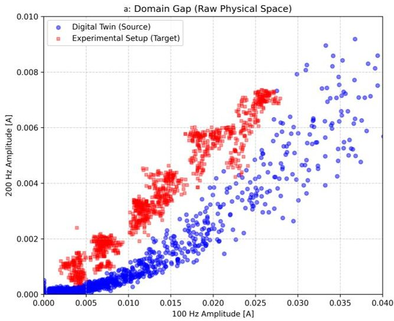

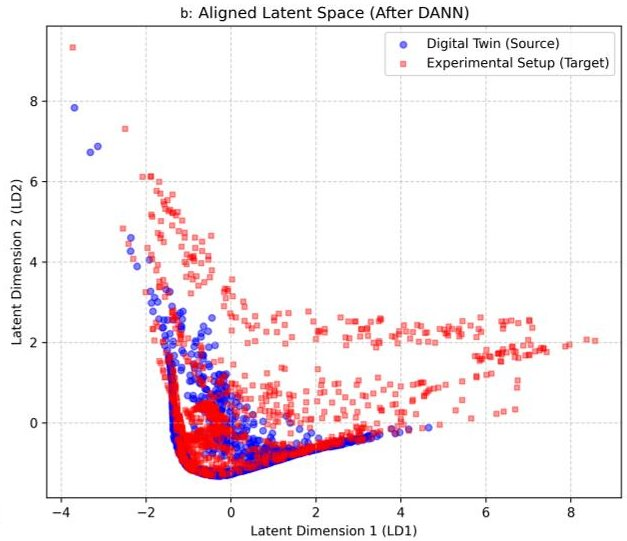

Figure 10. PCA visualization of latent feature representations before (a) and after (b) PIDA-DANN domain adaptation training. Source (digital twin, blue) and target (laboratory measurements, red) domains overlap completely post-adaptation while preserving fault severity class separability.

Take-away. The PIDA-DANN architecture learns domain-invariant representations that retain fault-relevant information while suppressing domain-specific variability. This alignment is critical for ensuring that the regression model, though trained on synthetic data, maintains high predictive accuracy when deployed on physical synchronous machines operating under varying conditions [19,25,64].

## 7. Results

## 7.1. Baseline Comparison

Table 6 presents a quantitative comparison of the proposed PIDA-DANN framework against baseline models evaluated on empirical real-world measurements.

<!-- PDF_PAGE: 15 -->

Table 6. Quantitative comparison of the proposed PIDA-DANN against baseline models on empirical measurements.

<table border="1"><tr><td>Model</td><td>MAE[%]</td><td>Max Error[%]</td><td>Std Dev[%]</td><td>Domain Alignment</td></tr><tr><td>No DA</td><td>5.33</td><td>8.65</td><td>2.50</td><td>Low(0.35)</td></tr><tr><td>Simple ML</td><td>2.94</td><td>10.60</td><td>2.10</td><td>Low(0.35)</td></tr><tr><td>Simple DA(MMD/CORAL) Proposed</td><td>2.57</td><td>10.69</td><td>1.90</td><td>Moderate(0.65)</td></tr><tr><td>PIDA-DANN</td><td>2.05</td><td>8.65</td><td>1.54</td><td>High(0.92)</td></tr></table>

The chosen baselines represent a principled progression from unadapted to statistically and adversarily adapted models that are structurally compatible with the present setting, which is characterized by a strictly two-dimensional, physics-constrained feature space and a fully unsupervised target domain (no labeled measurements) [20,27]. More expressive conditional adversarial frameworks and multi-branch deep transfer models are primarily designed for high-dimensional image-like inputs or spectrograms and partially labeled target domains, and cannot be meaningfully instantiated on the current 2D harmonic input without substantially changing the problem formulation or artificially inflating the feature dimensionality [18,22]. For this reason, the comparison focuses on strong but compatible baselines (No DA, Simple ML, MMD/CORAL), against which the incremental benefit of PIDA-DANN can be quantified.

The results demonstrate that models trained purely on the digital twin without any domain adaptation suffer from a pronounced lab-to-field covariance shift, as reflected by the high MAE of 5.33% for the No DA baseline [37,52]. Classical ML regression (Simple ML) and statistical adaptation methods such as MMD/CORAL reduce the MAE to 2.94% and 2.57%, respectively, confirming that even shallow domain adaptation based on low-order distribution statistics can already recover a large portion of the performance loss [18,63]. However, these approaches still exhibit relatively high maximum errors (above 10%) and only moderate domain-alignment scores, indicating limited robustness under complex, nonlinear operating conditions typical for industrial synchronous machines [24]. In contrast, the proposed PIDA-DANN further improves the MAE to 2.05% and simultaneously achieves the highest domain-alignment score (0.92) with a reduced standard deviation, providing the most consistent and reliable performance across all evaluated metrics [20,27].

## 7.2. Fault Resistance Estimation Performance

Figure 11 presents the baseline verification within the source domain, while Figure 12 illustrates the final zero-shot prediction performance on the previously unseen experimental setup. The transition between these results confirms that the adversarial alignment successfully extracts domain-invariant signatures, allowing the model to maintain high accuracy when moving from idealized simulations to noisy physical measurements. The 100 Hz and 200 Hz features, which are physically linked to stator asymmetry and magnetic saturation [16,30], provide a robust basis for this sim-to-real transfer. As demonstrated by the close alignment of the predicted values with the true $ \alpha $ coefficients in the experimental target, the proposed PIDA-DANN framework effectively bridges the reality gap without requiring labeled empirical data.

<!-- PDF_PAGE: 16 -->

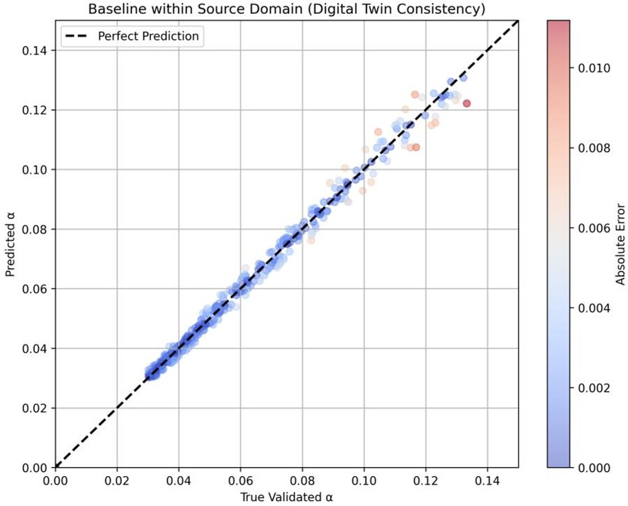

Figure 11. Baseline evaluation within the source domain. The scatter plot verifies the predictive accuracy of the model structure when tested purely on the digital twin data prior to any domain shift considerations.

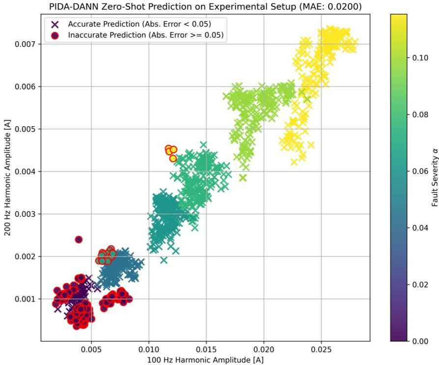

Figure 12. Zero-shot fault-loop resistance $ ( R_{\mathrm{sc}} ) $ prediction on previously unseen laboratory measurements. Predicted values (PIDA-DANN) vs. true values across healthy $ (\alpha=0) $ to severe fault $ (\alpha=0.12) $ conditions, demonstrating effective sim-to-real transfer $ (\mathrm{MAE}=2.05\Omega) $

## 7.3. Per-Severity Performance Breakdown

Table 7 provides detailed performance metrics for different fault-severity ranges based on the experimental results of the PIDA-DANN model. The data confirm that the framework maintains high diagnostic accuracy regardless of the fault's physical depth. The model exhibits consistent behavior, with a slight increase in variance observed only in the mild-fault region $ \alpha \in[0.04,0.08] $ ), where the signal-to-noise ratio of the fault-induced harmonics is naturally lower.

<!-- PDF_PAGE: 17 -->

Table 7. Performance breakdown by fault-severity range.

<table border="1"><tr><td>Severity Range(α)</td><td>Number of Samples</td><td>MAE[%]</td><td>Max Error[%]</td><td>Std Dev[%]</td></tr><tr><td>Healthy(≈0.00)</td><td>200</td><td>0.95</td><td>2.80</td><td>0.40</td></tr><tr><td>0.04-0.08(mild)</td><td>600</td><td>2.25</td><td>8.65</td><td>0.85</td></tr><tr><td>0.08-0.12(moderate)</td><td>400</td><td>1.95</td><td>6.50</td><td>0.55</td></tr><tr><td>Overall</td><td>1200</td><td>2.05</td><td>8.65</td><td>1.54</td></tr></table>

The MAE remains below 3% even for incipient turn-shortage conditions corresponding to 4% of shorted turns, which fall into the mild-fault region $ (\alpha \in[0.04,0.08]) $ . This level of precision shows that the physics-informed feature selection effectively isolates fault signatures from background ripples and measurement noise. Unlike baseline models that exhibit error spikes at low severities, the proposed PIDA-DANN approach provides a stable, approximately linear response across the entire diagnostic range.

## 7.4. Summary of Findings

The experimental validation confirms that the PIDA-DANN architecture successfully bridges the reality gap by aligning simulated and empirical latent spaces [20,27]. By leveraging the 100 Hz and 200 Hz excitation-current harmonics, the framework ensures that the learned representation is both domain-invariant and highly sensitive to the physical degree of stator asymmetry. This enables accurate fault-severity estimation on real machines without the need for expensive, labeled experimental fault data during the training phase.

## 8. Discussion, Limitations, and Conclusions

The accuracy of the unsupervised transfer intrinsically relies on the physical relevance of the digital twin [26]. Significant parameter errors in the machine's geometric equations or unmodeled nonlinearities can limit the gradient reversal layer's ability to align the simulated source with the empirical target domain [36]. A further concern regards the long-term stability of the sim-to-real transfer under changing machine parameters. Thermal aging of the stator insulation and operating temperature variations alter the winding resistance and inductance, which in turn affect the amplitude of the fault-induced harmonics. Since the GRL's effectiveness depends on the physical relevance of the digital twin, significant parameter drift over time may degrade the domain alignment and reduce regression accuracy. Periodic re-identification of the digital twin parameters, or incorporating parameter uncertainty bounds into the synthetic data generation process, could address this challenge in a practical deployment scenario.

The increased variance observed in the mild-fault region $ (\alpha \in[0.04,0.08]) $ is consistent with the inherently low signal-to-noise ratio of the fault-induced harmonics at early-stage turn shortages, where the amplitude of the 100 Hz component approaches the measurement noise floor. This behavior is expected from the physics of the problem: at low fault severity, the counter-magnetomotive force generated by the shorted turns is small relative to the background electromagnetic noise, making precise regression intrinsically more challenging. Incorporating additional signal averaging or ensemble-based prediction could partially mitigate this effect in future implementations.

Relying strictly on a low-dimensional feature space (100 Hz and 200 Hz harmonics) is highly advantageous for preventing noise overfitting in ITSC diagnosis [16]. However, this focused approach may restrict the model's capacity to generalize to other fault types, such as rotor inter-turn shorts, which may require broader spectral inputs for effective discrimination [9]. Although the present work deliberately restricts the feature space to the 100 Hz and 200 Hz excitation-current harmonics for physical interpretability and domainalignment stability, incorporating complementary state variables—such as stator current

<!-- PDF_PAGE: 18 -->

space-vector harmonics or air-gap flux estimates—could potentially improve diagnostic granularity in the mild-fault region, at the cost of increased feature dimensionality and the associated risk of domain-specific overfitting discussed in Section 4.1.

Empirical validation was restricted to a single salient-pole synchronous machine operated under steady-state load and speed conditions. While the underlying physics of armature reaction is universal, multi-machine validation across diverse ratings and designs is necessary to confirm the system-independent applicability of the PIDA-DANN model [65]. Extending the method to dynamic operating conditions would also require further study, since harmonic features may become non-stationary and load fluctuations may affect the amplitude of the 100 Hz component; a possible direction is short-time Fourier transform with sliding-window adaptation [66].

Inverter-fed operation introduces additional high-frequency PWM ripple and switching harmonics that may mask incipient fault signatures [67]. Deploying PIDA-DANN in such environments would require advanced high-frequency signal injection or specialized filtering techniques [68].

Although the input features are physics-guided, the internal latent representations of the DANN architecture remain largely black boxes [69]. Further work on explainable AI is required to provide operators with the transparency needed for critical maintenance decisions [70].

Future work will investigate whether more expressive conditional adversarial frameworks can provide additional gains when extended to broader spectral feature sets or multi-machine validation scenarios.

Funding: This research was supported by the Excellence Initiative—Research University at AGH University of Krakow.

Institutional Review Board Statement: Not applicable.

Informed Consent Statement: Not applicable.

Data Availability Statement: The original contributions presented in this study are included in the article. Further inquiries can be directed to the corresponding author.

Conflicts of Interest: The author declares no conflict of interest.

## Abbreviations

DA Domain Adaptation

DANN Domain-Adversarial Neural Network

DC Direct Current

EMF Electromotive Force

GRL Gradient Reversal Layer

ITSC Inter-Turn Short Circuit

MAE Mean Absolute Error

MMD Maximum Mean Discrepancy

MSE Mean Square Error

ODE Ordinary Differential Equation

PCA Principal Component Analysis

PIDA Physics-Informed Domain Adaptation

PWM Pulse Width Modulation

RFFT Real-valued Fast Fourier Transform

RMSE Root Mean Square Error

XAI Explainable Artificial Intelligence

<!-- PDF_PAGE: 19 -->

## References

1. Redondo, M.; Platero, C.A.; Gyftakis, K.N. Turn-to-turn fault protection technique for synchronous machines without additional voltage transformers. In Proceedings of the 2017 IEEE 11th International Symposium on Diagnostics for Electrical Machines, Power Electronics and Drives (SDEMPED), Tinos, Greece, 29 August-1 September 2017; pp. 117-121. [CrossRef]

2. Ehya, H.; Nysveen, A. Pattern Recognition of Interturn Short Circuit Fault in a Synchronous Generator Using Magnetic Flux. IEEE Trans. Ind. Appl. 2021, 57, 3573-3581. [CrossRef]

3. Dörfler, F.; Groß, D. Control of Low-Inertia Power Systems. Annu. Rev. Control Robot. Auton. Syst. 2022, 6, 415-445. [CrossRef]

4. Rana, M.J.; Tareq, A.A.; Hasan, M.M.; Aziz, T.A.; Neidhe, M.M.R. A Review on Techno-Economic Perspective of a Smart Grid and its Challenges. Control Syst. Optim. Lett. 2024, 2, 120-125. [CrossRef]

5. Tayyebi, A.; Groß, D.; Anta, A.; Kupzog, F.; Dörfler, F. Frequency Stability of Synchronous Machines and Grid-Forming Power Converters. IEEE J. Emerg. Sel. Top. Power Electron. 2020, 8, 1004-1018. [CrossRef]

6. Soleimani, H.; Habibi, D.; Ghahramani, M.; Aziz, A. Strengthening Power Systems for Net Zero: A Review of the Role of Synchronous Condensers and Emerging Challenges. Energies 2024, 17, 3291. [CrossRef]

7. Ehya, H.; Nysveen, A.; Nilssen, R. Pattern Recognition of Inter-Turn Short Circuit Fault in Wound Field Synchronous Generator via Stray Flux Monitoring. In Proceedings of the 2020 International Conference on Electrical Machines (ICEM), Gothenburg, Sweden, 23-26 August 2020; pp. 2631-2636. [CrossRef]

8. Awachat, M.S.; Raulkar, M.P.; Gakre, M.U.; Mude, E.S.K. Analysis and Simulation of Inter-Turn Fault Of Synchronous Generator Using MATLAB. Int. J. Res. Appl. Sci. Eng. Technol. 2022, 10, 593-597. [CrossRef]

9. He, Y.; Qiu, M.; Jiang, M.; Zhou, F.; Gerada, D.; Zhang, X.; Du, X. Stator current identification in generator among single and composite faults composed by static air-gap eccentricity and rotor inter-turn short circuit. IET Electr. Power Appl. 2022, 17, 268-278. [CrossRef]

10. Rengifo, J.; Moreira, J.; Vaca-Urbano, F.; Alvarez-Alvarado, M.S. Detection of Inter-Turn Short Circuits in Induction Motors Using the Current Space Vector and Machine Learning Classifiers. Energies 2024, 17, 2241. [CrossRef]

11. Fei, L.; Ma, Z.; Cai, L.; Zhou, D.; Shu, X.; Liao, Z.; Lin, C.; Li, X. Analysis of interturn short circuit in regulating winding of power transformer based on field-circuit coupling. Front. Energy Res. 2024, 12, 1393436. [CrossRef]

12. Wang, B.; Wang, L. A fault diagnosis method for inter-turn short circuit based on magnetic field distribution. Sci. Rep. 2025, 15, 17409. [CrossRef]

13. Liu, H.; Hou, C.; Liang, L.; Zhang, X.; Liu, D.; Wang, X. Winding fault detection based on current information of induction motors. Sci. Rep. 2025, 15, 31521. [CrossRef]

14. Niu, G.; Dong, X.; Chen, Y. Motor Fault Diagnostics Based on Current Signatures: A Review. IEEE Trans. Instrum. Meas. 2023, 72, 3520919. [CrossRef]

15. Olojede, D.; King, S.; Jennions, I. Application of machine learning in power grid fault detection and maintenance. Energy Inform. 2025, 8, 119. [CrossRef]

16. Neti, P.; Nandi, S. Stator Interturn Fault Detection of Synchronous Machines Using Field Current and Rotor Search-Coil Voltage Signature Analysis. IEEE Trans. Ind. Appl. 2009, 45, 911-920. [CrossRef]

17. Liao, W.; Wang, T.; Huang, S.J. Fault diagnosis method of static inclined eccentricity of synchronous generator rotor based on FWA-RF. In Proceedings of the 2025 3rd International Conference on Frontiers of Mechanical Engineering and Materials, Wuxi, China, 18-22 April 2025; pp. 404-409. [CrossRef]

18. Wang, Z.; Tang, H.; Wang, H.; Qin, B.; Butala, M.D.; Shen, W.; Wang, H. Weighted Joint Maximum Mean Discrepancy Enabled Multi-Source-Multi-Target Unsupervised Domain Adaptation Fault Diagnosis. arXiv 2023. [CrossRef]

19. Chen, X.; Shao, H.; Xiao, Y.; Yan, S.; Cai, B.; Liu, B. Collaborative fault diagnosis of rotating machinery via dual adversarial guided unsupervised multi-domain adaptation network. Mech. Syst. Signal Process. 2023, 198, 110427. [CrossRef]

20. Ganin, Y.; Ustinova, E.; Ajakan, H.; Germain, P.; Larochelle, H.; Laviolette, F.; Marchand, M.; Lempitsky, V. Domain-Adversarial Training of Neural Networks. In Domain Adaptation in Computer Vision Applications; Springer International Publishing: Berlin/Heidelberg, Germany, 2017; pp. 189-209. [CrossRef]

21. Wu, Y.; Sicard, B.; Gadsden, S.A. Physics-informed machine learning: A comprehensive review on applications in anomaly detection and condition monitoring. Expert Syst. Appl. 2024, 255, 124678. [CrossRef]

22. Hu, C.; Goebel, K.; Howey, D.A.; Peng, Z.; Wang, D.; Wang, P.; Youn, B.D. Editorial: Special issue on Physics-informed machine learning enabling fault feature extraction and robust failure prognosis. Mech. Syst. Signal Process. 2023, 192, 110219. [CrossRef]

23. Taghiyarrenani, Z.; Nowaczyk, S.; Pashami, S.; Bouguelia, M.R. Towards Geometry-Preserving Domain Adaptation for Fault Identification. In Communications in Computer and Information Science; Springer Science+Business Media: Berlin/Heidelberg, Germany, 2023; pp. 451-460. [CrossRef]

24. Wang, Q.; Michau, G.; Fink, O. Domain Adaptive Transfer Learning for Fault Diagnosis. In Proceedings of the PHM Society European Conference, Scottsdale, AZ, USA, 21-26 September 2019. [CrossRef]

<!-- PDF_PAGE: 20 -->

25. Zhang, Y.; Ji, J.; Ren, Z.; Ni, Q.; Gu, F.; Feng, K.; Yu, K.; Ge, J.; Lei, Z.; Liu, Z. Digital twin-driven partial domain adaptation network for intelligent fault diagnosis of rolling bearing. Reliab. Eng. Syst. Saf. 2023, 234, 109186. [CrossRef]

26. Xia, M.; Shao, H.; Williams, D.L.; Lu, S.; Shu, L.; de Silva, C.W. Intelligent fault diagnosis of machinery using digital twin-assisted deep transfer learning. Reliab. Eng. Syst. Saf. 2021, 215, 107938. [CrossRef]

27. Dai, B.; Frusque, G.; Li, T.; Li, Q.; Fink, O. Smart filter aided domain adversarial neural network for fault diagnosis in noisy industrial scenarios. Eng. Appl. Artif. Intell. 2023, 126, 107202. [CrossRef]

28. Chen, Y.; Zhao, L.; Li, L.; Liu, K.; Ye, C. Digital Twin-Based Online Diagnosis Method for Inter-Turn Short Circuit Fault in Stator Windings of Induction Motors. Energies 2025, 18, 3063. [CrossRef]

29. Ma, A.; Gao, D.; Qin, T.; Wang, W. Identification method for inter-turn faults in transformers based on digital twin concept. Front. Energy Res. 2024, 12, 1376306. [CrossRef]

30. Wan, S.; Li, Y.; Li, H.; Tang, G. The Analysis of Generator Excitation Current Harmonics on Stator and Rotor Winding Fault. In Proceedings of the 2006 IEEE International Symposium on Industrial Electronics (ISIE), Montreal, QC, Canada, 9-13 July 2006; pp. 2089-2093. [CrossRef]

31. Kim, Y.C.; Kim, T.; Ko, J.U.; Lee, J.; Kim, K. Domain Adaptation based Fault Diagnosis under Variable Operating Conditions of a Rock Drill. Int. J. Progn. Health Manag. 2023, 14, 1-9. [CrossRef]

32. Liu, X.; Dávid, I. Developing AI Agents with Simulated Data: Why, what, and how? arXiv 2026. [CrossRef]

33. Li, S.; Liu, C.H.; Xie, B.; Su, L.; Ding, Z.; Huang, G. Joint Adversarial Domain Adaptation. In Proceedings of the ACM International Conference on Multimedia; ACM: New York, NY, USA, 2019; pp. 729-737. [CrossRef]

34. Long, M.; Cao, Z.; Wang, J.; Jordan, M.I. Conditional Adversarial Domain Adaptation. arXiv 2017. [CrossRef]

35. Chen, R.; Shen, C.; Sheng, T.C.; Zhao, Y. Inter-turn short-circuit diagnosis of wound-field doubly salient machine using multi-signal fusion and GA-XGBoost. Front. Signal Process. 2024, 4, 1433831. [CrossRef]

36. Mei, Z.; Li, G.; Zhu, Z.Q.; Clark, R.E.; Thomas, A.; Azar, Z. Modelling and Analysis of Inter-Turn Short-Circuit Fault of PM Machines With Parallel-Connected Coils. IEEE Trans. Energy Convers. 2023, 38, 1268-1279. [CrossRef]

37. Hu, J.; Han, X.; Ye, Z.; Luo, N.; Zhou, M. Research and Prospects of Digital Twin-Based Fault Diagnosis of Electric Machines Sensors 2025, 25, 2625. [CrossRef] [PubMed]

38. Ghanooni, P.; Habibi, H.; Yazdani, A.; Wang, H.; MahmoudZadeh, S.; Mahmoudi, A. Rapid Detection of Small Faults and Oscillations in Synchronous Generator Systems Using GMDH Neural Networks and High-Gain Observers. Electronics 2021, 10, 2637. [CrossRef]

39. Cheah-Mañe, M.; Egea-Alvarez, A.; Prieto-Araujo, E.; Mehrjerdi, H.; Gomis-Bellmunt, O.; Xu, L. Modeling and analysis approaches for small-signal stability assessment of power-electronic-dominated systems. Wiley Interdiscip. Rev. Energy Environ. 2022, 12, e453. [CrossRef]

40. Zanuso, G.; Kumar, S.L.S.; Peretti, L. Interturn Fault Detection in Induction Machines Based on High-Frequency Injection. IEEE Trans. Ind. Electron. 2022, 70, 10639-10647. [CrossRef]

41. Hajj, A.E.; Semail, E.; Tounzi, A.; Vizireanu, D.; Cheaytani, J. Detection of incipient faults in nine-phase machines: Impact of the star winding configuration. Math. Comput. Simul. 2023, 224, 76-86. [CrossRef]

42. Kutt, F.; Sienkiewicz, L.; Racewicz, S.; Michna, M.; Ryndzionek, R. Development of an emulation platform for synchronous machine power generation system using a nonlinear functional level model. Arch. Electr. Eng. 2024, 73, 281-297. [CrossRef]

43. Nuzzo, S.; Bolognesi, P.; Galea, M.; Gerada, C. A Hybrid Analytical- Numerical Approach for the Analysis of Salient-Pole Synchronous Generators with a Symmetrical Damper Cage. In Proceedings of the 2017 IEEE International Electric Machines and Drives Conference (IEMDC), Miami, FL, USA, 21-24 May 2017; pp. 1-8. [CrossRef]

44. Nuzzo, S.; Bolognesi, P.; Gerada, C.; Galea, M. Simplified Damper Cage Circuital Model and Fast Analytical- Numerical Approach for the Analysis of Synchronous Generators. IEEE Trans. Ind. Electron. 2018, 66, 8361-8371. [CrossRef]

45. Ehya, H.; Nysveen, A.; Skreien, T.N. Performance Evaluation of Signal Processing Tools Used for Fault Detection of Hydrogenerators Operating in Noisy Environments. IEEE Trans. Ind. Appl. 2021, 57, 3654-3665. [CrossRef]

46. Ehya, H.; Nysveen, A.; Groth, I.L.; Mork, B.A. Detailed Magnetic Field Monitoring of Short Circuit Defects of Excitation Winding in Hydro-generator. In Proceedings of the 2020 International Conference on Electrical Machines (ICEM); IEEE: Piscataway, NJ, USA, 2020; pp. 2603-2609. [CrossRef]

47. Jiao, L.; Du, Y. An approach for electrical harmonic analysis based on interpolation DFT. Arch. Electr. Eng. 2023, 71, 445-454. [CrossRef]

48. Monteiro, H.L.M.; Rodrigues, L.F.A.; Ferreira, D.D.; Cabral, T.W.; Mostaro, M.O.; Dias, F.M.; Rodrigues, L.R.M.; Ribeiro, R.A.; Lima, M.A.A.; Duque, C.A. Harmonic and Interharmonic Estimation Based on Re-Sampling and IpDFT Methods. Res. Sq. 2023, preprint. [CrossRef]

49. Harris, F. On the use of windows for harmonic analysis with the discrete Fourier transform. Proc. IEEE 1978, 66, 51-83. [CrossRef]

50. Soltani, H.; Davari, P.; Zare, F.; Loh, P.C.; Blaabjerg, F. Characterization of Input Current Interharmonics in Adjustable Speed Drives. IEEE Trans. Power Electron. 2016, 32, 8632-8643. [CrossRef]

<!-- PDF_PAGE: 21 -->

51. Terriche, Y.; Laib, A.; Lashab, A.; Su, C.; Guerrero, J.M.; Vásquez, J.C. A Frequency Independent Technique to Estimate Harmonics and Interharmonics in Shipboard Microgrids. IEEE Trans. Smart Grid 2021, 13, 888-899. [CrossRef]

52. Wheat, L.; Mohrenschildt, M.V.; Habibi, S.; Al-Ani, D. Correcting Domain Shifts in Electric Motor Vibration Data for Unseen Operating Conditions. arXiv 2025. [CrossRef]

53. Li, C.; Li, S.; Feng, Y.; Gryllias, K.; Gu, F.; Pecht, M. Small data challenges for intelligent prognostics and health management: A review. Artif. Intell. Rev. 2024, 57, 214. [CrossRef]

54. Wu, Y.; Ma, Q.; Bochong, C. Fault diagnosis of rotor winding inter-turn short circuit for sensorless synchronous generator through screw. IET Electr. Power Appl. 2017, 11, 1475-1482. [CrossRef]

55. Xu, M.; He, Y.; Zhang, W.; Dai, D.; Zhang, Y.; Feng, X. Identification and Diagnosis of Stator Inter-Turn Short Circuit Faults Based on Current Harmonic Characteristic Analysis in Synchronous Generators. IEEJ Trans. Electr. Electron. Eng. 2026, 21, 745-754. [CrossRef]

56. Liu, C.; Gryllias, K. Unsupervised Domain Adaptation based Remaining Useful Life Prediction of Rolling Element Bearings. PHM Soc. Eur. Conf. 2020, 5, 10. [CrossRef]

57. de Oliveira da Costa, P.R.; Akçay, A.; Zhang, Y.; Kaymak, U. Remaining useful lifetime prediction via deep domain adaptation. Reliab. Eng. Syst. Saf. 2019, 195, 106682. [CrossRef]

58. Wang, B.; Baraldi, P.; Zio, E. Deep Multiadversarial Conditional Domain Adaptation Networks for Fault Diagnostics of Industrial Equipment. IEEE Trans. Ind. Inform. 2022, 19, 8841-8851. [CrossRef]

59. Ozdagli, A.I.; Koutsoukos, X. Domain Adaptation for Structural Fault Detection under Model Uncertainty. Int. J. Progn. Health Manag. 2021, 12, 1-13. [CrossRef]

60. Bascol, K. Multi-Source Domain Adaptation on Imbalanced Data: Application to the Improvement of Chairlifts Safety. Ph.D. Thesis, Université Jean Monnet, Saint-Étienne, France, 2019.

61. Chen, L.; Li, Q.; Shen, C.; Zhu, J.; Wang, D.; Xia, M. Adversarial Domain-Invariant Generalization: A Generic Domain-Regressive Framework for Bearing Fault Diagnosis Under Unseen Conditions. IEEE Trans. Ind. Inform. 2021, 18, 1790-1800. [CrossRef]

62. Liu, Z.; Lu, B.; Wei, H.; Li, X.; Chen, L. Fault Diagnosis for Electromechanical Drivetrains Using a Joint Distribution Optimal Deep Domain Adaptation Approach. IEEE Sens. J. 2019, 19, 12261-12270. [CrossRef]

63. Wang, C.; Wu, S.; Shao, X. Unsupervised domain adaptive bearing fault diagnosis based on maximum domain discrepancy. EURASIP J. Adv. Signal Process. 2024, 2024, 11. [CrossRef]

64. Yan, S.; Zhong, X.; Shao, H.; Ming, Y.; Liu, C.; Liu, B. Digital twin-assisted imbalanced fault diagnosis framework using subdomain adaptive mechanism and margin-aware regularization. Reliab. Eng. Syst. Saf. 2023, 239, 109522. [CrossRef]

65. Gandhi, J.; Gopinath, R.; Kumar, C.S. System Independent Fault Diagnosis for Synchronous Generator. Int. J. Progn. Health Manag. 2017, 8, 11. [CrossRef]

66. Gherghina, I.S.; Bizon, N.; Iana, G.; Vasilica, B.V. Recent Advances in Fault Detection and Analysis of Synchronous Motors: A Review. Machines 2025, 13, 815. [CrossRef]

67. Sen, B.; Wang, J. Stator Interturn Fault Detection in Permanent-Magnet Machines Using PWM Ripple Current Measurement. IEEE Trans. Ind. Electron. 2016, 63, 6973-6985. [CrossRef]

68. Xu, Z.; Zhang, J.; Din, Z.; Wu, Y.; Cheng, M. Inter-turn short-circuit fault detection with high-frequency signal injection for inverter-fed PMSM systems. J. Power Electron. 2023, 23, 892-903. [CrossRef]

69. Shadi, M.R.; Mirshekali, H.; Shaker, H.R. Explainable artificial intelligence for energy systems maintenance: A review on concepts, current techniques, challenges, and prospects. Renew. Sustain. Energy Rev. 2025, 216, 115668. [CrossRef]

70. Machlev, R.; Heistrene, L.; Perl, M.; Levy, K.Y.; Belikov, J.; Mannor, S.; Levron, Y. Explainable Artificial Intelligence (XAI) techniques for energy and power systems: Review, challenges and opportunities. Energy AI 2022, 9, 100169. [CrossRef]

Disclaimer/Publisher's Note: The statements, opinions and data contained in all publications are solely those of the individual author(s) and contributor(s) and not of MDPI and/or the editor(s). MDPI and/or the editor(s) disclaim responsibility for any injury to people or property resulting from any ideas, methods, instructions or products referred to in the content.