<!-- PDF_PAGE: 1 -->

Article

# An AI Digital Platform for Fault Diagnosis and RUL Estimation in Drivetrain Systems Under Varying Operating Conditions

Dimitrios M. Bourdalos $ ^{1} $ , Xenofon D. Konstantinou $ ^{1} $ , Josef Koutsoupakis $ ^{2} $ , Ilias A. Iliopoulos $ ^{1} $ Kyriakos Kritikakos $ ^{1} $ , George Karyofyllas $ ^{2} $ , Panayotis E. Spiliotopoulos $ ^{1} $ , Ioannis E. Saramantas $ ^{1} $ John S. Sakellariou $ ^{1} $ , Dimitrios Giagopoulos $ ^{2,*} $ , Spilios D. Fassois $ ^{1} $ , Panagiotis Seventekidis $ ^{2} $ and Sotirios Natsiavas $ ^{2} $

1 Stochastic Mechanical Systems & Automation (SMSA) Laboratory, Department of Mechanical Engineering and Aeronautics, University of Patras, 26504 Patras, Greece; dimitrios.bourdalos@ac.upatras.gr (D.M.B.); xkonstantinou@ac.upatras.gr (X.D.K.); ilias.iliopoulos@ac.upatras.gr (I.A.I.); k.kritikakos@ac.upatras.gr (K.K.); p.spiliotop@ac.upatras.gr (P.E.S.); jsar@upatras.gr (I.E.S.); sakj@upatras.gr (J.S.S.); fassois@upatras.gr (S.D.F.) 2 Machine Dynamics Laboratory (MDL), Department of Mechanical Engineering, Aristotle University of Thessaloniki, 54124 Thessaloniki, Greece; jkoutsoup@meng.auth.gr (J.K.); gdkaryof@meng.auth.gr (G.K.); seventep@meng.auth.gr (P.S.); natsiava@auth.gr (S.N.)

Check for updates

## Abstract

Academic Editor: Jyoti K. Sinha

Received: 17 November 2025

Revised: 5 December 2025

Accepted: 22 December 2025

Published: 24 December 2025

Copyright: $ \textcircled{c} $ 2025 by the authors.

Licensee MDPI, Basel, Switzerland.

This article is an open access article distributed under the terms and conditions of the Creative Commons Attribution (CC BY) license.

* Correspondence: dgiagopoulos@auth.gr

Drivetrain systems operate under varying operating conditions (OCs), which often obscure early-stage fault signatures and hinder robust condition monitoring (CM). This work introduces an AI digital platform developed during the EEDRIVEN project, featuring a holistic CM framework that integrates statistical time series methods—using Generalized AutoRegressive (GAR) models in a multiple model fault diagnosis scheme—with deep learning approaches, including autoencoders and convolutional neural networks, enhanced through a dedicated decision fusion methodology. The platform addresses all key CM tasks, including fault detection, fault type identification, fault severity characterization, and remaining useful life (RUL) estimation, which is performed using a dynamics-informed health indicator derived from GAR parameters and a simple linear Wiener process model. Training for the platform relies on a limited set of experimental vibration signals from the physical drivetrain, augmented with high-fidelity multibody dynamics simulations and surrogate-model realizations to ensure coverage of the full space of OCs and fault scenarios. Its performance is validated on hundreds of inspection experiments using confusion matrices, ROC curves, and metric-based plots, while the decision fusion scheme significantly strengthens diagnostic reliability across the CM stages. The results demonstrate near-perfect fault detection (99.8%) 97.8% accuracy in fault type identification, and over 96% in severity characterization. Moreover, the method yields reliable early-stage RUL estimates for the outer gear of the drivetrain, with normalized errors < 20% and consistently narrow confidence bounds, which confirms the platform's robustness and practicality for real-world drivetrain systems monitoring.

Keywords: fault diagnosis; remaining useful life estimation; varying operating conditions; drivetrain systems; prognostics; condition monitoring; gearbox; rotating machinery

## 1. Introduction

Drivetrain systems (DSs) are essential mechanical systems that are widely utilized in modern engineering applications, including large-scale renewable energy infrastructure

<!-- PDF_PAGE: 2 -->

(e.g., wind turbines), transportation (surface and aerial vehicles), and automated manufacturing. In such applications, DSs often operate in harsh environments, including excessive loads, under which degradation of mechanical components is accelerated and unexpected faults may be developed. When early detection is not achieved, unplanned downtime, significant economic loss, and catastrophic failures may follow [1]. Automated condition monitoring (CM) has emerged as a critical research domain in mitigating these risks by enabling continuous, real-time health assessment of DSs and, thus, the transition from reactive (or preventive) to predictive maintenance that minimizes costs and increases DSs availability and lifespan [2].

CM is realized through a rigorous, hierarchical process that includes early fault detection (stage 1), fault type identification (stage 2) followed by fault severity characterization (stage 3), and, finally, remaining useful life (RUL) estimation (stage 4) [3]. All CM stages rely on continuous data acquisition and analysis, commonly utilizing various techniques such as vibration analysis, oil analysis, thermography, and acoustic emission [3]. Among them, vibration-based methods are particularly favored due to their high sensitivity, ease of implementation, and relatively low cost. The fundamental principle is that mechanical faults induce alterations in the system's dynamics, which are reflected in measured vibration signals.

However, the effective application of vibration-based CM in real-world settings is challenged by operational variability. Most DSs operate under varying conditions, such as changes in speed and load. These varying operating conditions (OCs) in DSs can be broadly categorized into three primary types. The first type includes OCs characterized by entirely random fluctuations, as exemplified by the case of wind-induced ambient excitation affecting wind turbines. The second type concerns cyclic variations in OCs, which are commonly found in machinery like bucket wheel excavators. The third and most frequently encountered type encompasses DSs that operate under multiple levels of OCs that remain constant over specific time intervals. This category is the primary focus of the current study. Such OCs are typically encountered in industrial settings within the various production phases, where both the load and the speed of the DS may undergo multiple changes to meet operational requirements. A similar pattern of variation is also observed in the transportation sector, where vehicles operate at distinct speeds and payload levels that remain constant during certain segments of their routes [4]. Such OCs introduce substantial frequency and amplitude modulations into the measured vibration signals, which can obscure the subtle effects of early faults and may lead to high rates of false alarms [4]. To address this significant challenge, robust methodologies are needed to establish reliable CM for DSs operating under varying OCs.

The vast majority of studies in the pertinent literature address the first three stages of vibration-based CM under varying OCs using non-parametric feature-based methods. More specifically, features from the time, frequency, and time-frequency domains, as well as decomposition-based features derived from empirical mode and wavelet packet decomposition, are extracted for their sensitivity to faults and relative insensitivity with relation to varying OCs [5-11]. These features are commonly paired with machine learning classifiers, such as support vector machine and k-nearest neighbors, to achieve gear fault diagnosis under varying speeds and loads [5,7,10,11]. More recently, with the rapid development of artificial intelligence, deep learning neural network (NN) architectures have received considerable attention for their ability to automatically learn discriminative features directly from vibration signals, which reduces or eliminates the need for manual feature extraction and user expertise [12-14]. In this direction, several deep transfer learning approaches, such as domain generalization networks [15,16], domain feature decoupling architectures [17], feature aggregation networks [18], and adversarial-based networks [19-25], as well as deep

<!-- PDF_PAGE: 3 -->

Autoencoder (AE) architectures, such as adaptive graph-based AE [26], sparse AE [27], and speed-normalized AE [28], have shown promising results in DSs fault diagnosis under varying OCs. However, a critical limitation for all the above methods remains the requirement for large, comprehensive datasets spanning all OCs and health states, which is rarely met in real-world applications. Moreover, a persistent challenge is the black-box nature of the deep learning models, which fundamentally hinders the transparency required to interpret results from being obtained and reduces confidence in their explainability.

On the other hand, statistical time series (STS) parametric methods offer an attractive alternative to non-parametric methods, directly mitigating their limitations by providing transparency and clear insights into decision-making [29]. STS methods may explicitly model DSs dynamics using AutoRegressive Moving Average with eXogenous (ARMAX) input type models, offering several advantages including simplicity, high accuracy, and compact representations of the underlying system dynamics, as well as interpretability and transparency due to the direct relation of the model parameters with the physical characteristics of the DS [30,31]. In practice, data-driven parametric models are identified from healthy vibration signals under varying OCs, with fault diagnosis achieved based on the processing of the model residuals. In this context, sparse Linear Parameter Varying AutoRegressive (LPV-AR) [32], LPV-VAR [33], and LPV-ARMA [34] models have been employed for gear diagnosis under random speed variations. Moreover, several methods have been presented for gear crack detection and severity characterization under multiple load levels while assuming a constant rotating speed. These methods rely on the well-known time synchronous averaging (TSA) method to isolate periodic gearbox vibrations, which is followed by identification of multiple distinct AR [31,35-37], ARX [38], or Vector AR (VAR) [39,40] models to represent the dynamics at each load level.

Once a fault is detected and characterized, the last stage of the CM procedure is the RUL estimation of the considered component. This is typically achieved through two wide categories of data-driven, vibration-based, methods: the similarity- and the predictionbased ones [41-43]. Both rely on the temporal evolution of statistical features extracted from vibration signals in the time, frequency, or time-frequency domain, or combinations thereof, which serve as health indicators (HIs) that describe the gearbox degradation over the operating time [41-45]. In similarity-based methods, the HI trajectory associated with the gearbox degradation is compared against a set of reference HI trajectories obtained from multiple run-to-failure datasets during the offline training phase. Then, the RUL is estimated based on the remaining time (or cycles) associated with the most similar reference HI trajectory [41]. However, such methods require a large amount of vibration signals from complete gearbox lifecycles for reliable similarity matching between the HI trajectories associated with the learning phase and the those obtained online during operation, which is practically infeasible in most DSs applications.

On the other hand, prediction-based methods typically rely on a limited number of HI trajectories and employ mostly statistical models, such as Wiener, Gamma process, and ARMA type models [41,44-46], in order to capture and, in turn, predict the feature evolution over the operating time [29]. The RUL is estimated as the remaining time before the feature reaches a predefined threshold that represents the maximum degradation level associated with the end-of-life (EoL) of the gearbox [41,44]. However, most methods depend on static statistical features such as signal variance, RMS, kurtosis, specific FFT frequencies, and amplitudes [41,42,44] that reflect only gross characteristics of the drivetrain dynamics. Consequently, the proper parametric modeling of the vibration response is often ignored, which hinders the derivation of dynamic and physically meaningful features that capture its stochastic nature and complex harmonic content [42,46]. Under varying OCs, such HIs are significantly affected by speed- and load-induced amplitude and frequency modulations,

<!-- PDF_PAGE: 4 -->

exhibiting low trendability [41,44] and increased variability in their trajectories that is not directly linked to the actual degradation evolution, which thus prevents the establishment of a consistent HI trajectory that maintains its pattern across different OCs. Furthermore, the feature threshold corresponding to the maximum gear degradation level associated with the EoL is also affected by the underlying OCs, which leads to reduced HI prognosability [41,44] and thus diminished accuracy in RUL estimation [44]. To overcome this, recent studies have increasingly adopted AI-based regression architectures, including LSTM networks and hybrid deep learning frameworks [41,43,44,47], which, despite their high accuracy and robustness to different OCs, lack transparency and explainability due to their complex structure, while also requiring oftentimes non-available extensive training data as well as a high computational cost for real-time implementation [44].

The goal of the present study is the development and experimental validation of an AI digital platform for fault diagnosis and RUL estimation in critical components of DSs under varying OCs. The platform performs fault detection, fault type identification, and fault severity characterization, while, once the diagnosis procedure is completed, it may achieve the RUL estimation of the faulty component. This platform has been developed within the framework of the "EEDRIVEN" project, which aims to combine the advantages of the NN-based and STS-based methods in order to overcome the aforementioned limitations. In particular, the platform's main innovations are described below:

1. Data augmentation: A key objective is to significantly reduce the amount of experimental vibration signals required for the training of the employed deep learning-based NN methods. This challenge is addressed via a novel data augmentation strategy realized through a fine-tuned multibody dynamics (MBD) model of high accuracy and aided by advanced data-driven surrogate models. A special gear contact force model is integrated into the MBD framework to enable accurate gear tooth fault representation and thus high-fidelity data generation. The desired MBD model's accuracy is achieved using state-of-the-art optimization algorithms that rely on a limited number of healthy-state experimental vibration signals for parameter fine-tuning. Based on MBD simulations and a small number of experimental signals, fully data-driven surrogate models are additionally developed to act as fast emulators for generating vibration signals under various OCs corresponding to both healthy and faulty DSs, enriching the training database.

2. STS-based fault diagnosis: The cornerstone of the STS-based fault diagnosis approach is the modeling of the DS dynamics under different OCs and health states through generalized AutoRegressive (GAR) models [48]. A novel identification procedure is adopted that leads to GAR models which are capable of accurately representing both deterministic components of dynamics, such as shaft harmonics and gear meshing frequencies (GMFs), as well as stochastic broad-spectrum components associated with the structural dynamics and transmission path effects. The developed GAR models are, for the first time, employed within a multiple model (MM) fault diagnosis framework under varying OCs, which leads to an MM-GAR fault diagnosis method.

3. Decision fusion for enhanced diagnosis: The potential complementary performance between non-parametric deep learning and STS-based approaches is investigated through a decision fusion methodology aimed at enhancing fault diagnosis results. In this framework, the final diagnostic decision is determined using a hard/soft voting fusion strategy that combines the outputs of the MM-GAR-based method and a NN-based approach, including deep autoencoders and deep convolutional neural networks (CNNs).

4. Robust RUL estimation under varying speeds: RUL estimation relies on the physically interpretable parameter vectors of the GAR models, each estimated using a single

<!-- PDF_PAGE: 5 -->

vibration signal from a specific degradation level and rotating speed. The trajectory of these parameter vectors over the operating time is then determined based on a statistical distance metric, which serves as the machinery dynamics-informed HI of the postulated method. Due to the high modeling accuracy of the GAR models and their ability to capture speed-dependent variations in the dynamics, the employed HI exhibits high trendability and prognosability, which indicates that it is a reliable HI independent of the different operating speeds. This characteristic allows its stochastic modeling, through a relatively simple Wiener model, enabling early-stage RUL estimation under different speeds within the considered range. According to this approach, the postulated methodology may achieve accurate RULE by solely monitoring the effects of fatigue on the machinery dynamics through its vibration response and, based on this information, estimating the remaining life of the rotating component of interest.

5. Comprehensive framework: A unified framework is presented that is capable of simultaneously performing all CM stages, including fault detection, fault type identification, and severity characterization, as well as integrating RUL estimation. This bridges the current methodological gap, providing a holistic prognostic and diagnostic approach.

The AI digital platform's performance is systematically assessed through hundreds of experiments with a DS comprising a one-stage helical gearbox (OSG) operating under five different rotating speeds and six different loads. Two different types of gear faults are considered, including gear cracks at three distinct severities and missing teeth at two severities (one or two missing teeth). The assessment follows systematic and statistically reliable procedures involving hundreds of inspection (testing) experiments, with performance presented via plots of the methods' metrics, receiver operating characteristic (ROC) curves [49] (pp. 34-35), and confusion matrices [50]. Overall, the contribution of this paper lies in the development of an end-to-end condition-monitoring framework for DSs, as well as the systematic internal benchmarking of NN- and STS-based methods, which validates the added value of integrating heterogeneous diagnostic techniques under varying operating conditions.

The paper's remaining sections are arranged as follows: An overview of theEEDRIVEN's AI digital platform, including the postulated diagnosis, RUL estimation and fusion methods, is presented in Section 2. The employed DS, including the experimental setup as well as the MBD and surrogate models, is presented in Section 3. The experimental assessment of the AI digital platform is presented in Section 4. Finally, a discussion of the results is presented in Section 5, while the concluding remarks are summarized in Section 6.

## 2. The EEDRIVEN AI Digital Platform

## 2.1. Overview of the AI Platform Methodology

The EEDRIVEN AI digital platform is built on a novel holistic CM framework for DSs operating under varying OCs. It includes all real-time diagnosis stages (detection, type identification, and severity characterization), with emphasis on early-stage faults, as well as RUL estimation (prognosis) of critical DSs components. Fault diagnosis is performed using both STS and deep learning approaches, while the final health-state determination is achieved through a decision fusion methodology. More specifically, a novel data-driven STS-based method employing GAR parametric models within an MM representation (MM-GAR), and NN-based approaches including deep AEs and deep CNNs, are integrated within a decision fusion methodology in which both hard and soft voting are utilized. Hard voting is used to consolidate fault detection in stage 1, while soft voting is employed in stages 2 and 3 for fault type identification and fault severity characterization, respectively.

<!-- PDF_PAGE: 6 -->

RUL estimation is based on an STS prediction-based methodology that is founded on a Wiener model and the parameters of the advanced stochastic GAR models.

The digital platform's training is performed once and off-line, in an initial training (baseline) phase, as depicted in Figure 1. Training is based on a limited number of experimental vibration and tachometer signals from the physical system, complemented by signals generated from a high-fidelity MBD model (see Section 3.2) and its surrogate (data-driven) model counterparts (see Section 3.3). The vibration signals are obtained through a minimal number of accelerometers, while the DS operates under a sample of the considered OCs for known health states. The platform's assessment is performed in the inspection, real-time (or on-line) phase, where new vibration and tachometer signals are acquired from the OSG operating under an unknown health state and under any operating condition from the range of interest.

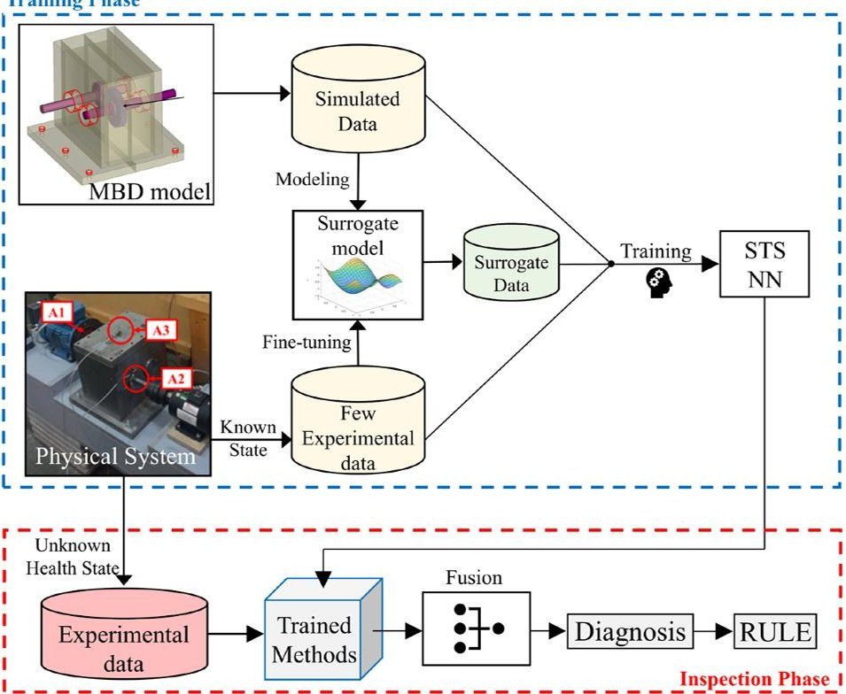

Figure 1. Flowchart of the EEDRIVEN AI platform, including its training and inspection phases.

It is noted that, in this work, the term "platform" does not refer to a standalone software environment or an interactive user interface. Instead, it denotes an integrated algorithmic framework that allows the parallel operation of the proposed modules for data augmentation, fault diagnosis, and RUL estimation in a unified way. However, the platform is structured so that it can be incorporated into a future interactive deployable software.

## 2.2. Fault Diagnosis

## 2.2.1. Statistical Time Series (STS) Approach

Vibration signals obtained from DSs, such as gearboxes, contain discrete characteristic frequencies, including shaft harmonics, gear meshing frequencies (GMFs), and other structural frequencies. These signals can be approximated as the sum of sinusoids representing the discrete frequencies and a broad-spectrum random component associated with structural dynamics and transmission path effects [51]. Motivated by this mixed spectrum nature, Generalized AutoRegressive (GAR) [48] models are employed to represent the vibration signals, and a multiple model (MM) method—referred to as MM-GAR—is built on these for fault diagnosis.

The GAR model's structure may effectively capture both periodic and stochastic dynamic characteristics which are present in such signals. It models the deterministic cyclic

<!-- PDF_PAGE: 7 -->

(sinusoidal) components (e.g., GMFs and their sidebands) while simultaneously representing the broadband random vibration background through a rational autoregressive (AR) component [48]. Thanks to this special characteristic, the GAR model provides a unified statistical representation of the drivetrain system (DS) dynamics.

For any specific rotational speed $ \varOmega $ , the GAR model form is as follows (see details in [52]):

$$
y _ {\Omega} [ k ] = \sum_ {i = 1} ^ {\mathrm {d}} \left[ A _ {i} (\Omega) \sin \left(2 \pi f _ {i} k\right) + B _ {i} (\Omega) \cos \left(2 \pi f _ {i} k\right) \right] + \sum_ {j = 1} ^ {n} a _ {j} (\Omega) y _ {\Omega} [ k - j ] + e _ {\Omega} [ k ]
$$

$$
e _ {\Omega} [ k ] \sim i. i. d N \left(0, \sigma_ {\mathrm {e}} ^ {2} (\Omega)\right)
$$

with $ y_{\Omega}[k] $ designating the angularly resampled vibration signal, k the discrete sample index, and $ e_{\Omega}[k] $ the model innovations, which is a Gaussian i.i.d. (identically independently distributed) zero-mean signal with variance $ \sigma_{e}^{2}(\Omega). $ $ f_{i} $ is the i-th cyclical frequency (referred to hereafter as order) normalized by the angular resampling frequency $ f_{s}^{\theta}, A_{i}, $ and $ B_{i}(i=1,\dots,d), $ which are the cyclical component amplitudes, $ a_{j}(\Omega) $ is the AR polynomial coefficients ( $ j=1,\dots,n), $ n is the model order of the rational (AR) component, and d is the number of cyclical components. This is subsequently denoted as GAR(n,d) model, with n designating the AR order and d the number of cyclical (sinusoidal) components. The identification of a GAR(n,d) model—including estimation of a distinct parameter vector $ \vartheta=\left[ a_{1}\ldots a_{n}\vdots A_{1}\ldots A_{d}\vdots B_{1}\ldots B_{d}\right]^{T} $ per considered speed $ \Omega $ , model structure selection, and validation—is achieved in this study based on a special procedure, as outlined in the following steps:

Step 1: angular resampling. The time-domain vibration signals are angularly resampled via computed order tracking via the corresponding once-per-revolution tachometer pulses [53] (pp. 148-151). This process ensures the removal of non-synchronous frequency modulation in the time-domain signal caused by shaft speed variations, which occur even when the nominal inverter speed is constant [53] (pp. 148-151).

Step 2: determination of the cyclical frequencies (orders). In this stage, a set of orders is initially selected, including shaft harmonics as well as GMFs, along with a selected number of their harmonics and sidebands. Subsequently, the cyclical frequencies (d) of the GAR model are determined by eliminating the frequencies that are not manifested in the corresponding signal. This is achieved by applying the least absolute shrinkage and selection operator (LASSO) method, only for the cyclical component of the model [54] (pp.133-135). The LASSO tuning parameter $ \lambda $ is selected following the Bayesian information criterion (BIC) as specified in [52].

Step 3: identification of the GAR model. Based on the subset of orders derived from the previous step, the GAR model is estimated via typical ordinary least squares (OLS) [55] (pp. 204-205). The AR order n is determined based on minimization of the BIC and residual sum of squares over signal sum of squares (RSS/SSS) criteria.

It should be noted that the Multiple Model Generalized AutoRegressive (MM-GAR)-based method, described below, requires a set of individual GAR(n,d) models to accurately represent the dynamics of the DS across multiple OCs. Specifically, one GAR(n,d) model is estimated for each OC. All these individual models must share a common set of cyclic orders and a common AR order (n). To ensure this, firstly, the angular resampling frequency, $ f_{s}^{\theta} $ (samples per revolution), is selected to be the same for all rotating speeds. This guarantees that the same order (frequency) content is observed, regardless of the speed. Subsequently, the set of cyclic orders employed is the same across all models and determined by combining all the significant orders identified across the different OCs using the LASSO-based selection

<!-- PDF_PAGE: 8 -->

procedure, as detailed in [52]. Finally, the AR order n is selected as the maximum order among all models for which the minimum BIC across all OCs is obtained.

## MM-GAR-Based Fault Detection

Baseline (training) phase: In this phase, the MM representation [56] of the healthy DS dynamics ("healthy subspace") $ M_{0} $ is constructed via multiple individual GAR models obtained using $ R_{1} $ available angularly resampled vibration signals. Each model is referred to as $ m_{o,i} $ , with "o" designating the healthy state and $ i=1,\dots,R_{1} $ determining the dimensionality of $ M_{0} $ . The estimation of each model is achieved using a single vibration signal from the healthy OSG under a specific operating condition defined by the load and speed within the considered ranges. Such a signal may be acquired experimentally from the physical DS, obtained from the MBD model, or generated through the surrogate model.

Inspection (detection) phase: In this phase, a new signal $ y_{u}[t] $ is obtained from the physical OSG under an unknown health state. Based on this, and after angular resampling, a new GAR model $ m_{u} $ of the same order as those in $ M_{o} $ is estimated. Fault detection is then performed by determining whether the new model $ m_{u} $ belongs to the MM representation $ M_{o} $ ; if it does, the DS is declared healthy, and otherwise as faulty. The decision-making mechanism is based on a similarity distance metric Q between the new model $ m_{u} $ and $ M_{o} $ This is currently defined as the minimum distance between $ m_{u} $ and all elements of $ M_{o} $

$$
Q := \min _ {i} d \left(m _ {o, i}, m _ {u}\right), \text {f o r} i = 1, \dots , R _ {1}
$$

with $ d ( m_{o,i}, m_{u} ) $ indicating the Mahalanobis distance between two individual models:

$$
d \left(m _ {o, i}, m _ {u}\right) = \sqrt {\left(\hat {\boldsymbol {\vartheta}} _ {0 , i} - \hat {\boldsymbol {\vartheta}} _ {u}\right) ^ {T} \left(\hat {\boldsymbol {P}} _ {0 , i}\right) ^ {- 1} \left(\hat {\boldsymbol {\vartheta}} _ {0 , i} - \hat {\boldsymbol {\vartheta}} _ {u}\right)}
$$

with $ \hat{\vartheta}_{0,i} $ and $ \hat{\vartheta}_{u} $ designating the estimated GAR parameter vectors associated with $ m_{o,i} $ and $ m_{u} $ models, respectively, while $ \hat{P}_{0,i} $ designates the estimated covariance matrix of $ \hat{\vartheta}_{0,i} $ as obtained through the Cramér-Rao bound [55] (p.218) (a hat over a symbol designates an estimate). Fault detection is then declared if and only if Q is greater than a user-specified threshold $ L_{d} $ , as follows:

$$
\begin{array}{l} Q \leq L _ {d} \rightarrow \mathrm {H e a l t h y M a c h i n e r y} \\ \mathrm {E l s e} \rightarrow \mathrm {F a u l t y M a c h i n e r y} \\ \end{array}
$$

## MM-GAR-Based Fault Identification

Baseline (training) phase: As in the above fault detection procedure, one MM representation is constructed in this phase for each of the f fault types which are considered. Thus f MM representations ("fault-type subspaces"), each one designated as $ M_{j} $ （ $ j=1,\dots,f $ ） are available. The construction of each of them is based on multiple GAR models $ m_{j,i} $ （with $ i=1,\dots,R_{2}^{j} $ ） using $ R_{2}^{j} $ angularly resampled vibration signals, where $ i=1,\dots,R_{2}^{j} $ indicates the dimensionality of $ M_{j} $ . The estimation of each model $ m_{j,i} $ is achieved as previously described, using a single vibration signal from the physical OSG, MBD model, or surrogate model, under the jth fault state and specific speed and load conditions.

Inspection (identification) phase: In this phase, once a new vibration signal is determined to originate from the faulty state (fault detection-stage 1) of the physical OSG, a new GAR model $ m_{u,j} $ is estimated for each fault type j, using the same order as the models in each $ M_{j} $ identified during the training phase. Subsequently a similarity metric $ D_{j} $ $ (j=1,\dots,f) $ between $ m_{u,j} $ and each $ M_{j} $ is computed via the minimum Mahalanobis distance as follows:

$$
D _ {j} := \min _ {i} d \left(m _ {j, i}, m _ {u, j}\right), \text {f o r} j = 1, \dots , f \text {a n d} i = 1, \dots , R _ {2} ^ {j}
$$

<!-- PDF_PAGE: 9 -->

and fault type identification is then achieved based on the minimum over all computed distances:

$$
\hat {f} = \arg \min _ {j} D _ {j}, \mathrm {f o r} j = 1, \dots , \mathrm {f}
$$

with $ \hat{f} $ designating the identified fault type.

## MM-GAR-Based Fault Severity Characterization

Baseline (training) phase: Similarly, one MM representation of the OSG dynamics under each of the s considered fault severity levels ("fault severity-level subspace") under varying speed and load conditions is constructed for each of the f fault types. This leads to a number of s $ \times $ f MM representations, designated as $ M_{j}^{z} $ （j=1,...,f and z=1,...,s), with each one corresponding to a distinct fault severity level z for each fault type j. The same procedure as previously described for fault detection and identification is followed for the construction of this MM representation. Thus, multiple GAR models $ m_{j,i}^{z} $ （i=1,..., $ R_{3}^{j,z} $ ） are estimated using $ R_{3}^{j,z} $ angularly resampled vibrations signals-one for each of the $ m_{j,i}^{z} $ models—obtained from the physical OSG, MBD, or surrogate model, with each signal corresponding to the jth fault state and zth fault severity level, under a specific rotating speed and load condition.

Inspection (severity characterization) phase: Once a new vibration signal is determined to originate from the fault type j from stage 2 (fault type identification), a new GAR model $ m_{u,j}^{z} $ is estimated for each fault severity level z, using the same order as the models in each $ M_{j}^{z} $ . Thus, as in the previous stages, a similarity metric $ L_{z} $ （ $ z=1,\dots,s $ ）between $ m_{u,j}^{z} $ and each $ M_{j}^{z} $ is computed as the minimum Mahalanobis distance to all individuals as follows:

$$
L _ {z} := \min _ {i} d \left(m _ {i, j} ^ {z}, m _ {u, j} ^ {z}\right), \text {f o r} z = 1, \dots , s \text {a n d} i = 1, \dots , R _ {3} ^ {j, z}
$$

and fault severity level characterization is then achieved based on the minimum over all computed distances:

$$
\hat {s} = \arg \min _ {z} L _ {z}, \mathrm {f o r} z = 1, \dots , s
$$

with $ \hat{s} $ designating the estimated fault severity level.

## 2.2.2. Deep Learning Approach

Fault diagnosis, including fault detection, type identification, and severity characterization using deep learning approaches, is broken down and performed in a hierarchical manner, in order to increase accuracy and robustness by constructing different network architectures for each CM stage and providing each of those networks with an easier task. Specifically, fault detection is addressed via a deep Autoencoder-based method (deep AE-based method). Then, fault type identification is achieved through a deep convolutional neural network-based method (deep CNN-based method). Finally, following the identification of a specific fault type, its severity is characterized based on another deep CNN, trained on signals corresponding to different fault severities. Each part of the deep learning approach is explained in detail in the following subsections.

## Deep AE-Based Fault Detection

Baseline (training) phase: Based on a set of $ R_{1} $ vibration signals from the physical OSG, MBD model, and surrogate model, corresponding to the healthy state under different OCs, a deep AE model is trained. A deep AE is built around three main components: an input layer, multiple hidden layers, and an output layer. This architecture is conceptually divided into two parts. The encoder, which encompasses the input and hidden layers, is responsible for learning a compressed, lower-dimensional data representation. The decoder, composed

<!-- PDF_PAGE: 10 -->

of the hidden and output layers, takes this compact representation and attempts to generate a reconstruction of the original input signal. The training of the deep-AE-based method is achieved by minimizing the reconstruction error (residuals) between the original input and its reconstructed output. The deep AE architecture, including the number of hidden layers, activation functions, and neurons per layer, is systematically selected based on the stability and convergence of the training and validation reconstruction loss, ensuring the optimal balance between performance and generalization ability.

Inspection (detection) phase: The metric for fault detection in this scenario is the mean squared error (MSE) between the original (y) and reconstructed ( $ \hat{y} $ ) vibration signals. Fault detection is then achieved based on a user-defined threshold, denoted as follows:

$$
\begin{array}{l} M S E (\boldsymbol {y}, \hat {\boldsymbol {y}}) < L _ {A E} \rightarrow H e a l t h y M a c h i n e r y \\ E l s e \rightarrow F a u l t y M a c h i n e r y \\ \end{array}
$$

As a rule of thumb, the nominal threshold for $ L_{AE} $ is set as $ \mu_{MSE}+3\sigma_{MSE} $ , where $ \mu_{MSE},\sigma_{MSE} $ are the mean and standard deviation of the MSE between the original and reconstructed signals.

## Deep CNN-Based Fault Type Identification

Baseline (training) phase: From the $ R_{2}^{j} $ vibration signals, corresponding to the examined fault types, frequency response data are collected in an array $ \left( \mathbf{Y}_{i}^{j} \right) $ for each fault type $ j=1,\dots,f $ , and are labeled in a one-hot manner as:

$$
\left\{ \begin{array}{l l} T _ {i} ^ {1} = [ 1, 0, \dots , 0 ] \\ T _ {i} ^ {2} = [ 0, 1, \dots , 0 ] \\ T _ {i} ^ {f} = [ 0, 0, \dots , 1 ] \end{array} , \quad \text {w h e r e} i = 1, \dots , R _ {2} ^ {j} \right.
$$

The data are then stacked in a training set denoted as $ D_{i}^{j}=\left\{Y_{i}^{j}, T_{i}^{j}\right\} $ where $ Y_{i}^{j} $ contains the frequency response data, $ T_{i}^{j} $ contains the corresponding encoded labels, and j corresponds to the fault types j=1,...,f. It becomes clear that the length of the label arrays is equal to the number of fault types examined. The validation dataset used during the CNN fitting process is also derived from this dataset. A CNN designed for the task of fault type identification based on frequency response data typically contains a feature extractor, comprising one or more convolutional layers, one or more fully-connected layers used for feature mapping, and a classification head, which ultimately yields the predicted label. The CNN is trained through backpropagation, with the aim of minimizing the loss function between the predicted $ (\hat{T}_{i}^{j}) $ and true $ (T_{i}^{j}) $ label of a signal. For multiclass classification problems, such as fault identification, the loss function used is the categorical cross-entropy, which is estimated as follows:

$$
C E = - \sum \boldsymbol {T} _ {i} ^ {j} l n \left(\hat {\boldsymbol {T}} _ {i} ^ {j}\right)
$$

Similarly to the deep AE, the architecture of the CNN is selected based on the convergence of the validation loss between the true and predicted labels, ensuring high accuracy and generalization capabilities.

Inspection (identification) phase: In the inspection phase, an examined signal is fed through the trained CNN, yielding the predicted label as follows:

$$
\hat {\boldsymbol {T}} _ {i} ^ {j} = \left[ P _ {n n 1}, P _ {n n 2}, \dots , P _ {n n f} \right]
$$

where $ P_{nnj} $ $ (j=1,\dots,f) $ denotes the probability that the examined signal belongs to the jth fault type. Given that the probabilities $ P_{nn1},P_{nn2},\dots,P_{nnf} $ are fractions in the range of $ [0,1] $

<!-- PDF_PAGE: 11 -->

$ \hat{T}_{i}^{j} $ is then encoded into a one-hot label, where the greatest probability value is encoded as 1 and all others as 0, ultimately denoting the class (type) of the predicted fault type.

## Deep CNN-Based Fault Severity Characterization

Baseline (training) phase: For the severity characterization, the $ R_{3}^{j,z} $ training signals are labeled in a one-hot manner as follows:

$$
\left\{ \begin{array}{l l} T _ {i} ^ {j, 1} = [ 1, 0, \dots , 0 ] \\ T _ {i} ^ {j, 2} = [ 0, 1, \dots , 0 ] \\ T _ {i} ^ {j, s} = [ 0, 0, \dots , 1 ] \end{array} , \quad \text {w h e r e} i = 1, \dots , R _ {3} ^ {j, z} \right.
$$

where j denotes the previously identified fault type and subscripts 1,2,...s correspond to the different fault severity levels z, and are then stacked in the training dataset $ D_{i}^{j,z}=\left\{Y_{i}^{j,z},T_{i}^{j,z}\right\} $ . In this case as well, the CNN contains the feature extractor, fully connected layers, and the classification head, and its architecture is fine-tuned based on the validation loss between the predicted $ (\hat{T}_{i}^{j,z}) $ and true $ (T_{i}^{j,z}) $ label of a signal, using the categorical cross-entropy function.

Inspection (severity characterization) phase: Similar to the fault identification phase, in the severity characterization phase, the examined dataset is fed through the trained network which yields a predicted label as follows:

$$
\hat {\boldsymbol {T}} _ {i} ^ {j, z} = \left[ P _ {n n 1}, P _ {n n 2}, \dots , P _ {n n s} \right]
$$

where P denotes the probability that the examined dataset belongs to either of the s severity levels learned during the training phase. Given that $ P_{n n 1}, P_{n n 2}, \dots, P_{n n f} $ are fractions in the range of [0,1], $ \hat{T}_{i}^{j,z} $ is also encoded into a one-hot label, where the greatest probability value is encoded as 1 and all others as 0, ultimately denoting the class of the predicted fault severity level.

## 2.3. Remaining Useful Life Estimation

The main concept behind the proposed RUL estimation method is to derive a machinery dynamics-informed health indicator (HI) from the special GAR models that exhibits a similar trajectory across the considered range of OCs without being affected by them, thus enabling robust RUL estimation from early degradation levels at any OC. Similar to prediction-based approaches, the trajectory of the GAR-based HI is modeled through a simple Wiener process model [57] that captures both the dynamics deterministic degradation trend and temporal variability. Within this context, the RUL is estimated as the expected time instant where the HI reaches an upper threshold, denoted as w, indicating end-of-life (EoL), which is defined in the baseline (training) phase of the method. It is worth stressing that, under this approach, accurate RUL estimation can be achieved by monitoring only the fatigue-induced changes in the machinery dynamics via its vibration response, from which the remaining life of the rotating component is inferred.

Baseline (training) phase: During this phase, vibration signals under various OCs (speed and load in the ranges of interest) from a number in the range $ r=1,\dots,R $ of run-to-failure procedures are obtained using the MBD model, the surrogate model, and/or physical experiments. Each vibration signal is acquired at a specific operating time $ \tau_{j}=j\cdot\Delta\tau $ , with $ j=1,\dots,m_{r} $ and $ \Delta\tau $ denoting a constant monitoring interval and with $ \tau_{m_{r}} $ standing for the final operating time associated with the EoL of the r-th run-to-failure procedure. A separate GAR model is estimated from each such vibration signal, yielding a set of parameter vectors

<!-- PDF_PAGE: 12 -->

$ \hat{\vartheta}_{r,j} $ . The developed HI representing the degradation level of the monitored OSG component at operating time $ \tau_{j} $ , is then expressed through the Mahalanobis distance as follows:

$$
D _ {r, j} = \sqrt {\left(\hat {\boldsymbol {\vartheta}} _ {r , j} - \hat {\boldsymbol {\vartheta}} _ {r , 0}\right) ^ {T} \cdot \hat {\boldsymbol {P}} _ {r , 0} ^ {- 1} \cdot \left(\boldsymbol {\vartheta} _ {r , j} - \hat {\boldsymbol {\vartheta}} _ {r , 0}\right)}
$$

where $ \hat{\vartheta}_{r,0} $ and $ \hat{P}_{r,0} $ denote the estimated parameter vector and its covariance matrix, respectively, corresponding to a GAR reference model associated with the onset of operation, that is zero operating time $ (\tau_{0}=0) $ . Therefore, the EoL threshold w for the HI is determined as the minimum value of the $ D_{r,mr} $ obtained based on all run-to-failure procedures:

$$
w = \min _ {r = 1, \dots , R} D _ {r, m _ {r}}
$$

All obtained values of $ D_{r,j} $ collected in $ D_{r}=[D_{r,1},\dots,D_{r,m_{r}}]^{T} $ are then used for the Wiener process modeling of the HI trajectory that describes the degradation evolution of the considered OSG component.

In this study, a linear Wiener process model [57-59] of the following form is employed:

$$
D \left(\tau_ {j}\right) = \phi + \alpha \cdot \tau_ {j} + \sigma_ {B} \cdot B \left(\tau_ {j}\right), \quad B \left(\tau_ {j}\right) \sim \mathcal {N} \left(0, \tau_ {j}\right)
$$

with $ \phi $ designating the initial offset, $ \alpha $ standing for the drift of the HI trajectory (degradation rate), and $ \sigma_{B} $ denoting the diffusion parameter associated with the Brownian motion $ B(\tau) $ The drift coefficient $ \alpha $ is treated as a random variable following a normal distribution $ \alpha\sim\mathcal{N}\left(\mu_{\alpha},\sigma_{\alpha}^{2}\right) $ to account for the uncertainty of the HI trajectory slope under different OCs. Given $ D_{r} $ , estimates of the $ \hat{\mu}_{\alpha},\hat{\sigma}_{\alpha}^{2},\hat{\sigma}_{B},\hat{\phi} $ are obtained through the maximum-likelihood method via the minimization of the log-likelihood function $ \ell\left(\mu_{\alpha},\sigma_{\alpha}^{2},\sigma_{B}^{2},\phi|D_{r}\right) $ as described in [58].

Inspection (RUL estimation) phase: In this phase, assuming that the OSG operates initially under nominal conditions without degraded components, vibration signals are periodically acquired at discrete monitoring time instants $ \tau_{k}=k\cdot \Delta \tau $ $ (k=1,\dots,n) $ . At each $ \tau_{k} $ , a GAR model of the same orders as those in the baseline phase is estimated from the corresponding vibration signal, yielding a parameter vector $ \hat{\vartheta}_{k} $ . The HI (Mahalanobis distance) at $ \tau_{k} $ is then obtained as follows:

$$
D _ {k} = \sqrt {\left(\hat {\boldsymbol {\vartheta}} _ {k} - \hat {\boldsymbol {\vartheta}} _ {0}\right) ^ {T} \cdot \hat {\boldsymbol {P}} _ {0} ^ {- 1} \cdot \left(\hat {\boldsymbol {\vartheta}} _ {k} - \hat {\boldsymbol {\vartheta}} _ {0}\right)}
$$

where $ \vartheta_{0} $ and $ \hat{P}_{0} $ denote the reference GAR model parameter vector and covariance matrix, respectively, estimated at the onset of operation $ \left( \tau_{0}=0\right) $ in this phase. By collecting all HI values obtained via Equation (19) in $ D_{1:k}=[D_{1},\dots,D_{k}]^{T} $ , the posterior distribution of the drift parameter $ \alpha $ of the Wiener process model of Equation (18) is updated recursively at each monitoring instant $ \tau_{k} $ according to the Gaussian conjugation rule [58]:

$$
\hat {\mu} _ {\alpha | k} = \frac {\hat {\sigma} _ {B} ^ {2} \hat {\mu} _ {\alpha | k - 1} + \hat {\sigma} _ {a | k - 1} ^ {2} \left(D _ {k} - D _ {k - 1}\right)}{\hat {\sigma} _ {a | k - 1} ^ {2} \Delta \tau + \hat {\sigma} _ {B} ^ {2}}, \quad \hat {\sigma} _ {a | k} ^ {2} = \frac {\hat {\sigma} _ {B} ^ {2} \hat {\sigma} _ {a | k - 1} ^ {2}}{\hat {\sigma} _ {a | k - 1} ^ {2} \Delta \tau + \hat {\sigma} _ {B} ^ {2}}
$$

with $ \mu_{\alpha|0}=\hat{\mu}_{\alpha} $ and $ \sigma_{\alpha|0}=\hat{\sigma}_{\alpha} $ . Then, according to the first-passage-time definition [44,45,57-59] for the model in Equation (18), RUL $ H_{k} $ at time $ \tau_{k} $ is defined as:

$$
H _ {k} := \inf \left\{h _ {k}: D \left(\tau_ {k} + h _ {k}\right) \geq w \mid D _ {1: k} \right\}
$$

<!-- PDF_PAGE: 13 -->

with PDF being expressed as follows [58,59]:

$$
f _ {H _ {k} \mid D _ {1: k}} \left(h _ {k} \mid D _ {1: k}, \hat {\mu} _ {a \mid k}, \hat {\sigma} _ {a \mid k} ^ {2}, \hat {\sigma} _ {B} ^ {2}\right) = \frac {w - D _ {k}}{\sqrt {2 \pi h _ {k} ^ {3} \left(\hat {\sigma} _ {B} ^ {2} + \hat {\sigma} _ {a \mid k} ^ {2} h _ {k}\right)}} \cdot \exp \left[ - \frac {\left(w - D _ {k} - \hat {\mu} _ {a \mid k} h _ {k}\right) ^ {2}}{2 h _ {k} \left(\hat {\sigma} _ {B} ^ {2} + \hat {\sigma} _ {a \mid k} ^ {2} h _ {k}\right)} \right]
$$

and the corresponding expectation [58,59]:

$$
E \left\{H _ {k} \mid \boldsymbol {D} _ {1: k}, \hat {\mu} _ {a | k} \right\} = \frac {w - D _ {k}}{\hat {\mu} _ {a | k}}
$$

Hence, at each monitoring instant $ \tau_{k} $ , the RUL estimation is obtained from Equations (22) and (23), once the Wiener model of Equation (18) is updated through Equation (20), and thus provides a continuous, sequential tracking of the remaining lifetime evolution.

## 2.4. Decision Fusion Methodology

In most classification problems—such as the fault detection, identification, and severity characterization in a holistic CM framework such as the one investigated in this study—different approaches may be employed depending on the data type and volume, the computational effort, the model architecture, and other factors. Their performance may vary even for the same problem, which may hinder reaching a unified decision. To overcome this challenge and achieve complementary performance, a proper decision fusion methodology such as the one presented in this section may be employed, leading to a significantly enhanced overall diagnostic performance [60].

In such a decision fusion scheme, each method produces a prediction, either as a hard class label (e.g., faulty or healthy) or as a set of class probabilities, from which the most likely class is selected. One of the most widely used forms of decision fusion is based on combining the predictions from each method and giving in return only a single prediction as the final decision. This fusion approach is commonly known as voting. Two common types of voting are hard (majority) voting and soft (weighted) voting.

Hard voting involves the simple act of deciding the final class based on a simple rule: which class received the most votes as the final prediction. This is most appropriate when classes are discrete and mutually exclusive. Soft voting, on the other hand, aggregates the class probabilities produced by the methods, typically by averaging them (with or without weights) before selecting the class with the highest fused probability [61]. Equal weights are appropriate when the methods demonstrate comparable performance.

Both voting approaches are utilized within the present decision fusion methodology, with hard voting being used in stage 1 (fault detection) of CM, and soft voting in stages 2 (fault type identification) and 3 (fault severity characterization), as shown in Figure 2. Based on this, the potential complementary performance between the deep learning and STS approaches is investigated.

In stage 1, the final prediction is derived based on the following rule: A fault is detected if and only if all methods label it as faulty, otherwise it is labeled healthy. Thus, we obtain the following:

$$
\begin{array}{l} Q > L _ {d} \& M S E > L _ {A E} \rightarrow F a u l t y D S \\ E l s e \rightarrow H e a l t h y D S \\ \end{array}
$$

with $ Q, L_{d} $ defined in Section 2.2.1 and $ MSE, L_{AE} $ in Section 2.2.2. This simple yet strict and effective rule ensures that each detected fault is confirmed by both methods, minimizing

<!-- PDF_PAGE: 14 -->

false alarms, which is of high importance in this stage, and reducing unnecessary downtime and extra inspection costs.

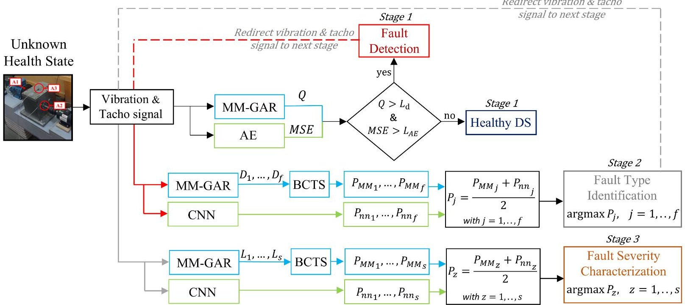

Figure 2. The EEDRIVEN AI platform's decision fusion methodology for fault diagnosis.

Once a fault is detected, the vibration and tachometer signals are redirected to stage 2 for fault type identification (also see Figure 2). The MM-GAR-based class probabilities $ P_{MM}=\left[ P_{MM1}, P_{MM2}, \dots, P_{MMf} \right] $ are obtained by applying the bias-corrected temperature scaling (BCTS) Softmax function to the distance metrics $ D_{j} $ （ $ j=1,\dots,f $ ）as obtained by Equation (6), with $ P_{MMj} $ denoting the probability of the signal belonging to the j-th fault type. It is noted that BCTS Softmax is used to reduce overconfidence in the standard Softmax predictions, as indicated in [62,63].

The resulting MM-GAR-based class probabilities are combined with the deep CNNbased probabilities (also see Equation (13)) via equal-weight soft voting as follows:

$$
P _ {j} = \frac {P _ {M M j} + P _ {n n j}}{2}
$$

Then, fault type identification is based on the highest fused probability:

$$
\hat {f} = \arg \max P _ {j}, \mathrm {f o r} j = 1, \dots , f
$$

with $ \hat{f} $ designating the identified fault type.

Once the fault type is identified, the vibration and tachometer signals are then redirected to stage 3 for fault severity characterization, similarly to stage 2, where the class probabilities $ P_{MM}=[P_{MM1},P_{MM2},\dots,P_{MMs}] $ , for the MM-GAR method, are obtained using the BCTS Softmax and combined equally with those of the deep CNN-based method:

$$
P _ {z} = \frac {P _ {M M z} + P _ {n n z}}{2}
$$

Then, fault severity characterization is achieved using the highest fused probability:

$$
\hat {s} = \arg \max P _ {z}, \mathrm {f o r} \mathrm {s} = 1, \dots , \mathrm {z}
$$

Note that, in the case of binary classification, as in stage 2 where two fault types ( f=2) are considered, the parameterization of BCTS reduces to Platt scaling [64].

<!-- PDF_PAGE: 15 -->

It should be noted that the parameters of the BCTS Softmax function (temperature and class specific biases) are estimated in each CM stage by minimizing the negative log likelihood (NLL) of the calibrated Softmax on a validation dataset of vibration signals derived from the training dataset in the baseline phase. These parameters are subsequently utilized in the inspection phase.

## 3. The Drivetrain System

## 3.1. The Experimental Setup

The experimental DS has been designed and manufactured by the Laboratory of Machine Dynamics at Aristotle University of Thessaloniki (AUTH) in Greece and consists of a one-stage helical gearbox (OSG) and two electric motors, the drive and load motors, as shown in Figure 3. The drivetrain has an output ratio of 0.659:1, with the gearbox featuring a pinion with 29 teeth, followed by a gear with 44 teeth. The drive motor operates at distinct speeds, providing the input motion to the gearbox, and is regulated by a standard variable frequency drive (inverter). The load motor, regulated by a second inverter, enables adjustable loading conditions on the gearbox. This configuration allows detailed and controlled experimentation under a wide range of operating conditions, including different speeds and load levels. The gear shafts are mounted within the gearbox using rolling element bearings.

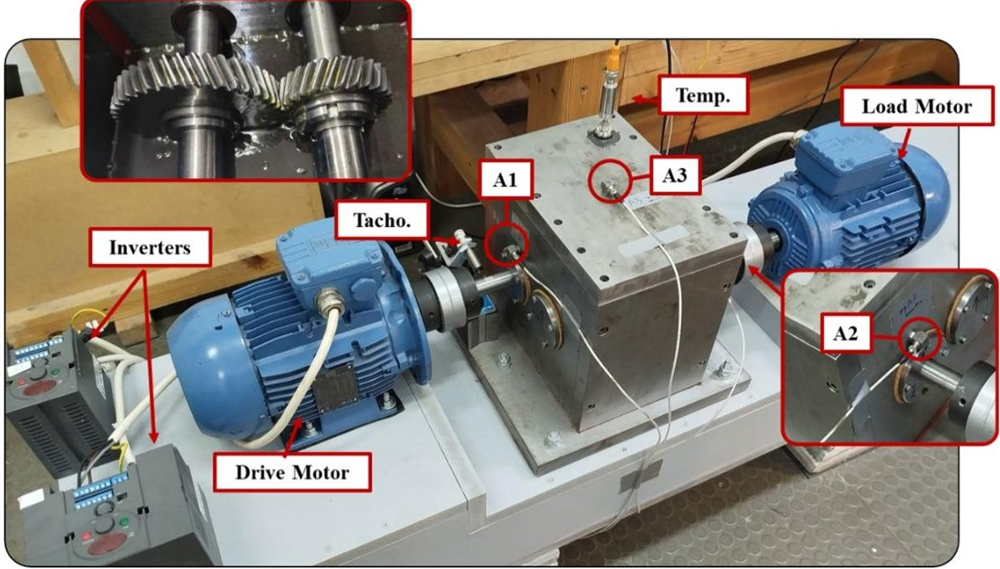

Figure 3. The experimental setup. Photo of the one-stage gearbox, including the accelerometers (A1, A2, and A3), the tachometer and temperature sensor locations, and the inverters, drive motor, and load motor.

The vibration signals are acquired using the three triaxial accelerometers A1, A2, and A3 installed on the gearbox housing, placed close to the inlet and outlet shaft bearings as well as on the top cover of the gearbox frame, as shown in Figure 3. Additionally, a tachometer is mounted facing the inlet shaft and measures the rotating speed of the drive motor, while a digital temperature sensor is used to monitor the oil temperature, in order to ensure similar thermal conditions during the experimental procedure and across all experiments.

The OSG operates at five distinct rotating speeds, ranging from 400 to 800 rpm in 100 rpm increments, and five load levels applied through the load motor, varying from no load (0%) to 50% of the input torque. All operating conditions examined are summarized in Table 1.

<!-- PDF_PAGE: 16 -->

Table 1. Operating conditions of the one-stage gearbox.

<table border="1"><tr><td>Speed(rpm)</td><td>{400,500,600,700,800}</td></tr><tr><td>Load(% of input torque)</td><td>{0,12.5,20,25,37.5,50}</td></tr></table>

Two distinct fault types of different severities (Figure 4) are investigated in the present study. These are implemented directly in the gearbox using a typical cutting tool on the outlet (driven) gear of the OSG, without performing any component disassembly that will add uncertainty to the measurements. The first fault type is a missing tooth scenario, implemented at two levels: one missing tooth and two missing teeth, referred to as Missing Tooth 1 (MT1) and 2 (MT2), respectively. The second fault type is a root crack, introduced at the root of a single tooth on the outlet gear and implemented at three levels: minor, intermediate, and large, referred to as Root Crack 1 (RC1), 2 (RC2), and 3 (RC3), respectively. All details of the considered fault types and respective severity levels are illustrated in Figure 4.

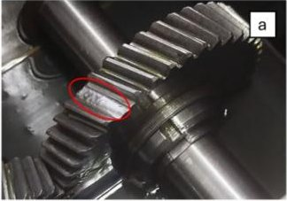

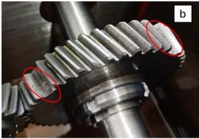

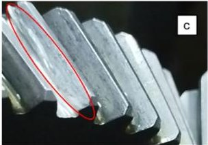

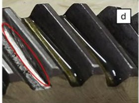

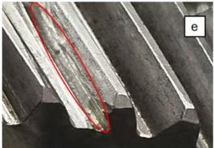

Figure 4. Photo of the one-stage gearbox fault scenarios. (a) One Missing Tooth (MT1), (b) Two Missing Teeth (MT2), (c) Minor Root Crack (RC1), (d) Intermediate Root Crack (RC2), and (e) Large Root Crack (RC3).

## 3.2. The Multibody Dynamics Model

The OSG examined in this work is modeled in the Adams MBD analysis software, 2021.1 version, as shown in Figure 5. The gearbox is attached to the ground through six 3D bushing elements which simulate bolt stiffness, while the bearings of the system are also modeled as 3D bushings of zero rotational stiffness. Last, all bodies are considered rigid, meaning that no relevant displacements are allowed between points on the same body.

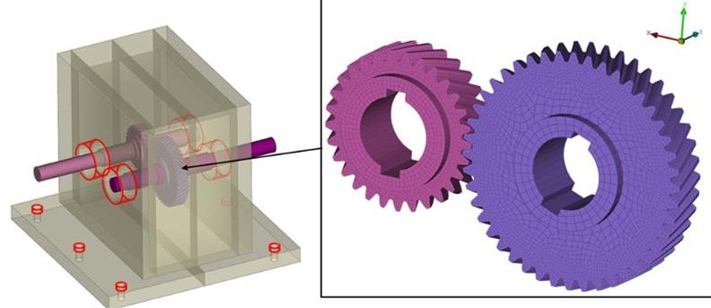

Figure 5. One-stage gear drivetrain multibody dynamics model.

An improved gear contact force model is proposed and employed in the MBD to facilitate accurate gear tooth fault modeling and high-fidelity data generation. The normal force between the gear teeth is modeled as a nonlinear contact force element which is formulated as follows:

$$
F _ {N} = K \delta^ {n} + g \left(C, \delta , \delta_ {\max }, \dot {\delta}\right)
$$

<!-- PDF_PAGE: 17 -->

where K denotes the contact stiffness, $ \delta $ and $ \delta $ denote the indentation depth and velocity between the two gears, respectively, n is a coefficient used to simulate the nonlinearity of the gear meshing, and g is a damping function used to simulate the energy dissipation during gear meshing based on damping coefficient C. In order to estimate the contact force between the two gears in a simulation step, the indentation depth and velocity are estimated based on a contact detection algorithm which detects the overlap between the two contacting bodies and yields the maximum depth and velocity in each timestep. In this manner, the different gear teeth are identified as separate contact locations, which results in a total normal meshing force:

$$
F _ {N, t o t} = \sum_ {i = 1} ^ {n} F _ {N, i}
$$

where n is the number of teeth that are in contact at each simulation step. To include the effects of the time-varying mesh stiffness (TVMS) in the simulations, the contact stiffness between a tooth pair is to be estimated as follows:

$$
K = \frac {1}{\frac {1}{K _ {h}} + \frac {1}{K _ {b , 1}} + \frac {1}{K _ {s , 1}} + \frac {1}{K _ {a , 1}} + \frac {1}{K _ {f , 1}} + \frac {1}{K _ {b , 2}} + \frac {1}{K _ {s , 2}} + \frac {1}{K _ {a , 2}} + \frac {1}{K _ {f , 2}}}
$$

where the subscripts h,b,s, and a denote the hertzian, bending, shear, and axial compression stiffness components between the pinion (1) and driven (2) gears, respectively. The equation of each stiffness component can be found in [65].

To introduce this TVMS to the model, a subroutine is created in C programming language and is then coupled with the Adams solver algorithm. This subroutine estimates the instantaneous contact angle $ \varphi_{1} $ between the gear teeth, based on the contact point location $ [x,y] $ , and, subsequently, the contact stiffness K is estimated based on Equation (31). The total meshing force for a gear pair is then estimated as the sum of the normal contact force of each tooth-pair that comes into contact in each time instance t. This process is also explained in the pseudocode of Algorithm 1.

1. initialize model and force parameters and start simulation

2. while t < t max:

a. $ \underline{q}_{p,i+1}\leftarrow\underline{q}_{p,i}+d\underline{q}_{p} $

b. $ \underline{\delta}\leftarrow$ find $ \delta>0 $ between pinion and driven gears

c. for $ \delta_{j} $ in $ \underline{\delta} $ :

i. call enhanced force subroutine $ F\left(x_{j},y_{j},\delta_{j},\dot{\delta}_{j}\right) $

in subroutine do:

$ \left\{\varphi_{1,j}\leftarrow\varphi_{1}\left(x_{j},y_{j}\right)\right. $

$ K_{j}\leftarrow K\left(\varphi_{1,j}\right) $

$ F_{N,j}\leftarrow F_{N}\left(K_{j},\delta_{j},C,\dot{\delta}_{j}\right) $

ii. $ F_{m}\leftarrow F_{m}+F_{j} $

d. Return $ F_{m} $

e. Apply $ F_{m} $ between gears

f. $ \underline{q}_{d,i+1}\leftarrow\underline{q}_{d,i}+d\underline{q}_{d} $

g. $ t\leftarrow t+dt $

3. Store simulation results

The desired level of fidelity of the MBD model is achieved through the state-of-the-art generalized generation gap with parent centric crossover (G3PCX) evolutionary algorithm [66],

<!-- PDF_PAGE: 18 -->

using a small number of vibration measurements from the physical OSG as a target for the model parameters fine-tuning. Following the MBD model's optimization, any desired fault type of the system can be simulated under any operating conditions, allowing for the generation of a broad training set of labeled signals from the different fault types.

## 3.3. Surrogate Models

The surrogate models utilized in this study serve as computationally efficient emulators of the MBD model, capable of accurately representing the DS dynamics and thus generating vibration signals at a significantly lower computational cost. The development of these models is based on a small subset of MBD-generated simulation data, and they are then fine-tuned with a limited number of experimental signals, yielding high-fidelity surrogates. These models are employed to generate realizations efficiently across various operating conditions and fault severities, and thus enrich the number of vibration signals which are used for the training of the platform.

The surrogate models are based on the Generalized AutoRegressive (GAR) models upon which a linear parameter varying (LPV) structure is imposed in order to provide a global LPV-GAR model. Although these models are estimated based on a limited number of signals, they can accurately represent the dynamics of the DS for any value of the considered scheduling variable (e.g., rotational speed, load, severity level) within the specified training range. Full details on the estimation of the LPV-GAR model, as well as the signal generation through them, are presented in our recent conference paper [52] and are thus omitted here.

## 3.4. Vibration Signals

All experimental vibration signals from the physical OSG are acquired using three triaxial accelerometers, as shown in Figure 3, with a sampling frequency of $ f_{s}=5120 $ Hz, while the tachometer simultaneously measures the rotational speed of the drive motor. The data acquisition procedure is initially performed with the OSG at its healthy condition, with no load applied and the rotating speed set to the minimum (of interest) speed of 400 rpm, and six signals are acquired, with each being of 5 s (25,600 samples) duration. The rotating speed is then increased to the next level until six more vibration signals are collected for all specified speeds. This procedure is repeated for all load levels, resulting in six distinct vibration signals for each rotational speed and load combination. The same procedure is subsequently performed for each fault type and fault severity level.

A total of 610 experimental vibration signals are collected, across all load and speed combinations and between the DS's health states. The signals are divided into the training and inspection phase datasets, with 90 experimental vibration signals being used for the training of the methods while the rest (520) comprise the inspection dataset. During the training phase of the methods, the number of vibration signals used is complemented by the MBD simulations and surrogate model realizations, with an equal number being generated by each model (900 signals), resulting in a total of 1890 signals. All details on the training phase dataset are included in Table 2.

The assessment of the methods comprising the fault diagnosis stages is based exclusively on experimental vibration signals, as shown in Table 3.

On the other hand, the training and performance assessment of the RUL estimation method in the present study are performed exclusively through Monte Carlo numerical simulations using the MBD drivetrain model introduced in Section 2.1, due to the unavailability of experimental run-to-failure vibration signals under different OCs. In this context, a continuous simulated operation, starting from the healthy state (no degradation) and proceeding until the predefined degradation limit is reached, constitutes a simulated run-to-failure procedure corresponding to the complete operating lifetime of the OSG.

<!-- PDF_PAGE: 19 -->

Table 2. Details on the training phase dataset of vibration signals.

<table border="1"><tr><td rowspan="2">Gearbox State</td><td rowspan="2">Fault Levels</td><td rowspan="2">Load(%)</td><td rowspan="2">Rotating Speed(rpm)</td><td colspan="3">Measurements $ ^{1} $ (Number $ \times $ sec)</td></tr><tr><td>Experimental</td><td>Simulation</td><td>Surrogate</td></tr><tr><td>Healthy</td><td>n/a</td><td>{0,25,50}</td><td>{400,500,600,700,800}</td><td>$ 1\times5 $</td><td>$ 10\times5 $</td><td>$ 10\times5 $</td></tr><tr><td>Root Crack</td><td>3 levels</td><td>{0,12.5,25}</td><td>-//-</td><td>$ 1\times5 $</td><td>$ 10\times5 $</td><td>$ 10\times5 $</td></tr><tr><td>Missing Tooth</td><td>2 levels</td><td>{0,12.5,25}</td><td>-//-</td><td>$ 1\times5 $</td><td>$ 10\times5 $</td><td>$ 10\times5 $</td></tr></table>

Sampling rate: $ f_{s}=5120 $ Hz; length: N=25,600 samples; frequency bandwidth: 0-2560 Hz; total no. of signals = 1890. $ ^{1} $ The indicated number of measurements is collected per health state for each combination of speed and load.

Table 3. Details on the inspection phase dataset of vibration signals.

<table border="1"><tr><td>Health State</td><td colspan="6">Healthy</td><td colspan="4">Root Crack</td><td colspan="4">Missing Tooth</td></tr><tr><td>Fault Levels</td><td colspan="6">n/a</td><td colspan="4">3</td><td colspan="4">2</td></tr><tr><td>Rotating Speed(rpm)</td><td>400</td><td>500</td><td>600</td><td>700</td><td>800</td><td>400</td><td>500</td><td>600</td><td>700</td><td>800</td><td>400</td><td>500</td><td>600</td><td>700</td><td>800</td></tr><tr><td>Load(%)</td><td>02550</td><td>012.52537.550</td><td>012.52537.550</td><td>02550</td><td>02550</td><td>012.525</td><td>012.52025</td><td>012.525</td><td>012.525</td><td>012.52025</td><td>012.52025</td><td>012.525</td><td>012.52025</td><td>012.525</td><td>012.525</td></tr><tr><td>Measurements1(Number×sec)</td><td></td><td colspan="5">5×5</td><td colspan="4">5×5</td><td colspan="4">5×5</td></tr></table>

Sampling rate: $ f_{s}=5120 $ Hz; length: N=25,600 samples; frequency bandwidth: 0-2560 Hz; total no. of signals = 520. $ ^{1} $ The indicated number of measurements is collected per health state for each combination of speed and load.

In the present case, the considered degradation is the progressive abrasive surface wear of the outlet gear, implemented following [67] through a gradual reduction in the contact stiffness in Equation (31). This reduction, caused by material removal along the tooth surface, reproduces the dynamic effects of cumulative wear on the OSG vibration response [2]. The wear depth increases monotonically from 0 $ \mu\mathrm{m} $ , corresponding to the healthy state, up to approximately 13 $ \mu\mathrm{m} $ , which is considered the maximum permissible wear level, beyond which the OSG is taken out of service for repair [67]. Each progressive wear level corresponds to an equivalent operating time interval of $ \Delta\tau=10 $ h, representing a uniform step in the simulated gear degradation process and defining the constant monitoring interval at which vibration signals for RUL estimation are generated.

The considered varying OC is the rotational speed, with five discrete values spanning from 400 to 800 rpm, as shown in Table 4. Consequently, each run-to-failure simulation procedure terminates at a different total operating time (EoL time), reflecting the speed-dependent wear progression rate as indicated in [67]. The number of generated vibration signals for both baseline (training) and inspection phases are summarized in Table 4.

Table 4. Details on the simulated vibration signals for the training and validation of the RUL estimation method.

<table border="1"><tr><td colspan="2">Rotating Speed(rpm)</td><td>400</td><td>500</td><td>600</td><td>700</td><td>800</td></tr><tr><td>No.of</td><td>Baseline</td><td>195/1950</td><td>182/1820</td><td>175/1750</td><td>164/1640</td><td>156/1560</td></tr><tr><td>Signals/EoL(h)</td><td>Inspection</td><td>196/1960</td><td>180/1800</td><td>173/1730</td><td>161/1610</td><td>152/1520</td></tr></table>

Sampling rate: $ f_{s}=5120 $ Hz; length: N=25,600 samples; frequency bandwidth: 0-2560 Hz; total no. of baseline signals (simulations) = 872; total no. of inspection signals (simulations) = 862; wear range: 0-13 $ \mu $m; monitoring time interval: $ \Delta \tau=10 $ h.

<!-- PDF_PAGE: 20 -->

## 3.5. Effects of the Varying Operating Conditions and Fault Scenarios on the Vibration Signals

In this subsection, the effects of the considered fault scenarios on the OSG and their respective severity levels are explored. These effects are investigated in the order domain by constructing order spectrum zones via the fast Fourier transform (FFT) method. These zones are obtained using a single vibration signal from each considered rotating speed and load combination associated with each health state. The signals' angular resampling is performed based on computed order tracking with a common resampling frequency for all considered rotating speeds equal to $ f_{s}^{\theta}=3 7 0 $ (samples/revolution) for 30 rotations. Thus, the corresponding angular signals are 11,100 samples long. The spectrum zones of the healthy state are presented in Figure 6a, while Figure 6b-e depicts the spectrum zones of the healthy DS against that of different fault scenarios, with each subplot corresponding to a different fault and severity level.

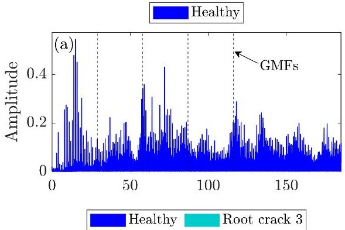

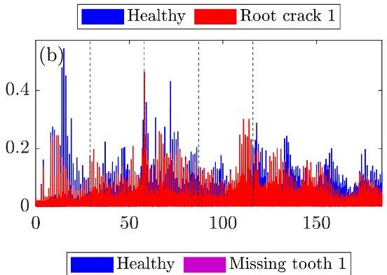

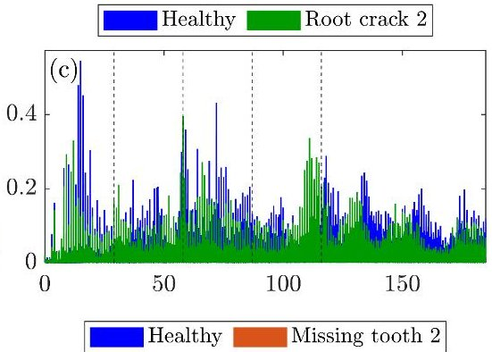

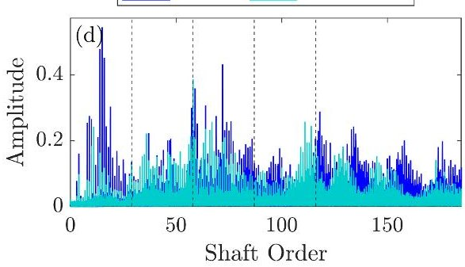

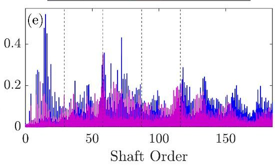

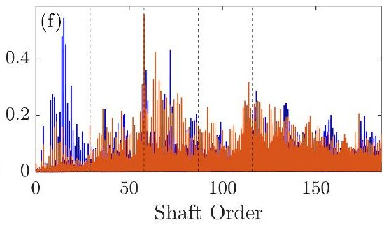

Figure 6. Order spectrum zones based of fast Fourier transform (FFT) amplitude estimates using a single vibration signal from each considered rotating speed and load combinations for all health states: (a) healthy, (b) healthy vs. Root Crack 1, (c) healthy vs. Root Crack 2, (d) healthy vs. Root Crack 3, (e) healthy vs. Missing Tooth 1, (f) healthy vs. Missing Tooth 2; the vertical black dashed lines in each subplot indicate gear meshing frequency (GMF) harmonics.

It is evident that the effect of some faults on the OSG dynamics is more prominent than others. While Missing Tooth 2 is the most dominant fault scenario, substantial overlap is observed across all scenarios, as the variations in rotating speed and load affect the healthy dynamics in a way that obscures the fault-induced effects, causing the faulty spectrum zones to almost entirely coincide with the healthy ones within the considered bandwidth. For the Root Crack fault scenarios, an additional increase in harmonic content is observed near the fourth GMF across all severities, while a slight amplitude increase is indicated on the second GMF for the Root Crack 2 scenario. Missing Tooth 1 exhibits significant overlap with the healthy spectrum zones in the entire bandwidth, while Missing Tooth 2 shows a more pronounced amplitude increase and additional harmonic content between the second and fourth GMFs. This considerable spectrum overlap confirms the highly challenging nature of the diagnosis problem.

<!-- PDF_PAGE: 21 -->

## 4. Performance Assessment of the AI Digital Platform

## 4.1. Performance Assessment Metrics

The fault diagnosis performance assessment of the proposed AI digital platform framework, including stage 1: fault detection, stage 2: fault type identification, and stage 3: fault severity characterization, is demonstrated via plots of each method's metric, as well as ROC curves and confusion matrices [68]. A ROC curve represents the true positive rate (TPR, that is the correct fault detection/type identification/severity characterization rate) versus the false positive rate (FPR, that is the false alarm rate) for varying decision thresholds. Each column in a confusion matrix (excluding the rightmost column and the bottom row) corresponds to the actual/true class, while each row represents the predicted class. The i,j-th cell indicates the number of times the actual i-th class was predicted as the j-th class, presented as a ratio in relation to the total number of actual inspection test cases. Classes are defined by the different health states of the OSG. In the fault type identification stage, each fault type constitutes a separate class, while, in the severity characterization stage, each severity level constitutes a different class. Along the diagonal, the true class is correctly predicted, while, in the off-diagonal parts, it is incorrectly predicted. The percentages of correctly and incorrectly predicted cases out of all predictions made for each specific class are shown in the column on the far right of the matrix. The bottom row shows the percentages of correctly and incorrectly predicted cases out of all actual cases of that class. Finally, the cell at the bottom and right indicates the overall correct prediction rate and false prediction rate across all classes. In other words, this cell presents the total accuracy of the method, while the rightmost column and the bottom row indicate the typical precision and recall ratios, respectively, for each class [69].

Regarding the assessment of the RUL estimation method, the evaluation is initially based on the monotonicity, trendability, and prognosability properties [44] of the constructed health indicator (HI) (refer to Equation (16)) which collectively indicate its consistency across different speeds and determine its suitability for degradation evolution tracking and robust RUL estimation. Subsequently, the assessment includes a direct comparison between the true and estimated RUL trajectories, along with the corresponding normalized RUL estimation error expressed as a percentage of the total lifetime. This combined analysis allows a comprehensive evaluation of both the HI quality and the overall RUL estimation performance.

Collectively, the performance assessment of the AI digital platform is based on the evaluation results of all methods with respect to their performance in each respective stage and framework.

## 4.2. Fault Detection Results

Baseline (training) phase: In this phase, 315 vibration signals $ ( R_{1}=315) $ , comprising 15 experimental signals, 150 MBD-based simulations, and 150 surrogate-based realizations from the OSG under the healthy state, are utilized for the methods' training. The signals are collected under varying operating conditions, specifically at five distinct rotating speeds, 400, 500, 600, 700, and 800 rpm, and three load levels, 0%, 25% and 50% (see Table 2 for details).

For the MM-GAR-based method, the MM representation $ M_{o} $ of the healthy OSG dynamics ("healthy subspace") under the considered operating conditions consists of 315 GAR models. Each model is identified based on a single angularly resampled vibration signal. Based on the maximum rotating speed, the angular resampling frequency is selected $ f_{s}^{\theta}=370 $ (samples/rev).

The determination of the cyclical frequencies (orders) of the models is based on the LASSO elimination procedure, after selecting the tuning parameter $ \lambda $ via the BIC criterion,

<!-- PDF_PAGE: 22 -->

resulting in d=251 sinusoidal components. Following this, the AR order n=49 of the GAR(n,d) model is then selected as the maximum AR order over all identified individual GAR models where the minimum BIC and RSS/SSS criteria are presented. This selection is indicatively shown for a single experimental vibration signal corresponding to a rotating speed of 400 rpm and a 0% load condition in Figure 7a, for which the maximum AR order is obtained among all OCs considered by the BIC minimum. The corresponding residual sum of squares to series sum of squares (RSS/SSS) ratio is also shown in the same figure. Model validation is achieved through the examination of the residuals autocorrelation function (ACF) in Figure 7b, where almost all correlation lags (blue bars) fall within the 95% confidence bound (red horizontal lines). Finally, the GAR-based spectral estimate is compared against the DFT-based spectrum in Figure 7c, which indicates that the GAR model provides an accurate representation of the healthy OSG dynamics. All details on the training phase of the MM-GAR-based method are summarized in Table 5.

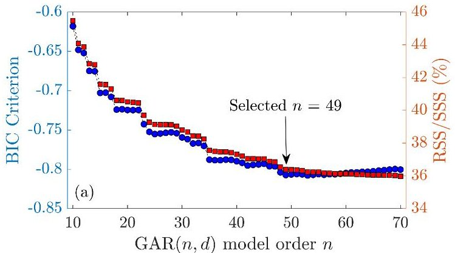

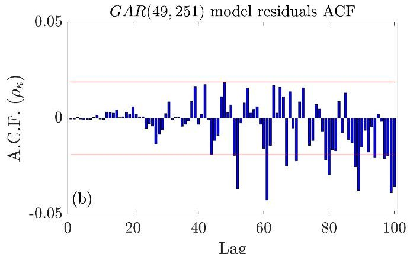

GAR model based spectrum estimation

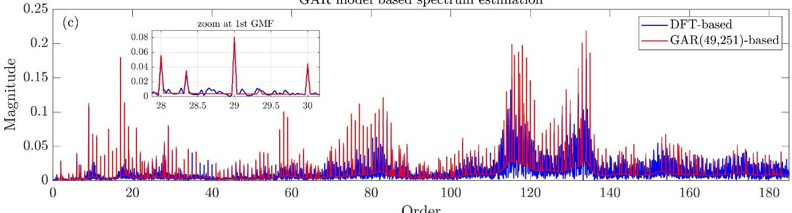

Figure 7. GAR model identification procedure for stage 1 (fault detection): (a) GAR(n,d) model order n selection via the BIC criterion (blue line) and corresponding residuals sum of squares to series sum of squares (RSS/SSS) values (red line) for an indicative signal of the training phase (400 rpm and 0% load level). (b) Model validation via the residual auto correlation function (ACF) at a 95% confidence level. (c) DFT-based (blue) and GAR model-based (red) spectra comparison.

For the deep AE-based method, the optimal model architecture is selected using all available vibration signals from the healthy state of the OSG (see Table 2), which were split into the training and validation datasets comprising 75% and 25% of the signals, respectively. Training is conducted for 60 epochs with the Adam optimizer, with a learning rate of $ 1\times 10^{-3} $ and a batch size of 16, while the MSE was used as the loss function. The deep AE architecture consists of seven layers with the following structure: input (size 12,289 by 2)—flatten—hidden (24,578 units)—bottleneck (64 units)—bottleneck (64 units)—hidden (24,578 units)—output (size 12,289 by 2). The two bottleneck layers correspond to the output of the encoder and the input of the decoder, respectively. All hidden layers use rectified linear unit (ReLU) activation functions, while the output layer used a linear activation function.

<!-- PDF_PAGE: 23 -->

Table 5. Fault detection: details on the training phase of the MM-GAR-based method.

<table border="1"><tr><td>Fault Detection Method</td><td>No. of “Healthy Subspace” Models</td><td>Design Parameter</td><td>Search Interval</td><td>Selected Model</td><td>Condition Number</td><td>BIC</td></tr><tr><td rowspan="3">MM-GAR</td><td rowspan="3">315</td><td>AR order(n)</td><td>[10,1500]</td><td rowspan="3">GAR(49,251)</td><td rowspan="3">$1.24\times10^{5}$</td><td rowspan="3">$-0.82$</td></tr><tr><td>Lasso tuning parameter(λ)</td><td>[$10^{-4},10^{-2}$]</td></tr><tr><td>No. of sinusoidal components(d)</td><td>[0,500]</td></tr></table>

All vibration signals are preprocessed prior to training. In particular, each signal is denoised by subtracting its mean, followed by the use of a second-order Butterworth filter in the range of 1-1400 Hz, and subsequently transformed to a 12,289-length frequency representation via fast Fourier transform (FFT), which serves as the input to the deep AE. It should be noted that the experimental signals are also angularly resampled based on the tachometer signal prior to applying the rest of the processing methods.

The autoencoder training and validation curves can be seen in Figure 8, in which each semi-transparent line corresponds to an autoencoder model, while the solid lines with markers correspond to the mean loss between an ensemble of 10 autoencoders, with the aim of achieving increased robustness in the predictions.

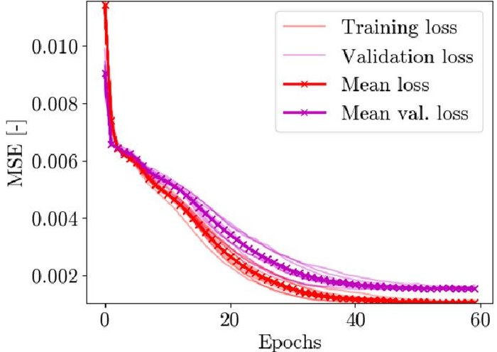

Figure 8. Autoencoder ensemble training curves. The individual autoencoder training and validation loss are shown in semi-transparent red and magenta lines, while the mean training and validation loss is shown in solid red and magenta lines with markers.

Inspection (detection) phase: Each vibration signal from 520 test cases of the inspection phase (see Table 3) is treated as originating from an unknown health state.

For the MM-GAR-based method, after angular resampling, for each signal a new GAR(49,251) model $ m_{u} $ is estimated and its distance to the healthy subspace is computed via the Q metric (Equation (3)). The detection results are presented in Figure 9, where subplot (a) shows the distribution of the Q metric across all inspection test cases, and subplot (b) the corresponding ROC curves. The separation between healthy and faulty states is evident, and the ROC curves confirm the high fault detection capability of the MM-GAR method under varying operating conditions, with the method achieving more than 99% TPR at 5% FPR for all fault scenarios considered.

<!-- PDF_PAGE: 24 -->

Fault Detection Results: MM-GAR based method

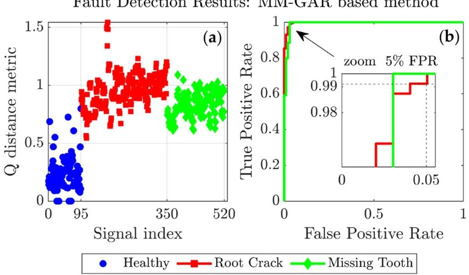

Figure 9. Fault detection results based on the MM-GAR method: (a) plot of the distance metric Q and (b) corresponding ROC curves; 95 inspection test cases for the healthy OSG and 425 for the faulty OSG, 255 cases for the root crack fault and 170 for the missing tooth fault, 520 in total.

The deep AE-based fault detection results are shown in Figure 10. In Figure 10a, the reconstruction error (residuals) between the original and reconstructed signals is presented via the MSE for all 520 test cases of the inspection phase dataset. As shown by the corresponding ROC curves in Figure 10b, fault detection is achieved with an accuracy of roughly 95% for the root crack fault and 100% for the missing tooth fault at 5% FPR, proving that the method can reliably detect faults across the considered range of OCs. Performance is slightly reduced for the root crack fault scenario relative to the MM-GAR-based method, although it maintains its overall effectiveness.

Fault Detection Results: Deep AE based method

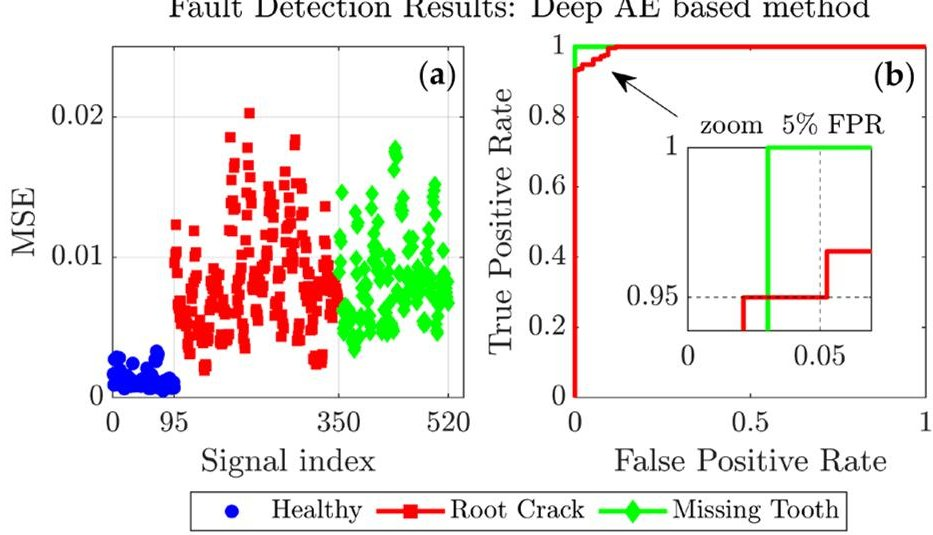

Figure 10. Autoencoder fault detection results. (a) plot of the reconstruction MSE and fault detection threshold (solid black line) and (b) corresponding ROC curves; 95 inspection test cases for the healthy OSG and 425 for the faulty OSG, 255 cases for the root crack fault and 170 for the missing tooth fault, 520 in total.

## 4.3. Fault Identification Results

Baseline (training) phase: In this phase, 945 vibration signals $ ( R_{2}^{1} ) $ , comprising 45 experimental signals, 450 MBD-based simulations, and 450 surrogate-based realizations obtained from the root crack fault state and 630 signals $ ( R_{2}^{2} ) $ , comprising 30 experimental signals, 300 MBD-based simulations, and 300 surrogate-based realizations, obtained from the missing tooth fault state are utilized for the methods' training. The signals are collected under varying operating conditions, specifically at five distinct rotational speeds, 400, 500, 600, 700, and 800 rpm, and three load levels, 0%, 25% and 50% (see Table 6 for details).

<!-- PDF_PAGE: 25 -->

Table 6. Fault-type identification: details on the training phase of the MM-GAR based method.

<table border="1"><tr><td>Fault Type</td><td>No. of“Fault-Type Subspaces”Models</td><td>Design Parameter</td><td>Search Interval</td><td>Selected Model</td><td>Condition Number</td><td>BIC</td></tr><tr><td rowspan="3">Root Crack</td><td rowspan="3">945</td><td>AR order(n)</td><td>[10,1500]</td><td rowspan="3">GAR(61,281)</td><td rowspan="3">$7.41\times10^{6}$</td><td rowspan="3">0.52</td></tr><tr><td>Lasso tuning parameter(λ)</td><td>[$10^{-4},10^{-2}$]</td></tr><tr><td>No.of sinusoidal components(d)</td><td>[0,500]</td></tr><tr><td rowspan="3">Missing Tooth</td><td rowspan="3">630</td><td>AR order(n)</td><td>[10,1500]</td><td rowspan="3">GAR(53,250)</td><td rowspan="3">$3.54\times10^{5}$</td><td rowspan="3">-2.01</td></tr><tr><td>Lasso tuning parameter(λ)</td><td>[$10^{-4},10^{-2}$]</td></tr><tr><td>No.of sinusoidal components(d)</td><td>[0,500]</td></tr></table>

For the MM-GAR-based method, the MM representation $ M_{j} $ of the faulty DS dynamics ("fault-type subspace") for each fault type $ (j=1,\dots,f $ and $ f=2) $ , under the considered operating conditions, consists of 945 GAR models for the root crack fault state and 630 GAR models for the missing tooth fault state, based on the available angularly resampled vibration signals. The sinusoidal components are determined, as in stage 1, via the LASSO-based elimination procedure, and the utilization of angularly resampled vibration signals ensures that all individual GAR models within each $ M_{j} $ share the same cyclical frequencies. Details on the training phase of the fault type identification stage are presented in Table 6.

For the deep CNN-based method, the available signals from each fault type $ R_{2}^{1} $ and $ R_{2}^{2} $ are split into a training and validation set, consisting of 75% and 25% of the signals, respectively, and were used to train an ensemble of 10 CNNs. Each CNN was trained over 10 epochs, with a batch size of 64, using the Adam optimizer with its default parameters and the categorical cross-entropy loss function. The CNN architecture consists of eight layers with the following structure: 1D convolution (32 filters, kernel length = 4) average pooling (size 8) batch normalization-ReLU activation-flatten-hidden (4 units) dropout (5%) output (2 units). The hidden layer uses a linear activation function, while the output layer uses SoftMax.

As the number of network parameters increases due to the filters of the convolutional layer, leading to increased training time, the signals, following the preprocessing previously described for the deep AE, are further trimmed to selected frequency bins. More specifically, the used bins are in the range $ [ i \cdot GMF-2 \cdot \omega_{s}, i \cdot GMF+\cdot \omega_{s} ] $ , where $ i=1,\dots,4 $ and $ \omega_{s} $ is the shaft rotation speed.

While, for the sake of brevity, the training curves are not explicitly shown here, an early stopping criterion is used to stop training once the validation loss is minimized, with the aim of improving the deep CNN's generalization performance and avoiding overfitting and bias, which is critical, especially in cross-domain applications. A shallow and small network has been established, as simpler architectures with a relatively small number of parameters tend to generalize better in such applications [70,71].

Inspection (identification) phase: Each vibration signal from 425 test cases in the inspection phase (see Table 3) is, in this stage, used for fault type identification. During the inspection phase, each stage is evaluated independently based on all available test cases, regardless of the performance of previous stages. Misclassifications from Stage 1 are not considered in Stage 2 in order to assess each stage's representative performance and to

<!-- PDF_PAGE: 26 -->

provide a common basis of comparison for all methods in the postulated fault diagnosis CM framework.

For the MM-GAR-based method, for each signal, a new GAR(61,281) and GAR(53,251) model $ m_{u,j} $ is estimated, for the root crack and missing tooth subspaces, respectively, and their distance to each fault-type subspace is computed via the $ D_{j} $ metric (Equation (6)), based on which fault type identification (Section 2.2.1) is achieved.

The fault type identification results are presented in Figure 11 through a confusion matrix, where it is evident that a clear separation between the two fault types is achieved, with overall accuracy exceeding 95%. Missing tooth faults are correctly identified in 93.1% of the cases, while root crack faults are correctly classified in 98.8% of the cases. Misclassifications are limited to only 4.9% of the total inspection test cases, which confirms the robustness of the proposed MM-GAR-based method for fault type identification under varying operating conditions.

Fault Type Identification Results: MM-GAR based method

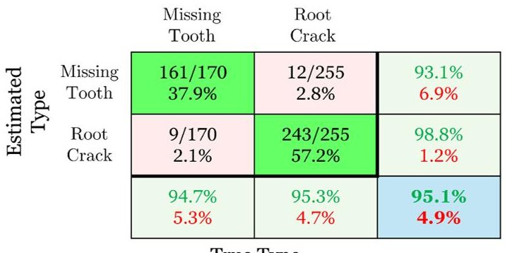

True Type

Figure 11. Fault type identification results of the MM-GAR-based method via confusion matrix; correct identification is indicated by green color and misidentification by red (425 inspection test cases/signals in total).

The deep CNN-based fault identification results are shown in the confusion matrix of Figure 12. As indicated by the confusion matrix, the deep CNN-based method achieves an overall accuracy of 90.3% ,with the missing tooth faults being correctly identified in 90.1% of the cases while the root crack faults are correctly identified in 90.5% of the cases. An overall misclassification error of 9.7% is observed for the total dataset.

Fault Type Identification Results: Deep CNN based method

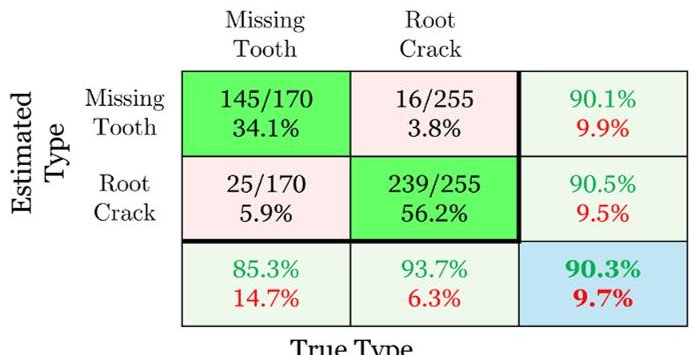

Figure 12. Fault type identification results of the deep CNN-based method via confusion matrix; correct identification is indicated by green color and misidentification by red (425 inspection test cases/signals in total).

## 4.4. Fault Severity Characterization Results

Baseline (training) phase: In this phase, a total of 1575 vibration signals, comprising 15 experimental signals, 150 MBD-based simulations, and 150 surrogate-based realizations obtained from each severity level of each fault type (root crack and missing tooth), are utilized for the methods' training $ R_{3}^{j,z}=315 $ ,with j= [12] and z= [123]). The signals are

<!-- PDF_PAGE: 27 -->

collected under varying operating conditions, specifically at five distinct rotational speeds, 400, 500, 600, 700, and 800 rpm, and three load levels, 0%, 25% and 50% (see Table 2 for details).

For the MM-GAR-based method, the MM representation $ M_{j}^{z} $ of the faulty DS dynamics ("fault severity-level subspace") for each fault severity level and fault type under the considered operating conditions consists of 315 GAR models, based on the available angularly resampled vibration signals.

As described previously (see Sections 4.2 and 4.3), all individual GAR models within each $ M_{j}^{2} $ share the same cyclical frequencies. Details on the training phase of the fault severity characterization stage and the identified GAR models for each "fault severity-level subspace" are presented in Table 7.

Table 7. Fault severity characterization: details on the training phase of the MM-GAR-based method.

<table border="1"><tr><td>Fault Type</td><td>Fault Severity Level</td><td>No. of“Fault Severity-Level Subspaces”Models</td><td>Selected Model</td><td>Condition Number</td><td>BIC</td></tr><tr><td rowspan="3">Root Crack</td><td>RC1</td><td>315</td><td>GAR(50,251)</td><td>$7.41\times10^{6}$</td><td>$-0.68$</td></tr><tr><td>RC2</td><td>315</td><td>GAR(44,281)</td><td>$1.11\times10^{6}$</td><td>$0.37$</td></tr><tr><td>RC3</td><td>315</td><td>GAR(61,223)</td><td>$2.61\times10^{5}$</td><td>$-0.52$</td></tr><tr><td rowspan="2">Missing Tooth</td><td>MT1</td><td>315</td><td>GAR(49,211)</td><td>$1.80\times10^{6}$</td><td>$0.22$</td></tr><tr><td>MT2</td><td>315</td><td>GAR(53,250)</td><td>$3.39\times10^{7}$</td><td>$0.78$</td></tr></table>

For the deep CNN-based method, the 945 root crack signals and the 630 missing tooth signals were split into a training and validation set, consisting of 75% and 25% of the signals, respectively, and were used to train an ensemble of 10 CNNs. Each CNN has been trained over 20 epochs, with a batch size of 32, once again using the Adam optimizer and the categorical cross-entropy loss function. The CNN architecture here is slightly different compared to the one used for fault identification. Specifically, each CNN consists of eight layers with the following structure: 1D convolution (64 filters, kernel length = 4) average pooling (size 8) batch normalization—ReLU activation—flatten—hidden (4 units) dropout (5%) output (2 and 3 units). The hidden layer uses a linear activation function, while the output layer uses SoftMax, with two units for the missing tooth case and three units for the root crack case. The training signals have undergone the same preprocessing as in the fault identification stage.

Inspection (fault severity characterization) phase: Each vibration signal from 425 test cases in the inspection phase (see Table 3) is, in this stage, used for fault severity characterization. As for the previous stage, in the inspection phase of Stage 3, all available test cases are utilized, not considering any misclassifications that occurred during Stage 2.

In the MM-GAR-based method, for each new signal, a model $ m_{u,j}^{z} $ is estimated for each fault severity level with the same order as the GAR models in the corresponding $ M_{j}^{z} $ . Its distance to each fault severity level subspace is then computed via the $ L_{z} $ metric (Equation (8)), based on which fault severity characterization is achieved (also see Section 2.2.1).

The severity characterization results are presented in Figure 13 using confusion matrices, similar to the previous stage of CM, with each column of the confusion matrix (except the rightmost) corresponding to the actual severity level of the investigated fault, and each row representing the predicted one. The cell at the bottom right indicates the total correct characterization rate (accuracy) and false characterization rate across the severity levels. It is observed that the fault severities for both fault types are clearly separated, with an

<!-- PDF_PAGE: 28 -->

overall accuracy exceeding 93%. Missing tooth fault severities are correctly estimated in 97.1% of the cases, while root crack fault severities are correctly classified in 93.3% of the cases. Misclassifications are limited to only 2.9% and 6.7% of the total dataset, respectively, highlighting the superior fault-severity prediction performance of the proposed MM-GAR framework across varying operating conditions.

Fault Severity Characterization Results: MM-GAR based method

<table border="1"><tr><td></td><td></td><td>RC1</td><td>RC2</td><td>RC3</td><td></td></tr><tr><td rowspan="4">Estimated Severity</td><td>RC1</td><td>81/8531.8%</td><td>5/852.0%</td><td>4/851.6%</td><td>90.0%10.0%</td></tr><tr><td>RC2</td><td>4/851.6%</td><td>80/8531.4%</td><td>4/851.6%</td><td>90.9%9.1%</td></tr><tr><td>RC3</td><td>0/850%</td><td>0/850%</td><td>77/8530.2%</td><td>100%0%</td></tr><tr><td></td><td>95.3%4.7%</td><td>94.1%5.9%</td><td>90.6%9.4%</td><td>93.3%6.7%</td></tr></table>

True Severity

<table border="1"><tr><td></td><td>MT1</td><td colspan="2">MT2</td></tr><tr><td>MT1</td><td>84/8549.4%</td><td>4/852.3%</td><td>95.5%4.5%</td></tr><tr><td>MT2</td><td>1/850.6%</td><td>81/8547.7%</td><td>98.8%1.2%</td></tr><tr><td></td><td>98.8%1.2%</td><td>95.3%4.7%</td><td>97.1%2.9%</td></tr><tr><td colspan="4">True Severity</td></tr></table>

Figure 13. Fault severity characterization results of the MM-GAR-based method via confusion matrices: (a) root crack severity characterization and (b) missing tooth severity characterization; correct identification is indicated by green color and mischaracterization by red (255 inspection signals for root crack, 170 for missing tooth).

The fault severity characterization results of the deep CNN-based method are presented in the confusion matrices of Figure 14. The method achieves an overall accuracy of 89.4% in estimating the severity of the root crack faults and 90% for missing tooth faults. The misclassification error is nearly 10% for both fault types, indicating the accuracy of the deep CNN-based method and its robustness in estimating the severity of a fault, given an identified fault type, under varying operating conditions.

Fault Severity Characterization Results: Deep CNN based method

<table border="1"><tr><td rowspan="6">Estimated Severity</td><td></td><td>RC1</td><td>RC2</td><td>RC3</td><td></td></tr><tr><td>RC1</td><td>72/8528.2%</td><td>1/850.4%</td><td>4/851.5%</td><td>93.5%6.5%</td></tr><tr><td>RC2</td><td>6/852.4%</td><td>78/8530.6%</td><td>3/851.2%</td><td>89.7%10.3%</td></tr><tr><td>RC3</td><td>7/852.7%</td><td>6/852.4%</td><td>78/8530.6%</td><td>85.7%14.3%</td></tr><tr><td></td><td>84.7%15.3%</td><td>91.7%8.3%</td><td>91.7%8.3%</td><td>89.4%10.6%</td></tr></table>

True Severity

<table border="1"><tr><td></td><td>MT1</td><td colspan="2">MT2</td></tr><tr><td>MT1</td><td>78/8545.9%</td><td>10/855.9%</td><td>88.6%11.4%</td></tr><tr><td>MT2</td><td>7/854.1%</td><td>75/8544.1%</td><td>91.5%8.5%</td></tr><tr><td></td><td>91.7%8.3%</td><td>88.2%11.8%</td><td>90.0%10.0%</td></tr><tr><td colspan="4">True Severity</td></tr></table>

Figure 14. Fault severity characterization results of the deep CNN-based method via confusion matrices: (a) root crack severity characterization and (b) missing tooth severity characterization; correct identification is indicated by green color and mischaracterization by red (255 inspection signals for root crack, 170 for missing tooth).

## 4.5. RUL Estimation Results

Baseline (training) phase: The R = 5 baseline run-to-failure simulation procedures corresponding to five distinct speeds, as listed in Table 4, are employed for the training of the RUL estimation method described in Section 2.3. For each run-to-failure (r = 1,...,5) and for every monitoring time instant $ \tau_{j}=j\cdot\Delta\tau $ for j=1,..., $ m_{r} $ with $ m_{r}=\{195,182,175,164,156\} $ (see Table 4), a GAR(42,269) model is estimated from the corresponding vibration signal,

<!-- PDF_PAGE: 29 -->

while the GAR-based health indicator (HI) representing the degradation level at each instant is obtained via Equation (16).

The evolution of the GAR-based HI trajectories obtained from all run-to-failure procedures under the five distinct speeds are presented in Figure 15. As shown in Figure 15a, the HI increases in the same manner throughout the operating lifetime for all baseline run-to-failure procedures, demonstrating its consistency across all considered speed conditions. Figure 15b presents the monotonicity, trendability, and prognosability metrics [44] of the GAR-based HI. Monotonicity quantifies how consistently the HI increases over time within each run-to-failure experiment, trendability measures the similarity of the degradation trajectory across different run-to-failure experiments, and prognosability evaluates the variability of the HI at the end-of-life point between different run-to-failure experiments. As shown, the values of these metrics are close to unity, which confirms the consistency of the proposed GAR-based HI across the five different speeds.

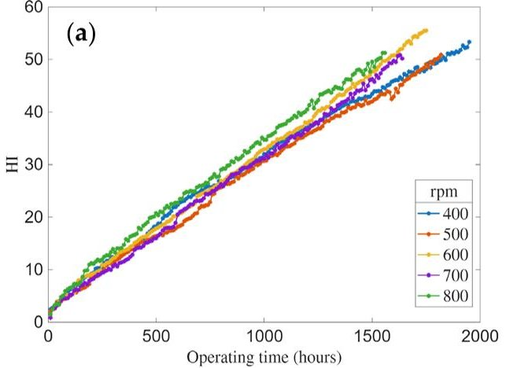

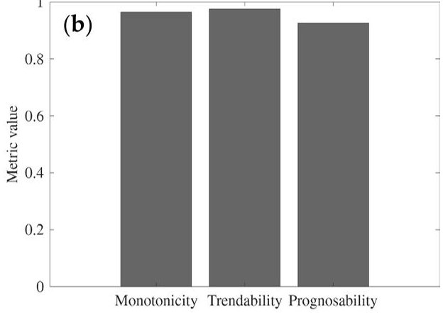

Figure 15. GAR-based HI construction in the baseline phase: (a) HI trajectories obtained from the five run-to-failure experiments under different operating speeds, (b) monotonicity, trendability, and prognosability metrics.

The obtained GAR-based HI trajectories from the five baseline run-to-failure procedures are employed for the offline parameters' estimation of the linear Wiener model, which is achieved via maximum likelihood estimation, as mentioned in Section 2.3. The EoL threshold is determined as w=50 based on Equation (17) using the GAR-based HI trajectories obtained from the five baseline run-to-failure procedures, and is subsequently adopted for the Wiener-based RUL estimation. All baseline model estimation details, including the GAR model orders and Wiener initialization parameters, are summarized in Table 8.

Inspection (RUL estimation) phase: The R = 5 run-to-failure procedures of the inspection phase, comprising a total of 862 inspection vibration signals across all five speeds (Table 4), are used for the performance assessment of the RUL estimation method. For each run-to-failure, RUL estimation is performed sequentially by recursively updating the Wiener model parameters as a new vibration signal becomes available at each monitoring time instant, following the procedure described in Equations (20)-(23). Once each update of the Wiener model is performed (also see Equation (20)), the RUL estimate along with its 95% confidence bounds at each operating time instant are obtained through Equations (22) and (23).

The results of the RUL estimation method that relies on the linear Wiener model of Equation (18) and the novel HI extracted from the special GAR model (refer to Equations (1) and (19)) are presented in Figure 16. As shown in plots (a.1)-(e.1) of the upper row in Figure 16, the estimated RUL trajectories closely match the true remaining lifetime across all considered speeds, even from the early stages of operation. The

<!-- PDF_PAGE: 30 -->

confidence bounds remain consistently narrow, especially near the EoL, indicating that the dynamics-informed GAR-based HI, with its consistent trajectory, provides a reliable representation of the OSG degradation evolution over the operating time under varying operating speeds. This is also confirmed by the corresponding normalized RUL estimation error, depicted in the lower plots, which remains below 20% throughout the operational range and steadily decreases as the OSG approaches the end of its lifetime. Overall, these results demonstrate that the proposed RUL method is accurate and robust to different speeds of RUL estimates from the early stages of the OSG operating lifetime, which also underscores the importance of a consistent, dynamics-informed HI extracted from the GAR models.

Table 8. RUL estimation: details on the baseline models of the RUL estimation method.

<table border="1"><tr><td></td><td colspan="6">GAR Model</td></tr><tr><td>Design Parameter</td><td>Search Interval</td><td>Estimation Method</td><td>Estimated Model</td><td>Parameter Vector Dimensionality</td><td>Mean Condition Number*</td><td>Mean BIC*</td></tr><tr><td>AR order(n)</td><td>[2,400]</td><td></td><td></td><td></td><td></td><td></td></tr><tr><td>Lasso tuning parameter(λ)</td><td>[10-4,10-2]</td><td>Ordinary Least Squares(OLS)</td><td>GAR(42,269)</td><td>580</td><td>4.39×105</td><td>-5.13</td></tr><tr><td>No. of sinusoidal components(d)</td><td>[0,500]</td><td></td><td></td><td></td><td></td><td></td></tr></table>

## Wiener model

Wiener model type: Linear; Estimation method: Maximum-likelihood (MLE) (fminsearch.m); Threshold: $ w=50 $ Parameters initialization: $ \hat{\mu}_{a}=0.026,\hat{\sigma}_{a}^{2}=4.92\times 10^{-6},\hat{\phi}=5.26,\sigma_{B}^{2}=5.97\times 10^{-3} $

$ ^{*} $ Mean value based on all 872 vibration signals of the baseline phase (refer to Table 4).

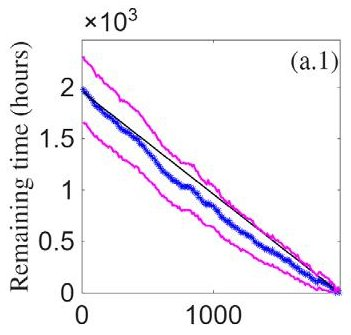

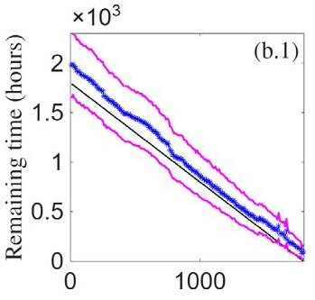

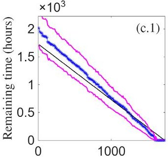

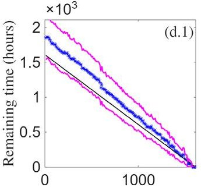

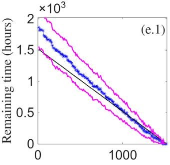

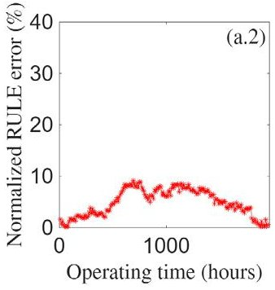

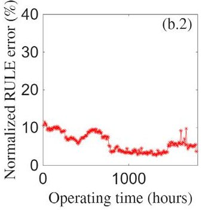

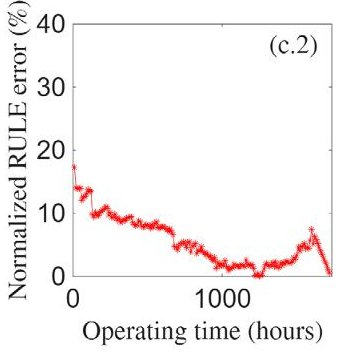

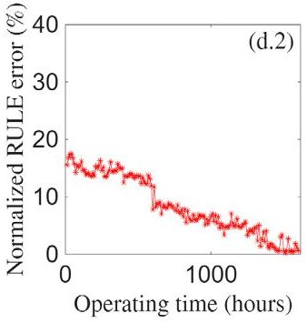

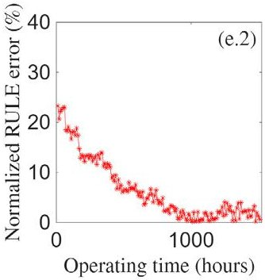

Figure 16. RUL estimation trajectories and the corresponding normalized RUL estimation errors as functions of operating time under different operating speeds (inspection phase). The plots in the first to fifth columns correspond to operating speeds of 400,500,600,700,and 800 rpm, respectively. Upper row (a.1-e.1) plots: estimated RUL (black line: true RUL; blue line: estimated RUL; magenta lines: 95% confidence bounds). Lower row (a.2-e.2) plots: normalized RUL estimation error expressed as a percentage of the total lifetime （ 100% $ \cdot $ $ \mid $ RUL-R $ \hat{U} L $ $ \mid $ $ \tau_{EoL} $ ）.

<!-- PDF_PAGE: 31 -->

## 4.6. Decision Fusion Results

The results obtained from the methods used at each stage are utilized in this section for the decision fusion framework according to Section 2.4 for enhanced fault diagnosis results and a collective assessment of the holistic CM platform's framework. At each stage, the fusion results rely on the integration of the results of the employed methods, which demonstrate robustness to operating uncertainty and achieve high performance rates across all stages.

The fused results for all stages are shown in Figure 17, through subplots (a)-(c). In Figure 17a, fault detection fusion results based on the hard voting fusion approach demonstrate exceptional performance, achieving an incredible accuracy of 99.8% with only one misclassification, exceeding the accuracies achieved by each method separately (95.8% for the MM-GAR and 92.3% for the AE) and thereby showcasing significant improvement and the complementarity of the methods. In Figure 17b, the fault type identification fusion results are presented. After the MM-GAR method's probabilities are obtained based on the BCTS Softmax function, soft voting with equal weights is used to determine the final prediction, resulting in 99.6% and 95.3% correct classifications for the missing tooth and root crack fault scenarios, respectively. The BCTS parameters are determined using a validation dataset comprising all available experimental vibration signals from the baseline phase (see Table 2) at each stage. The overall accuracy for the fused fault type identification results is 97.8% (rightmost bottom cell), a significant improvement when compared to each method's individual performance. Finally, the fault severity characterization results are presented in Figure 17(c1,c2) for the root crack and missing tooth fault scenarios, respectively. For the root crack severities, an overall accuracy of 96.9% is achieved with most misclassifications occurring in RC3, while an accuracy of 98.8% is achieved for the missing tooth severities, with only two misclassifications from MT2. Overall, the fault severity characterization fusion results showcase the clear separation across all severity levels for all fault types, and further validate the capabilities of the employed decision fusion framework, across all diagnosis stages.

(a) Fault Detection Results: Fusion

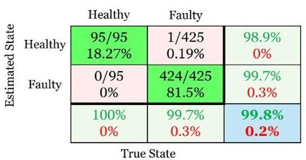

(b) Fault Type Identification Results : Fusion

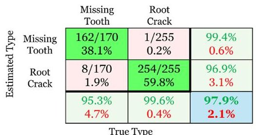

(c) Fault Severity Characterization Results: Fusion

(c1) Root Crack (c2) Missing Tooth

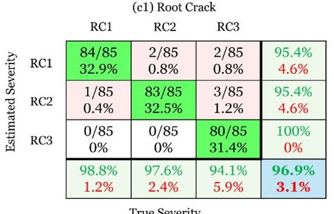

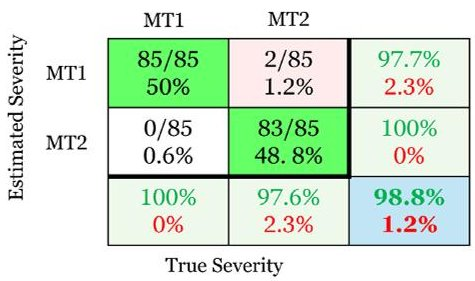

Figure 17. Decision fusion results via confusion matrices: (a) fault detection results, (b) fault type identification results, (c1) root crack severity characterization results, and (c2) missing tooth severity characterization results; correct identification is indicated by green color and misidentification by red (95 inspection signals for the healthy state, 425 for the faulty state. Total of 255 test cases for root crack and 170 for missing tooth, with 85 inspection test cases per severity level).

<!-- PDF_PAGE: 32 -->

## 5. Discussion on the Results

The systematic assessment of the novel EEDRIVEN AI digital platform confirms its robust and high-performance CM capabilities across a wide range of OCs, as is evidenced by the results presented above. The developed CM framework demonstrates consistently high performance across all fault diagnosis stages—fault detection, fault type identification, and fault severity characterization—as well as RUL estimation. A key point to this achievement is the data augmentation procedure, through which the initially limited experimental training dataset is enriched by vibration signals generated via an MBD model and data-driven surrogate models. These high-fidelity simulations provide a highly accurate alternative to unavailable experimental signals during training, enabling the effective and robust training of all developed methods. This allowed for a fully experimental validation of the AI platform in the inspection phase, ensuring a realistic assessment across all three diagnostic stages.

The diagnostic results demonstrate the MM-GAR method's overall superior performance and complementary relationship with the deep learning approaches, specifically the deep AE-based method used in the fault detection stage, as well as the deep CNNs utilized in the fault type identification and fault severity characterization stages. In stage 1 (fault detection), the MM-GAR method achieved near-perfect separation between healthy and faulty states, while the deep AE-based method attained excellent detection for the missing tooth and very good detection of root crack fault scenarios. In stage 2 (fault-type identification), the MM-GAR method exceeded 95% overall accuracy, whereas the CNN-based one attained 90%. In stage 3 (severity characterization), the MM-GAR method achieved 97.1% for the missing tooth and 93.3% for the root crack, whereas the CNN reached 90% and 89.4%, respectively.

Although both methods demonstrated high individual performance, the developed decision fusion methodology effectively complemented their capabilities, mitigating most misclassifications and yielding near-perfect results in all diagnosis stages. More specifically, hard voting in stage 1 yielded 99.8% accuracy with only one misclassification. Soft voting achieved 97.8% overall accuracy in stage 2 (99.6% root crack, 95.3% missing tooth) and 98.8% (missing tooth) and 96.9% (root crack) in stage 3, considering all severities within each fault scenario. These exemplary results confirm that the fusion methodology successfully leverages the complementary strengths of each method, substantially reducing misclassifications and ensuring a highly reliable end-to-end diagnosis.

Furthermore, the MM-GAR method addresses the vital need for transparency and interpretability in CM. Its explicit parametric nature provides clear insights into the decisionmaking process, directly relating model parameters to the DS dynamics, which fundamentally enhances trust and explainability compared to the 'black-box' nature of deep learning models.

The RUL estimation results confirm the robustness and accuracy of the developed method under varying operating speeds. The dynamics-informed GAR-based HI enables, through its consistent trajectory, an accurate representation of the degradation evolution via a simple linear Wiener process model with straightforward parameter estimation, yielding RUL estimates that accurately follow the true remaining lifetime with narrow confidence bounds and normalized errors below 20% across the five considered speeds. These results highlight the importance of employing dynamics-informed HIs, such as those extracted from the advanced GAR models, in achieving a physically interpretable, computationally efficient, and robust RUL estimation framework within the EEDRIVEN AI-based CM platform.

Overall, the developed comprehensive and unified framework demonstrates high effectiveness in all CM stages. The critical limitations of contemporary CM methodologies

<!-- PDF_PAGE: 33 -->

are successfully addressed by mitigating the need for extensive experimental datasets and providing the necessary transparency and efficiency in the prognostic and diagnostic assessment of DSs under varying OCs.

## 6. Conclusions

An AI digital platform for fault diagnosis and remaining useful life (RUL) estimation in critical components of drivetrain systems under varying operating conditions has been presented. The platform has been developed within the "EEDRIVEN" project, offering a comprehensive and unified condition monitoring framework by incorporating: (i) data augmentation through optimal multibody dynamics and surrogate models, (ii) novel statistical time series and deep learning approaches, and (iii) a decision fusion methodology.

The platform's performance has been rigorously evaluated through hundreds of experiments with a drivetrain system operating under varying speed and load conditions, and gear faults of different types and severities. The results demonstrate near-perfect fault detection and $ \geq 96.9\% $ accuracy in both fault type identification and severity characterization, even for early-stage faults, as well as accurate RUL estimation of the outer gear from very early operating times, despite the platform's training on a minimal number of experimental vibration signals. Overall, the AI digital platform delivers an integrated, data-efficient, and physically interpretable CM framework that supports confident and timely maintenance decision-making.

Despite the promising performance of the platform, its broader applicability is considered to warrant further investigation. Future work will be focused on validating the platform in more complex machinery contexts, including setups with additional fault scenarios such as pitting, spalling, and others. Furthermore, the scope of operational variability studied is planned to be expanded to include different types of fluctuation (e.g., random), and a wider range of operating conditions, such as temperature and lubrication status.

Author Contributions: Conceptualization, D.M.B., X.D.K., J.S.S., D.G. and J.K.; methodology, D.M.B., X.D.K., J.S.S., I.A.I., D.G. and J.K.; software, D.M.B., X.D.K., I.A.I. and J.K.; validation, D.M.B., X.D.K., I.A.I. and J.K.; formal analysis D.M.B., X.D.K., I.A.I. and J.K.; investigation, D.M.B., X.D.K., I.A.I., J.S.S., D.G. and J.K.; resources, D.M.B., X.D.K., P.E.S., I.E.S., J.S.S., D.G., J.K., G.K. and P.S.; data curation, D.M.B., X.D.K., I.A.I., D.G., G.K. and J.K.; writing—original draft preparation, D.M.B., X.D.K., I.A.I. and J.K.; writing—review and editing, J.S.S., D.G., K.K., S.D.F. and S.N.; visualization, J.S.S. and D.G.; supervision, J.S.S., S.D.F., D.G. and S.N.; project administration, J.S.S., S.D.F., D.G. and S.N.; funding acquisition, J.S.S., S.D.F. and D.G. All authors have read and agreed to the published version of the manuscript.

Funding: This study has been carried out as part of the 'EEDRIVEN' project implemented in the framework of the H.F.R.I call Basic Research Financing (Horizontal support of all Sciences) under the National Recovery and Resilience Plan 'Greece 2.0' funded by the European Union—NextGenerationEU (H.F.R.I. Project Number 16381).

Data Availability Statement: Data will be made available on request.

Conflicts of Interest: The authors declare no conflicts of interest.

## Abbreviations

The following abbreviations are used in this manuscript:

AI Artificial Intelligence

AE Autoencoder

AR Autoregressive

<!-- PDF_PAGE: 34 -->

ARX Autoregressive with Exogenous input

ARMA Autoregressive Moving Average

ARMAX Autoregressive Moving Average with Exogenous input

BIC Bayesian Information Criterion

BCTS Bias Corrected Temperature Scaling

CM Condition Monitoring

CNN Convolutional Neural Network

DS Drivetrain System

EoL End of Life

FFT Fast Fourier Transform

FPR False Positive Rate

GAR Generalized Autoregressive

GMF Gear Meshing Frequency

HI Health Indicator

LPV Linear Parameter Varying

LSTM Long Short Term Memory

LASSO Least Absolute Shrinkage Selection Operator

MM Multiple Model

MBD Multibody Dynamics

MSE Mean Square Error

NN Neural Network

OLS Ordinary Least Squares

OC Operating Condition

RUL Remaining Useful Life

ROC Receiver Operating Characteristic

RMS Root Mean Square

RSS Residual Sum of Squares

STS Statistical Time Series

SSS Series Sum of Squares

TSA Time Synchronous Average

TVMS Time Varying Mesh Stiffness

TPR True Positive Rate

## References

1. Chen, J.; Lin, C.; Peng, D.; Ge, H. Fault Diagnosis of Rotating Machinery: A Review and Bibliometric Analysis. IEEE Access 2020, 8, 224985-225003. [CrossRef]

2. Feng, K.; Ji, J.C.; Ni, Q.; Beer, M. A review of vibration-based gear wear monitoring and prediction techniques. Mech. Syst. Signal Process. 2023, 182, 109605.

3. Kumar, A.; Gandhi, C.P.; Zhou, Y.; Kumar, R.; Xiang, J. Latest developments in gear defect diagnosis and prognosis: A review. Measurement 2020, 158, 107735. [CrossRef]

4. Bourdalos, D.M.; Sakellariou, J.S. A statistical time series model-based method for robust detection of incipient faults in rotating machinery under different operating conditions. Mech. Syst. Signal Process. 2025, 238, 113204. [CrossRef]

5. Lei, Y.; Zuo, M.J. Gear crack level identification based on weighted K nearest neighbor classification algorithm. Mech. Syst. Signal Process. 2009, 23, 1535-1547. [CrossRef]

6. Lei, Y.; Zuo, M.J.; He, Z.; Zi, Y. A multidimensional hybrid intelligent method for gear fault diagnosis. Expert Syst. Appl. 2010, 37, 1419-1430. [CrossRef]

7. Xie, J.; Zhang, L.; Duan, L.; Wang, J. On cross-domain feature fusion in gearbox fault diagnosis under various operating conditions based on Transfer Component Analysis. In Proceedings of the 2016 IEEE International Conference on Prognostics and Health Management (ICPHM), Ottawa, ON, Canada, 20-22 June 2016.

8. Tayyab, S.M.; Chatterton, S.; Pennacchi, P. Fault Detection and Severity Level Identification of Spiral Bevel Gears under Different Operating Conditions Using Artificial Intelligence Techniques. Machines 2021, 9, 173. [CrossRef]

9. Wang, D. K-nearest neighbors based methods for identification of different gear crack levels under different motor speeds and loads: Revisited. Mech. Syst. Signal Process. 2016, 70, 201-208. [CrossRef]

<!-- PDF_PAGE: 35 -->

10. Boškoski, P.; Juričić, D. Fault detection of mechanical drives under variable operating conditions based on wavelet packet Rényi entropy signatures. Mech. Syst. Signal Process. 2012, 31, 369-381. [CrossRef]

11. Tabrizi, A.; Garibaldi, L.; Fasana, A.; Marchesiello, S. Early damage detection of roller bearings using wavelet packet decomposition, ensemble empirical mode decomposition and support vector machine. Meccanica 2015, 50, 865-874.

12. Liu, R.; Yang, B.; Zio, E.; Chen, X. Artificial intelligence for fault diagnosis of rotating machinery: A review. Mech. Syst. Signal Process. 2018, 108, 33-47. [CrossRef]

13. Bachar, L.; Matania, O.; Cohen, R.; Klein, R.; Lipsett, M.G.; Bortman, J. A novel hybrid physical AI-based strategy for fault severity estimation in spur gears with zero-shot learning. Mech. Syst. Signal Process. 2023, 204, 110748. [CrossRef]

14. Ali, Y.; Tlija, M.; Shah, S.W.; Arif, A.; Siddiqi, M.R. Intelligent condition monitoring of gear system at variable load and variable speed using vibration data. Adv. Mech. Eng. 2025, 17, 16878132251364692. [CrossRef]

15. Shi, Y.; Deng, A.; Deng, M.; Xu, M.; Liu, Y.; Ding, X.; Bian, W. Domain augmentation generalization network for real-time fault diagnosis under unseen working conditions. Reliab. Eng. Syst. Saf. 2023, 235, 109188. [CrossRef]

16. Zhao, C.; Shen, W. A domain generalization network combing invariance and specificity towards real-time intelligent fault diagnosis. Mech. Syst. Signal Process. 2022, 173, 108990. [CrossRef]

17. Gao, T.; Yang, J.; Wang, W.; Fan, X. A domain feature decoupling network for rotating machinery fault diagnosis under unseen operating conditions. Reliab. Eng. Syst. Saf. 2024, 252, 110449. [CrossRef]

18. Xu, Y.; Chen, Y.; Zhang, H.; Feng, K.; Wang, Y.; Yang, C.; Ni, Q. Global contextual feature aggregation networks with multiscale attention mechanism for mechanical fault diagnosis under non-stationary conditions. Mech. Syst. Signal Process. 2023, 203, 110724. [CrossRef]

19. Liu, X.; Sun, W.; Li, H.; Li, Q.; Ma, Z.; Yang, C. Unknown working condition fault diagnosis of rotate machine without training sample based on local fault semantic attribute. Adv. Eng. Inform. 2024, 61, 102515. [CrossRef]

20. Zhang, M.; Wang, W.L.D.; Yang, J.; Li, Z.; Liang, B. A Deep Transfer Model with Wasserstein Distance Guided Multi-Adversarial Networks for Bearing Fault Diagnosis Under Different Working Conditions. IEEE Access 2019, 7, 65303-65318. [CrossRef]

21. Zhang, L.; Wang, B.; Liang, P.; Yuan, X.; Li, N. Semi-supervised fault diagnosis of gearbox based on feature pre-extraction mechanism and improved generative adversarial networks under limited labeled samples and noise environment. Adv. Eng. Inform. 2023, 58, 102211. [CrossRef]

22. Zhu, C.; Lin, W.; Zhang, H.; Cao, Y.; Fan, Q.; Zhang, H. Research on a Bearing Fault Diagnosis Method Based on an Improved Wasserstein Generative Adversarial Network. Machines 2024, 12, 587. [CrossRef]

23. Zhou, K.; Diehl, E.; Tang, J. Deep convolutional generative adversarial network with semi-supervised learning enabled physics elucidation for extended gear fault diagnosis under data limitations. Mech. Syst. Signal Process. 2023, 185, 109772. [CrossRef]

24. Wang, Z.; Xia, H.; Yin, W.; Yang, B. An improved generative adversarial network for fault diagnosis of rotating machine in nuclear power plant. Ann. Nucl. Energy 2023, 180, 109434. [CrossRef]

25. Han, P.; Huang, Z.; Li, W.; Zhou, J.; He, W.; Cao, Y. A new open set fault diagnosis method based on adversarial discrimination and deep evidential fusion under limited labeled samples. Adv. Eng. Inform. 2026, 69, 104016. [CrossRef]

26. Yan, S.; Shao, H.; Min, Z.; Peng, J.; Cai, B.; Liu, B. FGDAE: A new machinery anomaly detection method towards complex operating conditions. Reliab. Eng. Syst. Saf. 2023, 236, 109319. [CrossRef]

27. Niu, M.; Jiang, H.; Wu, Z.; Shao, H. An enhanced sparse autoencoder for machinery interpretable fault diagnosis. Meas. Sci. Technol. 2024, 35, 05108. [CrossRef]

28. Rao, M.; Zuo, M.J.; Tian, Z. A speed normalized autoencoder for rotating machinery fault detection under varying speed conditions. Mech. Syst. Signal Process. 2023, 189, 109109. [CrossRef]

29. Sakellariou, J.S. Chapter Twelve—Stochastic functionally pooled models for diagnostics and prognostics in engineering. In Stochastic Modeling and Statistical Methods; Academic Press: Cambridge, MA, USA, 2025; pp. 229-260.

30. Avendaño-Valencia, L.D.; Fassois, S.D. Damage/fault diagnosis in an operating wind turbine under uncertainty via a vibration response Gaussian mixture random coefficient model based framework. Mech. Syst. Signal Process. 2017, 91, 326-353. [CrossRef]

31. Bourdalos, D.M.; Sakellariou, J.S. Vibration-based unsupervised detection of common faults in rotating machinery under varying operating speeds. In Surveillance, Vibrations, Shock and Noise; Institut Supérieur de l'Aéronautique et de l'Espace: Toulouse, France, 2023.

32. Chen, Y.; Liang, X.; Zuo, M.J. Sparse time series modeling of the baseline vibration from a gearbox under time-varying speed condition. Mech. Syst. Signal Process. 2019, 134, 106342. [CrossRef]

33. Chen, Y.; Zuo, M.J. A sparse multivariate time series model-based fault detection method for gearboxes under variable speed condition. Mech. Syst. Signal Process. 2022, 167, 108539. [CrossRef]

34. Chen, Y.; Li, Z.; Jiang, Y.; Gong, D.; Zhou, K. Sparse LPV-ARMA model for non-stationary vibration representation and its application on gearbox tooth crack detection under variable speed conditions. Mech. Syst. Signal Process. 2025, 224, 112161. [CrossRef]

<!-- PDF_PAGE: 36 -->

35. Zhan, Y.; Mechefske, C.K. Robust detection of gearbox deterioration using compromised autoregressive modeling and Kolmogorov-Smirnov test statistic. Part II: Experiment and application. Mech. Syst. Signal Process. 2007, 21, 1983-2011. [CrossRef]

36. Wang, W.; Wong, A.K. Autoregressive model-based gear fault diagnosis. J. Vib. Acoust. 2002, 124, 172-179. [CrossRef]

37. Bourdalos, D.; Iliopoulos, I.; Sakellariou, J. On the Detection of Incipient Faults in Rotating Machinery Under Different Operating Speeds Using Unsupervised Vibration-Based Statistical Time Series Methods. Lect. Notes Civ. Eng. 2023, 254, 287-296.

38. Yang, M.; Makis, V. ARX model-based gearbox fault detection and localization under varying load conditions. J. Sound Vib. 2010, 329, 5209-5221. [CrossRef]

39. Lin, C.; Makis, V. Application of Vector Time Series Modeling and T-squared Control Chart to Detect Early Gearbox Deterioration. Int. J. Perform. Eng. 2014, 10, 105.

40. Li, X.; Zuo, H.; Hao, P.; Su, Y.; Liu, H.; Xue, C. Early Fault Detection of Gearbox Using TSA and VAR Model Considering Load Variation. In Proceedings of the 2021 Global Reliability and Prognostics and Health Management (PHM-Nanjing), Nanjing, China, 15-17 October 2021.

41. Zhou, Z.; Yang, J.; Xiang, S.; Qin, Y. Remaining Useful Life Prediction Methodologies with Health Indicator Dependence for Rotating Machinery: A Comprehensive Review. IEEE Trans. Instrum. Meas. 2025, 74, 3528519. [CrossRef]

42. Bagri, I.; Tahiry, K.; Hraiba, A.; Touil, A.; Mousrij, A. Vibration Signal Analysis for Intelligent Rotating Machinery Diagnosis and Prognosis: A Comprehensive Systematic Literature Review. Vibration 2024, 7, 1013-1062. [CrossRef]

43. Das, O.; Das Bagci, D.; Birant, D. Machine learning for fault analysis in rotating machinery: A comprehensive review. Heliyon 2023, 9, e17584. [CrossRef]

44. Lei, Y.; Li, N.; Guo, L.; Li, N.; Yan, T.; Lin, J. Machinery health prognostics: A systematic review from data acquisition to RUL prediction. Mech. Syst. Signal Process. 2018, 104, 799-834. [CrossRef]

45. Si, X.-S.; Wang, W.; Hu, C.-H.; Zhou, D.-H. Remaining useful life estimation-A review on the statistical data driven approaches. Eur. J. Oper. Res. 2011, 213, 1-14. [CrossRef]

46. Li, H.; Zhang, Z.; Li, T.; Si, X. A review on physics-informed data-driven remaining useful life prediction: Challenges and opportunities. Mech. Syst. Signal Process. 2024, 209, 111120. [CrossRef]

47. Zhou, K.; Tang, J. A wavelet neural network informed by time-domain signal preprocessing for bearing remaining useful life prediction. Appl. Math. Model. 2023, 122, 220-241. [CrossRef]

48. Chatterjee, C.; Kashyap, R.; Boray, G. Estimation of close sinusoids in colored noise and model discrimination. IEEE Trans. Acoust. Speech Signal Process. 1987, 35, 328-337. [CrossRef]

49. Duda, R.; Hart, P.; Stork, D.G. Pattern Classification; John Wiley & Sons: Hoboken, NJ, USA, 2001; pp. 34-35.

50. Bishop, C.M. Pattern Recognition and Machine Learning; Springer Science + Business Media: New York, NY, USA, 2006.

51. Chen, Y.; Rao, M.; Feng, K.; Zuo, M.J. Physics-informed LSTM hyperparameters selection for gearbox fault detection. Mech. Syst. Signal Process. 2022, 171, 108907. [CrossRef]

52. Konstantinou, X.D.; Bourdalos, D.M.; Kritikakos, K.; Sakellariou, J.S.; Fassois, S.D.; Koutsoupakis, J.; Karyofyllas, G.; Giagopoulos, D. A Time Series Global Model Method for Random Vibration Modeling and Generation in Rotating Machinery uner any Operating Speed. In Proceedings of the XI ECCOMAS Thematic Conference on Smart Structures and Materials, Linz, Austria, 1-3 July 2025.

53. Randall, R. Vibration-Based Condition Monitoring: Industrial, Automotive and Aerospace Applications; John Wiley & Sons: Hoboken NJ, USA, 2021.

54. Li, T. Time Series with Mixed Spectra; Taylor & Francis: Abingdon, UK, 2014; Section 5.4.

55. Ljung, L. System Identification: Theory for the User. In Signal Analysis and Prediction; Rochazka, A., Uhlir, J., Rayner, P.W.J., Kingsbury, N.G., Eds.; Birkhäuser: Boston, MA, USA, 1998.

56. Vamvoudakis-Stefanou, K.J.; Sakellariou, J.S.; Fassois, S.D. Vibration-based damage detection for a population of nominally identical structures: Unsupervised Multiple Model (MM) statistical time series type methods. Mech. Syst. Signal Process. 2018, 111, 149-171. [CrossRef]

57. Zhang, Z.; Si, X.; Hu, C.; Lei, Y. Degradation data analysis and remaining useful life estimation: A review on Wiener-process-based methods. Eur. J. Oper. Res. 2018, 101, 383-394. [CrossRef]

58. Li, T.; Pei, H.; Pang, Z.; Si, X.; Zheng, J. A Sequential Bayesian Updated Wiener Process Model for Remaining Useful Life Prediction. IEEE Access 2020, 8, 5471-5480. [CrossRef]

59. Si, X.-S.; Wang, W.; Chen, M.-Y.; Hu, C.-H.; Zhou, D.-H. A degradation path-dependent approach for remaining useful life estimation with an exact and closed-form solution. Eur. J. Oper. Res. 2013, 226, 53-66. [CrossRef]

60. Chandola, Y.; Virmani, J.; Bhadauria, H. End-to-end pre-trained CNN-based computer-aided classification system design for chest radiographs. In Deep Learning for Chest Radiographs; Academic Press: Cambridge, MA, USA, 2021; pp. 117-140.

61. Rojarath, A.; Songpan, W. Probability-Weighted Voting Ensemble Learning for Classification Model. J. Adv. Inf. Technol. 2020, 11, 217-227. [CrossRef]

<!-- PDF_PAGE: 37 -->

62. Alexandari, A.M.; Kundaje, A.; Shrikumar, A. Maximum likelihood with bias-corrected calibration is hard-to-beat at label shift adaptation. In Proceedings of the 37th International Conference on Machine Learning, Vienna, Austria, 13-18 July 2020.

63. Frenkel, L.; Goldberg, J. Network Calibration by Class-based Temperature Scaling. In Proceedings of the 29th European Signal Processing Conference (EUSIPCO), Dublin, Ireland, 23-27 August 2021.

64. Platt, J. Propabilistic Outputs for Support Vector Machines and Comparisons to Regularized Likelihood Methods. Adv. Large Margin Classif. 2000, 10, 61-74.

65. Yang, H.; Shi, W.; Chen, Z.; Guo, N. An improved analytical method for mesh stiffness calculation of helical gear pair considering time-varying backlash. Mech. Syst. Signal Process. 2022, 170, 108882. [CrossRef]

66. Deb, K.; Anand, A.; Joshi, D. A Computationally Efficient Evolutionary Algorithm for Real-Parameter Optimization. Evol. Comput. 2002, 10, 371-395. [CrossRef]

67. Liu, X.; Yang, Y.; Zhang, J. Investigation on coupling effects between surface wear and dynamics in a spur gear system. Tribol. Int. 2016, 101, 383-394. [CrossRef]

68. Korolis, J.; Bourdalos, D.; Sakellariou, J. Machine Learning-Based Damage Diagnosis in Floating Wind Turbines Using Vibration Signals: A Lab-Scale Study Under Different Wind Speeds and Directions. Sensors 2025, 25, 1170. [CrossRef] [PubMed]

69. Hossin, M.; Sulaiman, M.N. A Review on Evaluation Metrics for Data Classification Evaluations. Int. J. Data Min. Knowl. Manag. Process 2015, 5, 1.

70. Koutsoupakis, J.; Seventekidis, P.; Giagopoulos, D. Machine learning based condition monitoring for gear transmission systems using data generated by optimal multibody dynamics models. Mech. Syst. Signal Process. 2023, 190, 110130. [CrossRef]

71. Borovykh, A.; Oosterlee, C.W.; Bohté, S.M. Generalization in fully-connected neural networks for time series forecasting. J. Comput. Sci. 2019, 36, 101020. [CrossRef]

Disclaimer/Publisher's Note: The statements, opinions and data contained in all publications are solely those of the individual author(s) and contributor(s) and not of MDPI and/or the editor(s). MDPI and/or the editor(s) disclaim responsibility for any injury to people or property resulting from any ideas, methods, instructions or products referred to in the content.