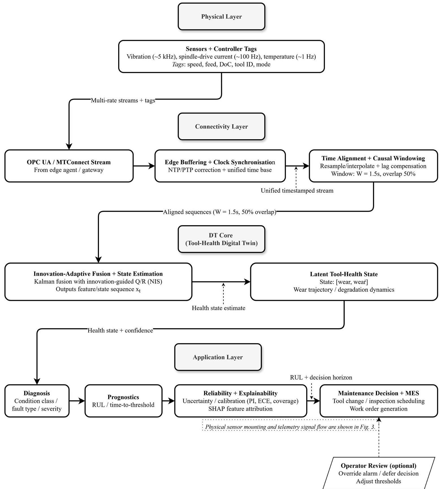
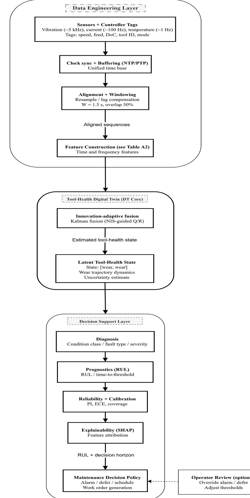
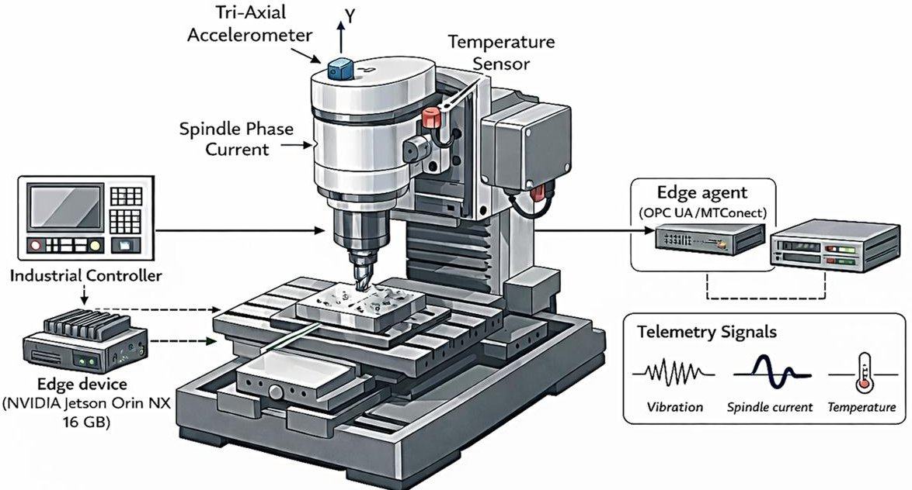
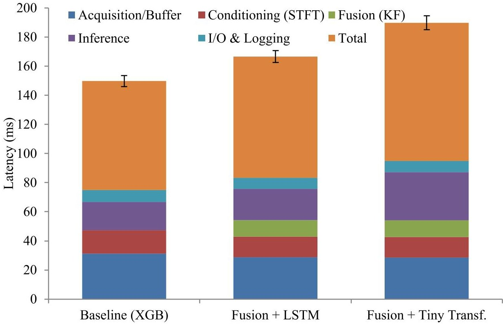
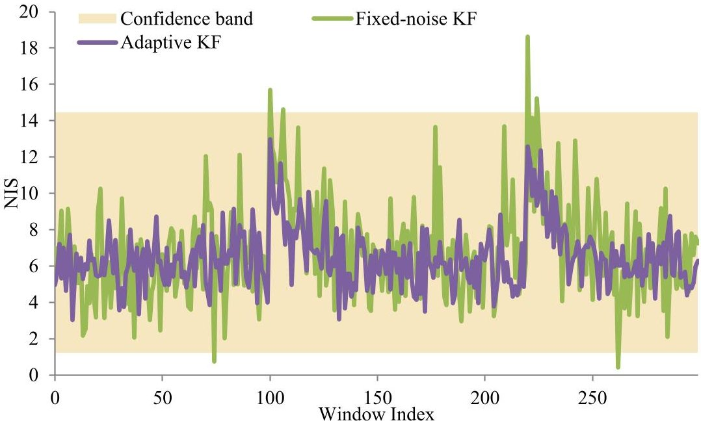
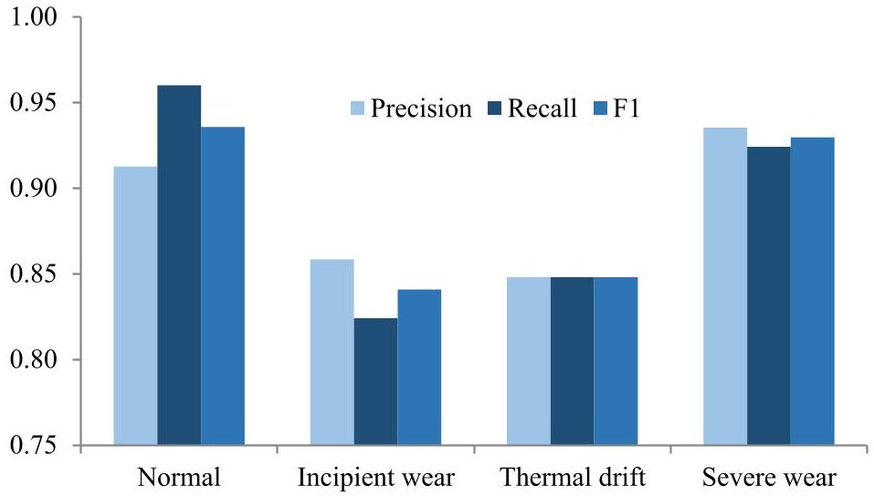
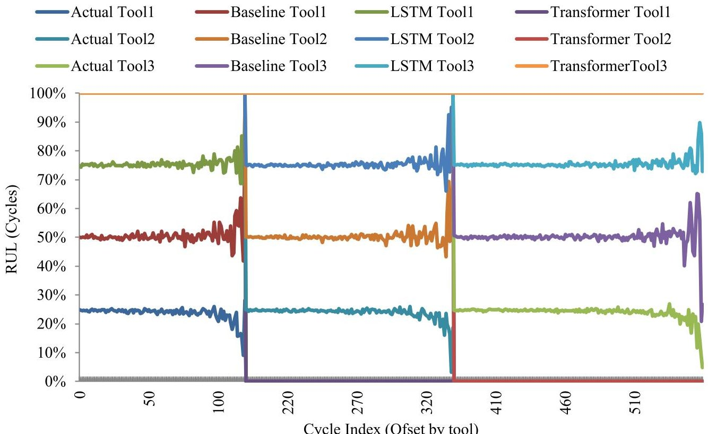
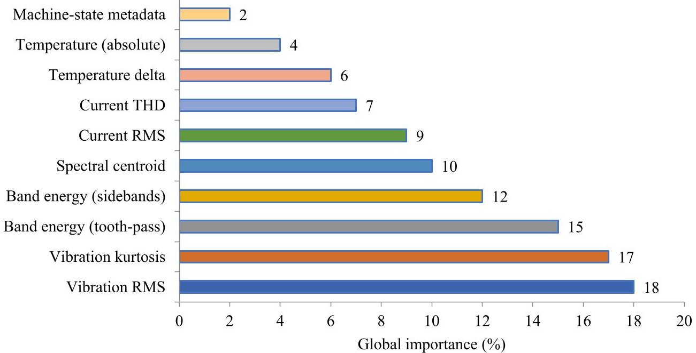

<!-- PDF_PAGE: 1 -->

Article

# Tool-Health Digital Twin for CNC Predictive Maintenance via Innovation-Adaptive Sensor Fusion and Uncertainty-Aware Prognostics

Zhuming Cao $ ^{1} $ , Lihua Chen $ ^{2,*} $ , Chunhui Li $ ^{1} $ , Laifa Zhu $ ^{3} $ and Zhengjian Deng $ ^{4} $

1 The Higher Educational Key Laboratory for Flexible Manufacturing Equipment Integration of Fujian Province, Xiamen Institute of Technology, Xiamen 361021, China; caozhuming@xit.edu.cn (Z.C.); lichunhui@xit.edu.cn (C.L.)

$ ^{2} $ Department of Computer Science and Technology, Jimei University, Xiamen 361021, China

$ ^{3} $ College of Mechanical Engineering and Automation, Huaqiao University, Xiamen 361021, China; hquetc_zhu@hqu.edu.cn

4 Production Department, Fujian Shuangyan Xingye Transmission Technology Co., Ltd., Xiamen 361021, China; dengzhengjian@sy-xy.com

* Correspondence: chenlh@clhedu.gx.cn

## Abstract

A tool-health digital twin for CNC predictive maintenance is developed and operationalised as a fusion-and-state-estimation core that produces a latent tool-health trajectory (wear level and wear-rate dynamics) from multi-rate sensor streams for diagnosis and remaining useful life (RUL) forecasting under strict edge latency constraints. The scope is tool-health-informed maintenance decisions (condition-based tool replacement/scheduling), rather than a comprehensive maintenance twin for all CNC subsystems. Multi-rate vibration, spindle-current, and temperature signals are synchronized and windowed, and a linear state-space model with Kalman filtering and innovation-guided adaptive noise estimation stabilizes the latent health state across operating-regime changes. The fused state is then used by compact sequence learners, an LSTM for edge feasibility, and a compact Transformer as a higher-accuracy comparison, to output fault categories and RUL estimates. Predictive uncertainty is quantified via a Monte Carlo dropout and linked to reliability-aware actions through a simple alarm/defer/schedule policy, while SHAP provides feature-level interpretability. On a CNC testbed, fusion improves fault F1 from 0.811 to 0.892 and PR-AUC from 0.867 to 0.918 while reducing RUL RMSE from 10.4 to 8.1 cycles; the compact Transformer reaches 0.903 F1 and 7.9-cycle RMSE at higher inference time. The end-to-end pipeline remains within a $ \leq100 $ ms breakdown, maintains in-band innovation statistics, supports rehearsal-based updates under drift, and is additionally evaluated on external tool-wear and turbofan datasets.

Academic Editor: Panagiotis Kyratsis

Received: 21 January 2026

Revised: 5 March 2026

Accepted: 11 March 2026

Published: 16 March 2026

Keywords: digital twin; predictive maintenance; CNC machines; sensor fusion; remaining useful life (RUL)

Copyright: 2026 by the authors. Licensee MDPI, Basel, Switzerland. This article is an open access article distributed under the terms and conditions of the Creative Commons Attribution (CC BY) license.

## 1. Introduction

Computer numerically controlled (CNC) machines are crucial to high-value manufacturing, where unforeseen stops, quality fluctuations, and tool-related failures can lead to substantial cost increases [1]. Predictive maintenance is therefore a central objective of shop-floor digitalisation; however, it remains difficult to implement in real settings. Telemetry is multi-rate and non-stationary; noise characteristics change with spindle speed, feed,

<!-- PDF_PAGE: 2 -->

material, and temperature, and deployment must satisfy strict edge latency and bandwidth constraints [2]. Under these conditions, predictive maintenance models must (i) integrate heterogeneous sensors in real time, (ii) remain stable during regime shifts, (iii) remain robust to gradual drift across tools and programs, and (iv) provide calibrated outputs that can be verified by practitioners. In contrast to corrective (post-failure) and preventive (time- or usage-based) maintenance, predictive maintenance anticipates intervention based on observed conditions and risk forecasts. Here, maintenance actions are limited to conditionbased tool interventions (tool change/inspection scheduling) informed by estimated tool wear and RUL, rather than broader machine-subsystem maintenance.

Digital twins (DTs) provide a disciplined way to manage streaming shop-floor data, estimate health states, and support maintenance decisions through traceable processing [3]. In practice, DT-enabled predictive maintenance for CNC machines often fails for two reasons. First, state instability under regime changes: when cutting conditions shift (speed, feed, or material), fixed-noise fusion or late-fusion classifiers can produce transient state distortions that weaken temporal consistency and degrade downstream sequence modeling around set-point transitions. Second, decision reliability beyond point predictions: shop-floor use requires calibrated confidence to avoid false alarms, explanations aligned with machining signatures, and controlled updates as tools and programs drift, all while respecting strict edge latency constraints [4]. Accordingly, the central need is not another standalone predictor, but a DT pipeline that stabilizes the latent health representation and delivers reliable, auditable decisions under real-time constraints. Existing DT-enabled CNC predictive maintenance studies rarely couple innovation-adaptive fusion, calibrated uncertainty, and interpretable decision logic in a single edge-feasible pipeline, leaving a gap between laboratory accuracy and deployment reliability. This gap reflects (G1) an underspecified DT core, (G2) post hoc reliability/XAI, and (G3) limited deployment reporting (Section 2.6).

Accordingly, this study develops and evaluates an edge-feasible tool-health DT that stabilizes a latent wear trajectory and exposes it for diagnosis, RUL, and decision support. In this study, the digital twin is defined as a fusion-and-state-estimation core that produces a latent tool-health trajectory (wear level and wear-rate dynamics) from multi-rate CNC sensor streams and exposes this state for diagnosis and remaining useful life (RUL) forecasting; accordingly, the scope is tool-health-informed predictive maintenance (condition-based tool replacement/scheduling), not a comprehensive maintenance twin for all machine subsystems. A linear state-space model with Kalman filtering and innovation-driven noise adaptation stabilizes the latent health state under varying feed rates, speeds, and materials. Multi-rate vibration, spindle current, and temperature data are processed and causally fused on an edge device, and the fused state is then consumed by compact sequence models, an LSTM for edge feasibility, and a tiny Transformer as a higher-accuracy comparison, to produce fault categories and RUL estimates [5]. Predictive uncertainty is assessed using Monte Carlo dropout and linked to reliability-aware actions through an alarm/defer scheduling rule; meanwhile, SHAP is used to provide feature-level explanations on fused inputs. The framework is evaluated on a CNC milling testbed and public benchmarks for tool-wear classification and turbofan remaining-life prediction using leakage-free unit-wise splits, paired-bootstrap confidence intervals, calibration/coverage metrics, and stage-wise latency reporting across acquisition, buffering, conditioning, fusion, inference, and I/O.

## 2. Literature Review

Digital-twin research in machining increasingly emphasizes architecture-level design how sensing, state estimation, learning, and decision support are assembled, rather than isolated algorithms. Early DT work in cyber-physical systems shows how coupling data

<!-- PDF_PAGE: 3 -->

streams with virtual models and learning modules enables closed-loop monitoring and decision support rather than passive dashboards. Reviews of DT-driven machining further organize the field around core DT functions (data acquisition, model/health-state representation, analytics, and operational decisions), highlighting that "DT usefulness" depends on whether the twin provides stable state estimation and actionable forecasts across changing regimes. In CNC predictive maintenance, DT-driven approaches have combined model-based and data-driven elements; for example, theoretical derivations with sensor observations for tool-life prediction within a DT framework, illustrating that the fusion layer is a central design choice rather than a peripheral detail.

## 2.1. Digital Twins for CNC Predictive Maintenance

Recent surveys and domain studies converge on the view that digital twins (DTs) are transitioning from monitoring and visualization to closed-loop health assessment and predictive maintenance (PdM) in machining [6]. Fu et al. synthesize DT advances in machining and emphasize the shift to model-data convergence for error management and condition monitoring, highlighting sensor integration and runtime analytics as enablers of intervention before quality loss or failure occurs [7]. A broader review of PdM and DT reports shows similar trends across industries, underscoring that DT-driven PdM benefits from multi-sensor data fusion and standardized interfaces to ensure reliable state estimation and decision support [8]. In CNC contexts specifically, multi-sensor, DT-enabled monitoring and optimization are increasingly reported as practical, with fault diagnosis and tool-wear prediction among the most active application threads [9,10]. Field deployments focused on real-time DT monitoring of CNC/industrial equipment further demonstrate the feasibility of production assets, provided streaming, synchronization, and compute constraints are addressed at the edge [11]. Together, this literature establishes the motivation for DT-based PdM in CNC settings. However, a recurring gap is that many studies treat sensing, prediction, and maintenance action as loosely coupled components. At the same time, deployment requires a coherent DT pipeline that maintains a stable latent health state under regime changes and supports reliable decisions (calibration, interpretability, and timing) rather than accuracy alone. This motivates defining the DT 'core' as an explicit fusion-and-state-estimation module whose latent tool-health state is shared downstream for diagnosis, RUL, and decision policy.

## 2.2. Sensor Fusion and Innovation-Adaptive Filtering

A core challenge in shop-floor environments is regime-dependent noise, where measurement statistics vary with spindle speed, feed rate, material, and thermal state. In a state-space fusion setting, the innovation is the residual between predicted and observed measurements, and the normalized innovation squared (NIS) is a scalar consistency statistic that tests whether residual energy remains within the expected confidence band under the assumed noise model. Innovation-based adaptive estimation (IAE) techniques adjust the Kalman filter's noise covariances using the innovation sequence and NIS to maintain filter consistency as conditions change. Foundational work formalized covariance identification and gain tuning from innovation correlations, laying the groundwork for online adaptation via covariance matching and NIS monitoring [12]. Subsequent developments propose NIS- or chi-square-guided strategies and robust variants that suppress outlier-driven divergence in changing-noise regimes [13,14].

For machining PdM, "signal-to-noise ratio and excitation vary across operations" refers to the fact that cutting-force excitation and vibration spectral content depend on the cutting regime (speed/feed/material/tool engagement), while sensor noise and process disturbances (e.g., temperature drift, intermittent contact) change simultaneously.

<!-- PDF_PAGE: 4 -->

In practice, standard filtering (e.g., moving average or low-pass filtering) can mitigate high-frequency noise but does not, by itself, guarantee state consistency when regime changes alter the effective noise statistics and the mapping from measurements to health state. In parallel, the forecasting literature often combines statistical structure with learning (e.g., forecast-assisted or hybrid statistical-deep learning approaches) to handle nonstationarity, while sequence learning is commonly used when regime variation is strong. These perspectives motivate keeping the DT core distinct from the predictor: innovation-guided adaptation is used to stabilize the fused latent state through regime transitions, while downstream learners exploit the stabilized state for diagnosis and remaining useful life (RUL) estimation. This review, therefore, motivates a linear state-space model with innovation-guided $ R_{t} $ matching and NIS-banded $ Q_{t} $ control to realize a causal, lightweight fusion layer suitable for edge execution. Despite these advances, prior DT-enabled CNC PdM studies often under-specify how innovation statistics are operationalised for online noise adaptation under regime shifts, leaving a gap between theoretical consistency checks and deployable fusion cores.

## 2.3. Sequence Learning for Tool-Wear Diagnostics and RUL

Deep sequence models have become standard for tool condition monitoring and RUL forecasting. Long short-term memory (LSTM) networks are recurrent neural networks that use gated memory cells to preserve and update information over time. This approach helps model temporal dependencies that standard feed-forward ANNs do not capture directly. This is suitable here because tool wear and RUL evolve cumulatively over successive windows, so the predictor must learn time-dependent degradation patterns rather than treating each window independently. LSTM-based approaches remain a strong baseline for real-time deployment due to favorable accuracy-latency trade-offs, while attention/transformer architectures increasingly appear in machining for improved long-horizon dependencies and robustness to variable regimes [15,16]. Transformers replace recurrence with attention mechanisms that weight relationships between time steps, enabling flexible modeling of long-range dependencies but often with higher computational cost. Physics-informed and attention-enhanced Transformers for milling wear prediction report accuracy gains over earlier CNN/LSTM baselines, with explicit attention to harmonics and spectral structure relevant to cutting dynamics [17,18].

Comparative studies on C-MAPSS-style RUL benchmarks further document the accuracy advantage of compact Transformers over LSTMs at the cost of higher inference time, an expected trade-off in resource-constrained PdM deployments. Parallel work in tool-wear classification confirms that attention mechanisms enhance the separability of intermediate degradation states, although care must be taken to maintain timing breakdowns for online monitoring [19]. This body of evidence supports a paired model strategy: a latency-efficient LSTM for edge inference and a tiny Transformer variant to probe the accuracy-latency frontier. A remaining gap is that many studies benchmark sequence models primarily on accuracy, while deployment-oriented DT designs require explicit latency-accuracy trade-offs and clear integration of the learned predictor with a stabilized health-state representation.

## 2.4. Uncertainty Calibration and Decision Reliability

Safety-critical PdM workflows increasingly demand calibrated probabilities and actionable prediction intervals. Reliability in this context refers to whether predicted probabilities match observed frequencies (calibration) and whether prediction intervals achieve their nominal coverage, which directly affects false alarms and missed intervention risk. Monte Carlo dropout (MCD) is widely used for approximating Bayesian uncertainty in deep models, but its raw estimates can be miscalibrated without appropriate scaling. Methods

<!-- PDF_PAGE: 5 -->

that recalibrate dropout posteriors reduce the expected calibration error and improve decision quality [20,21]. Applied research continues to validate MCD's utility for time-series forecasting and interval construction, with recent studies demonstrating reliable coverage and competitive point accuracy when intervals are tuned and rigorously evaluated [22].

Within PdM, calibrated confidence enables principled deference and triage policies that suppress false alarms during regime transitions, precisely when noise statistics and decision boundaries are most volatile. The literature, therefore, supports the integration of MCD-based uncertainty heads and the evaluation of ECE and interval coverage as first-class metrics alongside accuracy and RMSE. Nevertheless, uncertainty is frequently evaluated as a reporting add-on rather than being tied to explicit maintenance actions (e.g., defer/alarm rules), resulting in a gap between calibration metrics and decision reliability in CNC PdM deployment.

## 2.5. Explainability for Operator Trust and Deployment

Explainable AI (XAI) methods are increasingly embedded in industrial PdM to connect model outputs to physical signatures and to support auditability. SHAP (SHapley Additive exPlanations) is a game-theoretic attribution method that assigns each feature a contribution value by comparing model outputs across feature coalitions; in practice, it provides ranked feature importance for individual predictions and global summaries. SHAP- and LIME-based explanations have dominated recent practice, with studies reporting that feature attributions aligned with known physics (e.g., vibration RMS/kurtosis, harmonics, spindle current metrics) improve operator acceptance and shorten debugging cycles during deployment [23]. In machining-specific DT contexts, surveys and application reports emphasize that interpretability and standardized data semantics are central to scaling beyond pilots, as they allow maintenance teams to trace alarms to sensor-level evidence and to cross-validate against process knowledge [7]. These findings support the use of SHAP on fused inputs to attribute diagnostics and RUL to vibration, electrical, and thermal features that practitioners already monitor, thereby making the DT pipeline both effective and auditable. However, explainability is still commonly treated as post hoc visualization, and the linkage between feature attributions and operational decision rules remains insufficiently specified in much of the DT-enabled CNC PdM literature.

## 2.6. Synthesis: Key Challenges and Research Gaps

Digital-twin (DT)-enabled CNC predictive maintenance (PdM) research converges on a set of recurring practical challenges. First, multi-rate sensing and regime-dependent noise often destabilize health estimates when cutting parameters change. Second, non-stationarity and drift across tools, machining programs, and materials complicate model generalization over time. Third, there is a persistent accuracy-latency tradeoff for sequence learning models operating under edge-computing constraints. Fourth, decision risk is frequently driven by model miscalibration and poor interval quality rather than point-prediction error alone. Finally, operator trust remains limited when automated alarms cannot be traced to physically meaningful signals or interpretable feature attributions.

Across the cited DT and PdM literature streams, three research gaps repeatedly emerge. (G1) The DT "core" is often treated primarily as a monitoring or data-integration layer rather than an explicitly stabilized fusion-and-state-estimation module capable of producing a robust latent tool-health trajectory under regime changes. (G2) Reliability and interpretability tools such as uncertainty quantification and explainability are frequently introduced as post hoc analysis components, rather than being integrated into actionable decision policies that guide maintenance actions. (G3) Demonstrations of deployment

<!-- PDF_PAGE: 6 -->

feasibility are comparatively rare; many studies emphasize prediction accuracy without reporting stage-wise latency, edge-deployment constraints, or leakage-free evaluation protocols that reflect real industrial usage.

To make these gaps explicit, Table 1 provides a compact synthesis of how representative DT and machining PdM literature streams address key system components, while Tables A5 and A6 (Appendix A) present the detailed study-level mapping of DT architecture elements and task/output coverage. The comparison highlights that prior work typically addresses only subsets of the required components, whereas practical CNC predictive maintenance requires their integration into a single, decision-oriented pipeline.

Table 1. Comparative synthesis of DT/PdM component coverage in representative literature streams.

<table border="1"><tr><td>Literature Stream (Representative)</td><td>DT Scope Framing</td><td>Fusion/Health-State Core</td><td>Learning Layer</td><td>Reliability(UQ/XAI)</td><td>Deployment/Decision Linkage</td></tr><tr><td>DT surveys and enabling frameworks</td><td>Monitoring-oriented architecture descriptions</td><td>Fusion is discussed conceptually as an enabling function</td><td>Analytics modules are summarized at a high level</td><td>Reliability and trust are discussed conceptually</td><td>Decision support discussed conceptually</td></tr><tr><td>Machining PdM predictive models</td><td>Task-driven wear or RUL prediction</td><td>Fusion often implicit or limited to preprocessing</td><td>LSTM, Transformer, or other predictive models</td><td>Limited or post hoc reliability treatment</td><td>Typically, accuracy-focused with a limited explicit action policy</td></tr><tr><td>Reliability and explainability methods in PdM</td><td>Reliability- or interpretability-driven perspective</td><td>Not usually centered on fusion/state estimation</td><td>Applied to existing prediction models</td><td>Central focus on calibration metrics or XAI tools</td><td>Improves trust, but decision rules are often not formalized</td></tr><tr><td>This work</td><td>Tool-health-informed CNC PdM, digital twin</td><td>Explicit DT Core: innovation-adaptive state-space fusion producing a latent tool-health trajectory</td><td>Compact LSTM(edge) with tiny Transformer comparator</td><td>MC-dropout calibration and SHAP-based explainability</td><td>Explicit alarm/defer/schedule decision policy with≤100ms edge constraint</td></tr></table>

Note: Table 1 provides a high-level synthesis by literature stream (e.g., DT surveys, machining PdM predictors, reliability/XAI studies). The detailed study-by-study mapping and supporting evidence for this synthesis are reported in Tables A5 and A6.

The synthesis suggests that most prior approaches emphasize either predictive accuracy or interpretability in isolation, whereas practical CNC predictive maintenance requires stable health-state estimation, reliable uncertainty quantification, and interpretable decision support under real-time constraints. These observations motivate the DT formulation described in Section 3, where innovation-adaptive state estimation stabilizes the latent toolhealth trajectory used by downstream diagnostic and prognostic models, and calibrated uncertainty is explicitly linked to operator-facing maintenance decisions.

## 3. Methodology

## 3.1. Architecture and Data Pipeline

In this study, the digital twin is defined as a fusion-and-state-estimation core that produces a latent tool-health trajectory (wear level and wear-rate dynamics) from multirate CNC sensor streams and exposes this state for diagnosis and remaining useful life forecasting; accordingly, the scope is tool-health-informed predictive maintenance (condition-based tool replacement/scheduling), not a comprehensive maintenance twin for all machine subsystems.

A four-layer digital-twin stack is implemented for CNC predictive maintenance (Physical, Connectivity, DT Core, and Application). The Physical layer comprises the machine (spindle, tool, workpiece) and sensors. The Connectivity layer streams telemetry via OPC UA/MTConnect; an edge agent subscribes and buffers time-synchronized windows using NTP/PTP clock correction. The DT Core performs real-time sensor fusion and health-state estimation and provides this latent state to downstream heads for diagnostics and remaining useful life (RUL) prediction. Additionally, uncertainty estimation and explainability

<!-- PDF_PAGE: 7 -->

support operator-facing actions. The Application layer exposes dashboards, alarms, and maintenance scheduling recommendations to operators/MES. Instrumentation includes tri-axial vibration (~5 kHz), spindle phase current (~100 Hz), temperature (~1 Hz), and machine-state tags (spindle speed, feed rate, depth of cut, tool ID). Streams are segmented into windows of length W = 1.5 s with 50% overlap on the vibration clock, lower-rate channels are linearly interpolated to this timeline. Experiments run on an embedded edge GPU (NVIDIA Jetson Orin NX 16 GB) and a local server (16-core CPU + mid-range GPU). Latency is measured stage-wise (acquisition, conditioning, fusion, inference, and I/O) and as end-to-end timing. In this work, fault detection is operationalised within the diagnosis stage as condition-class classification, while prognostics produces a continuous RUL estimate; both are conditioned on the same fused latent tool-health trajectory.

Figure 1 summarizes the layered digital-twin stack and clarifies that the DT role is concentrated in the DT Core (fusion and health-state estimation), which feeds both diagnostics and prognostics in a closed, auditable loop. Physical sensor mounting positions and the telemetry signal-flow (controller/drive $ \rightarrow $ edge agent $ \rightarrow $ edge device) are shown in Figure 3.

Figure 2 details the real-time edge data stream and explicitly locates the DT within the pipeline: acquisition $ \rightarrow $ time synchronization/buffering $ \rightarrow $ windowing and conditioning $ \rightarrow $ feature construction $ \rightarrow $ DT Core fusion and latent health-state estimation $ \rightarrow $ diagnostic and RUL heads $ \rightarrow $ uncertainty/calibration and explainability $ \rightarrow $ decision policy (alarm/defer/schedule). Fusion is defined in Section 3.4; feature construction in Section 3.3; and the learning heads and reliability tools (uncertainty, calibration, SHAP) in Sections 3.5 and 3.6. All latency and performance results in Sections 4.1-4.5 correspond directly to the stages shown in this pipeline.

Unlike monitoring-only DT frameworks that treat fusion as preprocessing and report prediction accuracy without decision readiness, this work defines the DT as an explicit innovation-adaptive state-estimation core that stabilizes a latent tool-health trajectory under regime shifts and feeds both diagnosis and RUL in real time. Reliability and interpretability are integrated as deployment mechanisms via calibrated uncertainty (defer/alarm/schedule) and SHAP-based evidence, under a measured $ \leq100 $ ms edge constraint.

## 3.2. CNC Testbed, Sensing, and Datasets

Experiments were conducted on an in-house three-axis CNC milling testbed instrumented for multi-rate telemetry. A tri-axial accelerometer was mounted on the spindle housing to capture vibration signatures; spindle phase current was acquired from the spindle drive/controller; and a temperature sensor was attached near the spindle/body to track thermal drift. Machine-state tags (spindle speed, feed rate, depth of cut, and tool ID) were logged from the controller and used to define operating regimes and regime transitions. Data were streamed to an edge agent via OPC UA/MTConnect, time-aligned using NTP/PTP, and segmented into causal windows of length W = 1.5 s with 50% overlap on the vibration clock; lower-rate channels were interpolated to the vibration timeline prior to feature extraction. Figure 3 shows the CNC testbed configuration and sensor mounting positions used to generate the in-house dataset.

For reproducibility, the testbed is described at the interface level required to repeat the pipeline: the platform is a closed-loop three-axis CNC milling system with controller-accessible set-point tags and drive-level current telemetry, operated under multiple programmed cutting regimes. To protect institutional procurement and vendor confidentiality, the machine vendor/model and rated power specifications are not disclosed; however, all algorithmic inputs (sensor modalities, tag definitions, windowing and synchronization

<!-- PDF_PAGE: 8 -->

procedure, feature dictionary, and evaluation protocol) are fully specified, and all results are reported under the same edge execution and latency constraints described in Section 4.1. Operating regimes are defined by the controller tag tuple (spindle speed, feed rate, depth of cut, tool ID) (and material where applicable). A "regime transition" window is any window that contains, or immediately follows, a change in one of these tags.

Figure 1. Layered digital-twin architecture for CNC predictive maintenance. The DT role is concentrated in the DT Core layer, which performs real-time fusion and health-state estimation and feeds the Application layer (diagnosis, RUL, calibration/uncertainty, explainability, and maintenance decision support).

<!-- PDF_PAGE: 9 -->

Physical sensor mounting and telemetry signal flow are shown in Fig. 3.

Figure 2. Real-time tool-health digital twin pipeline. Multi-rate sensor streams are synchronized and windowed to produce aligned feature sequences, which are processed by an innovation-adaptive state-space model to estimate latent tool-wear dynamics and uncertainty. Diagnosis, prognostics, reliability calibration, and explainability are integrated before maintenance decision support.

<!-- PDF_PAGE: 10 -->

Figure 3. CNC Testbed Configuration, Sensor Placement, and Edge Telemetry Pipeline. Schematic (not to scale) summarizing sensor mounting locations and telemetry interfaces used in the experiments.

Time synchronization and acceptability of $ \pm 2.3 $ ms: Sensor and controller streams were time-stamped at acquisition and aligned on the edge agent using NTP/PTP-corrected clocks. A causal resampling step mapped lower-rate channels to the vibration clock: current and temperature were interpolated to the vibration timeline before window feature extraction, and each window was keyed by the vibration-clock boundaries. The maximum observed residual skew after clock correction was $ \pm 2.3 $ ms, which is negligible relative to the 1.5 s window length and 50% overlap used for feature construction; therefore, window membership and the resulting time-frequency features are not materially affected by this skew. Time alignment was achieved by hardware clock discipline (PTP, where available, otherwise NTP) at the edge agent, followed by timestamp-based buffering and causal windowing on the vibration clock. The residual cross-channel skew after correction remained within $ \pm 2.3 $ ms, which is acceptable because features are computed over a W=1.5 s windows with 50% overlap and are dominated by aggregated statistics (e.g., RMS/kurtosis and band-energy) rather than sample-level phase alignment. At the reported sampling rates, a few milliseconds of residual skew does not materially change window-level energy and distributional features and, therefore, has a negligible effect on the fused latent state and downstream diagnosis/RUL under this pipeline. In pilot checks, injecting additional artificial skew at the millisecond level did not change accuracy beyond run-to-run variance.

To assess transfer beyond the local CNC testbed, two widely used public benchmarks were additionally evaluated: (i) the PHM Society 2010 milling tool-wear data challenge dataset for tool-wear/fault classification and (ii) the NASA turbofan engine degradation simulation (C-MAPSS) dataset for remaining useful life prediction [24,25]. For all datasets, train/validation/test splits were performed at the unit/tool level to prevent leakage, consistent with the evaluation protocol in Section 3.6. These public datasets were adopted as external benchmarks and were not generated as part of the present CNC testbed experiments.

## 3.3. Signal Conditioning and Feature Construction

Raw signals were denoised and converted into compact, latency-friendly features designed to preserve machining signatures while remaining feasible on the edge. Pure time-domain statistics (e.g., RMS, kurtosis) are informative but often insufficient when regime shifts move energy across harmonics and sidebands; therefore, a short-time Fourier

<!-- PDF_PAGE: 11 -->

transform (STFT) representation was used to retain tooth-pass and sideband structure in a causal, computationally light form. For vibration, the raw stream was DC-detrended and anti-aliased, and STFT was applied using a Hann window of 512 samples with a hop size of 256, which balances frequency resolution with low per-window compute. Wavelet packet transforms were explored in ablations; however, STFT was selected as the primary representation because it offered stable discrimination with lower implementation overhead and straightforward band-energy summaries.

For spindle current and temperature, 4th-order Butterworth low-pass filters were applied to suppress high-frequency noise that does not reflect load or thermal drift: current used a 40 Hz cutoff at 100 Hz sampling, and temperature used a 0.25 Hz cutoff at 1 Hz sampling. From each causal window, a compact feature vector was computed: vibration RMS/variance/kurtosis/crest factor, spectral centroid, and band energies over predefined STFT bands; current RMS/THD and torque-proxy terms; and absolute temperature plus short-horizon deltas to capture slow drift. Machine-state tags (speed, feed, tool ID, mode) were appended as contextual inputs for regime awareness. Table A2 summarizes the complete feature dictionary (definitions, units, and physical interpretation), grouped into time-domain vibration statistics; STFT band-energy and spectral descriptors; electrical-load proxies from spindle current; and thermal trend features from temperature. This grouping is used consistently in the DT Core: vibration spectral/band features capture excitation and tooth-pass-related signatures, current features reflect load variation under regime changes, and temperature features capture slow drift that correlates with wear progression. Together, the Table A2 feature set forms the measurement vector $ y_{t} $ used for fusion and health-state estimation in Section 3.4. Finally, features were standardized online using a running mean/variance over the last K = 1000 windows to remain drift-aware without future leakage.

## 3.4. State-Space Sensor Fusion with Adaptive Noise

Multi-modal features were fused into a stable latent tool-health state using a linear state-space model [26],

$$
x _ {t + 1} = A x _ {t} + B u _ {t} + w _ {t}, y _ {t} = C x _ {t} + v _ {t}
$$

Scope and meaning of the latent state: In this work, "latent tool-health" refers specifically to tool-wear dynamics, not a full-machine maintenance twin. The DT Core estimates a two-dimensional state $ x_{t}=[\textit{wear},\textit{wear}]^{\top} $ , where wear is a dimensionless degradation index (monotone with tool wear) and wear is its rate of change per window step. This latent state is the single shared input used downstream for both diagnosis (condition/fault class) and prognostics (RUL), ensuring that the pipeline moves explicitly from state estimation to diagnosis/RUL and then to decision support.

Here, $ x_{t}\in R^{d_{x}} $ is the latent state with $ d_{x}=2 $ (defined above) and $ u_{t}= $ [spindle speed, feed rate, depth of cut] $ ^{\top} $ captures commanded set-points that drive regime-dependent dynamics. $ y_{t}\in R^{d_{y}} $ stacked engineered features derived from vibration/current/temperature and tags (Table A2). Process and measurement noise are modeled as $ w_{t}\sim N(0, Q_{t}) $ and $ v_{t}\sim N(0, R_{t}) $ . A Kalman filter produces posteriors $ \hat{x}_{t|t} $ and $ P_{t|t} $ in real time. Because noise statistics vary by regime, $ Q_{t} $ and $ R_{t} $ are adapted online using innovation statistics. With innovation $ \nu_{t}=y_{t}-C\hat{x}_{t|t-1} $ and innovation covariance $ St=CP_{t|t-1}C^{\top}+R_{t} $ , the empirical innovation covariance $ \widehat{Cov}(\nu) $ is estimated over a sliding window of $ w=100 $ steps.

Model structure and mapping. A constant-velocity wear dynamic is used so that the latent state captures both degradation level and trend. Accordingly, the transition matrix A implements "level + rate" propagation over the window step $ \Delta t $ (i.e., wear evolves by

<!-- PDF_PAGE: 12 -->

accumulating wear'). The control term $ B u_{t} $ injects commanded set-points (spindle speed, feed rate, depth of cut) to account for regime-driven changes in degradation dynamics while the observation mapping C links the latent state to the engineered feature vector $ y_{t} $ (the subset of vibration/current/temperature features listed in Table A2).

Identification of A and B (procedure): The transition matrix A follows directly from the constant-velocity definition at the window step and is specified in closed form as

$$
A = \left[ \begin{array}{c c} 1 & \Delta t \\ 0 & 1 \end{array} \right]
$$

The control matrix B is identified offline from testbed sequences by regressing state increments on commanded set-points. Specifically, using provisional state estimates from the filter recursion, the relation $ \Delta x_{t}=x_{t+1}-Ax_{t}\approx Bu_{t} $ is fitted over non-transition windows via ridge-regularized least squares:

$$
\hat {B} = \operatorname {a r g m i n} _ {B} \sum_ {t} \left| \Delta x _ {t} - B u _ {t} \right| _ {2} ^ {2} + \lambda | B | _ {F} ^ {2}
$$

where $ \lambda $ is selected on a validation segment to stabilize estimation under collinearity in $ u_{t} $ The fitted B is then held fixed during online operation, while regime-dependent variability is captured through the innovation-guided adaptation of $ Q_{t} $ and $ R_{t} $

Innovation-guided noise adaptation: The measurement noise is updated by an exponential moving average:

$$
R _ {t} \leftarrow (1 - \eta) R _ {t - 1} + \eta \widehat {C o v} (\nu), \eta = 0. 0 5
$$

Then, adjusted $ Q_{t} $ so that the normalized innovation squared

$$
N I S _ {t} = \nu_ {t} ^ {\top} S _ {t} ^ {- 1} \nu_ {t}
$$

remains within the chi-square band $ \left[ \chi_{\mathrm{dy},0.025}^{2},\chi_{\mathrm{dy},0.975}^{2} \right] $ at significance $ \alpha=0.05 $ , where $ d_{y} $ is the measurement dimension. For numerical stability, eigenvalues of $ Q_{t} $ and $ R_{t} $ were clamped to $ \left[ 10^{-6},10^{2} \right] $ for numerical stability. The fused state $ \hat{X}_{t|t} $ , optionally concatenated with select raw features, is then fed to the sequence models. This causal design supports end-to-end latency within the reported $ \leq100 $ ms pipeline, and innovation behavior and NIS compliance are reported alongside the stage-wise latency breakdown.

## 3.5. Prognostics and Diagnostics with Continual Learning

This section learns fault diagnosis and remaining useful life (RUL) from sequences constructed from DT Core outputs. Let $ z_{t} $ denote the per-window DT representation (the fused posterior state $ \hat{x}_{t|t} $ optionally concatenated with a small subset of regime tags such as speed/feed/mode) so that learning operates on a stable latent representation rather than raw, regime-dependent sensor noise. Each training sample, therefore, consists of a causal sequence $ Z=(z_{1},\dots,z_{T}) $ with two supervised targets: a fault class label c and an RUL target r (in cycles).

Multi - task training objective : The predictor is trained using a weighted multi-task loss:

$$
\mathcal {L} = \alpha C E (c, \hat {c}) + (1 - \alpha) R M S E (r, \hat {r})
$$

where $ C E(\cdot) $ is cross-entropy for classification, $ R M S E(\cdot) $ penalizes RUL errors, and $ \alpha \in[0,1] $ is selected on the validation set to balance the two tasks. This formulation enforces shared learning on the same DT inputs while preventing optimization of one task at the expense of the other under regime shifts.

<!-- PDF_PAGE: 13 -->

Models and deployment roles: The primary edge-feasible model is an LSTM operating on Z, providing real-time diagnostics and RUL outputs under the latency constraint. As an accuracy-latency comparator, a tiny causal Transformer (1-2 encoder layers with causal masking and lightweight projections) is evaluated on a local server under identical input conditions to quantify accuracy headroom versus inference cost. Where included, XGBoost 3.1.2 version serves as a strong non-sequential baseline trained on per-sequence aggregated summaries of $ z_{t} $ (e.g., mean/variance and trend statistics) to isolate the value of temporal modeling given the same DT representation.

Continual learning under drift (bounded rehearsal): To sustain performance when conditions shift (tool changes, new materials, altered feeds), rehearsal-based continual learning is used. A replay buffer of B=50,000 windows store a stratified sample by (tool ID, regime, fault class) to preserve long-tail conditions. Every 5000 new windows (or during off-peak periods), the model is fine-tuned using mini-batches that mix recent and replayed samples (replay fraction p=0.5). When beneficial, early layers are frozen to reduce forgetting, and early stopping is based on a recent validation split. Background updates are capped at $ \leq1 $ s and do not pre-empt real-time inference. Results, therefore, report pre-/post-drift performance, forgetting behavior, and ablations that remove fusion, adaptive Q/R, replay, and the uncertainty head.

## 3.6. Uncertainty, Explainability, and Evaluation Protocol

The objective is not only to output a predicted class or RUL value, but also to provide calibrated predictive uncertainty, decision rules that reduce false alarms, and interpretable attributions that align model behavior with machining signatures. In this setting, epistemic uncertainty (model uncertainty) is captured by Monte Carlo dropout variability across forward passes, while aleatoric uncertainty reflects irreducible process and measurement noise (e.g., regime-induced variability that remains even with a well-trained model). RUL uncertainty is also horizon-dependent: interval width typically increases with forecast horizon, so decision thresholds should be interpreted relative to the maintenance horizon (near-term alarms versus longer-term scheduling). This matters operationally because calibration errors translate into maintenance risk, overconfident predictions can trigger premature tool replacement, while underconfident predictions can delay intervention and increase scrap risk. For that reason, calibrated uncertainty is coupled to decision logic (defer/suppress alarms when confidence is low, and schedule maintenance when intervals remain within a tolerable risk band over the decision horizon).

Uncertainty estimation and calibration: Predictive uncertainty is estimated using Monte Carlo dropout (M stochastic forward passes; M = 20 in the experiments). For classification, the predictive distribution is the average of softmax outputs across passes, and uncertainty is summarized by predictive entropy. Calibration is assessed using Expected Calibration Error (ECE) with 15 bins, computed from predicted confidence versus empirical accuracy. For RUL, 90% prediction intervals [27] are constructed by taking the 5th and 95th percentiles of the M sampled predictions; nominal coverage (target $ \approx 90\% $ ) and mean interval width are reported to capture decision reliability rather than point accuracy alone.

Decision linkage (alarm and defer rule): To make uncertainty operational, a simple decision policy distinguishes between confident decisions and cases requiring additional evidence. An alarm is triggered when the predicted fault probability exceeds a class threshold, and uncertainty is below a chosen uncertainty threshold; otherwise, the decision is deferred, and additional windows are requested before issuing an alert. For RUL, scheduling recommendations are deferred when the prediction interval becomes too wide, which typically occurs during regime transitions or after drift. Thresholds are selected on a validation set to minimize false alarms subject to a bound on deferral rate, and are held

<!-- PDF_PAGE: 14 -->

fixed for the reported test evaluation. This makes the reliability layer directly relevant to shop-floor deployment: uncertainty reduces unnecessary actions rather than merely being reported as a metric.

Explainability (SHAP): SHAP is used to attribute predictions to input features in an operator-interpretable manner. For the neural models, SHAP values are computed using a small background set sampled across regimes to represent typical operating conditions. Attributions are computed at the feature level and aggregated to obtain global importance as the mean absolute SHAP value, as well as regime-stratified summaries to show how feature salience changes across cutting conditions. For the tree-based baseline (when used), TreeSHAP is applied. Explanations are generated offline or asynchronously, so they do not affect the real-time inference path, while providing an audit trail for why the system raised a fault alert or shifted its RUL estimate.

Evaluation protocol and leakage control: To ensure fair and reproducible evaluation, data are split in a leakage-free manner by unit identity (e.g., by tool ID or engine/unit ID) rather than by randomly sampling windows, which would allow adjacent or overlapping windows from the same physical instance to appear in both training and testing. Metrics include F1 and PR-AUC for fault classification; RMSE and MAE for RUL; ECE and interval coverage/width for uncertainty; and measured latency/throughput for deployment feasibility. For statistical stability, experiments are repeated with fixed random seeds, and confidence intervals are reported using paired bootstrap resampling where appropriate. This protocol ensures that performance gains reflect real generalization and decision reliability under realistic operating shifts rather than artifacts of window-level leakage.

Methodological clarification (novelty, soundness, usefulness, gap):

- Novelty: Reliability and explainability are integrated into the DT-enabled diagnostics and prognostics pipeline, and uncertainty is operationalised through an explicit alarm/defer/schedule decision rule rather than being reported only as a metric.

- Technical soundness: Uncertainty estimation uses established Monte Carlo dropout with explicit calibration (ECE) and interval coverage/width reporting, evaluated under leakage-free unit splits with statistical confidence intervals.

- Usefulness: Calibrated uncertainty reduces false alarms and prevents overconfident tool-replacement recommendations during regime transitions, while SHAP provides feature-level evidence aligned with machining signatures for auditability.

- Gap filled: The section closes the deployment gap between point-accurate predictors and decision-reliable PdM by linking calibration and explainability to reproducible evaluation and operator-facing decision logic.

## 4. Results

## 4.1. Data Integrity and Latency Breakdown

All data streams were synchronized and windowed consistently, and no time skew beyond $ \pm2.3 $ ms was observed after clock correction. Processing used causal windows of 1.5 s with 50% overlap on the edge device under an end-to-end latency target of $ \leq100 $ ms. Over 10,000 windows across three repeated runs with fixed seeds, the total latency remained below this target for all configurations: $ 74.9\pm6.1 $ ms for the baseline without fusion (XGBoost), $ 83.3\pm5.8 $ ms for fusion+LSTM,and $ 94.9\pm6.3 $ ms for fusion+tiny Transformer. The corresponding throughputs were 13.4 Hz,12.0 Hz,and 10.5 Hz, respectively. For clarity, the baseline uses the same acquisition and conditioning pipeline but omits the Kalman fusion step.

Table 2 reports the end-to-end latency breakdown and the stage-wise breakdown (mean $ \pm $ SD; N = 10,000 windows). Stage-wise timing confirms that the fusion step remains computationally lightweight relative to acquisition/buffering and model inference. The

<!-- PDF_PAGE: 15 -->

LSTM pathway provides the best latency-throughput balance under the real-time constraint, while the tiny Transformer trades additional inference time for improved accuracy.

Table 2. End-to-end latency breakdown on the edge (ms; mean $ \pm $ SD; N = 10,000 windows).

<table border="1"><tr><td>Stage</td><td>Baseline(No Fusion,XGB)</td><td>Fusion+LSTM(Ours)</td><td>Fusion+Tiny Transformer</td></tr><tr><td>Acquisition/Buffer</td><td>31.2±3.4</td><td>28.7±3.1</td><td>28.5±3.0</td></tr><tr><td>Conditioning(STFT)</td><td>16.1±2.2</td><td>14.2±2.0</td><td>14.2±2.0</td></tr><tr><td>Fusion(KF)</td><td></td><td>11.3±1.2</td><td>11.4±1.3</td></tr><tr><td>Inference</td><td>19.4±2.6</td><td>21.5±2.4</td><td>33.1±3.1</td></tr><tr><td>I/O&amp;Logging</td><td>8.2±1.1</td><td>7.6±1.1</td><td>7.7±1.2</td></tr><tr><td>Total</td><td>74.9±6.1</td><td>83.3±5.8</td><td>94.9±6.3</td></tr><tr><td>Throughput(Hz)</td><td>13.4</td><td>12.0</td><td>10.5</td></tr></table>

Figure 4 visualizes the latency composition as stacked bars with $ \pm1 $ SD whiskers, mirroring the stage means reported in Table 1 and highlighting the inference-stage dominance for the tiny Transformer configuration.

Figure 4. End-to-end latency breakdown on the edge platform.

## 4.2. Fusion Behavior and Innovation Statistics

Innovation-driven adaptation stabilized sensor fusion across changes in spindle speed, feed rate, and material. When regimes switched, the empirical innovation covariance tracked the covariance-matched measurement noise with a lag of fewer than 15 windows, helping maintain filter consistency during transition periods. Relative to a fixed-noise Kalman filter, the adaptive filter achieved a higher NIS in-band compliance in both steady operation and transition windows, and reduced the innovation norm, indicating tighter residuals and better agreement between model predictions and observed measurements.

Table 3 summarizes the innovation statistics and the stability outcomes on the CNC testbed. The adaptive filter improved the NIS in-band rate from 88.9% to 94.7% in steady operation and from 83.0% to 91.3% during transitions, while reducing the mean innovation norm from 0.26 to 0.11. It also shortened the median settling time after regime changes (52 to 36 windows) without materially increasing fusion compute time (10.9 ms vs. 11.3 ms), confirming that robustness gains are achieved without compromising real-time feasibility.

<!-- PDF_PAGE: 16 -->

Table 3. Innovation statistics and stability (CNC testbed).

<table border="1"><tr><td>Metric</td><td>Fixed Noise KF</td><td>Adaptive KF(Ours)</td></tr><tr><td>NIS in-band rate(steady)</td><td>88.9%</td><td>94.7%</td></tr><tr><td>NIS in-band rate(transitions)</td><td>83.0%</td><td>91.3%</td></tr><tr><td>Mean innovation norm(z-score)</td><td>0.26</td><td>0.11</td></tr><tr><td>Settling time after regime change(windows)</td><td>52</td><td>36</td></tr><tr><td>Fusion step time(ms)</td><td>10.9</td><td>11.3</td></tr></table>

Figure 5 visualizes representative NIS trajectories under two regime transitions (a speed step-up and a material swap). The shaded region denotes the target confidence band. Compared with the fixed-noise baseline, the adaptive filter exhibits smaller transient overshoot and returns to in-band behavior more quickly, remaining closer to the center of the band across the transition.

Figure 5. NIS trajectories across regime transitions.

## 4.3. Diagnostic and Prognostic Performance on the CNC Testbed

On the CNC testbed, configurations that include DT-core fusion outperform the nonfusion baseline for both fault diagnosis and RUL estimation while remaining within the real-time constraint. Among the evaluated sequence models, the LSTM configuration is the primary edge deployment option due to its inference efficiency, whereas the tiny Transformer serves as a comparator to quantify the accuracy-latency trade-off under the same input conditions.

Table 4 reports the diagnostic and prognostic performance on the CNC testbed across the baseline and fusion-based configurations. Overall, adding DT-core fusion yields a clear improvement over the non-fusion baseline for both classification and RUL estimation, and the sequence models benefit from the stabilized latent representation produced by fusion.

Table 4. Testbed performance (mean $ \pm 95\% $ CI).

<table border="1"><tr><td>Model</td><td>Fault F1</td><td>PR-AUC</td><td>RUL RMSE(Cycles)</td><td>RUL MAE(Cycles)</td></tr><tr><td>No fusion(XGBoost)</td><td>0.811±0.028</td><td>0.867±0.021</td><td>10.4±0.8</td><td>7.6±0.6</td></tr><tr><td>Fusion+LSTM(ours)</td><td>0.892±0.022</td><td>0.918±0.018</td><td>8.1±0.6</td><td>6.0±0.5</td></tr><tr><td>Fusion+Tiny Transformer</td><td>0.903±0.021</td><td>0.926±0.017</td><td>7.9±0.5</td><td>5.8±0.4</td></tr></table>

<!-- PDF_PAGE: 17 -->

Figure 6 shows per-class diagnostic performance for the fusion + LSTM configuration. Improvements are most pronounced for intermediate wear states, where regime variability and overlapping signatures typically increase confusion in non-fusion models.

Figure 6. Per-class precision, recall, and F1 as grouped bars for the Fusion + LSTM model.

Figure 7 presents representative RUL trajectories, illustrating that fusion stabilizes the predicted degradation trend and reduces oscillations during mid-life plateaus, while improving end-of-life tracking. These trajectories are consistent with the earlier fusion-stability evidence and demonstrate that a steadier DT representation translates into more stable downstream prognostic outputs.

Figure 7. RUL prediction traces for three representative tools. Solid lines show ground truth, and dotted/dashed lines show predictions for the non-fusion baseline, the fusion LSTM, and the fusion tiny transformer. Line styles and markers are used to ensure distinguishability in grayscale.

## 4.4. Generalization on Public Benchmarks

The approach was evaluated on external datasets using unit-wise splits to reduce leakage risk, with the same evaluation metrics and the same latency reporting procedure as used on the local testbed. On the PHM Society 2010 milling tool-wear dataset, the fusion + LSTM configuration attains higher classification performance than the reported non-fusion CNN-1D baseline while also exhibiting lower inference time under the same

<!-- PDF_PAGE: 18 -->

deployment-oriented measurement protocol. On the NASA C-MAPSS turbofan degradation dataset [25], sequence models trained on the fused inputs yield competitive RUL prediction accuracy; the LSTM remains within the edge latency breakdown, while the tiny Transformer provides an accuracy-latency trade-off at higher inference cost.

Table 5 summarizes accuracy and inference latency on both benchmarks. For tool-wear classification, the fusion + LSTM configuration improves the F1 score relative to the nonfusion baseline and reduces inference time. For turbofan RUL, the tiny Transformer achieves lower RMSE than the LSTM at the cost of higher inference time, while both configurations remain within the stated real-time constraint. Where reported, paired bootstrap results indicate that differences are statistically detectable under the chosen testing protocol.

Table 5. External benchmarks: accuracy and latency (mean $ \pm 95\% $ CI).

<table border="1"><tr><td>Dataset</td><td>Model</td><td>Score/F1</td><td>RUL RMSE</td><td>Inference(ms)</td><td>Notes</td></tr><tr><td>Milling tool-wear</td><td>CNN-1D(no fusion)</td><td>0.832±0.025</td><td></td><td>115±7</td><td>Sensitive to regime noise</td></tr><tr><td>Milling tool-wear</td><td>Fusion+LSTM(ours)</td><td>0.882±0.020</td><td></td><td>82±6</td><td>Stable across regimes</td></tr><tr><td>TurbofanRUL</td><td>LSTM</td><td></td><td>17.8±0.9</td><td>85±6</td><td>Edge-friendly</td></tr><tr><td>TurbofanRUL</td><td>Tiny Transformer</td><td></td><td>16.1±0.8</td><td>108±7</td><td>Best accuracy</td></tr></table>

Taken together, these benchmark results show that the fusion-based DT representation can be applied beyond the local CNC testbed and remains compatible with deployment-oriented latency constraints. External datasets: PHM Society 2010 tool-wear dataset [25] and the NASA C-MAPSS turbofan dataset [24].

## 4.5. Continual Learning Under Drift

Feed and speed schedules, as well as workpiece materials, were varied across sessions to induce realistic drift, and tools not seen during training were included in the evaluation split. Under this setting, performance degradation is observable after regime changes when rehearsal is not used. With a replay buffer and periodic fine-tuning, post-drift performance is recovered while preserving the real-time inference constraint. For deployment practicality, update operations are applied to the LSTM pathway, while the tiny Transformer is treated as a comparator due to higher update cost.

Table 6 reports pre-drift and post-drift performance for the evaluated settings, including the corresponding changes ( $ \Delta $ F1 and RUL RMSE shift). The table shows that rehearsal-based continual learning reduces the magnitude of performance loss after drift relative to non-rehearsal training, and that the same qualitative pattern is present across both model families under the reported protocol.

Table 6. Drift and continual learning results (CNC testbed; mean $ \pm 95\% $ CI).

<table border="1"><tr><td>Setting</td><td>Pre-Drift F1</td><td>Post-Drift F1</td><td>ΔF1(pp)</td><td>RUL RMSE Pre</td><td>RUL RMSE Post</td></tr><tr><td>LSTM, no replay</td><td>0.889±0.022</td><td>0.845±0.026</td><td>-4.4</td><td>8.2±0.6</td><td>9.4±0.7</td></tr><tr><td>LSTM+replay(B=50k,p=0.5)</td><td>0.890±0.021</td><td>0.883±0.022</td><td>-0.7</td><td>8.2±0.6</td><td>8.4±0.6</td></tr><tr><td>Tiny Transf.,no replay</td><td>0.901±0.021</td><td>0.859±0.024</td><td>-4.2</td><td>7.9±0.5</td><td>8.9±0.6</td></tr><tr><td>Tiny Transf.+replay</td><td>0.904±0.020</td><td>0.892±0.021</td><td>-1.2</td><td>7.9±0.5</td><td>8.1±0.5</td></tr></table>

An ablation study was conducted to isolate the contribution of individual components, including fusion, adaptive noise control, replay, and the uncertainty head.

Table 7 summarizes the ablation results on the CNC testbed. Removing fusion and disabling adaptive Q/R updates both reduce diagnostic performance and degrade RUL accuracy, consistent with the role of the DT Core in stabilizing the latent representation under regime shifts. Removing replay decreases post-drift robustness, reflecting increased

<!-- PDF_PAGE: 19 -->

forgetting when regimes change and new tools appear. Removing the uncertainty head leaves point metrics relatively similar but worsens reliability indicators, reflected in higher classification ECE and reduced prediction-interval coverage.

Table 7. Ablation study (CNC testbed; mean $ \pm 95\% $ CI).

<table border="1"><tr><td>Configuration</td><td>Fault F1</td><td>RUL RMSE</td><td>ECE(cls.)</td><td>90% PI Coverage</td></tr><tr><td>Full(Fusion+Adaptive(Q/R)+Replay+UQ)</td><td>0.892±0.022</td><td>8.1±0.6</td><td>0.064±0.010</td><td>90.9%±2.1%</td></tr><tr><td>Fusion</td><td>0.846±0.026</td><td>9.6±0.7</td><td>0.083±0.011</td><td>88.1%±2.4%</td></tr><tr><td>Adaptive(Q/R)</td><td>0.865±0.024</td><td>8.9±0.6</td><td>0.074±0.010</td><td>89.4%±2.3%</td></tr><tr><td>Replay</td><td>0.872±0.023</td><td>8.7±0.6</td><td>0.069±0.010</td><td>90.1%±2.2%</td></tr><tr><td>Uncertainty head</td><td>0.889±0.023</td><td>8.2±0.6</td><td>0.112±0.013</td><td>88.7%±2.5%</td></tr></table>

Reliability beyond point predictions was evaluated using Monte Carlo dropout for probability calibration and prediction-interval reporting. On the CNC testbed, enabling the uncertainty head reduces ECE and yields nominal 90% RUL intervals with coverage close to the target level (90.9% $ \pm $ 2.1%) and mean width of 7.3 cycles; on the turbofan dataset, nominal 90% intervals achieve 91.5% $ \pm $ 2.4% coverage with mean width of 9.8 cycles under the same reporting protocol. To connect uncertainty to action, a defer rule is applied: when predictive entropy exceeds 0.9 nats or when interval width exceeds the selected threshold $ \tau_{W} $ , the system defers issuing an alarm or scheduling a recommendation and requests additional evidence. Under the evaluation setting reported here, deferral activates on 6.1% of windows and is associated with an 18% reduction in false alarms, while measured throughput remains unchanged.

Explainability is reported using SHAP attributions computed on model inputs. Across the CNC testbed, SHAP rankings are dominated by vibration-derived features (including RMS and kurtosis), followed by spectral band-energy terms around tooth-pass/sideband regions; spindle current features provide complementary evidence, while temperature deltas primarily contribute to slower drift-related behavior.

Figure 8 presents the global SHAP summary, showing that vibration features contribute most strongly on average, with current-based measures providing additional discriminative information when vibration patterns are ambiguous, consistent with the multimodal sensing design.

Figure 8. Vibration RMS and kurtosis dominate, followed by spectral band energies in the tooth-pass and sideband regions. Current RMS/THD provides complementary evidence, and temperature deltas influence slow drift.

<!-- PDF_PAGE: 20 -->

## 5. Discussion

## 5.1. Real-Time Feasibility and Data Integrity

The system met the real-time constraint without compromising data quality. End-to-end latency remained below the $ \leq100 $ ms target across configurations, and the measured throughput remained within the range needed for continuous windowed monitoring (Table 2). The stage breakdown (Figure 4) indicates that acquisition/buffering and model inference account for most of the end-to-end time, while conditioning and the Kalman fusion step contribute a smaller fraction of the overall latency breakdown [28]. Data integrity was preserved, with a time-skew constrained to $ \pm2.3 $ ms, supporting stable windowing and reproducible timing.

Innovation-driven adaptation improved the consistency of the fused latent state when operating regimes shifted. Relative to a fixed-noise filter, the adaptive variant shows higher in-band compliance of the normalized innovation squared (NIS), lower innovation magnitude, and shorter settling time after set-point changes (Table 3). Representative transition behavior in Figure 5 shows smaller excursions and faster re-entry into the confidence band after speed and material changes. This pattern is consistent with the downstream models receiving a steadier representation during non-stationary phases, which is a plausible mechanism for the observed gains in diagnostic and RUL performance [29].

## 5.2. Diagnostic Separability and Prognostic Stability on the Testbed

Fusing vibration, current, and temperature into a latent state improves both classification and RUL accuracy relative to a non-fusion baseline on the CNC testbed (Table 4). The per-class results for Fusion + LSTM (Figure 6) indicate strong performance for "Normal" and "Severe wear" and improved discrimination in intermediate states, which is consistent with reduced confusion among neighboring wear conditions [30].

Time-aligned RUL traces (Figure 7) illustrate how fusion translates a steadier latent state into more stable prognostic trajectories, particularly by reducing mid-life oscillations and improving late-life tracking relative to the baseline, in line with the aggregate error reductions reported in (Table 4). The comparison between the LSTM and the tiny Transformer should be interpreted as an accuracy-latency trade-off under the same DT inputs: the tiny Transformer attains slightly stronger accuracy on the reported metrics but uses more inference time (Table 2). Under the real-time constraint, the LSTM provides a more practical edge-deployment profile while retaining most of the performance gains [31].

## 5.3. Robustness to Drift and the Role of Each Component

When feeds, speeds, and materials changed, performance without rehearsal declined, whereas the replay strategy reduced post-drift degradation under the reported protocol (Table 6). The tiny Transformer shows the same qualitative trend but at a higher update cost; therefore, on-edge updates are restricted to the LSTM in our deployment setting [32]. The ablation study (Table 7) clarifies that robustness is not attributable to a single module: removing fusion, disabling adaptive Q/R, or dropping rehearsal each degrades performance, while removing the uncertainty head worsens reliability indicators (calibration error and interval coverage), even when point metrics change less.

Probability calibration and interval quality also influence decision behavior. With Monte Carlo dropout enabled, calibration improves, and nominal prediction-interval coverage remains close to the target level under the reported evaluation settings (Table 7). The defer policy activates on a small fraction of windows (primarily near regime boundaries) and is associated with fewer false alarms in the reported tests, while throughput remains unchanged. Explainability results are consistent with cutting dynamics: Figure 8 indicates that vibration-derived features (e.g., RMS and kurtosis) dominate global importance, fol-

<!-- PDF_PAGE: 21 -->

lowed by tooth-pass/sideband band-energy terms, with spindle current and temperature deltas providing complementary evidence. This alignment between salient inputs and physical signatures supports auditability without adding inference-time overhead [33].

## 6. Conclusions

This study presented a digital twin-based pipeline for predictive maintenance of CNC machines that integrates real-time multi-sensor monitoring with compact sequence modeling under strict edge latency constraints. A linear state-space model with Kalman filtering and innovation-driven noise adaptation was used to maintain a stable latent health representation as operating regimes changed (e.g., feed, speed, and material). Downstream, an LSTM and a small Transformer were evaluated under identical input conditions to characterize the accuracy-latency trade-off. The end-to-end system preserved clock synchronization and consistent windowing and remained within the reported latency breakdown required for real-time monitoring.

Across the CNC testbed and external benchmarks, the results are consistent with the intended role of the DT Core: innovation-adaptive fusion improves filter consistency during regime transitions and provides a steadier representation for diagnostic classification and RUL forecasting. Under induced drift, rehearsal-based continual learning reduces post-drift degradation while keeping update operations bounded so that real-time inference is not interrupted. Ablation results further indicate that fusion, adaptive noise control, rehearsal, and the uncertainty head each contribute to performance and reliability under the reported evaluation protocol.

Reliability and usability are strengthened by uncertainty estimation and explainability. Monte Carlo dropout improves calibration and supports prediction-interval reporting with nominal coverage close to the target level, while a simple defer rule filters a small fraction of low-confidence events and is associated with fewer false alarms without changing throughput. SHAP-based attributions provide an audit trail that links predictions to physically interpretable features, including vibration-derived measures and frequency-band energy terms, with current and temperature features offering complementary evidence.

Overall, the contribution is a deployment-oriented digital twin formulation in which fusion-based state estimation, lightweight sequence learning, calibrated uncertainty, and explainability are integrated into a single pipeline compatible with embedded execution Limitations of this study are as follows:

- Compact latent state parameterisation: the DT Core uses a low-dimensional health state, which may not fully capture richer machining dynamics (e.g., chatter-thermal coupling) under all operating conditions.

- Finite scope of evaluation: results are reported for the tested operating regimes, tools, and assets; broader transfer across machines, tool families, and production lines requires additional validation.

Future work can extend the latent dynamics to richer chatter and thermal states explore distribution-robust interval methods under the same latency constraints, and strengthen transfer across machines while preserving calibration and decision reliability.

Author Contributions: Conceptualization, Z.C. and L.C.; methodology, Z.C.; supervision, Z.C. and C.L.; project administration, L.C.; resources, Xiamen Institute of Technology, with Z.C. and C.L. responsible for institutional coordination and project-related support; investigation, Z.C., L.C., C.L., L.Z. and Z.D.; formal analysis, Z.C. and L.C.; data curation, L.C.; writing—original draft preparation, Z.C. and L.C.; writing—review and editing, C.L., L.Z. and Z.D.; validation, C.L., L.Z. and Z.D. All authors have read and agreed to the published version of the manuscript.

<!-- PDF_PAGE: 22 -->

Funding: The primary project that supports the publication of this paper (Project Name: Construction of Adaptive Compensation System for Intelligent Manufacturing Lines and Research on Key Technologies of Digital Twin) is funded by the 2025 Natural Science Foundation of Xiamen City—Project ID: 3502Z202573317.

Data Availability Statement: The data presented in this study are available on request from the corresponding author as the the data are not publicly available due to privacy or ethical restrictions.

Conflicts of Interest: The author Zhengjian Deng was employed by the Fujian Shuangyan Xingye Transmission Technology Co., Ltd. The remaining authors declare that the research was conducted in the absence of any commercial or financial relationships that could be construed as a potential conflict of interest.

## Appendix A

Table A1. CNC testbed, sensors, and acquisition settings.

<table border="1"><tr><td>Item</td><td>Specification</td></tr><tr><td>Machine</td><td>In-house three-axis CNC milling platform(vendor/model and rated specifications not disclosed due to institutional procurement confidentiality).</td></tr><tr><td>Instrumented subsystems</td><td>Spindle-tool-workpiece assembly; controller/drive access for telemetry and machine-state tags.</td></tr><tr><td>Vibration sensing</td><td>Tri-axial accelerometer mounted on the spindle housing; sampled at~5kHz.</td></tr><tr><td>Electrical sensing</td><td>Spindle phase current acquired from the spindle drive/controller; sampled at~100Hz.</td></tr><tr><td>Thermal sensing</td><td>Temperature sensor attached to the spindle/body region; sampled at~1Hz.</td></tr><tr><td>Controller tags</td><td>Spindle speed, feed rate, depth of cut, tool ID(and related machine states) logged for regime definition and transition detection.</td></tr><tr><td>Streaming&amp; middleware</td><td>OPC UA/MTConnect subscription to machine telemetry; edge buffering and parsing.</td></tr><tr><td>Time synchronization</td><td>NTP/PTP-based timestamp alignment across channels; causal buffering.</td></tr><tr><td>Windowing</td><td>Causal windows of lengthW=1.5s with 50% overlap on the vibration clock; lower-rate channels interpolated to the vibration timeline prior to feature extraction.</td></tr><tr><td>Operating regimes</td><td>Regimes defined by the controller tag tuple(spindle speed,feed rate,depth of cut,tool ID)(and material when applicable).A“regime transition”window contains,or immediately follows,a change in one of these tags.</td></tr><tr><td>Deployment hardware</td><td>Edge platform:NVIDIA Jetson Orin NX(16GB)for real-time inference;a local server used only for higher-capacity model comparisons.</td></tr></table>

Table A2. Feature dictionary and physical interpretation (per window).

<table border="1"><tr><td>Group</td><td>Feature</td><td>Definition(per Window)</td><td>Unit</td><td>Physical Meaning(Why Useful)</td></tr><tr><td>Vibration(time)</td><td>RMS</td><td>$\sqrt{mean}(x^{2})$</td><td>g or m/s2</td><td>Energy increase with wear/chatter onset</td></tr><tr><td>Vibration(time)</td><td>Kurtosis</td><td>$E[(x-\mu)^{4}]/\sigma^{4}$</td><td>-</td><td>Impulsiveness; tool damage/chipping signatures</td></tr><tr><td>Vibration(time)</td><td>Crest factor</td><td>max</td><td>x</td><td>/RMS</td></tr><tr><td>Vibration(freq/TF)</td><td>Band energy(B1...Bk)</td><td>$\Sigma$</td><td>$STFT(f,t)$</td><td>over band</td></tr><tr><td>Vibration(freq)</td><td>Spectral centroid</td><td>$\Sigma f\cdot P(f)/\Sigma P(f)$</td><td>Hz</td><td>Frequency shift with regime/wear</td></tr><tr><td>Current</td><td>RMS</td><td>$\sqrt{mean}(i^{2})$</td><td>A</td><td>Load proxy; cutting force changes</td></tr><tr><td>Current</td><td>THD</td><td>harmonic distortion of i</td><td>-</td><td>Nonlinear load/tool-work interactions</td></tr><tr><td>Current</td><td>Torque proxy</td><td>scaled RMS/speed</td><td>-</td><td>Load normalized by speed</td></tr><tr><td>Temperature</td><td>T level</td><td>mean(T)</td><td>$^{\circ}C$</td><td>Thermal drift/lubrication state</td></tr><tr><td>Temperature</td><td>$\Delta T$</td><td>$T(t)-T(t-h)$</td><td>$^{\circ}C$</td><td>Slow degradation/heating dynamics</td></tr><tr><td>Tags</td><td>speed/feed/mode/tool ID</td><td>controller tags</td><td>-</td><td>Regime context; shift detection</td></tr></table>

<!-- PDF_PAGE: 23 -->

Table A3. Model configurations and training protocol (used for all main experiments unless noted).

<table border="1"><tr><td>Model</td><td>Input</td><td>Architecture</td><td>Key Hyperparameters</td><td>Training</td></tr><tr><td>LSTM(edge)</td><td>seq of $[\hat{h},\dot{x}\hat{h}](+tags)$</td><td>1-2 LSTM layers+FC heads</td><td>hidden size H; dropout $p_{d}$; seq length T</td><td>Adam;lr;batch;early stop;max epochs</td></tr><tr><td>tiny Transformer(server)</td><td>same as LSTM</td><td>1-2 encoder layers, causal mask</td><td>d_model; heads; FF dim; dropout</td><td>same protocol; report inference cost</td></tr><tr><td>XGBoost baseline</td><td>aggregated seq stats</td><td>GBDT</td><td>trees; depth;lr; subsample</td><td>early stopping on validation</td></tr></table>

Table A4. Reliability metrics and decision thresholds used for uncertainty-aware actions.

<table border="1"><tr><td>Component</td><td>Quantity</td><td>Definition/How Computed</td><td>Value/Setting</td></tr><tr><td>MC dropout</td><td>M</td><td>Number of stochastic forward passes</td><td>M=20</td></tr><tr><td>Calibration</td><td>ECE bins</td><td>Expected Calibration Error computed over confidence bins</td><td>bins=15</td></tr><tr><td>Classification uncertainty</td><td>entropy threshold $\tau_{H}$</td><td>Defer if predictive entropy $>\tau_{H}$</td><td>$\tau_{H}=0.9$ nats</td></tr><tr><td>Classification decision</td><td>decision rule</td><td>Alarm uses argmax class when not deferred(no extra probability threshold)</td><td>argmax(no $\tau_{P}$ applied)</td></tr><tr><td>RUL uncertainty</td><td>width threshold $\tau_{W}$</td><td>Defer if 90% interval width $>\tau_{W}$</td><td>$\tau_{W}=10.6$ (state units: cycles or normalized width)</td></tr><tr><td>RUL interval</td><td>coverage</td><td>Empirical coverage of nominal 90% PI</td><td>Testbed: 90.9%; Turbofan: 91.5%</td></tr><tr><td>Defer policy</td><td>observed defer rate</td><td>Fraction of deferred windows</td><td>6.1% of windows</td></tr></table>

Table A5. DT architecture components in prior work and positioning of this study.

<table border="1"><tr><td>Study</td><td>DT Scope in Machining/PdM</td><td>Fusion/Health-State Core</td><td>Learning Layer</td><td>Reliability (UQ/XAI)</td><td>Deployment/Decision Linkage</td></tr><tr><td>Mihai et al. (2022) [6]</td><td>Survey/review of DT enabling technologies</td><td>DT framed as monitoring/health concept(no specific fusion core)</td><td>Summarizes common ML use</td><td>Discusses trust/reliability at a high level</td><td>Emphasizes DT evolution toward decision support</td></tr><tr><td>Fu et al. (2025) [7]</td><td>Machining-focused DT survey</td><td>Highlights model-data convergence; fusion as enabling function</td><td>Reviews analytics modules</td><td>Notes interpretability as an adoption driver</td><td>Discusses DT use in monitoring/PdM workflows</td></tr><tr><td>Abd Wahab et al. (2024) [8]</td><td>DT-driven PdM across industries</td><td>Highlights multi-sensor fusion and standard interfaces</td><td>Reviews PdM learners broadly</td><td>Discusses reliability needs for PdM decisions</td><td>Frames DT-PdM as action-oriented</td></tr><tr><td>Cao, Y. (2025) [9]</td><td>CNC DT application thread</td><td>DT used for monitoring/diagnosis; fusion varies by implementationExplicit DT Core:innovation-adaptive state-space fusion $\rightarrow$ latent tool-health trajectory(wear level and wear-rate)</td><td>Typical ML/DL modules depending on the case</td><td>Calibration typically not central</td><td>Action implied via PdM framing</td></tr><tr><td>This work(ours)</td><td>Edge DT for CNC PdM</td><td>innovation-adaptive state-space fusion $\rightarrow$ latent tool-health trajectory(wear level and wear-rate)</td><td>Compact LSTM(edge)+tiny Transformer comparator</td><td>MC-dropout calibration+SHAP auditability</td><td>Alarm/defer/schedule decision layer under $\leq$100 ms constraint</td></tr></table>

<!-- PDF_PAGE: 24 -->

Table A6. Machining PdM literature by task and output type (wear vs. RUL vs. decision-readiness).

<table border="1"><tr><td>Study</td><td>Task Focus</td><td>Data Type/Setting</td><td>Model Family</td><td>Output Type(Point vs. Interval)</td><td>Decision-ReadinessExplicitly?</td></tr><tr><td>Hao et al.(2023)[17]</td><td>Toolwear/degradation modeling</td><td>Milling wear signals</td><td>Transformer/attention-based</td><td>Point prediction(typically)</td><td>Limited(primarily accuracy focus)</td></tr><tr><td>Laves et al.(2020)[20]</td><td>Calibration methodology(general)</td><td>Time-series/classificationcontexts</td><td>MC-dropoutcalibration</td><td>Calibrationmetrics/reliability</td><td>Supports decisions via calibratedconfidence</td></tr><tr><td>Dereci&amp;Tuzkaya(2024)[23]</td><td>XAI for industrialPdM</td><td>PdM featureattribution setting</td><td>SHAP/LIME style</td><td>XAI explanations</td><td>Aims to supportoperatortrust/debugging</td></tr><tr><td>This work(ours)</td><td>Diagnostics+RUL+actions</td><td>CNC testbed+benchmarks</td><td>Fusion+compactsequence models</td><td>Point+calibrateduncertainty(intervals)</td><td>Yes(defer/alarm/schedule+SHAP)</td></tr></table>

## References

1. Shagluf, A.; Longstataff, A.P.; Fletcher, S. Derivation of a Cost Model to Aid Management of CNC Machine Tool Accuracy Maintenance. J. Mach. Eng. 2015, 15, 2.

2. Vlachou, V.I.; Karakatsanis, T.S.; Vologiannidis, S.D.; Efstathiou, D.E.; Karapalidou, E.L.; Antoniou, E.N.; Efraimidis, A.E.; Balaska, V.E.; Vlachou, E.I. Intelligent Fault Diagnosis of Ball Bearing Induction Motors for Predictive Maintenance Industrial Applications. Machines 2025, 13, 902. [CrossRef]

3. Zhuang, C.; Gong, J.; Liu, J. Digital Twin-Based Assembly Data Management and Process Traceability for Complex Products. J. Manuf. Syst. 2021, 58, 118-131. [CrossRef]

4. Wang, K.; Shen, C.; Li, X.; Lu, J. Uncertainty Quantification for Safe and Reliable Autonomous Vehicles: A Review of Methods and Applications. IEEE Trans. Intell. Transport. Syst. 2025, 26, 2880-2896. [CrossRef]

5. Li, J.; Wang, K.; Hou, X.; Lan, D.; Wu, Y.; Wang, H.; Liu, L.; Mumtaz, S. A Dual-Scale Transformer-Based Remaining Useful Life Prediction Model in Industrial Internet of Things. IEEE Internet Things J. 2024, 11, 26656-26667. [CrossRef]

6. Mihai, S.; Yaqoob, M.; Hung, D.V.; Davis, W.; Towakel, P.; Raza, M.; Karamanoglu, M.; Barn, B.; Shetve, D.; Prasad, R.V.; et al. Digital Twins: A Survey on Enabling Technologies, Challenges, Trends and Future Prospects. IEEE Commun. Surv. Tutor. 2022, 24, 2255-2291. [CrossRef]

7. Fu, X.; Song, H.; Li, S.; Lu, Y. Digital Twin Technology in Modern Machining: A Comprehensive Review of Research on Machining Errors. J. Manuf. Syst. 2025, 79, 134-161. [CrossRef]

8. Abd Wahab, N.H.; Hasikin, K.; Wee Lai, K.; Xia, K.; Bei, L.; Huang, K.; Wu, X. Systematic Review of Predictive Maintenance and Digital Twin Technologies Challenges, Opportunities, and Best Practices. PeerJ Comput. Sci. 2024, 10, e1943. [CrossRef]

9. Cao, Y. Multisensor Data Fusion-Driven Digital Twins in Computer Numerical Control Machining: A Review. Machines 2025, 13, 921. [CrossRef]

10. Nele, L.; Mattera, G.; Yap, E.W.; Vozza, M.; Vespoli, S. Towards the Application of Machine Learning in Digital Twin Technology: A Multi-Scale Review. Discov. Appl. Sci. 2024, 6, 502. [CrossRef]

11. Daraba, D.; Pop, F.; Daraba, C. Digital Twin Used in Real-Time Monitoring of Operations Performed on CNC Technological Equipment. Appl. Sci. 2024, 14, 10088. [CrossRef]

12. Zhang, L.; Sidoti, D.; Bienkowski, A.; Pattipati, K.R.; Bar-Shalom, Y.; Kleinman, D.L. On the Identification of Noise Covariances and Adaptive Kalman Filtering: A New Look at a 50 Year-Old Problem. IEEE Access 2020, 8, 59362-59388. [CrossRef]

13. Xian, Z.W.; Hu, X.P.; Lian, J.X. Robust Innovation-Based Adaptive Kalman Filter for INS/GPS Land Navigation. In Proceedings of the 2013 Chinese Automation Congress, Changsha, China, 7-8 November 2013; IEEE: New York, NY, USA, 2013; pp. 374-379.

14. Liu, S.; Bao, J.; Zheng, P. A Review of Digital Twin-Driven Machining: From Digitization to Intellectualization. J. Manuf. Syst. 2023, 67, 361-378. [CrossRef]

15. Wang, K.-J.; Lee, Y.-H.; Angelica, S. Digital Twin Design for Real-Time Monitoring-A Case Study of Die Cutting Machine. Int. J. Prod. Res. 2021, 59, 6471-6485. [CrossRef]

16. Caggiano, A.; Mattera, G.; Nele, L. Smart Tool Wear Monitoring of CFRP/CFRP Stack Drilling Using Autoencoders and Memory-Based Neural Networks. Appl. Sci. 2023, 13, 3307. [CrossRef]

17. Hao, C.; Mao, X.; Ma, T.; He, S.; Li, B.; Liu, H.; Peng, F.; Zhang, L. A Novel Deep Learning Method with Partly Explainable: Intelligent Milling Tool Wear Prediction Model Based on Transformer Informed Physics. Adv. Eng. Inform. 2023, 57, 102106. [CrossRef]

<!-- PDF_PAGE: 25 -->

18. Lee, J.; Azamfar, M.; Singh, J.; Siahpour, S. Integration of Digital Twin and Deep Learning in Cyber-physical Systems: Towards Smart Manufacturing. IET Collab. Intell. Manuf. 2020, 2, 34-36. [CrossRef]

19. Zhou, J.; Yue, C.; Liu, X.; Xia, W.; Wei, X.; Qu, J.; Liang, S.Y.; Wang, L. Classification of Tool Wear State Based on Dual Attention Mechanism Network. Robot. Comput. Integr. Manuf. 2023, 83, 102575. [CrossRef]

20. Laves, M.-H.; Ihler, S.; Kortmann, K.-P.; Ortmaier, T. Calibration of Model Uncertainty for Dropout Variational Inference. arXiv 2020, arXiv:2006.11584. [CrossRef]

21. Liu, Z.; Lang, Z.-Q.; Gui, Y.; Zhu, Y.-P.; Laalej, H. Digital Twin-Based Anomaly Detection for Real-Time Tool Condition Monitoring in Machining. J. Manuf. Syst. 2024, 75, 163-173. [CrossRef]

22. Kummaraka, U.; Srisuradetchai, P. Monte Carlo Dropout Neural Networks for Forecasting Sinusoidal Time Series: Performance Evaluation and Uncertainty Quantification. Appl. Sci. 2025, 15, 4363. [CrossRef]

23. Dereci, U.; Tuzkaya, G. An Explainable Artificial Intelligence Model for Predictive Maintenance and Spare Parts Optimization. Supply Chain Anal. 2024, 8, 100078. [CrossRef]

24. Saxena, A.; Goebel, K.; Simon, D.; Eklund, N. Damage Propagation Modeling for Aircraft Engine Run-to-Failure Simulation. In Proceedings of the 2008 International Conference on Prognostics and Health Management, Denver, CO, USA, 6-9 October 2008; IEEE: New York, NY, USA, 2008; pp. 1-9.

25. Li, X. 2010 PHM Society Conference Data Challenge; IEEE Dataport: New York, NY, USA, 2021.

26. Chen, Y.; Xie, J.; Lin, Y.; Song, Y.; Yang, W.; Yu, R. SurvMamba: State Space Model with Multi-Grained Multi-Modal Interaction for Survival Prediction. In 2025 IEEE International Conference on Bioinformatics and Biomedicine (BIBM), Wuhan, China, 15-18 December 2025; IEEE: New York, NY, USA, 2025.

27. Vergara, D.; Hernandez, S.; Valdenegro-Toro, M.; Jorquera, F. Improving Predictive Uncertainty Estimation Using Dropout—Hamiltonian Monte Carlo. Soft Comput. 2019, 24, 4307-4322.

28. Abdel-Haleem, Y.H. Conditional Random Fields for Continuous Speech Recognition. Ph.D. Thesis, University of Sheffield, Sheffield, UK, 2006.

29. Barbieri, M.; Nguyen, K.T.P.; Diversi, R.; Medjaher, K.; Tilli, A. RUL Prediction for Automatic Machines: A Mixed Edge-Cloud Solution Based on Model-of-Signals and Particle Filtering Techniques. J. Intell. Manuf. 2021, 32, 1421-1440. [CrossRef]

30. Song, J.; Chen, Z.; Li, W. Real-Time Diagnosis of Abrupt and Incipient Faults in IMU Using a Lightweight CNN-Transformer Hybrid Model. IEEE Sens. J. 2025, 25, 12496-12510. [CrossRef]

31. Koubaa, A.; Ammar, A.; Kanhouch, A.; AlHabashi, Y. Cloud Versus Edge Deployment Strategies of Real-Time Face Recognition Inference. IEEE Trans. Netw. Sci. Eng. 2022, 9, 143-160. [CrossRef]

32. Cao, K.; Zhang, T.; Huang, J. Advanced Hybrid LSTM-Transformer Architecture for Real-Time Multi-Task Prediction in Engineering Systems. Sci. Rep. 2024, 14, 4890. [CrossRef] [PubMed]

33. Muñoz, A.; Lopez, J.; Alcaraz, C.; Martinelli, F. Trusted Platform and Privacy Management in Cyber Physical Systems: The DUCA Framework. In Data and Applications Security and Privacy XXXIX; Katsikas, S., Shafiq, B., Eds.; Lecture Notes in Computer Science; Springer Nature: Cham, Switzerland, 2025; Volume 15722, pp. 211-230, ISBN 978-3-031-96589-0.

Disclaimer/Publisher's Note: The statements, opinions and data contained in all publications are solely those of the individual author(s) and contributor(s) and not of MDPI and/or the editor(s). MDPI and/or the editor(s) disclaim responsibility for any injury to people or property resulting from any ideas, methods, instructions or products referred to in the content.