<!-- PDF_PAGE: 1 -->

Article

# SCADA-Based Stator-Winding Prognostics: A Temperature- Weighted Work Index for Industrial Motor Health Monitoring

Omar Khaled $ ^{1,*} $ , Malek Rekik $ ^{2} $ , Yingjie Tang $ ^{1} $ and Matthew Albert Franchek $ ^{1} $

$ ^{1} $ Mechanical & Aerospace Engineering Department, University of Houston, Houston, TX 77204, USA

$ ^{2} $ SLB, Houston, TX 77042, USA

* Correspondence: okhaled@uh.edu

## Abstract

Industrial predictive maintenance programs often rely on SCADA historian signals characterized by low-frequency sampling and asynchronous reporting intervals. These data constraints, specifically non-uniform scan rates and inter-tag time misalignment, limit the applicability of high-resolution or sensor-intensive prognostic models. This study proposes a lightweight, physics-informed health proxy, the temperature-weighted work (TWW) index, designed to monitor motor stator-winding degradation within these industrial limitations. The TWW index accumulates mechanical work derived from torque and speed measurements, weighted by an adaptive exponential temperature-emphasis function that penalizes operation at elevated temperatures. The formulation is inspired by practical thermal-aging heuristics such as Montsinger's rule in the qualitative sense that higher temperatures are treated as disproportionately more damaging, but it is not intended as a direct implementation of a fixed absolute-temperature life law. Instead, it is designed as a lightweight adaptive index suitable for online SCADA-based implementation. To address SCADA-specific irregularities, the framework incorporates data synchronization and resampling techniques to align heterogeneous tags, alongside power-thresholding to isolate degradation-relevant load periods. The resulting cumulative index is mapped to a normalized health/RUL proxy using failure-referenced thresholds identified from historical events. Validation using field data from industrial three-phase motors demonstrates that the TWW index provides a monotonic degradation profile that is consistent with documented winding-related failures and proactive removals. Case studies confirm that the model enabled proactive maintenance interventions by signaling the terminal phase of insulation life before catastrophic breakdown, offering a hardware-free and scalable solution for real-time asset management.

Academic Editor: Hui Ma

Keywords: SCADA data; stator-winding degradation; temperature-weighted work (TWW); remaining useful life (RUL); physics-informed prognostics

Copyright: 2026 by the authors. Licensee MDPI, Basel, Switzerland. This article is an open access article distributed under the terms and conditions of the Creative Commons Attribution (CC BY) license.

## 1. Introduction and Literature Review

## 1.1. Industrial Importance and PdM Context

Industrial electric motors are critical assets in the manufacturing, oil and gas, and process industries, supporting motor-driven systems that account for approximately 40-55% of global electricity consumption and about two-thirds of total industrial electricity use [1-6]. Because unexpected motor failures can cause unplanned downtime, safety risks, and financial losses, motor reliability remains a major concern for asset owners [7,8]. In response,

<!-- PDF_PAGE: 2 -->

maintenance practice has evolved from rigid time-based scheduling toward conditionbased and predictive maintenance (PdM) [9-13]. Within this shift, Remaining Useful Life (RUL) estimation has become an important objective because it supports intervention before irreversible damage occurs [14-19]. At the same time, industrial users often prefer physically interpretable indicators and explicit thresholds over black-box outputs, which motivates prognostic methods that remain transparent while using routinely available operational data [17,20,21].

RUL prediction for rotating machinery has been studied through a wide range of data driven and hybrid approaches, including regression and survival models, multivariate time series methods, and health-stage classification [22-26]. In many industrial settings, however, the available information is limited to supervisory control and data acquisition (SCADA) or historian records containing aggregated process variables such as temperatures, speeds, torques, and powers. These records are typically low-frequency and affected by tag-specific logging logic, heterogeneous timestamps, and inter-tag time misalignment [27,28]. Under such conditions, asset owners often favor classification-oriented prognostic outputs that can be integrated directly into alarms, dashboards, and maintenance workflows [17,29,30]. Figure 1 summarizes representative classification techniques for RUL prediction on processlevel industrial data streams [27-35].

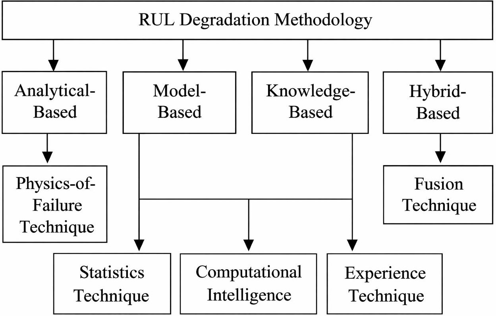

Figure 1. Classification techniques for RUL prediction [30]. Arrows denote the relationships between major methodological categories and their associated techniques.

Thermal stress is a major driver of insulation aging and failure in motor stator windings and power connections, and winding temperature is also one of the few degradationrelevant variables that is commonly available in standard SCADA systems. This aging mechanism is commonly described using Arrhenius-type laws and cumulative damage concepts, under which even modest temperature increases can sharply reduce insulation life [36-39]. Experimental and field studies have shown that sustained operation at elevated temperature accelerates degradation in slot liners, end-winding regions, and terminal connections [40]. Reliability studies further report that unbalanced supply voltages, poor contact points, inadequate cooling, and frequent overloads can create localized hot spots and stator damage [41-48]. For this reason, the present study focuses on thermally induced

<!-- PDF_PAGE: 3 -->

degradation in three-phase motors using phase winding-temperature measurements available in historian databases. Figures 2 and 3 illustrate the sensitivity of winding temperature to loading conditions, while Figure 4 shows representative stator damage associated with thermal overstress [40,41].

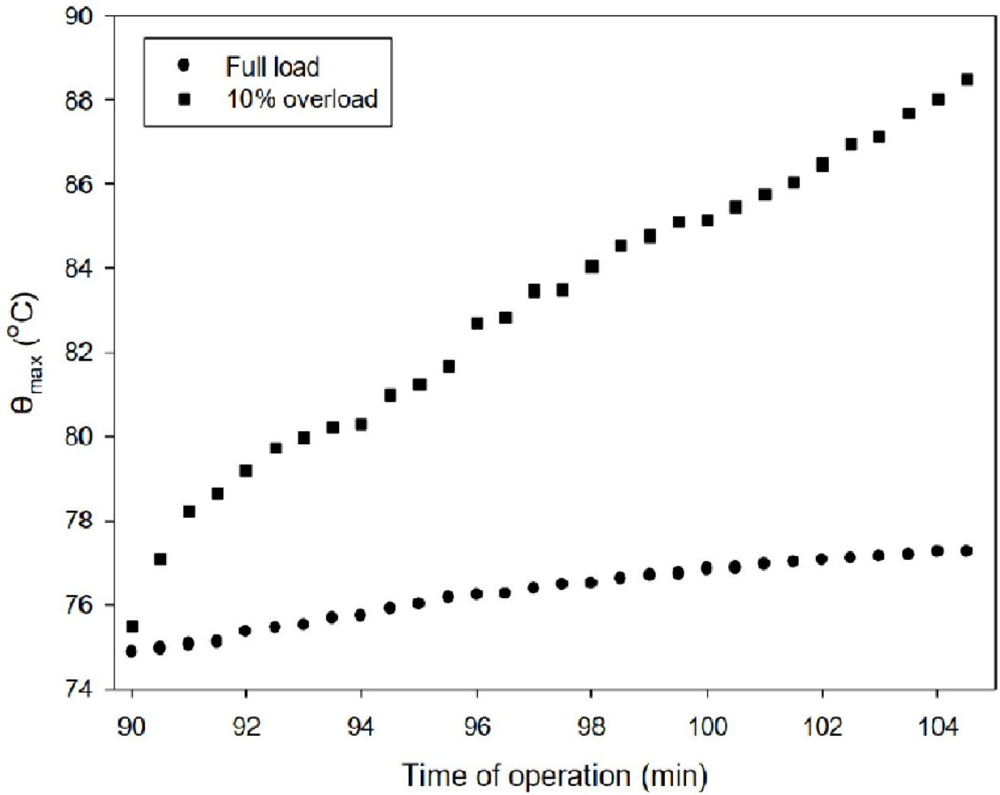

Figure 2. Winding temperature under full load and 10% overload [40].

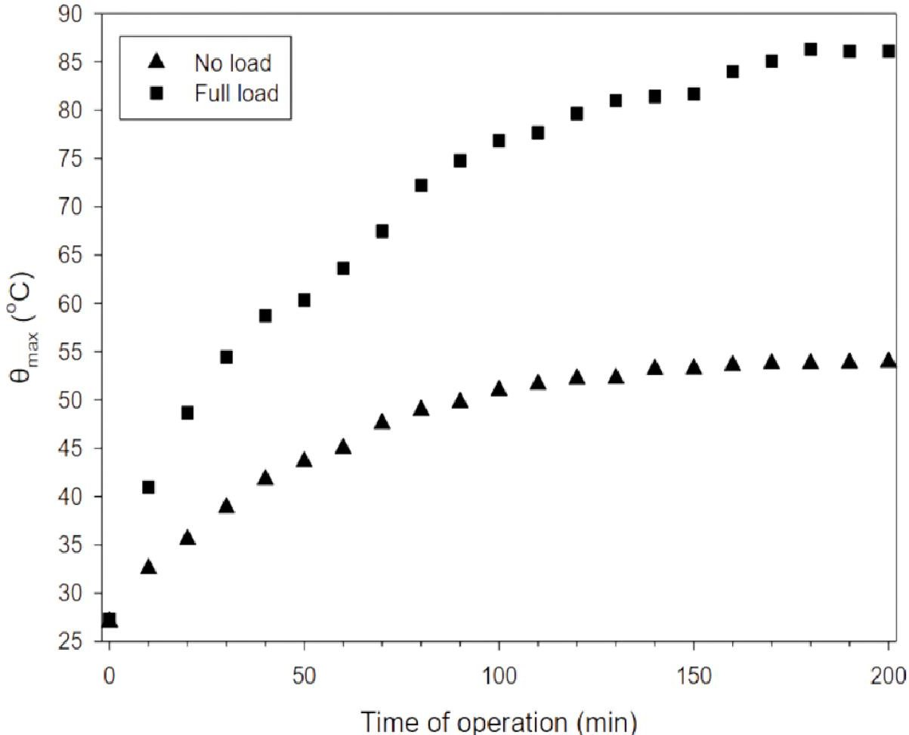

Figure 3. Winding temperatures under zero-load and full-load conditions [40].

<!-- PDF_PAGE: 4 -->

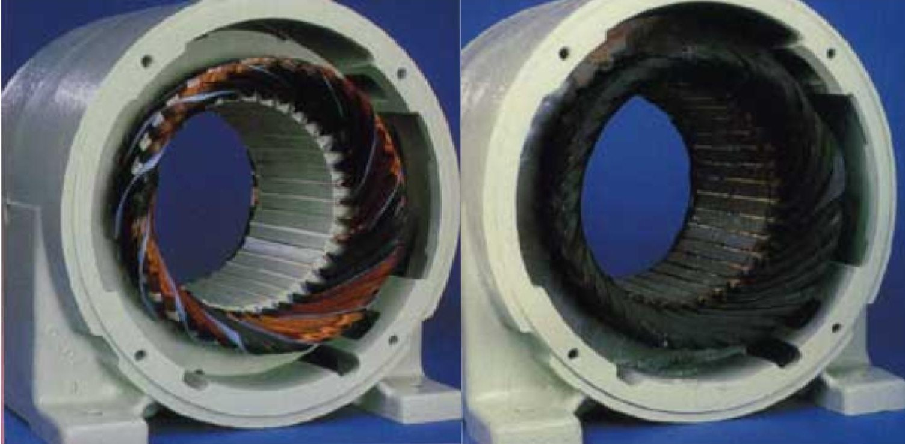

Figure 4. Stator winding damage due to unbalanced supply voltage and overload [41]. The left image shows lighter copper-colored winding regions, while the right image shows pronounced dark black/brown discoloration, which visually indicates severe thermal damage and insulation deterioration.

## 1.2. Background and Research Gap

The prognostics literature includes a broad spectrum of data-driven, physics-based, and hybrid methods for industrial assets. Existing RUL studies have used regression, probabilistic filtering, and survival analysis across different components and operating conditions [16,21,49-51]. More recent work has also emphasized robustness under nonstationary operation, where duty-cycle variation and changing operating regimes can degrade model performance [25,26,34,52]. In addition to predictive accuracy, prior reviews have highlighted interpretability, rigorous validation, and data-governance requirements, especially when only SCADA-level features are available [15,30,53]. Related work has therefore explored privacy-aware, federated, and weakly supervised approaches for compressed or decentralized industrial data streams [32,54-60].

At the same time, physics-informed and hybrid prognostic frameworks have gained attention because they can combine domain knowledge with the flexibility of machine learning while preserving interpretability [17,28,33,53-55,61-65]. However, an important gap remains for industrial motor fleets: many published studies assume measurements that are richer than those routinely available in deployed assets.

A large part of the motor-prognostics literature relies on high-frequency sensing and extensive instrumentation for feature extraction and fault-signature detection, including vibration, acoustic sensing, high-rate electrical waveforms and their spectral features, and sometimes thermal imaging. Although these measurements can be highly informative, they generally require dedicated sensors, high-bandwidth acquisition, and controlled experimental protocols. In contrast, industrial SCADA/historian environments usually provide only a limited number of process-level tags, recorded asynchronously, at low effective update rates, and with inter-tag time misalignment. As a result, there is a need for prognostic methods that are not only compatible with SCADA data after post-processing, but are explicitly designed for SCADA deployment.

This need motivates prognostic methodologies that (i) use only signals commonly available in SCADA databases, (ii) produce a low-dimensional and physically interpretable degradation metric, and (iii) integrate naturally with real-time classification logic and existing dashboards. In particular, a framework based on torque, speed, and winding

<!-- PDF_PAGE: 5 -->

temperature, while explicitly accounting for thermally accelerated degradation, can provide a practical alternative to sensor-intensive approaches and remain compatible with installed monitoring infrastructure.

## 1.3. Research Questions

To address this SCADA-oriented gap, this study investigates the following research questions:

RQ1 Can a cumulative temperature-weighted work (TWW) index, computed solely from commonly available SCADA tags (winding temperatures, speed, and torque/load), produce an interpretable and monotonic degradation trajectory for industrial motors?

RQ2 Does the proposed failure-referenced thresholding, through $ W_{T,\mathrm{Failure}} $ provide an actionable health/RUL proxy that is consistent with documented removal and failure events?

RQ3 Under realistic operating variability and SCADA data-quality limitations (asynchronous tag updates with heterogeneous reporting intervals, inter-signal time misalignment, and occasional sensor outliers), which implementation choices (e.g., resampling step $ \Delta t $ , operating-state filtering, and robust temperature consolidation) are required to ensure stable and reliable deployment?

To address these inquiries, this study proposes a temperature-weighted work (TWW) framework for assessing the condition of industrial motors utilizing solely torque, speed, and temperature measurements. This approach accumulates mechanical loading over time and assigns increased significance to operations conducted at elevated winding temperatures. Consequently, it produces a singular scalar degradation index that engineers can evaluate and employ directly as an input for straightforward classification or decision-making rules in maintenance planning. In this study, RUL is conceptualized as a normalized, failure-referenced health proxy derived from cumulative exposure, rather than as a probabilistic estimate of time-to-failure.

## 1.4. Contributions and Novelty

Motivated by the need for prognostic methods that rely only on SCADA/historian tags while remaining interpretable and deployable within existing maintenance workflows, this work makes the following contributions:

(i) It formulates a temperature-weighted work (TWW) degradation index that combines torque-speed mechanical work with an adaptive exponential weighting of winding temperature to emphasize thermally accelerated aging. The weighting is inspired by the practical thermal-severity intuition associated with Montsinger-type aging heuristics, but is used here as an online SCADA-compatible temperature-emphasis index rather than as a direct implementation of a fixed absolute-temperature life law.

(ii) It outlines a SCADA pipeline designed for effective implementation, which includes resampling data to align with a uniform time grid, applying filters based on operational states, and consolidating temperature data from multiple sensors in a robust manner. This setup enables the online computation of the metric using low-frequency historian data, eliminating the need for additional instrumentation.

(iii) It proposes a failure-referenced mapping from the cumulative TWW index to a normalized health/RUL proxy using an empirically identified threshold $ W_{T, \mathrm{F a i l u r e}} $ and it provides a theoretical sensitivity analysis showing how perturbations of this calibrated threshold affect the reported RUL values.

(iv) It validates the approach on industrial field data through fleet-level analyses against documented maintenance events, and through forward-looking case studies in which

<!-- PDF_PAGE: 6 -->

motors flagged as high-risk by TWW are proactively removed and subsequently found to exhibit winding degradation upon inspection.

The remainder of this manuscript is organized as follows. Section 2 presents the temperature-weighted work (TWW) framework, including data preprocessing, thermal weighting, cumulative damage computation, and theoretical sensitivity analyses. Section 3 reports the case studies based on SCADA-level measurements, including key implementation choices and validation against observed maintenance outcomes. Section 4 summarizes the main findings, discusses practical implications for SCADA-based motor monitoring, and outlines directions for future work.

## 2. Methodology

Developed in this section is a methodology for estimating the RUL of industrial motors using the proposed TWW framework. The workflow consists of four primary stages: data preprocessing, thermal-based weight assignment, cumulative TWW computation, and final RUL estimation. Preprocessing begins with the winding temperatures from the three phases, motor speed, torque, and electrical power. These signals are first synchronized onto a common time base and restricted to energized/load periods. To mitigate faulty sensor-reported values in the winding-temperature channels, a robust phase-wise consolidation based on the sample-wise median is applied, and no samples are removed solely due to temperature outlier values. The TWW index is then computed from the winding-temperature, speed, and torque measurements. At the core of the algorithm is the assignment of exponentially scaled weights to each sample based on its winding temperature relative to nominal operating conditions.

The overall workflow is illustrated in Figure 5. This section presents the general formulation of each stage in a manner that is independent of any particular plant or data set. Specific implementation choices, such as the resampling interval, power thresholds, and parameter values used in the field study, are described later in the paper when discussing the industrial case study and its results.

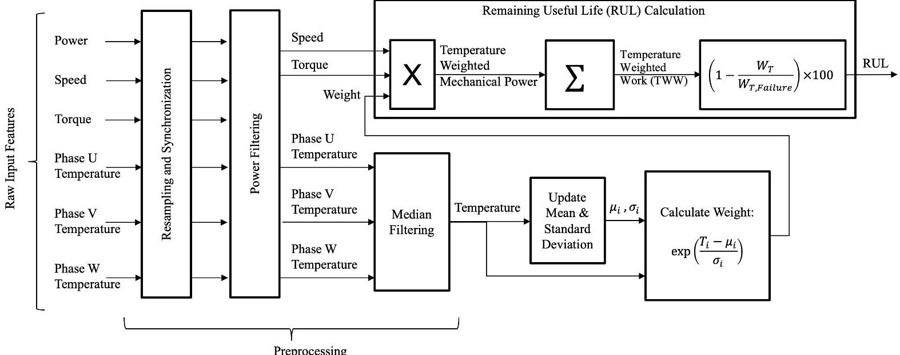

Figure 5. Flow diagram of the proposed TWW methodology. Arrows indicate the direction of data flow and the sequential transformation of signals from raw SCADA inputs to the final RUL estimate.

## 2.1. Data Preprocessing

Data preprocessing is essential to ensure that the TWW index can be reliably computed from SCADA- or historian-level data. In a typical deployment, the available tags include the winding temperature, motor speed, torque or load, and power. Because these signals

<!-- PDF_PAGE: 7 -->

are often sampled at low rates and with irregular timestamps, a preprocessing pipeline is required to (i) synchronize all measurements to a shared set of timestamps, i.e., resample each signal onto the same uniformly spaced time grid, (ii) restrict the analysis to periods when the motor is actually operating under load, and (iii) consolidate the temperature measurements in a robust manner so that occasional sensor outliers do not dominate the degradation metric. Here, irregular timestamps primarily reflect asynchronous tag updates with different scan rates and inter-tag time misalignment.

All relevant tags are synchronized by interpolating each signal onto a common, uniformly spaced time grid with resampling interval $ \Delta t $ . The interval $ \Delta t $ is selected to (i) resolve the dominant variations in winding temperature, torque, and speed, (ii) remain consistent with the historian logging frequency, and (iii) avoid oversampling that would introduce redundancy without adding information. Given the asynchronous and nonuniform time stamps typical of SCADA/historian archives, each signal is mapped to this grid via cubic spline interpolation [66,67], yielding aligned samples at a consistent temporal resolution and reducing artifacts associated with nonuniform sampling.

Not all time intervals contribute meaningfully to thermomechanical degradation. Thus, an operating-state filter is applied, relying solely on the measured electrical input energy proxy available in the historian, specifically the active power signal, without incorporating any additional ground-truth operating labels. A user-specified threshold $ P_{\mathrm{min}} $ is applied to the active power to exclude periods when the motor is de-energized, idle, or carrying a negligible load. Only samples satisfying $ P(t)\geq P_{\mathrm{min}} $ are retained for the TWW computation. Conceptually, this power-based screening separates the winding-temperature distribution observed during energized operation from that observed during non-operating periods. As illustrated in Figure 6, the filter concentrates the analysis on the higher-temperature regimes most relevant to insulation aging and thermomechanical stress.

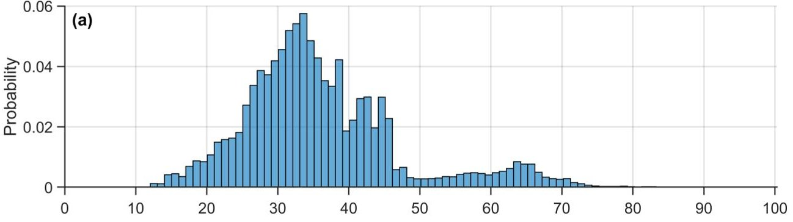

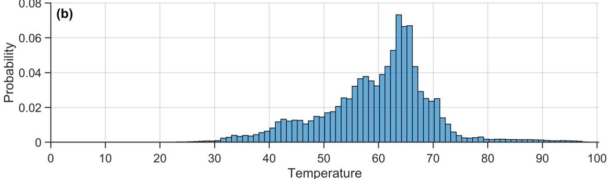

Figure 6. Probability distributions of winding temperature (in $ ^{\circ} \mathrm{C} $ ) before and after applying the operating-state (load) filter based on the input electrical power. (a) Temperature distribution prior to filtering using all available samples. (b) Temperature distribution after filtering to retain only energized/load periods with input power exceeding 1 kW (i.e., discarding samples with Power $ < 1 \mathrm{kW} $ ). The filter removes the non-operating or lightly loaded regime (typically associated with lower temperatures), ensuring that the temperature-weighted work (TWW) computation is based on intervals when the motor is carrying load.

<!-- PDF_PAGE: 8 -->

In many installations, multiple temperature measurements are available for a given motor (e.g., three-phase-specific winding sensors or multiple stator RTDs). To obtain a single representative winding temperature $ T_{i} $ at each time step i, the individual sensor readings can be consolidated using a robust statistic, such as the median across sensors. This consolidation mitigates the influence of a single faulty or drifting sensor and reduces the impact of isolated outlier values (erroneous spikes) returned by the sensor, rather than empty or missing readings. However, this median-based consolidation can reduce sensitivity to inter-phase thermal asymmetry, since a localized temperature rise affecting only one phase may be attenuated in the aggregated signal. This limitation is especially relevant when degradation is strongly phase-localized and does not appreciably affect the remaining sensors. Accordingly, the resulting TWW index should be interpreted primarily as an overall winding thermal-degradation indicator rather than as a dedicated detector of imbalance-driven faults.

Figure 7 illustrates this consolidation step: individual phase temperatures are shown together with their median, which provides a single robust temperature trace that more faithfully reflects the thermal state of the windings. This consolidated temperature is then used as the input $ T_{i} $ in the subsequent TWW calculations.

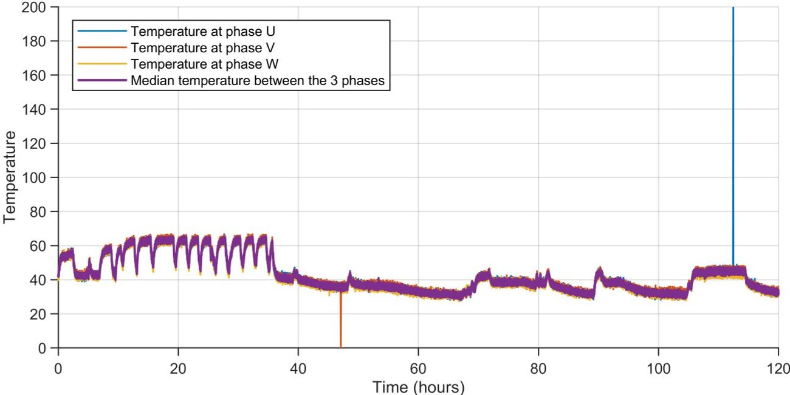

Figure 7. Example of winding temperature (in $ ^{\circ} \mathrm{C} $) consolidation from multiple phase-specific sensors. The three raw winding temperature signals are combined at each timestamp using a sample-wise median to obtain a single representative winding temperature trajectory. This consolidation reduces the influence of sensor noise, outliers, and slow drift and provides the aggregated temperature input $ T_{i} $ used in the subsequent TWW calculation.

## 2.2. TWW Calculation

The TWW calculation combines dynamic thermal statistics with a temperature-dependent weighting of mechanical work. At each time step i, the algorithm updates a running mean $ \mu_{i} $ and a running standard deviation $ \sigma_{i} $ of the consolidated winding temperature $ T_{i} $ . These statistics capture the long-term thermal operating point and its variability, and they form the basis for assigning a dimensionless thermal weight $ w_{i} $ that emphasizes operation at unusually high temperatures. The cumulative TWW index $ W_{T} $ is then obtained by aggregating, over time, the product of this thermal weight with the instantaneous mechanical loading expressed by the motor speed $ S_{i} $ , torque $ \tau_{i} $ , and sampling interval $ \Delta t $ .

<!-- PDF_PAGE: 9 -->

To establish a memory of the historical thermal environment without storing the full time series, the running mean temperature $ \mu_{i} $ is updated recursively from the previous mean $ \mu_{i-1} $ , the current temperature $ T_{i} $ , and the total number of samples $ N_{i} $ :

$$
\mu_ {i} = \frac {\left(N _ {i} - 1\right) \mu_ {i - 1} + T _ {i}}{N _ {i}}
$$

This online computation monitors long-term temperature trends while mitigating short-term fluctuations.

In a similar fashion, the running temperature standard deviation $ \sigma_{i} $ is updated so that the dispersion of the temperature signal is tracked consistently with the evolving mean. Using the previous standard deviation $ \sigma_{i-1} $ , the previous mean $ \mu_{i-1} $ , and the current temperature sample $ T_{i} $ , the update is given by:

$$
\sigma_ {i} = \sqrt {\frac {\left(N _ {i} - 1\right) \left(\sigma_ {i - 1} ^ {2} + \mu_ {i - 1} ^ {2}\right) + T _ {i} ^ {2}}{N _ {i}} - \mu_ {i} ^ {2}}
$$

This formulation captures the variability of the thermal environment in an efficient incremental manner, which is crucial for the subsequent application of exponential weighting.

Based on these statistics, each sample is assigned a dimensionless thermal weight $ w_{i} $ that depends on the deviation of $ T_{i} $ from the running mean, expressed in units of the running standard deviation. Samples that are several standard deviations above $ \mu_{i} $ are mapped to large weights, while samples near or below the mean receive weights close to or below unity, so that high-temperature operating conditions are emphasized, as exemplified in Figure 8.

$$
w _ {i} = e ^ {\frac {T _ {i} - \mu_ {i}}{\sigma_ {i}}}
$$

In this formulation, samples exceeding the historical mean are amplified, whereas those below it are attenuated. An increase of one running standard deviation in temperature multiplies the weight by e $ \approx $ 2.718, thereby introducing a geometric increase in the penalty assigned to hotter operating conditions.

It is emphasized that (3) is not intended as a direct implementation of Montsinger's law and is not structurally equivalent to a fixed absolute-temperature lifetime rule. Rather, it is an adaptive temperature-emphasis index designed for practical SCADA-based deployment. The role of the exponential mapping is to preserve the same qualitative engineering idea that motivates Montsinger-type thermal-aging heuristics, namely that higher winding temperatures produce a disproportionately larger degradation effect than lower temperatures.

The quantities $ \mu_{i} $ and $ \sigma_{i} $ are introduced as running, motor-specific statistics so that the weighting can be computed online from asynchronously reported historian data. Using the mean and variance of the entire dataset would either rely on future-unavailable global statistics or require repeated recomputation of the full $ W_{T} $ trajectory as new samples arrive, which is impractical for online deployment.

Accordingly, $ \mu_{i} $ and $ \sigma_{i} $ are used as an adaptive normalization tied to the evolving operating history of each motor. This does not imply a universal absolute-temperature degradation constant, since insulation aging depends on multiple winding- and system-specific factors. The connection to Montsinger's rule is therefore qualitative rather than literal: both reflect the geometric increase of degradation with temperature, but the present formulation is a lightweight adaptive index for historian-based monitoring rather than a direct life-law model.

<!-- PDF_PAGE: 10 -->

Finally, the cumulative TWW $ W_{T} $ aggregates the thermally weighted mechanical work over the observation window. At each time step, the instantaneous mechanical loading is represented by the product of the motor speed $ S_{i} $ , torque $ \tau_{i} $ , and sampling interval $ \Delta t $ , and is scaled by the corresponding thermal weight $ w_{i} $ . The resulting index is defined as follows:

$$
W _ {T} = \sum w _ {i} S _ {i} \tau_ {i} \Delta t
$$

so that periods of high torque and speed at elevated temperatures contribute disproportionately to the total and the final scalar metric reflects both the magnitude of the mechanical loading and the severity of the thermal environment.

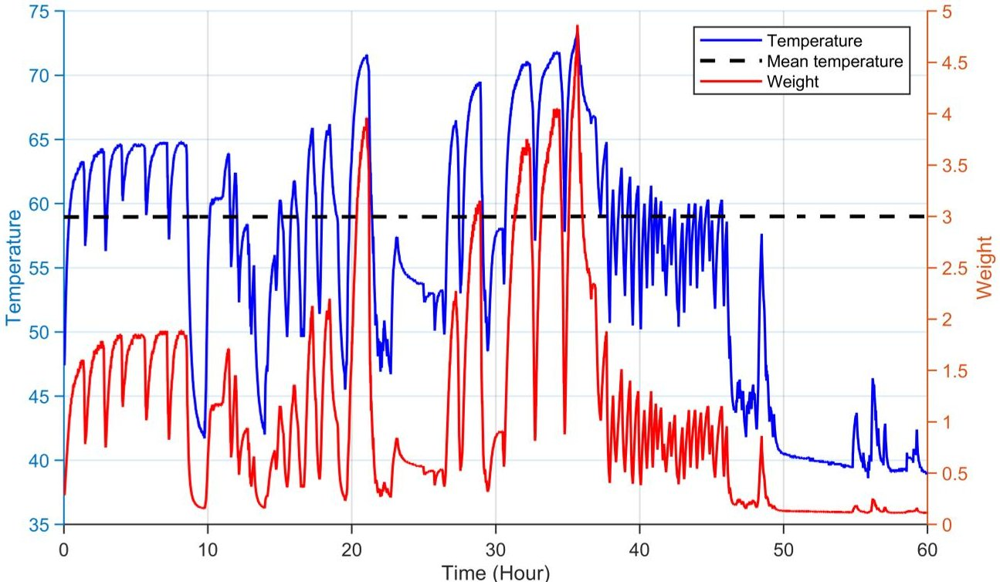

Figure 8. Illustrative example of the temperature-dependent weight function $ w ( T ) $ used in the TWW algorithm. The left axis corresponds to the winding temperature (in $ ^{\circ} \mathrm{C} $), and the right axis corresponds to the weight. Samples near the running mean receive modest weights, whereas samples several standard deviations above the mean receive exponentially larger weights, emphasizing high-temperature operating conditions. Because $ \mu_{i} $ and $ \sigma_{i} $ are running statistics computed from each motor's thermal history, the figure is schematic and intended to illustrate the weighting behavior rather than to report a single universal numerical range of $ \mu_{i} $ and $ \sigma_{i} $

## 2.3. RUL Calculation

After calculating the cumulative TWW $ W_{T} $ for each motor, the RUL is estimated as the percentage of useful life remaining before a predetermined empirical failure threshold $ W_{T,\mathrm{Failure}} $ is reached. In the subsequent discussion, $ W_{T} $ denotes the TWW index and $ W_{T,\mathrm{Failure}} $ denotes the corresponding failure threshold. The threshold $ W_{T,\mathrm{Failure}} $ is determined empirically from historical motors that reached terminal winding failure. For each failed motor, the terminal value of the TWW index is extracted at the documented failure event, and $ W_{T,\mathrm{Failure}} $ is defined as the median of these terminal TWW values across the failed-motor set. This median-based definition is retained because, as additional failed-motor cases become available, the median provides a threshold-update rule that is less sensitive to outlying terminal values than an extremum-based calibration. In the present study, however, only two failed motors are available, so $ W_{T,\mathrm{Failure}} $ should be interpreted as an initial fleet-specific calibration rather than as a statistically mature robust estimator. The

<!-- PDF_PAGE: 11 -->

resulting threshold is then used to normalize the cumulative TWW trajectory and define the Remaining Useful Life proxy.

$$
\mathrm {R U L} = \left(1 - \frac {W _ {T}}{W _ {T , \mathrm {F a i l u r e}}}\right) \times 1 0 0
$$

This definition provides a relative, fleet-specific health normalization rather than an absolute lifetime prediction transferable across motor designs or operating regimes.

In this context, RUL = 0% signifies that the motor has reached a cumulative thermomechanical load equivalent to the identified failure threshold, whereas positive values denote the percentage of the anticipated remaining operational life.

This straightforward yet interpretable formulation facilitates the effective monitoring and forecasting of motor health with minimal sensor input. This capability enables maintenance planners to anticipate failures and schedule proactive replacements based on data-driven criteria rather than arbitrary time intervals.

## 2.4. Sensitivity and Uncertainty Analysis

This subsection provides a theoretical sensitivity and uncertainty analysis of the proposed TWW formulation with respect to the resampling interval $ \Delta t $ , additive sensor noise, and perturbations of the calibrated failure threshold used in the failure-referenced RUL proxy. The objective is to clarify the stability of both the cumulative index and its associated RUL mapping under practically relevant implementation, measurement, and calibration uncertainties.

## 2.4.1. Convergence with Respect to the Resampling Interval $ \Delta t $

Define

$$
g (t) = \mathbb {I} \left\{P (t) \geq P _ {\min } \right\} w (t) s (t) \tau (t),
$$

so that the continuous-time cumulative temperature-weighted work over $ [0,T] $ is:

$$
W _ {T} (T) = \int_ {0} ^ {T} g (t) d t.
$$

After synchronization and resampling on the uniform grid $ t_{i}=i \Delta t $ , the discrete approximation becomes:

$$
W _ {T} ^ {(\Delta t)} (T) = \sum_ {i = 0} ^ {N - 1} g \left(t _ {i}\right) \Delta t, \quad T = N \Delta t.
$$

Assume that $ g ( t ) $ is piecewise Lipschitz continuous on $ [ 0,T] $ , with Lipschitz constant $ L_{g} $ on intervals where the operating-state indicator is constant, and let M denote the number of switching times of $ \mathbb{I}\{P(t)\geq P_{\min}\} $ . Then:

$$
\left| W _ {T} (T) - W _ {T} ^ {(\Delta t)} (T) \right| \leq \frac {L _ {g} T}{2} \Delta t + C _ {\mathrm {s w}} M \Delta t,
$$

for some constant $ C_{\mathrm{sw}} > 0 $ . Hence:

$$
\left| W _ {T} (T) - W _ {T} ^ {(\Delta t)} (T) \right| = O (\Delta t), \quad \Delta t \rightarrow 0.
$$

Thus, the proposed TWW accumulation converges linearly to its continuous-time counterpart as the resampling interval decreases, up to local first-order contributions near operating-state switching times.

<!-- PDF_PAGE: 12 -->

## 2.4.2. Robustness of Temperature Mean and Variance Estimates Under Additive Sensor Noise

Let the observed temperature samples be;

$$
\tilde {T} _ {j} = T _ {j} + \varepsilon_ {j} ^ {(T)}, \quad j = 1, \dots , n,
$$

where $ \varepsilon_{j}^{(T)} $ is zero-mean additive sensor noise, assumed independent across j. Let $ \hat{\mu}_{n} $ denote the sample mean of $ \{\tilde{T}_{j}\}_{j=1}^{n} $ , and let $ \hat{v}_{n} $ denote the empirical variance of $ \{\tilde{T}_{j}\}_{j=1}^{n} $ computed with denominator n. Let $ \mu_{\tilde{T}} $ and $ \sigma_{\tilde{T}}^{2} $ denote the mean and variance of the observed temperature. Then the standard results give the following:

$$
\mathbb {E} [ \hat {\mu} _ {n} ] = \mu_ {\tilde {T}}, \quad \operatorname {V a r} (\hat {\mu} _ {n}) = \frac {\sigma_ {\tilde {T}} ^ {2}}{n},
$$

so the mean estimator is unbiased and becomes increasingly stable as the number of samples increases.

If $ \hat{v}_{n} $ is defined with denominator n, then:

$$
\mathbb {E} [ \hat {v} _ {n} ] = \frac {n - 1}{n} \sigma_ {\tilde {T}} ^ {2}, \quad \operatorname {V a r} (\hat {v} _ {n}) = O (1 / n),
$$

so the variance estimator is asymptotically stable under additive sensor noise [68].

## 2.4.3. Mean and Variance of the Noisy TWW Estimate

Consider the noisy TWW estimate:

$$
\widetilde {W} _ {T} = \Delta t \sum_ {i = 1} ^ {N} \mathbb {I} \left\{P _ {i} \geq P _ {\min } \right\} \left(\tau_ {i} + \varepsilon_ {i} ^ {(\tau)}\right) \left(s _ {i} + \varepsilon_ {i} ^ {(s)}\right) \exp \left(\frac {T _ {i} + \varepsilon_ {i} ^ {(T)} - \mu}{\sigma}\right),
$$

where $ \tau_{i} $ is the torque, $ s_{i} $ is the speed, and $ T_{i} $ is the temperature. Assume that the sensor noises are mutually independent, independent across time, zero-mean, with variances:

$$
\operatorname {V a r} \left(\varepsilon_ {i} ^ {(\tau)}\right) = \nu_ {\tau} ^ {2}, \quad \operatorname {V a r} \left(\varepsilon_ {i} ^ {(s)}\right) = \nu_ {s} ^ {2}, \quad \operatorname {V a r} \left(\varepsilon_ {i} ^ {(T)}\right) = \nu_ {T} ^ {2},
$$

and that $ \varepsilon_{i}^{(T)} \sim \mathcal{N}(0, \nu_{T}^{2}). $

Under these assumptions:

$$
\mathbb {E} \left[ \widetilde {W} _ {T} \right] = \Delta t \sum_ {i = 1} ^ {N} \mathbb {I} \left\{P _ {i} \geq P _ {\min } \right\} \tau_ {i} s _ {i} \exp \left(\frac {T _ {i} - \mu}{\sigma}\right) \exp \left(\frac {\nu_ {T} ^ {2}}{2 \sigma^ {2}}\right),
$$

and, for small temperature-noise variance:

$$
\mathbb {E} \left[ \tilde {W} _ {T} \right] \approx W _ {T} \left(1 + \frac {\nu_ {T} ^ {2}}{2 \sigma^ {2}}\right).
$$

Likewise:

$$
\operatorname {V a r} \left(\widetilde {W} _ {T}\right) = \Delta t ^ {2} \sum_ {i = 1} ^ {N} \mathbb {I} \left\{P _ {i} \geq P _ {\min } \right\} V _ {i},
$$

with the first-order approximation:

<!-- PDF_PAGE: 13 -->

$$
V _ {i} \approx \exp \left(2 \frac {T _ {i} - \mu}{\sigma}\right) \left[ \left[ \left(\tau_ {i} ^ {2} + \nu_ {\tau} ^ {2}\right) \left(s _ {i} ^ {2} + \nu_ {s} ^ {2}\right) - \tau_ {i} ^ {2} s _ {i} ^ {2} \right] + \frac {\nu_ {T} ^ {2}}{\sigma^ {2}} \left[ 2 \left(\tau_ {i} ^ {2} + \nu_ {\tau} ^ {2}\right) \left(s _ {i} ^ {2} + \nu_ {s} ^ {2}\right) - \tau_ {i} ^ {2} s _ {i} ^ {2} \right] \right].
$$

Therefore, additive torque and speed noise contribute to the variance of the TWW estimate, while additive temperature noise affects both its variance and its mean through the exponential weighting.

## 2.4.4. Sensitivity of the Failure-Referenced RUL Proxy to Threshold Perturbations

Because the failure-referenced RUL proxy depends on the empirically calibrated threshold $ W_{T, \mathrm{F a i l u r e}} $ it is useful to examine how moderate threshold perturbations affect the reported RUL values. Let the perturbed threshold be defined as follows:

$$
W _ {T, \mathrm {F a i l u r e}} = (1 + \epsilon) W _ {T, \mathrm {F a i l u r e}} ^ {\mathrm {t r u e}},
$$

where $ \epsilon>-1 $ denotes the relative perturbation with respect to the nominal threshold $ W_{T, \mathrm{Failure}}^{\mathrm{true}}. $ The corresponding RUL proxy is then:

$$
\mathrm {R U L} (\epsilon) = 1 0 0 \left(1 - \frac {W _ {T}}{(1 + \epsilon) W _ {T , \mathrm {F a i l u r e}} ^ {\mathrm {t r u e}}}\right),
$$

whereas the nominal value is:

$$
\mathrm {R U L} (0) = 1 0 0 \left(1 - \frac {W _ {T}}{W _ {T , \mathrm {F a i l u r e}} ^ {\mathrm {t r u e}}}\right).
$$

Subtracting the nominal expression from the perturbed one yields:

$$
\mathrm {R U L} (\epsilon) - \mathrm {R U L} (0) = 1 0 0 \frac {W _ {T}}{W _ {T , \mathrm {F a i l u r e}} ^ {\mathrm {t r u e}}} \frac {\epsilon}{1 + \epsilon}.
$$

Using RUL(0) = 100 $ \left( 1-\frac{W_{T}}{W_{T,\mathrm{Failure}}^{\mathrm{true}}}\right) $ , this can be rewritten as follows:

$$
\mathrm {R U L} (\epsilon) - \mathrm {R U L} (0) = (1 0 0 - \mathrm {R U L} (0)) \frac {\epsilon}{1 + \epsilon}.
$$

Equation (24) shows that the RUL perturbation varies smoothly with the threshold perturbation and scales with proximity to the failure boundary. In particular, the magnitude of $ \mathrm{RUL}(\epsilon)-\mathrm{RUL}(0) $ increases as $ \mathrm{RUL}(0) $ decreases, indicating that the absolute RUL percentage is more sensitive to threshold perturbations when the motor is already close to the calibrated failure level. This behavior is illustrated in Figure 9, which plots $ \mathrm{RUL}(\epsilon)-\mathrm{RUL}(0) $ versus $ \mathrm{RUL}(0) $ for representative perturbations $ \epsilon=\pm 0.01,\pm 0.05,\pm 0.10,\pm 0.20. $

At the same time, for any fixed $ \epsilon>-1 $ , the mapping in (24) remains monotone with respect to $ W_{T} $ . Consequently, moderate perturbations of $ W_{T,\mathrm{Failure}} $ primarily rescale the numerical RUL percentage without altering the relative ordering of motors by degradation severity. In practical terms, this means that moderate threshold uncertainty affects the absolute reported RUL values more than the qualitative screening decision, since the motors closest to the failure boundary remain the motors with the largest cumulative temperature-weighted work. This observation supports the use of the proposed failure-referenced RUL proxy as a fleet-screening and maintenance-prioritization indicator, while also confirming that its interpretation should remain tied to the empirically calibrated fleet-specific threshold.

<!-- PDF_PAGE: 14 -->

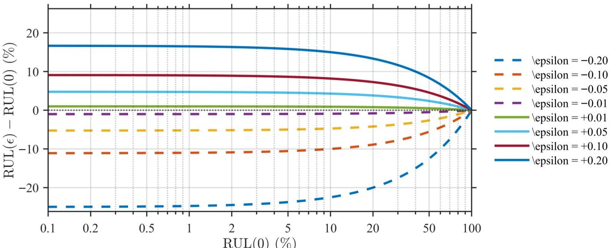

Figure 9. Analytical sensitivity of the failure-referenced RUL proxy to perturbations in the calibrated threshold, shown as $ \mathrm{RUL}(\epsilon)-\mathrm{RUL}(0) $ versus the nominal value $ \mathrm{RUL}(0) $ on a logarithmic horizontal axis. Each colored curve corresponds to a threshold perturbation $ \epsilon $ listed in the legend. Solid curves denote positive perturbations $ (\epsilon>0) $ , which increase the reported RUL, while dashed curves denote negative perturbations $ (\epsilon<0) $ , which decrease it. The faint vertical and horizontal background grid lines are included only to aid visual reading of the logarithmic scale and response levels.

## 2.4.5. Interpretation with Respect to Implementation Robustness

The previous results support four practical conclusions. First, the discrete TWW accumulation converges linearly to its continuous-time counterpart as $ \Delta t $ decreases. Second, the running temperature mean and variance statistics become increasingly stable as the number of samples increases, with estimator uncertainty decaying at rate $ O(1/n) $ . Third, additive temperature noise has a stronger effect on the TWW estimate than additive speed or torque noise because it enters through the exponential weighting; however, for sufficiently small temperature-noise variance relative to $ \sigma^{2} $ , the resulting bias remains controlled. Fourth, perturbations of the calibrated threshold $ W_{T, F a i l u r e} $ primarily rescale the absolute numerical value of the failure-referenced RUL proxy while preserving its monotone dependence on $ W_{T} $ , so moderate threshold uncertainty affects the reported RUL percentage more than the qualitative ranking of motors by degradation severity.

## 2.5. Implementation Summary and Parameterization

To facilitate reproducibility and deployment from SCADA/historian tags, Algorithm 1 summarizes the end-to-end computation of the temperature-weighted work (TWW) index and its mapping to a normalized health/RUL proxy. Table 1 lists the key implementation parameters that must be selected for a given plant, including the resampling step $ \Delta t $ , operating-state filters, and outlier mitigation via robust phase-wise temperature consolidation.

Table 1. TWW implementation parameters used in this study.

<table border="1"><tr><td>Parameter</td><td>Description</td><td>Value</td></tr><tr><td>$\Delta t$</td><td>Resampling step</td><td>1s</td></tr><tr><td>Resampling method</td><td>Synchronization of asynchronous historian tags onto $\{t_{i}\}$</td><td>Cubic spline interpolation</td></tr><tr><td>$P_{\min}$</td><td>Minimum power threshold for operating-state filter</td><td>1kW</td></tr><tr><td>$f_{T}(\cdot)$</td><td>Winding temperature consolidation</td><td>median</td></tr></table>

<!-- PDF_PAGE: 15 -->

Algorithm 1 Temperature-Weighted Work (TWW) computation and failure-referenced RUL proxy mapping.

Time-stamped SCADA signals: phase winding temperatures $ T_{U}(t), T_{V}(t), T_{W}(t) $ speed $ S(t) $ , torque $ \tau(t) $ , and input electrical power $ P(t) $ . Parameters in Table 1, including $ \Delta t $ , operating-state thresholds, and $ W_{T, \mathrm{Failure}} $ . Cumulative index $ W_{T,i} $ and proxy $ RUL_{i} $ on the synchronized grid. Define a uniform time grid $ \{t_{i}\}_{i=0}^{N} $ with step $ \Delta t=1 $ s over the analysis window. Resample each asynchronous historian tag onto $ \{t_{i}\} $ using cubic spline interpolation (no extrapolation beyond available timestamps).

1: Operating-state (load) filter: mark sample i as valid if the motor is energized/loaded:

$$
P _ {i} \geq P _ {\min }.
$$

2. Phase-to-winding temperature consolidation: compute a robust winding-temperature estimate:

$$
T _ {i} = f _ {T} \left(T _ {U, i}, T _ {V, i}, T _ {W, i}\right),
$$

where $ f_{T}(\cdot) $ suppresses single-phase sensor spikes (in this work, $ f_{T}= $ median).

3: Online thermal statistics: update the running mean $ \mu_{i} $ and standard deviation $ \sigma_{i} $ using only valid samples (Equations (1) and (2)).

4: Thermal weight: compute:

$$
w _ {i} = \exp \left(\frac {T _ {i} - \mu_ {i}}{\sigma_ {i}}\right).
$$

5: Cumulative TWW: update:

$$
W _ {T, i} = \left\{ \begin{array}{l l} W _ {T, i - 1} + w _ {i} S _ {i} \tau_ {i} \Delta t, & \text {i f s a m p l e} i \text {i s v a l i d}, \\ W _ {T, i - 1}, & \text {o t h e r w i s e}. \end{array} \right.
$$

6. Failure-referenced RUL proxy: map the cumulative index to a percentage scale using the empirical terminal threshold:

$$
R U L _ {i} = \left(1 - \frac {W _ {T , i}}{W _ {T , \mathrm {F a i l u r e}}}\right) \times 1 0 0.
$$

## 3. Results

The proposed TWW framework was validated utilizing industrial field data from SCADA/historian systems through a three-step process. Initially, the SCADA dataset and the implementation decisions necessary for computing the TWW index from archived historian tags are delineated. Subsequently, the consistency at the fleet level between the accumulated TWW exposure and documented failure/removal events is assessed. Finally, forward-looking case studies are presented, wherein motors identified as high risk by the TWW index were preemptively removed from service and were later found to exhibit stator-winding degradation upon inspection.

## 3.1. SCADA Dataset and Implementation Choices

This section provides an overview of the SCADA/historian environment, detailing the available tags and sensor configurations, the event records utilized to identify end-of-life reference points, and the specific implementation strategies employed to calculate the proposed temperature-weighted work (TWW) index from archived historian data.

## 3.1.1. SCADA System and Data Acquisition

The dataset utilized in this study was sourced from an industrial supervisory control and data acquisition (SCADA) environment, where motor operating variables are measured at the equipment level and archived in a historian for monitoring and maintenance analytics.

<!-- PDF_PAGE: 16 -->

In the deployment under consideration, field devices, such as motor drives and/or local controllers, transmit measurements to a SCADA server that facilitates both (i) real-time visualization through an operator dashboard and (ii) long-term storage in a historical repository (historian). All analyses presented in this paper are based on the archived historian records extracted over the study horizon.

## 3.1.2. Measured Tags, Sampling, and Event Labeling

An algorithm based on the TWW methodology was utilized to examine real-world SCADA-level operational data from industrial motors, with the aim of validating its predictive capabilities. The dataset consisted of low-frequency historian tags, such as winding temperature, motor speed, and torque (or load), which were recorded by the existing SCADA system without the need for additional instrumentation. The primary objective was to ascertain whether the cumulative TWW, calculated from these historian tags, aligns with documented failure or removal events and whether it offers stable degradation trajectories under conditions of real operational variability.

Table 2 summarizes the operating envelope of the monitored motors in terms of speed, torque, and winding temperature. Across all four motors, the recorded histories are consistent with variable-duty operation that includes shutdown or idle intervals rather than tightly controlled steady-state loading. The presence of zero or near-zero speed and torque values, therefore, motivates the use of the operating-state filter described below so that TWW accumulation is concentrated on energized and sufficiently loaded periods.

Table 2. Operating-condition summary for the monitored motors included in the field validation.

<table border="1"><tr><td>Motor</td><td>Speed Range(rpm)</td><td>Torque Range(Nm)</td><td>Temperature Range(℃)</td></tr><tr><td>A</td><td>0-1711</td><td>0-16262</td><td>16-100</td></tr><tr><td>B</td><td>0-1700</td><td>0-16132</td><td>17-99</td></tr><tr><td>C</td><td>0-1780</td><td>0-16671</td><td>12-80</td></tr><tr><td>D</td><td>0-1781</td><td>0-16672</td><td>12-82</td></tr></table>

Each motor was equipped with phase-specific winding temperature readings from a three-phase machine. The three-phase signals are denoted as $ T_{U}(t), T_{V}(t), $ and $ T_{W}(t) $ for phases U, V, and W, respectively. Additional parameters utilized in the computation include motor speed $ S(t) $ , motor torque $ \tau(t) $ (or an equivalent drive-provided load/torque estimate), and input electrical power $ P(t) $ for operating-state filtering. Because these historian tags are generally asynchronous, they cannot be used directly in pointwise work and weighting calculations. Accordingly, all signals were synchronized onto a common uniform time grid, after which the implementation choices used for TWW computation were applied as described in Section 3.1.3. In order to support the failure-referenced mapping employed in this study, historical time series data are correlated with maintenance and/or inspection records that provide timestamps for documented failure or removal events. These records are utilized to establish end-of-life reference points and to determine the empirical failure threshold $ W_{T,\mathrm{Failure}} $ , which is used as a proxy for normalized health/remaining useful life (RUL).

## 3.1.3. Implementation Choices for Computing the TWW Index

At each time point, the phase-specific winding temperature readings were aggregated into a single representative temperature by calculating the median value across sensors. This median calculation mitigated the impact of any individual faulty or drifting channel and filtered outlier values resulting from sensor errors, such as spurious spikes or drift, as illustrated in the representative case shown in Figure 7, without the application of

<!-- PDF_PAGE: 17 -->

additional temporal smoothing. In this context, outliers refer to erroneous values generated by a malfunctioning sensor channel rather than empty or missing readings. In addition, in many industrial SCADA environments, phase-resolved electrical quantities such as voltage imbalance indicators are not consistently archived or available at sufficient quality for routine prognostic use.

The temperature-dependent weight function w(T) employed in the TWW calculation, exemplified in Figure 8, was designed to allocate relatively modest weights within the nominal operating range, with progressively larger weights as the winding temperature approached the upper segment of the observed distribution. This design choice enhances the influence of high-temperature operating conditions on the accumulated TWW index while maintaining computational efficiency for historian-based deployment. These implementation decisions form the foundation for all subsequent TWW trajectories and RUL estimates presented in this section, establishing a direct link between the general methodology (Section 2) and its practical application in an industrial SCADA environment.

## 3.2. Fleet-Level Correlation Between TWW and Motor Failures

Utilizing the TWW algorithm across multiple motors with SCADA historian data demonstrates a distinct correlation between accumulated temperature-weighted work exposure and documented failure or removal outcomes. Figure 10 illustrates the failure-referenced RUL trajectories for several motors, units that subsequently failed or were removed due to winding-related issues exhibit a more rapid decline and reach the failure threshold sooner than motors that remained operational over the same timeframe. Specifically, Motors A, B, C, and D accumulate higher TWW and display trajectories consistent with their documented failure or proactive removal timelines. Notably, despite the inputs being limited to low-frequency, asynchronously reported SCADA tags, the computed trajectories remain smooth and sufficiently monotonic to facilitate fleet-level screening and maintenance prioritization.

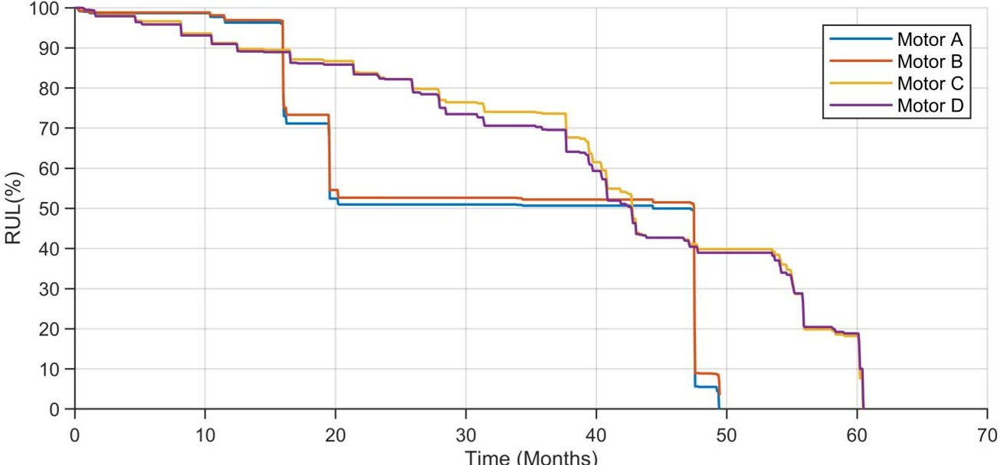

Figure 10. Remaining useful life (RUL) trajectories for the monitored motors, obtained by linearly mapping the cumulative TWW index to a percentage scale. The vertical axis reports RUL in percent, where 0% corresponds to the established TWW failure threshold (i.e., reaching this threshold implies RUL = 0). Motors A and C reach 0% RUL within the observation window and subsequently fail, consistent with documented winding-related failures. Motors B (red) and D (purple) decline toward very low RUL values and are proactively removed when their trajectories approach the 0% threshold, indicating that their accumulated TWW is near the empirical failure limit at the time of removal. The remaining motors maintain positive RUL margins over the same period, consistent with continued operation. The figure should therefore be interpreted as showing the relative timing of threshold approach, documented failure, and proactive removal events for the highlighted units.

<!-- PDF_PAGE: 18 -->

In comparison to simpler metrics such as cumulative operating hours or unweighted mechanical work, the TWW index provides a more informative case-based differentiation between motors that predominantly function under favorable thermal conditions and those that, despite delivering similar mechanical outputs, frequently encounter elevated winding temperatures. In several instances, motors with high $ W_{T} $ values demonstrated operating hours and unweighted work levels akin to those of healthy units, highlighting the role of temperature weighting in capturing additional degradation associated with adverse thermal environments under the SCADA constraints considered here.

## 3.3. Case Studies of Proactive Motor Removal and Inspection

Following the implementation detailed in Section 2, two motors (B and D) were identified by TWW as high-risk, exhibiting low failure-referenced Remaining Useful Life (RUL) values derived from historian temperature, speed, and torque data. As illustrated in Figure 10, both units display trajectories nearing the 0% threshold, which corresponds to the calibrated $ W_{T, \mathrm{Failure}} $ limit. Based on this indication, the motors were preemptively removed from service for inspection. In both instances, the inspection confirmed statorwinding degradation indicative of incipient failure, such as insulation breakdown, which may not immediately trigger a shutdown but can progressively diminish performance and reliability. A representative example is depicted in Figure 11. These case studies provide prospective evidence that a SCADA-derived TWW index can facilitate actionable screening and timely maintenance decisions.

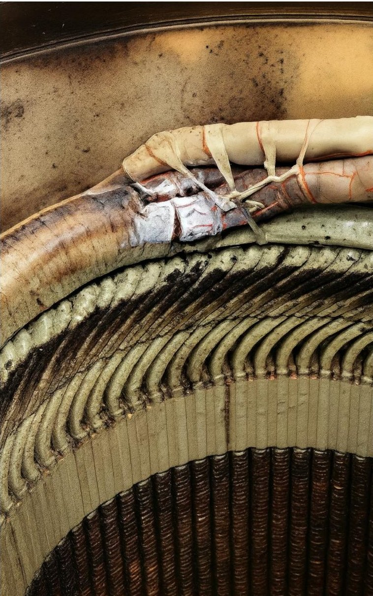

Figure 11. Stator winding condition of Motor B after proactive removal. Discoloration and insulation degradation are visible, confirming the prediction from the TWW-based RUL estimator that the motor was approaching failure.

<!-- PDF_PAGE: 19 -->

Motors B and D collectively demonstrate the practical application of the proposed failure-referenced Remaining Useful Life (RUL) proxy as a screening criterion in historianbased monitoring systems. In both instances, the trajectories depicted in Figure 10 approached the 0% threshold prior to removal, and subsequent inspections confirmed winding degradation (Figure 11). This evidence supports the utilization of TWW as an early-warning indicator within the constraints of SCADA systems.

## 3.4. Baseline Benchmarking Against Calendar Age and Unweighted Mechanical Work

To evaluate the practical utility of temperature weighting beyond standard SCADA-feasible baselines, the proposed temperature-weighted work (TWW) index is compared with (i) a calendar-age baseline (time since operation) and (ii) an unweighted cumulative mechanical work baseline derived from torque-speed measurements. This benchmarking is presented as a transparent, case-based comparison aimed at isolating the incremental value of temperature weighting relative to the two SCADA-feasible baselines. Table 3 provides a compact summary of the terminal baseline values explicitly stated in the manuscript for the four highlighted motors.

The calendar-age baseline is defined as the duration of calendar time that has elapsed since the commencement of operation (commissioning), expressed in months. This baseline is frequently employed for scheduling maintenance based on time intervals; however, it does not consider variations in duty cycle, loading intensity, or thermal severity.

Table 3. Case-based summary of the terminal baseline values for the four highlighted motors. Calendar age is reported at the grouped level, and the final temperature-weighted work (TWW) values are reported for each motor to support the comparison of terminal consistency across assets.

<table border="1"><tr><td>Motor</td><td>Calendar Age</td><td>Unweighted Work</td><td>Final $W_{T}$</td></tr><tr><td>A</td><td>approximately 50 months</td><td>&lt;0.8×106kWh</td><td>2.01×104kWh</td></tr><tr><td>B</td><td>approximately 50 months</td><td>&lt;0.8×106kWh</td><td>1.91×104kWh</td></tr><tr><td>C</td><td>approximately 60 months</td><td>&gt;1.6×106kWh</td><td>2.13×104kWh</td></tr><tr><td>D</td><td>approximately 60 months</td><td>1.6×106kWh</td><td>1.99×104kWh</td></tr></table>

To establish a baseline for usage that accurately reflects mechanical loading, the unweighted cumulative mechanical work is calculated based on torque-speed measurements. Following the exclusion of idle or low-load periods through the application of an operating state filter, the unweighted work is:

$$
W \left(t _ {k}\right) = \sum_ {i \leq k} \mathbb {I} \left\{P _ {i} \geq P _ {\min } \right\} S _ {i} \tau_ {i} \Delta t,
$$

where $ P_{\mathrm{min}} $ removes non-operating or lightly loaded intervals. Here, $ S_{i} $ and $ \tau_{i} $ denote the synchronized speed and torque samples, respectively.

The proposed TWW index retains the same accumulation structure, yet it assigns a temperature-dependent weight to each incremental work contribution:

$$
W _ {T} \left(t _ {k}\right) = \sum_ {i \leq k} \mathbb {I} \left\{P _ {i} \geq P _ {\min } \right\} w _ {i} S _ {i} \tau_ {i} \Delta t,
$$

where $ w_{i}=\exp((T_{i}-\mu_{i}) / \sigma_{i}) $ increases the contribution of work performed under elevated thermal conditions. A purely temperature-only baseline was not emphasized in the present comparison because temperature alone does not distinguish between thermal exposure accumulated under materially different torque-speed loading histories, which is the principal motivation for formulating TWW as a temperature-weighted work metric rather than as a temperature-only indicator.

<!-- PDF_PAGE: 20 -->

As summarized in Table 3, the calendar-age baseline exhibits substantial variability among the assessed units: two assets reached the end of life at approximately 50 months of operation, whereas others did so at approximately 60 months. This variation suggests that the time since the operation does not consistently capture differences in operational severity across assets.

Table 3 and Figure 12 indicate that the unweighted cumulative mechanical work baseline exhibits substantial variability at the end of life. Specifically, Motors C and D exceed approximately $ 1. 6 \times1 0^{6} \mathrm{~ k W h} $ equivalent of mechanical work by the end of life, whereas Motors A and B remain below approximately $ 0. 8 \times1 0^{6} \mathrm{~ k W h} $ equivalent. In contrast, the terminal TWW values are more tightly clustered across the same motors, indicating lower spread at the terminal events than for unweighted cumulative work. This spread reflects differences in duty cycle and loading history, indicating that unweighted accumulation does not provide a consistent terminal exposure across assets.

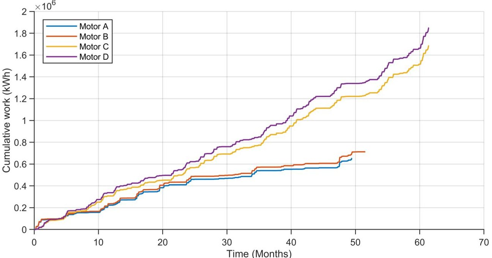

Figure 12. Unweighted cumulative work/energy baseline versus time for the four motors. The terminal baseline values vary substantially across assets (Motors C and D exceed $ 1. 6 \times1 0^{6} $ kWh, while Motors A and B remain below $ 0. 8 \times1 0^{6} $ kWh, illustrating that unweighted accumulation does not yield a consistent end-of-life exposure across differing duty cycles.

In contrast to calendar age and unweighted work, the proposed TWW index offers a more consistent terminal value at the end of life across the motors. As indicated in Table 3, this behavior aligns with the intended function of TWW as a lightweight degradation index that simultaneously reflects mechanical usage (work) and thermally accelerated damage mechanisms (via $ w_{i} $ ). Under the SCADA constraints considered in this study, temperature weighting reduces the dispersion in terminal exposure observed with timeonly or unweighted accumulation baselines, thereby providing a more comparable end-of-life reference across assets with differing operating profiles.

## 4. Conclusions

This study presents a SCADA-based temperature-weighted work (TWW) index for the monitoring of stator-winding insulation degradation and winding-related failures in three-phase motors. The method is tailored for typical historian environments, which are characterized by asynchronous tag updates, heterogeneous reporting intervals, and inter-tag time misalignment. To function effectively under these constraints, the approach involves resampling low-frequency torque, speed, power, and phase winding-temperature tags onto a uniform time grid, while restricting computation to energized, load-bearing

<!-- PDF_PAGE: 21 -->

operation through the use of an operating-state filter. The TWW index encapsulates thermomechanical exposure into a single, physically interpretable trajectory by accumulating incremental mechanical work and exponentially weighting samples recorded at elevated stator-winding temperatures.

Within the examined fleet, the cumulative TWW trajectories derived from SCADA data align with documented terminal events related to winding issues, such as insulation or connection degradation. Motors that exhibited winding degradation accumulated higher TWW compared to those that remained operational throughout the observation period. Furthermore, two motors identified as high risk by the proposed proxy were preemptively removed and subsequently confirmed, through inspection, to display early signs of winding damage. From an implementation perspective, the workflow demonstrates resilience to practical SCADA data-quality challenges: asynchronous tags are synchronized via resampling, non-informative intervals are excluded using an energized/load filter, and occasional erroneous temperature values (spikes or drift) are addressed through phase-wise median consolidation rather than discarding samples based on outlier thresholds. In this study, RUL is conceptualized as a normalized, failure-referenced health proxy, obtained by mapping $ W_{T}(t) $ to an empirically determined terminal threshold $ W_{T,\mathrm{Failuure}} $ rather than as an absolute probabilistic prediction of time-to-failure applicable across different motor classes.

The proposed framework is characterized by its lightweight nature, scalability, and ease of interpretation for maintenance engineers. In practical deployments, the proposed TWW index is particularly well suited for fleet screening, risk ranking, and maintenance decision support. In this role, it can help maintenance teams identify motors approaching the empirically calibrated failure region, prioritize inspection or replacement candidates, and monitor the relative evolution of winding-related degradation across assets operating under different duty cycles. In the present case-based comparison, it provides a more consistent terminal failure-referenced indicator than SCADA-feasible baselines such as calendar age and unweighted mechanical work by explicitly accounting for thermally accelerated degradation. A critical practical consideration is that the failure-referenced threshold $ W_{T, \mathrm{Failuure}} $ is dependent on the fleet and context, necessitating calibration from documented events for each specific application. In addition, when torque is obtained from a drive-provided load/torque estimate rather than from a direct measurement, the accuracy of that estimate may depend on the operating regime, particularly at low speed or light load. More broadly, the proposed TWW index should be interpreted as a SCADA-level indicator of cumulative winding thermal-degradation severity rather than as a dedicated detector of phase-imbalance faults or a direct model of all electrical degradation mechanisms in stator windings and insulation systems.

Future research will concentrate on the systematic calibration of thresholds across various motor classes and operating regimes, the integration of TWW with complementary SCADA-derived indicators, and the incorporation of the metric into online monitoring dashboards to provide continuous decision support. Additional extensions include combining the proposed indicator with a simple Bayesian RUL filtering framework, evaluating its applicability across other drive classes and motor configurations, and developing adaptive calibration strategies in which the threshold $ W_{T, F i a l u r e} $ is updated online as additional fleet failure and inspection data become available. Future work will also evaluate the framework on synthetic data and physics-based simulation environments to assess generalizability beyond the present industrial field deployment, particularly because many public prognostics benchmarks do not directly reproduce the low-frequency, asynchronous SCADA/historian conditions targeted here.

Author Contributions: Conceptualization, O.K., Y.T. and M.A.F.; methodology: O.K. and M.R.; software, O.K.; validation: O.K. and M.R.; Formal analysis: O.K.; investigation: O.K. and M.R.; resources,

<!-- PDF_PAGE: 22 -->

Y.T. and M.A.F.; data curation, O.K.; writing—original draft preparation, O.K.; writing—review and editing: O.K., M.R., Y.T. and M.A.F.; visualization: O.K.; supervision, Y.T. and M.A.F.; Project administration: M.A.F.; Funding acquisition: M.A.F. All authors have read and agreed to the published version of the manuscript.

Funding: This research received no external funding.

Acknowledgments: The authors acknowledge the use of GPT-5.4 (OpenAI) for the language refinement of this manuscript. All scientific content, results, and conclusions are the author's sole responsibility.

Conflicts of Interest: Author Malek Rekik was employed by the company SLB. The remaining authors declare that the research was conducted in the absence of any commercial or financial relationships that could be construed as a potential conflict of interest.

## Abbreviations

The following abbreviations are used in this manuscript:

RUL Remaining Useful Life

SCADA Supervisory Control and Data Acquisition

TWW Temperature-weighted work

## References

1. Waide, P.; Brunner, C.U. Energy-Efficiency Policy Opportunities for Electric Motor-Driven Systems; Technical Report; IEA Energy Papers; No. 2011/07; OECD Publishing: Paris, France, 2011. [CrossRef]

2. Saidur, R. A review on electrical motors energy use and energy savings. Renew. Sustain. Energy Rev. 2010, 14, 877-898. [CrossRef]

3. de Almeida, A.T.; Ferreira, F.J.; Fong, J. Perspectives on electric motor market transformation for a net zero carbon economy. Energies 2023, 16, 1248. [CrossRef]

4. United for Efficiency (U4E). Energy-Efficient Electric Motors and Motor Systems: A Policy Guide; Technical Report; U4E Policy Guide Series—Electric Motors and Motor Systems; UN Environment Programme (UNEP) and United for Efficiency: Paris, France, 2017.

5. de Souza, D.F.; da Silva, P.P.F.; Sauer, I.L.; de Almeida, A.T.; Tatizawa, H. Life cycle assessment of electric motors—A systematic literature review. J. Clean. Prod. 2024, 456, 142366. [CrossRef]

6. United Nations Environment Programme. Accelerating the Global Adoption of Energy-Efficient Electric Motors and Motor Systems; United Nations Environment Programme: Nairobi, Kenya, 2017.

7. Penrose, H.W. Financial Impact of Electric Motor System Reliability Programs; BJM Corp: Old Saybrook, CT, USA; ALL-Test Division: Old Saybrook, CT, USA; Infra Mation: Wilsonville, OR, USA, 2003.

8. Siemens AG. The True Cost of Downtime 2024; Technical Report; White Paper on the Financial Impact of Unplanned Downtime and the Role of Predictive Maintenance; Siemens AG: Munich, Germany, 2024.

9. Jardine, A.K.; Lin, D.; Banjevic, D. A review on machinery diagnostics and prognostics implementing condition-based maintenance. Mech. Syst. Signal Process. 2006, 20, 1483-1510. [CrossRef]

10. Hashemian, H.M. State-of-the-art predictive maintenance techniques. IEEE Trans. Instrum. Meas. 2010, 60, 226-236. [CrossRef]

11. Prajapati, A.; Bechtel, J.; Ganesan, S. Condition based maintenance: A survey. J. Qual. Maint. Eng. 2012, 18, 384-400. [CrossRef]

12. Bengtsson, M. Condition based maintenance system technology—Where is development heading. In Proceedings of the International Conference of Euromaintenance 2004, Barcelona, Spain, 17-20 May 2004; Volume 55.

13. Tsang, A.H. Condition-based maintenance: Tools and decision making. J. Qual. Maint. Eng. 1995, 1, 3-17. [CrossRef]

14. Lu, B.; Durocher, D.B.; Stemper, P. Predictive maintenance techniques. IEEE Ind. Appl. Mag. 2009, 15, 52-60. [CrossRef]

15. Sikorska, J.Z.; Hodkiewicz, M.; Ma, L. Prognostic modelling options for remaining useful life estimation by industry. Mech. Syst. Signal Process. 2011, 25, 1803-1836. [CrossRef]

16. Ferreira, C.; Gonçalves, G. Remaining Useful Life prediction and challenges: A literature review on the use of Machine Learning Methods. J. Manuf. Syst. 2022, 63, 550-562. [CrossRef]

17. Galar, D.; Gustafson, A.; Tormos Martinez, B.V.; Berges, L. Maintenance decision making based on different types of data fusion. Eksfloat. I-Niezawodn.-Maint. Reliab. 2012, 14, 135-144.

18. Coanda, P.; Avram, M.; Constantin, V. A state of the art of predictive maintenance techniques. In Proceedings of the IOP Conference Series: Materials Science and Engineering; IOP Publishing: Bristol, UK, 2020; Volume 997, p. 012039.

<!-- PDF_PAGE: 23 -->

19. Raheja, D.; Llinas, J.; Nagi, R.; Romanowski, C. Data fusion/data mining-based architecture for condition-based maintenance. Int. J. Prod. Res. 2006, 44, 2869-2887. [CrossRef]

20. Yang, B.S.; Tran, V.T. An intelligent condition-based maintenance platform for rotating machinery. Expert Syst. Appl. 2012, 39, 2977-2988. [CrossRef]

21. Si, X.S.; Wang, W.; Hu, C.H.; Zhou, D.H. Remaining useful life estimation-a review on the statistical data driven approaches. Eur. J. Oper. Res. 2011, 213, 1-14. [CrossRef]

22. Mosallam, A.; Medjaher, K.; Zerhouni, N. Data-driven prognostic method based on Bayesian approaches for direct remaining useful life prediction. J. Intell. Manuf. 2016, 27, 1037-1048. [CrossRef]

23. Le Son, K.; Fouladirad, M.; Barros, A.; Levrat, E.; Iung, B. Remaining useful life estimation based on stochastic deterioration models: A comparative study. Reliab. Eng. Syst. Saf. 2013, 112, 165-175. [CrossRef]

24. Sung-An, K. Remaining life prediction algorithms of electric motors for exhaust gas recirculation blower systems. J. Adv. Mar. Eng. Technol. (JAMET) 2022, 46, 135-142.

25. Magadán, L.; Suárez, F.J.; Granda, J.C.; delaCalle, F.J.; García, D.F. A robust health prognostics technique for failure diagnosis and the remaining useful lifetime predictions of bearings in electric motors. Appl. Sci. 2023, 13, 2220. [CrossRef]

26. Xie, Z.; Du, S.; Lv, J.; Deng, Y.; Jia, S. A hybrid prognostics deep learning model for remaining useful life prediction. Electronics 2020, 10, 39. [CrossRef]

27. Moleda, M.; Momot, A.; Mrozek, D. Predictive maintenance of boiler feed water pumps using SCADA data. Sensors 2020, 20, 571. [CrossRef]

28. Suryadarma, E.; Ai, T. Predictive Maintenance in SCADA-Based Industries: A literature review. Int. J. Ind. Eng. Eng. Manag. 2020, 2, 57-70. [CrossRef]

29. Achouch, M.; Dimitrova, M.; Ziane, K.; Sattarpanah Karganroudi, S.; Dhouib, R.; Ibrahim, H.; Adda, M. On predictive maintenance in industry 4.0: Overview, models, and challenges. Appl. Sci. 2022, 12, 8081. [CrossRef]

30. Okoh, C.; Roy, R.; Mehnen, J.; Redding, L. Overview of remaining useful life prediction techniques in through-life engineering services. Procedia Cirp 2014, 16, 158-163. [CrossRef]

31. Moleda, M.; Małysiak-Mrozek, B.; Ding, W.; Sunderam, V.; Mrozek, D. From corrective to predictive maintenance-A review of maintenance approaches for the power industry. Sensors 2023, 23, 5970. [CrossRef]

32. Martínez-Heredia, A.M.; Ventura, S. Weak Supervision: A Survey on Predictive Maintenance. Wiley Interdiscip. Rev. Data Min. Knowl. Discov. 2025, 15, e70022. [CrossRef]

33. Marti-Puig, P.; Touhami, I.A.; Perarnau, R.C.; Serra-Serra, M. Industrial AI in condition-based maintenance: A case study in wooden piece manufacturing. Comput. Ind. Eng. 2024, 188, 109907. [CrossRef]

34. Feng, C.; Liu, C.; Jiang, D.; Kong, D.; Zhang, W. Multivariate anomaly detection and early warning framework for wind turbine condition monitoring using SCADA data. J. Energy Eng. 2023, 149, 04023040. [CrossRef]

35. Dao, P.B. Condition monitoring and fault diagnosis of wind turbines based on structural break detection in SCADA data. Renew. Energy 2022, 185, 641-654. [CrossRef]

36. Ramteke, P.; Ahirwar, A.; Shrestha, N.; Rao, V.S.; Vaze, K.; Ghosh, A. Thermal ageing predictions of polymeric insulation cables from Arrhenius plot using short-term test values. In Proceedings of the 2010 2nd International Conference on Reliability, Safety and Hazard-Risk-Based Technologies and Physics-of-Failure Methods (ICRESH); IEEE: New York, NY, USA, 2010; pp. 325-328.

37. Peleg, M.; Normand, M.D.; Corradini, M.G. The Arrhenius equation revisited. Crit. Rev. Food Sci. Nutr. 2012, 52, 830-851. [CrossRef]

38. Galwey, A.K.; Brown, M.E. Application of the Arrhenius equation to solid state kinetics: Can this be justified? Thermochim. Acta 2002, 386, 91-98. [CrossRef]

39. Stone, G.; Culbert, I. Review of stator insulation problems in medium voltage motors fed from voltage source PWM drives. In Proceedings of 2014 International Symposium on Electrical Insulating Materials; IEEE: New York, NY, USA, 2014; pp. 50-53.

40. Fantidis, J. The temperature measurement of the windings in a three-phase electrical motor under different conditions. Gazi Univ. J. Sci. Part A Eng. Innov. 2015, 3, 39-44.

41. Zhang, P.; Lu, B.; Habetler, T.G. Active stator winding thermal protection for AC motors. In Proceedings of the Conference Record of 2009 Annual Pulp and Paper Industry Technical Conference; IEEE: New York, NY, USA, 2009; pp. 11-19.

42. Stone, G.; Culbert, I.; Lloyd, B. Stator insulation problems associated with low voltage and medium voltage PWM drives. In Proceedings of the 2007 IEEE Cement Industry Technical Conference Record; IEEE: New York, NY, USA, 2007; pp. 187-192.

43. Culbert, I.; Lloyd, B.; Stone, G. Stator insulation problems caused by variable speed drives. In Proceedings of the 2009 Conference Record PCIC Europe; IEEE: New York, NY, USA, 2009; pp. 187-192.

44. Fenger, M.; Campbell, S.R.; Pedersen, J. Dealing with motor winding problems caused by inverter drives. In Proceedings of the IEEE-IAS/PCS 2002 Cement Industry Technical Conference; Conference Record (Cat. No. 02CH37282); IEEE: New York, NY, USA, 2002; pp. 65-76.

<!-- PDF_PAGE: 24 -->

45. Chen, W.; Gao, G.; Mouton, C.A. Stator insulation system evaluation and improvement for medium voltage adjustable speed drive applications. In Proceedings of the 2008 55th IEEE Petroleum and Chemical Industry Technical Conference; IEEE: New York, NY, USA, 2008; pp. 1-7.

46. Boglietti, A.; Cavagnino, A.; Lazzari, M.; Pastorelli, A. A simplified thermal model for variable speed self cooled industrial induction motor. In Proceedings of the Conference Record of the 2002 IEEE Industry Applications Conference; 37th IAS Annual Meeting (Cat. No. 02CH37344); IEEE: New York, NY, USA, 2002; Volume 2, pp. 723-730.

47. Melfi, M.; Sung, A.J.; Bell, S.; Skibinski, G.L. Effect of surge voltage risetime on the insulation of low-voltage machines fed by PWM converters. IEEE Trans. Ind. Appl. 1998, 34, 766-775. [CrossRef]

48. Um, K.H.; Lee, K.W. A study on cable lifetime evaluation based on characteristic analysis of insulation resistance by acceleration factor of the Arrhenius equation. J. Inst. Internet Broadcast. Commun. 2014, 14, 231-236. [CrossRef]

49. Wang, Y.; Zhao, Y.; Addepalli, S. Remaining useful life prediction using deep learning approaches: A review. Procedia Manuf. 2020, 49, 81-88. [CrossRef]

50. Shifat, T.A.; Jang-Wook, H. Remaining useful life estimation of BLDC motor considering voltage degradation and attention-based neural network. IEEE Access 2020, 8, 168414-168428. [CrossRef]

51. Miao, Q.; Makis, V. Condition monitoring and classification of rotating machinery using wavelets and hidden Markov models. Mech. Syst. Signal Process. 2007, 21, 840-855. [CrossRef]

52. Shestakov, A.; Galyshev, D.; Ibryaeva, O.; Eremeeva, V. Hybrid CNN-MLP for Robust Fault Diagnosis in Induction Motors Using Physics-Guided Spectral Augmentation. Algorithms 2025, 18, 722. [CrossRef]

53. Esteban, A.; Zafra, A.; Ventura, S. Data mining in predictive maintenance systems: A taxonomy and systematic review. Wiley Interdiscip. Rev. Data Min. Knowl. Discov. 2022, 12, e1471. [CrossRef]

54. Wu, Y.; Sicard, B.; Gadsden, S.A. Physics-informed machine learning: A comprehensive review on applications in anomaly detection and condition monitoring. Expert Syst. Appl. 2024, 255, 124678. [CrossRef]

55. Hamani, K.; Kuchar, M.; Kubatko, M.; Kirschner, S. Advancements in Induction Motor Fault Diagnosis and Condition Monitoring: A Comprehensive Review. Sensors 2025, 25, 5942. [CrossRef]

56. Zachariades, C.; Xavier, V. A Review of Artificial Intelligence Techniques in Fault Diagnosis of Electric Machines. Sensors 2025, 25,5128. [CrossRef]

57. Abdulkareem, A.; Anyim, T.; Popoola, O.; Abubakar, J.; Ayoade, A. Prediction of induction motor faults using machine learning. Heliyon 2025, 11, e41493. [CrossRef]

58. Alshkeili, H.M.H.A.; Almheiri, S.J.; Khan, M.A. Privacy-Preserving Interpretability: An Explainable Federated Learning Model for Predictive Maintenance in Sustainable Manufacturing and Industry 4.0. AI 2025, 6, 117. [CrossRef]

59. Ismail, L.; Abdelmoti, A.; Basu, A.; Berini, A.D.E.; Naouss, M. A Systematic Review of Digital Twin-Driven Predictive Maintenance in Industrial Engineering: Taxonomy, Architectural Elements, and Future Research Directions. arXiv 2025, arXiv:2509.24443. [CrossRef]

60. Jagdale, S.G.; More, V.A.; Murmude, P.B. Digital Twin-Driven Predictive Maintenance: A Review of Induction Motor Bearing Fault Detection and Prognostics. In Proceedings of the 2025 International Conference on Sustainable Energy Technologies and Computational Intelligence (SETCOM); IEEE: New York, NY, USA, 2025; pp. 1-6.

61. Kothamasu, R.; Huang, S.H.; VerDuin, W.H. System health monitoring and prognostics-A review of current paradigms and practices. Int. J. Adv. Manuf. Technol. 2006, 28, 1012-1024. [CrossRef]

62. Chao, M.A.; Kulkarni, C.; Goebel, K.; Fink, O. Fusing physics-based and deep learning models for prognostics. Reliab. Eng. Syst. Saf. 2022, 217, 107961. [CrossRef]

63. Yang, F.; Habibullah, M.S.; Shen, Y. Remaining useful life prediction of induction motors using nonlinear degradation of health index. Mech. Syst. Signal Process. 2021, 148, 107183. [CrossRef]

64. Gupta, A.; Grigoriadis, K.; Franchek, M.; Smith, D.J. Online adaptive model based fault detection, isolation and estimation method. In Proceedings of the Dynamic Systems and Control Conference, Arlington, VA, USA, 31 October-2 November 2011; Volume 54754, pp. 929-936.

65. Rosafalco, L.; Conti, P.; Manzoni, A.; Mariani, S.; Frangi, A. EKF-SINDy: Empowering the extended Kalman filter with sparse identification of nonlinear dynamics. Comput. Methods Appl. Mech. Eng. 2024, 431, 117264. [CrossRef]

66. McKinley, S.; Levine, M. Cubic spline interpolation. Coll. Redwoods 1998, 45, 1049-1060.

67. Dyer, S.A.; Dyer, J.S. Cubic-spline interpolation. IEEE Instrum. Meas. Mag. 2001, 4, 44-46. [CrossRef]

68. Casella, G.; Berger, R. Statistical Inference; Chapman and Hall/CRC: Boca Raton, FL, USA, 2024.

Disclaimer/Publisher's Note: The statements, opinions and data contained in all publications are solely those of the individual author(s) and contributor(s) and not of MDPI and/or the editor(s). MDPI and/or the editor(s) disclaim responsibility for any injury to people or property resulting from any ideas, methods, instructions or products referred to in the content.