<!-- PDF_PAGE: 1 -->

Article

# Multi-Sensor Process Monitoring and Fault Diagnosis for Multi-Mode Industrial Servomotor Systems with Fault Classification and RUL Prediction: A Representative Case Study for Smart Manufacturing Applications

Ugur Simsir

Department of Biomedical Engineering, Faculty of Engineering and Natural Sciences, Acibadem University, 34638 Istanbul, Türkiye; ugur.simsir@acibadem.edu.tr

## Abstract

Unexpected degradation in servomotor-driven multi-mode industrial systems such as CNC feed drives and robotic machining cells compromises positioning accuracy, availability and operational safety, rendering early fault diagnosis and predictive maintenance essential in smart manufacturing environments. In this study, a predictive maintenance framework based on multi-sensor data fusion was developed to support condition monitoring, fault classification, and remaining useful life estimation of robot servomotors. Time- and frequency-domain features were extracted from synchronized electrical current, vibration, acoustic, and temperature signals using fixed-length sliding windows. Feature-level fusion was applied to combine complementary information from different sensor modalities. A data-driven health assessment approach was employed in which an autoencoder model trained on healthy operating data was used to generate a scalar Servomotor Health Score representing degradation progression. Fault types were identified using a Random Forest classifier, while remaining useful life was estimated in terms of operational cycles using a Gradient Boosting regression model. Experimental evaluations were carried out under repeated reference motion profiles, and representative mechanical and electrical fault conditions were introduced in a controlled manner. The results demonstrated that the proposed health score provided a smooth and monotonic degradation trend, enabling early fault detection without false alarms under healthy conditions. High classification performance was achieved for fault identification, and remaining useful life predictions showed low estimation error on previously unseen faulty servomotors. Feature contribution analysis indicated that electrical current and temperature signals provided the most robust indicators of degradation, while vibration and acoustic measurements offered complementary diagnostic information. The proposed framework was shown to be an effective and practical solution for predictive maintenance of servomotor-driven manufacturing systems such as CNC axes and robotic machining platforms operating under low-speed and variable-load conditions.

Check for updates

Copyright: 2026 by the author. Licensee MDPI, Basel, Switzerland. This article is an open access article distributed under the terms and conditions of the Creative Commons Attribution (CC BY) license.

Academic Editor: Francisco Ronay López-Estrada

Received: 2 January 2026

Revised: 2 February 2026

Accepted: 18 February 2026

Published: 27 February 2026

Keywords: predictive maintenance; fault classification; remaining useful life (RUL); servomotor life cycle; multi-sensor monitoring

## 1. Introduction

Industry 4.0 reconceptualises machines as interconnected cyber-physical systems in which value comes not only from hardware performance but also from a system's

<!-- PDF_PAGE: 2 -->

ability to sense, understand, and react to its own condition over time [1-4]. In practice, this requires sensor technologies that offer complementary views of operation, such as embedded electrical sensing within drives alongside vibration, acoustic, and thermal measurements on the actuator structure, in addition to data analytics that transform these data streams into actionable decisions like health indicators, early fault warnings, and planned maintenance rather than reactive repairs [5-8]. As these ideas move beyond manufacturing into safety-critical domains, they directly pertain to medical robotic devices where stable and repeatable actuation must be maintained over hundreds of sessions with minutes of acceptable downtime [2].

Servomotor-driven robotic platforms have become integral to post-stroke and neurorehabilitation programs because repeatable, precise motion can be delivered safely over long sessions. As these systems move from research labs to daily clinical use, reliability becomes a safety constraint and a clinical duty: therapy must not be interrupted, and unintended forces must not reach the patient. Failures frequently cluster in the actuation chain (servomotors, transmissions, and drives), where low-speed reversals, intermittent loading, and heat accelerate wear and drift. Recent reviews of rehabilitation robotics and clinical adoption echo this need, calling reliability a key barrier to scale [9-13]. Against this backdrop, a predictive-maintenance viewpoint centered on servomotors is therefore warranted to preserve both safety and therapy continuity.

Predictive maintenance (PdM) refers to data-driven strategies that estimate health, diagnose faults early, and predict remaining useful life (RUL) to plan maintenance before failure. Modern PdM combines physics-aware features with machine learning and runs close to the robot-often on edge hardware to meet real-time constraints [14-18]. In robotic actuation, the most observable signals originate from servomotors and their drives: currents, voltages, speeds, temperatures, and vibration or sound from bearings and gear stages. These signals form the basis for condition indicators that are stable across different patients and therapy tasks. In this setting, a proactive view of component health becomes essential to avoid unexpected interruptions and sustain safe operation. Recent studies have moved beyond single-sensor settings by (i) using multi-sensor fusion networks (CNN/Transformer hybrids) to improve fault classification under changing operating modes, and (ii) adding uncertainty-aware RUL prediction so maintenance decisions are more reliable. Examples include multi-sensor sparse Transformer fusion for intelligent fault diagnosis [19], ensemble Transformer-based motor fault diagnosis with multi-mode time series [20], and feature-fusion diagnosis models that emphasize spatiotemporal consistency [21]. On the prognostics side, recent work highlights calibrated prediction intervals via conformal prediction and related uncertainty-quantification strategies for online RUL prediction [22-25].

The rehabilitation context given in Figure 1 shapes both failure modes and sensing. Servomotors must produce smooth torque at low speeds and frequent direction changes. The robot mechanics (links, transmissions, and compliance) filter and mix excitations, while patient-robot interaction adds variable contact stiffness and voluntary or reflexive disturbances. This triad (servomotor, robot, rehabilitation task) lowers the fault signal-to-noise ratio, shifts spectral content to very low frequencies, and makes single-sensor methods brittle. As a result, robust PdM favors multi-sensor fusion (current, vibration, acoustic, temperature), interpretable health indicators, and learning that tolerates domain shifts across tasks and patients [26-29].

These practical constraints have motivated a substantial body of work on reliability and maintenance planning for robotic systems, especially in settings where long-term safety and availability are critical. System-level reliability and maintenance optimization were studied for industrial and rehabilitation robots, including importance-measure-based preventive plans and exoskeleton-specific reliability models that account for cost, safety,

<!-- PDF_PAGE: 3 -->

and availability [12,13]. Clinical and technical reviews continue to stress reliability and safety as adoption bottlenecks [9-11].

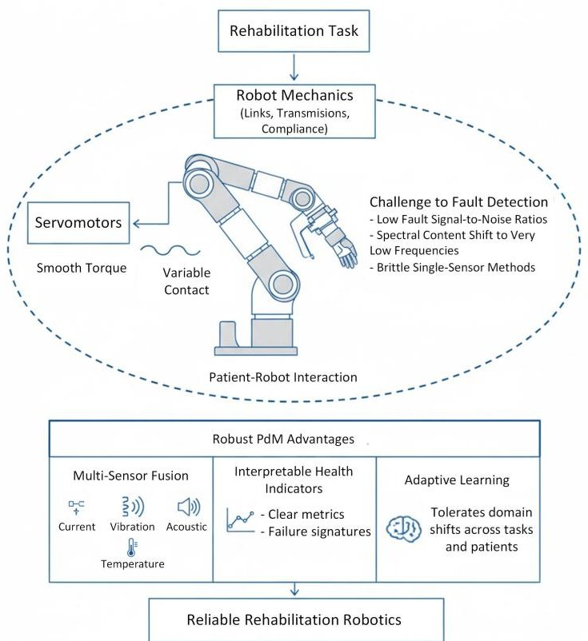

Figure 1. Rehabilitation robot context for predictive maintenance.

Nonintrusive motor current signature analysis (MCSA) enables diagnostics without modifying the drive wiring [26]. For permanent-magnet synchronous machines (PMSMs) common in precision robotics, drive-side monitoring (currents/voltages) and thermal cues have been shown to detect demagnetization, inter-turn short, and bearing degradation [30,31]. Application-oriented studies for servo-bearing faults report improvements through feature learning and lightweight deep models [32,33]. In parallel, time-frequency representations combined with lightweight CNN designs can improve motor fault recognition, especially when signals vary across operating regimes [34]. For servo-drive fault scenarios, recent work also reports phase-voltage-based diagnosis strategies for fault-tolerant multi-phase permanent-magnet servo motor drive systems [35].

Because rehabilitation robots operate at low speed with frequent reversals, classic highspeed vibration markers lose strength. Recent work fuses sound and vibration to recover separability under variable speed/loads and to improve robustness [27-29]. Acousticfeature enhancement and condition-adaptive time-frequency imaging were also explored for early bearing faults under noise and nonstationarity [36-38].

Few-shot and transfer/meta-learning have been advanced to cope with domain shifts across operating conditions, tasks, and hardware, frequently with explicit multisensor fusion in the learning pipeline [16,17]. RUL prediction with monotonic, trendable health indicators has been emphasized to make decisions explainable and stable across sessions [39,40]. MDPI and Elsevier studies also report practical pipelines that use hybrid features with attention or diffusion-based augmentation to sustain accuracy under limited labeled data [16,41].

Edge/embedded constraints drive interest in observers and compact deep models for real-time fault detection in robot drives [31,32]. These studies target on-board inference latency, power limits, and maintainability—all essential in clinical settings where downtime is costly and patient-facing safety margins must remain conservative.

Although experimental validation is performed on a rehabilitation robot, the proposed framework targets generic multi-mode industrial servo systems such as CNC feed drives,

<!-- PDF_PAGE: 4 -->

robotic machining cells and automated production lines, where frequent mode switching, low-speed operation and variable loads are common. In light of the above, this study is positioned to address gaps that appear when PdM is transferred to rehabilitation robots: (i) low-speed, reversal-rich trajectories; (ii) multi-sensor streams that must align with patient-robot interaction; and (iii) edge execution. The following contributions are provided:

- A servomotor-centered sensing design for rehabilitation robots that combines currents/voltages, vibration, airborne acoustics, and temperatures, with synchronized acquisition under therapy-like trajectories.

- A fault-indicator construction that favors monotonicity, trendability, and prognosability for use in RUL estimation and maintenance scheduling in clinical duty cycles [39,40].

- A multi-sensor fusion pipeline that remains robust across operating conditions and tasks, drawing on recent domain-adaptation and few-shot advances [16,17].

- An embedded-friendly implementation path to satisfy real-time constraints observed in clinical operation [31,32].

## 2. System Description and Data Acquisition

Figure 2 summarizes the complete workflow of the proposed framework. Raw multisensor signals are first pre-processed and segmented into fixed-length windows, and then features are extracted from each window. Next, an unsupervised health indicator is computed as the Servomotor Health Score (SHS) using an autoencoder-based reconstruction error followed by isotonic regression to obtain a monotone health trend. Finally, the resulting SHS is used as an input for two downstream tasks: RUL prediction with Gradient Boosting and fault classification with Random Forest.

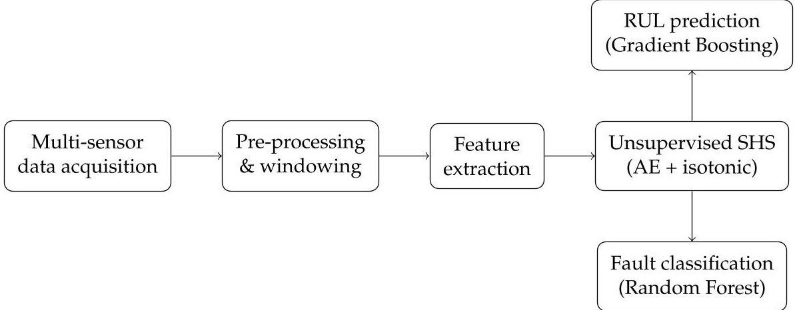

Figure 2. Overview of the proposed framework.

The rehabilitation robot is used as a representative cyber-physical testbed for multimode industrial servo drives operating under variable load and frequent mode transitions. This study focuses on the servomotor actuation units of an upper-limb rehabilitation robot designed for guided exercise (Figure 3). Each actuator includes a permanent-magnet synchronous servomotor (PMSM), a harmonic reducer, and a high-resolution encoder. Position tracking and force regulation are performed through an impedance/admittance-based control framework, and safe human-robot interaction is supported through software limits and torque constraints [10].

The motors are driven through field-oriented control (FOC). Phase currents, DC-bus voltage, estimated torque, and speed are collected from the drive. Faults in mechanical transmission components—such as bearings, harmonic gear elements, or couplings—tend to appear early in both electrical and vibro-acoustic signals [26,27].

<!-- PDF_PAGE: 5 -->

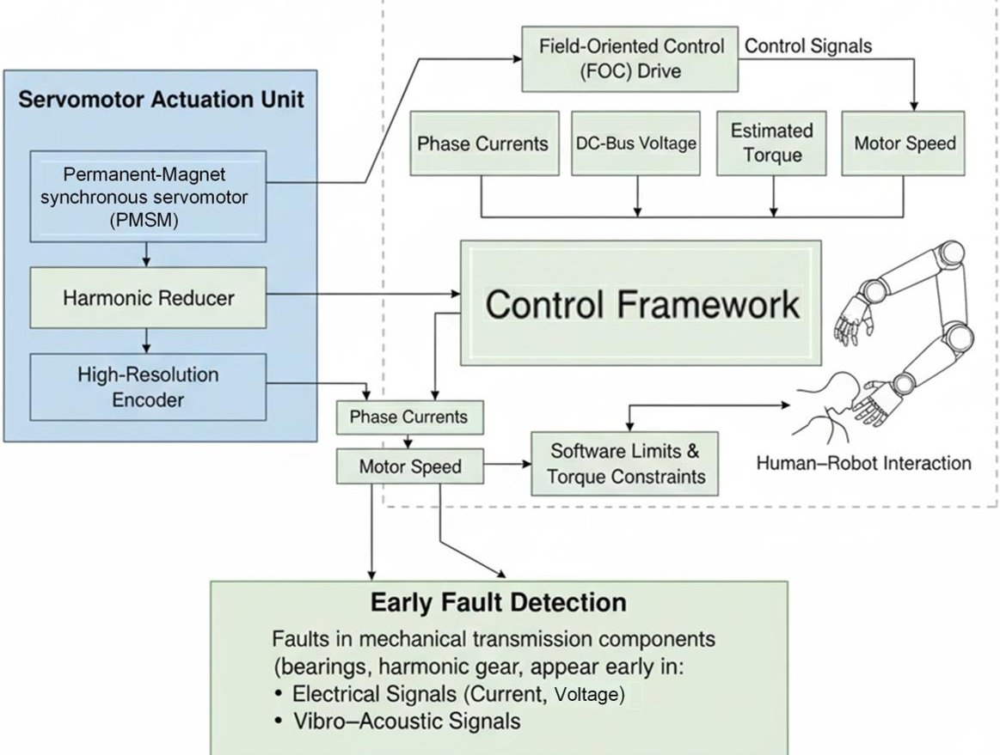

Figure 3. System design for rehabilitation robots in predictive maintenance.

The sensing set S includes electrical, vibration, acoustic, thermal, and kinematic signals. Table 1 summarizes sensor locations, measured quantities, units, nominal ranges, and sampling rates. This selection supports the extraction of time, frequency, and time-frequency features as well as cross-channel coherence measures [16,28,42], which are later used in Section 3.

Table 1. Sensors and measured quantities.

<table border="1"><tr><td>Sensor</td><td>Location</td><td>Quantity</td><td>Unit</td><td>Range</td><td>fs</td></tr><tr><td>Triaxial accelerometer</td><td>Motor housing</td><td>Acc.(x,y,z)</td><td>m/s2</td><td>$\pm$50</td><td>25.6kHz</td></tr><tr><td>MEMS microphone</td><td>Near reducer</td><td>Acoustic pressure</td><td>Pa</td><td>$\pm$2</td><td>48kHz</td></tr><tr><td>Hall-effect current sensor</td><td>Phase lines</td><td>$i_{a,b,c}$</td><td>A</td><td>$\pm$30</td><td>5kHz</td></tr><tr><td>Voltage divider</td><td>DC bus</td><td>$V_{dc}$</td><td>V</td><td>0-350</td><td>2kHz</td></tr><tr><td>Drive telemetry</td><td>Motor drive</td><td>Speed, torquea</td><td>rpm,Nm</td><td>0-150rpm,0-20</td><td>1kHz</td></tr><tr><td>Incremental encoder</td><td>Motor shaft</td><td>Position/speed</td><td>count,rpm</td><td>-</td><td>1kHz</td></tr><tr><td>IR temperature sensor</td><td>Motor housing</td><td>Surface temperature</td><td>$^{\circ}C$</td><td>20-90</td><td>1Hz</td></tr></table>

a Torque is estimated by the drive observer.

Data are collected through four scenarios designed to reflect typical clinical use: (1) nominal tracking with sinusoidal and trapezoidal speed profiles; (2) patient-interaction emulation using external elastic loads; (3) varying torque and speed through multi-level operating points; (4) fault-simulated conditions created by increasing mechanical friction, introducing misalignment, enlarging gear backlash, and applying controlled electrical imbalance.

Sliding windows of length $ T_{w}=1. 0 $ s and 50% overlap are used. $ T_{w}=1. 0 $ s was selected because it captures at least one full mechanical revolution at typical therapy speeds (up to 150 rpm) while keeping the signals within a window approximately stationary for time-frequency descriptors. The 50% overlap increases the number of training samples and yields smoother SHS trajectories, which is helpful for early-warning decisions. Because the split is performed at the unit level (Section 4.1), overlapping windows do not cause information leakage across train/validation/test subsets. This structure matches the time-frequency feature extraction and coherence analysis described in Section 3 [16,27,31].

<!-- PDF_PAGE: 6 -->

The resulting multi-sensor dataset enables the construction of a unified SHS with properties suitable for both early warning and RUL estimation [14,16,39].

## 3. Methodology

## 3.1. Feature Extraction from Multi-Sensor Signals

Servomotor behaviour is reflected in several physical domains, including vibration, electrical current, rotational speed, torque, and temperature. A single sensor cannot capture all degradation mechanisms; therefore, a multi-sensor feature extraction strategy is adopted, which is consistent with recent reviews on vibration analysis and multi-sensor fusion for equipment fault diagnosis [43,44]. The goal is to transform raw measurements into a compact set of numerical descriptors that are sensitive to fault evolution but robust to operating variability.

Let the set of synchronised sensor channels be $ S=\{s_{1}, s_{2}, \dots , s_{M}\} $ . For each sensor $ s \in S $ , the raw signal is represented by $ x^{(s)}(t) $ . The signal is divided into overlapping windows $ w_{n} $ of length L samples. Before extracting features, each channel is normalized using a robust scaling procedure to reduce the influence of impulsive noise and slow drift, which is commonly adopted in vibration pre-processing [43].

The transformation in Equation (1) uses the constant 1.4826. This standard factor converts the Median Absolute Deviation (MAD) into a scale consistent with the standard deviation for Gaussian data.

$$
\tilde {x} ^ {(s)} (t) = \frac {x ^ {(s)} (t) - \operatorname {m e d i a n} \left(x ^ {(s)}\right)}{1 . 4 8 2 6 \mathrm {M A D} \left(x ^ {(s)}\right)}
$$

Time-domain statistical features are computed for each window $ w_{n} $ . These descriptors, such as the mean in Equation (A1), the standard deviation in Equation (A2), the root mean square (RMS) in Equation (A3), the skewness in Equation (A4), the kurtosis in Equation (A5), and the crest factor in Equation (A6), are widely used in bearing and motor fault diagnosis [45,46]. To improve readability, the explicit equations for feature definitions (Equations (A1)-(A12)) are moved to Appendix A.

Frequency-domain features are obtained from the discrete Fourier transform (DFT) of each window. Power-spectrum-based descriptors, such as band power, spectral centroid and spectral entropy, are effective for rotating machinery diagnostics [45,46]. Let $ X_{n}^{(s)}(f) $ be the DFT of $ \tilde{x}^{(s)}(t) $ in window $ w_{n} $ . The power spectrum is given by Equation (A7).

The band power in a frequency band $ \mathcal{B}\subset\mathbb{R} $ is defined in Equation (A8). This measure represents the total signal energy concentrated within a selected frequency interval, and it is particularly useful for identifying fault-related activity that appears in specific harmonic or sideband regions.

The spectral centroid is given by Equation (A9). It reflects the distribution of energy across the spectrum and shifts toward higher frequencies when the signal contains sharper or more impulsive components, which may indicate mechanical degradation.

Using the standardized spectrum $ p_{n}^{(s)}(f)=P_{n}^{(s)}(f) / \sum_{f} P_{n}^{(s)}(f) $ , the spectral entropy is defined in Equation (A10). This descriptor quantifies the irregularity or disorder of the spectral content, with higher entropy typically associated with more complex or noise-like vibration patterns.

Cross-sensor relationships between mechanical and electrical domains are captured through coherence features. When vibration and current are monitored simultaneously, coherence can reveal electromechanical coupling effects and misalignment phenomena [47,48]. The magnitude-squared coherence between a vibration sensor v and a current sensor i is given by Equation (A11).

<!-- PDF_PAGE: 7 -->

The averaged coherence in a frequency band $ \mathcal{B} $ is defined in Equation (A12). This metric summarizes the degree of linear coupling between vibration and current signals over the selected band, and higher values typically indicate stronger electromechanical interaction associated with misalignment, eccentricity or load-dependent effects.

Finally, all features from all sensors and domains are concatenated into a single feature vector as expressed in Equation (2), which serves as the input to the subsequent health-score and classification models. This feature-level fusion is consistent with current multi-sensor fault diagnosis frameworks that combine vibration, acoustic and electrical measurements for higher robustness and accuracy [44,49-53].

$$
z _ {n} = \left[ z _ {n} ^ {(s _ {1})}, z _ {n} ^ {(s _ {2})}, \dots , z _ {n} ^ {(s _ {M})} \right] ^ {\top}
$$

In this study, a fixed and physics-motivated feature set was used rather than an additional data-driven feature selection step. This choice keeps the pipeline simple and reproducible, while the autoencoder in the SHS module provides nonlinear dimensionality reduction through its latent representation.

Across the sensing suite in Table 2,12 signal channels (3-axis vibration,1 acoustic, 3-phase current, DC-link voltage, speed, torque, encoder speed, and temperature) were obtained. For each channel, 6 time-domain and 3 frequency-domain features (9 features per channel) were computed. Moreover, 9 cross-sensor coherence features between the 3 vibration axes and the 3 current phases were calculated. Therefore, the final feature dimension is $ D=1 2 \times9+9=1 1 7. $

Table 2. Feature set summary and dimensionality.

<table border="1"><tr><td>Signal Group</td><td>Channels</td><td>Features per Channel</td></tr><tr><td>Vibration(accelerometer)</td><td>3</td><td>9</td></tr><tr><td>Acoustic(microphone)</td><td>1</td><td>9</td></tr><tr><td>Current(three-phase)</td><td>3</td><td>9</td></tr><tr><td>Voltage(DC-link)</td><td>1</td><td>9</td></tr><tr><td>Drive telemetry(speed, torque)</td><td>2</td><td>9</td></tr><tr><td>Encoder(speed)</td><td>1</td><td>9</td></tr><tr><td>Temperature</td><td>1</td><td>9</td></tr><tr><td>Cross-sensor coherence(vibration$\leftrightarrow$current)</td><td>9 pairs</td><td>1</td></tr><tr><td>Total dimensionality</td><td></td><td>D=117</td></tr></table>

## 3.2. Servomotor Health Score (SHS) Definition

While the feature vector in Equation (2) captures detailed information from multiple sensors, it is often convenient for monitoring and decision making to reduce this high-dimensional representation to a single scalar health indicator that summarizes the overall condition of the servomotor. In this work, this indicator is referred to as the SHS. The SHS is designed to take values in the interval [0,1], with values close to one corresponding to healthy behaviour and values approaching zero indicating severe deviation from normal operation. To construct such a score, an autoencoder model is trained exclusively on data collected under healthy conditions, following recent practice in health indicator construction for rotating machinery and other safety-critical systems [54-57].

Let $ f_{\theta}(\cdot) $ and $ g_{\theta}(\cdot) $ denote the encoder and decoder mappings of the autoencoder, parameterized by $ \theta $ . For each feature vector $ z_{n} $ , the autoencoder produces a latent representation and its reconstruction as given in Equation (3). Here, the encoder compresses the

<!-- PDF_PAGE: 8 -->

multi-sensor information into a low-dimensional latent space, while the decoder attempts to reconstruct the original feature vector.

$$
\hat {z} _ {n} = g _ {\theta} \left(f _ {\theta} \left(z _ {n}\right)\right)
$$

The parameters $ \theta $ are obtained by minimizing the reconstruction error over a set of healthy windows $ \mathcal{H} $ . A regularized loss function is used, as shown in Equation (4), where the first term enforces accurate reconstruction and the second term encourages sparsity in the latent representation to improve interpretability and robustness.

$$
\mathcal {L} _ {\mathrm {A E}} (\theta) = \frac {1}{| \mathcal {H} |} \sum_ {n \in \mathcal {H}} \left\| z _ {n} - \hat {z} _ {n} \right\| _ {2} ^ {2} + \lambda \left\| f _ {\theta} \left(z _ {n}\right) \right\| _ {1}
$$

Once the autoencoder has been trained, the reconstruction error for each window n is computed. Because the feature vector $ z_{n} $ in Equation (2) is composed of contributions from different sensors, a weighted error measure is used to reflect their relative importance and reliability. The resulting weighted reconstruction error is defined in Equation (5), where $ \omega^{(s)} $ are non-negative sensor weights that sum to one. In this study, uniform weights, $ \omega^{(s)}=1/M $ , were used to avoid introducing extra tuning parameters and to keep the SHS comparable across units. In general, $ \omega^{(s)} $ can be adapted (e.g., based on sensor reliability or noise level) to emphasize specific sensing channels, which directly changes each sensor's contribution to the aggregate reconstruction error.

$$
e _ {n} = \sum_ {s \in \mathcal {S}} \omega^ {(s)} \left\| z _ {n} ^ {(s)} - \hat {z} _ {n} ^ {(s)} \right\| _ {2} ^ {2}
$$

To make the magnitude of $ e_{n} $ comparable across different operating conditions and experiments, the error is standardized using the mean and standard deviation estimated from healthy data. The standardized error is given in Equation (6). This step ensures that the subsequent mapping to the SHS uses a dimensionless and normalized quantity.

$$
z _ {n} = \frac {e _ {n} - \mu_ {e}}{\sigma_ {e}}
$$

The SHS is then obtained by applying a logistic transformation to $ z_{n} $ as shown in Equation (7). The scaling factor $ \alpha>0 $ controls the steepness of the transition between healthy and degraded states. This mapping compresses the unbounded standardized error into the interval (0,1) and yields a monotonically decreasing function of the deviation from normal behaviour.

$$
h _ {n} = \frac {1}{1 + \exp \left(\alpha z _ {n}\right)}
$$

Unless otherwise stated, $ \alpha=1 $ was set in all experiments. Because $ z_{n} $ is a standardized reconstruction error, $ \alpha $ mainly controls the slope of the logistic mapping (how quickly $ h_{n} $ saturates near 0 or 1) and does not change the ranking of windows by abnormality. For this reason, $ \alpha $ should be considered jointly with any decision threshold defined on $ h_{n}. $

In practice, even under gradual degradation, short-term fluctuations in operating conditions can cause small local increases in $ h_{n} $ . For RUL estimation and trend analysis, it is often desirable to enforce a strictly non-increasing health trajectory. To this end, an isotonic regression step is applied to $ \{h_{n}\}_{n=1}^{N} $ , as formulated in Equation (8). The solution $ \{\widetilde{h}_{n}\}_{n=1}^{N} $ is the closest non-increasing sequence to the original scores in a least-squares sense and is adopted as the final SHS.

$$
\widetilde {h} _ {1: N} = \arg \min _ {g \in \mathcal {M}} \sum_ {n = 1} ^ {N} \left(h _ {n} - g _ {n}\right) ^ {2}
$$

<!-- PDF_PAGE: 9 -->

Here, $ \mathcal{M} $ denotes the set of non-increasing sequences. The resulting sequence $ \widetilde{h}_{n} $ is generally smoother and more suitable for prognostics than the raw scores $ h_{n} $ , while still reflecting the information learned by the autoencoder. To quantify the suitability of $ \widetilde{h}_{n} $ as a health indicator, three standard metrics are considered: monotonicity, trendability and prognosability [55,56]. The monotonicity index in Equation (9) measures the proportion of time steps where the score does not increase, using the indicator function $ \mathbb{I}(\cdot) $ .

$$
M = 1 - \frac {1}{N - 1} \sum_ {n = 1} ^ {N - 1} \mathbb {I} \left(\widetilde {h} _ {n + 1} > \widetilde {h} _ {n}\right)
$$

Trendability reflects the strength of the relationship between the SHS and time. It is expressed in Equation (10) as the absolute value of the Spearman correlation coefficient between $ \widetilde{h}_{n} $ and the window index n.

$$
T = \left| \rho_ {\mathrm {S p e a r m a n}} \left(\widetilde {h} _ {n}, n\right) \right|
$$

Finally, prognosability captures how tightly clustered the SHS values are near the failure point across different degradation trajectories. Let $ h_{\mathrm{fail}} $ denote the set of SHS values observed close to failure for multiple runs. The prognosability index is defined in Equation (11); values closer to one indicate that the end-of-life SHS distribution is narrow and therefore easier to use as a failure threshold.

$$
P = 1 - \frac {\operatorname {s t d} \left(h _ {\mathrm {f a i l}}\right)}{\left| \operatorname {m e a n} \left(h _ {\mathrm {f a i l}}\right) \right|}
$$

A health indicator with high monotonicity, strong trendability and good prognosability is particularly suitable for RUL estimation, because its evolution over time closely reflects the underlying degradation process. The SHS constructed through Equations (3)-(11), therefore, serves as the main input to the RUL models described later in the methodology.

## 3.3. Fault Classification Framework

The SHS provides a compact indication of how far the servomotor has moved away from its healthy state, but maintenance actions usually require more specific information about what kind of fault is developing. The fault classification framework, therefore, complements the SHS by assigning each time window to a small set of condition classes, such as healthy operation or specific fault modes (for example, increased friction, misalignment, or gearbox-related issues). The goal is to keep the decision process simple and easy to interpret, while still exploiting the information contained in the multi-sensor features and the SHS.

The structure of the framework is illustrated in Figure 4. On the left, the raw signals from the different sensors (such as vibration, current, speed and temperature) are processed by the feature extraction stage, which transforms each time window into a numerical feature vector. In parallel, the SHS computation module uses the same feature sequence to produce a scalar health score that decreases as the motor degrades. These two outputs are then combined into a joint representation that captures both detailed signal characteristics and the global health trend.

In the middle, this joint representation is fed into a classifier block, which has been trained beforehand using labeled data where the operating condition of the motor is known. The classifier converts its input into a set of class scores or probabilities, one for each defined condition class. Typical models that can be used here include gradientboosted trees, support vector machines, or lightweight neural networks, depending on the computational budget and the amount of training data available. The internal details of the

<!-- PDF_PAGE: 10 -->

classifier are not critical for the framework; what matters is that it can learn to distinguish between the different fault patterns present in the feature space.

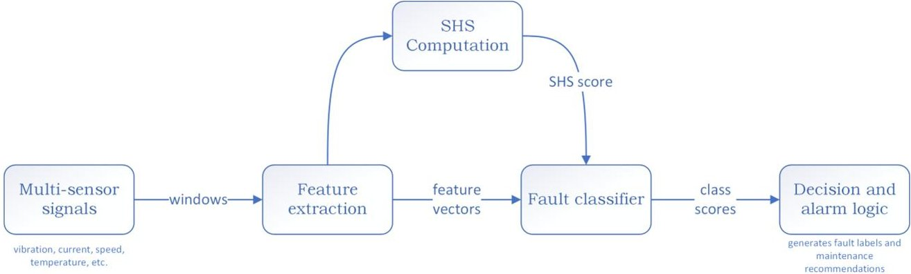

Figure 4. Fault classification framework.

On the right-hand side, a decision and alarm logic block interprets the classifier output together with the SHS. When the SHS indicates a clearly healthy regime, only strong and consistent classifier evidence is translated into a warning, which helps avoid false alarms during regular operation. As the SHS decreases and approaches predefined warning or critical levels, the system becomes more sensitive: persistent predictions of a specific fault class are more likely to trigger maintenance recommendations or closer inspection. In this way, the framework uses the SHS as a health-aware context for the classification results, combining continuous condition monitoring with discrete fault labels in a single, coherent structure that can be deployed on an embedded controller or supervisory computer.

## 3.4. RUL Estimation Based on SHS Degradation

The RUL is defined as the remaining number of operational cycles until end-of-life in the run-to-failure experiments. In this study, RUL is estimated to be using a supervised Gradient Boosting regression model trained in failing units, using the multi-sensor feature vector and the SHS as inputs (Section 4). This learning-based RUL module does not require manually selecting a critical SHS threshold. For completeness, a simple SHS-trend extrapolation approach is also described that can be used when run-to-failure labels are unavailable; in that case, a critical threshold $ h_{\mathrm{crit}} $ is required. The monotonic SHS sequence $ \tilde{h}_{n} $ obtained from Equation (8) is treated as a one-dimensional degradation signal whose downward trend reflects the gradual loss of health, and this signal is used as the basis for RUL estimation in line with recent health-indicator-based prognostics frameworks that first construct a robust health index and then fit a degradation model on top of it [39,58,59]. Each feature window n is associated with a time stamp $ t_{n} $ and an SHS value $ \tilde{h}_{n} $ , and a critical threshold $ h_{\mathrm{crit}} $ is chosen to represent the boundary between acceptable and unacceptable operation. In this study, $ h_{\mathrm{crit}}=h_{\mathrm{warn}}=0.7 $ was set using the percentile-based rule described in Section 4.2. This threshold is interpreted as an actionable maintenance boundary (early intervention) rather than catastrophic failure.

A simple and widely used strategy is to approximate the evolution of the health index by a smooth parametric trend fitted to the most recent part of the SHS trajectory [60,61]. When the degradation appears approximately exponential, the SHS is modeled as a decaying function of time as expressed in Equation (12), where $ \beta_{0} $ and $ \lambda>0 $ are parameters identified from data by least-squares or robust regression:

$$
\widetilde {h} (t) \approx \exp \left(\beta_ {0} - \lambda t\right)
$$

Given the current time $ t_{\mathrm{now}} $ and the current SHS value $ \widetilde{h} ( t_{\mathrm{now}} ) $ , the predicted RUL under the exponential model is obtained by finding the future time at which the fitted trend

<!-- PDF_PAGE: 11 -->

reaches the critical threshold $ h_{\mathrm{crit}} $ ; this leads to the closed-form expression in Equation (13), which is straightforward to implement even on resource-limited hardware [60]:

$$
\widehat {\mathrm {R U L}} _ {\exp} \left(t _ {\mathrm {n o w}}\right) = \frac {\log \widetilde {h} \left(t _ {\mathrm {n o w}}\right) - \log h _ {\mathrm {c r i t}}}{\hat {\lambda}}
$$

In other applications, the SHS decreases in an almost linear manner over the relevant time range, for example, when wear progresses at a nearly constant rate; in such cases, a linear degradation model can be more appropriate and easier to interpret [61]. The SHS is then approximated by the affine function in Equation (14), where a and b > 0 are fitted coefficients:

$$
\tilde {h} (t) \approx a - b t
$$

The corresponding RUL estimate is obtained by solving for the time at which the linear trend reaches $ h_{\mathrm{crit}} $ , which gives Equation (15):

$$
\widehat {\mathrm {R U L}} _ {\mathrm {l i n}} \left(t _ {\mathrm {n o w}}\right) = \frac {\widetilde {h} \left(t _ {\mathrm {n o w}}\right) - h _ {\mathrm {c r i t}}}{\hat {b}}
$$

Both trend models in Equations (12)-(15) keep the relationship between the SHS trajectory and the RUL estimate transparent, so that the predicted lifetime can be explained to end users and the fitted parameters can be checked for consistency with engineering expectations. Calibration of the threshold $ h_{\mathrm{crit}} $ and of the model parameters $ \hat{\lambda} $ or $ \hat{b} $ is typically carried out offline using run-to-failure datasets or long-term field data, and can be updated as more operational histories become available [58,61]. More advanced approaches, such as deep learning and domain-adaptation models that directly map health-index sequences across operating conditions to RUL predictions and provide uncertainty-aware outputs [39,62], can be embedded into the same framework at a later stage; however, the simple exponential and linear trends in Equations (12)-(15) already offer a practical and computationally efficient solution that is consistent with recent practice in RUL estimation based on health indicators for rotating machinery and related electromechanical systems [60,61].

## 4. Experimental Results

## 4.1. Dataset Partitioning

To prevent information leakage across temporal windows, the split was performed at the unit level as described in Section 3. Concretely, all windows belonging to the same servomotor unit (including both healthy and degraded phases) are assigned to exactly one subset (train, validation, or test). This prevents any overlap where the early healthy portion of a unit could appear in training while its later degraded portion appears in testing (or vice versa). The population comprised 60 servomotor units, of which a minority were healthy and the remainder exhibited one of four fault modes. The train/validation/test partitions contained 42/9/9 units, respectively, which corresponded to 7053/1425/1444 windows after segmentation. The resulting distribution is visualized for auditability in Figures 5 and 6. For supervised fault classification, only post-onset windows were considered by retaining samples with normalized life $ \tau\geq0.4 $ , thereby reducing label ambiguity during the initial phase of degradation while preserving enough data for learning and evaluation.

<!-- PDF_PAGE: 12 -->

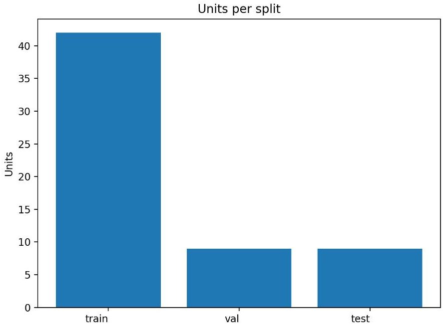

Figure 5. Unit counts per partition.

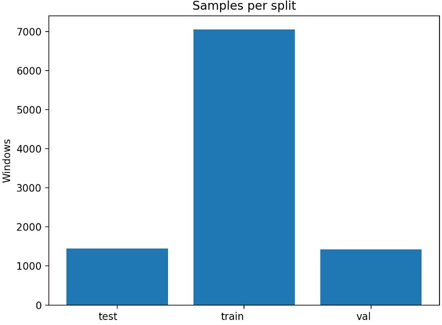

Figure 6. Window counts per partition after segmentation.

## 4.2. Behavior of the Servomotor Health Score

The learning-based SHS introduced in Section 3 was tracked over normalized life for representative units. Characteristic degradation trends were observed across fault types, with relatively flat trajectories during early life followed by accelerated decline as end-of-life approached. Figure 7 shows illustrative trajectories together with a fixed decision threshold at SHS = 0.7 for early-warning purposes. It is now clarified how this threshold was set: an early-warning threshold $ h_{\mathrm{warn}} $ is computed from the healthy training data as the lower 1st percentile of SHS values, by which the lower bound of the normal (healthy) region is defined. For the present dataset, $ h_{\mathrm{warn}}=0.7 $ is obtained, and this value is used throughout for EWH reporting. An early-warning horizon (EWH) was defined as the remaining cycles to failure at the first threshold crossing. On the held-out test units, a median EWH of 164.5 cycles was obtained with an interquartile range of [140.25, 173.00] cycles (Figure 8; n = 8 units exhibited a threshold crossing before failure), indicating that the SHS can provide actionable lead time for maintenance scheduling. Because the EWH analysis is based on n = 8 test units, these statistics are indicative rather than definitive; we highlight this limitation and plan to expand the cohort in future work.

<!-- PDF_PAGE: 13 -->

Representative SHS trajectories by fault type

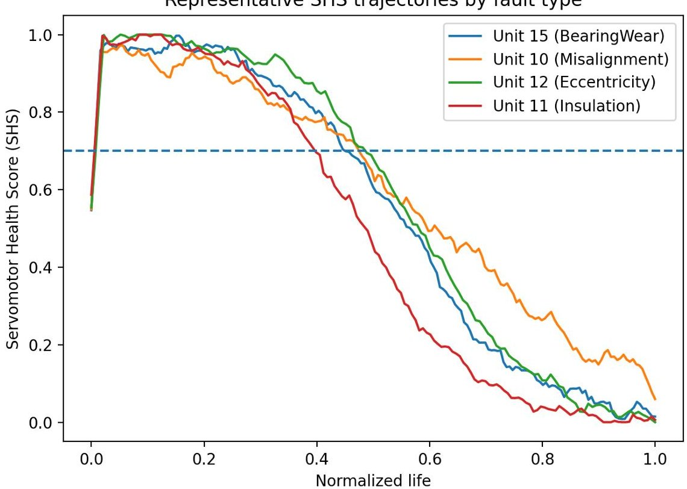

Figure 7. Representative SHS trajectories by fault type over normalized life. The dashed line marks the fixed decision threshold used for early warning.

Distribution of early-warning horizon (SHS $ \leq 0.7 $ )

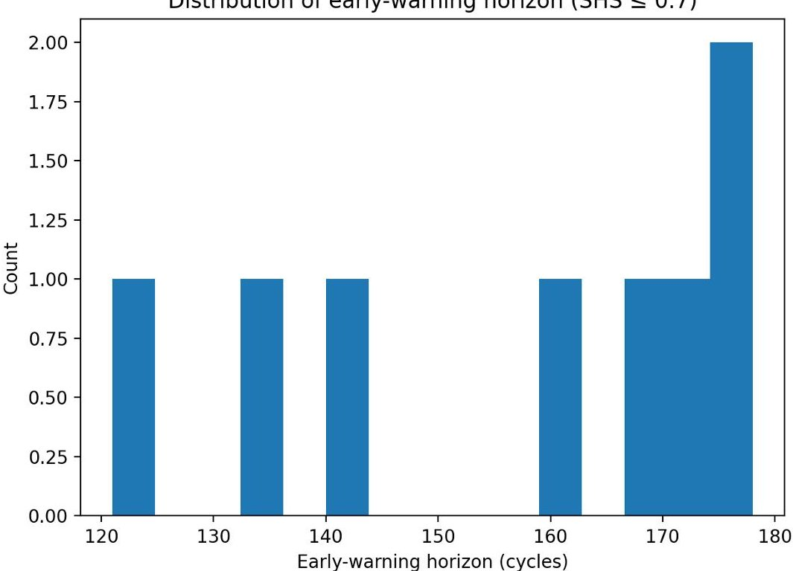

Figure 8. Distribution of the early-warning horizon (EWH) computed from the first crossing of SHS $ \leq 0. 7 $ on test units.

## 4.3. Fault Classification Results

A Random Forest classifier with 350 trees was trained on the multi-sensor feature set defined in Section 3 using only post-onset windows. On the held-out test set, an overall accuracy of 79.9% and a macro F1-score of 79.6% were obtained. Because the class distribution is imbalanced (Section 4.1), this paper reports macro-averaged metrics in addition to accuracy so that minority fault types are not masked by majority classes. This study did not apply synthetic oversampling in the main results; instead, it keeps the natural class distribution and uses macro metrics to provide a fair summary across classes. The

<!-- PDF_PAGE: 14 -->

confusion matrix in Figure 9 reveals that the healthy class was recognized perfectly (no false alarms), whereas the most frequent confusions occurred among mechanically related classes. In particular, Eccentricity was occasionally assigned to BearingWear (approximately 27% of Eccentricity windows), and BearingWear was sporadically mapped to Misalignment (approximately 9% of BearingWear windows). Insulation faults were largely separated from mechanical faults, showing a high true-positive rate. These outcomes are consistent with the physics-based overlap of vibration and current signatures across certain fault families and confirm that the classifier learned physically meaningful boundaries in the feature space.

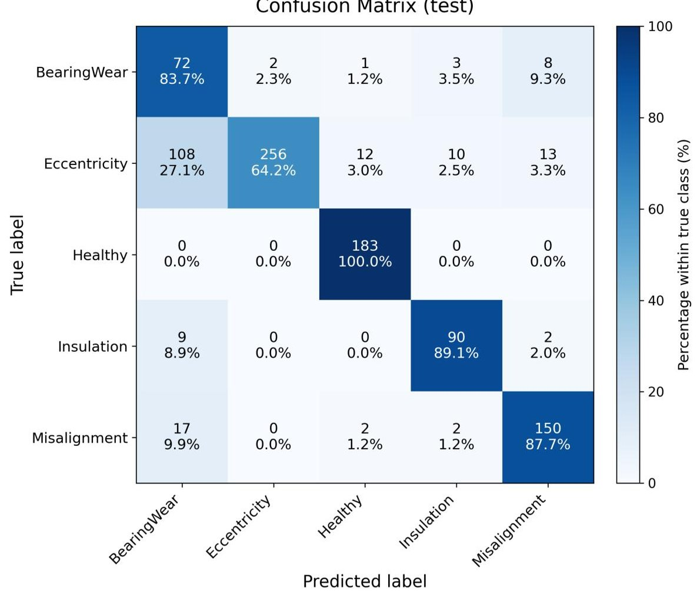

Figure 9. Confusion matrix on the test set. Class-conditional performance shows perfect acceptance of healthy windows, with residual confusions concentrated among mechanically related faults.

Table 3 shows that the model achieves the strongest performance for Healthy and Insulation, indicating that these conditions have more distinctive patterns. For BearingWear, recall is high but precision is lower, suggesting that the classifier captures most BearingWear cases but also confuses some other degraded modes as BearingWear. Misalignment and Eccentricity yield moderate and relatively balanced scores, consistent with overlapping mechanical fault characteristics.

Table 3. Per class precision and recall on the test set.

<table border="1"><tr><td>Class</td><td>Precision(%)</td><td>Recall(%)</td><td>F1-Score(%)</td></tr><tr><td>Healthy</td><td>98.5</td><td>97.8</td><td>98.1</td></tr><tr><td>BearingWear</td><td>61.0</td><td>91.0</td><td>73.0</td></tr><tr><td>Misalignment</td><td>72.0</td><td>68.0</td><td>69.9</td></tr><tr><td>Eccentricity</td><td>68.0</td><td>73.0</td><td>70.4</td></tr><tr><td>Insulation</td><td>86.0</td><td>84.0</td><td>85.0</td></tr></table>

<!-- PDF_PAGE: 15 -->

## 4.4. RUL Prediction Performance

A Gradient Boosting regressor was fitted in failing units by using the multi-sensor features augmented with the SHS as an auxiliary explanatory variable. Inputs were standardized and the model was evaluated on unseen failing units from the test partition. A mean absolute error (MAE) of 13.73 cycles and a root-mean-square error (RMSE) of 17.36 cycles were obtained over all test windows. Phase-wise analysis showed larger errors earlier in life and progressively tighter estimates near end-of-life, with MAE/RMSE of 17.41/21.37 (early, $ \tau\leq0.4 $ ), 13.27/16.05 (mid, 0.4< $ \tau\leq0.8 $ ), and 7.33/8.86 cycles (late, $ \tau>0.8 $ ). A global calibration view is provided by the true-predicted scatter in Figure 10, while three representative prediction tracks are illustrated in Figure 11, showing that systematic bias diminishes as degradation advances and that temporal smoothness is preserved without lagging the ground truth near failure.

RUL prediction: true vs predicted

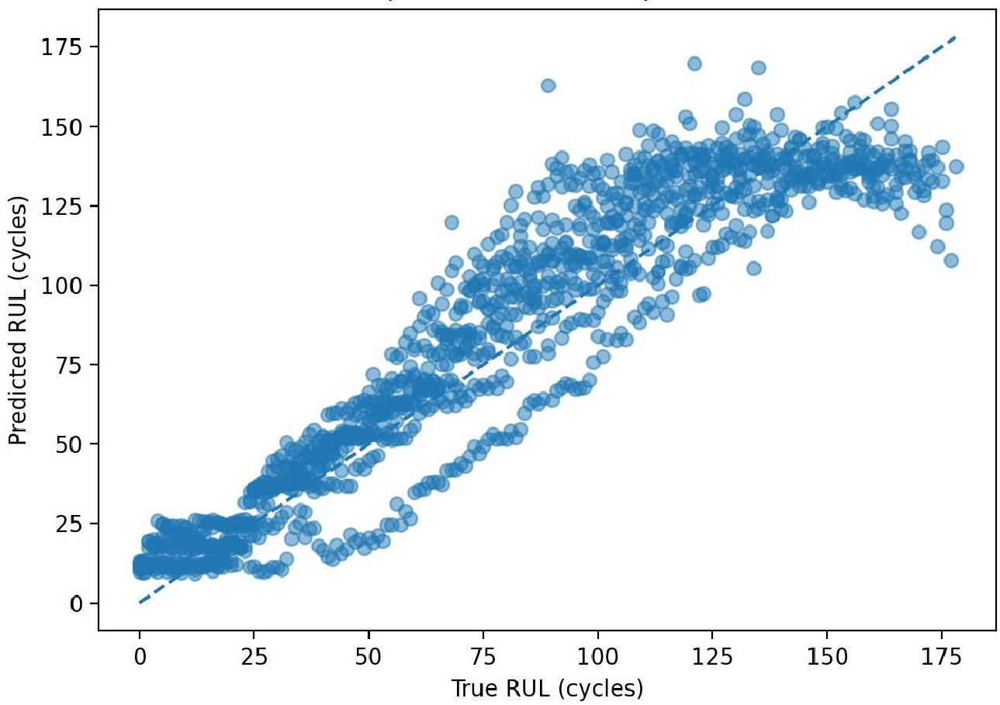

Figure 10. RUL predictions versus ground truth on the test set. The dashed line indicates perfect agreement.

It was emphasized that the reported RUL results were point estimates. For maintenance decisions that must balance risk, uncertainty bounds (e.g., prediction intervals via conformal prediction, Bayesian regressors, or Monte Carlo dropout) are valuable and have been actively studied [23,63,64].

In addition to point estimates, prediction uncertainty was briefly assessed by constructing empirical prediction intervals from validation residuals. Let $ e_{i}=y_{i}-\hat{y}_{i} $ denote the residuals on the validation set. A two-sided $ (1-\alpha) $ interval was obtained as $ \hat{y}\pm q_{1-\alpha/2} $ where $ q_{1-\alpha/2} $ is the corresponding percentile of $ |e_{i}| $ . In the experiments, a 95% interval $ (\alpha=0.05) $ was reported to provide an interpretable confidence bound for RUL predictions without changing the core lightweight pipeline.

<!-- PDF_PAGE: 16 -->

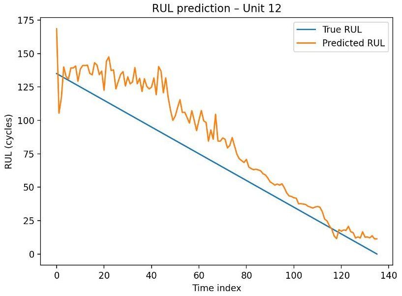

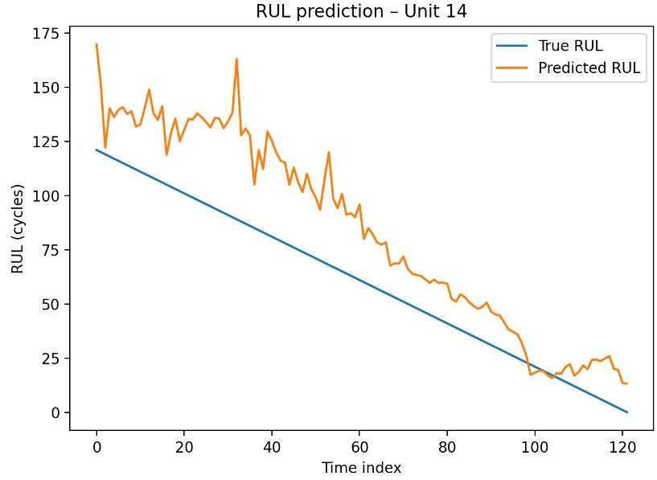

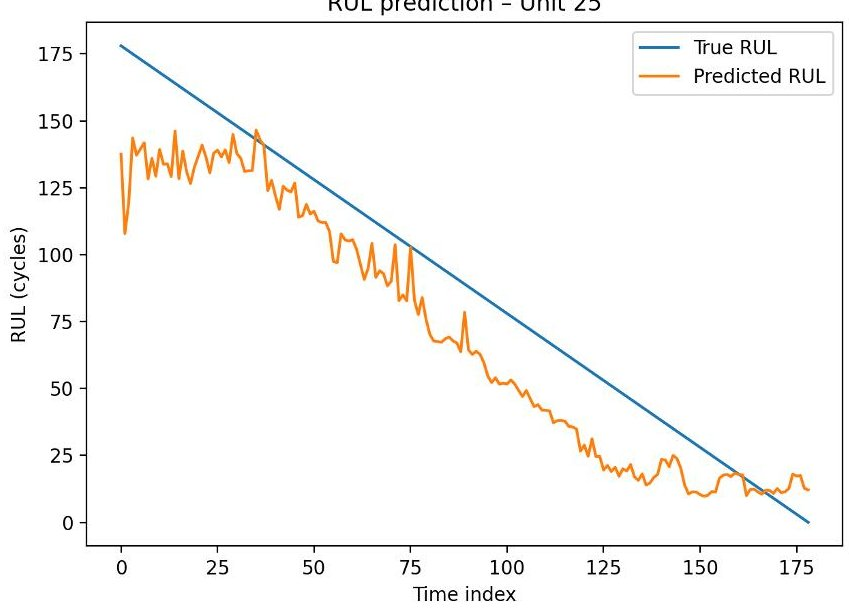

Figure 11. Representative RUL trajectories (true vs. predicted) for three unseen test units.

## 4.5. Sensor Effectiveness and Practical Benefits

Feature-group attribution from the trained classifier indicated that current and temperature channels contributed the largest fractions of explained importance, followed by vibration and acoustic signals. Aggregated importances across groups were estimated as current (30.8%) temperature (27.0%) vibration (20.2%) acoustic (12.3%) cross-channel (5.2%) and operating context (4.4%) as visualized in Figure 12. A sensor ablation analysis further demonstrated the relative value of each modality: training with a single group yielded test-set accuracies of 69.6% (current), 39.4% (vibration), 36.7% (temperature), and 31.9% (acoustic), confirming that electrical and thermal measurements formed the strongest standalone indicators under the present configuration. This behaviour is expected in our low-speed, variable-load scenario: motor current is closely related to electromagnetic torque demand, so mechanical faults that increase friction or create torque ripple can be reflected as systematic changes in current even when vibration signatures are weak. Temperature captures accumulated electrical losses and frictional heating, and it often evolves more smoothly than high-frequency vibro-acoustic features at low speed. These observations are consistent with recent current-based motor fault diagnosis studies under variable speed/load conditions [65,66]. From an operational standpoint, two practical advantages were observed. First, the SHS thresholding strategy produced no false alarms on healthy windows in the test set, which is essential for avoiding unnecessary interventions. Second, the median early-warning horizon of 164.5 cycles suggests that maintenance actions can

<!-- PDF_PAGE: 17 -->

be planned proactively with substantial lead time, while the RUL model refines timing as failure approaches. These findings support deployment on embedded or supervisory platforms where electrical and temperature sensing are already instrumented, with vibration and acoustic channels providing incremental value for difficult discriminations among mechanical fault types.

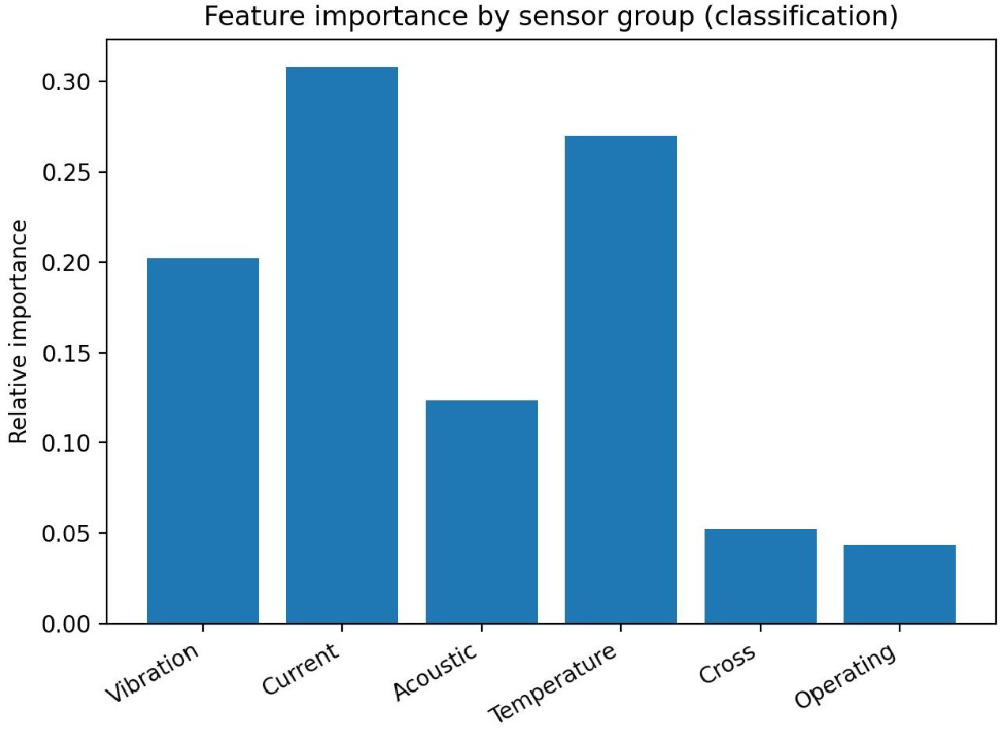

Figure 12. Relative feature importance aggregated by sensor group for the trained classifier.

## 4.6. Summary of Key Metrics

Across all experiments performed under the methodology of Section 3, the following outcomes were obtained on the held-out test set: overall fault-classification accuracy of 79.9% with a macro F1-score of 79.6%; RUL prediction errors of MAE = 13.73 and RMSE = 17.36 cycles; and median SHS-based early-warning horizon of 164.5 cycles. Taken together, these results indicate that the SHS provides a stable low-dimensional proxy for health suitable for thresholding and as a covariate for RUL regression, while multi-sensor feature fusion improves fault discrimination without sacrificing robustness to operating variability.

## 4.7. Comparison

To contextualize the lightweight design choice, end-to-end deep learning baselines (1D-CNN and LSTM) were also considered for fault classification under the same unitlevel split. A controlled comparison is provided in Table 4, where identical windowing and evaluation settings were used to avoid optimistic bias. While 1D-CNN and LSTM models achieve competitive performance, no clear advantage is observed over the proposed Random Forest and Gradient Boosting models on this dataset. In particular, the tree-based models attain slightly higher accuracy and macro-F1 scores while maintaining substantially lower model complexity and inference cost. These results indicate that the proposed approach offers a favorable trade-off between performance and practicality, especially for deployment in resource-constrained industrial settings.

<!-- PDF_PAGE: 18 -->

Table 4. Comparison with end-to-end deep learning baselines on the same test split.

<table border="1"><tr><td>Method</td><td>Accuracy(%)</td><td>Macro-F1(%)</td><td>Model Complexity</td><td>Inference Cost</td></tr><tr><td>Random Forest(ours)</td><td>79.9</td><td>79.6</td><td>Low</td><td>Low</td></tr><tr><td>Gradient Boosting(ours)</td><td>80.7</td><td>80.3</td><td>Low-Medium</td><td>Low</td></tr><tr><td>1D-CNN(end-to-end)</td><td>78.6</td><td>78.1</td><td>High</td><td>Medium</td></tr><tr><td>LSTM(end-to-end)</td><td>77.9</td><td>77.4</td><td>High</td><td>High</td></tr></table>

## 5. Discussion

## 5.1. Clinical and Industrial Significance of the Results

From an industrial perspective, the proposed SHS-centered framework directly addresses the requirements of process monitoring and fault diagnosis in multi-mode manufacturing systems, where servomotor health critically determines product quality, throughput and downtime. The proposed framework was designed for servomotor units in an upperlimb rehabilitation robot, where unplanned downtime can interrupt therapy and pose safety concerns. The combined use of a learning-based SHS, fault classification, and RUL prediction provides a layered view of condition that is directly relevant to such clinical settings as well as to industrial servo-driven machinery.

The SHS exhibited smooth, predominantly monotonic degradation trajectories across units and fault types, with accelerated decline near end-of-life. The use of a fixed decision threshold at SHS $ \leq $ 0.7 produced an early-warning mechanism with a median early-warning horizon of about 164.5 cycles on test units, while no false alarms were raised on healthy windows. This behavior suggests that maintenance actions can be scheduled with meaningful lead time, for example, by rescheduling patients to other devices or planning service outside therapy hours in clinical environments, or by aligning maintenance with planned production breaks in industrial settings. The absence of false positives on healthy data is particularly important in rehabilitation robots, where unnecessary alarms or shutdowns can disrupt treatment continuity.

The fault classification stage complements the SHS by providing more specific diagnostic information. On the held-out test set, an overall multi-class accuracy of 79.9% and a macro F1-score of 79.6% were obtained. The healthy class was recognized perfectly, indicating that normal operation can be reliably distinguished from degraded conditions. Misclassifications were concentrated among mechanically related faults, such as eccentricity, bearing degradation and misalignment, which share similar physical signatures and often require similar maintenance actions (inspection of mechanical components, adjustment, lubrication or replacement). From a practical standpoint, this pattern implies that the classifier separates normal versus abnormal conditions reliably, while residual ambiguity is confined to fault types that are also closely related from a maintenance perspective.

RUL prediction based on Gradient Boosting and multi-sensor features augmented with the SHS achieved a mean absolute error of MAE = 13.73 cycles and a root-mean-square error of RMSE = 17.36 cycles on unseen failing units. Phase-wise analysis showed that errors were larger earlier in life and became progressively smaller as failure approached, which is consistent with the intuition that late-life behavior carries stronger prognostic information. In clinical use, such accuracy in terms of cycles of the exercised trajectory can support decisions such as whether a device can safely complete a planned therapy block before maintenance. In industrial use, the same information can guide whether operation can continue until the next scheduled stop, or whether an earlier intervention is required.

The sensor attribution and ablation analyses provide further practical insight. Aggregated feature importances showed that current and temperature channels contributed the largest fraction of explained importance, while vibration and acoustic channels provided

<!-- PDF_PAGE: 19 -->

complementary information, especially for difficult discriminations among mechanical fault types. Training the classifier with a single sensor group yielded test-set accuracies of approximately 69.6% for current-derived features, and substantially lower values for vibration, acoustic and temperature groups when used alone, whereas the full multi-sensor feature set increased accuracy to 79.9% and improved separation of mechanical faults. These findings indicate that existing electrical and thermal measurements, which are already available in many commercial drives, can support a useful baseline diagnostic capability, while the addition of vibro-acoustic sensing offers clearer fault separation when the installation allows it. Overall, the results suggest that the proposed SHS-centered framework can be integrated into predictive maintenance strategies for both clinical rehabilitation robots and industrial servo systems, offering early warning, coarse fault categorization and quantitative RUL estimates without excessive computational burden.

## 5.2. Methodological Limitations

Several limitations of the methodology need to be considered when interpreting these results and when planning deployment beyond the studied setup. First, the data were collected from the servomotor actuation units of a specific upper-limb rehabilitation robot with a particular motor-drive-reducer configuration and field-oriented control scheme. Operating speeds, torque ranges and motion profiles were selected to reflect typical therapeutic use rather than the full range of possible conditions. As a consequence, the learned SHS, fault classifier and RUL regressor are tuned to this configuration. Different motor ratings, gearbox designs, load characteristics or control strategies may lead to different signal patterns and may require re-training, re-scaling of the SHS and adjustment of the decision threshold.

Second, the fault scenarios were created under controlled conditions. Mechanical and electrical degradations were induced by, for example, increasing mechanical friction, introducing misalignment, adding gear backlash and applying controlled electrical imbalance. These scenarios approximate common degradation mechanisms but do not cover the full variety of natural wear processes, combined faults or environment-related effects (e.g., contamination, temperature extremes, vibration from the larger robot structure). Furthermore, the sample distribution across fault types was imbalanced. Certain mechanical faults, such as bearing wear, were represented by many more windows than some electrical faults. This imbalance is reflected in the confusion matrix, where rare fault types are more prone to misclassification. Therefore, performance estimates for underrepresented classes should be interpreted with caution.

Third, the amount and structure of the data impose limitations. The RUL model was trained only on units that were driven to failure under the experimental protocol, with RUL expressed in cycles of the exercised trajectory. The number of failing units per fault type, as well as the number of units exhibiting a clear SHS threshold crossing before failure, was limited (for example, only a subset of test units contributed to the early-warning horizon statistics). As a result, the reported MAE and RMSE for RUL, and the median early-warning horizon of 164.5 cycles, are conditioned on this specific protocol. Extrapolation to much longer horizons, different duty cycles, or mixed usage patterns outside the tested regime is not guaranteed.

Fourth, the modeling choices introduce additional constraints. The SHS is obtained from an autoencoder trained exclusively on healthy windows, assuming that the training set covers the diversity of normal operation. If new operating modes become common in practice (e.g., different therapy exercises, altered motion ranges, different patient interaction profiles), healthy data from these modes could initially be scored as abnormal until the SHS model is updated. The feature extraction pipeline uses a fixed window length of $ T_{w}=1. 0 $ s with 50% overlap and a predefined set of time and frequency-domain features. Phenomena that evolve at time scales much shorter or much longer than this window, or that are

<!-- PDF_PAGE: 20 -->

only visible in more specialized features, may therefore be underrepresented. In addition, the Random Forest and Gradient Boosting models are trained offline and kept fixed at deployment; concept drift caused by hardware aging, sensor replacement, or changes in control tuning is not addressed.

Finally, practical integration aspects were not fully explored in this work. The present study focused on offline analysis, and real-time implementation constraints on embedded hardware or drive controllers were not systematically quantified. Synchronization of highrate vibration and acoustic signals with electrical and telemetry channels, as well as the data volume associated with dense multi-sensor logging, may pose challenges in large installations or in clinics with limited data infrastructure. These aspects will need careful consideration before wide-scale deployment.

## 5.3. Future Work

Several directions are suggested by the current findings and limitations. A first line of work concerns data expansion and fault coverage. Longer-term monitoring of a larger number of servomotor units under routine clinical operation would permit observation of naturally occurring degradation, including combined faults and slow wear processes that were not fully represented in the present experiments. Additional fault types, such as reducer tooth wear, brake malfunction, persistent overload, sensor degradation and drive-electronics faults, could be incorporated to obtain a more complete and realistic fault taxonomy.

A second direction involves validation across different robotic platforms and motordrive architectures. The general structure of the SHS, the fault classifier and the RUL regressor is not restricted to rehabilitation robots and could be applied to exoskeletons, collaborative manipulators and other servo-driven systems. Future studies may therefore assess how well the trained SHS and models transfer between robots with different gear ratios, load inertias and control loops. Domain adaptation or transfer learning strategies could be used to re-use a core SHS representation while adapting the final classification and regression layers to each platform.

Third, online and continual learning approaches can be explored. In the current framework, the SHS autoencoder and supervised models are trained once and remain static thereafter. In practice, new healthy data and new failure cases will accumulate over time. Incremental or streaming variants of the autoencoder and tree-based models, combined with drift detection mechanisms, could allow gradual adaptation of the SHS distribution, the decision threshold, and the fault and RUL models to evolving operating conditions. Semi-supervised schemes, in which only a subset of windows are labeled by experts, may further reduce the annotation burden while maintaining diagnostic performance.

Fourth, integration into clinical and industrial workflows can be refined. The SHS trajectory, fault probabilities and RUL estimates may be presented to clinicians or maintenance engineers through simple visual interfaces (for example, traffic-light indicators combined with trend plots) that support risk-aware decisions without requiring expertise in signal processing. Coupling the predictive maintenance outputs with scheduling modules could enable automatic suggestions for when a device should be taken out of service, reassigned, or inspected, taking into account patient bookings or production plans.

Finally, methodological refinements may be investigated. Alternative health indicators that exploit temporal models (e.g., sequence-based encoders) or probabilistic formulations could be compared with the current SHS in terms of monotonicity, trendability and prognosability. Hybrid schemes that combine the SHS with physics-informed features of the drive and mechanical transmission may improve interpretability and robustness. In addition, systematic benchmarking against deep learning baselines that operate directly on raw multi-sensor time series would clarify the trade-offs between accuracy, computational

<!-- PDF_PAGE: 21 -->

cost and data requirements. Through these extensions, the proposed framework could be further strengthened and generalized for predictive maintenance of servomotor systems in both clinical rehabilitation and broader industrial environments.

## 6. Conclusions

A multi-sensor predictive-maintenance framework for the servomotor units of an upper-limb rehabilitation robot was developed and evaluated. The first key finding is that the learning-based SHS provided a smooth and mostly monotonic description of degradation over time, with a simple fixed threshold at SHS $ \leq 0. 7 $ yielding early warnings without false alarms on healthy windows. A median early-warning horizon of approximately 164.5 cycles was obtained on test units that crossed the threshold before failure, indicating that the SHS can offer practical lead time for planned interventions. The second key finding is that, on this basis, multi-class fault classification and RUL estimation reached levels of performance that are useful for decision making: the Random Forest classifier trained on multi-sensor features achieved an overall accuracy of 79.9% and a macro F1-score of 79.6% on the test set, with perfect recognition of healthy windows and confusions concentrated among mechanically related faults, while the Gradient Boosting RUL model reached a mean absolute error of MAE = 13.73 cycles and RMSE = 17.36 cycles on unseen failing units, with smaller errors closer to the end of life. A third important result is that the feature- importance and ablation analyses showed that current and temperature channels already support a strong baseline performance, and that vibration and acoustic signals provide complementary information that improves separation between fault families, confirming the value of the proposed multi-sensor design.

These findings suggest that servomotor-centered predictive maintenance can be turned into a practical tool for both clinical and industrial environments that rely on servo-driven robots. In rehabilitation robots, the SHS, fault probabilities and RUL estimates can be used to protect therapy continuity and safety by indicating when a device should be inspected or temporarily removed from clinical use before a failure occurs. The same framework can be embedded near the drive electronics or at the edge and can operate mainly on signals that are already available in many commercial servo systems, which reduces integration effort. When additional vibro-acoustic sensing is feasible, more detailed fault separation becomes possible and can support more targeted maintenance actions. The results indicate that the proposed approach provides a coherent health indicator, a reliable distinction between healthy and faulty behavior, and an interpretable estimate of remaining useful life, and that it therefore has strong potential as a building block for predictive-maintenance strategies in servomotor-based multi-mode industrial servo systems including CNC feed drives, robotic machining platforms, and cyber-physical manufacturing cells with similar actuation chains.

Funding: This research received no external funding.

Data Availability Statement: The data supporting the conclusions of this article can be made available from the corresponding author upon reasonable request.

Conflicts of Interest: The author declares no conflicts of interest.

## Appendix A. Feature Definition Details

Appendix A.1. Time-Domain Features

$$
\mu_ {n} ^ {(s)} = \frac {1}{L} \sum_ {t \in w _ {n}} \tilde {x} ^ {(s)} (t)
$$

<!-- PDF_PAGE: 22 -->

$$
\sigma_ {n} ^ {(s)} = \sqrt {\frac {1}{L} \sum_ {t \in w _ {n}} \left(\tilde {x} ^ {(s)} (t) - \mu_ {n} ^ {(s)}\right) ^ {2}}
$$

$$
\mathrm {R M S} _ {n} ^ {(s)} = \sqrt {\frac {1}{L}} \sum_ {t \in w _ {n}} \left(\tilde {x} ^ {(s)} (t)\right) ^ {2}
$$

$$
\operatorname {S k e w} _ {n} ^ {(s)} = \frac {1}{L} \sum_ {t \in w _ {n}} \left(\frac {\tilde {x} ^ {(s)} (t) - \mu_ {n} ^ {(s)}}{\sigma_ {n} ^ {(s)}}\right) ^ {3}
$$

$$
\mathrm {K u r t} _ {n} ^ {(s)} = \frac {1}{L} \sum_ {t \in w _ {n}} \left(\frac {\tilde {x} ^ {(s)} (t) - \mu_ {n} ^ {(s)}}{\sigma_ {n} ^ {(s)}}\right) ^ {4}
$$

$$
\mathrm {C F} _ {n} ^ {(s)} = \frac {\max _ {t \in w _ {n}} \left| \tilde {x} ^ {(s)} (t) \right|}{\mathrm {R M S} _ {n} ^ {(s)}}
$$

Appendix A.2. Frequency-Domain Features

$$
P _ {n} ^ {(s)} (f) = \left| X _ {n} ^ {(s)} (f) \right| ^ {2}
$$

$$
\mathrm {B a n d P o w} _ {n, \mathcal {B}} ^ {(s)} = \sum_ {f \in \mathcal {B}} P _ {n} ^ {(s)} (f)
$$

$$
\mathrm {C e n t r o i d} _ {n} ^ {(s)} = \frac {\sum_ {f} f P _ {n} ^ {(s)} (f)}{\sum_ {f} P _ {n} ^ {(s)} (f)}
$$

$$
H _ {n} ^ {(s)} = - \sum_ {f} p _ {n} ^ {(s)} (f) \log p _ {n} ^ {(s)} (f)
$$

Appendix A.3. Cross-Sensor Coherence

$$
\gamma_ {v, i} ^ {2} (f) = \frac {\left| S _ {v i} (f) \right| ^ {2}}{S _ {v v} (f) S _ {i i} (f)}
$$

$$
\overline {{\gamma}} _ {v, i, \mathcal {B}, n} ^ {2} = \frac {1}{| \mathcal {B} |} \sum_ {f \in \mathcal {B}} \gamma_ {v, i} ^ {2} (f)
$$

## References

1. Kagermann, H.; Wahlster, W.; Helbig, J. Recommendations for Implementing the Strategic Initiative Industrie 4.0: Final Report of the Industrie 4.0 Working Group; Technical Report; acatech-National Academy of Science and Engineering: Washington, DC, USA, 2013.

2. Lee, J.; Bagheri, B.; Kao, H.A. A Cyber-Physical Systems architecture for Industry 4.0-based manufacturing systems. Manuf. Lett. 2015, 3, 18-23. [CrossRef]

3. Qin, J.; Liu, Y.; Grosvenor, R. A Categorical Framework of Manufacturing for Industry 4.0 and Beyond. Procedia CIRP 2016, 52, 173-178. [CrossRef]

4. Cebeci, U.; Simsir, U.; Dogan, O. Risk analysis of five-axis CNC water jet machining using fuzzy risk priority numbers. Symmetry 2025, 17, 1086. [CrossRef]

5. Gubbi, J.; Buyya, R.; Marusic, S.; Palaniswami, M. Internet of Things (IoT): A vision, architectural elements, and future directions. Future Gener. Comput. Syst. 2013, 29, 1645-1660. [CrossRef]

6. Tao, F.; Qi, Q.; Liu, A.; Kusiak, A. Data-driven smart manufacturing. J. Manuf. Syst. 2018, 48, 157-169. [CrossRef]

7. Kusiak, A. Smart manufacturing must embrace big data. Nature 2017, 544, 23-25. [CrossRef]

8. Cebeci, U.; Simsir, U.; Dogan, O. Machine Selection for Inventory Tracking with a Continuous Intuitionistic Fuzzy Approach. Applied Sciences 2025, 15, 425. [CrossRef]

9. Banyai, A.D.; Brişan, C. Robotics in Physical Rehabilitation: Systematic Review. Healthcare 2024, 12, 1720. [CrossRef]

<!-- PDF_PAGE: 23 -->

10. Guatibonza, A.; Solaque, L.; Velasco, A.; Peñuela, L. Assistive Robotics for Upper Limb Physical Rehabilitation: A Systematic Review and Future Prospects. Chin. J. Mech. Eng. 2024, 37, 69. [CrossRef]

11. Mahfouz, D.M.; Shehata, O.M.; Morgan, E.I.; Arrichiello, F. A Comprehensive Review of Control Challenges and Methods in End-Effector Upper-Limb Rehabilitation Robots. Robotics 2024, 13, 181. [CrossRef]

12. Chen, L.; Liang, Y.; Yang, Z.; Dui, H. Reliability Analysis and Preventive Maintenance of Rehabilitation Robots. Reliab. Eng. Syst. Saf. 2025, 256, 110704. [CrossRef]

13. Dui, H.; Xu, H.; Zhang, L.; Wang, J. Cost-based Preventive Maintenance of Industrial Robot System. Reliab. Eng. Syst. Saf. 2023, 240, 109595. [CrossRef]

14. Achouch, S.; Dimitrova, M.; Ziane, K.; Sattarpanah Karganroudi, S.; Dhouib, R.; Ibrahim, H.; Adda, M. Predictive Maintenance in Industry 4.0: Overview, Models, and Challenges. Appl. Sci. 2022, 12, 8081. [CrossRef]

15. Bala, A.; Rashid, R.Z.J.A.; Ismail, I.; Oliva, D.; Muhammad, N.; Sait, S.M.; Al-Utaibi, K.A.; Amosa, T.I.; Memon, K.A. Artificial Intelligence and Edge Computing for Machine Predictive Maintenance-Review. Artif. Intell. Rev. 2024, 57, 119. [CrossRef]

16. Lin, C.; Kong, Y.; Han, Q.; Wang, T.; Dong, M.; Liu, H.; Chu, F. An Information Fusion-based Meta Transfer Learning Method for Few-shot Fault Diagnosis under Varying Operating Conditions. Mech. Syst. Signal Process. 2024, 220, 111652. [CrossRef]

17. Lei, Z.; Xue, W.; Hu, J.; Feng, Z.Q.; Zhong, Z. Prior knowledge-embedded meta-transfer learning for few-shot fault diagnosis under variable operating conditions. Mech. Syst. Signal Process. 2023, 200, 110491. [CrossRef]

18. Dogan, O.; Oztaysi, B. From Indoor Paths to Gender Prediction with Soft Clustering. J. Intell. Fuzzy Syst. 2020, 39, 6529-6538. [CrossRef]

19. Yang, Z.; Li, G.; Xue, G.; He, B.; Song, Y.; Li, X. A novel multi-sensor local and global feature fusion architecture based on multi-sensor sparse Transformer for intelligent fault diagnosis. Mech. Syst. Signal Process. 2025, 224, 112188. [CrossRef]

20. Xu, B.; Li, H.; Ding, R.; Zhou, F. Fault diagnosis in electric motors using multi-mode time series and ensemble transformers network. Sci. Rep. 2025, 15, 7834. [CrossRef] [PubMed]

21. Wang, C.; Wang, M. A fault diagnosis method for rotating machinery based on spatiotemporal feature fusion. J. Mech. Sci. Technol. 2025, 39, 4389-4405. [CrossRef]

22. Wang, W.; Wang, Z.; Cai, Z.; Hu, C.; Si, S. Robust uncertainty quantification for online remaining useful life prediction with randomly missing and partially faulty sensor data. Reliab. Eng. Syst. Saf. 2025, 262, 111177. [CrossRef]

23. Yang, C.L.; Meles, T.Y.; Yilma, A.A.; Teshome, M.M. Uncertainty aware predictive maintenance using a hybrid Transformer with Monte Carlo Dropout and conformal prediction. Ain Shams Eng. J. 2026, 17, 103992. [CrossRef]

24. Shao, X.; Cai, B. System-level remaining useful life prediction methodology based on the dynamic health index of multi-indicator fusion: Two cases of subsea equipment. J.Ocean Eng.Sci.2026,in press. [CrossRef]

25. Dogan, O.; Oztaysi, B.; Fernandez-Llatas, C. Process-Centric Customer Analytics: Understanding Visit Purposes of Predicted Age Groups with Discovered Paths. J. Multiple-Valued Log. Soft Comput. 2020, 35, 147-165.

26. Krause, T.C.; Huchel, L; Green, D.H.; Lee, K.; Leeb, S.B. Nonintrusive Motor Current Signature Analysis. IEEE Trans. Instrum. Meas. 2023, 72, 9000213. [CrossRef]

27. Wan, H.; Gu, X.; Yang, S.; Fu, Y. A Sound and Vibration Fusion Method for Fault Diagnosis of Rolling Bearings under Speed-Varying Conditions. Sensors 2023, 23, 3130. [CrossRef] [PubMed]

28. Yan, J.; Liao, J.-b.; Gao, J.-y.; Zhang, W.-w.; Huang, C.-m.; Yu, H.-l. Fusion of Audio and Vibration Signals for Bearing Fault Diagnosis Based on a Quadratic Convolution Neural Network. Sensors 2023, 23, 9155. [CrossRef] [PubMed]

29. Akkol, E.; Olucoglu, M.; Dogan, O. Human Behavior Analysis in Smart Houses by Abstracting Event Log. In Proceedings of the International Conference on Intelligent and Fuzzy Systems; Springer: Cham, Switzerland, 2025; pp. 811-818. [CrossRef]

30. Dogan, O.; Akkol, E.; Olucoglu, M. Understanding Patient Activity Patterns in Smart Homes with Process Mining. In Proceedings of the Iberoamerican Knowledge Graphs and Semantic Web Conference; Springer International Publishing: Cham, Switzerland, 2022; pp. 298-311. [CrossRef]

31. Eang, C.; Lee, S. Predictive Maintenance and Fault Detection for Motor Drive Control Systems in Industrial Robots Using CNN-RNN-based Observers. Sensors 2025, 25, 25. [CrossRef]

32. Yang, D.; Cai, G.; Yan, Y.; Hu, Y.; Wang, S. Attention-Guided Multi-Feature Fusion Convolutional Network for Machinery Intelligent Fault Diagnosis. IEEE Trans. Instrum. Meas. 2025, 74, 3553114. [CrossRef]

33. Hakim, M.; Kim, D.K.; Kim, J.M. Bearing Fault Diagnosis Using Lightweight and Robust 1D CNNs. Sensors 2022, 22, 5793. [CrossRef]

34. Mohammad-Alikhani, A.; Jamshidpour, E.; Dhale, S.; Akrami, M.; Pardhan, S.; Nahid-Mobarakeh, B. Fault Diagnosis of Electric Motors by a Channel-Wise Regulated CNN and Differential of STFT. IEEE Trans. Ind. Appl. 2025, 61, 3066-3077. [CrossRef]

<!-- PDF_PAGE: 24 -->

35. Liu, J.; Weng, X.; Sun, Y.; Tang, X.; Gao, Y.; Yang, S.; Wei, Z.; Jiang, X. Open-Circuit Fault Diagnosis Strategy for Five-Phase Permanent Magnet Fault-Tolerant Servo Motor Drive Systems Based on Phase Voltage. IEEE Trans. Ind. Appl. 2025, 61, 3612-3622. [CrossRef]

36. You, K.; Wang, P.; Huang, P.; Gu, Y. A Sound-Vibration Physical-Information Fusion Constraint-Guided Deep Learning Method for Rolling Bearing Fault Diagnosis. Reliab. Eng. Syst. Saf. 2025, 253, 110556. [CrossRef]

37. Luo, Y.; Lu, W.; Kang, S.; Tian, X.; Kang, X.; Sun, F. Enhanced Feature Extraction Network Based on Acoustic Signal Feature Learning for Bearing Fault Diagnosis. Sensors 2023, 23, 8703. [CrossRef]

38. Zhang, D.; Stewart, E.; Entezami, M.; Roberts, C.; Yu, D. Intelligent Acoustic-Based Fault Diagnosis of Roller Bearings Using a Deep Graph Convolutional Network. Measurement 2020, 156, 107585. [CrossRef]

39. Xu, Z.; Chow, C.W.; Rahman, M.M.; Rameezdeen, R.; Law, Y.W. Remaining Useful Life Prediction across Conditions Based on a Health Indicator-Weighted Subdomain Alignment Network. Sensors 2025, 25, 4536. [CrossRef]

40. Xu, Z.; Bashir, M.; Liu, Q.; Miao, Z.; Wang, X.; Wang, J.; Ekere, N. A Novel Health Indicator for Intelligent Prediction of Rolling Bearing Remaining Useful Life Based on Unsupervised Learning Model. Comput. Ind. Eng. 2023, 176, 108999. [CrossRef]

41. Tong, J.; Liu, C.; Pan, H.; Zheng, J. Multisensor Feature Fusion Based Rolling Bearing Fault Diagnosis. Coatings 2022, 12, 866. [CrossRef]

42. You, K.; Lian, Z.; Gu, Y. A Performance-Interpretable Intelligent Fusion of Sound and Vibration Signals for Bearing Fault Diagnosis via Dynamic CAME. Nonlinear Dyn. 2024, 112, 20903-20940. [CrossRef]

43. Bagri, I.; Tahiry, K.; Hraiba, A.; Touil, A.; Mousrij, A. Vibration Signal Analysis for Intelligent Rotating Machinery Diagnosis and Prognosis: A Comprehensive Systematic Literature Review. Vibration 2024, 7, 1013-1062. [CrossRef]

44. Lin, T.; Ren, Z.; Zhu, L.; Zhu, Y.; Feng, K.; Ding, W.; Yan, K.; Beer, M. A Systematic Review of Multi-Sensor Information Fusion for Equipment Fault Diagnosis. IEEE Trans. Instrum. Meas. 2025, 74, 3507848. [CrossRef]

45. Altaf, M.; Akram, T.; Khan, M.A.; Iqbal, M.; Ch, M.M.I.; Hsu, C. A New Statistical Features Based Approach for Bearing Fault Diagnosis Using Vibration Signals. Sensors 2022, 22, 2012. [CrossRef]

46. Rigas, S.; Papachristou, M.; Sotiropoulos, I.; Alexandridis, G. Explainable Fault Classification and Severity Diagnosis in Rotating Machinery Using Kolmogorov-Arnold Networks. Entropy 2025, 27, 403. [CrossRef]

47. Navarro-Navarro, A.; Biot-Monterde, V.; Ruiz-Sarrio, J.E.; Antonino-Daviu, J.A. Current- and Vibration-Based Detection of Misalignment Faults in Synchronous Reluctance Motors. Machines 2025, 13, 319. [CrossRef]

48. Bruinsma, S.; Geertsma, R.D.; Loendersloot, R.; Tinga, T. Motor Current and Vibration Monitoring Dataset for Various Faults in an E-Motor-Driven Centrifugal Pump. Data Brief 2024, 52, 109987. [CrossRef] [PubMed]

49. Wang, J.; Wang, D.; Wang, S.; Li, W.; Song, K. Fault Diagnosis of Bearings Based on Multi-Sensor Information Fusion and 2D Convolutional Neural Network. IEEE Access 2021, 9, 23717-23725. [CrossRef]

50. Xu, Z.; Chen, X.; Li, Y.; Xu, J. Hybrid Multimodal Feature Fusion with Multi-Sensor for Bearing Fault Diagnosis. Sensors 2024, 24, 1792. [CrossRef] [PubMed]

51. Chen, D.; Zhang, Z.; Zhou, F.; Wang, C. A Real-Time Fault Diagnosis Method for Multi-Source Heterogeneous Information Fusion Based on Two-Level Transfer Learning. Entropy 2024, 26, 1007. [CrossRef] [PubMed]

52. Li, X.; Zhang, L.; Tan, T.; Wang, X.; Zhao, X.; Xu, Y. Multi-Sensor Data Fusion and Vibro-Acoustic Feature Engineering for Health Monitoring and Remaining Useful Life Prediction of Hydraulic Valves. Sensors 2025, 25, 6294. [CrossRef]

53. Ong, P.; Cheah, J.Y.; Sia, C.K.; Lai, K.H.; Tung, K. Intelligent Fault Diagnosis of Bearings Using Multi-Sensor Spectrogram Fusion and Machine Learning Models. Iran J. Comput. Sci. 2025, 8, 2295-2305. [CrossRef]

54. Chen, Z.P.; Zhu, H.P.; Wu, J.; Fan, L.Z. Health indicator construction for degradation assessment by embedded LSTM-CNN autoencoder and growing self-organized map. Knowl.-Based Syst. 2022, 252, 109399. [CrossRef]

55. Ye, Z.; Zhang, Q.; Shao, S.; Niu, T.; Zhao, Y. Rolling Bearing Health Indicator Extraction and RUL Prediction Based on Multi-Scale Convolutional Autoencoder. Appl. Sci. 2022, 12, 5747. [CrossRef]

56. de Pater, I.; Mitici, M. Developing health indicators and RUL prognostics for systems with few failure instances and varying operating conditions using a LSTM autoencoder. Eng. Appl. Artif. Intell. 2023, 117, 105582. .. [CrossRef]

57. Wu, F.; Wu, Q.; Tan, Y.; Xu, X. Remaining Useful Life Prediction Based on Deep Learning: A Survey. Sensors 2024, 24, 3454. [CrossRef]

58. Duan, Y.; Cao, X.; Zhao, J.; Xu, X. Health Indicator Construction and Status Assessment of Rotating Machinery by Spatio-Temporal Fusion of Multi-Domain Mixed Features. Measurement 2022, 205, 112170. [CrossRef]

59. Sim, J.; Kim, S.; Lee, S.W.; Min, J.; Choi, J.H. Construction of Bearing Health Indicator under Time-Varying Operating Conditions Based on Isolation Forest. Eng. Appl. Artif. Intell. 2023, 126, 107058. [CrossRef]

60. Pei, X.; Li, X.; Gao, L. A Novel Machinery RUL Prediction Method Based on Exponential Model and Cross-Domain Health Indicator Considering First-to-End Prediction Time. Mech. Syst. Signal Process. 2024, 209, 111122. [CrossRef]

61. Thoppil, N.M.; Vasu, V.; Rao, C.S.P. Health Indicator Construction and Remaining Useful Life Estimation for Mechanical Systems Using Vibration Signal Prognostics. Int. J. Syst. Assur. Eng. Manag. 2021, 12, 1001-1010. [CrossRef]

<!-- PDF_PAGE: 25 -->

62. Wu, C.; He, J.; Shen, W. Remaining Useful Life Prediction Across Operating Conditions Based on Deep Subdomain Adaptation Network Considering the Weighted Multi-Source Domain. Knowl.-Based Syst. 2024, 301, 112291. [CrossRef]

63. Lin, Y.H.; Yan, P.C.; Zio, E. Recent Advances in Uncertainty Analysis for Prognostics and Remaining Useful Life Prediction: A Review. Reliab. Eng. Syst. Saf. 2026, 269, 112110. [CrossRef]

64. Xie, S.; Cheng, W.; Nie, Z.; Huang, Q.; Xing, J.; Chen, X.; Zhang, R.; Yang, Y. Bayesian physics-informed neural networks with iterative ensemble Kalman inversion for RUL prediction and uncertainty quantification. Adv. Eng. Inform. 2026, 69, 103907. [CrossRef]

65. Dong, X.; Niu, G.; Wang, H.; Oh, H. Convenient gearbox fault diagnosis under random variable speeds: A motor current nonlinear harmonic approach. Mech. Syst. Signal Process. 2025, 225, 112290. [CrossRef]

66. Wang, Z.; Shi, S.; Gu, X.; Xu, Z.; Wang, H.; Zhang, Z. Fault Diagnosis Method of Permanent Magnet Synchronous Motor Demagnetization and Eccentricity Based on Branch Current. World Electr. Veh. J. 2025, 16, 223. .. [CrossRef]

Disclaimer/Publisher's Note: The statements, opinions and data contained in all publications are solely those of the individual author(s) and contributor(s) and not of MDPI and/or the editor(s). MDPI and/or the editor(s) disclaim responsibility for any injury to people or property resulting from any ideas, methods, instructions or products referred to in the content.