<!-- PDF_PAGE: 1 -->

Article

# Predicting the Remaining Useful Life of Ship Shafting Using Bayesian Networks with Asymmetric Probability Distributions

Peng Dong, Ge Han and Luwen Yuan $ ^{*} $

Naval University of Engineering, Wuhan 430033, China

* Correspondence: 2220222061@nue.edu.cn

## Abstract

Accurately predicting the remaining useful life (RUL) of ship shafting is crucial for ensuring navigation safety and optimizing operation and maintenance. Traditional Bayesian Network (BN) methods are usually based on the assumption of symmetric distributions. They struggle to effectively characterize common statistical properties such as asymmetry and heavy tails during the shafting degradation process, leading to biases in prediction results. To address this issue, this study proposes an Asymmetric Distribution Bayesian Network (ADBN) method. The method consists of three key components. Firstly, each node selects the optimal asymmetric distribution form based on the Bayesian Information Criterion (BIC) to better fit data characteristics. Secondly, a Generalized Linear Model (GLM) is used to associate distribution parameters (e.g., location, scale, shape) with parent node states, enabling the conditional distribution to adaptively evolve with the system degradation process. Finally, to tackle the complex inference problem under asymmetric distributions, an approximate algorithm based on stochastic gradient variational inference is designed to ensure prediction timeliness. Experimental results show that the ADBN method outperforms traditional Gaussian networks in terms of Mean Absolute Error in the early, middle, and late stages of RUL prediction, and can provide more accurate prediction intervals. This research offers a probabilistic approach that better aligns with actual statistical properties for modeling ship shafting degradation.

Received: 29 January 2026

Revised: 25 February 2026

Accepted: 2 March 2026

Published: 4 March 2026

Copyright: 2026 by the authors. Licensee MDPI, Basel, Switzerland. This article is an open access article distributed under the terms and conditions of the Creative Commons Attribution (CC BY) license.

Keywords: RUL prediction; asymmetric distribution; variational inference; Bayesian network

Academic Editors: Arthur Henrique de Andrade Melani and Renan Favarão da Silva

## 1. Introduction

As the core transmission component of a ship's propulsion system, the health status of ship shafting directly affects navigation safety, operational costs, and maintenance efficiency. Prognostics and Health Management (PHM) technology enables condition-based maintenance through real-time monitoring, fault diagnosis, and predictive maintenance. This reduces the risk of transmission system failure, minimizes unplanned downtime for maintenance, and optimizes spare parts management [1]. Among these, RUL prediction is the core of PHM, aiming to accurately assess the time until the shafting fails or its performance degrades to a threshold based on current and historical monitoring data [2]. Achieving high-precision remaining useful life (RUL) prediction is of great significance for ensuring navigation safety and improving the economic efficiency of ship operations [3].

Numerous data-driven methods have been proposed and validated for RUL prediction [4-6]. Liu et al. [7] proposed a deep network method based on time-frequency diagrams for complex fault diagnosis of ship propulsion shafting. Weiner et al. [8] further

<!-- PDF_PAGE: 2 -->

verified the effectiveness of probabilistic methods in predicting the lifespan of complex engineering systems in unmanned ship systems. Among these methods, Bayesian Networks (BNs) have gained widespread attention in predicting the RUL of mechanical systems due to their intuitive probabilistic graph representation, powerful uncertainty reasoning capabilities, and excellent knowledge fusion characteristics [9]. BNs can integrate domain expert experience with statistical data patterns, express causal or dependency relationships between variables through graph structures, and quantify the uncertainty of these relationships using conditional probability distributions. Compared with pure data-driven black-box models, BNs offer better model interpretability [8], which can elucidate fault propagation paths and degradation mechanisms—a valuable feature for safety-critical systems such as ship shafting.

In the direction of uncertainty-driven fault diagnosis, recent studies have emphasized the importance of explicitly incorporating uncertainty into the modeling and inference process from multiple perspectives. Some studies have proposed distribution-aware feature processing and representation methods to mitigate the impact of sample bias and class imbalance on diagnosis performance [10]; others have embedded uncertainty into the data-driven identification framework and combined it with convex optimization or robust statistical techniques to improve the robustness and reliability of diagnosis in uncertain environments [11]. From the modeling paradigm, for scenarios with time-evolving or interval-type uncertainty, scholars have developed time-dependent uncertainty models, including dual-modality interval processes to better characterize and track the dynamic changes in uncertainty structures [12]. The connection between these studies and this paper is that they demonstrate the importance of accurately characterizing and propagating uncertainty for decision-making in engineering fault diagnosis.

Despite the advantages of uncertainty reasoning and interpretability, BNs still have key limitations in ship shafting RUL prediction: many studies simplify the conditional probability distribution of continuous variables to symmetric distributions [13] (mostly Gaussian distribution or its variants [14,15]). The core assumption is that child nodes follow a Gaussian distribution given parent nodes, and their mean values are linear functions of the parent nodes. Research by Wu et al. [16] has shown that the degradation process of mechanical equipment often exhibits significant asymmetric and non-normal characteristics. Forcing the use of symmetric distributions can lead to prediction biases. They attempted to capture this asymmetry using the closed skew-normal distribution, but existing non-Gaussian modeling methods are often computationally complex. The Gaussian distribution assumption is mainly based on mathematical convenience and computational tractability, simplifying parameter learning and probabilistic inference.

Under actual operating conditions, the degradation process and monitoring data of ship shafting often exhibit complex non-Gaussian statistical properties [17]. Firstly, the degradation process is usually directional. For example, parameters such as vibration energy, alignment deviation, and wear particle concentration tend to show a monotonically increasing trend during failure development, resulting in obvious skewness (i.e., asymmetry) in their probability distributions [18]. Secondly, due to load fluctuations, external impacts, and random expansion of internal defects endured by the system, monitoring data often exhibit heavy-tailed characteristics—meaning extreme values occur more frequently than expected under a Gaussian distribution [19]. These skewness and heavy-tailed properties are inherent attributes of the degradation process of mechanical systems, reflecting the nonlinear and non-equilibrium nature of fault evolution [20].

Forcing the use of symmetric Gaussian distributions to model such asymmetric data prevents the model from accurately capturing the risk change patterns in the degradation dynamics [17]. Specifically, in the early stage of degradation, when skewness is weak,

<!-- PDF_PAGE: 3 -->

the Gaussian assumption tends to smooth out initial asymmetry, leading to insensitivity to early anomalies [21]; in the accelerated degradation stage, when skewness intensifies, the Gaussian model systematically underestimates or overestimates the probability density of certain states, thereby introducing biased RUL estimates; in the late stage near failure, when heavy-tailed characteristics are significant, the Gaussian model often provides overly wide and conservative prediction intervals to cover extreme values, reducing the value of early warning and decision-making [22]. Therefore, BNs based on symmetric distribution assumptions face bottlenecks in accuracy and reliability in complex degradation scenarios.

Recently, a few studies have attempted to introduce non-Gaussian distributions into BNs [23] to handle lifespan data. However, these methods are often limited to the output layer or a single variable and fail to flexibly and systematically embed asymmetric distributions into the hierarchical conditional dependency relationships of the entire network. More importantly, existing methods [22] usually treat distribution parameters as static or simply related to a few variables, failing to establish dynamic, learnable functional relationships between distribution shape parameters and various upstream state variables. This prevents the model from adaptively adjusting the uncertainty shape of predictions based on the real-time state of the system, thereby limiting its ability to characterize complex degradation processes and prediction adaptability.

To overcome the above limitations, inspired by the basic scientific concept of symmetry, this paper extends its research scope to the probability distribution form itself. We point out that respecting the symmetric or asymmetric characteristics of the data itself is the key to constructing an accurate probabilistic model. Therefore, the core goal of this study is to construct a Bayesian network framework (ADBN) with non-Gaussian probability distributions covering distribution skewness for RUL prediction, which can both integrate domain knowledge and flexibly adapt to the asymmetric characteristics of data. The main innovations are reflected in three aspects.

First, at the model construction level, different from existing studies that fix a certain distribution, ADBN allows each continuous node in the network to select the optimal form from a set of candidate non-Gaussian distributions based on the Bayesian Information Criterion according to its physical meaning and data characteristics. This mechanism incorporates the selection of distribution forms into the modeling process for the first time, enabling the model to adaptively match the probability distribution that can best characterize its degradation physical process for different sensor types and state variables.

Second, at the parameterization mechanism level, traditional methods only allow the conditional mean to change linearly with the parent nodes, while the method in this paper designs special link functions for various distribution parameters, such as location, scale, and shape, so that all distribution parameters can establish functional relationships with the states of parent nodes. The innovation of this design is to realize that the parameters of the conditional probability distribution at three levels (location, scale and shape) can evolve dynamically with the system state, enabling the model to capture the complex change laws of uncertainty in the degradation process, including the dispersion in the early stage, the intensification of skewness in the middle stage, and the heavy-tailed characteristics in the late stage.

Third, at the reasoning and calculation level, aiming at the complex posterior inference problem thus generated, an efficient approximate algorithm based on stochastic gradient variational inference is designed to ensure the computational feasibility and real-time performance of the model in actual online prediction scenarios.

<!-- PDF_PAGE: 4 -->

## 2. Learning Algorithm of the ADBN Framework

## 2.1. Formal Definition of ADBN

The Asymmetric Distribution Bayesian Network (ADBN) can be formally expressed as a quadruple:

$$
\mathcal {M} = \left(\mathcal {G}, \mathcal {V}, \mathcal {F}, \Theta\right)
$$

where $ \mathcal{G}=(\mathrm{V},\mathrm{E}) $ represents the network structure, $ \mathrm{V}=\{X_{1},X_{2},\dots,X_{n}\} $ is the set of nodes representing random variables, and E is the set of edges representing dependency relationships between variables.

$ \mathcal{V} $ is the set of domains. For each node $ X_{i} $ , its domain $ \mathcal{V}_{i} $ can be continuous or discrete.

$ \mathcal{F} $ is the set of distribution forms. For each node $ X_{\mathrm{i}} $ , the form $ f_{i}\in \mathcal{F} $ of its conditional probability distribution $ P(X_{i}| \mathbf{Pa}(X_{i})) $ is selected from a family of candidate distributions.

$ \Theta=\{\theta_{1},\theta_{2},\dots,\theta_{n}\} $ is the set of parameters. For each node $ X_{i} $ , its parameter $ \theta_{i} $ defines the conditional probability distribution of the node given its parent nodes. Unlike the CLG model, $ \theta_{i} $ includes not only location and scale parameters, but also shape parameters (such as $ \alpha $ of the skew-normal distribution) for asymmetric distributions. These parameters establish functional relationships with parent nodes through Generalized Linear Models.

The overall workflow of the ADBN framework is shown in Figure 1, which mainly includes two stages: the model construction stage-input historical data, first perform network structure learning, then select the optimal distribution form for each node, and finally conduct model parameter learning; the inference and prediction stage-input new observation data, use the trained ADBN model for probabilistic inference, and output the posterior distribution of the target variable and its statistics.

Phase 1: Offline Modeling (The Learning Process)

Phase 2: Online Prediction (The Inference Process)

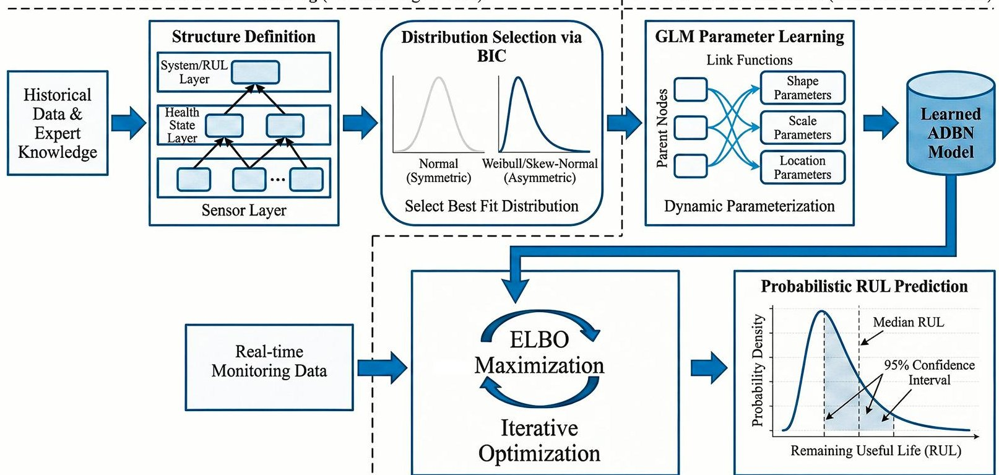

Figure 1. Framework of Asymmetric Distribution Bayesian Network (ADBN) for ship shaft RUL prediction.

## 2.2. Model Structure Learning

For the ship shafting system with relatively clear physical mechanisms, to avoid the high computational cost and small-sample overfitting risk inherent in traditional scorebased search structure learning algorithms, this study adopts a method of constructing a fixed network topology based on domain expert knowledge. The core of this method is to directly encode the prior knowledge about the shafting fault propagation path in marine

<!-- PDF_PAGE: 5 -->

engineering into the structural constraints of the Bayesian network, thereby ensuring that the model has both physical interpretability and structural stability.

The designed network adopts a hierarchical architecture to reflect the conduction logic of faults from local components to the overall system performance. Specifically, the network includes the following three layers: the bottom layer is the sensor observation layer, composed of directly measurable continuous variable nodes such as vibration, temperature, and alignment; the middle layer is the component health state layer, composed of continuous feature variable nodes derived or fused from original signals. For example, temperature gradients and comprehensive wear indicators. This layer aims to abstract and integrate underlying information to characterize the health degradation level of components or subsystems; the top layer is the system performance and output layer, including continuous variable nodes representing the overall state and the final remaining useful life node.

The directed edges between nodes in the network are not generated through data-driven methods but are defined based on Failure Mode and Effects Analysis (FMEA), historical maintenance experience, and physical principles. Each edge is intended to represent a clear causal relationship or a statistically robust strong correlation, such as "bearing wear leads to increased vibration". This design ensures that each link of the network structure has a clear engineering meaning.

To ensure the tractability of the model and avoid the curse of dimensionality in the parameter space, constraints are imposed on the network complexity. The maximum number of parent nodes for each node is limited to three. This consideration is based on the analysis of FMEA tables and insights into its physical structure. A maximum of three parent nodes can characterize more than 95% of causal relationships, and this measure can effectively control the parameter scale of the conditional probability distribution, making the learning and inference of the model more robust under limited data conditions. Through the above structured design based on domain knowledge, this study integrates physical knowledge at the beginning of modeling, laying a structurally reasonable and interpretable foundation for subsequent data-based learning and probabilistic inference.

## 2.3. Parameter Distribution Based on Data Fitting

After determining the network structure, it is necessary to specify the specific form of the conditional probability distribution for each continuous node. This study abandons the simplified assumption of a default Gaussian distribution in traditional hybrid Bayesian networks and proposes a data and mechanism-dual-driven distribution selection strategy. This strategy aims to match the most suitable probability distribution that can characterize the physical process of degradation and statistical characteristics for different types of sensors and state variables.

The selection process is based on the Bayesian Information Criterion (BIC). BIC measures the goodness of fit of the model to the data while introducing a penalty term for the number of parameters, thereby achieving a balance between fitting ability and model complexity and effectively avoiding overfitting. For a candidate distribution M, its BIC value is calculated as follows:

$$
B I C (M) = - 2 \cdot \ln \left(\hat {L} (M)\right) + k (M) \cdot \ln (n)
$$

where $ \hat{\mathrm{L}} (\mathrm{M}) $ is the maximum likelihood value of the distribution model, k(M) is the number of model parameters, and n is the sample size. A smaller BIC value indicates that the distribution is superior after comprehensively considering interpretability and simplicity.

<!-- PDF_PAGE: 6 -->

In specific operation, for each node $ X_{i} $ only the training dataset is used for distribution selection. To consider the influence of parent nodes in the distribution selection stage, we adopt the following steps: for each candidate distribution family, we construct a simplified Generalized Linear Model, express the location, scale and shape parameters of the distribution as linear functions of the observed values of parent nodes, and ensure that the parameters are within the valid range through appropriate link functions. Then, the conditional log-likelihood is maximized using all samples in the training data:

$$
\hat {L} (M) = \max _ {\Theta} \sum_ {t \in \mathcal {D} _ {\mathrm {t r a i n}}} \log f _ {M} \left(x _ {i} ^ {(t)} \mid \mathbf {p a} _ {i} ^ {(t)}; \Theta\right)
$$

where $ f_{M} $ is the probability density function of the candidate distribution M, and $ \Theta $ is the model parameter. The maximum likelihood estimate $ \hat{\Theta} $ is obtained through an optimization algorithm, and then $ \hat{L} (M) $ is derived to calculate the BIC value. This process is repeated for each candidate distribution, and the distribution with the smallest BIC value is selected as the optimal distribution form of the node.

To avoid conceptual confusion, it is necessary to clearly distinguish between the two types of continuous nodes.

One is the health indicator nodes observed or derived through preprocessing, including raw sensor quantities and health indicator sequences explicitly calculated through signal preprocessing or engineering physical models. For such nodes, we can directly use the time series samples of the training set to perform Maximum Likelihood Estimation (MLE) under the condition of given parent nodes and use the Bayesian Information Criterion (BIC) to compare among candidate distribution families to select the optimal distribution form.

The other is the truly unobservable latent variables. For such variables, there are no direct samples in the data, so the BIC cannot be directly used for distribution selection in the above way. The determination of the distribution form of such nodes is mainly based on the principles of domain mechanism knowledge and mathematical tractability.

For latent variables, first, the distribution family that can characterize their random characteristics is selected according to the physical meaning of the variables. For example, the instantaneous wear rate is usually non-negative, and its fluctuation may intensify with time. The Weibull distribution is selected as a candidate because it can flexibly characterize failure modes with different change rates. The cumulative wear amount is generated by the accumulation of wear rate and usually shows positive skewness, so the log-normal distribution is a natural choice. As a typical life variable, the core characteristic of residual life is the change in the hazard rate with time. The Weibull distribution is selected as the most suitable distribution form because it can flexibly describe the increasing (k>1), constant (k=1), or decreasing (k<1) hazard rate through the shape parameter k.

After selecting the distribution family, the distribution parameters of these latent variables are established as functional relationships with their parent nodes through the Generalized Linear Model framework. For example, the distribution parameters of the instantaneous wear rate are modeled as functions of the observable nodes, such as the outer ring temperature of the bearing and the particle concentration after the lubricating oil filter. This means that although there is no historical data for the instantaneous wear rate itself, its statistical characteristics of the distribution, such as expectation, variance, and skewness, will be dynamically adjusted with the change in the related observable evidence.

<!-- PDF_PAGE: 7 -->

## 2.4. ADBN Model Parameter Learning

Unlike traditional Bayesian networks based on Gaussian assumptions, the distribution form of nodes in ADBN may be asymmetric. Its parameters $ \theta_{i} $ include not only location and scale parameters, but also parameters controlling the distribution shape. This brings two core challenges: one is to ensure the physical validity of these parameters; the other one is to establish a dynamic relationship between parent nodes and these complex parameters.

## (1) Basic Settings for Parameter Learning

The structure of the ADBN model has been determined in Sections 2.2 and 2.3. Assume the network has n nodes, among which some nodes are observable variables (such as sensor readings), denoted as $ X_{obs} $ ; the other parts are latent variables (such as RUL and comprehensive degradation indicators), denoted as Z. The distribution form $ f_{i} $ of the conditional probability distribution $ \mathrm{P}(X_{\mathrm{i}}|\mathrm{P a}(X_{\mathrm{i}})) $ of each node has been selected, and its parameter set is denoted as $ \theta_{i} $ . The task of parameter learning is to estimate the parameter set $ \Theta=\left\{\theta_{1},\dots,\theta_{n}\right\} $ of all nodes based on the training dataset $ \mathcal{D}=\left\{x_{obs}^{(1)},\dots,x_{obs}^{(N)}\right\}. $

## (2) Parameterization Based on Generalized Linear Model (GLM)

To overcome the limitations of the traditional Conditional Linear Gaussian (CLG) model that only allows the conditional mean to change linearly with parent nodes and the fixed distribution form, this study adopts the Generalized Linear Model (GLM) framework in ADBN, expressing the location, scale, shape and skewness parameters of each conditional distribution as differentiable functions of the parent node states, and mapping the linear predictor to the parameter domain through an appropriate inverse link function. Here, we follow the basic principles for the selection of inverse link functions in the Generalized Linear Model to ensure mathematical feasibility and numerical stability [24,25].

The design principles for the selection of inverse link functions include the following: (1) ensuring that the mapped value falls within the valid domain of the distribution parameter; (2) ensuring gradient transferability and smooth optimization path; (3) avoiding strong saturation regions in the commonly used parameter range leading to gradient disappearance or oscillation; and (4) preferring mappings that can retain the intuitive interpretation of additive or multiplicative effects when possible.

The specific parameterization form is as follows. Let the linear predictor of the k-th parameter of the j-th node be $ \eta_{j,k}=\beta_{j,k,0}+\beta_{j,k}^{\top}\mathbf{p a}_{j}, $ where $ \mathbf{p a}_{j} $ represents the value vector of the parent nodes. Then the parameter is mapped to a valid value through a suitable inverse link function $ g_{j,k}(\cdot): $

$$
\theta_ {j, k} = g _ {j, k} \left(\eta_ {j, k}\right)
$$

The identity link is adopted for the location parameter. Location parameters usually have no domain constraints, and the identity link maintains the physical interpretability of the coefficients and is the most efficient in gradient propagation, suitable for nearly linear variable relationships in engineering:

$$
\mu = \eta_ {\mu} = \beta_ {\mu , 0} + \beta_ {\mu} ^ {\top} \mathbf {p a}
$$

The exponential link is adopted for the scale parameter. The exponential link ensures strict positivity, has a multiplicative effect interpretation, and good numerical behavior in probabilistic models. As an alternative, the Softplus function （softplus(x) = log(1+e $ ^{x} $ ） can be used when near-identity behavior is required for small predictors, and its performance difference is compared as a control item in the experiment:

$$
\sigma = \exp \left(\eta_ {\sigma}\right) = \exp \left(\beta_ {\sigma , 0} + \beta_ {\sigma} ^ {\top} \mathbf {p a}\right)
$$

<!-- PDF_PAGE: 8 -->

The modified exponential mapping is adopted for the shape parameter. When it is necessary to force k>1 based on a physical prior, the above formula embeds the prior constraint directly into the parameterization while ensuring differentiability; if there is no such prior, k = $ \exp(\eta_{k}) $ can be used instead to ensure k>0:

$$
k = 1 + \exp \left(\eta_ {k}\right)
$$

The hyperbolic tangent is adopted for the skewness parameter. The parameterization by Azzalini et al. often uses the real number $ \alpha $ as the shape parameter, which corresponds to $ \delta=\frac{\alpha}{\sqrt{1+\alpha^{2}}}\in(-1,1) $ [26]. If we let $ \alpha=\sinh(\eta) $ , then $ \delta=\tanh(\eta) $ . Therefore, we directly adopt the following equation:

$$
\delta = \tanh \left(\eta_ {\delta}\right) = \tanh \left(\beta_ {\delta , 0} + \beta_ {\delta} ^ {\top} \mathbf {p a}\right)
$$

This form not only satisfies the domain constraint but is also approximately linear near the origin and an odd function, thus having better central gradient and numerical stability in gradient optimization.

The selection of the above inverse link functions is based on the mathematical domain and physical prior of the distribution parameters, and also comprehensively considers the numerical behavior and interpretability during optimization. To make the method practically operable, this study takes the above default inverse link functions as the first choice in implementation, and at the same time introduces candidate inverse link functions such as Softplus, Sigmoid, and Arctan for comparison in the control experiment to verify the advantages of the recommended selection in terms of parameter recovery, log-likelihood, and variational convergence.

In the parameter learning stage, we still combine structured variational inference under the EM framework to perform an approximate E-step to deal with the posterior complexity caused by latent variables and non-Gaussian conditional distributions; in the M-step, gradient-based optimization (Adam) is used to update the GLM coefficients of each distribution parameter, and numerical stability checks are performed on the parameterization forms of key inverse link functions.

Corresponding inverse link functions are designed for the characteristics of different distribution parameters, as shown in Table 1. It should be specially noted that the shape parameter usually refers to the parameter controlling the tail behavior or curve shape of the distribution, such as k in the Weibull distribution and $ \sigma $ in the log-normal distribution; the skewness parameter specifically refers to the parameter controlling the symmetry of the distribution, such as $ \alpha $ in the skew-normal distribution.

Table 1. Inverse link functions for different parameter types.

<table border="1"><tr><td>Parameter Type</td><td>Inverse Link Function</td></tr><tr><td>Location parameter</td><td>Identity function: $\mu=\beta_{\mu,0}+\beta_{\mu}^{\top}\mathbf{p}a$</td></tr><tr><td>Scale parameter</td><td>Exponential function: $\sigma=\exp(\beta_{\sigma,0}+\beta_{\sigma}^{\top}\mathbf{p}a)$</td></tr><tr><td>Shape parameter</td><td>Modified exponential: $k=1+\exp(\beta_{k,0}+\beta_{k}^{\top}\mathbf{p}a)$</td></tr><tr><td>Skewness parameter</td><td>Hyperbolic tan gent: $\delta=\tanh(\beta_{\delta,0}+\beta_{\delta}^{\top}\mathbf{p}a)$</td></tr></table>

(3) Parameter Learning Process

Let the observation dataset be $ \mathcal{D}=\left\{x^{\mathrm{(i)}}\right\}_{\mathrm{i=1}}^{\mathrm{N}} $ , the latent variable set be Z, the model parameter be $ \theta $ , and the variational parameter be $ \phi $ . The goal is to maximize the marginal likelihood $ \mathcal{L}(\theta)=\log p(\mathcal{D} \mid \theta) $ . Since the integral is unsolvable, the EM framework is adopted: in each E-step, the structured variational distribution $ q_{\phi}(Z) $ is used to approxi-

<!-- PDF_PAGE: 9 -->

mate the posterior, and then in the M-step, the parameter $ \theta $ is updated with the expected log-likelihood of the approximate posterior. The optimization objective of the E-step is the evidence lower bound (ELBO):

$$
\mathrm {E L B O} (\phi ; \theta) = \mathbb {E} _ {q _ {\phi} (\mathbf {Z})} \left[ \log p (\mathcal {D}, \mathbf {Z} \mid \theta) \right] - \mathbb {E} _ {q _ {\phi} (\mathbf {Z})} \left[ \log q _ {\phi} (\mathbf {Z}) \right]
$$

The algorithm adopts an engineering alternating small-step stochastic optimization, that is, in each EM iteration, a limited number of ELBO ascents are performed on $ \phi $ , and a limited number of expected likelihood gradient ascents are performed on $ \theta $ , thus taking into account both numerical efficiency and online applicability.

The core of the E-step is to maximize the ELBO.

$$
\mathrm {E L B O} (\phi ; \theta) = \mathbb {E} _ {q _ {\phi}} \left[ \log p \left(\mathcal {D}, \mathbf {Z} \mid \theta\right) \right] - \mathbb {E} _ {q _ {\phi}} \left[ \log q _ {\phi} (\mathbf {Z}) \right]
$$

We represent the sample as $ \mathbf{z}=g(\epsilon ;\phi) $ $ \left( \epsilon\right) $ is the base noise independent of $ \phi $ ) through the reparameterization trick, and make a Monte Carlo estimate of the ELBO and its gradient with respect to $ \phi $ using S reparameterized samples (in engineering, S=1 is often taken to save computation, and S can be increased, or control variables can be used when encountering high variance). Each E-step performs $ K_{E} $ micro-step updates along the estimated gradient on small-batch data using an adaptive optimizer such as Adam; for common variational distributions, the corresponding differentiable sampling paths are implemented, and these operations are vectorized to facilitate GPU parallel computing.

The goal of the M-step is to maximize the expected complete data log-likelihood $ \mathbb{E}_{q_{\phi}}[\log p(\mathcal{D},\mathbf{Z} \mid \theta)] $ under the approximate posterior $ q_{\phi} $ , and its gradient is also estimated by Monte Carlo samples:

$$
\nabla_ {\theta} \approx \frac {1}{S} \sum_ {s} \nabla_ {\theta} \log p \left(\mathcal {D} _ {B}, \mathbf {z} ^ {(s)} \mid \theta\right)
$$

where $ \mathbf{z}^{(s)}=g \left( \epsilon^{(s)} ;\phi\right). $ In implementation, the gradients of the GLM coefficients of each node can be calculated in parallel and updated in small batches using Adam. To maintain scalability, $ K_{M} $ inner loops are executed in each M-step, and the same reparameterized samples are used in each step to reduce the estimation variance.

To ensure numerical stability and physical validity of parameters, it is necessary to implement several constraints and regularization measures: logarithmic or Softplus links are used for scale parameters and their original parameters $ \eta $ are clipped; tanh mapping is used for bounded parameters; for shape parameters that need to meet the lower bound, transformations such as $ k=1+\exp(\eta) $ can be used to enforce prior constraints; gradient clipping, L2 regularization, and appropriate learning rate decay are implemented during training to prevent divergence or overfitting.

A composite index is adopted for the convergence criterion: the ELBO is estimated on the validation set regularly, and the $ \Delta $ ELBO and the relative parameter change $ \| \theta^{(t+1)}-\theta^{(t)}\|_{2} / \| \theta^{(t)}\|_{2} $ are monitored. Early stopping is triggered when the absolute change in ELBO is less than tol $ \mathrm{E L B O} $ and the relative parameter change is less than tol $ \theta $ . The following settings are adopted: maximum outer EM iterations $ K_{\mathrm{EM}}^{\mathrm{max}}=200, K_{E}=5 $ for each E-step, $ K_{M}=5 $ for each M-step, mini-batch size 32, sampling number S=1, learning rate $ \mathrm{l r}_{\phi}=1\times 10^{-3},\mathrm{I r}_{\theta}=1\times 10^{-3}, $ gradient clipping threshold 5, L2 regularization $ 1\times 10^{-4}. $

(4) Handling of Latent Variables

The posterior of latent variables in the E-step is usually difficult to solve accurately. This study adopts structured variational inference, assuming that the variational distribution $ q(\mathbf{Z}) $ can be decomposed into several independent factors, each corresponding to a

<!-- PDF_PAGE: 10 -->

latent variable, and its distribution form is consistent with the model prior. By optimizing the variational parameters to minimize $ K L ( q \parallel p ) $ , the approximate posterior of the latent variables is obtained. This approximate posterior is not only used for the expectation calculation in the E-step but also lays the foundation for fast inference in the subsequent prediction stage.

## 2.5. RUL Inference Based on Variational Inference

After completing the structure determination and parameter learning of the ADBN model, we need to calculate the posterior distribution $ \mathrm{p}(X_{\mathrm{R}}|E) $ of the remaining useful life $ X_{\mathrm{R}} $ given new sensor observation data (evidence variable E). Due to the presence of asymmetric distributions and complex parameter dependencies in the network, exact posterior inference is not feasible. The traditional Markov Chain Monte Carlo method can be asymptotically accurate, but its high computational cost and inherent randomness cannot meet the real-time and deterministic response requirements of online monitoring. To this end, this section introduces variational inference as the core approximate inference framework, aiming to efficiently approximate the true posterior through a deterministic optimization process.

## (1) Problem Formalization

Let all unobserved variables be Z,the observed evidence be E,and the target posterior be

$$
P (Z \mid E) = \frac {P (Z , E \mid \Theta)}{P (E \mid \Theta)}
$$

where $ \Theta $ is the learned parameter. Variational inference approximates the true posterior through an approximate distribution $ q(\mathbf{Z};\phi) $ controlled by variational parameters $ \phi $ A natural criterion for measuring the proximity of the two distributions is the Kullback-Leibler (KL) divergence. Therefore, the goal of variational inference is to find the optimal variational parameters $ \phi^{*} $ that minimize the KL divergence between the approximate distribution q and the true posterior p:

$$
\phi * = \underset {\phi} {\operatorname {a r g m i n}} \mathrm {K L} \left(\mathrm {q} (\mathrm {Z}; \phi) \parallel \mathrm {p} (\mathrm {Z} | \mathrm {E})\right)
$$

## (2) Variational Distribution Design

Since all latent variables in the network are continuous variables, we adopt a structured mean-field variational distribution, which decomposes it into the product of independent distributions of each latent variable:

$$
\mathrm {q} (Z; \phi) = \prod_ {j = 1} ^ {| \mathbf {Z} |} q _ {j} \left(Z _ {j}; \phi_ {j}\right)
$$

where the distribution form of each $ q_{j} $ is consistent with the model prior $ \mathrm{P}\left(Z_{\mathrm{j}}\mid \mathrm{P a}\left(Z_{\mathrm{j}}\right);\Theta\right) $ but it has independent variational parameters $ \phi_{j} $ . For example, if the prior of the RUL node is specified as a Weibull distribution, its variational distribution is also set as a Weibull distribution, but with independent variational shape parameter $ \tilde{k}_{j} $ and scale parameter $ \tilde{\lambda}_{j} $ :

$$
q _ {j} \left(Z _ {j}; \phi_ {j}\right) = \operatorname {W e i b u l l} \left(Z _ {j}; \tilde {k} _ {j}, \tilde {\lambda} _ {j}\right), \quad \phi_ {j} = \left(\tilde {k} _ {j}, \tilde {\lambda} _ {j}\right)
$$

This conjugate choice simplifies the calculation of expectations and enables the variational distribution to have similar shape flexibility as the true posterior.

<!-- PDF_PAGE: 11 -->

(3) Evidence Lower Bound (ELBO) and Optimization

Directly optimizing the KL divergence is still difficult because it depends on the true posterior $ \mathrm{p}(\mathbf{Z}|\mathbf{E}) $ . By decomposing the KL divergence, an equivalent and operable objective function—the evidence lower bound—can be derived [27].

According to the definition of KL divergence,

$$
\begin{array}{l} \mathrm {K L} (\mathrm {q} \parallel \mathrm {p}) = \mathbb {E} _ {\mathrm {q} (\mathrm {Z}; \phi)} \left\lfloor \log \frac {\mathrm {q} (\mathrm {Z} ; \phi)}{\mathrm {p} (\mathrm {Z} | \mathrm {E})} \right\rfloor \\ = \mathbb {E} _ {\mathrm {q}} \left[ \log \mathrm {q} (\mathbf {Z}; \phi) \right] - \mathbb {E} _ {\mathrm {q}} \left[ \log \mathrm {p} (\mathrm {Z} | \mathrm {E}) \right] \\ \end{array}
$$

Substituting Bayes' theorem $ \mathrm{p}(\mathbf{Z}|\mathbf{E})=\mathrm{p}(\mathbf{Z},\mathbf{E})/\mathrm{p}(\mathbf{E}) $ into the above formula,

$$
\begin{array}{l} \mathrm {K L} (\mathrm {q} \parallel \mathrm {p}) = \mathbb {E} _ {\mathrm {q}} [ \log \mathrm {q} (\mathbf {Z}) ] - \mathbb {E} _ {\mathrm {q}} \left[ \log \frac {\mathrm {p} (\mathbf {Z} , \mathbf {E})}{\mathrm {p} (\mathbf {E})} \right] \\ = \mathbb {E} _ {\mathrm {q}} [ \log \mathrm {q} (\mathbf {Z}) ] - \mathbb {E} _ {\mathrm {q}} [ \log \mathrm {p} (\mathbf {Z}, \mathbf {E}) ] + \log \mathrm {p} (\mathbf {E}) \\ \end{array}
$$

Rearranging terms gives

$$
\log p (E) = \underbrace {\mathbb {E} _ {q} [ \log p (\mathbf {Z} , \mathbf {E}) ] - \mathbb {E} _ {q} [ \log q (\mathbf {Z}) ]} _ {E L B O} + K L (q \parallel p)
$$

Since $ \log p ( x ) $ is independent of the variational parameters and $ \mathrm{K L} ( q \parallel p ) \geq 0 $ , maximizing the evidence lower bound is equivalent to minimizing the KL divergence:

$$
\mathcal {L} (\phi) = \mathbb {E} _ {q (Z; \phi)} [ \log p (\mathbf {Z}, \mathbf {E}) ] - \mathbb {E} _ {q (Z; \phi)} [ \log q (\mathbf {Z}; \phi) ]
$$

In the formula, $ \mathcal{L}(\phi) $ is the evidence lower bound. The first term is the expectation of the joint log-likelihood, encouraging q to place probability mass on the latent variable configurations that can well explain the observed data E; the second term is the entropy of the approximate distribution, encouraging q to be as dispersed as possible to avoid overconfidence.

Direct calculation of the analytical expression of ELBO is still not feasible in ADBN. We use stochastic gradient ascent combined with reparameterization tricks to optimize the variational parameters $ \phi. $

In ADBN, given the model parameters $ \Theta $ , the joint log-probability of latent variables and evidence can be decomposed and calculated according to the network structure:

$$
\log p (\mathbf {Z}, \mathbf {E}; \Theta) = \sum_ {i = 1} ^ {n} \log P \left(X _ {i} \mid P a \left(X _ {i}\right); \Theta\right)
$$

Among them, for the observed evidence variables, their values are fixed to the corresponding values in E; for the latent variables, their values are obtained through sampling. The calculation of each conditional probability term $ P ( X_{i} | \mathrm{P a} ( X_{i} ) ; \Theta) $ involves GLM link functions and specified asymmetric distributions.

To sample from the variational distribution $ q_{j}\left(Z_{j};\phi_{j}\right) $ and maintain gradient transferability, we implement reparameterization for key distributions. For the Weibull variational distribution, if $ \epsilon\sim\operatorname{E x p}(1) $ , then $ Z_{j}=\tilde{\lambda}_{j}(-\epsilon)^{\frac{1}{k_{j}}} $ follows Weibull $ \left(\tilde{k}_{j},\tilde{\lambda}_{j}\right) $ ; for the skewnormal variational distribution, reparameterization can be achieved by expressing the skew-normal variable as a mixture of a standard normal variable and a truncated normal variable. In this way, the sampling process is expressed as $ Z_{j}=g\left(\epsilon ;\phi_{j}\right) $ , where $ \epsilon $ is from the base noise distribution, and the mapping $ g_{j} $ is differentiable with respect to $ \phi_{j} $ . This ensures that in the automatic differentiation framework, the gradient can be backpropagated through this mapping, thus realizing end-to-end optimization.

<!-- PDF_PAGE: 12 -->

Using the above reparameterization method, the gradient of ELBO can be estimated as follows:

$$
\nabla_ {\phi} \mathcal {L} (\phi) \approx \frac {1}{L} \sum_ {l = 1} ^ {L} \nabla_ {\phi} \left[ \log p \left(\mathbf {Z} ^ {(l)}, \mathbf {E}; \Theta\right) - \log q \left(\mathbf {Z} ^ {(l)}; \phi\right) \right]
$$

where $ \mathbf{Z}^{(l)}=\{g_{i}\left(\epsilon^{(l)};\phi_{i}\right)\}, \epsilon^{(l)} $ is the l-th independently drawn base noise, and L is the number of samples per step (usually L = 1 is sufficient). In particular, the gradient in Formula (20) acts directly on the expression in the brackets, which is precisely because the reparameterization makes the sampling result $ \mathbf{Z}^{(l)} $ a differentiable function of $ \phi $ , so the gradient can flow through the entire computation graph without loss. We verified the correctness of the gradient flow through the automatic differentiation mechanism of PyTorch in the implementation: for each variational parameter $ \phi $ , its gradient is non-zero and numerically stable, ensuring the effectiveness of the optimization process.

We use the Adaptive Moment Estimation (Adam) optimizer to update the variational parameter $ \phi $ . Adam combines momentum and an adaptive learning rate, which is particularly suitable for handling stochastic objective functions. Each time new evidence $ \mathbf{E}_{t} $ is received, we initialize the variational parameters and then run the above optimization loop until convergence. The algorithm flow is shown in Figure 2.

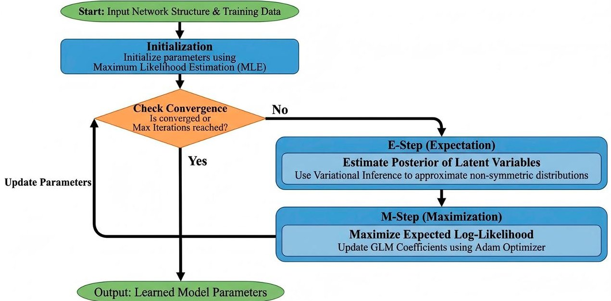

Figure 2. Parameter learning flowchart using EM algorithm with variational inference.

(4) Inference of RUL Posterior Distribution

After optimization, we obtain the optimal approximate posterior distribution $ q(\mathbf{Z};\phi *). $ For the RUL node $ X_{R} $ , its marginal approximate posterior $ q_{R}(X_{R};\phi_{R}* ) $ can be directly used for prediction.

To provide a single RUL prediction value, we calculate the median of the approximate posterior, which is more robust to asymmetric distributions:

$$
\widehat {R U L _ {t}} = F _ {q _ {R}} ^ {- 1} \left(0. 5; \phi_ {R} *\right)
$$

where $ F_{q_{R}}^{-1} $ is the inverse cumulative distribution function of the selected variational distribution.

At the same time, we calculate the 95% confidence interval to quantify the prediction uncertainty:

$$
C I _ {95 \%} (t) = \left[ F _ {q _ {R}} ^ {- 1} \left(0. 0 2 5; \phi_ {R} *\right), F _ {q _ {R}} ^ {- 1} \left(0. 9 7 5; \phi_ {R} *\right) \right]
$$

This interval provides a reliable risk boundary for maintenance decisions.

<!-- PDF_PAGE: 13 -->

In the process of variational inference, the approximate posteriors $ q(Z; \phi^{*}) $ of all latent variables Z are inferred simultaneously. This essentially transfers the information contained in the observed evidence E to the internal state of the system (such as health degradation indicators) and the final output through the causal relationships in the network. Therefore, this process not only gives the prediction of RUL but also provides a probabilistic description of the internal health state of the system, enhancing the interpretability of the prediction results.

## 3. Case Verification and Result Analysis

## 3.1. Dataset and BIC Evaluation of Parameter Distributions

This paper collates the maintenance records and FMEA documents (anonymous according to the cooperation agreement) of a shipyard from January 2018 to January 2024, including the complete life cycle data of 12 ship shaftings from normal operation to failure, covering three ship types: bulk carriers (seven ships), oil tankers (three ships), and container ships (two ships). The maintenance records are from the log of the shipyard's maintenance management system, and the FMEA documents are from the cooperative ship design institute and maintenance unit. The statistics of the ship shafting systems involved in the study are shown in Table 2.

Table 2. Statistics of ship shafting systems.

<table border="1"><tr><td>Ship Type</td><td>Number of Ships</td><td>Main Engine Power Range(kW)</td><td>Shafting Length Range(m)</td><td>Propulsion Mode</td></tr><tr><td>Bulk carrier</td><td>7</td><td>5800-12500</td><td>12-22</td><td>Single-engine,single-propeller direct drive</td></tr><tr><td>Oil tanker</td><td>3</td><td>8200-15600</td><td>16-26</td><td>Single-engine,single-propeller direct drive</td></tr><tr><td>Container ship</td><td>2</td><td>12500-18600</td><td>20-28</td><td>Single-engine,single-propeller direct drive</td></tr></table>

Each shafting system includes 2-4 intermediate bearings, one stern tube bearing, 1-2 couplings, and one thrust bearing. All components have corresponding condition monitoring data. During the 6-year monitoring period, a total of 24 fault events leading to maintenance intervention were recorded, including 12 bearing wear faults, five misalignment faults, four coupling faults, two lubrication system faults, and one impact load damage fault.

The experimental environment is as follows: Windows 10; 16 GB memory; CPU: Intel $ ^{\textcircled{R}} $ Core $ ^{\textcircled{T}} $ i5-10300H @ 2.50 GHz (Intel Corporation, Santa Clara, CA, USA); GPU: NVIDIA GeForce RTX 2060 (6 GB video memory, NVIDIA Corporation, Santa Clara, CA, USA). The programming language is Python 3.8.5, the deep learning framework is PyTorch 1.7.1, and the CUDA version is 11.0 (NVIDIA Corporation, Santa Clara, CA, USA).

After data collation, we conducted an in-depth analysis of the distribution characteristics of key parameters of a typical ship shafting with bearing wear. As shown in Figure 3, the parameter distributions of misalignment, vibration acceleration, bearing temperature, and lubricating oil particle concentration all exhibit asymmetric distribution characteristics, which statistically verify the necessity of the ADBN framework. The Gaussian assumption is difficult to characterize features such as skewness and heavy tails; the introduction of asymmetric distributions can improve the fitting ability to the statistical characteristics of the degradation process, thereby improving the calibration and prediction stability of posterior inference.

<!-- PDF_PAGE: 14 -->

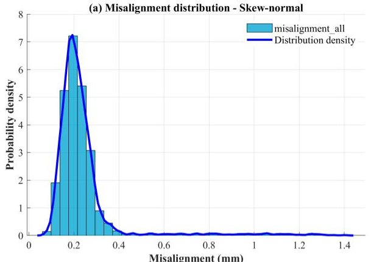

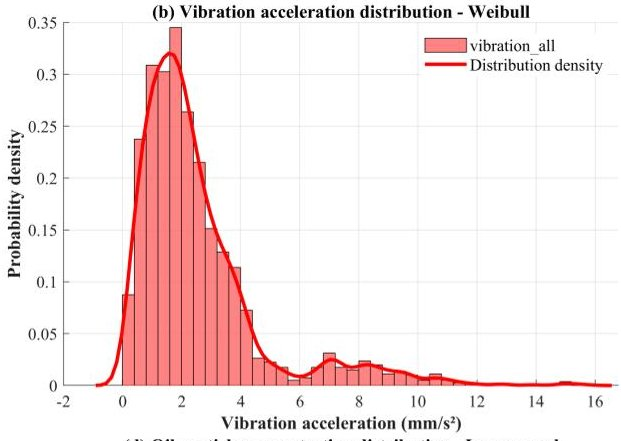

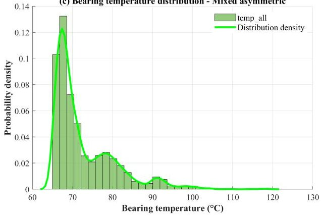

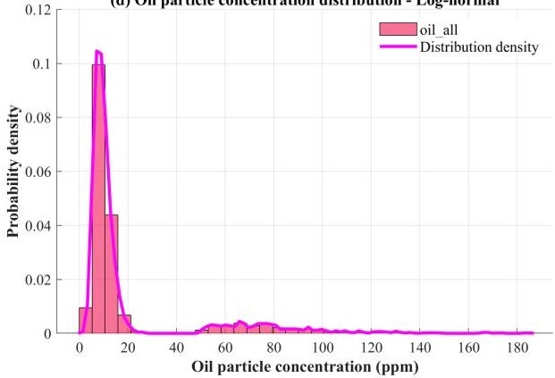

Figure 3. Asymmetric distribution characteristics of ship shaft key parameters.

We calculate the sample skewness and kurtosis of some key parameters to evaluate the degree of deviation of their distribution forms from the Gaussian distribution. Skewness measures the asymmetry of the distribution; a zero value indicates symmetry, positive skewness indicates a longer right tail, and negative skewness indicates a longer left tail. Kurtosis measures the tail thickness of the distribution; the kurtosis of the Gaussian distribution is three. Kurtosis greater than three indicates heavy tails, and less than three indicates light tails. Table 3 shows the statistical results of skewness and kurtosis of key parameters under typical fault modes.

Table 3. Statistical results of skewness and kurtosis of partial parameters.

<table border="1"><tr><td>Fault Type</td><td>Key Parameter</td><td>Sample Size</td><td>Skewness</td><td>Kurtosis</td><td>Shapiro-Wilk Test p-Value</td></tr><tr><td rowspan="2">Bearing wear</td><td>Effective value of vibration acceleration</td><td>756</td><td>1.82</td><td>6.75</td><td>&lt;0.001</td></tr><tr><td>Oil particle concentration</td><td>756</td><td>2.15</td><td>8.32</td><td>&lt;0.001</td></tr><tr><td rowspan="2">Misalignment</td><td>Alignment deviation</td><td>1245</td><td>1.34</td><td>4.98</td><td>&lt;0.001</td></tr><tr><td>Transmission efficiency loss</td><td>1245</td><td>1.56</td><td>5.23</td><td>&lt;0.001</td></tr><tr><td rowspan="2">Coupling fault</td><td>Torsional vibration amplitude</td><td>892</td><td>1.78</td><td>6.12</td><td>&lt;0.001</td></tr><tr><td>Rotational speed fluctuation rate</td><td>892</td><td>1.92</td><td>7.04</td><td>&lt;0.001</td></tr><tr><td rowspan="2">Lubrication system fault</td><td>Oil pressure pulsation</td><td>534</td><td>1.23</td><td>4.55</td><td>&lt;0.001</td></tr><tr><td>Flow abnormality</td><td>534</td><td>1.41</td><td>5.17</td><td>&lt;0.001</td></tr><tr><td rowspan="2">Impact load damage</td><td>Peak vibration</td><td>287</td><td>2.34</td><td>9.86</td><td>&lt;0.001</td></tr><tr><td>Transient temperature rise</td><td>287</td><td>2.08</td><td>8.79</td><td>&lt;0.001</td></tr></table>

It can be seen from Table 3 that the absolute values of skewness of all parameters are greater than one, showing significant positive skewness, indicating that the degradation process has directional cumulative characteristics; the kurtosis is all greater than four, much higher than the baseline value of three of the Gaussian distribution, confirming that the data has obvious heavy-tailed characteristics. The p-values of the Shapiro-Wilk normality test are all less than 0.001, which significantly rejects the null hypothesis that the data follows the Gaussian distribution. These quantitative results statistically confirm

<!-- PDF_PAGE: 15 -->

that the ship shafting degradation data deviates from the Gaussian distribution, and it is necessary to use asymmetric distributions that can characterize skewness and heavy tails for modeling.

Based on the statistical analysis of maintenance records, we conducted a systematic BIC evaluation of the parameter deviation distributions under typical failure modes of ship shafting. Some evaluation results are shown in Table 4.

Table 4. BIC evaluation results of distribution forms of key parameters under typical failure modes of ship shafting.

<table border="1"><tr><td>Failure Type</td><td>Key Parameter</td><td>Sample Size(n)</td><td>Gaussian Distribution BIC</td><td>Skew-Normal Distribution BIC</td><td>Weibull Distribution BIC</td><td>Log-Normal Distribution BIC</td><td>Optimal Distribution</td></tr><tr><td rowspan="2">Bearing wear</td><td>Vibration acceleration(mm/s2)</td><td>756</td><td>2467.20</td><td>2289.50</td><td>2134.80</td><td>2256.30</td><td>Weibull</td></tr><tr><td>Oil particle concentration(ppm)</td><td>756</td><td>1895.40</td><td>1823.60</td><td>1789.20</td><td>1745.30</td><td>Log-normal</td></tr><tr><td rowspan="2">Misalignment</td><td>Misalignment(mm)</td><td>1245</td><td>3842.50</td><td>3215.30</td><td>3478.20</td><td>3325.70</td><td>Skew-normal</td></tr><tr><td>Transmission efficiency loss(%)</td><td>1245</td><td>4125.80</td><td>3456.20</td><td>3892.40</td><td>3678.90</td><td>Skew-normal</td></tr><tr><td rowspan="2">Coupling failure</td><td>Torsional vibration(rad/s)</td><td>892</td><td>2856.30</td><td>2345.10</td><td>2678.40</td><td>2512.60</td><td>Skew-normal</td></tr><tr><td>Speed fluctuation(%)</td><td>892</td><td>3124.70</td><td>2845.30</td><td>2789.60</td><td>2956.20</td><td>Weibull</td></tr><tr><td rowspan="2">Lubrication system failure</td><td>Oil pressure pulsation(kPa)</td><td>534</td><td>1623.80</td><td>1432.60</td><td>1556.30</td><td>1498.70</td><td>Skew-normal</td></tr><tr><td>Flow abnormality(L/min)</td><td>534</td><td>1745.20</td><td>1623.40</td><td>1556.90</td><td>1612.80</td><td>Weibull</td></tr><tr><td rowspan="2">Impact load damage</td><td>Peak vibration(mm/s2)</td><td>287</td><td>1045.60</td><td>987.3</td><td>923.5</td><td>856.2</td><td>Log-normal</td></tr><tr><td>Transient temperature shock(℃)</td><td>287</td><td>1123.40</td><td>1045.20</td><td>978.6</td><td>895.3</td><td>Log-normal</td></tr></table>

To statistically test the effectiveness of the distribution form selection method based on the BIC, this study uses the paired t-test to conduct a significance analysis of the evaluation results. The "pairing" here is defined as the BIC values of the same node (i.e., the same key parameter under the same fault type) calculated under two different distribution models. Since each node has the same sample set in the training data, its BIC values under different distributions naturally form a one-to-one paired sample, thus eliminating the influence of inter-node variation and focusing the test on the difference in the performance of the distribution models themselves. It should be noted that in the BIC calculation process, the conditional likelihood of each node has considered the dependence of its parent nodes, so the results of the paired t-test indirectly reflect the difference in the fitting ability of different distribution families under the given network dependence structure.

We set $ H_{0} $ : the mean difference in BIC values between the optimal distribution and other candidate distributions is zero, i.e., $ \mu_{d}=0 $ . Then we set $ H_{1} $ : the mean difference in

<!-- PDF_PAGE: 16 -->

BIC values between the optimal distribution and other candidate distributions is negative, i.e., $ \mu_{d}<0 $ . Three independent paired t-tests (one-tailed) were performed between the optimal distribution and other distributions, respectively. The significance level of the test was set to $ \alpha=0.01 $ . The results are shown in Table 5.

Table 5. Paired t-test results of BIC values between the optimal distribution and candidate distributions.

<table border="1"><tr><td>Comparison Group</td><td>Sample Size(n)</td><td>Mean Difference</td><td>Standard Deviation</td><td>t-Statistic</td><td>Degrees of Freedom(df)</td><td>p-Value(One-Tailed)</td></tr><tr><td>Optimal vs. Gaussian</td><td>10</td><td>-342.26</td><td>193.47</td><td>-5.595</td><td>9</td><td>&lt;0.0001</td></tr><tr><td>Optimal vs. Skew-normal</td><td>6</td><td>-106.03</td><td>44.24</td><td>-5.871</td><td>5</td><td>0.001</td></tr><tr><td>Optimal vs. Weibull</td><td>7</td><td>-192.94</td><td>151.98</td><td>-3.359</td><td>6</td><td>0.008</td></tr><tr><td>Optimal vs. Log-normal</td><td>7</td><td>-130.1</td><td>59.68</td><td>-5.767</td><td>6</td><td>0.0006</td></tr></table>

Compared with the symmetric Gaussian distribution, the BIC of the optimal distribution is lower, indicating that the use of asymmetric distributions has statistical advantages for this type of shafting degradation data.

Grouped comparisons between various optimal distributions and other asymmetric candidate distributions show that the test results consistently reject the null hypothesis and support the alternative hypothesis: the distribution selection strategy based on BIC in this study can identify distribution forms with higher goodness of fit, which statistically verifies the effectiveness of the strategy.

## 3.2. Experimental Verification of Link Function Design

To evaluate the impact of link function design on model performance, this study conducted controlled variable experiments and compared different candidate link functions under the same data and computational environment.

The experiment adopted a comparative analysis method. For the four types of parameters (location, scale, shape, and skewness), a baseline model and one or more control models were constructed, respectively. The baseline model used the link functions designed in this study, and the control models used other common candidate link functions. To ensure comparability, except for the link functions, the network structure, initialization, optimizer (Adam, learning rate 0.01), and data division were kept consistent, thereby isolating the differences caused by the link functions.

## 3.2.1. Verification of Location Parameter Inverse Link Function

The control model selected the Sigmoid function, which is a classic nonlinear activation function often used to constrain the output to a fixed interval. However, when used to model linear or quasi-linear relationships widely existing in physical systems, its saturation characteristic may introduce systematic deviations. This control aims to quantify this deviation.

As shown in Table 6, in the simulated linear dataset, the relative deviation of the linear coefficient estimation by the identity function model is only 0.4% , while the Sigmoid function model introduces an average compression deviation of 18.3% . On the real shafting data, the identity function reduced the number of iterations required for model convergence by 25.1% and the prediction RMSE by 36.6% . Gradient analysis shows that the identity function achieved nearly 100% effective gradient propagation, while the Sigmoid function only had an effective propagation ratio of 69.3% due to the gradient vanishing problem. Therefore, for location parameters, the identity function can better model the linear dependency of shafting degradation due to its strict unbiasedness and efficient gradient characteristics.

<!-- PDF_PAGE: 17 -->

Table 6. Performance comparison of different location parameter Inverse link functions.

<table border="1"><tr><td>Evaluation Indicator</td><td>Identity Function Model</td><td>Sigmoid Function Model</td></tr><tr><td>Relative deviation of parameter estimation</td><td>0.4%±0.2%</td><td>18.3%±1.5%</td></tr><tr><td>Prediction RMSE</td><td>0.186±0.011</td><td>0.254±0.018</td></tr><tr><td>Average number of convergence iterations</td><td>143±21</td><td>191±28</td></tr><tr><td>Effective gradient propagation ratio</td><td>~100%</td><td>~69.3%</td></tr></table>

## 3.2.2. Verification of Scale Parameter Inverse Link Function

The control models selected the Softplus function and the square function. The Softplus function is another smooth function that ensures positive output, but its growth rate is limited in the linear region; the square function is simple but symmetric and sensitive to negative inputs. The two were selected as controls to compare the impact of different function forms on dynamic range coverage and gradient behavior.

As shown in Table 7, the exponential function model is 8.2% better than the Softplus model in BIC score, and the dynamic range of the predicted scale parameters covers 99.7% of the true observed values. In the early stage of optimization, the average gradient norm corresponding to the exponential function model is 40.6% higher than that of the Softplus model, showing stronger optimization momentum. Therefore, the exponential link can generate positive outputs across orders of magnitude, which is more consistent with the phenomenon that the uncertainty, such as shafting vibration and temperature fluctuation, expands nonlinearly with time during the degradation process.

Table 7. Performance comparison of different scale parameter inverse link functions.

<table border="1"><tr><td>Evaluation Indicator</td><td>Exponential Function Model</td><td>Softplus Function Model</td><td>Square Function Model</td></tr><tr><td>BIC score(mean)</td><td>3215.3</td><td>3478.2</td><td>3820.5</td></tr><tr><td>Dynamic range coverage rate</td><td>99.70%</td><td>95.20%</td><td>91.80%</td></tr><tr><td>Average gradient norm in early training</td><td>0.45±0.07</td><td>0.32±0.05</td><td>0.28±0.06</td></tr></table>

## 3.2.3. Verification of Shape Parameter Inverse Link Function

The control models selected the unconstrained linear model and the ReLU function. The unconstrained linear model is a baseline, but its output may violate physical constraints; the ReLU function can ensure non-negativity but has a lower bound of 0, which still cannot strictly satisfy k>1. This control aims to test the necessity of the hard constraint mechanism.

As shown in Table 8, the modified exponential function model 100% guarantees k >1 in all training and predictions. In contrast, 18.7% of the prediction results of the unconstrained model violate this prior. The failure rate function calculated based on the learned shape parameters has the lowest KL divergence between the modified exponential function model and the true failure distribution, and the highest prediction accuracy. The modified exponential function explicitly constrains the value range of the shape parameter to k >1 through its function domain $ ( 1,+\infty) $ . This link function incorporates the increasing failure rate prior into the model, thereby improving physical consistency.

<!-- PDF_PAGE: 18 -->

Table 8. Performance comparison of different shape parameter Inverse link functions.

<table border="1"><tr><td>Evaluation Indicator</td><td>Modified Exponential Function Model</td><td>Unconstrained Linear Model</td><td>ReLU Function Model</td></tr><tr><td>Proportion of violating k&gt;1 prior</td><td>0%</td><td>18.70%</td><td>3.80%</td></tr><tr><td>KL divergence of failure rate prediction</td><td>0.045±0.006</td><td>0.062±0.009</td><td>0.052±0.007</td></tr><tr><td>Parameter sensitivity(Δk/Δx)</td><td>1.81±0.23</td><td>1.15±0.18</td><td>1.42±0.20</td></tr></table>

## 3.2.4. Verification of Skewness Parameter Inverse Link Function

The control models selected the scaled Sigmoid and arctangent functions, both of which can also produce bounded outputs, but their gradient characteristics and function shapes are different. This control aims to evaluate the actual performance of different bounded functions in variational inference optimization.

As shown in Table 9, in variational inference, the model using the hyperbolic tangent function converges on average after 42 iterations, which is 27.6% faster than the scaled Sigmoid model. The coefficient of variation in the gradient during its optimization process is the lowest, indicating the smoothest optimization path. Finally, the 95% prediction interval calibration error given by the hyperbolic tangent function model is the smallest, and the reliability is the highest. The hyperbolic tangent function is centered at zero and saturates relatively slowly. While constraining the range of skewness parameters, it can provide more stable gradient behavior, thereby improving the convergence efficiency and robustness of variational optimization.

Table 9. Performance comparison of different skewness parameter inverse link functions.

<table border="1"><tr><td>Evaluation Indicator</td><td>Tanh Function Model</td><td>Scaled Sigmoid Model</td><td>Arctangent Model</td></tr><tr><td>Number of variational inference convergence iterations</td><td>42±6</td><td>58±9</td><td>51±7</td></tr><tr><td>Coefficient of variation(CV) of the gradient</td><td>0.28±0.04</td><td>0.47±0.07</td><td>0.35±0.05</td></tr><tr><td>Prediction interval calibration error</td><td>0.021±0.004</td><td>0.035±0.006</td><td>0.028±0.005</td></tr></table>

## 3.3. Case Analysis

To demonstrate the engineering application value, this study selected a wear case of the front bearing (SKF 23264 CC/W33) of the intermediate shaft of a 76,000-ton bulk carrier. Built in 2018, its propulsion system adopts a single-machine, single-propeller direct drive form. In March 2022, increased vibration and abnormal particle count were monitored, and severe wear and spalling were confirmed during factory inspection and disassembly in September 2023. This study used the monitoring data of this bearing from abnormality to failure to verify the model.

## 3.3.1. Network Structure Construction

The monitoring data were obtained from the ship's engine room data acquisition and supervision control system with a sampling frequency of 1 Hz. After denoising the data and linearly interpolating to supplement a small number of missing values caused by sensor communication interruptions, the following key parameters were extracted as network nodes, as shown in Table 10.

<!-- PDF_PAGE: 19 -->

Table 10. ADBN node definition and distribution form of the bearing wear case.

<table border="1"><tr><td>Node</td><td>Node Definition</td><td>Distribution Form</td></tr><tr><td>$X_{1}$</td><td>Radial vibration acceleration effective value(mm/s^{2}$)</td><td>Weibull distribution</td></tr><tr><td>$X_{2}$</td><td>Bearing outer ring temperature(℃)</td><td>Weibull distribution</td></tr><tr><td>$X_{3}$</td><td>Lubricating oil pressure(kPa)</td><td>Skew-normal distribution</td></tr><tr><td>$X_{4}$</td><td>Particle concentration after lubricating oil filter(ppm)</td><td>Log-normal distribution</td></tr><tr><td>$X_{5}$</td><td>Shafting output torque fluctuation rate(%)</td><td>Skew-normal distribution</td></tr><tr><td>$Z_{1}$</td><td>Instantaneous wear rate(mm/h)</td><td>Weibull distribution</td></tr><tr><td>$Z_{2}$</td><td>Cumulative wear amount(mm)</td><td>Log-normal distribution</td></tr><tr><td>$X_{\mathrm{RUL}}$</td><td>Remaining useful life(days)</td><td>Weibull distribution</td></tr></table>

The ADBN structure, constructed based on domain knowledge, is shown in Figure 4, adopting a three-layer architecture:

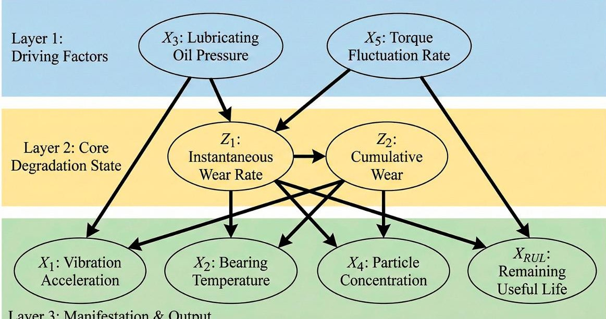

Layer 3: Manifestation & Output

Figure 4. ADBN structure of the bearing wear case.

## 3.3.2. Model Training and Parameter Learning

Data from the first 12 months (March 2022 to February 2023) were used as the training set, including a total of 8640 valid samples. For each continuous node, its distribution parameters were initialized using Maximum Likelihood Estimation based on the training data. For example, the initial shape parameter k = 1.8 and scale parameter $ \lambda=2.3 $ of the Weibull distribution of node $ X_{1} $ . Then, the Generalized Linear Model framework was adopted to optimize the link function coefficients through stochastic gradient descent. Taking the RUL node as an example, the shape parameter k and scale parameter $ \lambda $ of its Weibull distribution establish relationships with parent nodes through the following link functions:

$$
\begin{array}{l} k = 1 + \exp \left(\beta_ {k 0} + \beta_ {k 1} H + \beta_ {k 2} X _ {1} + \beta_ {k 3} X _ {3}\right) \\ \lambda = \exp \left(\beta_ {\lambda 0} + \beta_ {\lambda 1} H + \beta_ {\lambda 2} X _ {2} + \beta_ {\lambda 3} X _ {4}\right) \\ \end{array}
$$

where $ \beta $ is the coefficient to be learned. The learning goal is to minimize the Negative Log-Likelihood loss on the training set:

$$
\mathcal {L} (\Theta) = - \sum_ {t \in \mathcal {D} _ {\mathrm {t r a i n}}} \log \mathrm {W e i b u l l} \left(\mathrm {R U L} _ {t} ^ {\mathrm {t r u e}}; k _ {t} (\beta), \lambda_ {t} (\beta)\right)
$$

The Adam optimizer was used for minimization with a learning rate of 0.01 and a batch size of 32. The training process lasted for 500 epochs, using an early stopping strategy with patience = 30. After learning, the average Negative Log-Likelihood (NLL) of the

<!-- PDF_PAGE: 20 -->

model on the training set was 3.21, which was significantly lower than the benchmark model using linear Gaussian CPD (NLL = 4.87), verifying the advantages of asymmetric distribution and dynamic parameterization.

The ADBN model training showed typical convergence characteristics (as shown in Figure 5). The Negative Log-Likelihood loss tended to be stable after 320 rounds (training set NLL = 3.21, validation set NLL = 3.45). The Weibull distribution parameters of the RUL node converged rapidly with the iteration of variational inference: the shape parameter k decreased from 2.48 to 2.01 with a coefficient of variation of 0.45%; the scale parameter $ \lambda $ converged from 201.3 to 150.8 with a coefficient of variation of 0.62%. This convergence process indicates that the model can stably capture the increasing risk law during the shafting degradation process, and at the same time reflect the increasing uncertainty of RUL prediction near failure, providing a reliable basis for probabilistic prediction.

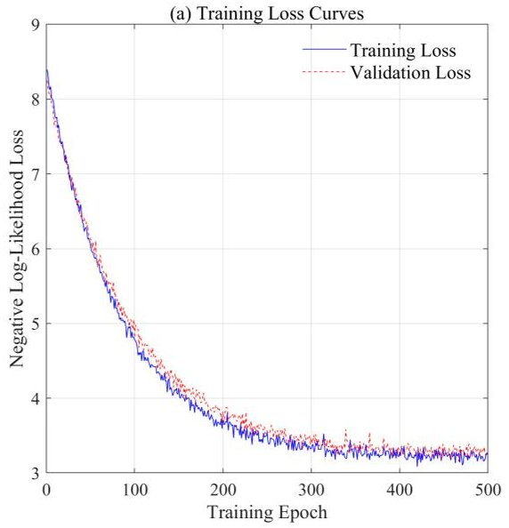

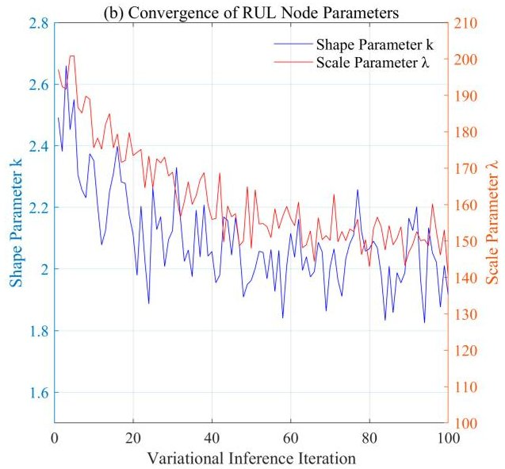

Figure 5. ADBN model training loss and parameter convergence process.

## 3.3.3. RUL Prediction and Result Analysis

The subsequent 6 months of data (March to August 2023) are used as the test set to simulate the online monitoring scenario. For the key indicator of vibration acceleration, the preprocessing strategy in this study is as follows: daily at 0:00, the original 1 Hz vibration data from the previous 24 h is intercepted, and the effective vibration value and vibration peak value are extracted as the daily observation evidence. Meanwhile, the mean and standard deviation of other sensor variables are extracted as daily features and input into the trained ADBN model for RUL prediction.

The early physical characterization of bearing wear is mainly the generation and intensification of impact pulses, which are reflected in the time-domain waveform of the vibration signal as periodic mutations in amplitude. For such faults, the vibration peak value is extremely sensitive to early impacts and can promptly capture the instantaneous energy release caused by micro-damage on the raceway surface in the early stage of wear; the effective vibration value characterizes the overall energy level of the vibration signal and can reflect the cumulative effect of wear over time.

For each time point t and its observation evidence $ E_{t} $ , the goal is to calculate the posterior distribution $ p \left( X_{RUL} \mid E_{t} ; \Theta \right) $ of the remaining useful life $ X_{R} $ under the learned model parameters $ \Theta $ . Due to the presence of asymmetric distributions and complex parameter dependencies established through GLM in the network, exact posterior calculation is not feasible. Therefore, the stochastic gradient variational inference described in Section 2.5 was adopted for efficient approximation.

To achieve fast and stable convergence, the initialization of the variational parameters $ \phi(0) $ adopted a deterministic forward propagation strategy instead of random initialization.

<!-- PDF_PAGE: 21 -->

The features of each sensor node in the evidence $ E_{t} $ were taken as their deterministic values, and the conditional expectations of their child nodes were calculated sequentially according to the network topology. For example, the deterministic estimate $ \hat{z}_{t} $ of the instantaneous wear rate $ Z_{1} $ was calculated through the mean features of its parent nodes $ (X_{1},X_{2},X_{4}) $ and the learned GLM link function. Similarly, a deterministic point estimate $ \widehat{\mathrm{rul}}_{t}^{\mathrm{det}} $ of RUL can be obtained.

Then, $ \widehat{\mathrm{rul}}_{\mathrm{t}}^{\mathrm{det}} $ was mapped to the initial parameters of the RUL variational distribution (Weibull distribution) $ \phi_{\mathrm{R}}^{(0)}=\left(\overset{\sim}{k}^{(0)},\overset{\sim}{\lambda}^{(0)}\right). $ The initial shape parameter $ \overset{\sim}{k}^{(0)}=2.0 $ was set, and the initial scale parameter was inferred in reverse through the median formula of the Weibull distribution.

The variational distribution parameters of the latent variable Z were initialized as follows: location parameter $ \tilde{\xi}^{(0)}=\hat{z}_{\mathrm{t}} $ , scale parameter $ \tilde{\omega}^{(0)}=1.0 $ , and skewness parameter $ \tilde{\alpha}^{(0)}=0. $

After initialization, the optimization algorithm proposed in Section 2.5 was executed to maximize the ELBO. After optimization, the approximate posterior Weibull distribution $ q_{\mathrm{R}} \left( X_{\mathrm{RUL}}; \tilde{k} * , \tilde{\lambda} * \right) $ of the target variable $ X_{\mathrm{R}} $ was obtained.

Figure 6 reveals the statistical characteristics and evolution laws of the remaining life of the ship shafting from the perspective of probability distribution. In Subfigure a, the Weibull PDFs corresponding to different shape parameters k show significant shape differences, reflecting the diversity of failure modes of mechanical systems. When k=0.5, it exhibits early failure characteristics, with a high initial failure rate followed by a gradual decrease, which is suitable for describing run-in period defects; k=1.0 corresponds to the random failure mode, with a constant failure rate, consistent with the Poisson process; k=1.5 and 2.5 show increasing failure rates, suitable for describing fatigue and wear processes; k=3.5 shows a sharply increasing failure rate, reflecting the typical characteristics of the late stage of accelerated degradation. The shape parameter k learned by the RUL node in this study converges to 2.01, which is in the increasing failure rate interval, consistent with the physical degradation mechanism of actual shafting bearing wear.

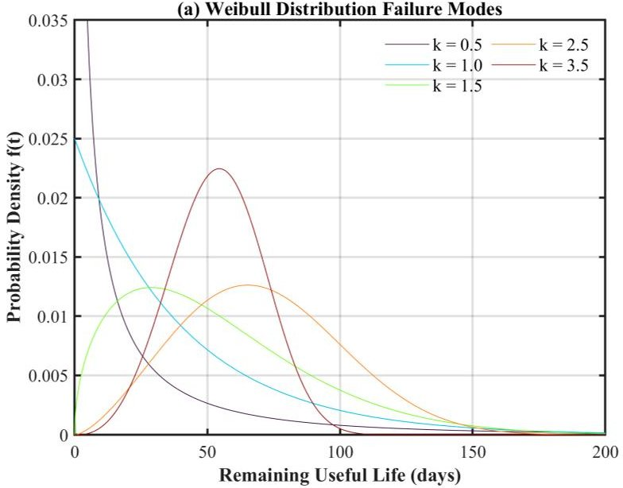

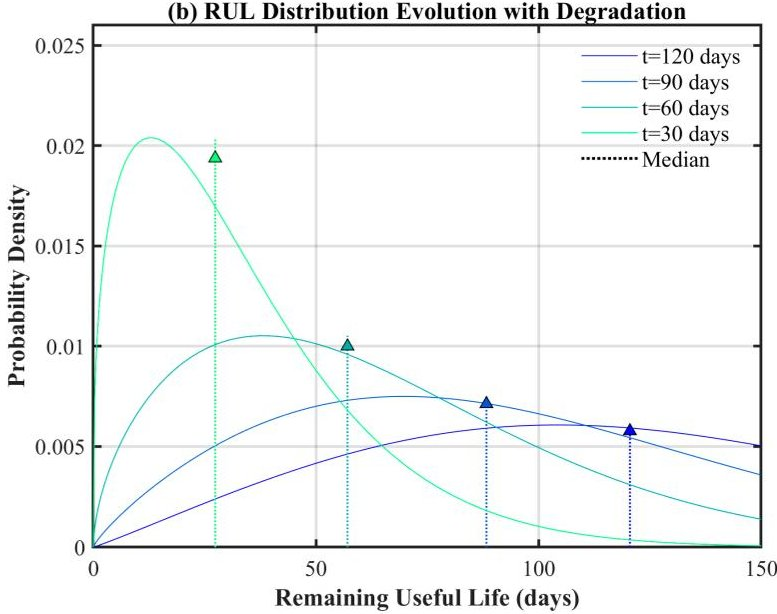

Figure 6. Weibull distribution forms and RUL probability density evolution.

In Subfigure b, as the monitoring time approaches the failure point, the RUL probability density function shows a systematic evolution law. At t=120 days, the distribution is right-skewed with a scale parameter $ \lambda=1 4 4 $ , indicating high uncertainty in the early stage of degradation; at t=90 days, the distribution gradually becomes symmetric with the scale

<!-- PDF_PAGE: 22 -->

parameter reduced to $ \lambda=1 0 8 $ , and the prediction accuracy improves; when t=60 days and 30 days, the distribution shape turns left-skewed, the scale parameter further shrinks to $ \lambda=7 2 $ and $ \lambda=3 6 $ , and the median gradually approaches the actual remaining life from the initial 99.2 days. This dynamic change in the distribution shape reflects that the ADBN model can adaptively adjust the probabilistic representation: in the early stage, various possible degradation paths are considered, so the distribution is relatively wide; with the accumulation of evidence, the model gradually converges to the true degradation trajectory, and the distribution narrows and changes shape, reflecting the gradual update characteristics of Bayesian learning.

Table 11 summarizes the prediction results at key time points. The absolute error of all prediction points is controlled within 10 days, and the interval covers the true value. On 15 April 2023, 140 days before actual failure, the median RUL predicted by ADBN was 132 days, with a 95% confidence interval of [98,175] days, deviating from the actual value by $ - 8 $ days. As time goes by, the prediction uncertainty gradually decreases: on 10 July 2023, 60 days before failure, the predicted median was 58 days, and the interval narrowed to [42,78] days; on 31 August 2023, 7 days before failure, the predicted median was 6 days, and the interval was [4,10] days.

Table 11. Key time point RUL prediction results of the bearing wear case based on ADBN.

<table border="1"><tr><td>Prediction Date</td><td>Actual Remaining Days</td><td>Predicted Median</td><td>95% Confidence Interval</td><td>Absolute Error</td></tr><tr><td>15 April 2023</td><td>140</td><td>132</td><td>[98,175]</td><td>8</td></tr><tr><td>10 May 2023</td><td>115</td><td>108</td><td>[85,142]</td><td>7</td></tr><tr><td>5 June 2023</td><td>90</td><td>86</td><td>[68,112]</td><td>4</td></tr><tr><td>1 July 2023</td><td>65</td><td>62</td><td>[48,83]</td><td>3</td></tr><tr><td>25 July 2023</td><td>40</td><td>43</td><td>[32,58]</td><td>3</td></tr><tr><td>20 August 2023</td><td>15</td><td>17</td><td>[11,26]</td><td>2</td></tr></table>

## 3.4. Experimental Analysis

To verify the effectiveness of the ADBN framework, this study selected three Bayesian network models for comparative analysis: the hybrid BN using the Conditional Linear Gaussian model (CLGBN), which represents the benchmark method widely used in the current industry; the symmetric BN with unconditional Gaussian distribution (SGBN), used as a theoretical lower bound to verify the necessity of complex distribution assumptions; and the ADBN proposed in this study, aiming to overcome the limitations of traditional Gaussian assumptions and more accurately characterize the asymmetric characteristics of shafting degradation data through flexible distribution forms.

All comparative experiments were based on the same ship shafting bearing wear case dataset described in Section 3.1, using exactly the same data preprocessing and training and test set division (first 12 months for training, last 6 months for testing). To ensure the fairness of the comparison, the three models shared the same network topology determined by domain knowledge, with differences only in the parameterization form of the CPD.

All three models adopt the same feature window setting, where each sample includes monitoring data from the current moment and the previous consecutive 24 h. After preprocessing, the daily mean, standard deviation, and peak value are extracted as observation evidence. For sensor missing values, linear interpolation is used for supplementation; for time alignment of multi-source data, nearest-neighbor interpolation is adopted to align to the hour.

Hyperparameter optimization is performed using grid search combined with fivefold cross-validation on the training set. The main hyperparameters of the ADBN model

<!-- PDF_PAGE: 23 -->

include learning rate (search range [0.001, 0.005, 0.01]), batch size ([16, 32, 64]), number of sampling times L for variational inference ([1, 5, 10]), and L2 regularization coefficient for GLM coefficients $ [ 1 \times1 0^{-5}, 1 \times1 0^{-4}, 1 \times1 0^{-3} ] $ ). The finally determined optimal hyperparameter combination is as follows: learning rate = 0.005, batch size = 32, number of sampling times L = 1, and regularization coefficient $ = 1 \times1 0^{-4} $ . The CLGBN and SGBN models also undergo hyperparameter optimization using the same search range and cross-validation method to ensure comparative fairness.

To comprehensively evaluate the performance of the models, an evaluation system covering point prediction accuracy and interval prediction quality is constructed. The evaluation indicators include Mean Absolute Error (MAE) for point prediction; Prediction Interval Coverage Probability (PICP) and Mean Prediction Interval Width (MPIW) for interval prediction, where PICP measures the proportion of prediction intervals containing the true value (target coverage rate = 95%) , and MPIW measures the interval width. Under the premise of meeting the coverage rate, a smaller MPIW indicates a more concentrated interval. The entire test period is divided into three stages according to the degree of RUL attenuation: early stage (RUL > 90 days), middle stage (30 days $ \leq $ RUL $ \leq $ 90 days), and late stage (RUL < 30 days). Table 12 shows the comparative analysis of model performance at each stage.

Table 12. Performance comparison of models at each stage.

<table border="1"><tr><td>Model</td><td>Stage</td><td>MAE(Days)</td><td>95%PICP</td><td>95%MPIW(Days)</td></tr><tr><td rowspan="3">ADBN</td><td>Early(RUL&gt;90)</td><td>8.2±1.1</td><td>0.96±0.02</td><td>48.3±3.2</td></tr><tr><td>Middle(30≤RUL≤90)</td><td>5.1±0.8</td><td>0.95±0.01</td><td>32.5±2.8</td></tr><tr><td>Late(RUL&lt;30)</td><td>3.8±0.6</td><td>0.94±0.02</td><td>21.7±2.1</td></tr><tr><td rowspan="3">CLGBN</td><td>Early(RUL&gt;90)</td><td>12.5±1.8</td><td>0.98±0.01</td><td>62.4±4.5</td></tr><tr><td>Middle(30≤RUL≤90)</td><td>8.9±1.3</td><td>0.97±0.02</td><td>48.6±3.9</td></tr><tr><td>Late(RUL&lt;30)</td><td>7.2±1.0</td><td>0.96±0.02</td><td>41.3±3.4</td></tr><tr><td rowspan="3">SGBN</td><td>Early(RUL&gt;90)</td><td>15.8±2.3</td><td>0.99±0.01</td><td>78.5±5.6</td></tr><tr><td>Middle(30≤RUL≤90)</td><td>11.4±1.7</td><td>0.98±0.01</td><td>63.2±4.8</td></tr><tr><td>Late(RUL&lt;30)</td><td>9.5±1.4</td><td>0.97±0.02</td><td>52.9±4.2</td></tr></table>

ADBN achieves the lowest MAE value in all three stages, with an MAE of only 3.8 days in the late stage, which is 47% lower than that of CLGBN and 60% lower than that of SGBN. This advantage reflects the better fitting ability of the asymmetric distribution to the heavy-tailed characteristics of data in the late degradation stage. In addition, the PICP of the three models in each stage is close to or exceeds the target coverage rate of 95%, indicating that all models can provide effective confidence intervals. The PICP of ADBN is slightly lower than that of CLGBN and SGBN but remains within an acceptable range (0.94-0.96), indicating that it avoids overly conservative interval estimation while maintaining coverage. In terms of interval sharpness, the MPIW of ADBN in each stage is significantly narrower than that of the comparative models. Especially in the late stage, the interval width of ADBN (21.7 days) is only 53% of that of CLGBN (41.3 days) and 41% of that of SGBN (52.9 days).

To comprehensively evaluate the probabilistic prediction quality of the ADBN model, this section introduces Probability Integral Transform (PIT) histograms and calibration curves for analysis. PIT is defined as the quantile position of the true observed value in the predicted cumulative distribution function. For well-calibrated probabilistic predictions, PIT values should follow a uniform distribution U(0,1), and the PIT histogram should exhibit a flat shape.

Figure 7a shows the PIT histogram of the ADBN model on the entire test set. It can be seen from the figure that the heights of the histogram bars are relatively uniform

<!-- PDF_PAGE: 24 -->

without obvious U-shaped or inverted U-shaped deviations, indicating that the prediction distribution of the model is generally well-calibrated. The p-value of the Kolmogorov- Smirnov test is 0.23, failing to reject the null hypothesis of a uniform distribution, further supporting the conclusion of good calibration.

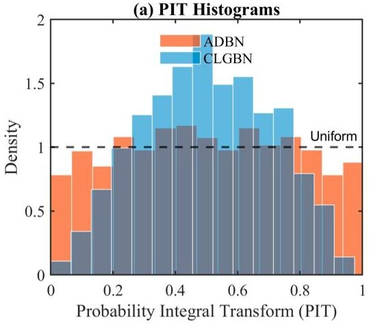

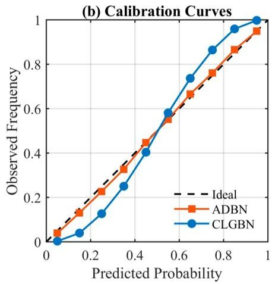

(c) Time-Conditional Sharpness and Coverage

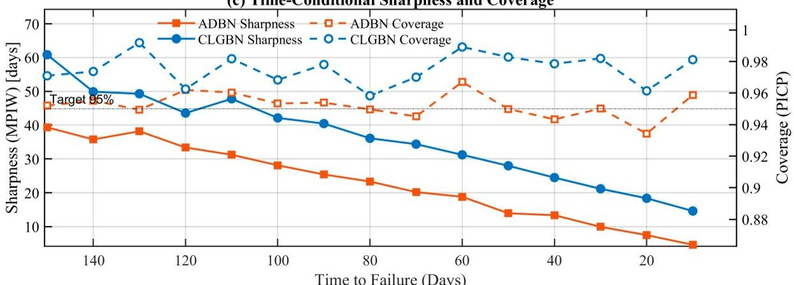

Figure 7. Reliability and calibration evaluation of probabilistic prediction.

Figure 7b shows the calibration curve of the predicted cumulative distribution function. The calibration curve plots the relationship between the predicted quantile and the proportion of observed values actually falling below that quantile. Ideally, the calibration curve should coincide with the diagonal line. As can be seen from the figure, the calibration curve of the ADBN model is closely attached to the diagonal line with a maximum deviation of no more than 0.03, indicating good conditional calibration of the model. The CLGBN exhibits obvious deviations at both ends, reflecting the calibration error caused by the symmetric distribution assumption.

Figure 7c shows the dynamic trade-off between sharpness and coverage rate during the test period. The figure plots the daily 90% prediction interval width and actual coverage probability, with a reference line for the target coverage rate of 90% marked. It can be seen from the figure that in the early stage of prediction (RUL > 90 days), the interval width is relatively large (approximately 45 days) with a coverage rate of 94%, reflecting the characteristics of high early uncertainty but reliable coverage; as time progresses, the interval width gradually narrows, indicating an increase in the model's confidence in the degradation trajectory; in the late stage of prediction (RUL < 30 days), the interval width decreases to approximately 22 days, and the coverage rate remains above 89%, embodying the balance between sharpness and reliability of the model in key regions.

To intuitively demonstrate the advantage of asymmetric distribution in RUL prediction, we selected three key time points, plotted the RUL posterior distributions given by each model, and compared them with the true RUL values, as shown in Figure 8.

<!-- PDF_PAGE: 25 -->

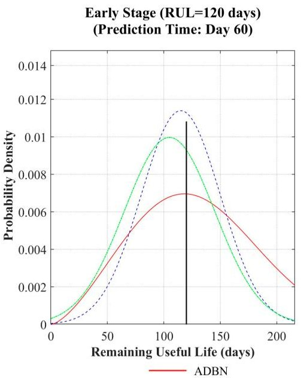

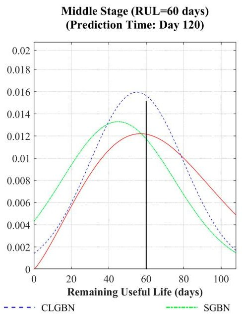

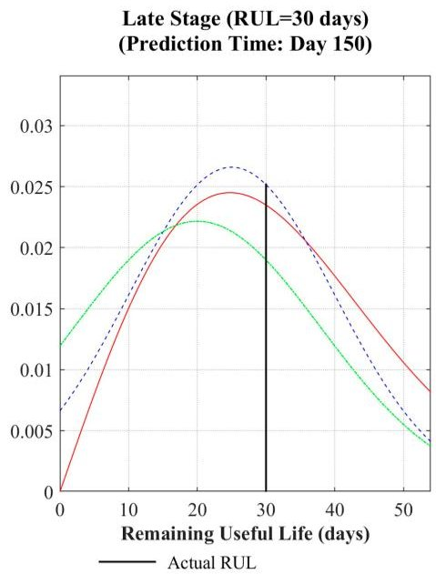

Figure 8. Comparison of RUL posterior distributions of three Bayesian network models.

From the early to the late stage, the posterior distribution given by ADBN is more consistent with the true RUL; in contrast, the symmetric Gaussian assumption model is more prone to systematic deviations. This result indicates that the use of asymmetric distribution helps improve prediction calibration and reliability in this case.

In addition to traditional point prediction indicators, this study adopts the Continuous Ranked Probability Score (CRPS) to comprehensively evaluate the overall calibration of the prediction distribution. CRPS measures both sharpness and calibration, with a smaller value indicating more accurate probabilistic prediction. Furthermore, an indicator related to maintenance decisions is introduced: the cumulative cost of average remaining life prediction errors, assuming an early replacement cost of $ C_{p} $ and a delayed failure cost of $ C_{f} $ . The daily decision loss is defined as follows:

$ L_{t}=\left\{ \begin{array}{l l} C_{p}$ if predicted RUL $ < $ threshold and actual RUL $ > $ threshold(false positive) $ C_{f} $ if predicted RUL $ > $ threshold and actual RUL $ < $ threshold(false negative) 0 otherwise

In this paper, $ C_{p}=1 $ $ C_{f}=10 $ , and the threshold is set to 30 days. Table 13 reports the CRPS and cumulative decision loss of each model on the entire test set.

Table 13. Prediction interval score and decision indicator comparison.

<table border="1"><tr><td>Model</td><td>CRPS</td><td>Cumulative Decision Loss</td></tr><tr><td>ADBN</td><td>2.92±0.21</td><td>23</td></tr><tr><td>CLGBN</td><td>4.35±0.34</td><td>41</td></tr><tr><td>SGBN</td><td>5.68±0.42</td><td>58</td></tr></table>

As can be seen from Table 13, ADBN has the lowest CRPS, indicating the best overall calibration of its probabilistic prediction. In terms of decision loss, the cumulative loss of ADBN is 23, which is significantly lower than that of the comparative models, indicating that it can more effectively balance the risks of false positives and false negatives and provide more reliable support for maintenance decisions.

We conduct comparative experiments on the efficiency and accuracy of variational inference and MCMC algorithms, comparing three types of inference strategies: ADBN + SGVI (stochastic gradient variational inference implemented in this paper); ADBN + NUTS (full-chain MCMC based on No-U-Turn Sampler); and ADBN (SGVI + short-NUTS) (using SGVI for warm-start first, then short-chain NUTS for fine-

<!-- PDF_PAGE: 26 -->

tuning). The set of random seeds is [0,1,2,3,4], and the number of repetitions is five (reporting mean $ \pm $ std); time measurement adopts wall-clock time, and for single-point inference, mean $ \pm $ std as well as p50/p95 latency are reported to reflect the distribution tail. The evaluation indicators include point prediction MAE (days), PICP of the 95% prediction interval, MPIW (mean interval width, days), and single-point latency (seconds). The results are shown in Table 14.

Table 14. Performance comparison of three types of inference strategies.

<table border="1"><tr><td>Method</td><td>MAE(Days)</td><td>PICP(95%)</td><td>MPIW(Days)</td><td>Latency(Per Inference)</td></tr><tr><td>ADBN+SGVI</td><td>5.51±0.24</td><td>0.907±0.019</td><td>48.41±0.56</td><td>0.80±0.01s(p95~0.99s)</td></tr><tr><td>ADBN+NUTS(fullMCMC)</td><td>5.31±0.24</td><td>0.947±0.010</td><td>76.29±0.68</td><td>1198.25±5.30s</td></tr><tr><td>ADBN(SGVI+shortNUTS)</td><td>5.27±0.07</td><td>0.953±0.014</td><td>62.20±0.77</td><td>60.30±0.24s</td></tr></table>

The three methods have little difference in point prediction accuracy. ADBN (SGVI + short-NUTS) achieves the smallest MAE (5.27 $ \pm $ 0.07 days), followed by ADBN + NUTS (5.31 $ \pm $ 0.24 days), and ADBN + SGVI is slightly worse (5.51 $ \pm $ 0.24 days). However, these absolute differences are not significant relative to the standard deviation, indicating that all three methods can provide usable predictions in terms of point estimation. Nevertheless, ADBN + SGVI has an absolute advantage in latency, with an average single-point inference latency of only about 0.80 $ \pm $ 0.01 s, which is much smaller than the 1198.25 $ \pm $ 5.30 s of full NUTS, making it highly deployable in online monitoring and early warning scenarios with strict real-time response requirements.

To quantitatively verify the rationality of limiting the maximum number of parent nodes per node to three, we design experiments to compare the impact of different parent node upper limits (two, three, four) on the performance of the ADBN model. Only the maximum number of parent nodes allowed in the network structure learning stage is changed. Three ADBN models (denoted as ADBN-P2, ADBN-P3, and ADBN-P4) are trained, and their prediction performance is evaluated on the test set. The main indicators include the following: Mean Absolute Error (MAE), test set Negative Log-Likelihood (NLL), and average width of the 90% prediction interval (MPIW). The results are shown in Table 15.

Table 15. Performance comparison of ADBN models with different parent node upper limits.

<table border="1"><tr><td>Model</td><td>MAE(Days)</td><td>Test Set NLL</td><td>90% MPIW(Days)</td><td>Total Number of Parameters</td></tr><tr><td>ADBN-P2</td><td>7.2</td><td>4.21</td><td>42.3</td><td>28</td></tr><tr><td>ADBN-P3</td><td>5.1</td><td>3.45</td><td>33.7</td><td>45</td></tr><tr><td>ADBN-P4</td><td>5.3</td><td>3.78</td><td>41.5</td><td>79</td></tr></table>

As can be seen from Table 15, ADBN-P3 outperforms ADBN-P2 in both MAE and NLL indicating that increasing the number of parent nodes to three can capture more important dependency relationships and improve prediction accuracy. When the number of parent nodes is increased to four, the number of model parameters increases significantly, but the MAE and NLL do not further improve, but slightly deteriorate. Meanwhile, the width of the 90% prediction interval increases significantly, indicating that the model suffers from overfitting and unstable parameter estimation. Limiting the maximum number of parent nodes to three achieves an optimal balance between model complexity and fitting ability, which can fully characterize the main causal relationships in the shafting degradation process while avoiding overfitting risks caused by excessive parameters.

In addition, we analyze the distribution of the number of failure modes and causes recorded in the FMEA documents. Among the 87 shafting-related failure modes counted,

<!-- PDF_PAGE: 27 -->

94. 3% have no more than three direct causes, and only 5.7% have four causes. Moreover, these four-cause modes can often be merged or have indirect relationships. Therefore, setting the maximum number of parent nodes to three is also reasonable from an engineering experience perspective.

## 3.5. Computational Efficiency and Scalability Analysis

To evaluate the usability of the ADBN model in actual online monitoring scenarios, this section reports the computational time for model training and inference and discusses its scalability with the increase in the number of nodes and parent nodes. All time measurements are performed in the experimental environment described in Section 3.1.

The training of the ADBN model adopts the EM algorithm combined with variational inference, with each iteration including an E-step and an M-step. In the bearing wear case of this paper, the network contains eight nodes with a maximum of three parent nodes, and the training set has 8640 samples. Table 16 summarizes the key computational time indicators.

Table 16. Computational time for ADBN model training and inference.

<table border="1"><tr><td>Indicator</td><td>Value</td></tr><tr><td>ELBO optimization time per iteration(E-step)</td><td>0.32±0.04s</td></tr><tr><td>Parameter update time per iteration(M-step)</td><td>0.18±0.03s</td></tr><tr><td>Total training time(500 iterations)</td><td>412s</td></tr><tr><td>Daily prediction latency(one variational inference)</td><td>0.15±0.02s</td></tr></table>

As can be seen from Table 16, the single prediction latency of ADBN is approximately 0.15 s, and the total training time is about 7 min, which is acceptable in practical engineering applications.

To analyze model scalability, a set of control experiments is designed. Under the condition of keeping other factors unchanged, the number of network nodes and the maximum number of parent nodes are changed, respectively, and the time-consuming of a single variational inference is recorded. Table 17 summarizes the inference time under different configurations (in milliseconds).

Table 17. Variational inference time relative to the number of nodes and parent nodes.

<table border="1"><tr><td>Number of Nodes</td><td>Maximum Number of Parent Nodes=2</td><td>Maximum Number of Parent Nodes=3</td><td>Maximum Number of Parent Nodes=4</td></tr><tr><td>5</td><td>78±5</td><td>82±6</td><td>89±7</td></tr><tr><td>10</td><td>148±10</td><td>158±11</td><td>172±13</td></tr><tr><td>15</td><td>224±15</td><td>241±16</td><td>265±18</td></tr><tr><td>20</td><td>305±20</td><td>332±22</td><td>368±25</td></tr></table>

As can be seen from Table 17, when the number of nodes increases from five to 20, the inference time increases linearly from about 80 milliseconds to about 330 milliseconds, approximately O(N). This is because the variational distribution adopts mean-field decomposition, and each node is updated independently, resulting in a computational complexity linearly related to the number of nodes. When the maximum number of parent nodes increases from two to four, the inference time increases by about 10-20%, which is due to the expansion of the GLM parameter scale caused by the increase in the number of parent nodes, but the impact is limited.

<!-- PDF_PAGE: 28 -->

## 4. Discussion

4. 1. Impact of Prediction Interval Calibration on Maintenance Decisions and Model Interpretability

The quality of prediction interval calibration directly affects the economy and safety of maintenance decisions based on remaining life prediction. Poor interval calibration may lead to two types of decision errors: false early warnings and false late warnings.

False early warnings (false positives) occur when the prediction interval is overly conservative (too wide) or systematically biased short, causing the model to trigger an early warning when the bearing is still in a healthy state. False early warnings result in unnecessary shutdown inspections and spare part replacements, increasing maintenance costs. For example, in Table 12, the MPIW of SGBN in the early stage is as high as 78.5 days, but its PICP is 0.99, meaning that the interval is excessively wide to achieve a 99% coverage rate. If the lower bound of the interval is used as the early warning threshold, frequent false positives will be triggered, resulting in a waste of maintenance resources.

False late warnings (false negatives) occur when the prediction interval is overly optimistic (too narrow) or systematically biased long, causing the model to underestimate the failure risk. False late warnings result in failure to issue timely early warnings before the actual failure occurs, leading to sudden shutdowns or even safety accidents. For example, if the PICP of the model in the late stage is lower than the target value, some true RUL values will fall outside the prediction interval, and the corresponding maintenance decisions may miss the optimal maintenance window, resulting in passive maintenance after equipment failure with greater losses.

Through more accurate distribution modeling and well-calibrated prediction intervals, ADBN achieves a balance between the above two aspects. Table 12 shows that its PICP in the late stage is 0.94, close to the target of 95%, and the MPIW is only 21.7 days, much narrower than that of the comparative models, thereby reducing the risk of false positives while ensuring coverage and improving the economy of maintenance decisions. In addition, CRPS comprehensively measures the overall calibration of the prediction distribution. The CRPS of ADBN is 2.92, significantly better than that of CLGBN (4.35) and SGBN (5.68), further verifying the superiority of its probabilistic prediction.

The interpretability of Bayesian networks provides a powerful tool for root cause analysis. In ADBN, changes in the posterior distribution of latent variables can be traced back to abnormalities in upstream observation nodes. This traceability stems from the conditional dependency structure of the network, where the posterior distribution of each latent variable is parameterized through GLM and linked to the states of parent nodes. When an observation node is abnormal, its impact propagates along the directed edges, leading to a shift in the posterior probability mass of downstream latent variables. By comparing the differences in the posterior distributions of each latent variable at different time points, the contribution of each upstream node to the change in the system state can be quantified.

We select the time point of 10 July 2023 (actual remaining life of 60 days) in the test set and calculate the change in the posterior mean of each node relative to the previous time point (9 July 2023). The results are shown in Table 18. The posterior mean of the vibration acceleration $ X_{1} $ increases significantly with a large corresponding GLM coefficient, leading to a rightward shift in the posterior distribution of the instantaneous wear rate $ Z_{1} $ and thus compressing the posterior distribution of RUL. In contrast, the changes in temperature $ X_{2} $ and oil particle concentration $ X_{4} $ are small, indicating that vibration is the dominant degradation factor at this stage. This visual analysis of posterior mass transfer provides maintenance personnel with quantitative evidence for fault traceability, helping

<!-- PDF_PAGE: 29 -->

to formulate precise maintenance strategies, such as prioritizing the inspection of bearing vibration sources rather than blindly replacing lubricating oil.

Table 18. Changes in posterior means of key nodes.

<table border="1"><tr><td>Node</td><td>Node Description</td><td>Change in Posterior Mean</td><td>Unit</td></tr><tr><td>$X_{1}$</td><td>Effective value of radial vibration acceleration</td><td>2.3</td><td>mm/s^{2}$</td></tr><tr><td>$X_{2}$</td><td>Bearing outer ring temperature</td><td>0.5</td><td>$^{\circ}C$</td></tr><tr><td>$X_{4}$</td><td>Particle concentration after filter</td><td>3</td><td>ppm</td></tr><tr><td>$Z_{1}$</td><td>Instantaneous wear rate</td><td>0.015</td><td>mm/h</td></tr><tr><td>$X_{\mathrm{RUL}}$</td><td>Remaining life</td><td>-8.5</td><td>days</td></tr></table>

## 4.2. Computational Complexity, Memory Occupancy, and Online Update Mechanism

The computational complexity of the ADBN model mainly depends on the network scale, the maximum number of parent nodes, and the number of iterations of variational inference. From a theoretical perspective, for a network with n nodes, a maximum of p parent nodes, and an average of m distribution parameters per node, the total number of GLM coefficients is approximately $ O(n\cdot p\cdot m). $ In the variational inference stage, each ELBO gradient calculation needs to traverse all nodes, with a computational complexity of $ O(n\cdot p\cdot m\cdot L), $ where L is the number of sampling times (usually L=1). Due to the meanfield decomposition enabling independent updates of each node, the overall complexity is linearly related to the number of nodes, which is consistent with the experimental results in Table 17: when the number of nodes increases from five to 20, the inference time increases linearly from about 80 ms to about 330 ms.

In terms of memory occupancy, the model needs to store the network structure, GLM coefficients, variational parameters, and necessary statistics. Taking the bearing wear case of this paper （n=8,p=3, average m=2.5）as an example, there are approximately $ 8 \times3 \times2. 5=6 0 $ GLM coefficients and about $ 8 \times3=2 4 $ variational parameters. Including a small number of auxiliary variables, the total number of parameters does not exceed 200. If double-precision floating-point numbers are used, the model memory occupancy is less than 2 KB, which can be easily deployed on embedded monitoring equipment. Even if the network scale expands to 50 nodes, the memory occupancy can still be controlled at the tens of KB level, meeting the resource constraints of industrial sites.

The online update mechanism is the key to achieving adaptive prediction. We propose two online update strategies.

Incremental update of GLM coefficients. When a new batch of data arrives, the current GLM coefficients are used as initial values, and a small number of stochastic gradient descent steps are performed on the new data to minimize the Negative Log-Likelihood loss Since gradient calculation only involves the current batch of data, the update speed is fast, and the cost of complete retraining can be avoided. This method is similar to the online EM algorithm and is suitable for scenarios where the system degradation law changes slowly To control the update amplitude, a forgetting factor can be introduced to exponentially decay historical gradients, making the model more focused on recent data.

Hot switching of distribution forms. If the data distribution changes significantly after long-term operation, the BIC value of each node is re-evaluated to select a new distribution form. This evaluation does not need to be performed frequently and can be completed offline. After selecting a new distribution, the GLM coefficients need to be reinitialized and fine-tuned using historical data. This mechanism ensures the adaptability of the model to changes in the data distribution while avoiding the computational burden caused by frequent re-selection of distributions.

For variational parameters, re-optimization is required each time new evidence arrives, but the optimization process only requires dozens of iterations, and the varia-

<!-- PDF_PAGE: 30 -->

tional parameters from the previous moment can be used as a warm start to further accelerate convergence.

## 5. Conclusions

Traditional Bayesian networks for ship shafting RUL prediction are often limited by symmetric distribution assumptions. To overcome this limitation, this study proposes a probabilistic prediction framework based on the Asymmetric Distribution Bayesian Network (ADBN). Nodes are allowed to flexibly select asymmetric distributions, the association between distribution parameters and parent node states is realized with the help of Generalized Linear Models, and efficient inference is achieved by combining variational inference. Case verification shows that this framework can more accurately characterize the skewness and heavy-tailed characteristics of degradation data, and its prediction performance is better than that of traditional Gaussian network models.

This study still has limitations: the model structure relies on prior knowledge, and its adaptive ability to new failure modes needs to be verified; the data comes from specific ship types and typical failures, and its generalization under multiple failures and different systems needs further verification; the approximation accuracy of variational inference in high-dimensional and non-Gaussian scenarios needs in-depth analysis. In the future, we can explore adaptive structure learning, fusion of multi-modal sensor data and operation and maintenance log text information, and lightweight and edge computing deployment to promote the practical development of intelligent ship operation and maintenance.

Author Contributions: Conceptualization, P.D., G.H., and L.Y.; methodology, P.D. and G.H.; validation, L.Y., G.H., and P.D.; data curation, G.H.; writing—original draft preparation, P.D. and G.H.; supervision, L.Y.; funding acquisition, P.D. and G.H. All authors have read and agreed to the published version of the manuscript.

Funding: This study was supported by the National Social Science Foundation of China (Grant No. 2024-SKJJ-C-027) and the Naval University of Engineering independent research projects (No. 202550A030, No. 2025500330).

Data Availability Statement: The data that support the findings of this study are available from the Corresponding Author, Luwen Yuan, upon reasonable request.

Conflicts of Interest: The authors declare no conflicts of interest.

## Abbreviations

The following abbreviations are used in this manuscript:

ADBN Asymmetric Distribution Bayesian Network

BIC Bayesian Information Criterion

BN Bayesian Network

CLG Conditional Linear Gaussian

CPD Conditional Probability Distribution

DAG Directed Acyclic Graph

ELBO Evidence Lower Bound

FMEA Failure Mode and Effects Analysis

GLM Generalized Linear Model

KL Kullback-Leibler

MAE Mean Absolute Error

MPIW Mean Prediction Interval Width

NLL Negative Log-Likelihood

PICP Prediction Interval Coverage Probability

PHM Prognostics and Health Management

<!-- PDF_PAGE: 31 -->

RUL Remaining Useful Life

EM Expectation-Maximization

CRPS Continuous Ranked Probability Score

## References

1. Zhang, P.; Gao, Z.; Cao, L.; Sun, P. Marine systems and equipment prognostics and health management: A systematic review from health condition monitoring to maintenance strategy. J. Mar. Sci. Eng. 2022, 10, 72. [CrossRef]

2. Ren, F.; Du, J.; Chang, D. Research on the Bearing Lifespan Prediction Method for Ship Propulsion Shaft Systems Based on an Enhanced Domain Adversarial Neural Network. J. Mar. Sci. Eng. 2023, 11, 2128. [CrossRef]

3. Shao, X.Y.; Cai, B.P. System-level remaining useful life prediction methodology based on the dynamic health index of multi-indicator fusion: Two cases of subsea equipment. J.Ocean Eng.Sci.2026, in press. [CrossRef]

4. Liang, J.; Liu, H.; Xiao, N.-C. A hybrid approach based on deep neural network and double exponential model for remaining useful life prediction. Expert Syst. Appl. 2024, 249, 123563. [CrossRef]

5. Ferreira, C.; Gonçalves, G. Remaining Useful Life prediction and challenges: A literature review on the use of Machine Learning Methods. J. Manuf. Syst. 2022, 63, 550-562. [CrossRef]

6. Karkuzhali, V.; Jothi Swaroopan, N.; Shanker, N.R.; Senthilraj, S. Symmetry-Aware Bayesian-Optimized Gaussian Process Regression for Remaining Useful Life Prediction of Lithium-Ion Batteries Under Real-World Conditions. Symmetry 2025, 17, 2039. [CrossRef]

7. Li, C.Y.; Li, G.B.; Xing, P.F.; Cui, D.X.; Sui, Y.J.; Zhang, H.P. A progressive domain separation network incorporating iris time-frequency maps for open-set diagnosis of ship propulsion shafting. Ocean Eng. 2026, 343, 123219. [CrossRef]

8. Weiner, M.J.; Yang, R.; Groth, K.; Azarm, S. Probabilistic Deep Learning With Bayesian Networks for Predicting Complex Engineering Systems' Remaining Useful Life: A Case Study of Unmanned Surface Vessel. ASME J. Risk Uncertain. Part B 2025, 11, 041203. [CrossRef]

9. Benker, M.; Furtner, L.; Semm, T.; Zaeh, M.F. Utilizing uncertainty information in remaining useful life estimation via Bayesian neural networks and Hamiltonian Monte Carlo. J. Manuf. Syst. 2021, 61, 799-807. [CrossRef]

10. Qiang, X.; Chen, X.; Fan, H.; Wang, C. Sample distribution-aware parallelepiped-based method for class imbalance fault diagnosis. Adv. Eng. Inform. 2026, 69, 103882. [CrossRef]

11. Qiang, X.; Chen, X.; Wang, C. Novel convex model-based approach for data-driven fault diagnosis considering uncertainty. Reliab. Eng. Syst. Saf. 2026, 266, 111714. [CrossRef]

12. Chen, X.; Wang, C.; Qiang, X.; Fan, H.; Pan, L. Dual-modality interval process modelling for fault diagnosis in engineering systems with time-varying uncertainties. Appl. Math. Model. 2026, 151, 116511. [CrossRef]

13. Li, H.; Zhang, Z.; Li, T.; Si, X. A review on physics-informed data-driven remaining useful life prediction: Challenges and opportunities. Mech. Syst. Signal Process. 2024, 209, 111120. [CrossRef]

14. Zhu, R.; Chen, Y.; Peng, W.; Ye, Z.-S. Bayesian deep-learning for RUL prediction: An active learning perspective. Reliab. Eng. Syst. Saf. 2022, 228, 108758. [CrossRef]

15. Hostens, E.; Eryilmaz, K.; Vangilbergen, M.; Ooijevaar, T. Bayesian Networks for Remaining Useful Life Prediction. PHM Soc. Eur. Conf. 2024, 8, 11. [CrossRef]

16. Wu, D.Z.; Jia, M.P.; Cao, Y.D.; Ding, P.; Zhao, X.L. Remaining useful life estimation based on a nonlinear Wiener process model with CSN random effects. Measurement 2022, 205, 112232. [CrossRef]

17. Palmieri, M.; Slavič, J.; Cianetti, F. Fast evaluation of central moments for non-Gaussian random loads in vibration fatigue. Mech. Syst. Signal Process. 2025, 228, 112434. [CrossRef]

18. Zhang, X.-Y.; Misraji, M.A.; Valdebenito, M.A.; Faes, M.G.R. Directional importance sampling for dynamic reliability of linear structures under non-Gaussian white noise excitation. Mech. Syst. Signal Process. 2025, 224, 112182. [CrossRef]

19. Cheng, J.-W.; Bu, W.-J.; Shi, L.; Fu, J.-Q. A real-time shaft alignment monitoring method adapting to ship hull deformation for marine propulsion system. Mech. Syst. Signal Process. 2023, 197, 110366. [CrossRef]

20. Song, W.; Chen, D.; Zio, E. Heavy Tail and Long-Range Dependence for Skewed Time Series Prediction Based on a Fractional Weibull Process. Fractal Fract. 2024, 8, 7. [CrossRef]

21. Huang, Z.Y.; Xu, Z.G.; Ke, X.J.; Wang, W.H.; Sun, Y.X. Remaining useful life prediction for an adaptive skew-Wiener process model. Mech. Syst. Signal Process. 2017, 87, 294-306. [CrossRef]

22. Huang, Y.; Lu, Z.; Dai, W.; Zhang, W.; Wang, B. Remaining Useful Life Prediction of Cutting Tools Using an Inverse Gaussian Process Model. Appl. Sci. 2021, 11, 5011. [CrossRef]

23. Chen, X.; Sun, X.; Ding, X.; Tang, J. The inverse Gaussian process with a skew-normal distribution as a degradation model. Commun. Stat.-Simul. Comput. 2020, 49, 2827-2843. [CrossRef]

24. Agresti, A. Foundations of Linear and Generalized Linear Models; John Wiley & Sons: Hoboken, NJ, USA, 2015.

25. McCullagh, P.; Nelder, J.A. Generalized Linear Models, 2nd ed.; Chapman & Hall/CRC: London, UK, 1989.

<!-- PDF_PAGE: 32 -->

26. Azzalini, A.; Capitanio, A. The Skew-Normal and Related Families; Cambridge University Press: Cambridge, UK, 2014; ISBN 1107029279.

27. Tan, L.S.L.; Chen, A. Variational Inference based on a Subclass of Closed Skew Normals. J. Comput. Graph. Stat. 2025, 34, 422-436. [CrossRef]

Disclaimer/Publisher's Note: The statements, opinions and data contained in all publications are solely those of the individual author(s) and contributor(s) and not of MDPI and/or the editor(s). MDPI and/or the editor(s) disclaim responsibility for any injury to people or property resulting from any ideas, methods, instructions or products referred to in the content.