<!-- PDF_PAGE: 1 -->

Article

# GPCN: A Decomposition-Based Hybrid Model for a Lithium-Ion Capacity Forecasting and RUL Inference Framework

Li Wang ID, Guosheng Cai *ID, Yuan Gao ID and Caoxin Shen ID

School of Electrical Engineering and Automation, Nantong University, Nantong 226019, China; lwee@ntu.edu.cn (L.W.); 2312310035@stmail.ntu.edu.cn (Y.G.); 2312310002@stmail.ntu.edu.cn (C.S.) * Correspondence: 2312310022@stmail.ntu.edu.cn

## Abstract

To address the non-stationary fluctuations caused by capacity regeneration and measurement noise during lithium-ion battery aging, this paper proposes a decomposition-guided heterogeneous prognostic framework for capacity forecasting and remaining useful life (RUL) inference. First, the raw capacity sequence is decomposed by CEEMDAN to separate the long-term degradation trend from short-term regeneration-related disturbances across different time scales. Next, a temporal convolutional network (TCN) is employed to model the trend component, while Gaussian process regression (GPR) is used to characterize local fluctuation behavior and provide predictive uncertainty. Finally, Dempster-Shafer (D-S) evidence theory is introduced to fuse multi-source prognostic outputs, yielding a more robust capacity trajectory for end-of-life (EOL) threshold localization and RUL estimation. Experiments are conducted on the lithium-ion battery dataset released by NASA Ames. Across the four tested battery cells, the proposed method achieves RMSE values of 0.0257-0.0445 Ah and EOL cycle deviations of 1.17-5.53 cycles, while yielding a more balanced trade-off than representative baselines between point-wise prediction accuracy and threshold-crossing stability. Moreover, under direct multi-step forecasting, the prediction error increases with the forecasting horizon, which is consistent with the expected characteristics of long-horizon capacity extrapolation. Overall, this work provides an implementable and interpretable prognostic framework for battery health assessment in the presence of capacity regeneration phenomena.

Keywords: lithium-ion battery; capacity regeneration; CEEMDAN; TCN; Gaussian process regression; remaining useful life

## Check for updates

Academic Editor: Ayman EL-Refaie

Received: 25 February 2026

Revised: 20 March 2026

Accepted: 24 March 2026

Published: 25 March 2026

Copyright: 2026 by the authors. Published by MDPI on behalf of the World Electric Vehicle Association Licensee MDPI, Basel, Switzerland. This article is an open access article distributed under the terms and conditions of the Creative Commons Attribution (CC BY) license.

## 1. Introduction

Owing to their advantages of high energy density, long service life, and favorable power capability, lithium-ion batteries have rapidly expanded in application from electric vehicles to a wide range of scenarios such as large-scale energy storage systems, bringing substantial efficiency gains and economic benefits to end users and stakeholders across the industrial value chain. Nevertheless, under long-term cycling and complex operating conditions, batteries inevitably undergo aging, which typically manifests as performance degradation, such as gradual decay of the available capacity [1]. If such degradation is not perceived and mitigated in a timely manner, it may lead to reduced driving range, unexpected system downtime, or even safety incidents. Therefore, forecasting the future evolution of battery capacity and further estimating the remaining useful life (RUL) are of great importance for improving system reliability and operational safety.

<!-- PDF_PAGE: 2 -->

The remaining useful life (RUL) of a lithium-ion battery can be defined as the number of remaining charge-discharge cycles before a selected health indicator first reaches a predefined failure threshold [2]. Accurate RUL assessment provides a quantitative basis for end-of-life decisions such as replacement scheduling, second-life repurposing, and retirement planning, thereby supporting the reliable operation and risk management of battery management systems. However, the underlying electrochemical processes inside batteries are highly complex, and the aging pathways of materials are diverse. Moreover, many critical internal states are difficult to measure directly, which introduces substantial uncertainty into capacity forecasting and lifetime prediction. Consequently, both academia and industry have devoted extensive efforts to developing RUL prediction methods that are more reliable, robust, and deployment-oriented.

Existing RUL prediction approaches can be broadly categorized into two groups. The first group comprises physics-based or semi-physics-based methods [3], such as equivalent circuit models (ECMs) with parameter identification, which typically formulate state equations using internal resistance, polarization parameters, or capacity-fade mechanisms and then perform online estimation with filtering techniques [4]. These methods offer a certain level of interpretability, yet they often impose stringent requirements on model fidelity, operating-condition consistency, and parameter observability. Moreover, they may be insufficient to characterize complex phenomena such as capacity regeneration. The second group includes data-driven approaches, ranging from statistical regression and support vector regression to deep learning methods that have gained wide adoption in recent years [5]. Although deep models are capable of learning highly nonlinear mappings, in the presence of capacity regeneration, directly modeling the entire capacity trajectory can entangle the long-term degradation trend with short-term fluctuations, thereby impairing generalization—especially when early-life samples are limited or when transferring across different cells—and leading to unstable performance [6-8].

Model-based RUL prediction methods typically follow a pipeline of state estimation, degradation-parameter identification, future extrapolation, and threshold-based decision making. First, an equivalent circuit or state-space model is established to describe terminal-voltage dynamics and internal states, and online observers or filtering techniques are employed for state estimation and adaptive parameter updating to obtain reliable health representations. For instance, an online identification approach that integrates recursive total least squares with an SOC observer has been proposed to enhance estimation robustness under measurement noise and operating-condition disturbances [9]. Empirical or semi-empirical degradation models are then used to characterize capacity-fade dynamics, and lifetime extrapolation together with uncertainty quantification is performed within probabilistic inference frameworks [10]. In particular, an integrated probabilistic prognostic framework has been developed to fuse multiple health indicators and improve the consistency of RUL inference [1]. To accommodate nonlinear and non-Gaussian degradation processes and enable rolling life prediction, conditional particle filtering strategies have been introduced [11,12]. Moreover, sparse Bayesian predictive modeling has been leveraged to provide explicit and quantifiable uncertainty characterization [13]. In recent years, uncertainty quantification (UQ) has been further incorporated into joint capacity-RUL prediction, allowing models to output credible intervals to support risk-aware decision making. Overall, model-based methods can achieve high accuracy when the underlying mechanistic assumptions hold and the environment is relatively stable. However, in complex scenarios, model construction and parameter calibration remain challenging.

Data-driven RUL prediction aims to learn degradation evolution directly from historical operational data, thereby accommodating application environments where the underlying mechanisms cannot be fully modeled and operating conditions vary signif-

<!-- PDF_PAGE: 3 -->

icantly. Such studies typically construct degradation representations from capacity trajectories, charge-discharge curves, and measurable signals such as voltage, current, and temperature, and then employ deep networks to model and extrapolate long-term nonlinear aging patterns. For example, a hybrid data-driven framework has been proposed to jointly perform SOH estimation and RUL prediction, and an uncertainty-aware learning scheme was further introduced to output credible intervals for risk-informed decision making [14]. In sequence modeling, the Auto-CNN-LSTM model [15] and the cascaded CNN-LSTM-DNN architecture [16] have been developed to integrate local feature extraction with long-range temporal dependencies, improving regression accuracy in complex degradation stages. Transformer-based prognostic networks have also been explored to capture long-horizon dependencies and salient degradation segments [17]. In addition, a TCN-GRU-DNN structure with dual attention [18] and a temporal- and differential-guided dual-attention network [19] were proposed to enhance key-feature selection and increase sensitivity to capacity inflection points and accelerated-fade phases. A lightweight memory network with a flexible temporal span has further been introduced to improve robustness and generalization for long-sequence scenarios [20].

Although a variety of RUL prediction methods have been developed, pronounced capacity regeneration and strong noise perturbations can still induce trend drift and degrade forecasting stability. Moreover, many existing studies mainly focus on direct prediction of the raw capacity trajectory and emphasize point estimation, while the decoupled modeling of trend and regeneration effects, as well as interval-aware lifetime inference, remains insufficiently explored. To address these limitations, this paper proposes a decomposition-guided heterogeneous prognostic framework that explicitly separates the measured capacity sequence into a long-term degradation component and a regeneration-related fluctuation component. Based on this decoupling paradigm, a lightweight temporal convolutional network (TCN) is used to model the dominant degradation trend, Gaussian process regression (GPR) is employed to capture local regeneration-related variations and predictive uncertainty, and Dempster-Shafer evidence theory (DST) is further introduced to improve the robustness of decision-level fusion. The proposed framework ultimately outputs both the RUL point estimate and an associated predictive interval.

The main contributions of this paper are summarized as follows:

1. A decomposition-guided heterogeneous prognostic framework, termed GPCN, is proposed for lithium-ion battery capacity forecasting and RUL inference. Instead of directly predicting the raw capacity sequence in an end-to-end manner, the proposed framework explicitly decouples the measured capacity trajectory into a long-term degradation component and a regeneration-related fluctuation component, thereby improving the structural interpretability of the prognostic task.

2. A task-oriented component-wise modeling strategy is developed. Specifically, a temporal convolutional network (TCN) is employed to capture the long-range dependency of the degradation trend, whereas Gaussian process regression (GPR) is used to model regeneration-related local fluctuations and provide uncertainty-aware compensation. This heterogeneous assignment allows the framework to better match model characteristics with component properties.

3. A Dempster-Shafer-theory-based evidence fusion mechanism is introduced to improve the robustness of end-of-life threshold localization and RUL estimation. Experimental results on the NASA Ames battery dataset demonstrate that the proposed method achieves a balanced trade-off between point-wise capacity prediction accuracy and lifetime inference stability across different battery cells.

<!-- PDF_PAGE: 4 -->

The remainder of this paper is organized as follows. Section 2 formulates the problem and presents the overall methodology. Section 3 describes the proposed decomposition-guided hybrid prognostic framework in detail. Section 4 reports the experimental setup and results. Finally, Section 5 concludes the paper.

## 2. Problem Statement

In this study, battery capacity is selected as the health indicator for lithium-ion battery RUL prediction. This indicator can directly reflect performance degradation as cycling proceeds and has been widely adopted in the existing literature as a practical representation of battery lifetime. In general, capacity fade is one of the most typical observable manifestations during the aging process of rechargeable batteries. Under prolonged charge-discharge cycling, progressive material degradation and interfacial deterioration occur, which in turn lead to a sustained reduction in the available capacity. It should be noted that real-world degradation is often nonlinear and fluctuating, and the capacity trajectory is not an ideally smooth and strictly monotonic curve. In certain stages, temporary capacity recovery or a slowdown in the fading rate may appear. Therefore, explicitly accounting for regeneration effects and the uncertainty embedded in the degradation trend during modeling and inference is crucial for improving the accuracy of future capacity forecasting and the reliability of RUL assessment.

Based on the above discussion, the problem can be formulated as follows.

$$
C = D + R
$$

where D denotes the long-term degradation trend of a lithium-ion battery, R denotes the regeneration-related variations, and C denotes the measured capacity. Most existing studies primarily focus on forecasting the dominant degradation trend D while paying insufficient attention to the influence of R on lifetime prognostics. In practice, D exhibits a slow and approximately monotonic long-term decay, whereas R appears as short-term recovery behavior and stochastic disturbances induced by operating-condition fluctuations, rest-induced recovery, and variations in polarization effects [21]. Since these two components differ substantially in both temporal scale and statistical properties, directly modeling C as a single sequence in an end-to-end manner may cause the predictor to misinterpret local recovery as a change in the underlying degradation tendency, thereby leading to trend drift in multi-step extrapolation. This problem becomes particularly severe when early-life data are limited, resulting in unstable long-horizon predictions [22]. Therefore, rather than performing direct end-to-end forecasting on C with a single model, this paper adopts a trend-regeneration decoupling paradigm. As illustrated in Figure 1, D and R are modeled separately and then reconstructed at the prediction stage, which improves both the robustness and the interpretability of lifetime prognostics.

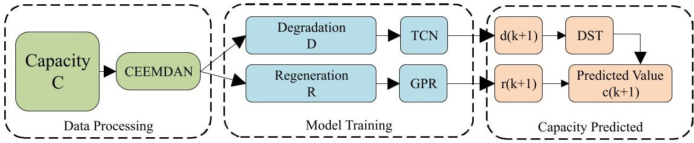

Figure 1. Model framework.

## 2.1. CEEMDAN

Adaptive noise complete ensemble empirical mode decomposition (CEEMDAN) is employed to preprocess the raw capacity data because it can effectively separate the long-

<!-- PDF_PAGE: 5 -->

term degradation trend from short-term regeneration-related fluctuations in complex sequences [23]. Compared with conventional EEMD, CEEMDAN introduces adaptive noise injection, which alleviates residual reconstruction errors during decomposition. This property not only enables the intrinsic mode functions (IMFs) and the residual component to reconstruct the original sequence in a more stable manner, but also improves the reproducibility of experimental outcomes. For the local capacity recovery and stochastic disturbances commonly observed in capacity trajectories, CEEMDAN does not require any predefined basis functions. Instead, it adaptively extracts a low-frequency trend term that reflects the underlying evolution pattern and a high-frequency component that captures perturbations according to the data characteristics. As a result, CEEMDAN provides high-quality inputs for subsequent modeling. After decomposition, D and R are treated as two separate components and are modeled independently for prediction and training.

## 2.2. Enhanced TCN

The degradation trend of lithium-ion battery capacity evolves slowly and exhibits long-range temporal dependency, which requires the forecasting model to capture long-term degradation patterns accurately. Recurrent architectures such as LSTM and GRU perform sequential computations along time steps, leading to relatively low training efficiency. Moreover, they are more prone to gradient vanishing and information forgetting when handling long sequences. Temporal convolutional networks (TCNs) are convolution-based models specifically designed for time-series prediction [24]. They do not rely on linearity or stationarity assumptions and thus remain flexible under nonlinear degradation dynamics. In addition, TCNs are lightweight in structure and typically incur lower computational and memory costs, making them well suited to scenarios with limited data and constrained computing resources. Temporal convolutional networks have also been used in battery health monitoring and RUL prediction because of their efficient receptive-field expansion and suitability for long-sequence degradation modeling [18,24,25].

## 2.3. Gaussian Process Regression

Gaussian process regression (GPR) is a nonparametric Bayesian regression technique. A key advantage of GPR is that it can achieve competitive performance with relatively small datasets while naturally providing predictive uncertainty. As a stochastic-process-based model, GPR has been widely applied to RUL prognostics. In this work, the dominant degradation trend is modeled by the TCN, whereas the regeneration-related component mainly serves to compensate local fluctuations. We adopt GPR for the regeneration term to preserve modeling flexibility while controlling the overall system complexity, thereby keeping the proposed framework analytically tractable and easier to interpret. As a stochastic-process-based model, GPR and related Bayesian predictive models have been widely used in battery prognostics because they are suitable for small-sample learning and can naturally provide uncertainty estimates [10,13,21].

## 3. RUL Prediction Framework

This section presents the proposed hybrid prognostic framework in detail. The measured capacity sequence is first decomposed and reformulated into a trend-degradation component and a regeneration-induced disturbance component. The trend component is predicted by a TCN to obtain the long-horizon degradation forecast, whereas the regeneration component is modeled using Gaussian process regression to characterize short-term fluctuations together with predictive uncertainty. The future capacity trajectory is then reconstructed, and the RUL is determined via the intersection with a

<!-- PDF_PAGE: 6 -->

predefined end-of-life (EOL) threshold. Finally, Dempster-Shafer (D-S) evidence theory is incorporated to fuse the multi-source prognostic outputs at the decision level, thereby improving the stability and interpretability of the final predictions. This study considers a fixed prediction-origin setting rather than an online rolling-update setting. Specifically, all reported RUL results are obtained by taking the 31st cycle as the unified prediction starting point.

The complete workflow can be summarized as follows. First, the raw capacity sequence is decomposed by CEEMDAN into multiple intrinsic mode functions (IMFs) and a residual term, from which the degradation component D and the regeneration-related component R are reconstructed. Second, supervised samples are generated using a slidingwindow strategy. Third, the degradation component is forecast by the TCN in a quantile-regression manner, while the regeneration component is modeled by GPR to provide fluctuation compensation and uncertainty characterization. Fourth, the component-wise outputs are reconstructed into future capacity estimates, and the final prediction is further refined by D-S-evidence-based fusion. Finally, the remaining useful life is inferred by identifying the intersection between the predicted capacity trajectory and the predefined EOL threshold.

The overall framework is developed based on the NASA Ames battery degradation benchmark [26], CEEMDAN-based decomposition [23], and Dempster-Shafer evidence fusion [27].

## 3.1. Data Processing

This study uses the NASA battery degradation dataset, in which the raw data are recorded on a cycle-by-cycle basis and include the charge/discharge processes together with the associated measurement sequences. Since lifetime assessment is commonly conducted using discharge-capacity fade as the health indicator, we extract only the discharge capacity from each cycle to construct the capacity degradation sequence. Let k denote the index of the k-th discharge cycle （ k=1,2,...,N），and define the capacity sequence as $ C_{k}\in\mathbb{R} $ where $ C_{k} $ denotes the discharge capacity of the k-th cycle in the dataset. In practice, battery capacity degradation is often characterized by a superposition of a long-term fading trend and local capacity recoveries [25]. To disentangle components at different time scales and mitigate the impact of non-stationary disturbances on trend extrapolation, the capacity sequence is expressed as the sum of a trend-degradation term and a regeneration-induced disturbance term.

$$
C _ {k} = D _ {k} + R _ {k}.
$$

where $ D_{k} $ denotes the degradation-trend component of capacity, and $ R_{k} $ denotes the short term regeneration component. For notational convenience, the original sequence is denoted by $ x^{(0)}(k) $ , the m-th residual by $ r_{m}(k) $ , and the m-th intrinsic mode function (IMF) by $ IMF_{m}(k) $ . The number of ensemble realizations is denoted by I, the i-th white-noise sequence is denoted by $ w_{i}(k) $ , and the noise amplitude coefficient is denoted by $ \varepsilon $ .

In the CEEMDAN implementation, the noise amplitude coefficient was set to $ \varepsilon=0. 2 $ and the number of ensemble realizations was set to I=100. The maximum number of sifting iterations was set to 1000, and the signal-to-noise-ratio mode was set to SNRFlag=2 meaning that the injected noise was normalized at each decomposition stage. In addition, the default stopping criterion of the original emd.m implementation was adopted. Before decomposition, the input sequence was normalized by its standard deviation, and the decomposed modes were rescaled back to the original magnitude after CEEMDAN. These parameter settings were selected to balance decomposition stability and noise-assisted mode separation. Preliminary trials showed that smaller noise amplitudes or fewer ensemble realizations weakened the separation of local regeneration-related fluctuations, whereas

<!-- PDF_PAGE: 7 -->

larger values brought limited additional benefit but increased computational cost. In the present study, CEEMDAN is applied to the complete capacity trajectory as an offline preprocessing step to separate the long-term degradation trend from the regeneration-related fluctuation component.

For $ i=1,\dots, I $ , construct the perturbed sequence.

$$
r _ {0} (k) = x ^ {(0)} (k) = C _ {k}.
$$

$$
x _ {i} ^ {(0)} (k) = x ^ {(0)} (k) + \varepsilon \sigma_ {x} \omega_ {i} (k).
$$

where $ \sigma_{x}=\operatorname{std}\Bigl( x^{(0)} \Bigr) $ . For each $ x_{i}^{(0)}(k) $ , perform the first sifting operation of EMD and extract its first IMF, which is denoted as the output of $ emd_{1}(\cdot) $ .

$$
i m f _ {1, i} (k) = e m d _ {1} \left(x _ {i} ^ {(0)} (k)\right).
$$

Then, the first IMF of CEEMDAN is obtained by ensemble averaging.

$$
I M F _ {1} (k) = \frac {1}{I} \sum_ {i = 1} ^ {I} i m f _ {1, i} (k).
$$

The residual is updated as follows.

$$
r _ {1} (k) = x ^ {(0)} (k) - I M F _ {1} (k).
$$

The adaptive noise in CEEMDAN is manifested in the extraction of the m-th layer: the noise is decomposed via EMD to obtain the component whose scale matches that layer. Specifically, EMD is first applied to the noise, and its m-th IMF is retained.

$$
e _ {m, i} (k) = e m d _ {m} \left(w _ {i} (k)\right).
$$

To construct the perturbed residual ensemble for the m-th layer,

$$
r _ {m - 1, i} (k) = r _ {m - 1} (k) + \varepsilon \sigma_ {r _ {m - 1}} e _ {m, i} (k).
$$

where $ \sigma_{r_{m-1}}=\operatorname{std}(r_{m-1}) $ . Next, for each $ r_{m-1,i}(k) $ , the first IMF is extracted.

$$
i m f _ {m, i} (k) = e m d _ {1} \left(r _ {m - 1, i} (k)\right).
$$

The m-th IMF is then obtained by ensemble averaging.

$$
I M F _ {m} (k) = \frac {1}{I} \sum_ {i = 1} ^ {I} i m f _ {m, i} (k).
$$

The residual is updated as follows.

$$
r _ {m} (k) = r _ {m - 1} (k) - I M F _ {m} (k).
$$

When the residual $ r_{M}(k) $ becomes approximately monotonic or the number of extrema is insufficient to continue the sifting process, the decomposition stops.

$$
C _ {k} = \sum_ {m = 1} ^ {M} I M F _ {m} (k) + r _ {M} (k).
$$

<!-- PDF_PAGE: 8 -->

For visual illustration, the CEEMDAN decomposition result of battery cell B0005 is shown in Figures 2 and 3. To avoid relying only on qualitative visual inspection, the grouping of decomposed modes is determined in this work by a unified quantitative criterion and then applied consistently to all tested cells.

For each $ \mathrm{IMF}_{m} $ , two quantitative descriptors are computed. The first is the oscillation density index,

$$
\rho_ {m} = \frac {N _ {\mathrm {e x t}} \left(\mathrm {I M F} _ {m}\right)}{N},
$$

where $ N_{\mathrm{ext}}(\mathrm{IMF}_{m}) $ denotes the number of local extrema of $ \mathrm{IMF}_{m} $ , and N is the sequence length. The second is the trend-correlation index,

$$
\gamma_ {m} = | \operatorname {S p e a r m a n} \left(\mathrm {I M F} _ {m}, k\right) |,
$$

where k is the cycle index. The oscillation-density index characterizes the fluctuation intensity of each mode, while the trend-correlation index reflects its monotonic association with the long-term capacity fading process.

An IMF is assigned to the regeneration-related component if it exhibits relatively high oscillation density and weak trend correlation; otherwise, it is assigned to the degradation-related component. Specifically, IMFs satisfying $ \rho_{m}\geq 0.10 $ are grouped into the regeneration-related component R, whereas the remaining low-frequency modes together with the residual are grouped into the degradation-related component D. Under this criterion, IMF1-IMF3 are consistently assigned to R, while IMF4 together with the residual is assigned to D for all tested cells.

Figure 3 provides the decomposition example for B0005, whereas the quantitative grouping results for all tested cells are summarized in Table 1.

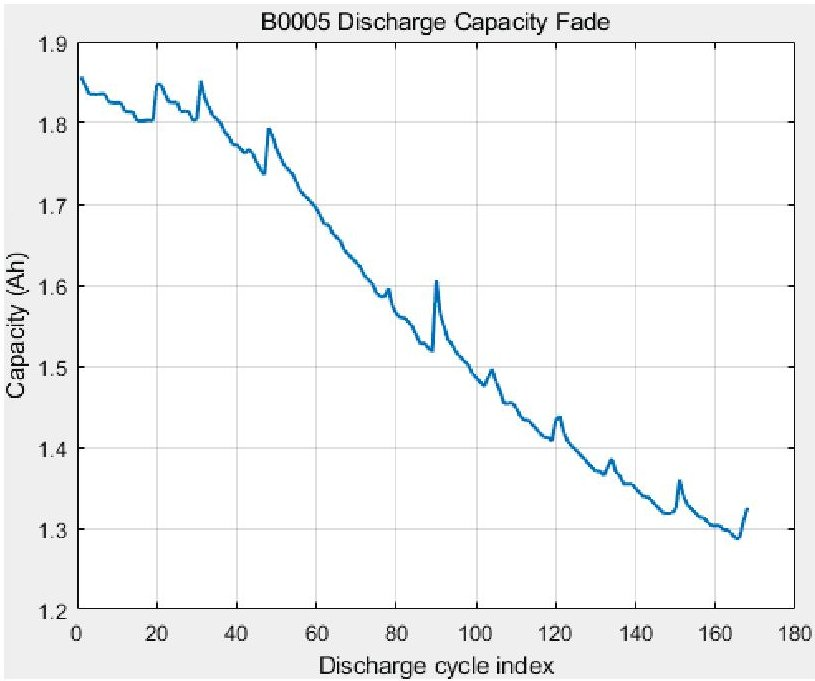

Figure 2. Capacity decay curve.

Table 1. Quantitative IMF grouping results for all tested cells.

<table border="1"><tr><td>Cell</td><td>IMF1($\rho_{1},\gamma_{1}$)</td><td>IMF2($\rho_{2},\gamma_{2}$)</td><td>IMF3($\rho_{3},\gamma_{3}$)</td><td>IMF4($\rho_{4},\gamma_{4}$)</td><td>Residual($\rho_{r},\gamma_{r}$)</td></tr><tr><td>B0005</td><td>(0.6012,0.0017)</td><td>(0.3036,0.0067)</td><td>(0.1488,0.0676)</td><td>(0.0655,0.0588)</td><td>(0.0119,0.9989)</td></tr><tr><td>B0006</td><td>(0.5893,0.0319)</td><td>(0.2976,0.0596)</td><td>(0.1369,0.0978)</td><td>(0.0714,0.1056)</td><td>(0.0119,0.9999)</td></tr><tr><td>B0007</td><td>(0.6369,0.0153)</td><td>(0.3155,0.0616)</td><td>(0.1310,0.1047)</td><td>(0.0655,0.0928)</td><td>(0.0119,0.9993)</td></tr><tr><td>B0018</td><td>(0.7121,0.0368)</td><td>(0.3182,0.0644)</td><td>(0.1364,0.0505)</td><td>(0.0758,0.2179)</td><td>(0.0152,0.9996)</td></tr></table>

<!-- PDF_PAGE: 9 -->

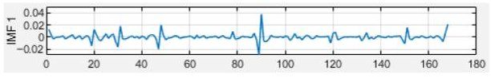

(a)

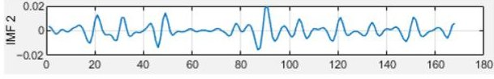

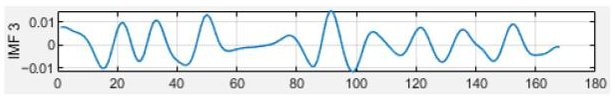

(b)

(c)

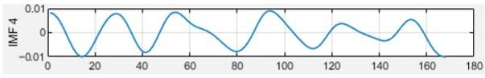

(d)

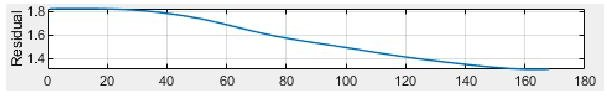

(e)

Figure 3. CEEMDAN decomposition example for cell B0005. (a) IMF1. (b) IMF2. (c) IMF3. (d) IMF4. (e) Residual.

## 3.2. Model Training

After CEEMDAN decomposition, the original capacity sequence is separated into two independent components, namely, the degradation trend D and the regeneration-related variation R, which are fed into the TCN and GPR, respectively, for training and prediction. We first employ a temporal convolutional network (TCN) to forecast the trend-degradation component $ D_{k} $ . The TCN is a sequence modeling approach built upon one-dimensional causal convolutions. Causal convolution ensures that the prediction at the current time depends only on present and past information, while dilated convolution enlarges the effective receptive field, thereby capturing degradation dependencies over a longer time span with relatively few layers. Let the kernel size be s and the dilation factor be d. Then the output of the dilated causal convolution at time k in the l-th layer can be expressed as

$$
h _ {k} ^ {(l)} = \sum_ {i = 0} ^ {s - 1} W _ {i} ^ {(l)} h _ {k - d i} ^ {(l - 1)} + b ^ {(l)}.
$$

where $ h_{k}^{(0)}=D_{k}, W_{i}^{(l)} $ denotes the convolutional weight of the l-th layer, and $ b^{(l)} $ denotes the bias term of the l-th layer. To further improve training stability, the TCN in this paper adopts a residual connection structure.

$$
z _ {k} ^ {(l)} = \phi \left(h _ {k} ^ {(l)}\right) + h _ {k} ^ {(l - 1)}.
$$

where $ \phi(\cdot) $ denotes a composite operation consisting of nonlinear activation and normalization. By setting progressively increasing dilation factors across layers (i.e., $ d=1,2,3,\dots $), the network can effectively cover a longer historical range without introducing any future information.

In this paper, a sliding window with a length of 30 is used to construct supervised samples. For any time index k satisfying k $ \geq $ 30, the input vector is defined as

$$
x _ {k} = \left[ D _ {k - 2 9}, D _ {k - 2 8}, \dots , D _ {k} \right] ^ {\top} \in \mathbb {R} ^ {3 0}
$$

and the corresponding single-step forecast label is

$$
y _ {k} = D _ {k + 1}
$$

<!-- PDF_PAGE: 10 -->

Assume that the network contains L dilated causal convolutional layers, each with kernel size s, and let the dilation factor of the l-th layer be

$$
d _ {l} = l, \quad l = 1, 2, \dots , L
$$

Then, under linearly increasing dilation factors, the receptive-field length of the TCN can be written as

$$
R F = 1 + (s - 1) \sum_ {l = 1} ^ {L} d _ {l} = 1 + (s - 1) \sum_ {l = 1} ^ {L} l = 1 + (s - 1) \frac {L (L + 1)}{2}
$$

To obtain interval information for the trend component, the TCN is trained in a quantile-regression manner, as illustrated in Figure 4. Given the quantile set $ T=\{0.1,0.5,0.9\} $ , the TCN outputs the next-step trend prediction under different quantiles.

$$
\hat {D} _ {k + 1} (\tau) = f _ {\mathrm {T C N}} \left(x _ {k}; \tau\right), \quad \tau \in T.
$$

In this paper, the output corresponding to the median quantile $ \tau=0. 5 $ is used as the point prediction, while the outputs corresponding to $ \tau=0. 1 $ and $ \tau=0. 9 $ are used to construct the prediction interval of the trend component.

$$
\hat {D} _ {k + 1} ^ {\tau = 0. 1} = \hat {D} _ {k + 1} (\tau = 0. 1).
$$

$$
\hat {D} _ {k + 1} ^ {\tau = 0. 9} = \hat {D} _ {k + 1} (\tau = 0. 9).
$$

Quantile regression is optimized using the pinball loss. For an arbitrary quantile $ \tau $ the loss is defined as

$$
p _ {\tau} (u) = u \left(\tau - \mathbb {I} (u < 0)\right).
$$

$$
u = y _ {k} - \hat {D} _ {k + 1} (\tau).
$$

The training loss function for the TCN is

$$
\mathcal {L} _ {\mathrm {T C N}} = \frac {1}{| K |} \sum_ {k \in K} \sum_ {\tau \in \{0. 1, 0. 5, 0. 9 \}} \rho_ {\tau} \left(D _ {k + 1} - \hat {D} _ {k + 1} (\tau)\right)
$$

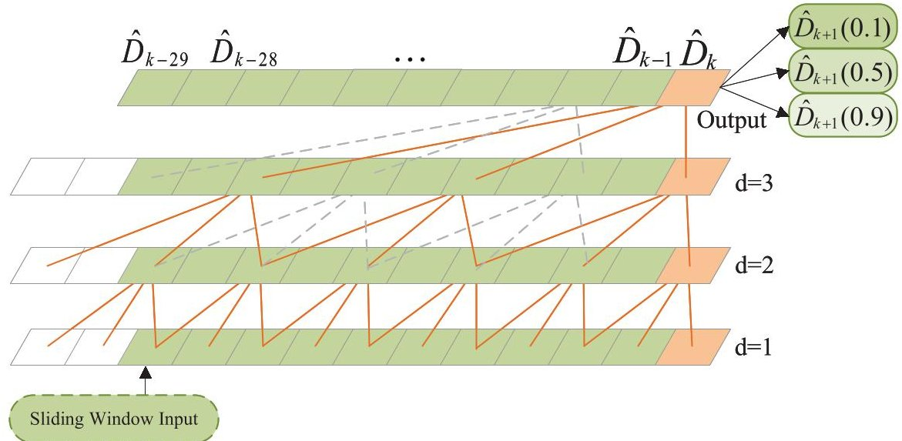

Figure 4. TCN quantile regression structure. These lines represent the cross-layer dependency paths of causal expansion convolution in TCN.

<!-- PDF_PAGE: 11 -->

Consistent with the trend-degradation component, supervised samples for GPR are also constructed using a sliding window. Figure 5 illustrates the GPR architecture. For any cycle index satisfying k $ \geq $ 30, the input vector is defined as

$$
u _ {k} = \left[ R _ {k - 2 9}, R _ {k - 2 8}, \dots , R _ {k} \right] ^ {\top}.
$$

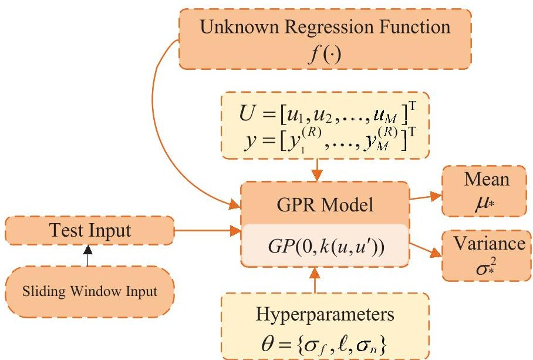

Figure 5. GPR structure diagram.

The corresponding prediction target is the regeneration disturbance value of the next cycle.

$$
y _ {k} ^ {(R)} = R _ {k + 1}.
$$

GPR models the unknown regression function $ f(\cdot) $ as a Gaussian process.

$$
f (u) \sim \mathcal {G P} \left(0, k \left(u, u ^ {\prime}\right)\right).
$$

where $ k ( u, u^{\prime} ) $ is the kernel function, which characterizes the similarity between different input windows. In the experiments, an additive Gaussian-noise observation model is adopted.

$$
y _ {k} ^ {(R)} = f \left(u _ {k}\right) + \varepsilon_ {k}, \quad \varepsilon_ {k} \sim \mathcal {N} \left(0, \sigma_ {n} ^ {2}\right).
$$

where $ \sigma_{n}^{2} $ is the noise variance (with unit $ \mathrm{A h}^{2} $ ). Under this modeling assumption, the randomness of the regeneration disturbance component is characterized both by the function uncertainty induced by the kernel and by the additive observation noise term. Denote the training input matrix by $ U=[u_{1},u_{2},\dots,u_{M}]^{\top} $ and the training target vector by $ y=\left[y_{1}^{(R)},\dots,y_{M}^{(R)}\right]^{\top} $ . For a test input $ u_{*} $ , GPR yields the predictive posterior distribution.

$$
\hat {R} _ {*} \mid u _ {*}, U, y \sim \mathcal {N} \left(\mu_ {*}, \sigma_ {*} ^ {2}\right).
$$

where the predictive mean and variance are given by

$$
\mu_ {*} = k _ {*} ^ {\top} \left(K + \sigma_ {n} ^ {2} I\right) ^ {- 1} y,
$$

$$
\sigma_ {*} ^ {2} = k \left(u _ {*}, u _ {*}\right) - k _ {*} ^ {\top} \left(K + \sigma_ {n} ^ {2} I\right) ^ {- 1} k _ {*}.
$$

where $ K\in \mathbb{R}^{M\times M} $ is the kernel matrix of the training samples with entries $ K_{ij}=k(u_{i},u_{j}) $ and $ k_{*} \in \mathbb{R}^{M} $ is the kernel vector between the test input and the training inputs, whose i-th element is $ (k_{*})_{i}=k(u_{i},u_{*}) $ . Here, I denotes the identity matrix. The kernel function

<!-- PDF_PAGE: 12 -->

determines the smoothness and scale characteristics of the regression function. In this work, the radial basis function (RBF) kernel is adopted.

$$
k \left(u, u ^ {\prime}\right) = \sigma_ {f} ^ {2} \exp \left(- \frac {\| u - u ^ {\prime} \| _ {2} ^ {2}}{2 \ell^ {2}}\right).
$$

where $ \sigma_{f}^{2} $ is the signal variance and $ \ell $ is the length scale. The kernel hyperparameters $ \theta=\{\sigma_{f},\ell,\sigma_{n}\} $ are estimated by maximizing the log marginal likelihood.

$$
\theta^ {*} = \arg \max _ {\theta} \log p (y \mid U, \theta).
$$

After obtaining $ \mu_{k+1} $ and $ \sigma_{k+1}^{2} $ , the posterior mean is directly taken as the prediction $ \hat{R}_{k+1}=\mu_{k+1}. $

## 3.3. Trend-Regeneration Fusion

To improve the robustness of capacity forecasting and reduce the sensitivity of end-of-life localization to local prediction deviations, a multi-evidence fusion strategy is introduced in this work. After CEEMDAN decomposition, the degradation component and the regeneration-related component are first predicted separately by the TCN and GPR, respectively. The component-wise outputs are then reconstructed into capacity predictions. To enhance the robustness of the final decision, three reconstructed next-cycle capacity predictions generated under three different TCN branch settings are treated as independent pieces of evidence and fused by Dempster-Shafer evidence theory. In this work, the three branch settings differ in kernel size, while the remaining training configuration is kept unchanged.

Let the $j$-th evidence source $(j = 1,2,3)$ provide the next-cycle capacity point prediction, denoted by $ \hat{C}_{k+1}^{(j)}, $ together with an interval estimate, denoted by $ \left[ \hat{C}_{k+1}^{(j),L},\hat{C}_{k+1}^{(j),U}\right]. $ The capacity prediction space is partitioned into a set of interval hypotheses $ \Theta=\{\theta_{1},\theta_{2},\dots,\theta_{J}\} $ where $ \theta_{i}=[C_{i}^{L},C_{i}^{U}]$ denotes a candidate capacity interval.

The three evidence sources are denoted by

$$
\hat {C} _ {k + 1} ^ {(1)}, \quad \hat {C} _ {k + 1} ^ {(2)}, \quad \hat {C} _ {k + 1} ^ {(3)},
$$

where each source provides a next-cycle capacity point prediction together with an interval estimate:

$$
\left[ \hat {C} _ {k + 1} ^ {(j), L}, \hat {C} _ {k + 1} ^ {(j), U} \right], \quad j = 1, 2, 3.
$$

In this work, the number of interval hypotheses J is determined by uniformly partitioning the feasible capacity range using a fixed resolution $ \Delta C $:

$$
J = \left\lceil \frac {C _ {\max } - C _ {\min }}{\Delta C} \right\rceil ,
$$

where $ C_{\mathrm{min}} $ and $ C_{\mathrm{max}} $ denote the lower and upper bounds of the admissible capacity range respectively. The i-th interval hypothesis is then defined as

$$
\theta_ {i} = \left[ C _ {\min } + (i - 1) \Delta C, C _ {\min } + i \Delta C \right], \quad i = 1, \dots , J.
$$

<!-- PDF_PAGE: 13 -->

For the j-th evidence source, the interval width is used to characterize predictive uncertainty:

$$
w _ {j} = \hat {C} _ {k + 1} ^ {(j), U} - \hat {C} _ {k + 1} ^ {(j), L}.
$$

A larger interval width indicates a lower confidence level. Therefore, the credibility of the j-th evidence source is mapped as

$$
\alpha_ {j} = \exp (- \lambda w _ {j}),
$$

where $ \lambda $ is a nonnegative scaling coefficient. In the Dempster-Shafer fusion stage, the credibility mapping coefficient was set to $ \lambda=15 $ in all experiments. For each evidence source, the interval hypothesis whose midpoint is closest to $ \hat{C}_{k+1}^{(j)} $ is selected as the focal hypothesis associated with that source. This value was fixed to maintain a consistent uncertainty-to-credibility mapping across different battery cells. The corresponding basic probability assignment (BPA) is defined as

$$
m _ {j} \left(\theta_ {j}\right) = \alpha_ {j},
$$

$$
m _ {j} (\Theta) = 1 - \alpha_ {j}.
$$

Given the BPAs $ m_{a} $ and $ m_{b} $ from two pieces of evidence, the Dempster combination rule is written as

$$
m _ {a \oplus b} (A) = \frac {\sum_ {B \cap C = A} m _ {a} (B) m _ {b} (C)}{1 - \sum_ {B \cap C = \varnothing} m _ {a} (B) m _ {b} (C)}.
$$

The evidence sources are then fused recursively:

$$
m ^ {(1)} = m _ {1},
$$

$$
m ^ {(2)} = m ^ {(1)} \oplus m _ {2},
$$

$$
m ^ {(3)} = m ^ {(2)} \oplus m _ {3}.
$$

After fusion, the most credible interval hypothesis is selected as

$$
\theta^ {*} = \arg \max _ {\theta \in \Theta} m ^ {(3)} (\theta).
$$

If $ \theta^{*} = [c^{L},c^{U}], $ the final fused point estimate is taken as

$$
\hat {C} _ {k + 1} ^ {(\mathrm {D S T})} = \frac {c ^ {L} + c ^ {U}}{2}.
$$

Finally, according to a predefined end-of-life threshold $ C_{\mathrm{EOL}}=\eta C_{0} $ (where $ \eta $ varies across different cells), the cycle index corresponding to the intersection between the predicted capacity trajectory and the threshold is taken as the end-of-life time, and the RUL is then computed accordingly. By combining component-wise modeling with evidence-level fusion, the proposed framework reduces the risk that a single predictor produces unstable extrapolation in locally fluctuating segments, thereby improving the robustness of late-life threshold localization and the interpretability of the final prognostic result.

## 4. Analysis of Experimental Results

This section details the validation of the proposed method on four representative battery cells from the NASA Ames battery degradation dataset and presents comparisons between GPCN and other RUL prediction approaches.

<!-- PDF_PAGE: 14 -->

## 4.1. Experimental Preparation

The prognostics dataset is released by the NASA Ames Prognostics Center of Excellence. The dataset contains capacity trajectories with pronounced local fluctuations. Each lithium-ion cell is charged at a constant current (CC) of 1.5 A to 4.2 V and then charged under constant voltage (CV) until the current decreases to 20 mA. The cell is subsequently discharged at a constant current of 2 A until the terminal voltage drops to 2.7 V, 2.5 V, 2.2 V, and 2.5 V for B0005, B0006, B0007, and B0018, respectively. The tests are repeated under controlled ambient-temperature conditions and terminated when the capacity falls below a predefined end-of-life (EOL) criterion. For RUL prediction, as summarized in Table 2, the preset EOL thresholds are set to 75% and 66% of the initial capacity for B0005 and B0006, respectively, 80% for B0007, and 75% for B0018 [28]. In this study, the experimental validation was conducted on four representative battery cells, namely, B0005, B0006, B0007, and B0018, from the NASA Ames battery degradation dataset [26]. These cells are not four independent datasets, but four benchmark degradation trajectories recorded under different discharge cutoff conditions. Their lengths are 168, 168, 168, and 132 cycles, respectively, and they also differ in initial capacity, cutoff voltage, and adopted EOL criterion. These differences make them suitable for evaluating the robustness of the proposed method across heterogeneous degradation patterns.

The discharge cutoff voltages of B0005, B0006, B0007, and B0018 follow the original NASA Ames test protocol [26]. The EOL ratios adopted in this work are selected according to commonly used benchmark settings reported in prior studies [28], so as to maintain consistency with the existing literature and ensure fair comparison rather than introducing new cell-specific tuning.

Table 2. Lithium-ion battery data.

<table border="1"><tr><td>Battery</td><td>Cycles</td><td>Initial Capacity(Ah)</td><td>EOL Ratio(%)</td><td>EOL Capacity(Ah)</td></tr><tr><td>B0005</td><td>168</td><td>1.86</td><td>75</td><td>1.39</td></tr><tr><td>B0006</td><td>168</td><td>2.04</td><td>66</td><td>1.34</td></tr><tr><td>B0007</td><td>168</td><td>1.89</td><td>80</td><td>1.51</td></tr><tr><td>B0018</td><td>132</td><td>1.85</td><td>75</td><td>1.38</td></tr></table>

For the TCN branch, the input sequence length was set to 30 cycles, and one-step forecasting was adopted. The TCN regressor consisted of three temporal convolutional blocks with channel sizes [16, 16, 16], kernel size 5, dropout rate 0.2, and linearly increasing dilation factors [1, 2, 3]. The model was trained using the Adam optimizer with an initial learning rate of $ 3 \times1 0^{-4} $ . A ReduceLROnPlateau scheduler was employed with a decay factor of 0.5, patience of 15 epochs, and a minimum learning rate of $ 1 \times1 0^{-5} $ . The TCN branch was trained in a quantile-regression manner with the quantile set {0.1,0.5,0.9}, and the pinball loss was used as the objective function. The batch size was set to 8, and the number of training epochs was set to 300.

For the GPR branch, the input features were standardized using StandardScaler. GaussianProcessRegressor was adopted with normalize_y=True and $ \alpha=10^{-6} $ . The kernel was defined as a ConstantKernel multiplied by an RBF kernel, together with a WhiteKernel noise term. The training/test split ratio for both the TCN and GPR was set to 0.8/0.2 while preserving the temporal order of the sequence.

It should be noted that the current evaluation uses full-sequence decomposition prior to sample construction. Therefore, the reported results are intended to validate the effectiveness of the decomposition-guided modeling strategy under a fixed-start evaluation protocol, rather than to emulate a real-time online deployment scenario.

<!-- PDF_PAGE: 15 -->

## 4.2. Overall Forecast Results

The overall model architecture implemented in the experiments is illustrated in Figure 6. To provide an intuitive evaluation of the capacity forecasting performance of the proposed framework, this section presents the results from two perspectives: trend consistency over the full life cycle and fitting performance for local fluctuations. In this study, the ground-truth capacity sequence $ \{C_{k}\} $ is constructed from the scalar discharge capacity extracted at each discharge cycle. The model-predicted capacity sequence $ \{\hat{C}_{k}\} $ is then compared against $ \{C_{k}\} $ , as shown in Algorithm 1 and Figure 7. As can be observed from the figure, the predicted curve can basically follow the overall trend in which the capacity gradually decays as the cycle number increases, and it maintains the same direction of variation as the true capacity over most cycle intervals. It should be noted that the true capacity sequence exhibits a certain degree of non-monotonic fluctuations, which is related to the capacity regeneration factors commonly observed during battery aging. In these local fluctuation intervals, the predicted curve still tracks the long-term trend as a whole. However, its response to high-frequency, short-term fluctuations may show a certain smoothing behavior, and the deviation may increase at a few locations.

Algorithm 1 GPCN-based capacity forecasting and RUL inference.

Require: Raw capacity trajectory $ \{C_{k}\}_{k=1}^{N} $ , window length $ L $ , EOL threshold ratio $ \eta $

Ensure: Predicted capacity trajectory $ \{\hat{C}_{k}\} $ , predicted EOL cycle $ \hat{k}_{\mathrm{EOL}} $ , and RUL

1: Apply CEEMDAN to $ \{C_{k}\}_{k=1}^{N} $ and obtain IMF components and residual

2: Reconstruct degradation component $ D $ and regeneration component $ R $

3: Generate sliding-window samples for $ D $ and $ R $ with window length $ L $

4: for $ k=L,L+1,\dots,N-1 $ do

5: Construct trend input $ x_{k}=[D_{k-L+1},\dots,D_{k}]^{\top} $

6: Construct regeneration input $ u_{k}=[R_{k-L+1},\dots,R_{k}]^{\top} $

7: Use TCN to obtain trend prediction interval:

$ \hat{D}_{k+1}^{0.1},\hat{D}_{k+1}^{0.5},\hat{D}_{k+1}^{0.9} $

8: Use GPR to obtain regeneration prediction:

$ \hat{R}_{k+1},\sigma_{k+1}^{2} $

9: Reconstruct capacity prediction:

$ \hat{C}_{k+1}=\hat{D}_{k+1}^{0.5}+\hat{R}_{k+1} $

10: Construct multiple evidence sources from reconstructed capacity predictions

11: Compute interval width $ w_{j} $ for each evidence source

12: Map uncertainty to credibility:

$ \alpha_{j}=\exp(-\lambda w_{j}) $

13: Build BPA and perform recursive Dempster–Shafer fusion

14: Obtain fused capacity estimate $ \hat{C}_{k+1}^{(\mathrm{DST})} $

15: end for

16: Set EOL threshold:

$ C_{\mathrm{EOL}}=\eta C_{0} $

17: Find the threshold-crossing point of the fused capacity trajectory

18: Estimate predicted EOL cycle $ \hat{k}_{\mathrm{EOL}} $

19: Compute predicted RUL from the selected prediction starting point

return $ \{\hat{C}_{k}^{(\mathrm{DST})}\},\hat{k}_{\mathrm{EOL}}, $ and RUL

<!-- PDF_PAGE: 16 -->

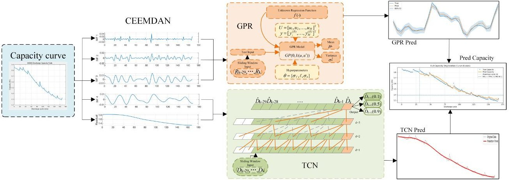

Figure 6. GPCN framework structure.

Beyond qualitative visualization, quantitative metrics are introduced to provide a unified evaluation of capacity forecasting and lifetime inference performance, and the statistical results are summarized in Table 3 for a direct comparison. In Table 3, RMSE (Ah) is used to measure the point-prediction error of capacity over the prediction interval starting from the 31st cycle. The end-of-life (EOL) point is defined by the capacity threshold $ C_{\mathrm{EOL}}=\eta C_{0} $ . By searching for the first position at which the predicted capacity curve falls below this threshold, $ \hat{k}_{\mathrm{EOL}} $ is obtained. In the experiments, the 31st cycle is used as a unified starting point to compute RUL, and $ \Delta k $ and $ \Delta RUL $ are reported to reflect the deviation of lifetime inference. With Table 3, the prediction accuracy and the stability of lifetime estimation for different cells can be compared more clearly under the same evaluation protocol.

Capacity regeneration is a common phenomenon in lithium-ion battery degradation, where temporary local recovery may appear during the overall downward aging trajectory. Such behavior can easily mislead direct end-to-end predictors, especially in long-horizon extrapolation, because short-term recovery may be incorrectly interpreted as a change in the global degradation tendency. In the proposed framework, CEEMDAN is used to separate the slowly varying degradation component from the fluctuation component so that the TCN can focus on learning the dominant long-term evolution pattern, while GPR models local stochastic deviations and regeneration-related perturbations. This decomposition-guided cooperative modeling strategy reduces the adverse influence of regeneration on threshold-crossing estimation and leads to a smoother and more stable capacity trajectory near the end-of-life region.

Compared with the other cells, B0018 shows a relatively larger EOL deviation. This can be partly attributed to the fact that B0018 has a shorter effective lifetime and a smaller margin between the prediction starting cycle and the EOL threshold-crossing point. The advantage of the proposed framework becomes more evident when the remaining margin to the EOL threshold is small and local regeneration is pronounced. Under such conditions, even a slight slope mismatch may cause noticeable threshold-crossing deviation for direct predictors, whereas the decomposition-guided strategy helps preserve the global fading tendency and suppress local disturbance propagation. Under such conditions, even relatively small local deviations in the predicted trajectory may be amplified into a larger $ \Delta k $ near the threshold region. In addition, the degradation path of B0018 appears to be more sensitive to local fluctuation behavior, which further increases the difficulty of stable threshold localization.

<!-- PDF_PAGE: 17 -->

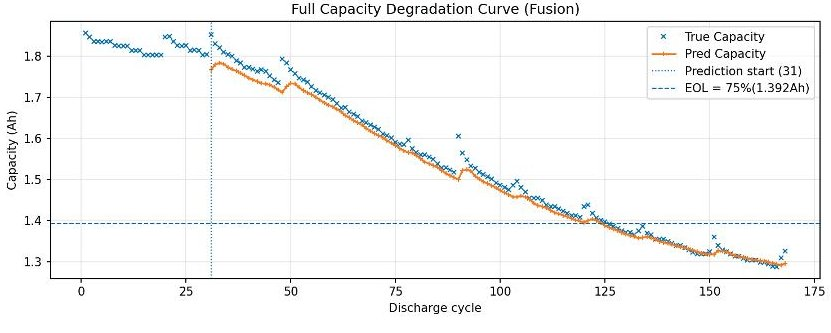

(a)

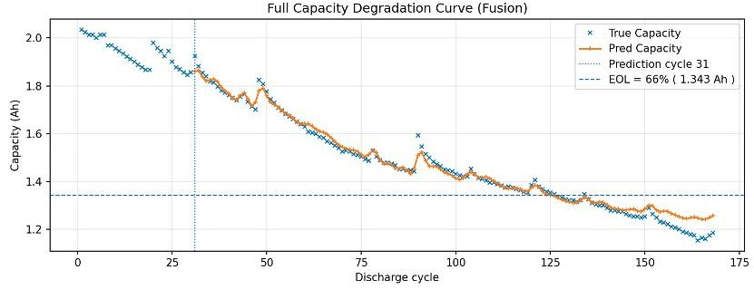

(b)

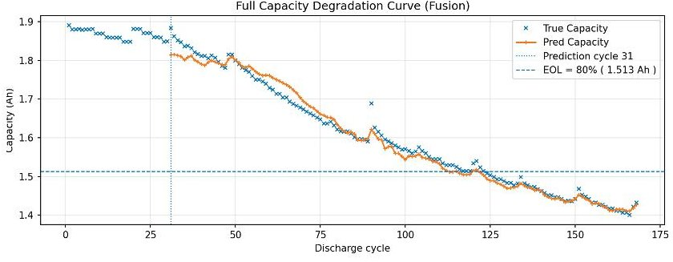

(c)

(d)

Figure 7. Lithium-ion battery capacity prediction curves. (a) B0005. (b) B0006. (c) B0007. (d) B0018.

Table 3. Battery prediction metrics.

<table border="1"><tr><td>Battery</td><td>True $k_{\mathrm{EOL}}$(Cycle)</td><td>Pred. $\hat{k}_{\mathrm{EOL}}$(Cycle)</td><td>$\Delta k$(Cycle)</td><td>True RUL</td><td>Pred RUL</td><td>$\Delta$RUL</td><td>RMSE(Ah)</td></tr><tr><td>B0005</td><td>125.80</td><td>127.31</td><td>1.51</td><td>94.80</td><td>96.31</td><td>1.51</td><td>0.0306</td></tr><tr><td>B0006</td><td>126.39</td><td>128.68</td><td>2.29</td><td>95.39</td><td>97.68</td><td>2.29</td><td>0.0398</td></tr><tr><td>B0007</td><td>123.13</td><td>124.30</td><td>1.17</td><td>92.13</td><td>93.30</td><td>1.17</td><td>0.0445</td></tr><tr><td>B0018</td><td>98.55</td><td>104.08</td><td>5.53</td><td>67.55</td><td>73.08</td><td>5.53</td><td>0.0257</td></tr></table>

The EOL cycle is estimated by interpolation around the threshold-crossing region; therefore, fractional values may appear in the reported true and predicted EOL cycle indices. In this study, $ \Delta k $ and $ \Delta $ RUL denote the absolute deviations between predicted and reference values. $ k_{\mathrm{EOL}} $ and $ \hat{k}_{\mathrm{EOL}} $ denote the cycle index at end of life (EOL). The EOL cycle deviation is defined as $ \Delta k=\left| \hat{k}_{\mathrm{EOL}}-k_{\mathrm{EOL}} \right| $ . RMSE denotes the point-prediction error of capacity. The window length is L=30, and the forecasting step is H=1.

## 4.3. Analysis of Ablation Experiment Results

To clarify the contribution of each module to capacity forecasting and RUL inference, ablation experiments were conducted. The ablations were performed while keeping the data split, window length L=30, forecasting step H=1, and prediction starting cycle (the 31st cycle) unchanged. The results are reported in Table 4. All ablation variants were trained with the same number of epochs, and lifetime prediction was conducted using the same end-of-life threshold $ C_{\mathrm{EOL}}=\eta C_{0} $ . The evaluation metrics include the capacity prediction error (RMSE) and the EOL cycle deviation $ \Delta k $ . By progressively removing or replacing key components, the practical effect of each module on different battery cells can be assessed more objectively. For a more intuitive comparison, the ablation results are further summarized in Figure 8.

<!-- PDF_PAGE: 18 -->

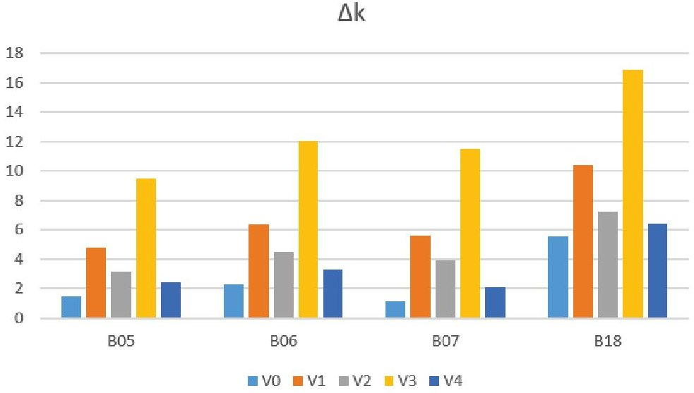

(a)

RMSE

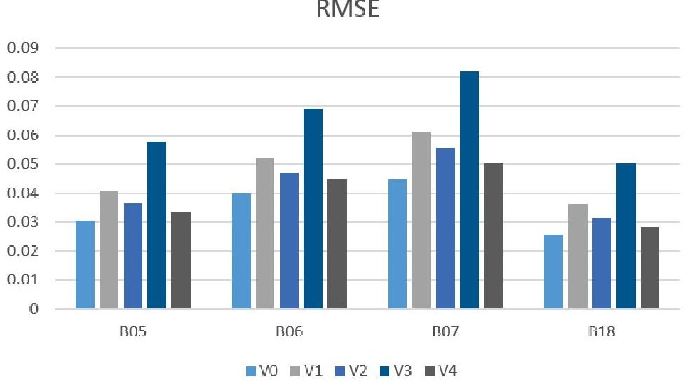

(b)

Figure 8. Ablation comparison. (a) $ \Delta k $ comparison. (b) RMSE comparison.

By analyzing the ablation results, it can be observed that the complete variant V0 maintains relatively low RMSE and small $ \Delta k $ across the four cells, indicating that the proposed framework achieves a balanced performance in terms of capacity fitting accuracy and the stability of threshold-crossing localization. The ablation study also shows that, once a key module is removed, RMSE and $ \Delta k $ often increase simultaneously, suggesting that each component contributes to the final lifetime inference. In particular, for variants that retain only local fluctuation modeling or weaken the trend extrapolation capability, the RMSE typically rises markedly (V3), implying that without effective long-term trend modeling, the overall capacity fading pattern is difficult to extrapolate stably and errors tend to accumulate over long prediction horizons. Meanwhile, changes in $ \Delta k $ are often more sensitive than those in RMSE. Even when the increase in point-wise capacity prediction error is limited, small deviations near the threshold can still be amplified into a significant shift in the estimated EOL cycle. This phenomenon indicates that lifetime inference essentially relies on accurate localization of the threshold-crossing point, which is highly sensitive to local fitting quality and curve curvature in the vicinity of the threshold. Therefore, decomposition strategies, component-wise modeling, and appropriate fusion are required to reduce such errors. In addition, the error levels differ across cells. B0007 exhibits relatively higher capacity prediction error, whereas B0018 shows a more pronounced deviation in EOL localization.

<!-- PDF_PAGE: 19 -->

From a functional perspective, the performance gain of the proposed framework does not come from a single module alone, but from the cooperation of decomposition, component-wise prediction, and evidence fusion. CEEMDAN improves the structural separability of the capacity signal by decoupling long-term degradation from short-term fluctuations. TCN strengthens long-range trend extrapolation and helps preserve the global fading tendency. GPR provides flexible compensation for local regeneration-related deviations while retaining uncertainty awareness. Dempster-Shafer fusion further improves the robustness of threshold-crossing localization by integrating multiple pieces of predictive evidence. Therefore, the observed improvement in both RMSE and $ \Delta k $ is the result of coordinated multi-module design rather than isolated local optimization.

Table 4. Results of the ablation study.

<table border="1"><tr><td rowspan="2">Variant</td><td colspan="2">B05</td><td colspan="2">B06</td><td colspan="2">B07</td><td colspan="2">B18</td></tr><tr><td>RMSE</td><td>$\Delta k$</td><td>RMSE</td><td>$\Delta k$</td><td>RMSE</td><td>$\Delta k$</td><td>RMSE</td><td>$\Delta k$</td></tr><tr><td>V0</td><td>0.0306</td><td>1.51</td><td>0.0398</td><td>2.29</td><td>0.0445</td><td>1.17</td><td>0.0257</td><td>5.53</td></tr><tr><td>V1</td><td>0.0410</td><td>4.80</td><td>0.0520</td><td>6.37</td><td>0.0611</td><td>5.61</td><td>0.0361</td><td>10.40</td></tr><tr><td>V2</td><td>0.0365</td><td>3.20</td><td>0.0470</td><td>4.54</td><td>0.0554</td><td>3.94</td><td>0.0315</td><td>7.21</td></tr><tr><td>V3</td><td>0.0580</td><td>9.50</td><td>0.0690</td><td>12.07</td><td>0.0820</td><td>11.49</td><td>0.0503</td><td>16.83</td></tr><tr><td>V4</td><td>0.0335</td><td>2.40</td><td>0.0445</td><td>3.31</td><td>0.0505</td><td>2.11</td><td>0.0285</td><td>6.44</td></tr></table>

V0 denotes the complete GPCN framework. V1 denotes the GPCN framework using VMD decomposition. V2 denotes the variant that predicts only the trend component and does not predict the regeneration component. V3 denotes the variant that predicts only the regeneration component, while replacing the trend component with a simple linear model. V4 denotes the variant that retains the trend (TCN) and regeneration (GPR) modules but does not use Dempster-Shafer fusion.

## 4.4. Analysis of Comparative Experimental Results

This section presents comparative experiments conducted to evaluate the proposed GPCN model in terms of capacity forecasting and RUL prediction against representative baselines. As shown by the results reported in Table 5, the proposed method is compared not only with representative forecasting baselines, including Informer [29], 1D-CNN [30], LSTM [31], and DLinear [32], but also with simple fusion baselines, including mean fusion. The proposed method achieves lower RMSE on B0005, B0006, and B0007 while simultaneously maintaining a smaller $ \Delta k $ . For a more intuitive illustration, additional visual comparisons are provided in Figures 9 and 10.

The comparative results indicate that the proposed method achieves a more balanced performance in terms of capacity fitting accuracy and the stability of threshold-crossing localization. Baseline models such as Informer and LSTM can attain relatively low pointwise errors on certain cells. However, they are more sensitive to the fading slope and inflection details near the EOL region, which leads to noticeable fluctuations in the stability of end-of-life prediction. The 1D-CNN is effective in capturing local patterns, but its extrapolation capability for long-term degradation trends is relatively limited, making it more prone to systematic bias in the late-life stage. Notably, although DLinear performs trend-residual decomposition followed by linear extrapolation and therefore does not yield the worst RMSE on B0006, its characterization of the EOL position is clearly insufficient, manifested by a larger $ \Delta k $ . This suggests that relying solely on linear decomposition and linear mapping is inadequate for stably reflecting the nonlinear degradation process in the late-life stage. In addition, Informer exhibits an adaptation advantage under certain operating conditions on B0018, where its RMSE can be locally better. Nevertheless, its cross-cell generalization remains imbalanced. Overall, the baseline methods tend to excel in either point-wise error or EOL localization, but it is difficult for them to achieve both simultaneously. In contrast, the proposed approach is more coordinated with respect to

<!-- PDF_PAGE: 20 -->

these two metrics, improving inference stability near the end-of-life point while maintaining competitive prediction accuracy. In practical applications, this advantage is particularly relevant for late-life prediction scenarios, where accurate threshold localization is often more critical than merely reducing point-wise fitting error.

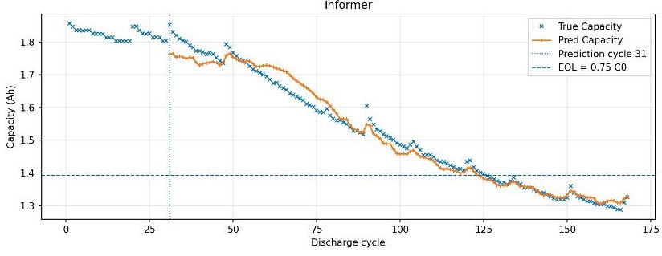

(a)

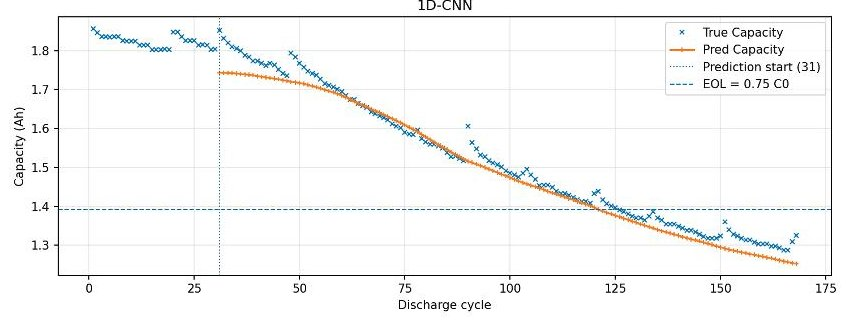

(b)

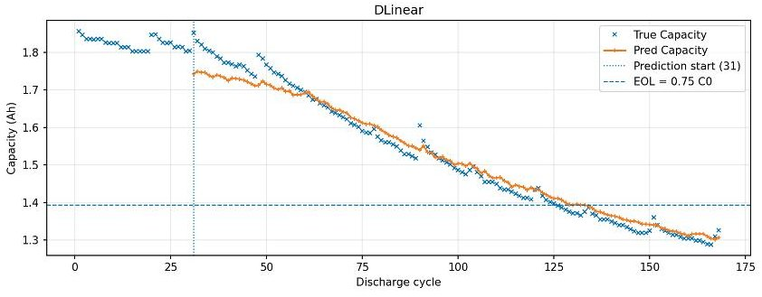

(c)

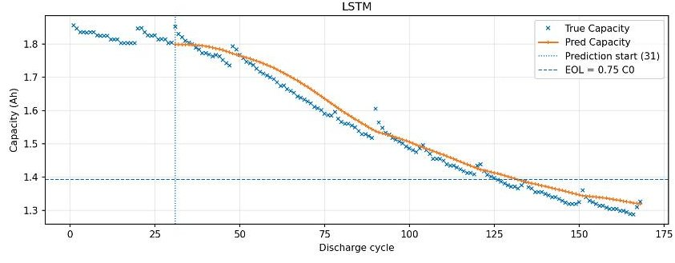

(d)

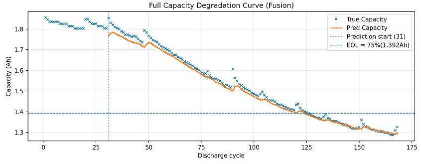

(e)

Figure 9. B05 prediction curve comparisons. (a) Informer. (b) 1D-CNN. (c) DLinear. (d) LSTM. (e) GPCN.

As shown in Table 6, among the simple fusion baselines, mean fusion provides a straightforward averaging effect but is still sensitive to outlying branch predictions. Median fusion improves robustness to local prediction bias, yet it does not make use of uncertainty information. Inverse-width-weighted fusion introduces confidence-aware aggregation, but it still performs deterministic averaging at the point-estimate level. In contrast, the proposed Dempster-Shafer fusion operates at the evidence level by jointly considering interval uncertainty and inter-source consistency, which leads to more stable thresholdcrossing localization in the late-life region.

Because the current validation involves only a limited number of benchmark cells, the present study mainly reports deterministic evaluation metrics rather than formal statistical significance tests. More systematic repeated-run analysis with confidence intervals or statistical comparison under broader datasets will be included in future work.

<!-- PDF_PAGE: 21 -->

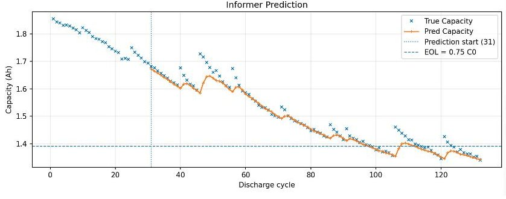

(a)

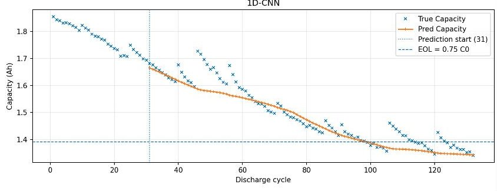

(b)

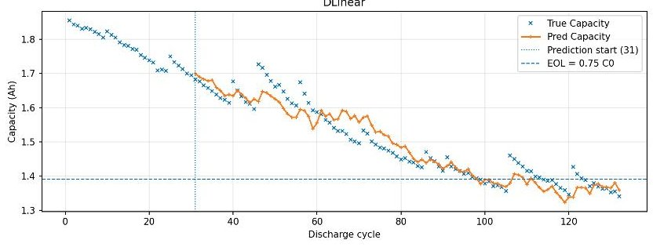

(c)

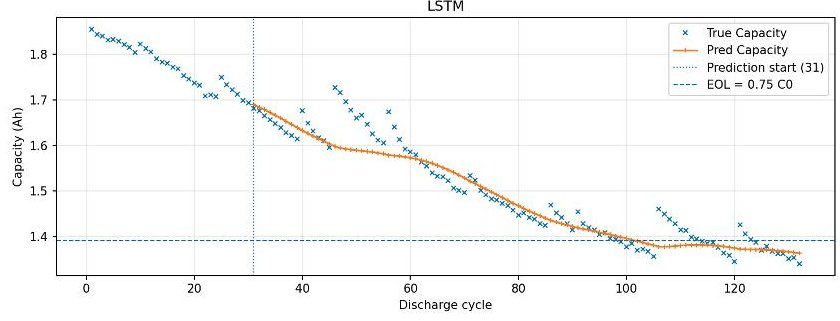

(d)

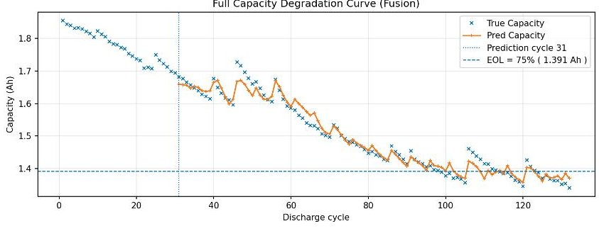

(e)

Figure 10. B18 prediction curve comparisons. (a) Informer. (b) 1D-CNN. (c) DLinear. (d) LSTM. (e) GPCN.

Table 5. Comparison of experimental results.

<table border="1"><tr><td rowspan="2">Model</td><td colspan="2">B05</td><td colspan="2">B06</td><td colspan="2">B07</td><td colspan="2">B18</td></tr><tr><td>RMSE</td><td>$\Delta k$</td><td>RMSE</td><td>$\Delta k$</td><td>RMSE</td><td>$\Delta k$</td><td>RMSE</td><td>$\Delta k$</td></tr><tr><td>Informer</td><td>0.0336</td><td>2.70</td><td>0.0429</td><td>3.67</td><td>0.0485</td><td>3.11</td><td>0.0243</td><td>4.41</td></tr><tr><td>1D-CNN</td><td>0.0362</td><td>3.24</td><td>0.0460</td><td>4.31</td><td>0.0528</td><td>3.68</td><td>0.0308</td><td>7.94</td></tr><tr><td>DLinear</td><td>0.0408</td><td>5.08</td><td>0.0447</td><td>9.87</td><td>0.0598</td><td>6.30</td><td>0.0362</td><td>10.85</td></tr><tr><td>LSTM</td><td>0.0387</td><td>3.91</td><td>0.0495</td><td>5.18</td><td>0.0565</td><td>4.52</td><td>0.0335</td><td>9.34</td></tr><tr><td>Proposed</td><td>0.0306</td><td>1.51</td><td>0.0398</td><td>2.29</td><td>0.0445</td><td>1.17</td><td>0.0257</td><td>5.53</td></tr></table>

Table 6. Comparison with simple fusion baselines.

<table border="1"><tr><td></td><td colspan="2">B05</td><td colspan="2">B06</td><td colspan="2">B07</td><td colspan="2">B18</td></tr><tr><td>Fusion Strategy</td><td>RMSE</td><td>$\Delta k$</td><td>RMSE</td><td>$\Delta k$</td><td>RMSE</td><td>$\Delta k$</td><td>RMSE</td><td>$\Delta k$</td></tr><tr><td>Mean fusion</td><td>0.0318</td><td>1.96</td><td>0.0412</td><td>2.87</td><td>0.0461</td><td>1.74</td><td>0.0269</td><td>6.21</td></tr><tr><td>Median fusion</td><td>0.0314</td><td>1.82</td><td>0.0408</td><td>2.63</td><td>0.0456</td><td>1.58</td><td>0.0265</td><td>5.97</td></tr><tr><td>Inverse-width weighting</td><td>0.0310</td><td>1.67</td><td>0.0403</td><td>2.46</td><td>0.0450</td><td>1.39</td><td>0.0261</td><td>5.71</td></tr><tr><td>Proposed D-S fusion</td><td>0.0306</td><td>1.51</td><td>0.0398</td><td>2.29</td><td>0.0445</td><td>1.17</td><td>0.0257</td><td>5.53</td></tr></table>

<!-- PDF_PAGE: 22 -->

## 4.5. Single-Step and Multi-Step Forecasting Comparison

To evaluate the capacity extrapolation capability under different forecasting horizons, this section presents a multi-step comparison conducted with varying step sizes. As reported in Table 7, the RMSE results show that, as the forecasting step increases from 1-step to 3-step and further to 7-step, the prediction errors of all cells exhibit a monotonic increasing trend. This indicates that, with a longer forecasting horizon, extrapolating capacity fade becomes more challenging, and the model error correspondingly increases. From the cellwise perspective, B05 achieves the lowest RMSE under all three step settings, suggesting that its capacity evolution is relatively smooth and that the model adapts well to short- and medium-term forecasting on this cell. B18 shows an overall stable performance. In contrast, B06 and B07 yield higher RMSE values, among which B07 remains the largest across all horizons and shows the most pronounced error increase from 1-step to 7-step. This implies that the capacity trajectory of B07 may contain stronger fluctuations or stage-wise changes, posing greater difficulty for long-horizon prediction. Overall, these results verify the effectiveness of the proposed method under different forecasting steps and further reveal how cross-cell complexity influences the error growth pattern in multi-step capacity forecasting.

Table 7. Comparison of single-step and multi-step results.

<table border="1"><tr><td>Step</td><td>B05(RMSE)</td><td>B06(RMSE)</td><td>B07(RMSE)</td><td>B18(RMSE)</td></tr><tr><td>1-step</td><td>0.0306</td><td>0.0398</td><td>0.0445</td><td>0.0257</td></tr><tr><td>3-step</td><td>0.0352</td><td>0.0496</td><td>0.0553</td><td>0.0384</td></tr><tr><td>7-step</td><td>0.0408</td><td>0.0621</td><td>0.0694</td><td>0.0479</td></tr></table>

## 5. Conclusions

This paper addresses the widely observed degradation-trend behavior in lithium-ion battery capacity trajectories and proposes a hybrid prognostic framework to improve the stability of capacity extrapolation and lifetime threshold localization. The framework first applies CEEMDAN to decompose the capacity sequence into a trend-degradation component and a regeneration-induced disturbance component. On this basis, a TCN is employed to model and forecast the trend component, while GPR is used to compensate the regeneration component and provide an explicit uncertainty characterization. Finally, Dempster-Shafer (D-S) evidence theory is introduced to fuse multi-source predictions, yielding a smoother and more robust capacity forecast curve. Combined with a predefined EOL threshold, the proposed framework enables inference of the end-of-life point and the remaining useful life (RUL).

Experimental results on the NASA Ames battery dataset demonstrate that the proposed method can effectively follow the overall capacity fading trajectory and maintain relatively stable threshold-crossing localization near the EOL region. Ablation and comparative studies further verify the contributions of decomposition, component-wise modeling, and evidence fusion in reducing prediction error and suppressing threshold deviation. Under direct multi-step forecasting settings, the prediction error increases with the forecasting horizon, which is consistent with the fact that capacity extrapolation becomes more challenging as the prediction span grows. Overall, the proposed method achieves a balanced trade-off between point forecasting accuracy and lifetime inference stability, providing an implementable modeling approach for battery life assessment in the presence of capacity regeneration phenomena. A limitation of the present study is that CEEMDAN is performed on the full capacity trajectory before model development, which does not fully match a strictly online prognostic setting. In future work, a causal decomposition-and-prediction pipeline based only on the observed capacity prefix will be developed for more realistic deployment-oriented validation.

<!-- PDF_PAGE: 23 -->

Author Contributions: Conceptualization, L.W. and G.C.; methodology, L.W. and G.C.; software, G.C.; validation, L.W., G.C., Y.G. and C.S.; formal analysis, L.W. and G.C.; investigation, L.W., G.C., Y.G. and C.S.; resources, L.W., G.C. and Y.G.; data curation, G.C.; writing—original draft preparation, G.C.; writing—review and editing, L.W. and G.C.; visualization, L.W. and G.C.; supervision, L.W. All authors have read and agreed to the published version of the manuscript.

Funding: This research received no external funding.

Institutional Review Board Statement: Not applicable.

Informed Consent Statement: Not applicable.

Data Availability Statement: Publicly available datasets were analyzed in this study [26]. The battery aging data are available from the NASA Ames Prognostics Center of Excellence (PCoE) repository (cells B0005, B0006, B0007, and B0018).

Conflicts of Interest: The authors declare no conflicts of interest.

## List of Abbreviations and Symbols

The following abbreviations and symbols are used in this manuscript:

<table border="1"><tr><td>CEEMDAN</td><td>Complete Ensemble Empirical Mode Decomposition with Adaptive Noise</td></tr><tr><td>EEMD</td><td>Ensemble Empirical Mode Decomposition</td></tr><tr><td>EMD</td><td>Empirical Mode Decomposition</td></tr><tr><td>IMF</td><td>Intrinsic Mode Function</td></tr><tr><td>TCN</td><td>Temporal Convolutional Network</td></tr><tr><td>GPR</td><td>Gaussian Process Regression</td></tr><tr><td>DST</td><td>Dempster-Shafer Theory(Evidence Theory)</td></tr><tr><td>BPA</td><td>Basic Probability Assignment</td></tr><tr><td>RUL</td><td>Remaining Useful Life</td></tr><tr><td>EOL</td><td>End of Life</td></tr><tr><td>RMSE</td><td>Root Mean Squared Error</td></tr><tr><td>UQ</td><td>Uncertainty Quantification</td></tr><tr><td>VMD</td><td>Variational Mode Decomposition</td></tr><tr><td>RBF</td><td>Radial Basis Function(kernel)</td></tr><tr><td>CC</td><td>Constant Current</td></tr><tr><td>CV</td><td>Constant Voltage</td></tr></table>

## References

1. Saha, B.; Goebel, K.; Poll, S.; Christophersen, J. Prognostics Methods for Battery Health Monitoring Using a Bayesian Framework. IEEE Trans. Instrum. Meas. 2009, 58, 291-296. [CrossRef]

2. Dong, H.; Jin, X.; Lou, Y.; Wang, C. Lithium-ion battery state of health monitoring and remaining useful life prediction based on support vector regression-particle filter. J. Power Sources 2014, 271, 114-123. [CrossRef]

3. Zhai, Q.; Sun, J.; Wang, H. Remaining useful life prediction of lithium-ion batteries based on indirect feature and bidirectional long and short-term memory network optimized by beluga whale optimization. In Proceedings of the 2024 4th International Conference on Neural Networks, Information and Communication Engineering (NNICE), Guangzhou, China, 19-21 January 2024; pp. 1418-1421.

4. Naseri, F.; Schaltz, E.; Stroe, D.-I.; Gismero, A.; Farjah, E. An Enhanced Equivalent Circuit Model with Real-Time Parameter Identification for Battery State-of-Charge Estimation. IEEE Trans. Ind. Electron. 2022, 69, 3743-3752.

5. Wei, J.; Dong, G.; Chen, Z. Remaining Useful Life Prediction and State of Health Diagnosis for Lithium-Ion Batteries Using Particle Filter and Support Vector Regression. IEEE Trans. Ind. Electron. 2018, 65, 5634-5643.

6. Zhang, H.; Su, Y.; Altaf, F.; Wik, T.; Gros, S. Interpretable Battery Cycle Life Range Prediction Using Early Cell Degradation Data. IEEE Trans. Transp. Electrif. 2023, 9, 2669-2682. [CrossRef]

7. Zhang, J.; Jiang, Y.; Li, X.; Luo, H.; Yin, S.; Kaynak, O. Remaining Useful Life Prediction of Lithium-Ion Battery with Adaptive Noise Estimation and Capacity Regeneration Detection. IEEE/ASME Trans. Mechatron. 2023, 28, 632-643.

<!-- PDF_PAGE: 24 -->

8. Cui, Y.; Chen, Y. Prognostics of Lithium-Ion Batteries Based on Capacity Regeneration Analysis and Long Short-Term Memory Network. IEEE Trans. Instrum. Meas. 2022, 71, 2511613.

9. Wei, Z.; Zou, C.; Leng, F.; Soong, B.H.; Tseng, K.J. Online Model Identification and State-of-Charge Estimate for Lithium-Ion Battery with a Recursive Total Least Squares-Based Observer. IEEE Trans. Ind. Electron. 2018, 65, 1336-1346.

10. Liu, K.; Shang, Y.; Ouyang, Q.; Widanage, W.D. A Data-Driven Approach with Uncertainty Quantification for Predicting Future Capacities and Remaining Useful Life of Lithium-Ion Battery. IEEE Trans. Ind. Electron. 2021, 68, 3170-3180. [CrossRef]

11. Wang, D.; Yang, F.; Tsui, K.-L.; Zhou, Q.; Bae, S.J. Remaining Useful Life Prediction of Lithium-Ion Batteries Based on Spherical Cubature Particle Filter. IEEE Trans. Instrum. Meas. 2016, 65, 128-1291. [CrossRef]

12. Chen, Y.; He, Y.; Li, Z.; Chen, L.; Zhang, C. Remaining Useful Life Prediction and State of Health Diagnosis of Lithium-Ion Battery Based on Second-Order Central Difference Particle Filter. IEEE Access 2020, 8, 37305-37313. [CrossRef]

13. Hu, X.; Jiang, J.; Cao, D.; Egardt, B. Battery Health Prognosis for Electric Vehicles Using Sample Entropy and Sparse Bayesian Predictive Modeling. IEEE Trans. Ind. Electron. 2016, 63, 2645-2656. [CrossRef]

14. Mao, J.; Yin, X.; Chen, R.; Ding, K.; Jiang, L.; Lai, J. An Improved Approach Based on Transformer Network for Remaining Useful Life of Lithium-ion Battery. In Proceedings of the 8th Asia Conference on Power and Electrical Engineering (ACPEE), Tianjin, China, 14-16 April 2023; pp. 664-669.

15. Ren, L.; Dong, J.; Wang, X.; Meng, Z.; Zhao, L.; Deen, M.J. A Data-Driven Auto-CNN-LSTM Prediction Model for Lithium-Ion Battery Remaining Useful Life. IEEE Trans. Ind. Inform. 2021, 17, 3478-3487. [CrossRef]

16. Zraibi, B.; Okar, C.; Chaoui, H.; Mansouri, M. Remaining Useful Life Assessment for Lithium-Ion Batteries Using CNN-LSTM-DNN Hybrid Method. IEEE Trans. Veh. Technol. 2021, 70, 4252-4261. [CrossRef]

17. Zhang, Z.; Song, W.; Li, Q. Dual-Aspect Self-Attention Based on Transformer for Remaining Useful Life Prediction. IEEE Trans. Instrum. Meas. 2022, 71, 2505711. [CrossRef]

18. Li, L.; Li, Y.; Mao, R.; Li, L.; Hua, W.; Zhang, J. Remaining Useful Life Prediction for Lithium-Ion Batteries with a Hybrid Model Based on TCN-GRU-DNN and Dual Attention Mechanism. IEEE Trans. Transp. Electrif. 2023, 9, 4726-4740. [CrossRef]

19. Wang, T.; Ma, Z.; Zou, S. Remaining Useful Life Prediction of Lithium-Ion Batteries: A Temporal and Differential Guided Dual Attention Neural Network. IEEE Trans. Energy Convers. 2024, 39, 757-771. [CrossRef]

20. Zheng, D.; Man, S.; Ning, Y. Remaining Useful Life Prediction of Lithium-Ion Batteries Based on CEEMDAN-Bi-LSTM Hybrid Model. In Proceedings of the 2024 Second International Conference on Cyber-Energy Systems and Intelligent Energy (ICCSIE), Shenyang, China, 17-19 May 2024; pp. 1-6.

21. Zhu, M.; Ouyang, Q.; Wan, Y.; Wang, Z. Remaining Useful Life Prediction of Lithium-Ion Batteries: A Hybrid Approach of Grey-Markov Chain Model and Improved Gaussian Process. IEEE J. Emerg. Sel. Top. Power Electron. 2023, 11, 143-153. [CrossRef]

22. Mouncef, E.; Mostafa, B.; Naoufl, E. Online Parameter Estimation of a Lithium-Ion Battery based on Sunflower Optimization Algorithm. In Proceedings of the 2020 2nd Global Power, Energy and Communication Conference (GPECOM), Izmir, Turkey, 20-23 October 2020; pp. 53-58.

23. Torres, M.E.; Colominas, M.A.; Schlotthauer, G.; Flandrin, P. A Complete Ensemble Empirical Mode Decomposition with Adaptive Noise. In Proceedings of the IEEE International Conference on Acoustics, Speech and Signal Processing (ICASSP), Prague, Czech Republic, 22-27 May 2011; pp. 4144-4147.

24. Liu, Y.; Dong, H.; Wang, X.; Han, S. Time Series Prediction Based on Temporal Convolutional Network. In Proceedings of the IEEE/ACIS 18th International Conference on Computer and Information Science (ICIS), Beijing, China, 17-19 June 2019.

25. Zhou, D.; Li, Z. State of Health Monitoring and Remaining Useful Life Prediction of Lithium-Ion Batteries Based on Temporal Convolutional Network. IEEE Access 2020, 8, 53307-53320. [CrossRef]

26. Saha, B.; Goebel, K. Battery Data Set; NASA Prognostics Data Repository, NASA Ames Research Center: Moffett Field, CA, USA, 2007. Available online: https://www.nasa.gov/intelligent-systems-division/discovery-and-systems-health/pcoe/pcoe-data-set-repository/ (accessed on 1 February 2026).

27. Denoeux, T. A Neural Network Classifier Based on Dempster-Shafer Theory. IEEE Trans. Syst. Man Cybern.-Part A Syst. Humans 2020, 30, 131-150. [CrossRef]

28. Bao, Z.; Luo, T.; Gao, M.; He, Z.; Gao, K.; Nie, J. A Lightweight and Term-Arbitrary Memory Network for Remaining Useful Life Prediction of Li-Ion Battery. IEEE Trans. Instrum. Meas. 2025, 74, 2523713. [CrossRef]

29. Zhou, H.; Zhang, S.; Peng, J.; Zhang, S.; Li, J.; Xiong, H.; Zhang, W. Informer: Beyond Efficient Transformer for Long Sequence Time-Series Forecasting. Proc. AAAI Conf. Artif. Intell. (AAAI) 2021, 35, 11106-11115. [CrossRef]

30. Kiranyaz, M.; Ince, T.; Gabbouj, M. Real-Time Patient-Specific ECG Classification by 1-D Convolutional Neural Networks. IEEE Trans. Biomed. Eng. 2016, 63, 664-675. [CrossRef]

<!-- PDF_PAGE: 25 -->

31. Cao, M.; Zhang, Y.; Hui, J.; Liu, Y. An LSTM-Based Approach For Capacity Estimation on Lithium-ion Battery. In Proceedings of the 33rd Chinese Control and Decision Conference (CCDC), Kunming, China, 22-24 May 2021; pp. 494-499.

32. Zeng, A.; Chen, M.; Zhang, L.; Xu, Q. Are Transformers Effective for Time Series Forecasting? Proc. AAAI Conf. Artif. Intell. (AAAI) 2023, 37, 11121-11128. [CrossRef]

Disclaimer/Publisher's Note: The statements, opinions and data contained in all publications are solely those of the individual author(s) and contributor(s) and not of MDPI and/or the editor(s). MDPI and/or the editor(s) disclaim responsibility for any injury to people or property resulting from any ideas, methods, instructions or products referred to in the content.