<!-- PDF_PAGE: 1 -->

# A Bayesian Prognosis Framework for Rolling Bearings Based on Total Harmonic Distortion Health Indicator and Nonlinear Wiener Process

Afshin Nagheli, Mehrdad Poursina, and Hossein Karimpour Department of Mechanical Engineering, University of Isfahan, 81746-73441, Isfahan, Iran

(Received 31 December 2025; Revised 26 January 2026; Accepted 09 February 2026; Published online 10 February 2026)

Abstract: Rolling bearings are one of the key components of rotating machinery. Accurate prediction of the remaining useful life (RUL) of bearings can reduce maintenance costs, increase the reliability of the mechanical system, and prevent catastrophic accidents. Accurate and reliable estimation of bearing RUL requires a suitable health indicator (HI). Therefore, a novel HI called the total harmonic distortion (THD) is constructed using advanced frequency domain analysis to accurately reflect the bearing's health status. The results confirm that the THD health indicator has excellent monotonicity, robustness, and trendability. In this work, a Wiener process with different drifts is used to predict the RUL. Furthermore, the parameters of the Wiener model are estimated online using Bayesian theory. The model is then validated using an accelerated experimental test bench. The results demonstrate that the Wiener process combined with the power law model achieves higher accuracy and stability than other Wiener models.

Keywords: first prediction time; remaining useful life; rolling bearing; total harmonic distortion; Wiener process

## I. INTRODUCTION

The era of Industry 4.0 has revolutionized manufacturing [1,2]. In the new industrial era, the complexity of advanced rotating equipment such as aircraft engines and wind turbines has increased user demands for safety and reliable operation of the equipment [3]. As one of the most important components of rotating machinery, the performance of bearings directly affects the health of the entire equipment [4]. In order to ensure that mechanical equipment can successfully perform various tasks with low accident rates and maintenance costs, researchers in developed countries began to investigate maintenance and troubleshooting technologies from the 1960s. At the end of the 20th century, prognostics and health management (PHM) technologies emerged [5]. Maintenance decision-making strategies for machinery have evolved from initially using passive reactive maintenance to proactive predictive maintenance, which has garnered significant attention. In reactive maintenance, equipment or components are replaced after complete failure [6]. While this strategy can maximize equipment lifespan and is easy to implement, it still carries the risk of sudden, unplanned failures that can damage equipment, disrupt production, and even cause personal injury.

Predictive maintenance represents an advancement in the field that proactively predicts the future health status of machinery based on current and historical condition monitoring (CM) data [7]. Using prognostic information such as remaining useful life (RUL) and probability of failure, engineers can schedule cost-effective maintenance programs before failure occurs [8]. Consequently, predictive maintenance provides longer lead times for maintenance and replacement strategies [9]. One of the critical tasks of

predictive maintenance is RUL prediction [10,11]. Notably, for industrial applications, developing a methodology for RUL prediction is of essential necessity for reliable schedule and decision-making.

In existing studies, researchers have divided RUL prediction methods into four categories based on their underlying techniques: physical model-based approaches [12-14], artificial intelligence approaches [15-17], statistical model-based approaches [18-20], and hybrid approaches [21-23]. Physical model-based approaches describe the degradation processes of machinery using mathematical models based on failure mechanisms or first principles of damage [14]. These models use physical parameters such as stress level, damage extent, and material properties [24]. For example, Oppenheimer et al. [25] used the Forman crack growth law [26] to predict the RUL of cracked router shafts. Also, Sankavaram et al. [27] developed a hybrid detection and prediction framework and used it to predict electronic systems. The main feature of physical model-based approaches is high interpretability. However, it is very difficult to create accurate physical models for complex mechanical systems and requires simplifying assumptions. Therefore, research on physical models and hybrid models is relatively limited.

Artificial intelligence approaches attempt to learn failure patterns of machinery from existing observations rather than building physical models using artificial intelligence techniques. These models are able to make predictions in complex mechanical systems whose failure processes are difficult to model with physical models. With the advancement of the Industrial Internet of Things and big data technology, artificial intelligence methods have gradually become mainstream and have been widely reported [28,29]. For example, Zemouri et al. [30,31] proposed a recurrent radial basis function network and used it to predict machine RUL. Also, Kudelina and Raja [32] proposed a NeuroFuzzy framework for fault prediction, specifically focusing

<!-- PDF_PAGE: 2 -->

on bearing faults. However, most artificial intelligence approaches are highly dependent on the robustness and trendability of the HI. On the other hand, these approaches require a lot of data and are often not generalizable to a new system.

Statistical model-based forecasting approaches, also called empirical model-based approaches, estimate the RUL of machines by creating statistical models based on empirical knowledge and usually present the RUL forecast result as a conditional probability density function (PDF) dependent on the observations [33]. In these approaches, RUL prediction models are created without relying on principles or physics, by fitting existing observations to random coefficient models or stochastic process models under a probabilistic approach [34]. The use of stochastic process models, especially the Wiener process, provides the ability to quantify the uncertainty of RUL prediction results with good interpretability and computational capability [18]. Wiener process models are usually presented with a drift term plus a diffusion term that follows Brownian motion. For example, Doksum et al. [35] used a Wiener model to predict RUL for accelerated degradation experiments with variable stress. Also, some researchers [36-38] developed a linear Wiener process model to predict RUL of machinery. The results showed that although the linear model is acceptable in many experiments, in some cases the linear Wiener process is unable to predict the degradation process with high accuracy. Therefore, Wang et al. [39] proposed a degradation model with different drift functions to predict the RUL of bearings, but the change point identification method is affected by outliers. Also, Lin et al. [40] developed a two-stage linear-nonlinear degradation model with measurement errors to predict bearing RUL. It can be concluded from the analysis of the above studies that modeling bearing degradation using the nonlinear Wiener process improves the prediction accuracy.

Modeling and constructing the HI has a significant impact on the predictive ability of the Wiener RUL. Better monotonicity, robustness, and trendability enhance the effective prediction of the RUL. HIs can be classified into two categories based on the construction strategy: physical health indicator (PHI) and virtual health indicator (VHI) [41]. PHIs are extracted using statistical methods or signal processing. For example, root mean square (RMS) is considered an effective tool to indicate the bearing degradation process and is often used to incorporate the Wiener model [40,42,43]. Other HIs have also been used to provide better robustness and trendability. For example, Chang et al. [44] used the entropy as a HI to predict the RUL of bearings. VHIs are constructed by combining multiple PHI or multi-sensor signals. Therefore, they lose physical meaning and only provide a virtual description of the failure process.

From the above studies, it can be seen that the performance of HIs has a great impact on the accuracy of the forecasting model. In other words, choosing an appropriate HI is a prerequisite for accurate forecasting. Choudhury et al. [45] showed that frequency domain methods provide more accurate results compared to time domain methods. Therefore, in order to improve the weaknesses of the above RUL prediction techniques, a new HI in the frequency domain called THD is proposed to reveal the bearing degradation process. The RUL prediction method using the nonlinear Wiener process

is carried out in this research. First, the CM signal is converted to the frequency domain to identify the main harmonic related to the bearing motion. Then, the new HI, THD, is obtained. Then, using a linear function of the mean and variance of the THD curve, First Prediction Time (FPT) is identified, and finally, the RUL prediction is obtained with the help of the nonlinear Wiener process. Compared with the existing advanced methods, the contributions are listed as follows.

- A new HI with monotonicity, robustness, and trendability is designed to reveal the degradation information contained in the raw vibration signal.

- A nonlinear Wiener model is proposed to predict the RUL of the bearing.

- The parameters of the nonlinear Wiener model are estimated online using the Bayesian theory method.

## II. SIGNAL PREPROCESSING

The random signal associated with each bearing is denoted by $ x(\mathrm{n},\mathrm{t}) $ where n indicates the bearing under consideration. For instance, the time-domain random signal of a specific bearing $ \mathrm{N}_{0} $ is represented as $ x(\mathrm{N}_{0},\mathrm{t}) $ . At a given observation time $ \mathrm{T}_{0} $ , the corresponding random variable $ x(\mathrm{n},\mathrm{T}_{0}) $ for each bearing is assumed to be ergodic during the health phase [46]. Accordingly, for any bearing $ \mathrm{N}_{0} $ and any observation moment $ \mathrm{T}_{0} $ within the health phase, Eq. (1) holds:

$$
\begin{array}{l} \bar {x} \left(N _ {0}, t\right) = \lim _ {t \rightarrow \infty} \frac {1}{T} \int_ {\langle T \rangle} x \left(N _ {0}, t\right) \mathrm {d} t \\ = \lim _ {N \rightarrow \infty} \frac {1}{N} \sum_ {\langle N \rangle} x \left(n, T _ {0}\right) \\ = E \left[ x \left(n, T _ {0}\right)\right] \\ \end{array}
$$

The limits N,t $ \rightarrow\infty $ to infinity need not be interpreted in a strict mathematical sense.; rather, indicating are sufficiently large for the Law of Large Numbers (LLN) to apply.

In practice, the real signal $ x(\mathrm{n},\mathrm{t}) $ of a bearing is not directly accessible, and instead, sensors and measuring instruments provide only the observed (measured) signal $ \tilde{x} (\mathrm{n},\mathrm{t}) $

In this signal, in addition to noise and distortion that are superimposed on the original signal, the measurement error also changes the original signal. Therefore, the signal received by the measuring instruments is expressed as Eq. (2).

$$
\tilde {x} (n, t) = x (n, t) + \varepsilon
$$

Therefore, the combined effects of noise, distortion and measurement errors are captured by the error parameter $ \varepsilon $ in Eq. (2). This term is modeled as an independent normally distributed random process with mean zero and variance $ \sigma_{\varepsilon} $ (i.e., $ \varepsilon\sim\mathrm{N}\left(0,\sigma_{\varepsilon}^{2}\right) $).

To enable real-time prediction of the RUL at any given moment, the sensor signal used for CM must be sampled at appropriate time instants. Accordingly, the output signal is available only at a discrete set of times, $ \mathrm{C M}_{0: \mathrm{k}}=\left\{t_{0}, t_{1}, t_{2}, \dots , t_{k}\right\} $ . The signal sampled at time $ t_{i} $ , where the index i representing the i-th sampling interval, is expressed as Eq. (3).

$$
\tilde {x} _ {i} (n, t) = \widetilde {x} (n, t) | t _ {i} < t < t _ {i} + \tau
$$

<!-- PDF_PAGE: 3 -->

where $ \tau_{i} $ denotes the sampling interval at time $ t_{i} $ . In this study, RUL prediction is performed based on frequency domain analysis. To this end, the Fast Fourier Transform (FFT) is applied to the CM signal to obtain its representation in the frequency domain according to Eq. (4):

$$
\tilde {x} _ {i} (n, t) \xrightarrow {F F T} \widetilde {X} _ {i} (n, f)
$$

## A. NOISE CANCELLING

One of the advantages of frequency domain analysis is its ability to substantially suppress noise while preserving the main harmonics of the signal. By examining the spectrum of different samples (for example, see Fig. 1), it can be observed that the noise is approximately white noise, whereas the harmonic components become clearly distinguishable within relatively clean spectral regions.

To remove this noise from the spectrum, a filter with memory can be used according to Eq. (5).

$$
\mathrm {F}: X _ {i} (n, f) = \left\{ \begin{array}{l l} 0; & \widetilde {X} _ {i} (n, f) \leq \mu + \kappa \sigma \\ \widetilde {X} _ {i}; & \widetilde {X} _ {i} (n, f) \geq \mu + \kappa \sigma \end{array} \right.
$$

where $ \mu $ and $ \sigma $ are the mean and variance of the signal, respectively. $ \kappa $ is an adjustable parameter in the analysis and a coefficient and criterion for this process.

## B. INTRODUCING THD INDICATOR

For a periodic signal contaminated with distortion, the THD parameter is defined as Eq. (6).

$$
T H D = \sqrt {a _ {2} ^ {2} + a _ {3} ^ {2} + \cdots} = \sqrt {\sum_ {k \neq 1} a _ {k} ^ {2}}
$$

where $ a_{k} $ is the coefficient of the k-th term in the Fourier expansion of the signal and the missing term $ a_{1} $ denotes the amplitude of the fundamental harmonic component. In the CM signal, there is a periodicity signal due to the rotational motion of the bearings. The harmonic proportional to the rotational motion of the bearings is called the fundamental harmonic. The fundamental harmonic is usually the strongest harmonic in the bearing health phase. In the THD, the fundamental harmonic is removed from the signal because it is present in all bearing CM signals from the beginning of sampling to the end of life. This definition is a step forward and more precise than the RMS-based analysis, which considers all harmonics in same scale.

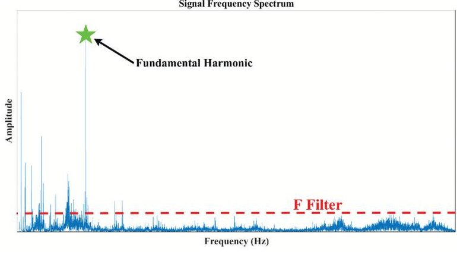

Fig.1. Original signal frequency spectrum containing white noise.

## C. TRAINING PHASE

For the first n samples, the first maxima observed in all samples are identified and used to model the fundamental bearing motion signal. The first n samples are actually the learning phase of the analysis to detect fundamental bearing behavior. In Eq. (7), the bearing fundamental signal is reconstructed:

$$
x ^ {F u n d amental} (n, t) = a _ {1} \exp \left(j \omega_ {1} t\right)
$$

where $ a_{1} $ is the amplitude and $ \omega_{1} $ is the angular frequency of the fundamental harmonic. For example, the original signal of a bearing in the early stages of operation can be seen in Fig. 2. The original signal of the bearing has a lower overall frequency spectrum compared to the measurement signal. This is due to distortion in the measurement signal.

With the fundamental signal $ x^{Fundamental} $ , the training phase is practically complete. Then, to analyze the signal degradation, the fundamental harmonic is removed from the raw signal. Therefore, the degradation signal is defined as Eq. (8).

$$
x _ {i} ^ {F a u l t} (n, t) = x _ {i} (n, t) - x ^ {F u n d a m e n t a l} (n, t)
$$

where $ x_{i}^{\mathrm{Fault}}(n,t) $ denotes the degradation signal for the i-th sample, $ x_{i}(n,t) $ represents the raw signal, and $ x^{\mathrm{Fundamental}}(n,t) $ is the fundamental signal. Subsequently, the degradation signal $ x_{i}^{\mathrm{Fault}}(n,t) $ is then passed through the filter F (detailed in Section II.A) to proceed with the analysis.

## D. HI CONSTRUCTION

Now, using the degradation signal, a health indicator can be constructed. The THD indicator at time $ t_{i} $ is defined as the RMS value of the degradation signal until that time. With this definition, the proposed HI can be expressed as Eq. (9):

$$
T H D _ {i} = R M S \left(x _ {i} ^ {F a u l t} (n, t)\right)
$$

According to Parseval's theorem, the classical THD definition given in Eq. (6) and the RMS value of the residual signal defined in Eq. (9) are theoretically equivalent in terms of signal energy. In this study, the RMS of the residual signal after fundamental component removal, $ \left( \mathrm{x}_{\mathrm{i}}^{\mathrm{Fault}}(\mathrm{n},\mathrm{t}) \right) $ , is adopted as the HI and used consistently throughout the analysis. Using Eq. (9), the HI curve can then be plotted over time, where the residual signal is obtained via FFT-based fundamental removal.

In order to obtain a smoother representation, a moving window average over $ \mathcal{N} $ samples, taken at intervals of $ \mathcal{L} $ , is applied. Consequently, the resulting curve is plotted versus

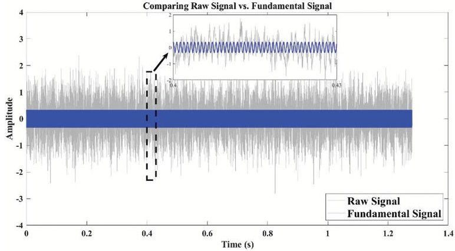

Fig. 2. Signal acceleration response of a bearing sample.

<!-- PDF_PAGE: 4 -->

the sampling number $ t_{\mathcal{L}} $ onwards. The THD curve serves as the primary basis for the RUL prediction analysis in this study. As bearing degradation progresses, the energy of non-fundamental components increases due to surface defects, leading to a monotonic increase in the residual-based HI. To assess the suitability of the constructed HI for RUL prediction, three criteria—Monotonicity [47], Trendability [48], and Robustness [49]—are defined using linear weighting. In this work, the aggregated HM criterion proposed in [49] is adopted.

$$
M o n (X) = \frac {1}{K - 1} \left| N o. o f \frac {d}{d x} > 0 - N o. o f \frac {d}{d x} < 0 \right|
$$

$$
= \frac {K \left(\sum_ {k = 1} ^ {K} x _ {k} t _ {k}\right) - \left(\sum_ {k = 1} ^ {K} x _ {k}\right) \left(\sum_ {k = 1} ^ {K} t _ {k}\right)}{\sqrt {\left[ K \sum_ {k = 1} ^ {K} x _ {k} ^ {2} - \left(\sum_ {k = 1} ^ {K} x _ {k}\right) ^ {2} \right] \left[ K \sum_ {k = 1} ^ {K} t _ {k} ^ {2} - \left(\sum_ {k = 1} ^ {K} t _ {k}\right) ^ {2} \right]}}
$$

$$
R o b (X) = \frac {1}{K} \sum_ {k = 1} ^ {K} \exp \left(- \left| \frac {x _ {k} - x _ {k} ^ {T}}{x _ {k}} \right|\right)
$$

$$
\begin{array}{l} H M (X) = \alpha_ {1} M o n (X) + \alpha_ {2} T r e (X) + \alpha_ {3} R o b (X) \\ \alpha_ {i} > 0, \sum_ {i = 1} ^ {3} \alpha_ {i} = 1 \\ \end{array}
$$

## III. FPT IDENTIFICATION

$$
I F T = a \mu_ {T H D} + b \sigma_ {T H D} ^ {2}
$$

To determine the FPT, an initial fault threshold (IFT) is defined such that the first crossing of the THD curve above this threshold indicates the initial onset of failure. IFT is a function of the mean and variance of the THD curve, and is expressed as a linear function:

where $ \mu_{\mathrm{THD}} $ and $ \sigma_{\mathrm{THD}}^{2} $ are the mean and variance of the THD curve, respectively. The coefficients a and b are empirically determined based on observations from various experiments. Typically, the value of parameter a is close to 1, while parameter b lies within the interval [1, 4]. When the parameter a is set exactly to 1 and the parameter b is set to 3, Eq. (14) reduces to the well-known 3 $ \sigma $ criterion method [50]. As reported in reference [51], although the 3 $ \sigma $ criterion method yields accurate results in many experiment scenarios, it may produce false alarms during the early healthy stage when significant random noise is present. Accordingly, the values of parameters a and b are empirically tuned for different test benches. Based on these selected parameters, FPT is estimated using Eq. (15).

$$
t _ {F P T} = \min \left\{t _ {i} \mid T H D \left(t _ {i}\right) = I F T \right\}
$$

where IFT is the initial fault threshold and $ t_{\mathrm{FPT}} $ is the prediction start time. In other words, the IFT line is an initial alarm indicating that the component has entered a failure stage.

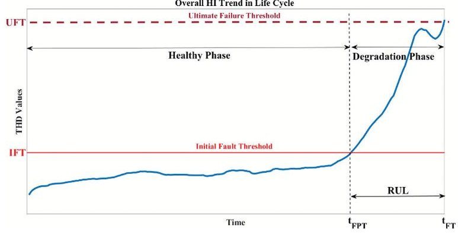

Fig. 3. Overall bearing life cycle trend.

## IV. UFT CONCEPT

An appropriate definition of the IFT for detecting the onset of the degradation phase is discussed in Section III. However, an additional quantitative criterion for bearing failure is required to determine complete bearing failure, i.e., a threshold for the bearing life. This threshold may be derived from physical quantities such as vibration amplitude or acoustic emissions of a component or alternatively estimated through statistical analysis across multiple bearings. In practice, many studies do not emphasize a strict physical definition of this parameter; instead, it is often treated as a degree of freedom in the proposed model, allowing users to assign a suitable value based on the specific application. In this work, the THD value at the end of the bearing life corresponding to the termination of accelerated laboratory tests due to failure—is defined as the ultimate failure threshold (UFT). Accordingly, the bearing failure time is determined using Eq. (16).

$$
t _ {F T} = \min \left\{t _ {i} \mid T H D \left(t _ {i}\right) = U F T \mid U F T > I F T \right\}
$$

where $ t_{\mathrm{FT}} $ is the failure time. It is clear that the condition UFT > IFT must be observed to build the model, and if this condition is not met at the outset, it indicates that the bearing has experimented premature failure. Given the definition of failure time, the bearing life is subsequently defined:

$$
R U L = t _ {F T} - t _ {F P T}
$$

where RUL is the remaining useful life, $ \mathrm{t_{F T}} $ is the failure time, and $ \mathrm{t_{F P T}} $ is the FPT. Symbolically, the concepts of Sections III and IV are shown in Fig. 3.

In general, the bearing life cycle is divided into health and degradation phases. These two phases are separated by the FPT, which is explained in detail in Section III. In the following, the RUL prediction starts at the FPT and stops at the UFT.

## V. DEGRADATION MODELING AND RUL PREDICTION

The proposed method selects the THD as the new HI and models the predicted bearing degradation process through a nonlinear Wiener process, as shown in Eq. (18).

$$
F _ {T} (t) = F _ {T} (0) + \mu t ^ {b} + W (t, \sigma)
$$

where $ \mathrm{F_{T}}(t) $ denotes the status of the bearing at moment t. It should be noted that RUL estimation starts after the FPT is

<!-- PDF_PAGE: 5 -->

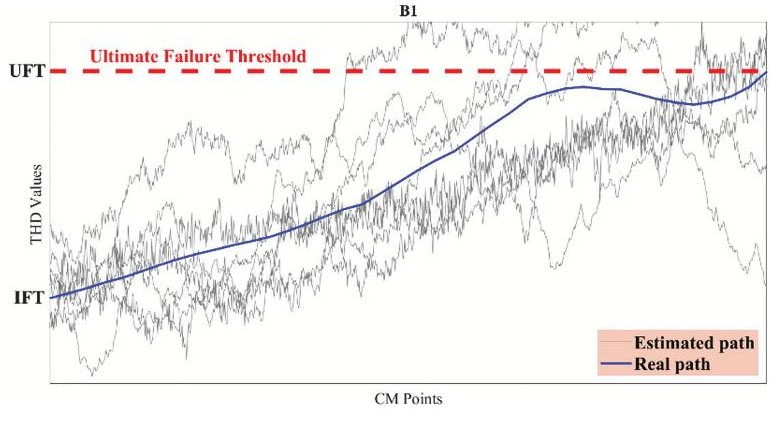

Fig. 4. Estimated degradation paths for bearing B1.

identified. Therefore, $ \mathrm{F_{T}}(0) $ , which represents the degradation status of the bearing at the FPT, is the same as IFT as explained in detail in Section III, $ \mu t^{b} $ denotes the drift term, and $ \mathrm{W}(t,\sigma) $ is the Wiener process. In other words, the random variable behavior is modeled by a Brownian motion (BM) according to Eq. (19).

$$
W (t, \sigma) = \sigma B (t)
$$

where B(t) is the BM and $ \sigma $ is the diffusion coefficient Equivalently, Eq. (19) can be expressed in the form of Eq. (20).

$$
B (t) = \frac {F _ {T} (t) - I F T - \mu t ^ {b}}{\sigma}
$$

For example, by considering the diffusion coefficient $ \sigma=0.01 $ in Eq. (20), the degradation path for bearing 3-3 can be estimated. Fig. 4 shows 8 degradation paths.

Next, Lemma [52] is used to obtain PDF of the RUL.

Lemma: If the degradation function of a system is defined as Eq. (21):

$$
X (t) = X (0) + \int_ {0} ^ {t} \mu (v) d v + \sigma_ {B} B (t)
$$

where B(t) is the standard Brownian motion and $ \sigma_{\mathrm{B}} $ is its diffusion coefficient and $ \int_{0}^{t}\mu(\mathrm{v})\mathrm{d}v $ modeling the drift term governing this motion, the PDF for the first crossing with a given value w is approximated by Eq. (22).

$$
\begin{array}{l} f _ {T} (t) \approx \frac {1}{\sqrt {2 \pi t}} \left(\frac {S _ {B} (t)}{t} + \frac {1}{\sigma_ {B}} (v)\right) e x p \left(- \frac {S _ {B} ^ {2} (t)}{2 t}\right); \\ S _ {B} (t) = \frac {1}{\sigma_ {B}} \left(w - \int_ {0} ^ {t} \mu (v) d v\right) \\ \end{array}
$$

If the degradation function is expressed as Eq. (23).

$$
F _ {T} (t) = I F T + P (t) + \sigma B (t)
$$

Based on Lemma, it is easy to obtain the PDF of the RUL for the degradation function, $ \mathrm{F_{T}}(t) $ , until reaching the UFT value as follows:

Theorem 1: For the degradation process given by Eq. (23), given the actual degradation data at time 0:t, then the PDF corresponding to RUL can be formulated as Eq. (24):

$$
R U L (t | t) \approx \frac {\phi + t P ^ {\prime} (t + t)}{\sqrt {2 \pi t ^ {3} \sigma^ {2}}} e x p \left(- \frac {\phi^ {2}}{2 \sigma^ {2} t}\right)
$$

where in Eq. (24), t is the time remaining until complete failure and t is the present time. In addition:

$$
\phi (t, t, F F T, F _ {T}) \triangleq \Delta F _ {T} (t) - \Delta \mathrm {P} (\mathrm {t}, t)
$$

In Eq. (25), $ \Delta F_{T}(t) $ is the amount of degradation remaining until the UFT at time t;

$$
\Delta F _ {T} (t) \triangleq U F T - F _ {T} (t)
$$

And also $ \Delta \mathrm{P}(t,t) $ is the growth rate of the tension function in the remaining interval;

$$
\Delta P (\mathrm {t}, t) \triangleq P (t + t) - P (t)
$$

Considering Theorem 1, the PDF for each linear or nonlinear degradation modes can be rewritten.

Corollary: If the degradation function $ \mathrm{P(t)}=\mu \mathrm{t}^{\mathrm{b}} $ is nonlinear, then the function $ \phi $ will result in Eq. (28):

$$
\phi \left(\mathrm {t}, t, U F T, F _ {T}\right) = \Delta F _ {T} (t) - \mu \left(\left(t + t\right) ^ {b} - t ^ {b}\right)
$$

And the PDF will be given by Eq. (29):

$$
\begin{array}{l} R U L (t | t) = \frac {\Delta F _ {T} (t) + \mu (t + t) ^ {b - 1} [ t (b - 1) - t ] + \mu t ^ {b}}{\sqrt {2 \pi t ^ {3} \sigma^ {2}}} \\ \times \exp \left(- \frac {\left(\Delta F _ {T} (t) - \mu \left(\left(t + t\right) ^ {b} - t ^ {b}\right)\right) ^ {2}}{2 \sigma^ {2} t}\right) \\ \end{array}
$$

The drift coefficient $ \mu $ indicates the individual differences between similar bearings and obeys the normal distribution $ \mu\sim\mathrm{N}(\bar{\mu},\varepsilon^{2}) $ , then Eq. (29) can be transformed into Eq. (30).

$$
\begin{array}{l} R U L (t | t) = \frac {1}{\sqrt {2 \pi t ^ {2} \left(t \sigma^ {2} + \mathrm {B} ^ {2} \varepsilon^ {2}\right)}} \\ \times \left[ \Delta F _ {T} (t) - A \frac {\bar {\mu} t \sigma^ {2} + B \varepsilon^ {2} \Delta F _ {T} (t)}{t \sigma^ {2} + B ^ {2} \varepsilon^ {2}} \right] \\ \times \exp \left(- \frac {\left(\Delta F _ {T} (t) - \bar {\mu} B\right) ^ {2}}{2 \left(t \sigma^ {2} + B ^ {2} \varepsilon^ {2}\right)}\right) \\ A = (t + t) ^ {b} - t ^ {b} - t (b - 1) (t + t) ^ {b - 1}, \\ B = (t + t) ^ {b} - t ^ {b} \\ \end{array}
$$

## VI. PARAMETERS ESTIMATION

The general degradation model (Eq. (18)) contains three unknown parameters $ \mu $ b and $ \sigma^{2} $ . First, a function is fitted to the degenerate model to obtain the values of $ \mu $ and b. It is important to note that, to improve the readability of the formula, the time t=0 hereafter denotes the FPT. Then, the parameter $ \sigma^{2} $ is obtained by the maximum likelihood estimation (MLE) [53] method. The details are as follows. In order to obtain the value of parameter $ \sigma^{2} $ , it is assumed that parameters $ \mu $ and b are fixed values. The sample $ \mathbf{X}_{1: \mathrm{M}}=\left\{ \mathrm{x}_{1},\mathrm{x}_{2},\dots ,\mathrm{x}_{\mathrm{M}} \right\}^{\mathrm{T}} $ represents the observed sample data of the degradation phase, which follows a multivariate normal distribution. Therefore, the likelihood function expression of the parameter $ \sigma^{2} $ is obtained by taking the logarithm of the PDF of the multivariate normal distribution according to Eq. (31).

$$
\begin{array}{l} \ln \left(\sigma^ {2} \mid X _ {1: M}\right) = - \frac {\mathrm {M}}{2} \ln \left(2 \pi \sigma^ {2}\right) - \frac {1}{2} \sum_ {i = 1} ^ {\mathrm {M}} \ln \left(t _ {i} - t _ {i - 1}\right) \\ - \frac {1}{2 \sigma^ {2}} \sum_ {i = 1} ^ {M} \frac {\left[ x _ {i} - x _ {i - 1} - \mu \left(t _ {i} ^ {b} - t _ {i - 1} ^ {b}\right) \left(t _ {i} - t _ {i - 1}\right) \right] ^ {2}}{t _ {i} - t _ {i - 1}} \\ \end{array}
$$

<!-- PDF_PAGE: 6 -->

Let find the maxima by setting $ \frac{\partial\ln(\sigma^{2}|X_{1:M})}{\partial\sigma^{2}}=0 $ , then the estimate of parameter $ \sigma^{2} $ can be expressed as Eq. (32).

$$
\sigma^ {2} = \frac {1}{M} \sum_ {i = 1} ^ {M} \frac {\left[ x _ {i} - x _ {i - 1} - \mu \left(t _ {i} ^ {b} - t _ {i - 1} ^ {b}\right) \left(t _ {i} - t _ {i - 1}\right) \right] ^ {2}}{t _ {i} - t _ {i - 1}}
$$

Now, assume the drift $ \mu $ to be random across units, $ \mu\sim \mathrm{N}(\bar{\mu},\varepsilon^{2}) $ . Then the vector of observations $ \mathbf{X}_{1:\mathrm{M}} $ follows a multivariate normal distribution with:

$$
\operatorname {E} [ X ] = t ^ {b} \operatorname {E} [ \mu ] + \sigma \operatorname {E} [ B (t) ] = \bar {\mu} t ^ {b}
$$

Let $ \mathbf{C}=[t_{1}^{b}, t_{2}^{b}, \dots , t_{M}^{b}]^{\mathrm{T}} $ , then $ \mathrm{E}[\mathbf{X}]=\bar{\mu}\mathbf{C}. $ The covariance is expressed as Eq. (34).

$$
\operatorname {C o v} \left(x _ {i}, x _ {j}\right) = \varepsilon^ {2} t _ {i} ^ {b} t _ {j} ^ {b} + \sigma^ {2} \min \left\{t _ {i}, t _ {j} \right\}
$$

Let $ \mathbf{Q}=[\min\{t_{i},t_{j}\} ]1\leq i,j\leq M $ then $ X\sim\mathrm{N}(\bar{\mu}\mathrm{C}, $ $ \varepsilon^{2}\mathbf{C C}^{\mathrm{T}}+\sigma^{2}\mathrm{Q}). $ Using this distribution, one can obtain the likelihood function involving the parameter $ \varepsilon^{2}. $ The estimate is obtained by taking the partial derivative of this likelihood function, as shown in Eq. (35).

$$
\varepsilon^ {2} = \frac {\left(\mathbf {X} _ {1 : \mathrm {M}} - \bar {\mu} \mathbf {C}\right) ^ {\mathrm {T}} Q ^ {- 1} \mathbf {C C} ^ {T} Q ^ {- 1} \left(\mathbf {X} _ {1 : \mathrm {M}} - \bar {\mu} \mathbf {C}\right) - \sigma^ {2} \mathbf {C} ^ {T} Q ^ {- 1} \mathbf {C}}{\left(\mathbf {C} ^ {T} Q ^ {- 1} \mathbf {C}\right) ^ {2}}
$$

Then, to fully utilize the previous degradation information about the bearing, this step uses Bayesian theory [54] to update the parameters $ \varepsilon^{2} $ and $ \mu $ in real time, as shown in Eq. (36) and (37).

$$
\mu_ {k} = \frac {\mu_ {0} \sigma^ {2} + \varepsilon_ {0} ^ {2} \sum_ {i = 1} ^ {k} \frac {\left(x _ {i} - x _ {i - 1}\right) \left(C _ {i} - C _ {i - 1}\right)}{t _ {i} - t _ {i - 1}}}{\sigma^ {2} + \varepsilon_ {0} ^ {2} \sum_ {i = 1} ^ {k} \frac {\left(C _ {i} - C _ {i - 1}\right) ^ {2}}{t _ {i} - t _ {i - 1}}}
$$

$$
\varepsilon_ {k} ^ {2} = \frac {\varepsilon_ {0} ^ {2} \sigma^ {2}}{\sigma^ {2} + \varepsilon_ {0} ^ {2} \sum_ {i = 1} ^ {k} \frac {\left(C _ {i} - C _ {i - 1}\right) ^ {2}}{t _ {i} - t _ {i - 1}}}
$$

Lastly, the parameter $ \sigma^{2} $ is updated by the expectation maximization (EM) [55] algorithm in real time. The calculations lead to Eq. (38).

$$
\sigma_ {k} ^ {2} = \frac {1}{M} \sum_ {i = 1} ^ {M} \frac {\left(x _ {i} - x _ {i - 1}\right) ^ {2} - 2 \mu_ {k} \left(x _ {i} - x _ {i - 1}\right) \left(C _ {i} - C _ {i - 1}\right) + \left(C _ {i} - C _ {i - 1}\right) ^ {2} \left(\mu_ {k} + \varepsilon_ {k} ^ {2}\right)}{t _ {i} - t _ {i - 1}}
$$

## A. ONLINE ESTIMATION WORKFLOW

The degradation increments are modeled using a Gaussian likelihood, and a Gaussian prior is assumed for the unit-to- unit drift parameter.

1. Set the time origin at the FPT, i.e., $ t=0 $ , and collect the observed sample data $ \mathbf{X}_{1: \mathrm{M}}=\left\{\mathrm{x}_{1},\mathrm{x}_{2},\dots,\mathrm{x}_{\mathrm{M}}\right\}^{\mathrm{T}} $ of the degradation phase.

2. Initialize the drift parameters $ \mu $ and $ b $ by least squares fitting of the deterministic power law trend. Then, initialize the diffusion parameter $ \sigma^{2} $ using MLE (according to Eq. (32)).

3. For each new sample k, update the posterior drift mean and variance $ \left( \mu_{k},\varepsilon_{k}^{2}\right) $ using Bayesian updating according to Eq. (36), (37).

4. Update the diffusion parameter $ \sigma_{k}^{2} $ using the EM algorithm (according to Eq. (38)).

5. Use the updated parameters $ ( b,\mu_{k},\varepsilon_{k}^{2},\sigma_{k}^{2} ) $ in the nonlinear Wiener process model to generate online RUL predictions.

The sequential Bayesian updating and EM-based diffusion estimation contributes to stable online parameter tracking.

## VII. RUL PREDICTION FRAMEWORK

The flowchart of the proposed RUL prediction method is shown in Fig. 5. In general, this method consists of four steps: (1) data acquisition, (2) preprocessing of the collected signal, (3) construction of THD indicator and determination of FPT, and (4) degradation modeling and RUL prediction.

## VIII. CASE STUDIES

To prove the effectiveness of the proposed method, an accelerated bearing life test bench is built for this research and its results are analyzed. To predict the RUL, the THD

indicator is extracted from the accelerometer data of each bearing using the proposed method. Then, the FPT is obtained using the HI. After identifying the FPT, the RUL prediction is performed using the proposed nonlinear model degradation. In this test bench, a series of run-tofailure tests are performed on a new bearing whose specifications are shown in Table I.

The test bench shown in Fig. 6 comprises a singlephase motor, a hydraulic system, two piezoelectric accelerometers, a data logging unit, a test bearing, etc. During the experiments, acceleration signals were acquired using two piezoelectric accelerometers mounted on the top and the side of the bearing chamber at 90-degree angle to each other. Data were collected continuously using a 24-channel Vibrorack1000 data logger. The sampling frequency was set to 20 kHz, and data were collected every 10 minutes for a duration of 1.667 seconds per acquisition. As a result, 12 signals were stored for each hour of operation. Also, in order to prevent premature failure of the support bearings, the $ C_{0} $ of the support bearings was considered much higher than that of the test bearings. According to the failure criterion [56], the tests are stopped when the vibration signal exceeds an amplitude of 20 g.

Therefore, with access to this test bench, it was possible to test the proposed RUL method in this study under various loading conditions. The test bench settings as well as the life span of the tested bearings are shown in Table II.

At the end of the tests, widespread defects had formed in the outer raceway of all bearings. For example, the defect that developed during test B1 can be seen in Fig. 7.

Further examinations of the bearings also showed that in each test, the defect occurred at the level of the maximum loading experienced by the bearing. The other components (inner race, rolling ball...) were still healthy at the end of the test (as shown in Fig. 7(a),(b)), meaning that it can be assumed that they were functioning properly during the test. In the following, the parameters and settings used in the proposed method are summarized in Table III.

<!-- PDF_PAGE: 7 -->

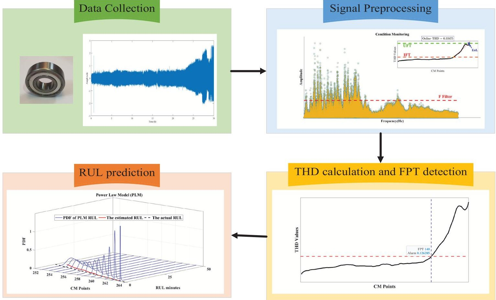

Fig. 5. The overall architecture of the prognostic method.

Table I. Specification of the test bearing

<table border="1"><tr><td>Parameter</td><td>Value</td></tr><tr><td>Model</td><td>KG 6203 ZZ</td></tr><tr><td>Type</td><td>Single-row deep groove ball bearing</td></tr><tr><td>Number of balls</td><td>8</td></tr><tr><td>Ball diameter</td><td>6.74 mm</td></tr><tr><td>Bearing pitch diameter</td><td>28.39 mm</td></tr><tr><td>Contact angle</td><td>0°</td></tr></table>

The empirical parameters a and b in the IFT/FPT rule are selected using a representative experimental run from the test bench. These parameters are tuned to avoid false alarms during the healthy stage. Once calibrated, the same values are applied to all other experiments conducted on the same test bench. To evaluate the sensitivity of the IFT/FPT rule to the empirical parameters a and b, a perturbation study was conducted using bearing B1. The experiment consists of 180 samples. Using the nominal parameter values a = 1.26, b = 3, the detected FPT occurs at sample 140. When parameter b is varied by $ \pm 5\% $ and $ \pm 10\% $ while keeping a fixed, the detected FPT remains unchanged at sample 140. Furthermore, even for larger perturbations of b, the impact on FPT remains limited: increasing b by a factor of 10 results in an FPT of 141. In contrast, varying parameter a, while fixing b at 3, leads to small but noticeable shifts in the detected FPT. Specifically, increasing a by 5% and 10% results in FPT values of 142 and 144, respectively, whereas decreasing a by 5% and 10% yields FPT values of 137 and 133. Overall, the maximum deviation in FPT under $ \pm 10\% $ parameter perturbation is limited to 7 samples, indicating that the FPT detection is largely

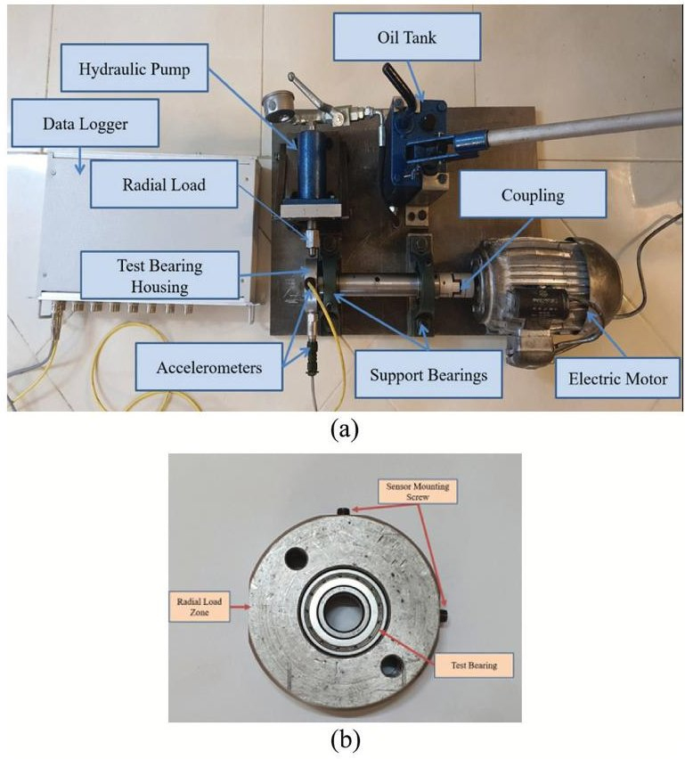

Fig. 6. Experimental setup of run-to-failure test: (a) Overall schematic and (b) housing part.

insensitive to parameter b and exhibits limited sensitivity to parameter a on the same test bench. Based on values in Table III, the results presented in the following section are obtained. To verify the effectiveness of THD as a new bearing HI for predicting RUL, this study evaluates the THD and RMS of vibration signals of different samples

<!-- PDF_PAGE: 8 -->

Table II. Data details for test bench experiments

<table border="1"><tr><td>Bearing</td><td>Frequency(kHz)</td><td>Interval(min)</td><td>Duration(s)</td><td>Loading force(kN)</td><td>Rotating speed(rpm)</td><td>Actual RUL(min)</td></tr><tr><td>B1</td><td>20</td><td>10</td><td>1.667</td><td>5.89</td><td>1420</td><td>1800</td></tr><tr><td>B2</td><td>20</td><td>10</td><td>1.667</td><td>4.71</td><td>1420</td><td>2640</td></tr><tr><td>B3</td><td>20</td><td>10</td><td>1.667</td><td>7.85</td><td>1420</td><td>640</td></tr></table>

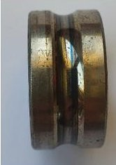

(a)

(b)

(c)

Fig. 7. Defect on rolling bearing B1.

Table III. Notation and parameters

<table border="1"><tr><td>Parameter</td><td>Description</td><td>Value</td></tr><tr><td>Spectral processing</td><td>Fundamental frequency estimation</td><td>FFT</td></tr><tr><td>$\kappa$</td><td>Filter coefficient</td><td>10</td></tr><tr><td>$\mathcal{L}$</td><td>Moving window length</td><td>8 samples</td></tr><tr><td>a</td><td>IFT coefficient</td><td>1.26</td></tr><tr><td>b</td><td>IFT coefficient</td><td>3</td></tr><tr><td>$\mu$</td><td>Drift coefficient</td><td>Updated by Eq.(36)</td></tr><tr><td>$\varepsilon^{2}$</td><td>Variance of $\mu$</td><td>Updated by Eq.(37)</td></tr><tr><td>$\sigma^{2}$</td><td>Diffusion coefficient</td><td>Updated by Eq.(38)</td></tr></table>

and plastic deformation, which is called the "running-in" phenomenon [57]. This phenomenon causes a temporary improvement in the HI (as in Fig. 8 (b)). In this study, since the RUL prediction starts from the FPT time and is not made in the health phase, this issue does not affect the prediction results. Also, the HI in the degradation phase does not always have a strictly rising trend and may decline in some intervals. However, this decline is temporary and then the degradation process usually intensifies. The reasons for the decline in the HI, or in other words "false fluctuations," are actually due to unbalanced force and wear of the outer ring

Table IV. Comparison of THD and RMS

<table border="1"><tr><td>Bearing</td><td>HI</td><td>Mon</td><td>Rob</td><td>Tre</td><td>HM</td></tr><tr><td rowspan="2">B1</td><td>THD</td><td>0.587</td><td>0.866</td><td>0.765</td><td>0.739</td></tr><tr><td>RMS</td><td>0.385</td><td>0.864</td><td>0.774</td><td>0.675</td></tr><tr><td rowspan="2">B2</td><td>THD</td><td>0.255</td><td>0.854</td><td>0.834</td><td>0.648</td></tr><tr><td>RMS</td><td>0.232</td><td>0.872</td><td>0.796</td><td>0.633</td></tr><tr><td rowspan="2">B3</td><td>THD</td><td>0.333</td><td>0.944</td><td>0.695</td><td>0.658</td></tr><tr><td>RMS</td><td>0.270</td><td>0.940</td><td>0.617</td><td>0.609</td></tr></table>

with the criteria mentioned in Section II.D. The evaluation results are shown in Table IV.

As shown in Table IV, among all the evaluation indices for the three test bench bearings, THD outperforms RMS in terms of the combined criterion (HM), indicating that THD is more suitable for use as an HI to predict the RUL of bearings than RMS. The first step in predicting RUL is to determine the FPT. Fig. 8 shows the FPT for various bearings using the THD curve and Eq. (14), (15).

By observing the results of Fig. 8, it can be seen that the life cycle of bearings is divided into two phases: (1) Health phase and (2) Degradation phase. Usually, in the health phase, the HI is constant and does not change noticeably. However, in the early phase of the life cycle, asperity removal and surface roughness are reduced due to wear

B1

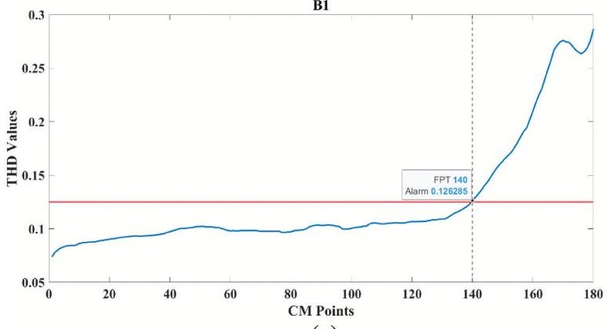

(a)

B2

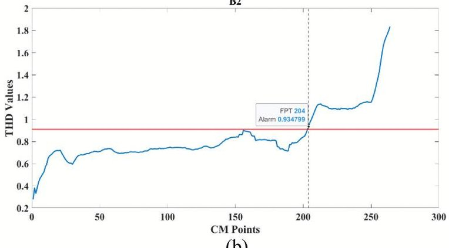

(b)

B3

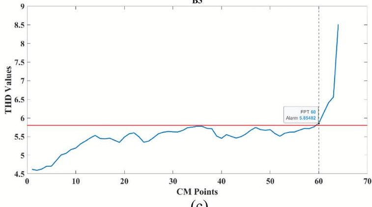

(c)

Fig. 8. FPT identification results for bearings using the horizontal signal with a sampling interval of 10 min and a shaft speed of 1420 rpm: (a) B1 (load: 5.89 kN), (b) B2 (load: 4.71 kN), and (c) B3 (load: 7.85 kN).

<!-- PDF_PAGE: 9 -->

of the rolling bearing and the contact area [58]. Of course, the decline in the HI in the degradation phase may be due to environmental noise or random noise interference, but in this case, it should be irregular and transient. While a repeating pattern is observed in Fig. 8(a),(b). So, to understand the main reason, we should refer to the "selfhealing" phenomenon [59]. This phenomenon refers to a condition in which the initial signs of damage (such as cracks, wear, or corrosion) temporarily reduce or disappear in the vibration signal. Of course, the "self-healing" phenomenon is a temporary effect and does not mean the actual improvement of the bearing. In fact, the damage may be progressing secretly and suddenly intensify in the later stages.

To evaluate the prediction accuracy of the proposed model, the RUL estimation of the bearing in this test bench was performed using two other common Wiener models, namely the linear law (LLM) model and the exponential law (ELM) model, in addition to the power model. The predicted RULs for different test specimens were compared with the actual RUL, and the results are shown in Fig. 9.

This comparison shows that the ELM has a lower RUL prediction performance than the other models. The PLM model outperforms the ELM and LLM models in most of the samplings. In Fig. 9 (c), due to the sudden failure, there was not enough CM data in the degradation phase. Nevertheless, the model showed acceptable prediction. Based on the observed degradation trends of different bearings in Fig. 8 and the corresponding RUL prediction results obtained by the three models in Fig. 9, clearer guidance can be provided on the applicability of each drift form. The ELM yields satisfactory performance primarily when the degradation rate exhibits a rapid (exponential) growth behavior. The LLM performs well when the degradation rate is approximately constant over time. However, since the degradation trends observed in the experimental bearings typically exhibit a slow initial phase followed by an accelerated degradation stage, the PLM demonstrates superior prediction accuracy compared to the other two models. In other words, when the degradation process is modeled as $ \mu t^{b} $ , the parameter $ \mu $ can be interpreted as being related to the growth rate of micro-cracks, whereas the exponent b characterizes the evolution and coalescence behavior of microcracks over time. Also, the results of RUL'PDF prediction for B2 using three different Wiener drifts can be seen in Fig. 10.

As can be seen from the RUL'PDF prediction results, at the early degradation phase, the estimated parameters are uncertain due to the lack of CM data. Therefore, the PDF curves are mostly "flat" in shape and the RUL prediction range is wide. With the gathering of CM data, the PDF curves become more and more "sharp" and the RUL range becomes smaller, which indicates that the uncertainty of the prediction results is reduced. By examining the results of Fig. 10 in more detail, it can be concluded that the ELM model (Fig. 10(c)) provides acceptable prediction only near the end of the bearing life, but the LLM model (Fig. 10(b)) provides relatively satisfactory prediction performance during the bearing life and the PDF distributions mainly cover the actual RUL. However, the PDF curves generated by the PLM model are "sharper" in the early stages than those of the other models, indicating a faster reduction of uncertainty. Therefore, the proposed PLM model can provide more informative and reliable RUL estimates for

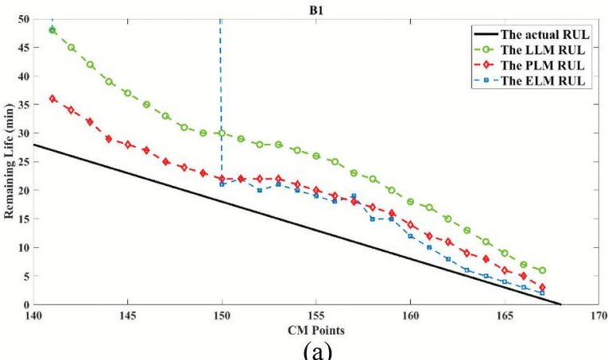

(a)

B2

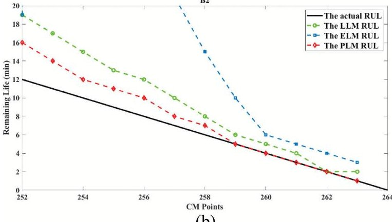

(b)

B3

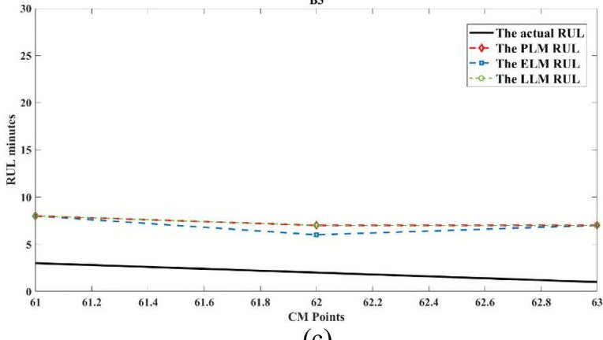

(c)

Fig. 9. RUL prediction results of the LLM, ELM, and PLM for different bearings using the horizontal signal with a sampling interval of 10 min and a shaft speed of 1420 rpm: (a) B1 (load: 5.89 kN), (b) B2 (load: 4.71 kN), and (c) B3 (load: 7.85 kN).

subsequent decision-making. To quantify the accuracy of the prediction results, four criteria are used: mean absolute error (MAE), mean absolute percentage error (MAPE), root mean square error (RMSE), and R-squared $ \left( \mathrm{R}^{2} \right) $ . Let define $ \mathrm{E r}_{i}=\mathrm{R U L}_{i}^{\mathrm{a c t}}-\mathrm{R U L}_{i}^{\mathrm{p r e d i c t}} $ , the criteria are expressed as Eq. (39)-(42):

$$
\mathrm {M A E} = \frac {1}{n} \sum_ {i = 1} ^ {n} \left| E r _ {i} \right|
$$

$$
\mathrm {M A P E} = \frac {1}{n} \sum_ {i = 1} ^ {n} \left| \frac {E r _ {i}}{\mathrm {R U L} _ {i} ^ {\mathrm {a c t}}} \right|
$$

$$
\mathrm {R M S E} = \sqrt {\frac {\sum_ {i = 1} ^ {n} \left(E r _ {i}\right) ^ {2}}{n}}
$$

<!-- PDF_PAGE: 10 -->

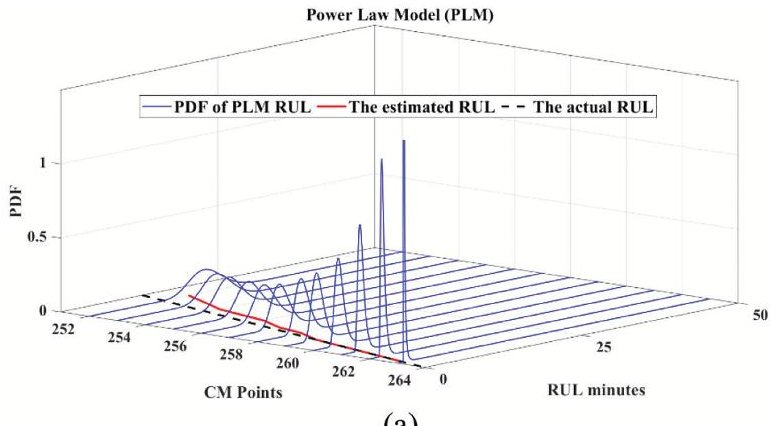

(a)

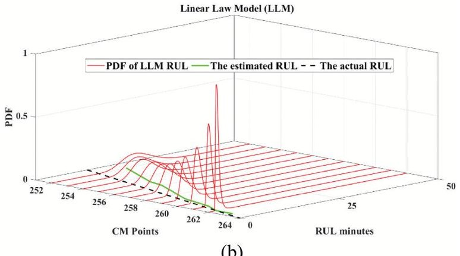

(b)

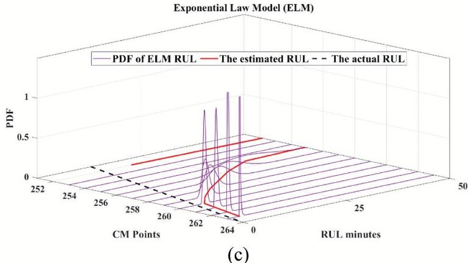

(c)

Fig. 10. RUL'PDF prediction results of different drift forms for bearing B2 based on the horizontal signal (sampling interval: 10 min; shaft speed: 1420 rpm): (a) PLM, (b) LLM, and (c) ELM.

$$
\mathrm {R} ^ {2} = 1 - \frac {\sum_ {i = 1} ^ {n} \left(E r _ {i}\right) ^ {2}}{\sum_ {i = 1} ^ {n} \left(R U L _ {i} ^ {a c t} - \overline {{R U L}}\right) ^ {2}}
$$

The smaller the MAE, MAPE, and RMSE, the smaller the prediction error of the model, and in other words, the

higher the accuracy of the model. Also, $ R^{2} $ shows what percentage of the variation in the target variable (RUL) is justified by the model. The closer $ R^{2} $ is to one, the better the model fits. It should be noted that RUL prediction starts immediately after the detected FPT and is updated at every sampling instant (one prediction per sample). Therefore, prediction errors are computed only over the post-FPT period by comparing the predicted RUL with the actual RUL at each step. The overall performance is reported using MAE, RMSE, MAPE, and $ R^{2} $ , aggregated over all post-FPT predictions. For this purpose, to examine the accuracy of the prediction model of different models, the results for the four criteria are presented in Table V.

For fairness, all three drift models (LLM, ELM, and PLM) are evaluated under identical preprocessing and initialization settings (Table III). In this comparison, LLM and ELM serve as commonly used baseline drift forms, and their performance is reported using the same protocol and metrics. According to the results of Table V, it can be seen that the MAPE, MAE, and RSME values for the proposed PLM model are much lower than the error evaluation results in the ELM model. It is also seen that the error rate for the PLM model is often improved compared to the LLM model. Therefore, in general, it can be concluded that the accuracy of the proposed model when using the PLM model is much higher than other models. On the other hand, the $ R^{2} $ values in bearings B1 and B2 are above 0.97. This means that at least 97% of the RUL variable changes can be predicted by the proposed model. The $ R^{2} $ value in bearing B3 is lower than other bearings due to early failure and lack of sufficient CM data. However, it still has acceptable accuracy.

## IX. CONCLUSIONS

In this study, THD is used as a new HI for RUL prediction. Subsequently, to explain the change point from the healthy phase to the degradation phase, an IFT is used with the mean and variance of the THD curve. Then, the prediction starts from the FPT point using the nonlinear Wiener process. Using the nonlinear Wiener process PLM, random effect and nonlinear feature are added to the prediction model, which makes the model closer to the actual operating conditions of the bearing. The effectiveness of the proposed model is validated using accelerated tests of bearings. The results showed that the proposed HI is better than the conventional RMS indicator in terms of monotonicity, robustness, and trendability. Also, the proposed

Table V. Comparison of results of PLM, LLM, and ELM for various bearings

<table border="1"><tr><td></td><td></td><td colspan="4">Index</td></tr><tr><td>Bearing</td><td>Life prediction model</td><td>MAE</td><td>RMSE</td><td>MAPE</td><td>R2</td></tr><tr><td rowspan="3">B1</td><td>PLM</td><td>4.333333333</td><td>4.714951668</td><td>0.429875147</td><td>0.978313442</td></tr><tr><td>LLM</td><td>4.641025641</td><td>5.385164807</td><td>0.358584719</td><td>0.982713514</td></tr><tr><td>ELM</td><td>141.12820512</td><td>327.87247364</td><td>4.425007770</td><td>0.390297443</td></tr><tr><td rowspan="3">B2</td><td>PLM</td><td>1.25</td><td>1.802775638</td><td>0.132317220</td><td>0.990856825</td></tr><tr><td>LLM</td><td>2.916666667</td><td>3.640054945</td><td>0.426539202</td><td>0.987682932</td></tr><tr><td>ELM</td><td>35.00</td><td>71.957163183</td><td>3.810248316</td><td>0.362757965</td></tr><tr><td rowspan="3">B3</td><td>PLM</td><td>5.333333333</td><td>5.354126135</td><td>3.388888889</td><td>0.75</td></tr><tr><td>LLM</td><td>5.333333333</td><td>5.354126135</td><td>3.388888889</td><td>0.75</td></tr><tr><td>ELM</td><td>5.00</td><td>5.06</td><td>3.22</td><td>0.25</td></tr></table>

<!-- PDF_PAGE: 11 -->

method has a very acceptable accuracy in predicting RUL compared to the LLM and ELM models.

Future work will focus on verifying the application of the proposed RUL prediction method in other mechanical components.

## CONFLICT OF INTEREST STATEMENT

The authors declare no conflicts of interest.

## REFERENCES

[1] M. Rezamand et al., "Critical wind turbine components prognostics: A comprehensive review," IEEE Trans. Instrum. Meas., vol. 69, pp. 9306-9328, 2020.

[2] J. Li et al., "A disjunctive graph-based metaheuristic for flexible job-shop scheduling problems considering fixture shortages in customized manufacturing systems," Rob. Comput. Integr. Manuf., vol. 95, p. 102981, 2025.

[3] W. Cao et al., "A remaining useful life prediction method for rolling bearing based on TCN transformer," IEEE Trans. Instrum. Meas., vol. 74, pp. 1-9, 2025.

[4] Z. Wang et al., "A RUL prediction of bearing using fusion network through feature cross weighting," Meas. Sci. Technol., vol. 34, p. 105908, 2023.

[5] J. Zhou et al., "Remaining useful life prediction methodologies with health indicator dependence for rotating machinery: A comprehensive review," IEEE Trans. Instrum. Meas., vol. 74, pp. 1-19, 2025.

[6] B. Tang et al., "Remaining useful life prognosis method of rolling bearings considering degradation distribution shift," IEEE Trans. Instrum. Meas., vol. 73, pp. 1-13, 2024.

[7] Y. Qin et al., "Unsupervised health indicator construction by a novel degradation-trend-constrained variational autoencoder and its applications," IEEE/ASME Trans. Mechatron., vol. 27, pp. 1447-1456, 2021.

[8] J. Guo et al., "MHT: A multiscale hourglass-transformer for remaining useful life prediction of aircraft engine," Eng. Appl. Artif. Intell., vol. 128, p. 107519, 2024.

[9] S. Lv et al., "A hybrid method combining Lévy process and neural network for predicting remaining useful life of rotating machinery," Adv. Eng. Inf., vol. 61, p. 102490, 2024.

[10] Q. Qian et al., "Adaptive intermediate class-wise distribution alignment: A universal domain adaptation and generalization method for machine fault diagnosis," IEEE Trans. Neural Netw. Learn. Syst., vol. 36, pp. 4296-4310, 2024.

[11] T. Wang et al., "A spatiotemporal feature learning-based RUL estimation method for predictive maintenance," Measurement, vol. 214, p. 112824, 2023.

[12] J. Zhou et al., "Continuous remaining useful life prediction by self-guided attention convolutional neural network and memory consciousness adjustment," IEEE Internet Things J., vol. 11, pp. 31947-31958, 2024.

[13] Y. Hu et al., "Online performance assessment method for a model-based prognostic approach," IEEE Trans. Reliab., vol. 65, pp. 718-735, 2015.

[14] A. Cubillo et al., "A review of physics-based models in prognostics: Application to gears and bearings of rotating machinery," Adv. Mech. Eng., vol. 8, p. 1687814016664660, 2016.

[15] P. Zhu et al., "Digital twin-enabled entropy regularized wavelet attention domain adaptation network for gearboxes

fault diagnosis without fault data," Adv. Eng. Inf., vol. 64, p. 103055, 2025.

[16] J. Shang et al., "Domain generalization for rotating machinery real-time remaining useful life prediction via multidomain orthogonal degradation feature exploration," Mech. Syst. Sig. Process., vol. 223, p. 111924, 2025.

[17] J. Zhou and Y. Qin, "A continuous remaining useful life prediction method with multistage attention convolutional neural network and knowledge weight constraint," IEEE Trans. Neural Netw. Learn. Syst., vol. 36, no. 7, pp. 11847-11860, 2025.

[18] C. Hu et al., "Remaining useful life estimation for two-phase nonlinear degradation processes," Reliab. Eng. Syst. Saf., vol. 230, p. 108945, 2023.

[19] N. Li et al., "A Wiener-process-model-based method for remaining useful life prediction considering unit-to-unit variability," IEEE Trans. Ind. Electron., vol. 66, pp. 2092-2101, 2018.

[20] Z. Zhang et al., "Degradation data analysis and remaining useful life estimation: A review on Wiener-process-based methods," Eur. J. Oper. Res., vol. 271, pp. 775- 796, 2018.

[21] X. Zhang et al., "A hybrid method for cutting tool RUL prediction based on CNN and multistage Wiener process using small sample data," Measurement, vol. 213, p. 112739, 2023.

[22] Q. Qian et al., "Relationship transfer domain generalization network for rotating machinery fault diagnosis under different working conditions," IEEE Trans. Ind. Inf., vol. 19, pp. 9898-9908, 2023.

[23] L. Liao and F. Kottig, "Review of hybrid prognostics approaches for remaining useful life prediction of engineered systems, and an application to battery life prediction," IEEE Trans. Reliab., vol. 63, pp. 191-207, 2014.

[24] R. Sidharth et al., "Crack initiation and growth in 316LN stainless steel: Experiments and XFEM simulations," Eng. Fract. Mech., vol. 274, p. 108770, 2022.

[25] C. H. Oppenheimer and K. A. Loparo, "Physically based diagnosis and prognosis of cracked rotor shafts," in Component and Systems Diagnostics, Prognostics, and Health Management II, vol. 4733, G. W. Vogl and M. J. Dzwonczyk, Eds., Bellingham, WA, USA: SPIE, 2002, pp. 122-132.

[26] W. Ostachowicz and M. Krawczuk, "Coupled torsional and bending vibrations of a rotor with an open crack," Arch. Appl. Mech., vol. 62, pp. 191-201, 1992.

[27] C. Sankavaram et al., "Model-based and data-driven prognosis of automotive and electronic systems," in 2009 IEEE International Conference on Automation Science and Engineering, IEEE, Bangalore, India, 2009, pp. 96-101.

[28] B. Rezaeianjouybari and Y. Shang, "Deep learning for prognostics and health management: State of the art, challenges, and opportunities," Measurement, vol. 163, pp. 107929, 2020.

[29] Y. Wei et al., "Bearing remaining useful life prediction using self-adaptive graph convolutional networks with self-attention mechanism," Mech. Syst. Sig. Process., vol. 188, pp. 110010, 2023.

[30] R. Zemouri and R. Gouriveau, "Towards accurate and reproducible predictions for prognostic: An approach combining a RRBF network and an autoRegressive model," IFAC Proc. Vol., vol. 43, pp. 140-145, 2010.

[31] R. Zemouri et al., "Recurrent radial basis function network for time-series prediction," Eng. Appl. Artif. Intell., vol. 16, pp. 453-463, 2003.

<!-- PDF_PAGE: 12 -->

[32] K. Kudelina and H. A. Raja, "Neuro-Fuzzy Framework for Fault Prediction in Electrical Machines via Vibration Analysis," Energies, vol. 17, p. 2818, 2024.

[33] X.-S. Si et al., "Remaining useful life estimation-a review on the statistical data driven approaches," Eur. J. Oper. Res., vol. 213, pp. 1-14, 2011.

[34] Y. Lei et al., "A new method based on stochastic process models for machine remaining useful life prediction," IEEE Trans. Instrum. Meas., vol. 65, pp. 2671-2684, 2016.

[35] K. A. Doksum and A. Hbyland, "Models for variable-stress accelerated life testing experiments based on wener processes and the inverse gaussian distribution," Technometrics, vol. 34, pp. 74-82, 1992.

[36] Z. Huang et al., "Remaining useful life prediction for an adaptive skew-Wiener process model," Mech. Syst. Sig. Process., vol. 87, pp. 294-306, 2017.

[37] L. Hao et al., "Residual life prediction of multistage manufacturing processes with interaction between tool wear and product quality degradation," IEEE Trans. Autom. Sci. Eng., vol. 14, pp. 1211-1224, 2016.

[38] S. Liu et al., "Real-time reliability self-assessment in milling tools operation," Qual. Reliab. Eng. Int., vol. 32, pp. 2245- 2252, 2016.

[39] Z. Wang et al., "Research on a remaining useful life prediction method for degradation angle identification two-stage degradation process," Mech. Syst. Sig. Process., vol. 184, pp. 109747, 2023.

[40] W. Lin and Y. Chai, "Remaining useful life prediction for nonlinear two-phase degradation process with measurement errors and imperfect prior information," Meas. Sci. Technol., vol. 34, p. 055018, 2023.

[41] C. Hu et al., "Ensemble of data-driven prognostic algorithms for robust prediction of remaining useful life," Reliab. Eng. Syst. Saf., vol. 103, pp. 120-135, 2012.

[42] Y. Wang et al., "A general time-varying Wiener process for degradation modeling and RUL estimation under three-source variability," Reliab. Eng. Syst. Saf., vol. 232, p. 109041, 2023.

[43] S. Liu and L. Fan, "An adaptive prediction approach for rolling bearing remaining useful life based on multistage model with three-source variability," Reliab. Eng. Syst. Saf., vol. 218, p. 108182, 2022.

[44] Y. Chang et al., "Remaining useful life prediction of degraded system with the capability of uncertainty management," Mech. Syst. Sig. Process., vol. 177, p. 109166, 2022.

[45] T. Choudhury et al., "Development and verification of frequency domain solution methods for rotor-bearing system

responses caused by rolling element bearing waviness," Mech. Syst. Sig. Process., vol. 163, p. 108117, 2022.

[46] Z. Li et al., "A family of health indicators induced by EOF for condition monitoring of machinery," IEEE Sens. J., vol. 24, pp. 10573-10583, 2024.

[47] K. Javed et al., "Enabling health monitoring approach based on vibration data for accurate prognostics," IEEE Trans. Ind. Electron., vol. 62, pp. 647-656, 2014.

[48] N. Li et al., "A particle filtering-based approach for remaining useful life predication of rolling element bearings," in 2014 Int. Conf. Prognostics Health Manage., IEEE, Cheney, WA, USA, 2014, pp. 1-8.

[49] B. Zhang et al., "Degradation feature selection for remaining useful life prediction of rolling element bearings," Qual. Reliab. Eng. Int., vol. 32, pp. 547-554, 2016.

[50] N. Li et al., "An improved exponential model for predicting remaining useful life of rolling element bearings," IEEE Trans. Ind. Electron., vol. 62, pp. 7762-7773, 2015.

[51] L. Yang et al., "Two-stage prediction technique for rolling bearings based on adaptive prediction model," Mech. Syst. Signal Process., vol. 206, p. 110931, 2024.

[52] X.-S. Si et al., "Remaining useful life estimation based on a nonlinear diffusion degradation process," IEEE Trans. Reliab., vol. 61, pp. 50-67, 2012.

[53] X.-S. Si et al., "A degradation path-dependent approach for remaining useful life estimation with an exact and closed-form solution," Eur. J. Oper. Res., vol. 226, pp. 53-66, 2013.

[54] T. Yan et al., "Online joint replacement-order optimization driven by a nonlinear ensemble remaining useful life prediction method," Mech. Syst. Sig. Process., vol. 173, p. 109053, 2022.

[55] H. Wang et al., "An improved Wiener process model with adaptive drift and diffusion for online remaining useful life prediction," Mech. Syst. Sig. Process., vol. 127, pp. 370-387, 2019.

[56] Y. Lei et al., "Interpretation of XJTU-SY rolling bearing accelerated life test data set," J. Mech. Eng., vol. 55, pp. 1-6, 2019.

[57] M. S. D. Sakhamuri et al., "Wear induced changes in surface topography during running-in of rolling-sliding contacts," Wear, vol. 522, p. 204685, 2023.

[58] C. Yang et al., "A novel based-performance degradation indicator RUL prediction model and its application in rolling bearing," ISA Trans., vol. 121, pp. 349-364, 2022.

[59] X. Zhao et al., "Rolling bearing remaining useful life prediction method based on vibration signal and mechanism model," Appl. Acoust., vol. 228, p. 110334, 2025.