<!-- PDF_PAGE: 1 -->

# Gearbox bearing crack growth prognostics and uncertainty quantification with physics-informed machine learning

Mario De Florio $ ^{1} $ , Gabriel Appleby $ ^{1} $ , Jonathan Keller $ ^{1} $ , Ali Eftekhari Milani $ ^{2} $ , Donatella Zappal $ ^{2} $ , and Shawn Sheng $ ^{1} $

$ ^{1} $National Renewable Energy Laboratory, Golden, CO, 80401, USA $ ^{2} $TU Delft, Kluyverweg 1, Delft, 2629 HS, the Netherlands

Correspondence: Mario De Florio (mario.deflorio@nrel.gov) and Shawn Sheng (shwan.sheng@nrel.gov)

Received:18 August 2025-Discussion started:5 September 2025 Revised:27 October 2025-Accepted:14 November 2025-Published:4 March 2026

Abstract. This paper introduces the extreme theory of functional connections (X-TFC), a physics-informed machine learning algorithm, and tailors it to estimate the remaining useful life (RUL) of wind turbine gearbox bearings experiencing fatigue crack growth. Unlike purely data-driven methods, X-TFC embeds a physics model, based on Head's theory in this work, into its training objective. The core of X-TFC is a random-projection single-layer neural network trained via an extreme learning machine, which requires only limited damage progression data and solves for output weights with a least-squares optimization algorithm. A composite loss function balances the network's fit to observed degradation data against the residuals of the governing crack growth differential equation, ensuring the learned damage trajectory remains physically plausible. When applied to a vibration-based health-index (HI) dataset measured during the growth of a crack on the inner ring of a high-speed bearing in a wind turbine gearbox (Bechhoefer and Dube, 2020), X-TFC achieves near-zero prediction bias. Even when trained on only the first 10% - 20% of the damage progression data, with sufficient physics weighting its predictions remain monotonic and smooth, delivering high prognosability and trendability. To quantify the epistemic uncertainty, we employ a Monte Carlo ensemble of independently initialized X-TFC models trained on noise-perturbed data, which yields confidence intervals around each RUL estimate and captures both model-parameter and epistemic uncertainty. In addition to a vibration-based HI, we demonstrate that the proposed framework can be directly applied to a supervisory control and data acquisition (SCADA) data-based HI (Eftekhari Milani et al., 2026) measured during similar wind turbine gearbox bearing crack faults, preserving its accuracy and interpretability. This extension shows the versatility of our approach, which is applicable to bearings of multiple gearbox manufacturers, models, and ratings using only SCADA data. By integrating domain knowledge with machine learning, X-TFC offers a rapid, reliable tool for crack prognostics. Its adaptability to other bearing failure modes, such as pitch bearing ring cracks, positions X-TFC as a powerful enabler of data-driven, physics-informed asset management in the wind energy sector and beyond.

<!-- PDF_PAGE: 2 -->

## 1 Introduction

The wind industry has witnessed tremendous growth over the past 2 decades, as reported by the Global Wind Energy Council, with the global cumulative installed capacity recently crossing the 1000 GW mark. Although the levelized cost of energy from wind and wind plant operation and maintenance (O&M) costs have fallen (Wiser et al., 2024), O&M still accounts for up to 35 % of the levelized cost of energy. Approximately half of wind plant O&M costs are from wind turbine O&M, a cost of USD 22 kW-year for land-based wind plants (Wiser et al., 2019). Turbine O&M costs, therefore, represent the single largest component of wind plant O&M costs and the primary source of potential O&M cost reductions. More reliable components and better O&M strategies, including for wind turbine blades and drivetrain components, have the potential to reduce premature failures, O&M costs, downtime, and thus the levelized cost of energy by up to 7 % by 2035 (Stehly et al., 2024). Additionally, an accurate reliability forecast provides crucial information for reducing O&M costs through design improvements, optimized operation strategies, and enhanced budgeting. Optimized operation strategies often include condition-based maintenance and prognostics, which rely on the prediction of the remaining useful life (RUL) of components to provide an early warning of failure and thereby allow maintenance to be scheduled proactively (Bechhoefer et al., 2021).

One challenging reliability problem that remains for wind turbine main bearings and bearings in gearboxes is axial cracking of the inner rings, examples of which are shown in Fig. 1a and b (Greco et al., 2022). In gearboxes, this failure mode in intermediate- and high-speed stage bearings accounts for the majority of uptower bearing replacements (Haus et al., 2024). "Axial" describes the orientation of these cracks as they align with the axis of rotation of the shaft on which the bearing is mounted. This type of crack is also commonly called a white-etching crack (WEC) due to the appearance of the steel microstructure when the cracked bearing cross-sections are polished, etched with chemicals, and examined under reflected light. These cracks tend to propagate to spalls or lead to a complete splitting of the bearing inner ring in gearboxes in as little as 5% to 20% of the bearing rating life (Greco et al., 2013). The conditions leading to WECs, the reasons for their apparent prevalence in wind turbine main bearings and gearboxes (Greco et al., 2022; Demas et al., 2023), and the effectiveness of countermeasures (Jensen et al., 2021) are now better understood through over a decade of research; however, accurate methods to predict the RUL of bearings with WECs still need to be developed. Early efforts focused on the development of a physics-based probability of failure model using frictional energy accumulation, which has been partially validated on a limited set of damaged bearings from a wind plant; however, the probability of failure and RUL were predicted only for the population of gearboxes rather than individual ones (Guo et al., 2020).

The model was also used to explore the influence of bearing clearance and lubricant temperature (Clark et al., 2023). Another challenging reliability problem that has recently become more prevalent is fatigue cracking of pitch bearing outer rings in larger wind turbines, as shown in Fig. 1c, resulting in a replacement rate of several percent per year and a 10% replacement rate for the population in just 5 years (Haus et al., 2025). These cracks can occur at bolt holes, fill holes, or locations of significant stiffness changes (Shapiro, 2017) and risk the blade detaching from the turbine. A typical pitch bearing replacement requires the use of a large, expensive crane and removal of the blade(s) or rotor, with a significant amount of downtime. However, research into the root causes of pitch bearing ring cracking has only just begun (Schleich, 2025). In rotating machinery, fatigue cracks in bearings, gears, or shafts are a common failure mode. Classical fracture mechanics models, such as linear elastic fracture mechanics, Head's theory, and dislocation theory, describe such crack growth under cyclic loading. However, no single crack growth law fits all phases of damage: Bechhoefer and Dube (2020) showed that three high-cycle fatigue modes were needed to cover the primary crack propagation period. They found that a hybrid combination of modes was more accurate than any individual model.

In recent years, new computational techniques have been developed to improve evaluation and prediction tasks in various fields of science. Among these, physics-informed machine learning (PIML) (Karniadakis et al., 2021) has emerged as a powerful paradigm for integrating data-driven modeling with known physical laws, often expressed using differential equations. By embedding governing equations and domain constraints directly into learning objectives, PIML methods improve robustness, data efficiency, and interpretability compared to purely data-driven approaches. One of the most widely used PIML frameworks is the physics-informed neural network (PINN) (Raissi et al., 2019), which augments standard neural network training with residual losses for differential equations, initial/boundary conditions, and observed data (Raissi et al., 2020). PINNs have demonstrated success across many fields, such as fluid mechanics (De Florio et al., 2021, 2022b; Cai et al., 2021), epidemiology (Schiassi et al., 2021a; Millevoi et al., 2024; Han et al., 2024; Kharazmi et al., 2021), cardiovascular mechanics (Sahli Costabal et al., 2020; Yin et al., 2021; De Florio et al., 2025), and beyond (De Florio et al., 2024; Ahmadi Daryakenari et al., 2024), while extensions incorporating variational inference, dropout, and deep ensembles have enabled principled quantification of aleatoric and epistemic uncertainty under noisy or incomplete observations (Hullermeier and Waegeman, 2021; Zou and Karniadakis, 2025; De Florio et al., 2025).

Despite their flexibility, PINN-based methods incur significant computational cost due to backpropagation through complex loss terms and often require careful tuning of weighting coefficients between physics and data objectives.

<!-- PDF_PAGE: 3 -->

(a)

(b)

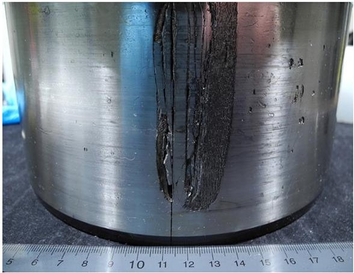

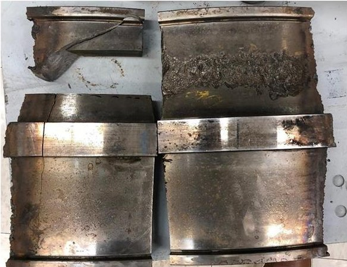

(c)

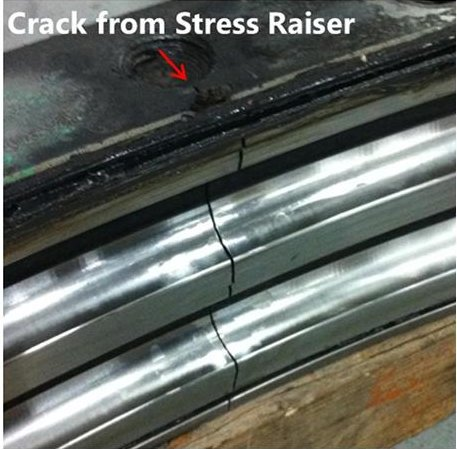

Figure 1. Examples of bearing cracks and damage in wind turbines. (a) Gearbox bearing WEC and spalling (Greco et al., 2022). (b) Main bearing WEC and spalling (Greco et al., 2022). (c) Pitch bearing ring crack (Shapiro, 2017).

To alleviate these challenges, the theory of functional connection (TFC) (Mortari, 2017b) provides an alternative "constrained expression" for differential equation solutions that analytically satisfy boundary or initial conditions (Mortari, 2017a). The resulting constrained approximation permits rapid, training-free inference via direct least-squares solves of residuals at collocation points (Schiassi et al., 2022). Building on TFC, the X-TFC (Schiassi et al., 2021b) employs a single-layer random-projection network whose input weights and biases are randomly sampled once and held fixed. This technique has been widely used recently with promising performance in terms of accuracy and computational efficiency in several PIML frameworks (Fabiani et al., 2021; Fabiani, 2025; Fabiani et al., 2024; Dong and Li, 2021; Wang and Dong, 2024; Dwivedi and Srinivasan, 2020; Galaris et al., 2021). X-TFC has been applied to both forward and inverse differential problems, demonstrating fast convergence and robustness in scenarios with limited, gappy, or noisy data (Osorio et al., 2025). Recent studies extend X-TFC to grey-box and black-box system identification (De Florio et al., 2024; Ahmadi Daryakenari et al., 2024) and uncertainty quantification (UQ) in physiological models, showing its capacity to decompose total uncertainty into aleatoric, epistemic, and model-form contributions (De Florio et al., 2025).

In this work, we review the conceptual foundations of PIML and X-TFC, apply X-TFC to an existing 1475 h vibration-based health-index (HI) dataset from a crack of the inner ring of a high-speed bearing in a 2.2 MW wind turbine gearbox (Bechhoefer and Dube, 2020), and compare its effectiveness to classical physics-based fracture mechanics models. Finally, we show how our unified framework also successfully predicts the RUL of two bearings in a different gearbox model using an HI generated from supervisory control and data acquisition (SCADA) measurements (Eftekhari Milani et al., 2026), broadening its applicability to a wider range of industrial assets. Once the effectiveness of

X-TFC has been assessed, future work will explore the application of X-TFC to other bearing cracking problems in wind turbines, such as pitch bearing ring cracks shown in Fig. 1c. We also employ Monte Carlo (MC) X-TFC to quantify epistemic uncertainty for different scenarios of dataset sizes. The paper is structured as follows: Sect. 2 describes the vibrationbased HI dataset from the 2.2MW wind turbine gearbox; Sect. 3 describes classical physics-based fracture mechanics models; Sect. 4 describes PIML and the X-TFC method; Sect. 5 assesses the effectiveness of X-TFC combined with a classical physics-based fracture mechanics model on the vibration-based HI dataset, using UQ analysis, and on two similar cracks with HIs derived from only SCADA data; and Sect. 6 summarizes the analysis.

## 2 Crack growth and health indicator dataset

As described in Sect.1, the first dataset used in this paper is derived from an existing 1475 h (61 d) HI dataset from a crack of the inner ring of a high-speed bearing in a 2.2 MW wind turbine gearbox (Bechhoefer and Dube, 2020). The HI represents a fusion of vibration-based condition indicators, collected at irregular intervals (approximately every 10 min on average, with occasional 20-30 min or multi-hour gaps) and used to extract features correlated with bearing damage. The HI for a normal bearing is approximately 0.1, while a value of 1 indicates that it is appropriate to do maintenance. The RUL is then the time from the current HI until the HI is 1. Note that this nomenclature does not define a probability of failure for the component, nor does it mean that the component fails when the HI is 1. Instead, it suggests performing maintenance before collateral damage or cascading faults occur. By performing maintenance on a bearing prior to shedding extensive material, costly gearbox replacement can be avoided, and the reliability of the gearbox can be restored to its design requirement (Bechhoefer and Dube, 2020).

<!-- PDF_PAGE: 4 -->

Figure 2a shows the HI calculated over the last 1475 h of operation of the wind turbine prior to the discovery of the bearing crack. Initially, the HI was very low; however, at 1000 h remaining, the HI began to rise, which corresponds to high loads from a winter storm (Bechhoefer and Dube, 2020). By the time 400 h remaining was reached, the HI reached 0.5 on average, with maximum values greater than 1. At 0 h, the average HI exceeded 1, which triggered a borescope inspection of the bearing that uncovered the crack in the inner ring shown in Fig. 2b. It is not known whether this crack originated from WECs; however, it had the same axial orientation on the inner ring and occurred in a high-speed bearing like many WECs in wind turbine gearboxes. This HI dataset is used in the remainder of the paper to assess the effectiveness of X-TFC combined with a classical physics-based crack growth model.

## 3 Fracture mechanics models

As stated in Bechhoefer and Dube (2020), fatigue crack propagation is commonly described in terms of three fundamental displacement modes (Beer et al., 1999; Frost et al., 1999): Mode I (opening), Mode II (in-plane sliding), and Mode III (out-of-plane shear). In Mode I, the crack faces separate under tensile loading; in Mode II, the faces slide laterally within the plane of the crack; and in Mode III, the faces move parallel to the crack front. By superposition of these modes, most general crack tip displacement fields can be represented. Under linear elastic assumptions, the crack surfaces are treated as traction-free boundaries so that external loads affect only the intensity of the stress field near the crack tip, which is quantified by the stress intensity factor K. The factor K depends on the component geometry and loading; for simple geometries, it scales linearly with the applied nominal stress $ \sigma $ and with the square root of the crack length a (Beer et al., 1999). For example, the Mode I stress intensity factor for a crack of length a can be expressed as

$$
K = \sigma \sqrt {\pi a} \alpha ,
$$

where $ \sigma $ is the far-field (gross) stress, and $ \alpha $ is a dimensionless shape factor. When K is known, stresses and strains near the crack tip can be calculated. For instance, the normal stress in the x direction at a point $ (r,\theta) $ measured from the crack tip is (Frost et al., 1999)

$$
\sigma_ {x} (r, \theta) = \frac {K}{\sqrt {2 \pi r}} \cos \left(\frac {\theta}{2}\right) \left[ 1 - \sin \left(\frac {\theta}{2}\right) \sin \left(\frac {3 \theta}{2}\right) \right],
$$

which illustrates the classical inverse-square-root singularity of the stress field. This formulation of the crack tip field in terms of a single parameter K is a cornerstone of linear elastic fracture mechanics. In fatigue crack growth analysis, the driving force is taken as the stress intensity range $ \Delta K $ (the difference between maximum and minimum K in a load cycle). Experimental evidence (Frost et al., 1999) shows that

$ \Delta K $ , not the maximum K , governs crack advance, and if $ \Delta K $ is held constant, then the crack growth rate becomes steady.

## 3.1 Linear elastic fracture mechanics

For many engineering materials (e.g., steels in gears and bearings) subjected to cyclic tensile loading, the incremental crack growth per cycle is Mode I, and it follows a power-law relation (i.e., Paris' law, Pugno et al., 2006). A commonly used form is

$$
\frac {\mathrm {d} a}{\mathrm {d} N} = D (\Delta K) ^ {m},
$$

where $ \mathrm{d} a / \mathrm{d} N $ is the crack extension per load cycle, D is a material-specific constant, and m is the crack growth exponent (typically $ 3\leq m\leq 5 $ ). Substituting the expression $ \Delta K=2\sigma\sqrt{\pi a}\alpha $ into Eq. (3) yields

$$
\frac {\mathrm {d} a}{\mathrm {d} N} = D \left[ 2 \sigma \sqrt {\pi} \alpha \right] ^ {m} a ^ {m / 2}.
$$

Rearranging Eq. (4) and integrating both sides give the total number of cycles N required to grow the crack from an initial length $ a_{0} $ to some length $ a_{f} $ :

$$
N = \int_ {a _ {0}} ^ {a _ {f}} \frac {a ^ {- m / 2}}{D \left(2 \sigma \sqrt {\pi} \alpha\right) ^ {m}} \mathrm {d} a.
$$

Performing the integration yields

$$
N = - \frac {\mathrm {d} N}{\mathrm {d} a} a _ {0} - \frac {a _ {f} \left(a _ {0} / a _ {f}\right) ^ {m / 2}}{m / 2 - 1}
$$

provided m $ \neq2 $ . In particular, if one assumes m=4, Eq. (6) reduces to

$$
\frac {\mathrm {d} N}{\mathrm {d} a} = - \frac {N}{a _ {0} \ln \left(\frac {a _ {f}}{a _ {0}}\right)}.
$$

Under steady, cyclic loading (e.g., constant-speed operations for helicopter gearboxes or for wind turbines in region 3), the number of cycles N is directly proportional to operating time. If the prognostic HI is assumed proportional to the accumulated damage (so that advancing crack length corresponds to decreasing HI), then Eq. (7) provides an RUL estimate by relating crack growth to the elapsed time or number of cycles. We can select $ a_{f}=1 $ , defining the need to perform maintenance when the HI is 1.

## 3.2 Head's theory

Head's theory proposes a simplified model of the crack tip stress field, in which the material ahead of the crack tip is treated as an assembly of parallel elastic bars. Each bar of modulus E carries the applied remote stress $ \sigma $ both directly and through shear transfer. The resulting crack growth law

<!-- PDF_PAGE: 5 -->

(a)

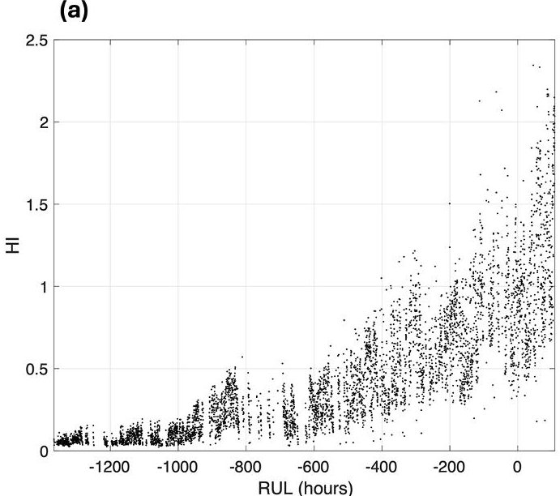

(b)

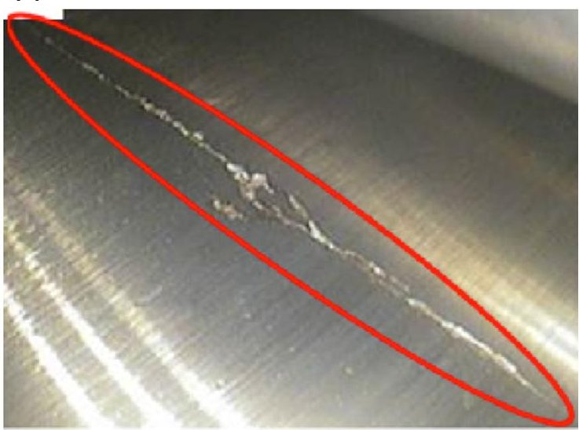

Figure 2. Example vibration-based HI dataset and bearing crack. (a) Calculated vibration-based HI (Bechhoefer and Dube, 2020). (b) Crack in 2.2 MW wind turbine gearbox bearing (Bechhoefer and Dube, 2020).

can be cast in a form similar to Eq. (4) but with a higher effective exponent:

$$
\frac {\mathrm {d} a}{\mathrm {d} N} = \frac {2 E \sigma^ {3} a ^ {3 / 2}}{3 E _ {W} (\Delta \sigma) D} \propto K ^ {3}.
$$

In effect, Head's model predicts a crack advance that corresponds to m=6 in the Paris law form. Although the intermediate steps involve material and geometric parameters, the final integrated form resembles Eq. (6) with m=6. In particular, inversion and integration analogous to the linear elastic case yield an alternate RUL expression:

$$
\frac {\mathrm {d} N}{\mathrm {d} a} = \frac {N}{a _ {0} \left(2 a _ {f} - \frac {2}{\sqrt {a _ {0}}}\right)}.
$$

## 3.3 Dislocation theory

In the case of Mode III (anti-plane shear) dominant loading, dislocation (or plastic dislocation) theory may apply. Here the crack tip plastic zone is modeled as a continuous distribution of dislocations. Crack advance is assumed to occur when the integrated plastic slip reaches a threshold. The associated growth law can be expressed as

$$
\frac {\mathrm {d} a}{\mathrm {d} N} = \frac {a ^ {2} \sigma_ {\max } ^ {4}}{D E \sigma^ {3}}.
$$

This equation implies that crack advance per cycle grows with decreasing crack length, similar in form to the Paris law in Eq. (3), with an effective exponent m=2. By inverting, integrating, and changing terms, we get

$$
\frac {\mathrm {d} N}{\mathrm {d} a} = - \frac {N}{a _ {0} \left(2 a _ {f} - 2 \sqrt {a _ {0}}\right)}.
$$

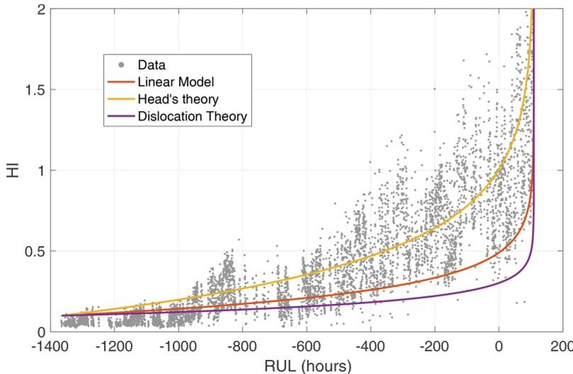

Figure 3. Solutions of the differential equations given by linear, Head's theory, and dislocation theory models compared to the calculated vibration-based HI.

## 3.4 Comparison of crack growth models

Figure 3 compares the three models described in the previous sections when applied to the full 1475 h vibration-based HI dataset described in Sect. 2. For this comparison, the values of $ a_{0} $ and $ a_{f} $ are 0.05 and 1, respectively. With the given crack growth exponent m assumed in each model, Head's theory best matches the slow rise in the calculated HI data, especially over the last 700 h. In comparison, the linear elastic and dislocation theory models have a very slow rise, followed by a much steeper rise thereafter that would provide very little warning of the necessity of an impending maintenance action. Thus, in the remainder of this paper, we choose to use Head's theory model in combination with X-TFC.

<!-- PDF_PAGE: 6 -->

## 4 Physics-informed machine learning

Physics-informed machine learning (PIML) is an emerging framework that integrates known physical laws into the training of data-driven models. By embedding governing differential equations, boundary conditions, and other domainspecific constraints directly into the loss function, PIML enables models to learn from both observational data and prior physical knowledge. This approach contrasts with purely data-driven methods, which may struggle when observations are scarce, noisy, or incomplete.

Consider a physical system governed by partial differential equations,

$$
\mathcal {N} [ u (\boldsymbol {x}), \boldsymbol {x} ] = 0, \quad \boldsymbol {x} \in \Omega ,
$$

where $ u ( \boldsymbol{x} ) $ is the state variable, and $ \mathcal{N}[\cdot] $ is a differential operator defined on the domain $ \Omega $ . Traditional data-driven models seek a surrogate $ \hat{u} ( \boldsymbol{x};\theta) $ parameterized by $ \theta $ that minimizes data loss:

$$
\mathcal {L} _ {\mathrm {d a t a}} (\theta) = \frac {1}{N _ {\mathrm {d}}} \sum_ {i = 1} ^ {N _ {\mathrm {d}}} \left| \hat {u} \left(\boldsymbol {x} _ {i}; \theta\right) - u _ {i} ^ {\mathrm {o b s}} \right| ^ {2},
$$

where $ \{(x_{i},u_{i}^{\mathrm{obs}})\}_{i=1}^{N_{\mathrm{d}}} $ values are $ N_{\mathrm{d}} $ observed data points. In contrast, PIML augments this objective with a physics-based penalty:

$$
\mathcal {L} _ {\mathrm {p h y s i c s}} (\theta) = \frac {1}{N _ {\mathrm {p}}} \sum_ {j = 1} ^ {N _ {\mathrm {p}}} \left| \mathcal {N} [ \hat {u} \left(\boldsymbol {x} _ {j}; \theta\right), \boldsymbol {x} _ {j} ] \right| ^ {2},
$$

where $ \left\{x_{j}\right\}_{j=1}^{N_{\mathrm{p}}} $ values are collocation points chosen in $ \Omega $ . The physical loss is made by the residual of the differential equation, which needs to be minimized. In our case, it is the residual of Eq. (9):

$$
\frac {\mathrm {d} N}{\mathrm {d} a} - \frac {N}{a _ {0} \left(2 a _ {f} - \frac {2}{\sqrt {a _ {0}}}\right)} = 0.
$$

The total loss is then given by

$$
\mathcal {L} (\theta) = \lambda_ {\mathrm {d a t a}} \cdot \mathcal {L} _ {\mathrm {d a t a}} (\theta) + \lambda_ {\mathrm {p h y s i c s}} \cdot \mathcal {L} _ {\mathrm {p h y s i c s}} (\theta),
$$

with weighting coefficients $ \lambda_{\mathrm{data}} $ and $ \lambda_{\mathrm{physics}} $ balancing data fidelity against physical consistency.

By enforcing Eq. (12) during training, PIML offers several advantages when dealing with realistic datasets:

- Regularization via physics. The physics-based term $ \mathcal{L}_{\mathrm{physics}} $ acts as a principled regularizer, preventing overfitting caused by noise in $ u_{i}^{\mathrm{obs}} $ .

- Data efficiency. Incorporating prior knowledge reduces the reliance on large volumes of labeled data, enabling accurate learning even when $ N_{\mathrm{d}} $ is small or spatial coverage is incomplete.

- Robustness to missing observations. The model can be evaluated at arbitrary collocation points, filling gaps in the observational domain and providing continuous field reconstructions.

- UQ. Extensions of PIML integrate Bayesian or ensemble approaches to quantify epistemic and aleatoric uncertainties, further improving reliability under data scarcity.

## 4.1 Extreme theory of functional connections (X-TFC)

The PIML framework used in this work is based on the X-TFC algorithm (Schiassi et al., 2021b), which differs from classic PINN for two main introduced features: the TFC (Mortari, 2017b, a; Mortari et al., 2019), which satisfies initial and boundary conditions of the differential equations analytically, and random-projection neural networks (Fabiani, 2025) trained via an extreme learning machine algorithm (Huang et al., 2006), thus avoiding the need for the computationally expensive backpropagation algorithm. The TFC constructs an explicit approximation of the solution of a differential equation that identically satisfies given boundary or initial conditions. For a general initial value problem of the form

$$
\frac {\mathrm {d} x}{\mathrm {d} t} = f \left(x (t), t\right), \quad x (0) = x _ {0},
$$

TFC represents the solution of the differential equation via a so-called "constrained expression":

$$
x (t; \beta) = g (t; \beta) - g (0; \beta) + x _ {0},
$$

where $ g ( t ; \beta) $ is any sufficiently smooth function parameterized by coefficients $ \beta $ . In the X-TFC framework (De Florio et al., 2022a), $ g ( t ; \beta) $ is chosen as a random-projection single-layer neural network whose input weights and biases $ \{ w_{j}, b_{j} \}_{j=1}^{L} $ are randomly sampled once and held fixed. Specifically,

$$
g (t; \beta) = \sum_ {j = 1} ^ {L} \beta_ {j} \sigma \left(w _ {j}, t + b _ {j}\right) = \left[ \begin{array}{c} \sigma \left(w _ {1} t + b _ {1}\right) \\ \sigma \left(w _ {2} t + b _ {2}\right) \\ \vdots \\ \sigma \left(w _ {L} t + b _ {L}\right) \end{array} \right] ^ {T},
$$

and

$$
\sigma^ {T} (0) = \left[ \begin{array}{c} \sigma \left(b _ {1}\right) \\ \sigma \left(b _ {2}\right) \\ \vdots \\ \sigma \left(b _ {L}\right) \end{array} \right] = \sigma_ {0} ^ {T},
$$

where $ \sigma(\dots) $ is the neural network's activation function, and $ \beta $ is the vector of the output weights of the neural network to be learned.

<!-- PDF_PAGE: 7 -->

Thus, a parametric approximation of the solution of the ordinary differential equation and its derivative in time are

$$
x (t; \beta) = [ \sigma - \sigma_ {0} ] ^ {T} \beta + x _ {0}
$$

and

$$
\dot {x} (t; \beta) = \dot {\sigma} (t) ^ {T} \beta .
$$

A least-squares formulation minimizes the residuals of the ordinary differential equation at the collocation points $ \{t_{i}\} $ and any available data. Denoting the vector of ordinary differential equation residual loss

$$
\mathcal {L} _ {\mathrm {p h y s i c s}} = \frac {\mathrm {d} x}{\mathrm {d} t} - f (x (t), t)
$$

and data loss

$$
\mathcal {L} _ {\mathrm {d a t a}} = x (t; \beta) - \hat {x} (t; \beta)
$$

(where $ \hat{x} ( t ; \beta) $ represents the observation data) by $ \mathcal{L}= $ $ \mathcal{L}_{\mathrm{physics}}+\mathcal{L}_{\mathrm{data}} $ , the update step in a Gauss-Newton scheme to determine the kth iterate of the unknown coefficients $ \beta $ is

$$
\Delta \beta^ {k} = - \left[ \mathcal {J} ^ {T} \mathcal {J} \right] ^ {- 1} \mathcal {J} ^ {T} \mathcal {L},
$$

where $ \mathcal{J} $ is the Jacobian of losses with respect to the coefficient vector $ \beta $ . A schematic of the X-TFC framework is shown in Fig. 4. X-TFC offers rapid, training-free inference by exploiting random projections and a direct least-squares solver, making it well suited for online estimation and UQ.

## 5 Results

As previously mentioned, the physics loss consists of the residual of the differential equation modeled by Head's theory as a fracture mechanics model, where the values of $ a_{0} $ and $ a_{f} $ are 0.05 and 1, respectively. The simulations are run with 1000 collocation points of the neural network's input, sampled equally spaced between -1 and 1, and with five hidden neurons. The numbers of collocation points and neurons are user-selected to achieve a good compromise between accuracy and computational expense. The input weights and bias are sampled with a uniform distribution between -1 and 1, and the selected activation function is tanh. Figure 5 reports the results for all our simulations. Each plot represents a different data size scenario for different RUL estimates to understand the advantage of using PIML, especially when data availability is scarce, such as when the crack is just beginning to form, or sparse, such as when the HI is less frequently calculated. For each data size scenario, we performed the RUL prediction for different weights given to the differential equation, such as $ \lambda_{\mathrm{physics}}=[0.0,0.25,0.50,0.75,1.0] $ , where scenario $ \lambda_{\mathrm{physics}}=0 $ is the case in which we do not have knowledge of physics, so we only perform data-driven regression. All simulations were performed with $ \lambda_{\mathrm{data}}=1. $

The scatter data points in blue represent the full dataset we have for the bearing under study, while the red scatter data points are those used in our framework, simulating conditions of scarce data and early stage crack growth. The time domain, which represents the RUL in hours, is calibrated to correspond to zero when the HI reaches a value of 1, which means that there is a high probability of bearing damage and a need to perform maintenance, obtained with the scenario of full knowledge of physics $ \lambda_{\mathrm{physics}}=1 $ ) and full availability of data (see Fig. 5a). This gives us our ground truth solution. The results in Fig. 5a represent the case in which we have all data throughout the entire crack growth period, allowing us to see the effect of the weights on the physics loss to the RUL prediction. When we assume no knowledge of physics, the data alone are sufficient to have a good prediction of RUL, which differs from our ground truth by about 56 h, as reported in Table 1.

The plots in Fig. 5b, c, and d show a linear trend of the deviation of the RUL prediction, as the availability of data and knowledge of physics decrease, as expected. This is clear evidence of the improvement brought by physics that reduces the search space previously based only on data. In fact, it can be observed that even with low data availability (25 %), the RUL prediction has an error of only about 54 h when full weight (physics weight = 1.0) is given to the loss of the differential equation. However, with no contributions from physics (physics weight = 0.0), the RUL predication error increases to $ \approx $ 600 h. In Fig. 6, the RUL error surface is plotted, obtained with 9191 simulations (91 dataset sizes from 0.1 % to 100 % and 101 physics weights from 0 to 1), showing a mirror-like behavior that explains the equal importance of both data and physics, fundamental ingredients of PIML, and the advantage of using both of them in synergy to obtain the maximum performance gain. With data availability even as low as 10 %, a physics weight greater than 0.8 keeps the RUL error under 60 h. The simulations in this work were performed on a MacBook Pro with an Apple M3 Pro (12 cores, 36 GB) using MATLAB R2024b, resulting in the computational times for each case reported in Table 1.

## 5.1 Uncertainty quantification

To quantify epistemic uncertainty, we employed a simple yet scalable MC strategy, which is called MC X-TFC (De Florio et al., 2025). In this method, we independently train multiple X-TFC models on synthetic data corrupted by random noise drawn from a known distribution, and each model starts from a different random initialization of weights and biases. MC X-TFC closely parallels the "deep ensemble" frameworks, as proposed in Lakshminarayanan et al. (2017), which has proven to be highly effective for neural network UQ, even when that uncertainty arises solely from random parameter initialization (Ganaie et al., 2022; Rahaman and Theiry, 2021; Wenzel et al., 2020; Gawlikowski et al., 2023; Psaros et al., 2023; Zou et al., 2024b; Pickering et al., 2022; Zou

<!-- PDF_PAGE: 8 -->

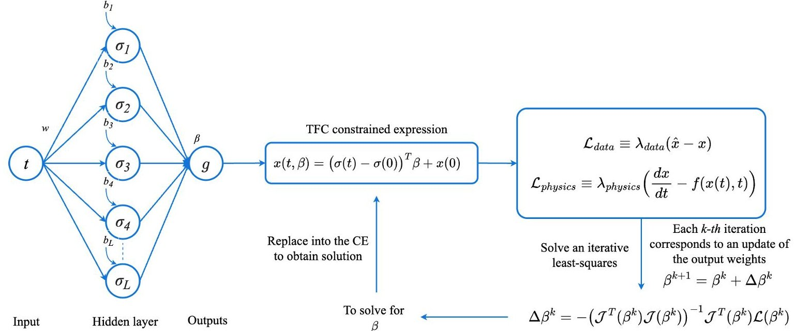

Figure 4. Schematic of the X-TFC algorithm that includes data and physics in the loss function. Input weights and biases are randomly selected. The last step solves the least-squares problem.

Table 1. Error values of RUL prediction in hours for different combinations of data availability and physics weights. In the right column, the computational time in milliseconds is reported.

RUL error (h)

<table border="1"><tr><td rowspan="2">Data availability(%)</td><td colspan="5">Physics weight</td><td rowspan="2">Time(ms)</td></tr><tr><td>1.0</td><td>0.75</td><td>0.50</td><td>0.25</td><td>0.0</td></tr><tr><td>100</td><td>0.00</td><td>9.74</td><td>24.78</td><td>44.39</td><td>55.57</td><td>45</td></tr><tr><td>75</td><td>22.15</td><td>42.09</td><td>73.27</td><td>110.98</td><td>133.19</td><td>35</td></tr><tr><td>50</td><td>42.25</td><td>75.50</td><td>131.50</td><td>208.59</td><td>240.30</td><td>25</td></tr><tr><td>25</td><td>54.48</td><td>102.51</td><td>202.23</td><td>409.15</td><td>597.23</td><td>15</td></tr></table>

et al., 2024a; Zhang et al., 2024). We define epistemic uncertainty as the variability in the predicted state vector that arises from two sources:

1. model-parameter uncertainty, that is, the fluctuations in the coefficients $ \beta $ induced by the random sampling of network weights w and biases b in Eq. (19)

2. data-driven uncertainty, that is, the variability in the observed data under our noise model, which we also propagate into the initial condition $ a_{0} $ of the HI by perturbing it with zero-mean Gaussian noise with standard deviations of 20 %.

In our analysis, we evaluate the predictive performance of the model using the mean of error (ME), the standard deviation of error (SDE), and the confidence interval (CI) of signed errors, where errors retain their direction (positive or negative). All error values and derived statistics are expressed in hours, and the simulations are performed with 100 MC realizations and physical loss weight equal to 1. The ME is

calculated as

$$
\mathrm {M E} = \frac {1}{m _ {c}} \sum_ {i = 1} ^ {m _ {c}} e _ {i},
$$

where $ e_{i} $ (in hours) is the error for the i th sample (predicted minus true value), and $ m_{c} $ is the total number of samples. The ME indicates systematic bias: a positive ME means earlier predictions of damage and the need for maintenance, and a negative ME means later predictions. The SDE is given by

$$
\mathrm {S D E} = \sqrt {\frac {1}{m _ {c} - 1} \sum_ {i = 1} ^ {m _ {c}} \left(e _ {i} - \mathrm {M E}\right) ^ {2}},
$$

which measures the spread of signed errors around the ME. A larger SDE (in hours) indicates greater variability in the prediction deviations. We also compute non-parametric percentiles of the $ e_{i} $ distribution to capture coverage analogous to Gaussian confidence levels:

- 68% interval ("1 $ \sigma $"), 16th to 84th percentiles of $ e_{i} $;

- 95 % interval ("2 $ \sigma $”), 2.5th to 97.5th percentiles of $ e_{i} $;

<!-- PDF_PAGE: 9 -->

(a)

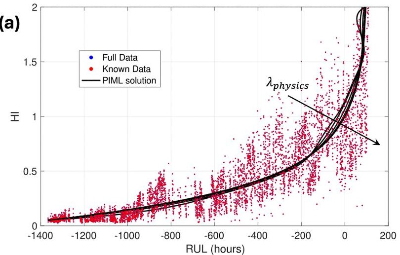

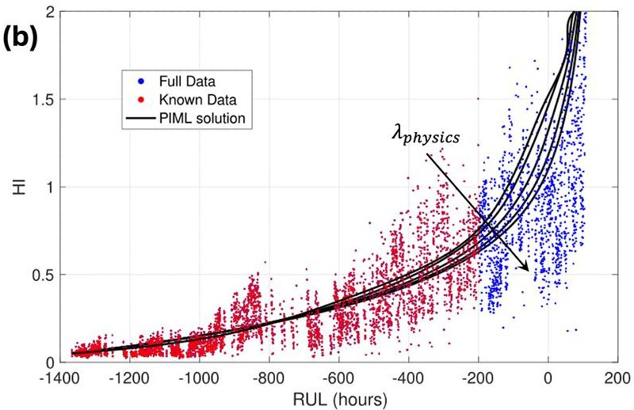

(c)

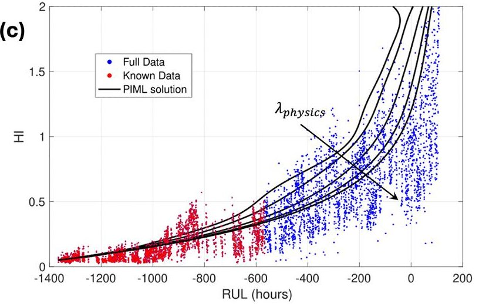

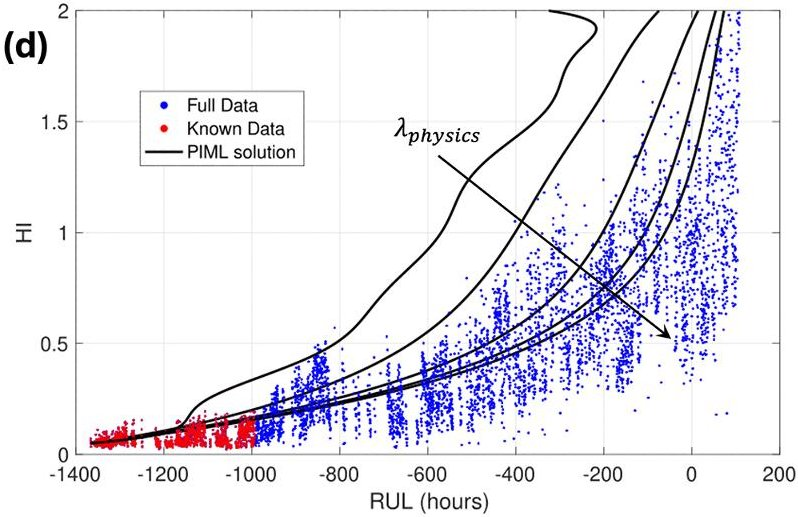

Figure 5. Results of PIML for different dataset sizes. For each scenario, different weights $ \lambda_{\mathrm{physics}}=[0.0,0.25,0.50,0.75,1.0] $ ）on the equation loss are given to understand the improvement in the RUL forecasting brought by the physics knowledge. (a) Full dataset available: 100 %. (b) Partial dataset available: 75 %. (c) Partial dataset available: 50 %. (d) Partial dataset available: 25 %.

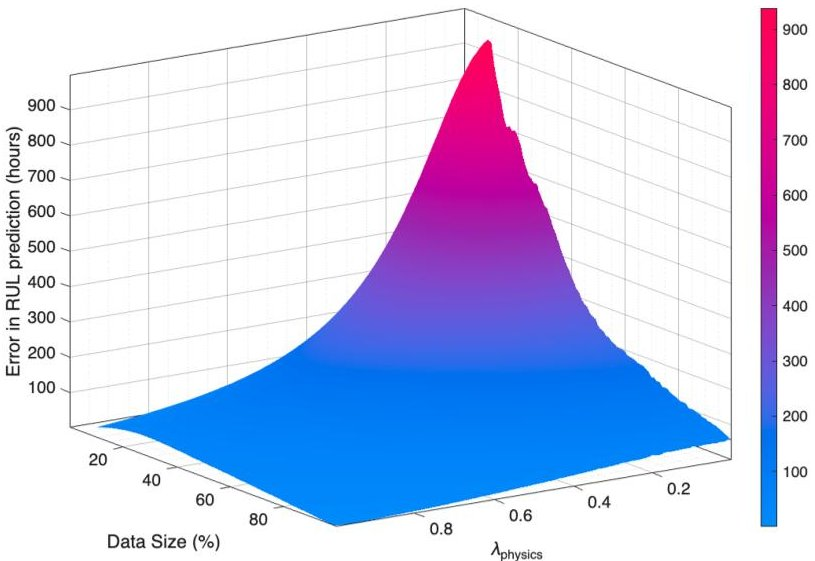

Figure 6. Error in RUL prediction (h) for different scenarios of dataset size and weights on physics loss.

- 99.7% interval ("3 $ \sigma $ "), 0.15th to 99.85th percentiles of $ e_{i} $ .

These intervals indicate where the central 68% , 95% , and 99.7% of signed errors lie, respectively, preserving information on whether prediction errors tend to be positive or negative. All these error metrics for epistemic UQ are reported in Table 2 for different dataset sizes. As expected, the absolute values of ME and SDE increase with a decrease in dataset size. The negative values of ME represent an error in an overly early prediction of damage and the need for maintenance. Computational times also decrease with a decrease in dataset size because of the smaller number of points in the data loss function. The CIs reported in Table 2 are also qualitatively shown in Fig. 7 for the three confidence percentages. Despite the inherent stochasticity of random model initialization and noisy observations, the resulting CIs remain moderate (e.g., $ \pm10 $ h for a 68% CI on the full dataset). This behavior stems primarily from the strong physics constraint given by Head's theory differential equation, which tightly regularizes the solution and limits divergence across ensemble members. As such, once model-induced variability is largely suppressed by physics-informed regularization, the spread in predictions stays relatively small, highlighting the effectiveness of embedding physical laws into the learning process.

<!-- PDF_PAGE: 10 -->

(a)

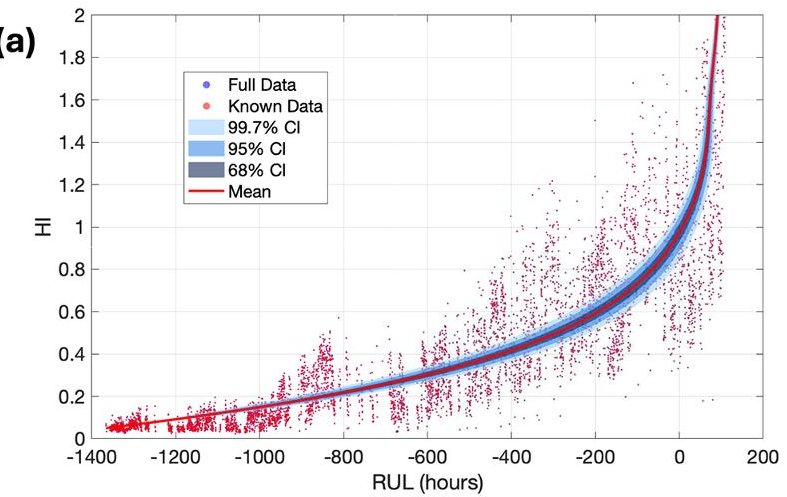

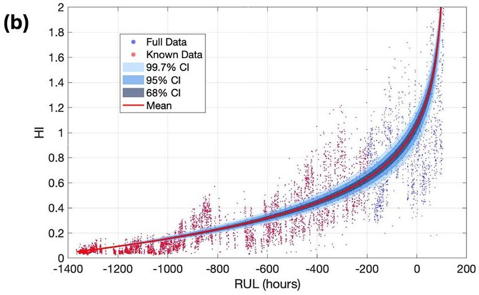

(c)

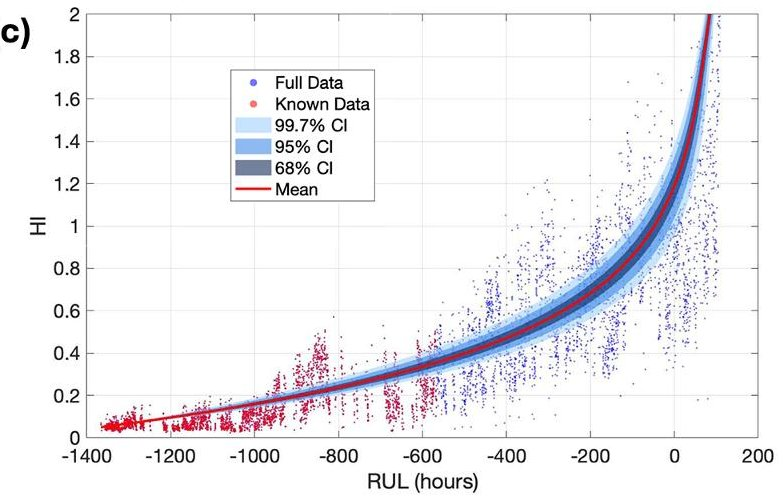

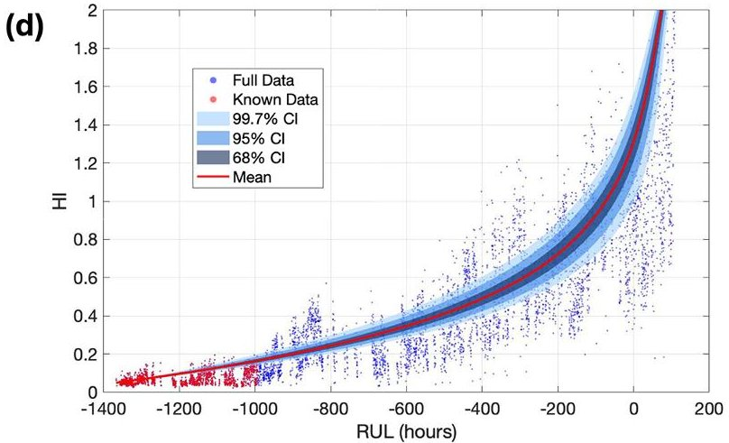

Figure 7. Epistemic quantification for different dataset sizes, considering $ \lambda_{\mathrm{physics}}=1 $ on the equation loss, and three CIs with 67 %, 95 %, and 99.7 % confidence obtained with 100 MC realizations. (a) Full dataset available: 100 %. (b) Partial dataset available: 75 %. (c) Partial dataset available: 50 %. (d) Partial dataset available: 25 %.

Table 2. Error values of RUL prediction in hours for different combinations of data availability while quantifying epistemic uncertainty. The error metrics in hours are the mean of error (ME), the standard deviation of error (SDE), and the confidence interval (CI) of error. The last column reports the computational time in seconds for 100 MC realizations.

<table border="1"><tr><td></td><td colspan="2">RUL error(h)</td><td colspan="3">CI of error(h)</td><td></td></tr><tr><td>Data availability(%)</td><td>ME</td><td>SDE</td><td>68%</td><td>95%</td><td>99.7%</td><td>Time(s)</td></tr><tr><td>100</td><td>7.43</td><td>11.28</td><td>[-3.16,17.52]</td><td>[-9.92,34.45]</td><td>[-13.22,38.86]</td><td>7.4</td></tr><tr><td>75</td><td>-18.09</td><td>14.63</td><td>[-31.80,-4.87]</td><td>[-40.76,16.67]</td><td>[-45.13,22.22]</td><td>5.7</td></tr><tr><td>50</td><td>-47.72</td><td>19.42</td><td>[-66.03,-30.05]</td><td>[-78.19,-2.08]</td><td>[-84.28,4.97]</td><td>4.9</td></tr><tr><td>25</td><td>-73.54</td><td>24.87</td><td>[-97.05,-50.68]</td><td>[-113.20,-16.01]</td><td>[-121.35,-7.46]</td><td>3.2</td></tr></table>

Since the epistemic uncertainty is reducible, the CIs presented in Fig. 7 are obtained with optimized parameters that reduce the epistemic uncertainty as low as possible. This reduction depends on the many hyperparameters selected, such as the activation function, number of collocation points, number of neurons, least-squares iteration tolerance, and random sampling ranges. An ablation study on the behavior of epistemic uncertainty depending on the choice of the random initialization of the neural network input weights and bias is shown in Fig. 8. The three plots show that the different choices of input weights and bias ranges can lead

to wider CIs for the RUL prediction, and by choosing the optimal hyperparameter setup, the epistemic (model) uncertainty can be reduced. Further reduction in prediction spread would therefore require enhancements in data quality, such as using higher-resolution measurements, to minimize noisedriven variability. Moreover, the aleatoric uncertainty is inherently irreducible (Hullermeier and Waegeman, 2021) and, in this case, is particularly high due to the very noisy data. In practical terms, this means that there is a minimum level of predictive uncertainty, driven by data noise, which cannot be further reduced by improving the model. Consequently, even

<!-- PDF_PAGE: 11 -->

(a)

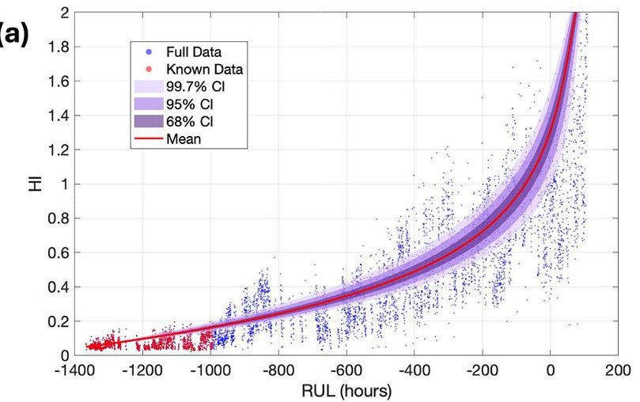

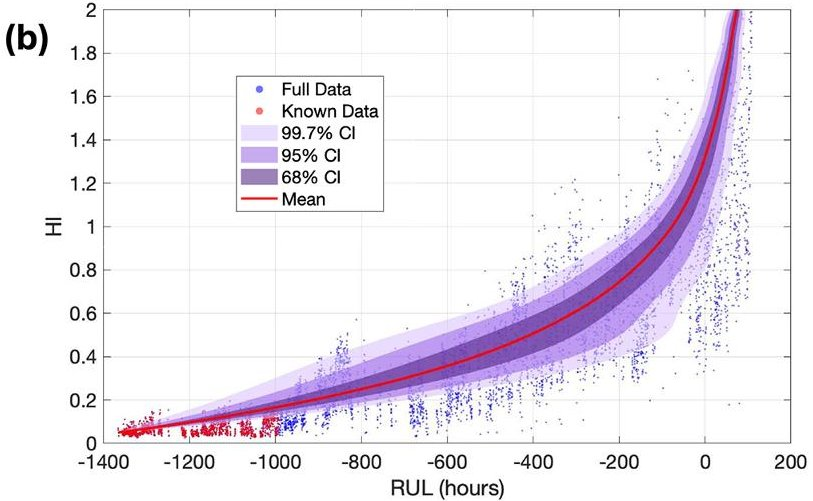

(c)

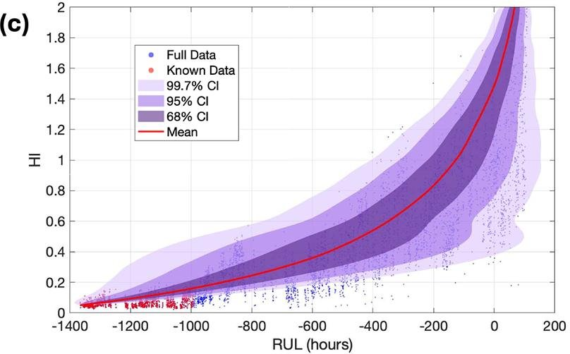

Figure 8. Ablation study on epistemic quantification for different random initializations of input weights and bias ranges, considering $ \lambda_{\mathrm{physics}}=1 $ on the equation loss; partial data size (25 %); and three CIs with 67 %, 95 %, and 99.7 % confidence obtained with 100 MC realizations. Random initialization of input weights and bias in ranges of (a) $ [-1,1] $ , (b) $ [-10,10] $ , and (c) $ [-20,20] $ .

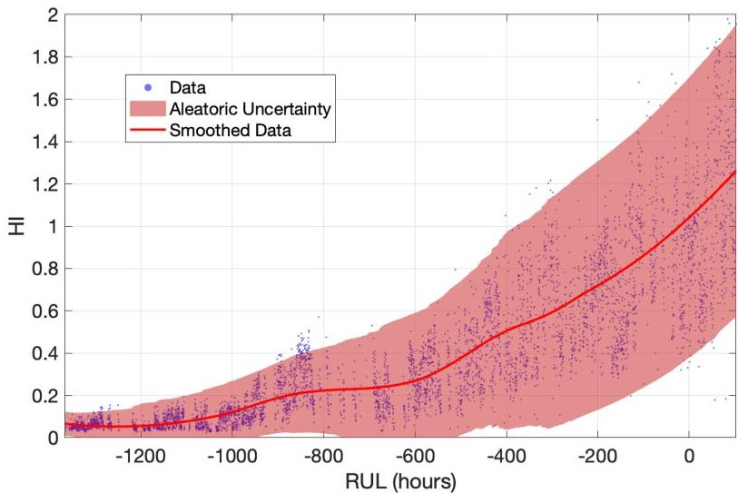

Figure 9. Aleatoric uncertainty band estimated from the vibrationbased HI. The shaded region represents $ \pm 2\sigma $ bounds based on the time-varying standard deviation of the residuals between noisy data and smoothed data. This illustrates the heteroscedastic, irreducible uncertainty arising from measurement noise.

a perfect model would still exhibit this baseline uncertainty dictated by the natural variability of the observations. This is shown in Fig. 9, where the CI of the aleatoric uncertainty is plotted against the noisy dataset. Because the dataset exhibits heteroscedastic noise, that is, noise amplitude varies over time, we first estimate the global noise scale by analyzing the full HI series. We apply a locally estimated scatter plot smoothing (LOESS) method to find a smoothed trend in the HI over time and then compute the residuals using the noisy dataset to capture fluctuations. Then, the overall noise level is approximated as the standard deviation of the residuals. Finally, the aleatoric uncertainty band in Fig. 9 is generated by plotting the smoothed trend $ \pm2\sigma $ , reflecting the heteroscedastic, irreducible noise-driven uncertainty in the HI measurements.

## 5.2 Application to SCADA-based health index

To demonstrate the generality and adaptability of the X-TFC framework, we further apply our methodology to an HI derived from SCADA data described in Eftekhari Milani et al. (2026). The SCADA dataset is from 1.5 MW wind turbines,

<!-- PDF_PAGE: 12 -->

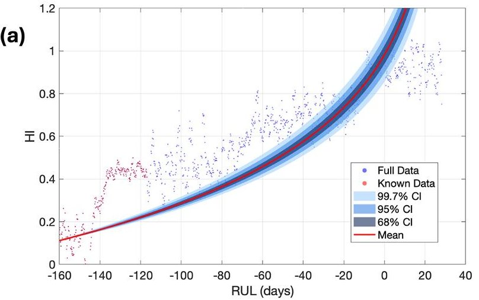

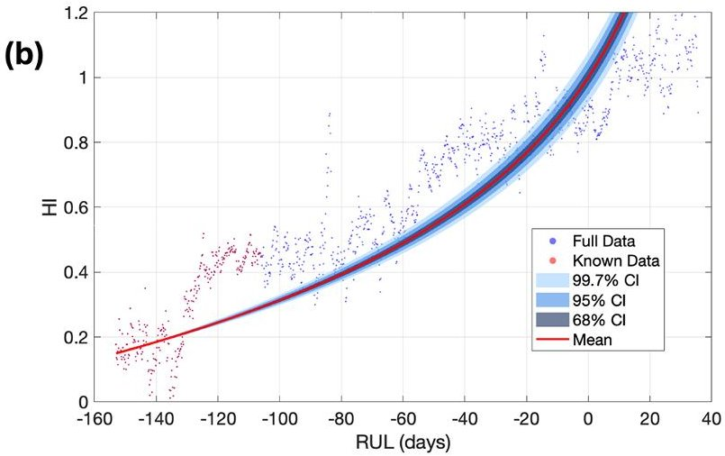

Figure 10. Epistemic uncertainty quantification with SCADA-based HI of two different gearbox bearings, considering $ \lambda_{\mathrm{physics}}=1 $ on the equation loss, and three CIs with 67 %, 95 %, and 99.7 % confidence obtained with 100 MC realizations. (a) Gearbox bearing no. 1. (b) Gearbox bearing no. 2.

with measurements available in a 10 min time frame beginning at their commissioning. These turbines have the same gearbox model, with one experiencing an intermediate-speed shaft bearing axial crack and the other experiencing a highspeed shaft bearing axial crack. The cracks are the first damage that occurred to these gearboxes, enabling an analysis of the bearing condition from a pristine state to cracked.

In the data pre-processing step, the non-operational data points with zero rotor speed or negative power are removed. In addition, the time stamps with missing or erroneous values due to sensor problems are dropped. Then, a daily averaging is performed, decreasing the missing data percentage from 14% in the 10min time frame to around 2% in the daily time frame. This averaging increases data continuity and reduces the computational burden. To obtain the HIs, the approach proposed in Eftekhari Milani et al. (2026) is used. First, for each turbine, the gearbox bearing temperature in the healthy state is modeled by training a convolutional neural network using the remaining six SCADA channels during the first year of operation, in which the bearings are expected to be healthy. Then, the modeled healthy-state gearbox bearing temperature values are subtracted from the recorded values, obtaining the residuals. They are then normalized according to the 1-year training period to obtain the residual z scores. These z scores, along with the four operational and environmental signals of power, rotor speed, wind speed, and ambient temperature, are input to a convolutional autoencoder (CAE)-based unsupervised HI construction model to build the HIs. A leave-one-out cross-validation is performed, where one wind turbine is set aside to test the CAE, and the remaining undamaged wind turbines are used to train the CAE. The trained CAE is then used to obtain the test wind turbine's HI.

While purely data-driven methods like LSTM and XG-Boost showed promise for SCADA data, their precision was limited, often resulting in a high number of false alarms

(Desai et al., 2020). To address this limitation, we applied X-TFC to the SCADA-based HIs of the two turbines with cracked bearings (Eftekhari Milani et al., 2026), embedding the same Head's theory differential equation used previously for vibration-based data. The physics model acts as a regularizer, enforcing consistency between the SCADA-derived HI trajectory and the expected fatigue crack growth behavior. In Fig. 10, epistemic uncertainty in the X-TFC RUL prediction for the SCADA-data-based HI is reported. When trained on only 25 % of the available SCADA HI trajectory, X-TFC obtains failure predictions with a confidence level of about 10 d. Importantly, the physics-informed structure of X-TFC helped to suppress model overfitting compared to traditional machine learning models applied directly to SCADA signals (Desai et al., 2020). This confirms the versatility and applicability of the X-TFC framework to both vibration- and SCADA-data-based HIs. This widens the scope of prognostic applications for wind turbines, enabling early and reliable failure prediction even when only typical SCADA data are accessible.

## 6 Conclusions

In this work, we have introduced and demonstrated the application of X-TFC as a PIML framework for predicting the RUL of wind turbine gearbox bearing cracks. By embedding Head's fracture mechanics model directly into the learning objective, X-TFC balances fidelity to HIs based on both vibration and SCADA data with consistency to the differential crack growth law. In particular, we calibrated the baseline PIML RUL estimate from the full 1475 h vibration-based HI dataset from a cracked high-speed bearing in a 2.2 MW wind turbine gearbox and full physics weighting $ \left( \lambda_{\mathrm{physics}}=1\right) $ to a value of HI equal to 1, indicating a high possibility of bearing damage and a need to perform maintenance. Lower values of weights and purely data-driven regression $ \left( \lambda_{\mathrm{physics}}=0\right) $ still

<!-- PDF_PAGE: 13 -->

lead to good accuracy in RUL prediction, with less than an error of 60 h. Even when only 25 % (or less) of the vibrationbased HI data are available, heavy weighting on the physics loss yields RUL errors below 60 h, a four-fold improvement over the data-only case ( $ \approx $ 600 h). This demonstrates X-TFC's ability to leverage domain knowledge to fill gaps in noisy, sparse, or intermittent monitoring data, while requiring very low computational times (of the order of milliseconds). To further enhance the interpretability and robustness of these predictions, we introduced an MC ensembling strategy (MC X-TFC) to quantify epistemic uncertainty. This approach produces CIs for the estimated RUL by propagating uncertainty due to both model initialization and measurement noise, thereby enabling probabilistic forecasting. These intervals provide insight into the reliability of each prediction and help operators assess risk in real-time maintenance planning. Finally, as shown for this case, the irreducible aleatoric uncertainty is high due to the natural variability of the HI data.

These results demonstrate the potential of X-TFC as a powerful, data-efficient, and computationally light methodology for bearing fatigue crack prognostics in rotating machinery. By guaranteeing physically plausible degradation trajectories regardless of data sparsity, X-TFC enables earlier and more reliable maintenance decisions, with the potential to reduce unplanned downtime and O&M costs for wind turbine gearboxes. Our study, in its early stage, focuses on HI data derived from bearing cracks and employs Head's theory as the governing crack growth law. By validating our methodology using HI data generated from both vibration and SCADA datasets, we confirm its versatility to bearings of multiple gearbox manufacturers, models, and ratings. To capture more realistic wind turbine bearing behavior, our PIML framework should be validated against larger, more diverse datasets. These models would enable real-time monitoring of bearing health by continuously ingesting streaming data and updating predictions as new information arrives.

Future extensions should also examine fatigue cracking in pitch bearing rings, which may require more comprehensive fracture mechanics models, such as multi-phase Paris laws or dislocation theory blends, to capture more complex and realistic nonlinear crack-load interactions. Continued development of UQ capabilities, such as MC X-TFC, will also be critical for producing probabilistic RUL estimates with actionable confidence bounds, especially in high-stakes decision environments.

Code availability. The codes used for the analyses and experiments presented in this study are available from the authors upon request.

Data availability. Datasets used in this research are not publicly accessible due to either non-disclosure agreement protection or unavailability of raw data.

Author contributions. Writing (original draft preparation), formal analysis, software, data curation, visualization: MD; writing (review and editing): MD, GA, JK, AEM, DZ, and SS; data acquisition: AEM and DZ; conceptualization: MD, JK, and SS; funding acquisition and project administration: SS.

Competing interests. At least one of the (co-)authors is a member of the editorial board of Wind Energy Science. The peer-review process was guided by an independent editor, and the authors also have no other competing interests to declare.

Disclaimer. This work was authored in part by the National Laboratory of the Rockies for the U.S. Department of Energy (DOE), operated under contract no. DE-AC36-08GO28308. Funding was provided by the U.S. Department of Energy Office of Energy Efficiency and Renewable Energy Wind Energy Technologies Office. The views expressed in the article do not necessarily represent the views of the DOE or the U.S. Government. The U.S. Government retains and the publisher, by accepting the article for publication, acknowledges that the U.S. Government retains a nonexclusive, paid-up, irrevocable, worldwide license to publish or reproduce the published form of this work, or allow others to do so, for U.S. Government purposes.

Publisher's note: Copernicus Publications remains neutral with regard to jurisdictional claims made in the text, published maps, institutional affiliations, or any other geographical representation in this paper. While Copernicus Publications makes every effort to include appropriate place names, the final responsibility lies with the authors. Views expressed in the text are those of the authors and do not necessarily reflect the views of the publisher.

Acknowledgements. The authors would like to thank Eric Bechhoefer for providing the vibration-based HI dataset used in this research.

Financial support. This research has been supported by the National Laboratory of the Rockies (grant no. DE-AC36-08GO28308).

Review statement. This paper was edited by Michael Muskulus and reviewed by two anonymous referees.

## References

Ahmadi Daryakenari, N., De Florio, M., Shukla, K., and Karniadakis, G. E.: AI-Aristotle: A physics-informed framework for systems biology gray-box identification, PLOS Computational Biology, 20, e1011916, https://doi.org/10.1371/journal.pcbi.1011916, 2024.

Bechhoefer, E. and Dube, M.: Contending Remaining Useful Life Algorithms, in: Annual Conference of the PHM Society, vol. 12, 9-9, https://doi.org/10.36001/phmconf.2020.v12i1.1274, 2020.

<!-- PDF_PAGE: 14 -->

Bechhoefer, E., Xiao, L., and Zhang, X.: Remaining Useful Life Calculation of a Component using Hybrid Fatigue Crack Model, in: Annual Conference of the PHM Society, vol. 13, https://doi.org/10.36001/phmconf.2021.v13i1.3062, 2021.

Beer, F., Johnston, E., and DeWolf, J.: Mechanics of materials, 5th SI Edition, Stress, 1, 1-12, 1999.

Cai, S., Mao, Z., Wang, Z., Yin, M., and Karniadakis, G. E.: Physics-informed neural networks (PINNs) for fluid mechanics: A review, Acta Mechanica Sinica, 37, 1727-1738, https://doi.org/10.1007/s10409-021-01148-1, 2021.

Clark, C., Guo, Y., Sheng, S., and Keller, J.: Effects of Bearing Clearance, Oil Viscosity, and Temperature on Bearing White-Etching Cracks, NREL/TP-5000-85917, Golden, CO, National Renewable Energy Laboratory, 2023.

De Florio, M., Schiassi, E., Ganapol, B. D., and Furfaro, R.: Physics-informed neural networks for rarefied-gas dynamics: Thermal creep flow in the Bhatnagar-Gross-Krook approximation, Physics of Fluids, 33, https://doi.org/10.1063/5.0046181 2021.

De Florio, M., Schiassi, E., and Furfaro, R.: Physics-informed neural networks and functional interpolation for stiff chemical kinetics, Chaos: An Interdisciplinary Journal of Nonlinear Science, 32, https://doi.org/10.1063/5.0086649, 2022a.

De Florio, M., Schiassi, E., Ganapol, B. D., and Furfaro, R.: Physics-informed neural networks for rarefiedgas dynamics: Poiseuille flow in the BGK approximation, Zeitschrift für angewandte Mathematik und Physik, 73, 126, https://doi.org/10.1007/s00033-022-01767-z, 2022b.

De Florio, M., Kevrekidis, I. G., and Karniadakis, G. E.: AI-Lorenz: A physics-data-driven framework for black-box and gray-box identification of chaotic systems with symbolic regression, Chaos, Solitons & Fractals, 188, 115538, https://doi.org/10.1016/j.chaos.2024.115538, 2024.

De Florio, M., Zou, Z., Schiavazzi, D. E., and Karniadakis, G. E.: Quantification of total uncertainty in the physics-informed reconstruction of CVSim-6 physiology, Philosophical Transactions A, 383, 20240221, https://doi.org/10.1098/rsta.2024.0221, 2025.

Demas, N. G., Lorenzo-Martin, C., Luna, R., Erck, R. A., and Greco, A. C.: The Effect of Current and Lambda on White-etch-crack Failures, Tribology International, 189, 108951, https://doi.org/10.1016/j.triboint.2023.108951, 2023.

Desai, A., Guo, Y., Sheng, S., Phillips, C., and Williams, L.: Prognosis of wind turbine gearbox bearing failures using SCADA and modeled data, in: Annual conference of the PHM society, vol. 12, 1-10, https://doi.org/10.36001/phmconf.2020.v12i1.1292, 2020.

Dong, S. and Li, Z.: Local extreme learning machines and domain decomposition for solving linear and nonlinear partial differential equations, Computer Methods in Applied Mechanics and Engineering, 387, 114129, https://doi.org/10.1016/j.cma.2021.114129, 2021.

Dwivedi, V. and Srinivasan, B.: Physics informed extreme learning machine (PIELM) - a rapid method for the numerical solution of partial differential equations, Neurocomputing, 391, 96-118, https://doi.org/10.1016/j.neucom.2019.12.099, 2020.

Eftekhari Milani, A., Zappalá, D., Sheng, S., and Watson, S.: Probabilistic prediction of wind turbine remaining useful life using Conformalised Quantile Regression, Wind Energ. Sci., submitted, 2026.

Fabiani, G.: Random projection neural networks of best approximation: Convergence theory and practical applications, SIAM Journal on Mathematics of Data Science, 7, 385-409 https://doi.org/10.1137/24M1639890, 2025.

Fabiani, G., Calabrò, F., Russo, L., and Siettos, C.: Numerical solution and bifurcation analysis of nonlinear partial differential equations with extreme learning machines, Journal of Scientific Computing, 89, 44, https://doi.org/10.1007/s10915-021-01650-5, 2021.

Fabiani, G., Bollt, E., Siettos, C., and Yannacopoulos, A. N.: Stability Analysis of Physics-Informed Neural Networks for Stiff Linear Differential Equations, arXiv [preprint], https://doi.org/10.48550/arXiv.2408.15393, 2024.

Frost, N. E., Marsh, K. J., and Pook, L. P.: Metal fatigue, Courier Corporation, ISBN 0-486-40927-9, 1999.

Galaris, E., Calabrò, F., di Serafino, D., and Siettos, C.: Numerical solution of stiff ordinary differential equations with random projection neural networks, arXiv [preprint], https://doi.org/10.48550/arXiv.2108.01584, 2021.

Ganaie, M. A., Hu, M., Malik, A. K., Tanveer, M., and Suganthan, P. N.: Ensemble deep learning: A review, Engineering Applications of Artificial Intelligence, 115, 105151 https://doi.org/10.1016/j.engappai.2022.105151, 2022.

Gawlikowski, J., Rovile, C., Tassi, N., Ali, M., Lee, J., Humt., M., Feng. J., Kruspe, A., Triebel, R., Jung, P., Roscher, R., Shahzad, M., Yang, W., Bamler, R., and Zhu, X.: A survey of uncertainty in deep neural networks, Artificial Intelligence Review, 56, 1513- 1589, https://doi.org/10.1007/s10462-023-10562-9, 2023.

Greco, A., Sheng, S., Keller, J., and Erdemir, A.: Material Wear and Fatigue in Wind Turbine Systems, Wear, 302, 1583-1591 https://doi.org/10.1016/j.wear.2013.01.060, 2013.

Greco, A., Demas, N., Erck, R., Gould, B., Keller, J., Sheng, S., and Guo, Y.: Wind Turbine Drivetrain Reliability, NREL/PR 5000-84029, Golden, CO, National Renewable Energy Laboratory, https://doi.org/10.2172/1896902, 2022.

Guo, Y., Sheng, S., Phillips, C., Keller, J., Veers, P., and Williams, L.: A Methodology for Reliability Assessment and Prognosis of Bearing Axial Cracking in Wind Turbine Gearboxes, Renewable and Sustainable Energy Reviews, 127, 109888, https://doi.org/10.1016/j.rser.2020.109888, 2020.

Han, S., Stelz, L., Stoecker, H., Wang, L., and Zhou, K.: Approaching epidemiological dynamics of COVID-19 with physics-informed neural networks, Journal of the Franklin Institute, 361, 106671, https://doi.org/10.1016/j.jfranklin.2024.106671, 2024.

Haus, L., Sheng, S., and Pulikollu, R.: Wind Turbine Major Systems Reliability Trends and Mitigation Strategies, in: Drivetrain Reliability Collaborative Meeting, 2024.

Haus, L., Sheng, S., and Pulikollu, R.: Newer/Larger Wind Turbine Reliability Analysis & Applications, in: Drivetrain Reliability Collaborative Meeting, 2025.

Huang, G.-B., Zhu, Q.-Y., and Siew, C.-K.: Extreme learning machine: theory and applications, Neurocomputing, 70, 489-501 https://doi.org/10.1016/j.neucom.2005.12.126, 2006.

Hüllermeier, E. and Waegeman, W.: Aleatoric and epistemic uncertainty in machine learning: An introduction to concepts and methods, Machine learning, 110, 457-506, https://doi.org/10.1007/s10994-021-05946-3, 2021.

<!-- PDF_PAGE: 15 -->

Jensen, O. L., Heuser, L., and Petersen, K. E.: Prevention of 'White Etching Cracks' in Rolling Bearings in Vestas Wind Turbines, in: Conference for Wind Power Drives, 2021.

Karniadakis, G. E., Kevrekidis, I. G., Lu, L., Perdikaris, P., Wang, S., and Yang, L.: Physics-informed machine learning, Nature Reviews Physics, 3, 422-440, https://doi.org/10.1038/s42254-021-00314-5, 2021.

Kharazmi, E., Cai, M., Zheng, X., Zhang, Z., Lin, G., and Karniadakis, G. E.: Identifiability and predictability of integer- and fractional-order epidemiological models using physics-informed neural networks, Nature Computational Science, 1, 744-753, https://doi.org/10.1038/s43588-021-00158-0, 2021.

Lakshminarayanan, B., Pritzel, A., and Blundell, C.: Simple and scalable predictive uncertainty estimation using deep ensembles, Advances in Neural Information Processing Systems, 30, 6405- 6416, 2017.

Millevoi, C., Pasetto, D., and Ferronato, M.: A Physics-Informed Neural Network approach for compartmental epidemiological models, PLOS Computational Biology, 20, e1012387, https://doi.org/10.1371/journal.pcbi.1012387, 2024.

Mortari, D.: Least-squares solution of linear differential equations, Mathematics, 5, 48, https://doi.org/10.3390/math5040048, 2017a.

Mortari, D.: The theory of connections: Connecting points, Mathematics, 5, 57, https://doi.org/10.3390/math5040057, 2017b.

Mortari, D., Johnston, H., and Smith, L.: High accuracy leastsquares solutions of nonlinear differential equations, Journal of computational and Applied Mathematics, 352, 293-307, https://doi.org/10.1016/j.cam.2018.12.007, 2019.

Osorio, J. D., De Florio, M., Hovsapian, R., Chryssostomidis, C., and Karniadakis, G. E.: Physics-Informed machine learning for solar-thermal power systems, Energy Conversion and Management, 327, 119542, https://doi.org/10.1016/j.enconman.2025.119542, 2025.

Pickering, E., Guth, S., Karniadakis, G. E., and Sapsis, T. P.: Discovering and forecasting extreme events via active learning in neural operators, Nature Computational Science, 2, 823-833, https://doi.org/10.1038/s43588-022-00376-0, 2022.

Psaros, A. F., Meng, X., Zou, Z., Guo, L., and Karniadakis, G. E.: Uncertainty quantification in scientific machine learning: Methods, metrics, and comparisons, Journal of Computational Physics, 477, 111902, https://doi.org/10.1016/j.jcp.2022.111902, 2023.

Pugno, N., Ciavarella, M., Cornetti, P., and Carpinteri, A.: A generalized Paris' law for fatigue crack growth, Journal of the Mechanics and Physics of Solids, 54, 1333-1349, https://doi.org/10.1016/j.jmps.2006.01.007, 2006.

Rahaman, R. and Theiry, A. H.: Uncertainty quantification and deep ensembles, Advances in Neural Information Processing Systems, 34, 20063-20075, 2021.

Raissi, M., Perdikaris, P., and Karniadakis, G. E.: Physics-informed neural networks: A deep learning framework for solving forward and inverse problems involving nonlinear partial differential equations, Journal of Computational Physics, 378, 686-707 https://doi.org/10.1016/j.jcp.2018.10.045, 2019.

Raissi, M., Yazdani, A., and Karniadakis, G. E.: Hidden fluid mechanics: Learning velocity and pressure fields from flow visualizations, Science, 367, 1026-1030, https://doi.org/10.1126/science.aaw4741, 2020.

Sahli Costabal, F., Yang, Y., Perdikaris, P., Hurtado, D. E., and Kuhl, E.: Physics-informed neural networks for cardiac activation mapping, Frontiers in Physics, 8, 42, https://doi.org/10.3389/fphy.2020.00042, 2020.

Schiassi, E., De Florio, M., D'Ambrosio, A., Mortari, D., and Furfaro, R.: Physics-informed neural networks and functional interpolation for data-driven parameters discovery of epidemiological compartmental models, Mathematics, 9, 2069, https://doi.org/10.3390/math9172069, 2021a.

Schiassi, E., Furfaro, R., Leake, C., De Florio, M., Johnston, H., and Mortari, D.: Extreme theory of functional connections: A fast physics-informed neural network method for solving ordinary and partial differential equations, Neurocomputing, 457, 334- 356, https://doi.org/10.1016/j.neucom.2021.06.015, 2021b.

Schiassi, E., De Florio, M., Ganapol, B. D., Picca, P., and Furfaro, R.: Physics-informed neural networks for the point kinetics equations for nuclear reactor dynamics, Annals of Nuclear Energy, 167, 108833, https://doi.org/10.1016/j.anucene.2021.108833, 2022.

Schleich, F.: Investigation of Cracked Blade Bearing Rings, in: Drivetrain Reliability Collaborative Meeting, 2025.

Shapiro, J.: Pitch Bearing Investigations, in: Drivetrain Reliability Collaborative Meeting, 2017.

Stehly, T., Duffy, P., and Hernando, D. M.: Cost of Wind Energy Review: 2024 Edition, NREL/PR-5000-91775, Golden, CO, National Renewable Energy Laboratory, https://doi.org/10.2172/2479271, 2024.

Wang, Y. and Dong, S.: An extreme learning machine-based method for computational PDEs in higher dimensions, Computer Methods in Applied Mechanics and Engineering, 418, 116578, https://doi.org/10.1016/j.cma.2023.116578, 2024.

Wenzel, F., Snoek, J., Tran, D., and Jenatton, R.: Hyperparameter ensembles for robustness and uncertainty quantification, Advances in Neural Information Processing Systems, 33, 6514 6527, 2020.

Wiser, R., Bolinger, M., and Lantz, E.: Assessing Wind Power Operating Costs in the United States: Results from a Survey of Wind Industry Experts, Renewable Energy Focus, 30, 46-57, https://doi.org/10.1016/j.ref.2019.05.003, 2019.

Wiser, R., Millstein, D., Hoen, B., Bolinger, M., Gorman, W., Rand, J., Barbose, G., Cheyette, A., Darghouth, N., Jeong, S., Kemp, J. M., O'Shaughnessy, E., Paulos, B., and Seel, J.: Land-Based Wind Market Report: 2024 Edition, Tech rep., Berkeley, CA, Lawrence Berkeley National Laboratory, https://doi.org/10.2172/2434282, 2024.

Yin, M., Zheng, X., Humphrey, J. D., and Karniadakis, G. E.: Non-invasive inference of thrombus material properties with physics-informed neural networks, Computer Methods in Applied Mechanics and Engineering, 375, 113603, https://doi.org/10.1016/j.cma.2020.113603, 2021.

Zhang, Z., Zou, Z., Kuhl, E., and Karniadakis, G. E.: Discovering a reaction-diffusion model for Alzheimer's disease by combining PINNs with symbolic regression, Computer Methods in Applied Mechanics and Engineering, 419, 116647, https://doi.org/10.1016/j.cma.2023.116647, 2024.

Zou, Z. and Karniadakis, G. E.: Multi-head physics-informed neural networks for learning functional priors and uncertainty quantification, Journal of Computational Physics, 531, 113947, https://doi.org/10.1016/j.jcp.2025.113947, 2025.

<!-- PDF_PAGE: 16 -->

