<!-- PDF_PAGE: 1 -->

The Electrochemical Society of Japan

Article

J-STAGE https://doi.org/10.5796/electrochemistry.25-00143

Electrochemistry, 94(2), 027002 (2026)

Simultaneous Estimation of State of Health and Remaining Useful Life for Lithium-ion Batteries Using a Transfer-Learning-Based Fusion Model

OPEN ACCESS

Bingyao ZHANG $ ^{a} $ Huimin MA, $ ^{b} $ Qiaozhen JI, $ ^{c} $ Hongliang HAO, $ ^{b} $ Zijie FEI, $ ^{a} $ Jiayi JIN, $ ^{a} $ Qiangqiang LIAO, $ ^{a,*} $ and Fei WANG $ ^{a} $

$ ^{a} $ Shanghai University of Electric Power, No. 2588 Changyang Road, Yangpu District, Shanghai 200090, China

b Peking University Ordos Research Institute of Energy, No. 5 Minzu Road, Kangbashi District, Ordos 017010, China

$ ^{c} $ Electric Power Science Research Institute, No. 299 Ziyun Road, Economic and Technological Development District, Hefei 230031, China

* Corresponding author: liaoqiangqiang@shiep.edu.cn

## ABSTRACT

Accurate battery-state estimation is considered essential for safe and stable lithium-ion battery operation. A novel joint framework is proposed in this study, in which only capacity data are employed as input, and the learning rate, hidden-layer node count and regularization coefficient of the Transformer-BiLSTM model are optimized by the Newton-Raphson-based optimizer algorithm (NRBO). Capacity-rebound patterns and long-term degradation are captured more accurately by NRBO algorithm, while local optima are avoided. Transfer learning is introduced, and positional embedding is fused with self-attention, so aging trajectories across chemistries are predicted accurately. The model is shown to support not only intra-type battery transfer but also inter-type transfer across different chemistries. The developed hybrid model is validated not only for cells tested at $ 4^{\circ} \mathrm{C} $ $ 24^{\circ} \mathrm{C} $ and $ 43^{\circ} \mathrm{C} $ , but also for data collected under both dynamic and constant operating conditions. Using only the first 10% of the data, the proposed model keeps both mean absolute error (MAE) and root means square error (RMSE) below 1% across all three battery types.

© The Author(s) 2025. Published by ECSJ. This is an open access article distributed under the terms of the Creative Commons Attribution 4.0 License (CC BY, https://creativecommons.org/licenses/by/4.0/), which permits unrestricted reuse of the work in any medium provided the original work is properly cited. [DOI: 10.5796/electrochemistry.25-00143].

Keywords : Lithium-ion Battery, Transfer Learning, State of Health, Remaining Useful Life

## 1. Introduction

The demand for new energy vehicles and energy storage systems is growing rapidly to reduce the environmental pollution caused by the production and consumption of fossil fuels. $ ^{1} $ Particularly in the new energy vehicle market, lithium-ion batteries have significantly enhanced the range and user experience of electric vehicles due to their high energy density and long life, thereby greatly promoting the popularity of electric vehicles. $ ^{2} $ It is expected that the application scale of electric vehicles will grow rapidly and gradually replace the dominant position of traditional vehicles. Under the condition of limited resources, the efficient use and recycling of lithium-ion batteries are key to ensuring the sustainable development of electric vehicles. $ ^{3} $ Additionally, the battery management system, as a core component and the most expensive part of an electric vehicle, is of great significance for timely maintenance, accurate residual value assessment, and full utilization of its secondary life. $ ^{4} $ The state of health (SOH) can be defined as the ratio of the current maximum available capacity of a new battery to its rated capacity, $ ^{5} $ as shown in Eq.1.

$$
S O H = \frac {Q _ {\max}}{Q _ {r a t e d}} \times 100 \%
$$

Monitoring the SOH of batteries and conducting advanced predictions are of great importance. Battery cycling aging experiments used for monitoring battery SOH and its cycle life were expensive and time-consuming in the past. A large amount of work has been carried out to estimate battery SOH at a lower cost, achieving more efficient, high-precision, and robust battery SOH monitoring in recent years. $ ^{6-8} $ Remaining useful life (RULcycle) represents the number of cycles required to reduce the maximum available capacity of the battery to the end of life (EOL). RULmonth aims to estimate the number of months from the current time point until the battery performance degrades to a capacity below 80 % of

the rated capacity. Jia et al. $ ^{9} $ developed a method for predicting battery RUL by combining sample entropy and relevance vector machine, where multiple entropy inputs better describe battery aging for RUL prediction. Liu et al. $ ^{10} $ extracted measurable features during constant current (CC) and constant voltage (CV) charging and used a multi-variate Gaussian process regression (GPR) model to predict battery RUL, but it lacked a prediction method for battery operation under dynamic conditions. Many studies are committed to feature extraction now. Sajad et al. $ ^{11} $ proposed a practical method to analyze and extract 19 features from differential capacity and differential voltage curves to use sparse Bayesian learning methods for early prediction of battery RUL. Fu et al. $ ^{12} $ developed a method for feature extraction using incremental slope (IS), deriving generalized multi-dimensional features suitable for various working conditions through detailed analysis of battery aging data. Li et al. $ ^{13} $ studied the charging and discharging processes of batteries under vibration stress. Starting from the top-down discharge voltage sequence, indirect health indicators were determined, and the estimation of battery capacity using these indicators was demonstrated through grey relational analysis. However, challenges remain in extracting health features from measured parameters (e.g., voltage, current, and temperature). Some health features, including internal resistance and temperature distribution, require precise measurement techniques or continuous monitoring, and the extraction methods are generally lacking in universality, limiting the applicability of the models. $ ^{14} $ Although these prediction methods have achieved reasonable results, the large amount of training data with strict battery operation requirements limits their application in real-world scenarios. The calculation of battery capacity depends on a complete charge-discharge cycle and is greatly affected by temperature and current rate. For practical applications, more attention is paid to the degradation of battery capacity, as capacity directly determines how much energy the battery can store and release. $ ^{15} $ Therefore, this study no longer performs manual feature extraction but directly

<!-- PDF_PAGE: 2 -->

predicts the future trajectory of battery life based on the collected data, thereby conducting SOH estimation and RUL prediction of batteries.

Accurate estimation of the SOH and prediction of the RUL of lithium-ion batteries is crucial for ensuring their safe operation and extending their lifespan. However, existing methods still have significant deficiencies in dynamic temperature adaptability and generalization capabilities across different datasets. Although models based on electrochemical mechanisms can explain the battery aging process, their complex parameter identification procedures limit their practical application. $ ^{16} $ Traditional machine learning models such as support vector regression (SVR) heavily rely on manual feature extraction in data-driven methods. $ ^{17} $ Deep learning methods, such as convolutional neural networks (CNN) and long short-term memory networks (LSTM), can automatically learn features, $ ^{18,19} $ but they face the problem of being easily trapped in local optimal solutions during the training process. $ ^{20} $ Some studies have attempted to use multi-task learning frameworks to simultaneously predict SOH and RUL in recent years. $ ^{21} $ However, these methods often require retraining most of the network parameters when transferring across datasets, leading to a significant drop in performance in small sample scenarios. $ ^{22} $ In terms of optimization algorithms, gradient descent methods are sensitive to initial values and have slow convergence speeds, $ ^{23} $ while swarm intelligence algorithms such as particle swarm optimization (PSO) have global search capabilities but suffer from high computational costs. $ ^{24} $ It is particularly noteworthy that most existing studies have verified model performance under constant conditions, $ ^{25,26} $ lacking adaptability tests for dynamic changes, which severely restricts the application value of models in real-world complex working conditions. $ ^{27} $ Traditional supervised learning methods find it difficult to effectively construct accurate prediction models. Transfer learning, by transferring existing model knowledge to new domains, can achieve good generalization capabilities even with a small number of samples, thus becoming an effective solution to this problem. Shen et al. $ ^{28} $ proposed a deep learning-based method for lithium-ion battery capacity estimation, combining transfer learning and ensemble learning concepts. Experimental results showed that the DCNN-ETL model outperformed other data-driven methods such as random forest regression, Gaussian process regression, DCNN, DCNN-TL, and DCNN-EL on the target dataset, with an overall root mean square error (RMSE) of 1.503 %. The study demonstrated that transfer learning and ensemble learning could significantly improve model performance on small datasets, providing an efficient method for lithium-ion battery capacity estimation. Deng et al. $ ^{29} $ used a Seq2Seq model combined with a Gaussian process regression (GPR) residual model to obtain accurate battery capacity prediction results, effectively capturing the overall degradation trend of battery capacity, while the GPR model compensated for local capacity changes. Although the model has demonstrated excellent performance in predicting the SOH of batteries, it is limited to single-task prediction and is not yet capable of handling multi-task prediction simultaneously.

Considering the limitations identified in the methods proposed in the literature, a new model capable of simultaneously estimating SOH and predicting RUL is presented in this paper, which combines the Transformer and Bidirectional Long Short-Term Memory (BiLSTM) structures and incorporates the Newton-Raphson-based optimizer (NRBO) algorithm proposed in 2024 to optimize model parameters. $ ^{30,31} $ Transfer learning is then employed to estimate the SOH and predict the RUL of lithium-ion batteries. The main contributions of this paper are as follows:

(1) The NRBO optimization algorithm was incorporated, and the learning rate, the number of hidden-layer nodes, and the regularization coefficient were optimized during the training of the Transformer-BiLSTM model. When compared with the

training process without the optimizer, reductions of 36.3 % and 45.1 % in mean absolute error (MAE) and RMSE were achieved, respectively. Additionally, the network structure is allowed to be adjusted automatically according to the complexity of the data by the NRBO algorithm, so overfitting is effectively prevented. The capability of solving complex nonlinear problems in SOH estimation and RUL prediction is also enhanced, and the intricate capacity-rebound patterns during charge-discharge cycles as well as the long-term capacity-degradation trends are captured more accurately, while entrapment in local optima is avoided.

(2) Transfer learning was introduced in this study, and a positional embedding layer together with a self-attention layer was fused into the model. Positional information was appended to every step of the battery data by the positional embedding layer, so the battery states at distinct time steps could be distinguished, and the perception of temporal positions was thereby enhanced. Short-term capacity regeneration and long-term capacity degradation during battery aging were dynamically focused on by the self-attention layer, and the capture of these critical patterns was consequently improved. Aging trajectories across different datasets are predicted more accurately by the fused model. When only the first 10 % of battery data from the target dataset was used, SOH was estimated with average MAE and RMSE of 0.68 % and 0.71 %, respectively, and RUL was predicted with average MAE and RMSE of 0.65 % and 0.70 %, respectively.

(3) Simultaneous SOH estimation and RUL prediction are enabled by the NRBO-Transformer-BiLSTM model constructed in this study, without the need for several separate dedicated models. The model can be applied to Nickel-Cobalt-Manganese (NCM), Nickel-Cobalt-Aluminum (NCA) and $ \mathrm{L i F e P O_{4}} $ (LFP) battery types in different cases. Battery data can be handled by the model not only under multiple temperature conditions-such as $ 4^{\circ} \mathrm{C} $ $ 24^{\circ} \mathrm{C} $ , and $ 43^{\circ} \mathrm{C} $ -but also under various operating conditions, including dynamic and steady states. Superior robustness and broad universality of the model are thereby exhibited.

The remainder of this paper is organized as follows: Section 2 briefly introduces the data sources, Section 3 presents the models used and the overall framework for establishing the models, Section 4 details the determination of hyperparameter values, the prediction results and analysis of the proposed method, the validation of different methods using the same dataset, and the validation of the same method using different datasets, and Section 5 summarizes the conclusions.

## 2. Data Acquisition

The study utilized charging data from the battery packs of 20 commercial electric vehicles, $ ^{29} $ with a time span of approximately two years (about 29 months). The vehicles are Beijing Automotive Industry Corporation EU500, equipped with NCM batteries. The nominal capacity is 145 Ah, and there are 90 battery cells connected in series and 32 temperature sensors inside the pack. These vehicles had identical battery systems, numbered #1, #2,..., #20 in this study. The charging data was received by the charging equipment through Controller Area Network (CAN) communication during the charging process, with an encoding frequency of 8 seconds. Due to limitations in data transmission, the resolution of the real vehicle data was lower than that of laboratory test data. The current curve, voltage curve, and capacity curve of the first vehicle over a period of seven days are illustrated in Fig. 1a. The vehicle uses a multi-stage constant current charging strategy, but the specific current value at each stage is adjusted according to battery temperature. The robustness of the proposed method was verified by the data of seven

<!-- PDF_PAGE: 3 -->

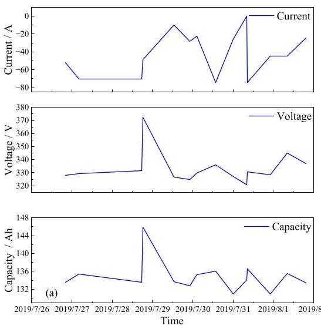

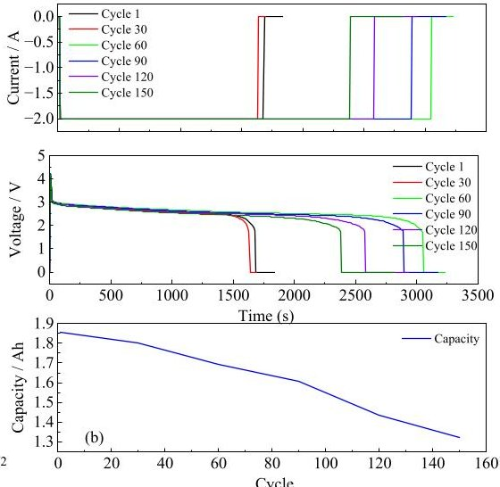

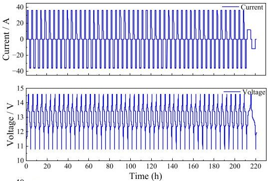

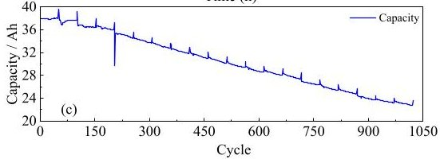

Figure 1. The current curve, voltage curve, and discharge capacity curve of the first vehicle over a period of seven days (a), the current curves, voltage curves, and discharge capacity curve of the B0005 battery over 6 cycles (b) and the current curve, voltage curve, and discharge capacity curve of LFP battery over a period of nine days (c).

cars from #1 to #7, considering that the real-time conditions of each car are not all the same.

NCA batteries provided by the U.S. National Aeronautics and Space Administration (NASA) laboratory are selected to validate the universality of the proposed method. The batteries were operated at different temperatures $ (24^{\circ} \mathrm{C}, 43^{\circ} \mathrm{C}, $ and $ 4^{\circ} \mathrm{C} $ under two different operating modes (charging and discharging). The batteries were charged at a constant current (CC) of 1.5 A until the battery voltage reached 4.2 V, followed by constant voltage (CV) charging until the charging current decreased to 20 mA. When the battery voltage dropped to the respective cut-off voltage, the batteries were discharged at a constant current, and this cycle was repeated to accelerate battery aging. The aging process was terminated when the battery reached the end-of-life (EOL) standard, i.e., when the rated capacity (from 2 Ah to 1.4 Ah) decreased by $ 30\% $ . Taking battery B0005 as an example, the current curves, voltage curves, and discharge capacity curves over 6 cycles are shown in Fig. 1b. Detailed information of the battery dataset used is shown in Table 1.

The LFP battery module in the laboratory is in the connection mode of 15 parallel and 4 series (15P4S). The rated capacity of a single LFP cell is 2.67 Ah while that of the module is 40 Ah. The rated voltage is rated at 12.8 V. Module capacity calibration and cycle aging tests are conducted using the Bitrode FTV1-300-100 battery module test system (USA) at $ 2 5 \pm1^{\circ} \mathrm{C} $ . Taking 1C rate as an example, the current curves, voltage curves, and capacity curves over cycles are shown in Fig. 1c.

Table 1. Detailed information on the NASA battery dataset.

<table border="1"><tr><td>Battery Number</td><td>Voltage Range (V)</td><td>Discharge Current (A)</td><td>Temperature(℃)</td></tr><tr><td>B0005</td><td>2.7-4.2</td><td>2</td><td>24</td></tr><tr><td>B0006</td><td>2.5-4.2</td><td>2</td><td>24</td></tr><tr><td>B0007</td><td>2.5-4.2</td><td>2</td><td>24</td></tr><tr><td>B0029</td><td>2.0-4.2</td><td>4</td><td>43</td></tr><tr><td>B0030</td><td>2.2-4.2</td><td>4</td><td>43</td></tr><tr><td>B0031</td><td>2.2-4.2</td><td>4</td><td>43</td></tr><tr><td>B0045</td><td>2.0-4.2</td><td>1</td><td>4</td></tr><tr><td>B0046</td><td>2.2-4.2</td><td>1</td><td>4</td></tr><tr><td>B0047</td><td>2.2-4.2</td><td>1</td><td>4</td></tr></table>

## 3. Methodology

## 3.1 Model construction

## 3.1.1 BiLSTM

Basic Recurrent Neural Network (RNN) are prone to gradient vanishing or exploding problems when dealing with long sequences in time-series prediction tasks, making it difficult for RNN to learn long-term dependencies and significantly impacting the final prediction results. LSTM, a variant of RNN models, effectively addresses these issues through the introduction of gating mechanisms, enabling the capture of long-range dependencies and better handling of long time-series data. $ ^{32} $

BiLSTM network can extract data features from both forward and backward directions simultaneously, connecting the current input position with past and future information to better capture feature relationships. Therefore, this study employs the BiLSTM network model to establish temporal relationships between data. BiLSTM networks calculate the forward LSTM hidden state and the backward LSTM hidden state at each time step, and the final output is obtained by concatenating the two hidden states. The computational formulas are shown in Eqs. 2-4.

$$
\overrightarrow {h _ {a}} = \overrightarrow {o _ {a}} \times \tanh (\overrightarrow {A _ {a}})
$$

$$
\overleftarrow {h _ {a}} = \overleftarrow {\delta_ {a}} \times \tanh (\overleftarrow {A _ {a}})
$$

$$
H _ {a} = \left[ \overrightarrow {h _ {a}}; \overleftarrow {h _ {a}} \right]
$$

Where $ \overrightarrow{A_{a}} $ and $ \overleftarrow{A_{a}} $ represent the forward and backward current memory units respectively. $ \overrightarrow{o_{a}} $ and $ \overleftarrow{o_{a}} $ represent the outputs of the forward and backward output gates.

## 3.1.2 Transformer

Considering the limitations of BiLSTM, such as low computational efficiency and difficulty in capturing long-distance dependencies when processing long sequences, the Transformer model is introduced in this paper to make improvements. The standard Transformer is a sequence-to-sequence architecture, $ ^{33} $ consisting of an encoder and a decoder. The encoder maps the input sequence into a higher-dimensional vector, which is then fed into the decoder to generate a series of outputs. Through the Self-Attention mechanism, the Transformer can process all elements in the sequence in parallel, capturing long-range dependencies and complex patterns in the battery data, significantly improving computational efficiency and avoiding gradient vanishing or exploding problems. The encoder is used to map the time-series of battery charging data into high-

<!-- PDF_PAGE: 4 -->

dimensional feature representations to capture the complex degradation patterns of battery capacity in this study. Each encoder consists of two complete multi-head self-attention layers and a feedforward network layer in the encoder stack, which effectively handles the temporal dependencies and feature interactions in the battery data, providing support for accurate battery capacity prediction.

The feed-forward network (FFN) further extracts features based on the attention mechanism, enhancing the model's expressive power. The Transformer uses the self-attention mechanism to perform global modeling on the features extracted by the BiLSTM network, followed by FFN for feature extraction. The FFN is represented by Eq. 5.

$$
F F N (\delta) = \operatorname {R e} L U \left(\delta W _ {1} + b _ {1}\right) W _ {2} + b _ {2}
$$

where FFN represents the feed-forward network, $ \delta $ represents the input data, $ W_{1} $ and $ W_{2} $ represent the weight matrices, and $ b_{1} $ and $ b_{2} $ represents the bias term.

## 3.1.3 Newton-Raphson-based optimizer

The Newton-Raphson-based optimizer (NRBO) is a novel metaheuristic algorithm proposed in 2024. $ ^{31} $ Given that the Transformer-BiLSTM model has certain limitations, such as potential overfitting and suboptimal parameter tuning, the NRBO is incorporated in this study to address these issues. It initiates the search for the optimal solution by generating an initial random population within the boundaries of candidate solutions. Compared with traditional optimization algorithms, NRBO can more efficiently explore the solution space through a normalized random block strategy, avoiding local optima and achieving more precise global optimization. Normalization ensures optimization stability across different feature scales, while the random block strategy enhances the algorithm's randomness and diversity, making it perform well in handling complex, nonlinear battery data. Additionally, NRBO has the advantage of computational efficiency, converging to highquality solutions with fewer iterations and significantly reducing computational costs. Like other MH algorithms, NRBO initiates its search for optimal solutions by producing initial random populations inside the boundaries of the candidate solutions. Because there are Np number of populations, and each population consists of dim decision variables/vectors. Therefore, the random population is generated using Eq. 6.

$$
\boldsymbol {x} _ {j} ^ {n} = l b + r a n d \times (u b - l b), n = 1, 2, \dots , N _ {p} \text {a n d} j = 1, 2, \dots , d i m
$$

where $ x_{j}^{n} $ denotes the position of jth dimension of nth population, and rand denotes the random number between (0,1).

Considering that the NRSR is supposed to be the primary component of the NRBO, it is necessary to make certain adjustments to manage the population-based search. The enhanced version of NRSR is presented in Eqs. 7-10.

$$
\mathrm {N R S R} = r a n d n \times \frac {\left(y _ {w} - y _ {b}\right) \times \Delta x}{2 \times \left(y _ {w} + y _ {b} - 2 \times x _ {n}\right)}
$$

$$
y _ {w} = r _ {1} \times \left(\operatorname {M e a n} \left(Z _ {n + 1} + x _ {n}\right) + r _ {1} \times \Delta x\right)
$$

$$
y _ {b} = r _ {1} \times \left(\operatorname {M e a n} \left(Z _ {n + 1} + x _ {n}\right) + r _ {1} \times \Delta x\right)
$$

$$
Z _ {n + 1} = x _ {n} - \operatorname {r a n d} n \times \frac {\left(X _ {w} - X _ {b}\right) \times \Delta x}{2 \times \left(X _ {w} + X _ {b} - 2 \times x _ {n}\right)}
$$

where $ y_{w} $ and $ y_{b} $ are the location of two vectors generated using $ Z_{n+1} $ and $ x_{n} $ , and $ \mathrm{r}_{1} $ denotes the random number between (0,1).

The exploitation phase is the primary focus of this search direction strategy. whereas the search strategy presented by Eq. 11 is virtuous for global search but has limitations when it comes to local search. However, the NRBO uses Eq. 11 to improve both the diversification and intensification phases.

$$
\begin{array}{l} X 1 _ {n} ^ {I T} = x _ {n} ^ {I T} - \left(r a n d n \times \frac {\left(y _ {w} - y _ {b}\right) \times \Delta x}{2 \times \left(y _ {w} + y _ {b} - 2 \times x _ {n}\right)}\right) \\ + \left(a \times \left(X _ {b} - X _ {n} ^ {I T}\right) + b \times \left(X _ {r _ {1}} ^ {I T} - X _ {r _ {2}} ^ {I T}\right)\right) \\ \end{array}
$$

where $ \mathrm{r}_{2} $ denotes the random number between (0,1).

The TAO has been included to improve the effectiveness of the suggested NRBO for handling real-world problems. The position of $ X_{n}^{IT+1} $ can be dramatically altered by using TAO. It produces a solution with enhanced quality $ X_{TAO}^{IT} $ by combining the best position $ x_{\mathrm{b}} $ and the current vector position $ X_{n}^{IT} $ . The solution $ X_{TAO}^{IT} $ is produced if the value of a rand is less than DF using Eq. 12.

$$
\left\{ \begin{array}{l} X _ {T A O} ^ {I T} = X _ {n} ^ {I T + 1} + \theta_ {1} \times \left(\mu_ {1} \times x _ {\mathrm {b}} - \mu_ {2} \times X _ {n} ^ {I T}\right) + \theta_ {2} \times \delta \\ \times \left(\mu_ {1} \times \operatorname {M e a n} \left(X ^ {I T}\right) - \mu_ {2} \times X _ {n} ^ {I T}\right), \mathrm {i f} \mu_ {1} < 0. 5 \\ X _ {T A O} ^ {I T} = x _ {b} + \theta_ {1} \times \left(\mu_ {1} \times x _ {\mathrm {b}} - \mu_ {2} \times X _ {n} ^ {I T}\right) + \theta_ {2} \times \delta \\ \times \left(\mu_ {1} \times \operatorname {M e a n} \left(X ^ {I T}\right) - \mu_ {2} \times X _ {n} ^ {I T}\right), \mathrm {O t h e r w i s e} \end{array} \right.
$$

where rand denotes the uniform random number between (0,1), $ \theta_{1} $ and $ \theta_{2} $ are uniform random numbers between $ (-1,1) $ and $ (-0.5,0.5) $ respectively, DF denotes the deciding factor that controls the NRBO performance, and $ \mu_{1} $ and $ \mu_{2} $ are random numbers.

## 3.2 Transfer learning

The core idea of transfer learning is to utilize information from the source-domain batteries to improve the prediction accuracy of the target batteries. $ ^{34} $ Most of the structure and parameters of the pretrained model are usually retained in transfer learning, with only the key layers or certain parameters of the model being fine-tuned to adapt to the data distribution and specific requirements of the target task. Transfer learning can fully utilize the abundant data and knowledge from the source task, significantly enhancing the model's generalization ability and prediction accuracy, even when the target domain data is limited. A novel network architecture is proposed in this paper, in which battery SOH estimation and RUL prediction are significantly improved through transfer learning fused with contextencoding layers-specifically, a Position embedding layer and a Self-Attention layer. This transfer learning strategy greatly increases the model's convergence speed, enabling it to adapt to new tasks more quickly, while also enhancing the model's generalization ability for the battery aging process, thereby achieving higher accuracy and robustness in SOH estimation and RUL prediction tasks.

## 3.2.1 Position embedding layer

The position embedding layer adds positional information to each element in the sequence, enabling the model to distinguish elements at different positions and thereby enhancing its ability to perceive sequence positions. This positional awareness mechanism is particularly crucial when dealing with time series data, as it heightens the model's sensitivity to sequence positions, strengthens its modeling capability for time series data, and enables it to better capture temporal dependencies within the sequence.

## 3.2.2 Self-attention layer

The self-attention layer, which is based on the attention mechanism, is designed to allow the model to dynamically focus on the more important parts of the input data rather than treating all input information equally. By calculating the relevance between each element in the input sequence and the other elements, and then summing the input information with weighted values, the output is generated. The key features and temporal dependencies in the battery data can be better captured by the model through the self-attention layer, thereby enhancing the accuracy of the prediction.

## 3.3 Overall prediction framework

The model framework constructed in this study, as shown in Fig. 2, aims to achieve SOH estimation and RUL prediction in battery degradation tasks through battery capacity sequence data. The model first imports the capacity sequence data of a battery and preprocesses it, including normalization and division into training

<!-- PDF_PAGE: 5 -->

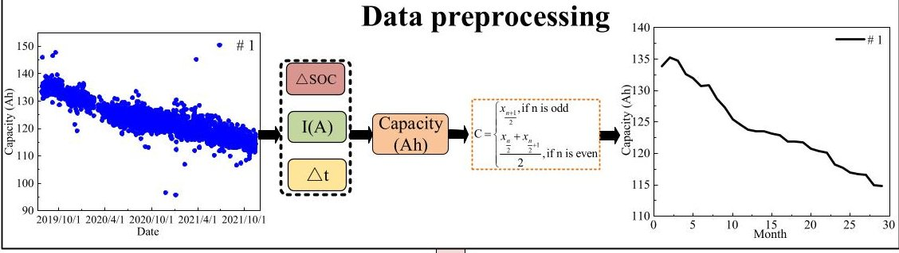

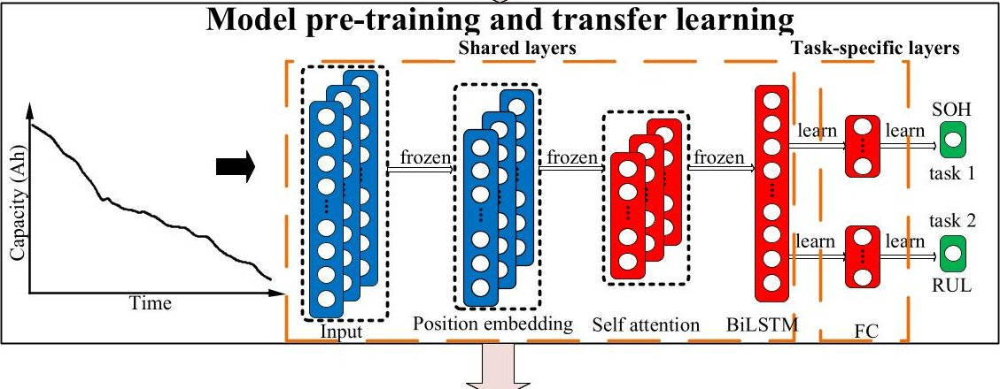

SOH and RUL prediction

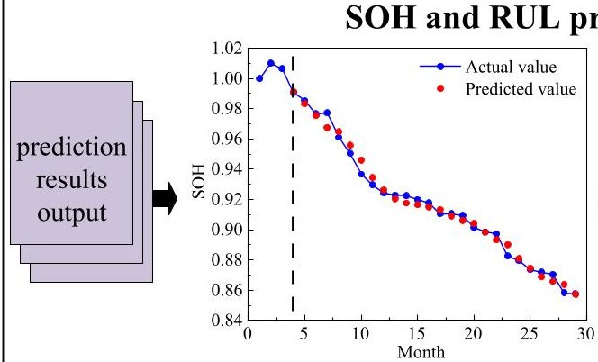

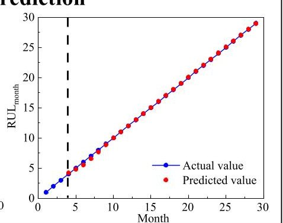

Figure 2. Overall model prediction framework.

and testing sets. Subsequently, the NRBO algorithm is utilized to optimize the model parameters, and the Transformer-BiLSTM network structure is constructed based on optimized parameters. The model can not only estimate the SOH and predict the RUL of the current battery but also transfer the weights of the pre-trained model to the corresponding layers of a new network through transfer learning after training, providing a good starting point for new tasks. Subsequently, a new network structure is created using the data of a battery as the training set, the training parameters for transfer learning are configured, and the transfer learning model is trained with the data of the new task. This process updates and adjusts the network weights to adapt to the data characteristics and prediction objectives of the new task. Finally, the model uses the predicted capacity of the target battery as new input to further achieve SOH estimation and RUL prediction of the target battery. This process requires only a small amount of data from the target battery to efficiently complete the SOH estimation and RUL prediction, significantly enhancing the model's generalization ability and prediction accuracy.

## 3.4 Evaluation metrics

To assess the effectiveness of the proposed method, absolute error (AE), mean absolute error (MAE), mean absolute percentage error (MAPE), root mean square error (RMSE), and coefficient of determination $ ( R^{2} ) $ are employed as evaluation metrics in this study. $ ^{35} $ Lower values of MAE, MAPE, and RMSE indicate higher accuracy of the method, while an $ R^{2} $ coefficient closer to 1 suggests better model fit. The calculation formulas are shown in Eqs. 13-17.

$$
A E = \left| \hat {y} _ {i} - y _ {i} \right|
$$

$$
M A E = \frac {1}{n} \sum_ {i = 1} ^ {n} \left| \hat {y} _ {i} - y _ {i} \right|
$$

$$
M A P E = \frac {1}{n} \sum_ {i = 1} ^ {n} \left| \frac {\hat {y} _ {i} - y _ {i}}{y _ {i}} \right| \times 100 \%
$$

$$
R M S E = \sqrt {\frac {1}{n} \sum_ {i = 1} ^ {n} \left(\hat {y} _ {i} - y _ {i}\right) ^ {2}}
$$

$$
R ^ {2} = 1 - \frac {\sum_ {i = 1} ^ {n} \left(y _ {i} - \hat {y} _ {i}\right) ^ {2}}{\sum_ {i = 1} ^ {n} \left(y _ {i} - \bar {y} _ {i}\right) ^ {2}}
$$

where $ y_{i} $ represents the actual capacity data, $ \hat{y}_{i} $ represents the predicted capacity data, $ \bar{y}_{i} $ represents the mean of the true capacity values, and n represents the number of cycles.

## 4. Results and Discussion

## 4.1 Data preprocessing

To extract the capacity trajectory of the battery for input into the model, it is necessary to calculate many capacity points in advance as markers. Based on the existing battery data, a trapezoidal numerical integration method is employed to estimate the accumulated charge, $ ^{36,37} $ calculating the actual capacity according to the change in state of charge (SOC), as shown in Eq. 18.

<!-- PDF_PAGE: 6 -->

$$
C = - \frac {\int_ {t 0} ^ {t 1} I (t) \Delta t}{S O C _ {t 1} - S O C _ {t 0}}
$$

where $ \Delta t $ represents the fixed sampling interval, I represent the battery current during the charging process, and $ t_{0} $ and $ t_{1} $ represent the start and end times of charging.

Since the calculation of battery capacity depends on the highprecision calculation of battery SOC to obtain accurate capacity, a larger SOC interval is required to avoid calculation errors. However, due to the lack of test data and key characteristics of the battery, it is difficult to obtain accurate SOC with negligible errors using advanced state estimation methods. The statistical mean or median of the capacity calculated over a period is used to obtain the marker capacity to address this issue, $ ^{29} $ which effectively excludes abnormal values caused by SOC errors or data noise as shown in Eq. 19.

$$
C = \left\{ \begin{array}{l l} \frac {x _ {\frac {n + 1}{2}}}{2}, \text {i f} n \text {i s o d d} \\ \frac {x _ {\frac {n}{2}} + x _ {\frac {n}{2} + 1}}{2}, \text {i f} n \text {i s e v e n} \end{array} \right.
$$

The initial capacities of the batteries in six electric vehicles are calculated in this study, as shown in Figs. 3a-3f, where a clear trend of capacity degradation can be observed. Due to SOC errors, short SOC intervals, data noise, and other reasons, the capacity calculated based on Eq. 18 contains many abnormal values, with numerous points fluctuating within the same month. It is not necessary to pay attention to the battery capacity of each charging process for vehicle applications, which is also difficult to obtain accurately. Since it is reasonable to monitor capacity changes monthly, the monthly statistical mean and median of the calculated capacity are derived. Battery capacity curves with a clear degradation trend are obtained through this operation. Since the mean is almost equal to the median, it indicates that the capacity points calculated within a month are symmetrically distributed, and both can effectively represent the degradation state of the battery system. Additionally, it can be observed that there are several local capacity recovery processes in these vehicle field data, which may be caused by different factors such as long rest periods and temperature changes. To suppress high-frequency disturbances arising from SOC drift, intermittent partial charges, and sensor noise, the raw capacity series is aggregated into monthly means, yielding a smoothed fleet-level trajectory suitable for long-term degradation tracking. The need for this monthly averaging and its limit—sudden capacity drops inside one month cannot be seen at once—are stated here. If a real-time alarm is needed later, either a more exact SOC method or extra health signals that are less sensitive to charge-measurement errors will have to be added.

Three batteries at different temperatures were selected from the NASA dataset, namely B0005, B0006, B0029, B0030, B0045, and B0046. The changes in discharge capacity of the batteries with cycle numbers at different temperatures are shown in Figs. 3g-3i. A rated capacity of 2.00 Ah is specified for the NASA batteries. An adaptive threshold is set based on the physical laws of lithium-ion battery cyclic aging, with the effective capacity window corresponding to 2.00 Ah-1.20 Ah before the SOH drops below 60 %. Any capacity points outside this range are identified as abnormal and removed automatically. It can be observed that batteries B0045 and B0046 have abnormal data points (capacity suddenly dropping to 0), which do not conform to physical laws or experimental conditions. To ensure the accuracy and reliability of the data, these abnormal data points were directly removed to avoid misleading subsequent analyses.

The LFP batteries used in the laboratory aging test was carried out at a 1/3C-rate (13.3 A) of CC charging to the upper limit module voltage of 14.6 V $ (3. 6 5 \mathrm{~ V} \times4) $ or a cell voltage of 3.75 V, followed by CV charging until a 1/30C-rate (1.33 A). After that, CC

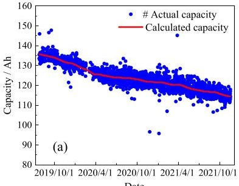

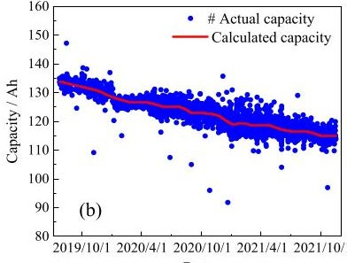

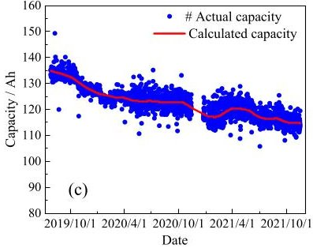

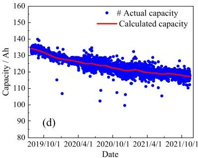

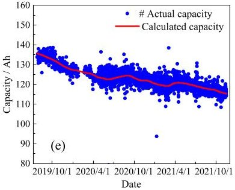

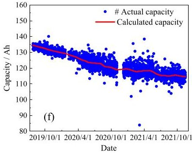

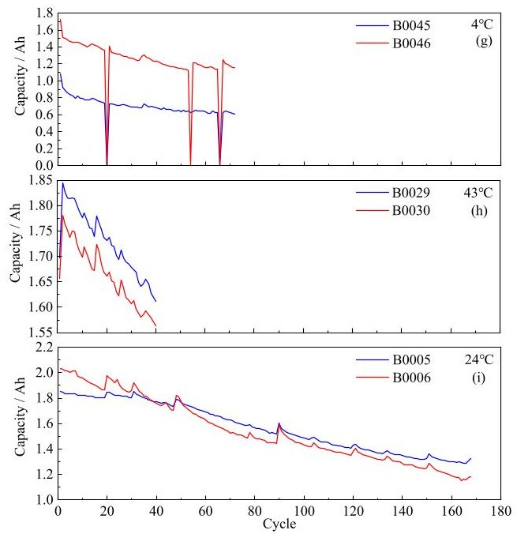

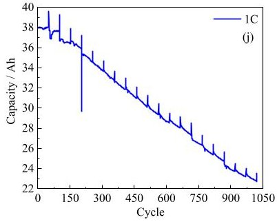

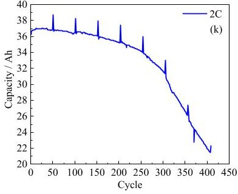

Figure 3. Initial capacity points and calculated capacity degradation curves for six electric vehicles (a-f), capacity degradation curves of NASA batteries at different temperatures (g-i) and capacity degradation curves of LFP batteries at different rates (j, k).

<!-- PDF_PAGE: 7 -->

discharging at a 1/3C-rate was applied to the module until the lower limit on the module voltage of $ 1 0. 8 \mathrm{~V} $ $ (2. 7 \mathrm{~V} \times4) $ or a cell voltage of 2.5 V. There was a 30-min rest between each charging and discharging step. The battery module test was conducted at room temperature of $ 2 5^{\circ} \mathrm{C} $ . Ageing cycles followed the same protocol, except that 1 C or 2 C rates were adopted. Every 100 cycles, a calibration cycle was inserted, and the test was terminated when SOH fell below 60 %. Data was logged at 1-min intervals. The changes in discharge capacity of the batteries with cycle numbers at different rates are shown on Figs. 3j-3k.

## 4.2 Model hyperparameter optimization

The impact of model hyperparameters on the model is significant, as they determine the training process and final performance of the model. Therefore, selecting appropriate hyperparameter values is crucial for the model. The changes in loss values corresponding to different hyperparameter configurations of the NRBO-TransformerBiLSTM model with increasing iterations are shown on Fig. 4. The learning rate, hidden-node count and regularization coefficient are mapped into a unified hyper-cube, after which the normalized random-block strategy is employed for global exploration during generations 0-150, whereby the learning-rate component is rapidly driven down to the $ 1 0^{-4} $ order. Upon completion of this phase, the TAO local search is triggered, within a Gaussian neighborhood of the incumbent best, along eight quasi-Newton directions, and a single Newton-Raphson correction is executed so that sub-grid convergence is achieved for both discrete and continuous variables. Termination is declared only when the difference between the best and the mean fitness is reduced below $ 1 \times 1 0^{-5} $ and 300 iterations have been completed, upon which the final population consensus $ 1 0^{-4}, $ 99, $ 1 0^{-3} $ is obtained, coinciding exactly with the loss valley in Fig. 4. The learning rate determines the magnitude of the model weights updated in each iteration. A too-high learning rate may prevent the model from converging near the optimal solution, while a too-low learning rate may lead to slow training or even entrapment in local optima. Analysis shows that the learning rate is mostly concentrated around $ 1 0^{-4} $ , with lower loss values, and the loss values tend to increase with higher learning rates. The number of hidden layer nodes affects the complexity of the model's learning ability. Too few nodes may lead to underfitting, failing to capture complex patterns in the data, while too many nodes may lead to overfitting. The analysis reveals that most hidden layer nodes have a loss value below 1, with the lowest loss value occurring at 99 nodes. Regularization is used to prevent model overfitting by adding a penalty term to the loss function to limit the model's complexity. A too-small regularization coefficient may be insufficient to prevent overfitting, while a too-large coefficient may lead to underfitting. When the number of hidden-layer nodes exceeds 99, the model becomes over-parameterized relative to the training-sample size; the original regularization coefficient can no longer restrain the weight

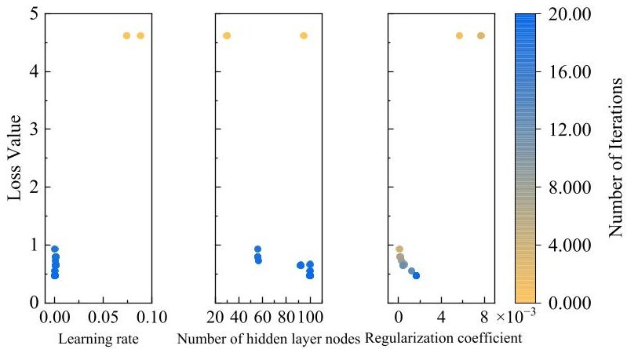

Figure 4. Loss values of model hyperparameters with increasing iterations.

norms, early stopping is activated prematurely, and both the loss rises and the iteration count drops. Analysis shows that when the regularization coefficient is within the range of 0.000 to 0.002, the loss values are mostly concentrated between 0 and 1, and the model converges fastest when the regularization coefficient is 0.0012.

## 4.3 Prediction results of NRBO-Transformer-BiLSTM model based on transfer learning

The NRBO-Transformer-BiLSTM model based on transfer learning (TNTB) is constructed to implement the transfer learning strategy to transfer parameters and retrain for specific tasks in this section. The model learns the degradation task of a complete battery and optimizes the weights of task-specific layers, enabling the developed model to learn the target battery data at a lower cost. The weights of some parts are frozen, and the model learns the degradation task of a new battery. The data of the seventh car will be selected as the source domain for transfer learning in this paper. To investigate the performance of the proposed method under different prediction starting points, experiments are conducted using the data of the first 8 months, the first 6 months, and the first 3 months as the training set. The comparison between the predicted and actual capacity values of the six electric vehicle batteries with the first 8 months as the starting point is shown in Figs. 5a-5f, with the first 6 months as the starting point in Figs. 5g-5l, and with the first 3 months as the starting point in Figs. 5m-5r. The error evaluation indicators for estimating SOH and predicting RUL are shown in Figs. 6a-6h, and the AE errors of the predicted capacity values under different prediction starting points are shown in Figs. 6i-6k. The results indicate that when using the first 3 months of data as model input, the average MAE and RMSE for estimating SOH of the six electric vehicle batteries reach 0.68 % and 0.71 %, respectively, and the average MAE and RMSE for predicting RUL reach 0.65 % and 0.70 %, respectively. It can be seen from Figs. 6a- 6h that with the decrease in training data, the prediction accuracy does not significantly decline. For different prediction starting points, the future capacity trajectory can be accurately predicted, which verifies the strong robustness of the proposed method.

## 4.4 Validation with the same dataset using different methods

In the comparative study of lithium-ion battery SOH and RUL prediction errors on the electric vehicle battery dataset, the performance of different models is shown in Figs. 7a-7d. When estimating SOH, the MAE range for models without the NRBO optimization algorithm was 0.71%-1.96% and the RMSE range was 0.86%-2.30%. After introducing the NRBO optimization algorithm, the MAE range decreased to 0.47%-1.24% and the RMSE range decreased to 0.51%-1.43%. Calculations showed that the introduction of the NRBO algorithm reduced the MAE by 33.80%-36.73% and the RMSE by 37.83%-40.69%. In RUL prediction, the MAE range for models without the NRBO optimization algorithm was 0.79%-1.60% and the RMSE range was 0.96%-1.83%. After introducing the NRBO optimization algorithm, the MAE decreased to 0.48%-1.17% and the RMSE decreased to 0.56%-1.44%. Calculations showed that the introduction of the NRBO algorithm reduced the MAE by 26.88%- 39.24% and the RMSE by 21.31%-41.67%. Analysis indicated that using a single Transformer model or BiLSTM model for prediction resulted in significantly larger errors. The introduction of the NRBO optimization algorithm significantly improved prediction accuracy. Furthermore, when the NRBO optimization algorithm was combined with transfer learning, not only was the prediction accuracy improved, but also the ability to estimate SOH and predict RUL for other batteries by learning the data structure of a single battery was achieved.

Besides the NRBO-enhanced NRBO-Transformer-BiLSTM (NTB), we also evaluated a variant whose optimizer was replaced

<!-- PDF_PAGE: 8 -->

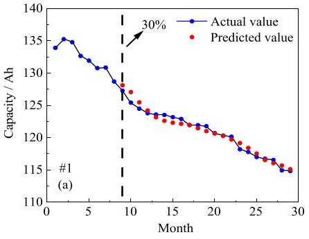

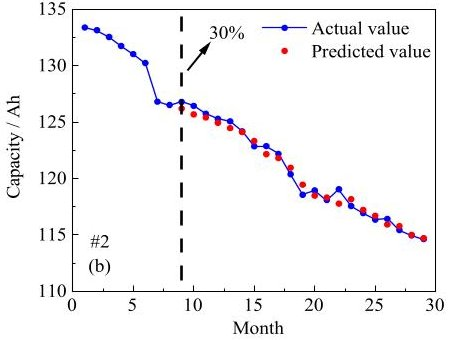

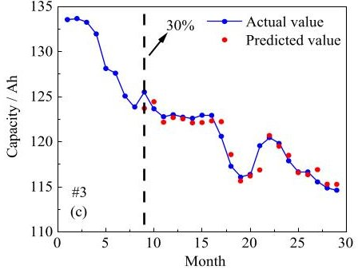

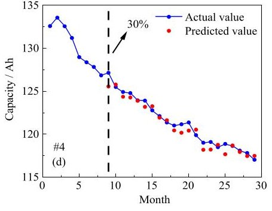

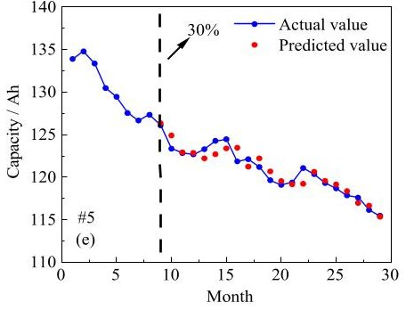

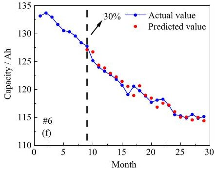

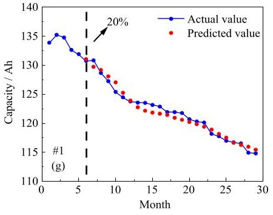

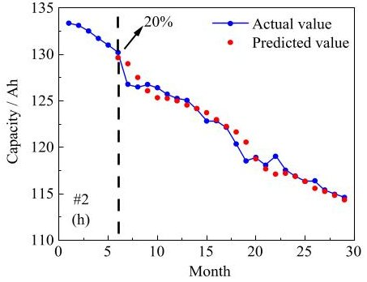

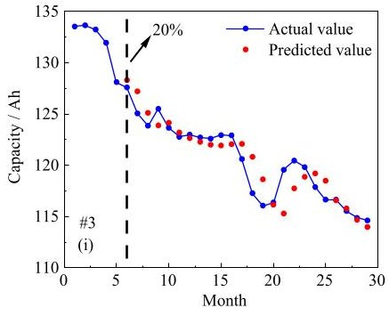

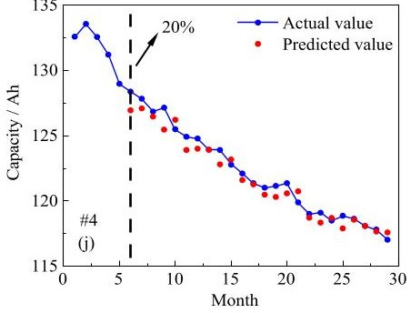

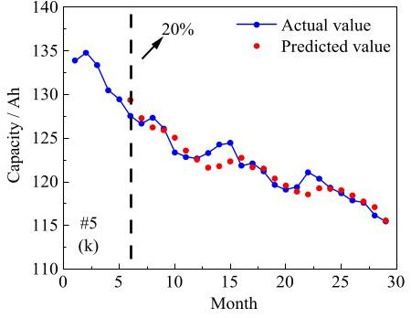

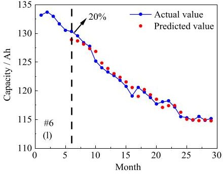

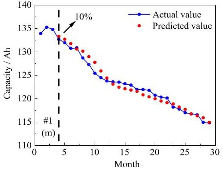

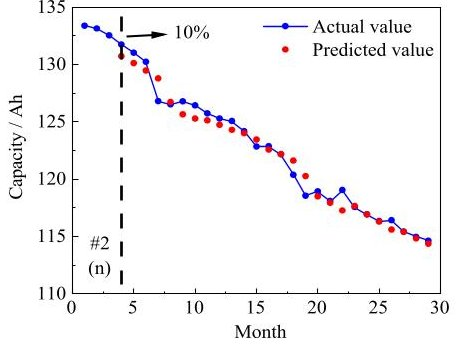

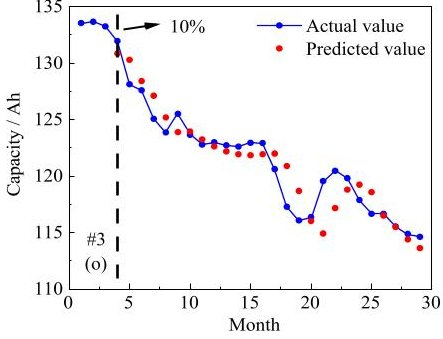

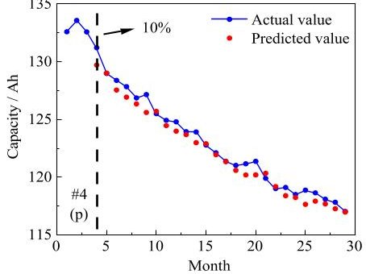

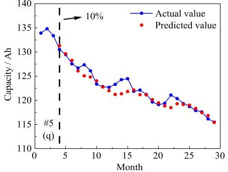

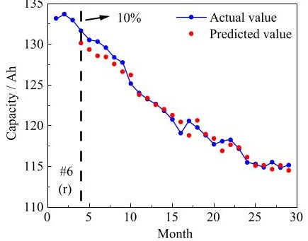

Figure 5. Comparison of measured and predicted capacity for six electric vehicle batteries using starting points of 3 (m-r), 6 (g-l), and 8 (a-f) months prior.

<!-- PDF_PAGE: 9 -->

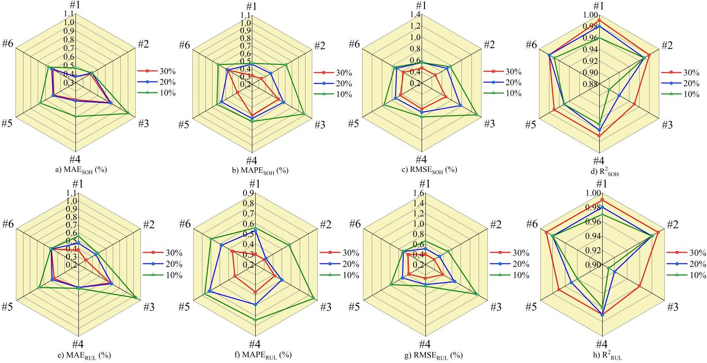

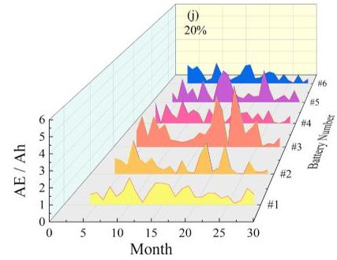

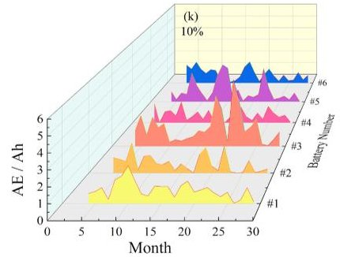

Figure 6. Radar chart of estimating SOH (a-d) and predicting RUL (e-h) error metrics at different prediction starting points and AE errors of predicted capacity values for six electric vehicle batteries with different prediction starting points (i-k).

by the Particle Swarm Optimization (PSO) algorithm; this configuration is denoted as PSO-Transformer-BiLSTM (PTB). Figures 7a- 7d compares the error distributions of PTB and NTB on the same battery dataset. For SOH estimation, PTB delivers a MAE span of 0.62%-1.55% and an RMSE span of 0.74%-1.89% whereas NTB narrows these ranges to 0.47%-1.24% and 0.51%-1.43% respectively, cutting the average MAE and RMSE by a further 21.3% and 27.8%. The same trend holds for RUL prediction: PTB produces a MAE of 0.59%-1.38% and an RMSE of 0.71%-1.62% while NTB reduces both metrics to 0.48%-1.17% and 0.56%-1.44% corresponding to additional reductions of 17.6% and 20.4% These results verify that, although PSO alone already outperforms the vanilla Transformer or BiLSTM, the NRBO optimizer still yields statistically significant gains over PSO, confirming its superior exploration ability in the high-dimensional parameter space of battery state forecasting.

The distribution of MAE and RMSE for different models when estimating SOH and predicting RUL is illustrated in Figs. 7e-7h. Among the five candidates, the TNTB framework again achieves the lowest MAE/RMSE and the narrowest error variance, confirming its best prediction accuracy and stability. Overall, TNTB maintains the strongest robustness and generalization capability across diverse temperature and operating profiles.

To verify the reduced computational cost of the proposed model, the computational overheads of the three models were evaluated on the same dataset under an identical hardware environment, with all results being reported as the mean $ \pm $ standard deviation after five

runs, as given in Table 2. The metric "Total Computation", defined as the product of the iterations required for convergence and the time per iteration, is employed to comprehensively represent the cumulative floating-point runtime until a preset validation-loss threshold is reached. It is shown that, while the time per iteration is kept almost unchanged, the TNTB model is driven to $ 1 6. 3 \times1 0^{3} $ iterations, yielding a total computation of only $ 1 4. 5 \times1 0^{3} \mathrm{s} $ reductions of 34.1 % and 52.3 % are achieved compared with the standalone model and the PSO-enhanced variant, respectively. In addition, the lowest GPU peak memory footprint and the shortest training duration are recorded for TNTB. Collectively, it is demonstrated that the overall computational load and memory overhead can be significantly reduced without increasing the per-step cost, confirming the superior convergence efficiency and resource economy of the proposed model in a high-dimensional parameter space.

## 4.5 Validation with different datasets using the same method

Two batteries were selected from each temperature group, and battery B0007, B0031 and B0047 were chosen as the source domain for transfer learning. The first 10% of the data from the target battery was used as the training set to perform SOH estimation and RUL prediction tasks for the target battery. The comparison between the actual and predicted capacity values is shown in Figs. 8a-8f, and the error indicators for estimating SOH and predicting RUL are shown in Table 3. However, due to the limited cycle numbers of batteries B0029, B0030, B0045, and B0046, the model's learning of

<!-- PDF_PAGE: 10 -->

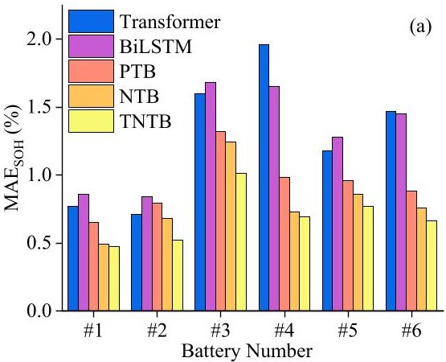

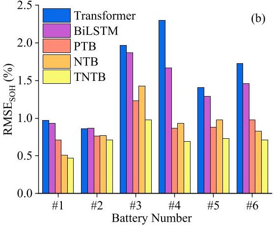

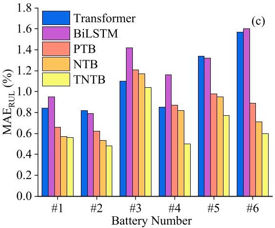

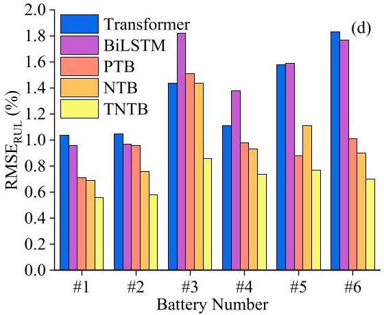

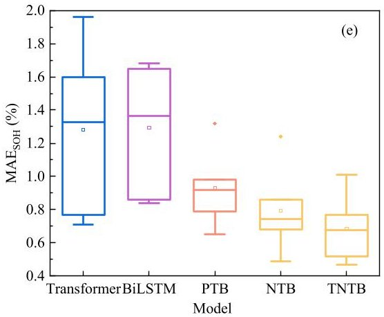

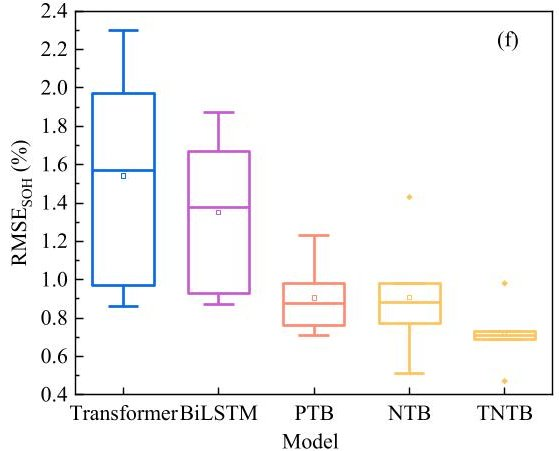

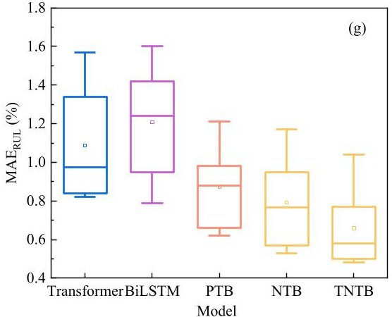

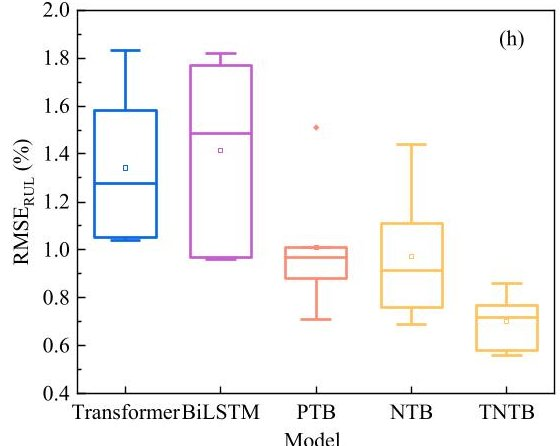

Figure 7. Comparison of MAE and RMSE for estimating SOH and predicting RUL of six batteries using different models (a-d) and boxplots of MAE and RMSE for different models (e-h).

these samples was insufficient, which affected the prediction accuracy and resulted in relatively larger prediction errors for these four batteries. Nevertheless, the errors were still less than 0.2%

It can be seen that the MAE and RMSE for estimating SOH and predicting RUL are both less than 0.2 %, and the $ R^{2} $ values are all above 0.94 from Table 3. The main reasons for the lower prediction accuracy are twofold: 1) Low or high temperatures affect battery life, resulting in insufficient cycle numbers in the dataset, which

affects the distribution of samples and reduces the accuracy of the developed model; 2) Due to the implementation of fast-charging policies, short-life batteries face complex degradation mechanisms, such as the loss of negative electrode active materials, which increases the demands on model performance. However, the prediction results of the established model still show high precision, which proves that the model proposed in this paper has excellent prediction accuracy and stability on the NASA dataset.

<!-- PDF_PAGE: 11 -->

Table 2. The computational overheads of the three models were evaluated on the electric-vehicle battery dataset under an identical hardware environment.

<table border="1"><tr><td>Model</td><td>Training Time (h)</td><td>Single-iteration Time(s)</td><td>GPU Peak Memory(GB)</td><td>Iterations to Convergence</td><td>Total Computation</td></tr><tr><td>Transformer-BiLSTM</td><td>6.12±0.18</td><td>0.91±0.02</td><td>6.87±0.05</td><td>24200±650</td><td>22.02±0.59</td></tr><tr><td>PSO-Transformer-BiLSTM</td><td>8.45±0.22</td><td>0.93±0.02</td><td>7.01±0.04</td><td>32700±1100</td><td>30.41±1.02</td></tr><tr><td>TNTB</td><td>4.03±0.11</td><td>0.89±0.01</td><td>6.72±0.03</td><td>16300±380</td><td>14.51±0.34</td></tr></table>

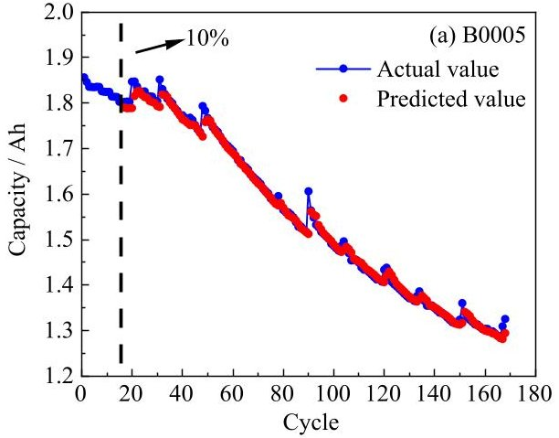

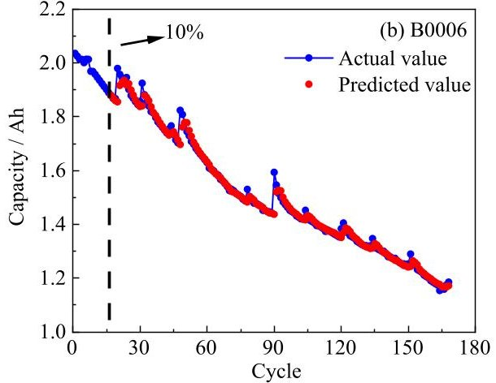

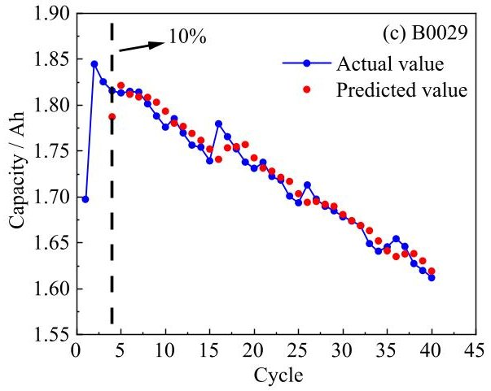

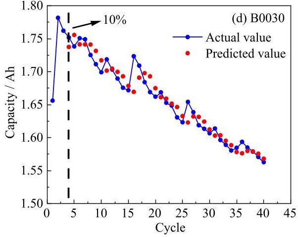

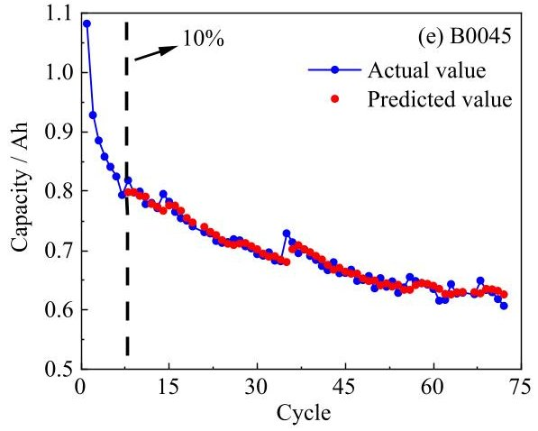

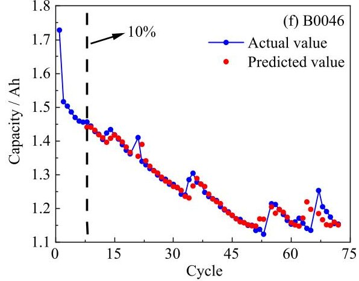

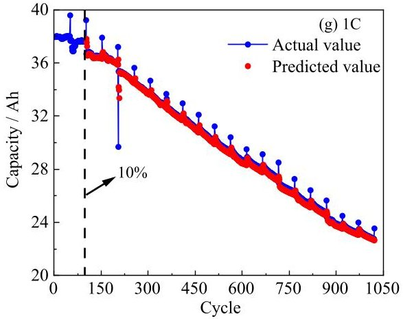

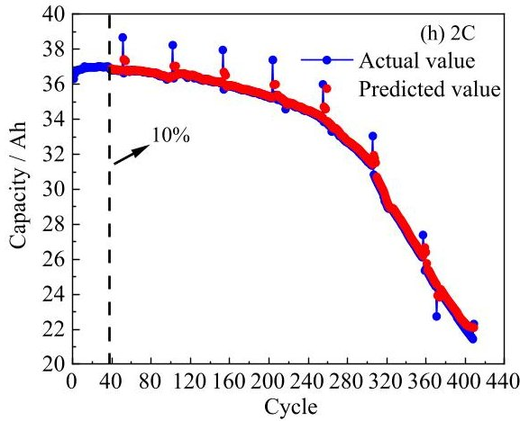

Figure 8. Comparison of actual and predicted capacity values for NASA batteries at different temperatures (a-f) and comparison of measured and predicted capacities for the LFP module at various C-rates (g-h).

<!-- PDF_PAGE: 12 -->

Table 3. Error evaluation indicators for estimating SOH and predicting RUL of NASA batteries using the TNTB model.

<table border="1"><tr><td>Prediction Index</td><td>Temperature(℃)</td><td>Battery Model</td><td>MAE(%)</td><td>MAPE(%)</td><td>RMSE(%)</td><td>R2</td></tr><tr><td rowspan="7">SOH</td><td>24</td><td>B0005</td><td>0.13</td><td>0.14</td><td>0.16</td><td>0.99</td></tr><tr><td>24</td><td>B0006</td><td>0.10</td><td>0.11</td><td>0.19</td><td>0.99</td></tr><tr><td>43</td><td>B0029</td><td>0.32</td><td>0.35</td><td>0.33</td><td>0.96</td></tr><tr><td>43</td><td>B0030</td><td>0.45</td><td>0.46</td><td>0.51</td><td>0.95</td></tr><tr><td>4</td><td>B0045</td><td>0.17</td><td>0.18</td><td>0.27</td><td>0.97</td></tr><tr><td>4</td><td>B0046</td><td>0.23</td><td>0.24</td><td>0.30</td><td>0.96</td></tr><tr><td rowspan="7">RUL</td><td>24</td><td>B0005</td><td>0.16</td><td>0.16</td><td>0.18</td><td>0.99</td></tr><tr><td>24</td><td>B0006</td><td>0.14</td><td>0.15</td><td>0.19</td><td>0.99</td></tr><tr><td>43</td><td>B0029</td><td>0.43</td><td>0.44</td><td>0.54</td><td>0.96</td></tr><tr><td>43</td><td>B0030</td><td>0.47</td><td>0.47</td><td>0.58</td><td>0.94</td></tr><tr><td>4</td><td>B0045</td><td>0.22</td><td>0.22</td><td>0.25</td><td>0.97</td></tr><tr><td>4</td><td>B0046</td><td>0.30</td><td>0.31</td><td>0.35</td><td>0.96</td></tr></table>

Table 4. Error evaluation indicators for estimating SOH and predicting RUL of LFP batteries using the TNTB model.

<table border="1"><tr><td>Prediction Index</td><td>Charge/Discharge Rate</td><td>MAE(%)</td><td>MAPE(%)</td><td>RMSE(%)</td><td>R2</td></tr><tr><td rowspan="2">SOH</td><td>1C</td><td>0.52</td><td>0.59</td><td>1.06</td><td>0.99</td></tr><tr><td>2C</td><td>0.58</td><td>0.79</td><td>1.09</td><td>0.99</td></tr><tr><td rowspan="2">RUL</td><td>1C</td><td>0.56</td><td>0.59</td><td>0.98</td><td>0.99</td></tr><tr><td>2C</td><td>0.54</td><td>0.62</td><td>1.03</td><td>0.99</td></tr></table>

EV battery data were taken as the source domain; the first 10% of the 1C or 2C datasets were fed to the model for SOH estimation and RUL prediction. The capacity forecasts at each rate are plotted in Figs. 8g-8h, while the error metrics are listed in Table 4. Although the intrinsic capacity rebound of LFP chemistry causes a slight accuracy to drop, an error below 1.1% is still achieved, confirming that the TNTB model retains high adaptability across heterogeneous battery types.

## 4.6 Comparison with other methods

To demonstrate the performance of the developed model, the error indicators of the proposed method are compared with those of other methods based on the same dataset, as shown in Table 5. Deng et al. $ ^{29} $ used a Seq2Seq model combined with a Gaussian process regression (GPR) residual model to obtain accurate battery capacity prediction results, effectively capturing the overall degradation trend of battery capacity, while the GPR model compensated for local capacity changes. The model's predicted battery capacity achieved MAE and RMSE of 1.21% and 1.52% , respectively. An MAE reduction of 61.16% and an RMSE reduction of 63.16% are achieved by the model developed in this paper. Wang et al. $ ^{38} $ extracted a linear trend from capacity degradation data, used a nonlinear relationship to predict the residuals of the time series, and established an ARIMA-LSTM hybrid model to predict the RUL of lithium-ion batteries. The predicted MAE and RMSE for RUL both exceeded 1%. In contrast, the model developed in this study can predict both RUL and SOH, with MAE and RMSE for RUL prediction at 0.16% and 0.18% , respectively, which are significantly lower than those of the model proposed in reference. The reference used 55% of the total cycles for prediction, while the model developed in this study achieved high-precision prediction using only 10% of the dataset. Ma et al. $ ^{39} $ developed a DEGWO

Table 5. Comparison of error indicators with other methods.

<table border="1"><tr><td rowspan="2">Method</td><td rowspan="2">Battery number</td><td colspan="2">SOH</td><td colspan="2">RUL</td><td rowspan="2">Reference</td></tr><tr><td>MAE(%)</td><td>RMSE(%)</td><td>MAE(%)</td><td>RMSE(%)</td></tr><tr><td>Seq2Seq-GPR</td><td>NCM</td><td>1.21</td><td>1.52</td><td>—</td><td>—</td><td>29</td></tr><tr><td>DEGWO-LSTM</td><td>NCA</td><td>0.15</td><td>0.10</td><td>—</td><td>—</td><td>39</td></tr><tr><td>LSTM-TL</td><td>NCA</td><td>0.94</td><td>1.20</td><td>—</td><td>—</td><td>40</td></tr><tr><td>ARIMA-LSTM</td><td>NCA</td><td>—</td><td>—</td><td>1.29</td><td>1.74</td><td>38</td></tr><tr><td>TM-Seq2Seq</td><td>LFP</td><td>—</td><td>—</td><td>12.25</td><td>16.1</td><td>41</td></tr><tr><td>TNTB</td><td>LFP</td><td>0.52</td><td>0.59</td><td>0.56</td><td>0.59</td><td>This work</td></tr><tr><td>TNTB</td><td>NCM</td><td>0.47</td><td>0.56</td><td>0.56</td><td>0.66</td><td>This work</td></tr><tr><td>TNTB</td><td>NCA</td><td>0.13</td><td>0.16</td><td>0.16</td><td>0.18</td><td>This work</td></tr></table>

algorithm to optimize the LSTM model, using 50 % of the dataset for training. However, after training with only 10 % of the dataset, the MAE and RMSE of the model developed in this study reached 0.16 % and 0.18 %, respectively, which is significantly higher in prediction accuracy than the method proposed in reference.

Deng et al. $ ^{40} $ used an unsupervised learning method (K-means) to automatically classify battery cells into three degradation phases (short, medium, and long life) and determine reference units for each category. An LSTM network was used to build an SOH estimation model, and a transfer learning strategy was proposed to improve estimation accuracy using early aging data of batteries. Compared with this method, the model's MAE developed in this study based on transfer learning was reduced by 86.17 %, and the RMSE was reduced by 86.67 %. Han et al. $ ^{41} $ presented a TM-Seq2Seq architecture that integrates CNN, SE-net and GRU to predict the entire capacity-fade curve of LFP cells after only the first 100 cycles, achieving an MAE of 77.04 cycles and an RMSE of 101.34 cycles. The proposed TNTB model in this paper, in which cross-battery transfer learning is adopted and merely the first 10 % of LFP data is required to forecast the subsequent degradation trajectory. All errors are kept below 1.1 %, and strong adaptability across different battery types is thereby demonstrated.

## 5. Conclusions

A model based on transfer learning, NRBO-TransformerBiLSTM, is proposed in this study to simultaneously estimate the SOH and predict the RUL of batteries. The conclusions are as follows.

(1) Compared with standalone Transformer or BiLSTM models, the introduced NRBO algorithm reduces RMSE by 37.83% 40.69% for SOH estimation and 21.31% 41.67% for RUL prediction, while the proposed model captures capacity-rebound and degradation dynamics more accurately, avoids local optima, and improves prediction accuracy.

(2) Transfer-learning-driven rapid domain adaptation and enhanced generalization are demonstrated in this study, with merely the initial 10 % of target-domain samples, the proposed model keeps both MAE and RMSE under 1 % for SOH and RUL tasks, outperforming comparative approaches that demand substantially more data.

(3) The proposed NRBO-Transformer-BiLSTM concurrently estimates SOH and predicts RUL, exhibiting low starting-point sensitivity and strong generalization. Validated across chemistries (NCA/NCM/LFP), temperatures $ (4^{\circ} \mathrm{C}, 24^{\circ} \mathrm{C} $ and $ 43^{\circ} \mathrm{C} $), and different operating regimes, it achieves less than $ 1 \% $ MAE/RMSE for both intra- and inter-chemistry transfer, demonstrating robust universality under steady and dynamic conditions.

<!-- PDF_PAGE: 13 -->

## Acronyms

SOH State of health

RUL Remaining useful life

EOL End of life

CC Constant current

CV Constant voltage

BiLSTM Bidirectional long short-term memory

NRBO Newton-Raphson-based optimizer algorithm

MAE Mean absolute error

NCM Nickel-Cobalt-Manganese

NCA Nickel-Cobalt-Aluminum

LFP $ \mathrm{L i F e P O_{4}} $

CAN Controller area network

RNN Recurrent neural network

FFN Feed-forward network

AE Absolute error

MAPE Mean absolute percentage error

SOC State of charge

## Acknowledgments

This work was sponsored by the Science and Technology Commission of Shanghai Municipality (19DZ2271100), Inner Mongolia Autonomous Region Science and Technology "Breakthrough" Engineering "Unveiling and Leading" Project (2025KJTW0008) and Shanghai Key Laboratory of Materials Protection and Advanced Materials in Electric Power, China.

## CRediT Authorship Contribution Statement

Bingyao Zhang: Conceptualization (Lead)

Huimin Ma: Data curation (Lead)

Qiaozhen Ji: Formal analysis (Lead)

Hongliang Hao: Resources (Lead)

Zijie Fei: Data curation (Lead)

Jiayi Jin: Data curation (Lead)

Qiangqiang Liao: Writing - review & editing (Lead)

Fei Wang: Data curation (Lead)

The authors declare that they have no known competing financial interests or personal relationships that could have appeared to influence the work reported in this paper.

## Conflict of Interest

## Funding

Science and Technology Commission of Shanghai Municipality:19DZ2271100 Inner Mongolia University of Science and Technology:2025KJTW0008 Shanghai Key Laboratory of Materials Protection and Advanced Materials in Electric Power

## References

1. X. Zhao, J. Hu, G. Hu, and H. Qiu, J. Energy Storage, 63, 107031 (2023).

2. J. Tian, Y. Wang, C. Liu, and Z. Chen, Energy, 194, 116944 (2020).

3. M. Corno and G. Pozzato, IEEE Trans. Vehicular Technol., 69, 258 (2020).

4. J. Zhu, Y. Wang, Y. Huang, R. B. Gopaluni, Y. Cao, M. Heere, M. J. Mühlbauer, L. Mereacre, H. Dai, X. Liu, A. Senyshyn, X. Wei, M. Knapp, and H. Ehrenberg, Nat. Commun., 13, 2261 (2022).

5. J. Wen, X. Chen, X. Li, and Y. Li, Energy, 261, 125234 (2022).

6. D. Zhou, Z. Li, J. Zhu, H. Zhang, and L. Hou, IEEE Access, 8, 53307 (2020).

7. C.-P. Lin, J. Cabrera, F. Yang, M.-H. Ling, K.-L. Tsui, and S.-J. Bae, Appl. Energy, 275, 115338 (2020).

8. X. Li, C. Yuan, and Z. Wang, J. Power Sources, 467, 228358 (2020).

9. S. Jia, B. Ma, W. Guo, and Z. S. Li, J. Manuf. Syst., 61, 773 (2021).

10. J. Liu and Z. Chen, IEEE Access, 7, 39474 (2019).

11. S. Saraygord Afshari, S. Cui, X. Xu, and X. Liang, IEEE Trans. Instrum. Meas., 71, 6500709 (2021).

12. S. Fu, S. Tao, H. Fan, K. He, X. Liu, Y. Tao, J. Zuo, X. Zhang, Y. Wang, and Y. Sun, Appl. Energy, 353, 121991 (2024).

13. W. Li, Z. Jiao, L. Du, W. Fan, and Y. Zhu, Int. J. Hydrogen Energy, 44, 12270 (2019).

14. Q. Li, T. Lu, C. Lai, J. Li, L. Pan, C. Ma, Y. Zhu, and J. Xie, Energy, 290, 130208 (2024).

15. T. Sun, R. Wu, Y. Cui, and Y. Zheng, J. Energy Storage, 39, 102594 (2021).

16. G. Fan, B. Zhou, S. Ye, H. Shen, D. Huo, and X. Zhang, J. Energy Storage, 102, 114086 (2024).

17. Q. Yu, Y. Nie, S. Guo, J. Li, and C. Zhang, Appl. Energy, 375, 124165 (2024).

18. S. G. Chae, S. J. Bae, and K.-Y. Oh, J. Energy Storage, 106, 114826 (2025).

19. A. S. Akram, M. Sohaib, and W. Choi, Batteries, 11, 183 (2025).

20. Y. Li, K. Li, X. Liu, Y. Wang, and L. Zhang, Appl. Energy, 285, 116410 (2021).

21. P. Yang, H. D. Yang, X. B. Meng, C. R. Song, T. L. He, J. Y. Cai, Y. Y. Xie, and K. K. Xu, J. Energy Storage, 75, 109741 (2024).

22. G. Ma, S. Xu, B. Jiang, C. Cheng, X. Yang, Y. Shen, T. Yang, Y. Huang, H. Ding, and Y. Yuan, Energy Environ. Sci., 15, 4083 (2022).

23. Y. Zhou, M. Zhang, J. Zhu, R. Zheng, and Q. Wu, Neural Comput. Appl., 32, 12671 (2020).

24. J.-P. van Zyl and A. P. Engelbrecht, Mathematics, 11, 2980 (2023).

25. M.-Y. Zhou, J.-B. Zhang, C.-J. Ko, and K.-C. Chen, J. Power Sources, 553, 232295 (2023).

26. X. Li, D. Yu, S. B. Vilsen, and D. I. Stroe, J. Energy Chem., 92, 591 (2024).

27. D. Fioriti, C. Scarpelli, L. Pellegrino, G. Lutzemberger, E. Micolano, and S. Salamone, J. Energy Storage, 59, 106458 (2023).

28. S. Shen, M. Sadoughi, M. Li, Z. Wang, and C. Hu, Appl. Energy, 260, 114296 (2020).

29. Z. Deng, L. Xu, H. Liu, X. Hu, Z. Duan, and Y. Xu, Appl. Energy, 339, 120954 (2023).

30. Z. Li, X. Zhang, and W. Gao, Energy, 311, 133418 (2024).

31. R. Sowmya, M. Premkumar, and P. Jangir, Eng. Appl. Artif. Intell., 128, 107532 (2024).

32. J. Tian, S. Li, X. Liu, and P. Wang, Energy Rep., 8, 81 (2022).

33. C. Jia, Y. Tian, Y. Shi, J. Jia, J. Wen, and J. Zeng, Energy, 285, 129401 (2023).

34. S. Kim, Y. Y. Choi, K. J. Kim, and J. I. Choi, J. Energy Storage, 41, 102893 (2021).

35. P. H. Li, Z. J. Zhang, Q. Y. Xiong, B. C. Ding, J. Hou, D. C. Luo, Y. J. Rong, and S. Y. Li, J. Power Sources, 459, 228069 (2020).

36. J. H. Meng, L. Cai, D. I. Stroe, G. Z. Luo, X. Sui, and R. Teodorescu, Energy, 185, 1054 (2019).

37. A. Farmann, W. Waag, A. Marongiu, and D. U. Sauer, J. Power Sources, 281, 114 (2015).

38. H. Y. Wang, C. Y. Hei, H. Liu, S. D. Zhang, and J. G. Wang, IEEE Trans. Power Electron., 38, 1054 (2023).

39. Y. Ma, C. Shan, J. W. Gao, and H. Chen, Energy, 251, 123973 (2022).

40. Z. W. Deng, X. K. Lin, J. W. Cai, and X. S. Hu, J. Power Sources, 525, 231027 (2022).

41. X. Han, Z. Dai, M. Ren, J. Cui, and Y. Shi, Batteries, 10, 74 (2024).